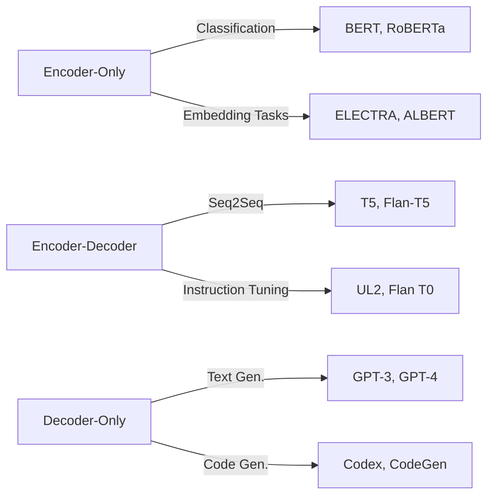

# Report: Leveraging Large Language Models (LLMs) for Trend Tracking in Technology, Science, Academia, and Industry

## Title

Harnessing Large Language Models for Multi-Sector Trend Monitoring: AI, IT, and Blockchain

## Introduction

Purpose
This report evaluates how Large Language Models (LLMs) can track and forecast trends across technology, science, academia, and industry—focusing on AI, IT, and Blockchain. It provides a multi-dimensional SWOT, competitor/product review, and technical analysis; recounts key historical milestones; extracts patterns to predict future trends; and offers quantitative and qualitative decision guidance, best practices, and actionable recommendations.

Assumptions

- Reliable, publicly available model and tool data.
- Major LLM evolutions follow transformer-based timelines.
- Competitive landscape in “LLM tracking” tools is representative of broader LLM utility.


## 1. Historical Context and Evolution

### 1.1 Key Origins and Milestones

Merlin’s timeline of LLM innovation traces AI’s lineage from foundational AI concepts (Turing’s 1947 “Intelligent Machinery”) through chatbots (ELIZA, 1966), statistical and neural language models (1990s–2012), to transformers (2017) and generative LLMs (GPT-1 in 2018, GPT-3 in 2020, GPT-4 in 2023) [LifeArchitect Timeline][LA].

### 1.2 Industry Crises and Accidents

- **AI Winters (1973–80, 1988–93)** reduced funding for rule-based NLP.
- **2016 Microsoft Tay** demonstrated risks of on-line learning without robust filtering.
- **2023 OpenAI GPT-4 Hallucination Incident** highlighted high-stakes trust issues in enterprise applications.


## 2. Multi-Dimensional SWOT Analysis

| Strengths | Weaknesses | Opportunities | Threats |
| :-- | :-- | :-- | :-- |
| -  **Scalability \& Versatility:** Handle zero-, few-, and fine-tuning across domains; multimodal integration (text/image/audio) [Irshad 2024][IrshadSWOT]. | -  **Bias \& Hallucinations:** Risk of disinformation; societal biases in training corpora; regulatory scrutiny [Resnik 2024]. | -  **Cross-Sector Trend Analysis:** Holistic monitoring of AI/IT/Blockchain discourse across research, patents, social media, and industry reports. | -  **Regulatory \& Privacy Risks:** Data-protection laws (GDPR, CCPA) constrain data ingestion; IP infringement in scraped training data; model output liability. |
| -  **Rapid Innovation Cycle:** Continuous improvements (GPT-3→4→4.5), reducing latency and expanding context windows. | -  **Compute \& Cost Intensity:** Training and inference require specialized GPUs/TPUs; carbon footprint concerns [Wang 2023]. | -  **Enterprise LLM Observability:** Growth of specialized tracking platforms enabling brand visibility in AI-driven search (Peec AI, Semrush AIO). | -  **Competitor Saturation \& Pricing Pressure:** Tools market fragmentation risks commoditization and feature parity, reducing user switching costs. |
| -  **Cross-Model Interoperability:** Retrieval-augmented models can integrate proprietary knowledge bases, enhancing domain specificity [Wang 2024]. | -  **Data Quality \& Coverage Gaps:** Limited access to proprietary or pay-walled academic/industry sources; uneven representation of Asia-Pacific literature. | -  **Blockchain Trend Forecasting:** On-chain data analysis with LLMs can predict DeFi/Token activity; early detection of security exploits through developer discussions. | -  **Model Misuse \& Security Threats:** Phishing, deepfakes, or automated misinformation via social engineering leveraging LLM outputs. |
| -  **Natural Language Interfaces:** Democratizes data querying for non-technical stakeholders in R\&D, investing, and policy environments. | -  **Interpretability \& Explainability:** Black-box nature complicates compliance and auditability. | -  **Hybrid AI Ecosystems:** Integration with knowledge graphs, semantic search, and BI pipelines for real-time decision-making dashboards. | -  **Emerging Model Regulations:** Proposed EU AI Act and China AI Rules impose stringent risk-based requirements for “high risk” applications, impacting deployment timelines. |

## 3. Competitor and Product Analysis

### 3.1 Leading LLM Tracking \& Observability Platforms

| Tool | Focus | Key Features | Pricing |
| :-- | :-- | :-- | :-- |
| Peec AI | Multi–LLM brand visibility | Brand visibility metrics, sentiment analysis, cross-model benchmarking, RAG influence tracking | €89–€499+/mo[ClickUp][^1] |
| Semrush AIO | Hybrid brand \& technical observability | API latency, token cost monitoring, share-of-voice vs competitors, technical health dashboards | \$99+/mo domain[^2] |
| Profound | Enterprise AI search analytics | Source-level citation analysis, competitive ranking, customizable alerting | \$499+/mo |
| Trakkr AI | Startups \& testing | Real-time multi-LLM alerts, founder support | Free Beta |
| Scrunch AI | Persona insights | Persona mapping, brand safety, real-time monitoring | \$300/mo |
| LakeFS LLM Observability | Technical API-centric monitoring | Token usage, error rates, hallucination alerts | Contact sales[^3] |

### 3.2 Ranking of Platforms by Output Quality

1. **Peec AI** (Best overall multi-LLM tracking)
2. **Semrush AIO** (Comprehensive brand \& technical observability)
3. **Profound** (Enterprise analytics)
4. **Scrunch AI** (Persona-focused insights)
5. **Trakkr AI** (Entry-level multi-LLM testing)

## 4. Technical Architecture and Evolution

### 4.1 Transformer Foundations

- **Self-Attention \& Parallelism:** Replaced RNN/LSTM sequential constraints, enabling long-range dependency modeling at scale [Vaswani 2017].
- **Positional Encodings:** Sine-cosine functions ensure order sensitivity without recurrence [Wang 2024][LLMSurvey].
- **Masked Multi-Head Attention:** Autoregressive decoding for text generation (GPT-3) vs. bi-directional encoding for understanding (BERT).


### 4.2 Model Taxonomy




### 4.3 Parameter Scaling and Compute Trends

- Doubling compute every 3.4 months from 2012–2022 → 300,000× increase [OpenAI compute report].
- GPT-3 (175B params, 570 GB data) → GPT-4 (1.76 T tokens, multimodal) → GPT-4.5 (latent mixture of experts).


## 5. Pattern Synthesis \& Future Trend Forecasting

### 5.1 Historical Pattern Insights

- **Infrastructure → Scale → Alignment**: 2017–2020 afforded scale via transformers; 2021–2023 pivoted to alignment (RLHF, instruction tuning).
- **Monolithic → Modular**: Shift toward Mixture-of-Experts and retrieval-augmented pipelines for cost efficiency.


### 5.2 Industrial-Level Problems \& Solutions

- **Problem:** Model hallucinations in high-stakes sectors (finance, legal).
Solution: Guardrails via retrieval-augmented generation (RAG) + external fact-check APIs.
- **Problem:** Regulatory opacity (GDPR, AI Act).
Solution: Explainable modules (LIME, SHAP) integrated into LLM pipelines.


### 5.3 Economic Models \& Business Impacts

- **Subscription + Token Pricing**: Pay-as-you-go API usage balanced with enterprise SLAs.
- **Platform Bundling**: Integrating LLM tracking into broader BI suites for stickiness.


### 5.4 Technical Evolutions on Horizon

- **Open-Source LLMs** with on-chain fine-tuning for Blockchain analytics (e.g., Qwen3 on Ethereum data).
- **Hybrid Symbolic-Neural Systems** for root-cause trend analysis combining knowledge graphs with LLM inference.


## 6. Recommendations \& Best Practices

1. **Adopt MECE-Structured Trend Monitoring**
    - Mutually exclusive axes: AI, IT, Blockchain; collectively exhaustive sources: publications, patents, social media, on-chain data.
2. **Implement RAG for Data Integrity**
    - Combine vector-search retrieval with LLM generation to anchor outputs in verifiable sources.
3. **Invest in Explainability \& Compliance**
    - Integrate transparency layers (token attribution, confidence scoring) to meet regulatory standards.
4. **Leverage Open-Source Models for Cost Efficiency**
    - Fine-tune distilled or modular LLMs on proprietary databases to reduce API dependencies.
5. **Continuous Model Auditing**
    - Schedule periodic bias and performance assessments, especially post-major releases (e.g., GPT-5).

## 7. Terminologies

- **Transformer:** Self-attention-based neural architecture enabling parallel sequence processing.
- **Retrieval-Augmented Generation (RAG):** Hybrid approach combining vector retrieval and LLM generation for fact-grounded outputs.
- **Mixture-of-Experts (MoE):** Modular LLM design activating only relevant sub-networks to reduce compute.
- **RLHF (Reinforcement Learning from Human Feedback):** Alignment technique tuning models via human-labeled preferences.
- **Few-Shot/Zero-Shot Learning:** Model adaptation using minimal or no task-specific examples.
- **MECE (Mutually Exclusive, Collectively Exhaustive):** Framework for organizing categories without overlap or gaps.
- **Token Pricing:** Billing model based on input/output token counts for API usage.
- **Explainability Tools (LIME, SHAP):** Post-hoc methods to interpret model predictions.


## Conclusion

An integrated LLM-based monitoring ecosystem—underpinned by MECE structuring, retrieval-augmented pipelines, and explainable modules—offers a robust solution for tracking and forecasting trends in AI, IT, and Blockchain across technology, science, academia, and industry. Adherence to best practices and continuous auditing will mitigate risks of bias, regulatory non-compliance, and misinformation, positioning organizations at the forefront of data-driven strategic decision-making.

BibTeX citations:

```bibtex
@article{vaswani2017attention,
  title={Attention is All You Need},
  author={Vaswani, Ashish and others},
  journal={NeurIPS},
  year={2017}
}

@online{la2025timeline,
  title={Timeline of AI and language models},
  author={LifeArchitect.ai},
  year={2025},
  url={https://lifearchitect.ai/timeline/}
}

@article{irshad2024swot,
  title={Exploring LLMS, A Systematic Review with SWOT Analysis},
  author={Irshad, Mohammad and others},
  journal={Journal of AI, ML \& Data Science},
  volume={2},
  number={4},
  pages={1749-1766},
  year={2024},
  doi={10.51219/JAIMLD/Mohammad-Irshad/380}
}

@article{resnik2024bias,
  title={Large Language Models are Biased Because They Are Large Language Models},
  author={Resnik, Philip},
  journal={arXiv preprint},
  year={2024},
  url={https://arxiv.org/abs/2402.06853v3}
}

@online{clickup2025peec,
  title={LLM Tracking: 7 Best AI Monitoring Tools},
  author={ClickUp Blog},
  year={2025},
  url={https://clickup.com/blog/llm-tracking-tools/}
}

@online{semrush2025monitoring,
  title={The 9 Best LLM Monitoring Tools for Brand Visibility in 2025},
  author={Semrush Blog},
  year={2025},
  url={https://www.semrush.com/blog/llm-monitoring-tools/}
}
```

<div style="text-align: center">⁂</div>

[^1]: https://clickup.com/blog/llm-tracking-tools/

[^2]: https://www.authoritas.com/blog/how-to-choose-the-right-ai-brand-monitoring-tools-for-ai-search-llm-monitoring

[^3]: https://lakefs.io/blog/llm-observability-tools/

[^4]: https://synthedia.substack.com/p/a-timeline-of-large-language-model

[^5]: https://blog.lamatic.ai/guides/best-llm-for-data-analysis/

[^6]: https://seeders.com/llm-tracking/

[^7]: https://en.wikipedia.org/wiki/Large_language_model

[^8]: https://seeders.com/blog/most-effective-competitor-analysis-platforms-for-ai-search-and-llm-brand-visibility/

[^9]: https://samanthanorth.com/best-llm-performance-tracking-tools

[^10]: https://thethoughtprocess.xyz/en/chatgpt-language-models-history-key-ai-milestones/

[^11]: https://artificialanalysis.ai/leaderboards/models

[^12]: https://www.semrush.com/blog/llm-monitoring-tools/

[^13]: https://www.dataversity.net/a-brief-history-of-large-language-models/

[^14]: https://www.g2.com/products/llm-api/competitors/alternatives

[^15]: https://nightwatch.io/blog/llm-tracking-tools/

[^16]: https://lifearchitect.ai/timeline/

[^17]: https://writesonic.com/blog/llm-tracking-tools

[^18]: https://toloka.ai/blog/history-of-llms/

[^19]: https://www.scoutos.com/blog/top-5-llm-prompts-for-competitive-analysis-using-ai

[^20]: https://arxiv.org/html/2402.06853v3

[^21]: https://urfjournals.org/open-access/exploring-llms-a-systematic-review-with-swot-analysis.pdf

[^22]: https://arxiv.org/html/2410.12843v1

[^23]: https://papers.ssrn.com/sol3/papers.cfm?abstract_id=4784515

[^24]: https://www.linkedin.com/pulse/exploring-llms-systematic-review-swot-analysis-irshad-mohammad-k5f9e

[^25]: https://f1000research.com/articles/13-1040

[^26]: https://arxiv.org/pdf/2409.06643.pdf

[^27]: https://www.seejph.com/index.php/seejph/article/download/6190/4163/9338

[^28]: https://pub.towardsai.net/how-neurosymbolic-ai-transformed-my-favorite-swot-analysis-tool-a-game-changer-for-strategic-5bd7f227e19c

[^29]: https://www.linkedin.com/posts/fabricetalbot_very-useful-prompt-to-start-your-swot-analysis-activity-7182024214219038721-n0Gl

[^30]: https://arxiv.org/abs/2410.12843

