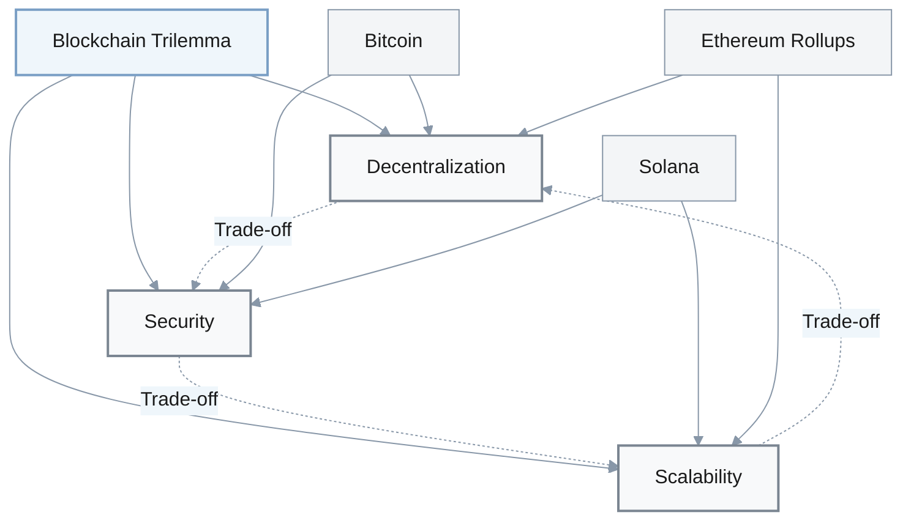
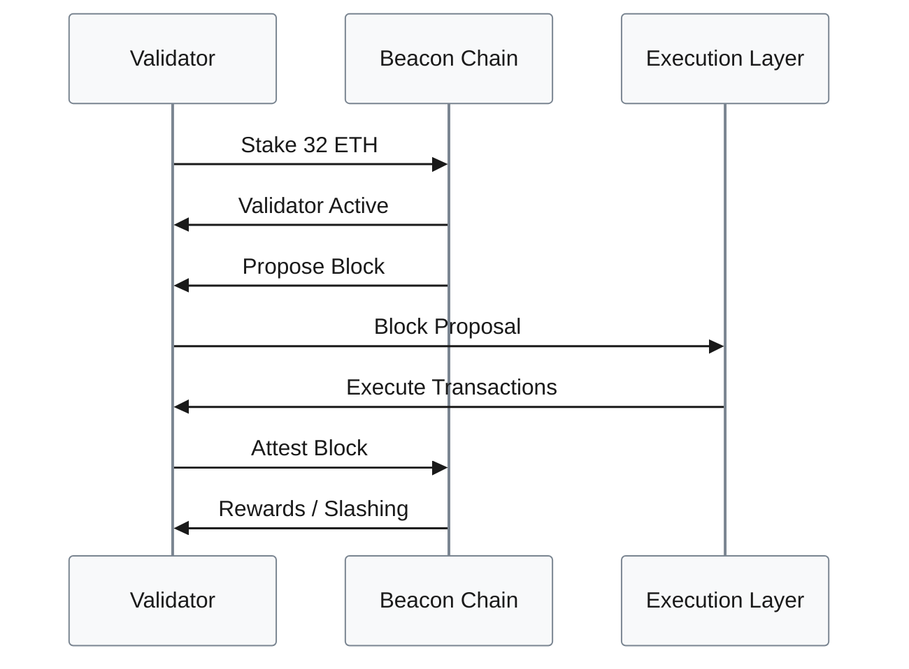
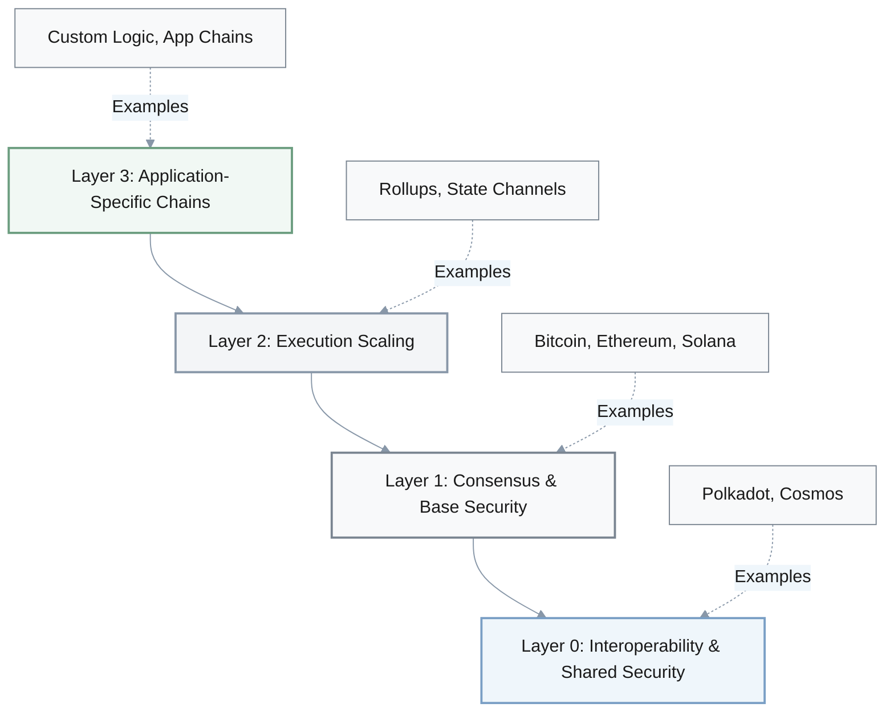
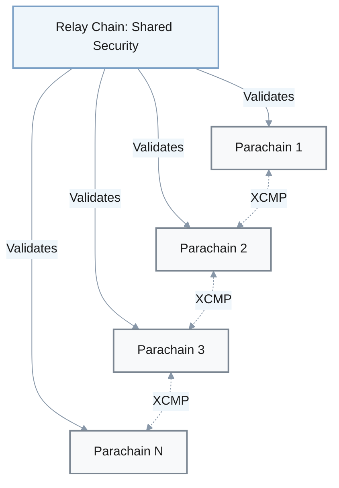
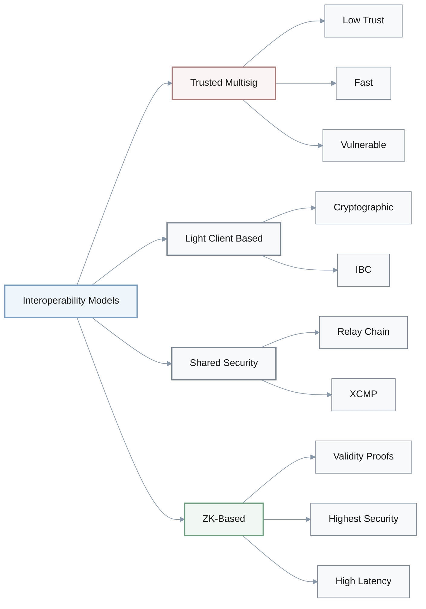
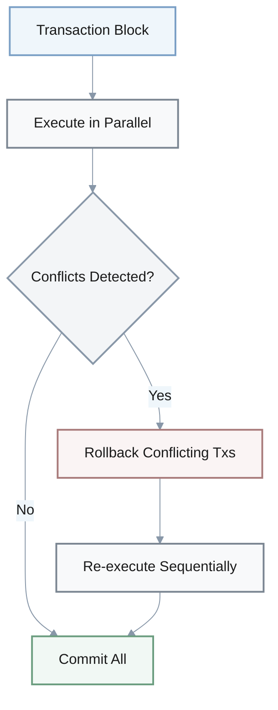
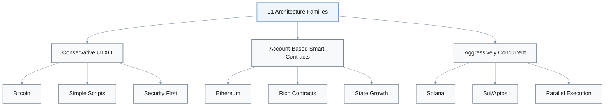
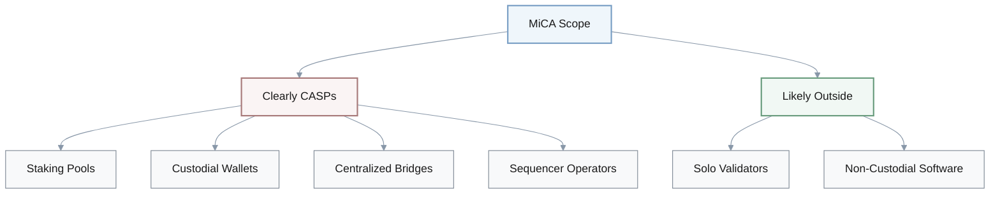
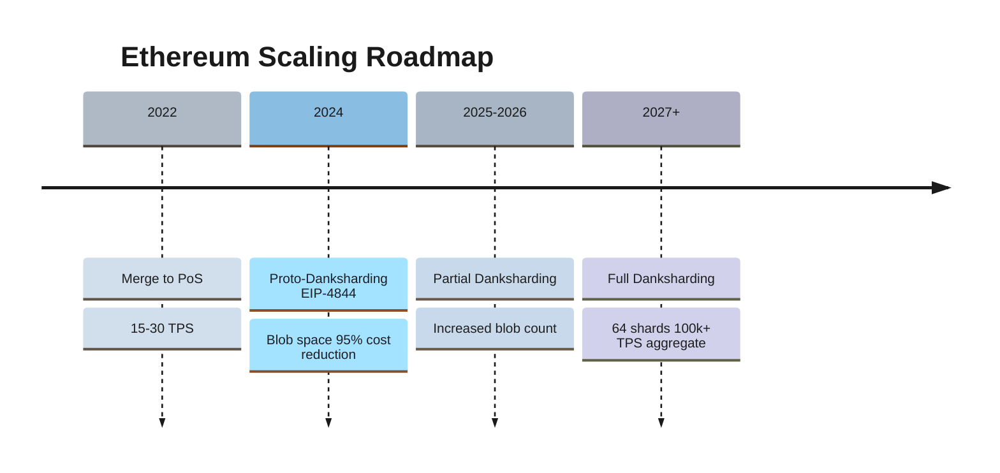

# Blockchain Architecture: Cloze Exercises

## Layer 1 Performance & Architecture

### Bitcoin Throughput

1. Q: ___ Bitcoin's original Layer 1 design that combines consensus, execution, and data availability ___ a single monolithic chain, what kind ___ on‑chain throughput does this achieve?
   A: **Researcher A:** Yeah, it's surprisingly low ___ terms of raw TPS—roughly ___ the single digits.

      **Engineer B:** Right. The investigations put it ___ 3–7 transactions ___ second on‑chain.

      **A:** Exactly. This level is extremely low compared ___ Visa‑style systems—but it matches Bitcoin's choice ___ prioritize security and decentralization over throughput.

      **Product C:** Got it. So that 3–7 TPS number represents the trade‑off: strong censorship resistance, limited Layer 1 throughput.
   
   [Answers: For, in, of, in, in, around, per, to, to]

**Layer 1 Throughput Comparison:**

| Blockchain | TPS Range | Design Philosophy | Trade-off |
|-----------|-----------|-------------------|-----------|
| Bitcoin | 3-7 | Monolithic, UTXO | Security > Throughput |
| Ethereum (pre-rollup) | 15-30 | Monolithic, Account | Decentralization > Speed |
| Solana | ~65,000 (theoretical) | Parallel, PoH | Throughput > Hardware constraints |
| Aptos/Sui | ~100,000+ (benchmark) | Move, Optimistic | Concurrency > Simplicity |

### Ethereum Throughput

1. Q: Ethereum also started ___ a largely monolithic design. ___ its early base layer, what kind ___ transaction throughput did it typically achieve before rollups became central?
   A: **Engineer A:** ___ practice, the reports describe Ethereum's early mainnet ___ handling ___ the order ___ tens of TPS.

      **Architect B:** Right. More concretely, about 15–30 transactions ___ second ___ the base layer.

      **A:** Yeah. This explains why DeFi and NFT waves quickly encountered scalability limits—15–30 TPS cannot handle global demand.

      **Product C:** Aha! So that 15–30 TPS window is what pushed the ecosystem ___ Layer 2 rollups.
   
   [Answers: as, On, of, In, as, on, of, per, on, toward]

---

## Fundamental Concepts

### Scalability Trilemma

1. Q: When people discuss the blockchain "scalability trilemma", which three properties are considered to be ___ tension?
   A: **Architect A:** Good question. The classic trio is decentralization, security, ___ scalability.

      **Engineer B:** Right. So the idea is: you can't usually maximize all three ___ once—improving one tends ___ exert pressure on the others.

      **A:** Exactly. Every architecture we studied essentially chooses a point ___ that decentralization–security–scalability space.

      **B:** Makes sense.
   
   [Answers: about, in, and, at, to, in]

### State Models

1. Q: The investigations compare different state models. How do Bitcoin, Ethereum, and newer Move‑style chains differ in this regard?
   A: **Researcher A:** ___ a high level, Bitcoin sticks ___ the UTXO model—unspent transaction outputs.

      **Engineer B:** Right. Ethereum shifted ___ an account model instead.

      **A:** Yeah. Plus, Sui/Aptos go further ___ object‑ or resource‑oriented models.

      **B:** Got it. So if we summarize: Bitcoin → ___, Ethereum → ___, Sui/Aptos → object/resource‑oriented.
   
   [Answers: At, with, to, with, UTXO, account]

**State Model Comparison:**

| State Model | Blockchains | Key Characteristics | Advantages | Challenges |
|------------|-------------|---------------------|------------|------------|
| **UTXO** | Bitcoin | Unspent outputs | Parallel validation, privacy | Complex scripting |
| **Account** | Ethereum | Global state | Rich contracts, simplicity | State bloat |
| **Object/Resource** | Sui, Aptos | First-class resources | Safety guarantees, parallelism | New paradigm |

---

## Ethereum Evolution

### The Merge

1. Q: Ethereum's "Merge" was a major milestone. When did it happen, and how much did it reduce energy consumption?
   A: **Engineer A:** So the Merge occurred ___ September 15, 2022.

      **Researcher B:** Right. And the energy impact was dramatic—about a ___% reduction.

      **A:** Yup. September 15, 2022, and roughly 99.98% lower energy use after moving ___ Proof‑of‑Stake.

      **B:** Wow, that's substantial.
   
   [Answers: on, 99.98, to]

**Ethereum Merge Impact:**

$$
\text{Energy Reduction (\%)} = \frac{\text{PoW Energy} - \text{PoS Energy}}{\text{PoW Energy}} \times 100 \approx 99.98\%
$$

### Post-Merge Consensus

1. Q: After The Merge, what consensus mechanism secures Ethereum instead ___ Proof‑of‑Work mining?
   A: **Engineer A:** Since the Merge, it's fully ___ Proof‑of‑Stake now.

      **Architect B:** Right—validators stake ETH, propose and attest ___ blocks, and get rewarded or slashed accordingly.

      **A:** Exactly. So when we discuss Ethereum post‑Merge, the consensus backbone is ___.

      **B:** Got it.
   
   [Answers: of, on, to, Proof‑of‑Stake]

---

## Layer 2 Scaling

### Rollup Economics

1. Q: ___ Ethereum's rollup‑centric roadmap, how much can Layer 2 rollups reduce costs and increase effective throughput compared ___ the base layer?
   A: **Researcher A:** ___ costs, the numbers ___ the investigations are quite aggressive—rollups can reduce transaction costs ___ about ___–___×.

      **Engineer B:** Right. Plus, that cost reduction translates ___ much higher effective throughput ___ the user level.

      **A:** Yeah. So we should remember that 10–100× drop ___ costs as a core justification ___ the rollup‑centric strategy.

      **B:** Makes sense.
   
   [Answers: In, to, On, in, by, 10, 100, into, at, in, for]

**Rollup Cost Reduction:**

$$
\text{Cost Reduction Factor} = \frac{\text{L1 Transaction Cost}}{\text{L2 Transaction Cost}} \approx 10\text{x to }100\text{x}
$$

### EIP-4844 (Proto-Danksharding)

1. Q: EIP‑4844 (proto‑danksharding) introduced blob data space. Roughly how much did this cut typical rollup data costs?
   A: **Engineer A:** ___ EIP‑4844, the cited figure is around a ___% reduction.

      **Architect B:** Wow—95% lower data costs ___ rollups means sustainable low‑fee transactions ___ Layer 2.

      **A:** Exactly. So, EIP‑4844 → new blob space → about 95% cost reduction ___ rollup data.

      **B:** Got it.
   
   [Answers: For, 95, for, on, for]

**EIP-4844 Impact:**
- **Before**: Rollups post calldata to L1 (expensive)
- **After**: Rollups post blob data (95% cheaper)
- **Blob lifetime**: ~18 days (temporary storage)
- **Target**: 3-6 blobs per block

---

## Layered Architecture

### Layer Definitions

1. Q: ___ the layered architecture described ___ the investigations, what are the primary roles of Layer 0, Layer 1, and Layer 2?
   A: **Architect A:** Layer 0 focuses ___ interoperability and shared security.

      **Engineer B:** Right. Layer 1 is ___ consensus and base security.

      **A:** Plus, Layer 2 is where execution scaling happens.

      **B:** Got it. Oh and Layer 3 is mentioned ___ application‑specific customization—but the core trio is: interoperability ___ Layer 0, consensus ___ Layer 1, execution ___ Layer 2.

      **A:** Exactly.
   
   [Answers: In, in, on, about, as, at, at, at]

---

## Solana Architecture

### Consensus Innovation

1. Q: Solana aims ___ high throughput ___ Layer 1. What special mechanism does it pair ___ Proof‑of‑Stake to order events before consensus?
   A: **Engineer A:** ___ Solana's case, that is ___.

      **Researcher B:** Right. It's a cryptographic clock that gives a verifiable ordering ___ events.

      **A:** Exactly. So Solana combines Proof‑of‑Stake ___ Proof‑of‑History to sequence transactions before running consensus.

      **B:** Aha!
   
   [Answers: for, at, with, In, Proof‑of‑History, of, with]

**Solana Consensus Components:**
- **Proof-of-Stake (PoS)**: Validator selection and rewards
- **Proof-of-History (PoH)**: Cryptographic clock for event ordering
- **Tower BFT**: PoH-optimized consensus algorithm

### System Components

1. Q: Beyond consensus, which Solana components are highlighted ___ the investigations ___ transaction forwarding, block propagation, and parallel execution?
   A: **Engineer A:** ___ the networking side, ___ handles transaction forwarding.

      **Researcher B:** Right. ___ is ___ block propagation.

      **A:** And ___ is the parallel program execution engine.

      **B:** Got it. So the trio is: Gulf Stream, Turbine, and Sealevel.

      **A:** Yup.
   
   [Answers: in, for, On, Gulf Stream, Turbine, for, Sealevel]

**Solana Technical Stack:**

| Component | Function | Innovation |
|-----------|----------|------------|
| **Proof-of-History** | Time ordering | Cryptographic clock |
| **Gulf Stream** | Tx forwarding | Mempool-less |
| **Turbine** | Block propagation | Streaming protocol |
| **Sealevel** | Parallel execution | Multi-threaded VM |
| **Tower BFT** | Consensus | PoH-optimized |

### Performance Claims

1. Q: Marketing and technical materials often quote a theoretical upper‑bound TPS ___ Solana. What's the number ___ ideal lab conditions?
   A: **Researcher A:** Marketing‑wise, the frequently cited figure is around ___ TPS.

      **Engineer B:** Right—"up to ~65,000 transactions ___ second" ___ idealized benchmarks.

      **A:** But the key is to treat that 65,000 TPS ___ a theoretical limit, not everyday real‑world throughput.
   
   [Answers: for, under, 65,000, per, in, as]

### Reliability Concerns

1. Q: Between 2021 and 2024, what major reliability concern repeatedly occurred ___ Solana mainnet?
   A: **Engineer A:** The primary one was repeated network ___.

      **Researcher B:** Yeah. These were often tied ___ spam attacks or software bugs that stalled block production.

      **A:** Exactly. So when we summarize Solana's risk profile, we must mention those outages ___ a key reliability issue.

      **B:** Makes sense.
   
   [Answers: for, outages, to, as]

---

## Interoperability Protocols

### Polkadot Architecture

1. Q: How does Polkadot's interoperability model work ___ a high level, according ___ the investigations?
   A: **Architect A:** Conceptually, it centers ___ a relay chain that provides shared security.

      **Engineer B:** Additionally, that relay chain secures multiple parachains, which are sovereign blockchains.

      **A:** Precisely. Thus, the model is: a relay chain plus parachains, ___ shared security spreading ___ them.

      **B:** Understood.
   
   [Answers: at, to, on, with, across]

### Parachain Economics

1. Q: What economic mechanism do Polkadot parachain slot auctions rely ___, and which token is locked up?
   A: **Researcher A:** Economically, projects bid ___ parachain slots ___ locking ___.

      **Engineer B:** Right. The idea is that locking significant amounts ___ DOT aligns their incentives ___ the network's security.

      **A:** Exactly. Parachain auctions → lock up DOT → economic skin ___ the game.

      **B:** Makes sense.
   
   [Answers: on, for, by, DOT, of, with, in]

### Cosmos IBC

1. Q: Cosmos's IBC protocol, launched around 2021, relies ___ what key component ___ each chain to verify cross‑chain messages?
   A: **Engineer A:** Mechanically, each chain runs a ___ ___ ___ the other chain.

      **Researcher B:** Right. That light client verifies headers and Merkle proofs, so messages can be trusted ___ centralized custodians.

      **A:** Exactly. The core building block is the on‑chain ___ ___.

      **B:** Got it.
   
   [Answers: on, on, light, client, for, without, light, client]

**IBC Architecture:**
- **Light Client**: Verifies cross-chain headers
- **Relayers**: Transfer packets between chains
- **Merkle Proofs**: Cryptographic state verification
- **Trust Model**: Trust-minimized (no custodians)

### IBC Adoption

1. Q: ___ 2024, how widely had Cosmos IBC been adopted, and roughly how much cross‑chain traffic did it handle annually?
   A: **Researcher A:** Adoption‑wise, it reached ___ the order ___ about ___ chains.

      **Engineer B:** Right. Plus, it was moving tens ___ millions ___ cross‑chain transfers ___ year inside that ecosystem.

      **A:** Yeah. So the headline is: ~120 chains and tens of millions of IBC transfers annually.

      **B:** Wow, impressive.
   
   [Answers: By, on, of, 120, of, of, per]

---

## Bridge Security

### Early Bridge Vulnerabilities

1. Q: Early trusted multisig bridges like Ronin, Wormhole, and Poly Network used m‑of‑n signatures. What low threshold did some ___ them rely ___, and why was that risky?
   A: **Researcher A:** ___ some early designs, thresholds went as low ___ ___‑of‑___.

      **Engineer B:** Right. ___ 5‑of‑9, compromising only five keys allows an attacker to drain the bridge.

      **A:** Exactly. So 5‑of‑9 multisig was a concrete example ___ how concentrated and fragile those setups were.

      **B:** Yikes, that's concerning.
   
   [Answers: of, on, In, as, 5, 9, With, of]

### Bridge Incident Losses

1. Q: Roughly how much user value did the Ronin, Wormhole, and Poly Network bridge incidents lose ___ total, according ___ the investigations?
   A: **Researcher A:** ___ total, the combined losses exceeded $___ billion.

      **Engineer B:** Wow. That ">$2 billion" number is why bridge risk is treated ___ systemic, not merely an edge‑case.

      **A:** Exactly. So we should remember: three hacks, more than $___ billion gone.

      **B:** That's huge.

   
   [Answers: in, to, In, 2, as, 2]

**Major Bridge Incidents:**

| Bridge | Year | Loss Amount | Attack Vector |
|--------|------|-------------|---------------|
| Ronin | 2022 | ~$625M | Validator key compromise |
| Wormhole | 2022 | ~$325M | Signature verification bug |
| Poly Network | 2021 | ~$611M | Contract exploit |
| **Total** | | **>$2B** | Centralized trust points |

### Systemic Risk

1. Q: Why were early custodial bridges considered more dangerous ___ the underlying blockchains they connected?
   A: **Architect A:** The core issue was that they centralized risk ___ the bridge validator set.

      **Engineer B:** Right. Even if the base blockchains stayed secure, compromising that one bridge validator set could still steal funds.

      **A:** Exactly. So compared ___ trust‑minimized designs, these custodial bridges concentrated risk ___ the underlying blockchains remained secure.

      **B:** Makes sense.
   
   [Answers: than, in, with, while]

---

## Advanced Interoperability

### Polkadot XCMP

1. Q: What is Polkadot's XCMP (Cross‑Consensus Message Passing) leveraging to avoid each chain bootstrapping its own full security model?
   A: **Architect A:** ___ XCMP, it leans ___ the relay chain validators.

      **Engineer B:** Right. Since those validators already secure all parachains together, they can safely pass messages ___ each chain re‑implementing its own independent security model.

      **A:** Exactly. ___ other words, XCMP rides ___ shared security instead ___ duplicating it.

      **B:** Got it.
   
   [Answers: For, on, without, In, on, of]

### Interoperability Design Taxonomy

1. Q: The investigations group interoperability designs ___ several models. What are the three main ones plus the emerging fourth category?
   A: **Researcher A:** ___ a high level, the first category is trusted multisig bridges.

      **Engineer B:** Right. Second, light‑client‑based protocols ___ IBC.

      **A:** Third, shared‑security frameworks ___ Polkadot's XCMP.

      **B:** Got it. Oh and ___ a fourth, emerging category, ZK‑based bridges.

      **A:** Exactly.
   
   [Answers: into, At, like, like, as]

**Interoperability Design Models:**

| Model | Examples | Trust Assumption | Security Level | Latency |
|-------|----------|------------------|----------------|---------|
| **Trusted Multisig** | Ronin, Wormhole | m-of-n validators | Low | Fast |
| **Light Client** | IBC (Cosmos) | Cryptographic proofs | High | Medium |
| **Shared Security** | XCMP (Polkadot) | Relay chain validators | High | Fast |
| **ZK-Based** | zkBridge | Validity proofs | Highest | Slow |

### ZK-Based Bridges

1. Q: ZK‑based bridges change the trust model. What do they use to let a destination chain verify a source‑chain state transition, and what's the main cost?
   A: **Engineer A:** Trust‑wise, they use succinct validity proofs—zero‑knowledge proofs that attest ___ a source‑chain state transition.

      **Researcher B:** Hmm... but the downside is high proof generation latency ___ cost.

      **A:** Exactly. So the trade‑off is: stronger trust‑minimization ___ proofs, ___ the price ___ higher proof generation latency or cost.

      **B:** Makes sense.
   
   [Answers: to, or, via, at, of]

---

## Move-Based Platforms

### Resource Model

1. Q: Move‑based platforms like Aptos and Sui discuss "resources" ___ their programming model. What does that mean ___ key assets on‑chain?
   A: **Engineer A:** ___ Move‑style systems, key assets are modeled ___ resources.

      **Researcher B:** Right. Resources cannot be implicitly copied ___ destroyed—they must move or be explicitly handled.

      **A:** Exactly. That resource treatment is what reduces many common smart contract vulnerabilities.
   
   [Answers: in, for, In, as, or]

**Move Resource Properties:**
- **No implicit copy**: Resources must be explicitly moved
- **No implicit discard**: Must be explicitly destroyed
- **Type safety**: First-class linear types
- **Security benefit**: Prevents common vulnerabilities (reentrancy, lost tokens)

### Aptos Block-STM

1. Q: Aptos's Block‑STM engine is often cited ___ performance discussions. What execution approach does it use?
   A: **Engineer A:** Execution‑wise, it applies ___ ___ ___.

      **Researcher B:** Right. Many transactions run ___ parallel, and any that conflict are rolled back and retried.

      **A:** Exactly. So Block‑STM essentially represents optimistic concurrency control ___ parallel transaction execution.

      **B:** Makes sense.
   
   [Answers: in, optimistic, concurrency, control, in, for]

**Block-STM Execution Flow:**

### Benchmark Performance

1. Q: ___ benchmarks, what order ___ magnitude throughput have Aptos and Sui demonstrated ___ controlled tests?
   A: **Researcher A:** Benchmark‑wise, the reports mention high five‑ to six‑figure TPS ranges.

      **Engineer B:** Right. Specifically, one headline number is around 100,000+ TPS ___ controlled tests.

      **A:** Exactly. So "~100,000 TPS" is the rough benchmark figure we should remember, ___ the caveat that it's ___ lab conditions.

      **B:** Got it.
   
   [Answers: In, of, in, in, with, in]

---

## Hardware Trade-offs

### Validator Requirements

1. Q: What key hardware‑related trade‑off do many high‑throughput chains make compared ___ more conservative designs?
   A: **Architect A:** The trade‑off is they expect validators to run more powerful hardware.

      **Engineer B:** Right. Plus, they require higher‑bandwidth network links.

      **A:** Yeah. So they gain throughput, but ___ the cost ___ stricter hardware assumptions ___ validators.

      **B:** Makes sense.
   
   [Answers: with, at, of, for]

**Hardware Requirements Spectrum:**

| Chain | CPU | RAM | Storage | Bandwidth | Philosophy |
|-------|-----|-----|---------|-----------|------------|
| Bitcoin | Low | Low | ~500 GB | Low | Accessible |
| Ethereum | Medium | 16+ GB | ~1 TB | Medium | Moderate |
| Solana | High | 256+ GB | ~2 TB | High | Performance |
| Sui/Aptos | High | 32+ GB | ~1 TB | High | Optimized |

---

## Architecture Taxonomy

### L1 Design Families (2025)

1. Q: ___ 2025, the investigations group L1 architectures ___ three broad families. How do they characterize those families?
   A: **Researcher A:** Broadly, the first family is conservative UTXO plus simple scripts—Bitcoin‑like designs.

      **Engineer B:** Right. Second, general‑purpose account‑based smart contracts, ___ Ethereum.

      **A:** And third, aggressively concurrent parallel or Move‑based designs, ___ Solana, Sui, and Aptos.

      **B:** Got it. So the three buckets are: UTXO, account‑based, and aggressively concurrent Move/parallel.

      **A:** Exactly.
   
   [Answers: By, into, like, like]

**L1 Architecture Families:**

---

## Regulatory Landscape

### EU MiCA Framework

1. Q: ___ the EU's MiCA framework, many user‑facing crypto businesses fall ___ which regulated category, and what does that imply?
   A: **Policy A:** ___ MiCA, they are treated ___ Crypto‑Asset Service Providers—CASPs.

      **Researcher B:** Right. CASP status means they must obtain authorization, comply ___ AML/KYC, and maintain local governance.

      **A:** Exactly. So MiCA essentially pulls many exchanges, custodians, and similar actors ___ the CASP regime.

      **B:** Got it.
   
   [Answers: Under, into, Under, as, with, into]

**MiCA Regulatory Categories:**
- **CASPs**: Crypto-Asset Service Providers (exchanges, custodians)
- **Significant CASPs**: >15M active EU users (enhanced supervision)
- **Requirements**: Authorization, AML/KYC, governance
- **Scope**: Staking pools, custodial wallets, bridges, sequencers

### Significant CASP Threshold

1. Q: MiCA also introduces a "significant CASP" category. What's the user threshold ___ that designation?
   A: **Policy A:** The threshold is more ___ ___ million active EU users.

      **Researcher B:** Right. Crossing that 15‑million line triggers enhanced supervision.

      **A:** Exactly. So 15 million active EU users is the critical number to watch.

      **B:** Got it.
   
   [Answers: for, than, 15]

### MiCA Rollout Timeline

1. Q: According ___ the investigations, how is MiCA's rollout phased ___ stablecoins, broader CASP licensing, and the TFR "travel rule"?
   A: **Policy A:** Timeline‑wise, stablecoin rules start ___ mid‑2024.

      **Researcher B:** Right. Plus, broader CASP licensing rolls out ___ 2025–2026.

      **A:** And the Transfer ___ Funds Regulation travel rule ___ crypto transfers kicked in ___ December 2024.

      **B:** Got it. So the sequence is: mid‑2024 ___ stablecoins, 2025–2026 ___ CASP licensing, and December 2024 ___ the travel rule.

      **A:** Exactly.
   
   [Answers: to, for, from, through, of, for, from, for, for, for]

**MiCA Implementation Timeline:**

| Phase | Start Date | Scope | Requirements |
|-------|-----------|-------|--------------|
| **Stablecoin Rules** | Mid-2024 | E-money tokens, asset-referenced tokens | Reserve requirements |
| **TFR Travel Rule** | Dec 2024 | Crypto transfers | Originator/beneficiary info |
| **CASP Licensing** | 2025-2026 | All crypto service providers | Full authorization |

### MiCA Entity Scope

1. Q: ___ MiCA's architecture‑driven view, which entities are clearly CASPs, and who might sit outside the definition?
   A: **Policy A:** Concretely, staking pools, custodial wallets, centralized bridges, and some sequencer operators are obvious CASPs.

      **Researcher B:** But base‑layer validators that validate only ___ their own account often fall outside many interpretations.

      **A:** Exactly. So the line is drawn more around service providers—like pools and bridges—___ around individual validators.

      **B:** Makes sense.
   
   [Answers: In, on, than]

**MiCA Entity Classification:**

### U.S. Regulatory Split

1. Q: ___ the U.S. perspective summarized ___ the investigations, how do the SEC and CFTC split focus ___ crypto activities?
   A: **Policy A:** ___ the U.S., the SEC has focused heavily ___ centralized staking programs ___ potential securities offerings.

      **Researcher B:** Right. Meanwhile, the CFTC looks more ___ derivatives and some spot markets.

      **A:** Exactly. So SEC → staking and securities, CFTC → derivatives and some spot oversight.

      **B:** Got it.
   
   [Answers: From, in, over, In, on, as, at]

**U.S. Regulatory Jurisdiction:**

| Agency | Focus | Key Areas | Approach |
|--------|-------|-----------|----------|
| **SEC** | Securities | Staking programs, tokens as securities | Enforcement-heavy |
| **CFTC** | Commodities | Derivatives, some spot markets | Regulatory clarity |

### Modular vs Monolithic Regulatory Exposure

1. Q: How does the modular Ethereum‑style stack change where regulatory exposure tends to concentrate, compared ___ more monolithic chains?
   A: **Architect A:** Structurally, ___ modular stacks exposure shifts ___ sequencers, bridges, and staking businesses.

      **Policy B:** Right. Conversely, monolithic chains, ___ contrast, concentrate more exposure ___ large validator operators and infrastructure providers.

      **A:** Exactly. So the same economic activity ends up regulated ___ different layers, depending ___ whether the stack is modular or monolithic.

      **B:** Makes sense.
   
   [Answers: with, in, toward, by, on, at, on]

---

## Security Metrics

### Nakamoto Coefficient

1. Q: What does the Nakamoto Coefficient measure ___ the context ___ blockchain security?
   A: **Researcher A:** Formally, it's the minimum number ___ independent entities—like validators or mining pools—whose collusion could corrupt the network.

      **Engineer B:** Right. A lower coefficient means fewer actors need to collude, so it indicates higher centralization risk.

      **A:** Exactly. The Nakamoto Coefficient quantifies how many entities an attacker would need to control to corrupt or control the chain.

      **B:** Makes sense.
   
   [Answers: in, of, of]

**Nakamoto Coefficient Definition:**

$$
NC = \min\{n : \text{control of }n\text{ entities} \geq 51\%\text{ of consensus power}\}
$$

**Interpretation:**
- **Higher NC**: More decentralized, harder to attack
- **Lower NC**: More centralized, easier to corrupt
- **Threshold concern**: NC < 10 indicates significant centralization risk

---

## Consensus Mechanisms

### Bitcoin's Original Choice

1. Q: What consensus mechanism did Bitcoin originally use to prioritize security and censorship resistance ___ throughput and energy efficiency?
   A: **Engineer A:** Originally, it relied ___ ___.

      **Researcher B:** Right. It employs a Proof‑of‑Work mechanism where miners solve computational puzzles.

      **A:** Exactly. So Bitcoin's design choice was Proof‑of‑Work, accepting energy cost ___ stronger security and censorship resistance.

      **B:** Got it.
   
   [Answers: over, on, Proof‑of‑Work, for]

**Consensus Mechanism Comparison:**

| Mechanism | Energy | Throughput | Security | Decentralization | Examples |
|-----------|--------|-----------|----------|------------------|----------|
| **PoW** | Very High | Low | High | High | Bitcoin |
| **PoS** | Very Low | Medium-High | High | Medium-High | Ethereum |
| **PoH + PoS** | Low | Very High | Medium | Medium | Solana |
| **DPoS** | Very Low | High | Medium | Low | EOS |

---

## State Management

### Ethereum State Growth

1. Q: Ethereum's account‑based design and rich smart‑contract layer led ___ rapid state growth. ___ the early 2020s, what kind ___ state sizes were typical ___ full nodes?
   A: **Researcher A:** Storage‑wise, the reports indicate tens ___ low hundreds ___ gigabytes.

      **Engineer B:** Right. So a full node might need ___ the order ___ tens of GB, pushing toward low hundreds of GB as the state ballooned.

      **A:** Exactly. That tens‑to‑hundreds of gigabytes range is a concrete symptom ___ the account‑based, high‑usage model.

      **B:** Got it.
   
   [Answers: to, By, of, for, to, of, on, of, of]

**Ethereum State Growth:**
- **Early 2020s**: Tens to low hundreds of GB
- **Driver**: Account model + rich smart contracts
- **Impact**: Higher hardware requirements for full nodes
- **Mitigation**: State expiry proposals, verkle trees

---

## Future Roadmap

### Danksharding Vision

1. Q: ___ the rollup‑centric danksharding roadmap, what's the target number ___ data shards, and what ecosystem‑wide throughput do they aim ___ together ___ Layer 2s?
   A: **Architect A:** Roadmap‑wise, the plan is ___ ___ data shards.

      **Researcher B:** Right. ___ those shards plus rollups, the goal is roughly 100k+ TPS ___ the ecosystem.

      **A:** Exactly. So the shorthand is: 64 shards targeting about 100k+ TPS ___ aggregate.

      **B:** Got it.
   
   [Answers: In, of, for, with, for, 64, with, across, in]

**Danksharding Roadmap:**

**Danksharding Targets:**
- **Data shards**: 64
- **Target throughput**: 100,000+ TPS (ecosystem-wide with L2s)
- **Cost reduction**: 10-100x via rollups
- **Timeline**: Multi-year rollout (2024-2027+)

---

## Architectural Insights

### Generational Drivers

1. Q: What central qualitative lesson do the investigations draw ___ why new blockchain architecture generations appear?
   A: **Researcher A:** At a high level, they mainly appear to address specific limitations ___ previous designs.

      **Engineer B:** Right. Things ___ scalability, security, or interoperability, rather ___ purely academic improvements.

      **A:** Exactly. So each generation is a reaction ___ concrete pain points—scalability, security, interoperability—more ___ a quest ___ elegance alone.

      **B:** Makes sense.
   
   [Answers: about, of, like, than, to, than, for]

**Blockchain Generations:**

| Generation | Era | Key Innovation | Pain Point Addressed |
|------------|-----|----------------|---------------------|
| **Gen 1** | 2009-2014 | Bitcoin PoW | Digital scarcity, censorship resistance |
| **Gen 2** | 2015-2020 | Ethereum smart contracts | Programmability |
| **Gen 3** | 2020-2024 | L2 rollups, parallel execution | Scalability |
| **Gen 4** | 2024+ | ZK proofs, modular architecture | Cost, interoperability |

### Systemic Bridge Risk

1. Q: Even ___ secure base layers, which component does the report indicate remains a systemic risk, capable ___ causing substantial losses when it fails?
   A: **Researcher A:** ___ practice, bridges.

      **Engineer B:** Right. The reports emphasize that weaknesses ___ bridge design and implementation can still lead ___ multi‑hundred‑million‑dollar losses.

      **A:** Exactly. So even if the L1s are solid, bridge failures remain a systemic risk.

      **B:** Yeah, critical point.
   
   [Answers: with, of, In, in, to]

> **Key Insight**: In practice, bridge security has emerged as a critical weak point in cross-chain infrastructure. Even with secure base layers, bridge vulnerabilities have caused losses of more than $2B (2021-2022).

---

## Market Outlook

### Interoperability Market Projection

1. Q: Finally, what market projection do the investigations cite ___ blockchain interoperability ___ 2025 ___ 2035?
   A: **Researcher A:** Projection‑wise, they estimate growth ___ about $___ million ___ 2025.

      **Engineer B:** Right. Up to roughly $___ billion ___ 2035.

      **A:** Exactly. So the forecast is $332.8 million → $1.83 billion ___ the interoperability market ___ that decade.

      **B:** Wow, significant growth.
   
   [Answers: for, from, to, from, 332.8, in, 1.83, by, for, over]

**Interoperability Market Growth:**

$$
CAGR = \left(\frac{\$1.83B}{\$332.8M}\right)^{\frac{1}{10}} - 1 \approx 18.5\%
$$

| Year | Market Size | Growth Driver |
|------|-------------|---------------|
| **2025** | $332.8M | IBC, XCMP adoption |
| **2030** | ~$900M (est.) | ZK bridges, trust-minimized protocols |
| **2035** | $1.83B | Mature cross-chain ecosystem |

**Key Growth Factors:**
- **Trust-minimized protocols**: IBC, XCMP replacing custodial bridges
- **ZK-based bridges**: Higher security at acceptable latency
- **Regulatory clarity**: MiCA, U.S. frameworks reducing uncertainty
- **DeFi expansion**: Cross-chain liquidity and composability

---

## Summary

This document covers comprehensive blockchain architecture concepts through cloze exercises, including:

- **Performance metrics**: L1 throughput (Bitcoin 3-7 TPS, Ethereum 15-30 TPS, Solana ~65K TPS theoretical)
- **Core concepts**: Scalability trilemma, state models (UTXO, account, resource-oriented)
- **Major milestones**: The Merge (Sep 15, 2022), EIP-4844 (95% cost reduction)
- **Interoperability**: IBC, XCMP, bridge security issues (>$2B losses)
- **Advanced platforms**: Move-based chains (Aptos/Sui), Block-STM execution
- **Regulation**: MiCA (EU), SEC/CFTC (U.S.)
- **Security metrics**: Nakamoto Coefficient
- **Future vision**: Danksharding (64 shards, 100K+ TPS target)
