# Blockchain Architecture: Creative Design Strategies

This document explores creative blockchain architecture strategies across multiple dimensions, addressing fundamental design decisions from state models to validator topologies. Rather than prescribing single solutions, it presents structured frameworks for navigating complex architectural trade-offs.

## Architecture Selection Frameworks

### State Model Selection Strategy

1. Q: For this new blockchain platform, we have to choose a base architecture family—UTXO-style settlement, account-based smart contracts, or Move-style object/resource models. How should we think about selection strategies instead of just betting on one model?
   A: **Architect:** I would start from a dual-layer view. Keep a conservative UTXO base layer purely for final settlement, and hang an account-based contract hub or rollup off it for programmability.

      **Protocol Researcher:** That Dual-Layer UTXO + Contract Hub setup lets UTXO handle high-value transfers with simple scripts, while the execution layer can evolve faster and carry most of the smart-contract risk.

      **Product Lead:** Building on that, we could flip the default to an account-based core—EVM-like for ecosystem compatibility—and bolt on a Move-style sidechain or app-specific shard just for safety-critical verticals like RWA or custody.

      **Security Engineer:** Exactly. That Account-Based Core with Move Sidecar path gives high-risk contracts a resource-oriented model that prevents common asset-handling bugs, without forcing everyone to retrain day one.

      **Research Lead:** Conversely, the opposite extreme is a Move-First for Safety-Critical Use Cases posture: make Move/object models the primary programming paradigm from launch and relegate UTXO/account patterns to bridging and compatibility layers only.

      **Architect:** That approach front-loads developer retraining but bakes in strong invariants for asset safety and parallelism. Moreover, if we are nervous about that jump, we can design a Phased Migration Path—start with account-based for tooling and liquidity, but plan storage layouts and governance so core contracts can migrate into Move/object modules over 3–5 years.

      **Product Lead:** Therefore, we do not have to decide EVM vs Move forever on day one; instead, we pick a path where UTXO, accounts, and Move each have clear roles over time.

**State Model Selection Strategies:**

| Strategy | Primary Layer | Secondary Layer | Use Case Focus | Risk Profile | Migration Complexity |
|----------|---------------|----------------|----------------|--------------|---------------------|
| **Dual-Layer UTXO + Contract Hub** | UTXO | Account-based rollup | High-value settlement + programmability | Low base risk | Medium |
| **Account-Based Core + Move Sidecar** | Account (EVM) | Move sidechain | Ecosystem compatibility + RWA safety | Medium | Low-Medium |
| **Move-First Safety-Critical** | Move/Object | UTXO/Account bridges | Asset safety, parallelism | Low (asset bugs) | High (dev training) |
| **Phased Migration Path** | Account-based → Move | Gradual transition | Future-proofing | Managed over time | High (planned) |

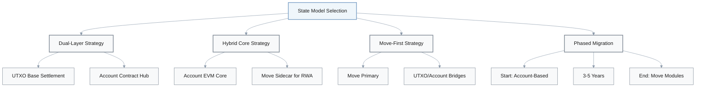

**Strategy Trade-offs:**

| Factor | Dual-Layer | Account + Move Sidecar | Move-First | Phased Migration |
|--------|-----------|----------------------|------------|------------------|
| **Ecosystem Compatibility** | Medium | High | Low | High → Medium |
| **Asset Safety** | High (UTXO) | High (Move sidecar) | Highest | Medium → High |
| **Developer Onboarding** | Medium | Easy | Hard | Easy → Medium |
| **Parallel Execution** | Medium | Medium (Move only) | High | Medium → High |
| **Time to Market** | Medium | Fast | Slow | Fast |

---

## Monolithic vs Modular Architecture

This section addresses the fundamental topology choice between monolithic high-throughput chains and modular architectures. Rather than treating this as an ideological debate, we present decision frameworks grounded in workload characteristics and measurable SLOs.

### Decision Frameworks

1. Q: When we choose between a monolithic high-throughput L1 and a modular architecture built from rollups and shared security, what decision frameworks can we use instead of a purely ideological argument?
   A: **Architect:** One lens is simple workload segmentation. Put latency-sensitive workloads—order-book DEXs, gaming—on monolithic high-throughput L1s, and settlement-critical DeFi or RWA flows on a modular stack that optimizes for safety and auditability.

      **Protocol Researcher:** That is the **Workload Segmentation** approach: explicitly accept there is no single optimal chain and route UX-heavy traffic to monoliths while the modular core owns the high-value state.

      **Infra Lead:** Building on that, we can implement **Monolith at the Edge, Modular at the Core**. Use a modular hub—a rollup-centric or parachain relay—as canonical state root, then attach one or more monolithic edge L1s to absorb traffic bursts and consumer UX.

      **Risk Officer:** That way, outages or bugs at the edge are tolerable, but the core ledger remains conservative. In other words, safety at the core, experimentation at the edge.

      **SRE Lead:** Another angle is to turn this into a **Performance Envelope SLO** problem: define p95 latency, outage tolerance, and decentralization floors, then score monolithic vs modular options against those SLOs.

      **Architect:** Instead of bikeshedding, we say, "Here are the SLOs; whichever architecture satisfies them best wins." Additionally, we can add a **Regulatory and Infra Lens First** layer—starting from regulator and infra-provider constraints like data residency, uptime, and client diversity.

      **Risk Officer:** That surfaces where certain geographies will basically require modularity and clearer isolation/upgrade paths just to pass audits in 3–5 years.

**Architecture Selection Decision Frameworks:**

| Framework | Key Principle | Monolithic L1 Role | Modular Stack Role | Decision Criteria |
|-----------|--------------|-------------------|-------------------|------------------|
| **Workload Segmentation** | No single optimal chain | Latency-sensitive (DEX, gaming) | Settlement-critical (DeFi, RWA) | Application latency requirements |
| **Monolith at Edge, Modular Core** | Safety core, experiment edge | Traffic bursts, consumer UX | Canonical state root | Blast radius tolerance |
| **Performance Envelope SLO** | Define clear SLOs | High throughput, low latency | High safety, auditability | p95 latency, outage tolerance, decentralization |
| **Regulatory & Infra Lens First** | Compliance-driven | Limited use in regulated markets | Data residency, upgrade paths | Geographic requirements, audit needs |

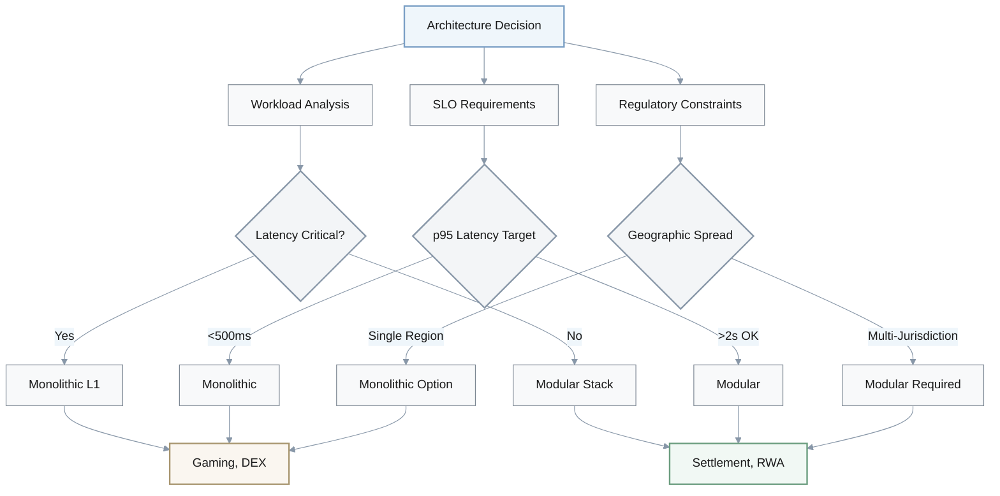

**SLO-Based Architecture Scoring:**

| Metric | Target | Monolithic L1 | Modular Stack |
|--------|--------|---------------|---------------|
| **p95 Latency** | <500ms | ✅ Excellent | ❌ 2-5s typical |
| **Outage Tolerance** | >99.9% | ⚠️ Historical issues | ✅ Layered redundancy |
| **Decentralization** | Nakamoto Coef >10 | ⚠️ Hardware barriers | ✅ Easier distribution |
| **Upgrade Safety** | No hard forks | ❌ Network-wide risk | ✅ Isolated upgrades |
| **Cost per Transaction** | <$0.01 | ⚠️ Variable | ✅ L2 optimization |

---

## Parallel Execution Designs

Parallel execution strategies can represent a critical performance frontier. However, explicit access lists can impose a high developer burden, while pure optimistic STM can suffer from retry storms. This section explores hybrid approaches that aim to balance throughput gains with developer experience.

### Hybrid Execution Strategies

1. Q: For our parallel execution engine, we are comparing explicit access lists, optimistic STM with conflict retries, and object-centric ownership. What hybrid designs could give us better real-world throughput without crushing developer experience?
   A: **Runtime Engineer:** One idea is **Best-Effort Access Hints**. Let developers optionally declare per-transaction access lists, but treat them as hints. When they are absent or incorrect, we fall back to optimistic STM.
 
      **SDK Engineer:** That way, we preserve maximum parallelism when hints are good, but we do not hard-fail if a developer forgets metadata or mis-specifies a key.

      **Protocol Researcher:** Another pattern is **Object Buckets + STM**. Group state into coarse buckets—per market, per pool, per game room—and run STM only within each bucket while forcing cross-bucket operations to go serial.

      **Runtime Engineer:** That reduces STM overhead and hot-spot contention. Moreover, devs only need to understand bucket boundaries instead of full conflict graphs.

      **Compiler Engineer:** We can push even more into tooling with **Compiler-Inferred Access Sets**. Use static analysis or bytecode instrumentation to infer read/write sets automatically, then feed those into a Solana-style scheduler.

      **SDK Engineer:** Consequently, developers get parallelism for free, as long as they stay within patterns the compiler understands.

      **Architect:** Finally, a **Tiered Fast Paths** design: single-owner objects bypass consensus and execute locally, low-contention workloads run under a parallel STM tier, and only pathological DeFi hot spots fall back to a high-contention serial tier.

      **Runtime Engineer:** That way simple payments and game moves get near-instant finality, while we still have a safe path for the gnarly, contention-heavy flows.

**Parallel Execution Hybrid Designs:**

| Design | Access Declaration | Fallback Strategy | Developer Burden | Performance | Best For |
|--------|-------------------|-------------------|-----------------|-------------|----------|
| **Best-Effort Access Hints** | Optional hints | Optimistic STM | Low | High when hinted | Mixed workloads |
| **Object Buckets + STM** | Bucket boundaries | Serial cross-bucket | Medium | High within buckets | Domain-partitioned apps |
| **Compiler-Inferred Access Sets** | None (automatic) | STM for unknown patterns | Lowest | High for common patterns | Standard contracts |
| **Tiered Fast Paths** | Ownership-based | 3-tier fallback | Low-Medium | Optimal per tier | Diverse transaction types |

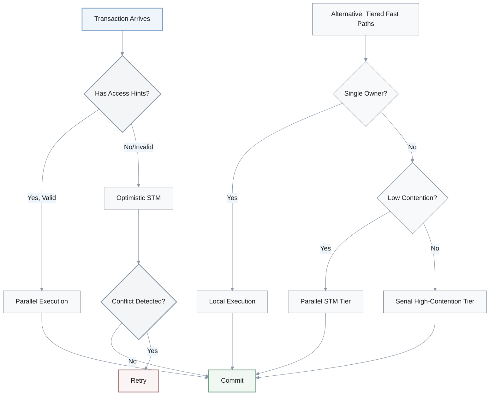

**Execution Strategy Comparison:**

| Strategy Component | Throughput Gain | Latency P50 | Latency P99 | Dev Complexity | Failure Mode |
|-------------------|-----------------|-------------|-------------|----------------|--------------|
| **Explicit Access Lists** | 50-100x | Low | Low | High | Hard failures |
| **Optimistic STM** | 10-50x | Low | High (retries) | Low | Retry storms |
| **Compiler Inference** | 20-80x | Low | Medium | Lowest | Inference errors |
| **Hybrid (Best-Effort)** | 30-90x | Low | Medium | Low | Graceful degradation |
| **Tiered Fast Paths** | 40-100x | Very Low (tier 1) | Medium (tier 3) | Medium | Tier congestion |

**Object Bucket Strategy:**

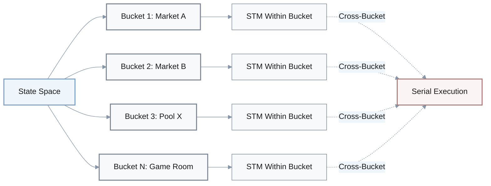

---

## Cross-Chain Interoperability Architectures

Traditional multisig bridges can present significant security risks, while full N×M mesh connectivity can create prohibitive complexity at scale. This section presents advanced architectures that combine light clients, ZK proofs, and shared security that aim to achieve safer, more scalable interoperability.

### Advanced Bridge Designs

1. Q: We need safer cross-chain interoperability across multiple L1s and rollups, but classic multisig bridges are too risky. What alternative architectures mix light clients, shared security, and ZK proofs in a more robust way?
   A: **Interop Architect:** First option is a **Hub-and-Spoke Light-Client Mesh**. Instead of N×M direct links, we pick a small set of hub chains that run light clients for the rest, and route most messages through those hubs.

      **Security Engineer:** That cuts the total number of verified connections while still avoiding trusted multisigs—each hop is still light-client verified, just through fewer well-audited hubs.

      **ZK Engineer:** A second pattern is **ZK-Verified Checkpoints**. Each chain periodically posts succinct ZK-verified checkpoints to a neutral proof chain; bridges verify against those checkpoints instead of raw headers.

      **Interop Architect:** That centralizes proving cost on the proof chain while keeping verification cheap and composable for all the consumers.

      **Protocol Researcher:** We can also group chains into **Shared-Security Zones**. All chains under one relay or DA layer treat intra-zone messages as trust-minimized, and we reserve heavy ZK or strong economic guarantees only for inter-zone hops.

      **Security Engineer:** Therefore, security overhead roughly tracks economic value per hop.

      **Product Lead:** On top of those, we can go **Intent-Centric**. Represent cross-chain actions as user intents that multiple routes can satisfy—IBC-style paths, ZK bridges, or shared-security routes—and let a routing layer pick the cheapest safe route per intent.

      **Interop Architect:** That turns bridging into a programmable optimization problem instead of a hardwired pipe.

**Advanced Interoperability Architectures:**

| Architecture | Trust Model | Cost Structure | Latency | Complexity | Best For |
|-------------|-------------|----------------|---------|------------|----------|
| **Hub-and-Spoke Light-Client Mesh** | Light client proofs via hubs | Medium (hub maintenance) | Low-Medium | Medium | Moderate chain count (10-50) |
| **ZK-Verified Checkpoints** | ZK validity proofs | High (proving), low (verification) | Medium-High | High | High-security requirements |
| **Shared-Security Zones** | Relay/DA layer security | Low (intra-zone), high (inter-zone) | Low (intra), medium (inter) | Medium | Ecosystem clusters |
| **Intent-Centric Routing** | Multi-path with fallbacks | Dynamic optimization | Variable | High | User-facing applications |

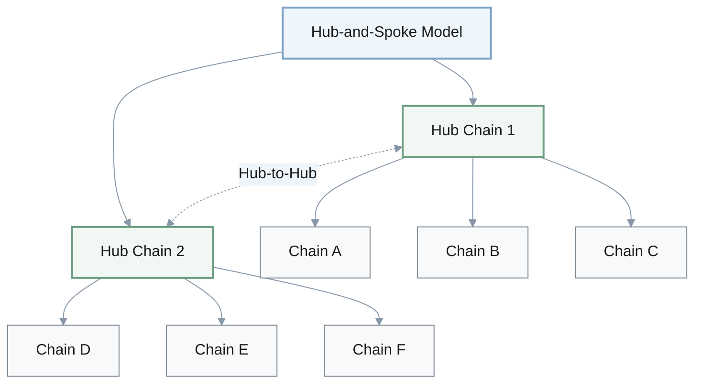

**Connection Complexity Reduction:**

| Approach | Connection Count Formula | Example (20 chains) | Audit Surface |
|----------|-------------------------|---------------------|---------------|
| **Full Mesh** | $N \times (N-1) / 2$ | 190 connections | Very High |
| **Hub-and-Spoke (3 hubs)** | $N + \text{hub connections}$ | ~23 connections | Low |
| **Shared Security Zones (4 zones)** | $\text{zones} \times (\text{zones}-1) / 2$ | 6 zone bridges | Very Low |

**ZK-Verified Checkpoint Architecture:**

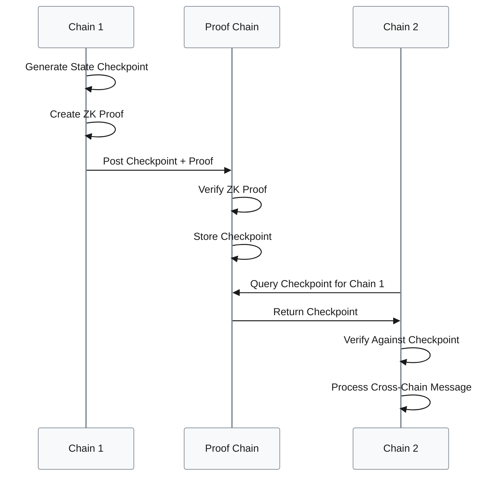

**Intent-Centric Routing:**

| User Intent | Available Routes | Route Selection Criteria | Fallback Strategy |
|-------------|-----------------|-------------------------|------------------|
| Transfer 100 ETH to Chain B | IBC, ZK Bridge, Multisig | Cheapest with <10s latency | Try next route |
| High-value RWA transfer | ZK Bridge only | Maximum security | Fail if unavailable |
| NFT cross-chain | Shared-Security Zone, IBC | Lowest cost | Queue for batch |

---

## Validator Topology Designs

Validator topology directly impacts decentralization, performance, and failure resilience. Homogeneous validator sets can simplify protocol design but may create rigid trade-offs between throughput and participation barriers. This section explores heterogeneous and geo-aware designs that make these trade-offs more explicit.

### Heterogeneous Validator Strategies

1. Q: Across Bitcoin-like, Ethereum-like, and high-throughput BFT chains, how can we design validator topologies that trade off hardware requirements, geographic spread, and failure modes in a structured way?
   A: **Consensus Engineer:** One pattern is **Heterogeneous Validator Classes**. Define commodity, pro, and archival validator classes with distinct roles and rewards, and require each block to be co-signed across classes.

      **Research Lead:** That lets pro validators run heavy workloads while commodity nodes still participate in censorship resistance and basic validation.

      **Network Engineer:** Building on that, we can form **Rotating Performance Rings**. A subset of high-end validators temporarily takes on extra throughput duties as a fast ring, while a broader set continuously audits them with delayed verification.

      **Consensus Engineer:** This approach narrows latency-critical paths without permanently centralizing power.

      **Geography Specialist:** We should also enforce **Geo-Aware Committees**. Explicitly construct consensus committees that span a minimum number of regions and providers, and bake those constraints into leader selection and committee rotation.

      **Risk Officer:** That makes geographic diversity a protocol invariant instead of a vague aspiration.

      **Architect:** Finally, **Dual-Track Finality**. Offer a fast, small BFT committee for soft finality on the order of hundreds of milliseconds, and a larger, slower committee that delivers hard finality in tens of seconds.

      **Product Lead:** Consequently, applications choose which track to rely on, aligning security cost and latency with each use case's value.

**Validator Topology Design Patterns:**

| Pattern | Validator Classes | Hardware Requirements | Geographic Constraints | Finality Model | Centralization Risk |
|---------|------------------|----------------------|----------------------|----------------|-------------------|
| **Heterogeneous Validator Classes** | Commodity, Pro, Archival | Tiered (low to high) | None enforced | Single track | Low (multi-class) |
| **Rotating Performance Rings** | Fast Ring + Auditors | High (fast ring), medium (auditors) | None enforced | Delayed verification | Medium (ring rotation) |
| **Geo-Aware Committees** | Homogeneous | Medium | Min regions/providers | Single track | Low (distributed) |
| **Dual-Track Finality** | Fast Committee + Full Set | High (fast), medium (full) | Optional | Soft + hard finality | Medium (fast track) |

```mermaid
%%{init: {
  "theme": "base",
  "themeVariables": {
    "primaryColor": "#f8f9fa",
    "primaryTextColor": "#1a1a1a",
    "primaryBorderColor": "#7a8591",
    "lineColor": "#8897a8",
    "secondaryColor": "#eff6fb",
    "tertiaryColor": "#f3f5f7"
  }
}}%%
graph TD
    A[Validator Topology Options]
    
    A --> B[Heterogeneous Classes]
    A --> C[Rotating Rings]
    A --> D[Geo-Aware Committees]
    A --> E[Dual-Track Finality]
    
    B --> B1[Commodity Validators]
    B --> B2[Pro Validators]
    B --> B3[Archival Validators]
    
    C --> C1[Fast Ring: 50 Validators]
    C --> C2[Audit Set: 500 Validators]
    
    D --> D1[Min 3 Regions]
    D --> D2[Min 5 Providers]
    D --> D3[Committee Rotation]
    
    E --> E1[Fast Committee: 100ms]
    E --> E2[Full Committee: 10s]
    
    style A fill:#eff6fb,stroke:#7a9fc5,stroke-width:2px,color:#1a1a1a
    style B fill:#f8f9fa,stroke:#7a8591,stroke-width:2px,color:#1a1a1a
    style C fill:#f8f9fa,stroke:#7a8591,stroke-width:2px,color:#1a1a1a
    style D fill:#f8f9fa,stroke:#7a8591,stroke-width:2px,color:#1a1a1a
    style E fill:#f8f9fa,stroke:#7a8591,stroke-width:2px,color:#1a1a1a
```

**Heterogeneous Validator Class Specification:**

| Class | Hardware Requirements | Stake Requirements | Responsibilities | Rewards | Count (Example) |
|-------|----------------------|-------------------|-----------------|---------|-----------------|
| **Commodity** | 4 CPU, 16GB RAM, 500GB SSD | 10 ETH | Basic validation, censorship resistance | 1x | 1000 validators |
| **Pro** | 16 CPU, 128GB RAM, 2TB NVMe | 100 ETH | Heavy execution, state storage | 3x | 200 validators |
| **Archival** | 32 CPU, 256GB RAM, 10TB NVMe | 500 ETH | Full history, light client proofs | 5x | 50 validators |

**Block Co-Signing Requirements:**

$$
\text{Valid Block} = \text{Signatures from} \geq 67\% \text{ of each validator class}
$$

**Geo-Aware Committee Constraints:**

| Constraint Type | Minimum Requirement | Enforcement Mechanism |
|----------------|--------------------|--------------------|
| **Geographic Regions** | 3 continents | Committee formation algorithm |
| **Cloud Providers** | 5 distinct providers | Provider attestation |
| **Network ASNs** | 10 different ASNs | Network topology analysis |
| **Legal Jurisdictions** | 5 countries | Validator registration |

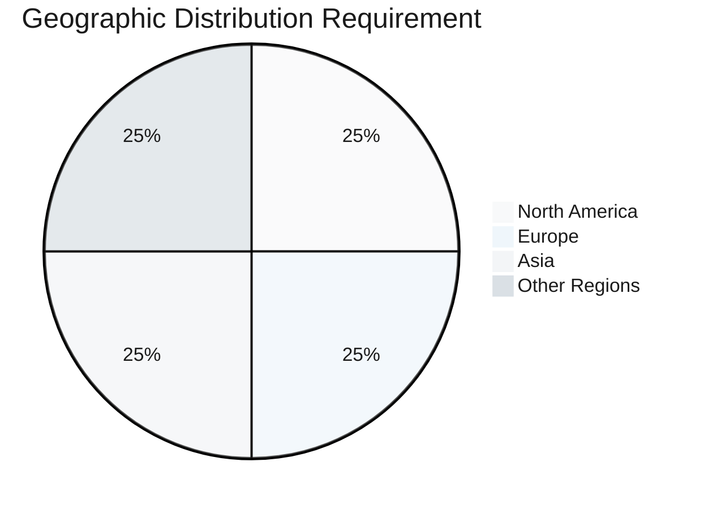

**Dual-Track Finality Model:**

| Track | Committee Size | Latency | Security Assumption | Use Case |
|-------|---------------|---------|-------------------|----------|
| **Soft Finality** | 50-100 validators | 100-500ms | Economic + reputation | Gaming, DEX orders, micropayments |
| **Hard Finality** | 500-1000 validators | 10-30s | Full consensus | High-value transfers, governance |

---

## Enterprise Deployment Blueprints

Enterprise blockchain adoption typically requires reconciling conflicting demands: regulatory compliance, operational safety, cost efficiency, and public verifiability. Monolithic architectural choices can force compromises that may be unnecessary in more modular designs. This section presents deployment blueprints that decompose these requirements across layered architectures.

### Mission-Critical Application Strategies

1. Q: For an enterprise deciding where to deploy a mission-critical application—conservative L1, high-throughput L1, or modular L2 stack—what deployment blueprints let us mix these architectures by risk and performance profile?
   A: **Enterprise Architect:** One blueprint is a **Slow Money, Fast UX** split. Keep balances and legal ownership records on a conservative L1, and push UX-heavy flows—orders, game moves, low-value interactions—to a high-throughput L1 or L2.

      **Compliance Lead:** That treats safety and responsiveness as separate axes: regulators care about the slow, canonical ledger; users care about the fast, responsive surface.

      **Cloud Architect:** Another is **Regulated Core + Public Edge**. Run permissioned or regulated chains or rollups for compliance-intensive logic, and periodically checkpoint into a public L1 for public auditability and anti-tampering guarantees.

      **Enterprise Architect:** Regulators get clear jurisdiction over the core, but we still inherit public-chain security.

      **SRE Lead:** For global deployments, a **Multi-Region Rollup Strategy** works: several rollups anchored to the same settlement L1, each tuned to regional latency and compliance constraints.

      **Cloud Architect:** That captures rollup economics but limits the blast radius of sequencer or configuration failures to a region.

      **Product Lead:** To manage risk over time, we can use a **Phased Pilot-to-Production Path**. Start pilots on a flexible high-throughput L1 to iterate quickly, then progressively migrate canonical state to a more conservative modular stack once requirements stabilize.

      **Enterprise Architect:** Therefore, we get early time-to-value without locking ourselves into a risky long-term base.

**Enterprise Deployment Blueprint Catalog:**

| Blueprint | Settlement Layer | Execution Layer | Data Residency | Compliance Model | Risk Profile |
|-----------|-----------------|-----------------|----------------|------------------|--------------|
| **Slow Money, Fast UX** | Conservative L1 | High-throughput L1/L2 | Mixed | Canonical on L1 | Balanced |
| **Regulated Core + Public Edge** | Public L1 (checkpoints) | Permissioned rollup | Core: restricted | Core regulated, edge public | Low core risk |
| **Multi-Region Rollup** | Single settlement L1 | Region-specific rollups | Per-region | Regional compliance | Isolated failures |
| **Phased Pilot-to-Production** | Pilot: High-throughput → Production: Conservative | Same | Flexible | Evolving | Managed transition |

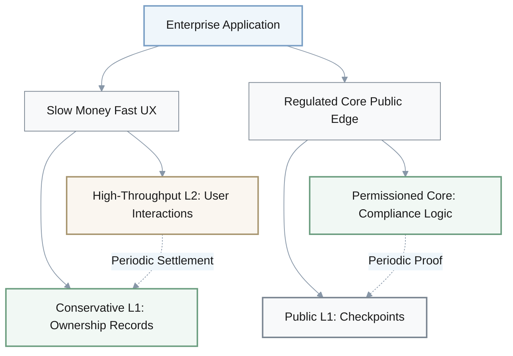

**Slow Money, Fast UX Architecture:**

| Component | Layer | Latency | Cost per Tx | Security | Update Frequency |
|-----------|-------|---------|-------------|----------|------------------|
| **Ownership Records** | Conservative L1 | 10-60s | $1-5 | Highest | Hourly/Daily |
| **Balance Ledger** | Conservative L1 | 10-60s | $1-5 | Highest | Periodic settlement |
| **User Interactions** | L2/High-throughput | 100ms-1s | $0.001-0.01 | High | Real-time |
| **State Proofs** | L1 ← L2 | Settlement intervals | Batched | Cryptographic | Every 10-60 min |

**Multi-Region Rollup Strategy:**

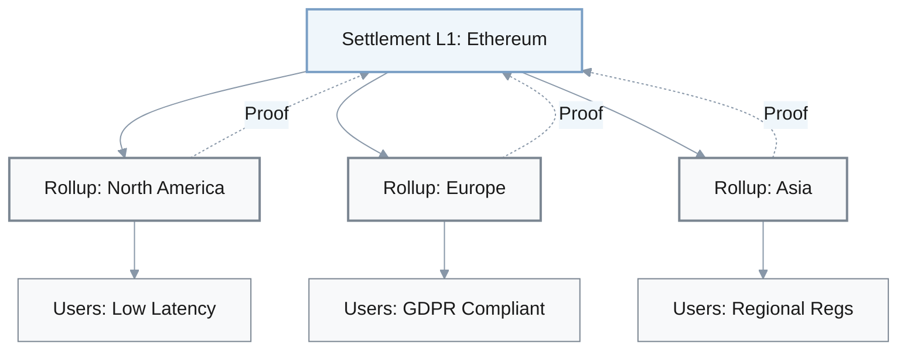

**Phased Migration Timeline:**

| Phase | Duration | Architecture | Primary Goal | Risk Tolerance |
|-------|----------|--------------|-------------|----------------|
| **Pilot** | 3-6 months | High-throughput L1 | Fast iteration, product-market fit | High (acceptable failures) |
| **Scale** | 6-12 months | High-throughput L1 + L2 | User growth, feature expansion | Medium |
| **Production** | 12-24 months | Conservative L1 + modular L2s | Regulatory approval, audit | Low |
| **Steady State** | Ongoing | Full modular stack | Long-term stability | Very low |

---

## Regulatory Risk Mitigation

Regulatory pressure around validator concentration, sequencer centralization, and bridge custodianship can pose challenges to the viability of some public blockchain deployments. Defensive compliance strategies often sacrifice decentralization more than strictly necessary. This section explores architectural patterns that aim to satisfy regulatory requirements while preserving protocol neutrality and credible neutrality.

### Architecture-Driven Compliance Strategies

1. Q: With regulatory pressure increasing around validator concentration, sequencers, and bridges, how can we adapt our architecture to reduce regulatory and systemic risk without abandoning public chains?
   A: **Policy Lead:** First, build **Sequencer Diversity by Design**. Architect L2s with forced sequencer rotation, minimum operator diversity, and transparent on-chain metrics around concentration.

      **Governance Engineer:** That turns single-sequencer risk into a tunable protocol parameter, not a side effect of who showed up first.

      **Compliance Architect:** Second, split **Compliance-Ready Data Layers** from execution. Let jurisdiction-specific DA layers handle retention, privacy, and reporting rules while execution remains permissionless.

      **Policy Lead:** CASPs can then pass audits by choosing appropriate DA layers without forking the whole execution stack.

      **Risk Officer:** Third, concentrate regulatory obligations in **Regulated Access Hubs**. Exchanges and custodial bridges take on KYC/AML and reporting, while base protocols stay neutral.

      **Privacy Engineer:** However, give hubs cryptographic hooks—view keys, ZK attestations—instead of raw surveillance access. That balances compliance with user privacy.

      **Governance Engineer:** Finally, add **Formal Governance Disclosures**. Encode governance and upgrade processes directly in the protocol—timelocks, veto powers, quorum rules—and expose them via machine-readable specs.

      **Policy Lead:** That lets regulators and institutions model governance risk quantitatively, rather than treating us as a black box.

**Regulatory Risk Mitigation Strategies:**

| Strategy | Architecture Change | Regulatory Benefit | Decentralization Impact | Implementation Complexity |
|----------|-------------------|-------------------|------------------------|-------------------------|
| **Sequencer Diversity by Design** | Forced rotation, min diversity metrics | Demonstrates anti-concentration | Positive | Medium |
| **Compliance-Ready Data Layers** | Separate DA from execution | Jurisdiction-specific compliance | Neutral | High |
| **Regulated Access Hubs** | Hub model for CASP obligations | Clear regulatory perimeter | Positive (base neutral) | Low-Medium |
| **Formal Governance Disclosures** | Machine-readable governance specs | Quantifiable risk assessment | Neutral | Low |

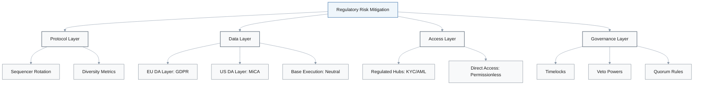

**Sequencer Diversity Enforcement:**

| Metric | Target | Enforcement Mechanism | Monitoring |
|--------|--------|---------------------|------------|
| **Min Sequencer Count** | ≥5 active | Protocol rejects blocks from <5 | On-chain tracker |
| **Max Single-Operator Share** | <30% | Rotation algorithm | Per-epoch measurement |
| **Geographic Distribution** | ≥3 regions | Provider attestation | Real-time dashboard |
| **Rotation Frequency** | Every 100 blocks | Forced rotation logic | Automatic |

**Compliance-Ready Data Layer Architecture:**

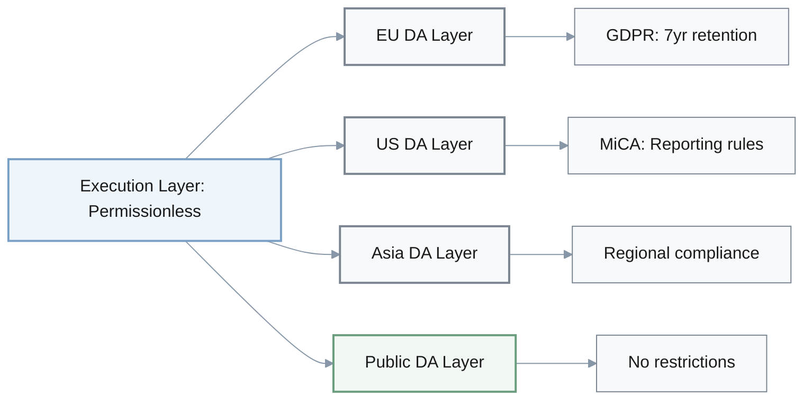

**Regulated Access Hub Model:**

| Component | Regulatory Status | User Access | Privacy Features | Reporting Obligations |
|-----------|------------------|-------------|------------------|---------------------|
| **Base Protocol** | Permissionless | Direct | Full anonymity | None |
| **Regulated Hub** | CASP licensed | KYC/AML required | View keys for compliance | Full transaction reporting |
| **User Choice** | N/A | Hub or direct | Opt-in to hub | Only if using hub |

**Formal Governance Disclosure Schema:**

| Governance Parameter | Specification | Machine-Readable Format | Auditor Use Case |
|---------------------|---------------|------------------------|------------------|
| **Upgrade Timelock** | 7 days minimum | JSON schema + on-chain | Risk modeling |
| **Proposal Quorum** | 10% of staked tokens | Smart contract ABI | Vote analysis |
| **Veto Powers** | Security council: 3-of-5 | Multi-sig addresses | Centralization assessment |
| **Emergency Procedures** | Pause: 24hr max, resume requires vote | On-chain events | Incident response planning |

---

## Future Evolution Strategies

Blockchain protocols are likely to need to evolve to incorporate ZK scaling, post-quantum cryptography, and AI-augmented operations. However, frequent hard forks can create coordination overhead and upgrade risk. This section presents architectural strategies that are intended to support continuous evolution without triggering perpetual hard-fork cycles.

### Long-Term Technology Integration

1. Q: Looking 3–5 years ahead, how can we evolve our existing chain toward ZK scaling, post-quantum cryptography, and AI-assisted DevOps without triggering hard-fork chaos every year?
   A: **Cryptography Lead:** One approach is to introduce a Crypto-Agile Shell layer: an abstraction where signature and hash schemes are versioned and upgradable via governance, so PQC and new hash functions can be swapped in behind stable APIs.

      **Protocol Engineer:** That localizes cryptographic churn; clients code against the shell, not individual algorithms.

      **ZK Engineer:** In parallel, we can move toward ZK-Native State Commitments. Shift from block-oriented views to succinct, ZK-verifiable state commitments so light clients and bridges validate proofs instead of replaying full execution.

      **Interop Architect:** That makes it much easier to plug in new rollups and sidechains over time.

      **SRE Lead:** On the operations side, treat AI as part of the architecture with AI-Augmented Node and Dev Tooling. Standardize telemetry, traces, and formal specs so AI systems can auto-analyze incidents, propose patches, and suggest parameter changes under human review.

      **Operations Engineer:** That shortens reaction time to emerging risks once we trust the workflows.

      **Core Dev Lead:** Structurally, adopt a Modular Reference Implementation Strategy. Maintain multiple well-specified reference clients—Rust, Go, Move—that share a canonical spec and conformance tests, and evolve the spec in small, frequent steps.

      **Cryptography Lead:** Many small, spec-driven updates across independent clients is far safer than infrequent giant forks while we are simultaneously managing ZK scaling, PQC, and AI changes.

**Future Evolution Strategies:**

| Strategy | Technology Addressed | Architecture Change | Upgrade Frequency | Hard Fork Risk | Benefits |
|----------|---------------------|-------------------|------------------|----------------|----------|
| **Crypto-Agile Shell** | Post-quantum cryptography | Versioned crypto APIs | Per-algorithm (years) | Low | Smooth PQC transition |
| **ZK-Native State Commitments** | ZK scaling | State proofs over blocks | Continuous | Very low | Easy rollup integration |
| **AI-Augmented DevOps** | AI tooling | Standardized telemetry | Real-time | None (ops layer) | Faster incident response |
| **Modular Reference Implementations** | All changes | Multi-client specs | Frequent small updates | Very low | Distributed risk |

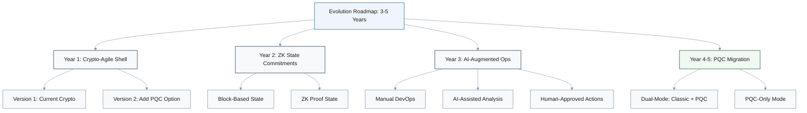

**Crypto-Agile Shell Architecture:**

| Cryptographic Component | Version 1 (Current) | Version 2 (PQC) | API Surface | Migration Path |
|------------------------|-------------------|----------------|-------------|----------------|
| **Signatures** | ECDSA secp256k1 | CRYSTALS-Dilithium | `sign()`, `verify()` | Dual-mode → deprecate v1 |
| **Hashes** | SHA-256 | SHA-3 / BLAKE3 | `hash()` | Parallel support |
| **Key Exchange** | ECDH | Kyber | `keyExchange()` | Negotiation protocol |
| **VRF** | ECVRF | PQ-VRF (research) | `vrf()` | Research → deploy |

**Signature Verification with Crypto-Agile Shell:**

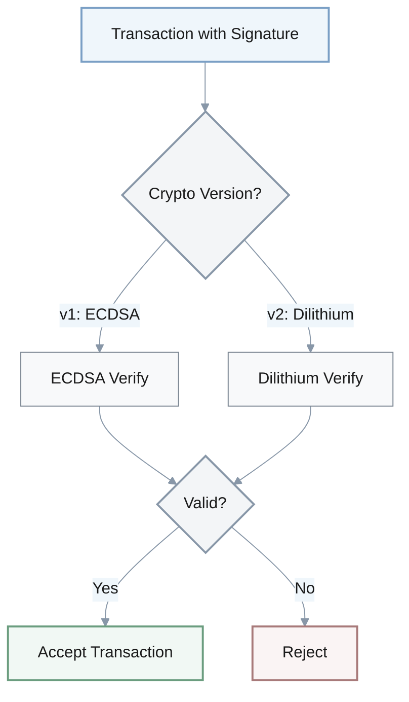

**ZK-Native State Commitment Evolution:**

| Commitment Type | Size | Verification Cost | Light Client Support | Rollup Integration | Timeline |
|-----------------|------|------------------|---------------------|-------------------|----------|
| **Block-Based (Current)** | Full block | High (replay) | Limited | Complex | Now |
| **Merkle Root** | 32 bytes | Medium (proof size) | Basic | Moderate | Current |
| **ZK State Proof** | ~100 bytes | Low (SNARK verify) | Full | Easy | 2-3 years |

**State Commitment Size Comparison:**

$$
\text{Verification Cost Reduction} = \frac{\text{Block Replay Cost}}{\text{ZK Proof Verification Cost}} \approx 10,000\text{x to }100,000\text{x}
$$

**AI-Augmented DevOps Architecture:**

| AI Component | Input Data | AI Analysis | Human Review | Action Taken |
|--------------|-----------|-------------|--------------|--------------|
| **Incident Detector** | Logs, metrics, traces | Anomaly detection | Alert escalation | Auto-alert |
| **Root Cause Analyzer** | Incident data | Causal inference | Approve diagnosis | Diagnostic report |
| **Patch Proposer** | Codebase, bug report | Code generation | Code review | PR submission |
| **Parameter Optimizer** | Network telemetry | Optimization | Governance vote | Parameter update |

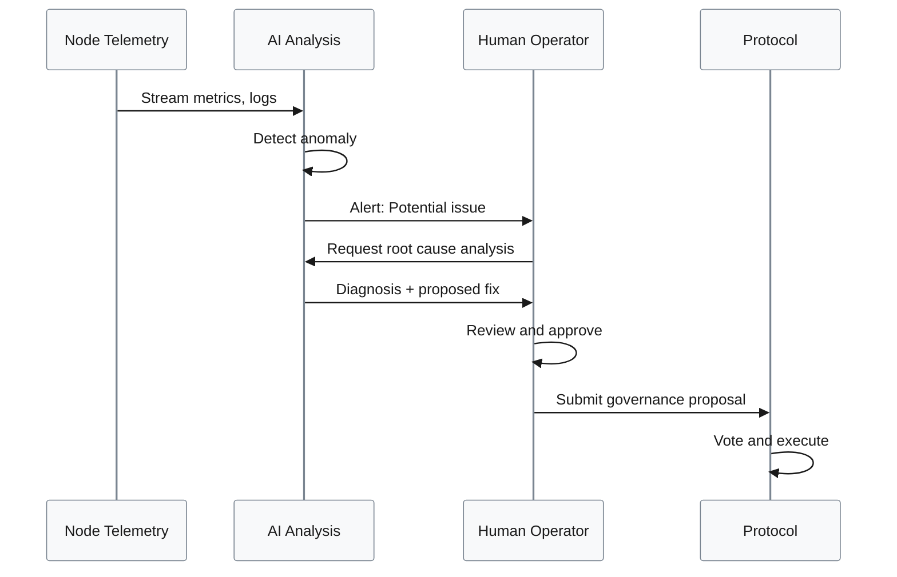

**Modular Reference Implementation Strategy:**

| Client | Language | Maintainer | Specialty | Update Cadence |
|--------|----------|-----------|-----------|----------------|
| **Client A** | Rust | Team 1 | Performance, correctness | Every 2 weeks |
| **Client B** | Go | Team 2 | Ease of deployment | Every 2 weeks |
| **Client C** | Move | Team 3 | Formal verification | Every month |
| **Canonical Spec** | Markdown + formal spec | Core devs | Source of truth | Weekly |
| **Conformance Tests** | Test suite | All teams | Compatibility | Daily |

**Spec-Driven Evolution Benefits:**

| Benefit | Traditional Hard Fork | Modular Spec-Driven |
|---------|----------------------|-------------------|
| **Client Diversity** | Single implementation risk | Multiple independent clients |
| **Update Frequency** | 1-2 per year | Weekly spec updates |
| **Rollback Complexity** | Very high | Revert spec version |
| **Testing Coverage** | Manual coordination | Automated conformance tests |
| **Innovation Speed** | Slow (coordination) | Fast (independent impl) |

---

## Summary

This document explores creative blockchain architecture strategies across multiple dimensions. Rather than prescribing monolithic solutions, it presents structured frameworks for navigating complex trade-offs.

### **Architecture Selection**
State model strategies include dual-layer UTXO + contract hubs, hybrid account-based cores with Move sidecars, Move-first approaches, and phased migration paths. These strategies balance UTXO simplicity, account-based ecosystem compatibility, and Move/object safety guarantees for different use cases.

### **Monolithic vs Modular**
Decision frameworks include workload segmentation (latency-sensitive vs settlement-critical), SLO-based scoring (p95 latency, outage tolerance), and regulatory constraints. Hybrid topologies separate edge performance from core safety while enforcing geographic distribution.

### **Parallel Execution**
Hybrid designs combine best-effort access hints, object-bucket partitioning, compiler-inferred access sets, and tiered fast paths. These approaches can deliver 10-100x throughput gains with graceful degradation when hints are absent or incorrect in suitable workloads.

### **Cross-Chain Interoperability**
Advanced architectures—hub-spoke light-client meshes, ZK-verified checkpoints, shared-security zones, and intent-centric routing—can reduce connection complexity from N² to approximately N in many practical deployments. Moreover, they significantly reduce reliance on trusted multisig dependencies while maintaining composability.

### **Validator Topologies**
Heterogeneous validator classes, rotating performance rings, geo-aware committees, and dual-track finality help enable structured trade-offs between hardware requirements, geographic diversity, and censorship resistance. These patterns help make decentralization more explicitly measurable and enforceable.

### **Enterprise Deployment**
Deployment blueprints are designed to separate concerns: slow money/fast UX splits aim to balance safety and responsiveness; regulated core/public edge architectures can satisfy compliance while preserving public verifiability; multi-region rollups help isolate geographic failure domains; phased pilot-to-production paths help manage risk over time.

### **Regulatory Risk**
Sequencer diversity mechanisms, compliance-ready data layers, regulated access hubs, and formal governance disclosures help address regulatory pressure without necessarily sacrificing protocol neutrality. Specifically, these patterns localize many compliance obligations while keeping base protocols permissionless.

### **Future Evolution**
Crypto-agile shells can enable smoother post-quantum transitions; ZK-native state commitments can simplify rollup integration; AI-augmented DevOps can accelerate incident response; modular reference implementations can help distribute upgrade risk. Collectively, these strategies are intended to support continuous protocol evolution without necessitating perpetual hard-fork cycles.
