## 1. Benchmark TPS Numbers vs Real-World Performance

**Q:** When our reports cite Solana, Aptos, and Sui benchmark TPS numbers (like 65,000–160,000 TPS) to argue they're better for "commercial-grade" or latency-sensitive workloads than Ethereum L1, how much weight should we really give those benchmarks for real-world applications?

### Discussion

**Analyst A:** Good question. [pause] My instinct is "not that much" by default. Those TPS numbers usually come from idealized lab conditions—no MEV-style traffic, limited state bloat, fairly homogeneous validator hardware, and clean network conditions.

**Engineer B:** Exactly. And they quietly assume that end-to-end system performance is dominated by L1 TPS. In practice, many bottlenecks live off-chain: wallets, RPC and indexing infra, bridges, compliance and KYC checks. Any of those can erase the theoretical throughput edge.

**Risk Lead C:** Mm-hmm. Plus, the claims almost never come with realized mainnet numbers under load. We rarely see sustained TPS, latency distributions, or outage frequency reported side by side.

**Analyst A:** Right. So benchmarks are a useful hint, but not a decision by themselves.

**Engineer B:** Agreed. To treat the argument as strong, we'd want longitudinal production metrics—TPS, p95 latency, uptime, incident counts—for representative workloads across chains, not just a whitepaper chart.

### Key Issues with Benchmark TPS Claims

```mermaid
%%{init: {
  "theme": "base",
  "themeVariables": {
    "primaryColor": "#f8f9fa",
    "primaryTextColor": "#1a1a1a",
    "primaryBorderColor": "#7a8591",
    "lineColor": "#8897a8",
    "secondaryColor": "#eff6fb",
    "tertiaryColor": "#f3f5f7"
  }
}}%%
graph TD
    A[Benchmark TPS Claims] --> B[Idealized Lab Conditions]
    A --> C[Off-Chain Bottlenecks]
    A --> D[Missing Production Data]
    
    B --> B1[No MEV Traffic]
    B --> B2[Limited State Bloat]
    B --> B3[Homogeneous Hardware]
    B --> B4[Clean Network]
    
    C --> C1[Wallet Performance]
    C --> C2[RPC Infrastructure]
    C --> C3[Indexing Systems]
    C --> C4[Compliance Checks]
    
    D --> D1[No Sustained TPS]
    D --> D2[No Latency Distribution]
    D --> D3[No Outage Frequency]
    
    style A fill:#f8f9fa,stroke:#7a8591,stroke-width:2px,color:#1a1a1a
    style B fill:#faf4f4,stroke:#a87a7a,stroke-width:2px,color:#1a1a1a
    style C fill:#faf4f4,stroke:#a87a7a,stroke-width:2px,color:#1a1a1a
    style D fill:#faf4f4,stroke:#a87a7a,stroke-width:2px,color:#1a1a1a
```

### What's Missing from Current Benchmarks

| Missing Metric | Why It Matters | Current Status |
|----------------|----------------|----------------|
| **Sustained TPS** | Lab burst vs real workload | Rarely reported |
| **p95 Latency** | User experience reliability | Usually omitted |
| **Uptime %** | Production stability | Not side-by-side |
| **Incident Count** | Operational maturity | Incomplete data |
| **Load Conditions** | Real traffic patterns | Idealized only |

### Stronger Evidence Requirements

- **Longitudinal production metrics** across multiple chains
- **Representative workloads** under realistic conditions
- **Latency distributions** (not just averages)
- **Sustained throughput** over extended periods
- **Off-chain infrastructure** performance analysis

---

## 2. Monolithic vs Modular Architecture Safety

**Q:** Some documents say that monolithic, high-performance chains like Solana are "unsuitable for mission-critical finance" because of their historical outages, while modular approaches such as Ethereum L1 + rollups or Polkadot are inherently safer. Does that outage history really prove monolithic designs are unfit for high-value use cases?

### Discussion

**Architect A:** I'd be careful there. The argument tends to overgeneralize from a small set of early incidents, as if the original architectural flaws can never be mitigated—ignoring improvements in client diversity, congestion control, or operational processes.

**Risk Lead B:** Right. And it sometimes treats "modular" architectures as automatically safer. But they have their own systemic risks—bridge failures, sequencer centralization, and data-availability assumptions—that have caused multi-hundred-million-dollar losses.

**Analyst C:** Good point. The evidence also tends to be qualitative: counting outages on Solana, say, without normalizing for downtime hours per year, incident severity, or recovery quality across different chains.

**Architect A:** Exactly. So instead of "monolithic bad, modular good," a stronger argument would compare risk-adjusted reliability: uptime, blast radius, and recovery guarantees for concrete financial use cases, looking across both monolithic and modular designs.

### Systemic Risk Comparison

| Architecture Type | Claimed Advantages | Under-Reported Risks | Loss Events |
|-------------------|-------------------|----------------------|-------------|
| **Monolithic** | Simple, unified security | Historical outages, congestion | Downtime incidents |
| **Modular** | Fault isolation, flexibility | Bridge exploits, sequencer centralization, DA failures | $100M+ bridge losses |

### Problems with Current Arguments

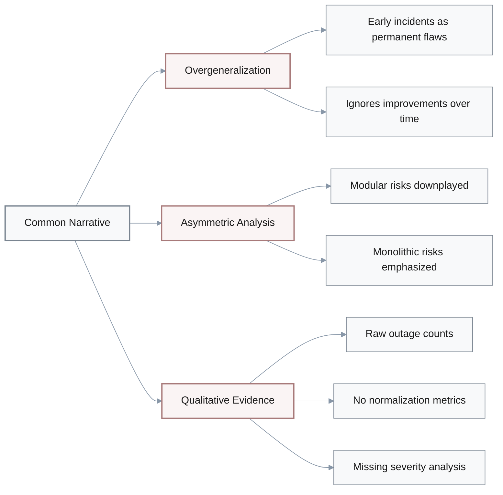

### Rigorous Reliability Comparison Framework

**Required Metrics:**
- **Uptime percentage** (normalized per year)
- **Downtime hours** (total and by severity)
- **Blast radius** (users/value affected per incident)
- **Recovery time** (mean time to resolution)
- **Incident trend** (improving vs worsening)
- **Root cause diversity** (systemic vs operational)

**Modular-Specific Metrics:**
- Bridge exploit frequency and loss amounts
- Sequencer uptime and centralization risk
- Data availability failure modes
- Cross-layer correlation risk

---

## 3. Decentralization Metrics and Security Claims

**Q:** When reports use metrics like the Nakamoto coefficient or raw validator count to claim that some chains (for example, Polkadot or certain Cosmos zones) are "more decentralized and therefore more secure" than Ethereum, Solana, Aptos, or Sui, how robust is that inference for real security and censorship-resistance?

### Discussion

**Researcher A:** Hmm, the problem is that each decentralization metric captures only a slice of reality. A high Nakamoto coefficient doesn't tell you about stake delegation patterns, correlated staking providers, client diversity, or jurisdictional clustering.

**Engineer B:** Right, and those reports often treat a snapshot of the metric as if it were stable. They rarely show how it changes under stress—during slashing events, market crashes, or regulatory shocks.

**Risk Lead C:** Exactly. They also tend to ignore cross-layer centralization. Custodians, liquid staking protocols, and major RPC or infrastructure providers can concentrate practical control even when the base-layer validator set appears diverse on paper.

**Researcher A:** Got it. So the raw "higher Nakamoto coefficient → more secure" leap is weak.

**Engineer B:** Agreed. A stronger approach would combine several views: stake and operator concentration, client and implementation diversity, geographic and regulatory dispersion, and observed censorship or MEV behavior during contentious events.

### Limitations of Single Decentralization Metrics

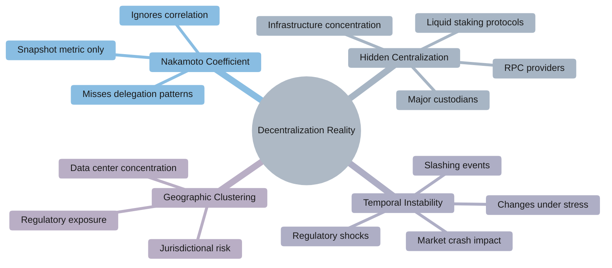

### Multi-Dimensional Decentralization Analysis

| Dimension | What It Measures | Why Single Metrics Fail |
|-----------|------------------|-------------------------|
| **Stake Distribution** | Nakamoto coefficient, Gini | Ignores delegation, correlated operators |
| **Client Diversity** | Implementation distribution | Single metric misses upgrade coordination risk |
| **Geographic Distribution** | Validator location spread | Doesn't capture jurisdictional clustering |
| **Infrastructure Providers** | Hosting/RPC concentration | Often invisible in validator counts |
| **Governance Control** | Decision-making power | Not reflected in validator metrics |
| **Observed Behavior** | Actual censorship/MEV patterns | Theoretical metrics miss practice |

### Comprehensive Decentralization Framework

**Layer 1: Base Consensus**
- Stake concentration (Nakamoto coefficient)
- Operator independence (correlated staking)
- Hardware diversity (homogeneous vs heterogeneous)

**Layer 2: Infrastructure**
- Client implementation diversity
- RPC provider concentration
- Data availability provider distribution

**Layer 3: Geographic & Regulatory**
- Jurisdictional dispersion
- Data center concentration
- Regulatory exposure clustering

**Layer 4: Practical Control**
- Liquid staking protocol dominance
- Custodian concentration
- MEV extraction patterns

**Layer 5: Stress Testing**
- Metric stability during market crashes
- Behavior during contentious events
- Recovery from slashing incidents

> **Key Insight:** A high Nakamoto coefficient alone does NOT guarantee censorship-resistance or security. Multi-layer analysis across all dimensions is required.

---

## 4. Move Language Safety Claims

**Q:** Our investigations often assert that Move-based platforms (Aptos, Sui) "materially reduce entire classes of smart contract vulnerabilities" and will therefore be safer for enterprise and RWA deployments than EVM chains. Do resource-oriented types and better formal verification support such a strong safety conclusion today?

### Discussion

**Engineer A:** Fair question. [pause] It's fair to say that linear, resource-oriented types can eliminate specific bug classes—certain reentrancy or asset-duplication patterns are just structurally harder or impossible.

**Security Researcher B:** True. But the leap from "fewer of these bugs" to "overall platform is safer" is big. We don't yet have long production histories, and much risk lives outside the language semantics.

**Risk Lead C:** Exactly. Tooling is still immature, there are fewer auditors with deep Move expertise, and consensus or implementation bugs can still bite, regardless of the smart-contract language.

**Engineer A:** Right. And the evidence we cite is mostly theoretical—language design papers, whitepapers—not empirical metrics like incident rates per LOC or loss amounts compared with EVM over time.

**Security Researcher B:** Mm-hmm. So a more defensible position is: Move plus formal verification can reduce certain bug classes, but "safer overall" needs empirical backing—audited Move vs Solidity contracts of similar complexity, real exploit statistics, and a clear separation between "bugs prevented by the type system" and those that still need process and tooling.

### Move Language Safety Analysis

```mermaid
%%{init: {
  "theme": "base",
  "themeVariables": {
    "primaryColor": "#f8f9fa",
    "primaryTextColor": "#1a1a1a",
    "primaryBorderColor": "#7a8591",
    "lineColor": "#8897a8",
    "secondaryColor": "#eff6fb",
    "tertiaryColor": "#f3f5f7"
  }
}}%%
graph TD
    A[Move Safety Claims] --> B[Proven Benefits]
    A --> C[Unproven Leaps]
    A --> D[Hidden Risks]
    
    B --> B1[Eliminates specific bug classes]
    B --> B2[Resource-oriented types work]
    B --> B3[Formal verification possible]
    
    C --> C1[Fewer bugs to overall safer]
    C --> C2[Theory to practice]
    C --> C3[No long production history]
    
    D --> D1[Immature tooling]
    D --> D2[Fewer expert auditors]
    D --> D3[Consensus bugs persist]
    D --> D4[Implementation risks remain]
    
    style A fill:#f8f9fa,stroke:#7a8591,stroke-width:2px,color:#1a1a1a
    style B fill:#f1f8f4,stroke:#6b9d7f,stroke-width:2px,color:#1a1a1a
    style C fill:#faf6f0,stroke:#a89670,stroke-width:2px,color:#1a1a1a
    style D fill:#faf4f4,stroke:#a87a7a,stroke-width:2px,color:#1a1a1a
```

### Bug Class Prevention vs Overall Safety

| Vulnerability Type | Move Prevention Strength | Still Possible? | Requires Additional Controls? |
|--------------------|-------------------------|-----------------|-------------------------------|
| **Reentrancy** | Strong (resource semantics) | Rare edge cases | Some patterns |
| **Asset Duplication** | Strong (linear types) | Implementation bugs | Runtime checks |
| **Integer Overflow** | Moderate (type system) | Logic errors | Careful design |
| **Access Control** | Weak (application logic) | Yes | Standard practices |
| **Consensus Bugs** | None (language-independent) | Yes | Testing, audits |
| **Economic Exploits** | None (design-level) | Yes | Game theory analysis |

### Evidence Gap Analysis

**Current Evidence (Theoretical):**
- Language design papers
- Type system proofs
- Whitepaper claims
- Formal verification capabilities

**Missing Evidence (Empirical):**
- Incident rates per LOC (Move vs Solidity)
- Real exploit statistics over time
- Loss amounts comparison
- Audited contracts of similar complexity
- Production bug frequency data
- Time-to-fix metrics

### Risk Landscape Beyond Language

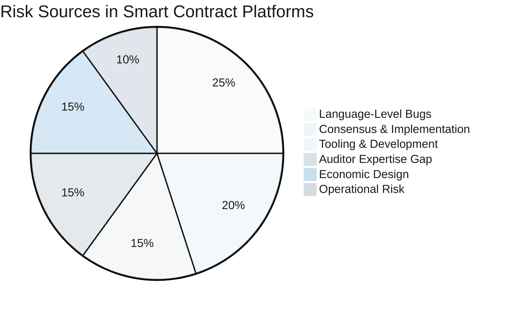

### Defensible Position Framework

$$
\text{Overall Safety} \neq \text{Language Safety Alone}
$$

**Components of Platform Safety:**

$$
\text{Platform Safety} = f(\text{Language}, \text{Tooling}, \text{Auditing}, \text{Consensus}, \text{Ops}, \text{History})
$$

**Required for Strong Claims:**
1. **Empirical comparison** of Move vs Solidity exploits
2. **Controlled study** of similar-complexity contracts
3. **Ecosystem maturity** metrics (auditor availability, tool quality)
4. **Production incident** tracking over multiple years
5. **Clear taxonomy** of bugs prevented vs remaining

> **Key Caveat:** Move reduces specific bug classes through type system design, but overall platform safety requires empirical validation across all risk layers, not just language semantics.

---

## 5. Shared-Security Architectures and Bridge Risk

**Q:** Some reports argue that shared-security architectures—Polkadot's relay chain plus parachains, or Cosmos IBC with Tendermint light clients—"solve bridge risk" compared with ad-hoc multisig bridges exploited for billions. Is it justified to treat these designs as effectively eliminating systemic bridge risk?

### Discussion

**Architect A:** Good question. They definitely improve the trust model relative to basic multisig bridges, but stronger is not the same as negligible. You add new complexity: relay-chain consensus, light-client implementations, governance layers—all of which can fail.

**Security Researcher B:** Right. And the comparisons can be unfair. They pit the worst historical failures of early bridges like Ronin or Wormhole against the design intent of newer protocols, instead of examining currently deployed code and its incident history.

**Risk Lead C:** Good point. There's also correlated failure to consider. A consensus bug or governance exploit on the relay or hub chain could simultaneously impact many parachains or zones.

**Architect A:** Exactly. So rather than saying "shared security solves bridge risk," the more careful statement is that it changes and often improves the trust assumptions—but leaves meaningful residual risk.

**Security Researcher B:** Agreed. To back that up rigorously, we'd want formal threat models, independent audits of light-client and XCMP/IBC implementations, and empirical data on near-misses and incidents, not just architecture diagrams.

### Bridge Trust Model Evolution

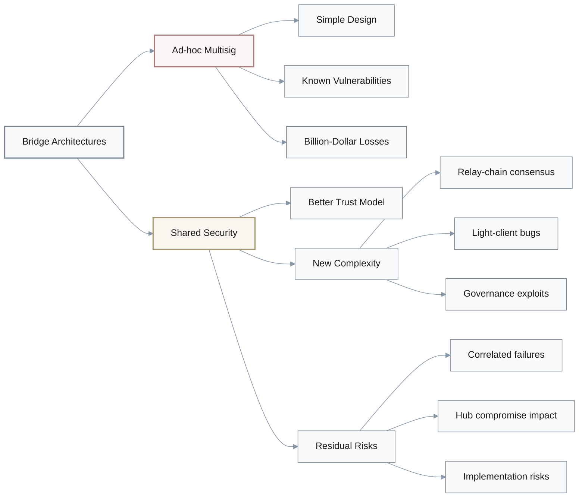

### Bridge Architecture Comparison

| Architecture | Trust Model | Historical Losses | New Attack Vectors | Correlated Failure Risk |
|--------------|-------------|-------------------|-------------------|------------------------|
| **Ad-hoc Multisig** | Trusted signers | $2B+ (Ronin, Wormhole) | Key compromise, collusion | Low (isolated) |
| **Polkadot Relay** | Shared validator set | Limited history | Relay consensus, XCMP bugs | High (many parachains) |
| **Cosmos IBC** | Light clients | Limited history | Light-client bugs, hub exploits | Moderate (connected zones) |

### Unfair Comparison Pattern

**Typical Narrative:**
- **Multisig bridges**: Cite worst historical failures (Ronin: $625M, Wormhole: $325M)
- **Shared security**: Compare against design intent, not deployed code reality

**Fair Comparison Would Require:**
- Current state-of-art multisig bridges (threshold signatures, MPC, upgrades)
- Actual incident history of shared-security bridges
- Near-miss analysis for both architectures
- Formal threat models for both designs

### Correlated Failure Analysis

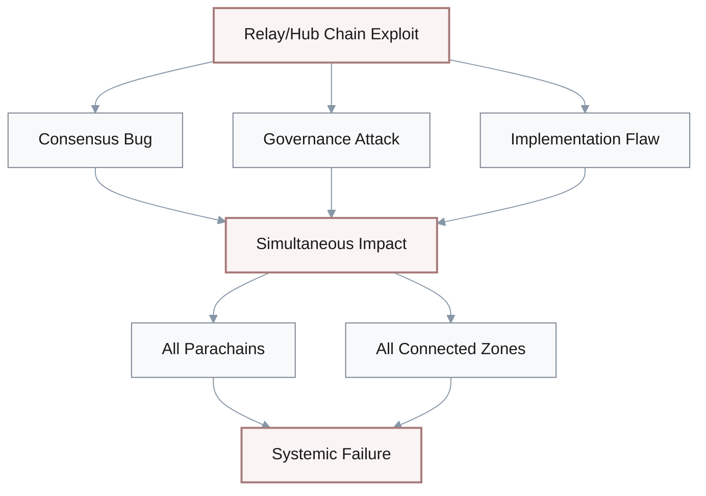

### Risk Transformation, Not Elimination

**What Shared Security Does:**
- ✅ Eliminates trusted multisig key holders
- ✅ Leverages existing validator security budget
- ✅ Provides cryptographic proofs of cross-chain state

**What It Doesn't Do:**
- ❌ Eliminate all bridge risk
- ❌ Prevent consensus-level failures
- ❌ Remove implementation bugs
- ❌ Avoid governance exploits
- ❌ Stop correlated failures across connected chains

### Required Evidence for Strong Claims

1. **Formal threat models** for relay-chain and hub-chain architectures
2. **Independent security audits** of:
   - Light-client implementations
   - XCMP/IBC protocol code
   - Governance mechanisms
3. **Empirical incident data:**
   - Near-miss events
   - Actual exploits or failures
   - Time-to-detection and time-to-fix
4. **Correlated failure analysis:**
   - Single point of failure identification
   - Blast radius quantification
   - Recovery scenarios

> **Key Insight:** Shared-security architectures **improve** the trust model but **transform** rather than **eliminate** bridge risk. Claims of "solving" bridge risk overstate current evidence.

---

## 6. Ethereum Rollup-Centric Roadmap Trade-offs

**Q:** Ethereum's rollup-centric roadmap plus EIP-4844 is often described as "solving scalability while preserving decentralization," implying that modular Ethereum with rollups is strictly superior to launching new high-throughput L1s. How complete is that story when we look at real trade-offs for builders and regulators?

### Discussion

**Architect A:** I see this often—the narrative tends to underplay centralization and trust issues around rollup sequencers, provers, and upgrade keys. Those can become chokepoints that look much like concentrated validator sets on alternative L1s.

**Engineer B:** Mm-hmm. It also assumes that data-availability guarantees and L1 finality are always enough. We rarely see quantitative analysis of how DA failures, client bugs, or reorgs would affect L2 solvency and user funds.

**Risk Lead C:** Good point. And the comparison is usually asymmetric. We celebrate L2 composability on Ethereum but gloss over cross-rollup fragmentation, UX friction in bridging, and week-long fraud windows for optimistic rollups.

**Architect A:** Right. So the argument that "modular + rollups is strictly superior" is incomplete.

**Engineer B:** Agreed. A stronger case would compare full-stack risk and latency—L1 plus L2—against single-chain alternatives, including who's accountable in failure scenarios: L1 devs, sequencer operators, or bridge providers, especially from a regulator's point of view.

### Hidden Centralization in Rollups

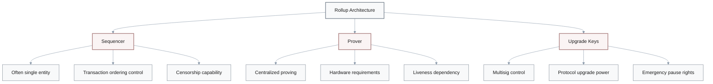

### Asymmetric Comparison Analysis

| Aspect | Rollup Narrative | Reality Check | Alternative L1 Comparison |
|--------|------------------|---------------|---------------------------|
| **Decentralization** | "Inherits L1 security" | Sequencer, prover centralization | Similar to concentrated validators |
| **Composability** | "Native L2 composability" | Cross-rollup fragmentation | Better within single L1 |
| **Finality** | "L1 finality guaranteed" | Week-long fraud windows (optimistic) | Faster on many L1s |
| **UX** | "Seamless experience" | Bridging friction, multiple tokens | Simpler on unified L1 |
| **Accountability** | "Clear responsibility" | Blurred: L1, sequencer, bridge? | Single chain operator |

### Under-Discussed Rollup Risks

**Data Availability Failures:**
- L1 reorgs affecting L2 state
- Client bugs in DA verification
- Blob market congestion (post-EIP-4844)
- Impact on L2 solvency unclear

**Optimistic Rollup Challenges:**
- **7-day fraud proof windows** (user friction)
- Prover liveness assumptions
- Economic security of fraud proofs
- Capital efficiency vs security trade-off

**ZK-Rollup Challenges:**
- **Trusted setup requirements** (some designs)
- Prover centralization (high hardware costs)
- Upgrade key control concentration
- Circuit bugs as new attack vector

### Full-Stack Comparison Framework

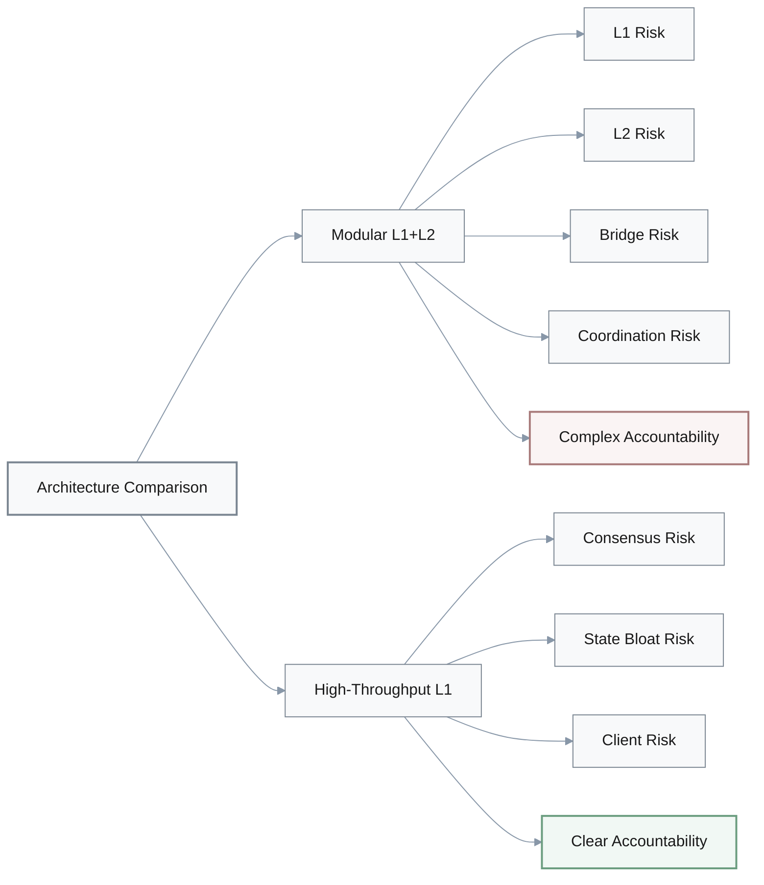

### Accountability Matrix (Regulatory Perspective)

| Failure Scenario | L1+Rollup | High-Throughput L1 | Regulatory Clarity |
|------------------|-----------|-------------------|-------------------|
| **Loss of Funds** | L1? Sequencer? Bridge? | Validator set responsible | Clear on L1, murky on rollups |
| **Censorship** | Sequencer (temporary), L1 (forced inclusion) | Validator set | Split responsibility unclear |
| **Protocol Bug** | L1 devs vs L2 devs vs bridge | Core devs | Single point clearer |
| **Downtime** | Which layer failed? | Chain down | Diagnosis simpler |
| **Fraud/Exploit** | Cross-layer investigation | Single-layer investigation | Investigation complexity |

### Missing Quantitative Analysis

**Required for Fair Comparison:**
1. **Full-stack latency**: User action → L2 finality → L1 finality
2. **Cross-rollup friction**: Time and cost to move assets
3. **Failure mode analysis**: DA failure impact on L2 solvency
4. **Liveness dependency**: Sequencer/prover downtime effects
5. **Economic security**: Fraud proof incentives vs attack costs
6. **Capital efficiency**: Fraud window impact on DeFi
7. **Regulatory accountability**: Liability mapping in multi-layer failures

### Trade-off Summary

**Rollup Advantages:**
- Leverage existing L1 security
- Lower base-layer congestion
- Specialized execution environments

**Rollup Disadvantages:**
- Sequencer/prover centralization
- Cross-rollup fragmentation
- Complex accountability
- UX friction (bridging, delays)
- New attack surfaces (DA, fraud proofs)

**High-Throughput L1 Advantages:**
- Unified composability
- Simpler accountability
- Faster finality (no fraud windows)
- Better UX (single token, no bridges)

**High-Throughput L1 Disadvantages:**
- Validator centralization pressure
- State bloat concerns
- Higher hardware requirements
- More concentrated attack surface

> **Key Insight:** Modular Ethereum with rollups is NOT strictly superior to high-throughput L1s. The choice involves complex trade-offs between security, decentralization, UX, and accountability that depend on specific use cases and regulatory requirements.

---

## 7. Institutional Adoption as Proof of Robustness

**Q:** Several analyses infer from institutional moves—Visa, PayPal, Franklin Templeton, Western Union using Solana or Sui; Sui ETNs and trusts—that these chains have reached "institutional-grade" decentralization and security. Does selective institutional adoption prove that the underlying L1s are robust enough for all high-value workloads?

### Discussion

**Analyst A:** [pause] That's a stretch. In practice, what we really see is revealed preference for specific pilots or products, often tightly scoped. It's not a blanket endorsement of the entire chain's risk profile.

**Risk Lead B:** Right. And there's survivorship and selection bias. We mostly hear about successful pilots, not the internal evaluations that rejected certain chains or limited them to non-systemic roles.

**Compliance Officer C:** Exactly. Moreover, the public write-ups rarely describe the risk controls in place: position limits, insurance, off-chain safeguards, or circuit-breakers that compensate for perceived protocol and ecosystem weaknesses.

**Analyst A:** Got it. So "institutions are here, therefore it's safe for anything" is not a logically sound jump.

**Risk Lead B:** Agreed. To argue robustness more convincingly, we'd want explicit risk disclosures, capital-at-risk thresholds, comparative due-diligence outcomes, and a view of how these institutions actually price blockchain-specific risk versus traditional infrastructure.

### Institutional Adoption Logic Flaw

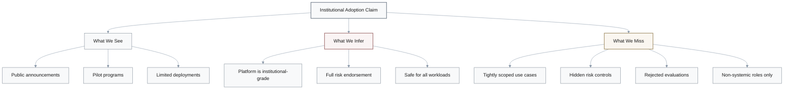

### Institutional Adoption Reality Check

| Institution | Public Narrative | Likely Reality | Risk Controls Disclosed? |
|-------------|-----------------|----------------|-------------------------|
| **Visa** | "Using Solana for payments" | Pilot, specific use case | No position limits mentioned |
| **PayPal** | "Integrated with blockchain" | Limited scope, controlled | Risk framework not public |
| **Franklin Templeton** | "Tokenized fund on-chain" | Small AUM portion, hedged | Insurance/safeguards unclear |
| **Western Union** | "Exploring crypto rails" | Pilot phase, non-systemic | Capital at risk undisclosed |

### Hidden Risk Mitigation Strategies

**What Institutions Don't Publicize:**
- **Position limits**: Cap exposure to any single chain
- **Insurance coverage**: Third-party guarantees for losses
- **Off-chain safeguards**: Backup systems, manual overrides
- **Circuit breakers**: Automatic halt triggers
- **Collateral requirements**: Over-collateralization
- **Legal structures**: Liability isolation mechanisms
- **Multi-chain redundancy**: Diversification across platforms
- **Custodian intermediation**: Risk transfer to specialized entities

### Survivorship Bias Analysis

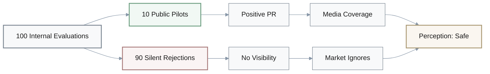

### Selection Bias Pattern

**We Hear About:**
- ✅ Successful pilots and launches
- ✅ Positive use case announcements
- ✅ Partnership agreements
- ✅ ETN and trust launches

**We Don't Hear About:**
- ❌ Failed due diligence assessments
- ❌ Rejected blockchain proposals
- ❌ Chains deemed too risky
- ❌ Pilots quietly shut down
- ❌ Position limits and risk caps
- ❌ Insurance premiums paid
- ❌ Internal risk classifications

### Scope Limitation Analysis

$$
\text{Institutional Adoption} \neq \text{Full Platform Endorsement}
$$

**Typical Institutional Scoping:**

$$
\text{Actual Risk} = \frac{\text{Capital at Risk}}{\text{Total AUM}} \times \text{Platform Risk}
$$

**Example:** A $100B institution with a $10M blockchain pilot has only 0.01% exposure, revealing:
- Extreme caution despite public optimism
- Non-systemic role assignment
- Limited confidence in platform robustness

### Required Evidence for Robustness Claims

**1. Risk Disclosure Requirements:**
- **Capital at risk**: Absolute amounts and percentages
- **Use case scope**: Systemic vs experimental
- **Risk classification**: How blockchain compares to traditional rails
- **Position limits**: Maximum exposure thresholds

**2. Due Diligence Transparency:**
- **Comparative analysis**: Why this chain vs alternatives?
- **Risk assessment**: What risks were accepted?
- **Mitigation measures**: What controls are in place?
- **Exit criteria**: Under what conditions would they leave?

**3. Track Record Evidence:**
- **Time horizon**: How long has exposure existed?
- **Incident response**: How did they handle chain outages?
- **Scale trajectory**: Is exposure growing or static?
- **Peer adoption**: Are competitors following?

### Pricing Blockchain Risk

**What We Need to See:**
- Insurance premium rates for blockchain vs traditional infrastructure
- Capital charges applied by risk management
- Collateral requirements for blockchain-based products
- Reserve allocations for platform-specific risks

**Current Gap:**
- No public data on institutional risk pricing
- Hidden in aggregate risk disclosures
- Competitive information not shared

> **Key Insight:** Institutional adoption signals **willingness to experiment** with specific use cases, NOT a blanket endorsement of platform robustness. Absence of risk disclosures and survivorship bias make it impossible to infer institutional-grade security from public announcements alone.

---

## 8. Multi-Chain Future vs Consolidation

**Q:** Some reports frame today's fragmentation across many specialized L1s—Bitcoin, Ethereum, Solana, Polkadot, Sui, Aptos, Cosmos—as a "necessary outcome" of the trilemma and governance path-dependence, implying that the long-term equilibrium must be multi-chain rather than heavily consolidated. How strong is that conclusion?

### Discussion

**Researcher A:** Honestly, it feels premature. The argument often underestimates network effects and standardization pressure—EVM dominance, tooling reuse, and liquidity gravity can all drive consolidation even when multiple architectures are technically viable.

**Strategist B:** Mm-hmm. It also treats the current 2020–2025 diversity as predictive of steady state, without really modeling consolidation dynamics like M&A, ecosystem failures, regulatory bans, or de facto standards.

**Analyst C:** Good point. And we rarely see solid economic evidence: developer counts, TVL share, and infrastructure investment are already skewed toward a few architectures, which may foreshadow more concentration.

**Researcher A:** Right. So "multi-chain is inevitable" is more of a narrative than a proven equilibrium.

**Strategist B:** Agreed. To justify a stable multi-chain thesis, we'd need explicit scenarios where interoperability, regulatory fragmentation, or specialization consistently offset network-effect advantages—and data across multiple cycles showing those forces actually at work.

### Forces in Tension

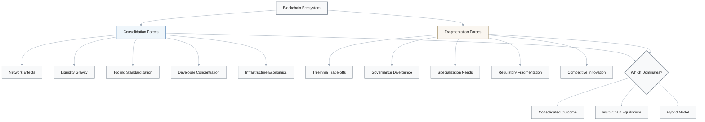

### Current Market Concentration Evidence

| Metric | Top 3 Chains | Top 3 Share | Trend |
|--------|-------------|-------------|-------|
| **TVL** | Ethereum, Binance, Solana | ~80% | Concentrating |
| **Developer Count** | Ethereum, Polkadot, Cosmos | ~70% | Stable concentration |
| **Infrastructure Investment** | Ethereum, Solana, Polygon | ~75% | Concentrating |
| **Daily Active Addresses** | Ethereum, BSC, Solana | ~65% | Variable |
| **Institutional Focus** | Bitcoin, Ethereum, Solana | ~85% | Concentrating |

**Interpretation:** Current data suggests consolidation pressure, not stable multi-chain equilibrium.

### Network Effects Analysis

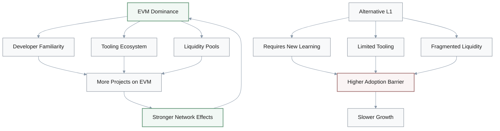

### Consolidation Dynamics Under-Modeled

**Mechanisms Driving Consolidation:**
1. **M&A activity**: Larger ecosystems acquiring smaller ones
2. **Ecosystem failures**: Chains losing critical mass and shutting down
3. **Regulatory bans**: Geographic restrictions forcing concentration
4. **De facto standards**: Winner-take-most in tooling and interfaces
5. **Infrastructure economics**: Cost advantages of supporting fewer chains
6. **Liquidity concentration**: DeFi gravitates to deepest markets
7. **Security budget**: Smaller chains cannot afford validator rewards

**Historical Analogies:**
- Internet protocols: TCP/IP won despite alternatives
- Cloud providers: AWS, Azure, GCP dominate despite many options
- Social networks: Meta, Twitter concentrated despite decentralization ideals
- Operating systems: Windows, macOS, Linux dominate despite alternatives

### Multi-Chain Thesis Requirements

**For Stable Multi-Chain Equilibrium to Hold:**

$$
\text{Specialization Value} + \text{Interoperability Quality} > \text{Network Effects} + \text{Standardization Benefits}
$$

**Required Evidence:**
1. **Sustained specialization**: Different chains excel at distinct use cases long-term
2. **Mature interoperability**: Seamless cross-chain UX comparable to single-chain
3. **Regulatory diversity**: Jurisdictions consistently favor different architectures
4. **Innovation velocity**: Continuous competitive advantages preventing lock-in
5. **Economic sustainability**: Multiple chains sustain security budgets over cycles

**Current Reality:**
- ❌ Specialization weakening (EVM chains converge on features)
- ❌ Interoperability immature (bridging friction remains high)
- ⚠️ Regulatory fragmentation possible but uncertain
- ✅ Innovation continues but diffuses across chains
- ❌ Security budget sustainability questionable for smaller chains

### Scenario Analysis

| Scenario | Probability Estimate | Key Drivers | Time Horizon |
|----------|---------------------|-------------|--------------|
| **Heavy Consolidation** (2-3 dominant) | 40% | Network effects, regulatory clarity | 5-10 years |
| **Moderate Consolidation** (5-7 major) | 35% | Specialization + some standardization | 5-10 years |
| **Stable Multi-Chain** (10+ viable) | 15% | Strong interoperability + regulatory fragmentation | 10+ years |
| **Hybrid Model** (2-3 dominant + niche chains) | 10% | Dominant platforms + specialized needs | 5-10 years |

### Missing Empirical Analysis

**What We Need to See:**
1. **Cycle-over-cycle data**: How has concentration evolved through 2017, 2021, and current cycles?
2. **Developer migration patterns**: Are developers sticky or switching between chains?
3. **Liquidity flow dynamics**: Does liquidity concentrate or distribute over time?
4. **Failed chain analysis**: How many chains launched in 2017-2020 are still viable?
5. **Cross-chain activity**: Is interoperability usage growing or stagnating?
6. **Economic sustainability**: Can smaller chains maintain security budgets through bear markets?

### Consolidation vs Fragmentation Indicators

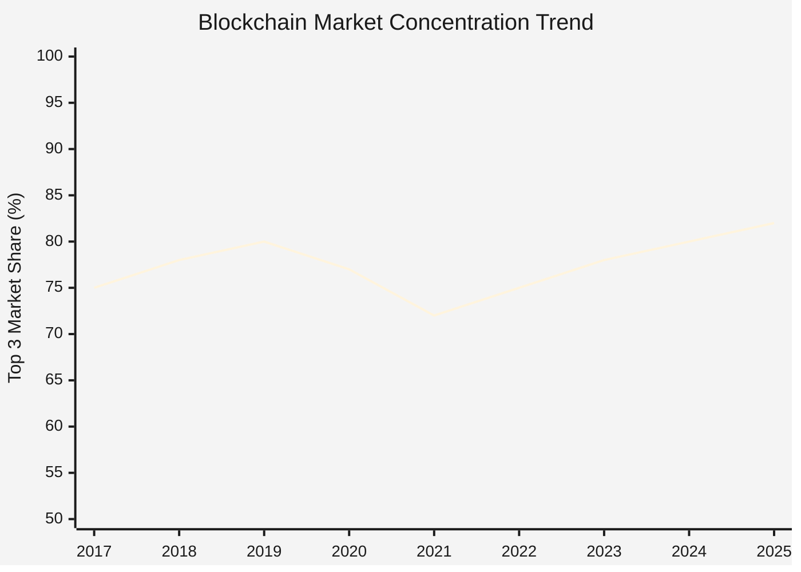

**Interpretation:** Trend suggests increasing concentration despite narrative of inevitable multi-chain future.

### Counterarguments to Multi-Chain Thesis

1. **EVM standardization**: 70%+ of chains use EVM, reducing actual diversity
2. **Layer 2 absorption**: Ethereum rollups may capture specialization without L1 fragmentation
3. **Infrastructure economics**: Supporting 20+ chains is costly; market may force winnowing
4. **Security budget math**: Only a few chains can afford robust validator incentives
5. **Historical precedent**: Tech markets tend toward oligopoly, not persistent fragmentation

> **Key Insight:** The "inevitable multi-chain future" narrative **underweights** consolidation pressures and **treats current diversity as stable equilibrium** without longitudinal evidence. Current concentration trends, network effects, and infrastructure economics suggest consolidation is equally or more plausible than stable multi-chain fragmentation.

---
