## 1. Misconception: Bitcoin and Ethereum Use the Same Consensus

**Q:** In our 2024–2025 architecture review, someone said Ethereum and Bitcoin both still use Proof-of-Work, so we can treat their consensus and energy profiles as essentially the same. What is inaccurate about that?

**A:** **Analyst:** First correction: Ethereum does not use Proof-of-Work anymore. Since the 2022 Merge, mainnet runs Proof-of-Stake with validators staking ETH.

**Engineer:** While Bitcoin stayed on PoW, mining blocks with hash power. If we lump them together, we erase that consensus shift.

**Architect:** Moreover, that shift significantly affects validator incentives, security assumptions, and validator set structure in Ethereum.

**Analyst:** Additionally, the energy profile is dramatically different. Post‑Merge estimates put Ethereum's energy use down by roughly 99.9% compared with PoW.

**Engineer:** That represents a substantial reduction.

**Architect:** So for any architecture or energy analysis, we should frame Bitcoin as the canonical PoW settlement chain and Ethereum as a PoS chain with a very different risk and energy profile, not treat them as twins.

### Key Comparison: Bitcoin vs Ethereum

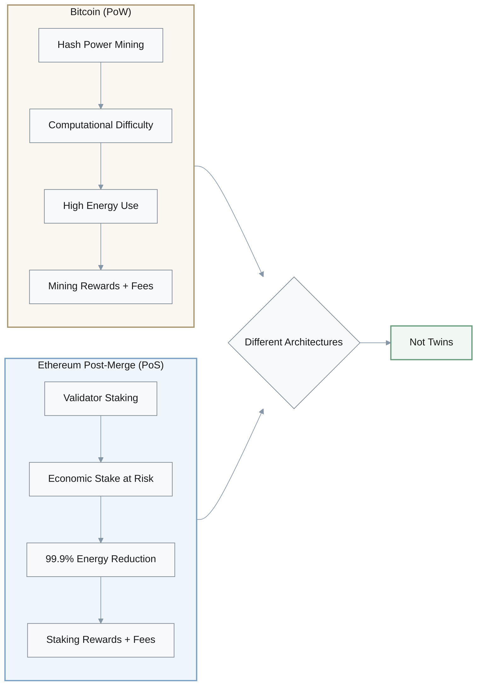

| Aspect | Bitcoin | Ethereum (Post-Merge 2022) |
|--------|---------|---------------------------|
| **Consensus** | Proof-of-Work (PoW) | Proof-of-Stake (PoS) |
| **Security Method** | Hash power mining | Validator staking (ETH) |
| **Energy Use** | High (baseline) | ~99.9% reduction vs PoW |
| **Validator Economics** | Mining rewards + fees | Staking rewards + fees |
| **Security Assumptions** | Computational difficulty | Economic stake at risk |

> **Corrected Analysis:** Bitcoin = canonical PoW settlement chain; Ethereum = PoS chain with materially different risk and energy profiles. They are **not** twins.

---

## 2. Misconception: The Merge Solved L1 Scalability

**Q:** I heard the Merge directly scaled Ethereum's base layer from about 15–30 TPS to tens of thousands of TPS, so L1 scalability is solved and rollups are now optional. Does that match what the investigation found?

**A:** **Engineer:** That is not fully accurate. The Merge was primarily a consensus switch—PoW to PoS—and a change in energy and security economics, not a "TPS explosion."

**Architect:** Instead, the investigations describe Ethereum's roadmap as rollup‑centric. Execution load is meant to move to Layer 2s, not be handled entirely on L1.

**Analyst:** Furthermore, the major scaling mechanisms they identify include EIP‑4844 and future data‑sharding (danksharding), which make it cheaper for rollups to post data back to L1.

**Engineer:** Meanwhile, base‑layer TPS remains in the same order of magnitude post‑Merge. It didn't suddenly jump to tens of thousands.

**Architect:** Therefore, the accurate story is: the Merge enabled PoS and set up future scalability work, but Ethereum's long‑term scaling still depends on rollups. Those rollups are central, not an optional extra.

### Ethereum Rollup-Centric Scaling Roadmap

### What the Merge Did vs Didn't Do

| What the Merge **DID** | What the Merge **DID NOT** |
|------------------------|----------------------------|
| ✅ Switch consensus: PoW → PoS | ❌ Increase L1 TPS dramatically |
| ✅ Reduce energy ~99.9% | ❌ Make rollups optional |
| ✅ Change validator economics | ❌ Solve scalability alone |
| ✅ Enable future scaling work | ❌ Jump to tens of thousands TPS |

> **Corrected Story:** The Merge enabled PoS and prepared for future scalability. Ethereum's **long-term scaling depends on Layer 2 rollups** as a **central** (not optional) component.

---

## 3. Misconception: Ethereum Uses UTXO Like Bitcoin

**Q:** For state management, can we just say Bitcoin and Ethereum both use UTXO, with Ethereum adding smart‑contract scripts on top of Bitcoin's basic structure?

**A:** **Engineer:** This is the mistaken framing the extract is debugging. Bitcoin's ledger is UTXO‑based—unspent outputs you can spend.

**Architect:** However, Ethereum explicitly moved away from that. It uses an account‑based model with a global state of accounts and contract storage.

**Analyst:** That account model is what enables general‑purpose smart contracts and complex dApps. You mutate account balances and contract storage directly.

**Engineer:** Nevertheless, it also brings trade‑offs: more state bloat and more complex synchronization across nodes compared to tracking UTXOs.

**Architect:** Therefore, the corrected description is: Ethereum does not simply stack scripts on a UTXO model—it adopts an account‑based global state with Turing‑complete contracts, which is a major architectural divergence from Bitcoin.

### State Model Comparison: UTXO vs Account-Based

| Aspect | Bitcoin (UTXO) | Ethereum (Account-Based) |
|--------|----------------|--------------------------|
| **Core Concept** | Unspent transaction outputs | Global state with accounts |
| **State Tracking** | Track individual UTXOs | Track account balances + storage |
| **Smart Contracts** | Limited script capabilities | Turing-complete contracts |
| **State Updates** | Consume UTXOs, create new ones | Mutate account state directly |
| **Complexity** | Simpler synchronization | More complex state management |
| **State Growth** | Lower state bloat | Higher state bloat risk |
| **Use Cases** | Value transfer, simple logic | General-purpose dApps |

> **Corrected Description:** Ethereum does not stack scripts on UTXO—it uses an **account-based global state** with **Turing-complete contracts**, a **fundamental architectural divergence** from Bitcoin.

---

## 4. Misconception: All Layers Just Host dApps

**Q:** When we talk about Layers 0, 1, 2, and 3 in today's multi‑layer ecosystem, is it fair to say they all mainly exist just to host dApps, and that interoperability and security are handled entirely at Layer 1?

**A:** **Architect:** That collapses too many roles. The investigations describe a more specialized stack.

**Analyst:** Specifically, Layer 0—think of Polkadot or Cosmos—provides interoperability and shared security across multiple chains, not just another dApp host.

**Engineer:** Layer 1 is the base: it runs consensus and settlement for the primary chain.

**Architect:** Subsequently, Layer 2 handles execution scaling—rollups, payment channels—while inheriting security from L1 instead of re‑implementing it.

**Analyst:** Finally, emerging Layer 3 focuses on app‑specific customization on top of L2s.

**Architect:** Therefore, the fix is to describe each layer by its architectural function—interoperability, settlement, scaling, app specialization—not as four copies of "the place where dApps live."

### Multi-Layer Blockchain Architecture

### Layer Functions and Purposes

| Layer | Primary Function | Security Model | Examples |
|-------|-----------------|----------------|----------|
| **Layer 0** | Interoperability & shared security | Cross-chain consensus | Polkadot, Cosmos |
| **Layer 1** | Consensus & settlement | Base chain security | Ethereum, Bitcoin, Solana |
| **Layer 2** | Execution scaling | Inherits from L1 | Rollups, Lightning Network |
| **Layer 3** | App-specific customization | Inherits from L2 | Gaming chains, DeFi chains |

> **Corrected Framework:** Each layer serves a **distinct architectural function**—interoperability, settlement, scaling, app specialization—not four copies of "where dApps live."

---

## 5. Misconception: Solana Abandons Proof-of-Stake

**Q:** I've heard people say Solana "abandons Proof‑of‑Stake in favor of Proof‑of‑History," and that this is why it gets such high throughput compared with Ethereum. Is that actually how the architecture works?

**A:** **Engineer:** No, that's the misconception. The investigations explain that Solana still uses Proof‑of‑Stake for consensus.

**Architect:** Specifically, Proof‑of‑History is added on top as a cryptographic clock—a verifiable delay function that orders events, but not a standalone consensus algorithm.

**Analyst:** Validators still stake and participate in PoS‑style voting. PoH provides them a shared time ordering for blocks and transactions.

**Engineer:** Moreover, the throughput advantage comes from the PoS+PoH combination plus other pipeline components—Gulf Stream, Turbine, Sealevel parallel execution—not from "abandoning PoS."

**Architect:** Therefore, the accurate summary is: Solana is a high‑throughput PoS chain augmented by PoH for ordering, not a pure PoH chain.

### Solana Architecture Components

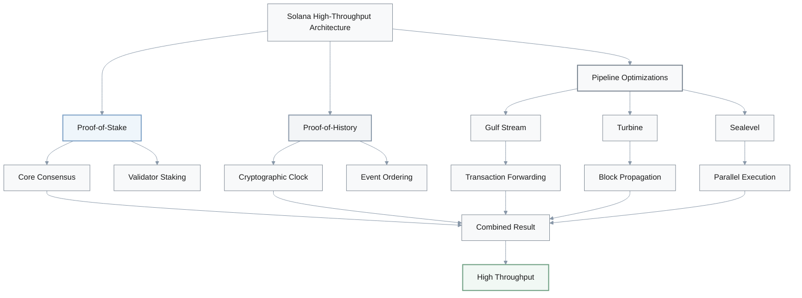

| Component | Role | Type |
|-----------|------|------|
| **Proof-of-Stake** | Consensus mechanism | Core security |
| **Proof-of-History** | Cryptographic clock / event ordering | Augmentation |
| **Gulf Stream** | Transaction forwarding | Pipeline optimization |
| **Turbine** | Block propagation | Pipeline optimization |
| **Sealevel** | Parallel execution | Pipeline optimization |

> **Accurate Summary:** Solana = **high-throughput PoS chain** augmented by PoH for ordering, not a pure PoH chain.

---

## 6. Misconception: Solana Outages Due to Slow Finality

**Q:** Were Solana's multi‑hour outages between 2021–2023 mostly about slow probabilistic finality, similar to Bitcoin taking a long time to confirm blocks?

**A:** **Analyst:** The sources point in a different direction. They attribute those incidents to validator client bugs, spam-like or bot‑driven transaction floods, and stress on the network pipeline.

**Engineer:** In contrast, Solana runs a PoS‑based BFT‑style consensus with PoH assisting ordering. Its failure modes aren't "Bitcoin‑style slow PoW finality."

**Architect:** Instead, what actually failed was software robustness and management of extreme load—how the pipeline behaved under adversarial or spiky conditions.

**Engineer:** This explains mitigation efforts like the Firedancer client: strengthen the implementation and pipeline rather than trying to "fix" probabilistic finality.

**Analyst:** Therefore, the corrected analysis is: Solana's high‑throughput architecture has historically been fragile under stress, with outages tied to bugs and congestion, not to PoW‑like finality delays.

### Actual Causes of Solana Outages

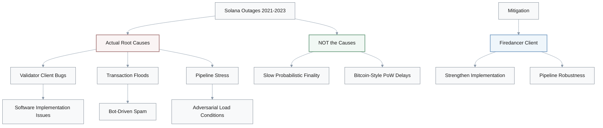

**Root causes:**
- **Validator client bugs** in software implementation
- **Transaction floods** from bots and spam
- **Pipeline stress** under adversarial conditions

**Not caused by:**
- ❌ Slow probabilistic finality
- ❌ Bitcoin-style PoW confirmation delays

**Mitigation approach:**
- **Firedancer client**: Strengthens implementation and pipeline robustness

---

## 7. Misconception: Polkadot Parachains Bring Their Own Security

**Q:** On Polkadot, is each parachain essentially bringing its own validators and economic security, with the relay chain just routing messages and not affecting security—so there is no true shared security?

**A:** **Architect:** That is almost the opposite of how the investigations describe Polkadot.

**Analyst:** In reality, the relay chain validators collectively secure all parachains. Parachains do not each run completely isolated validator sets for core security.

**Engineer:** Instead, projects bond DOT through parachain auctions to access that shared validator security on the relay chain.

**Architect:** Parachains are logically sovereign regarding their state machines and business logic, but they're not sovereign in security assumptions—they inherit security from the relay chain.

**Analyst:** Therefore, the right framing is that Polkadot is explicitly architected around shared security plus native interoperability via mechanisms like XCMP, not around every chain bootstrapping its own security from scratch.

### Polkadot Shared Security Model

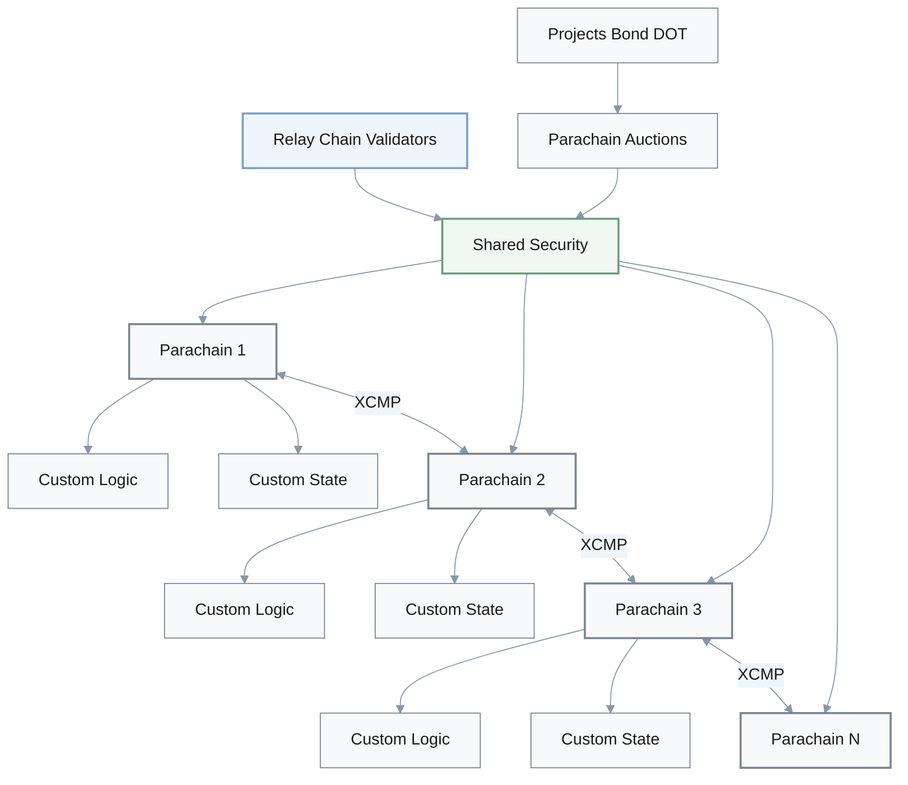

**How it actually works:**
- **Relay chain validators** collectively secure **all parachains**
- Parachains **inherit security** from relay chain validators
- Projects **bond DOT** via parachain auctions to access shared security
- **XCMP** enables native cross-parachain communication

**Parachain sovereignty:**
- ✅ **Logically sovereign**: Own state machines and business logic
- ❌ **Not security-sovereign**: Security comes from relay chain

**Architecture principle:** Shared security + native interoperability, not isolated security per chain

---

## 8. Misconception: Light-Client Bridges Are the Weakest Link

**Q:** The major 2021–2022 bridge hacks seem to prove that trust‑minimized light‑client designs like Cosmos IBC are the weakest link in multi‑chain systems, while simple multisig bridges have been relatively safe. Is that what the reports say?

**A:** **Analyst:** No—the pattern in the reports is almost the reverse.

**Engineer:** Specifically, the largest losses—Ronin, Wormhole, Poly Network and others—were tied to custodial or multisig‑style bridges where a small validator federation controlled locked assets.

**Architect:** Once attackers compromised those keys or exploited low signature thresholds, they could drain assets without breaking the underlying L1.

**Analyst:** In contrast, Cosmos IBC is presented as a trust‑minimized model that uses on‑chain light clients and Merkle proofs precisely to avoid that custodial risk.

**Architect:** Therefore, the corrected takeaway is: early multisig bridges concentrated risk in a few keys, while IBC‑style light‑client protocols reduce reliance on trusted third parties—though they bring their own compatibility and implementation constraints.

### Bridge Security Analysis (2021-2022)

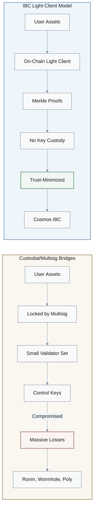

**Major bridge hacks (highest losses):**
- **Ronin, Wormhole, Poly Network**: Custodial/multisig bridges
- **Attack vector**: Compromised keys, low signature thresholds
- **Risk concentration**: Small validator federation controls locked assets

**Cosmos IBC approach:**
- **Trust-minimized**: Uses on-chain light clients + Merkle proofs
- **Reduces custodial risk**: Avoids reliance on key holders
- **Trade-offs**: Compatibility constraints, implementation complexity

**Corrected takeaway:** Multisig bridges concentrated risk in few keys; IBC-style protocols reduce trusted third-party reliance

---

## 9. Misconception: IBC Works With Any Blockchain

**Q:** Is it accurate to say Cosmos IBC is a completely general bridge protocol that can connect any blockchain regardless of consensus algorithm or state model, with almost no compatibility requirements?

**A:** **Engineer:** That is overstated. The investigations are clear that IBC is not "plug anything into anything."

**Analyst:** Specifically, it was designed around Tendermint‑style BFT chains, and participating chains need to implement specific IBC modules and light‑client verification logic.

**Architect:** This explains why adoption is currently strongest inside the Cosmos ecosystem and closely related chains, not across every major L1 out there.

**Engineer:** Therefore, while IBC is powerful, it's not a universal drop‑in bridge for any chain. There's substantial architectural work required to join.

**Architect:** The precise statement is: IBC provides trust‑minimized interoperability to compatible BFT chains that implement its protocol; it's not a generic bridge that any chain can adopt without significant changes.

### IBC Compatibility Requirements

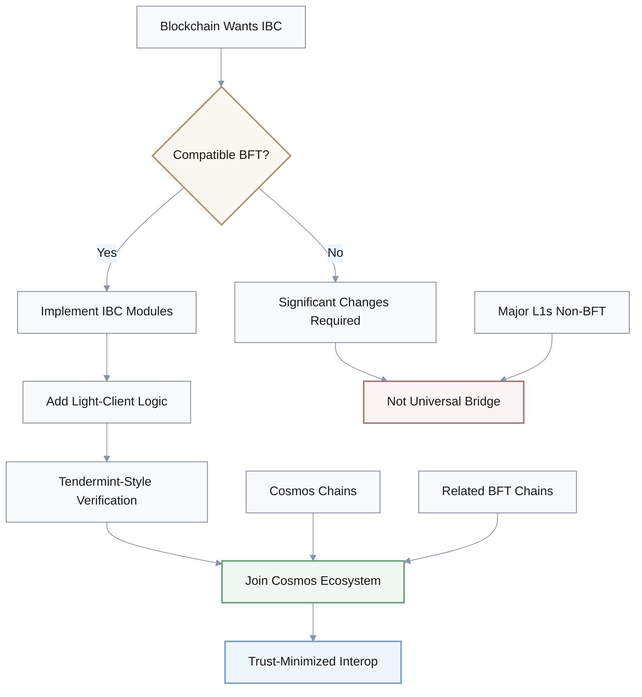

**Design foundation:**
- Built around **Tendermint-style BFT** consensus
- Requires chains to implement **IBC modules**
- Needs **light-client verification logic**

**Adoption pattern:**
- ✅ Strongest in **Cosmos ecosystem** and related chains
- ❌ Not universal across all major L1s

**Precise statement:** IBC provides trust-minimized interoperability to **compatible BFT chains** that implement its protocol—not a generic bridge for any blockchain

---

## 10. Misconception: EIP-4844 Made Rollups Independent from L1

**Q:** After EIP‑4844, I've heard claims that optimistic and zk rollups stopped depending on Ethereum's security and now rely entirely on their off‑chain provers, using L1 only as a convenience checkpoint. Does that match the rollup‑centric roadmap?

**A:** **Analyst:** Not according to the materials. They emphasize that rollups execute off‑chain but depend on Ethereum for security and data availability.

**Engineer:** Specifically, EIP‑4844 is a cost optimization—it introduces blobs that make posting rollup data to Ethereum cheaper, but it does not remove the dependence on Ethereum's consensus.

**Architect:** Moreover, rollups still post transaction data and proofs back to L1 so that any honest participant can reconstruct state and enforce correct exits.

**Analyst:** Indeed, that is the whole point of "inheriting security from Ethereum": users can rely on L1 consensus and data availability, not just trust the off‑chain operator.

**Architect:** Therefore, the corrected framing is: cheaper blobs make Ethereum‑secured rollups more scalable; they do not turn Ethereum into an optional convenience layer.

### Rollup Security Model: L1 Dependency

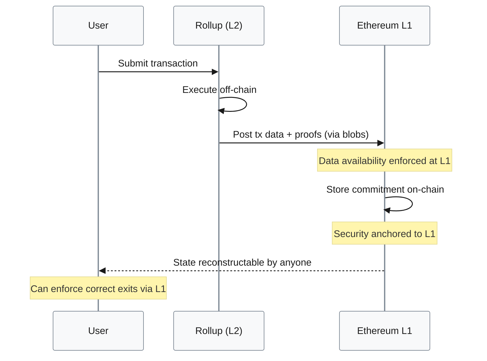

### EIP-4844 Reality Check

| Aspect | What EIP-4844 Does | What It Does NOT Do |
|--------|-------------------|---------------------|
| **Purpose** | Cost optimization for data posting | Remove L1 security dependence |
| **Mechanism** | Introduces blob data storage | Make rollups independent |
| **Rollup security** | Still inherits from Ethereum L1 | Move to off-chain only |
| **Data availability** | Makes it cheaper via blobs | Eliminate need for L1 posting |
| **User security** | Still backed by L1 consensus | Rely solely on operator trust |

> **Corrected Framing:** Cheaper blobs enable more scalable **Ethereum-secured** rollups, not independent L2s using L1 as optional checkpoint.

---

## 11. Misconception: Move-Based Chains Use Key-Value Storage Like EVM

**Q:** Do Move‑based chains like Aptos and Sui simply store digital assets as arbitrary key–value pairs in a global account map like EVM chains, so they do not meaningfully change how ownership or safety is encoded?

**A:** **Engineer:** The investigations explicitly push back on that. Move is described as resource‑oriented and, in Sui's case, object‑centric.

**Analyst:** Specifically, instead of treating everything as generic key–value entries, assets are modeled as linear resources with strict ownership and type guarantees.

**Architect:** Furthermore, Sui goes further and exposes objects with explicit ownership and access patterns, which the runtime can leverage.

**Engineer:** Consequently, that design enables safer parallel execution and eliminates some smart‑contract bug classes we've seen repeatedly on EVM.

**Architect:** Therefore, the fix is to say that Move‑based blockchains purposely diverge from EVM's account storage model, encoding ownership and resource constraints in the type system. This represents a major architectural shift, not a minor detail.

### Move vs EVM Storage Models

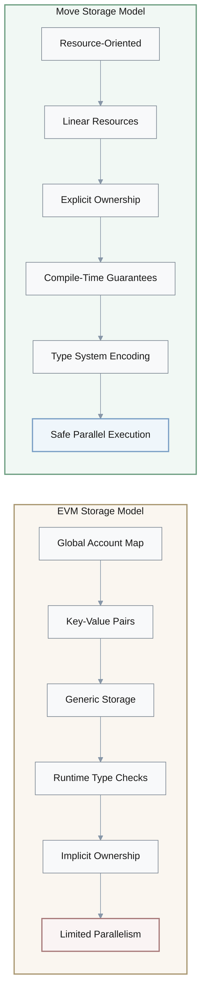

| Aspect | EVM Chains | Move-Based Chains (Aptos, Sui) |
|--------|------------|--------------------------------|
| **Storage Model** | Key-value pairs in global account map | Resource-oriented / object-centric |
| **Asset Representation** | Generic key-value entries | Linear resources with ownership |
| **Type Safety** | Runtime checks | Compile-time type guarantees |
| **Ownership** | Implicit in storage | Explicit in type system |
| **Parallel Execution** | Limited | Safer parallel execution (Sui) |
| **Bug Prevention** | Runtime failures common | Type system prevents bug classes |

**Key architectural shifts:**
- **Linear resources**: Strict ownership and type guarantees enforced at compile time
- **Object-centric design** (Sui): Explicit ownership and access patterns
- **Type system encoding**: Resource constraints built into the language

> **Corrected Understanding:** Move-based chains **purposely diverge** from EVM's storage model—a **major architectural shift**, not minor detail.

---

## 12. Misconception: Block-STM Eliminates Coordination Costs

**Q:** With speculative parallel execution engines like Block‑STM, is it fair to say we do not need conflict detection or rollback anymore—transactions just run in parallel with no coordination cost once parallelism is turned on?

**A:** **Analyst:** DeepSeek's glossary directly contradicts that "free parallelism" idea.

**Engineer:** Specifically, Block‑STM runs transactions optimistically in parallel, but it must track which state each transaction reads and writes.

**Architect:** Moreover, when two transactions touch the same state in conflicting ways, the engine must roll back or re‑execute some of them to preserve deterministic results.

**Engineer:** That conflict detection and scheduling logic is where substantial complexity resides. It's not something you can hand‑wave away.

**Architect:** Therefore, the corrected summary is: parallel execution can increase throughput by running independent transactions concurrently, but it absolutely depends on robust conflict detection and rollback mechanisms.

### Block-STM: Parallel Execution Reality

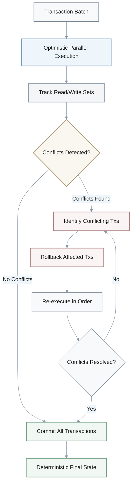

**How Block-STM actually works:**
1. **Optimistic execution**: Run transactions in parallel speculatively
2. **State tracking**: Monitor which state each transaction reads/writes
3. **Conflict detection**: Identify when transactions touch same state in conflicting ways
4. **Rollback/re-execution**: Revert and retry conflicting transactions to maintain determinism

**Coordination costs that remain:**
- ❌ **Not eliminated**: Conflict detection logic (high complexity)
- ❌ **Not free**: Scheduling and rollback mechanisms required
- ❌ **Not automatic**: Robust tracking of read/write sets needed

> **Corrected Summary:** Parallel execution boosts throughput for **independent** transactions, but still depends critically on robust conflict detection and rollback mechanisms.

---

## 13. Misconception: Lightning and Rollups Have Same Trust Model

**Q:** Since Lightning Network on Bitcoin and rollups on Ethereum both move activity off‑chain, can we treat their trust and security models as essentially the same, where users have to trust the off‑chain operators instead of the L1?

**A:** **Analyst:** The materials are careful to distinguish those trust models.

**Engineer:** Specifically, Lightning uses payment channels with liquidity locked in multisig outputs. Security there relies on users—or their watchtowers—reacting within timeouts if a counterparty broadcasts an old state.

**Architect:** In contrast, rollups are different: they post transaction data and proofs back to Ethereum L1 so that any honest participant can enforce correct state transitions or exits based on protocol rules.

**Analyst:** In both setups you introduce extra actors—channel operators for Lightning, sequencers for rollups—but the user responsibilities aren't identical.

**Architect:** Therefore, the corrected view is: both are off‑chain scaling mechanisms, but their trust assumptions, failure modes, and what users must do to stay safe are significantly different.

### Lightning Network vs Rollups: Trust Models

```mermaid
%%{init: {
  "theme": "base",
  "themeVariables": {
    "primaryColor": "#f8f9fa",
    "primaryTextColor": "#1a1a1a",
    "primaryBorderColor": "#7a8591",
    "lineColor": "#8897a8",
    "secondaryColor": "#eff6fb",
    "tertiaryColor": "#f3f5f7"
  }
}}%%
graph TD
    subgraph Lightning["Lightning Network"]
        A[User] --> B[Payment Channel]
        B --> C[Multisig Lock]
        C --> D[Monitor State]
        D --> E{Old State?}
        E -->|Yes| F[Watchtower Reacts]
        E -->|No| G[Safe]
        F -->|Timeout| H[User Vigilance Required]
    end
    
    subgraph Rollups["Ethereum Rollups"]
        I[User] --> J[L2 Execution]
        J --> K[Post to L1]
        K --> L[Data + Proofs]
        L --> M[L1 Consensus]
        M --> N[Protocol-Enforced]
        N --> O[Any Participant Verifies]
    end
    
    Lightning --> P[Different Trust Models]
    Rollups --> P
    
    style H fill:#faf6f0,stroke:#a89670,stroke-width:2px,color:#1a1a1a
    style O fill:#f1f8f4,stroke:#6b9d7f,stroke-width:2px,color:#1a1a1a
    style Lightning fill:#eff6fb,stroke:#7a9fc5,stroke-width:2px,color:#1a1a1a
    style Rollups fill:#eff6fb,stroke:#7a9fc5,stroke-width:2px,color:#1a1a1a
```

| Aspect | Lightning Network (Bitcoin) | Rollups (Ethereum) |
|--------|----------------------------|-------------------|
| **Mechanism** | Payment channels with multisig | Execution off-chain, post to L1 |
| **Liquidity** | Locked in channel outputs | Not locked in channels |
| **User Security** | Monitor + react within timeouts | Any participant enforces via L1 |
| **Watchtowers** | Required to prevent old state broadcast | Not needed |
| **Data Posting** | Not posted to L1 | Transaction data + proofs to L1 |
| **Exit Safety** | User/watchtower vigilance | Protocol-enforced via L1 |
| **Failure Mode** | Timeout violations | Sequencer censorship (temporary) |
| **Trust Requirement** | Active monitoring or delegate to watchtower | L1 data availability + consensus |

> **Corrected View:** Both are off-chain scaling, but **trust assumptions, failure modes, and user responsibilities are significantly different**.

---

## 14. Misconception: Bridge Failures Prove L1 Consensus Is Insecure

**Q:** Do the major cross‑chain bridge failures mainly prove that underlying L1 consensus—like Ethereum's PoS or Solana's PoS+PoH—is fundamentally insecure, and that the bridge contracts themselves aren't the problem?

**A:** **Analyst:** The bridge sections argue almost the opposite. The major hacks are traced to weaknesses in bridge designs and operations.

**Engineer:** Specifically, incidents like Wormhole and Ronin exploited smart‑contract bugs, poor key management, or insufficient validator thresholds at the bridge layer, while the base chains kept producing valid blocks.

**Architect:** In other words, consensus at L1 was doing its job; the failures were in how assets and messages were handled across chains.

**Analyst:** This is why the reports frame bridges and interoperability protocols as new attack surfaces introduced by multi‑chain architectures.

**Architect:** Therefore, the right conclusion is: robust L1 consensus is necessary but not sufficient. Without careful bridge design, you can end up recreating centralized custodial risk on top of otherwise secure base layers.

### Bridge Failures vs L1 Security

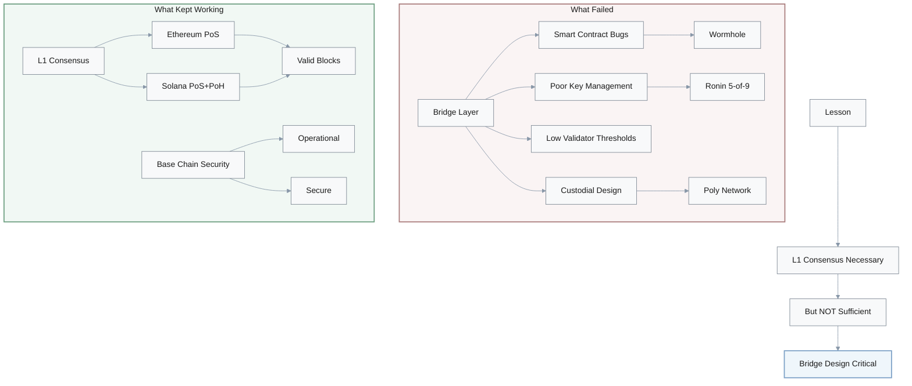

**What actually failed:**
- **Bridge layer vulnerabilities**: Smart contract bugs, poor key management
- **Insufficient validator thresholds**: Low security requirements for bridge operators
- **Custodial design**: Centralized control of locked assets

**What kept working:**
- ✅ **L1 consensus**: Ethereum PoS, Solana PoS+PoH continued producing valid blocks
- ✅ **Base chain security**: L1s remained operational and secure

**Major incidents:**
- **Wormhole**: Bridge contract vulnerability
- **Ronin**: Compromised bridge validator keys (5 of 9 multisig)
- **Poly Network**: Bridge logic exploitation

> **Right Conclusion:** Robust L1 consensus is **necessary but not sufficient**. Without careful bridge design, centralized custodial risk recreates on top of secure base layers.
