# Blockchain Architecture Decision Framework

## 1. Multi-Chain Strategy: Combining Bitcoin, Ethereum, Solana, Polkadot, Sui, and Aptos

**Q:** We're planning a multi-year blockchain strategy for a new global financial platform that needs censorship-resistant settlement, programmable DeFi, and low-latency user experiences. Instead of betting on a single chain, how should we combine Bitcoin, Ethereum, Solana, Polkadot, Sui, and Aptos?

**A:** **Architect:** Good question. First thing is to segment workloads: conservative long-term settlement and collateral, high-value programmable contracts, and latency-sensitive trading or consumer flows.

**Platform Lead:** Mm-hmm. So Bitcoin would sit in that conservative bucket?

**Architect:** Exactly. Treat Bitcoin as a settlement and collateral layer rather than an application platform. Use it for long-term value anchoring where around 7 TPS and roughly 60-minute finality are acceptable, but not for complex DeFi logic.

**DeFi Lead:** Got it. For programmable DeFi and tokenization, we default to Ethereum?

**Architect:** Right. Ethereum PoS plus its rollup stack should be our default programmable settlement hub for high-value DeFi and tokenization. It combines rich tooling, the broader EVM ecosystem, and a rollup-centric scalability roadmap with data-availability upgrades like EIP-4844 that materially reduce L2 costs.

**DeFi Lead:** Makes sense.

### Workload Segmentation Strategy

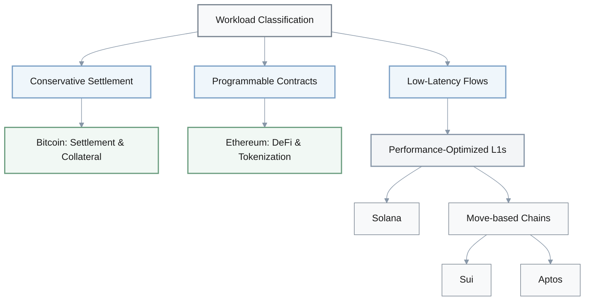

### Platform Comparison by Role

| Platform | Primary Role | TPS | Finality | Best For | Trade-offs |
|----------|-------------|-----|----------|----------|------------|
| **Bitcoin** | Settlement & Collateral | ~7 | ~60 min | Long-term value anchoring | No complex DeFi logic |
| **Ethereum** | Programmable Settlement | 15-30 (L1) | ~13 min | High-value DeFi, tokenization | Higher fees, sequential execution |
| **Solana** | Performance L1 | 2,000-4,000 | <1 sec | Latency-sensitive flows | Validator hardware, outage risk |
| **Sui/Aptos** | Performance L1 | 10,000+ | <1 sec | Parallel execution workloads | Shorter history, smaller ecosystem |
| **Polkadot** | Specialized Domains | Varies | ~6 sec | Custom execution & governance | Interop & governance complexity |

**(Digging deeper):**

**Performance Engineer:** Where do Solana or Move-based chains such as Sui and Aptos come in?

**Architect:** [pause] We only add a performance-optimized L1 where sub-second confirmations and very low fees are decisive for product value, and we explicitly price in their validator hardware needs and historical outage risk.

**Performance Engineer:** Right.

**Platform Lead:** And what about Polkadot- or Cosmos-style designs?

**Architect:** For specialized domains that need custom execution and governance, we can consider Polkadot-style shared security via parachains or Cosmos-style sovereign chains, but only when their interoperability models and governance complexity are justified by the use case.

**Platform Lead:** I see.

**Risk Officer:** Good points. Before we commit core assets to any non-Bitcoin/non-Ethereum L1, we should define explicit go/no-go criteria per role—for example maximum acceptable outage hours per year, a minimum Nakamoto coefficient band, and the required level of regulatory comfort.

**Architect:** Agreed.

### Go/No-Go Criteria Checklist

- **Maximum acceptable outage hours per year**
- **Minimum Nakamoto coefficient band**
- **Required regulatory comfort level**
- **Validator hardware requirements**
- **Historical outage risk assessment**
- **Interoperability model complexity**

---

## 2. Consensus Family Selection: PoW, PoS, BFT, and Hybrids

**Q:** For a new institutional blockchain or subnet, we have to choose a consensus family—PoW, longest-chain PoS, BFT-style PoS, or hybrids like PoH-assisted PoS or Snow consensus. How should we decide what to adopt and which trade-offs to accept?

**A:** **Architect:** Good question. Let me think... I would start with the required finality profile and threat model. If we need deterministic finality in seconds for exchange-style or institutional settlement, we should prioritize BFT-style PoS, like Tendermint-like or AptosBFT-like designs.

**Protocol Researcher:** Mm-hmm. And if probabilistic finality with longer settlement windows is acceptable?

**Architect:** Then PoW or longest-chain PoS remain viable. You're accepting slower, probabilistic confirmation in exchange for different decentralization and operational characteristics.

**Protocol Researcher:** Right.

### Consensus Mechanism Decision Flow

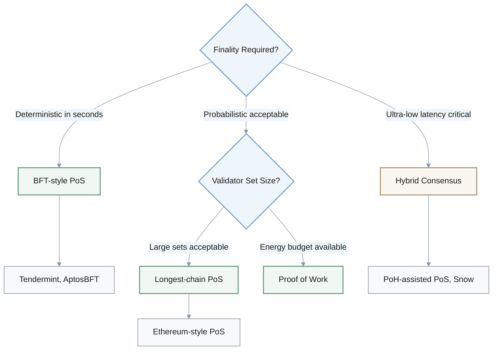

### Consensus Mechanism Comparison

| Mechanism | Finality Type | Validator Set | Security Budget | Energy Use | Best Use Case |
|-----------|--------------|---------------|----------------|------------|---------------|
| **PoW** | Probabilistic | Unlimited | Hash power & energy | Very High | Conservative settlement |
| **Longest-chain PoS** | Probabilistic | Large (100k+) | Staked capital | Low | Decentralized settlement |
| **BFT-style PoS** | Deterministic | Dozens to 100s | Staked capital + slashing | Low | Institutional settlement |
| **Hybrid (PoH+PoS)** | Fast deterministic | Medium | Mixed | Medium | Ultra-low latency |

**Risk Officer:** We also need to quantify the security budget, right?

**Protocol Researcher:** Exactly. In PoW the security budget is sustained hash power and energy spend. In PoS or BFT-style systems, it's staked capital and the strength of slashing rules. Our expected fee and issuance revenue must be able to fund the desired security level at the asset's projected market cap.

**Risk Officer:** Got it.

**(Validator design):**

**Infra Lead:** How does validator set size factor in?

**Architect:** Classical BFT tends to work best with dozens to low hundreds of validators, whereas longest-chain PoS can support far larger sets—think of Ethereum with hundreds of thousands of validators—at the cost of slower deterministic finality.

**Infra Lead:** I see.

**Risk Officer:** And operational or environmental constraints?

**Protocol Researcher:** [pause] Large-scale PoW comes with very high energy usage and political or regulatory baggage. PoS and BFT-style designs dramatically reduce energy consumption but introduce long-range and governance risks, which we have to mitigate with finality gadgets, checkpointing, and client diversity.

**Risk Officer:** Makes sense.

**Performance Engineer:** If we need ultra-low latency, do we look at hybrids?

**Architect:** Yes—hybrids like PoH-assisted PoS or Snow-family consensus are options when ultra-low latency is critical and hardware concentration is acceptable. But we must explicitly document their hardware requirements, expected Nakamoto coefficient band, and historical outage patterns so stakeholders fully understand the resilience trade-offs.

**Performance Engineer:** Good point.

### Security Budget Requirements

- **PoW**: Hash rate sufficient to resist 51% attack at projected market cap
- **PoS**: Staked value > attack cost threshold
- **Revenue requirement**: Fee + issuance ≥ security budget at target market cap

$$
\text{Security Budget} = \text{Fee Revenue} + \text{Issuance Revenue}
$$

$$
\text{Required Stake (PoS)} > \frac{\text{Attack Profit Potential}}{\text{Slashing Rate}}
$$

---

## 3. Execution Environment Selection: EVM, Solana, WASM, and Move

**Q:** We're selecting an execution environment and state model for a new smart-contract platform or major application suite. Options include the EVM (account-based), Solana's Sealevel model, WASM-based runtimes, and Move-based object or Block-STM execution. How do we choose what best fits our 3–5 year roadmap?

**A:** **Architect:** Good question. First, map our primary constraints. Is developer ecosystem depth and audit tooling more important than raw TPS, or do we clearly need massive parallelism and low latency?

**Dev Lead:** Hmm... If ecosystem compatibility dominates, that points us to EVM?

**Architect:** Yes. If ecosystem compatibility and proven tooling dominate, we should default to the EVM—or an equivalent EVM execution layer—and plan to scale via rollups or sidechains. We accept sequential execution limits in exchange for mature languages, auditors, and DeFi composability.

**Dev Lead:** Makes sense.

### Execution Environment Decision Matrix

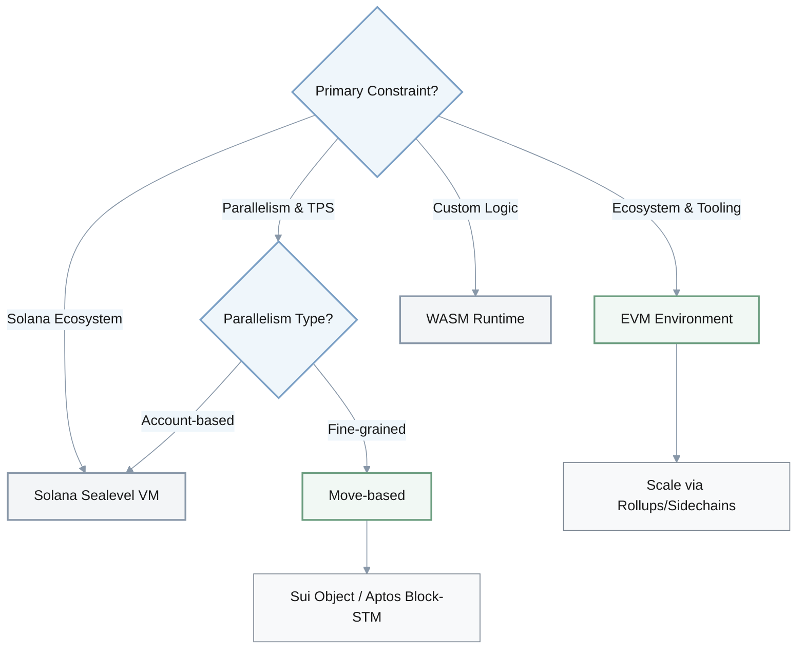

### Execution Environment Comparison

| Environment | State Model | Parallelism | Ecosystem Maturity | Security Features | Best For |
|-------------|-------------|-------------|-------------------|-------------------|----------|
| **EVM** | Account-based | Sequential | Very High | Convention-based | DeFi composability, mature tooling |
| **Move (Sui)** | Object-based | Fine-grained | Medium | Resource-oriented types | Asset handling, parallel TPS |
| **Move (Aptos)** | Account-based | Block-STM | Medium | Resource-oriented types | High-throughput, asset safety |
| **Solana SVM** | Account-based | Explicit R/W sets | Medium | Convention-based | Solana ecosystem coupling |
| **WASM** | Custom | Flexible | Varies | Custom | Bespoke execution logic |

**(Exploring alternatives):**

**Platform Engineer:** What if we really need fine-grained parallelism?

**Architect:** [pause] Then we evaluate Move-based environments like Sui's object model or Aptos's Block-STM. They use resource-oriented types to prevent entire classes of asset-handling bugs while enabling very high benchmark TPS. But we have to factor in their shorter production history and smaller communities.

**Platform Engineer:** Right. Trade-offs there.

**DeFi Lead:** And Solana's SVM?

**Architect:** We consider Solana's Sealevel VM when our workloads are tightly coupled to the Solana ecosystem and we're comfortable with explicit read/write sets and its concurrency model. We'd need to budget time for handling account-based parallelism, validator hardware expectations, and prior outage patterns.

**DeFi Lead:** Got it.

**Infra Lead:** Where do WASM-based runtimes fit?

**Architect:** WASM-based runtimes, like those used in Substrate parachains, make sense when we need maximum flexibility to design bespoke execution logic under a shared security umbrella and are willing to assemble our own language and toolchain choices on top.

**Infra Lead:** I see.

**Risk Officer:** Smart observation. Whatever we pick, we should be able to move later.

**Architect:** Exactly. For each option, we define migration and interoperability paths—for example EVM-to-Move bridges, IBC routes, or XCM—so we avoid hard lock-in if our first choice proves limiting.

### Migration & Interoperability Paths

- **EVM ↔ Move**: Cross-chain bridges
- **EVM ↔ WASM**: IBC routes, XCM
- **Solana ↔ Others**: Wormhole, custom bridges
- **Within Polkadot**: Native XCM messaging

---

## 4. L1 vs L2 Strategy: Ethereum Scaling Decision

**Q:** Our Ethereum-centric product relies on L1 security but is now hitting fee and throughput constraints. How do we choose between staying on Ethereum L1, moving most activity to optimistic or ZK rollups, or migrating parts of the workload to an alternative high-throughput L1?

**A:** **Product Lead:** Good question. I'd start by classifying transactions by value and latency sensitivity.

**Architect:** Right. We keep the highest-value, compliance-sensitive settlement and governance actions on Ethereum L1, and we offload high-volume user flows to rollups or other chains.

**Product Lead:** Makes sense.

### Transaction Classification Strategy

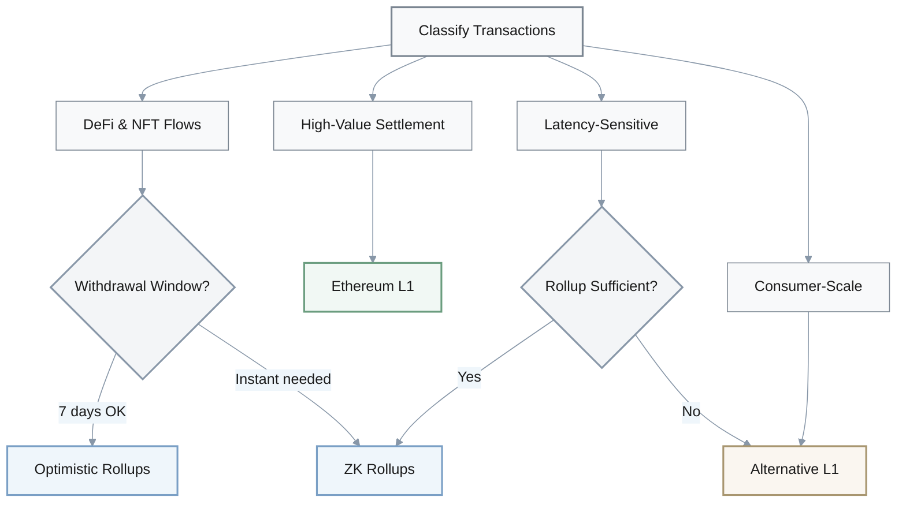

### Layer Comparison

| Layer Type | Security | Withdrawal Time | Cost | Composability | Use Case |
|------------|----------|----------------|------|---------------|----------|
| **Ethereum L1** | Highest | N/A | High | Native | High-value settlement, governance |
| **Optimistic Rollup** | L1-inherited | 7 days | Medium | EVM-native | DeFi, NFT with delay tolerance |
| **ZK Rollup** | L1-inherited + cryptographic | Instant | Medium-Low | EVM-compatible | Instant exits, censorship resistance |
| **Alt L1** | Independent | Varies | Low | Limited | Consumer-scale, latency-critical |

**DeFi Lead:** For typical DeFi and NFT flows where EVM compatibility and composability really matter, what's our default?

**Architect:** Prioritize rollups first. Use optimistic rollups if we can live with seven-day withdrawal windows, and ZK rollups where instant cryptographic finality and stronger censorship resistance for exits matter. We should also explicitly factor in EIP-4844-enabled cost reductions when modeling economics.

**DeFi Lead:** Got it.

**(Considering alternative L1s):**

**Platform Engineer:** When do we consider moving to alternative high-throughput L1s like Solana or Move-based chains?

**Architect:** [pause] Only for latency-sensitive or consumer-scale workloads when rollup throughput or UX remains insufficient even after optimizations, and only if our users can tolerate different trust assumptions and bridge risks.

**Platform Engineer:** Mm-hmm.

**Risk Officer:** Then bridges and exits become product-level concerns.

**Architect:** Exactly. L2/L1 bridging and exit paths have to be first-class product concerns. We must specify which bridges we support, their trust models—multisig, light-client, or ZK—and the maximum allowed exposure per bridge.

**Risk Officer:** Right. And we should set thresholds.

**Architect:** Yes. We establish explicit thresholds, such as maximum acceptable median gas per transaction, target p95 latency, and the maximum share of assets allowed on a non-Ethereum settlement layer. Those give us objective triggers for further migration or rollback.

**Risk Officer:** Agreed.

### Risk Thresholds

- **Maximum median gas per transaction**
- **Target p95 latency**
- **Maximum asset share on non-Ethereum layers**
- **Bridge exposure limits per bridge**
- **Trust model requirements** (multisig, light-client, ZK)

---

## 5. Monolithic vs Modular: Latency-Sensitive Applications

**Q:** For a latency-sensitive trading or gaming platform, should we deploy on a monolithic high-throughput chain like Solana or on a modular stack such as Ethereum L2s, Polkadot parachains, or Cosmos IBC? How do we compare the options and decide?

**A:** **Product Lead:** Good question. Let's start with user-visible latency and uptime requirements.

**Architect:** Right. If we truly need sub-second confirmations and tight event loops, the monolithic high-throughput chains look attractive. But we have to price in their historical outage patterns and higher validator hardware thresholds.

**Product Lead:** Makes sense.

### Architecture Pattern Comparison

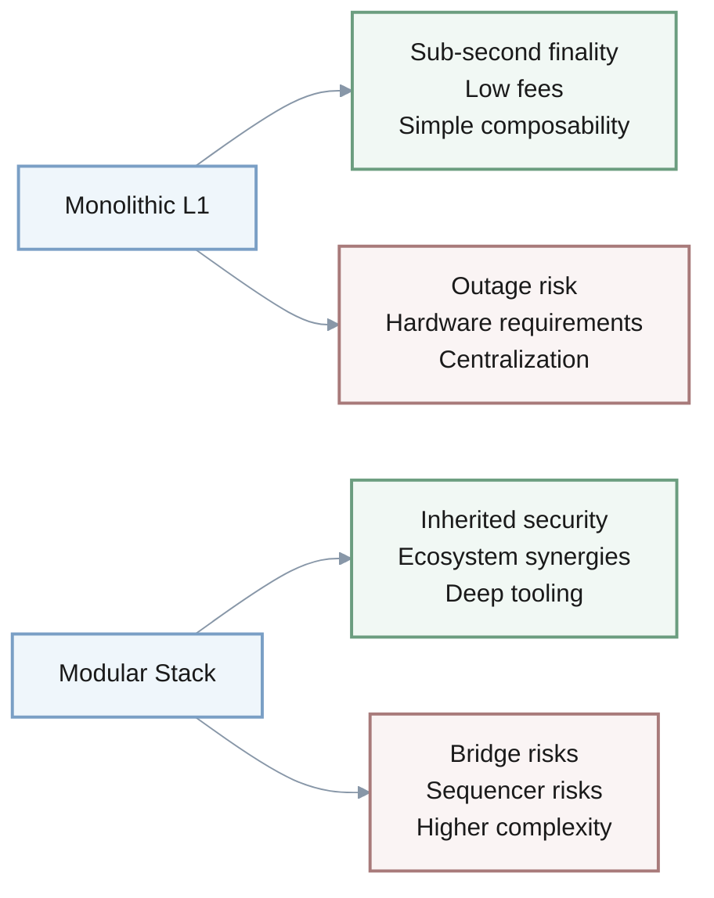

| Attribute | Monolithic (Solana) | Modular (Rollups/Parachains) |
|-----------|-------------------|----------------------------|
| **Latency** | Sub-second | 1-5 seconds |
| **Throughput** | 2,000-4,000 TPS | 500-2,000 TPS |
| **Security Model** | Independent consensus | Inherited from base layer |
| **Uptime History** | Multi-hour halts occurred | Generally more stable |
| **Ecosystem** | Solana-specific | Ethereum/Polkadot ecosystem |
| **Composability** | Native, simple | Bridge-mediated, complex |
| **Validator Hardware** | High requirements | Lower requirements |

**(Evaluating monolithic chains):**

**Reliability Engineer:** For Solana specifically, we'd analyze incident histories—multi-hour halts from spam or client bugs—and the planned mitigations like new clients, congestion controls, and consensus upgrades. Then we ask whether our product can tolerate coordinated restarts or partial brownouts.

**Architect:** Exactly.

**Platform Engineer:** On the modular side—rollups or parachains—how do we think about it?

**Architect:** [pause] We check whether rollups or parachains can meet our p95 latency and throughput targets while inheriting stronger base-layer security. We accept that bridge and sequencer risks replace some base-layer operational risk.

**Platform Engineer:** I see.

**Product Lead:** Ecosystem matters as well.

**Architect:** Exactly. We quantify ecosystem synergies. Modular stacks tied to Ethereum or Polkadot often provide deeper liquidity, wallets, and dev tooling. Monolithic chains may require more bespoke infrastructure but offer lower fees and simpler composability within their own ecosystem.

**Product Lead:** Mm-hmm.

**Risk Officer:** So we don't have to pick exactly one?

**Architect:** Ideally, we make a portfolio decision rather than a binary one. We can deploy latency-critical components on a high-throughput chain while keeping treasury, governance, and critical state anchored to a more conservative, modular ecosystem, with documented risk limits per chain.

**Risk Officer:** Good approach.

### Portfolio Approach

- **Latency-critical components**: High-throughput monolithic chain
- **Treasury & governance**: Conservative modular ecosystem
- **Critical state**: Ethereum L1 or equivalent
- **Risk limits**: Documented per chain
- **Exit strategy**: Clear off-ramps defined

---

## 6. Cross-Chain Bridging: Trust Models and Security

**Q:** We're designing cross-chain functionality that has to move assets and messages between multiple L1s and L2s. How should we choose among trusted multisig bridges, light-client-based protocols (IBC-style), shared-security messaging (XCMP-style), and emerging ZK-based bridges?

**A:** **Risk Officer:** Good question. First, we should map our security budget and blast radius.

**Architect:** Right. We decide the maximum capital we're willing to expose per bridge and what failure modes—like theft, censorship, or long downtime—are acceptable.

**Risk Officer:** Mm-hmm.

### Bridge Trust Model Hierarchy

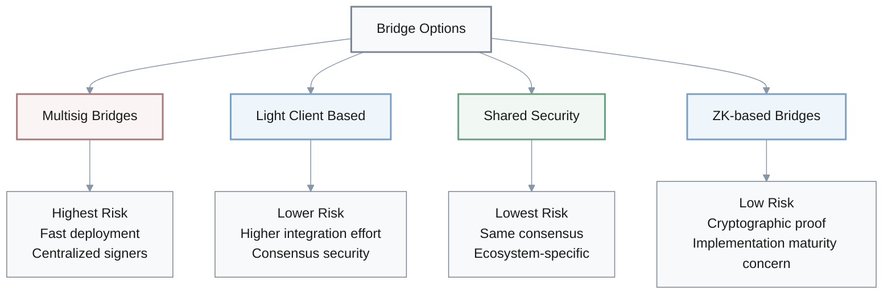

### Bridge Type Comparison

| Bridge Type | Trust Model | Security Source | Integration Effort | Risk Level | Best Use |
|-------------|-------------|----------------|-------------------|------------|----------|
| **Multisig** | Trusted signers | Signer honesty | Low | High | Last resort only |
| **Light Client (IBC)** | Cryptographic | Consensus verification | High | Low-Medium | Cross-ecosystem |
| **Shared Security (XCMP)** | Native | Same consensus | Medium | Lowest | Within ecosystem |
| **ZK-based** | Cryptographic proofs | ZK proof verification | High | Low-Medium | High-value corridors |

**Platform Engineer:** Multisig bridges are tempting for speed, but history hasn't been kind.

**Architect:** Exactly. We avoid simple multisig bridges for systemic volumes unless there is no alternative. If we must use them, we strictly cap exposure, insist on high signer diversity, and require independent audits, given the track record of multi-hundred-million-dollar exploits.

**Platform Engineer:** Makes sense.

**(More trust-minimized options):**

**Protocol Researcher:** When both chains can support compatible clients, we should prefer light-client-based protocols, IBC-style, because they inherit the security of the underlying consensus instead of centralized signers, even though the integration effort is higher.

**Architect:** Agreed.

**Infra Lead:** In ecosystems with shared security like Polkadot?

**Architect:** There we use native messaging like XCMP before reaching for external bridges, since it's validated by the same consensus that secures our state.

**Infra Lead:** Got it.

**Protocol Researcher:** And ZK-based bridges?

**Architect:** [pause] We should start piloting ZK-based bridges where they are production-ready, especially for high-value corridors, but treat proving systems, prover decentralization, and implementation maturity as first-class risks until they build a longer track record.

**Protocol Researcher:** Right.

**Risk Officer:** For each corridor, we also need documentation.

**Architect:** Yes. Per corridor we document which trust model we're adopting, what on-chain invariants we enforce—like rate limits and circuit-breaker pausing—and how we'll communicate incident responses to users.

**Risk Officer:** Good point.

### Bridge Risk Management

Per-corridor documentation requirements:

- **Trust model**: Multisig, light-client, shared-security, or ZK
- **Maximum exposure**: Capital cap per bridge
- **On-chain invariants**: Rate limits, circuit breakers
- **Incident response plan**: Communication protocol
- **Audit status**: Independent security reviews
- **Signer diversity**: Geographic and organizational distribution

---

## 7. Regulatory Compliance: MiCA and Institutional DeFi

**Q:** We're launching a new institutional DeFi or tokenization product that must satisfy regulators such as MiCA in the EU while still benefiting from public-chain properties. How do we select an architecture and primary chain or chains to balance compliance and decentralization?

**A:** **Compliance Lead:** Good question. I think we start with a list of regulatory obligations.

**Architect:** Agreed. We list obligations such as CASP licensing, travel-rule data retention, and reporting requirements, and then decide which parts of our stack must be under direct organizational control versus credibly neutral.

**Compliance Lead:** Makes sense.

### Compliance Architecture Pattern

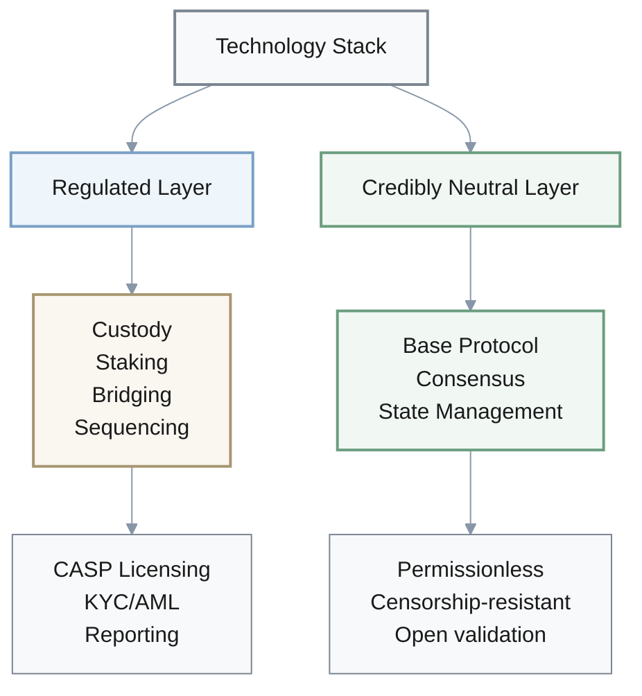

**Product Lead:** That naturally points us to certain architectures.

**Architect:** Exactly. We favor architectures where user-facing businesses—custody, staking, bridging, sequencing—can be cleanly separated and regulated as CASPs or similar, while the base protocol remains as decentralized as practical. Ethereum plus its rollups currently aligns best with that pattern.

**Product Lead:** Got it.

**(Evaluating candidate L1s):**

**Risk Officer:** What signals do we look at when we evaluate L1s?

**Architect:** [pause] Observable centralization indicators: validator concentration, reliance on a small number of client implementations, dependence on specific cloud or hosting providers, and any history of coordinated restarts. Those factors influence whether regulators see a network as infrastructure or as something closer to an issuer.

**Risk Officer:** Right.

### Decentralization Indicators

| Indicator | What to Measure | Risk Signal |
|-----------|----------------|-------------|
| **Validator Concentration** | Nakamoto coefficient, Gini coefficient | <20 = High centralization risk |
| **Client Diversity** | Number of independent implementations | Single client = Critical risk |
| **Infrastructure Dependency** | Cloud provider concentration | >50% on one provider = Risk |
| **Coordination History** | Coordinated restarts, rollbacks | Frequent = Regulatory concern |
| **Governance Centralization** | Foundation control, upgrade process | Centralized = Higher regulatory scrutiny |

**Compliance Lead:** And for performance-optimized chains like Solana, Sui, or Aptos?

**Architect:** We check whether they already have institutional custody support, regulated financial products, and clear regulatory engagement. If those signals are absent, we treat that as a risk, not a neutral fact.

**Compliance Lead:** I see.

**Product Lead:** Implementation-wise, where do we put KYC and freezing mechanisms?

**Architect:** We architect the product so that core legal obligations—KYC, freezing mechanisms where required, and disclosures—live at the application or permissioned-layer level, while we avoid protocol-level dependencies that could be retroactively classified as providing regulated services.

**Product Lead:** Makes sense.

### Regulatory Obligations Placement

**Application/Permissioned Layer:**
- **KYC/AML**: Identity verification and monitoring
- **Travel Rule**: Transaction reporting
- **Freezing Mechanisms**: Account/asset restrictions
- **Disclosure Requirements**: Reporting and transparency
- **Customer Protection**: Insurance, dispute resolution

**Protocol/Base Layer (Decentralized):**
- Consensus and validation
- State management
- Transaction execution
- Smart contract deployment

---

## 8. Risk Budgeting: Platform Maturity Tiers

**Q:** How aggressively should we rely on younger high-performance chains such as Solana, Sui, or Aptos for mission-critical workloads versus more conservative but slower architectures like Bitcoin, Ethereum, or Polkadot? How do we set risk budgets and deployment tiers across these platforms?

**A:** **Risk Officer:** Good question. I'd begin by classifying workloads by criticality.

**Architect:** Exactly. We classify workloads—for example treasury, core settlement, high-value DeFi, low-value consumer flows, and experimentation—and assign each class a maximum acceptable combined risk from consensus, client bugs, and ecosystem maturity.

**Risk Officer:** Makes sense.

### Criticality Tier Framework

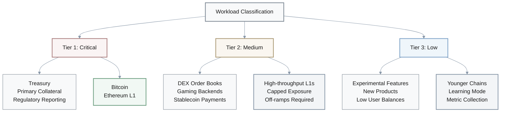

### Risk Tier Allocation

| Tier | Workload Type | Platform Choice | Risk Tolerance | Requirements |
|------|--------------|----------------|----------------|--------------|
| **Tier 1 (Critical)** | Treasury, primary collateral, regulatory | Bitcoin, Ethereum L1 | Minimal | Longest track record, conservative architecture |
| **Tier 2 (Medium)** | DEX, gaming, high-freq payments | High-throughput L1s | Limited, capped | Off-ramps, incident procedures |
| **Tier 3 (Low)** | Experimental, new products | Younger chains | Higher, learning mode | Metric collection, small balances |

**Treasury Lead:** For the most critical layers?

**Architect:** For the highest-criticality layers—treasury, primary collateral, regulatory reporting—we keep exposure concentrated on chains with the longest security track record and most conservative architectures, even if that means lower throughput or higher fees.

**Treasury Lead:** Got it.

**(Using high-performance chains):**

**DeFi Lead:** Where do the high-throughput chains fit?

**Architect:** [pause] For medium-criticality but performance-sensitive workloads—DEX order books, gaming backends, or high-frequency stablecoin payments—we allow limited, capped exposure to high-throughput chains, with explicit off-ramps back to more conservative layers and well-tested incident procedures for chain halts or reorgs.

**DeFi Lead:** Right.

**Product Lead:** And for experimental features?

**Architect:** For experimental features, new products, or verticals where user balances are small and reversible, we can use younger high-performance chains more freely to learn, while treating gathered metrics like uptime, latency under stress, and security incidents as inputs into future risk re-weighting.

**Product Lead:** Makes sense.

**Risk Officer:** We shouldn't assume those risk levels stay fixed.

**Architect:** Right. We regularly revisit allocations as validator decentralization, client diversity, outage history, and institutional adoption evolve, instead of assuming current risk levels are static.

**Risk Officer:** Agreed.

### Risk Re-evaluation Metrics

Continuously monitor and reassess:

- **Validator decentralization**: Nakamoto coefficient trends
- **Client diversity**: Implementation count and usage distribution
- **Outage history**: Frequency, duration, root causes
- **Institutional adoption**: Custody support, regulated products
- **Security incidents**: Exploit patterns, response effectiveness
- **Governance maturity**: Upgrade processes, community involvement

---

## 9. Security Mechanisms: Language vs Convention-Based Safety

**Q:** When designing our smart-contract stack, how should we decide between relying heavily on language- and architecture-level safety mechanisms—like Move's resource types, formal verification, and restricted execution models—versus relying mostly on audits and conventions in more flexible environments like the EVM?

**A:** **Security Lead:** Good question. Let's first inventory which bug classes are most dangerous for us.

**Architect:** Exactly. We identify issues like asset duplication, reentrancy, and bridge logic errors, then check which of them can be structurally ruled out by language or VM design versus merely discouraged by coding standards.

**Security Lead:** Mm-hmm.

### Security Approach Decision

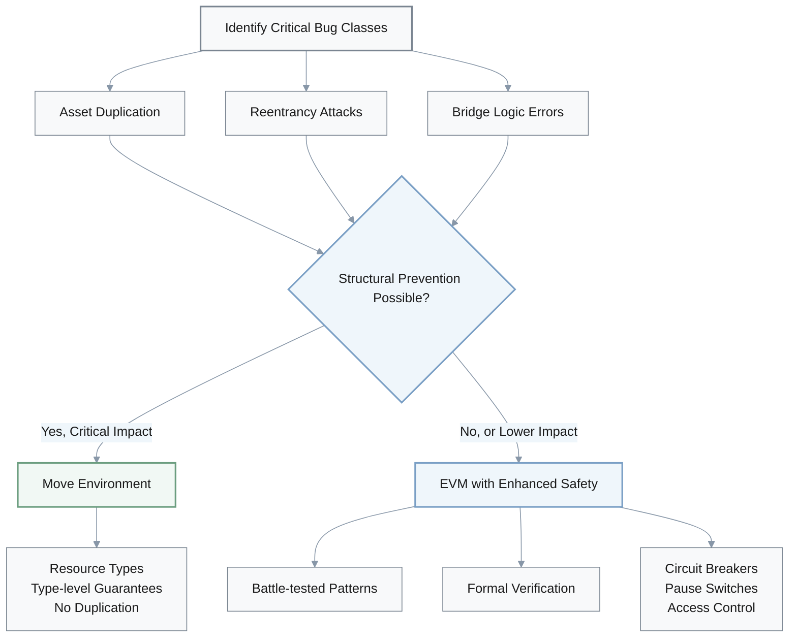

### Security Mechanism Comparison

| Approach | Prevention Method | Ecosystem Maturity | Flexibility | Best For |
|----------|------------------|-------------------|-------------|----------|
| **Move (Language-level)** | Type system, resource semantics | Medium | Lower | Asset-critical systems |
| **EVM + Audits** | Convention, reviews | High | Higher | Complex DeFi composability |
| **EVM + Formal Verification** | Mathematical proof | Medium | Medium | High-value contracts |
| **Hybrid** | Split by criticality | Varies | Optimal | Layered architecture |

**Protocol Engineer:** If we're systemically important or handle complex asset interactions, what does that suggest?

**Architect:** [pause] It strongly suggests considering environments like Move that encode asset non-duplication and single-use semantics at the type-system level, even at the cost of a smaller auditor and tooling ecosystem.

**Protocol Engineer:** I see.

**(If we stay in EVM):**

**Security Lead:** Suppose we stay in EVM environments.

**Architect:** Then we assume audits alone are insufficient. We pair them with battle-tested patterns, formal verification tools where feasible, runtime safeguards such as circuit breakers and pause switches, and tight access-control design, all grounded in known exploit taxonomies from DeFi and bridge incidents.

**Security Lead:** Got it.

**Platform Engineer:** Can we mix and match?

**Architect:** Yes. Where possible, we split functionality: keep the most security-sensitive components—bridges and core vaults—in the safest available language or VM and expose simpler interfaces to higher-level, more flexible environments.

**Platform Engineer:** Makes sense.

**Security Lead:** And we treat security as an ongoing investment.

**Architect:** Exactly. We make ongoing security investment—bug bounties, incident response drills, upgrade procedures—a budgeted line item comparable to infrastructure spend, not a one-time audit exercise.

**Security Lead:** Agreed.

### Security Investment Framework

**One-time Activities:**
- Initial architecture design
- Language/VM selection
- Initial audits

**Ongoing Investment (Budgeted Line Item):**
- **Bug Bounty Programs**: Continuous reward structure
- **Incident Response Drills**: Quarterly exercises
- **Upgrade Procedures**: Tested and documented
- **Continuous Audits**: Per major release
- **Security Monitoring**: Real-time threat detection
- **Community Security Engagement**: Disclosure programs

---

## 10. Future-Proofing: ZK Proofs and Post-Quantum Cryptography

**Q:** Looking at a 3–5 year horizon, we want our blockchain stack to stay resilient as zero-knowledge proofs scale up, Layer-2s proliferate, and post-quantum cryptography eventually arrives. How do we factor these long-term shifts into today's architecture decisions?

**A:** **Architect:** Good question. Let me think... We prefer ecosystems with clear upgrade and governance paths for cryptography and data-availability components, such as Ethereum's multi-phase sharding and rollup roadmap or Polkadot's on-chain upgrade mechanisms. That way, moving to new proof systems or signature schemes doesn't require disruptive hard forks.

**Protocol Researcher:** Mm-hmm. We should also look at how natively each chain integrates ZK proofs.

**Architect:** Exactly. Some L1s position ZK purely as an L2 scaling solution, while others plan ZK-native state representations. We choose platforms whose roadmaps align with our expected privacy and scalability needs.

**Protocol Researcher:** Makes sense.

### Technology Roadmap Alignment

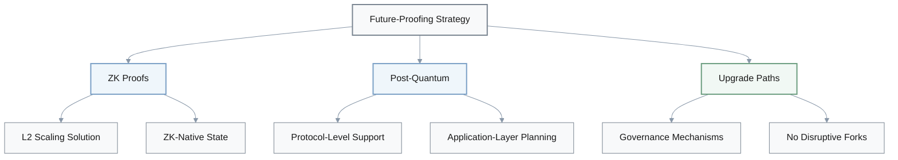

### Platform Upgrade Capabilities

| Platform | ZK Integration | Post-Quantum Plans | Upgrade Mechanism | Fork Requirements |
|----------|---------------|-------------------|-------------------|-------------------|
| **Ethereum** | L2-focused (rollups) | Research phase | EIP process | Hard forks |
| **Polkadot** | Parachain-level | Research phase | On-chain governance | Forkless upgrades |
| **Solana** | VM-level support possible | Limited visibility | Validator coordination | Coordinated updates |
| **Move chains** | VM extensible | Limited visibility | Varies by chain | Varies |

**(Planning for post-quantum):**

**Security Lead:** Many chains don't have clear post-quantum plans yet.

**Architect:** Right. For chains without demonstrated plans for post-quantum readiness, we treat long-term key rotation and migration as our responsibility at the application layer and plan conservatively for key lifetimes and signature schemes.

**Security Lead:** Got it.

**Protocol Researcher:** We should avoid opaque proving stacks too.

**Architect:** Right. We avoid tying our architecture to proprietary or opaque proving stacks where we can't independently assess security and performance. We favor stacks with open specifications, strong academic scrutiny, and multiple implementations.

**Protocol Researcher:** Agreed.

**Product Lead:** And we design for migration over time.

**Architect:** Yes. We design the system so that critical components—identity, KYC proofs, asset registries—can be migrated to new chains or layers as standards and regulatory expectations around ZK and post-quantum schemes evolve.

**Product Lead:** Good point.

### Future-Proofing Checklist

**ZK Proof Strategy:**
- [ ] Evaluate platform's ZK roadmap alignment
- [ ] Assess proving system openness
- [ ] Check academic scrutiny level
- [ ] Verify multiple implementations exist
- [ ] Plan privacy and scalability needs

**Post-Quantum Readiness:**
- [ ] Identify platform PQ plans
- [ ] Design application-layer key rotation
- [ ] Plan conservative key lifetimes
- [ ] Monitor NIST PQ standards
- [ ] Prepare migration paths

**Upgrade Governance:**
- [ ] Understand upgrade mechanisms
- [ ] Assess hard fork requirements
- [ ] Evaluate community governance
- [ ] Plan for cryptographic transitions
- [ ] Design modular architecture for component migration

---

## 11. Organization-Wide Strategy: Multi-Chain Role Allocation (2025-2028)

**Q:** For our organization-wide multi-chain and multi-layer architecture across custody, exchanges, applications, and data analytics from 2025 to 2028, how should we allocate roles to Bitcoin, Ethereum (L1 plus rollups), high-throughput L1s, and interoperability layers to create a coherent, governable strategy?

**A:** **Architect:** Good question. I'd start by assigning a narrow but important role to Bitcoin.

**Treasury Lead:** As in long-term settlement and collateral?

**Architect:** Exactly. Bitcoin becomes our long-term settlement and collateral asset, where its conservative PoW design and deep liquidity matter more than programmability.

**Treasury Lead:** Got it.

### Multi-Chain Role Architecture

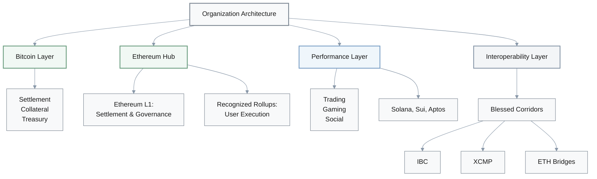

### Role Allocation Matrix

| Layer | Primary Role | Secondary Role | Risk Profile | Governance |
|-------|-------------|---------------|--------------|------------|
| **Bitcoin** | Settlement, collateral | Treasury store | Conservative | Minimal changes |
| **Ethereum L1** | Programmable settlement, governance | High-value assets | Conservative | EIP process |
| **Ethereum Rollups** | User execution | DeFi, NFTs | L1-inherited | Per-rollup |
| **High-throughput L1s** | Vertical-specific execution | Trading, gaming, social | Higher risk, capped | Per-chain |
| **Interop Layers** | Asset/message corridors | Cross-chain flows | Varies by type | Framework-specific |

**(Core programmable hub):**

**DeFi Lead:** Ethereum then becomes our programmable center?

**Architect:** Yes. Ethereum L1 should be the primary programmable settlement and governance layer for high-value assets and contracts, with rollups providing scalable execution for most end-user interactions. We explicitly define which rollups we recognize as "near-L1 equivalent" from a risk and compliance standpoint.

**DeFi Lead:** Makes sense.

**Platform Engineer:** Where do high-throughput L1s like Solana, Sui, or Aptos fit?

**Architect:** [pause] We use one or more high-throughput L1s as optional execution frontiers for specific verticals—trading, gaming, social—subject to strict treasury limits, clear bridging policies, and continuous monitoring of validator and client diversity.

**Platform Engineer:** Right.

**Risk Officer:** And for interoperability?

**Architect:** We choose one or two interoperability frameworks—like IBC in Cosmos, XCMP in Polkadot, or selected bridges between Ethereum and other L1s—as our "blessed corridors" and forbid or heavily restrict ad-hoc bridges outside this set.

**Risk Officer:** Good approach.

**Governance Lead:** Internally, we need governance around these choices.

**Architect:** Absolutely. We align internal governance—risk committees and architecture review boards—around these role definitions. Every new product proposal must specify which chains and layers it will touch, how that fits the approved pattern, and what exceptions or additional controls are required.

**Governance Lead:** Agreed.

### Governance Framework

**Internal Governance Structure:**

- **Risk Committee**: Approves chain allocations and exposure limits
- **Architecture Review Board**: Reviews technical fit and exceptions
- **Compliance Committee**: Validates regulatory alignment

**Product Proposal Requirements:**

1. **Chain Selection Justification**
   - Which chains/layers will be used
   - Why each is necessary
   - How it fits approved patterns

2. **Risk Assessment**
   - Exposure levels per chain
   - Bridge dependencies
   - Incident response plans

3. **Exception Handling**
   - Any deviations from standard patterns
   - Additional controls required
   - Timeline for compliance

4. **Exit Strategy**
   - Off-ramps to conservative layers
   - Asset recovery procedures
   - Sunset plans if needed

### Treasury Limits by Platform Type

| Platform Type | Max Treasury Allocation | Max User Asset Exposure | Bridge Exposure Cap |
|---------------|------------------------|------------------------|---------------------|
| **Bitcoin** | 40-60% | N/A (collateral) | N/A |
| **Ethereum L1** | 30-50% | 60-80% | N/A |
| **Recognized Rollups** | 10-20% | 50-70% | Per-rollup limits |
| **High-throughput L1s** | 5-10% | 20-30% | Strict caps |
| **Experimental** | <5% | <10% | Minimal |

---

## Summary: Decision Framework Principles

### Core Architectural Principles

1. **Workload Segmentation**: Match chain characteristics to workload requirements
2. **Conservative Foundation**: Keep critical assets on proven, secure platforms
3. **Progressive Risk Taking**: Allow measured exposure to high-performance chains
4. **Clear Exit Paths**: Maintain migration and off-ramp strategies
5. **Governance Alignment**: Internal controls match technical architecture
6. **Continuous Re-evaluation**: Regularly reassess risk allocations

### Key Decision Criteria

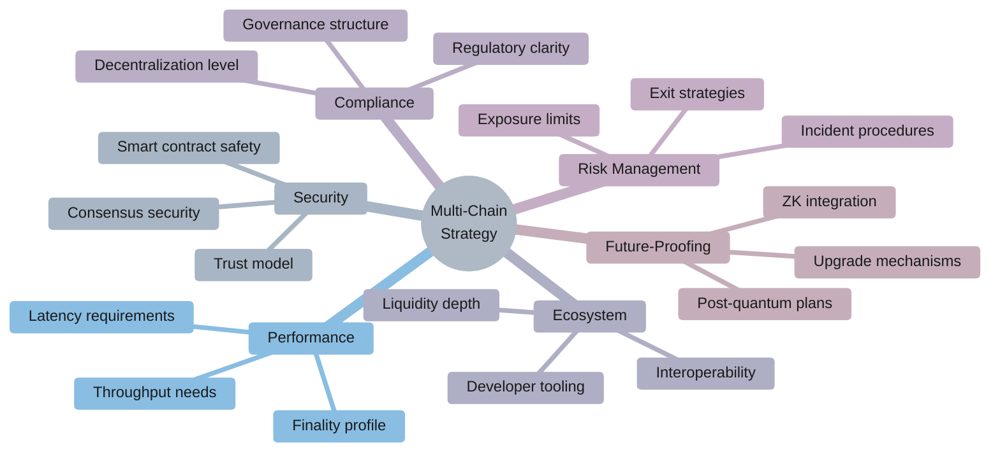

### Implementation Checklist

**Pre-deployment:**
- [ ] Define workload criticality tiers
- [ ] Set exposure limits per platform
- [ ] Document risk thresholds and triggers
- [ ] Establish governance review process
- [ ] Identify blessed interop corridors

**Ongoing Monitoring:**
- [ ] Track validator decentralization metrics
- [ ] Monitor outage frequency and duration
- [ ] Assess institutional adoption trends
- [ ] Review regulatory developments
- [ ] Evaluate technology roadmap progress

**Incident Response:**
- [ ] Chain halt procedures
- [ ] Bridge exploit response
- [ ] User communication protocols
- [ ] Asset recovery strategies
- [ ] Regulatory reporting requirements
