1. Q: When you trace the evolution from Bitcoin's PoW UTXO ledger to Ethereum's account-based smart contracts and then to Solana, Polkadot, Sui, and Aptos, how does that change your mental model of what a "blockchain architecture" is?
   A: **Architect:** Hmm, let me think... [pause] The big surprise for me was how much the state model, consensus design, and layering strategy together define "a chain", not just the consensus logo on the slide.

   **Researcher:** Right. Which of those shifts challenged you most—state model, consensus, or the way newer chains layer execution and data?

   **Architect:** [pause] State model first. Specifically, moving from UTXO to accounts, then to object/resource-oriented designs, forced me to stop treating "blockchain" as one canonical pattern.

   **PM:** Mm-hmm. Moreover, it exposed earlier assumptions like "all chains basically work like Bitcoin or Ethereum" as way too coarse.

   **Architect:** Exactly. If I were explaining this to a non‑technical stakeholder now, I'd frame it as a family of architectures—each with different trade‑offs in state, consensus, and layering—rather than a single template everyone copies.
  
   **Researcher:** That's a good reframing. In other words, more like design families than a single blueprint?
  
   **Architect:** Precisely.

---

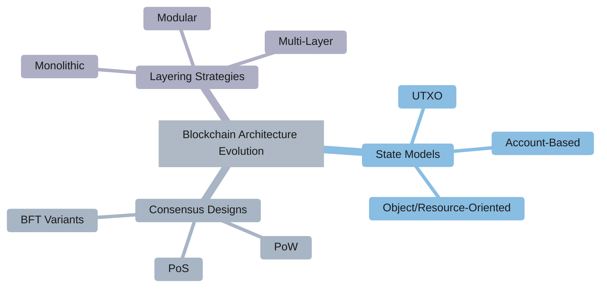

1. Q: After comparing UTXO, account-based, and object/resource-oriented state models, how has your understanding of on‑chain state and its trade‑offs evolved?
   A: **Engineer A:** Honestly, I used to think of on‑chain state as just "stuff in a global ledger." Now I see three distinct models with different parallelism, composability, and auditability stories.

   **Engineer B:** Got it. Spell that out a bit—how do you see parallelism across the three?

   **Engineer A:** Let me think... [pause] UTXO shines at embarrassingly parallel spends. In contrast, account-based makes composable DeFi easy, while object/resource models push for fine‑grained parallel execution with stronger invariants.

   **Researcher:** Mm-hmm. Good breakdown. Now, which model actually fits the applications you care about most?

   **Engineer A:** For rich DeFi and on‑chain governance, account-based still feels natural. For high‑throughput, asset‑centric workloads, the object/resource approach is compelling.

   **Engineer B:** Right. However, the catch is where the complexity lands—object models push more burden onto developers and tooling to reason about ownership and access paths.
   
   **Engineer A:** True. That's the trade-off—performance for cognitive overhead.
   
   **Researcher:** Smart observation.

---

### State Model Comparison

| **Aspect** | **UTXO** | **Account-Based** | **Object/Resource-Oriented** |
|------------|----------|-------------------|------------------------------|
| **Parallelism** | High (embarrassingly parallel) | Low (sequential dependencies) | High (fine-grained ownership) |
| **Composability** | Limited | Natural (DeFi-friendly) | Moderate (ownership constraints) |
| **Developer Complexity** | Low | Moderate | High (ownership reasoning) |
| **Best Use Cases** | Payments, asset transfers | DeFi, governance | High-throughput assets |
| **Examples** | Bitcoin, Cardano | Ethereum, Polygon | Sui, Aptos |

---

1. Q: When you group L1s into architecture families—conservative settlement, programmable L1 plus rollups, high‑performance monoliths, and Move‑based parallel chains—how does that change how you choose a home chain for a project?
   A: **Strategist:** Good question. The family lens forces me to stop asking "Which single chain is best?" and instead ask "Which family fits this concrete use case?"

   **Architect:** Right. Try mapping one of your own use cases into each family. Where does the fit feel natural versus forced?

   **Strategist:** Hmm... [pause] For example, high‑value settlement feels natural on conservative L1s, while consumer UX‑heavy apps fit better on high‑performance or Move‑based chains.

   **Risk Lead:** Exactly—and it also exposes when we were over‑fitting everything to one dominant chain just because it was default.

   **Strategist:** Mm-hmm. Additionally, for multi‑chain strategy, the family view sharpens diversification: you consciously spread risk across different architectural bets instead of having accidental concentration.
   
   **Architect:** That's insightful. In other words, it's more about portfolio thinking than single-chain allegiance?
   
   **Strategist:** Precisely. Different tools for different jobs.

---

### L1 Architecture Families

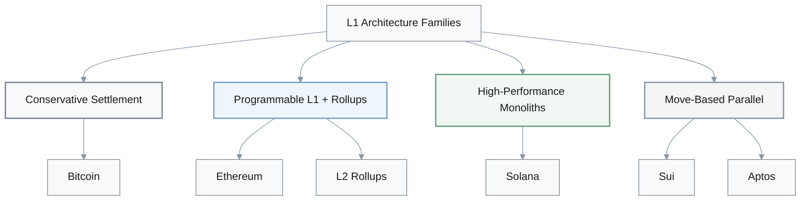

| **Family** | **Strength** | **Trade-off** | **Use Case** |
|------------|-------------|---------------|--------------|
| **Conservative Settlement** | Maximum security, proven | Limited programmability | High-value settlement |
| **Programmable L1 + Rollups** | Flexibility, large ecosystem | Complexity, coordination | DeFi, general applications |
| **High-Performance Monoliths** | High throughput, low latency | Hardware requirements | Consumer UX, gaming |
| **Move-Based Parallel** | Safety, parallel execution | New paradigm, smaller ecosystem | Asset-centric workloads |

---

1. Q: Seeing how governance processes—BIPs, EIPs, on‑chain referenda, foundation roadmaps—limited radical change on Bitcoin and Ethereum and pushed innovation to new L1s, how does this reshape your expectations about future protocol evolution?
   A: **Researcher:** It killed the lazy assumption that "Ethereum can always just add X later."

   **Governance Analyst:** Exactly. Governance path dependence is real. Once a community, process, and economic ecosystem harden, some changes become politically or operationally impossible.

   **Architect:** Therefore, when we assess a feature, we should ask: is it realistic for an incumbent to pivot, or is this more plausible as a new L1 or rollup design?

   **Risk Lead:** Right. Moreover, we need to price governance constraints directly into long‑term architectural bets, not treat them as soft factors. Who can block change, and under what rules, becomes part of our threat and opportunity model.
   
   **Governance Analyst:** Good point. That makes governance a first-order technical constraint, not just a political footnote.
   
   **Architect:** Makes sense.

1. Q: After comparing Bitcoin, Ethereum, Solana, Polkadot, Sui, and Aptos with their concrete TPS, latency, and hardware data, what new nuances do you see in the trilemma between security, decentralization, and scalability?
   A: **Engineer A:** I've dropped the binary language like "this chain solved the trilemma." The data shows continuous trade‑off surfaces, not magic points.

   **Engineer B:** Where did your thinking change most?

   **Engineer A:** I used to under‑weight hardware requirements and validator economics. Consequently, I now see how those shape real decentralization, not just the whitepaper narrative.

   **SRE:** Mm-hmm. Furthermore, our own SLOs—latency, uptime, fee ceilings—map to specific points on that surface. A chain can be "good" in the abstract but wrong for our target SLOs.

   **Engineer A:** Therefore, instead of asking "Is it secure and scalable?" we ask "Where on the trilemma surface does this chain actually live given our constraints?"
   
   **Engineer B:** Oh! That shifts it from binary pass/fail to fit-for-purpose evaluation.
   
   **Engineer A:** Right. More nuanced.

---

### The Blockchain Trilemma

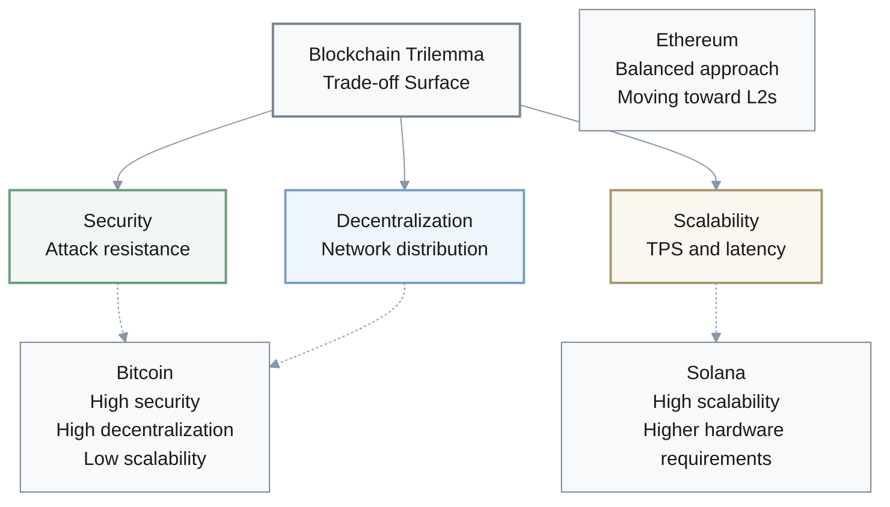

**Key Insight**: No chain appears to "solve" the trilemma in practice; instead, each occupies a specific point on the trade-off surface based on:
- **Hardware requirements**: Higher specs → fewer validators → less decentralization
- **Validator economics**: Staking yield, slashing, liquid staking concentration
- **Real performance**: Sustained TPS under adversarial conditions, not peak benchmarks

---

1. Q: How did detailed decentralization metrics—Nakamoto coefficient, validator counts, hardware requirements, liquid‑staking concentration—change your intuition about what "sufficient decentralization" means in practice?
   A: **Researcher:** Raw node counts feel almost useless now.

   **Engineer:** Same. I care more about the effective Nakamoto coefficient, hardware bar, and how much stake sits in a few liquid‑staking providers.

   **Risk Lead:** Given that, when you evaluate Ethereum vs Solana vs Polkadot vs Move chains now, what's your first cut?

   **Researcher:** Let me think... [pause] I look at who can realistically join validation, how concentrated economic control is, and how slashing or governance actually work in practice.

   **Risk Lead:** Consequently, that replaces the old heuristic of "more validators equals safer" with a more nuanced question: "How many independent, economically meaningful veto points do we really have—and what extra data do we still need before trusting high‑value assets here?"
   
   **Engineer:** Good framing. Much more actionable than raw counts.
   
   **Researcher:** Agreed.

---

### Decentralization Metrics Framework

**Beyond Raw Validator Counts**:

| **Metric** | **What It Measures** | **Why It Matters** |
|------------|---------------------|-------------------|
| **Nakamoto Coefficient** | Min entities controlling >33%/51% | Actual attack resistance |
| **Hardware Requirements** | CPU, RAM, storage, bandwidth | Validator accessibility |
| **Liquid Staking Concentration** | % stake in top 5 providers | Economic centralization |
| **Geographic Distribution** | Validator location spread | Regulatory and infrastructure risk |
| **Client Diversity** | Multiple implementations | Bug and exploit resilience |

**Evaluation Checklist**:
- ✅ Who can **realistically join** validation with available resources?
- ✅ How is economic control **distributed** among validators?
- ✅ How do slashing and governance **actually work** in practice?
- ✅ What are **independent, economically meaningful veto points**?

---

1. Q: After studying L0/L1/L2/L3 layering—relay chains, rollups, payment channels, app‑specific chains—how has your mental model of where the risk lives in a blockchain stack shifted?
   A: **Security Engineer:** I used to dump almost all risk into the base layer. Now I see how many incidents originate in bridges, sequencers, or bespoke app layers.

   **Architect:** Walk a failure mode through the stack. Take a bridge hack or rollup bug—where does it actually start, and how does it propagate?

   **Security Engineer:** Hmm... [pause] Often at the contract or bridge layer, not in consensus itself.

   **Risk Lead:** Right. Consequently, our threat models and diagrams need to highlight L1, bridge, sequencer, and app boundaries explicitly.

   **Security Engineer:** Exactly. Moreover, when we design a multi‑layer architecture we care about, we should be able to point to each layer and say, "Here's the specific risk and mitigation story," instead of just "the base chain is secure."
   
   **Architect:** That's a more mature security model.
   
   **Security Engineer:** Mm-hmm. Layered defense thinking.

---

### Blockchain Stack Layers & Risk Points

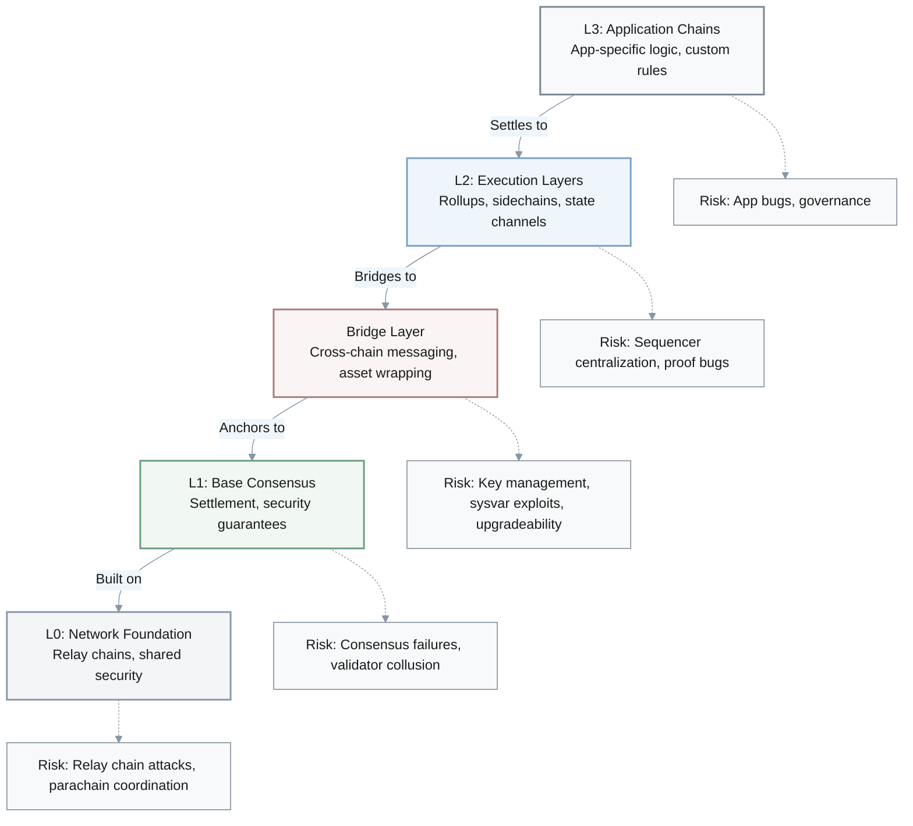

**Security Model Evolution**:
- **Old model**: Base layer security → everything else is safe
- **New model**: Each layer has distinct risk profiles and mitigation requirements
- **Critical insight**: Many incidents originate at **bridge and sequencer layers**, not consensus

---

1. Q: The investigations show gaps between theoretical TPS claims and sustained performance under spam, MEV, and state bloat. How does this change how you read performance marketing from L1 and L2 projects?
   A: **Engineer A:** I no longer take TPS or latency numbers at face value.

   **Engineer B:** What do you ask now when a project brags about performance?

   **Engineer A:** First, hardware specs. Subsequently, adversarial tests: spam, MEV stress, state‑growth scenarios. Finally, outage and degradation history.

   **PM:** Good approach. Can you think of a past example where you believed a headline number and now see the hole?

   **Engineer A:** Yes—chains that quoted peak lab benchmarks without disclosing hardware or spam behavior. Today I'd interrogate those with a checklist before accepting them as input to platform selection.
   
   **Engineer B:** That's a much more skeptical but healthier stance.
   
   **Engineer A:** Exactly. Trust but verify, with emphasis on verify.

---

### Performance Evaluation Checklist

**Questions to ask when evaluating TPS/latency claims**:

1. **Hardware Specifications**
   - CPU cores, RAM, SSD specs
   - Network bandwidth requirements
   - Can typical developers/validators run this?

2. **Adversarial Testing**
   - Spam resistance under sustained load
   - MEV extraction stress scenarios
   - State growth and bloat handling

3. **Historical Performance**
   - Outage frequency and duration
   - Degradation under real-world conditions
   - Recovery time and procedures

4. **Operational Transparency**
   - Peak vs. sustained throughput
   - Lab benchmarks vs. mainnet performance
   - Documented failure modes

$$
\text{Real TPS} = \frac{\text{sustained transactions}}{\text{time period}} \times \text{uptime percentage}
$$

**Red Flags**:
- ⚠️ Peak TPS without hardware specs
- ⚠️ No mention of adversarial conditions
- ⚠️ Missing outage history or incident reports
- ⚠️ Lab benchmarks presented as production capability

---

1. Q: Comparing Solana's Sealevel, Aptos's Block‑STM, and Sui's object‑centric execution, how do you think about the developer complexity and mental overhead introduced by parallel execution architectures?
   A: **Developer:** Parallel execution sounds free on the slide, but it shows up as cognitive load in my head.

   **Architect:** In what way?

   **Developer:** With Sealevel, I'm thinking about account access lists; with Block‑STM, about conflicts and retries; with Sui, about object ownership and capability flows.

   **QA Lead:** Mm-hmm. How does that change your testing and tooling expectations?

   **Developer:** I'd want stronger static analysis, better conflict visualization, and more targeted concurrency tests. Additionally, I expect new classes of bugs—subtle race‑like behavior rather than just simple logic mistakes.
   
   **Architect:** Good observation. Therefore, the performance gain comes with a testing tax.
   
   **Developer:** Exactly. No free lunch.

---

### Parallel Execution Architectures Comparison

| **Approach** | **Mechanism** | **Developer Mental Model** | **Testing Complexity** | **Example** |
|-------------|---------------|---------------------------|------------------------|-------------|
| **Sealevel** | Declare account access lists upfront | Think about all accounts touched | Verify access list correctness | Solana |
| **Block-STM** | Optimistic execution with conflict detection | Reason about transaction conflicts and retries | Test for race conditions and retry behavior | Aptos |
| **Object-Centric** | Fine-grained ownership and capabilities | Model object ownership flows | Verify capability propagation | Sui |

**Cognitive Load Spectrum**:
```
Low ←────────────────────────────────────────→ High
    Sequential        Sealevel      Block-STM      Object-Centric
    (EVM)            (Access lists) (Conflicts)   (Ownership)
```

**Developer Requirements by Architecture**:
- **Sealevel**: Static analysis of account access patterns
- **Block-STM**: Conflict visualization and retry testing
- **Object-Centric**: Ownership reasoning and capability tracking

**Trade-off**: Performance gains come with a **testing tax** — new classes of concurrency bugs rather than simple logic errors.

---

1. Q: What shifts in your mental model of smart‑contract safety come from contrasting Solidity/EVM with Move's resource‑oriented design and emphasis on formal verification?
   A: **Security Engineer:** I now see some vulnerability classes—reentrancy, asset duplication, unsafe ownership—as partly language‑driven, not just "careless developer" problems.

   **Researcher:** Right. Move's resource model and linear types make "asset can't be duplicated or lost" a default property instead of an after‑thought.

   **Security Engineer:** Consequently, this changes how I view audits: with EVM I rely heavily on auditors catching pattern‑based issues; with Move I expect language‑level guarantees plus formal proofs for critical modules.

   **Risk Lead:** Furthermore, for "enterprise‑ready" platforms, I'm starting to weigh built‑in safety properties and verification tooling almost as highly as raw ecosystem size.
   
   **Researcher:** That's a shift from quantity of dApps to quality of guarantees.
   
   **Security Engineer:** Exactly. Safety by construction, not just review.

---

### Smart Contract Safety Models

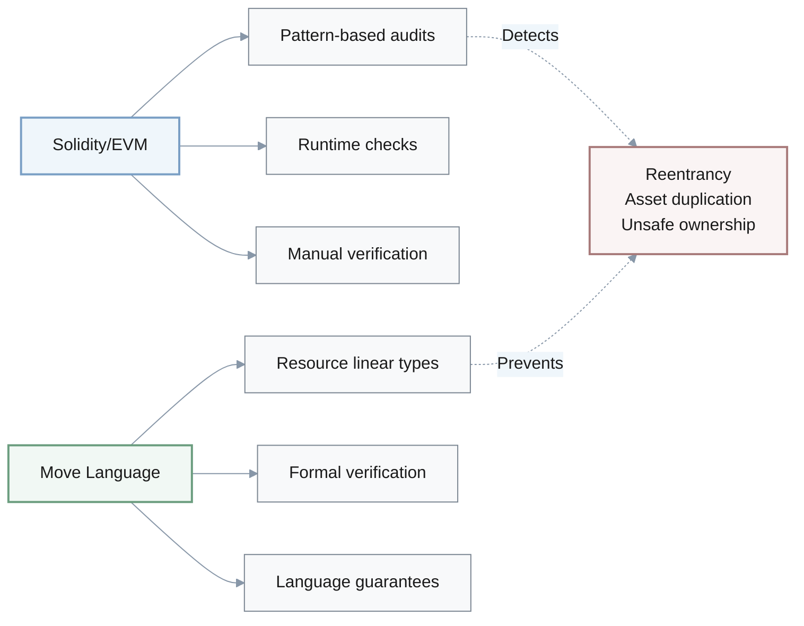

| **Aspect** | **EVM/Solidity** | **Move** |
|------------|-----------------|----------|
| **Safety Approach** | Post-hoc review and audits | Safety by construction |
| **Asset Handling** | Manual tracking, prone to duplication | Linear types prevent duplication/loss |
| **Vulnerability Prevention** | Pattern detection by auditors | Language-level guarantees |
| **Verification** | Optional, external tools | Built-in formal verification support |
| **Ecosystem Maturity** | Large, established | Growing, newer paradigm |
| **Developer Learning Curve** | Moderate | Steep (new concepts) |

**Key Shift**: From **"catch bugs in review"** to **"make bugs impossible by design"**

**Enterprise Consideration**: Weigh built-in safety properties and verification tooling as highly as ecosystem size for high-value applications.

---

1. Q: How did detailed Solana outage narratives—Gulf Stream, leader schedule issues, client monoculture, spam dynamics—refine your understanding of operational resilience beyond consensus protocol correctness?
   A: **SRE:** It drove home that consensus correctness is necessary but nowhere near sufficient.

   **Architect:** What else now sits in your resilience checklist?

   **SRE:** Let me think... [pause] Client diversity, restart and coordination procedures, spam and congestion controls, and how upgrade processes are actually run.

   **Risk Lead:** Therefore, before adopting a high‑performance L1, you'd ask for concrete SLOs and incident playbooks, not just a consensus paper?

   **SRE:** Exactly. I'd want to see how they behaved under real outages, not just how elegant the protocol looks on‑chain.
   
   **Architect:** That's a pragmatic operations lens, not just theory.
   
   **SRE:** Right. Battle-tested beats whitepaper-perfect.

---

### Operational Resilience Checklist

**Beyond Consensus Protocol Correctness**:

| **Category** | **What to Evaluate** | **Why It Matters** |
|-------------|---------------------|-------------------|
| **Client Diversity** | Multiple independent implementations | Prevents single-bug cascading failures |
| **Restart Procedures** | Node coordination and recovery time | Determines downtime duration |
| **Spam Controls** | Rate limiting, fee markets, priority mechanisms | Protects against congestion attacks |
| **Upgrade Process** | Coordination, rollback capabilities, testing | Reduces upgrade-related outages |
| **Incident History** | Frequency, root causes, resolution time | Reveals real-world behavior patterns |

**Questions for High-Performance L1 Adoption**:
- ✅ What are the **documented SLOs** (latency, uptime, fee ceilings)?
- ✅ Do **incident playbooks** exist for common failure modes?
- ✅ How did the chain behave under **real outages**, not just in theory?
- ✅ What is the **client monoculture risk** (single implementation dominance)?
- ✅ How are **spam and congestion** handled under adversarial conditions?

**Principle**: **Battle-tested beats whitepaper-perfect** — operational track record > elegant protocol design.

---

1. Q: After examining Polkadot's shared‑security parachains and Cosmos's sovereign chains with IBC, how has your view of interoperability and security reuse evolved?
   A: **Architect:** I used to lump "bridges" into one bucket. Now I distinguish shared‑security relay models from sovereign chains connected by IBC.

   **Researcher:** How does that change your design choices?

   **Architect:** Hmm... [pause] For some projects I'd prefer shared security—accepting tighter coupling in exchange for inherited security guarantees. Conversely, for others, sovereign chains with IBC give more autonomy at the cost of more responsibility.

   **Risk Lead:** Right. Moreover, governance and upgrade risk look very different under those two patterns, so they become first‑order considerations, not footnotes.
   
   **Researcher:** That's a more nuanced interoperability model.
   
   **Architect:** Agreed. Trade-offs, not just connections.

1. Q: The materials describe several cross‑chain bridge hacks and a detailed Wormhole exploit analysis. How do these examples change the way you reason about trust assumptions when you see a new bridge design?
   A: **Security Engineer:** I now start by listing the assumptions that failed in Wormhole—key management, sysvar handling, upgrade authority—before even reading the marketing.

   **Researcher:** Do you still treat bridged assets as equivalent to native ones?

   **Security Engineer:** Much less. I think of them as wrapped claims secured by a particular governance and key‑management setup.

   **Risk Lead:** Mm-hmm. Moreover, when reviewing documentation or code, I'm scanning for red‑flag patterns: opaque upgraders, centralized guardians, or poorly specified failure procedures.
   
   **Security Engineer:** Exactly. Assume hostile until proven otherwise.
   
   **Researcher:** That's a healthy paranoia for bridge security.

1. Q: When you compare trust‑minimized interoperability (IBC light clients, XCMP) with trusted multisig bridges and emerging ZK‑bridges, how has your notion of end‑to‑end security across chains become more nuanced?
   A: **Architect:** I now map out which components must be honest in each model for safety to hold—light clients, validators, guardians, provers.

   **Security Engineer:** Right. Moreover, that mapping becomes the core of how we prioritize options for a cross‑chain DeFi protocol.

   **Architect:** Trust‑minimized designs reduce the set of parties we rely on but can be operationally heavier. Conversely, trusted multisigs are simpler but concentrate risk. Meanwhile, ZK‑bridges shift trust into circuits and provers.

   **Risk Lead:** Nevertheless, regulatory and operational constraints might still push us toward "less pure" options, but at least we're explicit about what we're trading away.
   
   **Security Engineer:** Good framing. Trade-offs with eyes open.
   
   **Architect:** Exactly.

1. Q: How have discussions of validator economics—Ethereum liquid staking, Solana's validator shrink, Polkadot's NPoS, staking yields and slashing—shifted your understanding of the economic layer beneath consensus?
   A: **Researcher:** "More staking equals safer" now feels dangerously naive.

   **Economist:** Exactly. Concentration, rehypothecation, and governance capture all show up in the details of liquid‑staking and NPoS designs.

   **Researcher:** Consequently, when I look at a staking dashboard now, I'm interrogating who actually controls stake, how slashing works, and what incentives validators really face.

   **Risk Lead:** Right. Furthermore, I'm asking whether validator incentives align with users, bridges, and regulators—or whether there are obvious points where they conflict.
   
   **Economist:** That's a much more sophisticated economics lens.
   
   **Researcher:** Mm-hmm. Incentives matter more than TVL.

---

### Validator Economics Analysis

**Key Economic Factors**:

| **Factor** | **What to Examine** | **Risk Indicator** |
|-----------|--------------------|--------------------|
| **Staking Concentration** | % stake in top 5 liquid staking providers | >40% = high centralization risk |
| **Validator Economics** | Break-even costs, yield sustainability | Negative margins = validator exit pressure |
| **Slashing Mechanisms** | Penalties, correlation risk | Weak slashing = reduced security incentives |
| **Rehypothecation** | Restaking, borrowed stake | Multiple leverage layers = contagion risk |
| **Governance Control** | Voting power distribution | Concentrated power = capture risk |

**Evaluation Questions**:
- Who actually **controls stake** (beyond nominal validator counts)?
- How does **slashing** work in practice (penalties, frequency, appeal)?
- What **incentives** do validators face (aligned with users, or conflicts)?
- Are there **conflicts** between validator interests and bridge/user security?

**Insight**: **"More staking is not necessarily safer"** — concentration, rehypothecation, and governance capture all hide in the details.

---

1. Q: Reading about MiCA's CASP regime, US staking enforcement, and regulatory views on centralization, how has your model of the relationship between technical architecture and legal risk changed?
   A: **Policy Lead:** I now see specific architectural features—validator concentration, sequencer control, bridge governance—as regulatory chokepoints, not just technical trivia.

   **Architect:** In other words, when you look at a chain, you're mentally mapping it to likely CASP obligations or securities‑law scrutiny?

   **Policy Lead:** Exactly. A design that looks elegant technically can still be a magnet for enforcement if it centralizes too much power.

   **Risk Lead:** Consequently, that forces a sharper definition of "institutionally suitable": it's not only about performance and fees, but also about how easily regulators can pressure a small set of operators.
   
   **Policy Lead:** Right. Compliance by design, not retrofit.
   
   **Architect:** That's a crucial lens for enterprise adoption.

1. Q: Case studies of enterprise and institutional adoption—Onyx on Ethereum, Visa and stablecoins on Ethereum and Solana, Sui institutional products—show different alignment patterns. How does this reframe the question "Which L1 is enterprise‑ready?" for you?
   A: **Enterprise Architect:** I used to over‑weight TPS and fees. These examples highlight that enterprises actually prioritized governance clarity, tooling, auditability, and uptime.

   **PM:** In other words, marketing emphasized raw performance, but buying decisions leaned on reliability and compliance stories.

   **Enterprise Architect:** Exactly. Therefore, when I ask which L1 is "enterprise‑ready," I'm evaluating roadmap credibility, ecosystem health, support tooling, and governance maturity ahead of peak throughput numbers.

   **Risk Lead:** In other words, it becomes a portfolio of fit‑for‑purpose properties, not a single performance race.

---

### Enterprise L1 Evaluation Framework

**What Enterprises Actually Prioritize** (vs. Marketing Claims):

| **Priority** | **Weight** | **Evaluation Criteria** |
|-------------|-----------|------------------------|
| **Governance Clarity** | High | Decision processes, upgrade authority, legal entity |
| **Uptime & Reliability** | High | Historical SLO data, incident frequency, recovery time |
| **Tooling & Support** | High | Enterprise SDKs, documentation, technical support |
| **Auditability** | High | Transaction traceability, compliance features |
| **Regulatory Fit** | High | MiCA/securities alignment, data residency |
| **TPS & Fees** | Medium | Sufficient for use case, not maximum theoretical |
| **Ecosystem Size** | Medium | Availability of talent, vendors, integrations |

**Reframed Question**: Not "Which L1 has highest TPS?" but "Which L1 portfolio fits our compliance, reliability, and operational requirements?"

**Key Insight**: Roadmap credibility, ecosystem health, and governance maturity > peak throughput numbers.

---

1. Q: Having seen detailed attack taxonomies—51% attacks, MEV, smart‑contract exploits, bridge hacks—and mitigation strategies like slashing, formal verification, and ZK proofs, how has your personal threat‑model template for a blockchain system evolved?
   A: **Security Engineer:** My old template under‑weighted bridge governance and sequencer collusion.

   **Researcher:** What's in the updated version?

   **Security Engineer:** I enumerate base‑layer attacks, MEV vectors, contract‑level bugs, and cross‑chain governance failures explicitly.

   **Risk Lead:** Good. Furthermore, for a new multi‑chain protocol, we'd structure security reviews around those classes, then ask what extra monitoring, insurance, or contingency plans we need before holding significant value on that stack.
   
   **Security Engineer:** Right. Layered threat modeling, not just consensus risks.
   
   **Researcher:** Makes sense.

---

### Blockchain Security Threat Model

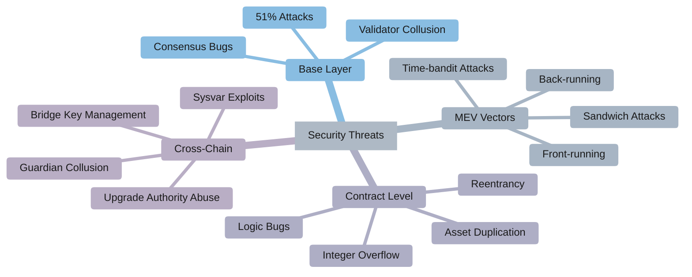

**Attack Categories & Mitigations**:

| **Attack Type** | **Examples** | **Mitigation Strategies** |
|----------------|-------------|--------------------------|
| **Base Layer** | 51% attack, validator collusion | High Nakamoto coefficient, slashing, client diversity |
| **MEV** | Sandwich attacks, front-running | Fair ordering, encrypted mempools, threshold decryption |
| **Smart Contract** | Reentrancy, asset duplication | Audits, formal verification, safe language design (Move) |
| **Cross-Chain** | Bridge hacks, guardian collusion | Trust-minimized designs, ZK proofs, decentralized guardians |

**Updated Security Review Structure**:
1. ✅ Base-layer attack resistance
2. ✅ MEV extraction vectors and mitigations
3. ✅ Contract-level vulnerability analysis
4. ✅ Cross-chain governance and bridge risks
5. ✅ Monitoring, insurance, and contingency plans

---

1. Q: The ZK‑focused sections connect privacy, scalability, and regulation. How do zero‑knowledge proofs now fit into your mental model of practical blockchain design instead of just cryptographic theory?
   A: **Cryptographer:** I now think concretely about where I'd deploy zk‑SNARKs, zk‑STARKs, or no‑ZK at all.

   **Architect:** For example?

   **Cryptographer:** Hmm... [pause] SNARKs for succinct verification in constrained environments, STARKs when transparency and post‑quantum hints matter, and no‑ZK when simplicity and auditability beat privacy.

   **Policy Lead:** Interesting. Moreover, ZK can significantly reshape the trade‑offs between transparency, compliance, and user privacy.

   **Cryptographer:** True. However, it introduces new risks—trusted setup, prover centralization, circuit bugs—that we now need to track as first‑class concerns.
   
   **Architect:** Overall, it's not a silver bullet—just another tool with trade-offs.
   
   **Cryptographer:** Exactly.

---

### Zero-Knowledge Proof Applications

**ZK Technology Decision Tree**:

| **Use Case** | **Recommended Tech** | **Rationale** |
|--------------|---------------------|---------------|
| **Succinct verification (constrained environments)** | zk-SNARKs | Small proof size, fast verification |
| **Transparency priority (no trusted setup)** | zk-STARKs | No trusted setup, post-quantum hints |
| **Privacy-preserving transactions** | zk-SNARKs | Balance privacy with efficiency |
| **Scalability rollups** | zk-SNARKs/STARKs | Compress computation for L1 verification |
| **Simple auditability priority** | No ZK | Transparency and simplicity > privacy |

**ZK Trade-offs**:

```
Privacy/Compression ←─────────────────────→ Simplicity/Auditability
     ZK-SNARKs          ZK-STARKs             No ZK
   (smallest proofs)  (no trusted setup)    (transparent)
```

**New Risk Categories with ZK**:
- ⚠️ **Trusted setup**: Ceremony compromise risk (SNARKs)
- ⚠️ **Prover centralization**: Who can generate proofs efficiently?
- ⚠️ **Circuit bugs**: Logic errors in ZK circuits
- ⚠️ **Verification costs**: On-chain verification gas/compute

**Regulatory Considerations**: ZK reshapes privacy vs. compliance trade-offs — enables selective disclosure while maintaining user privacy.

---

1. Q: After comparing performance tables and discussions of state growth, what new questions will you ask about storage, archival requirements, and node operation before trusting performance numbers from any L1 or L2?
   A: **SRE:** I will immediately ask who can realistically run full and archive nodes under the storage and bandwidth assumptions.

   **Engineer:** Therefore, TPS without node‑operation data is a red flag.

   **SRE:** Exactly. Specifically, I want explicit storage and bandwidth metrics next to TPS claims.

   **Architect:** Additionally, you are also thinking about how state‑growth constraints might cap long‑term viability for high‑throughput designs, right?

   **SRE:** Indeed. Throughput that only a handful of data centers can keep up with does not look like sustainable decentralization.
   
   **Engineer:** Good point. Accessibility matters.
   
   **SRE:** Right. Decentralization in practice, not just theory.

---

### Storage & Node Operation Requirements

**Critical Questions Before Trusting Performance Claims**:

| **Requirement** | **What to Ask** | **Red Flag** |
|-----------------|----------------|--------------|
| **Full Node** | CPU, RAM, SSD size, bandwidth | No specs provided |
| **Archive Node** | Total storage, growth rate | Only full node specs given |
| **State Growth** | Historical growth, pruning options | No state management plan |
| **Sync Time** | Initial sync and catch-up time | Days/weeks to sync |
| **Accessibility** | Can individuals run nodes at home? | Data center only |

**Node Operation Cost Analysis**:

$$
\text{Annual Node Cost} = (\text{Hardware} + \text{Bandwidth} + \text{Power}) \times 12
$$

**Sustainability Check**:
- Can typical developers afford to run nodes?
- What percentage of validators are in data centers?
- Is state growth rate sustainable over 5-10 years?
- Are pruning and archival strategies well-defined?

**Decentralization Reality**: Throughput that only data centers can sustain is unlikely to be consistent with sustainable decentralization in practice.

---

1. Q: The materials emphasize that different architectures are converging toward role specializations—Bitcoin as settlement, Ethereum as rollup hub, Solana/Sui/Aptos for high‑throughput workloads, Polkadot/Cosmos for multi‑chain. How does this specialization story change your view of winner‑take‑all narratives?
   A: **Strategist:** It weakens the idea that one chain will dominate everything.

   **Architect:** Right. Instead, I'm thinking about complementary roles: settlement, execution, interoperability.

   **Strategist:** Precisely. Consequently, that pushes me to design portfolios and system architectures that deliberately leverage multiple specialized roles rather than forcing everything onto one platform.

   **Risk Lead:** However, it also raises coordination and interoperability challenges—governance, MEV across domains, and bridge risk become structural, not temporary obstacles.
   
   **Strategist:** True. Specialization brings its own complexity costs.
   
   **Architect:** Trade-offs all the way down.

---

### Multi-Chain Ecosystem: Specialized Roles

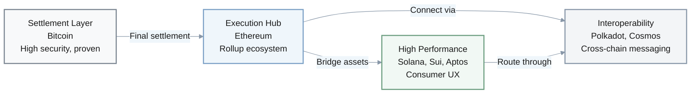

**Chain Specialization by Role**:

| **Role** | **Chains** | **Strength** | **Use Cases** |
|----------|-----------|-------------|---------------|
| **Settlement** | Bitcoin | Maximum security, immutability | High-value finality, store of value |
| **Execution Hub** | Ethereum + L2s | Flexibility, large ecosystem | DeFi, general smart contracts |
| **High Performance** | Solana, Sui, Aptos | Low latency, high throughput | Gaming, consumer apps, payments |
| **Interoperability** | Polkadot, Cosmos | Cross-chain messaging | Multi-chain coordination |

**Strategic Implications**:
- **No winner-take-all**: Different architectures serve complementary roles
- **Portfolio approach**: Leverage specialized chains for specific workloads
- **Structural complexity**: Coordination, MEV across domains, and bridge risk become permanent challenges
- **Design principle**: Build for graceful pivots, not single-chain lock-in

---

1. Q: Looking across different sources, where do you notice disagreements, emphasis differences, or varying confidence levels—for example on Solana resilience, Move security, or Sui/Aptos throughput?
   A: **Researcher:** I can now point to at least one topic where two reports frame risk very differently—Solana's resilience is a good example.

   **Analyst:** How does that variance affect your trust in any single source?

   **Researcher:** Therefore, it nudges me to treat each source as one perspective, not ground truth.

   **Architect:** Good approach. Moreover, it suggests specific follow‑ups: extra data, experiments, or independent measurements we'd want before forming a strong view on contentious topics.
   
   **Researcher:** Exactly. Triangulate, don't trust blindly.
   
   **Analyst:** Makes sense.

---

### Source Evaluation & Information Triangulation

**Variance Analysis Framework**:

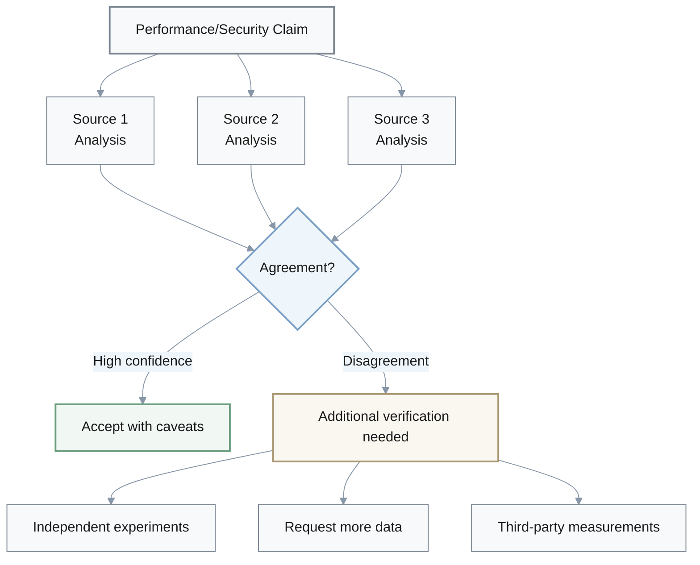

**Example Variance Points**:
- **Solana resilience**: Some sources emphasize recovery improvements, others focus on recurring outages
- **Move security**: Claims range from "solves all safety issues" to "reduces certain vulnerability classes"
- **Sui/Aptos throughput**: Lab benchmarks vs. sustained mainnet performance vary significantly

**Critical Source Reading Strategy**:
1. ✅ Treat each source as **one perspective**, not ground truth
2. ✅ Note **confidence levels** and hedge language in reports
3. ✅ Identify **emphasis differences** (what each source prioritizes)
4. ✅ Flag **contradictions** for further investigation
5. ✅ Seek **independent measurements** on contentious topics
6. ✅ **Triangulate** across multiple sources before forming strong views

---

1. Q: Given everything you read about multi‑chain interoperability, cross‑chain MEV, and bridge risk, how has your perspective shifted on whether multi‑chain is a short‑term workaround or a long‑term structural feature of the ecosystem?
   A: **Strategist:** I'm leaning toward "structural feature" rather than "temporary mess."

   **Researcher:** What's your updated stance in concrete terms?

   **Strategist:** Hmm... [pause] I expect heterogeneity to persist, with power concentrated in a few stacks but meaningful long‑tail chains.

   **Engineer:** How does that feed back into your own skill and tooling investments?

   **Strategist:** Therefore, I plan for cross‑chain observability, MEV‑aware design, and bridge‑savvy security reviews as baseline skills, not niche specializations.
   
   **Researcher:** That's a multi-chain-first mindset.
   
   **Strategist:** Exactly. Build for the reality, not the ideal.

---

### Multi-Chain Future: Structural Reality

**Multi-Chain Adoption Strategy**:

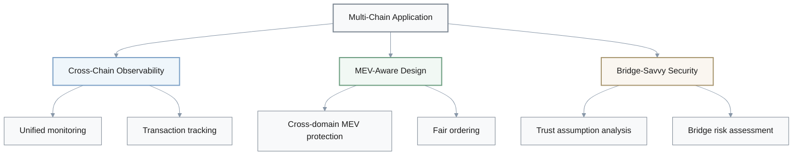

**Long-Term Multi-Chain Baseline Skills**:
- **Cross-chain observability**: Unified monitoring and transaction tracking across chains
- **MEV-aware design**: Understanding cross-domain MEV extraction and protection
- **Bridge-savvy security**: Trust assumption analysis and risk assessment for bridges
- **Multi-chain deployment**: Managing smart contracts across heterogeneous chains
- **Interoperability patterns**: IBC, XCMP, light clients, ZK bridges

**Ecosystem Structure Prediction**:
- **Power concentration**: Likely centered on 3–5 dominant stacks (Bitcoin, Ethereum, 2–3 high-performance chains)
- **Long tail**: Likely to include meaningful specialized chains (privacy, compliance, domain-specific)
- **Persistent heterogeneity**: A single chain converging everything seems unlikely
- **Structural challenges**: Coordination overhead, MEV, and bridge risk look like long-lived structural features

**Design Principle**: **Multi-chain-first mindset** — build for reality, not ideal consolidation.

---

1. Q: The future‑looking sections—ZK‑native chains, post‑quantum readiness, AI‑augmented tooling, modular DA layers—sketch possible 3–5 year trajectories. How do these possibilities influence how you think about future‑proofing architectural decisions now?
   A: **Architect:** They push me to value upgrade paths, client diversity, formal governance, and active research communities as hedges against uncertainty.

   **Risk Lead:** How does that translate into concrete decisions?

   **Architect:** Specifically, I'd stage large commitments—capital, integrations—over time, and build explicit exit ramps or migration options into any serious bet on a specific chain.

   **Strategist:** In other words, we design for graceful pivots rather than betting on a single frozen snapshot of today's ecosystem.
   
   **Risk Lead:** That's a prudent long-term view.
   
   **Architect:** Right. Optionality over lock-in.

---

### Future-Proofing: Building for Uncertainty

**3-5 Year Emerging Technologies**:

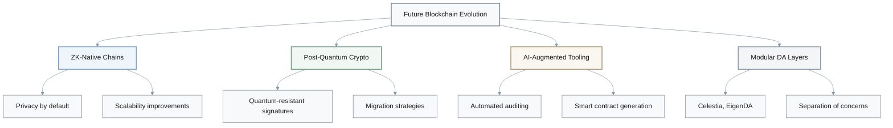

**Future-Proofing Strategy**:

| **Principle** | **Implementation** | **Goal** |
|--------------|-------------------|----------|
| **Upgrade paths** | Support for protocol evolution without hard forks | Adaptability to new tech |
| **Client diversity** | Multiple independent implementations | Resilience against bugs |
| **Formal governance** | Clear decision-making processes | Predictable evolution |
| **Active research** | Engaged academic and dev community | Innovation pipeline |
| **Exit ramps** | Migration options to other chains | Reduce lock-in risk |

**Staged Commitment Approach**:

```
Year 1-2: Proof of Concept
    ├─ Small capital allocation
    ├─ Limited integration depth
    └─ Evaluate real-world performance

Year 3-4: Production Deployment
    ├─ Increased capital (if successful)
    ├─ Deeper integrations
    └─ Build redundancy and exit options

Year 5+: Strategic Position
    ├─ Major commitment (if validated)
    ├─ But maintain migration optionality
    └─ Continuous monitoring of alternatives
```

**Hedging Against Uncertainty**:
- ✅ **Do not bet on a frozen snapshot**: Ecosystem evolves rapidly
- ✅ **Value optionality**: Ability to pivot > short-term optimization
- ✅ **Stage commitments**: Increase exposure over time as validation occurs
- ✅ **Build exit ramps**: Explicit migration paths in architecture
- ✅ **Monitor alternatives**: Continuous evaluation of competitive landscape

**Core Mindset**: **Graceful pivots** over **irreversible bets**

---

## Summary: Key Mental Model Shifts

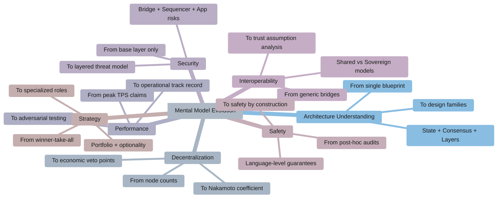

### Before → After Transformations

| **Topic** | **Old Mental Model** | **New Mental Model** |
|-----------|---------------------|---------------------|
| **Architecture** | "All chains basically work like Bitcoin/Ethereum" | Design families with different state, consensus, and layering trade-offs |
| **Trilemma** | "Chain X solved the trilemma" | Continuous trade-off surfaces, no magic solutions |
| **Decentralization** | "More validators = safer" | Nakamoto coefficient + hardware accessibility + stake concentration |
| **Performance** | Trust headline TPS numbers | Demand hardware specs, adversarial tests, outage history |
| **Security** | Base layer security → safe | Layered defense: L0/L1/Bridge/L2/L3 each have distinct risks |
| **Governance** | "Ethereum can add X later" | Path dependence: governance constraints are first-order technical limits |
| **Smart Contracts** | Bugs are developer carelessness | Vulnerability classes are partly language-driven |
| **Bridges** | Generic "cross-chain connections" | Trust assumptions: light clients vs multisig vs ZK |
| **Economics** | "More staking = safer" | Concentration, rehypothecation, and governance capture |
| **Multi-chain** | Temporary fragmentation | Structural feature: specialized roles, portfolio thinking |
| **Enterprise Fit** | TPS and fees dominate | Governance, reliability, compliance, tooling dominate |
| **Future-proofing** | Bet on one frozen snapshot | Value upgrade paths, client diversity, exit ramps |

**Core Principle**: **Explicit trade-offs with eyes open** > wishful thinking about "perfect" solutions.
