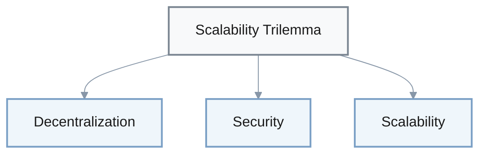
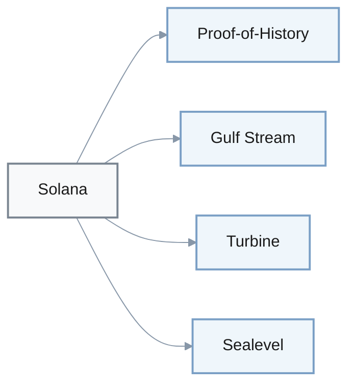
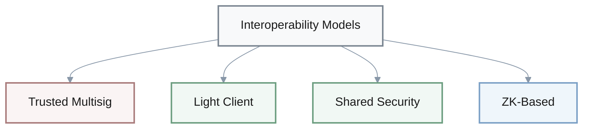

## Layer 1 Performance Comparison

| Blockchain | TPS | Architecture | Era |
|------------|-----|--------------|-----|
| Bitcoin | 3–7 | Monolithic UTXO | Original |
| Ethereum | 15–30 | Monolithic Account | Early |
| Solana | ~65,000 | High-throughput PoH | Modern |
| Aptos/Sui | 100,000+ | Move-based Parallel | Modern |

1. Q: Bitcoin's original Layer 1 architecture combined consensus, execution, and data availability in a single monolithic design, achieving roughly ___–___ transactions per second (TPS) on-chain.
   A: 3–7 TPS

1. Q: Ethereum's early monolithic smart contract design typically achieved about ___–___ TPS on the base layer, exposing scalability limits during high-demand periods.
   A: 15–30 TPS

---

## The Scalability Trilemma

1. Q: The blockchain "scalability trilemma" describes the need to trade off among three core properties: ___, ___, and ___.
   A: decentralization, security, scalability

---

## State Models

| Blockchain | State Model | Characteristics |
|------------|-------------|-----------------|
| Bitcoin | UTXO | Transaction outputs |
| Ethereum | Account | Global state |
| Sui/Aptos | Object/Resource | Move-based resources |

1. Q: In the state-model evolution described in the investigations, Bitcoin uses a ___ model, Ethereum uses an ___ model, and Sui/Aptos use an object‑ or resource‑oriented model.
   A: UTXO; account

---

## Ethereum Evolution

### The Merge (September 15, 2022)

**Impact**: 99.98% energy reduction  
**Transition**: Proof-of-Work → Proof-of-Stake

1. Q: Ethereum's transition from Proof‑of‑Work to Proof‑of‑Stake in an event called "The Merge" occurred on ___ ___, ___ and reduced energy consumption by roughly ___%.
   A: September 15, 2022; 99.98%

1. Q: After The Merge, Ethereum secures its consensus with ___ instead of Proof‑of‑Work mining.
   A: Proof‑of‑Stake

---

### Rollup-Centric Roadmap

**Cost Reduction**: 10–100× via Layer 2 rollups  
**EIP-4844 Impact**: ~95% reduction in rollup data costs

1. Q: In the rollup‑centric roadmap, Ethereum increasingly relies on Layer 2 rollups that can reduce transaction costs by roughly ___–___× while increasing effective throughput.
   A: 10–100×

1. Q: EIP‑4844 (proto‑danksharding) introduced blob data space that cut typical rollup data costs by about ___% or more, enabling sustainable low‑fee Layer 2 transactions.
   A: 95%

---

### Layered Architecture Framework

| Layer | Focus | Security | Examples |
|-------|-------|----------|----------|
| Layer 0 | Interoperability | Shared | Cosmos, Polkadot |
| Layer 1 | Consensus | Base | Bitcoin, Ethereum |
| Layer 2 | Execution | Rollups | Arbitrum, Optimism |
| Layer 3 | Applications | Custom | App-specific chains |

1. Q: In the layered architecture described in the investigations, Layer 0 focuses on ___ and shared security, Layer 1 on ___ and base security, Layer 2 on ___ scaling, and Layer 3 on application‑specific customization.
   A: interoperability; consensus; execution

---

## High-Performance Architectures

### Solana Architecture

**Components**:
- **Proof-of-History**: Cryptographic clock for event ordering
- **Gulf Stream**: Transaction forwarding
- **Turbine**: Block propagation
- **Sealevel**: Parallel execution engine

**Performance**: ~65,000 TPS (theoretical)  
**Reliability Concern**: Network outages (2021–2024) from spam/bugs

1. Q: Solana's high‑throughput Layer 1 design combines Proof‑of‑Stake with ___‑of‑___, a cryptographic clock used to order events before consensus.
   A: Proof; History

1. Q: Solana's architecture uses components such as Gulf Stream for transaction forwarding, Turbine for block propagation, and ___ for parallel program execution.
   A: Sealevel

1. Q: Marketing and technical materials cited in the investigations often quote Solana's theoretical throughput as up to approximately ___,___ TPS under ideal conditions.
   A: 65,000 TPS

1. Q: A major reliability concern highlighted for Solana between 2021–2024 was repeated network ___, often triggered by spam or software bugs.
   A: outages

---

## Interoperability Architectures

### Polkadot: Relay Chain Model

**Core**: Relay chain provides shared security for parachains  
**Economic Alignment**: DOT token lock-ups in slot auctions

1. Q: Polkadot's interoperability model centers on a ___ chain that provides shared security for connected ___, which are sovereign blockchains.
   A: relay; parachains

1. Q: Parachain slot auctions on Polkadot require projects to lock up significant amounts of ___ tokens, aligning economic incentives with network security.
   A: DOT

---

### Cosmos IBC Protocol

**Mechanism**: Light client verification of chain headers & Merkle proofs  
**Launch**: ~2021  
**Adoption (2024)**: ~120 chains, tens of millions of transfers annually

1. Q: Cosmos's Inter‑Blockchain Communication (IBC) protocol, launched around 2021, enables cross‑chain messaging by having each chain run a ___ ___ that verifies the other chain's headers and Merkle proofs.
   A: light client

---

### Bridge Security Risks

**Major Bridge Hacks**: Ronin, Wormhole, Poly Network  
**Total Losses**: >$2 billion

| Bridge Type | Trust Model | Key Vulnerability | Example |
|-------------|-------------|-------------------|---------|
| Trusted Multisig | Centralized validators | Compromised signers | 5-of-9 threshold |
| Light Client | Cryptographic verification | Implementation bugs | Cosmos IBC |
| Shared Security | Unified validator set | Systemic risk | Polkadot XCMP |
| ZK-Based | Validity proofs | High latency/cost | Emerging |

1. Q: Trusted multisig bridges such as early Ronin, Wormhole, and Poly Network operated by locking assets under m‑of‑n multisignatures; one cited weakness was the use of thresholds as low as ___‑of‑___.
   A: 5‑of‑9

1. Q: The investigations note that three large bridge hacks (Ronin, Wormhole, Poly Network) together caused losses exceeding ___ ___ in user funds.
   A: $2 billion

1. Q: Compared with trust‑minimized designs, early custodial bridges concentrated risk because the bridge validator set could be compromised even when the underlying ___ remained secure.
   A: blockchains

1. Q: Cosmos IBC adoption by 2024 reached on the order of ___ of chains and executed ___ of millions of cross‑chain transfers annually within that ecosystem.
   A: ~120; tens

1. Q: Polkadot's Cross‑Consensus Message Passing (XCMP) leverages the relay chain so that validators securing all parachains together can pass messages without each chain bootstrapping its own full ___ model.
   A: security

---

### Interoperability Models

1. Q: In the investigations, interoperability architectures are grouped into three main models: trusted ___ bridges, light‑client‑based protocols (like IBC), and shared‑___ frameworks (like Polkadot's XCMP), with emerging ___‑based bridges as a fourth category.
   A: multisig; security; ZK

1. Q: ZK‑based bridges use succinct validity proofs so that a destination chain can verify a source‑chain state transition without trusting intermediaries, at the cost of high proof generation ___.
   A: latency (or cost)

---

### Move-Based Platforms

**Platforms**: Aptos, Sui  
**Key Feature**: Resource-oriented programming (no implicit copy/destroy)  
**Performance**: 100,000+ TPS in benchmarks

| Feature | Description |
|---------|-------------|
| Programming Model | Resource-oriented |
| Execution Engine | Block-STM (Aptos) |
| Concurrency | Optimistic concurrency control |
| Security | Prevents common vulnerabilities |

1. Q: Move‑based platforms like Aptos and Sui use a resource‑oriented programming model where key assets are treated as ___ that cannot be implicitly copied or destroyed, reducing common smart contract vulnerabilities.
   A: resources

1. Q: Aptos's Block‑STM execution engine applies optimistic ___ control to run many transactions in parallel, rolling back those that conflict.
   A: concurrency

1. Q: Investigations report that Move‑based chains like Aptos and Sui have demonstrated benchmark throughput in the high five‑ to six‑figure TPS range (for example, around ___,___+ TPS in controlled tests).
   A: 100,000

---

### Architectural Trade-offs

> **Hardware Requirements**: High-throughput chains require powerful hardware and high-bandwidth networks, trading off decentralization for performance.

1. Q: A key architectural trade‑off emphasized in the reports is that many high‑throughput chains relax some decentralization or hardware assumptions, requiring validators to run more powerful ___ and higher‑bandwidth network links.
   A: hardware

---

### L1 Architecture Taxonomy (2025)

| Family | State Model | Contracts | Performance | Examples |
|--------|-------------|-----------|-------------|----------|
| Conservative | UTXO | Simple scripts | Low TPS | Bitcoin |
| General-purpose | Account | Smart contracts | Medium TPS | Ethereum |
| High-throughput | Object/Resource | Parallel execution | High TPS | Solana, Aptos, Sui |

1. Q: The investigations describe three broad L1 architecture families by 2025: conservative ___ + simple scripts (Bitcoin‑like), general‑purpose ___‑based smart contracts (Ethereum‑like), and aggressively ___ parallel or Move‑based designs (Solana/Sui/Aptos‑like).
   A: UTXO; account; concurrent

---

## Regulatory Frameworks

### EU MiCA Framework

**Classification**: Crypto-Asset Service Providers (CASPs)  
**Requirements**: Authorization, AML/KYC, local governance  
**Significant CASPs**: >15 million active EU users

| Regulation | Timeline | Scope |
|------------|----------|-------|
| Stablecoin Rules | Mid-2024 | Stablecoin issuers |
| CASP Licensing | 2025–2026 | Broader rollout |
| TFR Travel Rule | Dec 2024 | Crypto transfers |

1. Q: Under the EU's MiCA framework, many user‑facing crypto businesses are classified as ___‑Asset Service Providers (CASPs) and must obtain authorization, meet AML/KYC requirements, and maintain local governance.
   A: Crypto

1. Q: MiCA introduces a category of "significant CASPs" for providers with more than ___ million active EU users, subject to enhanced supervision.
   A: 15

1. Q: According to the investigations, MiCA's phased rollout brings stablecoin rules into effect from mid‑___, broader CASP licensing through ___–___, and the Transfer of Funds Regulation (TFR) "travel rule" for crypto transfers from December ___.
   A: 2024; 2025–2026; 2024

---

### Architecture Impact on Regulation

**Likely CASPs**:
- Staking pools
- Custodial wallets
- Centralized bridges
- Sequencer operators

**Possibly Exempt**: Base-layer validators (self-custody)

1. Q: In the MiCA analysis, architecture matters because it determines who is clearly a CASP: staking pools, custodial wallets, centralized bridges, and some sequencer operators are obvious CASP candidates, while base‑layer ___ that validate on their own account may fall outside many interpretations.
   A: validators

---

### U.S. Regulatory Approach

| Agency | Focus | Target Services |
|--------|-------|-----------------|
| SEC | Securities | Centralized staking |
| CFTC | Commodities | Derivatives, spot markets |

1. Q: In the U.S. perspective summarized by the investigations, recent SEC cases primarily target centralized ___ programs as potential securities offerings, while the CFTC focuses more on ___ and some spot markets.
   A: staking; derivatives

---

### Modular vs. Monolithic Regulatory Exposure

**Modular (Ethereum-style)**:
- Exposure: Sequencers, bridges, staking businesses

**Monolithic**:
- Exposure: Large validator operators, infrastructure providers

1. Q: The investigations repeatedly emphasize that modular Ethereum‑style stacks tend to push regulatory exposure toward sequencers, bridges, and staking businesses, whereas monolithic chains concentrate more exposure on large ___ operators and infra providers.
   A: validator

---

## Decentralization Metrics

### Nakamoto Coefficient

**Definition**: Minimum entities whose collusion corrupts the network

$$
\text{Nakamoto Coefficient} = \min(\text{entities to control network})
$$

1. Q: The Nakamoto Coefficient, referenced in the reports, measures the minimum number of independent entities (for example, validators or mining pools) whose collusion could ___ a blockchain network.
   A: corrupt (or control)

---

## Additional Architecture Details

### Bitcoin's Design Priorities

**Focus**: Security & censorship resistance over throughput  
**Consensus**: Proof-of-Work (computational puzzles)

1. Q: Bitcoin's original design prioritized security and censorship resistance over throughput and energy efficiency by using a ___‑of‑___ consensus mechanism requiring miners to solve computational puzzles.
   A: Proof; Work

---

### Ethereum State Growth

**Challenge**: Rapid state growth from account-based model  
**Size**: Tens to low hundreds of GB (early 2020s)

1. Q: One outcome of Ethereum's account‑based design and rich smart‑contract ecosystem has been rapid state growth, with typical full‑node state sizes reaching on the order of ___ to low ___ of gigabytes by the early 2020s.
   A: tens; hundreds

---

### Danksharding Vision

**Target**: 64 data shards + 100k+ TPS ecosystem-wide with L2s

1. Q: In the rollup‑centric danksharding roadmap, Ethereum plans up to ___ data shards providing cheap data space for rollups, targeting ecosystem‑wide throughput of roughly ___k+ TPS together with Layer 2s.
   A: 64; 100

---

## Key Insights

### Architectural Evolution Drivers

> Each generation addresses predecessor limitations: scalability, security, or interoperability—not purely theoretical improvements.

1. Q: A central qualitative lesson from the investigations is that each new blockchain architecture generation emerges primarily to address specific predecessor limitations—such as scalability, security, or ___—rather than to provide purely theoretical improvements.
   A: interoperability

---

### Systemic Interoperability Risk

> **Bridge failures** can lead to multi-hundred-million-dollar losses even when base chains remain secure.

1. Q: The reports highlight that interoperability remains a systemic risk: even when base chains are secure, failures in ___ design and implementation can still lead to multi‑hundred‑million‑dollar losses.
   A: bridge

---

### Market Growth Projection

**Interoperability Market Growth** (2025-2035):

$$
\text{Growth} = \frac{\$1.83 \text{ billion (2035)}}{\$332.8 \text{ million (2025)}} \approx 5.5\times
$$

1. Q: Market projections cited in the investigations estimate that the blockchain interoperability market could grow from about $___.__ million in 2025 to roughly $___.__ billion by 2035.
   A: 332.8; 1.83
