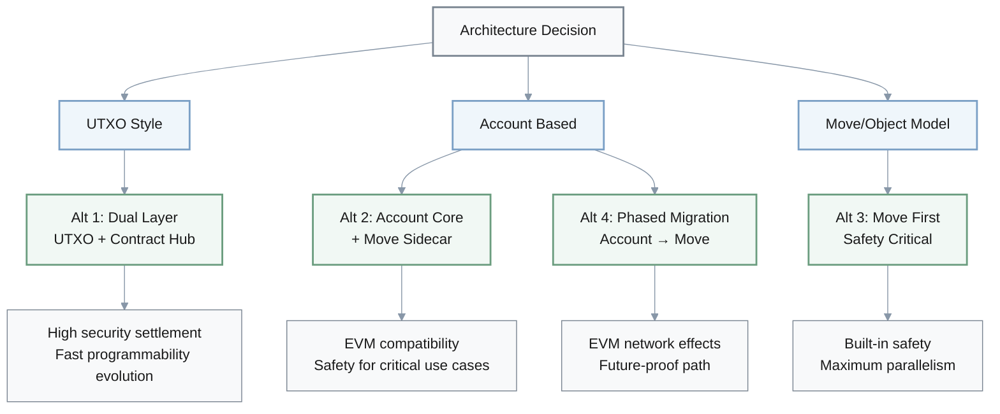
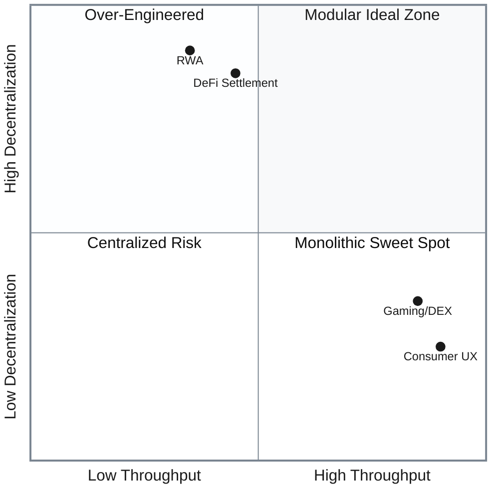
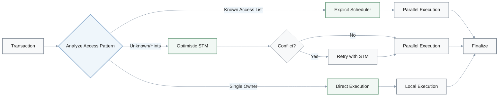
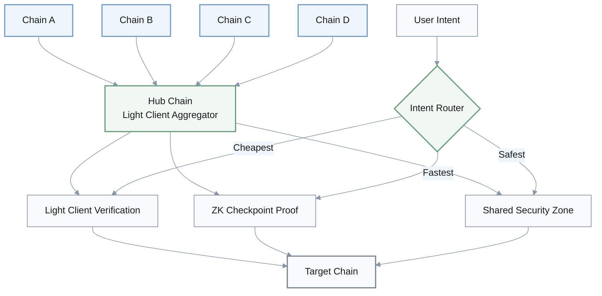
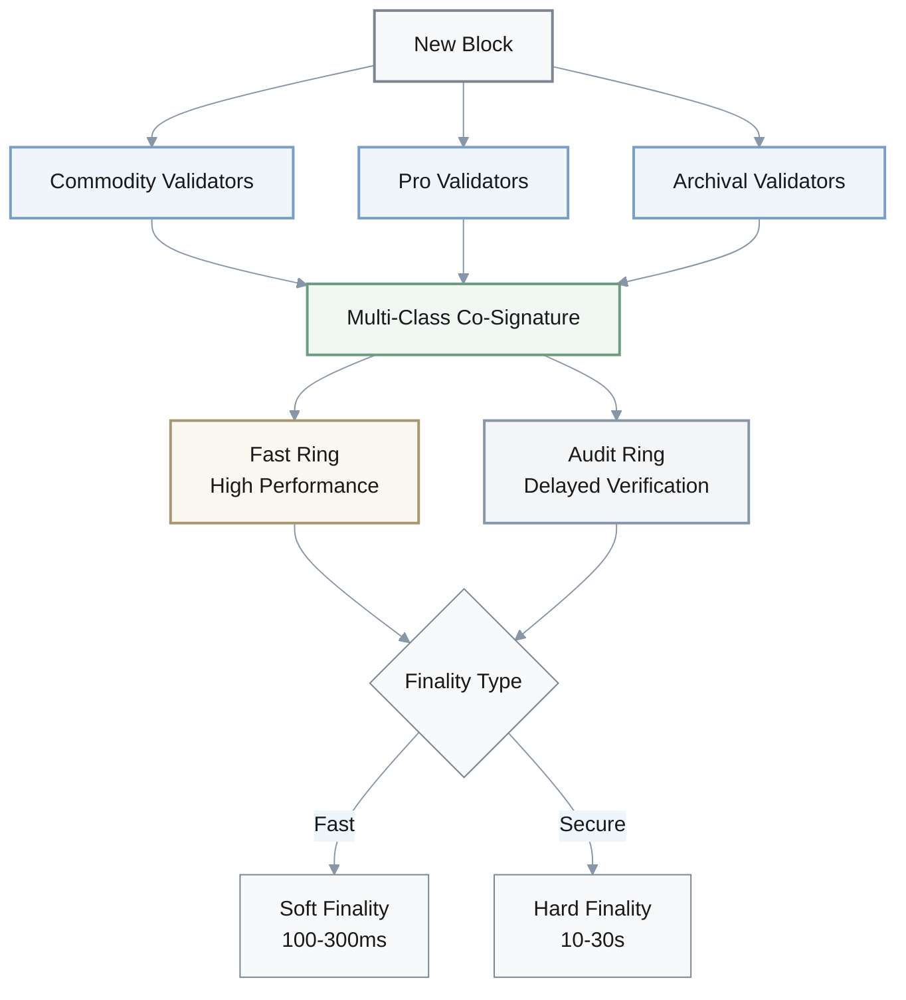
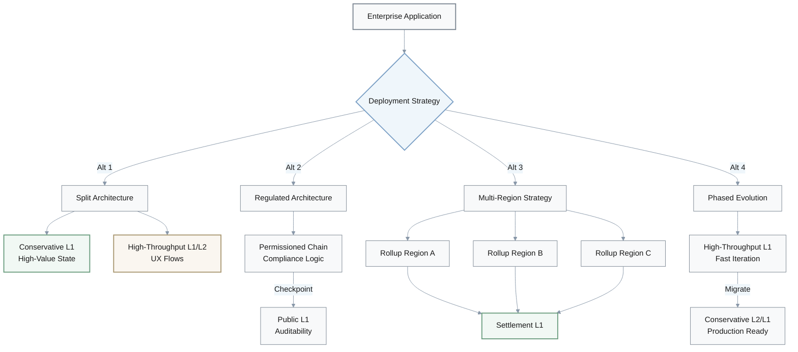
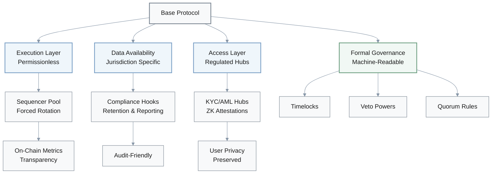
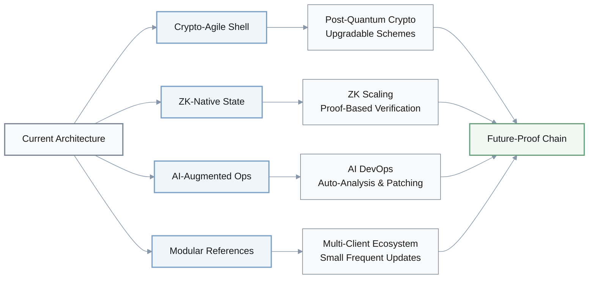
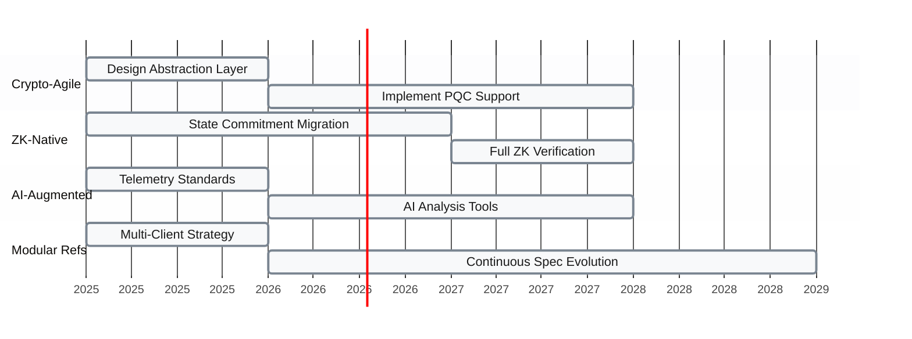

## 1. Base Architecture Selection Strategy

**Q**: You are selecting a base architecture family for a new blockchain platform—UTXO-style settlement, account-based smart contracts, or Move-style object/resource models. Generate 4 alternative selection strategies that balance security, programmability, and parallel scalability.

**A**: Four strategic approaches to architecture selection:

| Alternative | Approach | Security Strategy | Programmability | Trade-offs |
|-------------|----------|-------------------|-----------------|------------|
| **Dual-Layer UTXO + Contract Hub** | Conservative UTXO base + Account-based hub | UTXO settlement security | Full contract hub flexibility | Dual complexity, bridge risk |
| **Account-Based Core with Move Sidecar** | EVM core + Move sidechain | Risk-segmented execution | EVM compatibility + Move safety | Multi-paradigm overhead |
| **Move-First for Safety-Critical** | Move primary, legacy bridging | Built-in safety invariants | Resource-oriented model | High retraining cost |
| **Phased Migration Path** | Account start → Move migration | Gradual safety enhancement | EVM tooling initially | Multi-year transition risk |

### Strategy Details

- **Alternative 1 – Dual-Layer UTXO + Contract Hub**: Use a conservative UTXO base layer for final settlement and a separate account-based contract hub (or rollup) for programmability. This keeps the security and simplicity of UTXO for high‑value transfers while offloading complex logic to an execution layer that can evolve faster.

- **Alternative 2 – Account-Based Core with Move Sidecar**: Standardize on an account-based core (EVM‑like) but add a Move‑style sidechain or app‑specific shard for safety‑critical contracts. This preserves ecosystem compatibility while giving high‑risk verticals (RWA, custody) a resource‑oriented option that prevents common bugs.

- **Alternative 3 – Move-First for Safety-Critical Use Cases**: Adopt Move/object models as the primary programming paradigm from day one and restrict UTXO/account usage to bridging and compatibility layers. This front‑loads developer retraining cost but bakes in strong invariants for asset safety and parallelism.

- **Alternative 4 – Phased Migration Path**: Launch with an account-based model to tap the existing tooling, but design storage and governance so that core contracts can be migrated to Move/object modules over 3–5 years. This acknowledges EVM's network effects while explicitly planning for a safer, more parallel execution model later.

---

## 2. Monolithic vs. Modular Architecture Decision Framework

**Q**: You must choose between a monolithic high-throughput L1 (single global state, Solana‑style) and a modular architecture (rollups + shared security, Polkadot/Ethereum‑style). Generate 4 alternative decision frameworks for choosing and combining these approaches.

**A**: Four decision frameworks for architecture selection:

| Alternative | Decision Criteria | Architecture Choice | Use Case Fit |
|-------------|-------------------|---------------------|--------------|
| **Workload Segmentation** | Latency vs. Settlement priority | Split by workload type | Gaming/DEX → Monolithic, DeFi/RWA → Modular |
| **Monolith at Edge, Modular at Core** | Safety vs. UX trade-off | Hybrid topology | Core settlement modular, UX edge monolithic |
| **Performance Envelope SLOs** | Quantitative SLO scoring | Data-driven selection | p95 latency, outage tolerance metrics |
| **Regulatory and Infra Lens** | Compliance requirements | Audit-friendly architecture | Data residency, client diversity needs |

### Framework Details

- **Alternative 1 – Workload Segmentation**: Classify workloads into latency‑sensitive (order‑book DEXs, gaming) versus settlement‑critical (DeFi, RWA) and deliberately place them on different architectures. This accepts that no single chain is optimal and uses monolithic L1s for UX while modular stacks own high‑value settlement.

- **Alternative 2 – "Monolith at the Edge, Modular at the Core"**: Use a modular hub (rollup‑centric or parachain relay) as the canonical state root, but attach one or more monolithic "edge" L1s for traffic bursts and consumer UX. This favors safety at the core while still exploiting high‑throughput execution where outages are tolerable.

- **Alternative 3 – Performance Envelope SLOs**: Define explicit SLOs (p95 latency, outage tolerance, decentralization floor) and score both options against them instead of debating qualitatively. This turns the decision into an SLO optimization problem where monolithic vs modular is an output, not a starting bias.

- **Alternative 4 – Regulatory and Infra Lens First**: Start from regulator and infra‑provider constraints (data residency, uptime, client diversity) and back‑solve which architecture can realistically pass audits in 3–5 years. This surfaces that some geographies may require modular architectures with clearer isolation and upgrade paths.

---

## 3. Parallel Execution Engine Design

**Q**: You are designing a parallel execution engine and must choose between explicit access lists (Solana‑style), optimistic STM with conflict retries (Aptos‑style), and object‑centric ownership (Sui‑style). Generate 4 creative hybrid designs or variations that could improve developer experience and real-world throughput.

**A**: Four hybrid execution engine designs:

| Alternative | Access Detection | Conflict Resolution | Developer Burden | Throughput Profile |
|-------------|------------------|---------------------|------------------|-------------------|
| **Best-Effort Access Hints** | Optional declarations | STM fallback | Low - hints optional | High when hints accurate |
| **Object Buckets + STM** | Coarse-grained buckets | Intra-bucket STM, cross-bucket serial | Medium - bucket design | Reduced STM overhead |
| **Compiler-Inferred Access Sets** | Static analysis/bytecode | Explicit scheduling | Low - automated | High - minimal contention |
| **Tiered Fast Paths** | Runtime classification | Multi-tier execution | Low - automatic routing | Optimal per workload type |

### Design Details

- **Alternative 1 – "Best‑Effort Access Hints"**: Let developers optionally declare per‑tx access lists; the runtime treats them as hints, falling back to optimistic STM when declarations are absent or wrong. This preserves maximum parallelism where possible while avoiding hard failures when developers omit metadata.

- **Alternative 2 – Object Buckets + STM**: Group state into coarse‑grained "buckets" (per‑market, per‑pool) and run STM only within each bucket while treating cross‑bucket ops as serial. This reduces STM overhead and contention hot spots without forcing developers to understand full conflict graphs.

- **Alternative 3 – Compiler‑Inferred Access Sets**: Use static analysis or bytecode instrumentation to infer read/write sets automatically, then feed them into a Solana‑like scheduler. This shifts complexity from application authors to tooling and can significantly reduce accidental state contention.

- **Alternative 4 – Tiered Fast Paths**: Define three execution tiers: (a) single‑owner objects that bypass consensus and execute locally, (b) low‑contention parallel STM, and (c) high‑contention serial fallback. This gives simple payments/game moves near‑instant finality while safely handling pathological DeFi hot spots.

---

## 4. Cross-Chain Interoperability Architecture

**Q**: Cross-chain interoperability is required between multiple L1s and rollups, but classic multisig bridges are too risky. Generate 4 alternative cross-chain architecture patterns that creatively mix light clients, shared security, and zero‑knowledge proofs.

**A**: Four trust-minimized cross-chain patterns:

| Alternative | Trust Model | Verification Method | Scalability | Best For |
|-------------|-------------|---------------------|-------------|----------|
| **Hub-and-Spoke Light-Client** | Trust-minimized | Light client on hubs | $O(N)$ connections | General messaging |
| **ZK-Verified Checkpoints** | Cryptographic proof | Succinct ZK proofs | Low verification cost | High-value transfers |
| **Shared-Security Zones** | Zone-based trust | Intra-zone minimal, inter-zone heavy | Hierarchical scaling | Ecosystem clusters |
| **Intent-Centric Bridge** | Multi-path routing | Route optimization | Best available path | User flexibility |

### Pattern Details

- **Alternative 1 – Hub-and-Spoke Light-Client Mesh**: Designate a small number of "hub" chains that run light clients for all others, then route most messages through hubs rather than N×M direct links. This reduces the total number of verified connections while still avoiding trusted multisigs.

- **Alternative 2 – ZK-Verified Checkpoints**: Periodically post succinct ZK‑verified checkpoints of each chain onto a neutral "proof chain," and have all bridges verify against these checkpoints instead of raw headers. This centralizes proving cost while keeping verification cheap and composable.

- **Alternative 3 – Shared-Security Zones**: Group chains into "security zones" (for example, all chains under one relay or DA layer) and treat intra‑zone messages as trust‑minimized, reserving heavy ZK or economic guarantees only for inter‑zone hops. This matches security overhead to economic value.

- **Alternative 4 – Intent-Centric Bridge Design**: Represent cross‑chain actions as user "intents" that can be satisfied on any of several routes (IBC‑style, ZK bridge, shared‑security path). A routing layer picks the cheapest safe route per intent, turning bridging into a programmable optimization problem rather than a fixed pipe.

---

## 5. Validator Topology and Decentralization Strategy

**Q**: You need to define a decentralization and performance strategy for validators across Bitcoin-like, Ethereum‑like, and high‑throughput BFT chains. Generate 4 alternative validator topology designs that creatively trade off hardware requirements, geographic spread, and failure modes.

**A**: Four validator topology patterns:

| Alternative | Validator Diversity | Hardware Requirements | Geographic Distribution | Finality Model |
|-------------|---------------------|----------------------|-------------------------|----------------|
| **Heterogeneous Validator Classes** | 3 classes with distinct roles | Tiered by class | Mixed across classes | Multi-class co-signing |
| **Rotating Performance Rings** | Fast ring + audit ring | High-end for fast ring | Rotational diversity | Two-stage validation |
| **Geo-Aware Committees** | Protocol-enforced diversity | Varies by region | Minimum regions enforced | Geographic quorum |
| **Dual-Track Finality** | Small BFT + large BFT | Tiered by track | Based on track choice | Soft vs. hard finality |

### Topology Details

- **Alternative 1 – Heterogeneous Validator Classes**: Define three classes of validators (commodity, pro, archival) with distinct roles and rewards, and require each block to be co‑signed across classes. This allows pro validators to run heavy workloads while commodity nodes still enforce censorship resistance.

- **Alternative 2 – Rotating "Performance Rings"**: Form a rotating subset of high‑end validators that temporarily take on extra throughput duties (a "fast ring"), while a broader set continuously audits them with delayed verification. This narrows latency‑critical paths without permanently centralizing power.

- **Alternative 3 – Geo-Aware Committees**: Explicitly construct consensus committees that span minimum numbers of regions and providers, and enforce these constraints on leader selection. This makes geographic diversity a protocol‑level invariant instead of a vague ecosystem goal.

- **Alternative 4 – Dual-Track Finality**: Offer a fast, smaller BFT committee for soft finality (hundreds of ms) and a larger, slower committee for hard finality (tens of seconds). Applications choose which track to rely on, aligning security cost with use‑case value.

---

## 6. Enterprise Deployment Architecture Blueprint

**Q**: An enterprise must choose where to deploy a mission-critical application: conservative L1, high‑throughput L1, or modular L2 stack. Generate 4 alternative deployment blueprints that mix these architectures for different risk and performance profiles.

**A**: Four deployment strategies for enterprise applications:

| Alternative | Architecture Type | Risk Profile | Performance Profile | Best For |
|-------------|-------------------|--------------|---------------------|----------|
| **Slow Money, Fast UX Split** | Dual-layer hybrid | Low for assets, higher for UX | Balanced | Financial applications |
| **Regulated Core + Public Edge** | Permissioned + public | Compliance-first | Moderate | Regulated industries |
| **Multi-Region Rollup** | Distributed L2s | Regional isolation | Regional optimization | Global enterprises |
| **Phased Pilot-to-Production** | Evolutionary | Decreasing over time | High initially, then stable | Innovation-first orgs |

### Deployment Details

- **Alternative 1 – "Slow Money, Fast UX" Split**: Settle high‑value state (balances, legal ownership) on a conservative L1 while pushing UX‑heavy flows (orders, game moves) to a high‑throughput L1 or L2. This treats safety and responsiveness as separate design axes.

- **Alternative 2 – Regulated Core + Public Edge**: Run a permissioned or regulated chain (or rollup) for compliance‑intensive logic and periodically checkpoint to a public L1 for auditability. This gives regulators clear jurisdiction while still inheriting public‑chain security.

- **Alternative 3 – Multi-Region Rollup Strategy**: Deploy several rollups anchored to the same settlement L1, each tuned to regional latency and compliance needs. This captures rollup economics while limiting blast radius of sequencer or configuration failures.

- **Alternative 4 – Phased Pilot-to-Production Path**: Start pilots on a flexible high‑throughput L1 to iterate quickly, then progressively migrate the canonical state to a more conservative modular stack once requirements stabilize. This reduces early time‑to‑value while preserving a path to long‑term safety.

---

## 7. Regulatory Compliance Architecture Adaptations

**Q**: Regulatory pressure (e.g., MiCA, U.S. securities law) is increasing around validator concentration, sequencers, and bridges. Generate 4 alternative architecture adaptations that proactively reduce regulatory and systemic risk without abandoning public chains.

**A**: Four compliance-oriented architecture patterns:

| Alternative | Compliance Mechanism | Decentralization Impact | Privacy Level | Regulatory Benefit |
|-------------|---------------------|------------------------|---------------|-------------------|
| **Sequencer Diversity by Design** | Forced rotation, diversity metrics | Maintained | High | Addresses concentration risk |
| **Compliance-Ready Data Layers** | Jurisdiction-specific DA | Execution permissionless | Configurable | Audit-friendly separation |
| **Regulated Access Hubs** | KYC/AML at access points | Base layer neutral | ZK-preserved | Clear compliance boundary |
| **Formal Governance Disclosures** | Machine-readable specs | Transparent | N/A | Quantifiable governance risk |

### Adaptation Details

- **Alternative 1 – Sequencer Diversity by Design**: Architect L2s with forced sequencer rotation, minimum operator diversity, and transparent on‑chain metrics. This turns "single‑sequencer risk" into a tunable protocol parameter instead of an accident of implementation.

- **Alternative 2 – Compliance-Ready Data Layers**: Separate data availability and execution so that jurisdiction‑specific DA layers can enforce retention, privacy, and reporting rules, while execution stays permissionless. This makes it easier for CASPs to pass audits without forking the entire stack.

- **Alternative 3 – Regulated Access Hubs**: Concentrate KYC/AML and reporting obligations in regulated access hubs (exchanges, custodial bridges) while keeping base protocols neutral, but give hubs cryptographic hooks (view keys, ZK attestations) instead of raw surveillance access. This balances compliance with user privacy.

- **Alternative 4 – Formal Governance Disclosures**: Embed formal governance and upgrade processes directly into the protocol (timelocks, veto powers, quorum rules) and expose them via machine‑readable specs. This allows regulators and institutions to model governance risk quantitatively rather than treating it as a black box.

---

## 8. Future-Proof Architecture Evolution Roadmap

**Q**: Looking 3–5 years ahead, you want your architecture to be future-proof against ZK scaling, post‑quantum cryptography, and AI‑assisted devops. Generate 4 alternative roadmap patterns for evolving an existing chain toward this future without hard‑fork chaos every year.

**A**: Four evolution patterns for long-term architectural resilience:

| Alternative | Evolution Strategy | Target Technology | Upgrade Mechanism | Implementation Complexity |
|-------------|-------------------|-------------------|-------------------|--------------------------|
| **Crypto-Agile Shell** | Abstraction layer | PQC, new hash functions | Versioned schemes via governance | Medium - requires abstraction design |
| **ZK-Native State** | Gradual commitment shift | ZK scaling, light clients | Proof-based state verification | High - requires state redesign |
| **AI-Augmented Ops** | Integrated AI tooling | AI-assisted devops | Auto-analysis with human review | Medium - requires telemetry standards |
| **Modular References** | Multi-client approach | Client diversity | Small, frequent spec updates | Low - organizational challenge |

### Future-Proofing Timeline

### Roadmap Details

- **Alternative 1 – "Crypto-Agile Shell" Layer**: Introduce an abstraction layer where signature and hash schemes are versioned and upgradable via governance, so PQC and new hash functions can be swapped in behind stable APIs. This localizes cryptographic churn.

- **Alternative 2 – ZK-Native State Commitments**: Gradually shift from block‑oriented views to ZK‑verifiable state commitments (for example, succinct state roots plus proofs) so that light clients and bridges rely on proofs rather than full execution. This makes it easier to plug in new rollups and sidechains later.

- **Alternative 3 – AI-Augmented Node and Dev Tooling**: Treat AI as part of the architecture: design standard telemetry, traces, and formal specs so AI systems can auto‑analyze incidents, generate patches, and propose parameter changes under human review. This shortens reaction time to emerging risks.

- **Alternative 4 – Modular Reference Implementation Strategy**: Maintain multiple, well‑specified reference clients (Rust, Go, Move) that share a canonical spec and conformance tests, then evolve the spec in small, frequent steps instead of rare giant forks. This reduces upgrade risk and encourages independent implementations.

---

## Summary

This document presents **8 categories of blockchain architecture decision frameworks**, each with **4 alternative approaches**:

1. **Base Architecture Selection** - UTXO vs. Account vs. Move models
2. **Monolithic vs. Modular** - L1 throughput vs. rollup architectures  
3. **Parallel Execution** - Access lists vs. STM vs. object ownership
4. **Cross-Chain Interoperability** - Light clients vs. ZK proofs vs. shared security
5. **Validator Topology** - Hardware, geographic, and failure mode trade-offs
6. **Enterprise Deployment** - Conservative vs. high-throughput vs. modular deployment
7. **Regulatory Compliance** - Sequencer diversity, compliance layers, governance
8. **Future-Proofing** - ZK scaling, post-quantum crypto, AI-assisted operations

Each framework provides **concrete architectural patterns** with visualizations, comparison tables, and detailed trade-off analysis to guide strategic blockchain design decisions.
