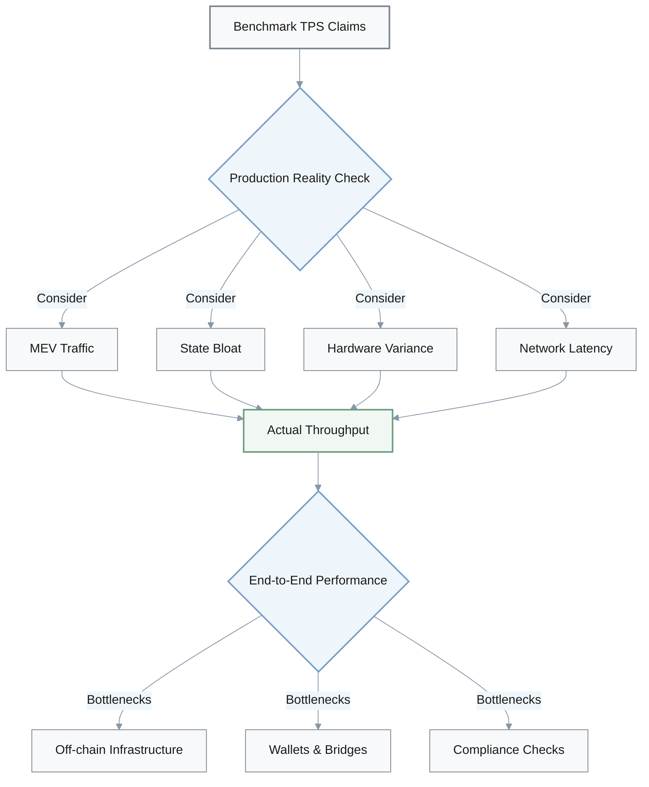
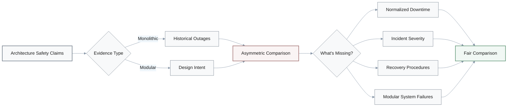
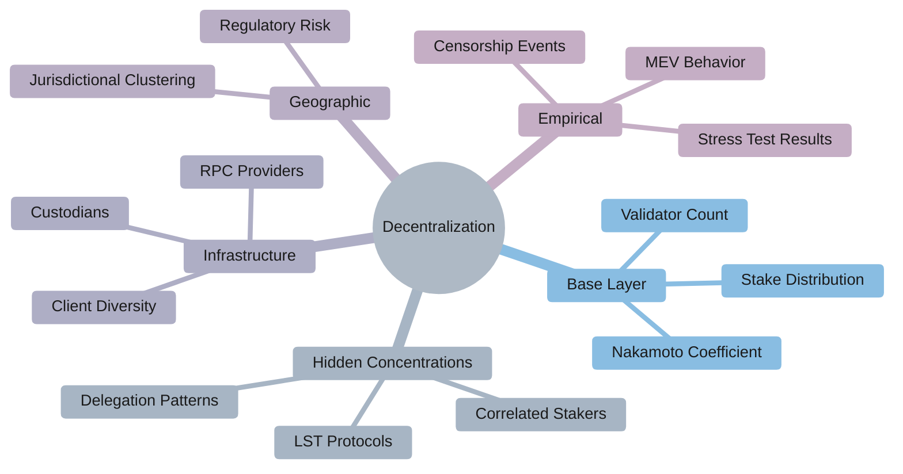
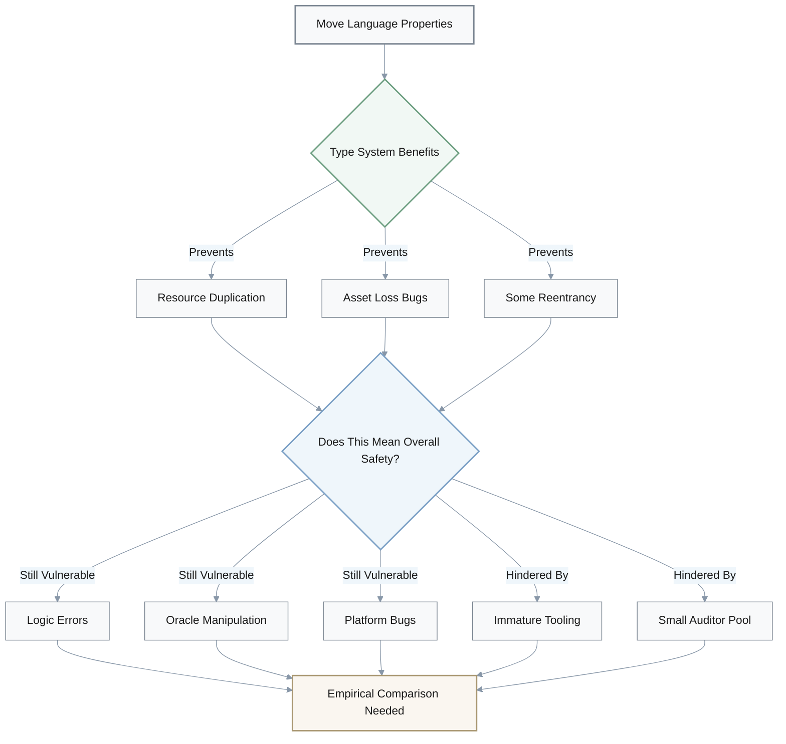
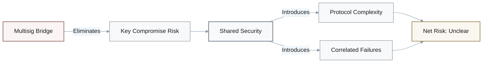
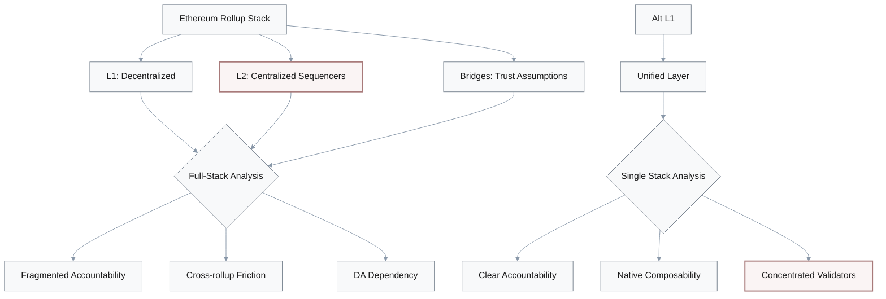
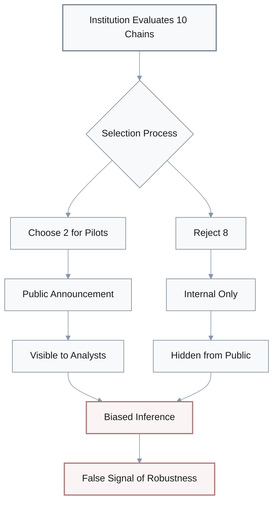
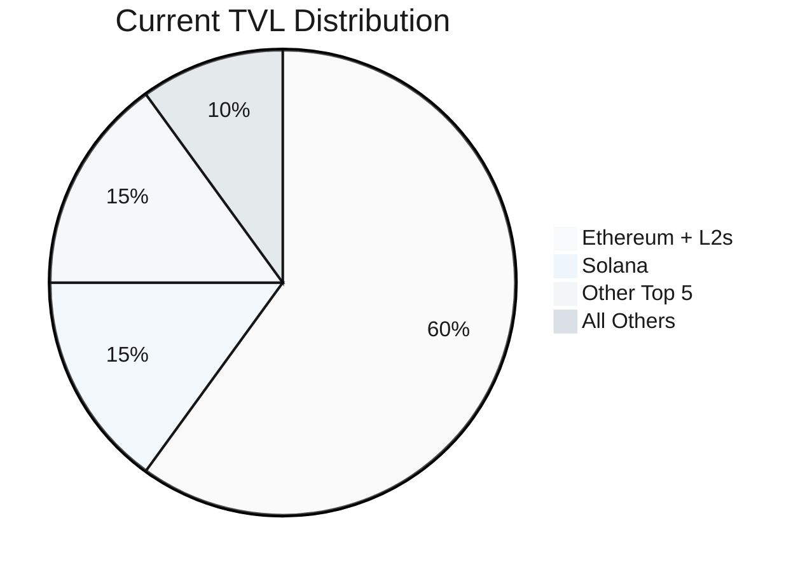
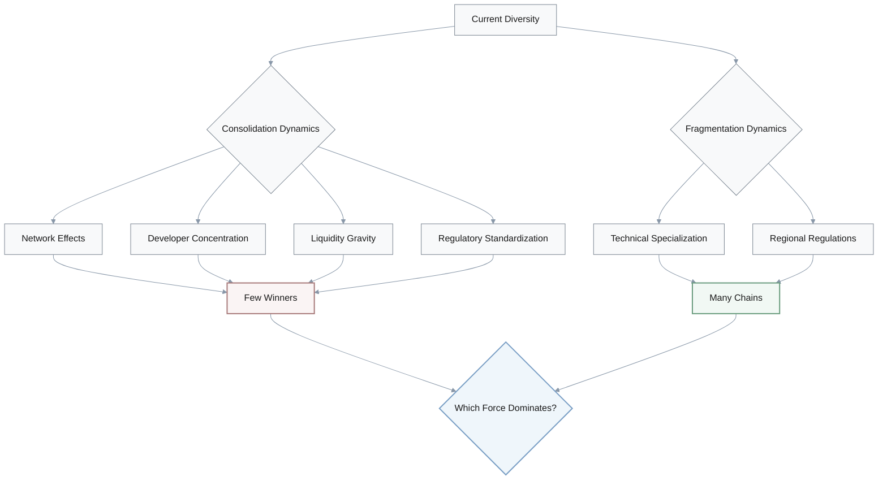

## 1. Benchmark TPS as Evidence for Commercial-Grade Suitability

**Q**: The investigations frequently present Solana, Aptos, and Sui's benchmark TPS numbers (e.g., 65,000–160,000 TPS) as evidence that they are better suited for "commercial-grade" or latency-sensitive workloads than Ethereum L1. How strong is the argument that benchmark throughput alone justifies preferring these chains for real-world applications?

**A**: The argument is **weak to moderate** due to several gaps:

### Critique Points

- **Idealized conditions**: Benchmarks are often run under idealized conditions; the argument underplays production constraints such as MEV traffic, state bloat, heterogeneous validator hardware, and network latency.
- **End-to-end system bottlenecks**: It implicitly assumes that end-to-end system performance is dominated by L1 TPS, ignoring other bottlenecks (off-chain infra, wallets, bridges, compliance checks) that may erase theoretical advantages.
- **Realized vs theoretical metrics**: The claim rarely quantifies realized mainnet TPS under load or outage frequency; a stronger argument would compare sustained throughput, latency, and downtime across chains.

### Validation Requirements

| Metric | Required Evidence |
|--------|------------------|
| **Sustained TPS** | Longitudinal mainnet data under real load |
| **Latency** | p95 latency across representative workloads |
| **Uptime** | Historical uptime and incident counts |
| **Outages** | Frequency and duration of service degradation |

---

## 2. Monolithic vs Modular Architecture Safety

**Q**: Several reports argue that monolithic, high-performance chains like Solana are "unsuitable for mission-critical finance" because historical outages reveal structural fragility, while modular Ethereum (L1 + rollups) or Polkadot offer safer architectures. Does this history of outages logically entail that monolithic designs are inherently unfit for high-value use cases?

**A**: The argument commits **hasty generalization** and **asymmetric comparison** fallacies:

### Critique Points

- **Overgeneralization from limited sample**: The reasoning may overgeneralize from a small sample of early incidents, assuming that architectural flaws cannot be mitigated by client diversity, congestion control, or governance/process improvements.
- **Modular architecture risks ignored**: It treats "modular" architectures as automatically safer, downplaying their own systemic risks (bridge failures, sequencer centralization, DA assumptions) that have caused multi-hundred-million-dollar losses.
- **Qualitative vs quantitative evidence**: Evidence cited is often qualitative (number of outages) without normalized comparisons (downtime hours per year vs incident severity vs recovery procedures) across chains.

### Risk-Adjusted Reliability Formula

A proper comparison requires:

$$
\text{Reliability Score} = \text{Uptime \%} \times (1 - \text{Blast Radius}) \times \text{Recovery Speed}
$$

### Comparative Analysis Framework

| Architecture | Strengths | Systemic Risks |
|--------------|-----------|----------------|
| **Monolithic** | Simple failure modes, single codebase | Congestion cascades, single point of failure |
| **Modular L1+L2** | Fault isolation, specialized layers | Bridge exploits, sequencer centralization, DA failures |
| **Multi-chain Hub** | Shared security, governance | Relay chain bugs, correlated validator failures |

---

## 3. Decentralization Metrics and Security Inference

**Q**: Multiple documents use the Nakamoto coefficient and validator count to claim that certain chains (e.g., Polkadot, some Cosmos zones) are "more decentralized and therefore more secure" than Ethereum, Solana, Aptos, or Sui. How robust is this inference from these metrics to real security and censorship-resistance properties?

**A**: The inference suffers from **reductionism** and **static analysis** weaknesses:

### Critique Points

- **Incomplete metrics**: It assumes the chosen decentralization metric captures all relevant power concentrations, but ignores stake delegation patterns, correlated staking providers, client diversity, and jurisdictional clustering.
- **Snapshot bias**: The argument often treats snapshots of coefficients as stable, without showing how they vary over time or under stress (e.g., during slashing events or regulatory shocks).
- **Cross-layer centralization ignored**: It rarely analyzes cross-layer centralization (custodians, LST protocols, major RPC/infra providers), which can dominate practical control even if base-layer validator sets look diverse.

### Comprehensive Decentralization Framework

| Layer | Metrics Needed | Why It Matters |
|-------|----------------|----------------|
| **Validator Set** | Nakamoto coefficient, total count | Base consensus power distribution |
| **Stake Delegation** | Delegation concentration, LST share | Real economic control vs nominal validators |
| **Client Software** | Client diversity index | Correlated failures from bugs |
| **Infrastructure** | RPC/API provider concentration | Practical access control |
| **Geographic/Legal** | Jurisdictional clustering | Regulatory capture risk |
| **Empirical Behavior** | Censorship incidents, MEV patterns | Actual vs theoretical resistance |

> **Critical Gap**: Single metrics like Nakamoto coefficient ignore multi-layer centralization vectors that dominate real-world control and censorship-resistance.

---

## 4. Move Language Safety Claims for Enterprise Deployments

**Q**: The investigations repeatedly suggest that Move-based platforms (Aptos, Sui) "materially reduce entire classes of smart contract vulnerabilities" and will therefore be safer for enterprise and RWA deployments than EVM chains. Does the presence of resource-oriented types and formal verification support such a strong safety conclusion today?

**A**: The argument exhibits **theory-practice gap** and **premature generalization**:

### Critique Points

- **Valid but limited theory**: The argument reasonably notes that linear resource types can eliminate specific bug classes (e.g., some reentrancy/asset duplication patterns), but it extrapolates from language properties to overall platform safety without long production histories.
- **New risk surfaces underplayed**: It underplays new risk surfaces: immature tooling, fewer auditors with Move expertise, and potential consensus/implementation bugs unrelated to the language layer.
- **Theoretical vs empirical evidence**: Evidence is mostly theoretical (language design papers, whitepapers) rather than empirical (incident rates per LOC, dollar losses vs EVM over time).

### Safety Analysis Framework

| Security Layer | Move Advantages | Remaining Risks |
|----------------|-----------------|-----------------|
| **Type System** | Linear resources prevent duplication/loss | Cannot prevent logic bugs, oracle issues |
| **Formal Verification** | Mathematical proof capabilities | Requires correct specifications, rare in practice |
| **Tooling Maturity** | Clean slate design | Immature IDE, debuggers, analyzers vs EVM |
| **Auditor Ecosystem** | Fewer language-specific pitfalls | Much smaller expert pool than Solidity |
| **Platform Bugs** | Modern language design | Consensus/VM bugs unrelated to contract language |

### Empirical Validation Needed

> **Stronger Evidence Needed**: Track exploit rates per LOC, dollar losses, and bug categories over multiple years comparing Move vs Solidity codebases of similar complexity.

---

## 5. Shared-Security Bridge Risk Elimination Claims

**Q**: Some reports argue that shared-security designs (Polkadot relay + parachains, Cosmos IBC with Tendermint light clients) "solve bridge risk" compared with ad-hoc multisig bridges that have been exploited for billions of dollars. Is it justified to treat these interoperability architectures as effectively eliminating systemic bridge risk?

**A**: The argument commits **false dichotomy** and conflates **trust model improvements** with **risk elimination**:

### Critique Points

- **Conflating improvement with elimination**: The reasoning sometimes conflates "stronger trust model than multisig" with "negligible risk," without analyzing new complexity (relay-chain bugs, light-client implementation flaws, governance capture) that can still compromise multiple chains at once.
- **Asymmetric comparison**: It often compares worst-case failures of early bridges (Ronin, Wormhole, Poly Network) with design intent of newer protocols, rather than with their actually deployed code and incident history.
- **Correlated failure modes**: The argument rarely models correlated failure modes: a consensus bug or governance exploit on the relay/hub chain can propagate to many parachains/zones simultaneously.

### Bridge Risk Trade-offs

| Bridge Type | Single Failure Risk | Blast Radius | Maturity |
|-------------|---------------------|--------------|----------|
| **Multisig** | M-of-N key compromise | Single bridge | High |
| **Light Client** | Consensus/implementation bug | All connected chains | Medium |
| **Relay Chain** | Hub consensus bug | All parachains | Medium |

**Evidence needed**: Formal threat models, third-party audits, empirical incident data, not just architectural diagrams.

---

## 6. Ethereum Rollup-Centric Roadmap as Superior Solution

**Q**: Ethereum's rollup-centric roadmap plus EIP-4844 is presented as "solving scalability while preserving decentralization," implying that modular Ethereum + rollups is strictly superior to launching new high-throughput L1s. How complete is this argument when assessing real trade-offs for builders and regulators?

**A**: The argument exhibits **asymmetric comparison** and **decentralization theater**:

### Critique Points

- **L2 centralization downplayed**: It downplays centralization and trust issues around rollup sequencers, provers, and upgrade keys, which can create chokepoints comparable to concentrated validator sets on alternative L1s.
- **DA sufficiency assumption**: It assumes that DA and L1 finality guarantees are always sufficient, but does not quantify how DA failures, client bugs, or reorgs would impact L2 solvency and user funds.
- **Asymmetric comparison**: It highlights L2 composability on Ethereum but ignores cross-rollup fragmentation, UX friction for bridging, and week-long fraud windows for optimistic rollups.

### Modular vs Monolithic Trade-offs

| Dimension | Ethereum L1+L2 | Alternative High-TPS L1 |
|-----------|----------------|------------------------|
| **Base Layer Decentralization** | High | Variable (often lower) |
| **Execution Layer Centralization** | Sequencer concentration | Validator concentration |
| **Accountability** | Fragmented (L1/L2/bridges) | Unified validator set |
| **Cross-domain Composability** | Fragmented | Native |
| **Finality** | 7-day fraud proof windows | Fast (seconds to minutes) |

**Key question**: Who is accountable in L2 failure scenarios—L1 developers, sequencer operators, or bridge providers?

---

## 7. Institutional Adoption as Proof of Robustness

**Q**: Multiple documents infer from institutional moves (Visa, PayPal, Franklin Templeton, Western Union using Solana or Sui; Sui ETNs and trusts) that these architectures have reached "institutional-grade" decentralization and security. Does selective institutional adoption logically prove that the underlying L1s are sufficiently robust for all high-value workloads?

**A**: The argument suffers from **survivorship bias** and **scope confusion**:

### Critique Points

- **Pilot vs endorsement**: The argument confuses revealed preference in narrow pilots or specific products with a global endorsement of the chain's entire risk profile; many deployments are carefully scoped and hedged.
- **Survivorship bias**: It ignores survivorship and selection bias: we mostly hear about successful pilots, not internal evaluations that rejected certain chains or limited them to non-systemic roles.
- **Hidden risk controls**: The analyses rarely disclose risk controls (position limits, insurance, off-chain safeguards) that institutions use to compensate for perceived protocol or ecosystem weaknesses.

### Institutional Deployment Reality

| What We See | What We Don't See |
|-------------|-------------------|
| Public announcements of pilots | Rejected proposals |
| Successful integrations | Position limits imposed |
| Partnership press releases | Insurance requirements |
| Technology adoption | Off-chain risk controls |

**Stronger evidence needed**: Risk disclosures, capital-at-risk thresholds, comparative due-diligence outcomes, blockchain-specific risk pricing.

---

## 8. Multi-Chain Equilibrium as Necessary Outcome

**Q**: Several reports frame ecosystem fragmentation into many specialized L1s (Bitcoin, Ethereum, Solana, Polkadot, Sui, Aptos, Cosmos) as a "necessary outcome" of the trilemma and governance path-dependence, suggesting that no single architecture can dominate. How strong is this conclusion that the long-term equilibrium must be multi-chain rather than heavily consolidated?

**A**: The argument exhibits **static analysis** and underestimates **consolidation forces**:

### Critique Points

- **Network effects underestimated**: It underestimates network effects and standardization pressures: EVM dominance, tooling re-use, and liquidity gravity could drive consolidation even if multiple architectures are technically viable.
- **Current state ≠ steady state**: The argument treats current diversity (2020–2025) as predictive of steady state, without modeling consolidation dynamics (M&A, ecosystem failures, regulatory bans, or de facto standards).
- **Ignoring economic concentration**: It rarely engages with economic evidence: developer counts, TVL share, and infra investment are already skewed toward a few architectures, which may foreshadow further concentration.

### Fragmentation vs Consolidation Forces

| Forces Favoring Multi-Chain | Forces Favoring Consolidation |
|------------------------------|-------------------------------|
| Technical trilemma trade-offs | Network effects (developers, users) |
| Governance path-dependence | Tooling standardization (EVM) |
| Regulatory fragmentation | Liquidity concentration |
| Specialization needs | Infrastructure economies of scale |

### Market Concentration Evidence

**Missing analysis**: Explicit scenarios where interoperability, regulatory fragmentation, or specialization continually offset network-effect advantages—with data across multiple market cycles.
