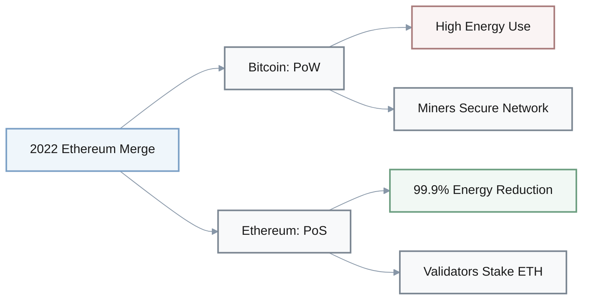
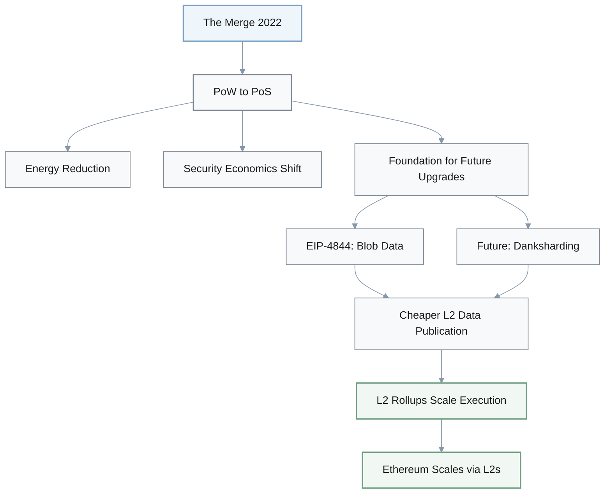
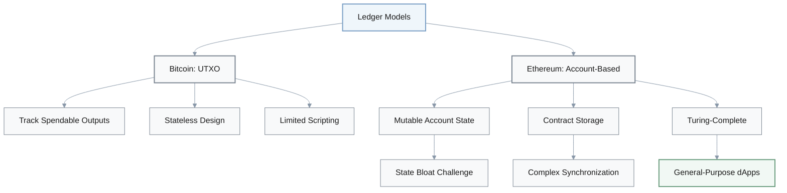
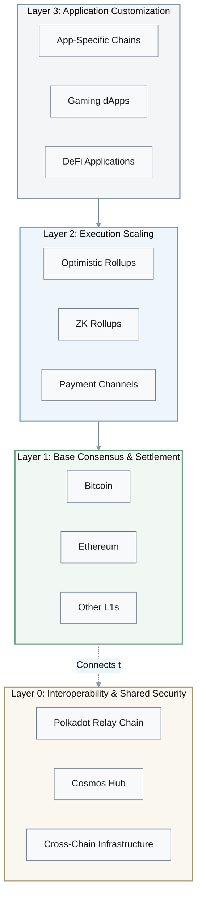
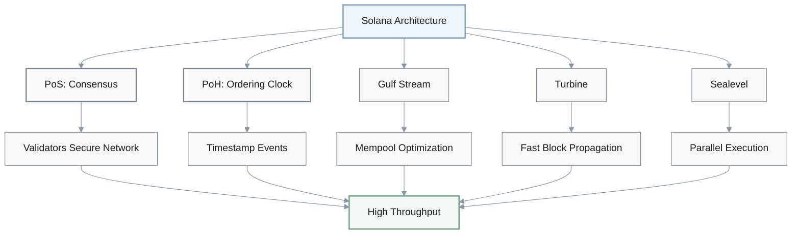
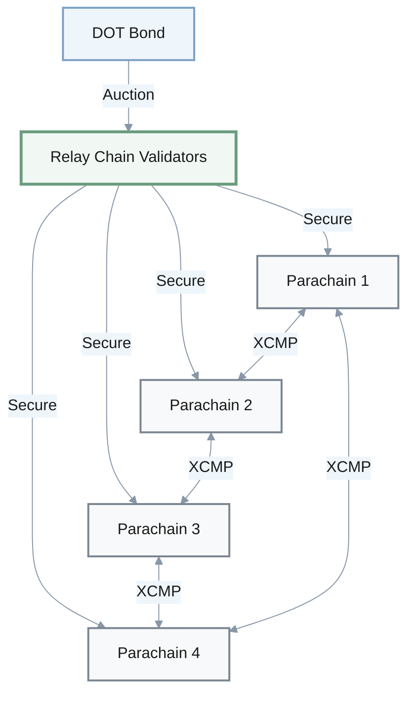
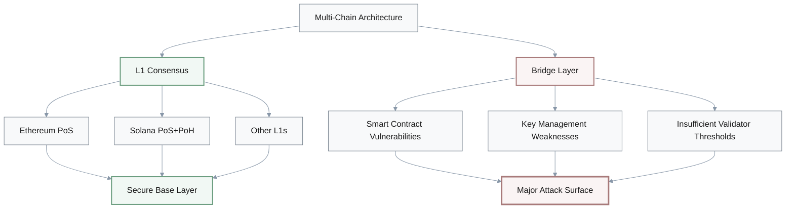

## 1. Ethereum and Bitcoin Consensus Models

**Q:** Ethereum and Bitcoin both still secure their mainnets with Proof-of-Work in 2024–2025, so architecture and energy analyses can safely treat them as having similar consensus and energy profiles. What is wrong and how to fix it?

**A:** The issue is that Ethereum no longer uses Proof-of-Work. After the 2022 Merge, Ethereum switched its mainnet to Proof-of-Stake with validators staking ETH, while Bitcoin remains on PoW. Treating them as having the same consensus design and energy profile erases the Merge's impact on validator incentives, security assumptions, and environmental footprint. 

**Misconception vs. Reality:**

| Aspect | ❌ Misconception | ✅ Reality |
|--------|-----------------|-----------|
| **Bitcoin Consensus** | Proof-of-Work | Proof-of-Work ✓ |
| **Ethereum Consensus** | Proof-of-Work | Proof-of-Stake (since 2022) |
| **Energy Profile** | Similar high consumption | ~99.9% reduction for Ethereum |
| **Validator Model** | Miners on both | Bitcoin: miners; Ethereum: stakers |

**Correct Framing:**
- **Bitcoin**: Remains the canonical PoW settlement chain
- **Ethereum**: Now runs PoS with drastically reduced energy use
- **Key Differences**: Validator incentives, security assumptions, and environmental footprint are fundamentally different

---

## 2. The Merge and Ethereum Scaling

**Q:** The Merge directly scaled Ethereum's base layer from roughly 15–30 TPS to tens of thousands of TPS, effectively solving L1 scalability so that rollups and other Layer 2 solutions are now optional. What is wrong and how to fix it?

**A:** The mistake is attributing Ethereum's throughput scaling to the Merge itself. The investigation texts describe the Merge as primarily a consensus change (PoW → PoS) and an energy and security-economics shift, not a dramatic base-layer TPS increase. Ethereum's scaling roadmap is rollup-centric: execution load moves to Layer 2s, while upgrades like EIP-4844 and future data-sharding (danksharding) make it cheaper for rollups to publish data to L1.

**What The Merge Actually Did:**

| ❌ Misconception | ✅ Reality |
|-----------------|-----------|
| Scaled L1 to thousands of TPS | L1 TPS remains in same order of magnitude |
| Solved L1 scalability | Enabled future scalability infrastructure |
| Made L2s optional | L2 rollups remain central to scaling strategy |
| Direct throughput increase | Consensus mechanism change only |

**Ethereum's Rollup-Centric Scaling Roadmap:**

**Correct Description:**
- **The Merge**: Enabled PoS and future scalability work
- **L1 TPS**: Remains in same order of magnitude (~15-30 TPS)
- **Rollups**: Central (not optional) to Ethereum's long-term scaling strategy
- **Future Upgrades**: EIP-4844 and danksharding make L2 data publishing cheaper

---

## 3. Bitcoin UTXO vs Ethereum Account Model

**Q:** Bitcoin and Ethereum both use a UTXO-based ledger model; Ethereum simply adds smart-contract scripts on top of Bitcoin's basic structure, so from a state-management perspective they are architecturally similar. What is wrong and how to fix it?

**A:** This conflates two different state models. The materials repeatedly distinguish Bitcoin's UTXO model from Ethereum's account-based model. Bitcoin tracks spendable outputs, while Ethereum maintains mutable account state and contract storage. This shift to accounts is what enables general-purpose smart contracts and complex dApps but also introduces state bloat and more complex synchronization.

**Fundamental Architectural Divergence:**

| Aspect | Bitcoin (UTXO) | Ethereum (Account-Based) |
|--------|----------------|-------------------------|
| **State Model** | Unspent transaction outputs | Mutable account balances + storage |
| **Ownership** | Who can spend outputs | Account nonce, balance, code, storage |
| **Transaction Model** | Consume inputs → create outputs | Update account state |
| **Smart Contracts** | Limited script capabilities | Turing-complete contracts |
| **State Management** | Stateless (only track UTXOs) | Global state trie with history |
| **Implications** | Simpler, less state bloat | Enables complex dApps, higher complexity |

**Corrected Statement:**
- **Ethereum moved away from UTXO** to an account-based global state model
- **Not a superficial extension**: This is a core architectural divergence
- **Trade-offs**: Account model enables complex smart contracts but introduces state management challenges
- **Type system**: Ownership and resource constraints encoded differently

---

## 4. Multi-Layer Blockchain Ecosystem Architecture

**Q:** In today's multi-layer ecosystem, Layers 0, 1, 2, and 3 all mainly exist to host user-facing decentralized applications, while interoperability and security are solved entirely at Layer 1. What is wrong and how to fix it?

**A:** The error is collapsing distinct architectural roles into "app layers." The DeepSeek and Perplexity investigations describe a more specialized stack: Layer 0 (e.g., Polkadot, Cosmos) focuses on interoperability and shared security for multiple chains; Layer 1 provides base consensus and settlement; Layer 2 performs execution scaling (rollups, payment channels) while leveraging L1 security; and emerging Layer 3 offers application-specific customization. Saying that all layers are just for dApps hides why Layer 0 exists and how L2 inherits security from L1.

**Specialized Layer Functions:**

| Layer | Primary Function | Examples | Key Purpose |
|-------|------------------|----------|-------------|
| **Layer 0** | Interoperability & shared security | Polkadot, Cosmos | Connect multiple chains, provide shared validator sets |
| **Layer 1** | Base consensus & settlement | Bitcoin, Ethereum | Fundamental security and finality |
| **Layer 2** | Execution scaling | Rollups, Lightning | Scale throughput while inheriting L1 security |
| **Layer 3** | Application customization | App-specific chains | Specialized execution environments |

**Corrected Understanding:**
- **Layer 0**: Interoperability infrastructure, not just another app hosting layer
- **Layer 1**: Base security and settlement, not the sole security layer
- **Layer 2**: Inherits security from L1 (not independent)
- **Layer 3**: Application specialization, not general hosting
- **Security flows vertically**: L2 inherits from L1; L0 provides shared security horizontally
- **Each layer has distinct architectural purpose**, not "all host dApps"

---

## 5. Solana's Consensus Mechanism

**Q:** Solana abandons Proof-of-Stake in favor of Proof-of-History as its sole consensus mechanism, which is why it achieves much higher throughput than Ethereum. What is wrong and how to fix it?

**A:** This misrepresents Solana's design. The investigation texts explain that Solana combines Proof-of-Stake with Proof-of-History, where PoH is a verifiable delay function providing a cryptographic clock for ordering events. PoS validators still participate in consensus; PoH is not a standalone consensus algorithm. Throughput gains come from the combination of PoS+PoH plus other pipeline components (Gulf Stream, Turbine, Sealevel parallel execution), not from "abandoning PoS."

**Solana's Hybrid Architecture:**

| Component | Role | Purpose |
|-----------|------|---------|
| **Proof-of-Stake** | Consensus mechanism | Validators secure the network |
| **Proof-of-History** | Verifiable delay function | Cryptographic clock for event ordering |
| **Gulf Stream** | Mempool management | Forward transactions to validators |
| **Turbine** | Block propagation | Efficient data distribution |
| **Sealevel** | Parallel execution | Process non-conflicting txs simultaneously |

**Correct Summary:**
- **Not pure PoH**: Solana is a **PoS chain augmented by PoH**
- **PoH role**: Provides ordering and timing, not standalone consensus
- **Throughput sources**: 
  - PoS + PoH combination
  - Gulf Stream (mempool)
  - Turbine (propagation)
  - Sealevel (parallel execution)
- **Architecture**: High-throughput PoS with multiple optimization layers

---

## 6. Solana's Network Outages

**Q:** Solana's multi-hour outages between 2021–2023 were mainly caused by slow probabilistic finality similar to Bitcoin; once blocks finally confirmed, there were no real problems with validator software, transaction floods, or network design. What is wrong and how to fix it?

**A:** The sources attribute Solana's outages to very different causes: validator client bugs, spam and bot-driven transaction floods, and stress on the network pipeline, not to Bitcoin-style slow PoW finality. Solana uses a PoS-based BFT-style consensus with PoH-assisted ordering, so its failure modes are about software robustness and network load rather than block-time probabilistic finality.

**Actual vs Claimed Causes:**

| ❌ Misconception | ✅ Actual Causes |
|-----------------|-----------------|
| Slow probabilistic finality | Validator client bugs |
| Bitcoin-style PoW delays | Spam and bot-driven transaction floods |
| Natural consensus limitation | Network pipeline stress |
| No software problems | Software defects under adversarial loads |

**Failure Mode Analysis:**

- **Consensus type**: BFT-style with PoH ordering (not probabilistic like Bitcoin)
- **Root causes**:
  - Validator software bugs
  - Transaction flood attacks
  - Network congestion handling
  - Pipeline architecture stress points
- **Trade-off**: High throughput architecture → historically fragile under extreme loads
- **Mitigation efforts**: Firedancer client (alternative implementation for robustness)

**Correct Analysis:**
- Solana's architecture achieves high throughput but has faced **software robustness issues**
- Outages stem from **adversarial loads and congestion**, not consensus finality delays
- **Not an inherent limitation** of probabilistic finality (which Solana doesn't use)
- Ecosystem actively working on **resilience improvements**

---

## 7. Polkadot's Shared Security Model

**Q:** Each Polkadot parachain brings and maintains its own independent validator set and economic security; the relay chain's role is merely to route messages and does not materially affect security, so there is effectively no shared security. What is wrong and how to fix it?

**A:** This contradicts how Polkadot is described. The investigations explain that Polkadot's relay chain provides shared security to connected parachains: relay-chain validators collectively secure all parachains, and projects bond DOT via parachain auctions to access that security. Parachains are sovereign in logic but not independent in security assumptions.

**Misconception vs Reality:**

| Aspect | ❌ Misconception | ✅ Reality |
|--------|-----------------|-----------|
| **Validator Set** | Each parachain independent | Relay chain validators secure all parachains |
| **Economic Security** | Parachains self-secure | Shared security from relay chain |
| **Relay Chain Role** | Just message routing | Provides security + interoperability |
| **Parachain Auctions** | Optional participation | Bond DOT to access shared security |
| **Sovereignty** | Full independence | Logic sovereignty, security inheritance |

**Correct Framing:**
- **Shared security**: Relay chain validators collectively secure all parachains
- **Economic bonding**: Projects bond DOT via auctions to access relay chain security
- **Sovereignty split**:
  - **Logic**: Parachains are sovereign in their application logic
  - **Security**: Parachains inherit security from relay chain (not independent)
- **Dual purpose**: Relay chain provides both security and native interoperability (XCMP)
- **Core design principle**: Shared security is fundamental to Polkadot's architecture

---

## 8. Bridge Security Patterns

**Q:** The large 2021–2022 bridge hacks mainly show that trust-minimized light-client designs like Cosmos IBC are the weakest link in multi-chain systems, whereas simple multisig token bridges have been comparatively safe. What is wrong and how to fix it?

**A:** The reports state the opposite pattern. The biggest losses (Ronin, Wormhole, Poly Network) came from custodial or multisig-style bridges where a small validator federation controlled locked assets; key compromise or insufficient signature thresholds led to nine-figure losses. Cosmos IBC is presented as a trust-minimized model using on-chain light clients and Merkle proofs, explicitly designed to avoid custodial assumptions.

**Bridge Type Security Comparison:**

| Bridge Type | Trust Model | Attack Vector | Loss Examples | Risk Level |
|-------------|-------------|---------------|---------------|------------|
| **Multisig/Custodial** | Few keys control assets | Key compromise, threshold attacks | Ronin, Wormhole, Poly Network (9-figure) | ⚠️ High |
| **IBC Light-Client** | On-chain verification via Merkle proofs | Protocol complexity | Minimal incidents | ✅ Low |

**Corrected Interpretation:**
- **Multisig bridges**: Concentrated risk in few keys → major attack surface
- **Major vulnerabilities**: Key compromise, insufficient signature thresholds, validator federation weaknesses
- **IBC approach**: Trust-minimized via on-chain light clients and cryptographic proofs
- **Trade-off**: IBC reduces custodial risk but has compatibility constraints (requires specific chain architecture)

---

## 9. Cosmos IBC Compatibility

**Q:** Cosmos IBC is a completely general bridge protocol that can connect any blockchain, regardless of consensus algorithm or state model, with almost no compatibility requirements. What is wrong and how to fix it?

**A:** The investigations emphasize that IBC is powerful but not universally plug-and-play. It was designed around Tendermint-style BFT chains and requires participating chains to implement specific IBC modules and light-client verification logic. As a result, IBC adoption is currently strongest inside the Cosmos ecosystem and closely related chains, not across every major L1.

**IBC Requirements vs Misconception:**

| Aspect | ❌ Misconception | ✅ Reality |
|--------|-----------------|-----------|
| **Compatibility** | Universal, any blockchain | Designed for Tendermint-style BFT chains |
| **Requirements** | Almost none | Specific IBC modules + light-client logic |
| **Implementation** | Plug-and-play | Substantial architectural work required |
| **Adoption** | All major L1s | Strongest in Cosmos ecosystem + related chains |
| **Generality** | Generic bridge | Trust-minimized for compatible BFT chains |

**What IBC Requires:**

- **Consensus compatibility**: Works best with BFT-style consensus (Tendermint)
- **IBC modules**: Chains must implement specific IBC protocol modules
- **Light-client verification**: On-chain light client logic for cross-chain verification
- **Architectural alignment**: Not a zero-effort integration

**Correct Statement:**
- IBC offers **trust-minimized interoperability** for compatible BFT chains
- **Not a generic bridge** that any chain can adopt without work
- **Powerful within its domain**: Excellent for Cosmos ecosystem and architecturally similar chains
- **Trade-off**: High security guarantees but narrower compatibility vs universal bridges

---

## 10. EIP-4844 and Rollup Security

**Q:** After EIP-4844, optimistic and zk rollups effectively stopped depending on Ethereum's security; they now inherit their security entirely from their own off-chain provers and only checkpoint to L1 for convenience. What is wrong and how to fix it?

**A:** This misreads the role of Ethereum in the rollup-centric roadmap. The materials describe Layer 2 rollups as executing transactions off-chain while leveraging Ethereum for security and data availability. EIP-4844 reduces the cost of publishing rollup data (blobs) to Ethereum, but rollups still rely on Ethereum's consensus and data availability to finalize their state and allow censorship-resistant exits.

**Rollup Security Model:**

| Component | ❌ Misconception | ✅ Reality |
|-----------|-----------------|-----------|
| **Security Source** | Off-chain provers | Ethereum L1 consensus + data availability |
| **L1 Role** | Optional checkpoint | Critical for finality + censorship resistance |
| **EIP-4844 Impact** | Made L1 optional | Reduced cost of data publication |
| **Data Availability** | Prover-controlled | Posted to Ethereum via blobs |
| **Exit Mechanism** | Trust off-chain operators | Guaranteed by L1 data + proofs |

**How Rollups Inherit Security:**

1. **Execute off-chain**: Process transactions on Layer 2
2. **Post data to L1**: Publish transaction data (via blobs after EIP-4844)
3. **Submit proofs**: Fraud proofs (optimistic) or validity proofs (zk)
4. **L1 finalizes**: Ethereum consensus secures the state
5. **Censorship resistance**: Users can exit based on L1 data

**EIP-4844's Actual Role:**

$$
\text{EIP-4844 Impact} = \text{Lower Cost} \neq \text{Optional Security}
$$

- **What it does**: Introduces blob transactions → cheaper data publication
- **What it doesn't do**: Remove security dependency on Ethereum
- **Result**: More scalable rollups, not independent rollups

**Correct Framing:**
- Rollups **inherit security from Ethereum** by posting data and proofs to L1
- EIP-4844 makes this **more affordable**, not optional
- **Security guarantee**: Any honest participant can enforce correct state via L1 data
- **Ethereum remains essential** for data availability and finality

---

## 11. Move vs EVM Asset Model

**Q:** Move-based blockchains like Aptos and Sui store digital assets as arbitrary key–value pairs in a global account map just like EVM chains, so they do not meaningfully change how ownership or safety is expressed at the language level. What is wrong and how to fix it?

**A:** The investigations explicitly highlight Move's resource-oriented and object-centric design as a core architectural shift. Instead of arbitrary key–value mappings, assets are modeled as linear resources with strict ownership and type guarantees, and in Sui's case as objects with explicit ownership and access patterns. This enables safer parallel execution and reduces certain classes of smart-contract bugs seen on EVM.

**EVM vs Move Storage Models:**

| Aspect | EVM Chains | Move-based Chains (Aptos/Sui) |
|--------|-----------|-------------------------------|
| **Storage Model** | Arbitrary key-value pairs | Linear resources with type constraints |
| **Asset Representation** | Account balances in mappings | First-class resources in type system |
| **Ownership** | Implicit in mappings | Explicit ownership and access patterns |
| **Safety Guarantees** | Runtime checks | Type-level guarantees |
| **Parallel Execution** | Complex conflict detection | Safer due to explicit dependencies |
| **Bug Classes** | Reentrancy, state confusion | Reduced via resource semantics |

**Key Architectural Differences:**

- **Resource-oriented**: Assets are linear resources (cannot be duplicated or lost)
- **Type system encoding**: Ownership and constraints enforced at language level
- **Sui's objects**: Explicit ownership models (owned, shared, immutable)
- **Safety improvements**: Move's design prevents entire classes of EVM bugs

**Corrected Description:**
- Move-based chains **intentionally diverge from EVM's storage model**
- **Major architectural difference**, not a minor detail
- **Benefits**:
  - Safer parallel execution
  - Fewer smart-contract vulnerabilities
  - Explicit resource management
  - Type-level ownership guarantees

---

## 12. Parallel Execution Complexity

**Q:** Speculative parallel execution engines like Block-STM remove the need for conflict detection or rollback logic; once a blockchain enables parallel execution, transactions simply run in parallel without additional coordination costs. What is wrong and how to fix it?

**A:** DeepSeek's glossary explicitly notes that parallel execution requires sophisticated conflict detection and resolution. Block-STM and similar engines execute transactions optimistically in parallel but must detect when two transactions touch the same state and roll back or re-run them to preserve determinism. Ignoring this makes parallel execution sound "free" and hides important complexity for both protocol designers and performance engineers.

**Parallel Execution Reality:**

| Aspect | ❌ Misconception | ✅ Reality |
|--------|-----------------|-----------|
| **Conflict Detection** | Not needed | Sophisticated detection required |
| **Rollback Logic** | Removed | Essential for correctness |
| **Coordination Costs** | Zero | Non-trivial scheduling overhead |
| **Execution Model** | Simple parallel | Optimistic with conflict resolution |
| **Complexity** | "Free" performance | Complex coordination mechanisms |

**Block-STM Execution Flow:**

1. **Optimistic execution**: Run transactions in parallel
2. **Conflict detection**: Identify transactions touching same state
3. **Rollback**: Revert conflicting transactions
4. **Re-execution**: Re-run with correct dependencies
5. **Validation**: Ensure deterministic results

**Why Complexity Matters:**

- **Not "free"**: Parallel execution requires significant engineering
- **State conflicts**: Must detect when transactions interfere
- **Determinism**: Critical to maintain blockchain consensus
- **Performance engineering**: Trade-offs between parallelism and coordination

**Correct Summary:**
- Parallel execution **can increase throughput** for independent transactions
- **Depends on**: Robust conflict detection and scheduling mechanisms
- **Hidden complexity**: Protocol designers and performance engineers must handle coordination costs
- **Trade-off**: Potential speedup vs implementation complexity

---

## 13. Lightning Network vs Rollups Trust Models

**Q:** Because Lightning Network on Bitcoin and rollups on Ethereum both move activity off-chain, they have essentially the same trust and security model: users must primarily trust the off-chain operators rather than the underlying L1. What is wrong and how to fix it?

**A:** The materials differentiate these models. Lightning uses payment channels with liquidity locked in multisig outputs; security depends on users or their watchtowers reacting within timeouts if a counterparty broadcasts an outdated state. Ethereum rollups, by contrast, post transaction data and proofs back to L1 so that any honest participant can enforce correct state transitions or exits according to protocol rules.

**Lightning vs Rollups Comparison:**

| Aspect | Lightning Network (Bitcoin) | Rollups (Ethereum) |
|--------|----------------------------|-------------------|
| **Mechanism** | Payment channels with locked liquidity | Off-chain execution with L1 data posting |
| **Security Model** | Timeout-based reaction | L1 data availability + proofs |
| **User Responsibility** | Monitor channels or use watchtowers | Rely on L1 for state verification |
| **Trust Assumption** | Counterparty honest OR user vigilant | Any honest participant can enforce rules |
| **Failure Mode** | Outdated state broadcast | Censorship (mitigated by forced exits) |
| **Data Availability** | Off-chain between parties | Posted to L1 for verification |
| **Exit Mechanism** | Close channel within timeout | Use L1 data + proofs to exit |

**Key Differences:**

**Lightning Network:**
- **Channel-based**: Liquidity locked in multisig outputs
- **Active monitoring**: Users (or watchtowers) must watch for fraud
- **Timeout dependency**: Must react within challenge period
- **Pairwise**: Security between channel counterparties

**Ethereum Rollups:**
- **Data on L1**: Transaction data posted for verification
- **Passive security**: L1 data enables anyone to enforce correctness
- **Proof-based**: Fraud proofs (optimistic) or validity proofs (zk)
- **Global**: Any honest participant can validate

**Correct Framing:**
- Both are **off-chain scaling** approaches
- **Trust assumptions differ significantly**:
  - Lightning: Trust counterparty OR monitor actively
  - Rollups: Trust L1 data availability + cryptographic proofs
- **Failure modes**: Different risk profiles and user responsibilities
- **Not equivalent**: Distinct security and operational models

---

## 14. Bridge Failures vs L1 Consensus Security

**Q:** Cross-chain bridge failures mainly show that underlying L1 consensus protocols like Ethereum's PoS or Solana's PoS+PoH are fundamentally insecure; the bridge contracts themselves are not the primary problem. What is wrong and how to fix it?

**A:** The bridge-focused sections repeatedly attribute major incidents to flaws in bridge designs and operational models, not to failures of base-layer consensus. Hacks such as Wormhole and Ronin exploited smart-contract vulnerabilities, key management weaknesses, or insufficient validator thresholds in the bridge layer while the underlying L1s continued to produce valid blocks. Treating these as L1 consensus failures obscures where the real risk concentrates.

**Where Risk Actually Concentrates:**

| Component | ❌ Misconception | ✅ Actual Risk Source |
|-----------|-----------------|---------------------|
| **L1 Consensus** | Fundamentally insecure | Continued producing valid blocks |
| **Bridge Layer** | Not the problem | Primary attack surface |
| **Attack Vectors** | Consensus failures | Smart contracts, key management, thresholds |
| **Root Cause** | L1 protocol flaws | Bridge design and operational failures |

**Major Bridge Hack Analysis:**

| Incident | Exploit Type | L1 Status | Root Cause |
|----------|-------------|-----------|------------|
| **Wormhole** | Smart contract vulnerability | ✅ Operating normally | Bridge implementation flaw |
| **Ronin** | Key compromise | ✅ Operating normally | Insufficient validator security |
| **Poly Network** | Logic error | ✅ Operating normally | Bridge contract bug |

**Attack Surface Hierarchy:**

**Correct Analysis:**
- **Multi-chain architectures** introduce new attack surfaces at bridge layer
- **L1 consensus** remained secure during bridge hacks
- **Bridge vulnerabilities**:
  - Smart contract bugs
  - Key management failures
  - Validator threshold weaknesses
- **Security principle**: Robust L1 consensus is **necessary but not sufficient**
- **Critical need**: Careful bridge design to avoid centralized custodial risk on top of secure base layers

**Key Insight:**
> Treating bridge failures as L1 consensus problems obscures where real risk concentrates and undermines understanding of multi-chain security architecture.
