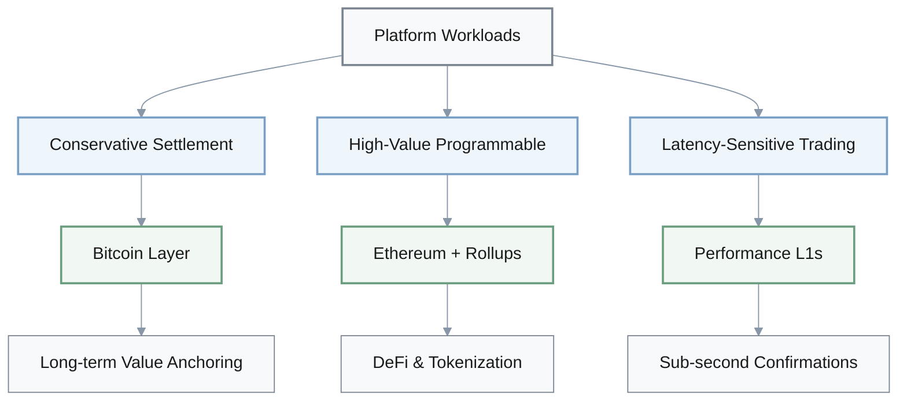
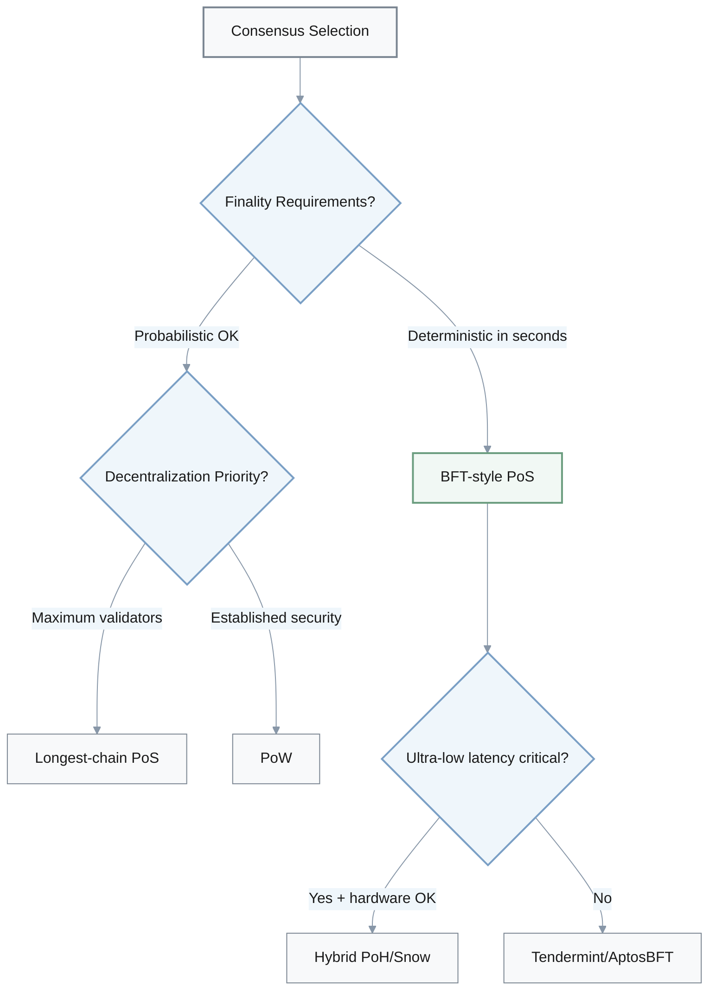
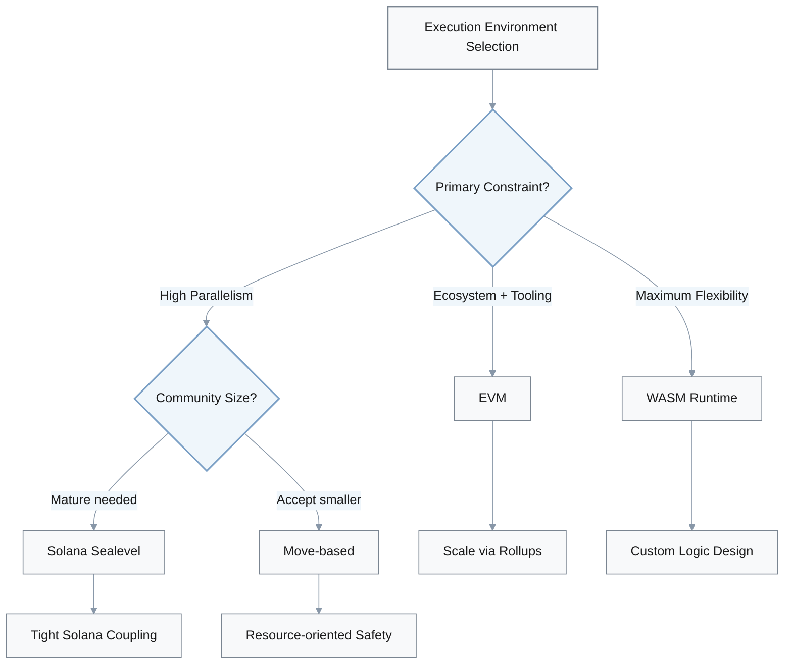
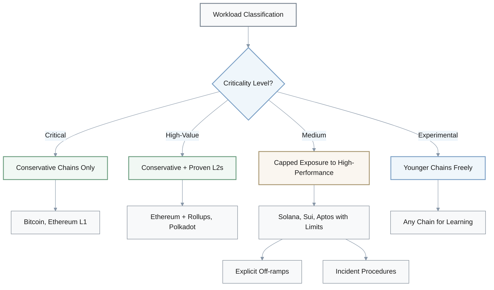
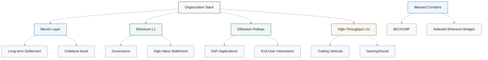

# Blockchain Architecture Strategic Decisions

## Overview

This document provides decision-making frameworks for blockchain architecture choices across 11 critical domains.

| Domain | Key Decision Areas |
|--------|-------------------|
| Multi-chain Strategy | Bitcoin, Ethereum, Solana, Polkadot, Sui, Aptos selection |
| Consensus Selection | PoW, PoS, BFT, hybrid designs |
| Execution Environments | EVM, Solana Sealevel, WASM, Move |
| Ethereum Scaling | L1 vs. Optimistic/ZK rollups vs. alternative L1s |
| Performance vs. Modularity | Monolithic chains vs. modular stacks |
| Cross-chain Infrastructure | Bridge architectures and trust models |
| Regulatory Compliance | Architecture for institutional DeFi |
| Risk Management | Deployment tiers across chain maturity |
| Security Strategy | Language-level vs. audit-based security |
| Future-proofing | ZK proofs, L2 proliferation, post-quantum |
| Governance Framework | Multi-chain role allocation and policies |

---

## 1. Multi-Chain Strategy for Global Financial Platforms

**Question**: You are designing a multi‑year blockchain strategy for a new global financial platform that needs censorship‑resistant settlement, programmable DeFi, and low‑latency user experiences. How would you choose and combine base L1 architectures (Bitcoin, Ethereum, Solana, Polkadot, Sui, Aptos) instead of betting on a single chain?

**Answer**:

### Workload Segmentation Approach

### Architecture Role Assignment

| Layer | Primary Role | Chain Options | Characteristics |
|-------|-------------|---------------|-----------------|
| **Settlement** | Long-term collateral | Bitcoin | ~7 TPS, ~60 min finality |
| **Programmable Hub** | High-value DeFi | Ethereum + Rollups | Rich tooling, EIP-4844 cost reduction |
| **Performance** | Sub-second trading | Solana, Sui, Aptos | Low fees, high validator requirements |
| **Specialized** | Custom execution | Polkadot, Cosmos | Shared security, complex governance |

### Decision Framework

- **Start by segmenting workloads**: Conservative long‑term settlement and collateral, high‑value programmable contracts, and latency‑sensitive trading or consumer flows
- **Treat Bitcoin as a conservative settlement layer**: Use for long‑term value anchoring where ~7 TPS and ~60‑minute finality are acceptable, not for complex DeFi logic
- **Use Ethereum PoS + rollup stack as default hub**: Combines rich tooling, EVM ecosystem, and rollup‑centric scalability roadmap with data availability upgrades (e.g., EIP‑4844) that materially reduce L2 costs
- **Add performance‑optimized L1s selectively**: Choose Solana or Move‑based chains (Sui/Aptos) only where sub‑second confirmations and very low fees are decisive; explicitly price in validator hardware needs and historical outage risk
- **Consider specialized domains cautiously**: Evaluate Polkadot‑style shared security (parachains) or Cosmos‑style sovereign chains only when interoperability models and governance complexity are justified
- **Define explicit go/no‑go criteria**: Set maximum acceptable outage hours per year, minimum Nakamoto coefficient band, and regulatory comfort levels before committing core assets to any non‑Bitcoin/non‑Ethereum L1

---

## 2. Consensus Family Selection for Institutional Blockchains

**Question**: Your team must choose a consensus family for a new high‑value blockchain or subnet that targets institutional usage: PoW, longest‑chain PoS, BFT‑style PoS, or hybrid designs like PoH‑assisted PoS or Snow consensus. How would you decide which consensus architecture to adopt and what trade‑offs to accept?

**Answer**:

### Consensus Comparison Matrix

| Consensus Type | Finality | Validator Scale | Energy | Security Source | Best For |
|----------------|----------|-----------------|--------|-----------------|----------|
| **PoW** | Probabilistic | Unlimited | Very High | Hash power + energy | Long settlement windows |
| **Longest-chain PoS** | Probabilistic | 100K+ possible | Low | Staked capital | High decentralization |
| **BFT-style PoS** | Deterministic | Dozens to hundreds | Low | Staked capital + slashing | Instant settlement |
| **Hybrid (PoH/Snow)** | Fast deterministic | Limited | Low-Medium | Mixed models | Ultra-low latency |

### Decision Flow

### Selection Criteria

- **Start from finality profile and threat model**: For deterministic finality in seconds (exchange-style or institutional settlement), prioritize BFT‑style PoS (Tendermint-like or AptosBFT-like designs); for probabilistic finality with long settlement windows, PoW or longest‑chain PoS remain viable
- **Quantify security budget sources**: In PoW, security comes from sustained hash power and energy spend; in PoS/BFT, from staked capital and slashing rules; ensure expected fee and issuance revenue can fund desired security level given projected market cap
- **Assess validator set scale and decentralization targets**: Classical BFT requires dozens to low hundreds of validators; longest‑chain PoS can support far larger sets (e.g., hundreds of thousands of Ethereum validators) at the cost of slower deterministic finality
- **Consider operational and environmental constraints**: Large‑scale PoW has very high energy use and political/regulatory baggage; PoS/BFT dramatically reduce energy but introduce new long‑range and governance risks that must be mitigated with finality gadgets, checkpointing, and client diversity
- **Evaluate hybrids for ultra‑low latency**: If ultra‑low latency is critical and hardware concentration is acceptable, evaluate PoH‑assisted PoS or Snow‑family consensus, but explicitly document hardware requirements, expected Nakamoto coefficient band, and historical outage patterns

---

## 3. Execution Environment and VM Selection

**Question**: You are selecting an execution environment and state model for a new smart‑contract platform or major application suite, choosing between EVM (account‑based), Solana's Sealevel model, WASM‑based runtimes, and Move‑based object or Block‑STM execution. How would you decide which VM and execution model best fits your 3–5 year roadmap?

**Answer**:

### Execution Environment Comparison

| VM Type | State Model | Parallelism | Ecosystem Maturity | Learning Curve | Best Use Case |
|---------|-------------|-------------|-------------------|----------------|---------------|
| **EVM** | Account-based | Sequential | Very High | Low | DeFi composability, proven tooling |
| **Solana Sealevel** | Account-based | Parallel (read/write sets) | Medium | Medium | Solana ecosystem workloads |
| **Move (Sui/Aptos)** | Object/Resource-based | Fine-grained parallel | Low | High | High-TPS + asset safety |
| **WASM (Substrate)** | Flexible | Configurable | Medium | High | Bespoke execution logic |

### Decision Framework

### Selection Criteria

- **Map primary constraints**: Determine if developer ecosystem depth and audit tooling are more important than raw TPS, or if you have a clear need for massive parallelism and low latency
- **Default to EVM for ecosystem compatibility**: If compatibility and proven tooling dominate, choose EVM (or equivalent execution layer) and scale via rollups or sidechains, accepting sequential execution limits in exchange for mature languages, auditors, and DeFi composability
- **Evaluate Move for fine‑grained parallelism**: If you need parallelism and accept steeper learning curves, consider Move‑based environments (Sui's object model, Aptos's Block‑STM) that use resource‑oriented types to prevent asset‑handling bugs while enabling high benchmark TPS; factor in shorter production history and smaller communities
- **Consider Solana SVM for ecosystem coupling**: For workloads tightly coupled to Solana's ecosystem where explicit read/write sets and Sealevel's concurrency model are acceptable, but budget time for account‑based parallelism, validator hardware expectations, and prior outage patterns
- **Use WASM for maximum flexibility**: Choose WASM‑based runtimes (e.g., Substrate parachains) when you need flexibility to design bespoke execution logic under shared security umbrella, and you're willing to assemble your own language/toolchain choices
- **Define migration paths**: For each option, establish migration and interoperability paths (EVM‑to‑Move bridges, IBC routes, XCM) to avoid hard lock‑in if your first execution model choice proves limiting

---

## 4. Ethereum Scaling Strategy

**Question**: You are deciding how to scale an Ethereum‑centric product that already relies on L1 security but now faces fee and throughput constraints. How would you choose between (a) staying on Ethereum L1, (b) moving most activity to optimistic or ZK rollups, or (c) migrating parts of the workload to an alternative high‑throughput L1?

**Answer**:

### Scaling Options Comparison

| Layer | Security | Withdrawal Time | Cost | EVM Compatibility | Use Case |
|-------|----------|----------------|------|-------------------|----------|
| **Ethereum L1** | Native | Immediate | High | Full | Critical settlement, governance |
| **Optimistic Rollups** | Inherited | 7 days | Medium | Full | General DeFi, NFTs |
| **ZK Rollups** | Inherited | Cryptographic | Low | High | High-value exits, privacy |
| **Alternative L1s** | Independent | Varies | Very Low | Partial/None | Latency-sensitive flows |

### Strategy Guidelines

- **Classify transactions by value and latency sensitivity**: Keep highest‑value, compliance‑sensitive settlement and governance actions on Ethereum L1; offload high‑volume user flows to rollups or other chains
- **Prioritize rollups for DeFi/NFT activity**: Where EVM compatibility and composability are critical, use optimistic rollups if 7‑day withdrawal windows are acceptable, and ZK rollups where instant cryptographic finality and stronger censorship resistance for exits matter; leverage EIP‑4844‑enabled cost reductions
- **Consider alternative L1s cautiously**: Only migrate latency‑sensitive or consumer‑scale workloads to alternative L1s (e.g., Solana or Move‑based chains) when rollup throughput or UX remains insufficient even after optimizations, and when users can tolerate different trust assumptions and bridge risks
- **Make bridging first‑class product concerns**: Specify which bridges you will support, their trust models (multisig, light‑client, ZK), and maximum allowed exposure per bridge
- **Establish explicit thresholds**: Define max acceptable median gas per transaction, target p95 latency, maximum share of assets allowed on non‑Ethereum settlement layer to have objective triggers for further migration or rollback

---

## 5. Monolithic vs. Modular Architecture

**Question**: You are evaluating whether to build a latency‑sensitive trading or gaming platform on a monolithic high‑throughput chain (such as Solana) or on a modular stack (Ethereum L2s, Polkadot parachains, Cosmos IBC). How would you compare these options and decide where to deploy?

**Answer**:

### Architecture Comparison

| Architecture | Latency | Uptime History | Security Model | Ecosystem Depth | Composability | Infrastructure |
|--------------|---------|----------------|----------------|-----------------|---------------|----------------|
| **Monolithic (Solana)** | Sub-second | Multi-hour halts | Single-layer | Growing | Simple (same chain) | Bespoke, high-spec |
| **Modular (Ethereum L2s)** | Low-seconds | Very high | Inherited + sequencer | Deep | Cross-layer complexity | Mature tooling |
| **Modular (Polkadot)** | Low-seconds | High | Shared relay | Medium | XCM messaging | Specialized |
| **Modular (Cosmos IBC)** | Variable | Chain-dependent | Per-chain | Medium | IBC protocol | Flexible |

### Trade-offs Analysis

| Factor | Monolithic Advantage | Modular Advantage |
|--------|---------------------|-------------------|
| **Performance** | Sub-second finality, tight event loops | Inherits base-layer security guarantees |
| **Risk** | Higher outage risk, coordinated restarts | Bridge/sequencer risks replace operational risk |
| **Ecosystem** | Lower fees, simpler composability | Deeper liquidity, wallets, dev tooling |
| **Infrastructure** | High validator hardware requirements | Mature existing infrastructure |

### Decision Framework

- **Start from latency and uptime requirements**: If you need sub‑second confirmations and tight event loops, monolithic high‑throughput chains are attractive, but price in their historical outage patterns and higher validator hardware thresholds
- **Analyze incident histories for monolithic chains**: Review Solana's multi‑hour halts from spam or client bugs and planned mitigations (new clients, congestion controls, consensus upgrades); decide whether your product can withstand coordinated restarts or partial brownouts
- **Evaluate modular stack capabilities**: Assess whether rollups or parachains can meet your p95 latency and throughput targets while inheriting stronger base‑layer security; accept that bridge and sequencer risks replace some base‑layer operational risk
- **Quantify ecosystem synergies**: Modular stacks tied to Ethereum or Polkadot often provide deeper liquidity, wallets, and dev tooling, while monolithic chains may require more bespoke infra but offer lower fees and simpler composability within their ecosystem
- **Make portfolio decisions**: Deploy latency‑critical components on high‑throughput chain while keeping treasury, governance, and critical state anchored to more conservative, modular ecosystem, with risk limits per chain documented in advance

---

## 6. Cross-Chain Bridge Architecture

**Question**: You are designing cross‑chain functionality for a protocol that must move assets and messages between multiple L1s and L2s. How would you choose among trusted multisig bridges, light‑client‑based protocols (IBC‑style), shared‑security messaging (XCMP‑style), and emerging ZK‑based bridges?

**Answer**:

### Bridge Architecture Comparison

| Bridge Type | Security Model | Integration Effort | Decentralization | Maturity | Exploit History | Best For |
|-------------|---------------|-------------------|------------------|----------|-----------------|----------|
| **Multisig** | Trusted signers | Low | Low | High | $100M+ exploits | Emergency use only, capped exposure |
| **Light Client (IBC)** | Consensus inheritance | High | High | Medium | Limited | Compatible chains, high security |
| **Shared Security (XCMP)** | Native consensus | Medium | High | Medium | Minimal | Same ecosystem (Polkadot) |
| **ZK-based** | Cryptographic proofs | Very High | Medium | Low | Early stage | High-value corridors (piloting) |

### Bridge Selection Strategy

| Priority | Approach | Constraints |
|----------|----------|-------------|
| **1. Native messaging** | Use XCMP, rollup-native bridges first | Within ecosystem only |
| **2. Light client protocols** | IBC-style when chains compatible | Higher integration cost |
| **3. ZK bridges** | For high-value corridors | Pilot carefully, assess maturity |
| **4. Multisig (last resort)** | Strictly capped exposure | Require high signer diversity + audits |

### Risk Management Framework

- **Map security budget and blast radius**: Decide maximum capital willing to expose per bridge and acceptable failure modes (theft, censorship, long downtime)
- **Avoid multisig bridges for systemic volumes**: Unless no alternative exists; if required, strictly cap exposure, insist on high signer diversity, and require independent audits, given historical record of multi‑hundred‑million‑dollar exploits
- **Prefer light‑client‑based protocols**: Use IBC‑style when both chains can support compatible clients, because they inherit security of underlying consensus instead of centralized signers, even though integration effort is higher
- **Use native messaging in shared‑security ecosystems**: In Polkadot's relay‑plus‑parachains, use native messaging like XCMP before external bridges, since it's validated by same consensus that secures your state
- **Start piloting ZK‑based bridges carefully**: Where production‑ready, especially for high‑value corridors, but treat proving systems, prover decentralization, and implementation maturity as first‑class risks until longer track record exists
- **Document per-corridor policies**: Specify trust model adopted, on‑chain invariants enforced (rate limits, circuit‑breaker pausing), and incident response communication plans

---

## 7. Regulatory Compliance Architecture for Institutional DeFi

**Question**: You are assessing where to deploy a new institutional DeFi or tokenization product that must satisfy regulators (for example MiCA in the EU or securities regulators elsewhere) while still benefiting from public‑chain properties. How would you select an architecture and primary chain(s) to balance compliance and decentralization?

**Answer**:

### Regulatory Architecture Pattern

| Layer | Responsibility | Regulatory Status | Decentralization Level |
|-------|---------------|-------------------|----------------------|
| **Application Layer** | KYC, freezing, disclosures | Regulated (CASP) | Centralized/permissioned |
| **Service Layer** | Custody, staking, bridging, sequencing | Regulated entity | Controlled |
| **Protocol Layer** | Base consensus, settlement | Credibly neutral | Maximally decentralized |

### Chain Evaluation Criteria

| Factor | Ethereum + Rollups | Solana | Sui/Aptos | Polkadot |
|--------|-------------------|--------|-----------|----------|
| **Validator concentration** | Low (100K+) | Medium | Medium-High | Medium |
| **Client diversity** | High (5+ clients) | Limited | Limited | Medium |
| **Cloud dependency** | Distributed | High | High | Medium |
| **Coordinated restarts** | Never | Multiple | Minimal | Rare |
| **Institutional custody** | Extensive | Growing | Emerging | Limited |
| **Regulatory engagement** | Strong | Moderate | Early | Moderate |

### Compliance Strategy

- **List regulatory obligations first**: Identify CASP licensing, travel‑rule data retention, reporting requirements and determine which parts of your stack must be under direct organizational control versus credibly neutral
- **Favor clean separation architectures**: Where user‑facing businesses (custody, staking, bridging, sequencing) can be cleanly separated and regulated as CASPs or similar, while the base protocol remains as decentralized as practical—Ethereum plus rollups is currently best aligned to this pattern
- **Evaluate centralization indicators**: Assess candidate L1s on validator concentration, reliance on a few client implementations, dependence on specific cloud or hosting providers, and history of coordinated restarts, all of which can influence whether regulators view a network as infrastructure versus as an issuer‑like entity
- **Check institutional readiness**: For performance‑optimized chains (Solana, Sui, Aptos), verify they already have institutional custody support, regulated financial products, and clear regulatory engagement; treat absence of such signals as a risk rather than a neutral factor
- **Architect for compliance at application layer**: Keep core legal obligations (KYC, freezing mechanisms where required, disclosures) at the application or permissioned‑layer level, while avoiding protocol‑level dependencies that could be retroactively classified as providing regulated services

---

## 8. Risk Budgets and Deployment Tiers

**Question**: You are deciding how aggressively to rely on high‑performance but younger chains (Solana, Sui, Aptos) for mission‑critical workloads versus more conservative but slower architectures (Bitcoin, Ethereum, Polkadot). How would you set risk budgets and deployment tiers across these platforms?

**Answer**:

### Workload Criticality Tiers

| Tier | Workload Examples | Chain Selection | Risk Tolerance | Throughput | Fees |
|------|------------------|----------------|---------------|-----------|------|
| **Critical** | Treasury, primary collateral, regulatory reporting | Bitcoin, Ethereum L1 | Minimal | Low | High |
| **High-Value** | Core DeFi protocols, tokenization | Ethereum L1 + Rollups, Polkadot | Low | Medium | Medium |
| **Medium** | DEX order books, gaming backends, stablecoin payments | Capped exposure to Solana/Sui/Aptos | Medium | High | Low |
| **Experimental** | New products, small balances | Younger chains freely | High | Very High | Very Low |

### Risk Budget Framework

### Risk Management Strategy

- **Classify workloads by criticality**: Categorize as treasury, core settlement, high‑value DeFi, low‑value consumer flows, or experimentation; assign each class a maximum acceptable combined risk from consensus, client bugs, and ecosystem maturity
- **Concentrate critical exposure conservatively**: For highest‑criticality layers (treasury, primary collateral, regulatory reporting), keep exposure concentrated on chains with longest security track record and most conservative architectures, even if that means lower throughput or higher fees
- **Allow capped exposure for medium-criticality**: For performance‑sensitive workloads (DEX order books, gaming backends, high‑frequency stablecoin payments), allow limited, capped exposure to high‑throughput chains, with explicit off‑ramps back to more conservative layers and well‑tested incident procedures for chain halts or reorgs
- **Use younger chains for experimentation**: For experimental features, new products, or verticals where user balances are small and reversible, use younger high‑performance chains more freely to learn, while treating gathered metrics (uptime, latency under stress, security incidents) as inputs into future risk re‑weighting
- **Regularly revisit allocations**: Review your allocation as validator decentralization, client diversity, outage history, and institutional adoption shift, instead of assuming current risk levels are static

---

## 9. Security Strategy: Language-Level vs. Audit-Based

**Question**: You are deciding whether to lean on language‑level and architecture‑level safety mechanisms (like Move's resource types, formal verification, and restricted execution models) versus relying mostly on audits and conventions in more flexible environments like EVM. How would you choose a security strategy for your smart‑contract stack?

**Answer**:

### Security Approach Comparison

| Approach | Bug Prevention | Ecosystem Maturity | Tooling | Auditor Availability | Best For |
|----------|---------------|-------------------|---------|---------------------|----------|
| **Language-Level (Move)** | Structural (type system) | Low | Emerging | Limited | Systemically important protocols |
| **Audit-Based (EVM)** | Convention + review | Very High | Mature | Extensive | Standard DeFi, flexibility priority |
| **Hybrid** | Split by sensitivity | Medium | Mixed | Good | Complex systems |

### Common Vulnerability Classes

| Vulnerability | Structurally Prevented by Move? | EVM Mitigation |
|--------------|-------------------------------|----------------|
| **Asset duplication** | ✅ Yes (resource types) | ❌ Audit + patterns |
| **Reentrancy** | ✅ Yes (restricted execution) | ❌ Guards + patterns |
| **Bridge logic errors** | ⚠️ Partial (type safety) | ❌ Formal verification + audit |
| **Access control bugs** | ⚠️ Partial | ❌ Tight design + audit |
| **Integer overflow** | ✅ Yes (checked arithmetic) | ⚠️ Solidity 0.8+ checked |

### Security Strategy

- **Inventory dangerous bug classes**: List most dangerous bugs for your protocol (asset duplication, reentrancy, bridge logic errors) and check which can be structurally ruled out by language or VM design versus merely discouraged by coding standards
- **Consider language-level safety for critical protocols**: If your protocol is systemically important or handles complex asset interactions, strongly consider environments like Move that encode asset non‑duplication and single‑use semantics at the type‑system level, even at the cost of a smaller auditor and tooling ecosystem
- **Layer defenses in EVM environments**: Assume audits alone are insufficient; pair them with battle‑tested patterns, formal verification tools where feasible, runtime safeguards (circuit breakers, pause switches), and tight access‑control design, all based on known exploit taxonomies from DeFi and bridge incidents
- **Split functionality by sensitivity**: Keep most security‑sensitive components (bridges, core vaults) in safest available language/VM and expose simpler interfaces to higher‑level, more flexible environments
- **Budget ongoing security investment**: Treat bug bounties, incident response drills, and upgrade procedures as budgeted line items comparable to infrastructure spend, rather than one‑time audit exercises

---

## 10. Future-Proofing: ZK, L2 Proliferation, Post-Quantum

**Question**: You are planning for 3–5 year resilience of your blockchain stack against emerging technologies like zero‑knowledge proofs at scale, Layer‑2 proliferation, and eventual post‑quantum cryptography migrations. How would you factor these long‑term technology shifts into today's architecture decisions?

**Answer**:

### Future Technology Readiness

| Chain | Upgrade Path | ZK Integration | Post-Quantum Plans | Proving Stack | Governance Maturity |
|-------|-------------|---------------|-------------------|---------------|-------------------|
| **Ethereum** | Multi-phase roadmap | L2-centric + native research | Research phase | Open specs, multiple | High |
| **Polkadot** | On-chain upgrades | Parachain flexibility | Early research | Configurable | High |
| **Solana** | Hard fork dependent | Limited | Not public | Opaque | Medium |
| **Sui/Aptos** | Versioned framework | Research phase | Not public | Emerging | Medium |

### Technology Evolution Timeline

| Technology | Current State | 2025-2026 | 2027-2028 | Preparation Now |
|-----------|--------------|-----------|-----------|-----------------|
| **ZK Proofs at Scale** | L2 rollups | Native privacy features | Standard privacy layer | Choose ZK-ready platforms |
| **L2 Proliferation** | 10s of rollups | 100s of app-chains | Unified standards | Design for cross-L2 |
| **Post-Quantum Crypto** | Research | Early pilots | Standards emerging | Plan key rotation |

### Future-Proofing Strategy

- **Prefer clear upgrade paths**: Choose ecosystems with clear upgrade and governance paths for cryptography and data‑availability components (e.g., Ethereum's multi‑phase sharding and rollup roadmap, Polkadot's on‑chain upgrade mechanisms) so that moving to new proof systems or signature schemes does not require disruptive hard forks
- **Evaluate native ZK integration**: Assess how natively each candidate chain integrates ZK proofs: some L1s position ZK purely as an L2 scaling solution, while others plan ZK‑native state representations; choose platforms whose roadmaps align with your expected privacy and scalability needs
- **Plan application-layer crypto migration**: For chains without demonstrated plans for post‑quantum readiness, treat long‑term key‑rotation and migration as your responsibility at the application layer and plan conservatively for key lifetimes and signature schemes
- **Avoid proprietary proving stacks**: Don't tie your architecture to proprietary or opaque proving stacks where you cannot independently assess security and performance; favor stacks with open specifications, academic scrutiny, and multiple implementations
- **Design for component migration**: Build your system so critical components (identity, KYC proofs, asset registries) can be migrated to new chains or layers as standards and regulatory expectations around ZK and post‑quantum schemes evolve

---

## 11. Overall Multi-Chain Governance Framework (2025-2028)

**Question**: You are defining an overall multi‑chain and multi‑layer architecture for your organization (custody, exchanges, applications, data analytics) over 2025–2028. How would you allocate roles to Bitcoin, Ethereum (L1 + rollups), high‑throughput L1s, and interoperability layers to create a coherent, governable strategy?

**Answer**:

### Organizational Multi-Chain Architecture

### Chain Role Allocation

| Chain/Layer | Primary Role | Use Cases | Treasury Limits | Risk Profile |
|------------|-------------|-----------|----------------|-------------|
| **Bitcoin** | Settlement + collateral | Long-term value anchoring | High allocation | Conservative PoW |
| **Ethereum L1** | Programmable settlement | Governance, high-value assets | Medium-high allocation | Battle-tested PoS |
| **Ethereum Rollups** | Scalable execution | DeFi, NFTs, end-user apps | Medium allocation | Inherited + sequencer |
| **High-Throughput L1s** | Vertical-specific | Trading, gaming, social | Strict limits | Higher operational risk |

### Interoperability Policy

| Corridor Type | Approval | Examples | Exposure Limits |
|--------------|----------|----------|----------------|
| **Blessed Corridors** | Pre-approved | IBC, XCMP, selected Ethereum bridges | High |
| **Evaluated Bridges** | Case-by-case | Specific vetted solutions | Medium |
| **Ad-hoc Bridges** | Forbidden or heavily restricted | Unvetted multisigs | Very low or none |

### Governance Alignment Strategy

- **Assign Bitcoin narrow but important role**: Use for long‑term settlement and collateral asset where its conservative PoW design and deep liquidity matter more than programmability
- **Treat Ethereum L1 as primary hub**: Position as the primary programmable settlement and governance layer for high‑value assets and contracts, with rollups providing scalable execution for most end‑user interactions; define which rollups you recognize as "near‑L1 equivalent" from risk and compliance standpoint
- **Use high‑throughput L1s as execution frontiers**: Deploy one or more (e.g., Solana, Sui, Aptos) as optional execution frontiers for specific verticals—trading, gaming, social—subject to strict treasury limits, bridging policies, and monitoring of validator and client diversity
- **Establish blessed interoperability corridors**: Choose one or two interoperability frameworks (IBC in Cosmos, XCMP in Polkadot, selected bridges between Ethereum and other L1s) as "blessed corridors," and forbid or heavily restrict ad‑hoc bridges outside this set
- **Align internal governance structures**: Organize risk committees and architecture review boards around these role definitions so every new product proposal specifies which chains and layers it will touch, how that fits the approved pattern, and what exceptions or additional controls are needed

---

## Summary

This document provides **11 decision frameworks** for blockchain architecture strategy covering:

1. **Multi-chain strategy** for global financial platforms
2. **Consensus selection** for institutional usage
3. **Execution environment** and VM choices
4. **Ethereum scaling** approach
5. **Monolithic vs. modular** architecture trade-offs
6. **Cross-chain bridge** security models
7. **Regulatory compliance** architecture
8. **Risk budgets** across chain maturity levels
9. **Security strategy** (language-level vs. audit-based)
10. **Future-proofing** for ZK, L2, and post-quantum
11. **Overall governance** framework for multi-chain organizations

Each framework provides comparative analysis, decision criteria, and strategic guidelines for making informed architecture choices aligned with organizational risk tolerance, regulatory requirements, and technical objectives.
