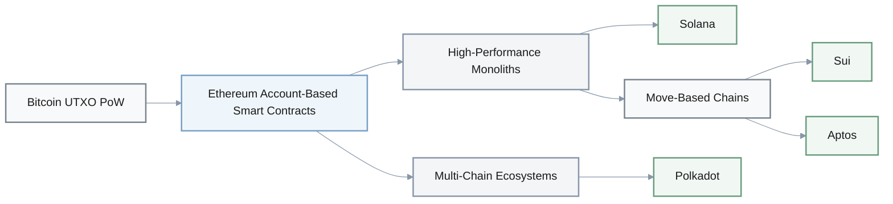
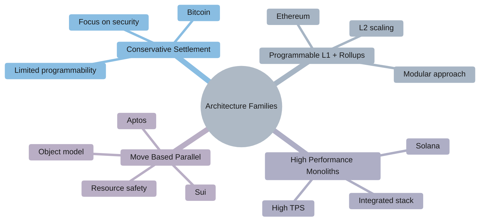
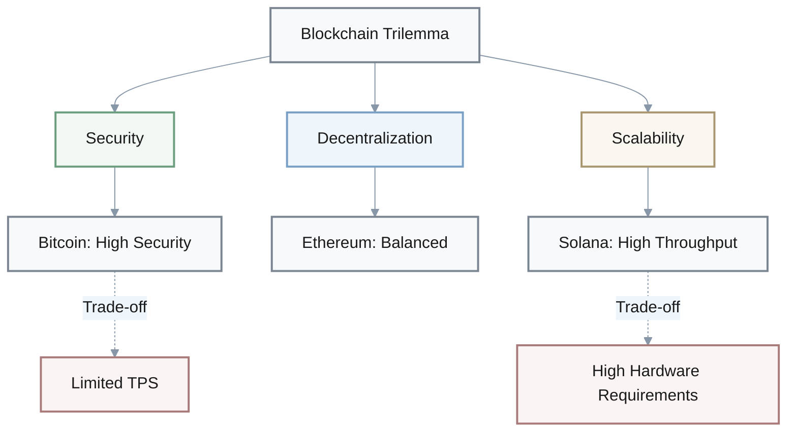
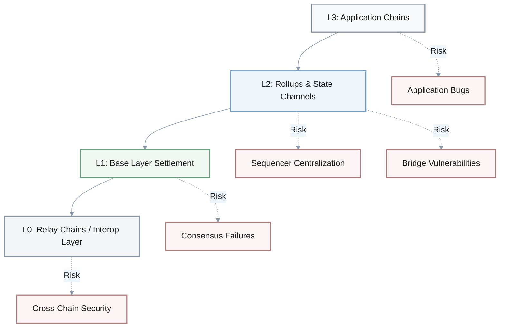
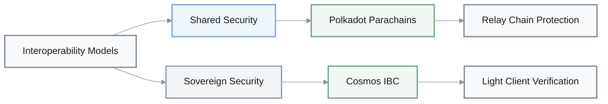
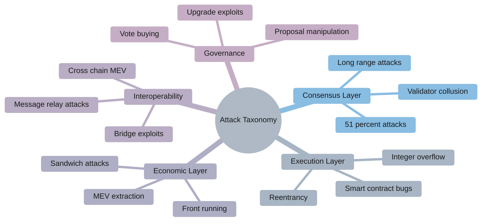
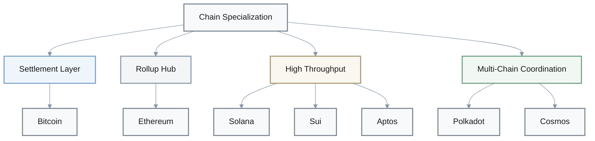
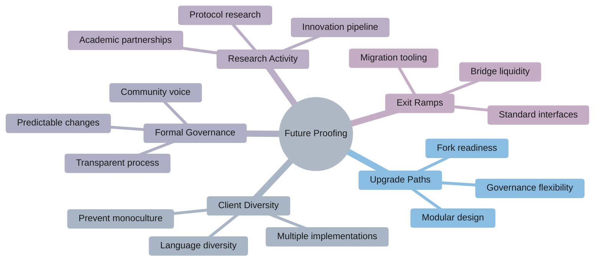

## 1. Mental Model Evolution: Blockchain Architecture

**Q: How does tracing the evolution from Bitcoin's PoW UTXO ledger to Ethereum's account-based smart contracts and then to Solana/Polkadot/Sui/Aptos change your mental model of what a "blockchain architecture" is?**

**A: Reflection prompts:**
- **Architectural shift identification**: Which shift (state model, consensus, layering) most challenged your previous picture of "a blockchain"?
- **Assumption review**: Note any earlier assumptions (e.g., "all chains work like Bitcoin/Ethereum") that now feel too coarse
- **Communication strategy**: Consider how this richer mental model would change how you explain blockchains to a non-technical stakeholder

---

## 2. State Model Trade-offs

**Q: After comparing UTXO, account-based, and object/resource-oriented state models across these networks, how has your understanding of "on-chain state" and its trade-offs evolved?**

| **State Model** | **Parallelism** | **Composability** | **Auditability** | **Example Chains** |
|----------------|----------------|------------------|------------------|-------------------|
| **UTXO** | High (independent outputs) | Limited (no shared state) | Excellent (explicit lineage) | Bitcoin |
| **Account-Based** | Medium (conflicts possible) | High (shared state access) | Good (global state) | Ethereum |
| **Object/Resource** | High (object-level locks) | High (explicit dependencies) | Excellent (resource safety) | Sui, Aptos |

**A: Reflection prompts:**
- **Contrast mechanisms**: How each model handles parallelism, composability, and auditability in your own words
- **Application fit**: Which model best matches the kinds of applications you care about and why
- **Developer complexity**: What hidden complexity each model pushes onto application developers or tooling

---

## 3. Architecture Families: Chain Selection Framework

**Q: The sources group L1s into architecture families (conservative settlement, programmable L1 + rollups, high-performance monoliths, Move-based parallel chains). How does this family view change the way you think about choosing a "home" chain for a project?**

**A: Reflection prompts:**
- **Use case mapping**: Map one of your concrete use cases into each family and notice where the fit feels natural or forced
- **Chain bias review**: Reflect on whether you were previously over-fitting everything to a single dominant chain
- **Strategy implications**: Consider how this family lens affects your risk diversification or multi-chain strategy

---

## 4. Governance Constraints & Protocol Evolution

**Q: Seeing how governance processes (BIPs, EIPs, on-chain referenda, foundation roadmaps) limited radical changes on Bitcoin/Ethereum and pushed innovation to new L1s, how does this reshape your expectations about future protocol evolution?**

| **Governance Type** | **Chain** | **Flexibility** | **Innovation Speed** |
|-------------------|----------|----------------|---------------------|
| BIPs (Bitcoin Improvement Proposals) | Bitcoin | Very Low | Very Slow |
| EIPs (Ethereum Improvement Proposals) | Ethereum | Medium | Medium |
| On-chain Referenda | Polkadot | High | Fast |
| Foundation Roadmaps | Solana, Sui, Aptos | High | Fast |

**A: Reflection prompts:**
- **Pivot realism**: Examine any prior belief that "Ethereum can always just add X later" and test it against the governance constraints you saw
- **Innovation timing**: When is it realistic to expect an incumbent chain to pivot versus when a new L1 is more plausible?
- **Long-term bets**: Consider how governance path dependence should factor into long-term architectural bets you make

---

## 5. The Blockchain Trilemma: Measured Trade-offs

**Q: What new nuances do you see in the trilemma between security, decentralization, and scalability after comparing Bitcoin, Ethereum, Solana, Polkadot, Sui, and Aptos with their concrete TPS, latency, and hardware data?**

**A: Reflection prompts:**
- **Binary thinking review**: Revisit any binary thinking you had (e.g., "this chain solved the trilemma") and contrast it with measured trade-offs
- **Dimension bias**: Which dimension do you personally tend to undervalue when looking at new chains?
- **SLO mapping**: Consider how your SLOs (latency, uptime, fee ceilings) would map to different points on this trade-off surface

---

## 6. Decentralization Metrics: Beyond Node Counts

**Q: How did the detailed decentralization metrics (Nakamoto coefficient, validator counts, hardware requirements, liquid-staking concentration) change your intuition about what "sufficient decentralization" really means in practice?**

**Key Decentralization Metrics:**
- **Nakamoto Coefficient**: Minimum number of entities needed to disrupt the network
- **Validator Counts**: Total number of active validators
- **Hardware Requirements**: Entry barriers for running nodes
- **Liquid Staking Concentration**: Distribution of staked assets across providers

**A: Reflection prompts:**
- **Multi-dimensional evaluation**: Compare how you would now evaluate decentralization for Ethereum vs Solana vs Polkadot vs Move chains beyond raw node counts
- **Heuristic adequacy**: Reflect on whether your earlier heuristics ("more validators = safer") still feel adequate
- **Trust prerequisites**: What additional data you would want before trusting a chain with high-value assets?

---

## 7. Multi-Layer Risk: Where Does Risk Live?

**Q: After studying L0/L1/L2/L3 layering (relay chains, rollups, payment channels, application-specific chains), how has your mental model of "where the risk lives" in a blockchain stack shifted?**

**A: Reflection prompts:**
- **Failure mode tracing**: Trace at least one failure mode (e.g., bridge hack or rollup bug) through the layers and note where it originates
- **Risk attribution**: Reflect on whether you previously over-attributed risk to the base layer while underestimating bridges and sequencers
- **Threat modeling**: Consider how you would now draw a threat model diagram for a multi-layer architecture you care about

---

## 8. Performance Reality vs. Marketing Claims

**Q: The investigations repeatedly show gaps between theoretical TPS claims and sustained performance under spam, MEV, and state bloat. How does this change the way you read performance marketing from L1/L2 projects?**

> **Critical Performance Questions:**
> - What are the exact hardware specifications?
> - How does it perform under adversarial conditions (spam, MEV)?
> - What is the actual outage history?
> - How does state bloat affect long-term performance?

**A: Reflection prompts:**
- **Historical re-evaluation**: Recall a specific past instance where you took a TPS or latency number at face value and re-evaluate it using the lenses here
- **Benchmark interrogation**: List the concrete questions you would now ask (hardware specs, adversarial tests, outage history) before trusting a benchmark
- **Acceptance criteria**: Reflect on how you will adjust your performance acceptance criteria when evaluating platforms

---

## 9. Parallel Execution: Developer Complexity Trade-offs

**Q: Comparing Solana's Sealevel, Aptos's Block-STM, and Sui's object-centric execution, how do you now think about the developer complexity and mental overhead introduced by parallel execution architectures?**

| **Execution Model** | **Chain** | **Parallelism Approach** | **Developer Mental Overhead** |
|-------------------|----------|-------------------------|------------------------------|
| **Sealevel** | Solana | Explicit account declarations | High (must declare all accounts) |
| **Block-STM** | Aptos | Optimistic parallel execution | Medium (automatic retry) |
| **Object-Centric** | Sui | Object ownership model | Medium (resource reasoning) |

**A: Reflection prompts:**
- **Model preference**: Identify which model feels most natural to reason about for you and why
- **Practice changes**: Reflect on how your testing, tooling, and code review practices would need to change for each model
- **Bug patterns**: Consider how these execution differences might influence the kinds of bugs and incidents you expect in production

---

## 10. Smart Contract Safety: Language-Level Guarantees

**Q: What shifts in your mental model of smart-contract safety come from contrasting Solidity/EVM with Move's resource-oriented design and the emphasis on formal verification?**

**Vulnerability Classes Comparison:**

| **Vulnerability** | **Solidity/EVM** | **Move** |
|------------------|-----------------|----------|
| Reentrancy | Common risk | Eliminated by design |
| Asset Duplication | Possible | Impossible (linear types) |
| Unsafe Ownership | Manual tracking | Built-in resource safety |
| Integer Overflow | Requires checks | Built-in safety |

**A: Reflection prompts:**
- **Vulnerability reassessment**: Note any vulnerability classes (reentrancy, asset duplication, unsafe ownership) that you now view differently under Move
- **Audit reliance**: Reflect on whether you previously over-relied on audits instead of language-level guarantees
- **Enterprise criteria**: Consider how this changes your criteria for "enterprise-ready" contract platforms

---

## 11. Operational Resilience: Beyond Protocol Correctness

**Q: How did the detailed Solana outage narratives (Gulf Stream, leader schedule, client monoculture, spam dynamics) refine your understanding of "operational resilience" beyond consensus protocol correctness?**

**Resilience Factors:**
- **Client Diversity**: Multiple independent implementations
- **Restart Procedures**: How quickly can the network recover?
- **Congestion Controls**: How does it handle spam and extreme load?
- **Leader Schedule**: Single points of failure in block production

**A: Reflection prompts:**
- **Outage patterns**: Contrast your earlier view of outages as random bugs with the structural patterns highlighted here
- **Pre-adoption evaluation**: Ask how you would now evaluate client diversity, restart procedures, and congestion controls before adopting a chain
- **SLO requirements**: Reflect on what SLOs and incident playbooks you would demand from a high-performance L1

---

## 12. Interoperability Models: Security & Trust Assumptions

**Q: After examining Polkadot's shared-security parachains and Cosmos's sovereign chains with IBC, how has your view of "interoperability" and "security reuse" evolved?**

**A: Reflection prompts:**
- **Bridge models**: Compare how you previously thought about bridges versus what relay-chain and IBC models actually guarantee
- **Security preference**: Reflect on when you would prefer shared security over sovereign security for a new project
- **Risk differences**: Consider how governance and upgrade risk differ between these interoperability patterns

---

## 13. Bridge Security: Trust Assumptions & Attack Patterns

**Q: The materials describe several cross-chain bridge hacks and a detailed Wormhole exploit analysis. How do these examples change the way you reason about trust assumptions when you see a new bridge design?**

**Common Bridge Failure Points:**
- **Key Management**: Multisig threshold vulnerabilities
- **Sysvar Handling**: Improper validation of system variables
- **Upgrade Paths**: Centralized upgrade controls
- **Message Verification**: Incomplete cross-chain verification

**A: Reflection prompts:**
- **Failure catalog**: List the assumptions (key management, sysvar handling, upgrade paths) that failed in Wormhole and similar incidents
- **Asset equivalence**: Reflect on whether you previously treated "bridged" assets as equivalent to native ones
- **Red flags**: Consider what red-flag patterns you will now look for in bridge documentation and code

---

## 14. Cross-Chain Security Models: Spectrum of Trust

**Q: When you compare trust-minimized interoperability (IBC light clients, XCMP) with trusted multisig bridges and emerging ZK-bridges, how has your notion of "end-to-end security" across chains become more nuanced?**

| **Bridge Type** | **Trust Model** | **Security Guarantees** | **Complexity** |
|----------------|----------------|------------------------|---------------|
| **Multisig Bridges** | Trusted validators | Low (m-of-n threshold) | Low |
| **IBC Light Clients** | Trust-minimized | High (cryptographic proof) | Medium |
| **XCMP** | Shared security | High (relay chain) | Medium |
| **ZK Bridges** | Cryptographic | Very High (validity proof) | High |

**A: Reflection prompts:**
- **Honesty requirements**: Map out which components must be honest in each model for safety to hold
- **DeFi prioritization**: Reflect on how you would prioritize interoperability options for a cross-chain DeFi protocol
- **Constraint analysis**: Consider how regulatory and operational constraints might push you toward or away from certain trust models

---

## 15. Validator Economics: Beyond "More Staking = Safer"

**Q: How have the discussions of validator economics (Ethereum liquid staking, Solana's validator shrink, Polkadot's NPoS, staking yields and slashing) shifted your understanding of the economic layer beneath consensus?**

**Economic Risk Factors:**
- **Liquid Staking Concentration**: Centralization through staking derivatives (e.g., Lido)
- **Rehypothecation Risks**: Staked assets used as collateral elsewhere
- **Validator Shrink**: Economic pressure reducing validator diversity
- **Yield Compression**: Race to bottom on staking rewards

$$
\text{Effective Decentralization} = \frac{\text{Nakamoto Coefficient}}{\text{Liquid Staking Concentration Ratio}}
$$

**A: Reflection prompts:**
- **Staking assumptions**: Revisit any assumption that "more staking = safer" in light of concentration and rehypothecation risks
- **Dashboard interrogation**: Reflect on how you would now interrogate a chain's staking dashboard before delegating capital
- **Incentive alignment**: Consider how validator incentives align or conflict with user and regulator priorities in each architecture

---

## 16. Regulatory Architecture: Technical Design Meets Legal Risk

**Q: Reading about MiCA's CASP regime, US staking enforcement, and regulatory perspectives on centralization, how has your model of the relationship between technical architecture and legal risk changed?**

**Regulatory Chokepoints:**

| **Architectural Feature** | **Regulatory Risk** | **Jurisdiction** |
|-------------------------|-------------------|-----------------|
| Validator Concentration | CASP obligations | EU (MiCA) |
| Sequencer Centralization | Securities law scrutiny | US (SEC) |
| Bridge Control | Money transmission | US (FinCEN) |
| Staking Services | Investment contract | US (SEC) |

**A: Reflection prompts:**
- **Chokepoint identification**: Identify which architectural features (validator concentration, sequencer centralization, bridge control) you now see as regulatory chokepoints
- **Compliance mapping**: Reflect on how you would map a given chain's design to likely CASP obligations or securities-law scrutiny
- **Institutional suitability**: Consider how this alters your criteria for calling a network "institutionally suitable"

---

## 17. Enterprise Adoption: Beyond Performance Marketing

**Q: The case studies of enterprise and institutional adoption (Onyx on Ethereum, Visa and stablecoins on Ethereum/Solana, Sui institutional products) show different alignment patterns. How does this reframe the question "Which L1 is enterprise-ready?" for you?**

**Enterprise Priority Matrix:**

| **Feature** | **Marketing Emphasis** | **Actual Enterprise Priority** |
|------------|----------------------|------------------------------|
| Performance | ⭐⭐⭐⭐⭐ | ⭐⭐⭐ |
| Transaction Fees | ⭐⭐⭐⭐⭐ | ⭐⭐ |
| Governance | ⭐⭐ | ⭐⭐⭐⭐⭐ |
| Tooling & Support | ⭐⭐⭐ | ⭐⭐⭐⭐⭐ |
| Auditability | ⭐⭐ | ⭐⭐⭐⭐⭐ |
| Uptime/SLAs | ⭐⭐⭐ | ⭐⭐⭐⭐⭐ |

**A: Reflection prompts:**
- **Priority comparison**: Compare the actual features enterprises prioritized (governance, tooling, auditability, uptime) versus what marketing emphasized (TPS, fees)
- **Performance weighting**: Reflect on whether you previously over-weighted raw performance when thinking about enterprise adoption
- **Evaluation framework**: Consider how you would now evaluate a chain's roadmap and ecosystem health before recommending it to an enterprise

---

## 18. Attack Taxonomy: Comprehensive Threat Modeling

**Q: Having seen detailed attack taxonomies (51% attacks, MEV, smart-contract exploits, bridge hacks) and mitigation strategies (slashing, formal verification, ZK proofs), how has your personal threat-model template for a blockchain system evolved?**

**A: Reflection prompts:**
- **Neglected attacks**: Enumerate the attack classes you previously neglected (e.g., bridge governance or sequencer collusion)
- **Multi-chain reviews**: Reflect on how you would now structure a security review for a new protocol that spans multiple chains
- **Protection layers**: Consider what additional monitoring or insurance layers you would want before holding significant value on a given stack

---

## 19. Zero-Knowledge Proofs: From Theory to Practice

**Q: The ZK-focused sections connect privacy, scalability, and regulation. How do zero-knowledge proofs now fit into your mental model of "practical" blockchain design rather than just cryptographic theory?**

**ZK System Comparison:**

| **ZK Type** | **Trusted Setup** | **Proof Size** | **Verification Speed** | **Use Case** |
|------------|------------------|---------------|----------------------|-------------|
| **zk-SNARKs** | Required | Small | Fast | Privacy, L2 rollups |
| **zk-STARKs** | Not required | Large | Fast | Transparent L2s |
| **No ZK** | N/A | N/A | N/A | Public transparency |

**ZK Risk Factors:**
- **Trusted Setup**: Ceremony compromise risks (SNARKs)
- **Prover Centralization**: Limited prover infrastructure
- **Circuit Bugs**: Complex constraint system errors
- **Quantum Resistance**: STARK advantage over SNARK

**A: Reflection prompts:**
- **Deployment decisions**: Contrast where you would actually deploy zk-SNARKs vs zk-STARKs vs no-ZK based on the examples here
- **Privacy trade-offs**: Reflect on how ZK changes the trade-offs between transparency, compliance, and user privacy for your use cases
- **Risk tracking**: Consider what new risks ZK systems introduce (trusted setup, prover centralization, circuit bugs) that you need to track

---

## 20. Storage & State Growth: Hidden Performance Constraints

**Q: After comparing performance tables and discussions of state growth, what new questions will you ask about storage, archival requirements, and node operation before trusting performance numbers from any L1/L2?**

**Critical Node Operation Metrics:**

| **Metric** | **Why It Matters** | **Question to Ask** |
|-----------|-------------------|-------------------|
| **Full Node Storage** | Validator accessibility | What's the storage requirement after 1 year? |
| **Archive Node Storage** | Historical data access | How much to store complete history? |
| **State Growth Rate** | Long-term sustainability | GB/month increase under load? |
| **Bandwidth Requirements** | Geographic accessibility | Minimum bandwidth for validation? |
| **Pruning Options** | Storage optimization | Can nodes prune safely? |

**A: Reflection prompts:**
- **Validation accessibility**: Reflect on how full-node and archive-node requirements affect who can realistically validate on each chain
- **Metrics checklist**: List the storage and bandwidth metrics you would now request from a protocol team alongside TPS claims
- **Viability constraints**: Consider how state-growth constraints might limit long-term viability for high-throughput designs

---

## 21. Chain Specialization: Beyond Winner-Take-All

**Q: The materials emphasize that different architectures are converging toward role specializations (Bitcoin as settlement, Ethereum as rollup hub, Solana/Sui/Aptos for high-throughput workloads, Polkadot/Cosmos for multi-chain). How does this specialization story change your view of "winner-take-all" narratives?**

**A: Reflection prompts:**
- **Dominance reassessment**: Revisit any belief that one chain will dominate everything and compare it to the role-based outlook presented
- **Portfolio design**: Reflect on how you might explicitly design a portfolio or system architecture that leverages multiple specialized roles
- **Coordination challenges**: Consider what coordination and interoperability challenges this specialization introduces for you

---

## 22. Source Variance: Critical Reading & Multiple Perspectives

**Q: Looking across the different sources, where do you notice disagreements, emphasis differences, or varying confidence levels (e.g., on Solana resilience, Move security, Sui/Aptos throughput)?**

**Areas of Variance to Watch:**
- **Solana Resilience**: Optimists emphasize improvements; skeptics cite recurring outages
- **Move Security**: Proponents highlight formal verification; critics note immature ecosystem
- **Sui/Aptos Throughput**: Benchmarks vary widely based on test conditions
- **Bridge Safety**: Trust models debated between minimized-trust vs practical adoption

**A: Reflection prompts:**
- **Narrative differences**: Identify at least one topic where two reports implicitly push different narratives or risk framings
- **Trust calibration**: Reflect on how this variance affects your trust in any single source
- **Verification strategy**: Consider what additional data or experiments you would seek before forming a strong view on that topic

---

## 23. Multi-Chain Future: Structural Feature or Temporary Phase?

**Q: Given everything you read about multi-chain interoperability, cross-chain MEV, and bridge risk, how has your perspective shifted on whether "multi-chain" is a short-term workaround or a long-term structural feature of the ecosystem?**

**Consolidation vs. Heterogeneity Factors:**

| **Factor** | **Favors Consolidation** | **Favors Heterogeneity** |
|-----------|------------------------|-------------------------|
| **Network Effects** | ✓ Liquidity concentration | ✗ Specialized use cases |
| **Developer Experience** | ✓ Single stack expertise | ✗ Best tool for the job |
| **Security Model** | ✓ Unified trust assumptions | ✗ Risk diversification |
| **Regulatory Pressure** | ? May force standards | ? May require jurisdictional splits |
| **Technical Innovation** | ✗ Governance inertia | ✓ Experimental freedom |

**A: Reflection prompts:**
- **Consolidation stance**: Articulate your updated stance on whether consolidation to a few dominant stacks is likely or whether heterogeneity is here to stay
- **Investment implications**: Reflect on how this stance affects your own skill and tooling investment choices
- **Pivot triggers**: Consider what developments (technical, regulatory, economic) could most change your current view

---

## 24. Future-Proofing: Architectural Hedges Against Uncertainty

**Q: The future-looking sections (ZK-native chains, post-quantum readiness, AI-augmented tooling, modular DA layers) sketch possible 3–5 year trajectories. How do these possibilities influence the way you think about "future-proofing" architectural decisions now?**

**Key Architectural Hedges:**

**Emerging Technologies to Monitor:**
- **ZK-Native Chains**: Privacy-first architectures
- **Post-Quantum Cryptography**: Quantum-resistant signatures and hashing
- **AI-Augmented Tooling**: Automated auditing, optimization, formal verification
- **Modular DA Layers**: Celestia, EigenDA, Avail

**A: Reflection prompts:**
- **Hedge identification**: List the architectural properties (upgrade paths, client diversity, formal governance, research activity) you now see as key hedges against uncertainty
- **Commitment staging**: Reflect on how you would time-lock or stage large commitments (capital, integration work) given this uncertainty
- **Exit planning**: Consider what explicit "exit ramps" or migration options you would build into any serious bet on a specific chain

---

## 25. Meta-Reflection: Your Learning Journey

**Q: How has your overall approach to evaluating blockchain architectures evolved through this investigation?**

**Transformation Checklist:**
- [ ] Moved from single-chain bias to multi-chain reasoning
- [ ] Recognize governance as a first-class architectural constraint
- [ ] Understand that "decentralization" is multi-dimensional
- [ ] Can map technical features to regulatory implications
- [ ] Critically evaluate performance marketing claims
- [ ] See bridges and layers as primary attack surfaces
- [ ] Appreciate trade-offs over "solutions"
- [ ] Value operational resilience alongside protocol correctness

**Next Steps for Deeper Understanding:**
1. **Hands-on Experimentation**: Deploy test applications across different chains
2. **Community Engagement**: Join validator/developer communities
3. **Continuous Monitoring**: Track real-world incidents and postmortems
4. **Cross-Disciplinary Learning**: Study regulatory developments, economic models, cryptographic advances
5. **Build Mental Models**: Create your own diagrams and frameworks

---

> **Final Reflection:** The blockchain architecture landscape is not converging to a single optimal design but rather diversifying into specialized roles. Your ability to navigate this complexity—understanding trade-offs, questioning claims, and building robust threat models—is now your competitive advantage.
