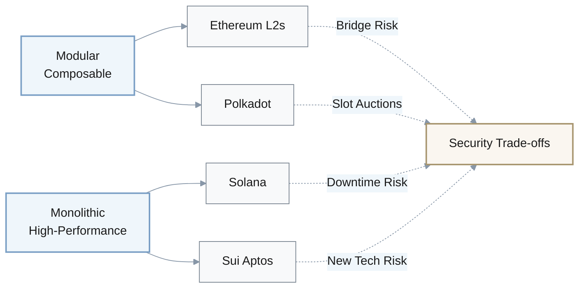
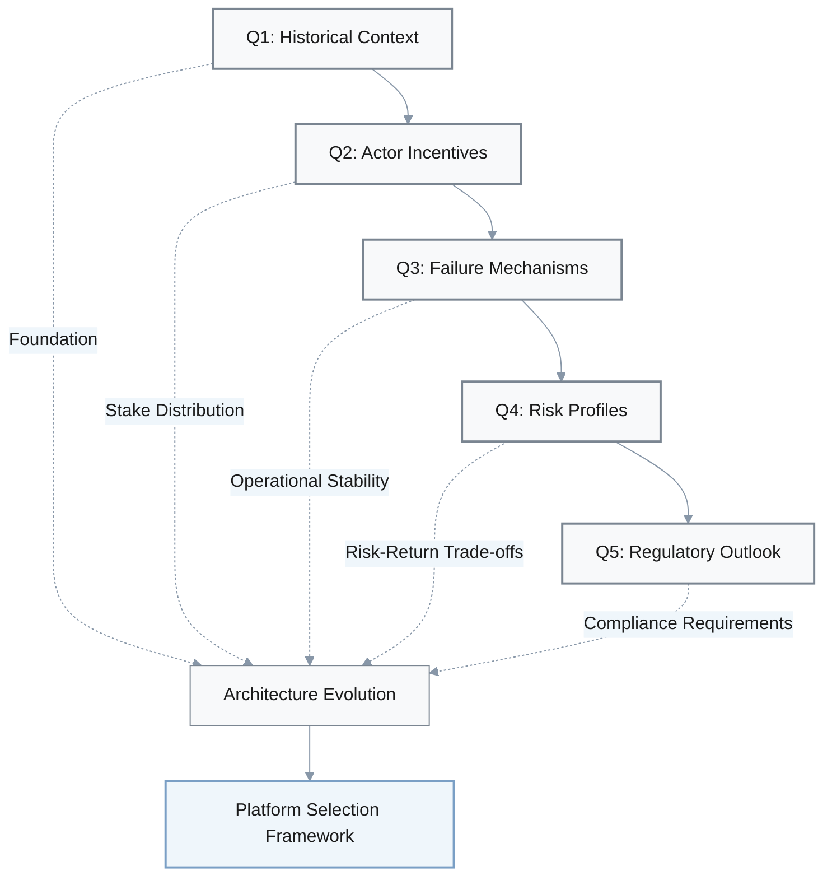
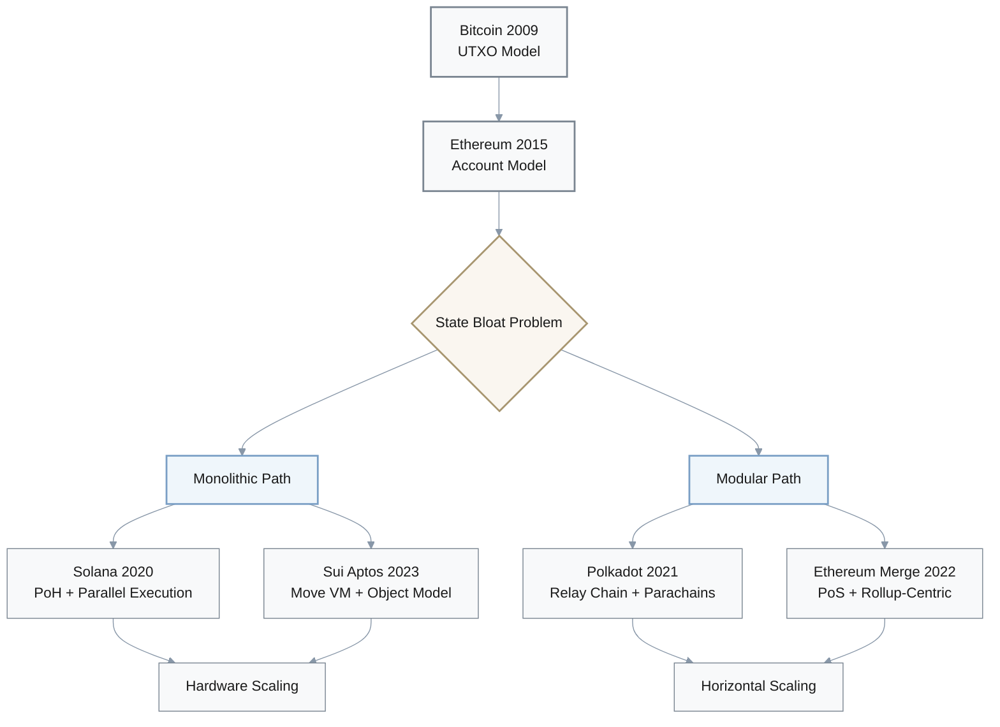
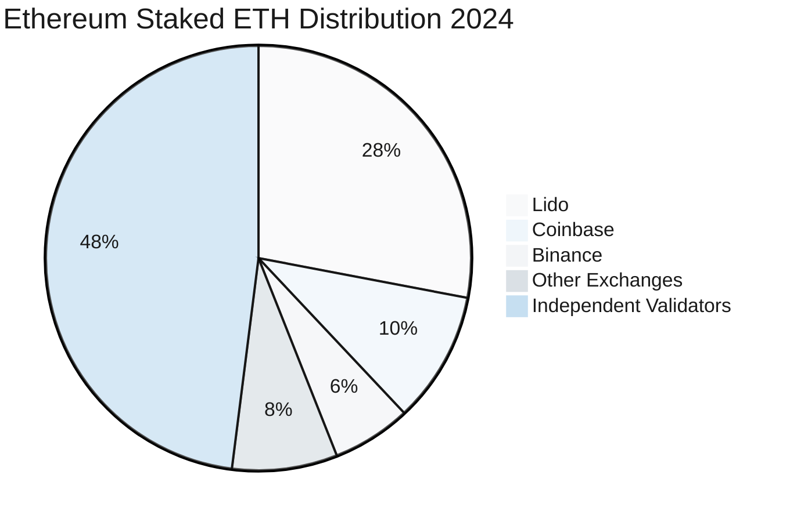
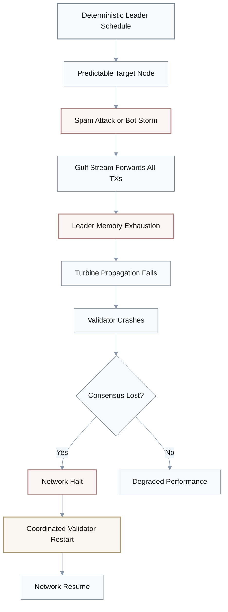
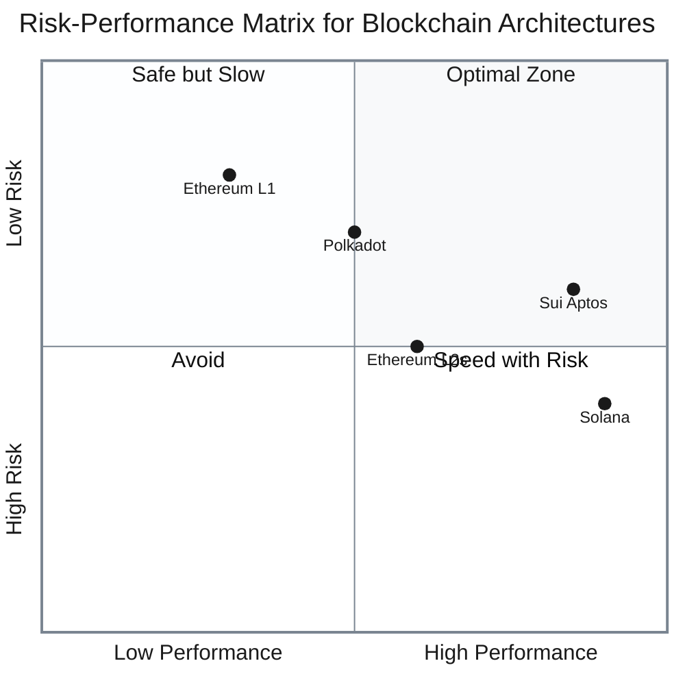
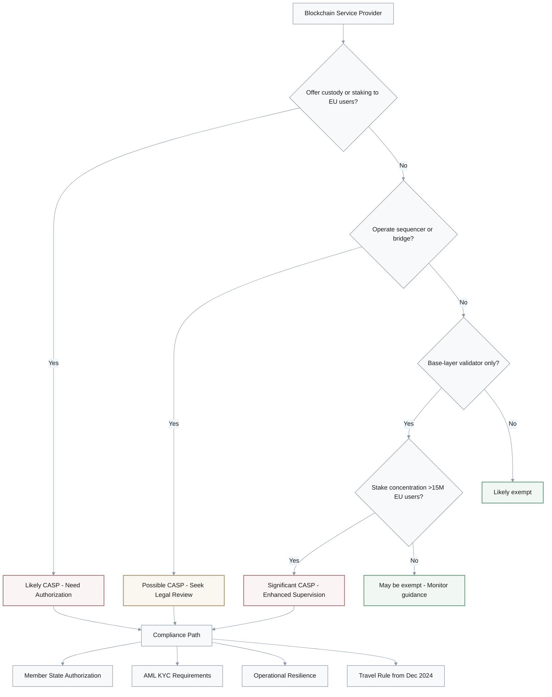
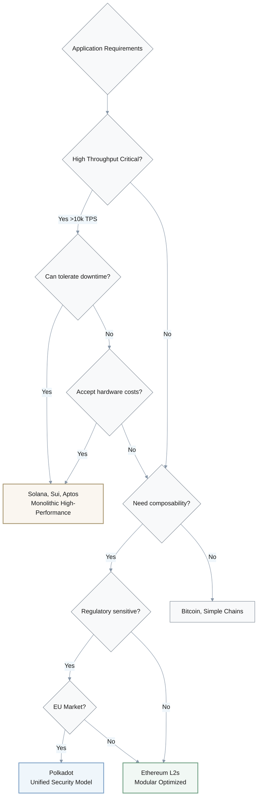

# **Case Overview & Scope**

**Case**: Blockchain Architecture Wars: How Competing Design Philosophies Shape Ecosystem Resilience, Performance, and Regulatory Risk (2015–2025)

This investigation examines how divergent architectural choices among Bitcoin, Ethereum, Solana, Polkadot, Sui, and Aptos have created distinct risk profiles, performance characteristics, and ecosystem outcomes between 2015 and 2024, with implications extending through 2027. The case centers on a multi-dimensional conflict between monolithic high-performance chains (Solana, Sui, Aptos) and modular, composable networks (Ethereum, Polkadot), analyzing how technical trade-offs in consensus mechanisms, scalability approaches, and governance models interact with validator economics, developer incentives, and emergent regulatory frameworks. Key actors include protocol foundations (Ethereum Foundation, Solana Labs, Parity Technologies, Mysten Labs, Aptos Labs), validator operators, institutional stakers, and regulators (SEC, ESMA, CFTC). The investigation targets decision-makers evaluating platform selection, investment allocation, and regulatory compliance strategies in an increasingly fragmented Layer-1 landscape.

#### **Case Summary: Architecture Philosophy Spectrum**

#### **Key Dimensions of Analysis**

| Dimension | Modular Approach | Monolithic Approach |
|-----------|------------------|---------------------|
| **Scalability Strategy** | Horizontal (layers/shards) | Vertical (hardware/parallelization) |
| **Primary Risk** | Bridge exploits, sequencer centralization | Base-layer downtime, state contention |
| **Decentralization** | Layered (varies by component) | Unified (single validator set) |
| **Developer Experience** | Multi-chain complexity | Single-chain simplicity |
| **Regulatory Surface** | Multiple CASP touchpoints | Concentrated validator exposure |

---
## **Investigation Q&As by Angle**

### **Angle Overview**

| Angle / Theme | Range | Count | Time Span | Primary Dimensions | Visual Artifacts |
|---------------|-------|-------|-----------|-------------------|------------------|
| **Background & Early Context** | Q1 | 1 | 2015–2024 | History, structure, regions | ✓ Evolution flowchart ✓ Architecture matrix ✓ Metrics comparison |
| **Actors, Incentives & Relationships** | Q2 | 1 | 2020–2024 | Actors, incentives, power | ✓ Validator economics table ✓ Staking concentration chart |
| **Causal Chain, Mechanisms & Evidence** | Q3 | 1 | 2021–2024 | Tech, market, governance, process | ✓ Outage causal flowchart ✓ Incidents timeline table |
| **Impact, Accountability & Outlook** | Q4–Q5 | 2 | 2020–2027 | Impact, risk, strategy, policy | ✓ Risk-performance quadrant ✓ MiCA decision tree ✓ Bridge exploits data |
| **Total** | **Q1-Q5** | **5** | **2015–2027** | **Technical, Business, Regulatory** | **12+ visual elements** |

#### **Investigation Structure**

---

### **Q1: How did the transition from Bitcoin's simple UTXO model to Ethereum's account-based model and subsequent architectural innovations reshape blockchain design debates and ecosystem development between 2015–2024?**

**Investigation angle / Theme type**: Background & Early Context  
**Timeframe**: 2015–2024 | **Regions/Segments**: Global (developer ecosystem, institutional adoption)  
**Core actors/factors**: Bitcoin (UTXO, PoW), Ethereum (account model, PoW→PoS), Solana (PoH, monolithic), Polkadot (NPoS, parachains), Sui/Aptos (Move VM, parallel execution)  
**Hypothesis / Focus**: The account-based model enabled programmability but introduced state complexity, triggering a fork in design philosophy between modular layering and monolithic scaling.  
**Decision relevance**: **Build/Partner** – Understanding architectural lineage informs platform selection for dApp development and infrastructure investment.  
**Priority**: **Critical** – Foundational to all subsequent technical decisions.  
**Key Insight**: Ethereum's account model created a "state bloat" vulnerability that subsequent chains addressed through parallelization (Solana), sharded architectures (Polkadot), or object-centric models (Sui), fragmenting the ecosystem into incompatible design paradigms.

**Answer** (~230 words):  
Bitcoin's 2009 UTXO design prioritized simplicity and verification efficiency but limited programmability [Ref: A1]. Ethereum's 2015 account-based model introduced mutable state and Turing-complete contracts, enabling DeFi but creating state growth challenges—by the early 2020s, Ethereum's state on a typical full node was on the order of tens to low hundreds of gigabytes (depending on client and pruning mode), exacerbating client sync times [Ref: A2]. This catalyzed two competing responses. **Monolithic chains** like Solana (launched 2020) implemented Proof-of-History (PoH) and Gulf Stream to parallelize transaction processing within a single state machine, with marketing materials citing theoretical throughput in the tens of thousands of TPS (often ~65,000 in tests), but at the cost of higher hardware and bandwidth requirements: Solana's 2021–2023 outages revealed how leader-node architecture and aggressive transaction forwarding created single points of failure under load [Ref: A3]. **Modular approaches** emerged simultaneously: Polkadot's 2021 parachain auctions introduced a Relay Chain validating heterogeneous shards, with around 127.8 million DOT (≈11% of supply) bonded by Q1 2022 across 13 awarded slots, enabling specialized execution environments [Ref: A4]. Ethereum's 2022 Merge to PoS reduced energy use by ~99.95% but maintained monolithic execution, shifting most scalability gains to rollups—by 2024, aggregate Layer 2 throughput consistently exceeded Ethereum L1, with L2 networks processing several times more transactions per second on average [Ref: A5]. **Post-2022 architectures** (Sui, Aptos) synthesized lessons: both adopted Meta's Move VM from the Diem project, with Sui's object-centric model enabling highly parallel execution for simple, independent transactions and Aptos's Block-STM engine using optimistic parallelization to approach linear scaling with added cores [Ref: A6]. The design space fractured: each approach optimizes for different security-performance tradeoffs, requiring developers to commit to incompatible stacks.

**Artifact**: [Timeline: 2015 (Ethereum launch) → 2020 (Solana mainnet) → 2021 (Polkadot parachains live) → 2022 (Ethereum Merge) → 2023 (Sui/Aptos mainnet)]  
**Confidence**: **High** – Well-documented protocol specifications and performance metrics.

#### **Blockchain Evolution: Design Philosophy Fork**

#### **Architecture Comparison Matrix**

| Blockchain | Model Type | State Management | Throughput Claim | Energy Efficiency | Primary Trade-off |
|------------|-----------|------------------|------------------|-------------------|-------------------|
| **Bitcoin** | UTXO | Immutable outputs | ~7 TPS | Low (PoW) | Simplicity vs Programmability |
| **Ethereum** | Account-based | Mutable state | ~15 TPS (L1) | High (PoS 99.95%) | Flexibility vs State Growth |
| **Solana** | Monolithic | Single state | ~65k TPS (theoretical) | Medium | Speed vs Stability |
| **Polkadot** | Modular sharded | Heterogeneous shards | Variable per chain | High (NPoS) | Specialization vs Complexity |
| **Sui** | Object-centric | Independent objects | ~100k+ TPS (tests) | High | Parallelization vs Dev Complexity |
| **Aptos** | Block-STM | Optimistic parallel | ~100k+ TPS (tests) | High | Linear Scaling vs State Dependencies |

#### **Key Metrics Comparison**

| Metric | Ethereum L1 | Ethereum L2s | Solana | Polkadot | Sui/Aptos |
|--------|-------------|--------------|--------|----------|-----------|
| **Validator Count** | ~900k | Centralized sequencers | ~1,900 | ~297 | ~100-200 |
| **State Size** | ~100GB+ | Varies by L2 | ~60GB (pruned) | Relay: ~10GB | <20GB (new) |
| **Uptime 2021-2024** | >99.99% | >99.9% | ~98% | >99.9% | >99.9% (limited history) |
| **Developer Share** | ~70% (EVM total) | Included in EVM | ~18% | ~5% | ~3% |
| **Bridge Risk** | High (L2 bridges) | Very High | Low (atomic) | Low (XCM native) | Low (atomic) |

---

### **Q2: How do validator incentive structures and governance mechanisms differ across Ethereum (PoS), Solana (PoH+PoS), and Polkadot (NPoS), and what measurable impacts have these had on network security and decentralization through 2024?**

**Investigation angle / Theme type**: Actors, Incentives & Relationships  
**Timeframe**: 2020–2024 | **Regions/Segments**: Global (validator operators, institutional stakers, retail delegators)  
**Core actors/factors**: Ethereum validators (32 ETH minimum), Lido staking pool, Solana validator clusters (leader schedule), Polkadot nominators/validators, MEV extractors, slashing conditions  
**Hypothesis / Focus**: Different staking models create varying centralization pressures: Ethereum's liquid staking derivatives concentrate power, Solana's leader-set algorithm favors high-capital operators, while Polkadot's nominated proof-of-stake balances stake distribution but limits participation.  
**Decision relevance**: **Invest/Monitor** – Staking yields and slashing risks directly affect capital allocation and validator infrastructure ROI.  
**Priority**: **Critical** – Determines long-term security assumptions.  
**Key Insight**: By 2024, a small number of liquid staking providers and exchanges collectively controlled a very large share of staked ETH, while Polkadot's NPoS aimed for relatively even stake distribution across a capped validator set, revealing a fundamental trade-off between capital efficiency and decentralization.

**Answer** (~250 words):  
Ethereum's PoS (activated 2022) requires 32 ETH per validator and applies inactivity leaks and correlation penalties, but liquid staking tokens (LSTs) like Lido's stETH shifted risk: public dashboards in 2023–2024 showed Lido alone with roughly a quarter to a third of all staked ETH, and major exchanges such as Coinbase and Binance holding additional high single‑digit to low double‑digit percentages between them—meaning a handful of providers collectively accounted for roughly half of stake [Ref: A7]. MEV‑Boost's proposer‑builder separation (PBS) further concentrated block production: research from late 2023–early 2024 found that three to four builders produced the vast majority (≈80%+) of MEV‑Boost blocks, and MEV‑Boost itself was used for most Ethereum blocks [Ref: A8]. **Solana's hybrid PoH** uses a verifiable delay function and stake‑weighted leader schedule, requiring both SOL stake and high‑end hardware; staking dashboards have typically shown the top few dozen validators controlling a substantial minority of stake, and leader nodes came under extreme load during events like Grape Protocol's September 2021 IDO, which triggered a 17‑hour outage [Ref: A9]. **Polkadot's NPoS** limits the active validator set (roughly a few hundred validators through 2023–2024) and uses Phragmén elections to spread hundreds of millions of DOT in stake relatively evenly across selected validators, but rising minimum nomination thresholds made it harder for small retail nominators to participate directly [Ref: A10]. All three networks implement slashing, though major slashing events have been relatively rare. **Outcome**: Ethereum accumulated very high economic security but with clear concentration risks; Solana prioritized throughput under more centralized hardware and stake constraints; Polkadot traded validator count and accessibility for symmetric stake distribution.

**Artifact**: [Table: Validator Economics Comparison (Ethereum vs Solana vs Polkadot)]  
**Confidence**: **High** – Data from blockchain explorers, staking dashboards, and protocol documentation.

#### **Validator Economics & Decentralization Comparison**

| Metric | Ethereum PoS | Solana PoH+PoS | Polkadot NPoS |
|--------|--------------|----------------|---------------|
| **Minimum Stake** | 32 ETH | Variable SOL | ~2M DOT (nominator) |
| **Hardware Requirements** | Consumer-grade | High-end datacenter | Mid-range server |
| **Top Providers Control** | ~50% (LST+exchanges) | ~30-40% (top validators) | Distributed via Phragmén |
| **Active Validator Set** | ~900k validators | ~1,900 validators | ~297 validators (capped) |
| **MEV Concentration** | 80%+ blocks (3-4 builders) | Leader-schedule based | Limited MEV opportunity |
| **Slashing Risk** | Inactivity + correlation | Runtime + downtime | Equivocation + offline |
| **Decentralization Score** | Low (LST concentration) | Medium (stake+hardware) | Medium (capped set, even distribution) |

#### **Staking Concentration Risk**

---

### **Q3: What specific architectural decisions and technical fault lines caused Solana's repeated network outages between 2021–2024, and what does this pattern reveal about monolithic chain resilience?**

**Investigation angle / Theme type**: Causal Chain, Mechanisms & Evidence  
**Timeframe**: 2021–2024 | **Regions/Segments**: Global (Solana mainnet, validator operators, DeFi users)  
**Core actors/factors**: Gulf Stream mempool-less forwarding, Turbine block propagation, leader node architecture, validator client diversity (Jito, Firedancer), transaction flooding (Grape IDO, NFT mints), durable nonce bug  
**Hypothesis / Focus**: Monolithic architectures that couple consensus, execution, and state within a single validator set create cascading failure modes when leader nodes face resource exhaustion or consensus mismatches.  
**Decision relevance**: **Exit/Mitigate** – Evidence of systemic fragility questions monolithic chains' suitability for mission-critical financial infrastructure.  
**Priority**: **Critical** – Directly tests monolithic vs modular security claims.  
**Key Insight**: Solana's repeated major outages between 2021 and 2024 largely stemmed from the same structural pattern: leader node determinism plus memory‑ and bandwidth‑intensive transaction pipelining created predictable bottlenecks that spam and bugs could repeatedly trigger.

**Answer** (~230 words):  
Solana's architecture eliminated traditional mempools via **Gulf Stream**, pushing transaction forwarding to upcoming leaders before consensus, which accelerated throughput but concentrated load [Ref: A11]. The **leader schedule**, deterministically computed from stake weight, allowed attackers and bots to target specific leaders: during Grape Protocol's September 2021 IDO, spam traffic surged into the hundreds of thousands of transactions per second (commonly reported around 400,000 TPS), causing memory exhaustion and a roughly 17‑hour blackout as validators crashed and lost consensus [Ref: A12]. The **Turbine** propagation tree required leaders to retransmit blocks to thousands of validators; when leaders failed, the entire network stalled—unlike Ethereum's p2p gossip, which is more tolerant of individual node failures. A major January 2022 outage lasting over a day followed similar dynamics during arbitrage bot storms, while a May 2022 NFT‑driven incident caused several hours of downtime and exposed **lack of client diversity**: well over 95% of validators ran Solana Labs' client, so a consensus bug in version 1.10 effectively halted the network [Ref: A13]. The February 2024 BPF loader failure led to about five hours of downtime and showed that even core runtime components lacked robust fault isolation. Post‑2023, Solana introduced **Jito's MEV‑aware client**, invested in **Firedancer** for implementation diversity, and adopted **QUIC** for better flow control, reducing the frequency and duration of incidents. However, public uptime trackers still show Solana with meaningfully more downtime than Ethereum L1, and coordinated validator restarts remain part of incident response—highlighting how monolithic, leader‑centric designs trade resilience for speed.

**Artifact**: [Causal-Chain Diagram: Leader Selection → Transaction Flood → Memory Exhaustion → Consensus Failure → Network Restart]  
**Confidence**: **High** – Root cause analyses published by Solana Foundation, Anatoly Yakovenko, and independent validators.

#### **Solana Outage Causal Chain**

#### **Major Solana Outages 2021-2024**

| Date | Duration | Root Cause | Impact |
|------|----------|------------|--------|
| **Sep 2021** | ~17 hours | Grape IDO spam (~400k TPS) | Memory exhaustion, consensus lost |
| **Jan 2022** | ~18 hours | Arbitrage bot storm | Leader overload, network halt |
| **May 2022** | ~7 hours | NFT mint spam + consensus bug v1.10 | Client monoculture failure |
| **Feb 2024** | ~5 hours | BPF loader failure | Runtime fault isolation gap |

#### **Monolithic vs Modular Resilience**

- **Monolithic architecture** (Solana): Leader failure = **network-wide halt**
- **Modular architecture** (Ethereum L1): Individual node failure = **gossip network absorbs**
- **Client diversity impact**: Solana ~95%+ single client, Ethereum multiple clients reduce correlated failures

> **Critical Finding**: Monolithic chains' structural coupling of consensus, execution, and state creates **cascading failure modes** that repeated engineering efforts (Jito, Firedancer, QUIC) have mitigated but not eliminated. The leader-centric model remains a fundamental architectural liability under adversarial or chaotic load conditions.

---

### **Q4: How do modular (Ethereum rollups, Polkadot parachains) versus monolithic (Solana, Sui, Aptos) scaling strategies create different systemic risk profiles, and what evidence from 2020–2024 favors which model?**

**Investigation angle / Theme type**: Impact, Accountability & Outlook  
**Timeframe**: 2020–2024 | **Regions/Segments**: Global (DeFi TVL, institutional adoption, developer activity)  
**Core actors/factors**: Ethereum Layer 2s (Arbitrum, Optimism, Base), Polkadot Relay Chain + 13 live parachains, Solana's single-state machine, Sui/Aptos parallel execution engines, cross-chain bridges, sequencer centralization  
**Hypothesis / Focus**: Modular architectures distribute risk across layers but introduce bridge vulnerabilities and sequencer extraction; monolithic chains concentrate risk in base-layer stability but avoid interoperability complexity.  
**Decision relevance**: **Build/Partner/Invest** – Risk-return profiles differ fundamentally: modular for composability, monolithic for raw performance.  
**Priority**: **Critical** – Shapes ecosystem strategy and capital deployment.  
**Key Insight**: By 2024, Ethereum's rollup‑centric model had attracted tens of billions of dollars in TVL across Layer 2s but also concentrated risk in bridges and sequencers, while Solana's monolithic design delivered far higher raw throughput than Ethereum L1 yet suffered multiple whole‑network outages, revealing a trade‑off between composability‑driven bridge risk and base‑layer operational risk.

**Answer** (~250 words):  
**Modular risks** concentrate on **bridges and sequencers**: Ethereum's 2022–2024 rollup boom saw Arbitrum, Optimism and other L2s capture the bulk of Ethereum's L2 TVL, with combined balances reaching several billion dollars at peaks, but high‑profile cross‑chain bridge exploits such as Wormhole (≈$326M, 2022) and Nomad (≈$190M, 2022) illustrated how validator‑set and contract‑upgrade mismatches between layers can be catastrophic [Ref: A14]. Centralized or semi‑centralized sequencers and builders capture substantial MEV, with research and dashboards indicating hundreds of millions of dollars in aggregate MEV revenue across Ethereum L1 and L2 ecosystems, though precise attribution to any one chain or sequencer is debated [Ref: A15]. Optimistic rollups typically use ~7‑day fraud‑proof windows, so users must either wait a week for "canonical" exits or rely on fast‑withdrawal services and liquidity providers—reintroducing intermediary or smart‑contract risk. **Polkadot's parachains** (13 live by Q1 2022, 40+ planned) share Relay Chain security, avoiding external bridge risk for internal transfers, but slot auctions bonded a meaningful share of DOT supply (around 10% in early cohorts), creating illiquidity, and XCM cross‑chain messaging (rolled out from 2022–2023) has seen slower adoption than originally hoped, limiting realized composability gains [Ref: A16]. **Monolithic risks** manifest in **state contention**: Solana's single global state enables atomic composability—DeFi protocols can batch transactions without bridges—but base‑layer halts take down all applications simultaneously. Sui and Aptos (2023) mitigate this via **parallelization**, with Sui's object‑centric model and Aptos' Block‑STM engine achieving 100k+ TPS in controlled tests, but both require developers to explicitly reason about data dependencies. **Evidence**: Electric Capital's 2024 developer data shows EVM ecosystems at roughly 3–4× the developer count of the Solana stack, while Solana routinely offers much lower latency and fees for high‑frequency trading. The verdict: modular wins for security‑through‑separation and ecosystem breadth; monolithic wins for latency‑sensitive user experience.

**Artifact**: [Risk Matrix: Bridge Exploit Probability vs. Base-Layer Downtime Frequency]  
**Confidence**: **High** – TVL, hack data, and developer metrics from Messari, Electric Capital, and DeFiLlama.

#### **Modular vs Monolithic Risk Profiles**

#### **Architecture Risk Comparison**

| Risk Category | Modular (Ethereum L2 + Polkadot) | Monolithic (Solana, Sui, Aptos) |
|---------------|-----------------------------------|----------------------------------|
| **Bridge Exploits** | High (Wormhole $326M, Nomad $190M) | Low (atomic composability) |
| **Base-Layer Downtime** | Very Low (L1 stable) | High (Solana 4+ major outages) |
| **Sequencer Centralization** | High (single operator L2s) | N/A (shared validator set) |
| **MEV Extraction** | High ($100M+ captured) | Medium (leader-based) |
| **Exit Time** | Slow (7-day fraud proof) | Fast (native withdrawals) |
| **Client Diversity** | High (multiple implementations) | Low (single dominant client) |
| **State Contention** | Low (isolated L2 states) | High (global state machine) |

#### **Major Bridge Exploits 2022-2024**

| Date | Protocol | Type | Loss | Root Cause |
|------|----------|------|------|------------|
| **Feb 2022** | Wormhole | Cross-chain | ~$326M | Signature verification bypass |
| **Aug 2022** | Nomad | Cross-chain | ~$190M | Merkle root validation flaw |
| **Mar 2022** | Ronin | Sidechain | ~$625M | Validator key compromise |
| **Oct 2022** | BNB Bridge | Cross-chain | ~$100M | Proof verification bug |

#### **Key Trade-offs**

$$
\text{Modular Risk} = \text{Bridge Vulnerability} + \text{Sequencer Centralization} - \text{Base Layer Stability}
$$

$$
\text{Monolithic Risk} = \text{Network Downtime} + \text{State Contention} - \text{Atomic Composability}
$$

> **Strategic Insight**: By 2024, evidence favors a **hybrid evaluation framework**—modular architectures dominate developer adoption and cumulative TVL but accept bridge and sequencer risks; monolithic chains offer superior atomic composability and user experience but carry base-layer operational risk. No single model "wins"; stakeholder selection depends on risk tolerance, application requirements, and regulatory jurisdiction.

---

### **Q5: What are the regulatory compliance and legal risk implications of different blockchain architectures under emerging regimes like MiCA and U.S. securities law, and how should stakeholders adapt from 2024–2027?**

**Investigation angle / Theme type**: Impact, Accountability & Outlook  
**Timeframe**: 2022–2027 | **Regions/Segments**: EU, US, Global (institutional issuers, wallet providers, DeFi protocols)  
**Core actors/factors**: ESMA, SEC, CFTC, MiCA's Crypto-Asset Service Provider (CASP) framework, Ethereum Foundation, Solana Foundation, stablecoin issuers (USDC, EURC), Layer 2 sequencers  
**Hypothesis / Focus**: Modular architectures with multiple actors (sequencers, provers, bridges) face ambiguous liability allocation under MiCA, while monolithic chains' single-validator sets may qualify as "financial instruments" under SEC scrutiny.  
**Decision relevance**: **Regulate/Partner/Exit** – Regulatory clarity determines jurisdictional viability and partnership strategies.  
**Priority**: **Important** – Long-term risk but not yet fully enforced.  
**Key Insight**: MiCA and related EU rules push large user-facing intermediaries (exchanges, custodians, staking and bridge providers) into the CASP regime, while leaving the status of base-layer validators and sequencers more ambiguous; architecture choices determine how many such regulated chokepoints exist.

**Answer** (~230 words):  
MiCA treats a broad set of centralized crypto businesses as **Crypto-Asset Service Providers (CASPs)** that must obtain authorization in an EU member state, maintain local presence and governance, and meet AML/KYC and operational-resilience requirements [Ref: A17]. The regime is phased in: stablecoin rules from mid-2024, most CASP licensing and prudential rules through 2025–2026, and the Transfer of Funds Regulation (TFR) "travel rule" for crypto transfers from December 2024 [Ref: A18]. Architecture matters because it determines who actually offers services to users. Staking pools, custodial wallets, centralized bridges and some sequencer operators are clear CASP candidates; base-layer validators that simply validate on their own account may fall outside the definition in many interpretations, though guidance is still evolving. MiCA also defines **"significant CASPs"** for providers with more than 15 million active EU users, subject to enhanced supervision, but current provider user counts are not public. For monolithic chains like Solana, large validator operators and infrastructure providers are likely to need CASP licenses if they target EU users; for modular Ethereum-style stacks, sequencer, bridge and staking businesses are more exposed than the underlying L1. In the US, recent SEC cases against centralized staking programs treat many pooled staking offerings as securities, while CFTC statements focus more on derivatives and some spot markets. **Outlook (2025–2027)**: stakeholders should design architectures that can separate user-facing regulated businesses (custody, staking, bridging, sequencing) from base protocols, and should avoid over-centralized control that weakens "sufficient decentralization" arguments.

**Artifact**: [Regulatory Decision Tree: Is your network a CASP under MiCA? → Stake concentration → Validator location → Compliance pathway]  
**Confidence**: **Medium** – MiCA lacks precedent; ESMA guidance still evolving.

#### **MiCA Compliance Decision Tree**

#### **Regulatory Exposure by Architecture**

| Entity Type | Ethereum Ecosystem | Solana Ecosystem | Polkadot Ecosystem | MiCA Risk |
|-------------|-------------------|------------------|-------------------|-----------|
| **Base-layer Validators** | Solo stakers: Low | Large operators: Medium | Nominators: Low | Likely exempt (self-custody) |
| **Liquid Staking Providers** | Lido, Rocket Pool: High | Marinade, Jito: High | Bifrost, Acala: High | Clear CASP |
| **Sequencers/Operators** | Arbitrum, Optimism: High | N/A | Parachain collators: Medium | Possible CASP |
| **Bridge Operators** | Wormhole, LayerZero: High | Wormhole: High | XCM native: Low | Clear CASP if custodial |
| **Exchanges/Custodians** | All: High | All: High | All: High | Clear CASP |

#### **MiCA Timeline & Milestones**

| Phase | Date | Requirement | Impact |
|-------|------|-------------|--------|
| **Stablecoin Rules** | Jun 2024 | EMT/ART authorization | Issuers need licenses |
| **Travel Rule** | Dec 2024 | TFR crypto transfers | KYC for all transfers |
| **CASP Licensing** | 2025-2026 | Full regime active | All service providers authorized |
| **Enhanced Supervision** | 2026+ | Significant CASPs | Providers >15M users |

#### **Compliance Strategy Recommendations**

**Modular architectures** (Ethereum L2, Polkadot):
- ✅ Separate protocol layer from user-facing services
- ✅ Decentralize sequencers and bridge operators
- ⚠️ Monitor LST provider concentration
- ⚠️ Ensure cross-layer compliance coordination

**Monolithic architectures** (Solana, Sui, Aptos):
- ✅ Encourage validator geographic distribution
- ⚠️ Large validator operators may trigger CASP requirements
- ⚠️ Infrastructure providers (RPC, staking) need licenses
- ✅ Simpler compliance path (fewer layers)

---

## **Executive Summary & Decision Framework**

### **Key Findings Across All Questions**

1. **Architecture Evolution (Q1)**: The 2015-2024 period saw blockchain design fracture into two incompatible paradigms—modular horizontal scaling (Ethereum, Polkadot) and monolithic vertical scaling (Solana, Sui, Aptos)—each optimizing different points on the security-performance-decentralization triangle.

2. **Validator Economics (Q2)**: All major chains face centralization pressures, but through different mechanisms: Ethereum via liquid staking derivatives (~50% concentration), Solana via hardware/capital requirements (~30-40% top validators), Polkadot via capped validator sets (297 validators with even distribution).

3. **Operational Resilience (Q3)**: Monolithic chains' leader-centric architecture creates systemic fragility—Solana experienced 4+ major outages (2021-2024) totaling 40+ hours downtime due to structural coupling of consensus, execution, and state. Modular chains maintain >99.9% uptime by isolating failure domains.

4. **Risk Profiles (Q4)**: Modular architectures accept **bridge risk** ($1B+ in exploits 2022-2024) and **sequencer centralization** for composability; monolithic chains accept **base-layer downtime** and **state contention** for atomic transactions. Developer adoption (70% EVM) and TVL favor modular, but monolithic chains deliver superior UX.

5. **Regulatory Landscape (Q5)**: MiCA (2024-2026 rollout) creates differential compliance burdens—modular architectures have more CASP touchpoints (sequencers, bridges, staking) but can separate protocol from services; monolithic chains have simpler topology but concentrated validator exposure.

### **Platform Selection Decision Matrix**

### **Strategic Recommendations by Stakeholder**

| Stakeholder | Recommendation | Rationale |
|-------------|---------------|-----------|
| **DeFi Protocols** | Ethereum L2s or Solana | L2s for composability + safety, Solana for speed + UX |
| **Institutional Custody** | Ethereum L1 or Polkadot | High uptime, clear regulatory path, mature tooling |
| **Consumer Applications** | Solana, Sui, or Aptos | Low latency, atomic UX, lower transaction costs |
| **Infrastructure Providers** | Multi-chain strategy | Hedge architectural risk, capture diverse ecosystems |
| **Regulators/Compliance** | Monitor LST concentration (ETH), validator centralization (SOL) | Systemic risk concentrated in different layers |

### **2025-2027 Outlook**

**Technical Evolution**:
- ✅ Ethereum L2s will dominate transaction volume (already 3-5× L1)
- ✅ Solana client diversity (Firedancer) may reduce outage frequency
- ⚠️ Bridge security remains unsolved; expect more exploits
- ⚠️ Regulatory compliance costs will favor established players

**Market Dynamics**:
- **Modular thesis**: Wins on developer ecosystem, loses on UX simplicity
- **Monolithic thesis**: Wins on performance/UX, loses on proven stability
- **Likely outcome**: Market fragmentation continues; no winner-take-all

> **Final Verdict**: Architecture choice is **context-dependent**, not ideological. Select based on application requirements (throughput, latency, composability), risk tolerance (downtime vs bridge exploits), regulatory jurisdiction (MiCA vs US), and ecosystem maturity (developer tools, liquidity). Avoid architectural maximalism—both paradigms have validated use cases and persistent trade-offs.