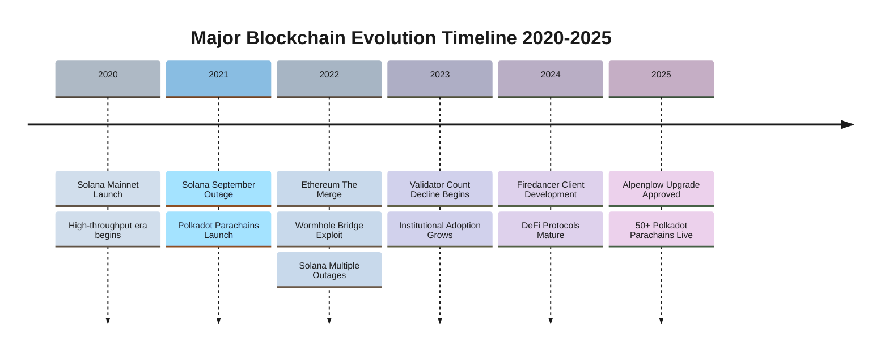
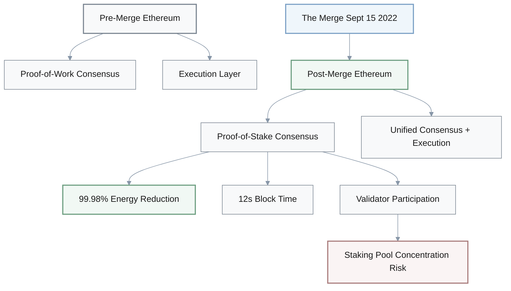
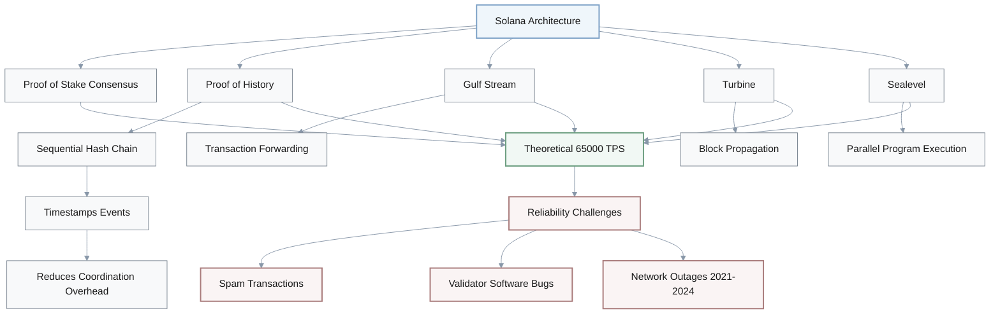
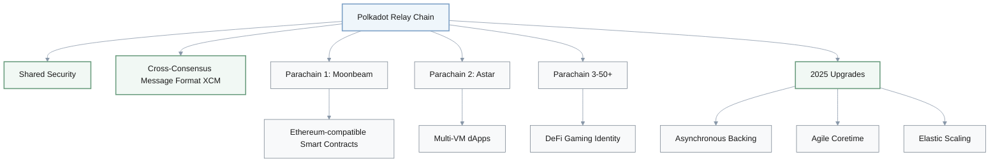
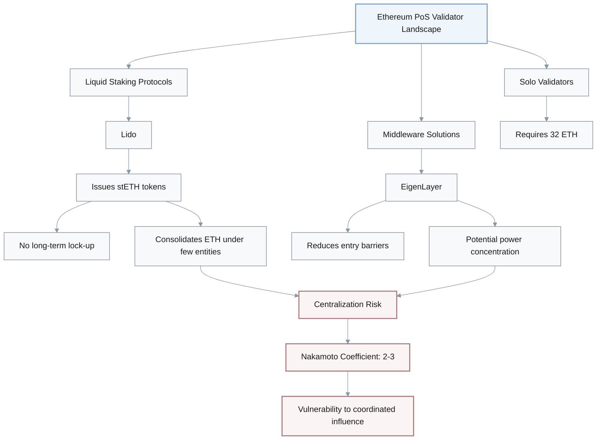
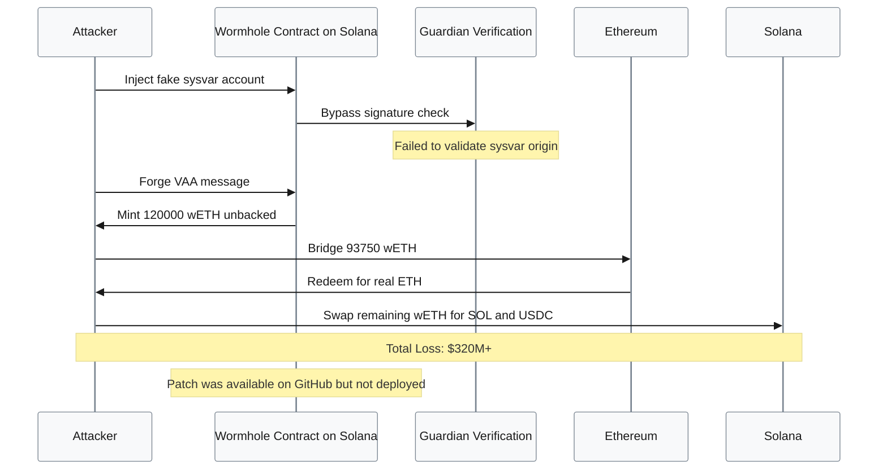
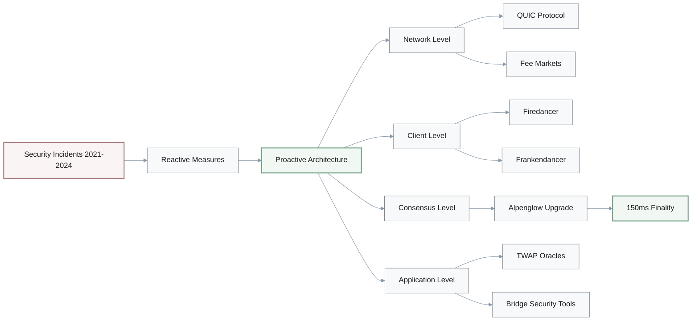
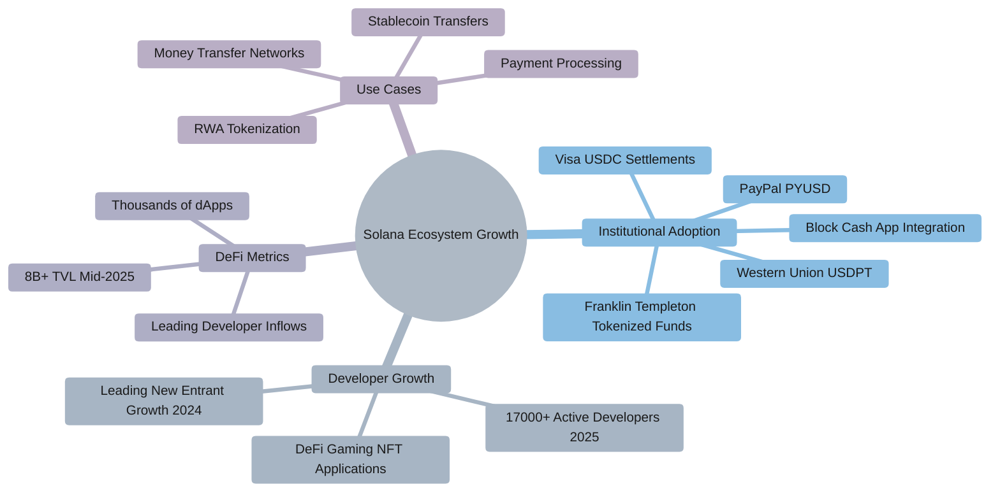
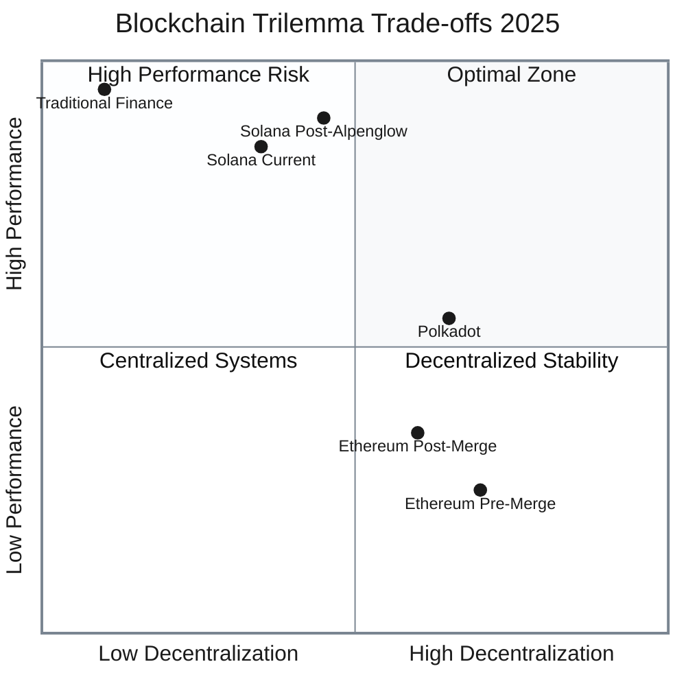

### Case Overview & Scope

This investigation explores the deep architectural intricacies and operational challenges of mainstream blockchain networks, including **Ethereum**, **Solana**, and **Polkadot**, with a primary focus on the period from **2020 to 2025**. These Layer 1 blockchains adopt varied consensus mechanisms and technological innovations to balance performance, security, and decentralization.



**Key Focus Areas:**
- **Ethereum's 2022 transition** from Proof-of-Work (PoW) to Proof-of-Stake (PoS) during "The Merge" radically diminished energy consumption by ~99.98%, altered validator participation, and enabled advanced scaling solutions, yet also induced concerns over validator concentration and staking liquidity dynamics
- **Solana**, known for its high throughput facilitated by Proof-of-History and parallel transaction execution, has grappled with persistent validator client software bugs, spam-driven outages, and network halts between 2021 and 2024
- **Cross-chain bridges**, exemplified by significant exploits like the 2022 Wormhole hack ($320M+ loss), expose systemic vulnerabilities in multi-chain interoperability due to trust assumptions and complex verification mechanisms

This case highlights the intertwined evolution of blockchain consensus architectures, validator ecosystems, and cross-chain interoperability infrastructure, revealing critical trade-offs and systemic risks. It provides strategic insights for product managers, architects, risk managers, and compliance officers in assessing operational resilience, governance decentralization, and security postures across heterogeneous blockchain networks in a rapidly evolving regulatory and technological landscape.

### Key Architectural Innovations and Challenges

The blockchain landscape has seen a proliferation of diverse architectural designs, each attempting to solve the fundamental **"blockchain trilemma"** of balancing decentralization, security, and scalability. Mainstream networks like Ethereum, Solana, and Polkadot have pursued distinct paths, leading to unique innovations and inherent challenges.

| Blockchain | Consensus Mechanism | Key Innovation | Throughput | Major Challenge |
|------------|---------------------|----------------|------------|-----------------|
| **Ethereum** | Proof-of-Stake | The Merge (2022) | ~30 TPS | Validator centralization |
| **Solana** | PoS + Proof-of-History | Parallel execution | ~65,000 TPS | Network outages & spam |
| **Polkadot** | Nominated PoS | Relay chain + Parachains | Variable | Cross-chain complexity |

#### Ethereum's Evolution to Proof-of-Stake
Ethereum underwent a pivotal transformation on **September 15, 2022**, when it transitioned from a Proof-of-Work (PoW) to a Proof-of-Stake (PoS) consensus mechanism, an event known as **"The Merge"**. This fundamental shift unified Ethereum's original execution layer with its new PoS consensus layer, terminating energy-intensive PoW mining.



**The Merge Impact:**
- **Energy consumption**: Reduced by ~99.98%
- **Block time**: Stabilized at 12 seconds
- **Validator dynamics**: New participation model via staking (32 ETH minimum)
- **Concerns**: Validator concentration and staking liquidity dynamics

#### Solana's High-Throughput Architecture and Challenges
Solana is engineered as a layer-1 blockchain platform prioritizing high transaction throughput and minimal fees, primarily for decentralized applications. Founded in **2017** by Anatoly Yakovenko, it launched its mainnet beta in **March 2020**, rapidly gaining adoption due to its capacity to process thousands of transactions per second.



**Solana's Core Technologies:**
- **Proof of History (PoH)**: Verifiable delay function encoding time as sequential hash chain, streamlining network synchronization
- **Gulf Stream**: Transaction forwarding mechanism
- **Turbine**: Block propagation protocol
- **Sealevel**: Parallel program execution engine enabling concurrent transaction processing

**Performance vs. Reliability Trade-off:**
Theoretical throughput of up to **65,000 TPS**, but encountered significant reliability challenges including multiple major and partial outages since launch, often triggered by network congestion from spam transactions, bot activity, or software bugs in validators.

#### Polkadot's Interoperability Model
Polkadot represents a foundational player in the multichain paradigm, offering a distinct approach to interoperability through its **relay chain and parachain model**. Parachains are sovereign blockchains that connect to the Polkadot relay chain, benefiting from shared security and native interoperability via the Cross-Consensus Message Format (XCM).



**Polkadot's Architecture Highlights:**
- **Relay Chain**: Central hub providing shared security to all parachains
- **Parachains**: 50+ sovereign blockchains (as of 2025) including Moonbeam and Astar
- **XCM Protocol**: Native cross-chain messaging for seamless interoperability
- **Recent Upgrades**: Asynchronous Backing, Agile Coretime, and Elastic Scaling for improved scalability

### Validator Dynamics and Network Reliability

The stability and decentralization of a blockchain network are profoundly influenced by its validator dynamics, which encompass the number, distribution, and incentives of the nodes that process and validate transactions. Both Solana and Ethereum have experienced significant shifts and debates surrounding these factors.

#### Solana's Validator Ecosystem Evolution
Solana's validator network has seen notable fluctuations and criticisms regarding its centralization and reliability, especially between **2021 and 2025**. The network experienced several major outages, particularly in 2021 and 2022, primarily stemming from software bugs in validator clients and overwhelming transaction volumes caused by spam or bot activity.

**Major Outage Events:**
| Date | Event | Cause | Duration | Impact |
|------|-------|-------|----------|--------|
| Sept 2021 | Grape Protocol IDO | Bot flood 400K TPS | 17 hours | Validator memory exhaustion |
| April 2022 | NFT Mint | 6M transaction requests/sec | 8 hours | Network consensus break |

**Validator Count Decline (2023-2025):**

$$
\text{Validator Decline Rate} = \frac{2500 - 900}{2500} \times 100 = 64\%
$$

```mermaid
%%{init: {
  "theme": "base",
  "themeVariables": {
    "primaryColor": "#f8f9fa",
    "primaryTextColor": "#1a1a1a",
    "primaryBorderColor": "#7a8591",
    "lineColor": "#8897a8",
    "secondaryColor": "#eff6fb",
    "tertiaryColor": "#f3f5f7"
  }
}}%%
xyChart-beta
  title Solana Validator Count 2023-2025
  x-axis [Early 2023, Mid 2023, Late 2023, Early 2024, Mid 2024, Late 2024, Nov 2025]
  y-axis "Number of Validators" 500 --> 2500
  line [2500, 2200, 1800, 1500, 1200, 1000, 900]
```

**Decline Factors:**
- **Solana Foundation**: Reduced SOL token loans to validators
- **Economic pressure**: Underperforming hardware became uneconomical
- **Transaction costs**: Validators required to submit thousands of daily transactions
- **Hardware requirements**: High-end CPUs and significant RAM limit participation

**Supporter Perspective:** Some argue the decline strengthens the network by removing low-quality or malicious validators that contributed to bottlenecks and sandwich attacks.

**Geographic Distribution:** Despite validator decline, geographical distribution remains diverse with validators spread across dozens of web hosting providers (30%+ in US).

**Future Improvements:**
- **Alpenglow consensus upgrade**: Expected to reduce validator resource requirements and improve finality times (12-13s → 150ms)
- **Firedancer initiative**: Jump Crypto's hybrid client (Frankendancer) deployed on single-digit percentage of validators, demonstrating hundreds of thousands TPS on testnet

#### Ethereum's PoS Validator Centralization Concerns
Ethereum's transition to Proof-of-Stake through The Merge on September 15, 2022, was designed to improve scalability, energy efficiency, and security. While it succeeded in reducing energy consumption by **99.98%** and made block times steady at **12 seconds**, concerns about validator centralization have emerged.

**Centralization Metrics:**
| Metric | Value | Interpretation |
|--------|-------|----------------|
| **Herfindahl Index** (Top 10) | 1009 | 19% less concentrated post-merge |
| **Nakamoto Coefficient** | 2-3 entities | Min entities to control 1/3 stake |
| **Minimum Stake** | 32 ETH | Entry barrier for solo validators |



**Key Dynamics:**
- **Lido**: Simplifies participation by issuing `stETH` tokens, allowing users to earn rewards without long-term lock-up constraints, but consolidates staked ETH under a few large entities
- **EigenLayer**: Middleware solution reducing entry barriers but potentially concentrating validator power
- **Trade-off**: Continuous balance between accessibility, profitability, and true decentralization in PoS environment

### Cross-Chain Interoperability and Security Vulnerabilities

The growing number of distinct blockchain ecosystems has made cross-chain interoperability a necessity, leading to the development of various protocols that enable the seamless exchange of data and assets. However, these solutions, particularly cross-chain bridges, have become significant targets for sophisticated attacks, exposing critical vulnerabilities within the broader Web3 ecosystem.

#### The Wormhole Bridge Exploit (February 2022)
One of the most prominent cross-chain incidents was the **Wormhole bridge exploit on February 2, 2022**, which resulted in a loss of **over $320 million**. Wormhole functions as a cross-chain messaging protocol connecting over 30 blockchains, including Ethereum, Solana, and Sui, supporting token and NFT transfers.



**Attack Flow:**
1. **Exploit**: Attacker bypassed guardian signature verification by injecting fake system account (`sysvar`)
2. **Validation Failure**: Wormhole contract failed to strictly validate the origin of system account
3. **Forgery**: Attacker forged Validator Action Approval (VAA) message
4. **Minting**: 120,000 unbacked wrapped ETH (`wETH`) tokens minted on Solana
5. **Extraction**: 93,750 `wETH` bridged to Ethereum and redeemed for real ETH
6. **Conversion**: Remaining tokens swapped for SOL and USDC on Solana

**Critical Context:** A patch for this vulnerability was **already available on GitHub** but had not been deployed by the Wormhole team, allowing exploitation of a known flaw.

**Response & Impact:**
- **Immediate Recovery**: Jump Trading fully reimbursed stolen funds within 24 hours
- **Trust Damage**: Many mistakenly attributed flaw to Solana's core protocol rather than application-layer smart contract
- **Security Measures**: Wormhole implemented strict sysvar validation and launched **$10M bug bounty** program via Immunefi
- **Lessons**: Highlighted fragility of bridges, need for comprehensive audits, and importance of timing patch releases with deployments

#### Broader Cross-Chain Bridge Security Concerns
The Wormhole exploit is not an isolated incident; cross-chain bridges have suffered **well over $2.5 billion in aggregate losses** from various attacks, with some surveys estimating more than **$2.9 billion in hacked value**, making them a significant security concern in the blockchain space.

**Major Cross-Chain Bridge Exploits:**
| Date | Bridge | Loss Amount | Attack Method | Recovery |
|------|--------|-------------|---------------|----------|
| Aug 2021 | Poly Network | $610M | Compromised smart contracts | Most assets returned |
| Feb 2022 | Wormhole | $320M | Signature verification bypass | Fully reimbursed by Jump Trading |
| Various | Multiple | $2.5-2.9B | Various vulnerabilities | Partial recovery |

**Attack Surface Categories:**
- **Access control vulnerabilities**: Insufficient permission checks
- **Inconsistent cross-chain semantics**: Different blockchain behavior assumptions
- **Smart contract flaws**: General programming errors
- **Trust assumptions**: Over-reliance on centralized components
- **Verification mechanisms**: Complex multi-chain validation logic

**Emerging Security Solutions:**

| Solution | Purpose | Key Features |
|----------|---------|--------------|
| **Xscope** | Automated detection | Documents new security bug classes |
| **Chainlink CCIP** | Secure messaging | Decentralized oracle network, rate limiting |
| **SmartAxe** | Vulnerability detection | Fine-grained static analysis, cross-chain data-flow graphs |

**Security Architecture Evolution:**
Cross-chain bridges, while essential for interoperability, introduce complex security issues due to their reliance on both on-chain smart contracts and off-chain programs. The ongoing development of frameworks like `SmartAxe` aims to identify vulnerabilities in bridge smart contracts via fine-grained static analysis, constructing cross-chain control-flow and data-flow graphs to find semantic inconsistencies. These efforts underscore the industry's shift towards more rigorous security analysis and design principles for interoperability solutions.

### Ecosystem Evolution and Future Outlook

The continuous evolution of blockchain architectures, coupled with learning from past security incidents, has led to significant advancements in ecosystem resilience and strategic approaches for future growth. Mainstream blockchains are actively implementing upgrades and fostering developer and institutional adoption to sustain their long-term vision.

#### Post-Incident Mitigations and Upgrades
Following numerous network outages and exploits, blockchain ecosystems have matured their security responses from reactive to more proactive measures.

**Solana's Security Evolution:**

| Mitigation Category | Specific Measures |
|---------------------|-------------------|
| **Network Layer** | UDP → QUIC networking, congestion resistance |
| **Resource Management** | Runtime transaction limits, memory usage guards |
| **Economic Design** | Local fee markets |
| **Client Diversity** | Firedancer client ($1M bug bounty), Frankendancer hybrid |
| **Consensus Upgrade** | Alpenglow (finality: 12-13s → 150ms) |
| **Validator Clients** | v1.17 series (ZK proof, congestion handling), Agave/Anza refinements |

**Cross-Chain Bridge Security Enhancements:**
- **Smart Contract Hardening**: Stringent sysvar validation, multi-signature controls for admin privileges
- **Economic Incentives**: Increased bug bounty programs (e.g., Wormhole $10M)
- **Formal Verification**: Static analysis tools like SmartAxe for vulnerability detection

**DeFi Protocol Lessons:**
| Attack Type | Example | Mitigation |
|-------------|---------|------------|
| Price Manipulation | Mango Markets, Nirvana Finance | TWAP oracles, withdrawal caps |
| Flash Loan Exploits | Various DeFi protocols | Time-delayed operations, flash loan detection |
| Wallet Security | Slope wallet breach | Eliminate plaintext logging, improved encryption |



**Ethereum Post-Merge Strategy:** Continues to focus on layer-2 scaling solutions and shard chains to further enhance throughput, leveraging its PoS foundation.

#### Institutional Adoption and Developer Growth
Solana has demonstrated robust ecosystem expansion, attracting significant institutional interest and developer talent.

**Institutional Adoption Timeline:**

| Date | Institution | Use Case | Significance |
|------|-------------|----------|--------------|
| 2023 | **Visa** | USDC settlements | Enterprise-scale payment processing |
| 2024 | **PayPal** | PYUSD stablecoin transfers | Major fintech integration |
| Early 2025 | **Franklin Templeton** | FOBXX tokenized fund ($1.2T AUM) | Real-world asset tokenization |
| Oct 2025 | **Western Union** | USDPT stablecoin launch | Global money transfer network |
| Early 2026 | **Block's Cash App** | USDC send/receive | Mainstream consumer adoption |



**Developer Growth Metrics:**
- **Active Developers**: 17,000+ by late 2025 (Electric Capital data)
- **Growth Rate**: Double-digit to high double-digit YoY growth
- **New Entrants**: Leading blockchain for new developer inflows in 2024
- **Application Areas**: DeFi, gaming, and NFTs

**Ecosystem Health Indicators:**
- **dApps**: Thousands of decentralized applications hosted
- **DeFi TVL**: Surpassed **$8 billion** in mid-2025
- **Developer Leadership**: Positioned as leading chain for developer attraction

#### Balancing Performance, Security, and Decentralization
The investigation reveals a continuous pursuit of balance among **performance**, **security**, and **decentralization** across mainstream blockchains — the fundamental **blockchain trilemma**.



**Trade-off Analysis by Blockchain:**

| Blockchain | Performance Emphasis | Security Approach | Decentralization Strategy |
|------------|---------------------|-------------------|---------------------------|
| **Solana** | High throughput priority | Validator quality > quantity | Client diversity (Firedancer) |
| **Ethereum** | Layer-2 scaling focus | PoS energy efficiency | Diverse staking solutions |
| **Polkadot** | Parachain flexibility | Shared relay chain security | Sovereign parachains |

**Key Learnings:**
1. **Solana's Journey**: High throughput can amplify attack vectors if not coupled with robust security measures
2. **Ethereum's Transition**: PoS improves energy efficiency but requires careful management of validator centralization risks
3. **Cross-Chain Interoperability**: Remains high-risk area demanding continuous innovation in bridge security models, formal verification, and proactive threat detection

**Maturing Industry Practices:**
- **Bug Bounties**: Multi-million dollar programs incentivizing vulnerability discovery
- **Transparent Postmortems**: Public disclosure of failures and fixes
- **Community-Driven Upgrades**: Decentralized governance for protocol improvements
- **Formal Verification**: Static analysis tools for smart contract security
- **Client Diversity**: Multiple implementations reducing single points of failure

The ongoing efforts across these ecosystems reflect a maturing industry dedicated to building secure, scalable, and trustworthy decentralized infrastructures for a broad range of applications. **The lessons learned from past failures are consistently integrated into future designs, shaping a more resilient blockchain landscape.**

Sources: 
[1] Xscope: Hunting for Cross-Chain Bridge Attacks, https://dl.acm.org/doi/10.1145/3551349.3559520
[2] An Event Study of the Ethereum Transition to Proof-of-Stake, https://arxiv.org/abs/2210.13655
[3] DeFiTainter: Detecting Price Manipulation Vulnerabilities in DeFi Protocols, https://dl.acm.org/doi/10.1145/3597926.3598124
[4] Ethereum vs Solana: A Comparative Study of Blockchain Architecture on Performance, Security, and Ecosystem Development, https://www.sciencedirect.com/science/article/pii/S1877050925026183
[5] Top 7 Blockchain Interoperability Projects to Watch in 2025 - Ju.com, https://blog.ju.com/top-7-blockchain-interoperability-projects/
[6] Solana's validator network is shrinking. The blockchain's supporters ..., https://www.dlnews.com/articles/defi/solana-supports-say-validator-network-is-decline-is-a-good-thing/
[7] Solana (blockchain platform) - Grokipedia, https://grokipedia.com/page/Solana_(blockchain_platform)
[8] Towards blockchain interoperability: a comprehensive survey on ..., https://www.sciencedirect.com/science/article/pii/S2096720925000132
[9] Solana's Security Journey: A Deep Dive into Challenges, Failures ..., https://medium.com/@0xFuhrer/solanas-security-journey-a-deep-dive-into-challenges-failures-and-evolution-66528bef0709
[10] History of Solana Security Incidents: A Deep Dive into Outages ..., https://medium.com/@rohitrohitgjpr/history-of-solana-security-incidents-a-deep-dive-into-outages-exploits-and-evolution-a2b9c4d5e4c3
[11] What is Solana (SOL) & How Does it Work? - Crypto.com, https://crypto.com/us/coins-ai/solana/what-is
[12] Solana (SOL) In-Depth Research: An Emerging Power in ... - Gate.com, https://www.gate.com/learn/articles/solana-sol-in-depth-research-an-emerging-power-in-the-blockchain-space/7996
[13] Solana and the SOL Market, https://papers.ssrn.com/sol3/papers.cfm?abstract_id=5117683
[14] Blockchain Interoperability—Foundations, https://link.springer.com/chapter/10.1007/978-3-032-03413-7_1
[15] Security Challenges, https://link.springer.com/chapter/10.1007/978-3-032-03413-7_2
[16] Wormhole, https://wormhole.com/
[17] Poly Network exploit - Wikipedia, https://en.wikipedia.org/wiki/Poly_Network_exploit
[18] Threat actors behind the Poly Network hack are returning stolen funds, https://securityaffairs.com/121057/hacking/poly-network-hackers.html
[19] Blockchain Without Barriers: An Authentic Guide to Blockchain Interoperability, https://link.springer.com/content/pdf/10.1007/978-3-032-03413-7.pdf
[20] Addressing security issues and future prospects of web 3.0, https://ieeexplore.ieee.org/abstract/document/9908800/
[21] Network Performance Report: October 2022 - Solana, https://solana.com/news/network-performance-report-october-2022
[22] Solana Security: A History of Incidents, Vulnerabilities, and ..., https://open.substack.com/pub/killy7/p/solana-security-a-history-of-incidents?r=8778d&utm_campaign=post&utm_medium=web&showWelcomeOnShare=true
[23] Solana Ecosystem 2025: How It Evolved from ... - Paragraph, https://paragraph.com/@discussion-on-encryption-field/solana-ecosystem-2025-how-it-evolved-from-ethereums-high-speed-alternative-to-mature-infrastructure
[24] A Complete Guide to Polkadot Bridges, http://blog.sprinter.tech/polkadot-bridges/
[25] Incentivizing Blockchain Participation Through Task Assignment Mechanisms: Evidence From a Natural Experiment of Consensus Protocols on Ethereum, https://onlinelibrary.wiley.com/doi/abs/10.1002/joom.1358
[26] Trust Without Intermediaries: A Programmable Risk Management Framework for the Future, https://papers.ssrn.com/sol3/papers.cfm?abstract_id=5615795
[27] Security assessment of blockchain infrastructure and applications, https://theses.lib.polyu.edu.hk/handle/200/13805
[28] Polkadot Upgrade 2025: What You Need to Know, https://www.parity.io/blog/polkadot-upgrade-2025-what-you-need-to-know
[29] Solana’s Struggle, https://www.semanticscholar.org/paper/c58b29369a4e31c8d43995f0572f00f7d95de1d0
[30] Security of cross-chain bridges: Attack surfaces, defenses, and open problems, https://dl.acm.org/doi/abs/10.1145/3678890.3678894
[31] A Complete History of Solana Outages: Causes and Fixes - Helius, https://www.helius.dev/blog/solana-outages-complete-history
[32] Blockchain Transaction Fee and Ethereum Merge, https://linkinghub.elsevier.com/retrieve/pii/S1544612323008796
[33] The Ethereum Merge: A Defining Moment in Blockchain History, https://medium.com/coinmonks/the-ethereum-merge-a-defining-moment-in-blockchain-history-637e64cd847a
[34] [PDF] A Comprehensive Overview of Security Vulnerability Penetration ..., https://www.authorea.com/users/674544/articles/672844/master/file/data/A_Comprehensive_Overview_of_Security_Vulnerability_Penetration_Methods_in_Blockchain_Cross_Chain_Bridges__1_/A_Comprehensive_Overview_of_Security_Vulnerability_Penetration_Methods_in_Blockchain_Cross_Chain_Bridges__1_.pdf
[35] SoK: Cross-Chain Bridging Architectural Design Flaws and Mitigations, https://www.sciencedirect.com/science/article/pii/S2096720925000429
[36] Ethereum - Wikipedia, https://en.wikipedia.org/wiki/Ethereum
[37] Ethereum: Beyond The Merge, https://www.semanticscholar.org/paper/a9cddfac6eab512cbf9b14c27509c2b2788bd1fd
[38] Revoke: Mitigating Ransomware Attacks Against Ethereum Validators, https://www.semanticscholar.org/paper/dc6598a762e2f8e127e824fc19f422554c348e7e
[39] Analyzing the role of bridges in cross-chain mev extraction, https://wwwmatthes.in.tum.de/file/8o5tgvhfgln4/Sebis-Public-Website/-/Master-s-Thesis-Danut-Ilisei/Master_s_Thesis_Danut_Ilisei.pdf
[40] CrossGuardian: A security domain isolation model for cross-chain gateway, https://ieeexplore.ieee.org/abstract/document/11142616/
[41] Cross Chain Collaboration, https://www.semanticscholar.org/paper/54e9cf07c1a769d478919ee99e71d9aac69a752b
[42] Enhancing XCMP Interoperability Across Polkadot Paraverse, https://ieeexplore.ieee.org/document/10174872/
[43] Bitcoin Cross-Chain Bridge: A Taxonomy and Its Promise in Artificial Intelligence of Things, https://arxiv.org/abs/2509.10413
[44] Piecing Together the Jigsaw Puzzle of Transactions on Heterogeneous Blockchain Networks, https://www.semanticscholar.org/paper/934f01b80bac9dac2572993e4298cb8fa43857c2
[45] SmartAxe: Detecting Cross-Chain Vulnerabilities in Bridge Smart Contracts via Fine-Grained Static Analysis, https://arxiv.org/abs/2406.15999
[46] Intrusion Detection System to Detect Wormhole Using Fault Localization Techniques, https://www.semanticscholar.org/paper/c5e0ea59a8285768bd15a3a46cdfc3bb62e7eb29
[47] KADetector: Automatic Identification of Key Actors in Online Hack Forums Based on Structured Heterogeneous Information Network, https://ieeexplore.ieee.org/document/8588787/
[48] Decentralized Finance and Cross-Chain Interoperable Automated Market Maker - Using BlockChain, https://www.semanticscholar.org/paper/54082739d6acf5f0ebd80e8ac650955599b56c17
[49] CCP: Conflicts Check Protocol for Bitcoin Block Security, https://arxiv.org/abs/1802.09860
[50] SoK: Security of Cross-chain Bridges: Attack Surfaces, Defenses, and Open Problems, https://arxiv.org/abs/2312.12573
[51] Enabling Trustable Financing: A Verifiable Privacy-Preserving Cross-Chain Protocol, https://ieeexplore.ieee.org/document/10693771/
[52] Quasi-experimental research and spillover effects on Ethereum Merge, https://www.tandfonline.com/doi/full/10.1080/13504851.2024.2308587
[53] Formal Modeling and Verification of Validator Voluntarily Exit in Ethereum 2.0 Beacon Chain, https://www.semanticscholar.org/paper/06d78318946bb74c5441ff1d176c9c319e63cd24
[54] Chainlink CCIP Explained: Complete Cross-Chain Interoperability ..., https://levex.com/en/blog/chainlink-ccip-guide
[55] Chainlink CCIP - Cross-Chain Interoperability Protocol, https://docs.chain.link/ccip
[56] Solana vs. Ethereum: Performance, Architecture, and Potential, https://www.ledger.com/academy/topics/crypto/solana-vs-ethereum-performance-guide
[57] Mitigating Challenges in Ethereum's Proof-of-Stake Consensus: Evaluating the Impact of EigenLayer and Lido, https://arxiv.org/abs/2410.23422
[58] The Ethereum Merge: What It Is and Why It Is Important | Insights, https://www.hklaw.com/en/insights/publications/2022/09/the-ethereum-merge-what-it-is-and-why-it-is-important
[59] Centralization Risks for Post-Merge Ethereum - The Tie, https://www.thetie.io/insights/research/centralization-risks-for-ethereum/
[60] Wormhole Hack: Lessons From The Wormhole Exploit - Chainalysis, https://www.chainalysis.com/blog/wormhole-hack-february-2022/
[61] A Technical Assessment Of Solana Protocol Opportunities (And ..., https://www.rockawayx.com/insights/a-technical-assessment-of-solana-protocol-opportunities-and-current-progress
[62] From AWS outages to a $19.3 billion liquidation storm, the "invisible ..., https://www.panewslab.com/en/articles/d2ded66e-9e18-40af-b396-921c40af96a8
[63] A Deep Dive into Solana's Security Journey: Incidents, Impacts, and ..., https://paragraph.com/@mantuametrics/a-deep-dive-into-solanas-security-journey-incidents-impacts-and-lessons-learned
[64] Solana Network Health Report: June 2025, https://solana.com/nl/news/network-health-report-june-2025
