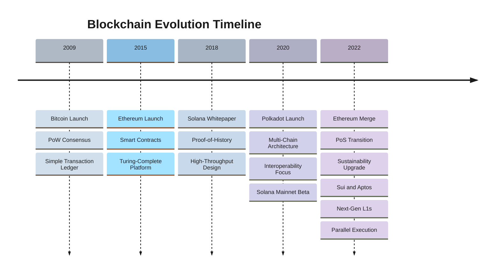
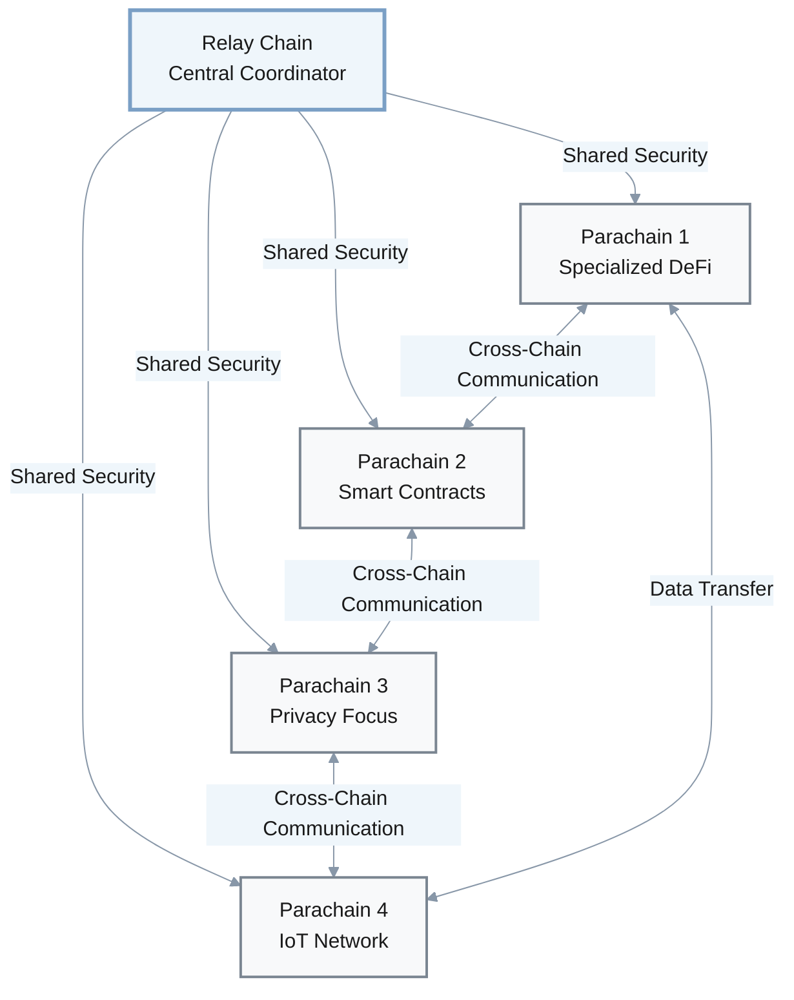
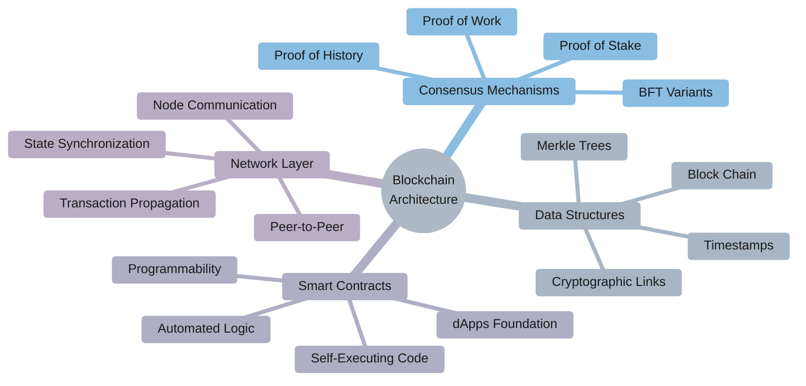
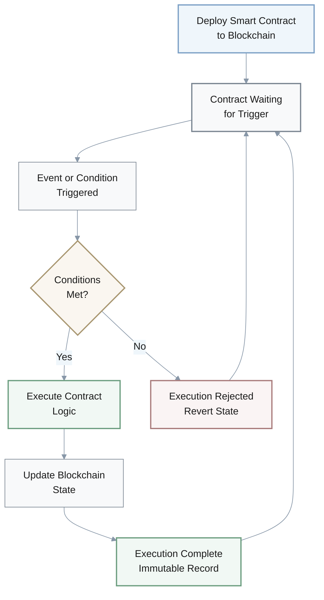
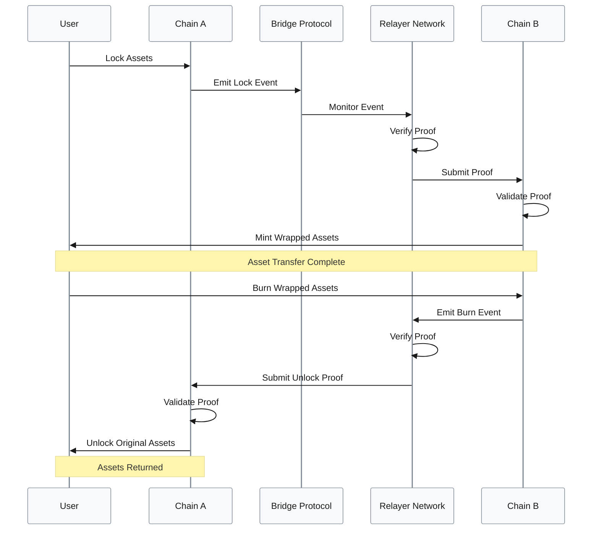
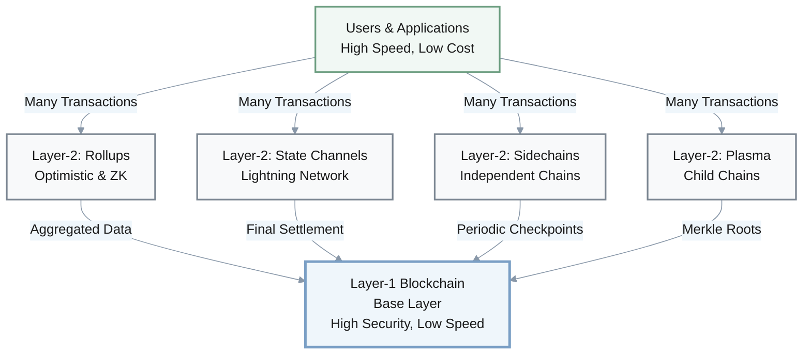
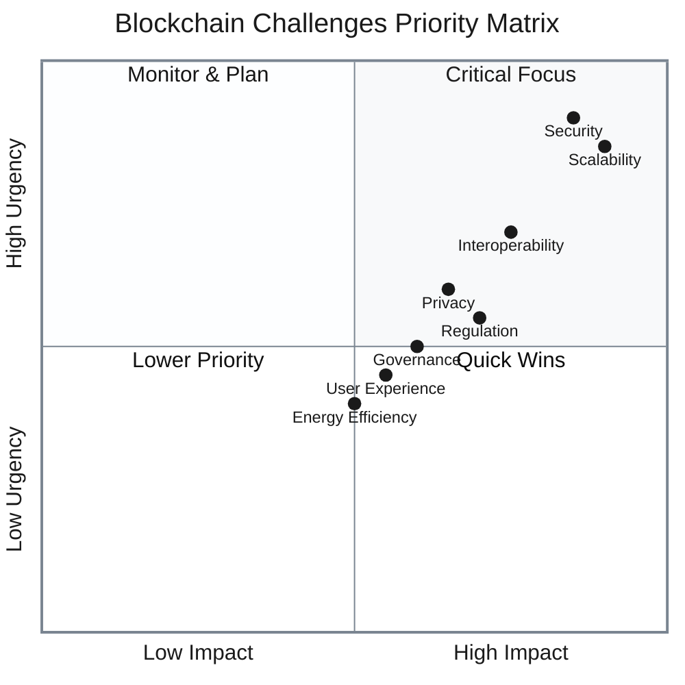

### 1. Introduction to Blockchain Deep Architecture

Blockchain technology has emerged as a transformative force in modern society, fundamentally reshaping paradigms around trust, transparency, and decentralization across various sectors. Its foundational principles revolve around creating a distributed, append-only ledger that securely records transactions or digital events shared among participating parties.

#### Key Characteristics

- **Decentralization**: No single point of control; distributed across network nodes
- **Immutability**: Past records are tamper-resistant and tamper-evident under proper consensus
- **Time-stamped Data**: All transactions recorded with verifiable timestamps
- **Consensus Mechanisms**: Agreement protocols ensure network-wide consistency
- **Traceability**: Complete audit trail of all transactions
- **Programmability**: Smart contracts enable complex logic execution
- **Data Integrity**: Strong cryptographic guarantees for data blocks

This innovative design has garnered significant attention from financial institutions, technology firms, and government agencies seeking to leverage its capabilities for diverse applications. Understanding the deep architecture of these systems is crucial for stakeholders aiming to develop, invest in, or regulate blockchain-based solutions.

### 2. Foundational Blockchain Architectures and Evolution

The evolution of blockchain architecture began with the pioneering work of Bitcoin, subsequently diversified by platforms like Ethereum, and further advanced by high-performance networks such as Solana, Polkadot, Sui, and Aptos. This trajectory illustrates a shift from isolated, monolithic blockchains towards interconnected, heterogeneous ecosystems, each addressing specific challenges and optimizing for different use cases.

#### Platform Comparison

| Platform | Launch Year | Consensus | Key Innovation | Primary Focus |
|----------|-------------|-----------|----------------|---------------|
| Bitcoin | 2009 | PoW | Decentralized Ledger | Security & Censorship Resistance |
| Ethereum | 2015/2022 | PoW → PoS | Smart Contracts | Programmability & dApps |
| Solana | 2020 | PoH + PoS | High Throughput | Speed & Scalability |
| Polkadot | 2020 | Nominated PoS | Multi-Chain | Interoperability |
| Sui/Aptos | 2022+ | BFT Variants | Parallel Execution | Next-Gen Performance |

#### 2.1. Bitcoin: The Genesis of Blockchain

Bitcoin, introduced in 2009, established the seminal blockchain architecture, featuring a decentralized ledger designed to be practically immutable under majority-hash assumptions and secured by a Proof-of-Work (PoW) consensus mechanism.

**Key Features:**
- **Security Model**: Complex computational puzzles ensure network integrity
- **Decentralization**: Shared data structure maintained consistently across all nodes
- **Censorship Resistance**: No single authority can control or modify transactions
- **Immutability**: Transaction history practically unchangeable under majority-hash assumptions

**Trade-offs:**
- Limited transaction throughput
- High energy consumption
- Constrained scalability for high-volume applications

Despite these limitations, Bitcoin laid the groundwork for secure, trustless computing systems and remains a benchmark for decentralization and security.

---

#### 2.2. Ethereum: Smart Contracts and Programmability

Ethereum, launched in 2015, marked a significant architectural leap by introducing Turing-complete smart contracts, transforming blockchain from a mere digital currency ledger into a programmable platform.

**Architectural Innovations:**
- **Smart Contracts**: Self-executing code with complex logic
- **dApps Platform**: Decentralized applications with diverse functionality
- **Turing-Complete**: Full computational capabilities on-chain
- **The Merge (2022)**: Transition from PoW to PoS consensus

**Benefits of PoS Transition:**
- Drastically reduced energy consumption
- Improved security and economic properties
- Enabled rollup-centric scaling approach
- Foundation for future sharding implementation

Ethereum is often conceptualized as "the internet of the blockchain" due to its versatile design and ability to host a wide array of applications.

### 3. Emerging High-Performance and Interoperable Architectures

The demand for higher transaction throughput and seamless cross-chain communication has driven the development of new blockchain architectures, exemplified by platforms like Solana, Polkadot, Sui, and Aptos. These networks introduce novel consensus mechanisms and structural designs to push the boundaries of blockchain performance and integration.

#### 3.1. Solana: High Throughput with Proof-of-History

Solana was first proposed in a 2018 white paper, and its mainnet beta launched in March 2020; it is specifically engineered to achieve high scalability while aiming to maintain decentralization and security.

**Proof-of-History (PoH) Innovation:**
- **Verifiable Delay Function**: Creates cryptographically secure, high-frequency clock
- **Transaction Pre-ordering**: Orders transactions before consensus
- **Combined with PoS**: PoH enables more efficient PoS consensus
- **High Throughput**: ~2,812 TPS average under real-network conditions

**Performance Comparison:**

| Metric | Bitcoin | Ethereum | Solana |
|--------|---------|----------|--------|
| Average TPS | 7 | 15-30 | ~2,812 |
| Consensus | PoW | PoS | PoH + PoS |
| Block Time | ~10 min | ~12 sec | ~400 ms |

**Ideal Use Cases:**
- Internet of Things (IoT) applications
- Internet of Medical Things (IoMT)
- High-frequency trading platforms
- Real-time gaming applications
- Low-latency financial services

Academic and industry studies suggest that Solana can successfully achieve high TPS rates, potentially enabling broader adoption of blockchain in IoT contexts by overcoming performance bottlenecks.

#### 3.2. Polkadot: Multi-Chain Interoperability

Polkadot introduces a sophisticated heterogeneous multi-chain architecture designed to foster interoperability and shared security among diverse blockchains.

**Key Architectural Components:**
- **Relay Chain**: Central coordinator providing shared security
- **Parachains**: Independent blockchains with specialized functionalities
- **Shared Security Model**: All parachains benefit from collective security
- **Cross-Chain Communication**: Seamless data and asset transfers

**Advantages:**
- Addresses scalability challenges through sharding
- Eliminates blockchain isolation
- Specialized chains for specific use cases
- Pattern-oriented governance for trustworthiness
- Robust framework for interoperability

This layered approach to blockchain governance and interoperability provides a robust framework for future blockchain architecture design.

#### 3.3. Sui and Aptos: Next-Generation High-Performance L1s

Sui and Aptos represent newer entrants in the blockchain landscape, focusing on further advancements in high performance and optimized consensus mechanisms. These Layer-1 blockchains are being developed to leverage novel parallel execution capabilities and Byzantine fault-tolerant protocols to cater to decentralized applications requiring exceptionally low latency and high scalability. Built on cutting-edge research, Sui and Aptos aim to provide infrastructure that can support a new generation of Web3 applications, emphasizing efficiency and speed in transaction processing. Their architectures often incorporate innovations derived from prior blockchain experiences, pushing the boundaries of what is possible in terms of throughput and developer experience.

### 4. Core Architectural Components

Despite their diverse implementations, all blockchain networks share fundamental architectural components that define their functionality and characteristics.

---

#### 4.1. Consensus Mechanisms

Consensus mechanisms are the bedrock of blockchain technology, ensuring that all participating nodes agree on the validity and order of transactions, thereby maintaining a consistent and secure shared ledger.

**Consensus Algorithm Comparison:**

| Mechanism | Used By | Strengths | Weaknesses | Energy Efficiency |
|-----------|---------|-----------|------------|-------------------|
| **PoW** | Bitcoin | High security, Battle-tested | Low TPS, High energy | Very Low |
| **PoS** | Ethereum | Energy efficient, Scalable | Potential centralization | High |
| **PoH + PoS** | Solana | Very high TPS, Low latency | Newer, Less tested | High |
| **Nominated PoS** | Polkadot | Shared security, Interoperable | Complex governance | High |
| **BFT Variants** | Sui/Aptos | Parallel execution, Fast finality | Emerging technology | High |

**Key Trade-offs:**
- **Decentralization** ↔ **Scalability**: More nodes often means slower consensus
- **Security** ↔ **Performance**: Enhanced security checks reduce throughput
- **Energy Efficiency** ↔ **Attack Resistance**: PoW's high energy use provides strong security

The continuous evolution of consensus algorithms reflects ongoing efforts to balance the core properties of blockchain systems.

#### 4.2. Data Structures

The fundamental data structure of a blockchain is a chain of cryptographically linked blocks, each containing a set of validated transactions.

```mermaid
%%{init: {
  "theme": "base",
  "themeVariables": {
    "primaryColor": "#f8f9fa",
    "primaryTextColor": "#1a1a1a",
    "primaryBorderColor": "#7a8591",
    "lineColor": "#8897a8",
    "secondaryColor": "#eff6fb",
    "tertiaryColor": "#f3f5f7"
  }
}}%%
graph LR
    GB[Genesis Block<br/>Block 0<br/>Timestamp: T0<br/>Prev Hash: 0x000]
    B1[Block 1<br/>Transactions<br/>Timestamp: T1<br/>Prev Hash: GB_Hash]
    B2[Block 2<br/>Transactions<br/>Timestamp: T2<br/>Prev Hash: B1_Hash]
    B3[Block 3<br/>Transactions<br/>Timestamp: T3<br/>Prev Hash: B2_Hash]
    BN[Block N<br/>Transactions<br/>Timestamp: TN<br/>Prev Hash: BN-1_Hash]
    
    GB -->|Cryptographic Link| B1
    B1 -->|Cryptographic Link| B2
    B2 -->|Cryptographic Link| B3
    B3 -.->|Chain Continues| BN
    
    style GB fill:#eff6fb,stroke:#7a9fc5,stroke-width:2px,color:#1a1a1a
    style B1 fill:#f8f9fa,stroke:#7a8591,stroke-width:2px,color:#1a1a1a
    style B2 fill:#f8f9fa,stroke:#7a8591,stroke-width:2px,color:#1a1a1a
    style B3 fill:#f8f9fa,stroke:#7a8591,stroke-width:2px,color:#1a1a1a
    style BN fill:#f8f9fa,stroke:#7a8591,stroke-width:2px,color:#1a1a1a
```

**Block Components:**
- **Block Header**: Contains metadata and cryptographic hash
- **Transactions**: Set of validated transactions
- **Timestamp**: When the block was created
- **Previous Hash**: Cryptographic link to previous block
- **Merkle Root**: Hash of all transactions in the block

**Immutability Properties:**
- Altering any block requires re-calculating all subsequent blocks
- Attacker must control majority of network's hash power (PoW)
- Tampering becomes computationally infeasible
- Each block timestamped and cryptographically secured
- Historical record difficult to modify retroactively

This robust data structure is central to the credibility and trustworthiness that blockchain technology offers to its users.

#### 4.3. Smart Contracts

Smart contracts, largely pioneered by Ethereum, are self-executing contracts with the terms of the agreement directly written into code.

**Key Features:**
- **Self-Executing**: Automatically runs when conditions are met
- **No Intermediaries**: Eliminates need for trusted third parties
- **Immutable**: Once deployed, code cannot be changed
- **Transparent**: All contract logic is publicly visible
- **Deterministic**: Same inputs always produce same outputs

**Application Domains:**

| Domain | Use Cases | Benefits |
|--------|-----------|----------|
| Finance | DeFi, Lending, Trading | Automated settlements, No intermediaries |
| Healthcare | Patient records, Data sharing | Privacy, Interoperability |
| Supply Chain | Tracking, Verification | Traceability, Transparency |
| IIoT | Device management, Data exchange | Security, Trust |
| Gaming | NFTs, In-game assets | Ownership, Portability |

**Security Considerations:**
- Careful design required to prevent exploits
- Code auditing essential before deployment
- Vulnerabilities can lead to significant losses
- Formal verification recommended for critical contracts
- Upgradeability patterns require careful implementation

### 5. Interoperability and Cross-Chain Solutions

As the blockchain ecosystem matured, the isolated nature of early networks became a significant limitation, leading to a strong emphasis on interoperability and cross-chain communication solutions. The ability for different blockchains to communicate and exchange value is vital for the continued growth and broad adoption of the technology.

#### 5.1. The Need for Interoperability

The proliferation of various blockchain platforms, each developed with different technologies, consensus mechanisms, and functionalities, highlighted the inherent limitations of standalone ledgers. Without the ability for different ledgers to interact with each other and with legacy systems, blockchain technology struggled to meet the complex demands of modern applications. Interoperability, defined as the ability of blockchains to communicate and interact, became essential for building integrated patient profiles in healthcare, for secure and trustworthy industrial operations, and for realizing the full potential of a decentralized web. It is a critical factor for achieving a seamless and interconnected blockchain ecosystem.

#### 5.2. Cross-Chain Bridges and Protocols

Cross-chain bridges and protocols are architectural solutions designed to enable communication and asset transfer between distinct blockchain networks.

**Bridge Components:**
- **Lock/Mint Mechanism**: Assets locked on source chain, minted on destination
- **Relayer Network**: Monitors and relays cross-chain messages
- **Proof System**: Cryptographic proofs verify cross-chain events
- **Smart Contracts**: Handle locking, minting, burning operations

**Security Challenges:**

| Risk Type | Description | Mitigation |
|-----------|-------------|------------|
| **Centralization** | Single point of failure | Decentralized validator sets |
| **Smart Contract Bugs** | Vulnerable contract code | Formal verification, Audits |
| **Relay Attacks** | Malicious or compromised relayers | Multi-signature validation |
| **Consensus Mismatch** | Different finality guarantees | Wait for sufficient confirmations |

**Security Incidents:**
- Bridge attacks have resulted in substantial losses
- Vulnerabilities in smart contracts and relay schemes
- Centralization of trust in bridge operators

**Future Directions:**
- Secure General Message Passing protocols
- Abstraction layers for universal communication
- Standardized interoperability solutions
- Enhanced threat models and vulnerability classification

#### 5.3. Layer-2 Solutions

Layer-2 protocols represent another critical architectural approach to address the scalability limitations of Layer-1 blockchains.

**Layer-2 Protocol Types:**

| Type | Mechanism | Trust Model | Use Cases |
|------|-----------|-------------|-----------|
| **Optimistic Rollups** | Fraud proofs | Trust with verification | General-purpose dApps |
| **ZK Rollups** | Zero-knowledge proofs | Cryptographic security | Payments, DEX |
| **State Channels** | Off-chain state updates | Bilateral trust | High-frequency payments |
| **Sidechains** | Independent blockchain | Separate consensus | Specialized applications |
| **Plasma** | Child chain trees | Operator trust | High-volume transactions |

**Benefits:**
- **Higher Throughput**: Process thousands of transactions per second
- **Lower Costs**: Reduced transaction fees by orders of magnitude
- **Faster Finality**: Near-instant transaction confirmation
- **Maintained Security**: Inherit security from Layer-1

**Layer-1 Role:**
- Trust establishment foundation
- Dispute resolution mechanism
- Final settlement layer
- Security anchor point

Various Layer-2 protocols offer diverse solutions that transform blockchain scalability by boosting transaction processing capabilities while maintaining the security guarantees of the underlying Layer-1 blockchain.

---

### 6. Security, Challenges, and Future Directions

The inherent security properties of blockchain technology, coupled with its architectural evolution, present both profound opportunities and complex challenges that continue to shape its future trajectory.

#### 6.1. Security Aspects in Blockchain Architectures

Blockchain technology inherently offers robust security features due to its decentralized, transparent, and append-only nature. For well-designed and sufficiently decentralized networks, data once recorded is exceptionally difficult and costly to alter, providing a high degree of integrity and trustworthiness. However, as blockchain networks become integral to critical infrastructure, such as the industrial Internet of Things (IIoT), the need for enhanced security measures and attestations becomes paramount. Attestation architectures, which allow nodes to provide verifiable evidence of their configuration and operational state, are being developed to ensure the trustworthiness and resilience of blockchain networks, particularly in cloud-based deployments using virtualization and containerization. Despite these advancements, the interconnectedness enabled by cross-chain solutions introduces new security risks, requiring careful analysis and the implementation of countermeasures to protect against vulnerabilities in inter-blockchain communication.

#### 6.2. Key Challenges

Despite its revolutionary potential, blockchain technology still faces several significant challenges.

**Challenge Breakdown:**

| Challenge | Current State | Impact | Solutions in Development |
|-----------|---------------|--------|--------------------------|
| **Scalability** | 7-3000 TPS | High | Layer-2, Sharding, New consensus |
| **Interoperability** | Fragmented ecosystem | High | Bridges, Standards, Abstraction layers |
| **Governance** | Complex & inefficient | Medium | DAOs, Voting mechanisms, Pattern frameworks |
| **Privacy** | Limited privacy | Medium | ZK-proofs, Confidential transactions |
| **Regulation** | Unclear frameworks | High | Industry collaboration, Legal frameworks |
| **Energy** | PoW high consumption | Medium | PoS adoption, Green mining |

**Detailed Analysis:**

1. **Scalability**
   - Low transaction rates hinder adoption
   - High processing latencies
   - Solutions: Layer-2 protocols, Solana's PoH, Sharding
   - Challenge: Massive scale without sacrificing decentralization

2. **Interoperability**
   - Fragmented ecosystem
   - Difficult cross-chain communication
   - Solutions: Bridges, protocols, abstraction layers
   - Challenge: Security risks and complexity

3. **Governance**
   - Complex decentralized decision-making
   - On-chain vs off-chain tensions
   - Solutions: Pattern-oriented frameworks, improved voting
   - Challenge: Balance decentralization with efficiency

4. **Privacy and Regulation**
   - Transparency vs privacy trade-offs
   - Evolving legal landscapes
   - Solutions: Zero-knowledge proofs, regulatory collaboration
   - Challenge: Compliance while maintaining decentralization

#### 6.3. Future Trends and Directions

The future of blockchain technology points towards a more integrated, efficient, and versatile ecosystem, with continuous advancements addressing current limitations.

```mermaid
%%{init: {
  "theme": "base",
  "themeVariables": {
    "primaryColor": "#f8f9fa",
    "primaryTextColor": "#1a1a1a",
    "primaryBorderColor": "#7a8591",
    "lineColor": "#8897a8",
    "secondaryColor": "#eff6fb",
    "tertiaryColor": "#f3f5f7"
  }
}}%%
graph TD
    Current[Current State<br/>2024]
    
    Scale[Enhanced Scalability<br/>100K+ TPS]
    Inter[Seamless Interoperability<br/>Universal Standards]
    Apps[Broader Applications<br/>Beyond Finance]
    Balance[Optimized Balance<br/>Decentralization-Security-Scalability]
    
    Current --> Scale
    Current --> Inter
    Current --> Apps
    Current --> Balance
    
    Scale --> Tech1[Advanced Consensus<br/>Sui, Aptos]
    Scale --> Tech2[Mature Layer-2<br/>Rollups, Channels]
    
    Inter --> Tech3[Standardized Protocols<br/>Cross-Chain Communication]
    Inter --> Tech4[Abstraction Layers<br/>Universal Bridges]
    
    Apps --> Use1[Supply Chain<br/>Traceability]
    Apps --> Use2[Healthcare<br/>Data Interoperability]
    Apps --> Use3[Digital Governance<br/>Transparent Systems]
    Apps --> Use4[Industrial IoT<br/>Secure Operations]
    Apps --> Use5[Space Exploration<br/>Satellite Communication]
    
    Balance --> Model1[Hybrid Models<br/>Public-Private]
    Balance --> Model2[Decentralization Spectrum<br/>Flexible Architectures]
    
    style Current fill:#eff6fb,stroke:#7a9fc5,stroke-width:3px,color:#1a1a1a
    style Scale fill:#f1f8f4,stroke:#6b9d7f,stroke-width:2px,color:#1a1a1a
    style Inter fill:#f1f8f4,stroke:#6b9d7f,stroke-width:2px,color:#1a1a1a
    style Apps fill:#f1f8f4,stroke:#6b9d7f,stroke-width:2px,color:#1a1a1a
    style Balance fill:#f1f8f4,stroke:#6b9d7f,stroke-width:2px,color:#1a1a1a
```

**Key Future Directions:**

| Area | Current Status | Future Vision | Timeline |
|------|----------------|---------------|----------|
| **Scalability** | 7-3K TPS | 100K+ TPS | 2-5 years |
| **Interoperability** | Fragmented | Universal standards | 3-5 years |
| **Applications** | Finance-focused | Cross-industry adoption | 5-10 years |
| **Governance** | Experimental | Mature frameworks | 3-7 years |
| **Energy** | Mixed efficiency | Universal green consensus | 2-5 years |

**1. Enhanced Scalability and Performance**
- Next-gen consensus algorithms (Sui, Aptos, future innovations)
- Maturation of Layer-2 solutions
- Vastly improved transaction throughput
- Sub-second finality for all transactions
- Enabling demanding applications: gaming, IoT, real-time finance

**2. Seamless Interoperability**
- Secure, standardized cross-chain protocols
- Robust abstraction layers for universal communication
- Truly interconnected digital economy
- Reduced fragmentation across blockchain ecosystems
- Native multi-chain applications

**3. Broader Application Domains**
- **Supply Chain**: End-to-end traceability and transparency
- **Healthcare**: Integrated patient profiles, secure data sharing
- **Digital Governance**: Transparent, auditable public systems
- **Industrial IoT**: Secure, trustworthy device operations
- **Space Exploration**: Satellite command and data communication
- **Digital Identity**: Self-sovereign identity systems
- **Environmental**: Carbon credit tracking, sustainability metrics

**4. Balancing Core Principles**
- Navigate decentralization-security-scalability trilemma
- Hybrid public-private blockchain models
- Decentralization as a spectrum, not binary
- Optimized architectures for specific use cases
- New governance models for long-term sustainability

> **Note**: These developments underscore the dynamic and evolving nature of blockchain technology, paving the way for novel use cases and further advancements across multiple industries and domains.

---

Sources: 
[1] A Survey on Blockchain Technology: Evolution, Architecture and Security, https://ieeexplore.ieee.org/document/9402747/
[2] Blockchain technology and application: an overview, https://peerj.com/articles/cs-1705/
[3] A blockchain-based architecture for secure and trustworthy operations in the industrial Internet of Things, https://www.sciencedirect.com/science/article/pii/S2452414X20300650
[4] Blockchain oracles: State-of-the-art and research directions, https://ieeexplore.ieee.org/abstract/document/9801856/
[5] SoK on Blockchain Evolution and a Taxonomy for Public Blockchain Generations, https://papers.ssrn.com/sol3/papers.cfm?abstract_id=4377849
[6] Blockchain entrepreneurs’ survey: Blockchain architecture, https://www.oecd.org/en/publications/the-digital-transformation-of-smes_bdb9256a-en.html
[7] Expounding the Blockchain Architecture, https://www.taylorfrancis.com/books/9781003094210/chapters/10.1201/9781003094210-1
[8] Exploring Blockchain Data Analysis and Its Communications Architecture: Achievements, Challenges, and Future Directions: A Review Article., https://pdfs.semanticscholar.org/bb38/b231c7f38f4c32ff528e10d2856e9c8cc853.pdf
[9] The Future of Blockchain Tech in Transactional Business., https://upg-bulletin-se.ro/wp-content/uploads/2023/04/5.Dzidzikashvili_Kheladze.pdf
[10] A Comprehensive Review of Interoperability Challenges and Applications Beyond Cryptocurrencies. Advances in Artificial Intelligence and Machine Learning …, https://www.oajaiml.com/uploads/archivepdf/705851193.pdf
[11] From Bitcoin to Solana - Innovating Blockchain Towards Enterprise Applications, https://link.springer.com/chapter/10.1007/978-3-030-96527-3_6
[12] SOK: cryptocurrency networking context, state-of-the-art, challenges, https://dl.acm.org/doi/abs/10.1145/3407023.3407043
[13] Building a secure platform for digital governance interoperability and data exchange using blockchain and deep learning-based frameworks, https://ieeexplore.ieee.org/abstract/document/10177172/
[14] A Survey on Blockchain: Architecture, Applications, Challenges, and Future Trends, https://ieeexplore.ieee.org/document/9291547/
[15] A comprehensive blockchain technology survey: architecture, applications and challenges, https://www.semanticscholar.org/paper/b70586f2ed96da16b8c2e367f33ea2398abbc0ba
[16] BGRA: A Reference Architecture for Blockchain Governance, https://arxiv.org/abs/2211.04811
[17] Interoperability in blockchain: A survey, https://ieeexplore.ieee.org/abstract/document/10123097/
[18] appxchain: Application-level interoperability for blockchain networks, https://ieeexplore.ieee.org/abstract/document/9455384/
[19] BlockchainPedia: A Comprehensive Framework for Blockchain Network Comparison, https://linkinghub.elsevier.com/retrieve/pii/S1877050923013790
[20] Exploration of Blockchain Architecture, Applications, and Integrating Challenges, https://www.semanticscholar.org/paper/d5a16849635db0bc05f69863ec682efb0bf47f60
[21] A Blockchain-Based Approach for Healthcare Data Interoperability., https://www.researchgate.net/profile/Osamah-Khalaf/publication/372315924_A_Blockchain-Based_Approach_for_Healthcare_Data_Interoperability/links/64afaeb5b9ed6874a515b04c/A-Blockchain-Based-Approach-for-Healthcare-Data-Interoperability.pdf
[22] Blockchain technology’s overview: Consensus, architecture and future trends, https://pubs.aip.org/aip/acp/article/2866458
[23] An Overview of Blockchain Technology: Architecture and Consensus Protocols, https://onlinelibrary.wiley.com/doi/10.1002/9781119785569.ch12
[24] Blockchain for deep learning: review and open challenges, https://www.semanticscholar.org/paper/1663d0314630fff2dfb0e345b4f3da197c507794
[25] Digital Currency in Indonesia (Prospects and Challenges in Inclusive Financial Reviews), http://download.garuda.kemdikbud.go.id/article.php?article=3190146&val=26423&title=Digital%20Currency%20in%20Indonesia%20Prospects%20and%20Challenges%20in%20Inclusive%20Financial%20Reviews
[26] An Attestation Architecture for Blockchain Networks, https://www.semanticscholar.org/paper/e0e9d1a6aea10573297245e2d9dc63b4c65f63f4
[27] Under the Hood of the Ethereum Blockchain, https://linkinghub.elsevier.com/retrieve/pii/S1544612321005651
[28] Evaluation and Comparison of Blockchain Consensus Algorithms, https://www.semanticscholar.org/paper/2429b4b642fdd8e16228cc05344ffe5ec3267119
[29] ПРО РОЗРОБЛЕННЯ WEB 3.0 ГРИ З ВИКОРИСТАННЯМ БЛОКЧЕЙНУ SOLANA, https://archive.logos-science.com/index.php/conference-proceedings/article/view/1442
[30] A Survey of Blockchain From the Perspectives of Architecture and Applications, https://ijerat.com/index.php/ijerat/article/view/608/549
[31] Persistence and volatility spillovers of Bitcoin to other leading cryptocurrencies: a BEKK-GARCH analysis, https://www.emerald.com/fs/article/26/1/84-97/1230508
[32] Interoperability Solutions for Blockchain, https://ieeexplore.ieee.org/document/9277054/
[33] Blockchain Technology Review: Consensus Mechanisms and Applications, https://ijettjournal.org/archive/ijett-v71i5p204
[34] Towards Scalable Blockchains Using Service-Oriented Architectures, https://link.springer.com/chapter/10.1007/978-3-031-14135-5_31
[35] Blockchain-enabled secure interoperability: advancing electronic health records (ehr) data exchange, https://www.neliti.com/publications/603724/blockchain-enabled-secure-interoperability-advancing-electronic-health-records-e
[36] Analysis of Address Lifespans in Bitcoin and Ethereum, https://ieeexplore.ieee.org/document/9959980/
[37] A Comparative Analysis of Bitcoin and Ethereum Blockchain, https://ieeexplore.ieee.org/document/9724726/
[38] BlockchainSys 2020 Organizing and Program Committees, https://ieeexplore.ieee.org/document/9343009/
[39] The Conceptual Schema of Ethereum, https://www.semanticscholar.org/paper/b067e0b3b2a8386f9242073199e728afce28883f
[40] Can Solana's high throughput be an enabler for IoT?, https://ieeexplore.ieee.org/document/9742196/
[41] NFT ticketing: the happy medium for venues, live entertainers, and fans, https://digitalcommons.law.ggu.edu/blockchain_law/7/
[42] Cross-chain General Message Passing Protocol via Eternal Bridge, https://ieeexplore.ieee.org/document/10372602/
[43] Can Solana be the Solution to the Blockchain Scalability Problem?, https://www.semanticscholar.org/paper/ff8c86a4882d992d157bf05aee1c04bf6a3f4c7f
[44] Security Challenges in Building Blockchains Bridges and Countermeasures, https://www.semanticscholar.org/paper/1c54e048fc99b91b3eadcd6b6189858aff976fab
[45] A Survey of Layer-Two Blockchain Protocols, https://arxiv.org/abs/2204.08032
[46] Deep Learning Applications for Blockchain in Industrial IoT, https://www.semanticscholar.org/paper/daa82d9059679dcdd53e491e53634c2602d480b6
[47] Risks inherent within various models of decentralised crypto networks: `A framework for an objective discussion about the level of decentralisation in crypto networks and risks to true decentralisation`, https://hstalks.com/article/8028/risks-inherent-within-various-models-of-decentrali/?business
[48] Blockchain Use Case in Multi-sensor Satellite Architecture, https://www.semanticscholar.org/paper/e0ab027b2396e108fa66590cadf7dd6ab93f119e
