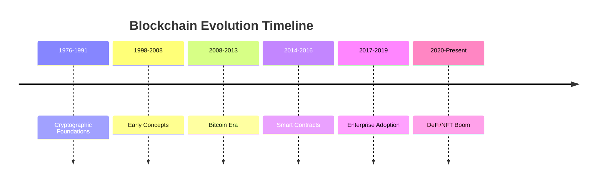
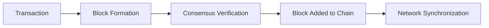
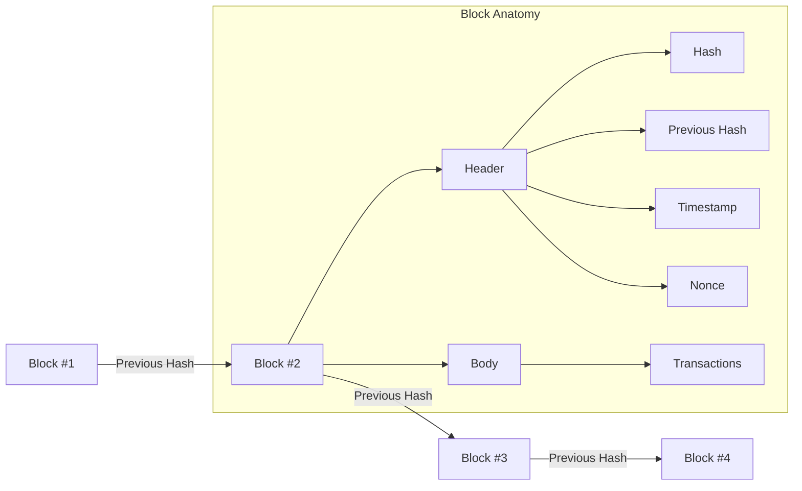
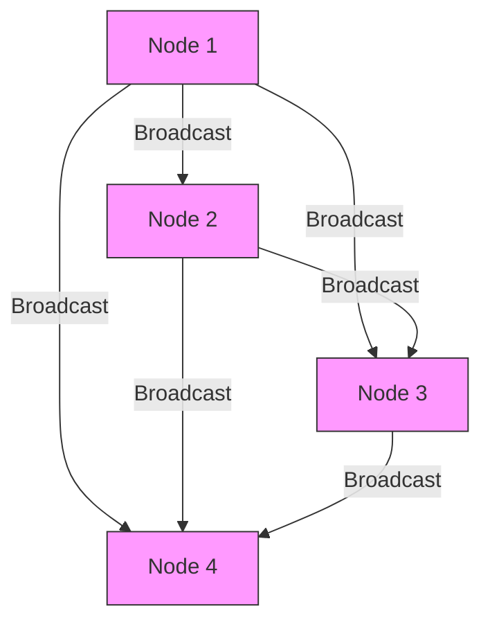

# Blockchain Technology: A Comprehensive Introduction

## Historical Background

Blockchain technology has evolved through several key milestones:

1. **Cryptographic Foundations (1976-1991)**
   - Ralph Merkle's hash trees (1979)
   - David Chaum's digital cash concepts (1982)
   - Stuart Haber & W. Scott Stornetta's timestamping (1991)

2. **Early Blockchain Concepts (1998-2008)**
   - Nick Szabo's Bit Gold proposal (1998)
   - Wei Dai's b-money (1998)
   - Hal Finney's reusable proof-of-work (2004)

3. **Bitcoin Era (2008-2013)**
   - Satoshi Nakamoto's Bitcoin whitepaper (2008)
   - Genesis block mined (January 3, 2009)
   - First Bitcoin transaction (January 12, 2009)

4. **Expansion Phase (2014-Present)**
   - Ethereum launch with smart contracts (2015)
   - Enterprise blockchain adoption (2016+)
   - DeFi and NFT boom (2020+)

## What is Blockchain?
Blockchain is a revolutionary distributed ledger technology that maintains a continuously growing list of records (blocks) linked and secured using cryptography. 

### Blockchain Data Structure

Each block contains:
- A cryptographic hash of the previous block
- A timestamp
- Transaction data

This creates an immutable chain where altering any block would require changing all subsequent blocks, making tampering practically impossible.

## Core Principles and Characteristics

### Decentralization

Unlike traditional databases controlled by central authorities, blockchain operates on a peer-to-peer network where:
- All participants (nodes) maintain a copy of the ledger
- Consensus algorithms validate transactions
- No single point of failure exists

### Transparency
- All transactions are visible to network participants
- Transaction history is permanently recorded
- Anyone can verify the ledger's integrity

### Immutability
- Cryptographic hashing ensures data cannot be altered retroactively
- Changing any data would require network-wide consensus
- Provides strong protection against fraud

### Security
- Uses advanced cryptography (SHA-256, ECDSA)
- Consensus mechanisms prevent double-spending
- Distributed nature resists attacks

## Major Use Cases Explained

1. **Cryptocurrencies**  
   Digital currencies like Bitcoin use blockchain for secure, decentralized value transfer without intermediaries.

2. **Smart Contracts**  
   Self-executing contracts with terms written into code (e.g., Ethereum's Solidity) that automatically enforce agreements.

3. **Supply Chain Management**  
   Provides end-to-end visibility of goods movement while preventing counterfeit products.

4. **Digital Identity**  
   Gives users control over their personal data through decentralized identifiers (DIDs).

5. **Decentralized Finance (DeFi)**  
   Recreates traditional financial services (lending, trading) without central authorities.

## Blockchain Platforms Comparison

| Platform       | Type          | Consensus     | Smart Contracts | Key Feature                     |
|----------------|---------------|---------------|-----------------|---------------------------------|
| Ethereum       | Public        | PoS           | Yes             | Pioneer in smart contracts      |
| Polkadot       | Public        | NPoS          | Yes             | Interoperability focus          |
| Hyperledger    | Permissioned  | PBFT          | Yes             | Enterprise-grade solutions      |
| Solana         | Public        | PoH           | Yes             | High throughput (50k+ TPS)      |

## Benefits and Impact

- **Cost Reduction**: Eliminates intermediaries in transactions
- **Transparency**: All participants see the same verified data
- **Security**: Cryptographic protection against tampering
- **Efficiency**: Automated processes through smart contracts
- **Innovation**: Enables new business models and applications

## Current Challenges

- **Scalability**: Most blockchains struggle with high transaction volumes
- **Energy Use**: Proof-of-Work consensus requires significant electricity
- **Regulation**: Evolving legal frameworks create uncertainty
- **Adoption**: Requires significant changes to existing systems
- **Interoperability**: Different blockchains often can't communicate

## Future Outlook

Blockchain technology continues to evolve with:
- Layer 2 scaling solutions (Rollups, Sidechains)
- Improved consensus mechanisms (PoS, DPoS)
- Cross-chain communication protocols
- Quantum-resistant cryptography development

> "Blockchain represents a paradigm shift in how we establish trust and exchange value. Its potential extends far beyond cryptocurrencies to transform industries from finance to healthcare." - Blockchain Researcher
