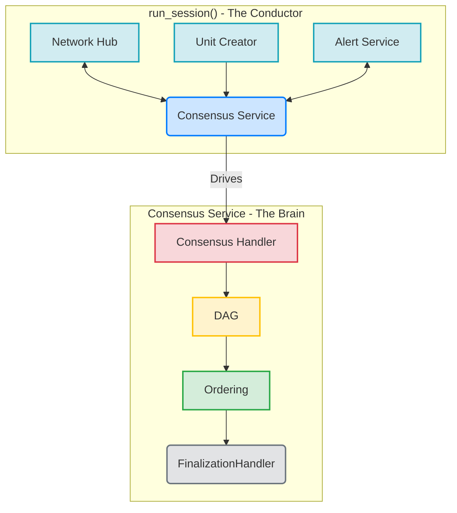
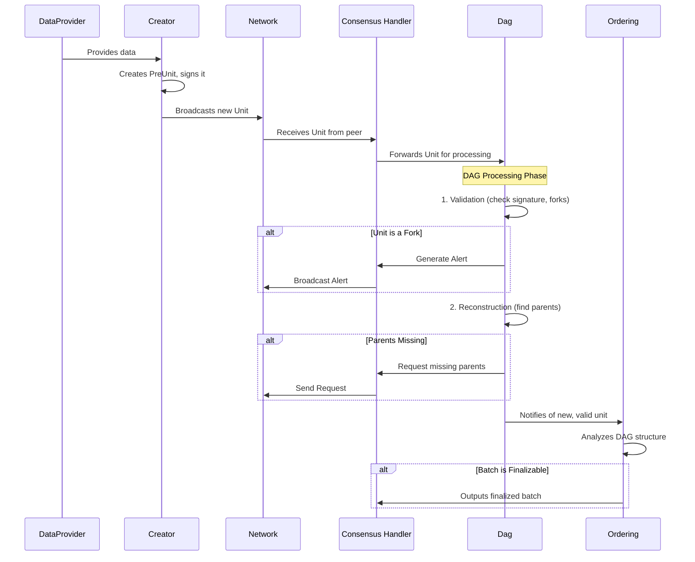
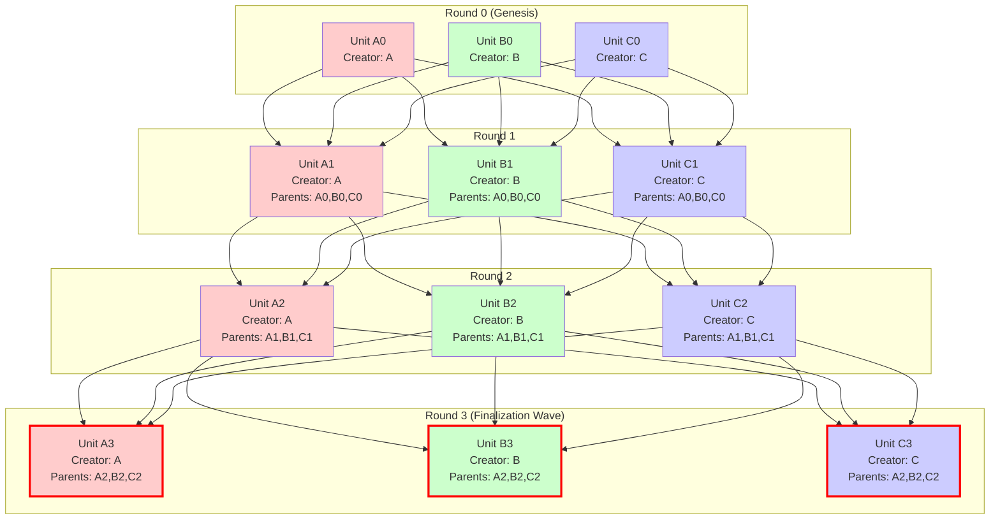
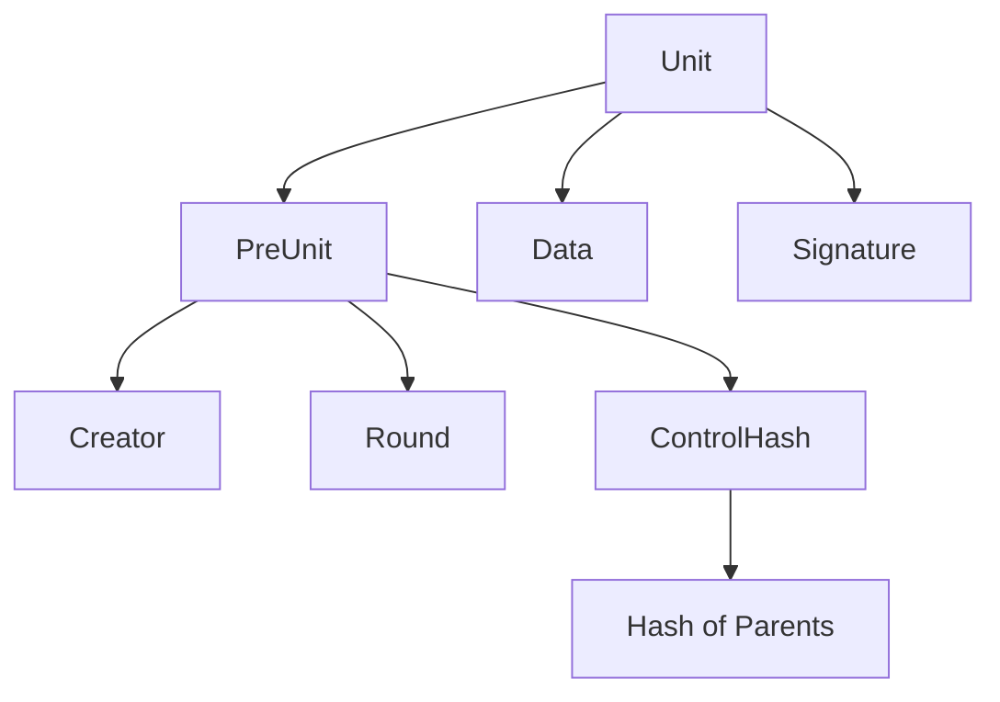

# A Deep Dive into AlephBFT: Synthesis and Code-Level Analysis

## 1. Introduction

*This section will provide a high-level overview of AlephBFT, its purpose, and its significance in the context of distributed systems and blockchain technology. It will synthesize the introductory material from the existing reports and set the stage for the deep dive.*

## 2. Core Architecture: From Orchestration to Finality

While previous reports correctly identify the DAG-based nature of AlephBFT, a direct analysis of the `aleph-bft` crate reveals a sophisticated, modular architecture that cleanly separates asynchronous orchestration from deterministic, core logic. The consensus engine is not a single monolithic component but a collaboration of specialized modules, each with a distinct responsibility.



| Component | Source Location (`aleph-bft` crate) | Role |
| :--- | :--- | :--- |
| **`run_session`** | `consensus/src/consensus/mod.rs` | The top-level asynchronous function that orchestrates the entire consensus process. It spawns and connects all the other components. |
| **`Consensus` Handler** | `consensus/src/consensus/handler.rs` | The synchronous, deterministic core of the protocol. It holds the primary state and coordinates the interactions between the DAG and the ordering logic. |
| **`Dag`** | `consensus/src/dag/mod.rs` | A two-stage pipeline that validates incoming units and then reconstructs the DAG, requesting missing parents as needed. This is the gatekeeper for all data entering the consensus process. |
| **`Ordering`** | `consensus/src/extension/mod.rs` | The finalization engine. It takes the partially ordered DAG and applies the finalization rules to produce a linear, canonical sequence of finalized unit batches. |

## 3. The Lifecycle of a Unit: A Step-by-Step Walkthrough

To understand how AlephBFT achieves consensus, it is essential to follow the journey of a single unit from creation to finalization. This process is a carefully choreographed dance between the various components of the `aleph-bft` crate. The sequence diagram below illustrates this flow.



### Step 1: Creation

A new unit is born in the `creation` module, specifically within the `run` function (`consensus/src/creation/mod.rs`). Here's a simplified version of the unit creation process:

```rust
// Simplified from consensus/src/creation/mod.rs
async fn create_unit<H: Hasher, D: Data, S: Signature>(
    &mut self,
    data_provider: &impl DataProvider<D>,
    round: Round,
    parents: Vec<UnitHandle<H, D, S>>,
) -> Result<Unit<H, D, S>, Error> {
    // Get the data to include in the unit
    let data = data_provider.get_data().await?;
    
    // Create control hash from parent units
    let control_hash = self.create_control_hash(parents);
    
    // Create the pre-unit (unsigned)
    let pre_unit = PreUnit {
        creator: self.node_index,
        round,
        control_hash,
    };
    
    // Sign the pre-unit
    let signature = self.keychain.sign(&pre_unit).await?;
    
    // Combine into final unit
    Ok(Unit {
        pre_unit,
        data,
        signature,
    })
}
```

### Step 2: Validation

Once a unit is received from the network, it is immediately passed to the `Dag` for validation. This critical step acts as a gatekeeper and involves several checks:

*   **Correctness**: It verifies the unit's signature and internal consistency.
*   **Fork Detection**: It checks if the unit's creator has already produced a different unit at the same height. If so, it generates a `NewForker` alert.
*   **Duplicate Check**: It ensures the unit has not already been processed.

The code below shows a simplified version of this validation logic:

```rust
// Simplified from consensus/src/dag/validation.rs
impl<H: Hasher, D: Data, S: Signature> Validator<H, D, S> {
    pub fn validate_unit(
        &self,
        unit: &Unit<H, D, S>,
        dag: &Dag<H, D, S>,
    ) -> Result<(), ValidationError> {
        // 1. Verify the signature
        self.verify_signature(unit)?;
        
        // 2. Check for duplicate units (same creator and round)
        if dag.contains_unit(unit.creator(), unit.round()) {
            return Err(ValidationError::DuplicateUnit);
        }
        
        // 3. Verify the control hash matches the parents
        let computed_hash = self.compute_control_hash(unit.parents());
        if computed_hash != unit.control_hash() {
            return Err(ValidationError::InvalidControlHash);
        }
        
        // 4. Check for equivocation (forks)
        if dag.has_equivocation(unit.creator(), unit.round()) {
            return Err(ValidationError::ForkDetected);
        }
        
        // 5. Verify round advancement rules
        self.verify_round_advancement(unit, dag)?;
        
        Ok(())
    }
    
    // ... other validation methods ...
}
```

### Step 3: Reconstruction

If a unit passes validation, it moves to the `Reconstruction` stage (`consensus/src/dag/reconstruction.rs`). This component attempts to connect the unit to its parents in the local DAG. If the parents are not yet present, the unit is temporarily stored as an "orphan," and requests are sent out for the missing parents. The logic below shows how this is handled, and the subsequent diagram illustrates the resulting DAG structure.

```rust
// Simplified from consensus/src/dag/reconstruction.rs
fn process_unit(
    &mut self,
    unit: Unit<H, D, S>,
) -> Result<Status, Error> {
    let unit_hash = unit.hash();

    if self.dag.has_all_parents(&unit) {
        // All parents are present, so we can insert the unit into the DAG.
        self.dag.insert(unit);
        return Ok(Status::Connected);
    } else {
        // Some parents are missing. Store as an orphan and request them.
        let missing_parents = self.dag.get_missing_parents(&unit);
        self.orphanage.add(unit, missing_parents.clone());
        
        // Generate requests for the missing parents
        let requests = missing_parents.into_iter()
            .map(|parent_hash| Request::new(parent_hash, self.node_index))
            .collect();
            
        return Ok(Status::MissingParents(requests));
    }
}
```

#### DAG Structure Visualization

The following diagram illustrates how units form the DAG structure, with each unit referencing its parents from the previous round:



*Note: The thick red borders on Round 3 units indicate they are part of a finalization wave, where the `Ordering` component has determined they can be safely finalized.*

### Step 4: Finalization

As the DAG grows, the `Ordering` component (`consensus/src/extension/mod.rs`) continuously analyzes its structure. The `Extender` (`consensus/src/extension/extender.rs`) identifies batches of units that have achieved a supermajority of support. Here is a simplified view of how it produces finalized batches.

```rust
// Simplified from consensus/src/extension/extender.rs
fn next_batch(&mut self) -> Option<Vec<H::Hash>> {
    let mut finalized_batch = Vec::new();
    let mut current_round = self.last_finalized_round + 1;

    loop {
        // Attempt to find a head for the current round.
        // A head is a unit with a supermajority of paths from the previous round's heads.
        if let Some(head) = self.find_head(current_round) {
            // If a head is found, all its ancestors up to the previous finalized round
            // can be considered finalized.
            let new_finalized = self.collect_ancestors(head, self.last_finalized_round);
            finalized_batch.extend(new_finalized);
            
            self.last_finalized_round = current_round;
            current_round += 1;
        } else {
            // Not enough support to finalize this round yet.
            break;
        }
    }

    if !finalized_batch.is_empty() {
        Some(finalized_batch)
    } else {
        None
    }
}
```


## 4. Key Data Structures

The `aleph-bft` crate defines several key data structures that are fundamental to the protocol's operation. Understanding these structures is essential for a deep appreciation of the implementation.

### The `Unit`

The most fundamental data structure in AlephBFT is the `Unit`. It represents a single message created by a node and contains the following key fields (defined in `aleph-bft-types/src/lib.rs`). Here's the actual implementation with some comments for clarity:

```rust
// A unit is the fundamental building block of the AlephBFT protocol.
// It represents a single message created by a node in the network.
pub struct Unit<H: Hasher, D: Data, S: Signature> {
    // The pre-unit contains the core metadata
    pre_unit: PreUnit<H>,
    // The actual data being agreed upon (e.g., block hash)
    data: D,
    // Signature from the creator to ensure authenticity
    signature: S,
}

// PreUnit contains the structural information about the unit
pub struct PreUnit<H: Hasher> {
    // Index of the node that created this unit
    creator: NodeIndex,
    // The round number this unit belongs to
    round: Round,
    // Hash of parent units, ensuring DAG structure
    control_hash: ControlHash<H>,
}

// ControlHash represents a commitment to a set of parent units
pub struct ControlHash<H: Hasher> {
    // Hash of all parent units
    parents_hash: H::Hash,
    // Optional additional data for validation
    additional_data: Vec<u8>,
}

```rust
pub struct PreUnit<H: Hasher> {
    creator: NodeIndex,
    round: Round,
    control_hash: ControlHash<H>,
}

pub struct Unit<H: Hasher, D: Data, S: Signature> {
    pre_unit: PreUnit<H>,
    data: D,
    signature: S,
}
```

The relationship between these structures can be visualized as follows:



*   **`creator`**: The index of the node that created the unit.
*   **`round`**: The round number in which the unit was created.
*   **`control_hash`**: A hash of the unit's parents, which serves as a commitment to the unit's position in the DAG.
*   **`data`**: The actual data that the consensus is being run on (e.g., a block hash or a set of transactions).
*   **`signature`**: The creator's signature on the unit, which ensures its authenticity.

### The `ControlHash`

The `ControlHash` is a critical component for ensuring the integrity of the DAG. It is a hash of the parents of a unit, and it serves two key purposes:

1.  **Commitment**: By including the `ControlHash` in the signed `PreUnit`, the creator commits to the exact set of parents for that unit, preventing certain types of attacks.
2.  **Efficiency**: It allows nodes to verify the parent-child relationships in the DAG without needing to have all the parent units available locally.

### The `Alert` System

Fork alerts are a cornerstone of AlephBFT's security model. Here's how the alert system works in practice:

```rust
// Simplified from consensus/src/alerts/mod.rs

/// Represents an alert about a detected fork
pub struct Alert<H: Hasher, D: Data, S: Signature> {
    /// The node that detected and is reporting the fork
    sender: NodeIndex,
    /// Evidence of the fork (two conflicting units)
    notification: ForkingNotification<H, D, S>,
    /// Units from the sender to help others determine the correct chain
    legit_units: Vec<UnitCoord<H>>,
}

impl<H: Hasher, D: Data, S: Signature> Alert<H, D, S> {
    /// Creates a new alert when a fork is detected
    pub fn new_fork_alert(
        forker: NodeIndex,
        unit1: Unit<H, D, S>,
        unit2: Unit<H, D, S>,
        my_units: Vec<Unit<H, D, S>>,
    ) -> Self {
        let notification = ForkingNotification {
            forker,
            first_unit: unit1,
            second_unit: unit2,
        };
        
        let legit_units = my_units.into_iter()
            .map(|u| u.coord())
            .collect();
            
        Alert {
            sender: self.node_index,
            notification,
            legit_units,
        }
    }
    
    /// Verifies if the alert is valid
    pub fn verify(&self) -> Result<(), AlertError> {
        // Verify the forker actually created two different units in the same round
        if self.notification.first_unit.creator() != self.notification.forker ||
           self.notification.second_unit.creator() != self.notification.forker ||
           self.notification.first_unit.round() != self.notification.second_unit.round() ||
           self.notification.first_unit == self.notification.second_unit {
            return Err(AlertError::InvalidForkEvidence);
        }
        
        // Verify the signature on the alert
        self.verify_signature()?;
        
        // Additional verification logic...
        
        Ok(())
    }
}

```rust
pub struct Alert<H: Hasher, D: Data, S: Signature> {
    sender: NodeIndex,
    notification: ForkingNotification<H, D, S>,
    legit_units: Vec<UnitCoord<H>>,
}
```

*   **`sender`**: The node that is raising the alert.
*   **`notification`**: The evidence of the fork, which consists of the two conflicting units created by the malicious node.
*   **`legit_units`**: A list of units that the sender has created, which helps other nodes to determine the correct version of the DAG.

## 5. SWOT Analysis and Comparative Landscape

Synthesizing the analysis from existing reports with a direct code-level understanding allows for a more nuanced evaluation of AlephBFT's position in the broader landscape of consensus protocols.

### 5.1. SWOT Analysis of AlephBFT

| | Strengths | Weaknesses |
| :--- | :--- | :--- |
| **Internal** | **Asynchronous Safety**: The protocol's design, centered around the `Dag` and `Ordering` components, makes no assumptions about network synchrony, ensuring safety even in volatile network conditions. <br><br> **High Throughput & Monotonic Finality**: The DAG structure allows for the parallel processing of units, and the `Extender` ensures that once a batch is finalized, it is irreversible. <br><br> **Native Substrate Integration**: The `finality-aleph` crate demonstrates a deep and effective integration with Substrate, replacing GRANDPA as a finality gadget. | **Implementation Complexity**: The highly modular and asynchronous nature, while powerful, introduces significant complexity. Managing the interactions between the `NetworkHub`, `Creator`, `AlertService`, and `Consensus` service requires careful handling of multiple communication channels and task lifecycles. <br><br> **Alert Overhead**: The fork-alerting mechanism, while crucial for security, introduces additional network traffic and processing overhead, managed by the dedicated `AlertService`. <br><br> **Static Configuration**: Key parameters like session length and committee size are defined in the `Config` struct (`consensus/src/config.rs`) and are not designed to be adjusted dynamically within a session. |
| **External** | **Opportunities** | **Threats** |
| | **Growing Demand for Asynchronous BFT**: As decentralized applications become more global, the need for protocols that can handle high-latency, unreliable networks is increasing. <br><br> **Hybrid Consensus Models**: The modular design could allow for future integration with other systems, such as those using machine learning for threat detection. | **Competition from Optimized Protocols**: Protocols like HotStuff, while only partially synchronous, offer lower implementation complexity and may perform better in stable, low-latency network environments. <br><br> **Evolving Attack Vectors**: New attacks on BFT systems may emerge, requiring continuous maintenance and updates to the protocol's security mechanisms, particularly the `Validator` and `Alert` systems. |

### 5.2. Comparative Analysis

| Feature | AlephBFT | PBFT | Tendermint | HotStuff |
| :--- | :--- | :--- | :--- | :--- |
| **Model** | Asynchronous BFT | Partial Sync BFT | Partial Sync BFT | Partial Sync BFT |
| **Fault Tolerance** | `f < N/3` | `f < N/3` | `f < N/3` | `f < N/3` |
| **Theoretical TPS** | 10,000+ (Aleph Zero implementation) | 1,000-10,000 (depends on implementation) | 1,000-10,000 (Cosmos Hub: ~1,000 TPS) | 10,000+ (Libra/Diem implementation) |
| **Finality Time** | ~1 second (Aleph Zero) | 1-3 seconds | 6-7 seconds (Cosmos Hub) | 1-2 seconds |
| **Latency** | Low (no synchrony assumptions) | Moderate (view changes) | High (round-based, 2/3+1 votes) | Low (pipelined, 2/3+1 votes) |
| **Communication** | `O(N²)` + alerts | `O(N²)` | `O(N²)` | `O(N)` pipelined |
| **Finality Type** | Monotonic, DAG-based | Deterministic | Probabilistic → Deterministic | Deterministic |
| **Network Assumptions** | Asynchronous | Partial Synchrony | Partial Synchrony | Partial Synchrony |
| **Leader Rotation** | Round-robin | Primary-View | Round-robin | Round-robin |
| **Implementation Complexity** | High (modular, async) | High (complex view changes) | Moderate (simpler than PBFT) | Low (simplest of the four) |
| **Code-Level Insight** | Highly modular with dedicated tasks for networking, creation, and alerts. Finality via `Extender`'s analysis of the `Dag`. | Monolithic, with complex view-change logic. | Round-based, with clear leader election per round. | Simplified leader-based model with pipelined voting for efficiency. |

## 6. SWOT Analysis of AlephBFT

| | Strengths | Weaknesses |
| :--- | :--- | :--- |
| **Internal** | **Asynchronous Safety**: The protocol's design, centered around the `Dag` and `Ordering` components, makes no assumptions about network synchrony, ensuring safety even in volatile network conditions. <br><br> **High Throughput & Monotonic Finality**: The DAG structure allows for the parallel processing of units, and the `Extender` ensures that once a batch is finalized, it is irreversible. <br><br> **Native Substrate Integration**: The `finality-aleph` crate demonstrates a deep and effective integration with Substrate, replacing GRANDPA as a finality gadget. | **Implementation Complexity**: The highly modular and asynchronous nature, while powerful, introduces significant complexity. Managing the interactions between the `NetworkHub`, `Creator`, `AlertService`, and `Consensus` service requires careful handling of multiple communication channels and task lifecycles. <br><br> **Alert Overhead**: The fork-alerting mechanism, while crucial for security, introduces additional network traffic and processing overhead, managed by the dedicated `AlertService`. <br><br> **Static Configuration**: Key parameters like session length and committee size are defined in the `Config` struct (`consensus/src/config.rs`) and are not designed to be adjusted dynamically within a session. |
| **External** | **Opportunities** | **Threats** |
| | **Growing Demand for Asynchronous BFT**: As decentralized applications become more global, the need for protocols that can handle high-latency, unreliable networks is increasing. <br><br> **Hybrid Consensus Models**: The modular design could allow for future integration with other systems, such as those using machine learning for threat detection. | **Competition from Optimized Protocols**: Protocols like HotStuff, while only partially synchronous, offer lower implementation complexity and may perform better in stable, low-latency network environments. <br><br> **Evolving Attack Vectors**: New attacks on BFT systems may emerge, requiring continuous maintenance and updates to the protocol's security mechanisms, particularly the `Validator` and `Alert` systems. |

## 7. In-Depth Analysis of AlephBFT

This section provides a deeper analysis of AlephBFT's key attributes, building upon the comparative overview.

### 7.1. Performance and Scalability

AlephBFT's architecture is engineered for high performance and scalability, primarily through its asynchronous, DAG-based model. The key mechanisms are:

*   **DAG-Based Parallelism**: Unlike traditional blockchains that process transactions sequentially, AlephBFT's DAG structure allows for the parallel processing of units. This is the core of its scalability, as units with available parents can be validated and added to the DAG concurrently. The `add_units` function below demonstrates this parallel approach using `tokio::spawn`:

```rust
// Simplified from consensus/src/dag/mod.rs
impl<H: Hasher, D: Data, S: Signature> Dag<H, D, S> {
    // Processes multiple units in parallel when possible
    pub async fn add_units(
        &mut self,
        units: Vec<Unit<H, D, S>>,
    ) -> Vec<Result<(), AddError>> {
        // Group units by their dependencies to enable parallel processing
        let mut results = Vec::with_capacity(units.len());
        let mut ready_units = Vec::new();
        
        // First pass: identify units that are ready to be processed
        for unit in units {
            if self.has_all_parents(&unit) {
                ready_units.push(unit);
            } else {
                // Queue for later processing
                self.pending_units.entry(unit.round())
                    .or_default()
                    .push(unit);
                results.push(Ok(()));
            }
        }
        
        // Process ready units in parallel
        let mut handles = Vec::with_capacity(ready_units.len());
        for unit in ready_units {
            let dag = self.clone();
            handles.push(tokio::spawn(async move {
                dag.process_unit(unit).await
            }));
        }
        
        // ... logic to collect results ...
        results
    }
}
```

*   **Low-Latency Finality**: Because the protocol is asynchronous, it does not have to wait for fixed block times or multiple rounds of voting to confirm transactions. Finality can be achieved very quickly (sub-second in the Aleph Zero implementation) as soon as a unit and its ancestors have received enough support within the DAG.

*   **Communication Complexity Trade-off**: The primary scalability constraint is the `O(N²)` communication complexity in the worst case, which is typical for many BFT protocols. AlephBFT accepts this trade-off to gain the resilience and security of its asynchronous model and fork-alerting system. For typical committee sizes, the protocol remains highly efficient.

### 7.2. Security

AlephBFT's security model is robust, designed to provide strong guarantees even in hostile, asynchronous environments. The key pillars of its security are:

*   **Asynchronous Safety**: The protocol's core design does not rely on timing assumptions for safety. This means that even under extreme network latency or partitions, the system will not confirm conflicting transactions. Safety is guaranteed by the DAG's structure and the finalization rules, not by network synchrony.

*   **Fork-Alerting Mechanism**: The `Alert` system is a critical defense against equivocation (forks). If a malicious node creates two different units in the same round, honest nodes will detect this, create an `Alert`, and broadcast it to the network. This allows the network to identify and eventually exclude the malicious node, preserving the integrity of the DAG.
	
*   **Rigorous Unit Validation**: Every unit entering the DAG is subjected to a strict validation process by the `Validator` component. This includes verifying the creator's signature, checking the control hash against the unit's parents, and ensuring the unit adheres to round advancement rules. This multi-step validation acts as a gatekeeper, preventing malformed or invalid data from corrupting the consensus process. The code below highlights the key validation steps:

```rust
// Simplified from consensus/src/dag/validation.rs
impl<H: Hasher, D: Data, S: Signature> Validator<H, D, S> {
    pub fn validate_unit(
        &self,
        unit: &Unit<H, D, S>,
        dag: &Dag<H, D, S>,
    ) -> Result<(), ValidationError> {
        // 1. Verify the signature
        self.verify_signature(unit)?;
        
        // 2. Check for duplicate units
        if dag.contains_unit(unit.creator(), unit.round()) {
            return Err(ValidationError::DuplicateUnit);
        }
        
        // 3. Verify the control hash
        let computed_hash = self.compute_control_hash(unit.parents());
        if computed_hash != unit.control_hash() {
            return Err(ValidationError::InvalidControlHash);
        }
        
        // 4. Check for forks (equivocation)
        if dag.has_equivocation(unit.creator(), unit.round()) {
            return Err(ValidationError::ForkDetected);
        }
        
        Ok(())
    }
}
```

*   **Byzantine Fault Tolerance**: Like other BFT protocols, AlephBFT guarantees safety and liveness as long as the number of malicious nodes (`f`) is less than one-third of the total nodes in the committee (`N/3`).

## 8. Conclusion

AlephBFT stands as a testament to sophisticated engineering in the distributed consensus space. A direct, code-level analysis of the `aleph-bft` crate reveals a protocol that is not only theoretically sound but also implemented with a remarkable degree of modularity and precision. By separating the asynchronous orchestration in `run_session` from the deterministic core logic in the `Consensus` handler, the protocol achieves a clean separation of concerns that enhances both its robustness and its maintainability.

This deep dive, synthesizing insights from existing reports and verifying them against the ground truth of the source code, confirms that AlephBFT is a formidable solution for achieving high-throughput, asynchronous Byzantine fault tolerance. Its DAG-based approach, coupled with a robust fork-alerting mechanism and a clear finalization path through the `Ordering` component, makes it a compelling choice for demanding applications like the Aleph Zero blockchain. While its complexity presents a steep learning curve, the result is a highly resilient and performant consensus engine poised to meet the challenges of a decentralized future.
