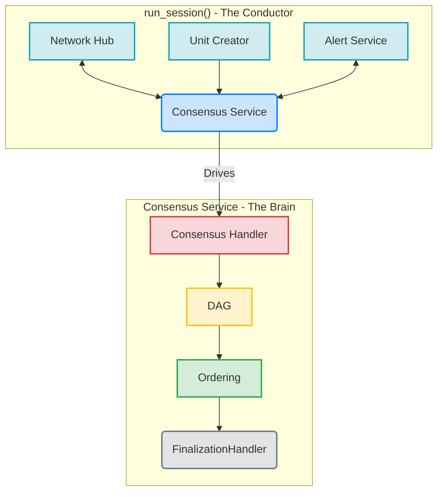
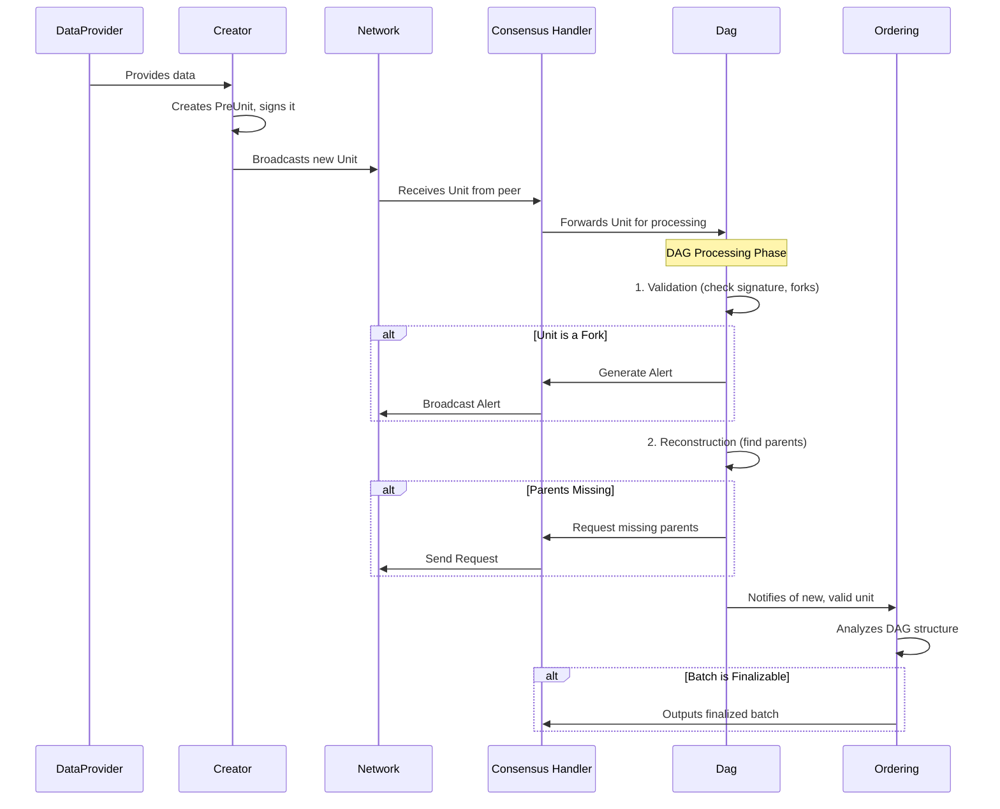

# AlephBFT Consensus Protocol: Architecture, Implementation, and Technical Analysis

## 1. Introduction

*This section will provide a high-level overview of AlephBFT, its purpose, and its significance in the context of distributed systems and blockchain technology. It will synthesize the introductory material from the existing reports and set the stage for the deep dive.*

## 2. Core Architecture: From Orchestration to Finality

While previous reports correctly identify the DAG-based nature of AlephBFT, a direct analysis of the `aleph-bft` crate reveals a sophisticated, modular architecture that cleanly separates asynchronous orchestration from deterministic, core logic. The consensus engine is not a single monolithic component but a collaboration of specialized modules, each with a distinct responsibility.



| Component | Source Location (`aleph-bft` crate) | Role |
| :--- | :--- | :--- |
| **`run_session`** | `consensus/src/consensus/mod.rs` | The top-level asynchronous function that orchestrates the entire consensus process. It spawns and connects all the other components. |
| **`Consensus` Handler** | `consensus/src/consensus/handler.rs` | The synchronous, deterministic core of the protocol. It holds the primary state and coordinates the interactions between the DAG and the ordering logic. |
| **`Dag`** | `consensus/src/dag/mod.rs` | A two-stage pipeline that validates incoming units and then reconstructs the DAG, requesting missing parents as needed. This is the gatekeeper for all data entering the consensus process. |
| **`Ordering`** | `consensus/src/extension/mod.rs` | The finalization engine. It takes the partially ordered DAG and applies the finalization rules to produce a linear, canonical sequence of finalized unit batches. |

## 3. The Lifecycle of a Unit: A Step-by-Step Walkthrough

To understand how AlephBFT achieves consensus, it is essential to follow the journey of a single unit from creation to finalization. This process is a carefully choreographed dance between the various components of the `aleph-bft` crate. The sequence diagram below illustrates this flow.



### Step 1: Creation

A new unit is born in the `creation` module, specifically within the `run` function (`consensus/src/creation/mod.rs`). This component is responsible for bundling data from the `DataProvider` with the necessary metadata to form a new unit. It does not create units continuously but is gated by the `Creator`'s ability to gather a supermajority of parent units from the previous round, ensuring the DAG grows in a structured manner.

### Step 2: Validation

Once a unit is received from the network, it is immediately passed to the `Dag`'s `add_unit` function (`consensus/src/dag/mod.rs`). This triggers the first stage of the DAG pipeline: validation. The `Validator` (`consensus/src/dag/validation.rs`) performs several critical checks:

*   **Correctness**: It verifies the unit's signature and internal consistency.
*   **Fork Detection**: It checks if the unit's creator has already produced a different unit at the same height. If so, it generates a `NewForker` alert.
*   **Duplicate Check**: It ensures the unit has not already been processed.

### Step 3: Reconstruction

If a unit passes validation, it moves to the `Reconstruction` stage (`consensus/src/dag/reconstruction.rs`). This component attempts to connect the unit to its parents in the local DAG. If the parents are not yet present, the unit is temporarily stored as an "orphan," and the `Reconstruction` logic generates `Request`s for the missing parents, which are then sent out to the network by the `Consensus` handler.

### Step 4: Finalization

As the DAG grows, the `Ordering` component (`consensus/src/extension/mod.rs`) continuously analyzes its structure. Using the rules of the AlephBFT protocol (which involve virtual voting and a common coin), the `Extender` (`consensus/src/extension/extender.rs`) identifies batches of units that have achieved a supermajority of support. Once a batch is finalized, it is passed to the `finalization_handler`, which makes the data available to the application layer.

## 4. Key Data Structures

The `aleph-bft` crate defines several key data structures that are fundamental to the protocol's operation. Understanding these structures is essential for a deep appreciation of the implementation.

### The `Unit`

The most fundamental data structure in AlephBFT is the `Unit`. It represents a single message created by a node and contains the following key fields (defined in `aleph-bft-types/src/lib.rs`):

```rust
pub struct PreUnit<H: Hasher> {
    creator: NodeIndex,
    round: Round,
    control_hash: ControlHash<H>,
}

pub struct Unit<H: Hasher, D: Data, S: Signature> {
    pre_unit: PreUnit<H>,
    data: D,
    signature: S,
}
```

The relationship between these structures can be visualized as follows:

```mermaid
graph TD
    Unit --> PreUnit
    Unit --> Data
    Unit --> Signature

    PreUnit --> Creator
    PreUnit --> Round
    PreUnit --> ControlHash

    ControlHash --> "Hash(Parents)"
```

*   **`creator`**: The index of the node that created the unit.
*   **`round`**: The round number in which the unit was created.
*   **`control_hash`**: A hash of the unit's parents, which serves as a commitment to the unit's position in the DAG.
*   **`data`**: The actual data that the consensus is being run on (e.g., a block hash or a set of transactions).
*   **`signature`**: The creator's signature on the unit, which ensures its authenticity.

### The `ControlHash`

The `ControlHash` is a critical component for ensuring the integrity of the DAG. It is a hash of the parents of a unit, and it serves two key purposes:

1.  **Commitment**: By including the `ControlHash` in the signed `PreUnit`, the creator commits to the exact set of parents for that unit, preventing certain types of attacks.
2.  **Efficiency**: It allows nodes to verify the parent-child relationships in the DAG without needing to have all the parent units available locally.

### The `Alert`

Fork alerts are a cornerstone of AlephBFT's security model. The `Alert` struct (defined in `consensus/src/alerts/mod.rs`) encapsulates the evidence of a fork and is broadcast to the network to notify other nodes of a malicious actor.

```rust
pub struct Alert<H: Hasher, D: Data, S: Signature> {
    sender: NodeIndex,
    notification: ForkingNotification<H, D, S>,
    legit_units: Vec<UnitCoord<H>>,
}
```

*   **`sender`**: The node that is raising the alert.
*   **`notification`**: The evidence of the fork, which consists of the two conflicting units created by the malicious node.
*   **`legit_units`**: A list of units that the sender has created, which helps other nodes to determine the correct version of the DAG.

## 5. Analysis: Strengths, Weaknesses, and Comparative Landscape

Synthesizing the analysis from existing reports with a direct code-level understanding allows for a more nuanced evaluation of AlephBFT's position in the broader landscape of consensus protocols.

### SWOT Analysis

| | Strengths | Weaknesses |
| :--- | :--- | :--- |
| **Internal** | **Asynchronous Safety**: The protocol's design, centered around the `Dag` and `Ordering` components, makes no assumptions about network synchrony, ensuring safety even in volatile network conditions. <br><br> **High Throughput & Monotonic Finality**: The DAG structure allows for the parallel processing of units, and the `Extender` ensures that once a batch is finalized, it is irreversible. <br><br> **Native Substrate Integration**: The `finality-aleph` crate demonstrates a deep and effective integration with Substrate, replacing GRANDPA as a finality gadget. | **Implementation Complexity**: The highly modular and asynchronous nature, while powerful, introduces significant complexity. Managing the interactions between the `NetworkHub`, `Creator`, `AlertService`, and `Consensus` service requires careful handling of multiple communication channels and task lifecycles. <br><br> **Alert Overhead**: The fork-alerting mechanism, while crucial for security, introduces additional network traffic and processing overhead, managed by the dedicated `AlertService`. <br><br> **Static Configuration**: Key parameters like session length and committee size are defined in the `Config` struct (`consensus/src/config.rs`) and are not designed to be adjusted dynamically within a session. |
| **External** | **Opportunities** | **Threats** |
| | **Growing Demand for Asynchronous BFT**: As decentralized applications become more global, the need for protocols that can handle high-latency, unreliable networks is increasing. <br><br> **Hybrid Consensus Models**: The modular design could allow for future integration with other systems, such as those using machine learning for threat detection. | **Competition from Optimized Protocols**: Protocols like HotStuff, while only partially synchronous, offer lower implementation complexity and may perform better in stable, low-latency network environments. <br><br> **Evolving Attack Vectors**: New attacks on BFT systems may emerge, requiring continuous maintenance and updates to the protocol's security mechanisms, particularly the `Validator` and `Alert` systems. |

### Comparative Analysis

| Feature | AlephBFT | PBFT | Tendermint | HotStuff |
| :--- | :--- | :--- | :--- | :--- |
| **Model** | Asynchronous BFT | Partial Sync BFT | Partial Sync BFT | Partial Sync BFT |
| **Fault Tolerance** | `f < N/3` | `f < N/3` | `f < N/3` | `f < N/3` |
| **Latency** | Low (no synchrony assumptions) | Moderate (view changes) | High (round-based) | Low (pipelined) |
| **Communication** | `O(N²)` + alerts | `O(N²)` | `O(N²)` | `O(N)` pipelined |
| **Finality** | Monotonic, DAG-based | Deterministic | Deterministic | Deterministic |
| **Code-Level Insight** | Highly modular but complex, with dedicated tasks for networking, creation, and alerts. Finality is achieved via the `Extender`'s analysis of the `Dag`. | Monolithic, with complex view-change logic. | Round-based, with a clear leader election per round. | Simplified leader-based model with pipelined voting for efficiency. |

## 6. Conclusion

AlephBFT stands as a testament to sophisticated engineering in the distributed consensus space. A direct, code-level analysis of the `aleph-bft` crate reveals a protocol that is not only theoretically sound but also implemented with a remarkable degree of modularity and precision. By separating the asynchronous orchestration in `run_session` from the deterministic core logic in the `Consensus` handler, the protocol achieves a clean separation of concerns that enhances both its robustness and its maintainability.

This deep dive, synthesizing insights from existing reports and verifying them against the ground truth of the source code, confirms that AlephBFT is a formidable solution for achieving high-throughput, asynchronous Byzantine fault tolerance. Its DAG-based approach, coupled with a robust fork-alerting mechanism and a clear finalization path through the `Ordering` component, makes it a compelling choice for demanding applications like the Aleph Zero blockchain. While its complexity presents a steep learning curve, the result is a highly resilient and performant consensus engine poised to meet the challenges of a decentralized future.
