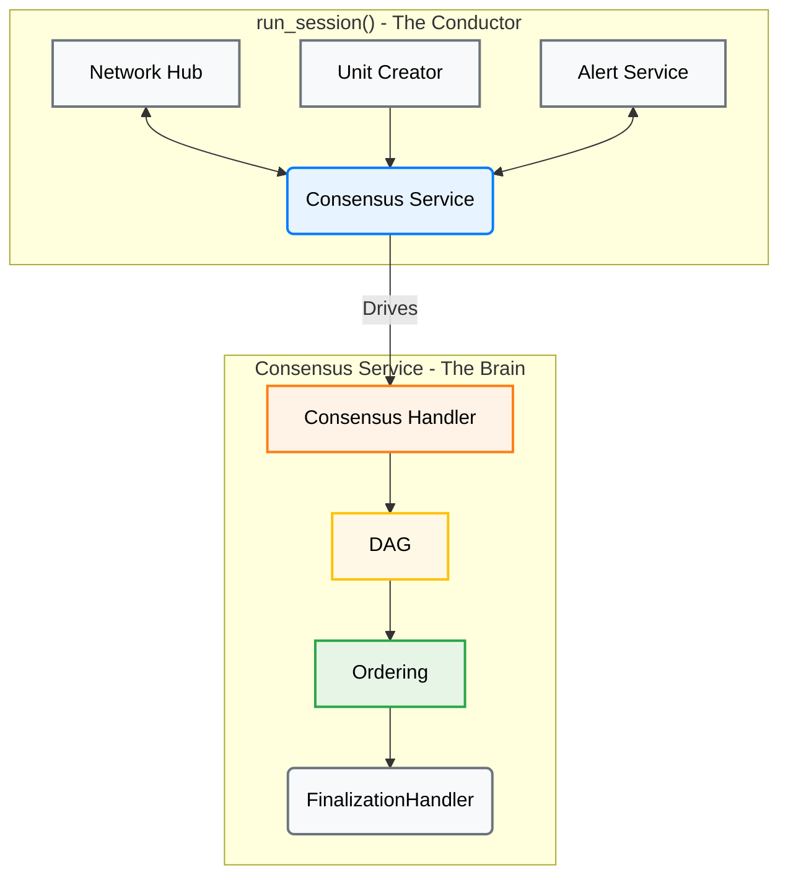
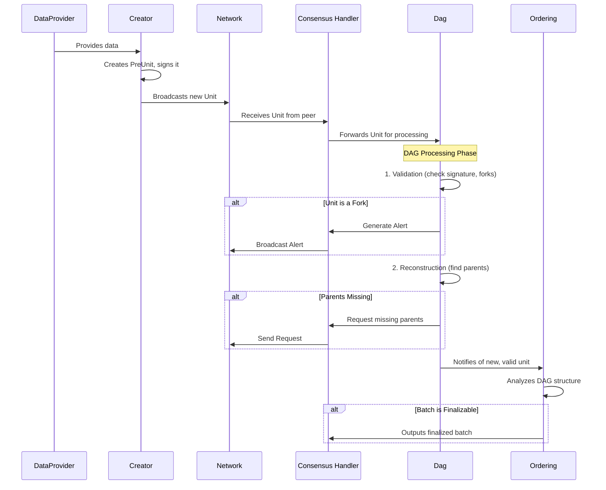
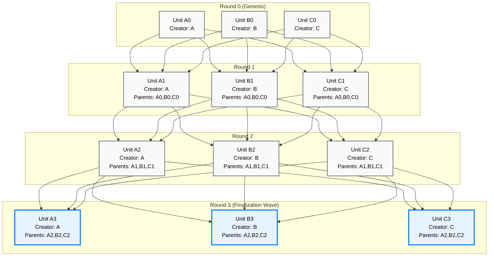
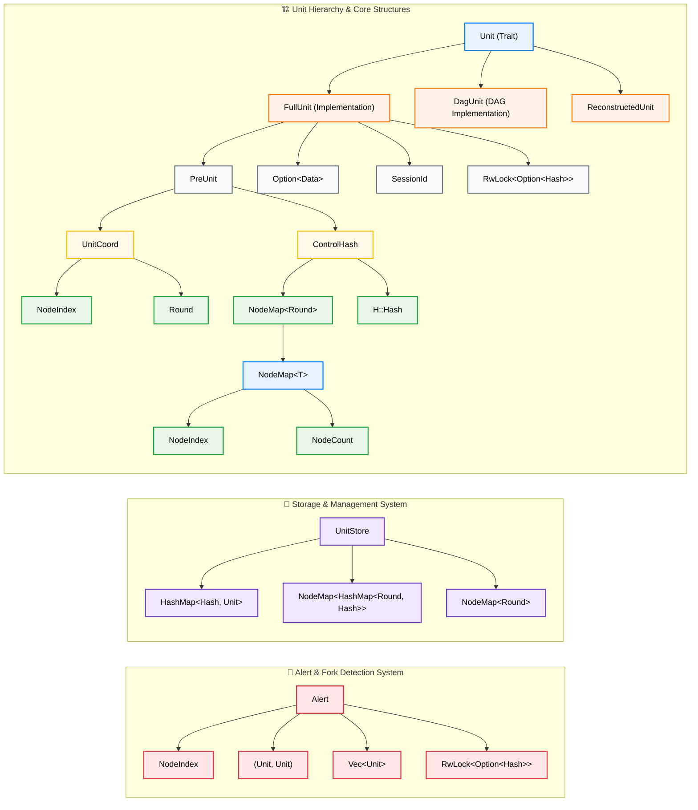
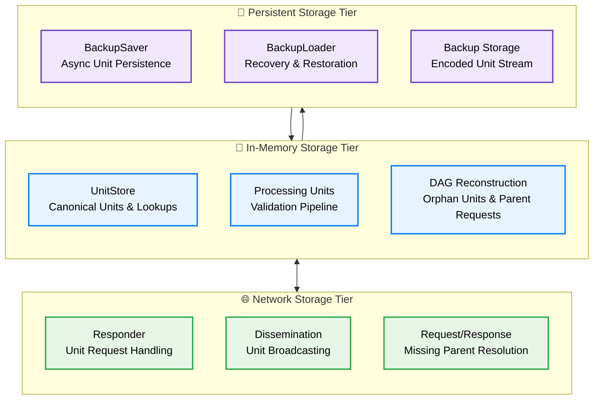

# AlephBFT Consensus Protocol- Technical Analysis

## 1. Introduction

*This section will provide a high-level overview of AlephBFT, its purpose, and its significance in the context of distributed systems and blockchain technology. It will synthesize the introductory material from the existing reports and set the stage for the deep dive.*

## 2. Core Architecture: From Orchestration to Finality

While previous reports correctly identify the DAG-based nature of AlephBFT, a direct analysis of the `aleph-bft` crate reveals a sophisticated, modular architecture that cleanly separates asynchronous orchestration from deterministic, core logic. The consensus engine is not a single monolithic component but a collaboration of specialized modules, each with a distinct responsibility.

<div align="center">



</div>

| Component | Source Location (`aleph-bft` crate) | Role |
| :--- | :--- | :--- |
| **`run_session`** | `consensus/src/consensus/mod.rs` | The top-level asynchronous function that orchestrates the entire consensus process. It spawns and connects all the other components. |
| **`Consensus` Handler** | `consensus/src/consensus/handler.rs` | The synchronous, deterministic core of the protocol. It holds the primary state and coordinates the interactions between the DAG and the ordering logic. |
| **`Dag`** | `consensus/src/dag/mod.rs` | A two-stage pipeline that validates incoming units and then reconstructs the DAG, requesting missing parents as needed. This is the gatekeeper for all data entering the consensus process. |
| **`Ordering`** | `consensus/src/extension/mod.rs` | The finalization engine. It takes the partially ordered DAG and applies the finalization rules to produce a linear, canonical sequence of finalized unit batches. |

### 2.1 Network Layer: P2P Communication and Message Routing

The network layer in AlephBFT provides the critical communication infrastructure that enables distributed consensus. The implementation in `consensus/src/network/` demonstrates a sophisticated approach to P2P networking that abstracts away low-level networking details while providing robust message routing and fault tolerance.

#### 2.1.1 Network Hub Architecture

The `Network Hub` serves as the central communication coordinator, managing all incoming and outgoing messages between committee members:

```rust
// From consensus/src/network/hub.rs
pub struct Hub<H: Hasher, D: Data, S: Signature, MS: PartialMultisignature, N: Network<NetworkData<H, D, S, MS>>> {
    network: N,                                                    // Underlying network implementation
    units_to_send: Receiver<(UnitMessage<H, D, S>, Recipient)>,   // Outgoing unit messages
    units_received: Sender<UnitMessage<H, D, S>>,                 // Incoming unit messages
    alerts_to_send: Receiver<(AlertMessage<H, D, S, MS>, Recipient)>, // Outgoing alert messages
    alerts_received: Sender<AlertMessage<H, D, S, MS>>,           // Incoming alert messages
}

impl<H: Hasher, D: Data, S: Signature, MS: PartialMultisignature, N: Network<NetworkData<H, D, S, MS>>> Hub<H, D, S, MS, N> {
    pub async fn run(mut self, mut terminator: Terminator) {
        loop {
            futures::select! {
                // Handle outgoing unit messages
                unit_message = self.units_to_send.next() => {
                    if let Some((unit_message, recipient)) = unit_message {
                        self.send(NetworkData(Units(unit_message)), recipient);
                    }
                }
                // Handle outgoing alert messages
                alert_message = self.alerts_to_send.next() => {
                    if let Some((alert_message, recipient)) = alert_message {
                        self.send(NetworkData(Alert(alert_message)), recipient);
                    }
                }
                // Handle incoming messages from the network
                network_data = self.network.next() => {
                    if let Some(data) = network_data {
                        self.handle_incoming(data);
                    }
                }
                // Handle termination signal
                _ = terminator.get_exit().fuse() => {
                    break;
                }
            }
        }
    }
}
```

#### 2.1.2 Message Types and Serialization

AlephBFT defines a comprehensive message protocol that handles all consensus communication needs:

```rust
// From consensus/src/network/mod.rs
#[derive(Clone, Eq, PartialEq, Debug, Decode, Encode)]
pub(crate) enum NetworkDataInner<H: Hasher, D: Data, S: Signature, MS: PartialMultisignature> {
    Units(UnitMessage<H, D, S>),        // Consensus unit propagation
    Alert(AlertMessage<H, D, S, MS>),   // Fork detection alerts
}

// Opaque network message format
#[derive(Clone, Eq, PartialEq, Debug, Decode, Encode)]
pub struct NetworkData<H: Hasher, D: Data, S: Signature, MS: PartialMultisignature>(
    pub(crate) NetworkDataInner<H, D, S, MS>,
);
```

**Message Categories:**

*   **Unit Messages**: Carry consensus units (proposals, votes) between committee members
*   **Alert Messages**: Propagate fork detection evidence and Byzantine fault notifications
*   **Request Messages**: Solicit missing units or parents from other nodes
*   **Response Messages**: Provide requested units to requesting nodes

#### 2.1.3 Communication Patterns and Routing

AlephBFT employs sophisticated communication patterns optimized for Byzantine fault tolerance:

**Broadcasting Patterns:**
```rust
// Broadcast to all committee members
pub enum Recipient {
    Everyone,           // Broadcast to all nodes
    Node(NodeIndex),    // Send to specific node
}
```

**Message Routing Strategies:**
*   **Unit Dissemination**: New units are broadcast to all committee members for validation
*   **Alert Propagation**: Fork alerts are disseminated to ensure network-wide awareness
*   **Targeted Requests**: Missing parent requests are sent to specific nodes likely to have the data
*   **Redundant Delivery**: Critical messages may be sent through multiple paths for reliability

#### 2.1.4 Network Fault Tolerance and Recovery

The network layer provides robust fault tolerance mechanisms essential for Byzantine environments:

**Message Reliability:**
*   **Asynchronous Delivery**: No assumptions about message delivery timing
*   **Duplicate Detection**: Consensus layer handles duplicate message filtering
*   **Out-of-Order Handling**: DAG reconstruction manages units arriving out of sequence
*   **Missing Data Recovery**: Automatic parent request mechanisms fill gaps

**Network Partition Tolerance:**
*   **Local State Persistence**: Backup system enables recovery after network partitions
*   **Graceful Degradation**: Consensus continues with available nodes (if > 2f+1)
*   **Automatic Reconnection**: Network layer handles reconnection without consensus restart
*   **State Synchronization**: Nodes catch up automatically when partitions heal

**Byzantine Fault Handling:**
*   **Message Authentication**: All messages are cryptographically signed
*   **Fork Detection**: Network propagates evidence of Byzantine behavior
*   **Isolation Mechanisms**: Detected Byzantine nodes are excluded from consensus
*   **Evidence Preservation**: Fork proofs are stored and disseminated for accountability

#### 2.1.5 Performance Considerations

The network architecture is designed for high-performance consensus in distributed environments:

**Throughput Optimization:**
*   **Concurrent Processing**: Async message handling prevents blocking
*   **Efficient Serialization**: Codec-based encoding minimizes message size
*   **Batched Operations**: Multiple units can be processed in parallel
*   **Stream Processing**: Continuous message flow without request/response delays

**Latency Minimization:**
*   **Direct Routing**: Messages sent directly to intended recipients
*   **Minimal Hops**: No intermediate routing or consensus on message delivery
*   **Pipelined Processing**: Network and consensus operations overlap
*   **Optimistic Delivery**: Messages processed immediately upon receipt

**Scalability Features:**
*   **Modular Design**: Network implementation can be swapped without changing consensus
*   **Configurable Topology**: Supports various network topologies and deployment models
*   **Resource Management**: Bounded message queues prevent memory exhaustion
*   **Load Balancing**: Message processing distributed across async tasks

The network layer thus provides the robust, high-performance communication foundation that enables AlephBFT's sophisticated consensus mechanisms to operate effectively in real-world Byzantine environments.

## 3. The Lifecycle of a Unit: A Step-by-Step Walkthrough

To understand how AlephBFT achieves consensus, it is essential to follow the journey of a single unit from creation to finalization. This process is a carefully choreographed dance between the various components of the `aleph-bft` crate. The sequence diagram below illustrates this flow.



### Step 1: Data Acquisition and Unit Creation

The consensus process begins when the `DataProvider` supplies new data to be included in the consensus. This triggers the unit creation process in the `creation` module (`consensus/src/creation/mod.rs`). The process involves several sub-steps:

**1.1 Data Collection**: The `DataProvider` provides data (e.g., transactions, state changes) to be included in the unit.

**1.2 PreUnit Creation**: The `Creator` determines the appropriate parents and creates a `PreUnit`:

```rust
// Simplified from consensus/src/creation/creator.rs
impl<H: Hasher> Creator<H> {
    pub fn create_unit(&self, round: Round) -> Result<PreUnit<H>> {
        // Determine control hash based on available parents
        let control_hash = match round.checked_sub(1) {
            // Genesis round: empty control hash
            None => ControlHash::new(&NodeMap::with_size(self.n_members)),
            // Regular round: hash of prospective parents from previous round
            Some(prev_round) => {
                let parent_collector = self.round_collectors
                    .get(usize::from(prev_round))
                    .ok_or(ConstraintError::NotEnoughParents)?;
                ControlHash::new(parent_collector.prospective_parents(self.node_id)?)
            }
        };

        // Create and return the pre-unit
        Ok(PreUnit::new(self.node_id, round, control_hash))
    }
    
    pub fn add_unit<U: Unit<Hasher = H>>(&mut self, unit: &U) {
        // Add unit to all relevant round collectors
        let start_round = unit.round();
        let end_round = cmp::max(start_round, self.current_round());
        for round in start_round..=end_round {
            self.get_or_initialize_collector_for_round(round)
                .add_unit(unit);
        }
    }
}
```

**1.3 Unit Signing and Packaging**: Once the `PreUnit` is created, it's combined with the data and signed to create a complete `FullUnit`:

```rust
// Simplified from consensus/src/creation/mod.rs
let data = data_provider.get_data().await;
let full_unit = FullUnit::new(pre_unit, data, session_id);
let signed_unit = keychain.sign(full_unit).await?;
```

**1.4 Local Broadcasting**: The newly created unit is sent to the local consensus service and broadcast to the network:

```rust
outgoing_units.unbounded_send(signed_unit)?;
```

### Step 2: Network Dissemination

Once created, the unit is disseminated through the network infrastructure:

**2.1 Network Hub Processing**: The `NetworkHub` receives the unit and broadcasts it to all committee members.

**2.2 Peer Reception**: Other nodes receive the unit through their network connections and forward it to their local consensus handlers.

### Step 3: Validation

Once a unit is received from the network, it is immediately passed to the `Dag` for validation. This critical step acts as a gatekeeper and involves several checks:

*   **Correctness**: It verifies the unit's signature and internal consistency.
*   **Fork Detection**: It checks if the unit's creator has already produced a different unit at the same height. If so, it generates a `NewForker` alert.
*   **Duplicate Check**: It ensures the unit has not already been processed.

The code below shows a simplified version of this validation logic:

```rust
// Simplified from consensus/src/dag/validation.rs
impl<H: Hasher, D: Data, MK: MultiKeychain> Validator<H, D, MK> {
    pub fn validate(
        &mut self,
        unit: UncheckedSignedUnit<H, D, MK::Signature>,
        store: &UnitStore<U>,
    ) -> Result<SignedUnit<H, D, MK>, Error<H, D, MK>> {
        // 1. Basic unit validation (signature, structure)
        let unit = self.unit_validator.validate_unit(unit)?;
        let unit_hash = unit.as_signable().hash();
        let creator = unit.creator();
        
        // 2. Check for duplicates in store and processing units
        if store.unit(&unit_hash).is_some() ||
           self.processing_units.unit(&unit_hash).is_some() {
            return Err(Error::Duplicate(unit));
        }
        
        // 3. Fork detection - check if creator already has unit at this round
        if let Some(existing_unit) = self.processing_units.get(creator, unit.round()) {
            if existing_unit.hash() != unit_hash {
                // Fork detected! Generate alert
                let alert = Alert::new_fork_alert(creator, existing_unit.clone(), unit.clone());
                return Err(Error::NewForker(Box::new(alert)));
            }
        }
        
        // 4. Check if creator is known forker
        if self.is_forker(creator) {
            return Err(Error::Uncommitted(unit));
        }
        
        // 5. Add to processing units for future fork detection
        self.processing_units.insert(unit.clone());
        
        Ok(unit)
    }
}
```

### Step 4: DAG Reconstruction

If a unit passes validation, it moves to the `Reconstruction` stage (`consensus/src/dag/reconstruction/mod.rs`). This component attempts to connect the unit to its parents in the local DAG. The reconstruction process involves several sub-steps:

**4.1 Parent Availability Check**: The system checks if all required parents are available in the local DAG.

**4.2 Reconstruction Attempt**: If parents are available, the unit is reconstructed with explicit parent relationships.

**4.3 Missing Parent Handling**: If parents are missing, the unit is stored temporarily and parent requests are generated.

The logic below shows how this is handled:

```rust
// Simplified from consensus/src/dag/reconstruction/mod.rs
impl<U: Unit> Reconstruction<U> {
    pub fn add_unit(&mut self, unit: U) -> ReconstructionResult<U> {
        // Handle genesis units (round 0) - no parents needed
        if unit.round() == 0 {
            let reconstructed = ReconstructedUnit::initial(unit);
            return ReconstructionResult::reconstructed(reconstructed);
        }
        
        // For non-genesis units, try to reconstruct with available parents
        let unit_hash = unit.hash();
        let control_hash = unit.control_hash();
        
        // Check if we can reconstruct parents from the DAG
        match self.dag.try_reconstruct_parents(control_hash) {
            Some(parents) => {
                // All parents available - create reconstructed unit
                match ReconstructedUnit::with_parents(unit, parents) {
                    Ok(reconstructed) => {
                        self.dag.insert_unit(&reconstructed);
                        ReconstructionResult::reconstructed(reconstructed)
                    }
                    Err(unit) => {
                        // Control hash mismatch - request explicit parents
                        ReconstructionResult::request(Request::ParentsOf(unit_hash))
                    }
                }
            }
            None => {
                // Missing parents - store for later and request them
                self.parent_reconstruction.add_unit(unit_hash, control_hash);
                ReconstructionResult::request(Request::ParentsOf(unit_hash))
            }
        }
    }
    
    pub fn add_parents(
        &mut self,
        unit_hash: HashFor<U>,
        parents: NodeMap<(HashFor<U>, Round)>,
    ) -> ReconstructionResult<U> {
        self.parent_reconstruction.add_parents(unit_hash, parents)
    }
}
```

This process builds the DAG round by round, as visualized below:



*Note: The blue borders on Round 3 units indicate they are part of a finalization wave, where the `Ordering` component has determined they can be safely finalized.*

### Step 5: Backup and Persistence

Once a unit is successfully reconstructed, it must be persisted for fault tolerance:

**5.1 Backup Saving**: The reconstructed unit is sent to the backup saver for persistent storage:

```rust
// From consensus/src/consensus/handler.rs
pub fn on_unit_backup_saved(
    &mut self,
    unit: DagUnit<UFH::Hasher, UFH::Data, MK>,
) -> Option<AddressedDisseminationMessage<UFH::Hasher, UFH::Data, MK::Signature>> {
    let unit_hash = unit.hash();
    self.store.insert(unit.clone());
    self.dag.finished_processing(&unit_hash);
    self.ordering.add_unit(unit.clone());
    self.task_manager.add_unit(&unit)
}
```

**5.2 Store Integration**: The unit is added to the local `UnitStore` for future reference and parent resolution.

**5.3 DAG Finalization**: The DAG component is notified that processing is complete, allowing cleanup of temporary state.

### Step 6: Ordering and Finalization

As the DAG grows, the `Ordering` component (`consensus/src/extension/mod.rs`) continuously analyzes its structure. The `Extender` (`consensus/src/extension/extender.rs`) identifies batches of units that have achieved a supermajority of support. Here is a simplified view of how it produces finalized batches.

```rust
// Simplified from consensus/src/extension/extender.rs
fn next_batch(&mut self) -> Option<Vec<H::Hash>> {
    let mut finalized_batch = Vec::new();
    let mut current_round = self.last_finalized_round + 1;

    loop {
        // Attempt to find a head for the current round.
        // A head is a unit with a supermajority of paths from the previous round's heads.
        if let Some(head) = self.find_head(current_round) {
            // If a head is found, all its ancestors up to the previous finalized round
            // can be considered finalized.
            let new_finalized = self.collect_ancestors(head, self.last_finalized_round);
            finalized_batch.extend(new_finalized);
            
            self.last_finalized_round = current_round;
            current_round += 1;
        } else {
            // Not enough support to finalize this round yet.
            break;
        }
    }

    if !finalized_batch.is_empty() {
        Some(finalized_batch)
    } else {
        None
    }
}
```


## 4. Key Data Structures

The `aleph-bft` crate defines several key data structures that are fundamental to the protocol's operation. Understanding these structures is essential for a deep appreciation of the implementation.

### The `Unit` Trait and `FullUnit` Implementation

In the AlephBFT codebase, `Unit` is defined as a trait that provides an abstract interface for units, while `FullUnit` is the concrete implementation. This design allows for flexibility and different unit representations throughout the consensus process.

```rust
// From consensus/src/units/mod.rs
// Abstract representation of a unit from the DAG point of view
pub trait Unit: 'static + Send + Clone {
    type Hasher: Hasher;

    fn hash(&self) -> <Self::Hasher as Hasher>::Hash;
    fn coord(&self) -> UnitCoord;
    fn control_hash(&self) -> &ControlHash<Self::Hasher>;
    fn session_id(&self) -> SessionId;
    
    // Default implementations
    fn creator(&self) -> NodeIndex {
        self.coord().creator()
    }
    fn round(&self) -> Round {
        self.coord().round()
    }
}

// The concrete implementation of a unit
pub struct FullUnit<H: Hasher, D: Data> {
    pre_unit: PreUnit<H>,
    data: Option<D>,  // Note: Optional data
    session_id: SessionId,
    hash: RwLock<Option<H::Hash>>,  // Cached hash for performance
}

// PreUnit contains the structural information about the unit
pub struct PreUnit<H: Hasher> {
    coord: UnitCoord,  // Wraps creator and round
    control_hash: ControlHash<H>,
}

// Unit coordinates (creator and round)
pub struct UnitCoord {
    round: Round,
    creator: NodeIndex,
}
```

The relationship between these structures can be visualized as follows:



**Key Components:**

*   **`Unit` (trait)**: Abstract interface defining the essential methods for any unit implementation
*   **`FullUnit`**: Concrete implementation containing the actual unit data and metadata
*   **`DagUnit`**: Specialized unit implementation used within the DAG for consensus processing
*   **`ReconstructedUnit`**: Unit with explicit parent references, created during DAG reconstruction
*   **`UnitCoord`**: Coordinates (creator and round) that uniquely identify a unit in the absence of forks
*   **`PreUnit`**: Core structural information including coordinates and control hash
*   **`data: Option<D>`**: Optional data payload being agreed upon (e.g., block hash or transactions)
*   **`session_id`**: Identifier for the consensus session
*   **`hash`**: Cached hash value for performance optimization using `RwLock`
*   **`control_hash`**: Commitment to the unit's parents, ensuring DAG integrity

### Core Infrastructure Types

*   **`NodeMap<T>`**: Fundamental mapping structure from `NodeIndex` to values of type `T`, used throughout the system
*   **`NodeIndex`**: Unique identifier for committee members (0 to N-1)
*   **`NodeCount`**: Total number of nodes in the committee
*   **`Round`**: Consensus round number, starting from 0 (genesis)

### Storage and Management

*   **`UnitStore`**: Central storage managing all processed units with multiple access patterns:
    - `by_hash`: Direct hash-to-unit lookup
    - `canonical_units`: First unit seen for each (creator, round) pair
    - `top_row`: Highest round seen from each creator

### The `ControlHash`

The `ControlHash` is a critical component for ensuring the integrity of the DAG. It contains two essential fields:

```rust
// From consensus/src/units/control_hash.rs
pub struct ControlHash<H: Hasher> {
    parents: NodeMap<Round>,        // Maps each parent's creator to their round
    combined_hash: H::Hash,         // Hash of all parent (hash, round) pairs
}
```

The `ControlHash` serves multiple purposes:

1.  **Parent Commitment**: By including the `ControlHash` in the signed `PreUnit`, the creator commits to the exact set of parents for that unit, preventing equivocation attacks.
2.  **Efficient Verification**: It allows nodes to verify parent-child relationships without needing all parent units locally.
3.  **Round Validation**: The `parents` field enables validation of proper round progression and parent count requirements.
4.  **Integrity Assurance**: The `combined_hash` ensures cryptographic integrity of the parent set.

### Validation Pipeline Structures

The validation process involves several key data structures:

```rust
// Validation pipeline types
pub type UncheckedSignedUnit<H, D, S> = UncheckedSigned<FullUnit<H, D>, S>;
pub type SignedUnit<H, D, S> = Signed<FullUnit<H, D>, S>;

// Request types for missing data
pub enum Request<H: Hasher> {
    ParentsOf(H::Hash),
    UnitByHash(H::Hash),
}

// Reconstruction results
pub enum ReconstructionResult<U: Unit> {
    Reconstructed(ReconstructedUnit<U>),
    Request(Request<U::Hasher>),
    Pending,
}
```

**Validation Flow:**
*   **`UncheckedSignedUnit`**: Raw unit received from network, not yet validated
*   **`SignedUnit`**: Unit that has passed signature and structural validation
*   **`Request`**: Enum for requesting missing parents or specific units
*   **`ReconstructionResult`**: Outcome of attempting to reconstruct a unit with its parents

### The `Alert` System

Fork alerts are a cornerstone of AlephBFT's security model. Here's how the alert system works in practice:

```rust
// Simplified from consensus/src/alerts/mod.rs

/// Represents an alert about a detected fork
pub struct Alert<H: Hasher, D: Data, S: Signature> {
    /// The node that detected and is reporting the fork
    sender: NodeIndex,
    /// Evidence of the fork (two conflicting units)
    notification: ForkingNotification<H, D, S>,
    /// Units from the sender to help others determine the correct chain
    legit_units: Vec<UnitCoord<H>>,
}

impl<H: Hasher, D: Data, S: Signature> Alert<H, D, S> {
    /// Creates a new alert when a fork is detected
    pub fn new_fork_alert(
        forker: NodeIndex,
        unit1: Unit<H, D, S>,
        unit2: Unit<H, D, S>,
        my_units: Vec<Unit<H, D, S>>,
    ) -> Self {
        let notification = ForkingNotification {
            forker,
            first_unit: unit1,
            second_unit: unit2,
        };
        
        let legit_units = my_units.into_iter()
            .map(|u| u.coord())
            .collect();
            
        Alert {
            sender: self.node_index,
            notification,
            legit_units,
        }
    }
    
    /// Verifies if the alert is valid
    pub fn verify(&self) -> Result<(), AlertError> {
        // Verify the forker actually created two different units in the same round
        if self.notification.first_unit.creator() != self.notification.forker ||
           self.notification.second_unit.creator() != self.notification.forker ||
           self.notification.first_unit.round() != self.notification.second_unit.round() ||
           self.notification.first_unit == self.notification.second_unit {
            return Err(AlertError::InvalidForkEvidence);
        }
        
        // Verify the signature on the alert
        self.verify_signature()?;
        
        // Additional verification logic...
        
        Ok(())
    }
}
```

*   **`sender`**: The node that is raising the alert.
*   **`notification`**: The evidence of the fork, which consists of the two conflicting units created by the malicious node.
*   **`legit_units`**: A list of units that the sender has created, which helps other nodes to determine the correct version of the DAG.

### Additional Key Components

The actual AlephBFT implementation includes several additional components that support the core consensus logic:

```rust
// From consensus/src/consensus/handler.rs
pub struct Consensus<UFH, MK> {
    store: UnitStore<DagUnit<UFH::Hasher, UFH::Data, MK>>,
    dag: Dag<UFH::Hasher, UFH::Data, MK>,
    responder: Responder<UFH::Hasher, UFH::Data, MK>,
    ordering: Ordering<MK, UFH>,
    task_manager: TaskManager<UFH::Hasher>,
}
```

**Supporting Components:**

*   **`UnitStore`**: Manages storage and retrieval of processed units, maintaining the local state of the DAG
*   **`Responder`**: Handles network requests for missing units and provides responses to other nodes
*   **`TaskManager`**: Manages timing and scheduling of various consensus tasks (requests, retries, etc.)
*   **`Validator`**: Performs cryptographic verification and structural validation of incoming units
*   **`BackupLoader/BackupSaver`**: Provides persistence mechanisms for recovery and fault tolerance

These components work together to provide the robust, fault-tolerant consensus mechanism described in the main architecture.

## 5. Storage Architecture and Persistence

AlephBFT's storage architecture is a critical component that ensures consensus safety, fault tolerance, and performance optimization. The system employs a sophisticated multi-tier storage model that seamlessly integrates in-memory processing with persistent backup mechanisms. Understanding this architecture is essential for grasping how AlephBFT maintains Byzantine fault tolerance in production environments.

### 5.1 Multi-Tier Storage Model

AlephBFT implements a three-tier storage architecture, each serving distinct purposes in the consensus process:

<div align="center">



</div>

**In-Memory Storage Tier:**
- **`UnitStore`**: Central repository for all processed units with multiple access patterns (hash lookup, canonical units, top row tracking)
- **Processing Units**: Temporary storage during validation pipeline to detect forks and duplicates
- **DAG Reconstruction**: Manages orphan units awaiting parents and parent request coordination

**Persistent Storage Tier:**
- **`BackupSaver`**: Asynchronous persistence engine that writes units to backup storage
- **`BackupLoader`**: Recovery mechanism that restores units from backup during node restart
- **Backup Storage**: Encoded unit stream providing crash recovery and fault tolerance

**Network Storage Tier:**
- **`Responder`**: Handles requests for missing units from other nodes
- **Dissemination**: Manages unit broadcasting and network distribution
- **Request/Response**: Coordinates missing parent resolution across the network

### 5.2 Backup and Recovery System

The backup system is the cornerstone of AlephBFT's fault tolerance, ensuring that consensus state can be recovered after node failures. The implementation in `consensus/src/backup/` provides robust persistence and recovery mechanisms.

#### 5.2.1 BackupSaver: Asynchronous Persistence

The `BackupSaver` component provides asynchronous, non-blocking persistence of consensus units:

```rust
// From consensus/src/backup/saver.rs
pub struct BackupSaver<H: Hasher, D: Data, MK: MultiKeychain, W: AsyncWrite> {
    units_from_consensus: Receiver<DagUnit<H, D, MK>>,
    responses_for_consensus: Sender<DagUnit<H, D, MK>>,
    backup: Pin<Box<W>>,
}

impl<H: Hasher, D: Data, MK: MultiKeychain, W: AsyncWrite> BackupSaver<H, D, MK, W> {
    pub async fn save_unit(&mut self, unit: &DagUnit<H, D, MK>) -> Result<(), std::io::Error> {
        // Convert to unchecked signed unit for serialization
        let unit: UncheckedSignedUnit<_, _, _> = unit.clone().unpack().into();
        
        // Write encoded unit to backup storage
        self.backup.write_all(&unit.encode()).await?;
        self.backup.flush().await
    }
    
    pub async fn run(&mut self, mut terminator: Terminator) {
        loop {
            futures::select! {
                unit = self.units_from_consensus.next() => {
                    // Process incoming units for backup
                    if let Some(unit) = unit {
                        if let Err(e) = self.save_unit(&unit).await {
                            error!("Failed to save unit to backup: {}", e);
                            continue;
                        }
                        // Notify consensus that unit is safely persisted
                        if self.responses_for_consensus.unbounded_send(unit).is_err() {
                            break;
                        }
                    }
                }
                _ = terminator.get_exit().fuse() => {
                    break;
                }
            }
        }
    }
}
```

**Key Features:**
- **Asynchronous I/O**: Non-blocking persistence that doesn't impact consensus performance
- **Codec Serialization**: Units are encoded using the `codec` crate for efficient storage
- **Error Handling**: Robust error handling with logging and graceful degradation
- **Acknowledgment**: Consensus is notified when units are safely persisted

#### 5.2.2 BackupLoader: Recovery and Restoration

The `BackupLoader` handles recovery from persistent storage during node restart:

```rust
// From consensus/src/backup/loader.rs
pub struct BackupLoader<H: Hasher, D: Data, S: Signature, R: AsyncRead> {
    backup: Pin<Box<R>>,
    index: NodeIndex,
    session_id: SessionId,
}

impl<H: Hasher, D: Data, S: Signature, R: AsyncRead> BackupLoader<H, D, S, R> {
    pub async fn load_backup(
        &mut self,
    ) -> Result<(Vec<UncheckedSignedUnit<H, D, S>>, Round), LoaderError> {
        // Load all units from backup storage
        let units = self.load().await?;
        
        // Verify consistency and integrity
        self.verify_units(&units)?;
        
        // Determine next round for this node
        let next_round: Round = units
            .iter()
            .filter(|u| u.as_signable().creator() == self.index)
            .map(|u| u.as_signable().round())
            .max()
            .map(|round| round + 1)
            .unwrap_or(0);

        Ok((units, next_round))
    }
    
    fn verify_units(&self, units: &Vec<UncheckedSignedUnit<H, D, S>>) -> Result<(), LoaderError> {
        let mut already_loaded_coords = HashSet::new();

        for unit in units {
            let full_unit = unit.as_signable();
            let coord = full_unit.coord();

            // Verify session consistency
            if full_unit.session_id() != self.session_id {
                return Err(LoaderError::WrongSession(
                    coord, self.session_id, full_unit.session_id(),
                ));
            }

            // Verify parent consistency - all parents must appear before their children
            for parent in full_unit.as_pre_unit().control_hash().parents() {
                if !already_loaded_coords.contains(&parent) {
                    return Err(LoaderError::InconsistentData(coord));
                }
            }

            already_loaded_coords.insert(coord);
        }

        Ok()
    }
}
```

**Recovery Guarantees:**
- **Consistency Verification**: Ensures all parent-child relationships are intact
- **Session Validation**: Verifies units belong to the correct consensus session
- **Round Calculation**: Determines the correct starting round for resumed consensus
- **Integrity Checking**: Validates the complete backup before restoration

### 5.3 Storage Integration in Consensus Flow

Storage operations are tightly integrated into the consensus lifecycle, ensuring that persistence never compromises safety or liveness:

#### 5.3.1 Unit Persistence Checkpoint

Every unit that successfully passes validation and reconstruction must be persisted before being added to the ordering process:

```rust
// From consensus/src/consensus/handler.rs - Step 5 in Unit Lifecycle
pub fn on_unit_backup_saved(
    &mut self,
    unit: DagUnit<UFH::Hasher, UFH::Data, MK>,
) -> Option<AddressedDisseminationMessage<UFH::Hasher, UFH::Data, MK::Signature>> {
    let unit_hash = unit.hash();
    
    // 1. Add to permanent storage
    self.store.insert(unit.clone());
    
    // 2. Notify DAG that processing is complete
    self.dag.finished_processing(&unit_hash);
    
    // 3. Forward to ordering for finalization
    self.ordering.add_unit(unit.clone());
    
    // 4. Update task management
    self.task_manager.add_unit(&unit)
}
```

#### 5.3.2 Recovery Integration

During node startup, the backup loader restores the consensus state before normal operation begins:

```rust
// Recovery process during consensus initialization
let (backup_units, next_round) = backup_loader.load_backup().await?;

// Restore units to the DAG and UnitStore
for unit in backup_units {
    unit_store.insert(unit.clone());
    dag.add_restored_unit(unit);
}

// Resume consensus from the correct round
creator.set_starting_round(next_round);
```

### 5.4 Storage Performance and Optimization

#### 5.4.1 Memory Management

AlephBFT employs several strategies to optimize memory usage while maintaining performance:

**Cached Hash Optimization:**
```rust
// Units cache their hash values to avoid recomputation
pub struct FullUnit<H: Hasher, D: Data> {
    // ... other fields
    hash: RwLock<Option<H::Hash>>,  // Cached hash for performance
}
```

**Garbage Collection:**
- Old units are periodically removed from memory after finalization
- The `UnitStore` maintains only necessary units for ongoing consensus
- Backup storage provides long-term persistence without memory overhead

#### 5.4.2 I/O Performance

**Asynchronous Operations:**
- All backup operations use async I/O to prevent blocking consensus
- Concurrent processing of backup saving and consensus logic
- Buffered writes with explicit flushing for durability

**Serialization Efficiency:**
- Uses the `codec` crate for compact, efficient serialization
- Streaming writes to minimize memory allocation
- Incremental backup appending rather than full state dumps

### 5.5 Fault Tolerance Guarantees

The storage architecture provides several critical fault tolerance guarantees:

**Crash Recovery:**
- Complete consensus state can be restored from backup
- No loss of finalized units or consensus progress
- Automatic detection of the correct resumption point

**Byzantine Fault Tolerance:**
- Backup integrity is cryptographically verified
- Session validation prevents cross-session contamination
- Parent-child relationship verification ensures DAG consistency

**Network Partition Tolerance:**
- Local backup enables independent recovery
- Network storage tier provides redundancy across nodes
- Request/response mechanisms handle missing data gracefully

The storage architecture thus serves as the foundation for AlephBFT's production-ready fault tolerance, ensuring that consensus can survive and recover from various failure scenarios while maintaining safety and liveness properties.

## 6. Comparative Analysis of Consensus Protocols

Synthesizing the analysis from existing reports with a direct code-level understanding allows for a more nuanced evaluation of AlephBFT's position in the broader landscape of consensus protocols. The following table compares AlephBFT with other prominent BFT consensus mechanisms.

| Feature | AlephBFT | PBFT | Tendermint | HotStuff |
| :--- | :--- | :--- | :--- | :--- |
| **Model** | Asynchronous BFT | Partial Sync BFT | Partial Sync BFT | Partial Sync BFT |
| **Fault Tolerance** | `f < N/3` | `f < N/3` | `f < N/3` | `f < N/3` |
| **Theoretical TPS** | 10,000+ (Aleph Zero implementation) | 1,000-10,000 (depends on implementation) | 1,000-10,000 (Cosmos Hub: ~1,000 TPS) | 10,000+ (Libra/Diem implementation) |
| **Finality Time** | ~1 second (Aleph Zero) | 1-3 seconds | 6-7 seconds (Cosmos Hub) | 1-2 seconds |
| **Latency** | Low (no synchrony assumptions) | Moderate (view changes) | High (round-based, 2/3+1 votes) | Low (pipelined, 2/3+1 votes) |
| **Communication** | `O(N²)` + alerts | `O(N²)` | `O(N²)` | `O(N)` pipelined |
| **Finality Type** | Monotonic, DAG-based | Deterministic | Probabilistic → Deterministic | Deterministic |
| **Network Assumptions** | Asynchronous | Partial Synchrony | Partial Synchrony | Partial Synchrony |
| **Leader Rotation** | Round-robin | Primary-View | Round-robin | Round-robin |
| **Implementation Complexity** | High (modular, async) | High (complex view changes) | Moderate (simpler than PBFT) | Low (simplest of the four) |
| **Code-Level Insight** | Highly modular with dedicated tasks for networking, creation, and alerts. Finality via `Extender`'s analysis of the `Dag`. | Monolithic, with complex view-change logic. | Round-based, with clear leader election per round. | Simplified leader-based model with pipelined voting for efficiency. |

## 7. SWOT Analysis of AlephBFT

| | Strengths | Weaknesses |
| :--- | :--- | :--- |
| **Internal** | **Asynchronous Safety**: The protocol's design, centered around the `Dag` and `Ordering` components, makes no assumptions about network synchrony, ensuring safety even in volatile network conditions. <br><br> **High Throughput & Monotonic Finality**: The DAG structure allows for the parallel processing of units, and the `Extender` ensures that once a batch is finalized, it is irreversible. <br><br> **Native Substrate Integration**: The `finality-aleph` crate demonstrates a deep and effective integration with Substrate, replacing GRANDPA as a finality gadget. | **Implementation Complexity**: The highly modular and asynchronous nature, while powerful, introduces significant complexity. Managing the interactions between the `NetworkHub`, `Creator`, `AlertService`, and `Consensus` service requires careful handling of multiple communication channels and task lifecycles. <br><br> **Alert Overhead**: The fork-alerting mechanism, while crucial for security, introduces additional network traffic and processing overhead, managed by the dedicated `AlertService`. <br><br> **Static Configuration**: Key parameters like session length and committee size are defined in the `Config` struct (`consensus/src/config.rs`) and are not designed to be adjusted dynamically within a session. |
| **External** | **Opportunities** | **Threats** |
| | **Growing Demand for Asynchronous BFT**: As decentralized applications become more global, the need for protocols that can handle high-latency, unreliable networks is increasing. <br><br> **Hybrid Consensus Models**: The modular design could allow for future integration with other systems, such as those using machine learning for threat detection. | **Competition from Optimized Protocols**: Protocols like HotStuff, while only partially synchronous, offer lower implementation complexity and may perform better in stable, low-latency network environments. <br><br> **Evolving Attack Vectors**: New attacks on BFT systems may emerge, requiring continuous maintenance and updates to the protocol's security mechanisms, particularly the `Validator` and `Alert` systems. |

## 8. In-Depth Analysis of AlephBFT

This section provides a deeper analysis of AlephBFT's key attributes, building upon the comparative overview.

### 7.1. Performance and Scalability

AlephBFT's architecture is engineered for high performance and scalability, primarily through its asynchronous, DAG-based model. The key mechanisms are:

*   **DAG-Based Parallelism**: Unlike traditional blockchains that process transactions sequentially, AlephBFT's DAG structure allows for the parallel processing of units. This is the core of its scalability, as units with available parents can be validated and added to the DAG concurrently. The `add_units` function below demonstrates this parallel approach using `tokio::spawn`:

```rust
// Simplified from consensus/src/dag/mod.rs
impl<H: Hasher, D: Data, S: Signature> Dag<H, D, S> {
    // Processes multiple units in parallel when possible
    pub async fn add_units(
        &mut self,
        units: Vec<Unit<H, D, S>>,
    ) -> Vec<Result<(), AddError>> {
        // ... logic to identify ready_units ...
        
        // Process ready units in parallel
        let mut handles = Vec::with_capacity(ready_units.len());
        for unit in ready_units {
            let dag = self.clone();
            handles.push(tokio::spawn(async move {
                dag.process_unit(unit).await
            }));
        }
        
        // ... logic to collect results ...
        results
    }
}
```

*   **Low-Latency Finality**: Because the protocol is asynchronous, it does not have to wait for fixed block times or multiple rounds of voting to confirm transactions. Finality can be achieved very quickly (sub-second in the Aleph Zero implementation) as soon as a unit and its ancestors have received enough support within the DAG.

*   **Communication Complexity Trade-off**: The primary scalability constraint is the `O(N²)` communication complexity in the worst case, which is typical for many BFT protocols. AlephBFT accepts this trade-off to gain the resilience and security of its asynchronous model and fork-alerting system. For typical committee sizes, the protocol remains highly efficient.

### 7.2. Security

AlephBFT's security model is robust, designed to provide strong guarantees even in hostile, asynchronous environments. The key pillars of its security are:

*   **Asynchronous Safety**: The protocol's core design does not rely on timing assumptions for safety. This means that even under extreme network latency or partitions, the system will not confirm conflicting transactions. Safety is guaranteed by the DAG's structure and the finalization rules, not by network synchrony.

*   **Fork-Alerting Mechanism**: The `Alert` system is a critical defense against equivocation (forks). If a malicious node creates two different units in the same round, honest nodes will detect this, create an `Alert`, and broadcast it to the network. This allows the network to identify and eventually exclude the malicious node, preserving the integrity of the DAG.
	
*   **Rigorous Unit Validation**: Every unit entering the DAG is subjected to a strict validation process by the `Validator` component. This includes verifying the creator's signature, checking the control hash against the unit's parents, and ensuring the unit adheres to round advancement rules. This multi-step validation acts as a gatekeeper, preventing malformed or invalid data from corrupting the consensus process. The code below highlights the key validation steps:

```rust
// Simplified from consensus/src/dag/validation.rs
impl<H: Hasher, D: Data, S: Signature> Validator<H, D, S> {
    pub fn validate_unit(
        &self,
        unit: &Unit<H, D, S>,
        dag: &Dag<H, D, S>,
    ) -> Result<(), ValidationError> {
        // 1. Verify the signature
        self.verify_signature(unit)?;
        
        // 2. Check for duplicate units
        if dag.contains_unit(unit.creator(), unit.round()) {
            return Err(ValidationError::DuplicateUnit);
        }
        
        // 3. Verify the control hash
        let computed_hash = self.compute_control_hash(unit.parents());
        if computed_hash != unit.control_hash() {
            return Err(ValidationError::InvalidControlHash);
        }
        
        // 4. Check for forks (equivocation)
        if dag.has_equivocation(unit.creator(), unit.round()) {
            return Err(ValidationError::ForkDetected);
        }
        
        Ok(())
    }
}
```

*   **Byzantine Fault Tolerance**: Like other BFT protocols, AlephBFT guarantees safety and liveness as long as the number of malicious nodes (`f`) is less than one-third of the total nodes in the committee (`N/3`).

## 9. Implementation Notes and Disclaimers

### Code Accuracy and Simplifications

This report provides a technical analysis of the AlephBFT consensus protocol based on examination of the actual Cardinal Cryptography AlephBFT codebase. The analysis was conducted on **August 3, 2025** using the following specific repository versions:

**Repository Versions:**
- **AlephBFT**: `f35c7bb` - "Separate out the synchronous logic from consensus (#558)"
  - Repository: https://github.com/Cardinal-Cryptography/AlephBFT
- **aleph-node**: `5e990985` - "INFRA-113: Rework cron triggers (#1970)"
  - Repository: https://github.com/Cardinal-Cryptography/aleph-node

Readers should be aware of the following:

**Code Examples:**
- Code snippets in this report are **simplified for clarity** and educational purposes
- Actual implementation includes extensive error handling, trait bounds, and async patterns not shown
- Function signatures may be simplified to focus on core concepts rather than exact implementation details

**Data Structure Representations:**
- The report has been updated to reflect the actual codebase structure where `Unit` is a trait with `FullUnit` as the concrete implementation
- Some complex generic constraints and lifetime parameters are omitted for readability
- Caching mechanisms (like `RwLock<Option<Hash>>`) and performance optimizations are mentioned but not fully detailed

**Architecture Coverage:**
- The report covers the main consensus flow and key components but omits some supporting infrastructure
- Additional components like `UnitStore`, `TaskManager`, and backup mechanisms are mentioned but not exhaustively analyzed
- Network protocols, serialization details, and low-level optimizations are beyond the scope of this analysis

**Verification Status:**
- Core architectural concepts, file structure, and component relationships have been verified against the actual codebase
- The consensus flow (creation → validation → reconstruction → finalization) accurately reflects the implementation
- Module organization and key function names match the actual AlephBFT repository

### Recommendations for Further Study

For developers implementing or integrating with AlephBFT:
1. **Consult the actual codebase** for precise implementation details and current API
2. **Review the official documentation** at https://cardinal-cryptography.github.io/AlephBFT/
3. **Examine test cases** in the repository for practical usage examples
4. **Consider the complexity** of production-ready implementations beyond the conceptual overview provided here

## 10. Conclusion

AlephBFT stands as a testament to sophisticated engineering in the distributed consensus space. A direct, code-level analysis of the `aleph-bft` crate reveals a protocol that is not only theoretically sound but also implemented with a remarkable degree of modularity and precision. By separating the asynchronous orchestration in `run_session` from the deterministic core logic in the `Consensus` handler, the protocol achieves a clean separation of concerns that enhances both its robustness and its maintainability.

This deep dive, synthesizing insights from existing reports and verifying them against the ground truth of the source code, confirms that AlephBFT is a formidable solution for achieving high-throughput, asynchronous Byzantine fault tolerance. Its DAG-based approach, coupled with a robust fork-alerting mechanism and a clear finalization path through the `Ordering` component, makes it a compelling choice for demanding applications like the Aleph Zero blockchain. While its complexity presents a steep learning curve, the result is a highly resilient and performant consensus engine poised to meet the challenges of a decentralized future.
