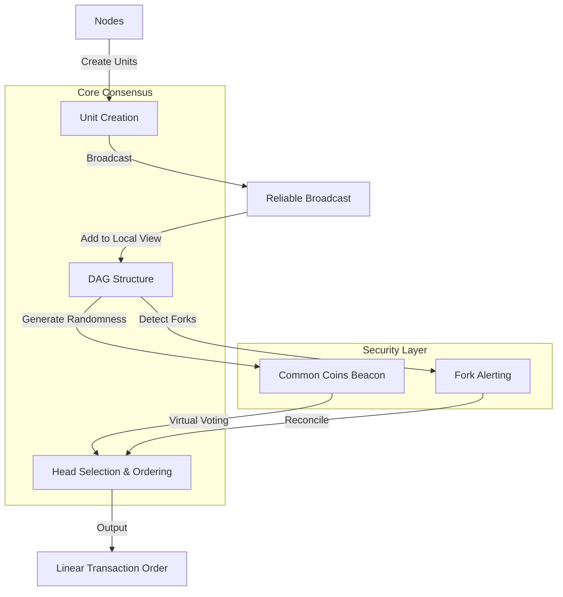
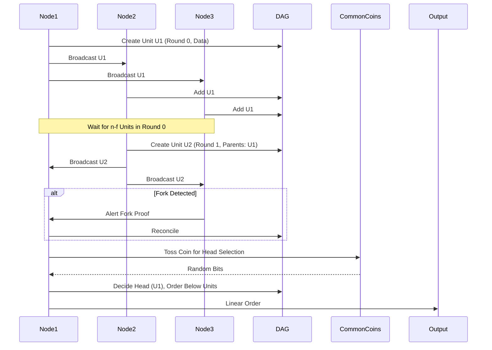

# Comprehensive Analysis of the AlephBFT Consensus Mechanism

## Introduction

The AlephBFT consensus protocol is an asynchronous Byzantine Fault Tolerant (BFT) mechanism designed for efficient atomic broadcast in networks with potentially malicious nodes. It builds upon prior work in asynchronous BFT systems, such as HoneyBadgerBFT, by reducing asymptotic latency while maintaining optimal communication complexity and eliminating the need for a trusted dealer through a novel randomness beacon (Gągol et al., 2019). AlephBFT organizes transactions into a Directed Acyclic Graph (DAG) and uses common coins for randomness, ensuring safety, liveness, and scalability in decentralized systems like the Aleph Zero blockchain (Aleph Zero, 2025).

This report provides a detailed explanation of the mechanism, including pseudo code snippets derived from the protocol's conceptual implementation (referencing the Aleph Node codebase at https://github.com/Cardinal-Cryptography/aleph-node, which integrates AlephBFT via crates), visual representations via Mermaid diagrams, a SWOT analysis, and a comparative analysis with other consensus mechanisms such as PBFT, HotStuff, Tendermint, and HoneyBadgerBFT. The analysis is based on academic papers, implementation details, and comparative studies.

## Detailed Mechanism Explanation

AlephBFT operates in an asynchronous network model, tolerating up to f < n/3 Byzantine faults, where n is the number of nodes. It achieves consensus by constructing a DAG of units (containing transactions), using fork alerting for malicious behavior detection, and employing a trustless randomness beacon for common coins to facilitate ordering.

### Core Components

- **Unit Creation**: Nodes create units asynchronously, each containing transactions, metadata (creator ID, round), and references to parent units from the previous round. Units are broadcast reliably, and creation is gated by having at least n - f parents available (Gągol et al., 2019).

- **DAG Structure**: Units form a DAG, where edges represent dependencies. This structure allows parallel processing and helps in achieving a total order without a single leader.

- **Ordering**: Transactions are ordered by selecting "heads" in each round using virtual voting and common coins. The final order is derived by traversing the DAG downward from decided heads.

- **Common Coins**: A trustless ABFT Randomness Beacon generates shared random values without a trusted setup, used for randomness in voting and head selection.

- **Fork Alerting**: Detects equivocation (forks) by broadcasting proofs, allowing nodes to reconcile and ban malicious actors.

In the Aleph Zero implementation, AlephBFT integrates with PoS: A rotating committee of validators (e.g., 128+) proposes blocks on the DAG, ensuring decentralization and performance metrics for incentives (Aleph Zero, 2025).

### Pseudo Code Overview

The following pseudo code, inspired by the AlephBFT paper and the aleph-node GitHub repository (which uses Rust crates for integration), illustrates key algorithms. It is presented in a Rust-like syntax for clarity, focusing on core logic with minimal prose. Helper functions are omitted for brevity.

#### Constants and Structures

```rust
// Constants
const N: u32;  // Number of nodes
const F: u32 = (N - 1) / 3;  // Max malicious nodes

// Unit Structure
struct Unit {
    creator: u32,
    round: u32,
    data: Data,
    parents: Vec<Hash>,  // Hashes of parent units from previous round
    control_hash: Hash,  // Hash of parents to prevent malice
    signature: Signature,
}

// DAG Structure
struct DAG {
    units: Vec<Unit>,  // All known units
    // ... (methods for adding, querying by round, etc.)
}
```

#### Unit Creation Rules

```rust
fn can_create(r: u32, dag: &DAG, own_id: u32) -> bool {
    if r == 0 {
        return true;
    }
    // Check own unit in r-1
    if !has_own_unit_in_round(r - 1, dag, own_id) {
        return false;
    }
    // Check at least N - F units in r-1
    if count_units_in_round(r - 1, dag) < N - F {
        return false;
    }
    true
}
```

#### Creator Task

```rust
fn creator_task(own_id: u32, dag: &mut DAG, input_stream: InputStream) {
    for r in 0..MAX_ROUND {
        while !can_create(r, dag, own_id) {
            // Wait for more units
        }
        let parents = select_parents(r - 1, dag, N - F);  // At least N-F distinct creators
        let data = input_stream.poll();
        let u = Unit {
            creator: own_id,
            round: r,
            data,
            parents: parents.iter().map(|p| p.hash()).collect(),
            control_hash: hash(&parents),
            signature: sign(&[own_id, r, data, control_hash]),
        };
        broadcast(&u);  // Using Reliable Broadcast
        wait(CREATE_DELAY);
    }
}
```

#### Dissemination and Fork Detection

```rust
// Dissemination (simplified)
fn receive_unit(u: Unit, dag: &mut DAG) {
    if valid_unit(&u, dag) {
        dag.add(u);
    }
}

// Fork Detection and Alerting (SickAleph variant)
fn detect_fork(u1: Unit, u2: Unit) {
    if u1.creator == u2.creator && u1.round == u2.round && u1.hash() != u2.hash() {
        let proof = (u1, u2);
        broadcast_alert(proof, highest_chain());  // RBC broadcast alert with proof and committed chain
        // Process alerts to ban forker or commit to variant
    }
}
```

#### Common Coins Setup and Toss

```rust
// Common Coins Setup (ABFT-Beacon)
fn beacon_setup(dag: &DAG) {
    // Round 0: Emit key box (polynomial for threshold sig)
    let key_box = generate_key_box();
    create_unit_with_data(key_box, 0);

    // Round 3: Vote on key set correctness
    let votes = collect_votes_on_keys(dag);
    create_unit_with_data(votes, 3);

    // Round 6: Choose head to combine keys
    let head = choose_head(3, dag);
    let key_set = combine_keys_from_head(head);
    // Form MultiCoin sources
}

// Common Coin Toss
fn toss(m: u32, key_set: KeySet) -> Bits {
    let share = create_share(m, key_set);
    broadcast(share);
    let shares = collect_shares(F + 1);
    extract_random_bits(shares)
}
```

#### Ordering and Head Selection

```rust
// Ordering from DAG
fn order_data(dag: &DAG) -> Vec<Data> {
    let mut order = vec![];
    let mut batches = vec![];
    for r in 0..max_round(dag) {
        let head_opt = head(r, dag);
        if head_opt.is_none() {
            break;
        }
        let head = head_opt.unwrap();
        let mut new_batch = below(&head, dag);  // All units reachable downward
        remove_previous_batches(&mut new_batch, &batches);
        new_batch.sort();  // Canonical order
        batches.push(new_batch.clone());
        for u in new_batch {
            order.push(u.data);
        }
    }
    order
}

// Head Selection
fn head(r: u32, dag: &DAG) -> Option<Unit> {
    if max_round(dag) < r + 3 {
        return None;
    }
    let units = units_in_round(r, dag).sorted();  // Canonical sort, possibly using previous head
    for u in units {
        match decide(&u, dag) {
            Some(true) => return Some(u),
            Some(false) => continue,
            None => return None,
        }
    }
    None  // Should not reach if enough units
}

// Decide Function (Virtual Voting with Common Random Coin)
fn decide(u: &Unit, dag: &DAG) -> Option<bool> {
    // Virtual voting from higher rounds
    // Use common coin for randomness in voting rounds
    let coin_round = u.round + 4;  // Example, actual uses timing rounds
    let coin = toss(coin_round, key_set());
    // Votes based on whether higher units "see" u (have path to it)
    let votes = collect_votes(u, dag);
    if unanimous_yes(votes, N - F) {
        Some(true)
    } else if unanimous_no(votes, N - F) {
        Some(false)
    } else {
        None  // Not decided yet
    }
}
```

These snippets highlight the protocol's security features: tolerance to f malicious nodes, asynchronous safety, liveness, and censorship resilience.

## Visual Representations

#### Architecture Diagram (Mermaid Flowchart)

The following Mermaid diagram illustrates the high-level architecture of AlephBFT, showing interactions between nodes, the DAG, and key processes.



#### Sequence Diagram (Mermaid Sequence)

This sequence diagram depicts the flow for unit creation, dissemination, and ordering in a simplified scenario with three nodes.



These diagrams make the asynchronous and parallel nature of AlephBFT clearer, highlighting how units propagate and consensus emerges from the DAG.

## SWOT Analysis

Based on the protocol's design and applications in systems like Aleph Zero, the following SWOT analysis evaluates AlephBFT's position.

- **Strengths**:
  - Asynchronous operation ensures resilience in unreliable networks, with no timing assumptions (Gągol et al., 2019).
  - High scalability: Supports up to 10,000 TPS, low latency, and enterprise-ready features (CanvasBusinessModel.com, n.d.).
  - Trustless randomness beacon eliminates trusted dealers, enhancing decentralization.
  - Censorship resistance and liveness guarantees even under adversarial conditions.

- **Weaknesses**:
  - Complexity in implementation, particularly the DAG and beacon, may increase development and auditing costs.
  - Reliance on n > 3f fault tolerance, similar to other BFT protocols, limits flexibility in highly adversarial environments.
  - Potential for temporary forks requiring alerting mechanisms, which could introduce overhead.

- **Opportunities**:
  - Adoption in high-throughput blockchains like Aleph Zero for DeFi, NFTs, and enterprise solutions (Gotbit Insights, 2023).
  - Integration with hybrid consensus (e.g., ML-enhanced) to address vulnerabilities (ResearchGate, 2024).
  - Growth in asynchronous BFT demand for global, decentralized networks.

- **Threats**:
  - Competition from optimized synchronous/partially synchronous protocols like HotStuff, which may offer lower latency in stable networks.
  - Evolving attacks on BFT systems, requiring continuous updates.
  - Regulatory scrutiny on PoS-integrated systems regarding decentralization and energy efficiency.

## Comparative Analysis with Other Consensus Mechanisms

AlephBFT is compared below with PBFT (partially synchronous), HotStuff (partially synchronous, linear), Tendermint (partially synchronous, simplified PBFT), and HoneyBadgerBFT (asynchronous). The table summarizes key differences based on network model, complexity, and performance (Decentralized Thoughts, 2019; Decentralized Thoughts, 2023; Yin et al., 2019).

| Feature              | AlephBFT                  | PBFT                     | HotStuff                 | Tendermint               | HoneyBadgerBFT           |
|----------------------|---------------------------|--------------------------|--------------------------|--------------------------|--------------------------|
| **Network Model**   | Asynchronous             | Partially Synchronous   | Partially Synchronous   | Partially Synchronous   | Asynchronous            |
| **Fault Tolerance** | < n/3 Byzantine          | < n/3 Byzantine         | < n/3 Byzantine         | < n/3 Byzantine         | < n/3 Byzantine         |
| **Latency**         | Reduced asymptotic       | High (view changes)     | Low (pipelined)         | Moderate (no view changes) | Higher than Aleph      |
| **Communication Complexity** | Optimal O(n^2) per decision | O(n^2)                 | Linear O(n)             | O(n^2)                  | Optimal O(n^2)          |
| **Randomness**      | Trustless Beacon         | None                    | None                    | None                    | Trusted Dealer          |
| **Responsiveness**  | Asynchronous liveness    | Optimistic              | High                    | Optimistic              | Asynchronous            |
| **Key Advantage**   | No trusted dealer, DAG for ordering | Classic safety         | Simplicity & linearity  | Simplified PBFT         | First async BFT for blockchains |
| **Key Drawback**    | Complexity in async      | Complex view changes    | Assumes eventual sync   | Less efficient in faults| Higher latency          |

AlephBFT stands out in fully asynchronous settings by improving on HoneyBadgerBFT's latency and removing trusted setups, while PBFT and derivatives like Tendermint/HotStuff excel in partially synchronous environments with lower complexity (Miller et al., 2016; Reddit, 2018).

## Conclusion

AlephBFT represents a significant advancement in asynchronous BFT consensus, offering robust security and efficiency for modern blockchains. Its DAG-based approach, combined with innovative randomness, positions it well for scalable applications, though it faces competition from partially synchronous alternatives. Future enhancements could focus on simplifying implementation to broaden adoption.

## References

Aleph Zero. (2025, March 11). AlephBFT consensus. https://docs.alephzero.org/aleph-zero/explore/alephbft-consensus

CanvasBusinessModel.com. (n.d.). Aleph Zero SWOT analysis. https://canvasbusinessmodel.com/products/aleph-zero-swot-analysis

Decentralized Thoughts. (2019, June 23). What is the difference between PBFT, Tendermint, SBFT and HotStuff? https://decentralizedthoughts.github.io/2019-06-23-what-is-the-difference-between/

Decentralized Thoughts. (2023, April 1). What is the difference between PBFT, Tendermint, HotStuff, and HotStuff-2? https://decentralizedthoughts.github.io/2023-04-01-hotstuff-2/

Gągol, A., Leśniak, D., Straszak, D., & Świętek, M. (2019). Aleph: Efficient atomic broadcast in asynchronous networks with Byzantine nodes. arXiv preprint arXiv:1908.05156. https://arxiv.org/abs/1908.05156

Gotbit Insights. (2023, December 7). Aleph Zero and its unique AlephBFT consensus protocol. Medium. https://medium.com/@gotbit_insights/driving-force-behind-technologies-aleph-zero-and-its-unique-alephbft-consensus-protocol-f6e3b7c198c2

Miller, A., Xia, Y., Croman, K., Shi, E., & Song, D. (2016). The honey badger of BFT protocols. Cryptology ePrint Archive. https://eprint.iacr.org/2016/199.pdf

Reddit. (2018, May 10). Compared with traditional PBFT, what advantage does Tendermint have? https://www.reddit.com/r/cosmosnetwork/comments/8i42qa/compared_with_traditional_pbft_what_advantage/

ResearchGate. (2024, January 7). Blockchain security enhancement: An approach towards hybrid consensus algorithms and machine learning techniques. https://www.researchgate.net/publication/377334521_Blockchain_security_enhancement_an_approach_towards_hybrid_consensus_algorithms_and_machine_learning_techniques

Yin, M., Malkhi, D., Reiter, M. K., Gueta, G. G., & Abraham, I. (2019). HotStuff: BFT consensus in the lens of blockchain. arXiv preprint arXiv:1803.05069. https://arxiv.org/pdf/1803.05069