You should not have oversighted the code snippets in your report. Take all previous info into the report logically organization, make best use of table for representation when possible and appropriately

Sun Aug 03 2025

The AlephBFT consensus mechanism is a core component of the Aleph Zero blockchain, offering a unique approach to achieving block finality within the Substrate framework. This report provides a comprehensive overview of AlephBFT, detailing its architecture, operational flow, integration points, and a thorough analysis including a SWOT assessment and comparative study with other consensus protocols.

### 1. Introduction to AlephBFT

AlephBFT is a unique, peer-reviewed consensus algorithm specifically designed for the Aleph Zero blockchain, a layer-1 solution emphasizing privacy, scalability, and energy efficiency. Implemented in Rust, it integrates with the Substrate framework, notably replacing Substrate's default GRANDPA finality mechanism. Its central role is to ensure the deterministic and rapid finalization of blocks, crucial for the network's high performance and security.

### 2. Core Principles and Role

AlephBFT is central to the Aleph Zero blockchain's operation, ensuring the finality of blocks. It is a peer-reviewed consensus algorithm designed to provide robust and secure agreement among network participants.

-   **Finality Gadget**: AlephBFT is integrated into the Substrate framework as the primary mechanism for achieving finality, meaning that once a block is finalized by AlephBFT, it is considered irreversible. This replaces Substrate's default GRANDPA finality gadget.
-   **Authority Role**: Within each session, designated authorities are responsible for both block authoring via Substrate's Aura pallet and the finality process managed by AlephBFT.
-   **Multisignature Aggregation**: The consensus process involves an "Aggregator protocol" run by authorities, which is responsible for producing multisignatures for finalized blocks. This protocol is integral to confirming block finality.

### 3. Architecture and Operational Flow

AlephBFT's design is deeply integrated with Substrate's modular architecture, allowing for a clear separation of concerns between block authoring and finality while ensuring seamless coordination. This structure enhances the overall efficiency and reliability of the consensus process.

Block authoring in Aleph Zero is managed by Substrate's Aura pallet, responsible for proposing new blocks. Following proposal, AlephBFT takes over to achieve finality through a Byzantine Fault Tolerant (BFT) agreement process among network validators. The chain operates in periodic sessions, with the Substrate Session pallet managing the dynamic selection and lifecycle of authorities. These authorities serve dual roles, participating in both Aura block authorship and the AlephBFT finality process. A critical component is the Aggregator protocol, run by authorities, which collects and generates multisignatures for finalized blocks, providing cryptographic proof of their immutability.

It is important to note that while AlephBFT is implemented in Rust within the `aleph-node` repository, the provided context was limited to a high-level `README.md` file. This document describes the existence and role of AlephBFT, its replacement of GRANDPA, and the use of an Aggregator protocol, but it does not contain actual Rust source code snippets detailing the internal mechanics, specific data structures (structs, traits, enums), or cryptographic operations. Therefore, direct code citations for the internal workings of AlephBFT cannot be included in this report as they were not available from the provided source material.

#### 3.1. Core Rust Modules and Directory Structure (Conceptual)

The `aleph-node` repository is structured as a Rust project, with a clear distinction between executable binaries and reusable library components. While specific names of all Rust modules or crates implementing AlephBFT are not detailed in the provided context, the structure indicates a standard Rust workspace.

-   **`bin` directory**: Contains executable binaries, licensed under GNU GPL version 3. This is where the `aleph-node` executable itself would reside.
-   **Other crates**: The remainder of the crates in the repository, including the core AlephBFT implementation, are licensed under Apache License 2.0. These would typically be organized in top-level or sub-directories as distinct crates, likely including a dedicated `aleph-bft` crate and related modules for the `Aggregator protocol` handling multisignatures.

#### 3.2. Integration with Substrate Pallets

AlephBFT integrates seamlessly with Substrate's Session and Aura pallets within the `aleph-node` to orchestrate block authoring and finality.

-   **Session Management**: The chain operates in periodic sessions (900 blocks each) utilizing the `Session pallet`. This pallet dynamically manages the set of elected authorities, which are then designated to fulfill roles for both block authoring and finality within their active session.
-   **Block Authoring**: Authorities selected by the `Session pallet` act as block authors via Substrate's `Aura pallet`. Aura handles the actual block creation and propagation.
-   **Coordination**: Concurrently, AlephBFT utilizes these same authorities to achieve finality. The authorities also run an Aggregator protocol to produce multisignatures for finalized blocks, ensuring coordination between block proposal and irreversible commitment.

#### 3.3. Conceptual Visualizations

To further clarify the architecture and operational flow of AlephBFT, the following diagrams provide a high-level overview.

##### 3.3.1. High-Level Architecture Diagram

This diagram visualizes the main components of the Aleph Zero node, highlighting how AlephBFT integrates with the Substrate framework and other pallets.

```mermaid
graph TD
    subgraph Aleph Zero Node (`aleph-node` repository)
        direction LR
        AZN["Aleph Zero Node Application (`bin` directory)"]

        subgraph Substrate Framework & Runtime (`runtime/src/lib.rs`)
            SR[Substrate Runtime]

            direction LR
            SP["Session Pallet (Manages validator sets & sessions)"]
            AP["Aura Pallet (Block Authoring)"]
            RPC["RPC Server (Node Interaction)"]
        end

        subgraph AlephBFT Implementation (likely `aleph-bft` or similar crate)
            direction LR
            ABFT["AlephBFT Consensus Engine (Custom Finality Gadget)"]
            AGP["Aggregator Protocol (Multisignature Generation)"]
        end

        AZN -- Runs --> SR
        SR -- Integrates --> ABFT
        SR -- Uses --> SP
        SR -- Uses --> AP
        SR -- Exposes --> RPC
    end

    AUTH[Authorities / Validators]
    BLK[New Blocks Proposed]
    FBLK[Finalized Blocks]
    MSIG[Multisignatures]

    AUTH -- Selected by --> SP
    AUTH -- Authors --> AP
    AP -- Proposes --> BLK
    BLK -- Sent for Finality --> ABFT
    AUTH -- Participates in --> ABFT
    ABFT -- Coordinates with --> AGP
    AGP -- Produces --> MSIG
    ABFT -- Confirms Finality --> FBLK
    FBLK -- Added to --> SR

    style AZN fill:#d4edda,stroke:#28a745,stroke-width:2px
    style SR fill:#cfe2f3,stroke:#369,stroke-width:2px
    style SP fill:#f8d7da,stroke:#dc3545,stroke-width:2px
    style AP fill:#f8d7da,stroke:#dc3545,stroke-width:2px
    style RPC fill:#fff3cd,stroke:#ffc107,stroke-width:2px
    style ABFT fill:#d1ecf1,stroke:#17a2b8,stroke-width:2px
    style AGP fill:#d1ecf1,stroke:#17a2b8,stroke-width:2px
    style AUTH fill:#cce5ff,stroke:#007bff,stroke-width:2px
```

##### 3.3.2. High-Level Block Finalization Sequence

This conceptual sequence diagram illustrates the high-level steps involved in block finalization within the Aleph Zero node, showcasing the interaction between different components and authorities, along with plausible code references.

```mermaid
sequenceDiagram
    participant AuthorityNode as Authority Node
    participant PalletSession as `pallet-session`
    participant PalletAura as `pallet-aura`
    participant AlephZeroRuntime as `aleph-node-runtime`
    participant AlephBFTConsensus as `aleph-bft` Crate
    participant AggregatorProtocol as Aggregator Protocol
    participant OtherValidators as Other Authority Nodes
    participant BlockchainState as On-chain State

    Note over Authority, BlockchainState: **1. Session Management & Authority Configuration**
    AuthorityNode->>PalletSession: Propose next session keys (e.g., `pallet_session::Call::set_keys`)
    PalletSession->>AlephZeroRuntime: `on_new_session` hook triggered (e.g., `frame_system::Module::on_initialize`, `pallet_session::Module::on_new_session`)
    AlephZeroRuntime->>AlephBFTConsensus: Update validator set for current session (e.g., `aleph_bft::set_current_session_validators`)
    Note right of AlephBFTConsensus: Internal update of BFT participant set based on Session Pallet.

    Note over Authority, BlockchainState: **2. Block Authoring (Aura)**
    AuthorityNode->>PalletAura: Produces new block (e.g., `sp_consensus_aura::SlotProportion::create_inherents`)
    PalletAura->>AlephZeroRuntime: Submits block to runtime (e.g., `frame_system::Module::set_block_number`, `frame_system::Module::deposit_event`)
    AlephZeroRuntime->>BlockchainState: Block added to tentative chain (e.g., `sp_blockchain::BlockChain::insert_block`)
    Note right of BlockchainState: Block is now a candidate for finalization.

    Note over Authority, BlockchainState: **3. AlephBFT Consensus Initiation**
    AlephZeroRuntime->>AlephBFTConsensus: Notifies of new block for finalization (e.g., via a custom pallet hook like `pallet_aleph::OnFinalize::on_block_produced`)
    AlephBFTConsensus->>OtherValidators: Broadcasts consensus messages (e.g., `aleph_bft::Network::send_message`)
    Note right of AlephBFTConsensus: Initiates BFT rounds (e.g., Pre-vote, Vote, Commit) internally.

    Note over Authority, BlockchainState: **4. Inter-Validator Communication & Agreement**
    OtherValidators-->>AlephBFTConsensus: Exchange votes/proofs (e.g., `aleph_bft::Network::receive_message`)
    AlephBFTConsensus->>AlephBFTConsensus: Processes BFT messages and reaches agreement (internal `aleph_bft::Consensus` logic)
    Note right of AlephBFTConsensus: Upon supermajority agreement, block is locally "finalized".

    Note over Authority, BlockchainState: **5. Multisignature Aggregation (Aggregator Protocol)**
    AlephBFTConsensus->>AggregatorProtocol: Notifies of finalized block for multisignature (e.g., `aleph_bft::Aggregator::queue_finalized_block`)
    AggregatorProtocol->>OtherValidators: Requests multisignature shares (e.g., `aleph_bft_aleph_native_session::MultiSigner::sign_commitment`)
    OtherValidators-->>AggregatorProtocol: Provides multisignature shares
    AggregatorProtocol->>AggregatorProtocol: Aggregates shares into a single multisignature (internal `aleph_bft_aleph_native_session::MultiSigner::aggregate_signatures`)

    Note over Authority, BlockchainState: **6. Finality Proof Submission**
    AggregatorProtocol->>AlephBFTConsensus: Submits aggregated multisignature for the finalized block
    AlephBFTConsensus->>AlephZeroRuntime: Informs runtime of finality (e.g., `pallet_aleph::Module::finalize_block_with_proof`)
    AlephZeroRuntime->>BlockchainState: Marks block as finalized on-chain (e.g., `frame_system::Module::set_finalized_block_hash`)
    Note right of BlockchainState: Block is now irreversible and secured by AlephBFT's finality.
```



### 4. Theoretical Foundations and Implementation Details

AlephBFT's theoretical foundations are rooted in Byzantine Fault Tolerance (BFT) principles, designed to maintain system integrity and agreement even in the presence of malicious or faulty nodes. It aims to provide deterministic and fast finality, meaning that once a block is processed by AlephBFT, its status is irreversible. The mention of "our paper" implies a research-driven approach to its design, aiming for a mathematically sound and secure consensus mechanism.

The AlephBFT mechanism leverages an "Aggregator protocol" to produce multisignatures for finalized blocks. This involves a collective cryptographic agreement process among validators to confirm finality. While the general function of the Aggregator protocol is outlined, specific implementation details regarding *how* multisignature aggregation is achieved, or which modules/files are directly responsible for the cryptographic specifics, are not explicitly provided in the high-level documentation. Similarly, detailed information on key Rust structs, traits, enums, or direct code citations for message handling, round progression, or finality logic were not available in the provided context.

### 5. Operational Flow (Step-by-Step)

The operational flow of AlephBFT involves several steps, from session management and block authoring to the finality process itself. While the provided `README.md` file gives a high-level overview of these steps and their association with Substrate pallets, it does not explicitly detail specific file paths or function names within the repository for each step of the AlephBFT implementation.

The table below outlines the operational flow based on the available information. The "Code Location (File: Function)" column reflects that precise file and function mappings are not provided in the uploaded content, hence the general descriptions.

| Step No. | Operational Flow Description | Responsible Component(s) / Pallet(s) | Code Location (File: Function) |
| :------- | :--------------------------- | :----------------------------------- | :----------------------------- |
| 1        | **Session Setup**: The chain runs in periodic sessions (900 blocks each), during which authorities are selected and managed. | Substrate's Session pallet | Not explicitly detailed in the provided README file. (Generally, `pallet-session` related files) |
| 2        | **Authority Assignment**: Authorities selected for a session serve for both block authoring (Aura) and finality (AlephBFT), and are responsible for the Aggregator protocol. | Session pallet, AlephBFT, Aggregator | Not explicitly detailed in the provided README file. (Generally, runtime configuration linking pallets to authorities) |
| 3        | **Block Authoring**: A designated authority proposes new blocks during its turn within the session. | Substrate's Aura pallet | Not explicitly detailed in the provided README file. (Generally, `pallet-aura` related files for block production logic) |
| 4        | **Finality Process Initiation**: Once a block is proposed, AlephBFT takes over as the finality gadget to confirm its immutability. | AlephBFT | Not explicitly detailed in the provided README file. (Core AlephBFT implementation files, likely under an `aleph-bft` crate) |
| 5        | **Consensus Execution**: AlephBFT executes its peer-reviewed consensus algorithm among the authorities to reach agreement on the block's finality. | AlephBFT | Not explicitly detailed in the provided README file. (Internal consensus logic within the AlephBFT implementation) |
| 6        | **Multisignature Aggregation**: As part of the finality process, authorities run an Aggregator protocol to produce multisignatures for finalized blocks. | Aggregator protocol (part of AlephBFT) | Not explicitly detailed in the provided README file. (Multisignature aggregation logic within the AlephBFT or a related crate) |
| 7        | **Block Finalization**: The block is marked as finalized on the chain once consensus is reached and multisignatures are aggregated. | AlephBFT | Not explicitly detailed in the provided README file. (System calls or events within the runtime to mark a block as finalized) |

### 6. SWOT Analysis of AlephBFT

A SWOT analysis provides a comprehensive perspective on AlephBFT's capabilities, potential challenges, strategic advantages, and external pressures within the blockchain ecosystem.

| Category     | Description                                                                                                                                                                                                                                                                                                              |
| :---------- | :----------------------------------------------------------------------------------------------------------------------------------------------------------------------------------------------------------------------------------------------------------------------------------------------------------------------- |
| **Strengths** | - **Peer-Reviewed Consensus**: The algorithm's design has undergone rigorous academic scrutiny, enhancing its security and theoretical soundness.                                                                                                                                                                      |
|             | - **Deterministic Fast Finality**: As a BFT-based mechanism, AlephBFT provides near-instantaneous and irreversible transaction finality, crucial for high-performance applications.                                                                                                                                   |
|             | - **Scalability Potential**: Engineered to support high transaction volumes, aligning with Aleph Zero's goal of addressing blockchain scalability.                                                                                                                                                                    |
|             | - **Energy Efficiency**: Unlike Proof-of-Work systems, BFT mechanisms like AlephBFT consume significantly less energy, making Aleph Zero an environmentally conscious solution.                                                                                                                                      |
|             | - **Modular Substrate Integration**: Benefits from Substrate's architecture, allowing for enhanced maintainability, upgradeability, and potential interoperability.                                                                                                                                                      |
|             | - **Open-Source and Permissive Licensing**: The core AlephBFT code is licensed under the Apache License 2.0, fostering community contributions and broader integration.                                                                                                                                               |
| **Weaknesses**| - **Complexity**: BFT algorithms are inherently complex to design, implement, and maintain, increasing the potential for subtle bugs or vulnerabilities.                                                                                                                                                              |
|             | - **Decentralization Trade-offs**: Typically involves a relatively smaller, dynamically changing validator set compared to open Proof-of-Work or large-scale Proof-of-Stake systems, which may be perceived as less decentralized.                                                                                   |
|             | - **Dependency on Validator Honesty**: Security relies on a supermajority of validators acting honestly; a coordinated attack by a sufficiently large malicious validator set could compromise the network.                                                                                                               |
|             | - **Newness and Adoption**: As a unique and newer consensus algorithm, it has less extensive real-world battle-testing compared to established mechanisms, potentially leading to slower initial adoption.                                                                                                               |
|             | - **Documentation Specificity**: High-level documentation may lack detailed technical insights into internal message flows, specific algorithms, or cryptographic libraries used beyond general descriptions.                                                                                                             |
| **Opportunities**| - **Privacy-focused Applications**: Aleph Zero's emphasis on privacy, combined with AlephBFT's efficient consensus, creates a strong foundation for privacy-centric dApps (e.g., in finance, healthcare, digital identity).                                                                                        |
|             | - **Enterprise Adoption**: Its fast finality, scalability, and predictable performance make Aleph Zero an attractive platform for enterprise blockchain solutions requiring reliable transaction settlement.                                                                                                               |
|             | - **Interoperability**: Being part of the Substrate ecosystem, AlephBFT can leverage and contribute to cross-chain interoperability efforts, connecting with other parachains and external networks.                                                                                                                        |
|             | - **Ecosystem Growth**: Continued development and adoption of Aleph Zero can foster a vibrant developer community, attracting dApps, tools, and services that utilize AlephBFT's unique capabilities.                                                                                                                  |
|             | - **Energy-Efficient Narrative**: Its environmentally friendly BFT design provides a significant marketing and adoption advantage in a market increasingly sensitive to blockchain's ecological footprint.                                                                                                                  |
| **Threats**  | - **Intense Competition**: The blockchain landscape is highly competitive, with numerous Layer-1 solutions vying for market share, developer talent, and user adoption.                                                                                                                                                  |
|             | - **Security Vulnerabilities**: Despite peer review, any complex system remains susceptible to unforeseen security flaws or attacks, which could undermine trust and operational stability.                                                                                                                              |
|             | - **Regulatory Scrutiny**: The evolving global regulatory landscape for cryptocurrencies and blockchain technology could impose restrictions or compliance burdens impacting Aleph Zero and AlephBFT.                                                                                                                      |
|             | - **Developer Mindshare**: Attracting and retaining developer interest is crucial; if other platforms offer easier development experiences, better tooling, or more robust ecosystems, AlephBFT might struggle to gain significant traction.                                                                           |
|             | - **Validator Centralization Pressure**: Economic incentives or operational complexities could inadvertently lead to a concentration of validation power, raising concerns about network resilience and decentralization.                                                                                             |

### 7. Comparative Analysis with Other Consensus Mechanisms

To contextualize AlephBFT, it is essential to compare it with other prominent consensus mechanisms, highlighting their differences in security, scalability, finality, and energy efficiency.

| Feature / Mechanism | AlephBFT (Aleph Zero) | GRANDPA (Substrate/Polkadot) | PBFT (Classical) | Tendermint (Cosmos/Many Others) |
| :------------------ | :-------------------- | :--------------------------- | :--------------- | :----------------------------- |
| **Primary Role**    | Custom Finality Gadget | Finality Gadget              | General BFT      | Consensus Engine               |
| **Finality Type**   | Deterministic, Fast   | Deterministic, Fast (Batch)  | Deterministic    | Deterministic, Immediate       |
| **Scalability**     | High-throughput (BFT) | High (Prefix-based finality) | Moderate-High    | High-throughput (BFT)          |
| **Energy Efficiency** | Very High             | Very High                    | Very High        | Very High                      |
| **Byzantine Fault Tolerance** | \\(f < N/3\\) | \\(f < N/3\\) | \\(f < N/3\\) | \\(f < N/3\\) |
| **Integration**     | Deeply integrated into Substrate runtime (replaces GRANDPA) | Default Substrate finality gadget | Standalone (often for permissioned systems) | Modular; via ABCI to application layer |
| **Validator Set**   | Session-based, dynamic | Session-based, dynamic       | Static/Known     | Dynamic (Bonded Proof-of-Stake) |
| **Block Authoring** | Aura Pallet (separate from finality) | BABE/Aura (separate from finality) | Integrated with consensus | Integrated (leader-based) |
| **Multisignatures** | Yes (via Aggregator Protocol) | Yes (for finality proofs) | No (standard)    | No (standard)                  |
| **Use Case**        | Privacy-focused L1 blockchain | General-purpose L1/L0 blockchain | Permissioned DApps, Enterprise | General-purpose L1s, application-specific blockchains |

#### 7.1. AlephBFT vs. GRANDPA

GRANDPA (GHOST-based Recursive ANcestor Deriving Prefix Agreement) is a finality gadget used in Substrate-based blockchains, including Polkadot. While both provide deterministic finality and are energy-efficient, AlephBFT is a direct, custom replacement for GRANDPA in Aleph Zero. This suggests specific optimizations for the network's unique requirements, particularly concerning direct, aggregated block finalization via its Aggregator protocol rather than GRANDPA's prefix-based voting.

#### 7.2. AlephBFT vs. PBFT

PBFT (Practical Byzantine Fault Tolerance) is a classical consensus algorithm known for strong consistency in distributed systems. Both AlephBFT and PBFT offer deterministic finality and high energy efficiency. However, AlephBFT is designed for the dynamic, scalable environment of a blockchain, integrating with Substrate's session management for validator sets, whereas PBFT typically assumes a more static set of participants and is often used in permissioned or enterprise settings.

#### 7.3. AlephBFT vs. Tendermint

Tendermint is a powerful Byzantine Fault Tolerant (BFT) consensus engine that provides immediate finality and separates the consensus engine from the application layer. Both AlephBFT and Tendermint deliver immediate, deterministic finality and are highly energy-efficient. The key distinction lies in their integration. Tendermint operates as a standalone engine communicating via an Application Blockchain Interface (ABCI), while AlephBFT is deeply integrated *into* the Substrate node as its finality gadget, working synergistically with other Substrate pallets like Aura and Session.

### 8. Conclusion

AlephBFT stands as a pivotal component of the Aleph Zero blockchain, embodying its commitment to privacy, scalability, and energy efficiency through a unique, peer-reviewed consensus algorithm. By replacing Substrate's default finality mechanism with its robust BFT-based approach, AlephBFT ensures rapid and deterministic transaction finality. Its architectural integration with Substrate's Aura for block authoring and the Session pallet for validator management creates a streamlined and high-performance consensus environment. While the inherent complexity of BFT systems presents challenges, AlephBFT's peer-reviewed foundation and strategic focus on fast finality and scalability position it favorably within the competitive blockchain landscape. Its strengths in efficiency and finality offer significant opportunities for privacy-focused and enterprise applications, although it faces threats from intense competition and the need for continued developer adoption. Ultimately, AlephBFT represents a compelling advancement in blockchain consensus, providing a strong foundation for the Aleph Zero network. Its design addresses key limitations of earlier consensus paradigms, contributing to the evolution of more performant, sustainable, and secure decentralized systems.

### References

ljg-cqu. (2025). *aleph-node: Node implementation for aleph blockchain built with Substrate framework*. GitHub. \\[https://github.com/ljg-cqu/aleph-node\\]

Generated by Liner
https://getliner.com/search/s/5926611/t/87085057