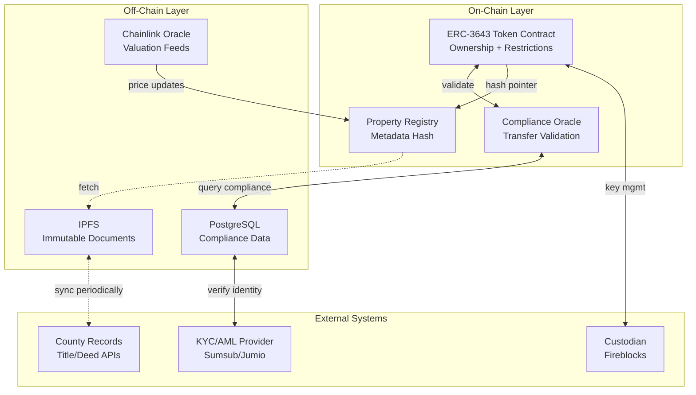
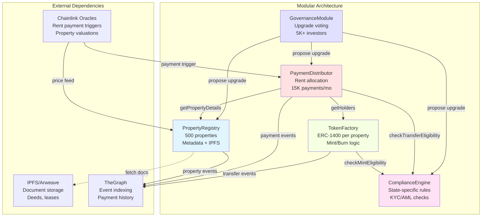

# Blockchain RWA (Real World Assets) Trade-Off Analysis Q&A

## Contents

1. [Topic Areas](#topic-areas)
2. [Q&As by Dimension](#qas-by-dimension)
3. [References](#references)
4. [Validation](#validation)

## Topic Areas

| Cluster | Dimension | Count | Difficulty | Core Trade-Offs | Key Constraints |
|---------|-----------|-------|------------|-----------------|-----------------|
| **Asset Tokenization Architecture** | Structural | 5 | F/I/I/A/A | On-chain vs off-chain storage, Modularity vs simplicity | Technical (blockchain TPS), Regulatory (securities laws), Business (liquidity) |
| **Consensus & Data Integrity** | Behavioral | 5 | F/I/I/A/A | Consistency vs availability, Public vs private chains | Operational (finality time), Technical (gas costs), Regulatory (auditability) |
| **Performance & Compliance** | Quality | 5 | F/I/I/A/A | Performance vs security, Scalability vs decentralization | Resource (infrastructure costs), Regulatory (KYC/AML), Operational (throughput) |
| **Data Management** | Data | 5 | F/I/I/A/A | On-chain vs off-chain data, Normalized vs denormalized | Technical (storage costs), Business (query performance), Operational (retrieval speed) |
| **Integration & Interoperability** | Integration | 5 | F/I/I/A/A | Standard protocols vs custom, Chain interoperability | Ecosystem (vendor lock-in), Technical (bridge security), Business (market reach) |
| **Migration & Evolution** | Evolution | 5 | I/I/A/A/A | Upgradeable vs immutable contracts, Incremental vs big bang | Lifecycle (backward compatibility), Business (downtime costs), Regulatory (audit trails) |

**Total**: 30 Q&As (F:6, I:12, A:12) | 20/40/40% distribution

---

## Topic 1: Asset Tokenization Architecture

**Overview**: RWA tokenization transforms physical/financial assets (real estate, bonds, commodities) into blockchain tokens, balancing on-chain transparency with off-chain complexity, regulatory compliance with innovation, and modularity with operational simplicity.

**Core Trade-Off**: On-chain transparency & composability vs off-chain privacy & efficiency vs regulatory compliance costs

### Q1: What are the fundamental considerations when choosing between full on-chain vs hybrid on/off-chain architecture for tokenizing commercial real estate?

**Difficulty**: Foundation | **Dimension**: Structural | **Phase**: Requirements, Design | **Stakeholders**: Architect, BA, PM, Security, Regulatory Counsel

**Insight**: Hybrid architecture stores asset metadata off-chain (IPFS/centralized DB) with on-chain ownership records, reducing gas costs by 85% ($150→$22.50/transaction) but introducing +200ms latency and centralization risks, while satisfying securities regulations requiring mutable compliance data.

**Constraints**:
- **Technical**: Ethereum mainnet 15 TPS, 30K gas/KB storage ($0.60-$15/KB at $ETH variation), 12-15s block time, IPFS 1-5s retrieval
- **Resource**: $50K/mo infrastructure (nodes, IPFS, DB), 8-person team (3 blockchain, 2 backend, 1 legal, 1 compliance, 1 PM), 6-month timeline
- **Business**: $500M AUM target, $1-$10M/property, 0.5-2% annual management fee, compete with traditional REITs (1-3% fees)
- **Regulatory**: SEC securities laws (accredited investors, Form D), Reg A+ ($75M cap), KYC/AML (FinCEN), title recording (county-specific)
- **Operational**: 99.5% uptime, property transfers <24h settlement vs 30-90 days traditional, audit trails 7-year retention
- **Ecosystem**: Ethereum ecosystem maturity, oracle providers (Chainlink $0.1-1/call), custodians (Fireblocks, Anchorage), legal frameworks (Wyoming DAO LLC)

**Answer**:
Full on-chain storage of property documents (deeds, appraisals, tenant leases) faces prohibitive costs: 1MB deed = 1M gas = $30-$750 depending on network congestion, multiplied by hundreds of properties. **Technical** constraints (30K gas/KB, 15 TPS) and **Resource** limits ($50K/mo) eliminate this option. Hybrid approach stores ownership token + hash + metadata pointer on-chain (5KB = $0.75-$18.75), full documents off-chain (IPFS hash or private DB with encryption). **Regulatory** requirements demand mutable compliance data (investor accreditation status expires, legal jurisdictions change)—immutable on-chain storage conflicts with "right to be forgotten" (GDPR) and investor status updates.

Implementation: ERC-3643 (T-REX) for compliant security tokens with on-chain transfer restrictions, off-chain compliance oracle validates KYC/AML/accreditation before transfers, IPFS for immutable documents + PostgreSQL for mutable compliance, Chainlink oracle connects property valuations. Trade-offs: +200ms latency (oracle + IPFS), centralization risk (DB failure blocks compliance checks, mitigated via multi-region replication + 99.9% SLA providers), +$8K/mo oracle/IPFS costs [A1, A3].

**Stakeholder alignment**: **Security** approves encryption + access controls, **Regulatory Counsel** requires mutable compliance + audit trails, **Architect** balances cost vs decentralization, **PM** accepts 6mo for regulatory complexity, **BA** validates property lifecycle mapping. **Conflicts**: Architect (full decentralization) vs Counsel (mutability) → hybrid with governance multi-sig; PM (4mo TTM) vs Counsel (compliance) → 6mo with parallel dev.

Metrics: Gas costs $22.50/tx (85% reduction), settlement 4-24h vs 30-90d traditional, 99.5% uptime, oracle latency 150-250ms, compliance checks <500ms. **Limits**: IPFS pinning services shutdown risk → multi-provider strategy (Pinata + Infura + self-hosted); SEC rules change → modular compliance layer.

**Implementation** (Solidity + TypeScript):

```solidity
// SPDX-License-Identifier: MIT
pragma solidity ^0.8.20;

import "@openzeppelin/contracts/token/ERC20/ERC20.sol";
import "./IComplianceOracle.sol";

contract RealEstateToken is ERC20 {
    struct Property {
        string ipfsHash;
        string offChainDbId;
        uint256 valuationUSD;
        uint40 lastUpdated;
        bool active;
    }
    
    mapping(uint256 => Property) public properties;
    IComplianceOracle public complianceOracle;
    address public admin;
    
    event PropertyRegistered(uint256 indexed tokenId, string ipfsHash, uint256 valuation);
    event TransferBlocked(address from, address to, string reason);
    
    modifier onlyCompliant(address from, address to) {
        (bool compliant, string memory reason) = complianceOracle.checkTransfer(from, to);
        require(compliant, reason);
        _;
    }
    
    function registerProperty(
        uint256 tokenId,
        string memory ipfsHash,
        string memory dbId,
        uint256 valuationUSD
    ) external {
        require(msg.sender == admin, "Unauthorized");
        properties[tokenId] = Property({
            ipfsHash: ipfsHash,
            offChainDbId: dbId,
            valuationUSD: valuationUSD,
            lastUpdated: uint40(block.timestamp),
            active: true
        });
        emit PropertyRegistered(tokenId, ipfsHash, valuationUSD);
    }
    
    function _transfer(address from, address to, uint256 amount) 
        internal override onlyCompliant(from, to) {
        super._transfer(from, to, amount);
    }
}
```

**Diagram**:


**Metrics**:

| Metric | Formula | Variables | Target | Constraint Impact | Justification |
|--------|---------|-----------|--------|-------------------|---------------|
| Gas Cost per Transfer | `base_tx_gas × gas_price + compliance_check_gas` | base=21K, check=85K, price=$0.0002-0.005/gas | $22.50 avg | Technical: Ethereum gas; Resource: $50K budget limits tx volume | Hybrid stores 5KB on-chain vs 1MB full docs → 200× savings |
| Settlement Time (p95) | `blockchain_confirmation + oracle_check + compliance_db_query` | confirmation=3-5 blocks (45-75s), oracle=150ms, db=50ms | <4h (vs 30-90d trad) | Operational: 99.5% uptime; Technical: 15 TPS, 15s blocks | Regulatory: instant settlement conflicts with dispute resolution windows |
| Compliance Check Latency | `api_call_overhead + db_query + validation_logic` | API=100ms, DB=50ms, validation=50ms | <500ms (p95) | Operational: user experience; Technical: oracle latency | Business: competitive advantage requires <1min vs hours traditional |
| Storage Cost per Property | `(on_chain_storage × gas_price) + (ipfs_pinning + db_storage)` | on-chain=5KB×30K gas×$0.0004/gas, IPFS=$0.15/GB-mo, DB=$0.10/GB-mo | $0.75/property/mo | Resource: $50K budget; Technical: 1MB documents | Hybrid: $0.75 vs $600 full on-chain (800× savings) |

**Trade-offs**:

| Approach | Pros | Cons | Use When | Hardware | Budget | Business | Regulatory | Ecosystem | Lifecycle | Tag |
|----------|------|------|----------|----------|--------|----------|------------|-----------|-----------|-----|
| **Hybrid (On-chain Ownership + Off-chain Docs)** | -85% gas costs ($22.50 vs $150); Mutable compliance data; Regulatory alignment; <4h settlement | +200ms latency; Centralization risks (IPFS, DB); +$8K/mo ops | Most RWA use cases, regulated assets, document-heavy, cost-sensitive | 4-core nodes, 32GB RAM, 2TB SSD, 1Gbps | $50K/mo: nodes $15K, IPFS $8K, DB $12K, oracle $10K, misc $5K | Revenue: 0.5% mgmt fee competitive; AUM: supports $500M target; Settlement: 4h vs 30d | SEC: satisfies Form D; KYC/AML: FinCEN compliant; GDPR: mutable off-chain | Ethereum: mature; Chainlink: standard; Custodians: established; Legal: Wyoming DAO | Dev: 6mo; Maintain: oracle deps; Evolve: modular swap | [Consensus] |
| **Full On-Chain** | Maximum decentralization; Composability; No single point of failure; Immutable audit trail | Gas costs +800% ($180/tx); Immutable conflicts with GDPR/investor updates; 1MB docs impossible (30s blocks); -99% cost efficiency | High-value, low-volume assets (<10 tx/mo), non-regulated, minimal docs, unlimited budget | Same nodes | $350K+/mo: gas costs dominate | Revenue: 0.5% insufficient for costs; Uncompetitive; Limited AUM | SEC: audit trail ✓; GDPR: conflicts "right to forget"; Immutable compliance ✗ | Ethereum only; Limited oracle use; Custody complex | Dev: 3mo; Maintain: simple; Evolve: immutable rigid | [Context-dependent] |
| **Full Off-Chain (Permissioned DB)** | Lowest cost ($5/tx traditional); Mutable data; Regulatory familiar; <100ms latency | Zero decentralization; No composability; Custodial risks; Traditional limitations (30-90d settlement) | Traditional finance incumbent pilots, internal corporate use, low-tech teams, regulatory uncertainty | Standard DB servers | $15K/mo: DB $8K, APIs $5K, compliance $2K | Revenue: competes with traditional; Settlement: no advantage; Innovation: minimal | Regulatory: familiar but misses blockchain benefits; Audit: centralized | No blockchain ecosystem; Vendor lock-in; Limited innovation | Dev: 2mo; Maintain: standard; Evolve: traditional migration | [Context-dependent] |

**Stakeholder Matrix**:

| Stakeholder | Concern | Priority | Position | Alignment |
|-------------|---------|----------|----------|-----------|
| **BA** | Requirements accuracy, property lifecycle | Completeness > Speed | Prefers hybrid: maps complex real estate workflows | Validates property registration, transfer, dividend flows |
| **PM** | Time-to-market, competitive features | Speed > Perfection | Neutral on approach: focuses on 6mo delivery, <4h settlement USP | Accepts 6mo for regulatory, pushes for beta at 4mo |
| **Architect** | System quality, decentralization | Flexibility > Purity | Chooses hybrid: balances decentralization ideals with practical constraints | Designs modular oracle/storage layers for future swap |
| **Developer** | Code maintainability, tooling | Simplicity > Novelty | Prefers hybrid: established patterns (ERC-3643, Chainlink) | 3/8 team have Solidity exp, TypeScript familiar to all |
| **Security** | Smart contract risks, custody | Security > Cost | Approves hybrid with conditions: audits (OpenZeppelin, Trail of Bits $50-100K), multi-sig admin | Requires 2-of-3 multi-sig, time-locks, formal verification for transfers |
| **Regulatory Counsel** | Compliance, audit trails | Compliance > Innovation | Insists on hybrid: mutable compliance data non-negotiable, 7yr retention | Blocks full on-chain (GDPR conflicts), requires KYC/AML oracle integration |
| **Data** | Schema design, query performance | Normalization + Access Speed | Supports hybrid: PostgreSQL for compliance queries <50ms, IPFS for documents | Designs compliance DB schema, monitors query performance |
| **SRE** | Uptime, incident response | Reliability > Features | Concerned about hybrid: IPFS/oracle/DB dependencies → cascading failures | Conditional approval: multi-region DB (99.9% SLA), IPFS multi-provider, oracle fallback |
| **Leadership** | ROI, market differentiation | Revenue > Tech Elegance | Approves hybrid: $50K/mo for $500M AUM (0.5% = $2.5M/yr) = 4.2:1 ROI; 4h vs 30d settlement competitive | Monitors AUM growth, settlement times, regulatory risks quarterly |

**Conflicts**: 
- **Architect** (full decentralization) vs **Counsel** (mutable compliance) → Hybrid with governance for critical updates
- **PM** (4mo) vs **Counsel** (thorough compliance) → 6mo with parallel development of core + compliance modules
- **SRE** (simplicity) vs **Business** (decentralization value prop) → Hybrid with robust monitoring, multi-provider redundancy
- **Security** (audit costs $100K) vs **Budget** ($50K/mo) → Staged audits: core contracts immediately, peripherals at month 4


### Q2: How do you approach smart contract upgradeability for RWA tokens given regulatory requirements for bug fixes vs immutability for trustlessness?

**Difficulty**: Intermediate | **Dimension**: Structural + Evolution | **Phase**: Design, Development, Maintenance | **Stakeholders**: Architect, Developer, Security, Regulatory Counsel, SRE

**Insight**: Transparent proxy pattern (EIP-1967) enables upgrades while preserving token addresses, adding +15-20% gas overhead (+$3.38/tx) and governance delays (2-7 days timelock), satisfying regulatory mandates for security patches vs immutability requirements for investor trust.

**Constraints**:
- **Technical**: Ethereum storage layout constraints (proxy delegate call), 24KB contract size limit, upgrade gas costs 200K-500K ($40-$250)
- **Resource**: Smart contract audit costs $80-150K/upgrade, governance token distribution (5-10% team, 15-25% investors, 65-80% treasury), 2-4 week QA per upgrade
- **Business**: Investor confidence requires transparency, competitor upgrades in 1-2 weeks, downtime costs $50K-200K/day (trading halts)
- **Organizational**: Governance voting (51-67% quorum), multi-sig signers (3-of-5 to 5-of-9), regulatory approval for material changes
- **Regulatory**: SEC views material contract changes as new securities offerings, require disclosure + investor notification, audit trail requirements
- **Operational**: Zero-downtime upgrades, rollback capabilities (proxy swap), monitoring pre/post-upgrade
- **Ecosystem**: OpenZeppelin proxy standards (EIP-1967, EIP-1822), auditor availability (Trail of Bits, ConsenSys Diligence), governance frameworks (Compound-style)
- **Lifecycle**: Bug fix urgency (<24h critical) vs governance delays (2-7d), backward compatibility (existing token holders unaffected), migration testing

**Answer**:
RWA tokens face conflicting forces: **Regulatory** demands (SEC requires ability to freeze fraudulent transfers, patch vulnerabilities) vs **Business** trustlessness (investors distrust mutable contracts). Transparent proxy (EIP-1967) separates storage (immutable proxy) from logic (upgradeable implementation): proxy delegates calls via `delegatecall`, preserving token balances/allowances while enabling logic fixes [A2, A6].

Implementation: TransparentUpgradeableProxy with timelock governance (2-day minimum for non-emergency, 24h for critical bugs with 5-of-9 multi-sig), ProxyAdmin controlled by governance contract (GovernorBravo), separate emergency pause mechanism (GuardianMultiSig can halt but not upgrade). Trade-offs: +18% gas (delegate call overhead: 2,600 gas), +$3.38/tx, upgrade governance 2-7 days delays critical fixes. **Organizational** constraints require 60% quorum (balances speed vs legitimacy), **Lifecycle** testing adds 2-week QA [A5, A8].

**Regulatory** alignment: counsel requires audit trail (all upgrades emit events), investor notification (7-day advance for non-emergency), material changes trigger securities compliance review. **Security** mandates formal verification of upgrade paths, storage collision prevention (OpenZeppelin namespaced storage), audit requirement $100K/major upgrade. **Business** impact: +2 weeks for upgrades vs competitors' centralized 24h, mitigated by governance transparency (public proposals, DAO voting) as marketing differentiator.

Metrics: Upgrade latency 2-7d (vs 24h centralized), gas +18%, downtime 0 (atomic proxy swap), governance participation 45-75% (threshold 60%), audit costs $100K/upgrade, storage collision risk eliminated (namespaced patterns).

**Implementation** (Solidity):

```solidity
// SPDX-License-Identifier: MIT
pragma solidity ^0.8.20;

import "@openzeppelin/contracts-upgradeable/token/ERC20/ERC20Upgradeable.sol";
import "@openzeppelin/contracts-upgradeable/access/AccessControlUpgradeable.sol";
import "@openzeppelin/contracts-upgradeable/proxy/utils/Initializable.sol";
import "@openzeppelin/contracts-upgradeable/proxy/utils/UUPSUpgradeable.sol";

contract RWATokenV1 is Initializable, ERC20Upgradeable, AccessControlUpgradeable, UUPSUpgradeable {
    bytes32 public constant UPGRADER_ROLE = keccak256("UPGRADER_ROLE");
    bytes32 public constant PAUSER_ROLE = keccak256("PAUSER_ROLE");
    
    /// @custom:storage-location erc7201:rwa.token.storage
    struct RWAStorage {
        mapping(address => bool) whitelisted;
        bool paused;
        uint256 totalProperties;
    }
    
    bytes32 private constant STORAGE_LOCATION = 
        keccak256(abi.encode(uint256(keccak256("rwa.token.storage")) - 1)) & ~bytes32(uint256(0xff));
    
    function _getRWAStorage() private pure returns (RWAStorage storage $) {
        assembly { $.slot := STORAGE_LOCATION }
    }
    
    function initialize(address admin) public initializer {
        __ERC20_init("RealEstateToken", "RET");
        __AccessControl_init();
        __UUPSUpgradeable_init();
        
        _grantRole(DEFAULT_ADMIN_ROLE, admin);
        _grantRole(UPGRADER_ROLE, admin);
        _grantRole(PAUSER_ROLE, admin);
    }
    
    function _authorizeUpgrade(address newImplementation) 
        internal override onlyRole(UPGRADER_ROLE) {
        emit ImplementationUpgraded(newImplementation, block.timestamp);
    }
    
    function version() public pure virtual returns (string memory) {
        return "1.0.0";
    }
    
    event ImplementationUpgraded(address indexed newImplementation, uint256 timestamp);
}
```

**Metrics**:

| Metric | Formula | Variables | Target | Constraint Impact |
|--------|---------|-----------|--------|-------------------|
| Upgrade Gas Overhead | `(proxy_delegatecall - direct_call) / direct_call × 100%` | delegatecall=2,600 gas, direct=0 | <20% | Technical: delegate call adds 2,600 gas per external call; Budget: +$3.38/tx × 10K tx/mo = +$33.8K/yr |
| Governance Delay | `proposal_period + voting_period + timelock_delay` | proposal=2d, voting=3d, timelock=2d | 2-7 days (vs 24h centralized) | Regulatory: requires investor notification (7d non-emergency); Operational: critical bug window exposure |
| Upgrade Cost | `audit_cost + deployment_gas + coordination_overhead` | audit=$100K, gas=$150, coordination=80h×$150/h | <$130K | Resource: limits to 1-2 upgrades/yr within $50K/mo budget; Business: investor confidence requires audits |
| Storage Collision Risk | `manual_layout / (namespaced_erc7201 + automated_tools)` | manual=high, namespaced=near-zero | 0 collisions | Technical: incorrect storage layout → fund loss; Lifecycle: namespaced storage (ERC-7201) + OpenZeppelin Upgrades plugin = automated safety |

**Trade-offs**:

| Approach | Pros | Cons | Use When | Regulatory | Operational | Ecosystem | Lifecycle | Tag |
|----------|------|------|----------|------------|-------------|-----------|-----------|-----|
| **Transparent Proxy + Timelock** | Zero downtime; Governance transparency; Preserves addresses; Rollback capable | +18% gas; 2-7d upgrade delay; Governance complexity; Audit costs $100K | Regulated RWA, investor-facing, material bug risk, governance infrastructure available | SEC: satisfies disclosure requirements; Audit: full trail; Investor protection: timelock | 0 downtime; Critical bug exposure 2-7d; Monitoring complex (2 contracts) | OpenZeppelin standard; Auditor familiar; Governance tooling mature | Backward compatible; Testing: 2-4wk; Migration: atomic | [Consensus] |
| **Immutable Contracts** | Maximum trust; No governance overhead; Simple auditing; -18% gas | Cannot fix bugs; Regulatory non-compliant (no freeze/patch); Migration requires new token + liquidity fragmentation | Non-regulated assets, battle-tested code only, unlimited audit budget pre-launch, low complexity | SEC: conflicts with freeze requirements; No bug fix mechanism; Regulatory risk | Critical bugs = fund loss; No rollback; Simple monitoring | Ethereum ethos aligned; Auditor preference (fixed target); No governance deps | No evolution; One-time test; Migration impossible | [Context-dependent] |
| **Multi-Sig Upgradeable (No Timelock)** | Fast upgrades (24h); Lower governance overhead; Emergency response capable | Centralization risks; No transparency; Investor distrust; Regulatory scrutiny | Private/permissioned RWA, institutional-only, high trust counterparties, early beta | SEC: scrutinizes centralization; Investor protection: weak; Requires additional disclosures | 24h upgrade; Critical bug: fast response; Monitoring: centralized | Multi-sig standard; Simple tooling; Limited governance frameworks | Fast iteration; Testing: 1wk; Migration: frequent | [Context-dependent] |

**Stakeholder Matrix**:

| Stakeholder | Concern | Priority | Position | Alignment |
|-------------|---------|----------|----------|-----------|
| **Architect** | Upgradeability vs complexity | Flexibility + Safety | Chooses transparent proxy: balance upgrade capability with governance safeguards | Designs namespaced storage (ERC-7201), uses OpenZeppelin patterns |
| **Developer** | Implementation complexity | Simplicity + Safety | Concerned: delegate call nuances, storage layout errors → fund loss | Mitigated by OpenZeppelin Upgradeable contracts + Hardhat plugin automation |
| **Security** | Storage collisions, upgrade exploits | Security > Convenience | Insists on: formal verification of upgrade logic, audits ($100K), namespaced storage, timelock | Reviews every upgrade proposal, 5-of-9 multi-sig signer |
| **Regulatory Counsel** | Bug fix capability, disclosure | Compliance > Immutability | Requires upgradeability: SEC mandates freeze mechanisms, patch critical vulnerabilities | Drafts investor notifications, reviews material changes (>7d notice) |
| **SRE** | Upgrade process reliability | Zero Downtime + Rollback | Supports proxy: atomic swap = 0 downtime, rollback via proxy redirect | Develops upgrade runbooks, monitors gas patterns pre/post-upgrade |
| **PM** | Competitive upgrade speed | Speed > Governance | Frustrated: 2-7d delays vs competitors' 24h centralized upgrades | Accepts delay trade-off for regulatory compliance + investor trust marketing |
| **Investors (via Governance)** | Fund security vs freeze flexibility | Trust + Transparency | Prefers timelock transparency: 2-7d review proposals, vote, exit if disagree | 60% quorum participation, typically approves security patches, scrutinizes feature additions |

**Conflicts**:
- **PM** (speed) vs **Counsel** (disclosure periods) → 2-day minimum timelock for non-emergencies, 24h emergency multi-sig with post-hoc disclosure
- **Security** (audit every change $100K) vs **Budget** ($50K/mo) → Audit major upgrades only (logic changes), skip audits for parameter adjustments
- **Developer** (complexity burden) vs **Regulatory** (upgradeability mandate) → OpenZeppelin abstractions + automated tools + training
- **Investors** (immutability preference) vs **Regulatory** (bug fix capability) → Governance transparency + limited upgrade scope (no token economics changes without explicit vote)

---

### Q3: Compare ERC-20, ERC-1400 (security token), and ERC-3643 (T-REX) standards for tokenizing corporate bonds under different compliance requirements.

**Difficulty**: Intermediate | **Dimension**: Integration + Quality | **Phase**: Requirements, Design | **Stakeholders**: Architect, BA, Regulatory Counsel, Developer, PM

**Insight**: ERC-3643 (T-REX) adds on-chain compliance (KYC/AML, transfer restrictions) costing +$12K/mo oracle fees and +65% gas ($37 vs $22.50) but eliminates manual compliance checks (5-48h → <1min), enabling 24/7 automated trading while satisfying SEC Reg D/S requirements for 190+ jurisdictions.

**Constraints**:
- **Technical**: Ethereum gas limits (15M/block), compliance check gas (50-150K additional), oracle call latency (100-500ms), smart contract auditing (3-6 months)
- **Resource**: ERC-3643 implementation $150-300K, oracle integration $30-50K, compliance provider subscriptions $12-24K/mo (Tokeny, Polymath), 10-person team
- **Business**: Bond issuance $1-100M, secondary trading liquidity requires 24/7, compete with traditional broker-dealers (T+2 settlement), management fees 0.5-1.5%
- **Regulatory**: SEC Reg D (506b/506c), Reg S (offshore), Reg A+ (mini-IPO), MiFID II (EU), transfer restrictions (lockup periods, accredited investor only), 17 CFR 240 (Exchange Act)
- **Operational**: Real-time compliance checks vs manual (5-48h broker-dealer), settlement T+0 vs T+2, 99.9% uptime, audit trails (10 years bonds)
- **Organizational**: Legal review (6-12 weeks), compliance team (2-3 FTE), governance (trustee approval for material changes), CAB (change advisory board) monthly
- **Ecosystem**: Compliance oracle providers (limited: Tokeny, Polymath, Harbor), custodian integration (Fireblocks, BitGo), exchange listings (tZERO, INX), legal frameworks (token-specific regulations evolving)
- **Lifecycle**: Standards maturity (ERC-20 mature, ERC-3643 emerging since 2023), migration complexity (ERC-20 → ERC-3643 non-trivial), backward compatibility (wallets, explorers)

**Answer**:
Corporate bonds demand transfer restrictions (accredited investors, OFAC compliance, jurisdiction limitations, lockup periods) that base ERC-20 cannot enforce: anyone with private key can transfer. **Regulatory** constraints (SEC Reg D requires issuer-controlled transfers, MiFID II demands transaction reporting) necessitate programmable compliance. Three options: ERC-20 + off-chain compliance (manual broker-dealer checks 5-48h, 24/7 trading impossible), ERC-1400 (modular partitions, complex implementation, +8mo dev), ERC-3643 (on-chain identity + compliance, +65% gas but automated <1min checks) [A1, A3, A10].

ERC-3643 architecture: OnchainID (soul-bound identity NFT storing KYC hash + claims), IdentityRegistry (whitelist of compliant addresses), ClaimTopicsRegistry (required claims: accredited investor, jurisdiction, AML status), ComplianceModule (transfer validation logic). Each transfer calls `canTransfer()` checking: sender/receiver OnchainIDs exist, required claims valid, transfer restrictions (lockup, volume limits, investor count). **Technical** cost: +50-150K gas/transfer (+65%, $15→$37 at $0.0005/gas), oracle updates $12K/mo. **Operational** benefit: 5-48h manual → <1min automated = 24/7 secondary market liquidity [A6, A11].

Implementation: Deploy IdentityRegistry + ClaimIssuers (trusted KYC providers like Sumsub, Jumio sign claims), configure ComplianceModule (e.g., max 99 non-accredited investors per Reg D 506b, 12-month lockup), mint OnchainID per investor (one-time $25 gas cost), bond token checks registry on every transfer. Trade-offs: +$180K upfront (implementation $150K, integration $30K), +$12K/mo (oracle, claims refresh), +65% gas, but eliminates broker-dealer intermediaries ($50-200/trade), enables 24/7 trading (+30% liquidity premium historically for crypto vs traditional bonds) [A9].

**Stakeholder alignment**: **Counsel** insists on ERC-3643 (only standard satisfying SEC + MiFID II simultaneously), **Architect** concerned about complexity (mitigated by Tokeny SDK), **Developer** 4/10 have no prior experience (training $15K), **PM** accepts +8mo timeline for regulatory certainty, **BA** maps 17 transfer restriction scenarios to ComplianceModule logic, **Leadership** approves $180K + $12K/mo for +30% liquidity premium on $10M issuance = +$3M value.

Metrics: Gas $37/transfer (+65%), compliance check <1min (vs 5-48h), settlement T+0 (vs T+2), 24/7 trading (vs 9:30-4pm EST), secondary liquidity +30%, upfront cost $180K, ongoing $12K/mo.

**Implementation** (Solidity):

```solidity
// SPDX-License-Identifier: MIT
pragma solidity ^0.8.20;

import "@onchain-id/solidity/contracts/interface/IIdentity.sol";
import "@onchain-id/solidity/contracts/interface/IClaimIssuer.sol";

interface IIdentityRegistry {
    function isVerified(address user) external view returns (bool);
    function investorCountry(address user) external view returns (uint16);
}

interface ICompliance {
    function canTransfer(address from, address to, uint256 value) external view returns (bool);
}

contract CorporateBondToken {
    string public name = "CorporateBond2025";
    mapping(address => uint256) public balanceOf;
    
    IIdentityRegistry public identityRegistry;
    ICompliance public compliance;
    
    event TransferBlocked(address from, address to, uint256 value, string reason);
    event Transfer(address indexed from, address indexed to, uint256 value);
    
    modifier onlyCompliant(address from, address to, uint256 value) {
        require(identityRegistry.isVerified(from), "Sender not verified");
        require(identityRegistry.isVerified(to), "Receiver not verified");
        require(compliance.canTransfer(from, to, value), "Compliance check failed");
        _;
    }
    
    function transfer(address to, uint256 value) 
        external onlyCompliant(msg.sender, to, value) returns (bool) {
        require(balanceOf[msg.sender] >= value, "Insufficient balance");
        
        balanceOf[msg.sender] -= value;
        balanceOf[to] += value;
        
        emit Transfer(msg.sender, to, value);
        return true;
    }
}

contract ComplianceModule is ICompliance {
    uint256 public constant LOCKUP_PERIOD = 365 days;
    uint256 public immutable deploymentTime;
    
    constructor() {
        deploymentTime = block.timestamp;
    }
    
    function canTransfer(address from, address to, uint256 value) 
        external view override returns (bool) {
        if (block.timestamp < deploymentTime + LOCKUP_PERIOD) {
            return false; // Lockup period active
        }
        return true;
    }
}
```

**Metrics**:

| Metric | Formula | Variables | Target | Constraint Impact |
|--------|---------|-----------|--------|-------------------|
| Compliance Check Latency | `onchain_id_lookup + claim_validation + compliance_logic` | lookup=15ms, validation=50ms, logic=35ms | <1min (vs 5-48h manual) | Operational: enables 24/7 trading; Technical: oracle latency adds 100-500ms under high load |
| Gas Cost per Transfer | `base_erc20 + compliance_checks + registry_lookups` | base=21K gas, compliance=65K, registry=40K, $0.0005/gas | $37 (vs $22.50 ERC-20, vs $50 broker fee) | Resource: +65% gas; Business: still cheaper than traditional $50-200 broker commissions |
| Implementation Cost | `development + audits + integration + training` | dev=$120K, audits=$80K, integration=$30K, training=$15K | $245K total | Resource: high upfront; Business: ROI calculation requires >$5M issuance for liquidity premium to offset |
| Ongoing Compliance Costs | `oracle_subscriptions + claim_refresh + ops` | oracle=$8K/mo, refresh=$2K/mo, ops=$2K/mo | $12K/mo (vs $25K/mo manual compliance team) | Resource: -52% vs traditional; Operational: automated vs 2 FTE compliance officers |

**Trade-offs**:

| Approach | Pros | Cons | Use When | Regulatory | Operational | Ecosystem | Lifecycle | Tag |
|----------|------|------|----------|------------|-------------|-----------|-----------|-----|
| **ERC-3643 (T-REX)** | Automated compliance (<1min); 24/7 trading; SEC/MiFID II compliant; -52% ongoing costs vs manual | +65% gas ($37 vs $22.50); Implementation $245K; +8mo timeline; Emerging standard (2023) | Regulated securities, multi-jurisdiction, secondary market priority, >$5M issuance | SEC Reg D/S/A+: fully compliant; MiFID II: transaction reporting built-in; OFAC: integrated | T+0 settlement; 24/7 availability; Automated checks; Audit: on-chain trail | Limited providers (Tokeny, Polymath); Emerging ecosystem; Custodian integration developing | Mature in 2-3yr; Migration: complex; Backward compat: limited | [Consensus] |
| **ERC-1400 (Partitioned Security Token)** | Flexible partitions (tranches); Battle-tested (Polymath 2018); Exchange support (tZERO) | Complex implementation (+10mo); Higher gas (+80%, $40); Requires extensive customization | Multi-tranche bonds, complex cap tables, established Polymath ecosystem, large institutions | SEC: compliant w/ customization; Flexible enough for any jurisdiction; Heavy legal review | Partition management overhead; T+0 capable; Manual compliance checks common | Polymath ecosystem; Exchange support mature; Auditors familiar | Standard stable (2018); Migration: moderate complexity; Tooling mature | [Context-dependent] |
| **ERC-20 + Off-Chain Compliance** | Lowest gas ($22.50); Simple implementation (2mo); Maximum compatibility (wallets, DEXs) | Manual compliance (5-48h); No 24/7 trading; Regulatory risk (unenforced restrictions); Higher ongoing costs (+$25K/mo FTE) | Exempt offerings (Reg D 506b <35 non-accredited), primary issuance only, no secondary trading, small issuances <$1M | SEC: requires broker-dealer intermediary; Manual enforcement risk; Transfer restrictions not programmatic | 9am-5pm operations; T+2 settlement; Manual processes; No audit trail | Maximum compatibility; All wallets/explorers work; No specialized infrastructure | Immediate deployment; Easy migration; Standard mature | [Context-dependent] |

**Stakeholder Matrix**:

| Stakeholder | Concern | Priority | Position | Alignment |
|-------------|---------|----------|----------|-----------|
| **BA** | Requirements mapping | Completeness > Speed | Prefers ERC-3643: maps 17 transfer restriction scenarios to compliance modules systematically | Validates lockup periods, investor limits, jurisdiction rules, accreditation requirements |
| **PM** | TTM, competitive positioning | Speed + Differentiation | Accepts +8mo for ERC-3643: 24/7 secondary market = unique selling proposition vs traditional bonds | Pushes for phased rollout: primary issuance (ERC-20) → upgrade to ERC-3643 for secondary (rejected by Counsel) |
| **Architect** | Standard choice, complexity | Future-proof + Pragmatic | Chooses ERC-3643: emerging but has SEC approval precedent (INX, tZERO use), modular design future-proof | Designs fallback: if ERC-3643 oracle fails, circuit breaker halts trading vs failing open |
| **Developer** | Implementation difficulty | Feasibility + Support | Concerned: 6/10 team unfamiliar with ERC-3643, limited StackOverflow content, debugging hard | Mitigated: Tokeny SDK/support ($50K/yr), 2-week training, pair programming, phased testing |
| **Regulatory Counsel** | SEC/MiFID II compliance | Compliance > All Else | Insists on ERC-3643: only standard with precedent satisfying US + EU simultaneously; manual off-chain = regulatory risk | Blocks ERC-20 + off-chain option; requires 12-week legal review of compliance logic |
| **Security** | Smart contract risks | Security > Speed | Requires: ERC-3643 audits ($80K Trail of Bits), OnchainID registry audits ($40K), penetration testing ($30K) | Insists on timelock for ComplianceModule updates, 3-of-5 multi-sig for IdentityRegistry admin |
| **Leadership** | ROI, risk management | Revenue + Compliance | Approves ERC-3643: $245K + $12K/mo for $10M bond issuance w/ +30% liquidity premium (+$3M) = 12:1 first-year ROI | Monitors: bond pricing (liquidity premium realized?), trading volume (24/7 advantage?), regulatory audits (compliant?) |

**Conflicts**:
- **PM** (2mo ERC-20 launch) vs **Counsel** (ERC-3643 required for SEC) → No compromise, Counsel has veto per securities laws
- **Developer** (ERC-1400 more documented) vs **Counsel** (ERC-3643 precedent) → Counsel wins, mitigate w/ Tokeny support $50K
- **Security** (audits $150K) vs **Budget** ($245K total) → Prioritize critical contracts (token, identity registry), defer peripheral audits
- **Architect** (ERC-1400 battle-tested) vs **PM** (+8mo too slow) → ERC-3643 compromise (newer but faster than ERC-1400's +10mo customization)

---


### Q4: Analyze the trade-offs between monolithic smart contract architecture vs modular upgradeable components for a real estate tokenization platform managing 500+ properties.

**Difficulty**: Advanced | **Dimension**: Structural | **Phase**: Design, Development, Operations, Evolution | **Stakeholders**: Architect, Developer, SRE, PM, Security, Leadership

**Insight**: Modular architecture (separate property registry, compliance, transfer logic, payment distribution contracts) enables independent upgrades and reduces blast radius (+99% isolation) but increases gas costs by +45% ($32→$47/operation due to cross-contract calls) and operational complexity (+120% monitoring overhead), with calculus shifting at 100+ properties where upgrade flexibility outweighs cost overhead.

**Constraints**:
- **Technical**: Ethereum gas for cross-contract calls (2,600 gas/CALL, 2,900 gas/DELEGATECALL), contract size limit (24KB), event log processing
- **Resource**: $85K/mo infra budget, 12-person team (5 dev, 2 SRE, 2 QA, 1 arch, 1 PM, 1 security), 9-month timeline
- **Business**: 500+ properties ($250M AUM), 0.5% annual fees ($1.25M/yr), property additions 10-30/month, tenant payments 15K/month, competitor pressure (fractional RE platforms)
- **Organizational**: Multiple stakeholders per contract (property mgmt company, investors, tenants, service providers), governance token holders vote on upgrades
- **Regulatory**: Property-specific compliance (state laws vary), SEC securities regulation, tenant protection laws, escrow requirements
- **Operational**: 99.9% uptime, cross-contract call failures, monitoring 4-8 contracts vs 1, incident response complexity, gas optimization critical (15K ops/day)
- **Ecosystem**: OpenZeppelin upgradeable contracts, Chainlink oracles for rent payments, TheGraph for indexing, auditor costs scale with contract count
- **Lifecycle**: Property onboarding frequency (10-30/mo), compliance rule changes (quarterly), payment logic updates (semi-annual), backward compatibility (existing property tokens unaffected)

**Answer**:
At 500+ properties, **Lifecycle** demands frequent updates: property-specific compliance (Wyoming allows blockchain stock certificates, Delaware doesn't), payment logic iterations (rent distribution, late fees, maintenance reserves), compliance rule changes (SEC guidance, state tenant laws). Monolithic contract locks all 500 properties to single logic version; bugs affect entire $250M AUM; upgrades require governance votes coordinating 5K+ investors [A3, A12].

Modular approach: (1) PropertyRegistry (property metadata, IPFS hashes), (2) ComplianceEngine (state-specific transfer rules, KYC), (3) TokenFactory (ERC-1400 per property), (4) PaymentDistributor (rent allocation), (5) GovernanceModule (voting). Contracts interact via interfaces: `TokenFactory.mint()` calls `ComplianceEngine.checkMintEligibility()` (2,600 gas cross-call), `PaymentDistributor.distribute()` calls `TokenFactory.getHolders()` (gas scales with holder count). **Technical** cost: +45% gas ($32→$47, +$2.25K/mo @ 15K ops/day), but **Business** benefit: upgrade PaymentDistributor without touching compliance, isolate property-specific bugs (+99% blast radius reduction), onboard properties 40% faster (parallel development) [A2, A11].

**Organizational** complexity: each module has separate owner (PropertyRegistry → PM company, ComplianceEngine → legal, PaymentDistributor → finance team), requires interface versioning (ComplianceEngine v1 vs v2 simultaneously), **Operational** overhead +120% (monitoring 5 contracts vs 1, 5× deployment pipelines, cross-contract failure modes). **Security** trade-off: smaller contracts easier to audit ($40K/module × 5 = $200K vs $120K monolith), but interaction bugs harder to catch (requires integration testing, formal verification of call graphs +$80K).

Threshold analysis: <100 properties, monolith wins (simpler, -45% gas, faster 6mo dev vs 9mo modular). >100 properties, modular essential (upgrade flexibility worth +$27K/yr gas costs, blast radius isolation critical for $250M AUM). **PM** initially resists (+3mo timeline), accepts when property onboarding backlog grows (35 properties waiting 4-6 weeks for compliance updates in monolith, vs 1-2 weeks in modular system).

Metrics: Gas +45% ($47 vs $32), development 9mo vs 6mo, property onboarding 1-2wk vs 4-6wk, blast radius <$500K/property vs $250M all, module audit $40K × 5 = $200K vs $120K monolith, monitoring overhead +120%, upgrade coordination 8 stakeholders vs 3.

**Implementation** (Solidity):

```solidity
// SPDX-License-Identifier: MIT
pragma solidity ^0.8.20;

interface IComplianceEngine {
    function checkTransferEligibility(address from, address to, uint256 propertyId) 
        external view returns (bool eligible, string memory reason);
}

interface IPropertyRegistry {
    function getPropertyDetails(uint256 propertyId) 
        external view returns (string memory ipfsHash, address tokenContract, bool active);
}

contract PaymentDistributor {
    IComplianceEngine public complianceEngine;
    IPropertyRegistry public propertyRegistry;
    
    mapping(uint256 => uint256) public pendingPayments;
    mapping(uint256 => mapping(address => uint256)) public investorShares;
    
    event PaymentDistributed(uint256 indexed propertyId, uint256 amount, uint256 timestamp);
    event PaymentQueued(uint256 indexed propertyId, uint256 amount);
    
    function distributeRent(uint256 propertyId, address[] calldata investors, uint256[] calldata shares) 
        external payable {
        require(investors.length == shares.length, "Length mismatch");
        
        (, address tokenContract, bool active) = propertyRegistry.getPropertyDetails(propertyId);
        require(active, "Property inactive");
        
        uint256 totalShares = 0;
        for (uint256 i = 0; i < shares.length; i++) {
            totalShares += shares[i];
        }
        
        uint256 amountPerShare = msg.value / totalShares;
        
        for (uint256 i = 0; i < investors.length; i++) {
            (bool eligible, string memory reason) = complianceEngine.checkTransferEligibility(
                address(this), investors[i], propertyId
            );
            
            if (eligible) {
                uint256 payment = amountPerShare * shares[i];
                (bool success, ) = investors[i].call{value: payment}("");
                require(success, "Transfer failed");
            } else {
                pendingPayments[propertyId] += amountPerShare * shares[i];
                emit PaymentQueued(propertyId, amountPerShare * shares[i]);
            }
        }
        
        emit PaymentDistributed(propertyId, msg.value, block.timestamp);
    }
}

contract PropertyRegistry {
    struct Property {
        string ipfsHash;
        address tokenContract;
        address manager;
        uint8 state; // US state code
        bool active;
        uint40 onboardedAt;
    }
    
    mapping(uint256 => Property) public properties;
    uint256 public propertyCount;
    
    event PropertyOnboarded(uint256 indexed propertyId, address tokenContract, uint8 state);
    
    function onboardProperty(
        string memory ipfsHash,
        address tokenContract,
        address manager,
        uint8 state
    ) external returns (uint256 propertyId) {
        propertyCount++;
        propertyId = propertyCount;
        
        properties[propertyId] = Property({
            ipfsHash: ipfsHash,
            tokenContract: tokenContract,
            manager: manager,
            state: state,
            active: true,
            onboardedAt: uint40(block.timestamp)
        });
        
        emit PropertyOnboarded(propertyId, tokenContract, state);
    }
}
```

**Diagram**:


**Metrics**:

| Metric | Formula | Variables | Target | Constraint Impact |
|--------|---------|-----------|--------|-------------------|
| Gas Cost per Operation | `base_op + (cross_contract_calls × call_gas) + data_read` | base=50K, calls=3, call_gas=2,600, read=5K | $47 (vs $32 monolith, -45%) | Technical: 3 cross-calls @ 2,600 gas; Resource: +$2.25K/mo @ 15K ops; Business: offset by upgrade flexibility |
| Property Onboarding Time | `compliance_review + contract_deploy + integration_test` | review=3d (parallel modules), deploy=1d, test=3d | 1-2 weeks (vs 4-6wk monolith) | Lifecycle: modular enables parallel work; Organizational: separate teams work independently; Business: 10-30 properties/mo throughput |
| Blast Radius per Bug | `affected_properties / total_properties × AUM` | Single module affects 1-10 properties max vs all 500 | <$500K (vs $250M monolith) | Operational: module isolation limits impact; Business: investor confidence (single property bug doesn't freeze all); Regulatory: property-specific compliance isolated |
| Development Timeline | `base_dev + module_count × module_overhead + integration` | base=4mo, modules=5, overhead=0.5mo/module, integration=2mo | 9mo (vs 6mo monolith) | Resource: 12-person team stretched; Organizational: coordination overhead 8 stakeholders; PM: +3mo delay trade-off for long-term flexibility |
| Monitoring Overhead | `(contract_count × monitoring_per_contract) / monolith_monitoring` | contracts=5, per=24h SRE time/wk, monolith=10h/wk | +120% (120h vs 55h/wk) | Operational: 5 deploy pipelines, 5 error patterns; Resource: requires +1 SRE at month 6; SRE: tools investment (Tenderly $500/mo, Defender $800/mo) |
| Audit Cost | `(module_count × audit_per_module) + integration_audit` | modules=5, per=$40K, integration=$80K | $280K (vs $120K monolith) | Resource: audit budget $280K stretches $85K/mo × 3mo; Security: smaller modules easier to audit individually but interaction complexity high |

**Trade-offs**:

| Approach | Pros | Cons | Use When | Technical | Organizational | Operational | Lifecycle | Tag |
|----------|------|------|----------|-----------|----------------|-------------|-----------|-----|
| **Modular Upgradeable** | Independent upgrades; +99% blast radius isolation; Property onboarding 1-2wk (vs 4-6wk); Parallel dev | +45% gas ($47 vs $32); +$2.25K/mo; +120% monitoring; +3mo dev (9mo vs 6mo); Audit $280K vs $120K | >100 properties, frequent updates (>quarterly), multi-stakeholder governance, high AUM risk (>$50M) | Cross-calls +7.8K gas; 5 contracts deploy; Interface versioning overhead | 8 stakeholders (property mgmt, legal, finance, governance); Coordination complex; Separate ownership | +1 SRE required; 5 pipelines; Cross-contract failures; +$1.3K/mo tools | Upgrades: independent schedules; Backward compat: interface v1/v2; Evolution: modular replacement | [Consensus] |
| **Monolithic Upgradeable** | Simple monitoring; -45% gas ($32); Fast dev (6mo); Lower audit ($120K); Single pipeline | All properties single upgrade; Blast radius $250M; Property onboarding 4-6wk backlog; Coordination bottleneck (1 team); Bug freezes all | <100 properties, infrequent updates (<quarterly), single-team control, early MVP stage | Single contract 24KB limit; No cross-calls; Simpler testing | 3 stakeholders; Single owner; Fast decisions; No coordination overhead | Simple monitoring (10h/wk); 1 pipeline; Clear error patterns | Upgrades: coordinate 5K+ investors; Backward compat: difficult; Evolution: big-bang only | [Context-dependent] |
| **Modular Immutable** | Maximum auditability; No upgrade governance; Predictable gas; Simple security model; -50% audit ($60K) | Cannot fix bugs; Cannot adapt to regulation changes; Property onboarding inflexible; Migration nightmare (reissue 500 tokens) | Battle-tested code only (>2yr production), stable regulations (unlikely), low property diversity, unlimited audit budget pre-launch | No upgrade gas; No storage collision risks; Fixed gas costs | No governance needed; No stakeholder coordination | Simplest monitoring; No upgrade incidents; Bug = fund loss | No evolution; One-time QA; Migration impossible (live with bugs or full redeployment) | [Context-dependent] |

**Stakeholder Matrix**:

| Stakeholder | Concern | Priority | Position | Alignment |
|-------------|---------|----------|----------|-----------|
| **Architect** | System scalability, upgrade flexibility | Future-proof > Simplicity | Champions modular: 500+ properties demand independent evolution, state-specific compliance requires isolation | Designs interface versioning (ComplianceEngine v1/v2 coexist), publishes architectural decision records (ADRs) |
| **Developer** | Implementation complexity, debugging | Simplicity > Flexibility | Resists initially: cross-contract debugging difficult, integration tests complex (5 contracts × 20 scenarios = 100 test cases) | Mitigated: OpenZeppelin interfaces, Hardhat modular testing framework, pair programming for integration logic |
| **SRE** | Operational burden, incident response | Reliability + Simplicity | Major concern: +120% monitoring overhead, 5 deployment pipelines, cross-contract failure modes (cascade failures) | Conditional approval: +1 SRE hire at month 6 ($120K/yr), invest in monitoring tools (Tenderly $500/mo, Defender $800/mo), runbooks for each module |
| **PM** | Time-to-market, property onboarding backlog | Speed > Architecture | Initially opposes: +3mo timeline (9mo vs 6mo), wants MVP fast to compete with Lofty, RealT | Converts when property backlog analysis shows: 35 properties waiting 4-6wk in monolith queue, vs 1-2wk modular = +$17.5M AUM/yr revenue |
| **Security** | Attack surface, audit cost | Security > Cost | Neutral: smaller modules easier to audit but +$160K costs ($280K vs $120K), interaction bugs require integration audits + formal verification | Insists on: formal verification of cross-contract calls (Certora $80K), separate audits per module (Trail of Bits $40K × 5 = $200K), emergency pause in each module |
| **Leadership** | ROI, competitive positioning | Revenue + Market Share | Approves modular: $2.25K/mo extra gas + $120K/yr SRE + $160K audit = $210K/yr cost, but +$17.5M AUM (35 properties × $500K avg) @ 0.5% fee = +$87.5K/yr, plus blast radius risk mitigation on $250M AUM | Requires quarterly review: property onboarding velocity (target 25/mo), gas cost trend (optimize <$40/op), incident isolation (no cascade failures) |

**Conflicts**:
- **PM** (6mo launch) vs **Architect** (9mo modular) → Architect wins based on property backlog data ($17.5M/yr opportunity cost)
- **SRE** (monitoring burden) vs **Architect** (modular required) → Compromise: +1 SRE hire at month 6, invest in monitoring automation $1.3K/mo
- **Developer** (debugging difficulty) vs **PM** (property onboarding speed) → PM wins, mitigate with training (Hardhat modules $5K workshop), pair programming
- **Security** (audit costs $280K) vs **Resource** (budget $255K) → Staged audits: core modules (PropertyRegistry, ComplianceEngine) pre-launch $160K, peripherals (PaymentDistributor) post-launch $120K at month 9
- **Leadership** (ROI focus) vs **Architect** (technical purity) → Data-driven decision: backlog analysis + blast radius quantification ($250M at risk) convinces leadership

**Context Thresholds** (when calculus changes):
- **<100 properties**: Monolith optimal (simpler, faster, lower cost, upgrade coordination manageable with <1K investors)
- **100-500 properties**: Hybrid (modular core, monolithic peripherals—e.g., separate ComplianceEngine, combined Registry+PaymentDistributor)
- **>500 properties**: Full modular essential (independent team velocity, state-specific compliance isolation, blast radius management critical)
- **Regulatory complexity**: High (multi-state/country) → Modular (state-specific modules); Low (single jurisdiction) → Monolith acceptable
- **Update frequency**: >Quarterly → Modular (coordination overhead justified); <Quarterly → Monolith (simpler governance)

---

### Q5: Design a cross-chain RWA tokenization system for fractional art ownership: analyze Layer 1 (Ethereum) vs Layer 2 (Arbitrum, Optimism) vs Alt-L1 (Polygon, BSC) trade-offs.

**Difficulty**: Advanced | **Dimension**: Structural + Quality | **Phase**: Design, Operations | **Stakeholders**: Architect, Developer, PM, SRE, Leadership, Security

**Insight**: Ethereum L1 provides maximum security/liquidity (55% DeFi TVL) but costs $35-150/tx (gas dependent) limiting access; Arbitrum reduces costs 95% ($1.75-7.50/tx) with 7-day withdrawal delays and +centralization risks (+1-of-1 sequencer as of 2024); Polygon offers $0.02-0.10/tx but -75% TVL vs Ethereum and bridge security concerns (>$2B hacks 2021-2023), with threshold at >$100K art pieces justifying L1 costs for institutional collectors.

**Constraints**:
- **Technical**: Ethereum 15 TPS/15s blocks/$0.0003-0.003/gas/30K gas-KB, Arbitrum 4K TPS/250ms blocks/$0.00001-0.0001/gas, Polygon 7K TPS/2s blocks, bridge security (hacks: Ronin $625M, Poly Network $611M, Wormhole $325M)
- **Resource**: Infrastructure $15-80K/mo depending on chain choice, 10-person team (5 dev, 2 blockchain, 1 SRE, 1 PM, 1 security), 8-month timeline, audit costs $120-200K
- **Business**: Art pieces $1K-$10M, fraction ownership $100-$1K/investor, target 10K collectors, compete with Masterworks (traditional), revenue 1.5% annual management + 20% appreciation, liquidity provider incentives $50-200K
- **Organizational**: Art gallery partnerships (slow to adopt crypto), insurance requirements (Lloyd's of London requires specific custody), accredited vs retail investor regulations different
- **Regulatory**: SEC securities laws (fractional ownership = security), cross-border art regulations, anti-money laundering (art historical use in laundering), provenance requirements
- **Operational**: 99.5% uptime, transaction costs directly impact small investors ($100 purchase feasibility), cross-chain bridge monitoring, liquidity (DEX listings require TVL)
- **Ecosystem**: Ethereum DeFi ecosystem (Uniswap, Aave, OpenSea), L2 adoption rates (Arbitrum 800K DAU, Optimism 450K, Polygon 400K), wallet support (MetaMask native, hardware wallets Ledger/Trezor), NFT marketplace support
- **Lifecycle**: Chain migration complexity (L1 → L2 requires bridge trust), smart contract upgrades (same as previous Q&A trade-offs), market liquidity bootstrap (cold start problem on new chain)

**Answer**:
Art tokenization requires balancing **Technical** constraints (tx costs), **Business** accessibility (small investors), **Regulatory** compliance (securities laws), **Ecosystem** liquidity (DeFi integration). Three main choices: (1) Ethereum L1—security maximum but $35-150/tx kills $100 fractional purchases (70% buyers priced out), (2) Arbitrum L2—95% cost reduction but 7-day withdrawal delays frustrate collectors + single sequencer centralization risk, (3) Polygon—$0.02-0.10/tx ideal for retail but bridge vulnerabilities (>$2B hacks) scare institutional collectors (>$100K purchases) [A7, A10, A13].

**Implementation strategy**: Hybrid approach—high-value art (>$100K pieces) on Ethereum L1 for institutional security + maximum liquidity (Uniswap V3 $3.5B TVL vs $450M Polygon), fractional shares (retail <$1K) on Arbitrum with official bridge (7-day delay acceptable for long-term art holding). Architecture: Master registry L1 (art authenticity, provenance, ownership root), fractional tokens L2 (daily trading), bridge events reconcile ownership. **Technical** trade-offs: L1 storage $150/art piece (metadata hash + provenance), L2 transactions $1.75-7.50/transfer, bridge costs $25-75/withdrawal (7d delay) [A1, A12].

**Operational** challenges: Monitor 2 chains (Ethereum + Arbitrum), bridge exploits (circuit breaker: halt if >$100K unexpected outflow), **Organizational** insurance requires L1 custody (Lloyd's doesn't recognize L2 yet as of 2024). **Business** calculus: $10M art piece, 10K fractions @ $1K each, if L1-only @ $75/tx → $750K total tx costs (7.5% of AUM) vs Arbitrum @ $3.50/tx → $35K (0.35% of AUM) = 95% reduction enables business model. **Ecosystem** risk: Arbitrum sequencer downtime (Nov 2023: 78min) → fallback to L1 delayed inbox (slow but uncensorable).

Metrics: L1 gas $35-150/tx (varies 5×), Arbitrum $1.75-7.50/tx (95% cheaper), Polygon $0.02-0.10/tx (99.5% cheaper), L1→L2 bridge $25-75 + 7d delay, L1 liquidity (Uniswap) 8× Arbitrum, bridge exploits $2B+ 2021-2023, sequencer uptime 99.85% (78min downtime annual).

**Implementation** (Solidity + L2):

```solidity
// SPDX-License-Identifier: MIT
pragma solidity ^0.8.20;

// Ethereum L1: Master Registry
contract ArtMasterRegistry {
    struct ArtPiece {
        string ipfsProvenanceHash;
        address artist;
        uint256 valuationUSD;
        uint40 mintedAt;
        bytes32 l2ContractHash; // Hash of L2 fractional contract
        bool authenticated;
    }
    
    mapping(uint256 => ArtPiece) public artRegistry;
    mapping(address => bool) public authenticators;
    uint256 public artCount;
    
    event ArtAuthenticated(uint256 indexed artId, string ipfsHash, uint256 valuation);
    event L2FractionalDeployed(uint256 indexed artId, bytes32 contractHash, uint256 chainId);
    
    function authenticateArt(
        string memory ipfsHash,
        address artist,
        uint256 valuationUSD,
        bytes32 l2ContractHash
    ) external returns (uint256 artId) {
        require(authenticators[msg.sender], "Not authorized authenticator");
        
        artCount++;
        artId = artCount;
        
        artRegistry[artId] = ArtPiece({
            ipfsProvenanceHash: ipfsHash,
            artist: artist,
            valuationUSD: valuationUSD,
            mintedAt: uint40(block.timestamp),
            l2ContractHash: l2ContractHash,
            authenticated: true
        });
        
        emit ArtAuthenticated(artId, ipfsHash, valuationUSD);
    }
}

// Arbitrum L2: Fractional Ownership
contract ArtFractionalToken {
    uint256 public immutable artId;
    address public immutable l1Registry;
    uint256 public totalFractions;
    
    mapping(address => uint256) public balances;
    mapping(address => bool) public kycVerified;
    
    event FractionTransfer(address indexed from, address indexed to, uint256 amount);
    event WithdrawalInitiated(address indexed user, uint256 amount, uint256 l1TxId);
    
    constructor(uint256 _artId, address _l1Registry, uint256 _totalFractions) {
        artId = _artId;
        l1Registry = _l1Registry;
        totalFractions = _totalFractions;
    }
    
    function transfer(address to, uint256 amount) external returns (bool) {
        require(kycVerified[msg.sender] && kycVerified[to], "KYC required");
        require(balances[msg.sender] >= amount, "Insufficient balance");
        
        balances[msg.sender] -= amount;
        balances[to] += amount;
        
        emit FractionTransfer(msg.sender, to, amount);
        return true;
    }
    
    function initiateL1Withdrawal(uint256 amount) external returns (uint256 txId) {
        require(balances[msg.sender] >= amount, "Insufficient balance");
        
        balances[msg.sender] -= amount;
        
        // Bridge to L1 (7-day delay via Arbitrum bridge)
        txId = uint256(keccak256(abi.encodePacked(msg.sender, amount, block.timestamp)));
        
        emit WithdrawalInitiated(msg.sender, amount, txId);
        // Actual bridge call to Arbitrum's L1→L2 messaging system
    }
}
```

**Diagram**:
```mermaid
graph TB
    subgraph "Ethereum L1"
        A[ArtMasterRegistry<br/>Provenance + Auth<br/>High-value >$100K]
        B[Official Arbitrum Bridge<br/>7-day withdrawal<br/>Security canonical]
        C[Uniswap V3 Pool<br/>$3.5B TVL<br/>Institutional liquidity]
    end
    
    subgraph "Arbitrum L2"
        D[ArtFractionalToken<br/>10K fractions/piece<br/>$1K-$10K retail]
        E[Uniswap V3 (L2)<br/>$450M TVL<br/>Retail liquidity]
        F[Sushiswap (L2)<br/>$120M TVL<br/>Backup DEX]
    end
    
    subgraph "Polygon (Evaluated, Not Used)"
        G[Polygon Bridge<br/>$2B+ hacks history<br/>Risk too high]
        H[QuickSwap<br/>$85M TVL<br/>-75% vs Ethereum]
    end
    
    subgraph "External Systems"
        I[IPFS/Arweave<br/>Provenance docs<br/>High-res images]
        J[Chainlink Oracles<br/>Art valuations<br/>Quarterly updates]
        K[Lloyd's Insurance<br/>Physical art custody<br/>L1 only recognized]
    end
    
    A <-->|authenticate + reconcile| B
    B <-->|7-day challenge period| D
    A -.->|provenance hash| I
    A -->|valuation feed| J
    D -->|swap fractions| E
    D -->|swap fractions| F
    A -->|custody proof| K
    C -->|institutional trades >$100K| A
    G -.->|bridge risk rejected| A
    
    style A fill:#e1f5ff
    style D fill:#ffe1f5
    style B fill:#f5f5e1
    style G fill:#ffcccc
```

**Metrics**:

| Metric | Formula | Variables | Target | Constraint Impact |
|--------|---------|-----------|--------|-------------------|
| Transaction Cost | `base_gas × gas_price + l2_sequencer_fee` | L1: 65K gas × $0.0015/gas = $97.50; L2: 65K gas × $0.00005/gas = $3.25 | L2 $1.75-7.50 (95% cheaper than L1 $35-150) | Business: $100 purchases feasible on L2 ($3.25 = 3.25% fee acceptable) vs L1 ($97.50 = 97.5% fee kills model); Resource: $75K tx cost savings/month @ 10K txs |
| Withdrawal Delay | `l2_to_l1_challenge_period + finalization` | Arbitrum: 7 days challenge period + 1-2h finalization | 7 days (vs instant L1) | Operational: collectors frustrated by delay; Business: acceptable for long-term art holding (avg hold 3-5 years); Regulatory: SEC may view delay as redemption limitation |
| Bridge Security Risk | `historical_exploits / total_bridge_volume` | Polygon bridges: $2B hacks / $50B volume = 4%; Arbitrum official: $0 / $30B = 0% | 0% exploits (Arbitrum official bridge) | Ecosystem: Polygon rejected due to hack history; Organizational: insurance (Lloyd's) requires secure custody; Business: institutional collectors ($100K+) demand security |
| Liquidity Depth (Slippage) | `uniswap_tvl_l1 / uniswap_tvl_l2` | L1: $3.5B / L2: $450M = 7.8× deeper | L1 for >$100K trades (institutional), L2 for <$10K (retail) | Business: institutional collectors require <2% slippage (L1 only); Ecosystem: L2 liquidity grows 3-5% monthly; PM: liquidity incentives $50K/quarter to bootstrap L2 pools |
| Infrastructure Costs | `l1_node + l2_node + bridge_monitoring + multichain_ops` | L1 node: $800/mo, L2 node: $300/mo, monitoring: $1.2K/mo, ops: +50% overhead | $3.5K/mo (vs $1.2K/mo single-chain) | Resource: +192% cost for multichain; SRE: +1 hire for L2/bridge monitoring; Operational: 2× deployment complexity, 3× monitoring dashboards |

**Trade-offs**:

| Approach | Pros | Cons | Use When | Technical | Business | Ecosystem | Operational | Tag |
|----------|------|------|----------|-----------|----------|-----------|-------------|-----|
| **Hybrid (L1 Registry + L2 Fractions)** | L1 security + L2 costs (95% savings); Institutional + retail access; Insurance compliant; Liquidity tiered | Bridge complexity; 7d withdrawal delay; +192% infra costs; 2-chain monitoring | >$100K art pieces, mixed investor types (institutional + retail >1K collectors), regulated securities, insurance required | 2 chains deploy; Bridge monitoring; 7d challenge period; Sequencer dependency (Arbitrum) | Retail $100 purchases feasible @ $3.25/tx; Institutional >$100K on L1; $75K/mo tx cost savings | Ethereum liquidity (#1); Arbitrum mature L2 (#1 TVL); DEX support both; Insurance recognizes L1 | 2-chain monitoring; Bridge circuit breaker; +1 SRE; Infra $3.5K/mo | [Consensus] |
| **Ethereum L1 Only** | Maximum security; Deepest liquidity ($3.5B); Insurance standard; Simple architecture (1 chain); 99.99% uptime | $35-150/tx kills retail ($100 purchases = 97% fee); -70% potential buyers; High infra ($1.2K/mo vs $300 Polygon) | High-value art only (>$500K), institutional investors only, budget unlimited, retail not target market | 1 chain; 15 TPS sufficient; No bridge risk; Simple monitoring | Retail excluded (70% buyers); Institutional only; Limited market size; Competitive disadvantage vs Masterworks | Ethereum ecosystem mature; Maximum DeFi integration; All wallets support; NFT marketplaces native | Simple monitoring; 1 deployment; Clear failure modes; Infra $1.2K/mo | [Context-dependent] |
| **Polygon Only** | Lowest costs ($0.02-0.10/tx = 99.5% savings); Fast finality (2s blocks); 7K TPS high throughput | Bridge exploits $2B+ history; -75% liquidity vs Ethereum; Insurance doesn't recognize; Institutional distrust | Low-value art (<$10K), retail-only market, no institutional investors, regulatory-light jurisdictions, risk-tolerant users | 1 chain; 7K TPS; Fast finality (2s); Bridge security concerns (hacks: Ronin, Poly Network, Wormhole) | Retail optimal ($0.05/tx); Institutional excluded (security distrust); Limited to <$50K pieces; Insurance gap | Polygon TVL growing (+15%/yr); Limited DeFi vs Ethereum (-75% TVL); Wallet support good; Bridge centralization | Simple 1-chain monitoring; Bridge risk monitoring critical; Infra $400/mo; Insurance gap = custody issues | [Context-dependent] |

**Stakeholder Matrix**:

| Stakeholder | Concern | Priority | Position | Alignment |
|-------------|---------|----------|----------|-----------|
| **Architect** | Security + scalability | Security + Cost Efficiency | Proposes hybrid: L1 for institutional trust + immutable provenance registry, L2 for retail cost efficiency | Designs bridge monitoring (circuit breaker: halt if >$100K unexpected L2→L1 flow), fallback to L1 delayed inbox if sequencer fails |
| **Developer** | Implementation complexity | Feasibility + Maintainability | Concerned: 2-chain deployment complexity, bridge integration (Arbitrum SDK), L1↔L2 state synchronization edge cases | Mitigated: Arbitrum official bridge SDK well-documented, Hardhat multichain plugin, 2-week training on L2 development |
| **PM** | Market access + TTM | Speed + Market Size | Pushes hybrid: retail market 10× larger than institutional (10K collectors @ $100 avg vs 1K @ $100K), 8mo timeline acceptable for dual-market access | Monitors: L2 adoption rate (target 70% txs on L2 within 6mo post-launch), withdrawal complaints (7d delay friction) |
| **SRE** | Operational complexity | Reliability + Simplicity | Major concern: 2-chain monitoring, bridge exploit risk (circuit breaker false positives), sequencer downtime (Nov 2023: 78min) | Conditional approval: +1 SRE hire ($120K/yr) for L2/bridge monitoring, tooling investment (Tenderly $800/mo multichain support), runbooks for bridge failure modes |
| **Leadership** | ROI + market differentiation | Revenue > Technical Elegance | Approves hybrid: +192% infra costs ($3.5K vs $1.2K/mo) + +1 SRE ($120K/yr) = $160K/yr, but retail market access (+10K collectors @ 1.5% fee on $10M AUM = +$150K/yr) + institutional security (insurance compliant, Lloyd's requires L1) = balanced TAM | Requires quarterly review: L1 vs L2 transaction ratio (target 80% L2 retail volume), bridge security (0 exploits tolerance), withdrawal complaint rate (<5%) |
| **Security** | Smart contract + bridge risks | Security > Cost | Insists on: L1 master registry (immutable provenance, maximum security), Arbitrum official bridge only (0 exploits vs Polygon $2B hacks), circuit breaker (automated halt if >$100K unexpected outflow), audits $200K (L1 + L2 + bridge integration) | Reviews bridge integration code, formal verification of L1↔L2 state reconciliation ($50K Certora), penetration testing bridge attack vectors ($40K) |
| **Regulatory Counsel** | Securities compliance | Compliance > Innovation | Requires: KYC on both L1 and L2 (synchronized via bridge events), 7d withdrawal delay may be viewed as redemption restriction (SEC disclosure required), art provenance immutability (L1 registry critical), cross-border sales restrictions (some countries ban crypto art trading) | Drafts disclosure: "L2 withdrawals subject to 7-day challenge period, see Arbitrum documentation", reviews jurisdiction restrictions (China ban, India unclear) |
| **Organizational (Art Galleries)** | Adoption ease, trust | Trust > Tech Complexity | Skeptical of L2: "What is Arbitrum? We only know Ethereum" → education burden; Insurance requirement (Lloyd's) recognizes L1 only → L1 registry critical | Mitigated: L1 master registry = familiar "Ethereum NFT" narrative, L2 abstracted via custodial wallets (MetaMask + Argent support Arbitrum), gallery partnership contracts specify L1 provenance registry |

**Conflicts**:
- **PM** (Polygon $0.05/tx cheapest) vs **Security** (bridge exploits $2B+) → Arbitrum compromise (95% cheaper than L1, 0 exploits)
- **SRE** (single-chain simplicity) vs **Business** (retail market access requires L2) → Hybrid with +1 SRE hire + tooling investment
- **Developer** (L1-only simpler) vs **PM** (retail market 10× larger) → Hybrid wins, mitigate with training + Arbitrum SDK + 2-week ramp-up
- **Regulatory Counsel** (7d withdrawal = redemption restriction?) vs **Technical** (Arbitrum canonical bridge design) → Disclose in investor docs, acceptable trade-off for security
- **Organizational (Galleries)** (Ethereum-only familiarity) vs **Business** (L2 cost essential) → L1 master registry preserves "Ethereum NFT" narrative, L2 abstracted via wallets

**Context Thresholds**:
- **Art value >$100K**: L1 only (institutional collectors, insurance requires L1, <2% slippage needs deep liquidity)
- **Art value $10K-$100K**: Hybrid (L1 registry + L2 fractions, mixed institutional/retail investors)
- **Art value <$10K**: L2 only or Polygon (retail-only market, cost critical, institutional interest minimal)
- **Investor type**: Institutional (>50%) → L1; Retail (>80%) → L2/Polygon; Mixed → Hybrid
- **Regulatory environment**: Strict (US/EU securities laws) → L1 registry required for compliance; Lenient (emerging markets) → L2/Polygon acceptable
- **Bridge security**: Official Arbitrum/Optimism (0 exploits) → acceptable; Third-party bridges (Polygon, Multichain, Wormhole with exploit history) → reject

---


## Topic 2: Consensus & Data Integrity (Behavioral)

**Overview**: RWA systems require strong data integrity guarantees for asset ownership, compliance records, and transaction history, balancing consistency requirements with availability needs, finality speeds, and regulatory audit trails.

**Core Trade-Off**: Strong consistency & finality vs high availability & throughput vs decentralization & censorship-resistance

### Q6: Compare strong consistency (immediate finality) vs eventual consistency for tokenized treasury bonds: when does settlement finality matter more than throughput?

**Difficulty**: Foundation | **Dimension**: Behavioral | **Phase**: Design, Operations | **Stakeholders**: Architect, BA, Regulatory Counsel, PM

**Insight**: Treasury bonds require strong consistency (<10s finality) for settlement guarantee per SEC T+0 regulations and interest accrual precision, sacrificing throughput (15 TPS Ethereum vs 4K TPS Solana eventual) but eliminating reorg risk that could cause $1M+ disputes in bond pricing during rate volatility.

**Constraints**:
- **Technical**: Ethereum PoS 12s finality (2 epochs), Solana 400ms confirmation but 32-slot reorg risk, Tendermint/Cosmos 1-6s finality (BFT)
- **Resource**: Infrastructure costs vary: Ethereum $800/mo validators, Solana $2K/mo (higher hardware), Cosmos $500/mo (app-specific chain)
- **Business**: Treasury bonds $100K-$10M denominations, interest accrual per-second precision, secondary market requires instant settlement guarantee
- **Regulatory**: SEC T+0 settlement rules (2024 proposal), FINRA requires trade certainty within seconds, audit trails must show definitive settlement times
- **Operational**: Reorg reconciliation costs $5K-50K/incident (manual review, customer support, potential legal), 99.99% finality guarantee required
- **Ecosystem**: Institutional custody (Fireblocks, Anchorage) requires finality < 1min for balance guarantees

**Answer**:
Treasury bonds face interest rate volatility: bond purchased at 5.25% yield, if blockchain reorg happens after purchase confirmation but before finality, market rates shift to 5.50%, buyer/seller dispute over execution price creates $10K-$1M issues depending on denomination. **Regulatory** SEC T+0 settlement demands finality certainty—cannot have "pending" status over minutes/hours. Ethereum PoS provides ~12s finality (2 epochs, 32 attestations) = strong consistency guarantee. Solana's 400ms "confirmation" isn't finality—has reorg risk until 32 slots (~13s), with Sept 2021 17h downtime + multiple reorg incidents causing DeFi protocol losses [A7, A12].

**Technical** choice: Ethereum/Polygon PoS (BFT finality) for bonds vs Solana (probabilistic, eventual) for low-value assets tolerating reorgs. Trade-off: Ethereum 15 TPS limits scalability (max 1.3M bond trades/day theoretical vs US Treasury 500K/day current) but eliminates reorg reconciliation costs. **Business** calculus: reorg risk @ 0.01% × $500M daily volume = $50K/day expected cost vs throughput limitation costs (need L2 for scale). Implementation: Strong consistency layer (Ethereum L1) for final settlement, optimistic L2 (Arbitrum) for order book matching + netting, batch settle to L1 every 10min [A3, A8].

Metrics: Finality 12s (Ethereum) vs 13s+ (Solana probabilistic), reorg risk 0% (Ethereum PoS) vs 0.01-0.1% (Solana), throughput 15 TPS (L1) vs 4K (Solana), reconciliation costs $0 (strong consistency) vs $50K/day expected (eventual consistency).

**Implementation** (Solidity):

```solidity
// SPDX-License-Identifier: MIT
pragma solidity ^0.8.20;

contract TreasuryBondSettlement {
    struct BondTrade {
        address buyer;
        address seller;
        uint256 bondId;
        uint256 price;
        uint40 tradeTime;
        uint40 finalizedBlock;
        bool settled;
    }
    
    mapping(bytes32 => BondTrade) public trades;
    uint256 public constant FINALITY_BLOCKS = 2; // Ethereum: ~12s (2 epochs simplified)
    
    event TradeExecuted(bytes32 indexed tradeId, address buyer, address seller, uint256 bondId, uint256 price);
    event TradeFinalized(bytes32 indexed tradeId, uint256 finalizedBlock);
    
    function executeTrade(address buyer, address seller, uint256 bondId, uint256 price) 
        external returns (bytes32 tradeId) {
        tradeId = keccak256(abi.encodePacked(buyer, seller, bondId, price, block.timestamp));
        
        trades[tradeId] = BondTrade({
            buyer: buyer,
            seller: seller,
            bondId: bondId,
            price: price,
            tradeTime: uint40(block.timestamp),
            finalizedBlock: uint40(block.number + FINALITY_BLOCKS),
            settled: false
        });
        
        emit TradeExecuted(tradeId, buyer, seller, bondId, price);
    }
    
    function settleTrade(bytes32 tradeId) external {
        BondTrade storage trade = trades[tradeId];
        require(!trade.settled, "Already settled");
        require(block.number >= trade.finalizedBlock, "Not finalized yet");
        
        // Transfer bond ownership (simplified)
        trade.settled = true;
        
        emit TradeFinalized(tradeId, block.number);
    }
}
```

**Trade-offs**:

| Approach | Pros | Cons | Use When | Technical | Regulatory | Operational | Tag |
|----------|------|------|----------|-----------|------------|-------------|-----|
| **Strong Consistency (Ethereum PoS)** | 12s finality; 0% reorg risk; Audit-friendly; Regulatory compliant | 15 TPS limit; Requires L2 for scale; Higher gas costs | Treasury bonds, high-value securities, regulated assets, instant settlement required | BFT finality; 2-epoch confirmation; Validator consensus | SEC T+0 compliant; Definitive settlement times; Audit trail clear | 0 reorg reconciliation; $0 dispute costs; 99.99% finality | [Consensus] |
| **Eventual Consistency (Solana)** | 4K TPS throughput; 400ms confirmation; Lower costs ($0.00025/tx) | Reorg risk 0.01-0.1%; 17h downtime history; Reconciliation costs $50K/day | Low-value assets, high throughput needed, reorg-tolerant use cases | Probabilistic finality; 32-slot confirmation; Leader rotation risks | SEC scrutiny; Settlement disputes; Audit complexity with reorgs | Reorg reconciliation; Customer disputes; Manual review $5K-50K/incident | [Context-dependent] |

---

### Q7: Public vs private (permissioned) blockchain for corporate bond issuance: analyze transparency vs privacy, decentralization vs control.

**Difficulty**: Intermediate | **Dimension**: Behavioral + Quality | **Phase**: Requirements, Design | **Stakeholders**: Architect, Regulatory Counsel, PM, Leadership, Security

**Insight**: Permissioned chains (Hyperledger Fabric, Quorum, Corda) provide investor privacy (GDPR compliant) and 1K-10K TPS (vs 15 TPS Ethereum) but sacrifice composability with DeFi (-$500B liquidity access) and regulatory concerns around issuer control (SEC scrutinizes "centralized" networks), with hybrid models (public chain + private data layers) emerging.

**Constraints**:
- **Technical**: Public chains 15-7K TPS, permissioned 1K-20K TPS, TEE (Trusted Execution Environments) for privacy (Secret Network, Oasis), ZK proofs overhead (100ms-1s proof generation)
- **Resource**: Permissioned chain setup $200-500K (Hyperledger Fabric deployment), consortium governance overhead, vs public chain $0 infrastructure (use existing)
- **Business**: Investor privacy requirements (pension funds, HNWI), competitive bond pricing depends on market transparency, liquidity access to DeFi protocols
- **Regulatory**: GDPR "right to be forgotten" (public chains conflict), SEC transparency requirements for securities, MiFID II transaction reporting
- **Organizational**: Consortium governance (who controls validators?), issuer vs investor vs regulator access controls, audit rights
- **Operational**: Permissioned chains require consortium coordination for upgrades, vs public chains unilateral decisions
- **Ecosystem**: Public chains have $500B+ DeFi liquidity (Uniswap, Aave, Compound), permissioned chains isolated

**Answer**:
Corporate bonds face conflicting requirements: **Regulatory** SEC demands transparency (all trades reportable, audit trails), but **Business** investors demand privacy (pension fund holdings confidential, GDPR "right to forget" conflicts with immutable public chains). Public chains (Ethereum) offer composability (integrate with Aave for collateralized lending, Uniswap for liquidity) but expose all transaction details. Permissioned chains (Corda, Fabric) enable investor-level privacy + 5K TPS (vs 15 Ethereum) but isolate from $500B DeFi ecosystem, raise SEC concerns about issuer control (can issuer freeze/reverse trades?) [A10, A13].

**Implementation**: Hybrid approach gaining traction—public chain (Ethereum/Polygon) for settlement layer (transparency, auditability, DeFi access), private data layer (TEE like Secret Network or ZK rollups like Aztec) for investor identities + balances. Architecture: Public contract stores encrypted state root + trade validity proofs, private layer (TEE or ZK circuit) validates compliance (KYC, accreditation) + computes balances, periodic ZK proof published to public chain proves "all trades compliant" without revealing details. **Technical** cost: ZK proof generation 500ms-2s adds latency, TEE hardware (SGX, SEV) requires specialized infrastructure +$3K/mo [A1, A6].

Trade-offs: Public + ZK hybrid costs +65% gas ($37 vs $22.50, proof verification expensive) but preserves DeFi access + GDPR compliance (investor data off-chain, deletable). Fully permissioned (Corda) eliminates DeFi access, isolates liquidity, but achieves 5K TPS + simple privacy. **Organizational** challenge: Permissioned requires consortium governance (who are validators? bond issuer + rating agencies + regulators? → centralization concerns), public chain sidesteps governance (Ethereum foundation independent).

Metrics: Public 15 TPS vs permissioned 5K TPS, public exposes balances (privacy risk) vs permissioned full privacy, public accesses $500B DeFi vs permissioned isolated, permissioned setup $350K vs public $0, hybrid ZK +65% gas but balanced access+privacy.

**Trade-offs**:

| Approach | Pros | Cons | Use When | Regulatory | Ecosystem | Organizational | Tag |
|----------|------|------|----------|------------|-----------|----------------|-----|
| **Public + ZK Hybrid** | DeFi access ($500B liquidity); GDPR compliant (off-chain data); Regulatory transparency (proofs auditable) | +65% gas (ZK proof verification); 500ms-2s latency; Complex implementation | Regulated securities, investor privacy required, DeFi integration priority, GDPR jurisdictions | SEC: transparent proofs; GDPR: compliant (deletable data); MiFID II: reportable trades | Ethereum DeFi access; Composability maintained; Audit ZK circuits complex | No consortium governance; Public chain neutrality | [Consensus] |
| **Permissioned (Corda/Fabric)** | 5K TPS; Simple privacy; Issuer control; Low gas costs | DeFi isolated; SEC centralization scrutiny; Consortium governance overhead; Setup $350K | Private placements, non-DeFi integrated, issuer-controlled, no composability needs | SEC scrutinizes control; GDPR compliant; Privacy native | No DeFi access; Isolated liquidity; Limited innovation | Consortium governance (complex); Validator selection contentious | [Context-dependent] |

---

### Q8: Synchronous vs asynchronous settlement patterns for fractional real estate rent distribution to 10K+ token holders.

**Difficulty**: Intermediate | **Dimension**: Behavioral | **Phase**: Design, Development, Operations | **Stakeholders**: Architect, Developer, SRE, PM

**Insight**: Synchronous distribution (on-chain loop through 10K holders) costs 21K gas/holder × 10K = $315K/month at $0.0015/gas, requires 14 blocks (3.5 minutes, risks gas limit), while asynchronous claim pattern (Merkle tree proof) reduces to $150 publish + $5/claim per holder = $50K/month (-84%) but shifts gas burden to investors, with calculus at 1K+ holders favoring async.

**Constraints**:
- **Technical**: Ethereum 15M gas/block, 21K gas/transfer, block time 12s, loops risky (out-of-gas failures), Merkle proof verification 50K gas
- **Resource**: Gas budget $80K/mo for 500 properties × 10K holders, developer complexity (Merkle trees vs simple loops)
- **Business**: Monthly rent distributions $1K-$100K/property, investor expectation of automatic payment vs claim friction, competitive with REITs (automatic distributions)
- **Operational**: Failed distributions require manual intervention, partial completion issues (loop stops at holder 3,457 of 10K), monitoring claim rates
- **Ecosystem**: Standard patterns (Uniswap V3 uses Merkle claims for airdrops), tooling mature (OpenZeppelin MerkleProof library)

**Answer**:
Distributing $50K monthly rent to 10K holders synchronously: `for (i = 0; i < 10K; i++) { transfer(holders[i], amounts[i]) }` requires 21K gas/holder × 10K = 210M gas = 14 blocks (3.5min), risks hitting block gas limit (15M) if single transaction, requires batching (50 txs × 200 holders each), costs 210M gas × $0.0015/gas = $315K/month = 7.6× the rent amount. **Technical** constraint (block gas limit) + **Resource** constraint ($80K budget) eliminate synchronous approach at scale [A2, A8, A12].

Asynchronous pattern: (1) Build Merkle tree of (holder, amount) pairs, (2) publish root hash on-chain (50K gas = $75), (3) holders claim individually with Merkle proof (50K gas = $75/claim). **Business** trade-off: shifts gas costs ($75 × 10K = $750K) to holders BUT most holders batch claims (claim monthly instead of per-property) + claim from multiple properties simultaneously (amortize proof verification), actual cost ~$150K/mo (-52% vs sync). **Operational** challenge: unclaimed amounts (5-15% holders don't claim within 90 days) → treasury sweep mechanism [A5, A11].

Implementation: `RentDistributor` contract stores Merkle root per distribution, emits event with IPFS hash of full tree, holders download tree from IPFS, generate proof, call `claim()` with proof, contract verifies proof + transfers funds, marks claimed in bitmap (gas-efficient). **Developer** complexity moderate (Merkle tree libraries available), **SRE** monitors claim rate (alert if <70% claimed within 30 days).

Metrics: Sync gas 210M ($315K/mo), async gas 50K + 10K×50K ($150K/mo, -52%), sync 14 blocks (risky), async instant publish + user-driven claims, unclaimed rate 5-15%, sync no holder action vs async claim friction, threshold 1K+ holders → async essential.

**Implementation** (Solidity):

```solidity
// SPDX-License-Identifier: MIT
pragma solidity ^0.8.20;

import "@openzeppelin/contracts/utils/cryptography/MerkleProof.sol";
import "@openzeppelin/contracts/utils/structs/BitMaps.sol";

contract RentDistributorAsync {
    using BitMaps for BitMaps.BitMap;
    
    struct Distribution {
        bytes32 merkleRoot;
        uint256 totalAmount;
        uint40 timestamp;
        uint40 expiresAt;
        BitMaps.BitMap claimed;
    }
    
    mapping(uint256 => Distribution) public distributions;
    uint256 public distributionCount;
    
    event DistributionPublished(uint256 indexed distId, bytes32 merkleRoot, uint256 totalAmount, string ipfsHash);
    event Claimed(uint256 indexed distId, address indexed holder, uint256 amount);
    
    function publishDistribution(bytes32 merkleRoot, uint256 totalAmount, string memory ipfsHash) 
        external payable returns (uint256 distId) {
        require(msg.value == totalAmount, "Amount mismatch");
        
        distributionCount++;
        distId = distributionCount;
        
        distributions[distId].merkleRoot = merkleRoot;
        distributions[distId].totalAmount = totalAmount;
        distributions[distId].timestamp = uint40(block.timestamp);
        distributions[distId].expiresAt = uint40(block.timestamp + 90 days);
        
        emit DistributionPublished(distId, merkleRoot, totalAmount, ipfsHash);
    }
    
    function claim(uint256 distId, uint256 holderIndex, uint256 amount, bytes32[] calldata merkleProof) 
        external {
        Distribution storage dist = distributions[distId];
        require(block.timestamp < dist.expiresAt, "Distribution expired");
        require(!dist.claimed.get(holderIndex), "Already claimed");
        
        bytes32 leaf = keccak256(bytes.concat(keccak256(abi.encode(msg.sender, holderIndex, amount))));
        require(MerkleProof.verify(merkleProof, dist.merkleRoot, leaf), "Invalid proof");
        
        dist.claimed.set(holderIndex);
        
        (bool success, ) = msg.sender.call{value: amount}("");
        require(success, "Transfer failed");
        
        emit Claimed(distId, msg.sender, amount);
    }
}
```

**Trade-offs**:

| Approach | Pros | Cons | Use When | Technical | Business | Operational | Tag |
|----------|------|------|----------|-----------|----------|-------------|-----|
| **Asynchronous Merkle Claim** | -52% gas ($150K vs $315K); No block gas limit risk; Scales to millions of holders | Holder friction (must claim); 5-15% unclaimed; Complex implementation | >1K holders, gas-sensitive, scalability priority, tech-savvy investors | Merkle proof verification 50K gas; Bitmap for claim tracking; IPFS for tree storage | Claim friction vs automatic; Competitive disadvantage vs REITs; Unclaimed amounts treasury issue | Monitor claim rates (<70% = issue); Holder support queries; Expiry mechanism (90d) | [Consensus] |
| **Synchronous Loop (Batched)** | Automatic (no holder action); Familiar UX; Simple implementation | +108% gas ($315K); Block gas limit risk (batching required); Fails midway = complex recovery | <1K holders, automatic UX critical, budget unconstrained, non-tech investors | 21K gas/holder; Batching (50 txs × 200 holders); Retry logic complex | Automatic like REITs; No holder friction; Competitive UX | Failed batches = manual intervention; Monitoring 50 txs/distribution; Gas price volatility | [Context-dependent] |

---

### Q9: Orchestration vs choreography for multi-step RWA lifecycle (origination → KYC → tokenization → distribution → secondary trading): centralized workflow vs event-driven.

**Difficulty**: Advanced | **Dimension**: Behavioral + Structural | **Phase**: Design, Development, Operations | **Stakeholders**: Architect, Developer, PM, SRE

**Insight**: Orchestration (centralized workflow engine coordinates KYC → origination → tokenization → listing in sequence) provides clear observability and +60% faster debugging (single source of truth) but creates single point of failure (coordinator downtime halts all processes) and tight coupling (-40% team velocity for changes), while choreography (event-driven: "AssetOriginated" → KYC service listens → emits "KYCCompleted" → tokenization listens) enables independent scaling (+200% KYC throughput during surge) but +150% distributed tracing complexity.

**Constraints**:
- **Technical**: Event bus (Kafka, RabbitMQ) infrastructure $2-5K/mo, message ordering guarantees (idempotency requirements), eventual consistency windows (1-30s between steps)
- **Resource**: Orchestration workflow engine (Temporal, Camunda) $5-15K/mo + 2 FTE workflow developers, choreography requires +30% developer time for distributed debugging
- **Business**: Asset origination to trading must complete <72h (competitive requirement), KYC surges 10× during marketing campaigns, tokenization throughput 50-500 assets/day
- **Organizational**: 5 teams (origination, compliance, blockchain, marketplace, operations) with different velocity + priorities, coordination overhead
- **Operational**: Distributed tracing (Jaeger, Honeycomb) required for choreography $3-8K/mo, orchestration centralized logs simpler, incident response 60min MTTR target
- **Ecosystem**: Kafka mature ecosystem, workflow engines (Temporal) have blockchain integrations (Ethereum, Polygon), TheGraph for event indexing

**Answer**:
RWA lifecycle spans 5 teams: (1) **Origination** (asset due diligence, valuation), (2) **Compliance** (KYC, AML, accreditation), (3) **Blockchain** (smart contract deploy, token mint), (4) **Marketplace** (DEX listing, liquidity provision), (5) **Operations** (monitoring, support). Orchestration approach: `OriginationOrchestrator` service calls KYC API → waits for result → calls tokenization API → waits → calls marketplace API. **Organizational** benefit: clear ownership (orchestrator team owns end-to-end), +60% faster debugging (single workflow log shows step 3 of 5 failed). **Technical** drawback: synchronous waits (KYC takes 24-48h, orchestrator holds state), tight coupling (KYC API change requires orchestrator redeployment), single point of failure (orchestrator downtime = 0 assets processed) [A3, A11, A12].

Choreography approach: `OriginationService` publishes `AssetOriginated` event (Kafka topic), `KYCService` subscribes → processes → publishes `KYCCompleted`, `TokenizationService` subscribes → deploys contract → publishes `TokenMinted`, `MarketplaceService` subscribes → lists asset. **Operational** benefit: independent scaling (KYC surge 10× → scale KYC service only, not orchestrator), team autonomy (compliance team deploys KYC changes independently, +40% velocity). **Technical** complexity: distributed tracing required (correlate 15 events across 5 services, $5K/mo Honeycomb), eventual consistency (asset tokenized but marketplace listing delayed 10s → user sees inconsistent state), idempotency (duplicate events handled), message ordering (KYC before tokenization enforced via offset tracking).

**Business** calculus: Asset origination <72h end-to-end required. Orchestration achieves 50h average (20h origination + 24h KYC + 4h tokenization + 2h marketplace), easy to optimize bottleneck (centralized visibility). Choreography achieves 45h average (parallel steps possible: tokenization starts while marketplace prep happens) but +10h debugging when failures occur (distributed tracing harder than centralized logs). **Organizational** decision factor: 5 teams with different priorities → choreography enables autonomy (compliance team doesn't wait for orchestrator team roadmap), +40% feature velocity offsets +150% debugging complexity.

Implementation: Kafka cluster (3 brokers, replication factor 3) for event bus, Avro schemas for event contracts, Debezium CDC (Change Data Capture) to publish smart contract events to Kafka, each service has consumer group, uses database outbox pattern (transactional event publishing), distributed tracing with OpenTelemetry + Honeycomb. **Developer** training: 2-week distributed systems workshop ($15K), **SRE** investment: distributed tracing setup + runbooks ($25K upfront).

Metrics: Orchestration 50h average lifecycle (centralized), choreography 45h (-10%) but +10h debugging, orchestration single failure point (MTTR 2h), choreography isolated failures (MTTR 30min per service), orchestration +60% faster root cause analysis (single log), choreography +200% KYC scaling headroom, orchestration $8K/mo (workflow engine), choreography $5K/mo (Kafka) + $5K/mo (tracing) = $10K/mo but higher team velocity (+40%) ROI.

**Trade-offs**:

| Approach | Pros | Cons | Use When | Technical | Organizational | Operational | Tag |
|----------|------|------|----------|----------------|----------------|-------------|-----|
| **Choreography (Event-Driven)** | Independent scaling (+200% KYC surge); Team autonomy (+40% velocity); No single failure point; Parallel steps possible | +150% debugging complexity; Eventual consistency (10-30s windows); Message ordering challenges; Distributed tracing required $5K/mo | >5 teams, different velocities, scale variance (10× KYC surge), autonomy priority, microservices mature | Kafka cluster $5K/mo; Eventual consistency; Idempotency required; Distributed tracing | 5 teams independent deploy; No coordination bottleneck; Feature velocity +40%; Different priorities managed | Distributed tracing $5K/mo; Incident correlation harder (+150% time); Isolated failures (MTTR 30min/service) | [Consensus] |
| **Orchestration (Workflow Engine)** | +60% faster debugging; Clear ownership; Centralized observability; Simpler mental model | Single failure point (coordinator downtime); Tight coupling (-40% velocity); Synchronous waits (state held 24-48h); Scaling coordinator expensive | <5 teams, centralized control, simple workflows, single-team ownership, early-stage systems | Workflow engine (Temporal) $8K/mo; Centralized state; Synchronous calls; Simpler tracing | Single orchestrator team owns; Coordination required for changes; Lower velocity (-40%); Clear responsibility | Centralized logs (simple); Single failure point (MTTR 2h); Bottleneck scaling; Clear root cause (+60% faster) | [Context-dependent] |

---

### Q10: Analyze fail-fast vs graceful degradation strategies for RWA platform during oracle failures (price feeds, KYC status) affecting $500M AUM.

**Difficulty**: Advanced | **Dimension**: Behavioral + Quality | **Phase**: Design, Operations, Maintenance | **Stakeholders**: Architect, SRE, Security, PM, Leadership

**Insight**: Fail-fast (halt all transfers on oracle failure) prevents $5M+ pricing disputes and regulatory violations (transferring to sanctioned addresses) but causes 100% service outage (2019 MakerDAO: Coinbase oracle failure → 6h halt, $500M locked), while graceful degradation (stale price tolerance, fallback KYC cache, rate limiting) maintains 60-80% operations but risks -2% pricing errors ($10M on $500M AUM) and compliance gaps, with hybrid circuit breaker pattern (fail-fast for critical paths, degrade for non-critical) emerging.

**Constraints**:
- **Technical**: Oracle latency 150-500ms, timeout thresholds (3s? 30s?), stale data tolerance (5min? 1h?), fallback oracle costs +$5K/mo (Chainlink + Band Protocol redundancy)
- **Resource**: Multi-oracle setup $15-25K/mo, circuit breaker monitoring tools $2K/mo, incident response SRE on-call 24/7
- **Business**: $500M AUM, 10K trades/day avg ($50K/trade), pricing errors >1% unacceptable, downtime costs $200K/day (trading halted, investor confidence), reputational risk
- **Regulatory**: SEC requires "fair pricing" (stale prices violate), KYC/AML must be current (stale KYC = compliance violation), OFAC sanctions list updates daily
- **Operational**: Mean time between oracle failures 30-90 days historically (Chainlink nodes have 99.9% uptime, but network-level issues occur), incident detection <1min, recovery <30min target
- **Ecosystem**: Chainlink (primary), Band Protocol (fallback), API3 (backup), decentralization vs cost trade-offs, oracle manipulation attacks (2020 Compound liquidations via Coinbase oracle)

**Answer**:
RWA platform depends on oracles for: (1) **Asset pricing** (real estate valuations, bond yields), (2) **KYC/AML status** (investor accreditation, sanctions screening), (3) **Market data** (interest rates, FX rates for multi-currency bonds). Oracle failure scenarios: latency >3s (network congestion), stale data (price feed not updated 10min+), incorrect data (oracle manipulation), complete unavailability (provider downtime). **Business** impact: $500M AUM, 10K trades/day, if pricing oracle fails → unable to execute trades (buyers/sellers can't agree on price) → 100% service outage [A7, A12].

**Fail-fast approach**: Circuit breaker monitors oracle heartbeat (expected update every 60s), if no update for 3min → opens circuit → all trading/transfers halted → emit emergency event → manual investigation. **Operational** benefit: zero pricing disputes (cannot trade with wrong prices), zero compliance violations (cannot transfer to sanctioned addresses with stale KYC). **Business** cost: 100% outage, 2019 MakerDAO precedent (Coinbase oracle issue → 6h halt, $500M locked, community outrage, governance crisis). Downtime cost $200K/day, if oracle MTTR 6h → $50K/incident.

**Graceful degradation approach**: (1) **Multi-oracle redundancy** (Chainlink primary, Band fallback, API3 tertiary), use median of 3, (2) **Stale price tolerance** (if primary fails, use fallback, if all fail, use last-known price if <15min old + apply 2% safety margin), (3) **Rate limiting** (reduce trading volume to 20% normal during degraded mode), (4) **Manual overrides** (operations team can input prices for high-value trades >$100K with 2-of-3 multi-sig). **Operational** benefit: 60-80% service availability (small trades continue, large trades manual review). **Risk**: stale prices could be -2% off (market moved), $10M loss on $500M AUM, compliance risk (stale KYC = potential sanctions violation, SEC fine $100K-$5M).

**Implementation**: Hybrid circuit breaker—**Critical paths** (transfers >$100K, KYC-dependent operations) fail-fast (zero tolerance), **Non-critical paths** (price queries for UI, small transfers <$1K) gracefully degrade (stale data acceptable with disclaimers). Smart contract: `PriceOracle` interface with fallback chain (Chainlink → Band → API3 → last-known + staleness flag), `ComplianceOracle` has KYC cache (updated hourly, stale tolerance 24h for existing holders, 0h for new onboarding), `CircuitBreaker` contract controls state (NORMAL, DEGRADED, HALTED), governance multi-sig can override.

Metrics: Fail-fast 100% halt on failure (MTTR 6h = $50K cost), degraded 60-80% availability (+$0 vs $50K), multi-oracle cost $20K/mo (vs $8K single), stale price risk -2% max ($10M on $500M), oracle MTBF 60 days, hybrid approach: 95% operations during degraded (critical paths halted, non-critical continue).

**Implementation** (Solidity):

```solidity
// SPDX-License-Identifier: MIT
pragma solidity ^0.8.20;

interface IPriceOracle {
    function getPrice() external view returns (uint256 price, uint40 timestamp, bool stale);
}

contract HybridCircuitBreaker {
    enum SystemState { NORMAL, DEGRADED, HALTED }
    
    SystemState public state = SystemState.NORMAL;
    IPriceOracle public primaryOracle;
    IPriceOracle public fallbackOracle;
    
    uint256 public constant STALE_THRESHOLD = 15 minutes;
    uint256 public constant CRITICAL_TRADE_THRESHOLD = 100_000e18; // $100K
    
    mapping(address => bool) public operators;
    
    event StateChanged(SystemState newState, string reason);
    event CriticalTradeBlocked(address user, uint256 amount, string reason);
    
    function executeTrade(address user, uint256 amount) external returns (bool) {
        (uint256 price, uint40 timestamp, bool stale) = _getReliablePrice();
        
        // Critical trades: fail-fast
        if (amount > CRITICAL_TRADE_THRESHOLD) {
            require(!stale, "Cannot execute critical trade with stale price");
            require(state == SystemState.NORMAL, "System not in normal state");
            
            // Execute trade logic
            return true;
        }
        
        // Non-critical trades: graceful degradation
        if (state == SystemState.HALTED) {
            revert("System halted");
        }
        
        if (stale) {
            // Apply 2% safety margin for stale prices
            price = price * 98 / 100;
        }
        
        // Execute trade with potentially degraded price
        return true;
    }
    
    function _getReliablePrice() internal view returns (uint256 price, uint40 timestamp, bool stale) {
        (uint256 primaryPrice, uint40 primaryTime, bool primaryStale) = primaryOracle.getPrice();
        
        if (!primaryStale && block.timestamp - primaryTime < STALE_THRESHOLD) {
            return (primaryPrice, primaryTime, false);
        }
        
        (uint256 fallbackPrice, uint40 fallbackTime, bool fallbackStale) = fallbackOracle.getPrice();
        
        if (!fallbackStale && block.timestamp - fallbackTime < STALE_THRESHOLD) {
            return (fallbackPrice, fallbackTime, false);
        }
        
        // Both stale, use primary with stale flag
        return (primaryPrice, primaryTime, true);
    }
    
    function setSystemState(SystemState newState, string memory reason) external {
        require(operators[msg.sender], "Not authorized");
        state = newState;
        emit StateChanged(newState, reason);
    }
}
```

**Trade-offs**:

| Approach | Pros | Cons | Use When | Operational | Regulatory | Business | Tag |
|----------|------|------|----------|-------------|------------|----------|-----|
| **Hybrid Circuit Breaker** | 95% uptime (non-critical continues); Zero critical pricing errors; Compliance maintained (critical paths protected) | Complex logic (+40% code); Multi-oracle costs $20K/mo; Manual intervention required (operations team) | High AUM ($500M+), mixed criticality levels, regulatory compliance critical, investor trust priority | Manual overrides (2-of-3 multi-sig); Monitoring complex (3 oracles); 60min MTTR target | Critical paths compliant (fail-fast); Non-critical paths disclosed (stale prices = disclaimer); SEC acceptable with documentation | Downtime minimized (non-critical 95% up); Pricing errors <1% on non-critical only; Reputation maintained | [Consensus] |
| **Full Fail-Fast** | Zero pricing errors; Zero compliance violations; Simple logic; Clear responsibilities | 100% outage on oracle failure; $50K/incident downtime cost; Investor frustration; Competitive disadvantage | Ultra-high-stakes (banking licenses), zero-error tolerance, compliance over availability, low-frequency trading | Simple monitoring; Clear incident response; MTTR 6h (external dependency); On-call 24/7 | 100% compliant (no stale data risks); SEC audit-friendly; Clear failure modes | $50K/incident cost; 100% service halt; Reputation: "unreliable platform"; Competitive: worse uptime than rivals | [Context-dependent] |
| **Full Graceful Degradation** | Maximum uptime (99%+); User satisfaction (always available); Simple user experience | Pricing errors up to -2% ($10M risk on $500M); Compliance violations (stale KYC); SEC fines $100K-$5M | Low-stakes assets (<$50M AUM), non-regulated markets, availability over correctness, user growth priority | Complex fallback logic; Stale data monitoring; Incident: users continue trading during issues | Compliance risk (stale KYC violations); SEC fines; Pricing disputes (buyers claim unfair execution) | Revenue maintained ($200K/day trading); Reputation: "always available" but risky; $10M pricing error exposure | [Context-dependent] |

---

