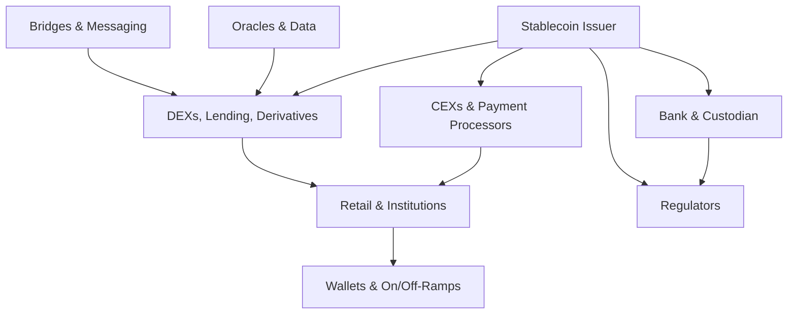

# Blockchain Stablecoin Ecosystem Interview Q&A (High Reasoning)

## Context & Scope

This document is a high-reasoning interview guide for **senior candidates** (8–15+ years experience)
working on **fiat-backed, crypto-collateralized, and RWA-backed stablecoins** at the ecosystem level.
It is designed for roles such as:

- Stablecoin Ecosystem Lead / Head of Ecosystem
- Business Development Lead (Exchanges, DeFi, Payments)
- Ecosystem / Strategy Product Manager
- Ecosystem Architect or Protocol Partnerships Lead

The focus is **ecosystem-centric**, not just protocol internals:

- How stablecoins sit at the intersection of **banks, custodians, payment processors, CEXs, DEXs, L1/L2s,
  bridges, oracles, wallets, RWA platforms, and regulators**.
- How value, risk, and information flow through this network.
- How to reason about **trade-offs, second-order effects, and systemic risk**.

> Knowledge cutoff: details reflect public information and patterns known roughly up to **late 2024**.
> Regulatory and market specifics may have evolved since; treat numbers and legal details as indicative
> rather than authoritative.

Use this guide to probe:

- System-level reasoning about **CeFi + DeFi + TradFi** interactions.
- Ability to structure decisions under uncertainty, not recall of trivia.
- Awareness of historical stress events (e.g., algorithmic collapses, banking shocks, depegs) and
  how they shaped design and policy.

---

## Table of Contents

1. [Topic Areas Overview](#topic-areas-overview)
2. [Questions & Answers](#questions--answers)
   - [Topic 1: Ecosystem & Stakeholder Map (Q1–Q2)](#topic-1-ecosystem--stakeholder-map-q1q2)
   - [Topic 2: Market Structure & Liquidity (Q3–Q4)](#topic-2-market-structure--liquidity-q3q4)
   - [Topic 3: Regulatory & Geopolitical Landscape (Q5–Q6)](#topic-3-regulatory--geopolitical-landscape-q5q6)
   - [Topic 4: Technology & Infrastructure (Q7–Q8)](#topic-4-technology--infrastructure-q7q8)
   - [Topic 5: DeFi Integration & Composability (Q9–Q10)](#topic-5-defi-integration--composability-q9q10)
   - [Topic 6: Risk, Contagion & Systemic Stability (Q11–Q13)](#topic-6-risk-contagion--systemic-stability-q11q13)
   - [Topic 7: RWA & CBDC Interplay (Q14–Q15)](#topic-7-rwa--cbdc-interplay-q14q15)
   - [Topic 8: Partnerships, GTM & Ecosystem Development (Q16–Q17)](#topic-8-partnerships-gtm--ecosystem-development-q16q17)
   - [Topic 9: Ecosystem Metrics & Analytics (Q18–Q20)](#topic-9-ecosystem-metrics--analytics-q18q20)
3. [Glossary](#glossary)
4. [Validation & Coverage Summary](#validation--coverage-summary)

---

## Topic Areas Overview

**Total**: 20 Q&A | **Difficulty mix**: 4F / 8I / 8A | **Focus**: ecosystem reasoning (CeFi + DeFi + TradFi)

| # | Topic                                   | Q Range | Count | Difficulty (F/I/A) | Visuals |
|---|-----------------------------------------|---------|-------|--------------------|---------|
| 1 | Ecosystem & Stakeholder Map            | Q1–Q2   | 2     | 1F / 1I / 0A       | Diagram |
| 2 | Market Structure & Liquidity           | Q3–Q4   | 2     | 0F / 1I / 1A       | Table   |
| 3 | Regulatory & Geopolitical Landscape    | Q5–Q6   | 2     | 0F / 1I / 1A       | Table   |
| 4 | Technology & Infrastructure            | Q7–Q8   | 2     | 0F / 1I / 1A       | Diagram |
| 5 | DeFi Integration & Composability       | Q9–Q10  | 2     | 0F / 1I / 1A       | Table   |
| 6 | Risk, Contagion & Systemic Stability   | Q11–Q13 | 3     | 0F / 1I / 2A       | Diagram |
| 7 | RWA & CBDC Interplay                   | Q14–Q15 | 2     | 1F / 0I / 1A       | Table   |
| 8 | Partnerships, GTM & Ecosystem Dev.     | Q16–Q17 | 2     | 1F / 1I / 0A       | —       |
| 9 | Ecosystem Metrics & Analytics          | Q18–Q20 | 3     | 1F / 1I / 1A       | Table   |

Difficulty legend: **F** = Foundational, **I** = Intermediate, **A** = Advanced.

---

## Questions & Answers

### Topic 1: Ecosystem & Stakeholder Map (Q1–Q2)

#### Q1: Map the modern stablecoin ecosystem and identify where systemic risk concentrates.

- **Difficulty**: F
- **Domain**: Ecosystem, Risk

**Question**

Walk me through a mental model of the **global stablecoin ecosystem**. Identify the major
stakeholders, the key flows between them (value, risk, information), and highlight **three concrete
points where risk tends to concentrate**.

**Answer (foundational, framing-heavy)**

A practical mental model is to treat the stablecoin ecosystem as a **multi-layer network**:

- **Issuers & Treasuries**: legal entities holding reserves (cash, Treasuries, RWAs) and minting /
  burning tokens.
- **Banks & Custodians**: institutions holding fiat reserves and securities; failures or freezes here
  can trigger depegs.
- **CeFi Venues (CEXs, brokers, payment processors)**: aggregate order flow, retail liquidity, and
  off-chain settlement.
- **DeFi Protocols (DEXs, money markets, derivatives)**: on-chain liquidity, leverage, and
  composability.
- **Infrastructure (L1/L2s, bridges, oracles, wallets)**: rails through which tokens move and prices
  are observed.
- **Regulators & Policymakers**: shape constraints on issuance, reserves, and user access.

A simple stakeholder diagram:

**Risk concentrates** at:

1. **Banking & custody concentration**: a few banks or custodians often hold a large fraction of
   reserves. A freeze or failure can impair redemptions and trigger a depeg.
2. **Bridge and smart contract infrastructure**: bridges, routers, and money markets concentrate TVL
   and smart contract risk; a single exploit can cascade across chains.
3. **Liquidity hubs (top CEXs / DEX pools)**: liquidity is not uniform; deep pools on a few venues
   anchor the peg. If they dry up (e.g., listing removal, regulatory action, large liquidation), peg
   maintenance becomes harder everywhere.

An ecosystem leader needs to see these as **interconnected**, not independent silos.

---

#### Q2: Design a stakeholder alignment plan for a new regulated USD stablecoin.

- **Difficulty**: I
- **Domain**: Ecosystem, Partnerships, Regulatory

**Question**

You are launching a **new fiat-backed USD stablecoin** targeting regulated exchanges and
institutional DeFi. The technology works, but adoption depends on winning over:

- Two global CEXs
- A major on/off-ramp and payment processor
- A small set of DeFi blue-chips
- Banking partners and regulators

How would you **sequence and align** these stakeholders over the first 18 months?

**Answer (intermediate, sequencing & trade-offs)**

Start from a simple rule: **regulatory and banking credibility is a prerequisite**, not an afterthought.

1. **Secure regulatory & banking foundations (Months 0–6)**
   - Obtain appropriate licenses / registrations in your primary jurisdiction.
   - Lock in **diversified banking and custody** (at least two banks, one large custodian) to avoid
     single-point-of-failure risk.
   - Publish a clear **reserve and governance policy** (what assets, where held, disclosure cadence).
   - Outcome: you become "listable" for tier-1 CEXs and acceptable for institutional risk teams.

2. **Anchor liquidity on 1–2 CEXs + 1 payments partner (Months 6–12)**
   - Prioritize CEXs where you already have relationship capital and where new listings move the
     needle (e.g., strong institutional derivatives desks, or regions your banks can support).
   - Offer **co-funded liquidity programs** and market maker incentives; align fee structures with
     their economics.
   - In parallel, integrate with a payments / on-ramp partner to support **fiat <-> stablecoin rails**
     in at least one or two core currencies.

3. **Curate DeFi integrations (Months 9–18)**
   - Target a small number of **high-signal protocols** (major DEX, major money market, possibly an
     RWA protocol) instead of spraying incentives.
   - Provide **audited reference integrations**, clear oracle support, and risk disclosures that
     protocol governance can digest.
   - Align incentives around metrics like depth and volume rather than raw emissions.

Throughout, run a **communication program**: monthly transparency reports, incident retros, and
regulatory updates. Alignment happens when each stakeholder sees you reducing **their** risk, not
just pushing your token.

---

### Topic 2: Market Structure & Liquidity (Q3–Q4)

#### Q3: Decide where to concentrate liquidity across CEX, DEX, and chains.

- **Difficulty**: I
- **Domain**: Market Structure, Liquidity, DeFi

**Question**

Your stablecoin has reached **$5–10B circulation**. Liquidity is fragmented:

- Deep on two top CEXs (BTC/USDT, ETH/USDT pairs dominate)
- Thin but growing on DeFi DEXs across three L1s and two L2s
- Limited liquidity in regional exchanges where you expect future growth

You have a finite budget for market making and incentives. How would you **decide where to deepen
liquidity** and where to accept thinner markets for now?

**Answer (intermediate, portfolio view)**

Think in terms of a **liquidity portfolio** instead of isolated venues. Define three buckets:

1. **Peg Anchors (must-win)**
   - Venues and pools whose order books effectively set the global reference price
     (top CEXs, largest DeFi pools on your primary chain).
   - Goal: very tight spreads, deep books, low slippage for large trades.

2. **Strategic Growth Venues**
   - Chains and exchanges in regions or ecosystems you expect to matter in 12–36 months
     (e.g., specific L2s, regional CEXs, or RWA-heavy chains).
   - Goal: enough liquidity for users to move in/out without severe slippage, but not necessarily
     blue-chip depth yet.

3. **Long Tail / Opportunistic**
   - Niche venues, experimental chains, or illiquid pairs.
   - Goal: organic growth; you avoid heavy, permanent incentives.

A simple decision table:

| Venue Type           | Role           | KPI                     | Capital Strategy                 |
|----------------------|---------------|-------------------------|----------------------------------|
| Top-2 CEXs           | Peg anchors   | Spread, depth, volumes  | Dedicated MM + fee negotiations  |
| Primary DeFi pools   | Peg anchors   | TVL, slippage, volumes  | Incentives + protocol partnerships |
| Strategic L2s / CEXs | Growth        | Active users, volumes   | Time-bound incentives, co-marketing |
| Long-tail venues     | Opportunistic | Organic volume          | Minimal support                  |

Allocate **most of your budget** to peg anchors (e.g., 60–70%), a meaningful minority to strategic
venues (20–30%), and only a thin slice to long tail (0–10%). Rebalance quarterly based on
**velocity, stickiness, and regulatory feasibility**.

---

#### Q4: Respond to a sudden liquidity shock and depeg across venues.

- **Difficulty**: A
- **Domain**: Market Structure, Risk, Crisis Management

**Question**

A major bank holding 20% of your reserves is suddenly put into resolution over a weekend. Markets
react before you can publish full information:

- Your stablecoin trades at **$0.97–0.98** on some CEXs.
- DeFi pools show **imbalanced swaps** (users dumping your stablecoin for other assets).
- Social media amplifies fears of insolvency.

Describe your **ecosystem-level playbook** for the first 72 hours to stabilize the situation.

**Answer (advanced, multi-venue coordination)**

Treat this as a combined **liquidity + information crisis**.

1. **Immediate information triage (first hours)**
   - Quantify exposure: how much of reserves are affected, what is insured / recoverable, what
     liquidity lines remain.
   - Publish a **clear, time-stamped statement** with ranges (even if not perfect) and commit to
     updates on a fixed cadence (e.g., every 4–6 hours).

2. **Coordinate with CEXs and major market makers**
   - Share your internal analysis under NDA with key venues and MMs so they can **size inventory
     limits and spreads** rationally instead of assuming the worst.
   - Negotiate temporary fee reductions or maker rebates to support **two-sided books** rather than
     one-way selling.

3. **Defend DeFi liquidity intelligently**
   - Identify **systemically important pools** (e.g., your stablecoin paired with another major
     stablecoin or with ETH on a leading DEX) and consider:
     - Adding protocol-owned liquidity at tighter prices.
     - Temporarily **raising interest rates** for borrowing your stablecoin in money markets to
       discourage shorting.
     - Adjusting risk parameters (collateral factors, liquidation thresholds) in coordination with
       protocol governance where possible.

4. **Stabilize redemption and creation flows**
   - If you can honor redemptions at par using unaffected reserves, **publicize this clearly** and
     process them visibly (e.g., on-chain proof of large redemptions).
   - If redemptions must be throttled, explain **rules and priority** (e.g., pro-rata, institutional
     vs retail caps) to avoid panic.

5. **Narrative and regulatory management**
   - Engage regulators proactively with your data; being transparent reduces the odds of sudden
     enforcement actions.
   - Use a single, credible communication channel (status page + official social handles) to avoid
     fragmented rumors.

The key is to **re-anchor expectations** around your solvency, demonstrate operational control, and
avoid actions (like indiscriminate buybacks) that deplete reserves faster than they restore trust.

---

### Topic 3: Regulatory & Geopolitical Landscape (Q5–Q6)

#### Q5: Design a multi-jurisdiction regulatory posture for a global stablecoin.

- **Difficulty**: I
- **Domain**: Regulatory, Ecosystem, Strategy

**Question**

You run a global USD stablecoin with users in North America, Europe, Asia, and LatAm. Regulatory
regimes differ widely (e.g., MiCA-style regimes in parts of Europe versus fragmented guidance in
other regions). How would you design a **regulatory posture and product strategy** that enables
scale while managing legal risk?

**Answer (intermediate, modular approach)**

Adopt a **modular, jurisdiction-aware product strategy** rather than a single global SKU.

1. **Segment jurisdictions by regulatory clarity and business importance**
   - Tier 1: clear frameworks + high volume (e.g., EU under MiCA once in force, certain APAC
     financial centers).
   - Tier 2: moderate clarity or evolving bills; meaningful but not dominant volume.
   - Tier 3: high uncertainty / restrictive rules; treat as experimental or read-only.

2. **Define product variants and access rules**
   - For Tier 1, operate a **fully regulated variant**:
     - Licensed issuer entity.
     - Strict reserve and disclosure rules aligned with the local framework.
     - KYC/AML-compliant access (often via intermediaries like regulated exchanges).
   - For Tier 2, focus on **risk-reduced distribution**:
     - Work through locally licensed partners.
     - Limit features if needed (e.g., no direct retail issuance, institution-only channels).
   - For Tier 3, consider **no active promotion**, with clear geo-blocking on your official
     interfaces to avoid being seen as targeting those markets.

3. **Separate compliance logic from core mint/burn logic**
   - Architect systems so jurisdiction-specific rules (KYC tiers, transaction screening, wallet
     allow/deny lists) are handled by **configurable policy layers**, not hard-coded rules.

4. **Geopolitical risk monitoring**
   - Maintain an internal **regulatory and sanctions radar** (e.g., weekly review of developments in
     key jurisdictions) and the ability to respond quickly (freezing or limiting access where
     required by law).

This yields a posture that is **expansion-friendly but not reckless**, and that regulators can
understand: you show that you take their jurisdiction seriously rather than treating the whole world
as one undifferentiated market.

---

#### Q6: Evaluate the impact of CBDCs and local stablecoins on your USD stablecoin.

- **Difficulty**: A
- **Domain**: Regulatory, Geopolitics, Strategy

**Question**

Assume several major jurisdictions roll out **retail or wholesale CBDCs** and more **non-USD
stablecoins** (e.g., EUR, BRL, SGD) gain traction. You operate a large USD stablecoin used heavily in
DeFi and global crypto trading. How do you assess whether CBDCs and local stablecoins are a **threat
or complement** to your ecosystem position, and how might you respond?

**Answer (advanced, competitive positioning)**

Think of CBDCs and local stablecoins as **new rails and liquidity buckets**, not automatically as
competitors.

1. **Map use cases by job-to-be-done**
   - **Onshore domestic payments**: local CBDCs and bank-backed stablecoins may dominate; your USD
     coin is less compelling for small domestic transfers.
   - **Cross-border flows and DeFi collateral**: your USD stablecoin retains strong value because it
     is deeply integrated into crypto-native rails and dollar demand remains high globally.
   - **Institutional settlement**: some banks may prefer CBDC or on-chain bank money for regulatory
     reasons, but many will still need access to broad crypto liquidity, where your coin lives.

2. **Assess integration friction**
   - CBDCs may have **restricted programmability** or limited access for non-banks, making them less
     composable with DeFi.
   - Local stablecoins may be fragmented across chains, with limited liquidity and tooling.

3. **Strategic responses**
   - Position your stablecoin as the **neutral interoperability layer**:
     - Provide on/off-ramps between your token and CBDCs / local stablecoins via licensed partners.
     - Build tooling so that merchants and wallets can abstract away which rail the user ultimately
       settles on.
   - Deepen **DeFi and multi-chain integrations** that CBDCs are unlikely to match in the near term.
   - Explore **coexistence models**: e.g., treasury products where CBDC or local-stablecoin
     collateral is used to mint USD stablecoins for global usage.

4. **Monitor regulatory stance**
   - In some jurisdictions, CBDC rollouts may come with **pressure on private stablecoins** (e.g.,
     limits on usage for payments). There you may pivot to focus on **trading and DeFi collateral**
     rather than retail payments.

The key is to **avoid binary thinking**: in many ecosystems, CBDCs, local stablecoins, and your USD
stablecoin will coexist, each dominating different slices of demand.

---

### Topic 4: Technology & Infrastructure (Q7–Q8)

#### Q7: Choose between native multi-chain issuance and bridged representations.

- **Difficulty**: I
- **Domain**: Infrastructure, Cross-Chain, Risk

**Question**

Your stablecoin started on one major L1 and is now in demand across multiple L2s and alternative
L1s. You can either:

1. Issue **native tokens** on each chain, synchronizing supply via burn-and-mint.
2. Rely on **bridged representations** issued by third parties or your own bridge.

How do you decide which architecture to favor, from an ecosystem perspective?

**Answer (intermediate, architecture trade-offs)**

Frame this as a trade-off between **security, UX, and operational complexity**.

- **Native multi-chain issuance**
  - Pros:
    - Eliminates dependence on external bridges as single points of failure.
    - Lets you control **mint/burn rules, blacklisting, and upgrades** on each chain.
    - Often viewed as more trustworthy by institutions after a series of high-profile bridge hacks.
  - Cons:
    - Higher engineering and operational overhead (per-chain deployments, monitoring, governance).
    - Requires a **canonical messaging layer** to keep total supply coherent across chains.

- **Bridged representations**
  - Pros:
    - Faster to launch on new chains; you piggyback on existing bridges.
    - Less direct operational burden per chain.
  - Cons:
    - Users bear bridge risk; bridge exploits have historically led to large losses.
    - Fragmented liquidity across multiple wrapped versions of your token.

Ecosystem-wise, a **hybrid approach** is common:

- Native issuance on chains that are **systemically important** for your liquidity (e.g., your home
  L1 and 1–2 major L2s / alt-L1s).
- Curated support for specific **well-audited bridges** for long-tail chains, with clear UI labelling
  and risk disclosures.

Over time, as your team and infra mature, you can migrate high-volume chains from bridged to native
models to reduce systemic exposure to bridge risk.

---

#### Q8: Prioritize infrastructure partnerships (oracles, wallets, analytics).

- **Difficulty**: A
- **Domain**: Infrastructure, Partnerships, Ecosystem

**Question**

You have limited bandwidth to integrate with **oracles, wallets, custody providers, analytics
platforms, and monitoring vendors**. How do you prioritize these infrastructure partnerships to
maximize ecosystem impact and reduce operational risk?

**Answer (advanced, leverage points)**

Think in terms of **leverage points**: integrations that unlock many downstream use cases.

1. **Oracles (high systemic impact)**
   - Your price and proof-of-reserves feeds influence **risk parameters in DeFi**, liquidation logic,
     and RWA protocols.
   - Prioritize:
     - At least one **battle-tested oracle** on each chain where you expect material TVL.
     - Clear documentation on which feeds are canonical for your stablecoin.
   - A misconfigured or manipulated oracle can propagate losses across multiple protocols.

2. **Wallets and custody (onboarding and stickiness)**
   - Retail and institutional users experience your stablecoin primarily through their wallet /
     custodian.
   - Prioritize:
     - Major non-custodial wallets in key ecosystems.
     - Institutional custody providers who serve funds, treasuries, and corporates.
   - This determines **how easy it is to hold and move** your token.

3. **Analytics, monitoring, and risk dashboards**
   - Internal: on-chain analytics, reserve dashboards, alerting on abnormal flows or depegs.
   - External: public dashboards that help users and protocols assess your health.
   - These are critical for **transparency and incident response**.

4. **Selection criteria**
   - Network effect: how many **downstream protocols** integrate via this partner.
   - Security track record and maintenance quality.
   - Alignment with your regulatory posture (e.g., ability to support compliance requirements).

In practice, you might:

- Lock in **core oracle + monitoring** first (they de-risk future DeFi integrations).
- Then secure **wallet + custody coverage** in your highest-priority regions.
- Finally, extend to secondary analytics and niche tools.

This ordering ensures you aren't scaling usage on top of an infrastructure stack you cannot observe
or secure.

---

### Topic 5: DeFi Integration & Composability (Q9–Q10)

#### Q9: Evaluate which DeFi protocols should get early support and incentives.

- **Difficulty**: I
- **Domain**: DeFi, Partnerships, Risk

**Question**

Your board wants "broad DeFi adoption" for your stablecoin, but your budget for incentives and
engineering support is limited. How do you **choose which DeFi protocols** to prioritize in the
first wave of integrations, and what guardrails do you put in place?

**Answer (intermediate, selection framework)**

Define a **scoring framework** across three dimensions:

1. **Systemic importance**
   - TVL, volumes, and user base.
   - Role in the ecosystem (e.g., core AMM, money market, liquid staking, RWA gateway).

2. **Risk posture**
   - Security track record (audits, bug bounty, incident history).
   - Governance quality and responsiveness.

3. **Strategic fit**
   - Whether the protocol's user base matches your target segments.
   - Potential for **co-marketing and shared narratives** (e.g., "safe collateral" or "compliant
     stablecoin" stories).

Example high-level table:

| Protocol Type    | Why Prioritize?                     | Key Risks                     |
|------------------|-------------------------------------|-------------------------------|
| Blue-chip DEX    | Peg liquidity, price discovery      | Smart contract & LP risk      |
| Money Market     | Collateral usage, leverage          | Liquidations, oracle risk     |
| RWA Protocol     | Yield, institutional narratives     | Asset custody & legal risk    |
| Niche Yield App  | Experimental, long tail             | Complexity, governance risk   |

Guardrails:

- Require **minimum security standards** before incentives (recent audit, bounty program, no
  unresolved criticals).
- Start with **time-bound, capped incentives**, revisiting performance and risk quarterly.
- Avoid over-concentrating TVL in a single protocol; diversify across at least two venues per
  primitive (e.g., two DEXs, two money markets) as you scale.

This approach ensures your first wave of integrations builds **credible, resilient utility** rather
than yield-chasing that backfires during stress.

---

#### Q10: Manage composability risks when your stablecoin underpins leveraged strategies.

- **Difficulty**: A
- **Domain**: DeFi, Risk, Systemic Stability

**Question**

Over time, DeFi protocols begin to use your stablecoin in **leveraged yield strategies** (looping in
money markets, leveraged LP, structured products). How do you **monitor and manage systemic risk**
from this composability, even though you do not directly control those protocols?

**Answer (advanced, ecosystem risk supervision)**

Accept that you cannot and should not control all usage, but you **can observe and influence**.

1. **Build internal positional awareness**
   - Track **where your stablecoins sit** (by protocol and chain) and how they are used:
     - Collateral vs borrowed balances.
     - LP positions in major AMMs.
     - Exposure in structured products.
   - Maintain a view of **concentration and leverage** (e.g., how many times the same collateral is
     rehypothecated).

2. **Identify critical thresholds**
   - Define risk thresholds per protocol (e.g., maximum share of total circulating supply that you
     are comfortable seeing in a single money market or pool).
   - Watch for **feedback loops**: leveraged positions that will auto-liquidate into your own
     liquidity pools during stress.

3. **Cooperate with protocols on risk settings**
   - Provide **guidance to governance forums** on:
     - Reasonable collateral factors for your stablecoin.
     - Liquidation bonuses and caps.
     - Oracle configurations and circuit breakers.
   - You cannot dictate parameters, but your analysis often carries weight.

4. **Crisis playbooks**
   - For protocols where your coin is systemic, agree in advance on **emergency levers** (e.g.,
     pausing new borrowing, tightening LTVs, adjusting interest curves) that can be enacted quickly
     if your coin depegs or volatility spikes.

5. **Transparency to users and regulators**
   - Publish aggregated metrics about leverage and concentration so that sophisticated users and
     regulators can understand systemic interactions.

Your goal is to **shape the ecosystem towards safer equilibria** without stifling innovation or
assuming responsibility for every independent protocol.

---

### Topic 6: Risk, Contagion & Systemic Stability (Q11–Q13)

#### Q11: Analyze contagion from a stablecoin depeg into CeFi and DeFi.

- **Difficulty**: A
- **Domain**: Risk, Systemic Stability, Market Structure

**Question**

Consider a scenario where a large stablecoin (not necessarily yours) experiences a **10–20% depeg**
for several days due to reserve uncertainty. Describe how this shock propagates through:

- Centralized exchanges
- DeFi money markets and DEXs
- RWA and structured products using the coin as collateral

What lessons would you apply to your own ecosystem design?

**Answer (advanced, shock propagation)**

Propagation typically follows **liquidity, leverage, and perceived substitutability**.

1. **CeFi**
   - Traders dump the depegged coin for other stablecoins, BTC, or fiat, stressing order books.
   - Exchanges may widen spreads, increase margin requirements, or delist pairs temporarily.
   - Perpetuals and futures using the coin as collateral see **forced liquidations** when the
     discounted collateral can no longer cover positions.

2. **DeFi money markets**
   - Borrow positions collateralized by the depegged stablecoin are liquidated, often into the
     same or related stablecoin pools, increasing sell pressure.
   - If oracles lag or malfunction, markets can become insolvent (undercollateralized loans).

3. **DEXs and AMMs**
   - Stable-stable pools (e.g., depegged coin vs another stablecoin) suffer **imbalance**: LPs end
     up holding mostly the depegged asset.
   - Arbitrageurs trade aggressively, but if trust in redemption is gone, arbitrage cannot fully
     close the gap.

4. **RWA and structured products**
   - RWA protocols using the coin as the settlement asset may pause operations.
   - Structured products promising principal protection in the stablecoin's unit of account may
     face **real loss** when converted back to fiat.

Lessons for your design:

- Diversify **collateral and liquidity venues** so a single failure doesn't cascade as easily.
- Maintain robust **oracle infrastructure**, including depeg detection and circuit breakers.
- Design communication and redemption policies that make it clear **when and how** you will defend
  the peg, so markets do not assume the worst by default.

---

#### Q12: Build a risk dashboard for ecosystem-level monitoring.

- **Difficulty**: I
- **Domain**: Risk, Analytics, Operations

**Question**

If you had to design an internal **risk dashboard** to monitor the health of your stablecoin
ecosystem daily, what would you track, and how would you use those signals to guide decisions?

**Answer (intermediate, practical instrumentation)**

A useful risk dashboard blends **on-chain, off-chain, and market** signals.

Key components:

1. **Reserve and banking risk**
   - Reserve composition (asset types, duration, counterparties).
   - Bank and custodian concentration metrics.
   - Maturity ladder and liquidity buffers for redemptions.

2. **Market signals**
   - Price across top CEXs and major DEX pools (including VWAP and max deviation from $1).
   - Order book depth and slippage for standard trade sizes.
   - Funding rates and borrowing costs involving your stablecoin.

3. **DeFi exposure**
   - Breakdown of circulating supply by protocol and chain.
   - Collateral vs borrowed balances.
   - LTV distributions and liquidation buffers under stress scenarios.

4. **Flow and behavioral signals**
   - Net issuance / redemption per day.
   - Inflows/outflows by region or major partner.
   - Anomaly detection on large movements or unusual clustering.

5. **Alerting & governance hooks**
   - Thresholds that trigger internal alerts (e.g., >1% sustained depeg, rapid drawdown of bank
     deposits) and pre-defined playbooks.

You'd use these signals to drive **weekly strategic reviews** (adjusting liquidity programs,
portfolio composition) and **real-time incident response** when deviations exceed pre-agreed bounds.

---

#### Q13: Evaluate whether to introduce protocol-level circuit breakers.

- **Difficulty**: A
- **Domain**: Risk, Protocol Design, Governance

**Question**

Some stakeholders propose **protocol-level circuit breakers** for your stablecoin (e.g., pausing
transfers or minting in extreme conditions). Others worry this undermines censorship-resistance and
composability. How do you evaluate whether and how to introduce such mechanisms?

**Answer (advanced, value vs control)**

This is a **values vs control** debate.

1. **Clarify your product thesis**
   - Are you positioning as a **fully permissionless, censorship-resistant asset**, or as a
     **regulated settlement asset** optimized for compliance and risk control?
   - Circuit breakers align more naturally with the latter.

2. **Define the scope of control**
   - Hard stops: pausing **all transfers or redemptions** on-chain.
   - Soft controls: pausing **minting only**, limiting large transfers, or blacklisting specific
     addresses under legal order.

3. **Governance and transparency**
   - If you adopt circuit breakers, make the **rules explicit**:
     - Who can trigger them (single entity, multisig, DAO, regulator-driven process).
     - What thresholds or conditions must be met.
     - How and when they are unwound.
   - Consider embedding **on-chain logging** of all admin actions to preserve auditability.

4. **Ecosystem impact assessment**
   - Analyze how a pause would affect DeFi protocols: collateralization, liquidations, and
     settlement in flight.
   - Coordinate with major integrators on **how they would handle a pause**, to avoid inconsistent
     behaviors.

5. **Alternative mitigations**
   - Instead of full pauses, you might introduce:
     - **Rate limits** on net issuance.
     - Dynamic fees to dampen flows during stress.
     - Oracle-based guardrails that inform, rather than halt, protocol behavior.

The decision is not purely technical; it encodes your **social contract** with users and regulators.
Whatever you choose, it must be consistent and well-communicated.

---

### Topic 7: RWA & CBDC Interplay (Q14–Q15)

#### Q14: Explain how RWA-backed products change the stablecoin ecosystem.

- **Difficulty**: F
- **Domain**: RWA, Ecosystem, Product

**Question**

Real-world-asset (RWA) protocols now let users hold tokenized **Treasuries, money market funds, and
credit products**. How do these RWA products interact with stablecoins in the broader ecosystem?

**Answer (foundational, conceptual)**

RWA protocols add **yield-bearing layers** around stablecoins and change who holds interest rate risk.

- **Source of yield**
  - Traditional fiat-backed stablecoins often earn yield on reserves (e.g., Treasuries) at the
    issuer level; end-users hold a non-yielding token.
  - RWA protocols move some of that yield to **on-chain instruments** (e.g., tokenized T-bills) that
    users can buy directly.

- **Interaction patterns**
  - Users convert stablecoins into RWA tokens to earn yield, then back into stablecoins for
    liquidity.
  - DeFi protocols use RWA tokens as **collateral** while denominating loans and settlements in
    stablecoins.

- **Ecosystem effects**
  - More **capital-efficient treasury management** for DAOs and on-chain funds.
  - New counterparty and custody risks, since the underlying assets sit in specific banks, brokers,
    or SPVs.
  - Potential **regulatory scrutiny** if the line between "stablecoin" and "investment product"
    blurs.

In short, RWAs and stablecoins become **complementary**: stablecoins provide the transactional unit
of account and liquidity; RWAs provide yield and duration exposure. Ecosystem leaders must understand
both sides to manage risk and design usable products.

---

#### Q15: Position your stablecoin versus CBDCs and RWA-heavy competitors.

- **Difficulty**: A
- **Domain**: Strategy, RWA, CBDC

**Question**

Assume:

- One jurisdiction launches a widely available **CBDC** with API access for licensed intermediaries.
- Competing stablecoins in your ecosystem become increasingly **RWA-heavy**, marketing higher yields
  but with more complex structures.

How do you position your own stablecoin to remain relevant to both **DeFi builders** and **regulated
institutions**?

**Answer (advanced, differentiation)**

You must articulate a **clear, differentiated value proposition** rather than chasing every feature.

1. **Clarify target segments**
   - For **DeFi builders**:
     - Emphasize **composability, predictable behavior, and deep multi-chain liquidity**.
     - Offer robust tooling (SDKs, reference integrations, documentation) and clear risk disclosures.
   - For **regulated institutions**:
     - Emphasize **transparency, governance, and compliance alignment**.
     - Provide reporting, audit trails, and custody options that fit their processes.

2. **Reserve philosophy**
   - You may choose a **conservative reserve mix** (cash, short-duration sovereign debt) even if it
     yields less than RWA-heavy competitors.
   - Turn this into a feature: "boring by design" as a core principle for a transactional asset.

3. **Interoperability with CBDCs and RWAs**
   - Build bridges (often via partners) so users can **move between CBDC balances, RWA tokens, and
     your stablecoin** with minimal friction.
   - This positions you as the **liquidity and composability layer** on top of more restricted
     rails.

4. **Product boundaries**
   - Resist turning your stablecoin into an investment product; instead, create **adjacent wrappers**
     (e.g., yield-bearing vaults) where appropriate, with clear risk separation.

This strategy accepts that you will not win every yield-sensitive user but aims to make your
stablecoin the **default neutral asset** in the ecosystem.

---

### Topic 8: Partnerships, GTM & Ecosystem Development (Q16–Q17)

#### Q16: Design an ecosystem GTM plan for a new region.

- **Difficulty**: F
- **Domain**: Partnerships, GTM, Regional Strategy

**Question**

You are expanding your stablecoin into a **new region** (e.g., a cluster of LatAm or Southeast Asian
markets) where crypto adoption is high but regulatory clarity is mixed. You cannot directly market to
retail users. How do you craft a **go-to-market plan** focused on ecosystem partners?

**Answer (foundational, ecosystem GTM)**

Anchor on **indirect distribution** and **local credibility**.

1. **Map local rails and influencers**
   - Regional CEXs, fintechs, payment gateways, remittance providers, and merchant platforms.
   - Developer communities and on-chain ecosystems already active there.

2. **Pick 2–3 anchor partners**
   - A regional CEX or broker with strong fiat rails.
   - A payments or remittance partner targeting real-world use cases (e.g., freelancer payouts,
     e-commerce settlement).
   - Optionally, a local DeFi protocol with meaningful TVL.

3. **Structure partnerships around concrete metrics**
   - For CEXs: trading volume, active users, new pairs listed.
   - For payment partners: transaction count, wallets funded, merchant adoption.
   - Co-fund incentives and marketing, but tie them to **observable ecosystem outcomes**, not vanity
     metrics.

4. **Localize risk and compliance**
   - Work with local counsel to understand what you can and cannot do.
   - Let partners handle retail KYC/AML and user acquisition; you focus on **infrastructure and
     liquidity**.

5. **Developer and community layer**
   - Sponsor hackathons, grants, or open-source tooling relevant to that region's dominant chains
     and wallets.

This yields a GTM plan where **partners front the brand to end-users**, while you provide the rails
and liquidity that make their products work.

---

#### Q17: Balance short-term exchange listing deals with long-term ecosystem health.

- **Difficulty**: I
- **Domain**: Partnerships, Strategy

**Question**

Multiple exchanges offer you **listing packages** that include prominent placement and incentives in
exchange for significant upfront or ongoing fees. Some are systemically important; others are
smaller. How do you evaluate these deals in the context of **ecosystem health** rather than just
short-term volume?

**Answer (intermediate, long-term view)**

Assess each deal along three axes:

1. **Strategic importance**
   - User and volume profile (retail vs institutional, region coverage).
   - Role in your **liquidity and price discovery** network.

2. **Deal economics and alignment**
   - Total cost (fees, revenue share, required incentives) vs expected incremental volume and
     network effects.
   - Whether the exchange is willing to **co-invest** (e.g., fee reductions, marketing) or just
     extract rent.

3. **Reputational and regulatory risk**
   - Track record of compliance, security, and user protection.
   - Alignment with your own regulatory posture.

From an ecosystem standpoint, you generally prefer:

- Fewer, **high-quality anchor exchanges** with deep integrations (fiat ramps, derivatives, listing
  priority) over many shallow, transactional listings.
- Deals that include **data-sharing and product collaboration**, not just logo placements.

You should also **stress-test**: if a smaller exchange offers aggressive terms but later faces
regulatory trouble, how does that reflect on your brand and token? Sometimes, **walking away from a
profitable-looking listing** is the right call for long-term credibility.

---

### Topic 9: Ecosystem Metrics & Analytics (Q18–Q20)

#### Q18: Define core ecosystem health metrics for a stablecoin.

- **Difficulty**: F
- **Domain**: Metrics, Analytics

**Question**

If you had to pick a small set of **ecosystem health metrics** to review every week, what would they
be, and why?

**Answer (foundational, metric selection)**

Pick metrics that capture **liquidity, usage, concentration, and resilience**.

1. **Liquidity & depth**
   - Depth at key price bands on top CEXs and DEX pools.
   - Slippage for standard trade sizes.

2. **Usage & velocity**
   - Number of active addresses holding and transferring your stablecoin.
   - Payment and settlement volume (where you can measure it), not just trading volume.

3. **Integration breadth**
   - Count and quality of integrations across chains and protocols (e.g., number of DEXs, money
     markets, RWA platforms where you are a first-class asset).

4. **Concentration risk**
   - Share of supply held by top addresses (exchanges, protocols, whales).
   - Dependence on specific banks, CEXs, or pools as a percentage of total liquidity.

5. **Resilience indicators**
   - Peg deviation and recovery times after shocks.
   - Response times to incidents (communications, parameter changes).

These metrics together tell you whether your stablecoin is **widely used, safely distributed, and
able to withstand stress**.

---

#### Q19: Design a dashboard for multi-chain ecosystem visibility.

- **Difficulty**: I
- **Domain**: Metrics, Cross-Chain, Operations

**Question**

Your stablecoin spans **multiple L1s and L2s**. Data sources and tooling differ across ecosystems.
How would you design a **multi-chain dashboard** to give your team a coherent ecosystem view?

**Answer (intermediate, aggregation approach)**

Key principles:

1. **Canonical identifiers and taxonomy**
   - Standardize labels for chains, protocols, and asset pairs.
   - Map contract addresses on each chain to a single logical entity (e.g., "OurStablecoin", "DEX-A
     Pool 1").

2. **Unified data model**
   - Normalize basic events (transfers, mints/burns, swaps, borrow/repay) across chains into a
     common schema.
   - Use chain-specific indexers or third-party APIs where necessary, but store the results in a
     unified warehouse.

3. **Multi-chain KPIs**
   - Supply by chain (circulating + protocol-held).
   - Liquidity depth and TVL by chain and pool type.
   - Cross-chain flows (bridge volumes, mint/burn patterns).

4. **Alerting and drill-down**
   - Alerts when a chain diverges significantly (e.g., unusual price, liquidity drains, or
     bridge-related anomalies).
   - Ability to drill from a global view down to a specific chain, protocol, or pool.

This dashboard becomes your **single pane of glass** for ecosystem operations, enabling consistent
risk management even as you add new chains and partners.

---

#### Q20: Propose advanced metrics for ecosystem resilience.

- **Difficulty**: A
- **Domain**: Metrics, Risk, Strategy

**Question**

Foundational metrics like market cap and daily volume are not enough to capture **ecosystem
resilience**. Propose 3–5 advanced metrics that better reflect how robust your stablecoin ecosystem
is to shocks.

**Answer (advanced, resilience metrics)**

Consider metrics that approximate **stress scenarios and network structure**.

1. **Time-to-re-peg under stress**
   - Measure how long it takes to return to within a tight band around $1 (e.g., ±0.5%) after
     significant deviations.
   - Track this across different shock types (bank news, large redemptions, on-chain exploits).

2. **Liquidity redundancy index**
   - Quantify how many **independent venues** provide adequate liquidity.
   - For example: the minimum number of venues whose failure would remove more than X% of your
     global liquidity.

3. **Collateralization dependency index**
   - Measure how much of your coin is used as collateral in protocols that **share risk factors**
     (e.g., same oracle, same RWA custodian).
   - High dependency suggests that failure of a single component could cause correlated liquidations.

4. **Information transparency lag**
   - Average time between a material reserve or policy event and **public disclosure**.
   - Shorter lags correlate with higher trust and potentially less severe market overreactions.

5. **Governance responsiveness**
   - Time between a detected issue (e.g., oracle misbehavior, parameter misalignment) and the
     execution of a governance or admin action to address it.

These metrics push teams to design for **observability, diversification, and fast
problem-response**, not just scale.

---

## Glossary

- **Stablecoin**: A crypto-asset designed to maintain a stable value relative to a reference asset,
  typically a fiat currency like USD.
- **Fiat-backed stablecoin**: Stablecoin backed by off-chain fiat or cash-equivalent reserves held by
  banks or custodians.
- **Crypto-collateralized stablecoin**: Stablecoin backed by on-chain crypto assets, often
  over-collateralized via smart contracts.
- **Algorithmic stablecoin**: Stablecoin that attempts to maintain a peg using **supply and demand
  algorithms** rather than explicit collateral; historically prone to failure.
- **RWA (Real-World Asset)**: Tokenized representation of traditional financial assets (e.g.,
  Treasuries, bonds, invoices) issued and managed under legal structures.
- **CBDC (Central Bank Digital Currency)**: Digital form of central bank money, either retail or
  wholesale, typically permissioned and centrally controlled.
- **CeFi (Centralized Finance)**: Crypto financial services run by centralized entities (exchanges,
  brokers, custodians) that hold user assets and manage order books.
- **DeFi (Decentralized Finance)**: Smart-contract-based financial protocols (DEXs, lending markets,
  derivatives, etc.) that operate on public blockchains.
- **AMM (Automated Market Maker)**: A DEX model using liquidity pools and pricing formulas instead
  of order books.
- **Money market (DeFi)**: Protocol that facilitates lending and borrowing of assets with
  algorithmically determined interest rates.
- **On-ramp / Off-ramp**: Service that converts fiat to crypto (on-ramp) and crypto back to fiat
  (off-ramp).
- **Oracle**: Service that feeds external data (prices, reserves, rates) into smart contracts.
- **Peg**: Target price relationship (e.g., 1 stablecoin = 1 USD) that the system attempts to
  maintain.
- **TVL (Total Value Locked)**: The total value of assets deposited in a DeFi protocol.

---

## Validation & Coverage Summary

- **Scope**
  - Covered ecosystem dimensions: stakeholders, market structure, regulation & geopolitics,
    infrastructure, DeFi integration, risk & contagion, RWA & CBDC interplay, partnerships & GTM,
    and ecosystem metrics.
  - Focused on **ecosystem-level reasoning** rather than implementation details of specific
    protocols.

- **Question set**
  - 20 scenario-based questions.
  - Difficulty distribution (approximate): **4 foundational / 8 intermediate / 8 advanced**.
  - Each question is tagged implicitly by topic sections; domains span ecosystem, market, regulatory,
    DeFi, risk, RWA/CBDC, partnerships, and metrics.

- **Artifacts**
  - Included several **tables** (liquidity portfolio, DeFi protocol selection, etc.).
  - Included **Mermaid diagrams** to visualize stakeholder relationships and flows.

- **Limitations**
  - No live web access; regulatory and market details are based on patterns and public information
    known up to roughly **late 2024** and may have evolved.
  - Examples are intentionally generic and do not represent legal or investment advice.

- **Usage guidance**
  - For a **60-minute interview**, pick 3–5 questions across different topics (e.g., one regulatory,
    one market structure, one risk/contagion, one DeFi composability, one metrics question).
  - For a deeper **case-study-style session**, chain 2–3 related questions (e.g., a depeg scenario,
    followed by DeFi contagion analysis, followed by an ecosystem recovery plan).