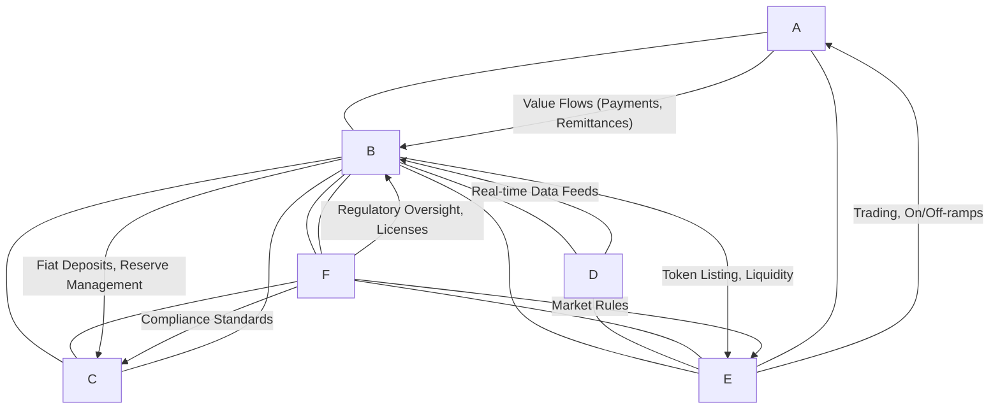
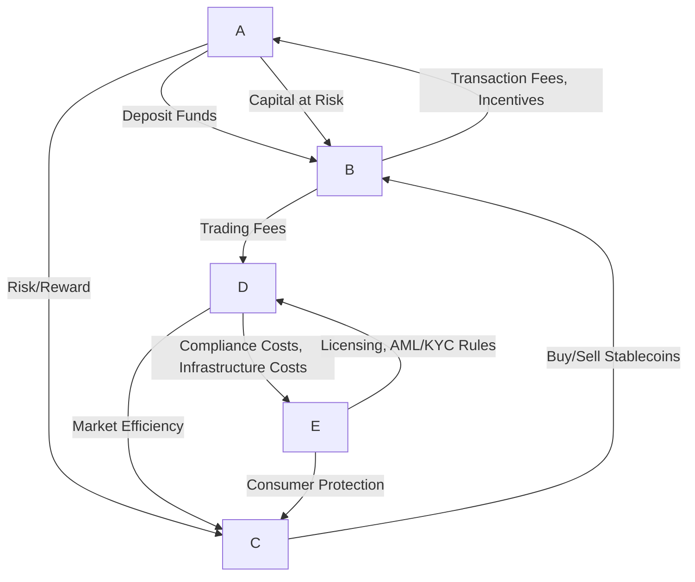
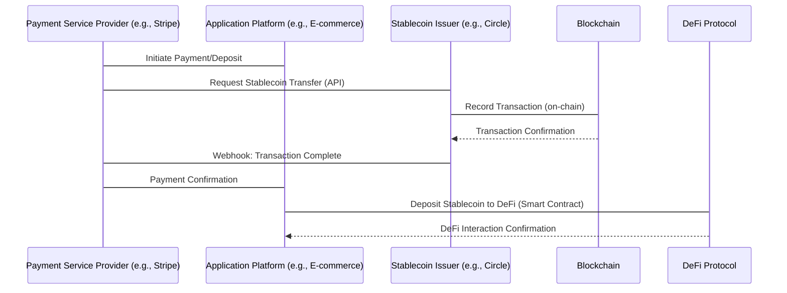

### A. Table of Contents
1.  Introduction
2.  Ecosystem Structure
    *   Q1: What are the fundamental roles and interdependencies within the stablecoin ecosystem, and how do they collectively enable or hinder its operational stability?
    *   Q2: How do contrasting governance models (centralized vs. decentralized) in stablecoin ecosystems influence decision-making for various stakeholders regarding trust, operational control, and market entry?
3.  Value Chains & Business Models
    *   Q3: What are the primary revenue streams and economic drivers for stablecoin issuers and key service providers, and how do evolving regulations impact their business viability?
    *   Q4: How do liquidity providers and exchanges manage their business models to ensure stablecoin liquidity and market efficiency, particularly considering the impact of regulatory changes?
4.  Integration Patterns
    *   Q5: What are the prevalent integration patterns and technical standards required for stablecoin platforms to connect with external financial systems (e.g., payment processors, DeFi protocols), and what are the trade-offs?
    *   Q6: How is cross-chain interoperability evolving for stablecoins, and what are the decision-critical risks and opportunities associated with integrating multi-chain stablecoin systems?
5.  Technical Architecture
    *   Q7: What are the foundational technical architecture requirements for building scalable, reliable, and secure stablecoin platforms that can meet enterprise and regulatory demands?
    *   Q8: How do Layer-2 scaling solutions and data streaming technologies enhance stablecoin transaction scalability and operational efficiency, and what new architectural considerations do they introduce?
6.  Regulatory & Compliance
    *   Q9: What are the core regulatory and compliance obligations (KYC/AML, licensing, reserve requirements) that fundamentally shape stablecoin ecosystem decisions and market participation?
    *   Q10: How do major stablecoin regulations (e.g., MiCA, GENIUS Act) impact the competitive landscape, business models, and strategic decisions for both domestic and foreign stablecoin providers?

### B. Topic Overview
**Total**: 10 | **Complexity**: 4F (40%) / 4I (40%) / 2A (20%) | **Coverage**: 5 decision-critical dimensions

| # | Topic                  | Range   | Count | Mix      | Artifacts | Decision Criticality |
|---|------------------------|---------|-------|----------|-----------|----------------------|
| 1 | Ecosystem Structure    | Q1–Q2   | 2     | 1F/1I    | 1D+1T     | Blocks decision, Affects 3+ roles |
| 2 | Value Chains/Business  | Q3–Q4   | 2     | 1F/1I    | 1D+1T     | Blocks decision, Creates risk |
| 3 | Integration Patterns   | Q5–Q6   | 2     | 0F/2I/0A | 1D+1T     | Affects 3+ roles, Actively evolving |
| 4 | Technical Architecture | Q7–Q8   | 2     | 1F/0I/1A | 1D+1T     | Blocks decision, High adoption barrier |
| 5 | Regulatory/Compliance  | Q9–Q10  | 2     | 1F/0I/1A | 1D+1T     | Creates risk, Actively evolving |
|   | **Total**              |         | **10**  | **4F/4I/2A** | **5D+5T** | **100% ≥1 criterion** |

Legend: F=foundational | I=integration | A=advanced | D=diagram | T=table

---

### Introduction
The stablecoin ecosystem represents a critical nexus in the evolution of digital finance, bridging traditional financial systems with the nascent world of blockchain and decentralized applications. These digital assets, designed to maintain a stable value relative to a reference asset, such as a fiat currency, have rapidly grown in prominence, attracting significant attention from financial institutions, technologists, and regulators alike. Understanding the intricate web of core parties, value flows, integration patterns, technical architectures, and regulatory constraints is paramount for making informed, decision-critical choices in this dynamically evolving landscape. This report provides a comprehensive, decision-focused Q&A analysis, delving into these essential dimensions to offer a nuanced understanding of the stablecoin ecosystem.

---

### Topic 1: Ecosystem Structure

**Q1: What are the fundamental roles and interdependencies within the stablecoin ecosystem, and how do they collectively enable or hinder its operational stability?**

**Complexity**: F | **Topic**: Ecosystem Structure | **Viewpoints**: Technical, Business, Regulatory | **Decision Criticality**: Blocks decision, Affects 3+ roles

**Key Insight**: The stablecoin ecosystem relies on a complex interplay of issuers, custodians, oracles, exchanges, regulators, and end-users, whose coordinated functions and interdependencies are crucial for maintaining peg stability, ensuring liquidity, and driving adoption, while also presenting points of potential failure or constraint.

**Answer**: The stablecoin ecosystem comprises several core parties, each with distinct roles and significant interdependencies that collectively enable or or hinder its operational stability. *Issuers*, such as Circle or Tether, create and manage stablecoins, often backed by fiat reserves, generating revenue primarily through interest on these reserves. They are responsible for minting, burning, and maintaining the stablecoin's peg to its underlying asset. *Custodians* hold the actual reserve assets (e.g., cash, short-term U.S. Treasuries) that back the stablecoins, ensuring auditability and providing confidence in the 1:1 backing. Their reliability is crucial for user trust and stablecoin solvency. *Oracles* act as vital bridges, providing real-time, accurate off-chain data—especially price feeds—to on-chain smart contracts, which is essential for maintaining the peg stability of various stablecoin types and triggering automated processes like liquidations. Without robust and decentralized oracles, stablecoins can struggle to maintain their peg. *Exchanges* (both centralized and decentralized) offer platforms for trading, converting, and accessing stablecoins, providing liquidity and serving as critical on- and off-ramps to fiat currencies. *Regulators* establish legal frameworks, such as the U.S. GENIUS Act and the EU's MiCA, that govern issuance, custody, and usage, influencing market entry, compliance, and overall trust in the ecosystem. *End-users*—including individuals, businesses, and institutions—drive demand for stablecoins for payments, remittances, trading, and treasury management, providing the ultimate validation of the ecosystem's utility. Operational stability relies on the seamless and secure functioning of these interconnected components; a failure in any part, such as a custodian's mismanagement of reserves or an oracle's data manipulation, can lead to de-pegging events and erosion of trust.

**Artifact**:


**Table 1: Core Stablecoin Ecosystem Roles and Their Interdependencies**

| Role             | Primary Function                                   | Key Interdependencies                             | Impact on Operational Stability                     |
|------------------|----------------------------------------------------|---------------------------------------------------|-----------------------------------------------------|
| **Issuers**      | Minting, burning, peg maintenance, reserve management | Custodians (reserve backing), Oracles (data), Regulators (compliance) | Direct on peg stability; Revenue viability          |
| **Custodians**   | Securely hold reserve assets                       | Issuers (asset backing), Regulators (audit, segregation) | Essential for trust and 1:1 backing verification    |
| **Oracles**      | Provide real-world data to blockchain              | Issuers (peg maintenance), Exchanges (price data) | Critical for algorithmic stability and liquidations |
| **Exchanges**    | Facilitate trading, provide liquidity, on/off-ramps | Issuers (token supply), Regulators (AML/KYC), End-users (demand) | Market efficiency, price discovery, accessibility   |
| **Regulators**   | Establish legal frameworks, enforce compliance     | All parties (licensing, reporting, oversight)     | Defines market entry, reduces systemic risk         |
| **End-Users**    | Utilize stablecoins for various transactions       | All parties (adoption, demand, liquidity)         | Drives utility, market capitalization, network effects |

---

**Q2: How do the contrasting governance models (centralized vs. decentralized) in stablecoin ecosystems influence decision-making for various stakeholders regarding trust, operational control, and market entry?**

**Complexity**: I | **Topic**: Ecosystem Structure | **Viewpoints**: Technical, Business, Regulatory | **Decision Criticality**: Affects 3+ roles, Actively evolving

**Key Insight**: The choice between centralized and decentralized stablecoin governance profoundly impacts the balance between efficiency, trust, and resilience, directly influencing operational control, stakeholder participation in decision-making, and market entry strategies under evolving regulatory scrutiny.

**Answer**: Stablecoin ecosystems operate under two primary governance models: centralized and decentralized, each with distinct implications for stakeholder decision-making. *Centralized stablecoins*, like USDT and USDC, are typically issued by a single entity that manages reserves, handles minting/burning, and often dictates operational policies. This model offers operational efficiency and can more readily comply with traditional financial regulations, as decisions are made by a conventional corporate structure. However, it introduces a single point of failure and requires users to trust the issuer's integrity regarding reserve management and censorship resistance. For *regulators*, centralized issuers are easier to supervise, enabling clearer compliance paths like those outlined in the GENIUS Act and MiCA, which mandate licensing and reserve audits. *Decentralized stablecoins*, such as DAI, are governed by smart contracts and often rely on on-chain collateral and community-driven decision-making, where token holders vote on key parameters and protocol upgrades. This model aims for censorship resistance and transparency, but governance decisions can be slower and more complex due to distributed consensus mechanisms. For *developers*, the architecture of decentralized systems often requires more intricate smart contract design and robust oracle integration to maintain peg stability without a central authority. *Business stakeholders* must weigh the trade-offs: centralized models offer easier integration with traditional finance but carry reputational and regulatory risks tied to a single entity, while decentralized models offer greater resilience to single-entity failures but may struggle with scalability, liquidity, and rapid adaptation to external market conditions. Market entry decisions are thus shaped by whether a project prioritizes regulatory alignment and operational speed (centralized) or censorship resistance and community control (decentralized).

**Artifact**:
**Table 2: Comparison of Centralized and Decentralized Stablecoin Governance**

| Feature              | Centralized Stablecoins (e.g., USDC, USDT) | Decentralized Stablecoins (e.g., DAI) |
|----------------------|--------------------------------------------|---------------------------------------|
| **Issuer Entity**    | Single company/organization                | Decentralized Autonomous Organization (DAO) |
| **Reserve Management** | Managed by issuer off-chain                | On-chain collateral, transparently managed |
| **Decision-Making**  | Corporate board, executives                | Token holder voting, smart contracts   |
| **Transparency**     | Audited reports (off-chain)                | On-chain verification, real-time       |
| **Censorship Risk**  | Higher (issuer can freeze assets)          | Lower (protocol-driven)                |
| **Regulatory Ease**  | Higher (clear legal entity)                | Lower (less clear legal entity)        |
| **Scalability**      | Generally higher                           | Can be constrained by blockchain limits |
| **Operational Control** | Centralized, efficient                    | Distributed, consensus-driven          |
| **Trust Model**      | Trust in issuer and auditors               | Trust in code and community consensus  |

---

### Topic 2: Value Chains & Business Models

**Q3: What are the primary revenue streams and economic drivers for stablecoin issuers and key service providers, and how do evolving regulations impact their business viability?**

**Complexity**: F | **Topic**: Value Chains & Business | **Viewpoints**: Business, Regulatory | **Decision Criticality**: Blocks decision, Creates risk

**Key Insight**: Stablecoin issuers primarily generate revenue from interest on their reserve holdings, complemented by transaction fees and strategic partnerships, but evolving regulations like the GENIUS Act and MiCA are significantly reshaping these models by imposing restrictions on yield and requiring substantial compliance investments.

**Answer**: Stablecoin issuers derive their primary revenue from the yield earned on the reserves that back their stablecoins. They invest these typically fiat-denominated reserves in low-risk, highly liquid assets such as U.S. Treasury bills and short-term bank deposits. This interest income forms a significant and robust revenue base, with companies like Circle reporting substantial profits from reserve management. Additionally, issuers may generate revenue through transaction fees, conversion fees for fiat-to-stablecoin or stablecoin-to-fiat operations, and strategic partnerships with financial institutions or platforms that integrate their stablecoins. For key service providers, such as exchanges and payment gateways, revenue comes from trading fees, listing fees, and commissions on various crypto-related services. However, evolving regulatory landscapes are significantly impacting these business models. The U.S. GENIUS Act, for instance, explicitly prohibits stablecoin issuers from paying interest or yield to holders, aiming to differentiate stablecoins from interest-bearing bank deposits and money market funds. This restriction forces issuers to re-evaluate their revenue distribution strategies, though third-party platforms may still offer rewards to customers. Similarly, the EU's MiCA regulation imposes stringent capital requirements, disclosure obligations, and operational standards that necessitate substantial investments in compliance infrastructure, increasing operational costs for issuers and service providers. These regulatory changes can limit revenue opportunities, such as by banning certain types of stablecoins (e.g., algorithmic stablecoins under MiCA), but also legitimize the space, potentially attracting more institutional adoption and expanding the overall market. Consequently, stablecoin businesses face the dual challenge of adapting their revenue models to new regulatory constraints while investing in robust compliance to ensure viability and competitive advantage.

**Artifact**:
**Table 3: Stablecoin Business Models: Revenue & Cost Drivers**

| Stakeholder         | Primary Revenue Streams                               | Primary Cost Structures                                 | Regulatory Impact (Examples)                         |
|---------------------|-------------------------------------------------------|---------------------------------------------------------|------------------------------------------------------|
| **Issuers**         | Interest on reserves, transaction/conversion fees, partnerships | Reserve management, compliance, security, infrastructure, audits | GENIUS Act (no yield to holders), MiCA (capital, disclosure) |
| **Exchanges**       | Trading fees, listing fees, withdrawal fees           | Infrastructure, security, compliance (AML/KYC), liquidity provision | GENIUS/MiCA (licensing, oversight)                   |
| **Payment Processors**| Transaction fees, value-added services                | Technology integration, security, compliance, customer support | GENIUS/MiCA (data sharing, AML, licensing)           |
| **Liquidity Providers**| Trading fees, yield farming, arbitrage opportunities    | Capital lock-up, impermanent loss, security risks      | Indirect (limits on issuer yield, market structure)  |
| **Oracles**         | Data provision fees, network participation rewards    | Node operation, data aggregation, security, research    | Indirect (data integrity standards, transparency)    |

---

**Q4: How do liquidity providers and exchanges manage their business models to ensure stablecoin liquidity and market efficiency, particularly considering the impact of regulatory changes?**

**Complexity**: I | **Topic**: Value Chains & Business | **Viewpoints**: Business, Regulatory | **Decision Criticality**: Creates risk, Affects 3+ roles

**Key Insight**: Liquidity providers and exchanges are critical for stablecoin market efficiency, generating revenue through trading fees and interest while navigating regulatory mandates for capital adequacy and compliance, which profoundly shape their operational strategies and risk management.

**Answer**: Liquidity providers (LPs) and exchanges manage their business models to ensure stablecoin liquidity and market efficiency through various mechanisms, significantly impacted by evolving regulatory changes. LPs, crucial for both centralized and decentralized exchanges, supply stablecoin tokens to trading pools, earning revenue from transaction fees and sometimes additional yield from lending protocols or arbitrage opportunities. Their role is to minimize slippage and facilitate smooth execution of large trades, which enhances market efficiency. Exchanges, on the other hand, provide the platforms and infrastructure where these transactions occur, generating revenue through trading fees, listing fees, and various premium services. To attract liquidity, exchanges often offer incentives or partnerships, sometimes by sharing a portion of their reserve income with liquidity providers, although direct interest payments by stablecoin issuers are increasingly restricted. The business models for both LPs and exchanges involve managing significant capital at risk and operational costs related to infrastructure, cybersecurity, and crucially, regulatory compliance. Regulatory changes, such as the U.S. GENIUS Act and the EU's MiCA, directly impact these models. These regulations mandate stringent KYC/AML checks, capital requirements, and transparency reporting, increasing operational overhead for exchanges. For example, the GENIUS Act's prohibition on stablecoin issuers paying interest to holders forces LPs to seek yield from other sources, potentially impacting the incentives for providing liquidity. Furthermore, licensing requirements for Crypto-Asset Service Providers (CASPs) under MiCA mean exchanges must obtain authorization, which can be costly and time-consuming, acting as a barrier to entry while simultaneously legitimizing compliant operations. These regulations also aim to reduce systemic risks, like rapid outflows during market stress, by enforcing stricter reserve and redemption policies, which LPs and exchanges must factor into their risk management frameworks. Thus, successful business models for liquidity providers and exchanges must balance profit generation with rigorous compliance and robust risk management strategies to adapt to the evolving regulatory landscape.

**Artifact**:


**Table 4: Key Financial Metrics for Liquidity Providers and Exchanges**

| Metric                     | Liquidity Providers (LPs)                    | Exchanges (CEX/DEX)                          | Regulatory Influence                               |
|----------------------------|----------------------------------------------|----------------------------------------------|----------------------------------------------------|
| **Revenue Source**         | Trading fees, yield, arbitrage, farming rewards | Trading fees, listing fees, premium services | Restrictions on yield-bearing products (GENIUS Act) |
| **Cost Structure**         | Impermanent loss, capital lock-up, gas fees  | Infrastructure, security, compliance, marketing | Licensing fees, audit costs, AML/KYC tech          |
| **Risk Exposure**          | Price volatility, smart contract risks, de-pegging | Hacking, regulatory fines, operational failure | Market manipulation controls, reserve requirements |
| **Efficiency Contribution**| Reduced slippage, deeper order books         | Price discovery, access to diverse assets    | Transparency rules, capital adequacy               |
| **Key Decision Driver**    | APY, platform reliability, market depth      | Regulatory clarity, user volume, asset diversity | Compliance adherence, market expansion strategies  |

---

### Topic 3: Integration Patterns

**Q5: What are the prevalent integration patterns and technical standards required for stablecoin platforms to connect with external financial systems (e.g., payment processors, DeFi protocols), and what are the trade-offs?**

**Complexity**: I | **Topic**: Integration Patterns | **Viewpoints**: Technical, Business, Operational | **Decision Criticality**: Affects 3+ roles, Actively evolving

**Key Insight**: Stablecoin integration with external financial systems relies heavily on standardized APIs, SDKs, and messaging protocols to enable seamless transaction flows and data exchange, with trade-offs involving security, complexity, and compliance overhead.

**Answer**: Integrating stablecoin platforms with external financial systems, such as payment processors and DeFi protocols, employs several prevalent patterns and technical standards. *Technically*, RESTful APIs conforming to ERC-20 token standards are fundamental, allowing systems to initiate transactions, query balances, and manage wallets. Stablecoin issuers like Circle provide comprehensive SDKs for various programming languages, simplifying developer integration. Event-driven architectures, utilizing webhooks, are crucial for real-time updates on transaction statuses and for notifying external systems of payment completions, enabling rapid, automated responses. For *payment processors* like Stripe or PayPal, integration involves embedding stablecoin payment options within existing checkout flows, often facilitated by API layers that abstract blockchain complexities for merchants. *DeFi protocols* typically integrate stablecoins as primary collateral or liquidity assets through smart contract interactions, leveraging their composability for lending, borrowing, and yield generation. A key *operational* consideration is the need for multi-party computation (MPC) and robust policy engines for secure key management and authorization workflows, particularly for enterprise-grade solutions. Trade-offs exist in balancing ease of integration with security and compliance. While off-chain settlements can boost transaction speed and volume, they may reduce the transparency of on-chain records. Integrating with multiple blockchains demands complex cross-chain solutions, often involving wrapped tokens or specialized protocols that can introduce security vulnerabilities or operational overhead. *Architects* must design modular and resilient systems, *developers* need comprehensive documentation and SDKs, and *security teams* focus on authentication and protecting private keys to ensure these integrations are robust and compliant.

**Artifact**:


**Table 5: Integration Patterns and Technical Standards for Stablecoins**

| Integration Pattern             | Technical Standard/Protocol     | Use Case Example                       | Trade-offs                                           | Stakeholders Impacted                                   |
|---------------------------------|---------------------------------|----------------------------------------|------------------------------------------------------|---------------------------------------------------------|
| **API-driven Payment Gateway**  | REST APIs, ERC-20, SDKs         | Merchant accepting USDC payments       | Ease of use vs. centralized control, API dependency  | Developer, Business, Security                          |
| **Smart Contract Composability**| ERC-20, DeFi Protocol Standards | Lending stablecoins on Aave            | Flexibility vs. smart contract risk, network fees    | Developer, Product Manager, Security                   |
| **Cross-Chain Bridging**        | CCTP, Wrapped Tokens, Relayers  | Moving USDC from Ethereum to Solana    | Interoperability vs. bridge security, latency        | Architect, Developer, Security, Operations             |
| **Event-Driven Webhooks**       | HTTPS, JSON, Webhooks           | Real-time payment notifications        | Real-time updates vs. endpoint reliability, security | Developer, Operations, Security                        |
| **On/Off-Ramps (Fiat Conversion)**| Bank APIs, SWIFT, ACH           | Converting USDC to USD in bank account | Speed/cost vs. traditional banking hours/fees        | Business, Finance, Regulatory, Operations              |

---

**Q6: How is cross-chain interoperability evolving for stablecoins, and what are the decision-critical risks and opportunities associated with integrating multi-chain stablecoin systems?**

**Complexity**: I | **Topic**: Integration Patterns | **Viewpoints**: Technical, Business, Regulatory | **Decision Criticality**: Actively evolving, Creates risk, Blocks decision

**Key Insight**: Cross-chain interoperability for stablecoins is advancing through specialized protocols and multi-chain architectures, offering significant opportunities for expanded liquidity and market reach, but also introducing decision-critical technical risks, regulatory complexities, and potential for double issuance or asset loss.

**Answer**: Cross-chain interoperability is rapidly evolving for stablecoins, moving beyond siloed blockchain environments to facilitate seamless value transfer across multiple networks. *Technically*, this involves several approaches, including wrapped tokens (where a stablecoin on one chain is locked, and a "wrapped" representation is minted on another) and native cross-chain transfer protocols like Circle's CCTP, which allows for burning tokens on a source chain and minting them on a destination chain. These solutions aim to enhance convenience and improve cross-chain liquidity by allowing stablecoins to be used in diverse DeFi ecosystems and payment networks. For *businesses*, multi-chain stablecoins offer expanded market access, the ability to tap into varied liquidity pools, and reduced transaction costs by leveraging more efficient Layer-1 or Layer-2 networks. This unlocks opportunities for broader adoption in payments, remittances, and institutional settlement. However, integrating multi-chain stablecoin systems presents several decision-critical risks. *Technical risks* include the vulnerability of cross-chain bridges to hacks, which can lead to significant asset losses, and the potential for double issuance or inflation if the burning/minting mechanism is compromised. *Regulatory complexities* arise from the need to enforce KYC/AML and sanctions screening across disparate blockchains and jurisdictions, challenging compliance efforts and requiring new data exchange protocols. *Operational risks* involve managing the increased complexity of monitoring transactions and maintaining consistency across multiple chains. For *architects* and *security teams*, the decision involves balancing the benefits of expanded interoperability with the inherent security risks and the need for robust auditing and monitoring solutions. The ability to implement secure, reliable, and compliant cross-chain solutions is paramount for unlocking the full potential of stablecoins in the future of digital finance.

**Artifact**:
```mermaid
graph TD
    subgraph Blockchain A (e.g., Ethereum)
        A1
        A2
    end

    subgraph Blockchain B (e.g., Solana)
        B1
        B2
    end

    subgraph Cross-Chain Bridge/Protocol
        C1
        C2
        C3
    end

    A1 -- Transfer Request --> C1
    C1 -- Verifies & Locks/Burns --> A1
    C1 -- Signals B2 to Mint --> C2
    C2 -- Mints on Solana --> B1
    B1 -- Used by --> B2
    B2 -- Initiate Transfer --> C2
    C2 -- Verifies & Burns --> B1
    C2 -- Signals A1 to Unlock/Mint --> C1
    C1 -- Unlocks/Mints --> A1
```
**Table 6: Risks and Opportunities of Cross-Chain Stablecoin Integration**

| Aspect               | Opportunities                                    | Decision-Critical Risks                          | Stakeholders Impacted                              |
|----------------------|--------------------------------------------------|--------------------------------------------------|----------------------------------------------------|
| **Liquidity & Market** | Increased stablecoin liquidity, broader market reach, diverse DeFi engagement | Fragmentation, reduced market depth, arbitrage inefficiency | Business, Product Manager, Traders                 |
| **Security**         | Enhanced resilience (diversification)            | Bridge hacks, double issuance, smart contract vulnerabilities | Security Team, Architect, Developers               |
| **Regulatory**       | Harmonized global compliance, clearer frameworks | Jurisdictional conflicts, data privacy, AML/KYC enforcement complexity | Regulatory Compliance, Legal, Business             |
| **Operational**      | Faster settlement, lower costs, expanded use cases | Increased technical complexity, monitoring overhead, transaction failures | Operations, Developers, Technical Support          |
| **Innovation**       | New financial products, programmable money       | Unforeseen vulnerabilities, rapid technological obsolescence | Product Manager, Business Development, Researchers |

---

### Topic 4: Technical Architecture

**Q7: What are the foundational technical architecture requirements for building scalable, reliable, and secure stablecoin platforms that can meet enterprise and regulatory demands?**

**Complexity**: F | **Topic**: Technical Architecture | **Viewpoints**: Technical, Regulatory, Operational | **Decision Criticality**: Blocks decision, High adoption barrier

**Key Insight**: Foundational stablecoin architectures must prioritize robust blockchain integration, layered security mechanisms, and high-throughput infrastructure, complemented by modular compliance tools and interoperability features to ensure scalability, reliability, and regulatory adherence for enterprise adoption.

**Answer**: Building scalable, reliable, and secure stablecoin platforms necessitates several foundational technical architecture requirements that address both enterprise operational needs and regulatory demands. *Technically*, the core involves integrating with a chosen blockchain (Layer-1 or Layer-2) that offers sufficient throughput, low latency, and deterministic finality for transactions. The platform must feature robust smart contract development for minting, burning, and transfer functionalities, ensuring their auditability and immutability. *Security* is paramount, requiring multi-party computation (MPC) for private key management, policy engines for automated authorization workflows, and continuous monitoring for suspicious activities. This is crucial for protecting billions in stablecoin flows and complying with security standards. *Reliability* is ensured through high-availability infrastructure, redundant systems, and robust disaster recovery plans to guarantee uninterrupted service (99.95% SLA is an example). For *regulatory compliance*, the architecture must embed features for KYC/AML screening, sanctions checking, and audit-ready reporting, allowing for continuous transaction monitoring and traceability across all asset flows. This includes the technical capability to freeze or seize tokens when legally required. *Operational efficiency* demands seamless on/off-ramps for fiat conversion, deep liquidity access, and automated routing capabilities to optimize transaction costs and speed. For *architects*, designing such a system involves choosing between public or permissioned blockchains, implementing event-driven data streaming (e.g., with Apache Kafka) for real-time processing and external system integration, and building modular APIs for interoperability with diverse financial ecosystems. The high adoption barrier for enterprises without these architectural components underscores their decision-critical importance.

**Artifact**:

```mermaid
C4Context
    title System Context for Stablecoin Platform

    Person(end_user, "End-User", "Individuals/Businesses using stablecoins for payments, trading")
    Person(regulator, "Regulator", "Oversees compliance, issues licenses (e.g., MiCA, GENIUS)")

    System(stablecoin_platform, "Stablecoin Platform", "Manages issuance, redemption, and transfers of stablecoins")
    System(custodian_bank, "Custodian Bank", "Holds fiat reserves backing stablecoins")
    System(oracle_network, "Oracle Network", "Provides real-time off-chain data (e.g., price feeds)")
    System(exchange, "Crypto Exchange", "Facilitates trading and liquidity of stablecoins")
    System(payment_processor, "Payment Processor", "Integrates stablecoins into traditional payment rails")
    System(defi_protocols, "DeFi Protocols", "Uses stablecoins for lending, borrowing, yield farming")

    end_user --> stablecoin_platform: Uses for transactions
    regulator --> stablecoin_platform: Audits & enforces compliance
    stablecoin_platform --> custodian_bank: Manages fiat reserves
    stablecoin_platform --> oracle_network: Receives real-time data
    stablecoin_platform <--> exchange: Facilitates token liquidity
    stablecoin_platform <--> payment_processor: Integrates payment flows
    stablecoin_platform <--> defi_protocols: Enables DeFi use cases

    Rel(end_user, regulator, "Expects consumer protection from")
    Rel(oracle_network, defi_protocols, "Provides price data to")
    Rel(custodian_bank, regulator, "Reports reserve status to")
    Rel(exchange, regulator, "Complies with AML/KYC for")
    Rel(payment_processor, regulator, "Complies with AML/KYC for")
```
**Table 7: Technical Architecture Requirements for Stablecoin Platforms**

| Requirement           | Technical Implementation Details                  | Impact on Business & Regulatory Compliance             | Stakeholders & Focus Areas                                       |
|-----------------------|---------------------------------------------------|--------------------------------------------------------|------------------------------------------------------------------|
| **Blockchain Integration** | High-throughput L1/L2, auditable smart contracts  | Transaction speed, cost efficiency, transparency         | Architect (protocol choice), Developer (smart contract logic)    |
| **Security Framework**   | MPC for key management, policy engine, real-time monitoring | Fraud prevention, asset protection, regulatory trust       | Security (vulnerability management), DevOps (access control)     |
| **Scalability & Performance** | Layer-2 solutions, event-driven architecture, distributed ledgers | High transaction volume, low latency, uninterrupted service | Architect (system design), SRE (uptime, resilience)             |
| **Compliance & Auditability** | Integrated KYC/AML, sanctions screening, immutable audit trails | Regulatory adherence, reduced legal risk, investor confidence | Compliance (reporting), Data (traceability), Security (auditing) |
| **Interoperability**     | Standardized APIs/SDKs, cross-chain protocols   | Ecosystem integration, liquidity access, market reach      | Architect (API design), Product Manager (ecosystem partners)    |
| **Data Management**      | Data streaming (Kafka), analytics, AI-driven risk | Real-time insights, operational intelligence, risk detection | Data Scientist (AI models), Architect (data pipeline)            |

---

**Q8: How do Layer-2 scaling solutions and data streaming technologies enhance stablecoin transaction scalability and operational efficiency, and what new architectural considerations do they introduce?**

**Complexity**: A | **Topic**: Technical Architecture | **Viewpoints**: Technical, Operational, Business | **Decision Criticality**: Actively evolving, High adoption barrier, Blocks decision

**Key Insight**: Layer-2 scaling solutions and data streaming technologies fundamentally enhance stablecoin transaction scalability and operational efficiency by offloading processing from mainnets and enabling real-time data flow, but they introduce new architectural considerations related to security, data consistency, and integration complexity.

**Answer**: Layer-2 scaling solutions (L2s) and data streaming technologies are transformative for stablecoin transaction scalability and operational efficiency. *Technically*, L2s like Arbitrum and Optimism improve scalability by processing transactions off the main blockchain (e.g., Ethereum) and periodically posting cryptographic proofs to the Layer-1 chain. This drastically reduces transaction costs and increases throughput, making stablecoins viable for high-volume use cases like daily payments, remittances, and merchant settlements. For *operational efficiency*, data streaming platforms (DSPs) such as Apache Kafka, often coupled with stream processing engines like Apache Flink, act as an event-driven backbone. They enable real-time ingestion, transformation, and monitoring of millions of events per second, ensuring data consistency and traceability across various internal and external systems (ledgers, risk engines, compliance tools, banking APIs). This real-time capability is critical for fraud detection, anomaly scoring, reserve reconciliation, and instant regulatory reporting. However, these technologies introduce new *architectural considerations*. For L2s, these include managing security risks associated with bridges, ensuring data availability, and understanding the implications of varied consensus mechanisms. For DSPs, the challenge lies in integrating Kafka seamlessly with both blockchain systems and traditional financial infrastructure, ensuring exactly-once processing guarantees, and robustly handling diverse data formats. *Architects* must design hybrid systems that leverage the strengths of both, balancing the decentralization and security benefits of L1s with the speed and cost-efficiency of L2s, and orchestrating complex data flows with DSPs. *Business stakeholders* must decide on the optimal balance of speed, cost, and security, factoring in the increased technical complexity and the need for specialized talent. The decision to adopt these technologies is critical for stablecoin platforms aiming for mass adoption and sustained competitiveness in modern finance.

**Artifact**:
```mermaid
graph LR
    subgraph Layer 1 (e.g., Ethereum Mainnet)
        L1_BC
        L1_SEC
    end

    subgraph Layer 2 (e.g., Arbitrum, Optimism)
        L2_TX
        L2_ROLL
        L2_BRIDGE
    end

    subgraph Data Streaming Platform (e.g., Kafka/Flink)
        DSP_ING
        DSP_PROC
        DSP_DB
    end

    subgraph External Systems
        ES_PAY
        ES_BANK
        ES_COMP
        ES_AI
    end

    L1_BC <--> L1_SEC
    L2_TX --> L2_ROLL
    L2_ROLL --> L2_BRIDGE
    L2_BRIDGE <--> L1_BC

    L2_TX -- Transaction Data --> DSP_ING
    DSP_ING --> DSP_PROC
    DSP_PROC --> DSP_DB
    DSP_DB --> ES_PAY
    DSP_DB --> ES_BANK
    DSP_DB --> ES_COMP
    DSP_DB --> ES_AI

    click L1_BC "https://ethereum.org" "Ethereum Blockchain"
    click L2_TX "https://arbitrum.io" "Arbitrum Overview"
    click DSP_ING "https://kafka.apache.org" "Apache Kafka"
    click ES_PAY "https://stripe.com" "Stripe Payments"
```
**Table 8: Impact of L2 Scaling & Data Streaming on Stablecoin Architectures**

| Feature/Technology       | Benefits to Stablecoins                        | Architectural Considerations & Challenges                               | Stakeholder Decision-Points                                     |
|--------------------------|------------------------------------------------|-------------------------------------------------------------------------|-----------------------------------------------------------------|
| **Layer-2 Scaling**      | Reduced fees, increased throughput, faster finality | Bridge security, data availability, potential L2-specific vulnerabilities | Choosing optimal L2, managing cross-L2 liquidity, security audits |
| **Data Streaming (Kafka)** | Real-time event processing, traceability, integration | Data consistency, exactly-once processing, integration with legacy systems | Designing data pipelines, ensuring data integrity, compliance reporting |
| **Stream Processing (Flink)**| Fraud detection, real-time analytics, dynamic risk management | Complex event processing logic, low-latency infrastructure, developer expertise | Implementing AI/ML models, optimizing real-time risk scores, operationalizing insights |
| **Hybrid Architecture**  | Combines L1 security with L2 efficiency, real-time data capabilities | Orchestration of diverse components, managing interdependencies, security across layers | Balancing decentralization and performance, resource allocation, talent acquisition |

---

### Topic 5: Regulatory & Compliance

**Q9: What are the core regulatory and compliance obligations (KYC/AML, licensing, reserve requirements) that fundamentally shape stablecoin ecosystem decisions and market participation?**

**Complexity**: F | **Topic**: Regulatory & Compliance | **Viewpoints**: Regulatory, Business, Operational | **Decision Criticality**: Creates risk, Blocks decision

**Key Insight**: Core regulatory obligations surrounding KYC/AML, specific licensing regimes, and stringent reserve requirements fundamentally shape stablecoin ecosystem decisions by controlling market entry, enforcing transparency, and mitigating financial risks, acting as critical gatekeepers for legitimate participation.

**Answer**: The stablecoin ecosystem operates under stringent regulatory and compliance obligations that profoundly shape decisions on market participation and operational models. Foremost among these are **Know Your Customer (KYC)** and **Anti-Money Laundering (AML)** requirements. Regulators, including FinCEN in the U.S. and financial intelligence units globally, mandate that stablecoin issuers and service providers (CASPs) implement robust identity verification procedures and continuously monitor transactions for suspicious patterns. This ensures transparency and helps prevent financial crimes, but requires significant investment in compliance technology and personnel. **Licensing requirements** are another critical gatekeeper, dictating who can legally issue and offer stablecoins. In the U.S., the GENIUS Act establishes a federal licensing regime, restricting issuance to "Permitted Payment Stablecoin Issuers" (PPSI) such as bank subsidiaries or approved non-bank entities. Similarly, the EU's MiCA framework requires CASPs and issuers of EMTs/ARTs to obtain specific authorization to operate across member states. These licenses often come with strict governance, capital, and operational standards, effectively blocking unauthorized entities and centralizing control. Finally, **reserve requirements** are fundamental for maintaining stablecoin pegs and investor confidence. Both GENIUS and MiCA mandate that stablecoins be fully backed (1:1) by high-quality liquid assets, such as cash, demand deposits, or short-term government securities. These reserves must be segregated from operational funds, regularly audited by independent accounting firms, and publicly disclosed. For *business stakeholders*, these obligations mean higher operational costs, increased legal scrutiny, and a need for robust compliance infrastructure. For *architects* and *developers*, it requires building systems with embedded compliance tools, real-time reporting capabilities, and the technical capacity to execute regulatory mandates like freezing accounts. Non-compliance poses significant financial, reputational, and legal risks, making adherence to these core obligations paramount for any stablecoin operation.

**Artifact**:
**Table 9: Core Regulatory Obligations and Their Impact**

| Obligation           | Description                                          | Impact on Stablecoin Ecosystem Decisions                                 | Stakeholders Primarily Affected                         |
|----------------------|------------------------------------------------------|--------------------------------------------------------------------------|---------------------------------------------------------|
| **KYC/AML**          | Identity verification, transaction monitoring, suspicious activity reporting | Controls user access, dictates integration with financial institutions, adds operational costs | Business, Compliance, Security, Developers, Operations |
| **Licensing**        | Authorization required to issue/operate stablecoins  | Restricts market entry, drives institutional adoption, shapes legal structure | Business, Legal, Product Manager                        |
| **Reserve Requirements** | 1:1 backing with liquid assets, segregation, audits | Ensures peg stability, builds trust, limits investment strategies, adds audit costs | Issuer, Finance, Legal, Regulatory                      |
| **Transparency/Disclosure**| Public reporting of reserves, whitepapers          | Fosters trust, supports regulatory oversight, influences investor sentiment | Issuer, Legal, Marketing, Data                          |
| **Jurisdictional Rules**| Varying regulations across countries                | Affects cross-border operations, market entry, global expansion strategies | Business, Legal, Product Manager, Operations            |

---

**Q10: How do major stablecoin regulations (e.g., MiCA, GENIUS Act) impact the competitive landscape, business models, and strategic decisions for both domestic and foreign stablecoin providers?**

**Complexity**: A | **Topic**: Regulatory & Compliance | **Viewpoints**: Regulatory, Business, Legal | **Decision Criticality**: Actively evolving, Creates risk, Blocks decision

**Key Insight**: Major stablecoin regulations like MiCA and the GENIUS Act are creating a bifurcated competitive landscape, fostering institutional legitimacy and consumer trust while imposing strict operational and legal constraints that necessitate strategic re-evaluation of business models and market entry approaches for all providers.

**Answer**: Major stablecoin regulations, notably the EU's Markets in Crypto-Assets (MiCA) and the U.S. Guiding and Establishing National Innovation for U.S. Stablecoins (GENIUS) Act, are profoundly impacting the competitive landscape, business models, and strategic decisions for stablecoin providers globally. MiCA creates a unified regulatory framework across 27 EU member states, allowing authorized Crypto-Asset Service Providers (CASPs) to "passport" their services, thereby consolidating the European market and favoring larger, compliant entities. This enables efficient cross-EU operations but raises the bar for market entry due to stringent capital, governance, and transparency requirements, effectively pushing smaller, non-compliant projects out or into partnerships. The GENIUS Act, conversely, establishes a federal framework in the U.S., defining "payment stablecoins" and restricting issuance to "Permitted Payment Stablecoin Issuers" (PPSI) such as regulated banks or approved non-bank entities. Critically, it prohibits issuers from paying interest on stablecoin holdings, which directly impacts existing business models that rely on yield pass-throughs to attract users. This policy aims to steer stablecoins towards payment and settlement use cases rather than investment vehicles, differentiating them from traditional bank deposits. For *domestic providers*, these regulations offer regulatory clarity and legitimacy, fostering institutional adoption and expanding their addressable market, but demand substantial investment in compliance infrastructure and legal expertise. *Foreign stablecoin providers* face unique challenges; under GENIUS, they must register and fully comply with U.S. AML/sanctions laws, or operate in jurisdictions deemed "comparable" by the U.S. Treasury, which remains an area of ongoing definition. MiCA also scrutinizes how stablecoins issued outside the EU interact with its safeguards, influencing cross-border strategies. These diverging regulatory approaches can lead to market fragmentation, requiring providers to adopt multi-jurisdictional compliance strategies or focus on specific regions. *Legal teams* and *business strategists* must navigate this complex patchwork to identify viable market segments, assess partnership opportunities, and recalibrate product offerings to align with regulatory mandates, which ultimately shapes who can compete and innovate in the stablecoin space.

**Artifact**:
**Table 10: Comparative Impact of MiCA and GENIUS Act on Stablecoin Ecosystems**

| Feature               | EU MiCA Regulation (Enforced Q2 2024 / Jan 2025)                                 | US GENIUS Act (Signed July 2025, phased implementation)                           | Impact on Competitive Landscape & Strategy                                 |
|-----------------------|----------------------------------------------------------------------------------|-----------------------------------------------------------------------------------|----------------------------------------------------------------------------|
| **Scope**             | Comprehensive for all crypto-assets (EMTs, ARTs, other crypto-assets) | Focus on "payment stablecoins" (fiat-pegged, excludes algo, securities)     | Divergent definitions create varying market segments; some tokens fall out of scope. |
| **Issuance & Licensing** | Requires authorization for CASPs, EMT/ART issuers from EU authority  | Dual-track: federally approved non-banks/bank subs, or state-qualified FIs | Barriers to entry for new players, favors traditional financial institutions. |
| **Reserve Requirements**| 1:1 liquid reserve backing, regular audits/reporting                 | 1:1 liquid assets (cash, short-term US Treasuries), no rehypothecation | Increased confidence, but higher operational costs for reserve management. |
| **Yield Prohibition** | MiCA prevents issuers from passing yield to depositors                     | GENIUS Act prohibits issuers from paying interest to holders          | Shifts focus from yield to payment utility; affects revenue models.        |
| **Algorithmic Stablecoins** | Effectively banned                                                        | Explicitly excluded                                                       | Eliminates riskier stablecoin models, reduces market diversity.           |
| **Cross-Border Operations**| Passporting for EU-authorized entities; scrutiny for non-EU issuers| Foreign issuers must comply with US AML/sanctions, or comparable regime | Fragmented global market, necessitates multi-jurisdictional compliance.    |
| **Timeline**          | Stablecoin rules: June 30, 2024; CASP licensing: Jan 2025              | Implementation timeline to Jan 2027 at latest                          | Immediate compliance pressure in EU, longer runway for US adaptation.      |

Sources: 
[1] In search for stability in crypto-assets: are stablecoins the solution?, https://www.econstor.eu/handle/10419/207616
[2] Financial and Informational Integration Through Oracle Networks, https://papers.ssrn.com/sol3/papers.cfm?abstract_id=4495514
[3] An overview of blockchain scalability , interoperability and sustainability, https://www.semanticscholar.org/paper/f7ef3169e1eb50cc90d9f6548ae32974565db77a
[4] The EU Markets in Crypto-Assets (MiCA) Regulation Explained, https://legalnodes.com/article/mica-regulation-explained
[5] US GENIUS Act's Transformative Impact on Stablecoins and the ..., https://blogs.oracle.com/blockchain/us-genius-act-transformative-impact-on-stablecoins-and-the-future-of-finance
[6] The Impact of Stablecoins and Digital Assets in the U.S. | TD Securities, https://www.tdsecurities.com/ca/en/stablecoins-digital-assets-in-us
[7] What to Know About Stablecoins | J.P. Morgan Global Research, https://www.jpmorgan.com/insights/global-research/currencies/stablecoins
[8] The future of blockchain-enabled tokenization in infrastructure investment and development: A Delphi-based scenario analysis, https://arxiv.org/abs/2208.04710
[9] Analyzing the stablecoin ecosystem from both technical ... - PANews, https://www.panewslab.com/en/articles/6jj2jnlr
[10] Stablecoins payments infrastructure for modern finance - McKinsey, https://www.mckinsey.com/industries/financial-services/our-insights/the-stable-door-opens-how-tokenized-cash-enables-next-gen-payments
[11] From blockchain to bank: How stablecoins are reshaping global ..., https://www.mizuhogroup.com/americas/insights/2025/07/from-blockchain-to-bank-how-stablecoins-are-reshaping-global-money-movement.html
[12] The State of Onchain Yield: From Stablecoins to DeFi and Beyond, https://www.galaxy.com/insights/research/the-state-of-onchain-yield
[13] Stablecoin Infrastructure: Five Imperatives for Scalable Adoption, https://www.fireblocks.com/blog/stablecoin-infrastructure-five-imperatives-for-scalable-adoption
[14] How Stablecoins Use Blockchain and Data Streaming to Power ..., https://www.kai-waehner.de/blog/2025/10/25/how-stablecoins-use-blockchain-and-data-streaming-to-power-digital-money/
[15] Stablecoin Layer-2: Scaling Dollars on Arbitrum, Optimism & Base, https://www.transfi.com/blog/stablecoin-layer-2-scaling-dollars-on-arbitrum-optimism-base
[16] Stablecoins and AML: What Compliance Teams Need to Do, https://www.castellum.ai/insights/stablecoins-and-aml-what-compliance-executives-need-to-know
[17] The Regulatory Landscape for Stablecoins: What Banks and FIs ..., https://www.paxos.com/blog/regulatory-landscape-for-stablecoins
[18] Cryptographic Proof: Oracles & Stablecoins, https://supra.com/academy/cryptographic-proof-oracles-stablecoins/
[19] What Is an Oracle in Blockchain? » Explained | Chainlink, https://chain.link/education/blockchain-oracles
[20] Stablecoin Price Oracles — A Primer | by Wen-Chiao Su - Medium, https://medium.com/djed-alliance/stablecoin-price-oracles-a-primer-db60018ecb58
[21] The Role of Oracles in Decentralized Finance - Openware, https://www.openware.com/news/articles/the-role-of-oracles-in-decentralized-finance
[22] Oracles: The Missing Link Between Blockchains and the Real World, https://javelinstrategy.com/research/oracles-missing-link-between-blockchains-and-real-world
[23] Keeping it Steady: How Stabull Uses Oracles to Help Stablecoins ..., https://bravenewcoin.com/insights/keeping-it-steady-how-stabull-uses-oracles-to-help-stablecoins-stay-pegged
[24] How to integrate stablecoin payments into your business - Patternica, https://patternica.com/blog/integrate-stablecoins-payments
[25] Stablecoin APIs for Developers: The Complete 2025 Integration Guide, https://dev.to/velvosoft/stablecoin-apis-for-developers-the-complete-2025-integration-guide-3368
[26] Stablecoin insights into USDC and USDT - Crystal Intelligence, https://crystalintelligence.com/stablecoin-insights/
[27] Stable Coin (In Market Buyers) - Torsion, https://torsion.ai/usdc-payment-integration/
[28] Stablecoins Enter the Mainstream - TD Economics, https://economics.td.com/us-stablecoins-enter-the-mainstream
[29] Decentralization vs. Centralization: The Emergence of BlockDAG, https://www.onesafe.io/blog/the-shift-towards-decentralization-blockdag-vs-bnb-and-tron
[30] Global Insights: Stablecoin Payments & Infrastructure Trends, https://www.fireblocks.com/report/state-of-stablecoins
[31] The Strategic Implications of the GENIUS Act and MiCAR Framework, https://www.twobirds.com/en/insights/2025/useu-regulatory-divergence-in-cryptoassets-the-strategic-implications-of-the-genius-act-and-micar-fr
[32] Stablecoin Billionaires - A Descriptive Analysis of the Ethereum-based Stablecoin Ecosystem, https://papers.ssrn.com/sol3/papers.cfm?abstract_id=3737404
[33] [PDF] Regulating the Crypto Ecosystem: The Case of Stablecoins and ..., https://www.imf.org/-/media/Files/Publications/FTN063/2022/English/FTNEA2022008.ashx
[34] Who's who in the stablecoin ecosystem - CoinCover, https://www.coincover.com/blog/whos-who-in-the-stablecoin-ecosystem-coincover
[35] Stablecoins 101: Behind crypto's most popular asset - Chainalysis, https://www.chainalysis.com/blog/stablecoins-most-popular-asset/
[36] Stablecoin Regulation: EU, UK and US Perspectives, https://papers.ssrn.com/sol3/papers.cfm?abstract_id=4038843
[37] Runs, Transparency and Regulation: On The Optimal Design of Stablecoin Frameworks, https://papers.ssrn.com/sol3/papers.cfm?abstract_id=4937008
[38] Blockchain Interoperability with Cross-chain Stablecoin Payments, https://www.semanticscholar.org/paper/693ec71ab2cb52d46e665657ce5082445f6758fc
[39] What the GENIUS Act Means for Payment Stablecoin Issuers, Banks ..., https://www.wilmerhale.com/en/insights/client-alerts/20250718-what-the-genius-act-means-for-payment-stablecoin-issuers-banks-and-custodians
[40] Stablecoin Framework Signed into Law - Orrick, https://www.orrick.com/en/Insights/2025/07/Stablecoin-Framework-Signed-into-Law
[41] Stablecoins, Tokens, and Global Dominance, https://www.imf.org/en/publications/fandd/issues/2025/09/stablecoins-tokens-global-dominance-helene-rey
[42] [PDF] Stablecoins 2030 - Citi, https://www.citigroup.com/rcs/citigpa/storage/public/GPS_Report_Stablecoins_2030.pdf
[43] A stablecoin that's actually stable: A portfolio optimization approach, https://www.sciencedirect.com/science/article/pii/S1572308925000877
[44] A Study on Regulation of Stablecoin, https://kiss.kstudy.com/Detail/Ar?key=4018787
[45] Stablecoins, Liquidity and the Future of Tokenized Assets - DTCC, https://www.dtcc.com/digital-assets/digital-standard/newsletters/2025/june/12/stablecoins-liquidity-and-the-future-of-tokenized-assets-a-global-perspective
[46] Stablecoins and the future of dollar-based payments - QED Investors, https://www.qedinvestors.com/blog/stablecoins-and-the-future-of-dollar-based-payments
[47] Stablecoin Adoption: Key to Mainstream Payments Growth - Thunes, https://www.thunes.com/insights/solutions/stablecoin-adoption-the-tipping-point-for-mainstream-payments/
[48] How Do Stablecoins Make Money? [The Crypto Finance] - Webisoft, https://webisoft.com/articles/how-do-stablecoins-make-money/
[49] [PDF] Stablecoins - KPMG International, https://kpmg.com/kpmg-us/content/dam/kpmg/pdf/2025/stablecoins-kpmg.pdf
[50] Stablecoins And Blockchain: Becoming The Backbone Of Finance, https://www.forbes.com/sites/roomykhan/2025/11/16/stablecoins-and-blockchain-becoming-the-backbone-of-finance/
[51] Stablecoins are trending, but what frictions and risks are getting ..., https://www.atlanticcouncil.org/blogs/econographics/stablecoins-are-trending-but-what-frictions-and-risks-are-getting-overlooked/
[52] Stablecoin Companies Are Worth Billions. But What Do They ..., https://www.investopedia.com/stablecoin-companies-are-worth-billions-but-what-do-they-actually-do-11821909
[53] Stablecoins: The Most Lucrative Business Onchain, https://onchain.org/research/stablecoins-the-most-lucrative-business-onchain/chapter/3/
[54] Stablecoins in DeFi: Ultimate Guide for 2024 [Types, Uses, Risks], https://www.rapidinnovation.io/post/stablecoins-in-defi-everything-you-need-to-know
[55] CroCoDai: A Stablecoin for Cross-Chain Commerce, https://dl.acm.org/doi/10.1145/3702247
[56] Regulations issue will delay stablecoin projects, https://www.emerald.com/insight/content/doi/10.1108/OXAN-ES264576/full/html
[57] Multichain Stablecoins & Crosschain Liquidity Explained - USDC, https://www.usdc.com/learn/the-potential-of-multichain-stablecoins
[58] Architecture for Stablecoins with Cross-Chain Interoperability, https://www.scitepress.org/Link.aspx?doi=10.5220/0012628300003690
[59] Factors that impact blockchain scalability, https://dl.acm.org/doi/abs/10.1145/3297662.3365818
[60] GENIUS Act Stablecoin Regulation: Federal vs. State Divide, https://www.morganlewis.com/pubs/2025/09/the-genius-acts-stablecoin-regulatory-scheme-promotes-uniformity-but-may-fall-short
[61] Stablecoins: Mint Conditions | Weekly Economic Commentary, https://www.northerntrust.com/united-states/insights-research/2025/weekly-economic-commentary/stablecoins-mint-conditions
[62] Global stablecoin regulation: How different jurisdictions are shaping ..., https://thepaymentsassociation.org/article/global-stablecoin-regulation-how-different-jurisdictions-are-shaping-digital-money/
[63] What You Need To Know About the New Stablecoin Legislation, https://www.arnoldporter.com/en/perspectives/advisories/2025/07/new-stablecoin-legislation-analyzing-the-genius-act
[64] Reserve Standards vs. Issuer Restrictions: The GENIUS Act's ..., https://www.law.georgetown.edu/international-law-journal/blog/geniusact/
[65] Stablecoins: Issues for regulators as they implement GENIUS Act, https://www.brookings.edu/articles/stablecoins-issues-for-regulators-as-they-implement-genius-act/
[66] [PDF] The GENIUS Act and Stablecoin Adoption in 2025, https://papers.ssrn.com/sol3/Delivery.cfm/5418014.pdf?abstractid=5418014&mirid=1
[67] [PDF] A Comprehensive Framework for Stablecoin Regulation ... - SEC.gov, https://www.sec.gov/files/stablecoin_regulatory_framework.pdf
[68] [PDF] Global approaches to stablecoin regulation | EY, https://www.ey.com/content/dam/ey-unified-site/ey-com/en-gl/industries/banking-capital-markets/documents/ey-gl-global-stablecoin-regulation-comparison-09-2025.pdf
[69] Stablecoin use cases and regulations - Global Legal Insights, https://www.globallegalinsights.com/practice-areas/blockchain-cryptocurrency-laws-and-regulations/stablecoin-use-cases-and-regulations/
[70] Banking on Stablecoins: A Risk Mitigation Blueprint for ... - TRM Labs, https://www.trmlabs.com/resources/blog/banking-on-stablecoins-a-risk-mitigation-blueprint-for-financial-institutions
[71] BPInsights: November 8, 2025 - Bank Policy Institute, https://bpi.com/bpinsights-november-8-2025/
[72] Thematic Review on FSB Global Regulatory Framework for Crypto ..., https://www.fsb.org/2025/10/thematic-review-on-fsb-global-regulatory-framework-for-crypto-asset-activities/
[73] [PDF] Can stablecoins play a role in the FX world? - CLS Group, https://www.cls-group.com/media/14felgnw/cls_shaping-fx_opinion-piece_stablecoin_sept2025.pdf
[74] [PDF] Financial and Informational Integration Through Oracle Networks*, https://acfr.aut.ac.nz/__data/assets/pdf_file/0004/812740/Linking_the_Chains-Manuscript.pdf
[75] Stablecoin Security Risks in 2025: Full Risk Assessment Guide, https://www.elliptic.co/blockchain-basics/stablecoin-2025-risk-assessment-guide
[76] Security Risks of Stablecoins - Chainalysis, https://www.chainalysis.com/blog/stablecoin-security-risks/
[77] Key Risks to Stablecoin Stability and Value - Halborn, https://www.halborn.com/blog/post/key-risks-to-stablecoin-stability-and-value
[78] [PDF] The crypto ecosystem: key elements and risks, https://www.bis.org/publ/othp72.pdf
[79] Djed Stablecoin Oracles Across Chains | by Wen-Chiao Su - Medium, https://medium.com/djed-alliance/djed-stablecoin-oracles-across-chains-ed49e20b25fa
[80] How Finance Teams Integrate Stablecoin Payroll into ADP ... - Toku, https://www.toku.com/resources/integrate-stablecoin-payroll-into-adp-and-workday
[81] GENIUS Act: A New Era For Stablecoin Innovation - Oliver Wyman, https://www.oliverwyman.com/our-expertise/insights/2025/aug/how-to-navigate-stablecoin-strategy-under-genius-act-rules.html
[82] Governance and Organization: Hierarchical vs Decentralized, https://www.alchemy.com/university/intro-to-blockchain/governance-organization
[83] Incorporating Novel Ecosystems into Management Frameworks, https://onlinelibrary.wiley.com/doi/10.1002/9781118354186.ch18
[84] Stablecoin Architecture & Resilience Matrix (Sarm): A Multi-Dimensional Framework for Assessing Digital Asset Stability, https://papers.ssrn.com/sol3/papers.cfm?abstract_id=5403375
[85] Hybrid Monetary Ecosystems: Integrating Stablecoins and Fiat in the Future of Currency Systems, https://arxiv.org/abs/2505.10997
[86] Interoperability, incentives and adoption: stablecoins for the future of digital commerce, https://www.politesi.polimi.it/handle/10589/241015
[87] Multi-Chain Stablecoins: Security, Risks and Best Practices - Halborn, https://www.halborn.com/blog/post/multi-chain-stablecoins-security-risks-and-best-practices
[88] [PDF] CPMI Report: Stablecoin Use in Cross-Border Payments, https://www.bis.org/cpmi/publ/d220.pdf
[89] Interoperability of Blockchain Systems and the Future of Payments, https://libertystreeteconomics.newyorkfed.org/2025/03/interoperability-of-blockchain-systems-and-the-future-of-payments/
[90] [PDF] Blockchain Interoperability with Cross-chain Stablecoin Payments, https://repository.fit.edu/cgi/viewcontent.cgi?article=1697&context=etd
[91] Multi-Chain Stablecoins – The Next Big Thing in Interoperability?, https://101blockchains.com/multi-chain-stablecoins/
[92] The Case for Stringent Regulations of Stablecoins, https://papers.ssrn.com/sol3/papers.cfm?abstract_id=4179337
[93] PENNSYLVANIA SHOULD CONSIDER CREATING REGULATORY SANDBOXES, https://www.semanticscholar.org/paper/6fd74c5d0077c0ce6e70ca31ce7fb8d5d1bef26f
[94] Defining the Regulatory Perimeter for Stablecoins in Canada, https://papers.ssrn.com/sol3/papers.cfm?abstract_id=4134010
[95] CEER Paper on Regulatory Sandboxes in Incentive Regulation, https://www.semanticscholar.org/paper/6ed861c10139474bc9ea80448212deca95d65087
[96] Regulatory Sandboxes for Novel Foods, https://www.semanticscholar.org/paper/ea1ff2d78dff6bd7956e4a1651f85a27dda365a1
