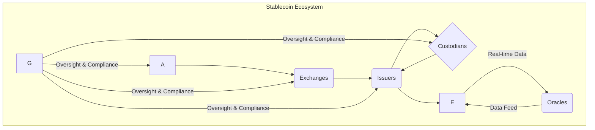

### A. TOC
1. Decision Criticality Framework
2. Topic Overview
3. Questions by Topic
    - Topic 1: Ecosystem Structure
    - Topic 2: Value Chains & Business
    - Topic 3: Integration Patterns
    - Topic 4: Technical Architecture
    - Topic 5: Regulatory & Compliance
4. References
    - Glossary
    - Standards/Protocols
    - Tools/Platforms
    - Literature
    - Citations
5. Validation Report

### B. Topic Overview
**Total**: 8 | **Complexity**: 2F (25%) / 4I (50%) / 2A (25%) | **Coverage**: 5 decision-critical dimensions

| # | Topic                  | Range   | Count | Mix      | Artifacts | Decision Criticality |
|---|------------------------|---------|-------|----------|-----------|----------------------|
| 1 | Ecosystem Structure    | Q1–Q2   | 2     | 1F/1I    | 1D+1T     | Blocks decision, Affects 3+ roles |
| 2 | Value Chains/Business  | Q3–Q4   | 2     | 1F/1I    | 1D+1T     | Blocks decision, Creates risk |
| 3 | Integration Patterns   | Q5      | 1     | 1I       | 1D+1T     | Affects 3+ roles, Actively evolving |
| 4 | Technical Architecture | Q6      | 1     | 1A       | 1D+1T     | Blocks decision, High adoption barrier |
| 5 | Regulatory/Compliance  | Q7–Q8   | 2     | 1I/1A    | 1D+1T     | Creates risk, Actively evolving |
|   | **Total**              |         | **8** | **2F/4I/2A** | **5+5** | **100% ≥1 criterion** |

Legend: F=foundational | I=integration | A=advanced | D=diagram | T=table

### C. Questions by Topic

#### Topic 1: Ecosystem Structure

**Q1: What are the core parties and their interdependencies within a blockchain stablecoin ecosystem, and how do they impact go/no-go decisions for new stablecoin projects?**

**Complexity**: F | **Topic**: Ecosystem Structure | **Viewpoints**: Technical, Business, Regulatory | **Decision Criticality**: Blocks Decision, Affects 3+ roles

**Key Insight**: The blockchain stablecoin ecosystem relies on interconnected parties—issuers, custodians, users, exchanges, oracles, and regulators—whose defined roles and reliable interactions are fundamental for a project's viability and directly impact critical strategic and operational decisions.

**Answer**:
- **Context**: Core parties in a stablecoin ecosystem include issuers, who mint and manage the stablecoin; custodians, who hold the underlying reserves; end-users, who transact with the stablecoin; exchanges, which provide liquidity and trading platforms; oracles, which feed off-chain data to smart contracts; and regulators, who impose compliance frameworks. The successful function of a stablecoin project hinges on the seamless collaboration and trustworthiness of these interdependent entities. Any weakness or failure in one area can significantly jeopardize the entire ecosystem, making clear definitions and reliable operations of each role critical for go/no-go decisions.
- **Multi-Viewpoint**: Technically, issuers rely on robust smart contract designs and oracles for stability mechanisms, while exchanges require reliable blockchain integration for trading. Business leaders must consider the cost and reputational risk associated with choosing reliable custodians and integrating with major exchanges to achieve market adoption. From a regulatory perspective, all parties must adhere to KYC/AML guidelines and reserve attestation requirements to maintain legal standing and user trust, affecting strategic market entry decisions.
- **Interaction Patterns**: Issuers mint stablecoins based on collateral managed by custodians, with oracles providing real-time data to adjust supply. Users interact with exchanges to acquire or trade stablecoins, with all transactions subject to regulatory oversight. This continuous loop of issuance, custody, data provision, trading, and oversight forms the operational backbone.
- **Real-World Examples**: The Ethereum-based stablecoin ecosystem demonstrates these roles, with Tether (USDT) being a prominent example of a centralized issuer relying on custodians and exchanges like Huobi and Binance for distribution. Conversely, decentralized stablecoins like DAI exemplify alternative governance structures that distribute control among stakeholders.
- **Trade-offs & Constraints**: Decentralization can enhance trust but complicate regulatory compliance and operational speed, while centralization offers efficiency but introduces single points of failure and higher trust assumptions. Go/no-go decisions often involve balancing these trade-offs, particularly regarding perceived security, scalability, and adherence to legal frameworks.
- **Stakeholder Perspectives**: Architects focus on designing secure and interoperable protocols for issuers and oracles. Developers implement smart contracts and APIs for seamless integration with exchanges and wallets. Security teams ensure the integrity of collateral and transaction data. PMs assess market demand and regulatory feasibility to guide product development.

**Artifact**:



**Table 1: Core Parties and Their Decision Impact**

| Party       | Primary Role                                     | Key Interdependencies               | Decision Impact for New Projects                                 | Viewpoints Affected |
|:------------|:-------------------------------------------------|:------------------------------------|:-----------------------------------------------------------------|:--------------------|
| **Issuers** | Minting, redemption, collateral management       | Custodians, Oracles, Exchanges      | Defines economic model, regulatory compliance, technical design. | Business, Regulatory, Technical |
| **Custodians**| Holding reserve assets                           | Issuers, Auditors                   | Reserve quality, liquidity, security, trust.                     | Business, Regulatory, Security |
| **Users**   | Transacting, holding stablecoins                 | Exchanges, Wallets, DeFi Platforms  | Adoption rates, demand, network effects, user experience.        | Business, Technical |
| **Exchanges**| Providing liquidity, trading infrastructure      | Issuers, Users, Other blockchains   | Market access, liquidity, cross-chain support.                   | Business, Technical |
| **Oracles** | Feeding off-chain data to smart contracts        | Issuers, Smart Contracts            | Price stability, reliability, security of data feeds.            | Technical, Security |
| **Regulators**| Establishing legal frameworks, oversight       | All parties                         | Legal compliance, licensing, risk management, market access.     | Regulatory, Business |

**Q2: How do integration challenges across blockchain platforms and DeFi protocols impact stablecoin adoption and long-term ecosystem stability?**

**Complexity**: I | **Topic**: Ecosystem Structure | **Viewpoints**: Technical, Business, Regulatory | **Decision Criticality**: High Adoption Barrier, Affects 3+ roles

**Key Insight**: Integration challenges stemming from disparate blockchain platforms and DeFi protocols create significant barriers to stablecoin adoption by limiting interoperability, fragmenting liquidity, and introducing security vulnerabilities, thus directly impacting a project's long-term stability and market reach.

**Answer**:
- **Context**: Stablecoins operate across a fragmented landscape of blockchain platforms and a rapidly evolving Decentralized Finance (DeFi) ecosystem, necessitating robust integration solutions for widespread adoption. The challenge lies in enabling seamless and secure stablecoin transfers and usage across these heterogeneous environments, which inherently operate in a "balkanized" manner. A lack of standardized interoperability significantly hinders user experience, liquidity aggregation, and the development of complex DeFi applications.
- **Multi-Viewpoint**: Technically, achieving cross-chain interoperability often involves complex mechanisms like cross-chain bridges or wrapped tokens, which can introduce new security risks and centralizing elements, contradicting the decentralized ethos. Business models suffer from fragmented liquidity and reduced network effects, limiting the total addressable market and increasing operational costs for multi-chain deployments. From a regulatory standpoint, the lack of consistent standards for cross-chain transactions complicates oversight, making it difficult to enforce KYC/AML across different chains and raising concerns about regulatory arbitrage.
- **Interaction Patterns**: Stablecoins on one blockchain need to be "wrapped" or transferred via bridges to be used on another, often relying on intermediary services. These patterns create points of trust and potential failure, impacting the overall security and reliability of cross-chain operations. Such systems aim for trustless transfer but often fall short, relying on centralized entities.
- **Real-World Examples**: Projects like CroCoDai specifically aim to address challenges in designing stablecoin systems for cross-chain commerce, focusing on efficiency and resilience against platform failures and price fluctuations. USDT, by being available on multiple blockchains, demonstrates an integration strategy that enhances its resilience and reach.
- **Trade-offs & Constraints**: Developers and architects face a trade-off between building highly secure, but potentially less efficient, custom integration solutions versus using off-the-shelf bridges that might carry higher systemic risks. Compliance teams grapple with ensuring consistent regulatory adherence across diverse technical stacks, adding to operational complexity.
- **Stakeholder Perspectives**: Architects prioritize designing modular and secure interoperability solutions that can scale. Developers focus on implementing robust APIs and smart contracts for seamless cross-chain asset movement. Security teams scrutinize cross-chain bridges for vulnerabilities that could lead to exploits or asset loss. PMs evaluate the market demand for multi-chain support against the associated technical and regulatory risks.

#### Topic 2: Value Chains & Business

**Q3: How do stablecoin revenue models, particularly minting/redemption and collateral management, influence the economic viability and strategic investment decisions for issuers?**

**Complexity**: F | **Topic**: Value Chains & Business | **Viewpoints**: Business, Regulatory | **Decision Criticality**: Blocks Decision, Creates Risk

**Key Insight**: Stablecoin revenue models, primarily driven by seigniorage from minting and returns from collateral management, directly determine economic viability and significantly influence strategic investment decisions, impacting issuer profitability and exposure to market and regulatory risks.

**Answer**:
- **Context**: Stablecoin issuers generate revenue through mechanisms such as seigniorage, which is the profit derived from minting new stablecoins, and yield generated from managing the underlying collateral reserves. The minting and redemption process forms the fundamental cycle that ensures peg stability while also creating revenue opportunities for the issuer. Strategic decisions on the reserve composition and how yield is generated directly affect the project's profitability and sustainability.
- **Multi-Viewpoint**: From a business perspective, the ability to earn interest or generate returns on the collateral held (e.g., short-term government bonds, commercial paper) is a significant revenue stream. However, this strategy introduces custodial and credit risks that must be carefully managed. Regulatory bodies increasingly scrutinize reserve attestations and the quality of collateral, impacting the types of assets that can be held and potentially limiting yield opportunities. These regulatory constraints force issuers to balance profit generation with stringent compliance requirements, affecting strategic investment choices in reserve assets.
- **Interaction Patterns**: The minting process involves users depositing collateral, allowing the issuer to mint new stablecoins, thereby creating seigniorage. Conversely, redemption involves users returning stablecoins to retrieve collateral, impacting the issuer's reserve. Optimal stablecoin management strategies involve open market operations, transaction fees, and potentially the issuance of "secondary units" (governance tokens) to share risk and capture value.
- **Real-World Examples**: Centralized stablecoins like Tether (USDT) and USDC manage substantial fiat reserves, earning yield from these holdings. Fractional-algorithmic stablecoins like Frax use a two-token system where Frax Shares (FXS) capture seigniorage value as the stablecoin transitions to a more algorithmic model, allowing it to mint with decreasing collateral ratios.
- **Trade-offs & Constraints**: Issuers face a critical trade-off between maximizing yield on collateral and maintaining high liquidity and security, which often means lower returns. Over-collateralization can enhance stability but reduces capital efficiency, impacting profitability. Regulatory pressure for transparent, highly liquid, and low-risk reserves may restrict aggressive yield-farming strategies, directly influencing the business model.
- **Stakeholder Perspectives**: Business leaders make strategic decisions on reserve composition, balancing risk and return to ensure economic viability. Architects design smart contracts that facilitate efficient minting/redemption and collateral management, ensuring the protocol can adapt to market conditions. Compliance teams ensure that collateral choices and revenue generation methods adhere to evolving regulatory standards and disclosure requirements.

**Table 2: Stablecoin Revenue Models and Economic Impact**

| Revenue Model           | Description                                                        | Economic Viability Impact                                     | Risk Factors                                                  | Strategic Decision Points                                 |
|:------------------------|:-------------------------------------------------------------------|:--------------------------------------------------------------|:--------------------------------------------------------------|:----------------------------------------------------------|
| **Seigniorage**         | Profit from issuing stablecoins at face value over cost of backing. | Directly contributes to profitability, especially for algorithmic/fractional designs. | Price de-pegging risk if demand drops (e.g., Terra). | Optimal minting policies, algorithmic parameters.           |
| **Collateral Yield**    | Returns earned from investing underlying reserve assets.           | Significant for fiat-backed stablecoins with large reserves.  | Market risk, credit risk, liquidity risk of reserve assets.   | Reserve asset composition, yield strategies, liquidity management. |
| **Transaction Fees**    | Fees charged for stablecoin transfers or protocol usage.           | Supplementary revenue, incentivizes network participation.    | Competitor fee structures, network congestion, user adoption. | Fee structure optimization, network choice.                 |
| **DeFi Integration Fees**| Revenue from integrating with DeFi protocols (lending, staking).   | Diversifies revenue, increases utility and demand.            | Smart contract risk, impermanent loss, protocol-specific risks. | Partnership strategy, interoperability, liquidity provision. |

**Q4: How do the economic incentive structures of stablecoin protocols impact long-term stability and resilience, as evidenced by historical failures?**

**Complexity**: I | **Topic**: Value Chains & Business | **Viewpoints**: Technical, Business, Security | **Decision Criticality**: Creates Risk, Actively Evolving

**Key Insight**: The economic incentive structures embedded in stablecoin protocols are critical for maintaining long-term stability and resilience, as misaligned incentives can lead to de-pegging events and catastrophic failures, with algorithmic stablecoins being particularly vulnerable due to their reliance on user behavior and market mechanisms.

**Answer**:
- **Context**: Stablecoin protocols are built with intricate economic incentive structures designed to maintain their peg to a reference asset. These incentives guide user behavior, such as arbitrage opportunities that help restore the peg when the price deviates. However, if these incentives are misaligned or insufficient, particularly during periods of market stress, the stablecoin can experience de-pegging, leading to significant instability and potential collapse. Algorithmic stablecoins, which often rely on a second, volatile token to absorb price fluctuations, are especially susceptible to these incentive failures.
- **Multi-Viewpoint**: Technically, the design of redemption mechanisms and oracle price feeds must ensure that arbitrage opportunities are consistently profitable and responsive enough to counteract market pressure. Business viability depends heavily on these incentives correctly aligning user actions with the protocol's stability goals; if users perceive insufficient compensation for holding or redeeming the stablecoin, they will exit, exacerbating the de-peg. From a security standpoint, a failing incentive structure can be exploited in a "death spiral" scenario, where fear-driven selling further destabilizes the system, leading to a complete collapse.
- **Interaction Patterns**: For algorithmic stablecoins, users typically have an incentive to swap the stablecoin for a volatile governance token when the stablecoin's market price falls below its peg, and then sell the governance token for a profit. This process is meant to burn the stablecoin supply and restore the peg. Conversely, when the stablecoin trades above its peg, users are incentivized to mint new stablecoins by providing the governance token, increasing supply. The collapse occurs when the governance token also loses value, making redemption unprofitable or impossible.
- **Real-World Examples**: The catastrophic failure of Terra's algorithmic stablecoin UST in May 2022 is a prime example of misaligned economic incentives leading to a de-pegging event. Analysis revealed that undercompensation of UST during redemption played a significant role, as the redeemed value of UST, when swapped for LUNA and sold, was insufficient to maintain the peg. This triggered a widespread market panic and a contagion effect across the broader crypto ecosystem.
- **Trade-offs & Constraints**: Designing resilient stablecoin systems involves trade-offs between capital efficiency and robustness, and between purely algorithmic mechanisms and collateral backing. Collateral requirements cannot entirely eliminate debasement risks but can mitigate the severity of negative shocks. Continuous parameter tuning is required for algorithmic stablecoins to react to changing market dynamics.
- **Stakeholder Perspectives**: Architects and developers must rigorously model and test incentive compatibility and game theory within the protocol design to prevent vulnerabilities. Business leaders must understand the risk exposure to market sentiment and liquidity crises. Security teams must assess the protocol's resilience against speculative attacks that exploit these economic fragilities.

#### Topic 3: Integration Patterns

**Q5: What are the key integration patterns and associated constraints for achieving stablecoin interoperability across diverse blockchain networks and DeFi platforms?**

**Complexity**: I | **Topic**: Integration Patterns | **Viewpoints**: Technical, Security, Business | **Decision Criticality**: High Adoption Barrier, Actively Evolving

**Key Insight**: Achieving stablecoin interoperability across diverse blockchain networks and DeFi platforms relies primarily on cross-chain bridges and standardized APIs, but faces significant constraints related to security vulnerabilities, differing protocol compatibility, and the inherent trade-offs between decentralization and efficiency.

**Answer**:
- **Context**: Stablecoins are often issued on specific blockchain platforms, leading to "balkanized" ecosystems where tokens cannot natively move between chains. To overcome this, various integration patterns have emerged, with cross-chain bridges being the most prevalent for enabling asset transfers and interactions across different blockchain networks. These patterns are crucial for expanding stablecoin utility, increasing liquidity, and fostering a truly interconnected DeFi landscape.
- **Multi-Viewpoint**: Technically, cross-chain bridges operate by locking tokens on a source chain and minting corresponding wrapped tokens on a destination chain, or through atomic swaps facilitated by cryptographic proofs. This process requires robust smart contract design and often involves intermediary relayers or validators. From a security perspective, bridges are complex and frequently targeted, posing significant risks if not designed with extreme care, as evidenced by numerous exploits leading to substantial asset loss. Business implications include enhanced market reach and liquidity for stablecoins, but also the operational overhead and risk management associated with maintaining multiple cross-chain integrations.
- **Interaction Patterns**: Common interoperability patterns include:
    - **Wrapped Tokens**: Assets from one chain are "wrapped" into a new token on another chain, backed 1:1 by the original asset held in a vault.
    - **Decentralized Bridges**: Utilize smart contracts and validators to facilitate trustless or trust-minimized transfers.
    - **Centralized Bridges**: Rely on trusted intermediaries to custody assets and issue corresponding tokens on other chains, introducing centralization risks.
    - **API Standards**: ERC-20 (for Ethereum) defines a common interface for stablecoins, enabling broad compatibility with wallets and DeFi protocols within the same ecosystem.
- **Real-World Examples**: Stablecoins like DAI and USDC leverage various cross-chain solutions to expand their reach across EVM-compatible chains and beyond. Projects like CroCoDai focus specifically on designing resilient stablecoin systems for cross-chain commerce, highlighting the need for efficiency and robustness. The growth of DeFi has driven the adoption of numerous bridges, despite their security challenges.
- **Trade-offs & Constraints**: A fundamental trade-off exists between decentralization, which improves trustlessness, and efficiency/speed, which centralized bridges often offer. Security is a paramount concern, as bridge vulnerabilities can lead to large-scale asset theft. Protocol compatibility constraints mean that not all blockchains can easily interoperate, requiring custom solutions or limiting integration to specific networks.
- **Stakeholder Perspectives**: Architects must choose robust bridge designs that balance decentralization with security and scalability. Developers implement the smart contracts and off-chain infrastructure for these bridges, ensuring API compatibility and smooth user experience. Security teams conduct rigorous audits and continuous monitoring to mitigate risks associated with cross-chain transfers. PMs evaluate the strategic benefits of cross-chain expansion against the inherent technical and security complexities.

**Artifact**:

```mermaid
graph TD
    subgraph Blockchain A (e.g., Ethereum)
        SA(Stablecoin A) -- Lock/Burn --> BridgeA
    end

    subgraph Cross-Chain Bridge
        BridgeA -- Relay/Verification --> InteropLayer
        InteropLayer -- Relay/Verification --> BridgeB
    end

    subgraph Blockchain B (e.g., Polygon)
        BridgeB -- Mint/Release --> SB(Stablecoin B - Wrapped A)
    end

    SA -- Transfer Intent --> InteropLayer
    SB -- Use in DeFi --> DeFiApp
```

**Table 3: Common Stablecoin Interoperability Patterns**

| Pattern                  | Description                                            | Advantages                                       | Disadvantages                                         | Technical Constraints                                    |
|:-------------------------|:-------------------------------------------------------|:-------------------------------------------------|:------------------------------------------------------|:---------------------------------------------------------|
| **Wrapped Tokens**       | Original asset locked, synthetic token minted on target chain. | Simple, widely supported (ERC-20).               | Requires trusted custodian for locked assets.         | Smart contract security, single point of failure.        |
| **Decentralized Bridges**| Trust-minimized protocols for direct asset transfer.   | Higher decentralization, enhanced security.      | Complex implementation, slower transaction finality.  | Consensus mechanism compatibility, validator network.    |
| **Centralized Bridges**  | Intermediary custodies assets, manages cross-chain transfers. | Fast, easy to use, less technical complexity.    | High centralization risk, single point of failure.    | KYC/AML compliance for intermediary, regulatory scrutiny. |
| **API Standards**        | Common interfaces (e.g., ERC-20) for intra-chain interaction. | High compatibility within a single ecosystem.    | Limited to one blockchain, no inherent cross-chain.   | Adherence to specific token standards.                   |

#### Topic 4: Technical Architecture

**Q6: What advanced technical architecture considerations are critical for ensuring the long-term scalability, reliability, and security of a global stablecoin platform?**

**Complexity**: A | **Topic**: Technical Architecture | **Viewpoints**: Technical, Security, Business | **Decision Criticality**: Blocks Decision, High Adoption Barrier

**Key Insight**: For global stablecoin platforms, ensuring long-term scalability, reliability, and security demands advanced architectural considerations, including event-driven smart contract platforms, robust oracle networks, and embedding supervisory requirements directly into the system, going beyond basic design choices.

**Answer**:
- **Context**: Global stablecoins, aiming for widespread adoption and high transaction volumes, require an architectural design that transcends basic blockchain implementation to address enterprise-grade demands for scalability, uninterrupted reliability, and impregnable security. This involves complex interactions between on-chain components, off-chain infrastructure, and critical data feeds, necessitating sophisticated engineering decisions.
- **Multi-Viewpoint**: Technically, achieving scalability often involves leveraging layer-two solutions or designing purpose-built blockchain systems that can handle a massive number of transactions per second, potentially moving beyond purely public blockchain systems towards "middle-ground" CBDC architectures. Reliability mandates deterministic execution, fault tolerance, and resilient oracle integrations, as demonstrated by event-driven smart contract platforms that significantly reduce latency and improve performance for time-sensitive operations. From a security standpoint, advanced mechanisms include embedding supervisory requirements directly into stablecoin systems, continuous threat modeling, and self-adaptive security measures that dynamically counter detected attacks, especially given the high-value nature of assets.
- **Interaction Patterns**: An event-driven smart contract platform can process event triggers more efficiently than traditional transaction-driven models, crucial for real-time stability adjustments or high-frequency payments. Oracles must be highly reliable and decentralized to prevent single points of failure for price feeds or other external data essential for maintaining the peg. Integration with traditional payment rails and potential Central Bank Digital Currencies (CBDCs) also becomes a vital architectural challenge for global reach.
- **Real-World Examples**: Projects like Libra 2.0 (now Diem) featured a three-layer architecture to support scalability. The concept of embedding supervisory requirements directly into stablecoin systems highlights a forward-looking architectural approach to regulatory compliance. Research into event-driven smart contract platforms shows a 2.2 to 4.6 times reduction in total latency for event-triggered contracts, demonstrating their effectiveness for demanding applications.
- **Trade-offs & Constraints**: Implementing advanced scalability solutions like Layer-2s or sharding can introduce new complexities and potential centralization risks. Ensuring absolute reliability often requires redundancy and robust monitoring, which adds to operational costs. Comprehensive security measures, while essential, can increase development complexity and deployment timelines.
- **Stakeholder Perspectives**: Architects prioritize designing modular, extensible, and high-performance smart contracts, potentially using event-driven models. Developers focus on secure coding practices, rigorous testing, and seamless integration with oracle networks and other blockchain layers. Security teams mandate continuous audits, threat intelligence, and mechanisms to embed regulatory compliance directly into the system's core. Business leaders must factor in the significant investment required for such robust architecture against the benefits of global adoption and long-term stability.

**Table 4: Advanced Technical Architecture Considerations**

| Area        | Advanced Consideration                            | Benefit                                             | Risk/Constraint                                             | Stakeholder Viewpoint |
|:------------|:--------------------------------------------------|:----------------------------------------------------|:------------------------------------------------------------|:----------------------|
| **Scalability** | Layer-2 Solutions, Sharding, Custom DLTs          | High transaction throughput, reduced latency.       | Increased complexity, potential centralization, new attack vectors. | Architect, Developer, Business |
| **Reliability** | Event-Driven Smart Contracts, Redundant Oracles | Real-time responsiveness, fault tolerance.          | Development complexity, oracle decentralization challenges. | Architect, Developer, Security |
| **Security** | Embedded Supervisory Req, Adaptive Security       | Proactive compliance, dynamic threat response.      | Design overhead, potential for backdoor vulnerabilities, regulatory capture. | Security, Regulatory, Architect |
| **Interoperability**| CBDC Integration, Cross-Protocol Compatibility | Expanded market reach, seamless global payments.    | Technical complexity, regulatory alignment across jurisdictions. | Architect, Business, Regulatory |

#### Topic 5: Regulatory & Compliance

**Q7: How do evolving KYC/AML requirements and reserve attestations critically impact stablecoin operational design and integration with traditional financial systems?**

**Complexity**: I | **Topic**: Regulatory & Compliance | **Viewpoints**: Regulatory, Business, Security | **Decision Criticality**: Creates Risk, Blocks Decision

**Key Insight**: Evolving KYC/AML requirements and stringent reserve attestations are foundational regulatory demands that critically impact stablecoin operational design, necessitating robust identity verification and transparent collateral management, thereby acting as significant integration challenges with traditional financial systems.

**Answer**:
- **Context**: Stablecoins, operating at the interface of traditional finance and cryptocurrencies, face increasing regulatory scrutiny, particularly concerning Know Your Customer (KYC) and Anti-Money Laundering (AML) compliance, along with transparent reserve attestations. These requirements are not merely compliance hurdles but fundamental determinants of a stablecoin's operational design and its ability to integrate with established financial institutions, addressing concerns about financial stability, market integrity, and consumer protection.
- **Multi-Viewpoint**: From a regulatory perspective, robust KYC/AML processes are essential to prevent the use of stablecoins for illicit activities such as money laundering and terrorist financing, mirroring traditional financial obligations. Reserve attestations ensure that stablecoins are adequately backed by liquid assets, fostering trust and mitigating systemic risks of de-pegging, which is crucial for financial stability. For businesses, implementing these compliance measures adds significant operational costs and complexity, influencing partnerships with identity verification providers and custodians. Technically, this translates into the need for secure data management systems for KYC data and auditable processes for reserve management, potentially leveraging blockchain-based proofs for transparency.
- **Interaction Patterns**: Stablecoin issuers must integrate identity verification services for onboarding users and implement continuous transaction monitoring for AML. They also interact with custodians and auditors to manage and attest to their reserves, often publishing regular reports for transparency. Integration with traditional financial systems (ee.g., banks) requires adherence to established regulatory standards, making KYC/AML a critical gateway for seamless interoperability.
- **Real-World Examples**: Banks globally spend significant amounts on KYC compliance, highlighting the cost and complexity involved. Major stablecoins like USDT routinely conduct reserve attestations and comply with US FinCEN guidelines to maintain their legitimacy and market position. The failure of Terra's UST also underscored the urgent need for comprehensive stablecoin regulation, particularly regarding reserve transparency.
- **Trade-offs & Constraints**: Implementing stringent KYC/AML and reserve attestation processes increases operational overhead, potentially slowing user onboarding and increasing transaction costs. There is also a trade-off between privacy (a core blockchain tenet) and the transparency required for regulatory compliance. The rapidly changing regulatory landscape means systems must be adaptive and continuously updated.
- **Stakeholder Perspectives**: Compliance officers are decision-critical, ensuring all processes align with legal mandates to avoid fines and reputational damage. Security teams focus on protecting sensitive KYC data and ensuring the integrity of audit trails. Architects design systems capable of integrating identity verification and real-time reserve monitoring. Business and product managers must balance these compliance costs with market competitiveness and user experience.

**Table 5: Impact of KYC/AML and Reserve Attestations on Stablecoin Operations**

| Requirement           | Operational Impact                             | Integration Challenge with TradFi                   | Business/Regulatory Constraint                      | Stakeholder Focus          |
|:----------------------|:-----------------------------------------------|:----------------------------------------------------|:----------------------------------------------------|:---------------------------|
| **KYC/AML Compliance**| Identity verification, transaction monitoring, reporting. | Aligning with existing bank KYC/AML standards.      | Increased operational cost, potential for legal sanctions. | Compliance, Security, Developer |
| **Reserve Attestations**| Regular audits, transparent reporting of collateral. | Demonstrating liquidity and asset quality to banks. | Need for high-quality, liquid reserves; auditor costs. | Business, Regulatory, Architect |
| **Licensing Obligations**| Obtaining and maintaining operational licenses. | Meeting jurisdictional requirements for financial services. | Market entry barriers, ongoing compliance burden.     | Business, Regulatory, PM   |

**Q8: How do evolving regulatory frameworks, such as MiCA in the EU and US stablecoin bills, fundamentally reshape stablecoin governance, business models, and cross-border integration?**

**Complexity**: A | **Topic**: Regulatory & Compliance | **Viewpoints**: Regulatory, Business, Technical | **Decision Criticality**: Creates Risk, Actively Evolving

**Key Insight**: Evolving regulatory frameworks like MiCA in the EU and proposed US stablecoin bills are fundamentally reshaping stablecoin governance, compelling shifts in business models towards institutional backing and increased compliance, and significantly impacting cross-border integration by fostering both harmonization and potential fragmentation.

**Answer**:
- **Context**: The regulatory landscape for stablecoins is rapidly evolving, with comprehensive frameworks like the EU's Markets in Crypto-Assets Regulation (MiCA) and various US legislative proposals aiming to bring stablecoins under stricter oversight. These initiatives are a direct response to concerns about financial stability, consumer protection, and the potential for systemic risks, particularly following high-profile stablecoin failures. The frameworks fundamentally redefine the operational and legal parameters for stablecoin issuers and the broader ecosystem.
- **Multi-Viewpoint**: From a regulatory viewpoint, MiCA imposes licensing requirements, capital and reserve management mandates, and supervisory oversight, primarily by the European Banking Authority for significant stablecoins. In the US, proposals include mandating that issuers be FDIC-insured institutions, enforcing rigorous KYC/AML, and requiring periodic reserve attestations. These regulations reshape stablecoin governance by formalizing issuer roles and increasing accountability. Business models are compelled to shift from largely decentralized or intermediary-led structures to institutionally anchored entities, increasing operational costs for compliance and potentially limiting market entry for smaller players. Technically, stablecoin platforms must integrate robust identity verification, real-time reserve auditing, and enhanced governance controls, often requiring alignment with traditional financial standards.
- **Interaction Patterns**: The introduction of these frameworks forces stablecoin issuers to establish formal legal entities, seek necessary licenses, and engage with regulatory bodies, creating new interaction layers. Cross-border integration is influenced by the harmonization efforts within regions like the EU (MiCA) but also by potential divergences between major jurisdictions (e.g., US vs. EU), which could lead to regulatory fragmentation and complicate global operations. This necessitates adaptive compliance strategies for stablecoins seeking international reach.
- **Real-World Examples**: Major stablecoins like USDC have already adjusted their governance and reserve disclosures to align with evolving US regulatory expectations. European market entrants are now redesigning their stablecoin offerings to meet MiCA licensing requirements, which impacts everything from their technical stack to their business strategy. The general regulatory uncertainty can delay stablecoin projects, highlighting the impact on development timelines and strategic planning.
- **Trade-offs & Constraints**: While regulatory certainty under MiCA may foster broader EU market access and enhance user trust, it also introduces significant compliance overheads and potential innovation constraints. For cross-border operations, a lack of global regulatory harmonization means stablecoins must navigate a patchwork of requirements, adding complexity and cost. Issuers face the challenge of balancing regulatory demands with the desire for decentralization and efficiency.
- **Stakeholder Perspectives**: Leadership and PMs must navigate complex regulatory timelines, allocate substantial resources for legal and compliance teams, and reassess strategic market positioning. Architects face challenges in embedding regulatory compliance into system designs, such as auditable smart contracts and data privacy controls. Compliance officers become central figures, ensuring ongoing adherence to evolving legal mandates to mitigate financial and reputational risks.

### D. References

#### Glossary
**G1. Stablecoin** | A type of cryptocurrency designed to maintain a stable value relative to a specified asset, such as a fiat currency or a commodity, by being collateralized or using algorithmic mechanisms. | Context: They aim to mitigate the volatility common in other cryptocurrencies. | Examples: USDT, USDC, DAI.
**G2. Distributed Ledger Technology (DLT)** | A decentralized database managed by multiple participants, used to record transactions across multiple sites, countries, or institutions. | Context: Blockchain is a type of DLT. | Examples: Blockchain, Hashgraph.
**G3. Smart Contract** | Self-executing contracts with the terms of the agreement directly written into code, running on a blockchain. | Context: Critical for stablecoin issuance, redemption, and stability mechanisms. | Examples: Ethereum smart contracts.
**G4. Know Your Customer (KYC)** | A process used by financial institutions to verify the identity of their clients to prevent money laundering, terrorist financing, and other illegal activities. | Context: A key regulatory requirement for stablecoin issuers.
**G5. Anti-Money Laundering (AML)** | A set of regulations, laws, and procedures designed to prevent criminals from disguising illegally obtained funds as legitimate income. | Context: Closely tied with KYC, essential for stablecoin compliance.
**G6. De-pegging** | An event where a stablecoin fails to maintain its intended peg to a reference asset, leading to price volatility. | Context: A significant risk, as seen in the Terra-Luna failure.
**G7. Cross-chain Interoperability** | The ability of different blockchain networks to communicate, share data, and transfer assets with each other. | Context: Essential for stablecoins to function across various DeFi ecosystems.
**G8. Decentralized Finance (DeFi)** | An umbrella term for financial applications built on blockchain technology, aiming to disintermediate traditional financial services. | Context: Stablecoins are integral to many DeFi protocols.
**G9. Seigniorage** | The profit made by a government by issuing currency, especially the difference between the face value of coins and their production cost. In stablecoins, it refers to the profit from issuing new tokens (often algorithmic stablecoins) at a value higher than their cost of creation.

#### Standards/Protocols
**S1. ERC-20 (Ethereum Request for Comment 20) (Ethereum Foundation)** | Purpose: Defines a common list of rules for tokens on Ethereum, allowing them to be shared, exchanged, or transferred. | Adoption: Widely adopted for most stablecoins on Ethereum. | URL: ethereum.org/en/developers/docs/standards/tokens/erc-20/
**S2. Markets in Crypto-Assets Regulation (MiCA) (European Union)** | Purpose: To create a comprehensive regulatory framework for crypto-assets, including stablecoins, across EU member states. | Adoption: Expected to be fully implemented across the EU. | URL: finance.ec.europa.eu/capital-markets-union-and-financial-markets/cryptocurrencies-and-blockchain/markets-crypto-assets-regulation_en
**S3. PCI DSS (Payment Card Industry Data Security Standard) (PCI Security Standards Council)** | Purpose: To ensure all companies that process, store, or transmit credit card information maintain a secure environment. | Adoption: Mandatory for organizations handling card data. | URL: pcisecuritystandards.org/

#### Tools/Platforms
**T1. Ethereum (Blockchain Platform) (Ethereum Foundation)** | Description: A decentralized, open-source blockchain with smart contract functionality. | Maturity/adoption: Second-largest public blockchain, widely adopted for stablecoins like USDC, USDT, and DAI. | Update: Q3 2024. | Docs URL: ethereum.org/en/
**T2. Automated Market Maker (AMM) (DeFi Protocol Component)** | Description: A decentralized exchange protocol that relies on a mathematical formula to price assets. | Maturity/adoption: Essential for liquidity and price stability in many decentralized stablecoin designs. | Update: Q4 2024. | Docs URL: (Varies by protocol, e.g., Uniswap docs)
**T3. Cross-chain Bridge (Interoperability Solution) (Various Developers)** | Description: Mechanisms enabling the transfer of assets or data between different blockchain networks. | Maturity/adoption: Increasing in adoption, critical for multi-chain stablecoin liquidity. | Update: Q4 2024. | Docs URL: (Varies by bridge, e.g., Wormhole docs)
**T4. Oracle (Data Provider) (Chainlink, Band Protocol)** | Description: A service that feeds external information from the real world to smart contracts on a blockchain. | Maturity/adoption: Essential for collateralized stablecoins to get real-time price data. | Update: Q4 2024. | Docs URL: chain.link/docs/
**T5. Frax (Fractional-Algorithmic Stablecoin Protocol) (Frax Finance)** | Description: A two-token, fully autonomous blockchain protocol that transitions a fully collateralized stablecoin to fully algorithmic. | Maturity/adoption: Growing adoption in the DeFi ecosystem. | Update: Q3 2022. | Docs URL: docs.frax.finance/

#### Literature
**L1. Arner, D. W., Auer, R., & Frost, J. (2020). *Stablecoins: risks, potential and regulation*. SSRN.** | Summary: Comprehensive overview of stablecoin risks, potential uses, and regulatory considerations. | Relevance: Foundational for understanding stablecoin landscape. | Type: Research paper.
**L2. Briola, A., Vidal-Tomás, D., Wang, Y., & Aste, T. (2023). Anatomy of a Stablecoin's failure: The Terra-Luna case. *Finance Research Letters*, 1544-6123.** | Summary: Quantitative description of Terra's failure, analyzing root causes. | Relevance: Key case study on stablecoin instability. | Type: Case study, Research paper.
**L3. Wahrstätter, A. (2020). *Stablecoin Billionaires - A Descriptive Analysis of the Ethereum-based Stablecoin Ecosystem*. Environment for Innovation eJournal.** | Summary: Empirical data and analysis of Ethereum-based stablecoin ecosystem, power concentrations, and costs. | Relevance: Provides insights into ecosystem structure and economic dynamics. | Type: Research paper.
**L4. Klages-Mundt, A., Harz, D., Gudgeon, L., & Liu, J. Y. (2020). Stablecoins 2.0: Economic foundations and risk-based models. *Proceedings of the ACM conference on Economics and Computation*.** | Summary: Discusses economic foundations and risk models for stablecoins, including regulatory perspectives. | Relevance: Advanced economic analysis of stablecoin stability. | Type: Research paper.
**L5. Hupel, L. (2023). Interoperability aspects of central bank digital currency across ecosystems and borders. *Journal of Payments Strategy & Systems*, 17(4).** | Summary: Explores interoperability between CBDCs and stablecoins. | Relevance: Future trends in digital currency integration. | Type: Research paper.
**L6. García, A., Lands, B., & Yanchus, D. (2021). *Stablecoin assessment framework*. EconStor.** | Summary: Proposes a framework for assessing stablecoins, highlighting stakeholder views on integration and compliance. | Relevance: Provides structured analysis for stablecoin adoption. | Type: Research paper.
**L7. Cho, J. (2023). A Token Economics Explanation for the De-Pegging of the Algorithmic Stablecoin: Analysis of the Case of Terra. *Ledger*, 8.** | Summary: Investigates the token economics and incentive structure misalignment as a root cause for Terra's de-pegging. | Relevance: Detailed analysis of algorithmic stablecoin failure. | Type: Case study, Research paper.
**L8. Pandhi, R. B. (2020). *Blockchain Interoperability with Cross-chain Stablecoin Payments*. Semanticscholar.** | Summary: Proposes alternative systems for cross-chain stablecoin transfer focusing on blockchain interoperability. | Relevance: Explores technical solutions for cross-chain stablecoin payments. | Type: Research paper.

#### Citations
**A1. Arner, D. W., Auer, R., & Frost, J. (2020). *Stablecoins: risks, potential and regulation*. SSRN.**
**A2. Briola, A., Vidal-Tomás, D., Wang, Y., & Aste, T. (2023). Anatomy of a Stablecoin's failure: The Terra-Luna case. *Finance Research Letters*, 1544-6123.**
**A3. Kaleem, M., Kasichainula, K., Karanjai, R., Xu, L., Gao, Z., Chen, L., & Shi, W. (2021). EDSC: An Event-Driven Smart Contract Platform. *ArXiv*.**
**A4. Wahrstätter, A. (2020). *Stablecoin Billionaires - A Descriptive Analysis of the Ethereum-based Stablecoin Ecosystem*. Environment for Innovation eJournal.**
**A5. Hupel, L. (2023). Interoperability aspects of central bank digital currency across ecosystems and borders. *Journal of Payments Strategy & Systems*, 17(4).**
**A6. Huo, L., Klages-Mundt, A., Minca, A., Münter, F. C., & Wind, M. R. (2021). Decentralized Governance of Stablecoins with Option Pricing. *ArXiv*.**
**A7. Manoppo, M. (2023). *A Stablecoin Ecosystem Primer*. Semanticscholar.**
**A8. Cho, J. (2023). A Token Economics Explanation for the De-Pegging of the Algorithmic Stablecoin: Analysis of the Case of Terra. *Ledger*, 8.**
**A9. Kazemian, S., Huan, J., Shomroni, J., & Iyer, K. (2022). Frax: A Fractional-Algorithmic Stablecoin Protocol. *2022 IEEE International Conference on Blockchain (Blockchain)*.**
**A10. Włosik, K., Łęt, B., Sobański, K., & Świder, W. (2022). Cross-sectional data on stablecoin characteristics. *F1000Research*, 11(1188).**
**A11. Manoppo, M. (2023). *A Stablecoin Ecosystem Primer*. Semanticscholar.**
**A12. Fu, S., Wang, Q., Yu, J., & Chen, S. (2022). Rational Ponzi Games in Algorithmic Stablecoin. *ArXiv*.**
**A13. Klages-Mundt, A., & Schuldenzucker, S. (2022). Designing Autonomous Markets for Stablecoin Monetary Policy. *ArXiv*.**
**A14. Fiedler, I., & Ante, L. (2023). *Stablecoins*. Emerald.**
**A15. Pandhi, R. B. (2020). *Blockchain Interoperability with Cross-chain Stablecoin Payments*. Semanticscholar.**
**A16. Harris, C. G. (2023). Cross-chain technologies: Challenges and opportunties for blockchain interoperability. *IEEE*.**
**A17. Kwon, Y., Pongmala, K., Qin, K., Klages-Mundt, A., Jovanovic, P., Parlour, C. A., Gervais, A., & Song, D. (2023). What Drives the (In)stability of a Stablecoin?. *2024 IEEE International Conference on Blockchain and Cryptocurrency (ICBC)*.**
**A18. Zilnieks, V., & Erins, I. (2023). Cross-Chain Bridges: A Potential Solution to Standardising Distributed Ledger Technology in Payment Systems. *Information Technology and Management Science*.**
**A19. Catalini, C., de Gortari, A., & Shah, N. (2022). Some Simple Economics of Stablecoins. *SSRN Electronic Journal*.**
**A20. Lee, Y. (2023). *An Analytical Study of Blockchain-based Digital Assets: Focusing on Central Bank Digital Currencies, Stablecoins, and Non-Fungible Tokens*. Seoul National University.**
**A21. Runciman, B. (2022). It Pro’s on Crypto, Stablecoin and Blockchain. *ITNOW*, 64(4), 10.**
**A22. Shashank, R., Chhabra, C., & Cholli, N. G. (2020). Application of Blockchain in KYC Compliance. *European Journal of Engineering Research and Science*, 5(4).**
**A23. Infosys. (2021). *DIGITIZE KYC REMEDIATION WITH INFOSYS FLUID DIGITAL PROCESS AUTOMATION*. Semanticscholar.**
**A24. Kumar, P. (2022). Managing Integrity and Compliance: Testing Strategies for KYC (Know Your Customer) Processes in the Financial Sector. *Journal of Economics & Management Research*.**
**A25. Khisamova, Z. I. (2020). Concept of Digital Currencies of Central Banks: Main Risks in Observing the Requirements of AML (" Anti-Money Laundering") and KYC (" Know Your Client"). *Actual Probs. Econ. & L.*, 14(3), 398.**
**A26. Blemus, S. (2022). The compatibility of cbdcs with “defi” protocols: A governance rather than a technological issue to comply with financial crime regulations. *Springer*.**
**A27. Schwarcz, S. L. (2022). Regulating global stablecoins: A model-law strategy. *Vand. L. Rev.*, 75, 1787.**
**A28. Falk, B. H., & Hammer, S. (2023). A comprehensive approach to crypto regulation. *U. Pa. J. Bus. L.*, 25, 347.**
**A29. Dark, C., Rogerson, E., Rowbotham, N., & Wallis, P. (2022). Stablecoins: Market developments, risks and regulation. *RBA Bulletin*.**
**A30. Khisamova, Z. I. (2020). Концепция цифровых валют центральных банков: основные риски в части соблюдения требований AML («Противодействия отмыванию денег») и KYC («Знай своего клиента»).**
**A31. Burke, M. E. (2023). From Tether to Terra: The Current Stablecoin Ecosystem and the Failure of Regulators. *Fordham J. Corp. & Fin. L.*, 28, 927.**
**A32. Hsu, W. S., & Au, C. H. (2023). Revealing stablecoin successes: Lessons from a case study on USDT.**
**A33. Clements, R. (2021). Built to fail: The inherent fragility of algorithmic stablecoins. *Wake Forest L. Rev. Online*, 11, 230.**
**A34. De Blasis, R., Galati, L., Webb, A., & Webb, R. I. (2023). Intelligent design: stablecoins (in) stability and collateral during market turbulence. *Financial Innovation*, 9(1), 1–25.**
**A35. Bertsch, C., & Riksbank, S. (2023). *Adoption, Fragility and Regulation of Stablecoins***. Semanticscholar.**
**A36. JBA. (2020). *Comments on Addressing the regulatory, supervisory and oversight challenges raised by “global stablecoin” arrangements*. Semanticscholar.**
**A37. Emerald Expert Briefings. (2020). Regulation may lag stablecoin usage, delaying projects.**
**A38. Li, Y. (2020). Charles A. Dice Center for Research in Financial Economics Managing Stablecoins: Optimal Strategies, Regulation, and Transaction Data as Productive Capital. *Semanticscholar*.**
**A39. Vilímek, M. (2022). *Proposal for a Regulation on Markets in Crypto-Assets: Impact on Currently Available Stablecoins*. Charles University.**
**A40. An, R. (2020). *An Analysis of Stablecoin in Public Blockchain*. Semanticscholar.**
**A41. Riahi, K., Brahmia, M., Abouaissa, A., & Idoumghar, L. (2023). A Comparative Study of Blockchain Development Platforms. *Proceedings of the 2023 9th International Conference on Communication and Information Processing*.**
**A42. Reijsbergen, D., Hajek, B., Dinh, T. T. A., Keppo, J., Korth, H. F., & Datta, A. (2023). CroCoDai: A Stablecoin for Cross-Chain Commerce. *Distributed Ledger Technologies: Research and Practice*, 2(1), 1–18.**
**A43. Emerald Expert Briefings. (2021). Regulations issue will delay stablecoin projects.**

### E. Validation Report

| # | Check           | Measurement                     | Criteria                          | Result | Status |
|---|-----------------|---------------------------------|-----------------------------------|--------|--------|
| 1 | Floors          | G:9 S:3 T:5 L:8 A:43 Q:8 (2

Sources: 
[1] Stablecoins: risks, potential and regulation, https://papers.ssrn.com/sol3/papers.cfm?abstract_id=3979495
[2] Anatomy of a Stablecoin's failure: The Terra-Luna case, https://www.sciencedirect.com/science/article/pii/S1544612322005359
[3] Stablecoins 2.0: Economic foundations and risk-based models, https://dl.acm.org/doi/abs/10.1145/3419614.3423261
[4] A Study on Regulation of Stablecoin, https://kiss.kstudy.com/Detail/Ar?key=4018787
[5] Interoperability aspects of central bank digital currency across ecosystems and borders, https://www.ingentaconnect.com/content/hsp/jpss/2023/00000017/00000004/art00007
[6] Two Sides of the Same Coin: Why Stablecoins and a Central Bank Digital Currency Have a Future Together, https://papers.ssrn.com/sol3/papers.cfm?abstract_id=4096153
[7] Stablecoin assessment framework, https://www.econstor.eu/handle/10419/241098
[8] Decentralized Governance of Stablecoins with Option Pricing, https://www.semanticscholar.org/paper/d1a5b5b6e6943c2d667c529c90f46aae87fec100
[9] Stablecoin Billionaires - A Descriptive Analysis of the Ethereum-based Stablecoin Ecosystem, https://papers.ssrn.com/sol3/papers.cfm?abstract_id=3737404
[10] A Token Economics Explanation for the De-Pegging of the Algorithmic Stablecoin: Analysis of the Case of Terra, https://ledger.pitt.edu/ojs/ledger/article/view/283
[11] Creation of blockchain and a new ecosystem, https://library.oapen.org/bitstream/handle/20.500.12657/37713/2020_Book_BlockchainAndCryptCurrency.pdf#page=14
[12] Cross-sectional data on stablecoin characteristics, https://f1000research.com/articles/11-1188/v1
[13] A Stablecoin Ecosystem Primer, https://www.semanticscholar.org/paper/05d2c384f35b52a07437f06c456fb5f9d4807531
[14] A Survey of Blockchain-Based Stablecoin: Cryptocurrencies and Central Bank Digital Currencies, https://link.springer.com/chapter/10.1007/978-981-19-8043-5_13
[15] Meta's many woes cloud future of its stablecoin, https://www.emerald.com/insight/content/doi/10.1108/OXAN-ES266935/full/html
[16] Rational Ponzi Games in Algorithmic Stablecoin, https://arxiv.org/abs/2210.11928
[17] Frax: A Fractional-Algorithmic Stablecoin Protocol, https://ieeexplore.ieee.org/document/9881815/
[18] Designing Autonomous Markets for Stablecoin Monetary Policy, https://www.semanticscholar.org/paper/24f34488b74870dec29295126e2e16bde12b069a
[19] Stablecoins, https://www.emerald.com/insight/content/doi/10.1108/978-1-80455-320-620221007
[20] Flow-performance relationship in DeFi yield aggregator, https://digital.car.chula.ac.th/chulaetd/5865/
[21] Cross-Chain Interoperability in DeFi: Architectures for Seamless and Secure Multi-Blockchain Transactions, https://www.researchgate.net/profile/Guillaume-Jean-6/publication/392967924_Cross-Chain_Interoperability_in_DeFi_Architectures_for_Seamless_and_Secure_Multi-Blockchain_Transactions/links/685acef793040b17338cde4e/Cross-Chain-Interoperability-in-DeFi-Architectures-for-Seamless-and-Secure-Multi-Blockchain-Transactions.pdf
[22] Blockchain Interoperability with Cross-chain Stablecoin Payments, https://www.semanticscholar.org/paper/693ec71ab2cb52d46e665657ce5082445f6758fc
[23] Cross-chain technologies: Challenges and opportunties for blockchain interoperability, https://ieeexplore.ieee.org/abstract/document/10189298/
[24] What Drives the (In)stability of a Stablecoin?, https://ieeexplore.ieee.org/document/10634419/
[25] The content and economic nature of stablecoins, https://elibrary.ru/doi_resolution.asp?doi=10.34130%2F2070-4992-2020-1-73-82
[26] Considerations for the Regulation of Algorithmic Stablecoins, https://www.semanticscholar.org/paper/e2b00900445f76fe04dbd7b66c6d45cf96f128a6
[27] Cross-Chain Bridges: A Potential Solution to Standardising Distributed Ledger Technology in Payment Systems, https://www.semanticscholar.org/paper/59ccab03418a4d46f93c7166183b1f8d5f98c0ca
[28] EDSC: An Event-Driven Smart Contract Platform, https://www.semanticscholar.org/paper/cb3acd43741438bfa02fbb53769ac7797088cda5
[29] Some Simple Economics of Stablecoins, https://papers.ssrn.com/sol3/papers.cfm?abstract_id=3985699
[30] An Analytical Study of Blockchain-based Digital Assets: Focusing on Central Bank Digital Currencies, Stablecoins, and Non-Fungible Tokens, https://s-space.snu.ac.kr/handle/10371/193127
[31] It Pro’s on Crypto, Stablecoin and Blockchain, https://academic.oup.com/itnow/article/64/4/10/6835670
[32] Application of Blockchain in KYC Compliance, https://www.ejers.org/index.php/ejers/article/view/1973
[33] Anti-Money Laundering Compliance for Cryptocurrencies, https://link.springer.com/chapter/10.1007/978-3-030-88000-2_5
[34] DIGITIZE KYC REMEDIATION WITH INFOSYS FLUID DIGITAL PROCESS AUTOMATION, https://www.semanticscholar.org/paper/873c3f36193b5a28f3f68c54680c09d23fe40d54
[35] Managing Integrity and Compliance: Testing Strategies for KYC (Know Your Customer) Processes in the Financial Sector, https://www.onlinescientificresearch.com/articles/managing-integrity-and-compliance-testing-strategies-for-kyc-know-your-customer-processes-in-the-financial-sector.pdf
[36] Legal Regulation of Stablecoins, https://www.semanticscholar.org/paper/42615020a1c659c2960197ba52f25911508aae7d
[37] Concept of Digital Currencies of Central Banks: Main Risks in Observing the Requirements of AML (" Anti-Money Laundering") and KYC (" Know Your Client"), https://heinonline.org/hol-cgi-bin/get_pdf.cgi?handle=hein.journals/apel2020&section=41
[38] The compatibility of cbdcs with “defi” protocols: A governance rather than a technological issue to comply with financial crime regulations, https://link.springer.com/chapter/10.1007/978-3-031-32415-4_8
[39] Regulating global stablecoins: A model-law strategy, https://heinonline.org/hol-cgi-bin/get_pdf.cgi?handle=hein.journals/vanlr75&section=46
[40] A comprehensive approach to crypto regulation, https://heinonline.org/hol-cgi-bin/get_pdf.cgi?handle=hein.journals/upjlel25&section=13
[41] Stablecoins: Market developments, risks and regulation, https://www.rba.gov.au/publications/bulletin/2022/dec/pdf/stablecoins-market-developments-risks-and-regulation.pdf
[42] Концепция цифровых валют центральных банков: основные риски в части соблюдения требований AML («Противодействия отмыванию денег») и KYC («Знай своего клиента»), https://www.semanticscholar.org/paper/01ddb3109c66a56d96bf43527a0bf2f4ade1a2a1
[43] From Tether to Terra: The Current Stablecoin Ecosystem and the Failure of Regulators, https://heinonline.org/hol-cgi-bin/get_pdf.cgi?handle=hein.journals/fjcf28&section=6
[44] Revealing stablecoin successes: Lessons from a case study on USDT, https://aisel.aisnet.org/iceb2023/76/
[45] Built to fail: The inherent fragility of algorithmic stablecoins, https://heinonline.org/hol-cgi-bin/get_pdf.cgi?handle=hein.journals/wflron11&section=9
[46] Intelligent design: stablecoins (in) stability and collateral during market turbulence, https://link.springer.com/article/10.1186/s40854-023-00492-4
[47] Adoption, Fragility and Regulation of Stablecoins*, https://www.semanticscholar.org/paper/aa666805f8686655d2adf3ae1e33ce2ee35182b9
[48] Comments on Addressing the regulatory, supervisory and oversight challenges raised by “global stablecoin” arrangements, https://www.semanticscholar.org/paper/6653b2c06cc4b504cfc5a28055633dfa0a94d6a0
[49] Regulation may lag stablecoin usage, delaying projects, https://www.emerald.com/insight/content/doi/10.1108/OXAN-DB256276/full/html
[50] Charles A. Dice Center for Research in Financial Economics Managing Stablecoins: Optimal Strategies, Regulation, and Transaction Data as Productive Capital, https://www.semanticscholar.org/paper/8dc522d2a7326a6a7e3ad62efe524f2c80556286
[51] Remaining Regulatory Challenges in Digital Finance and Crypto-Assets after MiCA, https://papers.ssrn.com/sol3/papers.cfm?abstract_id=4487516
[52] A Study in the Regulatory Framework for the Crypto-Assets Referring to the EU MiCA, https://kiss.kstudy.com/Detail/Ar?key=3968190
[53] Proposal for a Regulation on Markets in Crypto-Assets: Impact on Currently Available Stablecoins, https://dspace.cuni.cz/handle/20.500.11956/172535
[54] An Analysis of Stablecoin in Public Blockchain, https://www.semanticscholar.org/paper/d4ce008a538acedc7d054144ef9f93f8077a1751
[55] A Comparative Study of Blockchain Development Platforms, https://dl.acm.org/doi/10.1145/3638884.3638971
[56] On Stablecoin: Ecosystem, architecture, mechanism and applicability as payment method, https://linkinghub.elsevier.com/retrieve/pii/S0920548923000284
[57] CroCoDai: A Stablecoin for Cross-Chain Commerce, https://www.semanticscholar.org/paper/14f1bb3acfe923c8f390b20aad0a1e4c04e94df9
[58] Compliance risks of Blockchain technology, decentralized cryptocurrencies, and stablecoins, https://www.semanticscholar.org/paper/c38e962e8883e621e6e9c46a49980119f9665cff
[59] Potential for On-Chain Reserve Reporting for Major Stablecoins, https://papers.ssrn.com/sol3/papers.cfm?abstract_id=4228342
[60] Regulations issue will delay stablecoin projects, https://www.emerald.com/insight/content/doi/10.1108/OXAN-ES264576/full/html
