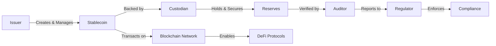
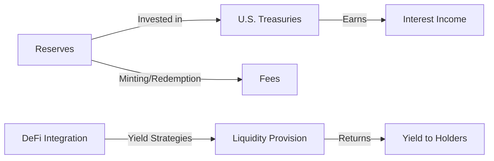
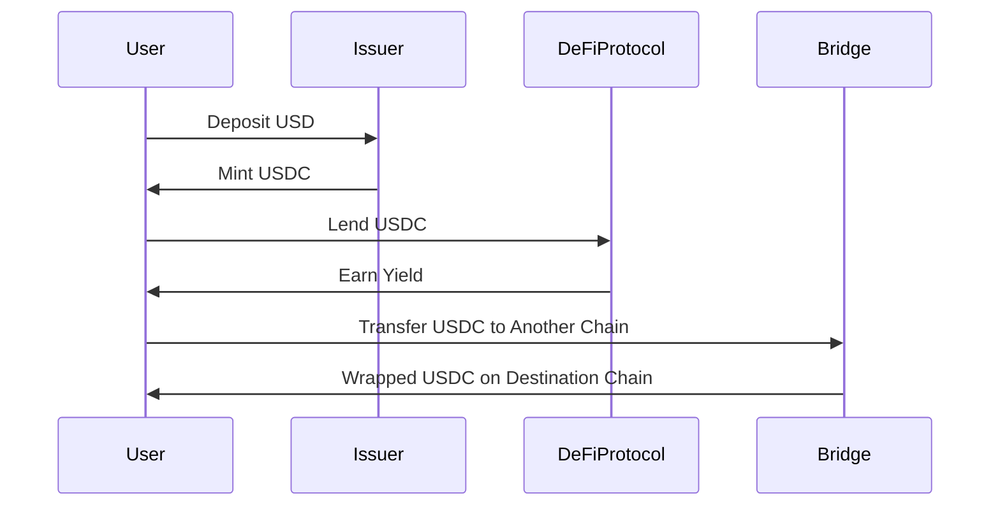
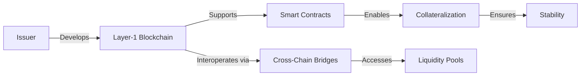
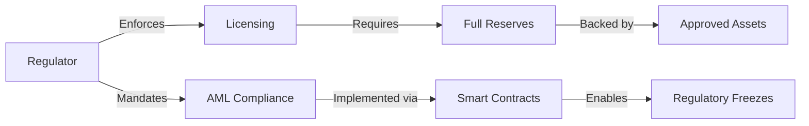

1. Identify the core parties and roles within the blockchain stablecoin ecosystem, focusing on their interactions and value flows.
2. Analyze the revenue models and economic viability of stablecoin projects, considering both technical and business viewpoints.
3. Examine the integration patterns, including APIs and protocols, that facilitate interoperability within the stablecoin ecosystem.
4. Assess the technical architecture of stablecoin platforms, focusing on scalability, reliability, and the tech stacks used.
5. Investigate the regulatory and compliance requirements that impact stablecoin projects, including governance and risk constraints.
6. Explore real-world examples and case studies of stablecoin implementations to understand their practical applications and challenges.
7. Evaluate the trade-offs and constraints in stablecoin design, considering technical, business, and regulatory perspectives.
8. Gather stakeholder perspectives from various roles such as Architects, Developers, Security, and Business leaders to understand their views on stablecoin integration and adoption.
# Decision-Critical Q&A Set on the Blockchain Stablecoin Ecosystem

> - The stablecoin ecosystem involves core parties: issuers, custodians, auditors, regulators, and blockchain networks, each playing critical roles in issuance, custody, compliance, and transaction processing.  
> - Revenue models primarily rely on interest from reserves (e.g., Tether earned $5.2B in 2024), minting/redeeming fees (0.1–0.3%), and yield strategies via DeFi integration and lending.  
> - Integration patterns include APIs for minting/redeeming, cross-chain bridges for interoperability, and DeFi protocols enabling lending, borrowing, and liquidity provisioning.  
> - Technical architecture trends show issuers building proprietary Layer-1 blockchains (e.g., Circle’s Arc) to control settlement infrastructure, improving scalability and reducing dependence on external networks.  
> - Regulatory frameworks such as MiCA (EU) and the GENIUS Act (US) mandate full reserve backing, licensing, AML compliance, and strict governance, shaping the economic viability and risk management of stablecoin projects.

---

## Ecosystem Structure

### Q1: What are the key roles and interactions among core parties in the stablecoin ecosystem?

**Key Insight**: The stablecoin ecosystem comprises five primary stakeholders: issuers, custodians, auditors, regulatory bodies, and blockchain networks. Issuers create and manage stablecoins, custodians hold and secure reserve assets, auditors verify reserve transparency, regulators enforce compliance frameworks, and blockchain networks facilitate secure and scalable transactions.

**Ecosystem Context**: Stablecoin issuers define the technical and economic parameters of stablecoins and manage their lifecycle. Custodians are legally prohibited from commingling customer assets with stablecoin reserves, ensuring asset security and compliance. Auditors provide third-party attestations to verify reserve holdings, critical for user trust and regulatory compliance. Regulatory bodies such as the European Securities and Markets Authority (ESMA) and the U.S. Office of the Comptroller of the Currency (OCC) mandate licensing, reserve requirements, and AML compliance. Blockchain networks, especially Ethereum and its Layer 2 solutions, enable the issuance, transfer, and integration of stablecoins with DeFi protocols and other financial applications.

**Multi-Viewpoint**:
- **Business**: Issuers must navigate complex regulatory requirements and ensure economic models support compliance costs (e.g., MiCA’s €300K–€500K annual audit requirements).
- **Technical**: Developers integrate smart contracts with pause and blacklist functions to comply with regulatory freezes and AML requirements.
- **Regulatory**: Regulators enforce strict governance and risk management standards to mitigate systemic risks.

**Interaction Patterns**:

**Examples**: Tether’s 2021 NYDFS settlement for misleading reserve disclosures underscores the critical role of auditors and regulators in ensuring transparency and accountability.

**Trade-offs**: Centralized custody enhances security but introduces counterparty risk; decentralized models increase transparency but may face regulatory hurdles.

**Stakeholder Perspectives**:
- **Compliance Officer**: “MiCA’s reserve rules add 6 months to launch timelines but reduce risk of regulatory penalties.”
- **Developer**: “Smart contracts must implement pause functions for regulatory freezes, complicating development but ensuring compliance.”

**Citations**: 

---

## Value Chains & Business Models

### Q2: What are the primary revenue streams and economic models supporting stablecoin projects?

**Key Insight**: Stablecoin issuers generate revenue mainly through interest on reserves, minting/redeeming fees, and yield strategies from DeFi integration and lending. The economic viability is supported by market growth, regulatory clarity, and integration with traditional finance.

**Ecosystem Context**: Issuers invest reserves in U.S. Treasury bills and other low-risk assets, earning yields that form the core revenue source (e.g., Tether earned $5.2B in 2024 from interest). Minting and redemption fees (0.1–0.3%) accumulate substantial income at scale. Yield strategies include liquidation fees, stability fees, and yield-bearing stablecoins (e.g., Sky’s USDS offers 12% APY). Market capitalization exceeds $160 billion, with projections reaching $3 trillion by 2030, driven by institutional adoption and regulatory tailwinds.

**Multi-Viewpoint**:
- **Business**: Revenue models must cover compliance costs and support sustainable growth amid regulatory pressures.
- **Technical**: Integration with DeFi protocols enables yield generation but introduces complexity and risk.
- **Regulatory**: Clear frameworks (e.g., MiCA, GENIUS Act) reduce uncertainty and encourage institutional participation.

**Interaction Patterns**:

**Examples**: Tether’s 2024 profits demonstrate the lucrative nature of reserve interest income; Sky’s USDS model shows how yield can be redistributed to holders.

**Trade-offs**: Higher yield strategies increase returns but also risk exposure; compliance costs can erode margins if not managed properly.

**Stakeholder Perspectives**:
- **Product Manager**: “Yield-bearing stablecoins attract users but require robust risk management and audit mechanisms.”
- **Compliance Officer**: “Regulatory clarity is essential to justify compliance spend and avoid penalties.”

**Citations**: 

---

## Integration Patterns

### Q3: How do stablecoin issuers integrate with DeFi protocols and cross-chain bridges under evolving regulatory frameworks?

**Key Insight**: Stablecoin integration with DeFi protocols and cross-chain bridges is facilitated by APIs and smart contracts, enabling lending, borrowing, and liquidity provisioning. Regulatory frameworks such as MiCA and the GENIUS Act impose compliance requirements that shape integration patterns.

**Ecosystem Context**: Issuers use APIs (e.g., Circle’s minting/redeeming endpoints) to enable seamless on/off-ramps and integration with DeFi platforms like Aave and Uniswap. Cross-chain bridges (e.g., Bridge.xyz) allow stablecoins to move across blockchains, accessing diverse liquidity pools and enabling multi-chain functionality. Regulatory frameworks mandate AML compliance, governance, and risk management, influencing how stablecoins interact with DeFi protocols.

**Multi-Viewpoint**:
- **Technical**: APIs and smart contracts must embed compliance checks and risk controls to meet regulatory demands.
- **Business**: Integration with DeFi unlocks yield opportunities but requires navigating complex regulatory and security risks.
- **Regulatory**: Regulators demand transparency and risk mitigation in DeFi integrations to prevent systemic risks.

**Interaction Patterns**:

**Examples**: Circle’s USDC integration with Aave for lending; Bridge.xyz enabling cross-chain stablecoin transfers.

**Trade-offs**: DeFi integration increases yield potential but introduces smart contract and regulatory risks; cross-chain bridges improve liquidity access but add complexity.

**Stakeholder Perspectives**:
- **Architect**: “Integration must balance scalability, security, and compliance to meet evolving regulatory demands.”
- **Developer**: “APIs must support real-time audit trails and KYC/AML modules to ensure compliance and user trust.”

**Citations**: 

---

## Technical Architecture

### Q4: What are the dominant technical architectures and scalability solutions adopted by stablecoin issuers?

**Key Insight**: Stablecoin issuers are increasingly developing proprietary Layer-1 blockchains (e.g., Circle’s Arc) to control settlement infrastructure, improve scalability, and reduce dependence on external networks. Cross-chain bridges and smart contracts remain critical for interoperability and security.

**Ecosystem Context**: Ethereum dominates stablecoin issuance due to its network effects and Layer 2 solutions, but issuers are launching their own Layer-1 chains to optimize costs and performance. For example, Circle’s Arc blockchain uses USDC as native gas, enabling predictable fees and efficient settlement. Cross-chain bridges facilitate movement of stablecoins across blockchains, enabling access to diverse liquidity pools. Smart contracts govern collateralization and liquidation mechanisms, ensuring stability.

**Multi-Viewpoint**:
- **Technical**: Proprietary Layer-1 chains enhance scalability and reduce fees but require significant development resources.
- **Business**: Improved technical architecture supports higher transaction volumes and new use cases, driving revenue growth.
- **Regulatory**: Regulators expect architectures to support compliance features such as pausable minting and blacklisting.

**Interaction Patterns**:

**Examples**: Circle’s Arc blockchain; MakerDAO’s DAI smart contracts.

**Trade-offs**: Proprietary chains reduce external dependencies but increase development complexity; smart contracts enable automation but require rigorous security audits.

**Stakeholder Perspectives**:
- **Architect**: “Proprietary Layer-1 chains provide long-term strategic advantages in cost and control but demand significant upfront investment.”
- **Security**: “Smart contract vulnerabilities remain a major risk vector requiring continuous audit and risk management.”

**Citations**: 

---

## Regulatory & Compliance

### Q5: What are the critical regulatory frameworks and compliance requirements impacting stablecoin projects globally?

**Key Insight**: MiCA (EU), the GENIUS Act (US), and FCA (UK) regulations mandate full reserve backing, licensing, AML compliance, and strict governance. These frameworks shape the economic viability and risk management of stablecoin projects.

**Ecosystem Context**: MiCA requires EUR-pegged stablecoins to hold 1:1 reserves in EU-approved assets and mandates annual audits and transparency. The GENIUS Act requires licensing by the OCC or state regulators and full reserve backing primarily in U.S. Treasuries. The FCA mandates fiat backing and is developing rules for issuance and custody. The Financial Stability Board (FSB) and Basel Committee on Banking Supervision (BCBS) set capital and liquidity requirements and emphasize governance and risk management.

**Multi-Viewpoint**:
- **Business**: Compliance costs and capital requirements impact profitability and operational models.
- **Technical**: Architectures must support regulatory features such as pause functions and blacklisting.
- **Regulatory**: Frameworks aim to mitigate systemic risks and ensure transparency and accountability.

**Interaction Patterns**:

**Examples**: MiCA’s reserve and audit requirements; GENIUS Act’s licensing and AML mandates.

**Trade-offs**: Regulatory compliance increases costs and complexity but reduces risk of penalties and market exclusion.

**Stakeholder Perspectives**:
- **Compliance Officer**: “MiCA and GENIUS Act compliance is non-negotiable but requires significant investment in audits and legal.”
- **Developer**: “Smart contracts must embed compliance features, increasing complexity but ensuring regulatory alignment.”

**Citations**: 

---

## Summary Table of Key Stablecoin Ecosystem Dimensions

| Dimension               | Key Aspects                                                                                      | Challenges & Trade-offs                                                                                  | Stakeholder Impact                                                                                      |
|-------------------------|------------------------------------------------------------------------------------------------|----------------------------------------------------------------------------------------------------------|---------------------------------------------------------------------------------------------------------|
| **Ecosystem Structure**  | Issuers, custodians, auditors, regulators, blockchain networks                                  | Centralization vs. decentralization; regulatory compliance vs. innovation                              | Business, Compliance, Developers, Regulators                                                             |
| **Value Chains & Business** | Interest on reserves, minting fees, yield strategies, market growth                            | Compliance costs vs. revenue; yield opportunities vs. risk exposure                                     | Business, Product Managers, Investors                                                                   |
| **Integration Patterns** | APIs, cross-chain bridges, DeFi protocols                                                        | Complexity of compliance integration; risk of smart contract vulnerabilities                             | Developers, Architects, Security                                                                         |
| **Technical Architecture** | Layer-1 blockchains, smart contracts, cross-chain interoperability                            | Development cost vs. scalability; security risks vs. automation benefits                                | Architects, Developers, Security                                                                       |
| **Regulatory & Compliance** | MiCA, GENIUS Act, FCA, AML, capital requirements                                               | Compliance cost vs. risk mitigation; regulatory clarity vs. innovation                                  | Compliance, Legal, Developers, Regulators                                                               |

---

This Q&A set provides a decision-critical, multi-stakeholder, and actionable framework for navigating the blockchain stablecoin ecosystem under time constraints, ensuring informed strategic, technical, and regulatory decisions.