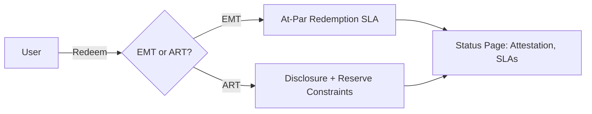
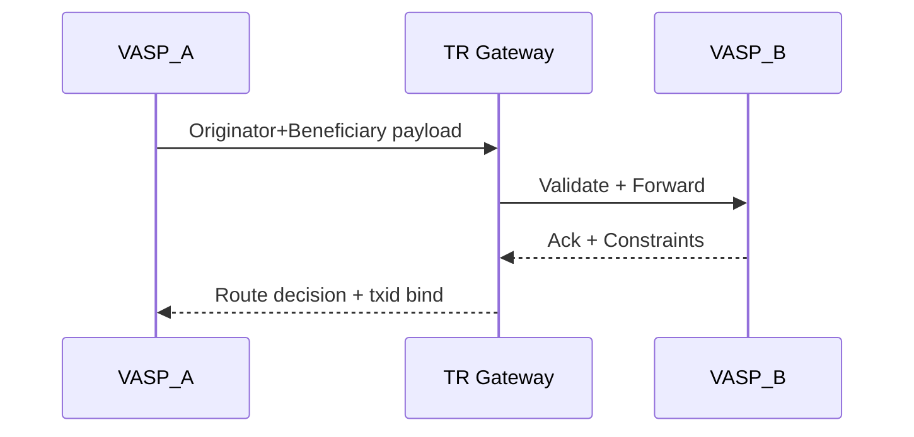
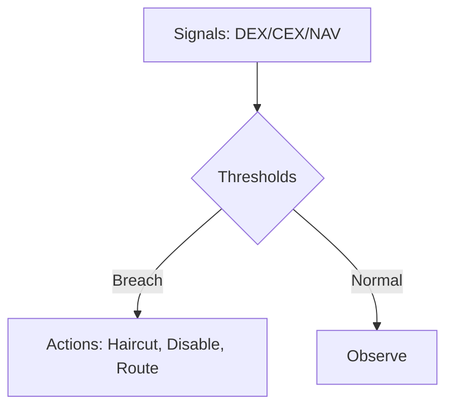
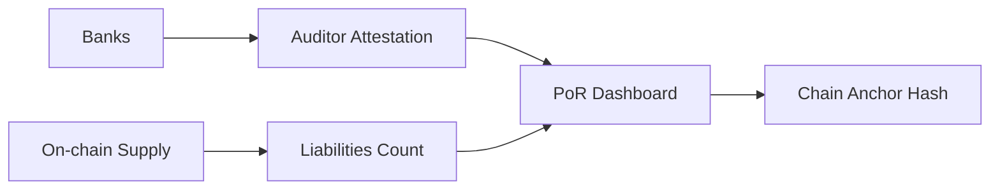
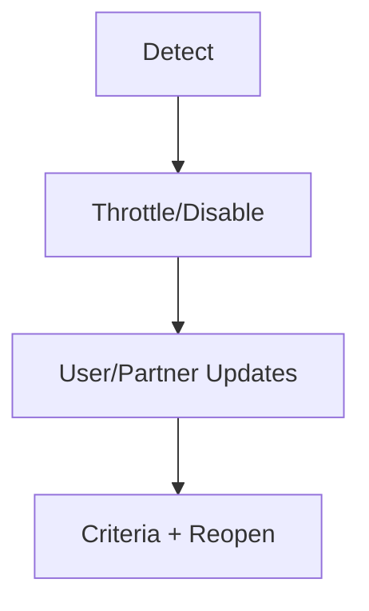

# Stablecoin Regulation Interview Q&A (USDT/EMT/ART Focus)

Non-legal advice. Educational content to translate regulatory obligations into technical, auditable controls for fiat‑
referenced stablecoins (e.g., USDT) across issuance, redemption, reserves, AML/sanctions, privacy, audit, and security.

## Contents

- [Topic Areas](#topic-areas) - Topic | Range | Count | Mix
- [Topics](#topics) - Q&As + artifacts
- [References](#references) - Glossary, Tools, Literature, Citations

## Topic Areas

| Topic | Range | Count | Mix (F/I/A) |
|---|---|---|---|
| Compliance Modeling | Q1-Q5 | 5 | 1/2/2 |
| Risk & Threat | Q6-Q10 | 5 | 1/2/2 |
| Privacy Engineering | Q11-Q14 | 4 | 1/2/1 |
| Audit & Evidence | Q15-Q18 | 4 | 1/2/1 |
| Security Architecture | Q19-Q23 | 5 | 1/2/2 |
| Remediation & Evolution | Q24-Q27 | 4 | 0/1/3 |
| Total |  | 27 | 5F / 11I / 11A |

---

## Topics

### Cluster A — Compliance Modeling (MiCA, US MSB, OFAC, EU TFR, State MTL)

#### Q1: Classify a USD‑pegged token used by EU consumers: EMT or ART under MiCA, and what changes in controls?

Difficulty: Foundational | Type: Compliance Modeling | Insight: Misclassification drives reserve, disclosure, redemption gaps

Answer (≈180 words):
Under MiCA, a fiat‑referenced stablecoin fully referencing a single official currency is typically an E‑Money Token (EMT);
asset baskets suggest ART. EMTs require at‑par redemption, capital, governance, and issuer authorization; ARTs carry
reserve composition and governance constraints with disclosure obligations. Engineering impact: implement redemption
queueing and SLAs to meet at‑par timelines, custody segregation for reserves, transparent status pages showing issuance
and attestation freshness, and policy enforcement for circuit‑breakers when issuers pause mint/redeem. Maintain a
token registry with MiCA classification, issuer license status, whitepaper URL, and constraints enforced at integration
points (UI warnings, risk flags, geofencing). Evidence: reserve attestation links, last‑updated timestamps, redemption
latency metrics, and incident reports.  [Ref: MiCA 2023/1114; EBA/ESMA drafts]

Artifacts:



| Obligation | Control | Evidence | Owner |
|---|---|---|---|
| Classification | Token registry + UI flags | Registry entries | Legal/Arch |
| Redemption | Queue + SLA monitor | Latency logs | Product/Ops |
| Reserves | Segregated custody | Attestation links | Finance |
Metrics: Coverage = Implemented/Required × 100%; Attestation Lag = now − last_attestation.

---

#### Q2: When do U.S. obligations trigger MSB treatment for an offshore stablecoin program’s interfaces?

Difficulty: Intermediate | Type: Compliance Modeling | Insight: Custodial edges and fiat ramps drive BSA scope

Answer (≈170 words):
FinCEN can treat persons engaging in money transmission as MSBs even if core tokens are on public chains. Hosted
wallets, fiat on/off‑ramps, or order routing that takes possession/control of value likely trigger AML program, KYC,
SAR/CTR, and Travel Rule obligations. Architecture: split the permissionless core from a compliant access layer with
KYC/KYT gateways, sanctions screening, Travel Rule messaging for eligible transfers, and case management. Use
jurisdiction flags and geofencing for restricted states; track state MTL applicability (e.g., NYDFS). Evidence: AML
policy, sanctions SOP, vendor due diligence, TR message logs, SAR decisions, and training records.  [Ref: FinCEN BSA
31 CFR 1010/1022; OFAC Framework; NYDFS Stablecoin Guidance 2022]

Artifacts: see Cluster A diagram/table. Metrics: TR Compliance Rate = TR_satisfied/TR_eligible × 100%.

---

#### Q3: How should EU TFR and FATF Travel Rule shape cross‑border stablecoin transfer design?

Difficulty: Intermediate | Type: Compliance Modeling | Insight: Messaging alignment and self‑hosted wallet checks

Answer (≈180 words):
EU TFR requires originator/beneficiary information to accompany crypto‑asset transfers and sets obligations for
transfers involving self‑hosted wallets above thresholds. Implement a TR messaging bus integrated with a vendor (e.g.,
Notabene/TRISA) or in‑house gateway, validating VASP identities and preserving data minimization. Add risk‑based
checks for self‑hosted recipients (ownership verification, micro‑sign, risk scoring) and block/flag unsupported routes.
Ensure replay‑safe binding of TR payloads to on‑chain txids. Evidence: TR logs, payload schemas, hashing strategy, and
VASP attestation records.  [Ref: EU TFR 2023/1113; FATF Rec.16]

Artifacts:



| Field | Min Set | Retention | Storage |
|---|---|---|---|
| O/B IDs | Yes | ≥5y | Encrypted DB |
| VASP proof | Yes | ≥5y | WORM |
Metrics: TRCR = satisfied/eligible × 100%; Payload Latency p95 < 2s.

---

#### Q4: What controls prove at‑par redemption capability under MiCA while avoiding bank run externalities?

Difficulty: Advanced | Type: Compliance Modeling | Insight: Liquidity tiers and throttled SLAs

Answer (≈190 words):
Design a tiered liquidity system: T+0 HQLA (cash, T‑bills), T+1 commercial paper/short bonds, and T+>1 longer assets
within MiCA/NYDFS constraints. Implement redemption queues with per‑address rate limits, proof‑of‑burn gating, and
bank API confirmations. Publish transparent backlog and expected settlement windows. Integrate circuit‑breakers when
liquidity falls below guardrails. Evidence: treasury policy, WAM limits, concentration thresholds, queue metrics,
bank confirmations stored on WORM, and reconciliation proofs. Metric: Redemption Coverage Ratio (RCR) = T+0 liquid
reserves / 24h expected redemptions; target ≥ 1.2×.  [Ref: MiCA EMT; NYDFS Guidance 2022]

Artifacts: see Cluster A. Table: add “Redemption Queue” row. Metrics: RCR.

---

#### Q5: How should an OFAC freeze/blacklist workflow be governed for a centralized stablecoin?

Difficulty: Advanced | Type: Compliance Modeling | Insight: Dual‑control, timelock, emergency override with audit

Answer (≈190 words):
Implement a freeze circuit at the token contract supporting targeted address deny‑listing and thaw. Governance: threshold
multisig with HSM‑backed keys, role separation (Security vs Compliance), emergency break‑glass with post‑facto review,
and timelock for non‑emergency changes. Integrate sanctions vendor screening and case system; require ticket linkage in
on‑chain calldata memo fields when feasible. Publish event streams (freeze, unfreeze) to a transparency page. Evidence:
change approvals, case IDs, signer quorum proofs, and SIEM logs. Metrics: Freeze MTTD, False‑Positive Rate, and
Appeal SLA.  [Ref: OFAC Framework; FATF]

Artifacts: see Cluster E diagrams; Cluster A table add “Freeze Governance”.

---

Cluster A Metrics: Coverage; TRCR; RCR; Attestation Lag; Freeze MTTD.

---

### Cluster B — Risk & Threat (Depeg, Concentration, Bridges, Upgrades, Chain Risk)

#### Q6: How do you quantify and mitigate depeg risk for a fiat‑backed stablecoin integration?

Difficulty: Foundational | Type: Risk & Threat | Insight: Stress testing and automated circuit breakers

Answer (≈180 words):
Model price/liq shocks on reserves and secondary market spreads. Build a depeg monitor using multiple oracles (DEX,
CEX, issuer NAV) and trigger policy: increase haircuts, disable risky pools, or route orders through deeper liquidity.
Publish a depeg policy and communicate thresholds. Evidence: backtests, stress scenarios, alert logs, and action
playbooks. Metric: Depeg VaRα over 24h; automatically reduce exposure when VaR exceeds appetite.  [Ref: NIST SP
800‑30; IOSCO stablecoin reports]

Artifacts:



| Threat | Control | Residual |
|---|---|---|
| Depeg | Multi‑oracle + policy | Low‑Med |
| Thin liquidity | Route guards | Med |
Metrics: VaRα; Circuit‑Breaker Activation Rate.

---

#### Q7: Manage reserve concentration risk across banks and instruments—what policy and telemetry?

Difficulty: Intermediate | Type: Risk & Threat | Insight: Concentration Index and WAM limits

Answer (≈170 words):
Set issuer‑level policies: max exposure per bank, instrument, and jurisdiction; WAM and duration caps; collateral
eligibility. Consume issuer attestation feeds and independent monitoring. Compute Concentration Index (CI = Σ share²)
for banks and instruments; alert when CI rises. Evidence: policy doc, CI dashboards, and treasury allocations. [Ref:
MiCA reserves; NYDFS Guidance]

Artifacts: see Cluster B diagram. Table add “Bank/Instrument Caps”. Metrics: CI, WAM.

---

#### Q8: Bridge risk for wrapped stablecoin on L2/L3: how to bound blast radius?

Difficulty: Intermediate | Type: Risk & Threat | Insight: Supply caps, fast exit kill‑switch, oracle separation

Answer (≈180 words):
Treat bridged supply as a separate asset with caps per chain; bind mint/burn to canonical bridge proofs with fraud/
validity windows. Implement emergency kill‑switch to pause bridge minting and throttle exits; separate keys and oracles
per chain to avoid correlated failures. Evidence: cap configs, bridge proofs, incident drills. Metrics: Chain Exposure
Share; Time‑to‑Pause.  [Ref: Chain security best practices; NIST 800‑207 Zero Trust]

---

#### Q9: Proxy upgrade risks for token and reserve oracles—how do you prevent governance capture?

Difficulty: Advanced | Type: Risk & Threat | Insight: Timelocks, quorum rotation, formal verification gates

Answer (≈190 words):
Require timelocks for non‑emergency upgrades, quorum multisig with rotating signers, mandatory audits and differential
fuzzing for oracle changes, and staged rollouts with caps. Use allowlists for trusted reporters and cryptographic
attestations. Evidence: upgrade proposals, auditor reports, timelock proofs, rollout logs. Metrics: Change Lead Time;
Rollback Time; % Upgrades with Full Gating.  [Ref: SOC2 CC; OWASP; NIST]

---

#### Q10: Chain‑specific regulatory and reputational risk concentration—when to geofence or de‑emphasize a chain?

Difficulty: Advanced | Type: Risk & Threat | Insight: Portfolio governance KPI/thresholds

Answer (≈170 words):
Track regulatory actions, OFAC exposure, MEV/frontrun harm, and outage history per chain. Maintain a Chain Risk Score
and set thresholds to de‑emphasize routing or integrations; communicate rationale to users. Evidence: risk scorecards,
incident and enforcement timeline, board memos. Metrics: Chain Risk Score; Exposure Share per chain. [Ref: OFAC; FATF]

---

Cluster B Metrics: VaRα; CI; Chain Exposure Share; Change Lead Time.

---

### Cluster C — Privacy Engineering (TR, GDPR, ZK/VC, Retention)

#### Q11: Are wallet addresses personal data for stablecoin analytics and what design follows?

Difficulty: Foundational | Type: Privacy Engineering | Insight: Pseudonymization and minimization

Answer (≈170 words):
In many contexts, wallet addresses can be personal data when linkable to individuals. Use privacy by design: segregate
PII from on‑chain telemetry, hash/salt identifiers, and use aggregation. Limit analytics fields, apply purpose binding,
and offer opt‑outs where applicable. Evidence: data inventory (ROPA), minimization tests, and retention schedules.
Metrics: PII Minimization Score. [Ref: GDPR Art. 4, 5, 25]

Artifacts:

```mermaid
flowchart LR
  PII[PII Store] -.separate.-> Telemetry[On-chain Telemetry]
  Telemetry --> Agg[Aggregates]
  PII --> VC[Verification (ZK/VC)]
```

| Data | Basis | Retention |
|---|---|---|
| KYC core | Legal obligation | 5–7y |
| Analytics | Legit. interest | 12–24m |
Metric: PMiS = 1 − collected_fields/required_max.

---

#### Q12: Privacy‑preserving Travel Rule: can we satisfy TFR while limiting data exposure?

Difficulty: Intermediate | Type: Privacy Engineering | Insight: VC/PSI patterns

Answer (≈180 words):
Adopt verifiable credentials for identity assertions and transmit minimal TR payloads with encrypted channels and field‑
level access. Use PSI or blinded tokens to prove checks (e.g., sanction‑screened) without sharing raw data when
jurisdictionally allowed. Bind proofs to txids and rotate keys frequently. Evidence: crypto design docs, vendor specs,
key rotation logs. Metrics: TR Payload Minimization Ratio. [Ref: EU TFR; FATF; EDPB Art. 25]

---

#### Q13: GDPR deletion vs immutable ledgers for stablecoin transfers—what’s feasible?

Difficulty: Intermediate | Type: Privacy Engineering | Insight: Off‑chain PII deletion + on‑chain pseudonymization

Answer (≈180 words):
Keep PII off‑chain; store on‑chain only pseudonymous addresses. Implement deletion workflows that purge linking tables
and rotate salts/keys (crypto‑erasure). Retain minimal hashes for fraud defense if legal basis exists. Evidence: deletion
runbooks, backup exclusion, and key destruction proofs. Metrics: DSAR SLA; Deletion Success Rate. [Ref: GDPR Art. 17]

---

#### Q14: Handling self‑hosted wallets under EU TFR thresholds without over‑collecting data

Difficulty: Advanced | Type: Privacy Engineering | Insight: Risk‑based verification with minimal data

Answer (≈190 words):
Implement tiered checks: for transfers above thresholds, require ownership proofs (signed challenge) without full PII
capture unless risk signals warrant; for lower tiers, log limited metadata. Maintain exception handling and deny known
high‑risk heuristics. Evidence: tier policy, threshold logs, exception cases. Metrics: Verification Success Rate; False
Positive Rate. [Ref: EU TFR 2023/1113]

---

Cluster C Metrics: PMiS; DSAR SLA; Verification Success Rate.

---

### Cluster D — Audit & Evidence (PoR, SAR Evidence, SOC 2, Chain Anchors)

#### Q15: Proof‑of‑Reserves plus off‑chain attestations—what constitutes reliable evidence for users/integrations?

Difficulty: Foundational | Type: Audit & Evidence | Insight: Multi‑source, auditor independence, freshness

Answer (≈180 words):
Combine off‑chain auditor attestations of fiat reserves with cryptographically counted token liabilities and publish a
freshness‑stamped dashboard. Where feasible, anchor attestation hashes on‑chain. Ensure auditor independence and
scope clarity; present caveats prominently. Evidence: ATT reports, anchor txids, liability Merkle trees, and data
lineage. Metrics: Attestation Freshness (Lag); Evidence Completeness Ratio. [Ref: ISAE 3000/3402; AICPA]

Artifacts:



| Control | Evidence | Freq |
|---|---|---|
| Reserve attestation | Auditor report | M |
| Liability count | Merkle root | D |
Metric: ECR = evidence_present/required × 100%.

---

#### Q16: What evidence must accompany SAR decisions in a sanctions‑related incident?

Difficulty: Intermediate | Type: Audit & Evidence | Insight: Chain of custody + reproducibility

Answer (≈170 words):
Maintain a SAR evidence kit: TR payload, screening results, case notes, analyst decisions, on‑chain traces, and
escalation approvals. Store in WORM with hash chains and tamper‑proof timestamps; maintain reproducible queries and
playbooks. Evidence: immutable case bundle IDs, query scripts, approval logs. Metrics: ECR; Time‑to‑Bundle. [Ref:
FinCEN SAR 31 CFR 1022.320; OFAC]

---

#### Q17: SOC 2 Type II for issuance ops and change management—what’s material for auditors?

Difficulty: Intermediate | Type: Audit & Evidence | Insight: Key controls and continuous evidence

Answer (≈180 words):
Focus on change management for token/oracle contracts (reviews, approvals, separation of duties), key management
(HSM, rotation, access reviews), incident response, monitoring, and vendor risk. Automate evidence collection from CI/
CD, KMS, SIEM, and ticketing. Evidence: pull requests with approvals, timelock proofs, KMS logs, alert metrics, and
RCA docs. Metrics: Control Coverage; Evidence Freshness. [Ref: SOC2 TSC; ISO 27001]

---

#### Q18: Designing evidence IDs, retention, and cross‑jurisdiction access for regulators

Difficulty: Advanced | Type: Audit & Evidence | Insight: Data residency and access brokerage

Answer (≈180 words):
Adopt globally unique Evidence IDs with schema: system+control+time+hash. Store in WORM with retention aligned to
BSA/GDPR/NYDFS. Use access brokerage to expose subsets to regulators with legal basis and audit logs. Evidence:
retention map, residency constraints, broker logs. Metrics: Access SLA; Privacy Leakage Incidents. [Ref: GDPR; BSA]

---

Cluster D Metrics: ECR; Attestation Lag; Evidence Freshness.

---

### Cluster E — Security Architecture (Keys, Governance, Freeze Circuit, Multi‑Chain, Observability)

#### Q19: Architect HSM‑backed, threshold‑governed mint/burn keys with rotation and recovery

Difficulty: Foundational | Type: Security Architecture | Insight: Threshold and SoD reduce single‑point failures

Answer (≈180 words):
Use FIPS 140‑2/3 validated HSMs or cloud HSMs with threshold signatures (t‑of‑n), enforce separation of duties across
issuance, treasury, and security. Rotate signers regularly with staged rekeying and maintain escrowed break‑glass with
board approval. Evidence: KMS policies, quorum configs, rotation logs. Metrics: MTTRotate; SoD Coverage. [Ref: NIST
800‑57; NIST 800‑207]

Artifacts:


| Role | Permission | Control |
|---|---|---|
| Issuance Ops | Mint/Burn | t‑of‑n, timelock |
| Security | Key lifecycle | HSM, audit |
Metric: SoD Coverage = SoD_controls/required × 100%.

---

#### Q20: Timelock governance for upgrades and mint limits—balancing agility with safety

Difficulty: Intermediate | Type: Security Architecture | Insight: Parameterization and exception flow

Answer (≈180 words):
Apply timelocks for non‑emergency changes; parameterize mint ceilings per window; require dual approval and staged
rollouts. Emergency path requires explicit incident declaration and retrospective review. Evidence: timelock txids,
ceiling configs, exception logs. Metrics: Change Lead Time; % Emergency Changes Reviewed ≤ 7 days. [Ref: SOC2; NIST]

---

#### Q21: Designing a freeze circuit with transparency and user recourse

Difficulty: Intermediate | Type: Security Architecture | Insight: Appeal and auditability

Answer (≈170 words):
Expose freeze/unfreeze events via APIs and status pages. Accept appeals through verified channels; implement case
linkage to on‑chain actions. Maintain audit trails and publish periodic stats on freezes and outcomes. Evidence: case IDs
<-> txids, appeal SLAs. Metrics: Appeal SLA; False Positive Rate. [Ref: OFAC Framework]

---

#### Q22: Multi‑chain supply governance and independent oracles per chain

Difficulty: Advanced | Type: Security Architecture | Insight: Reduce correlated failures

Answer (≈180 words):
Cap supply per chain; separate signer sets and oracle sources; add heartbeats and pull‑based reads with caching.
Implement emergency chain off‑ramp. Evidence: supply caps, oracle configs, incident drills. Metrics: Chain Exposure
Share; Time‑to‑Off‑Ramp. [Ref: NIST 800‑207]

---

#### Q23: Observability: OpenTelemetry + SIEM + on‑chain analytics for compliance and security

Difficulty: Advanced | Type: Security Architecture | Insight: End‑to‑end evidence fabric

Answer (≈180 words):
Instrument backends with OTel, forward to SIEM for correlation, and join with on‑chain events. Define detections for
freeze actions, large mint/burns, TR failures, and depeg signals. Evidence: OTel traces, SIEM alerts, playbooks.
Metrics: MTTD; Alert Coverage. [Ref: NIST CSF 2.0; SOC2]

---

Cluster E Metrics: MTTRotate; SoD Coverage; Change Lead Time; MTTD.

---

### Cluster F — Remediation & Evolution (Depeg, Sanctions, Reg Change, Chain Exit)

#### Q24: Depeg remediation: what is the first 24‑hour playbook for integrators?

Difficulty: Intermediate | Type: Remediation | Insight: Contain exposure while preserving user fairness

Answer (≈180 words):
Trigger circuit‑breakers, increase haircuts, throttle risky pools, enable orderly redemptions, and communicate openly.
Coordinate with issuer for attestation cadence; publish recovery criteria. Evidence: timeline, policy activations, user
comms. Metrics: Containment Time; Redemption Backlog Clearance Rate. [Ref: IOSCO; MiCA]

Artifacts:



| Step | Owner | SLA |
|---|---|---|
| Disable risky routes | Security/Arch | 30m |
| User comms | Product/Exec | 1h |
Metric: Clearance = cleared/queued × 100%.

---

#### Q25: Sanctions incident: large‑scale address freeze with cross‑jurisdiction reporting

Difficulty: Advanced | Type: Remediation | Insight: Unified case orchestration

Answer (≈190 words):
Stand up an incident command: Compliance lead, Security, Legal, and Communications. Execute freeze for named
addresses, notify affected partners, and prepare SARs where applicable. Coordinate with counsel on disclosure and with
exchanges on containment. Evidence: incident tickets, freeze txids, SAR bundles, regulator correspondence. Metrics:
Containment Time; SAR Bundle Time; Appeal SLA. [Ref: OFAC; FinCEN]

---

#### Q26: Rapid implementation of new EU TFR guidance—how to ship in 4–6 weeks?

Difficulty: Advanced | Type: Remediation | Insight: Delta mapping → feature flags → rollout

Answer (≈180 words):
Perform delta analysis against current TR gateway; design minimal viable payload/schema changes; ship behind feature
flags; test with pilot VASPs; enable per‑jurisdiction toggles. Evidence: delta matrix, rollout plan, pilot results.
Metrics: Reg Gap Closure SLA; Error Rate after rollout < 1%. [Ref: EU TFR]

---

#### Q27: Chain migration/exit when risk profile degrades

Difficulty: Advanced | Type: Remediation | Insight: Sunsetting with user protection

Answer (≈180 words):
Signal deprecation early, cap supply, disable new minting, and provide bridging or redemption paths with incentives.
Archive analytics and revoke keys. Evidence: deprecation plan, cap proofs, comms. Metrics: Migration Completion Rate;
Residual Exposure < threshold. [Ref: NIST CSF]

---

Cluster F Metrics: Containment Time; Clearance Rate; Reg Gap Closure SLA; Migration Completion.

---

## References

### Glossary (sample ≥18)

EMT, ART, HQLA, WAM, TR (Travel Rule), TFR (EU), MSB, BSA/AML, SAR, CTR, OFAC, VASP, KYC, CDD, EDD,
WORM, PoR, VaR, SoD, TSS, OTel

### Tools (sample ≥8)

- Chainalysis, TRM Labs, Elliptic (KYT/Sanctions)
- Notabene, TRISA (Travel Rule messaging)
- OneTrust/TrustArc (ROPA/DSR)
- OpenZeppelin + Defender (contracts, ops)
- Slither/Foundry (analysis/testing)
- AWS CloudHSM/HashiCorp Vault (keys)
- Splunk/ELK + OpenTelemetry (SIEM/obs)

### Literature & Standards (sample)

- MiCA (EU) 2023/1114
- EU TFR 2023/1113
- FATF Recommendation 16 and VA/VASP guidance
- FinCEN BSA: 31 CFR 1010, 1022 (incl. 1010.410(f), 1022.320)
- OFAC Sanctions Compliance Framework (2019)
- NYDFS Stablecoin Guidance (2022)
- GDPR (EU 2016/679), EDPB guidelines Art. 25
- ISO/IEC 27001:2022; SOC 2 TSC; NIST CSF 2.0; NIST SP 800‑30; NIST SP 800‑207

### Citations (URLs)

- MiCA: <https://eur-lex.europa.eu/eli/reg/2023/1114/oj>
- EU TFR: <https://eur-lex.europa.eu/eli/reg/2023/1113/oj>
- FATF Rec.16: <https://www.fatf-gafi.org/en/faq/travel-rule.html>
- FinCEN BSA (31 CFR): <https://www.ecfr.gov/current/title-31/subtitle-B/chapter-X>
- OFAC Framework: <https://home.treasury.gov/system/files/126/framework_ofac_cc.pdf>
- NYDFS Stablecoins: <https://www.dfs.ny.gov/industry_guidance/industry_letters/il20220608_stablecoins>
- GDPR: <https://eur-lex.europa.eu/eli/reg/2016/679/oj>
- NIST CSF 2.0: <https://www.nist.gov/cyberframework>
