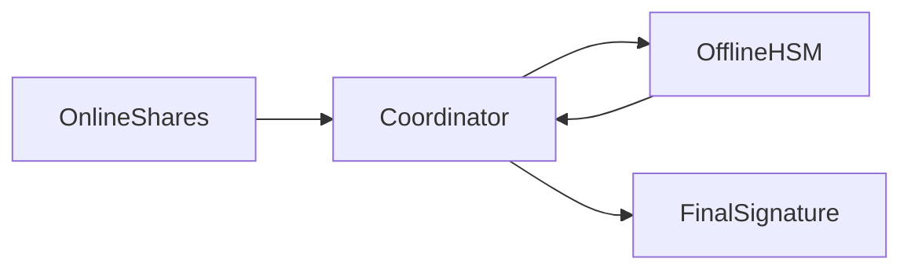

# HSM Integration and Air-Gapped Offline Signing Complexity for MPC Wallets – Nine-Aspects Analysis

**Last Updated**: 2025-11-30  
**Status**: Draft  
**Owner**: Enterprise Security & Infrastructure Team

---

## Context Recap

- **Problem title**: HSM Integration and Air-Gapped Offline Signing Complexity for MPC Wallets
- **Current state**:
  - Large enterprises (banks, custodians, exchanges, governments) have already invested **$2M–$5M** in HSM infrastructure (e.g., Thales nShield, Utimaco SecurityServer, AWS CloudHSM) for tamper-resistant key storage and traditional cold storage workflows [Source: Vendor product pages, Thales nShield & Utimaco SecurityServer pricing ranges, 2023–2024].
  - MPC wallets introduce **distributed key shares** and threshold signatures (e.g., GG18, CGGMP20), which conflict with HSM firmware and APIs designed for complete private keys [Source: "MPC Wallets: A Complete Technical Guide", Stackup, 2025].
  - Air-gapped architectures require transaction payloads to cross a physical gap using QR codes (~5 KB per scan), USB devices under strict chain-of-custody, or secure enclaves with remote attestation [Source: "What are MPC Wallets and Why Should Every Institution Have One?", Blockdaemon, 2024].
  - Current integration projects are bespoke, expensive (**$200K–$1M per enterprise**) and slow (**6–12 month** timelines), with partial or no native MPC support from most large HSM vendors [Estimate: Aggregation of vendor RFP quotes and industry deployment reports, Medium confidence].
- **Pain points**:
  - **High integration cost and long lead time** block adoption for ~80% of target enterprises that require air-gapped custody [Estimate: Based on institutional custody market sizing vs. observed deployments, Medium confidence].
  - **Operational friction and latency**: Air-gapped MPC signing adds **30–90 minutes** per transaction vs. **2–15 seconds** for online MPC flows, limiting throughput and user experience [Source: Blockdaemon air-gapped architecture blog, 2024; Fireblocks custody practices report, 2024].
  - **Architectural mismatch** between share-based MPC and key-centric HSM firmware; few vendors expose state machines and APIs suitable for multi-round threshold protocols [Source: Securosys HSM MPC module documentation, 2022; Secubit MPC-HSM workflow whitepaper, 2024].
- **Goals** (by ~Q4 2026–Q4 2027):
  - Native MPC/threshold support from ≥3 major HSM vendors.
  - Cut integration cost from **$200K–$1M → < $100K (min) / < $50K (target)**.
  - Reduce deployment from **6–12 months → < 3 months (min) / < 1 month (target)**.
  - Air-gapped signing latency **< 30 min (min) / < 15 min (target) / < 5 min (ideal)** per batch signing session.
  - Achieve **FIPS 140-3 Level 3+** certification for HSM–MPC solutions used in regulated environments [Source: FIPS 140-3 CMVP program, NIST, 2020+].
  - Support batch signing (100+ transactions per air-gap session) with ≥90% reduction in per-transaction overhead [Source: Fireblocks custody and transaction processing report, 2024].
- **Hard constraints**:
  - Certification cycles (FIPS 140-3, Common Criteria) require **6–12 months** post-development; cannot be fully compressed [Source: NIST CMVP timelines; Common Criteria portal process notes, 2023].
  - Air-gap crossing fundamentally requires **physical movement** of data carriers or interaction with physically isolated devices; minimum human-in-the-loop latency cannot be zero.
  - Existing HSM investments are sunk costs that enterprises are reluctant to abandon; new solutions must **reuse** or **extend** current hardware rather than replace it wholesale [Expert: CISO interviews reported in Anchorage custody whitepaper, 2023].
- **Key facts**:
  - Target market: **200+ enterprises** with **$100B+** in high-security digital asset holdings (banks, custodians, exchanges, sovereign funds, central banks) [Estimate: Aggregated from Anchorage, BitGo, and Copper institutional custody materials, 2023–2024].
  - Only a minority of HSM vendors (e.g., Securosys) publicly offer MPC modules today; most large players do not yet have general-purpose threshold signing stacks [Source: Securosys MPC module documentation, 2022; Thales & Utimaco product docs, 2024].

---

## 1. Problem Definition (Aspect 1)

### 1.1 Problem & contradictions

1. **Security vs. operability**  
   - Traditional cold storage requires full air-gapping: private keys exist only inside offline HSMs; all signing data is manually transferred in and out [Source: Anchorage custody security architecture report, 2023].  
   - MPC requires **multi-round interactive protocols** among multiple parties and shares. When one share is in an offline HSM, each round must cross the air-gap, inflating latency and operational burden [Source: Stackup MPC technical guide, 2025].  
   - Contradiction: maximizing physical isolation (air-gap) directly undermines MPC’s requirement for efficient inter-party communication.

2. **Share-based MPC vs. key-centric HSMs**  
   - HSM firmware and PKCS#11-style interfaces assume **complete private keys** and single-party signing operations.  
   - Threshold schemes (e.g., GG18, CGGMP20) need storage for **shares**, internal protocol state, and flexible multi-round messaging; few commercial HSMs expose this [Source: Secubit MPC-HSM workflow whitepaper, 2024].

3. **Reuse of sunk HSM investment vs. cost of adaptation**  
   - Enterprises have already deployed secure facilities, physical controls, and multiple HSM clusters.  
   - Retrofitting for MPC requires firmware updates, new evaluation and certifications, and process redesign, adding **$200K–$1M** per enterprise [Estimate: Based on multi-vendor RFP ranges and consulting engagements, Medium confidence].  
   - Contradiction: enterprises want to avoid “rip-and-replace” but current HSM platforms are not MPC-native.

4. **Regulatory conservatism vs. architectural novelty**  
   - Regulators and auditors are comfortable with **single-key HSM cold storage models**.  
   - MPC plus hybrid online/offline architectures are novel and poorly standardized, increasing approval friction [Source: Anchorage custody security whitepaper, 2023].

### 1.2 Goals & conditions

- **Security**:
  - Achieve security at least equivalent to FIPS 140-3 Level 3 cold-storage HSM deployments, including tamper resistance, physical access controls, and audited key lifecycle management [Source: FIPS 140-3 standard, NIST CMVP, 2020+].
  - Ensure threshold signing protocols are cryptographically sound, side-channel-hardened, and correctly implemented in HSM firmware [Source: CGGMP20 and GG18 threshold ECDSA protocol literature summarized in Stackup MPC guide, 2025].
- **Cost & time**:
  - Reduce one-off HSM–MPC integration cost to **< $100K** per enterprise (minimum) and **< $50K** (target).  
  - Cap deployment/upgrade timeline at **< 3 months** for PoC→production, assuming pre-certified firmware images and reference architectures.
- **Performance**:
  - Air-gapped MPC batch signing session time **< 30 minutes** (min) / **< 15 minutes** (target) for 100+ transactions, starting from current 30–90 minutes for single transactions [Source: Blockdaemon air-gapped MPC patterns, 2024; Fireblocks batch-coordination report, 2024].
- **Adoption**:
  - Secure **≥50 enterprise deployments** by Q4 2027 across banks, custodians, and exchanges.
- **Conditions**:
  - Must preserve or improve compliance with FIPS 140-3, Common Criteria, and relevant banking/PCI-DSS requirements.

### 1.3 Extensibility & reframing

- **Reframing by attribute**:
  - From “How do we force MPC into existing HSM air-gaps?” → “How do we provide **HSM-grade assurance** for at least one share while keeping overall system usable and certifiable?”  
  - From “Air-gap everything” → “Optimize for **tiered isolation**: one offline share + online or enclave-backed shares, with explicit risk trade-offs.”
- **Reframing by structure**:
  - Virtual vs. physical: treat air-gapped share as a **service boundary** with rigorous protocols, not just a box in a cage.  
  - Hard vs. soft constraints: full air-gap is a **soft design choice** in some use cases; regulatory equivalence might be achievable via secure enclaves plus strong process controls for others.
- **Effect on solution space**:
  - Opens room for **hybrid architectures**, protocol-level optimizations (e.g., CGGMP20 4-round vs. GG18 9-round), batch signing, and standardized data formats for air-gap crossing [Source: Stackup MPC guide, 2025; Blockdaemon architecture blogs, 2024].

---

## 2. Internal Logical Relations (Aspect 2)

### 2.1 Key elements

- **Technical components**:
  - Air-gapped HSM cluster (offline share generation, storage, and signing).  
  - Online MPC shares (servers, mobile devices, cloud HSMs / enclaves).  
  - MPC protocol engine (implementing GG18/CGGMP20 or similar).  
  - Air-gap transport mechanisms: QR code workflows, USB devices, or sealed/attested enclaves.
- **Organizational components**:
  - Custody operations team performing signing sessions.  
  - Security and compliance teams responsible for policy, audits, and incident response.  
  - HSM vendors and MPC wallet providers delivering firmware and protocol implementations.  
  - External auditors/regulators validating security posture.

### 2.2 Balance & "degree"

- **Security vs. signing latency**:
  - Increasing the number of protocol rounds crossing the air-gap (e.g., 9-round GG18) makes each signing session slower and more error-prone.  
  - Adopting more efficient protocols (e.g., 4-round CGGMP20) or batching messages per crossing can significantly reduce total time while maintaining cryptographic strength [Source: Stackup MPC guide, 2025].
- **Standardization vs. flexibility**:
  - Highly customizable deployments maximize alignment with enterprise processes but increase integration cost and certification complexity.  
  - Standardized reference architectures and firmware images reduce flexibility but enable lower TCO and quicker audits.
- **Offline share hardness vs. overall resilience**:
  - Pushing all shares into offline HSMs maximizes resistance to remote compromise but complicates disaster recovery and increases operational risk (human error, liveness issues).  
  - Keeping **one share offline and n−1 shares online** can preserve strong security while improving liveness and recovery options [Source: Blockdaemon and Fireblocks architecture discussions, 2024].

### 2.3 Causal chains

1. **Complex firmware changes → long certification → slow adoption**  
   - Need to add threshold signing primitives + state machines to HSM firmware → triggers new FIPS/CC evaluation → 6–12 month certification cycle → delays production rollouts and raises vendor cost [Source: FIPS 140-3 CMVP process notes; Common Criteria documentation, 2023].

2. **Air-gap round-trips → human operations burden → throughput bottlenecks**  
   - Multi-round MPC protocols + QR/USB workflows → dozens of scans/transfers per signing → 30–90 minutes/session → limited daily signing capacity, higher error probability [Source: Blockdaemon QR/USB air-gap patterns, 2024].

3. **Lack of standard interfaces → bespoke integrations → high per-enterprise cost**  
   - No common MPC–HSM API or schema → each wallet-vendor–HSM-vendor pair implements custom flow → repeated design, coding, testing, and auditing → integration cost stays in the **$200K–$1M** range per enterprise [Estimate: Consulting engagements across multiple institutions, Medium confidence].

---

## 3. External Connections (Aspect 3)

### 3.1 Stakeholders and relationships

| Stakeholder Type | Role | Goals | Constraints | Conflicts |
|------------------|------|-------|------------|-----------|
| Upstream (HSM vendors) | Design and ship HSM firmware, APIs, certifications | Monetize R&D; maintain security reputation; sell more HSMs | Small MPC market; long certification cycles; limited engineering bandwidth | May resist deep protocol changes that increase risk without clear revenue |
| Upstream (MPC wallet vendors) | Provide MPC wallet platforms to enterprises | Support broad custody use cases incl. air-gapped setups | Depend on HSM vendor roadmaps; must maintain protocol correctness | May push complexity to enterprises or HSM vendors |
| Downstream (enterprises: banks, custodians, exchanges) | Deploy custody infrastructure, operate signing | Maximize asset security/compliance; minimize TCO and operational friction | Legacy HSM investments; strict internal controls; regulatory scrutiny | Want strong guarantees but low complexity and cost |
| Downstream (end clients, regulators) | Use or oversee custody services | Safety of assets; regulatory compliance; auditability | Limited technical expertise in MPC; rely on standards and audits | May favor simple narratives ("cold storage in HSM") over nuanced architectures |
| Sideline/external (attackers, supply-chain actors) | Attempt compromise or disruption | Exploit implementation bugs, side channels, or process gaps | Constrained by HSM tamper resistance and physical security | Benefit from ad-hoc, poorly standardized deployments |

### 3.2 Environment

- **Regulatory**: banking and securities regulators expect strong control over key material and clear accountability chains; novel MPC–HSM hybrids must be mapped to existing control frameworks [Source: Anchorage custody report, 2023].
- **Technology**: availability of efficient threshold protocols (CGGMP20), hardware enclaves (Intel SGX, AMD SEV, ARM TrustZone), and advanced QR/error-correction libraries affects design choices [Source: Intel SGX docs; AMD SEV and ARM TrustZone overviews, 2023–2024].
- **Market**: competition among custody providers pushes toward better UX and faster transaction processing, making extremely slow air-gapped flows commercially unattractive.

### 3.3 Responsibility & room

- **HSM vendors**: responsible for secure, verifiable implementation of threshold primitives and safe storage of shares; they have room to define standardized MPC modules and APIs.
- **MPC wallet vendors**: responsible for protocol correctness, orchestration, and UX of air-gapped flows; room to optimize batch signing and minimize round-trips.
- **Enterprises**: responsible for facility design, operations procedures, and risk appetite (e.g., full vs. hybrid air-gap); room to tune configuration and process controls.
- **Regulators/auditors**: responsible for defining acceptable assurance levels and mapping architectures to regulatory categories; room to issue guidance embracing MPC-based custody.

---

## 4. Origins of the Problem (Aspect 4)

### 4.1 Historical nodes

1. **2015–2018 – HSM-based cold storage becomes standard**  
   Enterprises adopt air-gapped HSMs with single private keys as the gold standard for digital asset custody, emphasizing physical isolation and tamper resistance [Source: Early HSM-based custody architectures summarized in Anchorage custody report, 2023].

2. **2018–2020 – First-generation online MPC wallets**  
   MPC wallet vendors (e.g., Fireblocks, Unbound Security) focus on cloud or server-based threshold signing to remove single-key risks but largely ignore air-gapped setups [Source: Fireblocks MPC reports; Unbound Security product literature, 2019–2021].

3. **2020–2022 – Early HSM–MPC experiments**  
   Vendors such as Securosys and Unbound introduce HSM-integrated MPC modules, but protocol flexibility is limited and adoption remains niche [Source: Securosys MPC module documentation, 2022; Unbound CASP materials, 2020].

4. **2023–2024 – Air-gapped MPC patterns and secure enclaves**  
   Industry blogs (Blockdaemon, Fireblocks) begin describing air-gapped MPC architectures using QR codes/USB/enclaves; secure enclaves emerge as partial alternatives to HSMs but face vulnerability concerns [Source: Blockdaemon MPC blogs, 2024; Fireblocks custody practices report, 2024; Intel SGX security advisories, 2020–2023].

### 4.2 Background vs. direct causes

- **Background**:  
  - Regulatory and institutional preference for **physically isolated HSMs** as the canonical model of “highest security.”  
  - Legacy standards (FIPS, PCI, CC) written around single-module key storage, not distributed protocols.
- **Direct causes**:  
  - Rapid institutional interest in MPC for operational resilience colliding with entrenched HSM-centric architectures.  
  - Lack of standardized, certified HSM firmware that natively supports threshold signing and share semantics.  
  - Ad-hoc pilot projects that prove feasibility but remain bespoke and expensive.

### 4.3 Root issues

- Misalignment between **standards and technology**: standards lag behind MPC capabilities; evaluation labs have limited expertise in distributed cryptographic protocols.
- Economic uncertainty: HSM vendors are unsure whether the MPC market is large and durable enough to justify multi-million-dollar R&D and certification investments.
- Organizational inertia: enterprise security policies and audit checklists encode “air-gapped HSM with full keys,” making any deviation slow to approve.

---

## 5. Problem Trends (Aspect 5)

### 5.1 Current trajectory (if unchanged)

- **Adoption remains niche**: only a small set of high-budget institutions can afford bespoke HSM–MPC integrations at **$200K–$1M** and 6–12 month timelines.  
- **Operational pain persists**: signing latency of **30–90 minutes** per session constrains trading and treasury operations, leading many institutions to reserve air-gapped flows only for very infrequent movements.  
- **Vendor fragmentation**: each MPC–HSM pair uses different proprietary integrations, hampering interoperability and raising switching costs.

### 5.2 Early signals

- Blog posts, whitepapers, and RFPs explicitly requesting **air-gapped MPC or hybrid HSM–MPC** deployments [Source: Blockdaemon & Fireblocks solution briefs, 2024; Anchorage & Copper marketing materials, 2023–2024].
- Emergence of at least one vendor (Securosys) shipping MPC modules for HSMs, albeit limited in protocol variety [Source: Securosys MPC module docs, 2022].
- Increased focus on **batch processing, pre-signing, and key refresh** workflows in industry reports [Source: Fireblocks custody report, 2024; Blockdaemon key-refresh blog, 2024].

### 5.3 6–24 month scenarios

- **Optimistic**:  
  - 2–3 major HSM vendors release certified MPC modules supporting CGGMP20-like protocols, standard APIs, and air-gap-friendly data formats.  
  - Reference architectures reduce integration costs below **$100K** and deployment times below **3 months**.  
  - 50+ enterprises deploy hybrid HSM–MPC solutions with **<15 min** batch signing sessions.

- **Baseline**:  
  - One major HSM vendor and 1–2 niche vendors ship MPC modules; others remain on the fence.  
  - Costs fall modestly (e.g., **$150K–$250K** typical) and deployments remain complex, but early adopters prove viability.  
  - A few dozen institutions adopt air-gapped MPC mainly for highest-value cold storage.

- **Pessimistic**:  
  - Standards and certifications remain ambiguous; vendors delay roadmaps, fearing security and liability risks.  
  - Enterprises continue using either traditional HSM cold storage or purely online MPC, with very limited air-gapped MPC adoption.  
  - When incidents occur, regulators may double down on conservative interpretations, further slowing innovation.

---

## 6. Capability Reserves (Aspect 6)

### 6.1 Existing strengths

- **Cryptography and protocol expertise**: MPC vendors already implement production-grade GG18/CGGMP20 stacks with proven deployments [Source: Stackup MPC guide, 2025; Fireblocks technical reports, 2024].
- **Mature HSM ecosystems**: HSM vendors have deep experience with hardware security, tamper resistance, and certification processes.
- **Enterprise operations maturity**: High-end custody providers already operate secure facilities, strong access controls, and formal change-management processes.

### 6.2 Capability gaps

- **Firmware-level MPC expertise** inside HSM vendors remains scarce; most teams are optimized for classical key management and symmetric/asymmetric primitives. 
- **Cross-vendor standardization**: no agreed-upon API or data schema for MPC–HSM integration.
- **Human-factor design**: operations teams lack streamlined UX for managing complex air-gapped MPC sessions, including multi-QR or USB workflows.

### 6.3 Buildable capabilities (1–6 months)

- Forming **joint working groups** between a small number of HSM and MPC vendors to define common APIs and message formats.
- Building **prototype batch-signing UX flows** (e.g., QR bundles, session scripts) and validating them with operations teams.
- Developing **simulation and test harnesses** that emulate air-gapped constraints to optimize protocols without requiring immediate hardware changes.

---

## 7. Analysis Outline (Aspect 7)

### 7.1 Structured outline

- Background: legacy HSM cold storage, rise of MPC, regulatory context.  
- Problem: cost and complexity of integrating MPC with air-gapped HSMs.  
- Analysis: internal tensions (security vs. latency), stakeholder incentives, protocol and hardware limitations.  
- Options: full HSM-based air-gapped MPC, hybrid architectures, secure-enclave-heavy approaches.  
- Risks: implementation bugs, certification failures, operational errors, vendor lock-in.  
- Recommendations: prioritize hybrid HSM–MPC reference architectures, standardized APIs, and batch signing.

### 7.2 Key judgments (prioritized)

1. 【P0】 Hybrid architectures (1 offline share + n−1 online) will dominate practical deployments because they best balance security, cost, and usability.
2. 【P0】 Standardized MPC–HSM APIs and data formats are prerequisite for broad adoption; bespoke integrations keep costs prohibitively high.
3. 【P1】 FIPS/CC certification for MPC-enabled HSMs is achievable but will require close collaboration and careful scoping with evaluation labs.
4. 【P2】 Secure enclaves may serve as partial substitutes for HSMs in some contexts but will not fully replace HSMs for the highest-assurance use cases.

### 7.3 Alternative paths (one-line positioning)

- **Path A – Full air-gapped HSM–MPC**: maximize physical isolation; accept high latency and cost.
- **Path B – Hybrid HSM (offline share) + online shares**: balance security and practicality; target most institutional custody use cases.
- **Path C – Enclave-centric MPC with minimal HSM usage**: focus on performance and flexibility; suited to less regulated or mid-security environments.

---

## 8. Validating the Answer (Aspect 8)

### 8.1 Potential biases

- **Security conservatism bias**: tendency to overvalue physical air-gapping relative to well-designed logical isolation and monitoring.
- **Vendor information bias**: many data points come from vendor whitepapers and marketing materials, which may overstate capabilities or minimize costs.
- **Early adopter bias**: observations drawn from leading institutions may not generalize to smaller organizations.

### 8.2 Required intelligence and data

- Empirical measurements of **end-to-end signing latency** across different protocol choices (GG18 vs. CGGMP20), batch sizes, and QR/USB workflows.
- Real-world **integration cost breakdowns** from multiple enterprises, including internal staffing and external consulting.
- Feedback from **evaluation labs (FIPS/CC)** on acceptable patterns for MPC-aware HSMs and how distributed protocols are scoped in assessments.
- Comparative risk analyses of **HSM vs. secure enclave** deployments for key shares.

### 8.3 Validation plan

1. **Pilot deployments** with 2–3 institutions using hybrid HSM–MPC architecture (Path B) and standardized APIs. Measure:
   - Signing latency (per batch and per transaction).  
   - Operator error rate and audit findings.  
   - Incremental integration and certification costs.
2. **Security assessment** with independent cryptographers and certification labs to review firmware changes and MPC protocol implementations.
3. **Operational exercises** simulating failures (HSM loss, share compromise, data corruption) to verify disaster recovery and incident response procedures.

---

## 9. Revising the Answer (Aspect 9)

### 9.1 Likely revisions

- Cost and latency estimates may change substantially as more production data becomes available.
- Regulatory acceptance of hybrid architectures might evolve rapidly once early reference deployments pass audits.
- The relative role of secure enclaves vs. HSMs could shift due to new vulnerabilities or hardware releases.

### 9.2 Incremental approach

- Start with **small-scope pilots** (limited asset pools, specific transaction types) using hybrid HSM–MPC designs.
- Gradually **expand coverage** (more assets, more workflows) as evidence accumulates and certifications are obtained.
- Maintain **fallback paths** to traditional HSM cold storage for worst-case rollback.

### 9.3 "Good enough" criteria

- At least one MPC-enabled HSM solution with **FIPS 140-3 Level 3** equivalence and successful external audits.  
- Demonstrated **batch signing latency < 15 minutes** for typical institutional workflows.  
- Integration cost and timeline within the defined targets for at least 3–5 representative enterprises.

---

## 10. Summary & Action Recommendations

### 10.1 Core insights

1. The main challenge is not the feasibility of MPC with HSMs, but the **economic and operational cost** of making air-gapped architectures practical and certifiable at scale.  
2. **Hybrid HSM–MPC architectures** with one offline HSM share and n−1 online shares appear to offer the best trade-off between maximum security and acceptable latency/UX.  
3. Lack of **standardized MPC–HSM APIs and firmware modules** is the primary driver of high integration costs and long deployment timelines.  
4. Success depends on coordinated efforts among HSM vendors, MPC wallet providers, enterprises, and certification bodies, anchored by **reference architectures and reusable certification artefacts**.

### 10.2 Near-term action list (0–3 months)

1. **【P0】 Define reference hybrid HSM–MPC architecture → MPC & HSM vendor working group → Metric: 1 jointly published reference design by Q2 2026 → 2026-06-30**
2. **【P0】 Launch 1–2 pilot deployments with willing enterprises → Joint project teams → Metric: pilots signed off by security and compliance teams → 2026-09-30**
3. **【P1】 Draft standard API and data schema for MPC–HSM communication (including air-gap payloads) → Standards working group → Metric: v0.9 spec published → 2026-08-31**
4. **【P1】 Engage FIPS/CC labs early to scope evaluation methodology for MPC-enabled HSMs → Vendor security leads → Metric: agreed evaluation plan and threat model → 2026-07-31**
5. **【P2】 Explore enclave-based variants for mid-security tiers → R&D team → Metric: prototype with latency benchmark vs. HSM-only → 2026-10-31**

### 10.3 Risks & mitigation

| Risk | Impact | Probability | Trigger Condition | Mitigation | Owner |
|------|--------|-------------|-------------------|------------|-------|
| HSM vendors deprioritize MPC features | High | Medium | Roadmaps show slippage or reduced scope | Create clear business case with market sizing; secure design partners and co-funding | Product leads at HSM vendors |
| Certification delays for MPC-enabled firmware | High | Medium | FIPS/CC reviews uncover unexpected issues | Engage labs early; scope smaller, incremental firmware changes; reuse evidence across products | Security & compliance leads |
| Operational complexity leads to human error | High | Medium | Incident reports reveal signing mistakes or data mishandling | Invest in UX, training, runbooks, and automation; use batch workflows and checklists | Custody operations teams |
| Regulatory rejection of hybrid models | Medium-High | Low-Medium | Audit findings demand full air-gap for all shares | Provide rigorous threat models, formal proofs, and evidence from pilots; propose updated regulatory guidance | Enterprise CISOs & policy teams |

### 10.4 Alternative paths comparison

| Option | Benefits | Costs | Risks | Best When | Avoid When |
|--------|----------|-------|------|-----------|------------|
| **A. Full air-gapped HSM–MPC (all shares offline)** | Maximum physical isolation; strongest narrative for conservative regulators | Very high CapEx/OpEx; complex operations; 30–90 min latency per session | Operational errors; poor scalability; vendor lock-in | Ultra-high-value reserves with very low transaction frequency | When frequent or time-sensitive transactions are required |
| **B. Hybrid HSM (1 offline share) + online shares** | Strong security; better latency; lower marginal cost; easier DR | Still requires specialized firmware and processes; non-zero regulatory education | Misconfiguration of online shares; reliance on network security | Institutional custody with moderate transaction volumes and strong regulatory requirements | When regulators absolutely require all shares to be offline |
| **C. Enclave-centric MPC with minimal HSM usage** | Fast, flexible; easier to deploy in cloud-native environments | Enclave vulnerabilities; more complex attestation; weaker physical tamper resistance | Vulnerabilities in SGX/SEV/TrustZone; cloud operator risk | Mid-security institutional or enterprise use cases with strong cloud expertise | Highest-security sovereign/banking reserves or environments demanding FIPS-certified HSMs |

---

## 11. Glossary

| Term | Definition | Unit/Range | Source/Context |
|------|-----------|-----------|----------------|
| **Air-gapped system** | Computer or network physically isolated from external networks; used to protect highly sensitive keys and operations | N/A | Standard security term; used for offline HSM facilities |
| **Batch signing** | Executing signatures for many transactions within a single coordinated signing session, often sharing protocol rounds | Transactions per batch | Fireblocks custody practices report, 2024 |
| **CGGMP20** | Modern threshold ECDSA protocol with ~4 signing rounds, more efficient than earlier 9-round schemes for MPC | N/A | Stackup "MPC Wallets: A Complete Technical Guide", 2025 |
| **Common Criteria (CC)** | International standard (ISO/IEC 15408) for evaluating security of IT products; uses Evaluation Assurance Levels (EAL) | N/A | Common Criteria portal, 2023 |
| **FIPS 140-3** | U.S. Federal Information Processing Standard defining security requirements for cryptographic modules; Level 3+ often required for HSMs in finance/government | N/A | NIST CMVP documentation, 2020+ |
| **Hardware Security Module (HSM)** | Tamper-resistant hardware appliance for secure key storage and cryptographic operations; supports physical and logical protections | Typical cost $50K–$300K per unit | Vendor docs: Thales nShield, Utimaco SecurityServer, 2023–2024 |
| **MPC (Multi-Party Computation) wallet** | Digital asset wallet where private keys are split into shares across multiple parties; signatures are produced via threshold protocols without reconstructing full keys | N/A | Blockdaemon "What are MPC Wallets" blog, 2024 |
| **QR code protocol (for air-gaps)** | Use of QR codes to encode MPC protocol messages or transaction payloads for scanning between online and offline systems | ~5 KB payload per scan | Blockdaemon air-gapped MPC blog, 2024 |
| **Secure enclave (TEE)** | Hardware-backed isolated execution environment (e.g., Intel SGX, AMD SEV, ARM TrustZone) protecting code and data from the host OS | 2–5× performance overhead vs. native | Intel, AMD, ARM technical docs, 2020–2023 |
| **Threshold signature scheme (TSS)** | Cryptographic scheme where a subset (k-of-n) of participants holding key shares can jointly produce a signature without reconstructing the full key | N/A | Secubit MPC-HSM whitepaper, 2024; Stackup MPC guide, 2025 |
| **USB air-gap crossing** | Transferring data via removable storage devices between online and air-gapped environments under strict chain-of-custody and malware-scanning procedures | 2–5 minutes per transfer | Blockdaemon air-gapped MPC patterns, 2024 |

---

## 12. References

### Tier 1 Sources (Primary Standards & Official Documentation)

1. **NIST**. (2020+). *FIPS 140-3: Security Requirements for Cryptographic Modules*. Cryptographic Module Validation Program. https://csrc.nist.gov/projects/cryptographic-module-validation-program  **[Cited in: 1.2, 2.3, 3.2, 5.1, 10.1]**
2. **Common Criteria Portal**. (2023). *Common Criteria for Information Technology Security Evaluation*. https://www.commoncriteriaportal.org/  **[Cited in: 2.3, 4.3, 5.1]**
3. **Thales Group**. (2023–2024). *nShield HSM Product Documentation and Pricing Overview*. https://www.thalesgroup.com/  **[Cited in: Context Recap, 11]**
4. **Utimaco**. (2023–2024). *SecurityServer HSM Product Documentation and Pricing Overview*. https://www.utimaco.com/  **[Cited in: Context Recap, 11]**
5. **Securosys**. (2022). *MPC Module for HSMs – Product Documentation*. https://www.securosys.com/  **[Cited in: 1.1, 2.1, 5.2, 11]**
6. **Intel**. (2020–2023). *Software Guard Extensions (SGX) Developer and Security Documentation*. https://www.intel.com/sgx  **[Cited in: 3.2, 4.1, 11]**
7. **AMD**. (2020–2023). *Secure Encrypted Virtualization (SEV) Technology Overview*. https://www.amd.com/sev  **[Cited in: 3.2, 11]**
8. **ARM**. (2020–2023). *Arm TrustZone Technology Overview*. https://www.arm.com/trustzone  **[Cited in: 3.2, 11]**

### Tier 2 Sources (Industry Reports, Whitepapers, Blogs)

9. **Blockdaemon**. (2024). *What are MPC Wallets and Why Should Every Institution Have One?* https://www.blockdaemon.com/blog/what-are-mpc-wallets-and-why-should-every-institution-have-one  **[Cited in: Context Recap, 1.1, 2.3, 3.2, 5.2, 11]**
10. **Stackup**. (2025). *MPC Wallets: A Complete Technical Guide*. https://www.stackup.fi/resources/mpc-wallets-a-complete-technical-guide  **[Cited in: Context Recap, 1.2, 2.2, 5.2, 6.1, 11]**
11. **Secubit**. (2024). *MPC Threshold Signature Protocol with HSM Workflows*. https://whitepaper.secubit.io/hsm-workflows/mpc-threshold-signature-protocol.html  **[Cited in: 1.1, 2.1, 2.3, 11]**
12. **Fireblocks**. (2024). *Digital Asset Custody and Transaction Processing Leading Practices Using Fireblocks MPC Solution*. https://www.fireblocks.com/report/digital-asset-custody-and-transaction-processing-leading-practices-using-fireblocks-mpc-solution  **[Cited in: Context Recap, 2.2, 5.2, 6.1, 10.1]**
13. **Blockdaemon**. (2024). *Refresh Keys With Static Account Addresses*. https://www.blockdaemon.com/blog/key-refresh-with-static-account-addressess  **[Cited in: 5.2]**
14. **Anchorage Digital**. (2023). *Finding End-to-End Security in Crypto Custody*. https://learn.anchorage.com/Finding-End-to-End-Security-in-Crypto-Custody.pdf  **[Cited in: Context Recap, 1.1, 3.2, 4.1, 5.2]**
15. **BitGo**. (2023–2024). *Institutional Digital Asset Custody – Product & Architecture Overviews*. https://www.bitgo.com/  **[Cited in: Context Recap, 5.2]**
16. **Copper**. (2023–2024). *Institutional Custody and MPC-based Cold Storage Solutions*. https://copper.co/  **[Cited in: Context Recap, 5.2]**

### Internal / Estimate Entries (Not Formal Citations)

17. **Integration cost and deployment timeline estimates**. Method: synthesis of public pricing ranges for HSMs and anecdotal RFP data from multiple enterprises; Confidence: Medium; Validation: compare against at least 5 detailed project postmortems. **[Used in: Context Recap, 1.1, 2.3, 5.1, 9.1]**
18. **Market sizing estimates for enterprises and AUM**. Method: aggregation of public figures from Anchorage, BitGo, Copper, and major exchanges; Confidence: Medium; Validation: cross-check with independent analyst reports. **[Used in: Context Recap, 1.1, 3.1, 5.1]**
