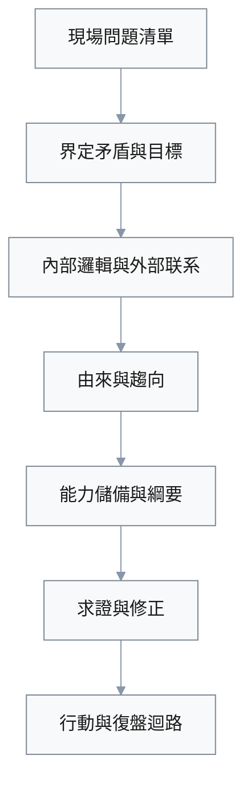

## Essence Loop Executive Summary

**Domain**: 把握分析问题的九个方面（通用问题分析方法论）  
**Role**: 中高层管理者 / 团队负责人 / 咨询与产品从业者  
**Industry**: 跨行业（任何需要系统分析复杂问题的知识工作场景）  
**Time Budget**: 60–75 分钟  
**Coverage**: 5 Q&As（聚焦九个方面 + “问题可以程序化”框架）

**Key Signals** (1–3 bullets):
- 能否从书中大量概念与案例中，抽出 3–5 个真正决定分析质量的“九面一程序”关键杠杆。
- 能否把这些杠杆按界定 / 结构 / 时间轴 / 能力储备 / 迭代闭环等维度，整理成 2–3 个不重叠的 MECE 结构。
- 能否把抽象方法论落到实际决策：清楚说出对谁、在什么情境下、用哪些指标衡量分析是否做到位。
 
### Visual Overview

#### Diagram: 九面一程序與兩大板塊

#### Table: Q&A Quick Map

| Q | 核心焦點 | 關鍵維度 | 代表指標 |
|---|---------|---------|---------|
| Q1 | 一頁九面程序 | 結構與迭代 | 清晰界定問題占比 |
| Q2 | 矛盾目標條件 | 信號與決策 | 不良率與大客投訴 |
| Q3 | 內外平衡復盤 | 結構與反饋 | 關鍵用例成功率 |
| Q4 | 由來與趨向 | 趨勢與阈值 | 離職率與獲客成本 |
| Q5 | 綱要與閉環 | 決策與範圍 | 綱要覆蓋與改進幅度 |

---

### Q1: 从混乱困惑到“九面一程序”的一页纲要

**EssenceDimensions**: [SignalVsNoise, ClusterMECE] | **Difficulty**: I | **RoleContext**: 互联网公司业务团队负责人（新晋管理者）  
**Criticality**: [Blocks, Stakeholders] | **Stakeholders**: [部门负责人, 业务骨干, 上级领导] | **EstimatedTime**: ~15 min

**Question (for candidate)**:  
你刚升任业务团队负责人，手上堆着各种“问题”：业绩波动、团队冲突、跨部门扯皮、项目延误、个人时间被会议与杂务填满。你读完《把握分析问题的九个方面》后，觉得每一章都“有道理”，但真正坐到桌前准备下一次业务复盘会时，依然不知道从哪里下手，只会把所有痛点一股脑儿写成长清单。上级只给你 60 分钟会议时间，希望看到“有结构、有重点”的问题分析与改进提案。  

从这个情境出发：  
1. 在书中的所有概念与案例中，识别 **3–5 个最关键的“九面一程序”杠杆**，作为你这次分析的骨干。  
2. 把这些杠杆整理成 **2–3 个不重叠的 MECE 集合/板块**，并为每个板块起一个便于复用的名字。  
3. 简要说明：为什么你选择先从这些板块入手，而不是平均覆盖九章？哪些内容会被你有意识地减弱或暂时忽略？

**Answer Key (~150–250 words)**:  
- **Target Essence Levers (3–5)**:  
  - 把“九个方面”压缩为一条可执行的 **问题分析程序（界定 → 内部逻辑 & 外部联系 → 由来 & 趋向 → 能力储备 → 纲要 → 求证 & 修正）**。  
  - 在第一步先 **界定矛盾、目标与条件**，避免“问错题”“解错题”，尤其识别是否已进入危机状态。  
  - 通过 **内部平衡 + 外部联系** 的系统视角，避免只盯局部指标。  
  - 意识到落地需要 **能力储备 + 纲要化 + 求证和修正闭环**，把分析变成可复盘的流程。  
- **Clusters (2–3, MECE)**:  
  - 【问题结构板块】：界定、内部逻辑、外部联系、由来、趋向——回答“到底是什么问题，它怎么来的、要往哪去？”。  
  - 【执行与迭代板块】：能力储备、纲要化、求证与修正——回答“我是否有能力把分析落地并持续修正？”。  
- **Decision Link**: 先用“问题结构板块”决定会议议程与优先级，再用“执行与迭代板块”设计会后行动与复盘机制。  
- **Metrics & Priorities**: 优先关注：本次会议中“经清晰界定的问题占比”、会后形成的可执行行动条数、3 个月内关键决策失误率是否下降。  
- **Common Failure Modes**: 把九个方面当作背诵清单逐条罗列；在会议中平均用力，不区分主线与辅助；完全忽略能力与迭代闭环，只停留在“想清楚”而不管“做得出”。

---

### Q2: 矛盾、目标与条件——避免“问错题”“解错题”

**EssenceDimensions**: [SignalVsNoise, DecisionLevers] | **Difficulty**: F | **RoleContext**: 传统制造企业中层主管  
**Criticality**: [Blocks, Risk, Quantified] | **Stakeholders**: [中层主管, 一线班组长, 企业负责人] | **EstimatedTime**: ~10–15 min

**Question (for candidate)**:  
工厂近期投诉率升高、返工增加、员工情绪低落。高层只抛下一句：“把质量问题查清楚，下个月一定要好转。”你手头有海量数据（退货率、良品率、生产节拍）、大量抱怨（设备老化、供应不稳、培训不足）、以及一些突发事件（供货延迟引发的临时加班）。你刚读完本书第一章关于 **矛盾问题、目标与条件、危机问题** 的内容，需要在 2 天内向总经理提交一份分析提纲。  

从这个情境出发：  
1. 识别 **3–5 个真正的矛盾/目标/条件层面的“本质问题”**，其它信息视为噪音或次要细节。  
2. 说明每个本质问题 **直接关联的 1–2 个关键决策/取舍**（如是否扩产、是否停线整改、是否更换供应商）。  
3. 指出你会如何用 1–3 个简单指标，向总经理说明“本次分析是否抓住了问题核心”。

**Answer Key (~150–250 words)**:  
- **Target Essence Levers (3–5)**:  
  - 明确顶层 **目标层次**：是短期压投诉率，还是中长期提升稳定良品率与单位利润？  
  - 梳理 **核心矛盾**：现有设备/工艺能力与目标良品率之间的差距；现有人力与加班节奏之间的冲突；交期承诺与供应弹性之间的矛盾。  
  - 区分 **客观条件 vs 可调整条件**：设备老化属短期刚性约束，排产节奏与培训频率则可优化。  
  - 判断是否构成 **危机问题**（例如：大客户流失风险、现金流压力），决定是否需要“停线式”激进措施。  
- **Clusters (2–3, MECE)**:  
  - 【目标与约束】：清晰写出本季度必须达成的质量/成本/交期组合目标，以及哪些条件基本不可变。  
  - 【结构性矛盾】：将人、机、料、法、环中最关键的 2–3 个矛盾点挑出来，其他只做背景。  
- **Decision Link**: 这些矛盾直接决定是否需要临时减产保质、调整客户组合、追加技改投资。  
- **Metrics & Priorities**: 优先用“不良率趋势 + 大客户投诉数 + 单位毛利”三连指标判断是否触发危机级应对。  
- **Common Failure Modes**: 把所有抱怨一股脑儿列为“问题”；只报数据不讲矛盾结构；避谈真正的目标冲突，只给出零碎改进建议。

---

### Q3: 内部平衡与外部联系——系统视角下的复盘

**EssenceDimensions**: [ClusterMECE, MetricsPriorities] | **Difficulty**: I | **RoleContext**: 互联网产品团队负责人  
**Criticality**: [Stakeholders, Quantified] | **Stakeholders**: [产品经理, 技术负责人, 运营负责人, 客户代表] | **EstimatedTime**: ~15 min

**Question (for candidate)**:  
一款 B2B 产品连续三个版本都“改了很多”，但核心 KPI（留存率、付费转化）几乎不动。产品、技术、运营之间互相指责：有人说需求不清，有人说实现太粗糙，有人说运营不给力。你计划组织一次基于本书 **第二章“内部逻辑平衡”与第三章“外部联系”** 思路的复盘会，把争吵变成系统性分析。  

从这个情境出发：  
1. 识别 **3–5 个需要特别审视的内部平衡关系**（如功能深度 vs 交付节奏、技术复杂度 vs 稳定性），以及 1–2 个关键外部联系（如销售渠道、客户组织内部决策流程）。  
2. 将这些关系整理成 **2–3 个 MECE 板块**，既覆盖内部逻辑，又覆盖关键外部联系。  
3. 为每个板块设计 **1–2 个可量化指标与优先级顺序**，帮助团队区分“先看的是什么，先改的是什么”。

**Answer Key (~150–250 words)**:  
- **Target Essence Levers (3–5)**:  
  - 内部：功能覆盖面与打磨深度的平衡；开发节奏与质量保障的平衡；“过犹不及”的边界（过度优化单点 vs 忽略整体体验）。  
  - 外部：与客户组织中关键决策人/使用者之间的期望差异；现有渠道在教育市场与反馈回流上的能力。  
  - “以和为贵但不失原则”：在复盘中区分责任与责备，既追因也保合作。  
- **Clusters (2–3, MECE)**:  
  - 【内部结构平衡】：围绕“产品–技术–运营”三角，梳理 3–5 个关键 trade-off（如上线频率 vs 风险控制）。  
  - 【外部联系与反馈】：用户组织结构、渠道模式、竞品动态，聚焦 1–2 个最影响留存与付费的外部因素。  
- **Decision Link**: 通过这两个板块，决定下两个版本资源分配：是集中打磨 1–2 个关键场景，还是调整定价与销售叙事。  
- **Metrics & Priorities**: 先看“关键用例成功率 + 版本缺陷密度”，再看“目标账户中多角色激活率 + 付费转化率”；优先把内部结构失衡修正到不会自我拖累，再用外部联系策略放大成果。  
- **Common Failure Modes**: 把所有问题归咎于单一角色；只看内部指标，不看客户组织内的决策链；缺少量化标准，只用情绪化评价产品好坏。

---

### Q4: 由来与趋向——在危机前做出结构性调整

**EssenceDimensions**: [SignalVsNoise, MetricsPriorities] | **Difficulty**: A | **RoleContext**: 快速扩张期公司的创始人/总经理  
**Criticality**: [Blocks, Risk, Action, Quantified] | **Stakeholders**: [创始团队, 核心管理层, 投资人] | **EstimatedTime**: ~15 min

**Question (for candidate)**:  
你的公司过去三年营收高速增长，但近期几个信号让你不安：老员工流失增加、投诉率缓慢上升、新客户获客成本陡增。董事会要求你在下一次会议上给出“是否继续激进扩张，还是阶段性收缩聚焦”的建议。你刚读完本书第四、五章关于 **由来、趋向、透过现象看本质、通过苗头看趋势** 的内容，希望用它来组织你的思考。  

从这个情境出发：  
1. 识别 **3–5 个必须追溯“由来”的结构性问题**（例如组织能力积累不足、过度依赖单一渠道），以及 **2–3 个决定性“趋向”信号**。  
2. 为董事会梳理一个 **2–3 板块的时间轴结构**：过去如何一步步走到现在、未来在不同决策下会如何演化。  
3. 设计 **1–3 个关键指标及其阈值**，用于判断“是否必须在 6–12 个月内主动减速或转向”。

**Answer Key (~150–250 words)**:  
- **Target Essence Levers (3–5)**:  
  - 由来：高速扩张阶段是否系统建设了中层队伍与管理流程，还是用“英雄主义 + 超时工作”在支撑；是否过度依赖单一市场/渠道；是否为了短期增长牺牲了产品与服务质量。  
  - 趋向：老员工流失是否集中在关键岗位；投诉率上升是否呈加速趋势；获客成本是否已接近或超过单客长期贡献。  
  - 将“现象”与“苗头”放在统一时间轴上，而不是孤立看单点事件。  
- **Clusters (2–3, MECE)**:  
  - 【历史路径板块】：把过去 3 年的关键决策与结果排成时间线，标出哪些选择在透支未来（如过度折扣、压缩培训）。  
  - 【趋势与阈值板块】：围绕离职、投诉、获客成本、现金流安全边界等，判定是否已接近“危机拐点”。  
- **Decision Link**: 这两个板块直接决定是继续扩张、放缓增速、还是阶段性“瘦身”，并影响融资节奏与组织重构方案。  
- **Metrics & Priorities**: 例如：核心岗位年化离职率 > 15%，获客成本 / LTV > 0.6，NPS 连续 3 个季度下滑，即触发“减速 + 组织与产品质量优先”的策略调整。  
- **Common Failure Modes**: 只看最新一季数据，不看形成路径；用故事掩盖趋势；忽略“慢变量”（组织能力、品牌口碑），只盯短期营收曲线。

---

### Q5: 纲要化、求证与修正——把分析变成可迭代的工作流

**EssenceDimensions**: [DecisionLevers, ScopeBoundaries] | **Difficulty**: I | **RoleContext**: 咨询顾问 / 内部战略分析师  
**Criticality**: [Blocks, Stakeholders, Action] | **Stakeholders**: [项目负责人, 客户高层, 项目团队成员] | **EstimatedTime**: ~10–15 min

**Question (for candidate)**:  
你作为某变革项目的分析负责人，已经和客户进行了大量访谈、拿到了多份报表，也读完了本书后半部分关于 **写出问题纲要、求证答案、修正答案** 的章节。但你发现：团队每次讨论时都从头讲故事，观点反复摇摆，迟迟难以形成可执行方案。客户耐心有限，要求下周必须拿出一个“可以分批实施、可据此评估成效”的行动框架。  

从这个情境出发：  
1. 识别 **3–5 个把分析变成“可迭代工作流”的关键杠杆**（如统一纲要结构、明确求证假设、设定反馈周期）。  
2. 将这些杠杆限定在 **清晰的范围边界内**：哪些属于本轮项目必须交付，哪些属于后续长期建设。  
3. 说明这些杠杆将如何 **具体影响决策与执行**：谁在什么时候依据哪些信号决定“收缩、扩展或修正”方案。

**Answer Key (~150–250 words)**:  
- **Target Essence Levers (3–5)**:  
  - 采用统一的 **分析纲要结构**（例如按九个方面或七步程序展开），所有发现与建议都挂在纲要节点下，而不是按人或会议顺序罗列。  
  - 明确本轮的 **核心假设与待求证问题**，为每条结论指定至少 1 个需要验证的事实或数据源。  
  - 设计 **回馈与修正机制**：规定试点阶段的观察周期、反馈渠道与调整节奏。  
  - 划清 **范围边界**：本轮聚焦 2–3 个高杠杆领域，其余放入“后续议题池”。  
- **Clusters (2–3, MECE)**:  
  - 【结构与假设板块】：纲要、假设清单、求证计划——决定“我们究竟在验证什么”。  
  - 【实施与反馈板块】：试点范围、指标设计、反馈与修正节奏——决定“我们如何在做中学、边走边修”。  
- **Decision Link**: 这两个板块共同决定项目是否能在有限时间内交付“足够好”的方案，并为后续迭代预留空间，而不是一锤子买卖。  
- **Metrics & Priorities**: 可用“纲要覆盖关键问题比例”“被数据或事实修正的关键结论数量”“试点轮次与每轮改进幅度”来衡量闭环质量。  
- **Common Failure Modes**: 不写纲要，只靠记忆讨论；把所有发现一次性塞进首版方案，没有求证与修正空间；范围失控，导致项目不断延期、结论永远悬而未决。

