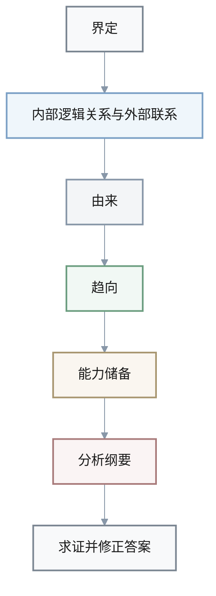

1. Q: 《把握分析问题的九个方面》中提出，完整的问题分析能力可以概括为“九面 + 一程序”，九个方面依次是：___、___、___、___、___、___、___、___、___。
   A: 搞清问题界定；搞清问题内部逻辑关系；搞清问题外部联系；搞清问题由来；搞清问题趋向；搞清解决这类问题的能力储备；善于写出你对问题的纲要；小心求证你的答案；修正你的答案。
 
**九面 + 一程序：九个方面一览**

- **九个方面**：
  - 搞清问题界定
  - 搞清问题内部逻辑关系
  - 搞清问题外部联系
  - 搞清问题由来
  - 搞清问题趋向
  - 搞清解决这类问题的能力储备
  - 善于写出你对问题的纲要
  - 小心求证你的答案
  - 修正你的答案

| 序号 | 分析方面 |
| ---- | -------- |
| 1 | 搞清问题界定 |
| 2 | 搞清问题内部逻辑关系 |
| 3 | 搞清问题外部联系 |
| 4 | 搞清问题由来 |
| 5 | 搞清问题趋向 |
| 6 | 搞清解决这类问题的能力储备 |
| 7 | 善于写出你对问题的纲要 |
| 8 | 小心求证你的答案 |
| 9 | 修正你的答案 |

1. Q: 书中认为任何问题都具有的四大共性属性是：___、___、___ 和 ___。
   A: 物质性；系统性；动态性；对立性。

1. Q: 在“问题共性结构”中，用来刻画问题组成的四对结构要素分别是：___/___、___/___、___/___ 和 ___/___。
   A: 虚部/实部；软部/硬部；潜部/显部；正部/负部。

**“问题共性结构”的四对结构要素一览**

- **四对结构要素**：
  - 虚部 / 实部
  - 软部 / 硬部
  - 潜部 / 显部
  - 正部 / 负部

| 对应编号 | 左侧要素 | 右侧要素 |
| -------- | -------- | -------- |
| 1 | 虚部 | 实部 |
| 2 | 软部 | 硬部 |
| 3 | 潜部 | 显部 |
| 4 | 正部 | 负部 |

1. Q: “矛盾问题”本质上是由难以同时满足的 ___、___ 或 ___ 构成的“结”，需要通过特征变换、目标变换或系统重组来化解。
   A: 目标；条件；状态。

1. Q: 书中“可拓性”包含的几种典型特征和关系包括：___（如一物多征、一征多物）、___（量与量之间的依赖关系）、___（A 蕴含 B 或可由 B 反制 A）以及多种“可以性”。
   A: 发散性；问题间的关联性（传导变换）；蕴含关系。

1. Q: 关于危机问题，书中综合多方定义，认为其典型特征包括突发性、紧急性、破坏性、传导性和 ___。
   A: 机遇性。

**危机问题的典型特征一览**

- **突发性**
- **紧急性**
- **破坏性**
- **传导性**
- **机遇性**

| 序号 | 特征 |
| ---- | ---- |
| 1 | 突发性 |
| 2 | 紧急性 |
| 3 | 破坏性 |
| 4 | 传导性 |
| 5 | 机遇性 |

1. Q: 在目标界定中，本书强调要区分最高层的 ___ 目标和若干层次较低的 ___ 目标，并通过 ___ 和 ___ 来形成清晰的优先级。
   A: 最上位；下位；量化；分层。

1. Q: “一举多得”思想要求我们在设计行动时，尽量让同一活动同时服务多个 ___，而不是只完成一个单一任务。
   A: 目标。

1. Q: 第七章指出，写出清晰的分析纲要，至少要包括的基本结构通常是：背景 → ___ → ___ → ___ → ___ 与后续。
   A: 问题；分析；方案；风险。

1. Q: 最后一章给出的“问题分析程序”大致可以概括为七步：先搞清 ___；搞清 ___ 与 ___；搞清 ___；搞清 ___；搞清解决这类问题的 ___；写出 ___；最后 ___ 并修正答案。
   A: 界定；内部逻辑关系；外部联系；由来；趋向；能力储备；分析纲要；求证。

**“问题分析程序”七步流程概览**

- **七个关键步骤**（按顺序）：
  1. 搞清界定
  2. 搞清内部逻辑关系与外部联系
  3. 搞清由来
  4. 搞清趋向
  5. 搞清解决这类问题的能力储备
  6. 写出分析纲要
  7. 求证并修正答案

| 步骤 | 关键动作 |
| ---- | -------- |
| 1 | 搞清界定 |
| 2 | 搞清内部逻辑关系与外部联系 |
| 3 | 搞清由来 |
| 4 | 搞清趋向 |
| 5 | 搞清解决这类问题的能力储备 |
| 6 | 写出分析纲要 |
| 7 | 求证并修正答案 |

