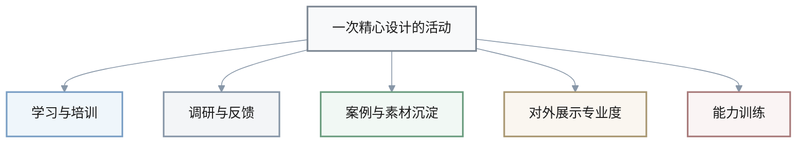
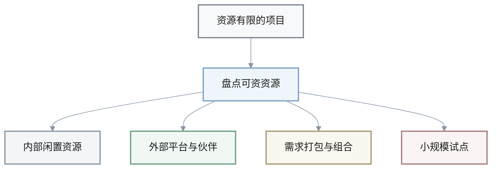
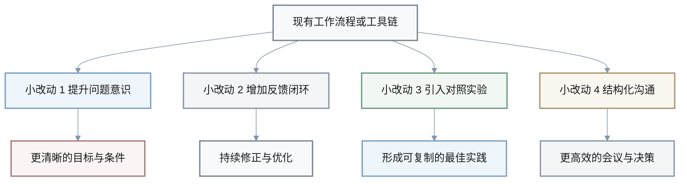

1. Q: 书中通过“一举多得”的案例展示，精心设计一次活动可以同时服务多个目标。围绕你所在团队最近要开展的一次培训/发布/复盘活动，生成 3–5 种“一举多得”的设计思路。
   A: 
   - 方案 1：将培训课程内容与市场调研结合，在每个模块后设计简短问卷，既教学又收集学员对产品/流程的真实反馈，为后续优化提供数据依据。
   - 方案 2：在活动中安排小组讨论与成果分享环节，同时收集优秀实践案例，整理成内部知识库或对外宣传素材，一次活动兼顾能力提升与内容沉淀。
   - 方案 3：邀请潜在合作方或关键客户旁听部分环节，将其设计为“共创工作坊”，在解决内部问题的同时，顺带展示团队专业度和合作意愿。
   - 方案 4：在复盘活动中嵌入“能力训练”小练习（如快速界定问题、写小纲要），不仅总结过去，也顺便训练团队在未来问题中的分析能力。

**可视化：一次活动服务多重目标**

**方案功能一览表**

| 方案 | 核心场景 | 直接目标 | 顺带收益 |
|------|----------|----------|----------|
| 方案 1 | 培训+问卷 | 传授知识 | 收集产品/流程反馈 |
| 方案 2 | 小组讨论 | 能力提升 | 沉淀案例与宣传素材 |
| 方案 3 | 共创工作坊 | 解决内部问题 | 展示专业度，促进合作 |
| 方案 4 | 复盘+小练习 | 总结经验 | 训练分析能力 |

1. Q: 根据“可拓性”的思想，面对一个资源有限但目标较高的项目，如何创造性地利用“可资资源”和“可组合性”，在不显著增加预算的前提下提升方案效果？请给出 3–5 种思路。
   A: 
   - 方案 1：盘点现有内部资源（闲置空间、已有工具、未充分利用的渠道），通过时间错峰或用途变更，将其二次利用为项目场地、实验环境或宣传载体。
   - 方案 2：与其他部门或外部伙伴合作，共享已经搭建好的平台和系统，如借用其培训平台、线上活动工具或客户社群，以资源互换替代现金投入。
   - 方案 3：将若干小需求打包成系列方案（类似婴儿礼盒），通过“组合销售”或“组合交付”提高整体吸引力和单位投入产出比。
   - 方案 4：将项目拆分为多个可独立试点的小模块，优先在低成本场景中验证关键假设，试点成功后再争取追加资源扩展规模。

**可视化：资源“可拓性”的应用框架**

**资源与组合方式一览表**

| 方案 | 关键可资资源 | 主要可组合性 | 预期效果 |
|------|--------------|--------------|----------|
| 方案 1 | 闲置空间、工具、渠道 | 时间错峰、用途变更 | 提高资源利用率 |
| 方案 2 | 外部门与伙伴平台 | 资源互换、平台共享 | 减少现金投入 |
| 方案 3 | 多个零散需求 | 打包设计、组合交付 | 提升吸引力与投入产出比 |
| 方案 4 | 可拆分的项目模块 | 先试点再扩展 | 降低试错成本，逐步争取资源 |

1. Q: 书中强调“创新无限”，认为任何方案都只是相对较优解。针对你目前正在使用的一套工作流程或工具链，如何在不彻底推翻的前提下提出 3–5 种渐进式创新改动？
   A: 
   - 方案 1：在现有流程的关键节点增加一个“问题分析小卡片”，要求填入“本环节的核心矛盾、目标与条件”，借此提升每一步的意识清晰度。
   - 方案 2：为现有工具链增加“反馈与修正”环节，例如在每轮迭代末尾自动弹出简短问卷或复盘模板，收集用户或团队的即时反馈。
   - 方案 3：引入“对照组”思维，在部分项目中尝试使用略有不同的配置或策略，并用简单指标比较结果，形成可学习的小规模实验体系。
   - 方案 4：将目前完全依赖口头沟通的环节，改为先写简短纲要再开会讨论，让团队成员提前看到结构化信息，提升会议效率和决策质量。

**可视化：渐进式创新改动总览**

**改动类型与预期收益一览表**

| 方案 | 主要作用点 | 改动类型 | 预期收益 |
|------|------------|----------|----------|
| 方案 1 | 流程关键节点 | 增加分析卡片 | 提高问题界定与思考质量 |
| 方案 2 | 工具链尾部 | 嵌入反馈环节 | 更快发现问题并修正 |
| 方案 3 | 部分项目配置 | 引入对照实验 | 用数据比较形成可复制经验 |
| 方案 4 | 会前沟通方式 | 从口头改为书面纲要 | 提升会议效率与决策质量 |

