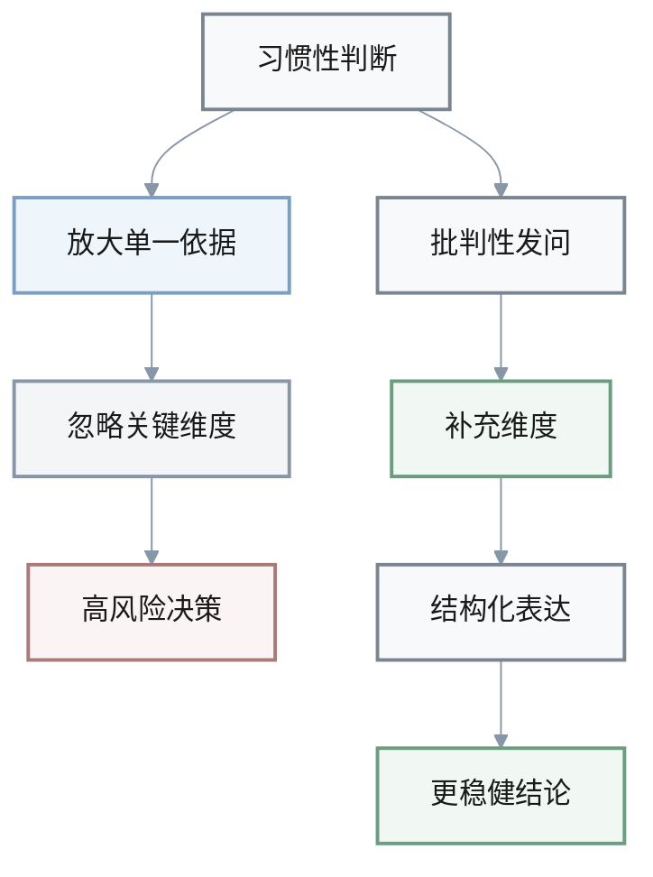

1. Q: 书中提到很多人习惯“凡事依赖老经验”，认为“过去这样做一直没出事，所以现在还可以照做”。请根据本书关于经验与修正的讨论，对这一推理模式进行批判性分析。
   A: 
   - 这一推理把“过去没出事”视为未来必然安全的充分证据，忽略了环境和条件的动态性，属于典型的以过去替代现在与未来的思维偏差。
   - 论证中缺乏对“由来与趋向”的分析，没有区分哪些经验仍然适用、哪些只是特定情境下的偶然成功，证据的适用范围被过度外推。
   - 要加强这一论点，需要加入对当前环境变化的系统评估，并通过小步试验和反馈机制验证经验是否仍然有效，而不是直接将经验当作铁律。

   > **可视化：经验推理的风险路径**

   ```mermaid
   %%{init: {
     "theme": "base",
     "themeVariables": {
       "primaryColor": "#f8f9fa",
       "primaryTextColor": "#1a1a1a",
       "primaryBorderColor": "#7a8591",
       "lineColor": "#8897a8",
       "secondaryColor": "#eff6fb",
       "tertiaryColor": "#f3f5f7",
       "background": "#ffffff",
       "mainBkg": "#f8f9fa",
       "clusterBkg": "#f3f5f7",
       "clusterBorder": "#8897a8",
       "edgeLabelBackground": "#ffffff"
     }
   }}%%
   graph LR
     P[过去没出事] --> H[忽略环境变化]
     H --> D[直接照做]
     D --> R[未来结果未知]
     P --> C[分析由来与趋向]
     C --> T[小步试验与反馈]
     T --> U[必要时修正经验]

   style P fill:#f8f9fa,stroke:#7a8591,stroke-width:2px,color:#1a1a1a
   style H fill:#faf6f0,stroke:#a89670,stroke-width:2px,color:#1a1a1a
   style D fill:#faf4f4,stroke:#a87a7a,stroke-width:2px,color:#1a1a1a
   style R fill:#f3f5f7,stroke:#8897a8,stroke-width:2px,color:#1a1a1a
   style C fill:#eff6fb,stroke:#7a9fc5,stroke-width:2px,color:#1a1a1a
   style T fill:#f1f8f4,stroke:#6b9d7f,stroke-width:2px,color:#1a1a1a
   style U fill:#f1f8f4,stroke:#6b9d7f,stroke-width:2px,color:#1a1a1a
   ```

   | 关键点 | 片面推理 | 批判性思考 |
   |--------|----------|------------|
   | 时间尺度 | 只看过去 | 关注现在与未来 |
   | 条件假设 | 默认环境不变 | 考虑条件随时间变化 |
   | 行动策略 | 直接照做 | 小步试验与修正 |

1. Q: 有人主张：“只要现在指标好看、利润上升，就没必要在品牌、培训、福利等‘虚部’上多花钱，这些都是可以以后再说的事。”请依据书中“虚部/实部”和“正部/负部”的分析框架，评估这一观点的逻辑问题。
   A: 
   - 该观点将资源与投入简单等同于“短期利润贡献”，忽略了虚部（品牌、信誉、知识、福利等）对长期竞争力的支撑作用，是以局部、短期指标代替整体、长期目标的片面性。
   - 它把某些对利润暂时为负的投入（如三废处理、福利设施）视为纯粹负部，而没有从更高层目标（社会责任、环境、人才稳定）上重新评估其“有利的负部”属性，是立场单一导致的判断偏差。
   - 要改善这一论证，需要在目标界定时明确“相对于什么目标、在多长时间尺度上”来评价正负，并引入更多关于虚部对风险和长期收益影响的证据。

   > **表格：短期利润与虚部投入的对比**

   | 维度 | 片面观点 | 批判性视角 |
   |------|----------|------------|
   | 时间 | 只看当前指标 | 兼顾长期竞争力 |
   | 目标 | 利润最大化 | 利润与责任平衡 |
   | 投入 | 避免虚部投入 | 识别有利的负部 |

1. Q: 在面对危机时，一种常见说法是“危机本质上都是坏事，唯一正确的做法就是尽快让一切恢复原状”。结合本书对危机特征和“危中有机”的论述，对这一断言进行批判性评价。
   A: 
   - 该说法只强调危机的破坏性和紧急性，忽略了其传导性和机遇性，把“恢复原状”当作唯一目标，缺乏对结构性问题和潜在机会的分析。
   - 在逻辑上，它默认原状本身是合理且稳定的，却没有询问危机暴露出的深层矛盾是否需要被正视和调整。
   - 更合理的立场是：在控制损失和稳定局面的前提下，利用危机提供的“强信号”审视旧有结构，判断哪些部分需要借机更新或重构。

   > **可视化：危机处理的两条路径**

   ```mermaid
   %%{init: {
     "theme": "base",
     "themeVariables": {
       "primaryColor": "#f8f9fa",
       "primaryTextColor": "#1a1a1a",
       "primaryBorderColor": "#7a8591",
       "lineColor": "#8897a8",
       "secondaryColor": "#eff6fb",
       "tertiaryColor": "#f3f5f7",
       "background": "#ffffff",
       "mainBkg": "#f8f9fa",
       "clusterBkg": "#f3f5f7",
       "clusterBorder": "#8897a8",
       "edgeLabelBackground": "#ffffff"
     }
   }}%%
   graph LR
     C[危机发生] --> S[只追求恢复原状]
     S --> L[忽视深层矛盾]
     L --> W[风险可能再次爆发]
     C --> P[控制损失与稳定局面]
     P --> R[审视结构性问题]
     R --> O[寻找转机与调整机会]

   style C fill:#f8f9fa,stroke:#7a8591,stroke-width:2px,color:#1a1a1a
   style S fill:#faf6f0,stroke:#a89670,stroke-width:2px,color:#1a1a1a
   style L fill:#faf4f4,stroke:#a87a7a,stroke-width:2px,color:#1a1a1a
   style W fill:#f3f5f7,stroke:#8897a8,stroke-width:2px,color:#1a1a1a
   style P fill:#eff6fb,stroke:#7a9fc5,stroke-width:2px,color:#1a1a1a
   style R fill:#f1f8f4,stroke:#6b9d7f,stroke-width:2px,color:#1a1a1a
   style O fill:#f1f8f4,stroke:#6b9d7f,stroke-width:2px,color:#1a1a1a
   ```

1. Q: 有人认为：“只要把问题内部关系梳理清楚，外部联系都是次要的，没必要花太多时间处理各种人际和部门关系。”用本书的系统视角，对这一观点进行批判性分析。
   A: 
   - 这一观点混淆了“分析简化”与“现实简化”，在逻辑上把系统切成“内部”与“外部”两部分，却忽略了很多关键变量（如供应、政策、客户）本身就位于外部联系中。
   - 证据上，它没有考虑案例中大量“外因内化为内因”的情况，如政策变化、合作破裂、客户预期调整，都会深刻改变问题内部结构。
   - 按照本书的看法，合理的做法是在梳理内部逻辑的同时，系统分析外部联系与责任边界，通过“对结果负责”和“给别人留余地”的原则，降低外部联系带来的二次风险。

   > **可视化：内部关系与外部联系的系统视角**

   ```mermaid
   %%{init: {
     "theme": "base",
     "themeVariables": {
       "primaryColor": "#f8f9fa",
       "primaryTextColor": "#1a1a1a",
       "primaryBorderColor": "#7a8591",
       "lineColor": "#8897a8",
       "secondaryColor": "#eff6fb",
       "tertiaryColor": "#f3f5f7",
       "background": "#ffffff",
       "mainBkg": "#f8f9fa",
       "clusterBkg": "#f3f5f7",
       "clusterBorder": "#8897a8",
       "edgeLabelBackground": "#ffffff"
     }
   }}%%
   graph LR
     I[系统内部] --> M[指标与流程]
     E[外部联系] --> C[客户预期]
     E --> S[供应与政策]
     S --> I
     C --> I

   style I fill:#f8f9fa,stroke:#7a8591,stroke-width:2px,color:#1a1a1a
   style M fill:#f3f5f7,stroke:#8897a8,stroke-width:2px,color:#1a1a1a
   style E fill:#eff6fb,stroke:#7a9fc5,stroke-width:2px,color:#1a1a1a
   style C fill:#f1f8f4,stroke:#6b9d7f,stroke-width:2px,color:#1a1a1a
   style S fill:#f1f8f4,stroke:#6b9d7f,stroke-width:2px,color:#1a1a1a
   ```

1. Q: 有观点认为：“真正聪明的人不用写纲要，脑子里想清楚就够了，写出来只是浪费时间。”请依据本书第七章的论述，评估这一观点的合理性与局限。
   A: 
   - 该观点假设“脑中清晰”必然等价于“逻辑严密、可被他人理解”，忽视了写纲要在暴露思路漏洞、补齐论证链条和方便他人参与讨论方面的功能。
   - 它没有提供证据说明在复杂问题上，仅凭个人记忆和即时口头表达就能保证不遗漏关键信息和反例，尤其在压力和时间受限的情境下。
   - 从本书角度看，写纲要是把个人直觉转化为集体智慧、把一次性判断转化为可复盘知识的关键步骤；拒绝这一过程，会削弱团队共同学习和持续改进的能力。

   > **表格：仅靠“脑中想清楚”和写纲要的对比**

   | 维度 | 只在脑中 | 写出纲要 |
   |------|----------|----------|
   | 逻辑漏洞 | 不易暴露 | 易于检查与修正 |
   | 团队沟通 | 难以共享 | 结构清晰便于讨论 |
   | 复盘学习 | 线索缺失 | 可反复使用与迭代 |

---

## 可视化总结：批判性思维的五个切入点

### 1. 核心偏差与修正路径总览

| 问题主题 | 典型偏差 | 批判性思维切入点 |
| --- | --- | --- |
| 依赖老经验 | 以过去替代现在与未来 | 分析环境条件变化 通过小步试验和反馈检验经验 |
| 只看短期利润 | 把虚部当作“纯负担” | 在更高层目标和更长时间尺度上重新评估“有利的负部” |
| 把危机只看成坏事 | 把“恢复原状”当作唯一目标 | 在控制风险的前提下审视结构性矛盾 把危机当作重构契机 |
| 只重内部 不看外部 | 把外部联系当作可忽略噪音 | 把关键外因内化进系统分析 明确责任边界和协作原则 |
| 拒绝写纲要 | 把脑中清晰等同于逻辑严密 | 用纲要暴露漏洞 支持团队讨论和复盘 积累可传递的知识 |

### 2. 通用的批判性思维操作步骤

- **看见单一依据**：先问“这一判断主要是基于什么单一经验或指标”。
- **补充被忽略的维度**：从时间长短 虚部与实部 内部与外部 个体与整体等角度检查遗漏。
- **追问由来与趋向**：不仅看当前结果 还看问题是怎么形成的 接下来可能走向哪里。
- **设计试验与反馈**：用小步试错 指标跟踪和复盘机制验证假设 而不是一次性押注。
- **结构化表达**：通过纲要 图表等方式把思路外化 让他人能够检视和协作改进。

### 3. 从惯性到批判性：思维流转示意图


