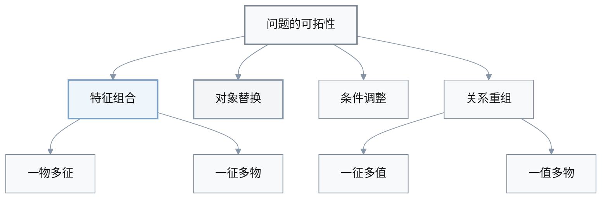
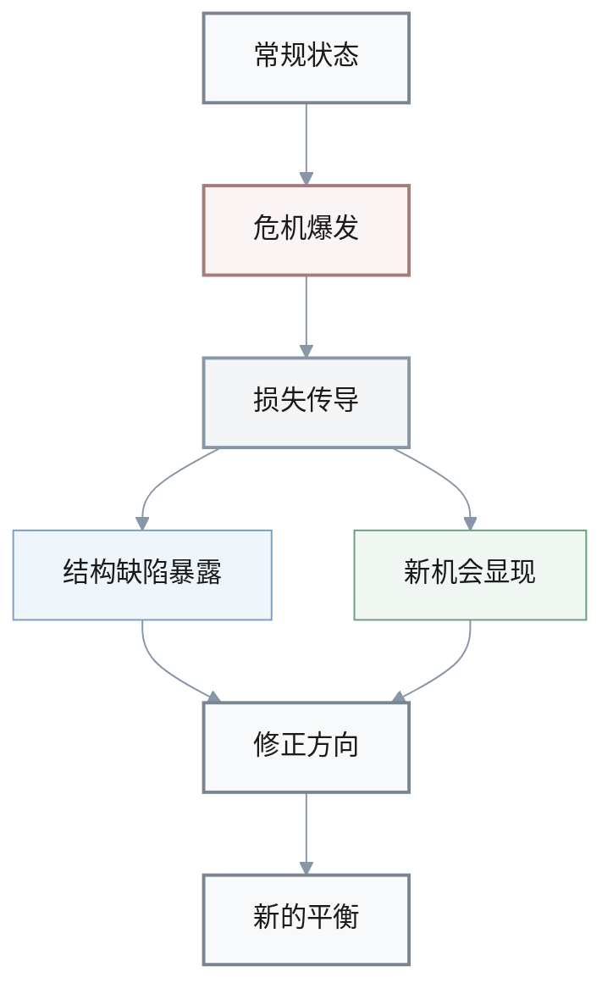
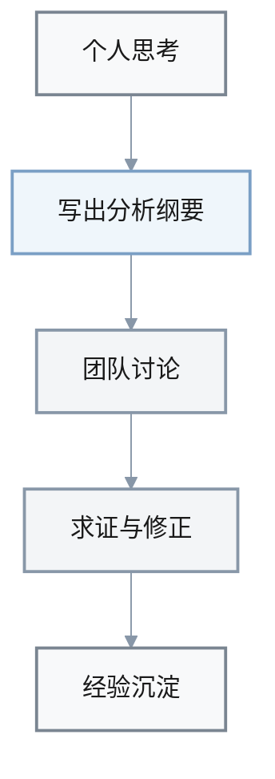

1. Q: 结合书中的案例，解释“问题的可拓性”是什么，它如何通过发散性、关联性和多种“可以性”帮助我们从死胡同中找到新解法？
   A: 
   - **Definition**: 问题的可拓性，指一个问题在特征组合、对象替换、条件调整以及问题间关系上所蕴含的延展空间，包括“一物多征、一征多物、一征多值、一值多物”等发散性，以及量与量之间的关联系和多种“可以性”。
   - **Mechanism**: 通过重新审视对象的特征（如烤香蕉的口感与风味）、挖掘量与量之间的传导关系（工资调整影响士气与业绩）、利用关键环节的蕴含关系（洛克菲勒控制精炼与运输侧翼出击），以及重新组合资源与产品（机床加装数控系统、婴儿用品组合销售），可拓性帮助我们打破对问题单一路径的固着。
   - **Significance**: 它让“看似无解”的矛盾，因视角与组合方式的变化而变得可解，使我们在资源有限的情况下实现一举多得或以小博大，是本书中极具创造性的核心思维之一。
   - **Example**: 烤坏的香蕉在发散性视角下被重新命名和包装为“进口风味”产品，原本的缺点被转化为卖点；机床通过加装一套价格远低于整机的数控系统，实现了低成本功能升级，都是可拓性在现实中的具体体现。

1. Q: 书中提出任何问题都具有“物质性、系统性、动态性和对立性”四大共性，并用“虚实、软硬、潜显、正负”四对结构要素来刻画。解释这一“问题共性结构”的含义与作用。
   A: 
   - **Definition**: 问题的共性结构，是指无论领域如何，任何问题都可以从四个基本属性（物质性、系统性、动态性、对立性）来理解；在此基础上，通过“虚部/实部”“软部/硬部”“潜部/显部”“正部/负部”四对对立概念，进一步刻画问题的组成与演化方式。
   - **Mechanism**: 实部与虚部分别对应有形要素与无形要素（厂房与品牌、人员与知识）；硬部与软部分别强调组成要素本身与要素之间的关系与协作方式；潜部与显部区分已暴露的现象与尚在孕育的隐患；正部与负部则强调相对于某一目标的利与弊。通过这种结构性拆解，我们可以在分析问题时，不仅关注“看得见的零件”，也同时审视无形资产、关系网络、潜在趋势和多重立场下的利弊。
   - **Significance**: 这一共性结构为问题分析提供了一个可以跨情境复用的“基础镜头”，帮助我们避免只盯着单一面向。例如，只修机器零件（硬部）而不改流程与协作（软部），只看当前负担（负部）而忽略对整体长期有利的部分，就都可能导致误判。
   - **Example**: 企业视角下，福利部、幼儿园等对短期利润是负部，但从形象、人才稳定和长期发展来看却是“有利的负部”；城市电网设计中，如果只按当前负荷配置而不考虑未来潜在空调用户（潜部），就可能在几年后因显部负荷激增而频频停电。

1. Q: 解释书中对“危机问题”的界定：危机有哪些关键特征，为什么说“危中有机”？
   A: 
   - **Definition**: 危机问题是对组织、人员、资产、声誉等具有严重或潜在严重损害的突发性问题，是系统从常规状态迈向重大转折的关键时刻。其典型特征包括突发性、紧急性、破坏性、传导性和机遇性。
   - **Mechanism**: 突发性与紧急性意味着决策与处置时间极为有限，破坏性和传导性使损失会在短时间内沿着各种外部联系扩散；然而，正是在这种大幅度扰动中，原有结构的缺陷与新机会会同时显现，若能及时调整布局、修正方向，就可能把潜在失败转化为转折机会。
   - **Significance**: 把危机只看作灾难，会让决策者陷于被动防御；而从“危中有机”的角度理解危机，可以促使我们在控制损失的同时，主动利用趋势变化和竞争格局重构，完成必要的战略调整。
   - **Example**: 书中以“9·11”事件对航空、金融、保险、旅游等行业的连锁影响为例，说明危机虽带来巨大伤害，却也迫使相关行业重新审视安全机制、风险管理和商业模式，一些机构借此机会完成了必要的升级与转型。

1. Q: 解释书中反复强调的“一举多得”思想：它与传统的单目标思维有何不同，为什么在问题分析中至关重要？
   A: 
   - **Definition**: 一举多得思想是指通过巧妙设计活动结构和内容，使同一行动同时服务多个目标，而非仅完成一个单一任务。
   - **Mechanism**: 通过在方案设计阶段就考虑“还能顺便完成什么”，将培训、宣传、调研、资料积累、关系建设等多种目的嵌入同一载体，可以在不显著增加成本的前提下，放大行动的整体收益。例如书中的咨询公司，通过为企业开设培训班，一次性实现理论宣传、市场调研、资料积累和合作关系建立四个目标。
   - **Significance**: 在资源有限的现实环境中，一举多得能显著提高问题解决的性价比，使我们不再只盯着“解决当前这个点”，而是思考如何在同一行动中为未来铺路。这种思维直接影响我们如何界定目标、挑选关键条件和设计可拓性的组合方案。
   - **Example**: 在设计一次产品发布会时，如果只追求当场销量，可能忽略了品牌形象塑造和客户反馈收集；若按一举多得的思路加入调研问卷、后续访谈预约和媒体合作，则同样一次活动可以同时服务销售、市场洞察和公关三重目标。

1. Q: 解释“虚部与实部”的概念：为什么在分析企业或个人问题时，不能只看实部而忽视虚部？
   A: 
   - **Definition**: 实部是问题中有形、物质性的组成（如房屋的墙壁与地板、企业的资金和设备、个人的身体与时间）；虚部则是围绕实部形成的无形要素（如房屋提供的空间感、企业的品牌形象与技术水平、个人的知识结构与社会声誉）。
   - **Mechanism**: 虚实相依：没有足够的实部支撑，虚部难以维系；而忽视虚部，又会让实部的价值大打折扣。问题在演化过程中，往往表现为虚实之间的失衡：例如设备（实部）完好但品牌形象（虚部）受损，或资金充裕却因知识与信誉不足而无法有效转化为竞争优势。
   - **Significance**: 只盯着可见的实部容易导致“头疼医头”，例如只砸钱买设备却不投入培训与品牌建设；而系统性地分析虚实两部，可以帮助我们在资源配置、风险控制和长期发展上做出更平衡的选择。
   - **Example**: 一家企业如果只通过价格战抢占市场（强化销量这一实部指标），而忽视产品质量、服务体验和品牌形象（虚部），短期看似“卖得多”，长期却可能因信任崩塌而失去市场。

1. Q: 解释书中强调的“过犹不及”在内部逻辑分析中的作用：它如何帮助我们识别系统内部的失衡点？
   A: 
   - **Definition**: “过犹不及”指许多问题并非来自“做得不够”，而是来自“做得过头”，即某些本来合理的行为或策略一旦超出适当区间，就会引发质量、关系或情绪上的急剧恶化。
   - **Mechanism**: 在系统内部，多个变量之间往往存在平衡关系和阈值效应：适度节约有利于成本控制，但过度节约会伤害士气与质量；适度激励有助于提升绩效，但过度激励可能诱发短视行为。通过分析量与量之间的对应、比例和节奏，我们可以发现哪些变量已经跨过了合理区间，从而定位内部失衡点。
   - **Significance**: “过犹不及”的视角提醒我们，不要一味在单个方向上“加码”，而要在内部逻辑中寻找合适的度。它帮助管理者避免简单地“多即好”的线性思维，转而关注系统性的平衡与非线性反馈。
   - **Example**: 为提升服务质量而不断增加检查与报表，起初可能有助于规范流程，但当控制与检查过度占用一线时间时，反而会让员工疲惫不堪，服务体验下降，这正是“过犹不及”的典型案例。

1. Q: 解释“写出分析纲要”在全书中的地位：为什么作者认为从“会想”到“会写”是问题分析进入可讨论和可传承阶段的关键？
   A: 
   - **Definition**: 写出分析纲要是指将对问题的思考整理成有层次、有逻辑的文稿结构（如背景 → 问题 → 分析 → 方案 → 风险与后续），而不是仅停留在脑海中的模糊感觉。
   - **Mechanism**: 写纲要的过程会迫使我们检查论证链条是否完整、是否有遗漏的条件或反例，以及结论是否真正建立在前面分析的基础上；同时，它也让他人可以在同一结构下理解和质疑我们的思路，为后续求证与修正提供载体。
   - **Significance**: 没有纲要，问题分析就难以进入团队层面的讨论和复盘，更无法沉淀为可传承的知识。将思考外化为结构化文本，是从个人直觉走向集体智慧、从一次性判断走向可迭代流程的关键一步。
   - **Example**: 一位项目负责人如果只是凭印象在会上“随机发挥”，与提前写好包含关键假设、备选方案和风险点的纲要相比，后者不仅更易获得同事反馈，也更便于在项目结束后进行系统复盘和经验总结。

---

## 可视化小结（按问题编号）

### 1. 问题的可拓性：发散方向一览

**结构图（发散路径）**

**典型可拓方式与案例对应**

| 可拓方式 | 含义提示 | 文中案例 |
|----------|----------|----------|
| 一物多征 | 同一对象挖掘多种特征 | 烤香蕉被重新命名包装 |
| 一征多物 | 同一特征应用到不同对象 | 将成功做法迁移到其他产品 |
| 一征多值 | 同一特征挖掘多种价值 | 工资调整影响士气与业绩 |
| 一值多物 | 同一价值由多种对象承载 | 数控系统为机床带来升级 |

> 提示：复习可拓性时，可先在脑中画出上述结构图，再对照表格回顾不同“可以性”的典型案例。

---

### 2. 问题共性结构：四性 × 四对要素

**四大共性属性速记表**

| 属性 | 核心关注点 | 典型提示 |
|------|------------|----------|
| 物质性 | 有形载体与资源 | 厂房、设备、资金 |
| 系统性 | 要素之间的连接 | 部门分工、流程协作 |
| 动态性 | 演化与变化趋势 | 增长、衰退、波动 |
| 对立性 | 利弊与矛盾张力 | 正负、攻守、轻重 |

**四对结构要素对照**

| 结构对 | 一侧示例 | 另一侧示例 |
|--------|----------|------------|
| 虚部 / 实部 | 品牌、知识、形象 | 厂房、人员、设备 |
| 软部 / 硬部 | 协作方式、流程 | 具体零件、物理结构 |
| 潜部 / 显部 | 潜在空调用户 | 已有用电负荷 |
| 正部 / 补有利负部 | 长期有利因素 | 短期成本与负担 |

> 使用方法：分析任何问题时，可先用“物质性—系统性—动态性—对立性”检查是否有遗漏，再用四对结构要素补充看不见的部分（虚、软、潜、正）。

---

### 3. 危机问题：从特征到转机

**危机特征与含义**

| 特征 | 含义提示 | 分析要点 |
|------|----------|----------|
| 突发性 | 来得快、预警少 | 预案是否覆盖极端情形 |
| 紧急性 | 反应时间极短 | 决策链是否足够简洁 |
| 破坏性 | 直接损害巨大 | 核心资产暴露在哪些点 |
| 传导性 | 损失会外溢 | 外部联系如何放大冲击 |
| 机遇性 | 结构被迫重组 | 能否借机完成必要调整 |

**危机演化与应对路径（示意）**

> 读“危中有机”时，可对照上图：危机既是破坏点，也是结构重构与方向修正的窗口。

---

### 4. 一举多得思想：一行动多目标

**一举多得设计视角**

| 设计维度 | 说明 | 文中案例 |
|----------|------|----------|
| 目标叠加 | 同一载体服务多重目标 | 培训班兼顾宣传与调研 |
| 资源复用 | 现有资源多次利用 | 一次活动沉淀资料与关系 |
| 时间打包 | 同一时间段解决多事 | 同场完成学习与市场拓展 |

> 使用提示：设计方案时，可问自己“除此之外还能顺便完成什么？”以此检视是否存在可拓的一举多得空间。

---

### 5. 虚部与实部：三种典型场景

**虚实对应速查表**

| 场景 | 实部示例 | 虚部示例 |
|------|----------|----------|
| 房屋 | 墙壁、地板 | 空间感与舒适度 |
| 企业 | 资金、设备 | 品牌形象、技术水平 |
| 个人 | 身体、时间 | 知识结构、社会声誉 |

> 分析问题时，可先列出现有实部，再追问：与这些实部相对应的虚部是否被低估或忽视？

---

### 6. “过犹不及”：变量与区间

**典型“度”的失衡示意**

| 变量 | 适度区间 | 过度后果提示 |
|------|----------|--------------|
| 成本节约 | 控制浪费、提高效率 | 士气受损、质量下降 |
| 物质激励 | 激发合理动力 | 短视行为、违规风险 |
| 控制检查 | 适量监督、保障质量 | 报表过多、占用一线时间 |

> 结合书中案例，可将每个变量画成一条“U 型”曲线：两端是“做得太少”和“做得太多”，中间窄区才是合理区间。

---

### 7. 写出分析纲要：从思考到传承

**写纲要推动的问题分析流程（示意）**

**纲要常见结构提示**

| 部分 | 内容要点 |
|------|----------|
| 背景 | 交代情境与关键事实 |
| 问题 | 明确要解决的核心矛盾 |
| 分析 | 展开条件、逻辑与对比 |
| 方案 | 提出可行选择与理由 |
| 风险与后续 | 标出风险点与后续跟踪方向 |

> 建议：在实际写作中先画出流程图或表格，再据此展开自然语言表述，有助于让论证链条更完整、可复盘。
