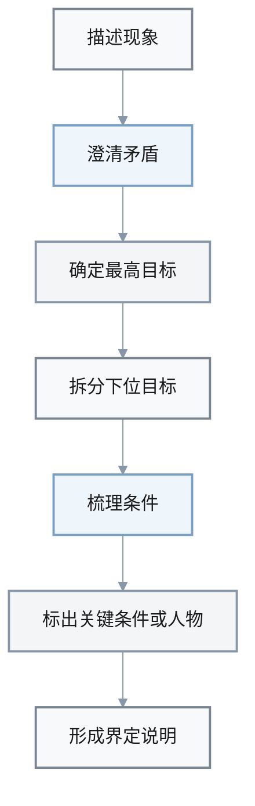
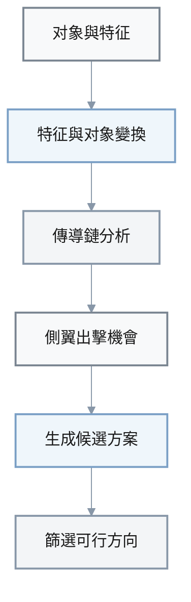
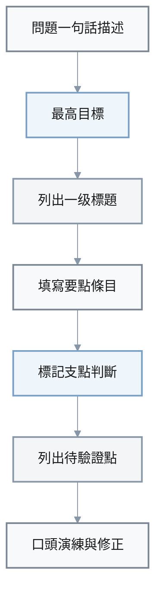
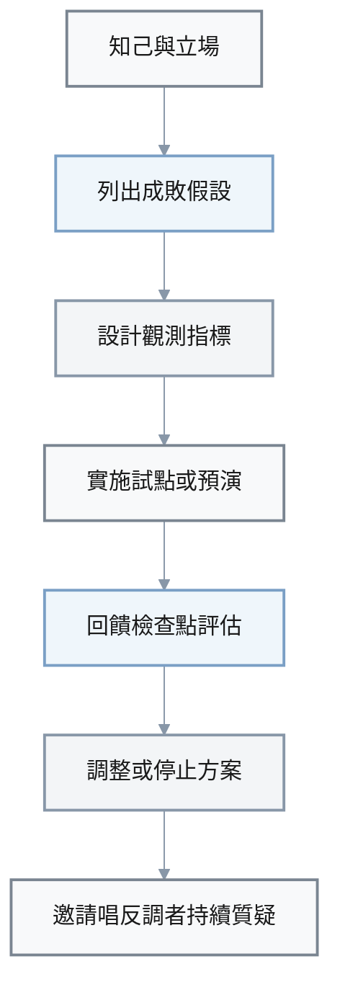

1. Q: 基于《把握分析问题的九个方面》，在面对一个复杂而又紧急的问题时，如何按书中的思路界定清楚“矛盾、目标与条件”，为后续分析打下基础？
   A: 
   - **Prerequisites**: 已掌握该问题的大致背景，有权限调取关键事实和数据。
   - **Steps**:
     1. 用一句话粗略描述当前最困扰你的现象或冲突，例如“投诉剧增”“项目进度严重滞后”。
     2. 追问：这里真正的“矛盾”是什么？是多个目标不相容，还是条件与目标冲突，或是客观矛盾尚未被重构？写下 1–2 句矛盾描述。
     3. 明确本次分析的主目标：是降低投诉、恢复进度，还是防止危机扩大？将最高目标用可观察结果描述，并尽量量化。
     4. 从最高目标向下拆分 2–4 个下位目标（例如短期止血、中期修复、长期优化），构建简单的目标层级。
     5. 列出当前主要条件：内部/外部资源与环境中，哪些是难以改变的“硬约束”，哪些可以通过创新或谈判调整？
     6. 初步标出 1–3 个你认为最关键的条件或人物（类似“诸葛亮”），作为后续分析中重点关注的关键问题。
   - **Outcome**: 形成一份包含“矛盾描述 + 目标层级 + 关键条件”的简短界定说明，为后续内部逻辑、外部联系及由来与趋向的分析提供清晰起点。

### Q1：界定矛盾、目标与条件（可视化）

| 要素 | 关注点 |
|------|--------|
| 现象 | 一句话描述当前最困扰的现象 |
| 矛盾 | 哪些目标或条件在发生冲突 |
| 最高目标 | 用可观察、可量化的结果表述 |
| 下位目标 | 止血、修复、优化等层级目标 |
| 条件 | 区分硬约束与可调整条件 |
| 关键条件/人物 | 后续分析的关键着力点 |



     1. 罗列出与问题相关的关键对象（产品、流程、角色等），为每个对象写下至少 3 个可观察特征（功能、形态、位置、时间等）。
     2. 对每个对象分别问四个问题：是否存在“一物多征”“一征多物”“一征多值”“一值多物”的可能？把所有想到的替代特征和替代对象一并写出。
     3. 绘制简单的“传导链”：当你改变其中一个特征或量值时，会通过哪些关联关系传导到其他量（例如工资提升 → 士气 → 业绩）？用箭头连线标注正向或负向影响。
     4. 寻找“蕴含关系”和“侧翼出击”机会：有哪些地方不是正面硬碰硬，而是通过控制下游环节或关键关节间接影响整体（类似洛克菲勒控制精炼与运输）？
     5. 列出 3–5 个基于特征变换、对象替换、组合销售或模块化拆分的备选方案，不必完美，只求结构上可行。
     6. 从这些方案中初步筛选 1–2 个最具可行性的方向，准备在后续分析和求证环节进一步评估。
   - **Outcome**: 得到一组源于“可拓性”的候选解法，使问题不再只有单一路径可走，为后续决策和实验提供更丰富的选择。

### Q2：运用可拓性扩展解法空间（可视化）

- **可拓性四类思路**：
  - **一物多征**：同一对象可以有多种特征视角
  - **一征多物**：同一特征可对应多个对象
  - **一征多值**：同一特征可以取多种量值
  - **一值多物**：同一量值可以出现在不同对象上

| 模块 | 关键动作 |
|------|----------|
| 对象与特征 | 列出对象及其可观察特征 |
| 特征与对象变换 | 寻找替代特征与替代对象 |
| 传导链分析 | 画出量值变化的影响路径 |
| 侧翼出击 | 找到可间接控制的下游环节 |
| 候选方案 | 组合变换并筛选可行方向 |



     1. 在纸上或文档中先写出 1 句“问题一句话描述”和 1 句“本次汇报的最高目标”。
     2. 按照九个方面，初步列出 5–7 个一级标题，例如“界定与背景”“内部逻辑与外部联系”“由来与趋向”“能力储备与约束”“方案与风险”“求证与修正计划”。
     3. 在每个一级标题下，用条目方式写出 3–5 个要点，优先写：关键事实、主要假设、重要推理链条和核心判断，而不是细节过程。
     4. 用醒目标记（如 * 或粗体）标出 2–3 个你认为最关键的支点判断，明确写出它们依赖哪些前提或数据。
     5. 在纲要末尾增加“小结与待验证点”小节，列出你尚不确定、需要在第八、九章意义上进一步求证和修正的要点。
     6. 在与团队会前，自己先按纲要口头演练一遍，检查逻辑是否连贯、是否有重要遗漏或自相矛盾之处。
   - **Outcome**: 形成一份结构清晰、支点明确的分析纲要，使团队能围绕同一结构展开讨论，并为后续复盘与改进提供可追踪的“思路轨迹”。

### Q3：复杂问题汇报纲要（可视化）

| 部分 | 内容要点 | 典型问题 |
|------|----------|----------|
| 问题与目标 | 两句话说明问题与最高目标 | 这次要解决什么、做到什么 |
| 九个方面结构 | 5–7 个一级标题覆盖关键方面 | 有没有遗漏内部、外部、由来、趋向 |
| 要点条目 | 每节 3–5 个关键要点 | 核心事实、假设、推理是否写清 |
| 支点判断 | 2–3 个支点及其前提 | 哪些判断一旦错，全局就需重写 |
| 小结与待验证点 | 列出现阶段不确定之处 | 需要在第八、九章意义上求证什么 |



     1. 先“知己”：写下你在这个方案上可能存在的立场和偏好（例如更乐观、更激进或更保守）。
     2. 列出 3–5 个最关键的成败假设，例如“用户会接受价格上调”“供应商能按时交付”。
     3. 为每个关键假设设计至少一个可观测指标或信号（数据、行为反馈、试点结果等），明确什么变化代表“支持”或“反对”该假设。
     4. 设计 1–2 个低成本、小范围的试点或预演，用于在全面铺开前收集反馈（如小批量投放、内部试运行）。
     5. 制定“回馈检查点”：在固定时间节点（如 2 周、1 月）对照指标和反馈，评估方案是否需要调整或停止。
     6. 在团队中指定 1–2 名“唱反调者”，鼓励他们从不同立场质疑方案，帮助你发现盲点和偏差。
   - **Outcome**: 建立起围绕该方案的求证与反馈闭环，使决策不再是一次性拍板，而是可以依据情报和回馈逐步修正的动态过程。

### Q4：求证与反馈闭环（可视化）

| 步骤 | 关键产出 |
|------|----------|
| 知己 | 写下个人立场與偏好 |
| 成败假设 | 梳理 3–5 个關鍵假設 |
| 指标與信號 | 明确支持或反對假設的觀測指標 |
| 試點或預演 | 小範圍實驗收集一手反饋 |
| 回馈检查点 | 固定節點按指標評估調整或停止 |
| 唱反調者 | 指定質疑角色防止自以為是 |



     1. 打开笔记工具，新建一份名为“问题分析检查表”的模板，按七步分别写出简短小标题，例如“1. 界定问题与目标”“2. 内部逻辑与外部联系”等。
     2. 在每个小标题下，填入 2–3 个提示性问题，例如“这里的矛盾是什么？”“有哪些关键条件难以改变？”“有哪些外部联系是硬约束？”等。
     3. 在实际遇到较大问题时，先克制住立刻找方案的冲动，花 10–20 分钟按检查表逐条写下要点，不追求完美，只求覆盖。
     4. 将这份填写后的检查表作为与你人沟通和开会讨论的基础材料，请同事从中指出遗漏或不同意见。
     5. 在问题处理结束后，对照实际过程和结果，简短记录“哪些步骤用得好，哪些被忽略后造成了代价”，并据此微调检查表内容。
     6. 持续在后续几个重要问题中复用和迭代这份检查表，使之逐渐成为你和团队的“默认分析习惯”。
   - **Outcome**: 一份可复用、可迭代的问题分析检查表，把抽象的七步程序具体化为日常可执行的习惯，降低在压力下遗漏关键方面的概率。

### Q5：七步程序个人检查表（可视化）

| 步驟編號 | 小標題示例 | 提示性問題示例 |
|----------|------------|----------------|
| 1 | 界定問題與目標 | 這次核心矛盾與最高目標是什麼 |
| 2 | 內部邏輯與外部联系 | 有哪些因果鏈與外部約束 |
| 3 | 由來與趨向 | 問題如何形成、正在走向哪裡 |
| 4 | 能力儲備與約束 | 我方有哪些資源與短板 |
| 5 | 方案與風險 | 候選方案及其主要風險是什麼 |
| 6 | 求證計畫 | 準備如何在小範圍驗證判斷 |
| 7 | 修正與沉澱 | 如何迭代方案並沉澱為經驗 |

```mermaid
%%{init: {
  "theme": "base",
  "themeVariables": {
    "primaryColor": "#f8f9fa",
    "primaryTextColor": "#1a1a1a",
    "primaryBorderColor": "#7a8591",
    "lineColor": "#8897a8",
    "secondaryColor": "#eff6fb",
    "tertiaryColor": "#f3f5f7"
  }
}}%%
graph TD
  A[遇到重要問題] --> B[打開問題分析檢查表]
  B --> C[按七步填寫要點]
  C --> D[與同事討論補充]
  D --> E[跟踪處理過程與結果]
  E --> F[反思並調整檢查表]
  F --> G[在後續問題中持續復用]

  style A fill:#f8f9fa,stroke:#7a8591,stroke-width:2px,color:#1a1a1a
  style B fill:#eff6fb,stroke:#7a9fc5,stroke-width:2px,color:#1a1a1a
  style C fill:#f3f5f7,stroke:#8897a8,stroke-width:2px,color:#1a1a1a
  style D fill:#f8f9fa,stroke:#7a8591,stroke-width:2px,color:#1a1a1a
  style E fill:#eff6fb,stroke:#7a9fc5,stroke-width:2px,color:#1a1a1a
  style F fill:#f3f5f7,stroke:#8897a8,stroke-width:2px,color:#1a1a1a
  style G fill:#f8f9fa,stroke:#7a8591,stroke-width:2px,color:#1a1a1a
