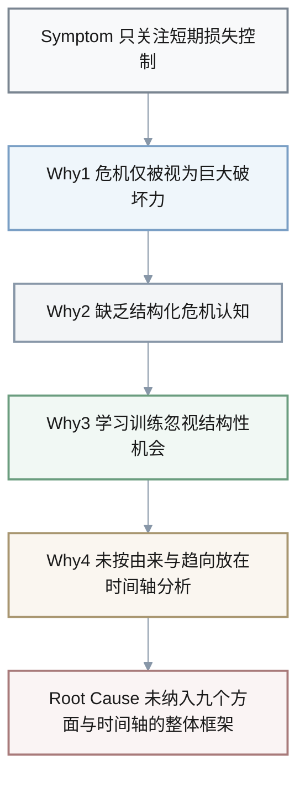
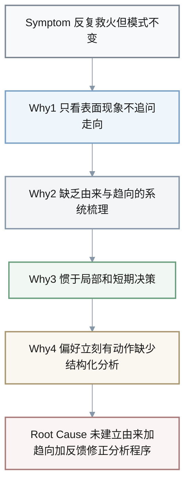
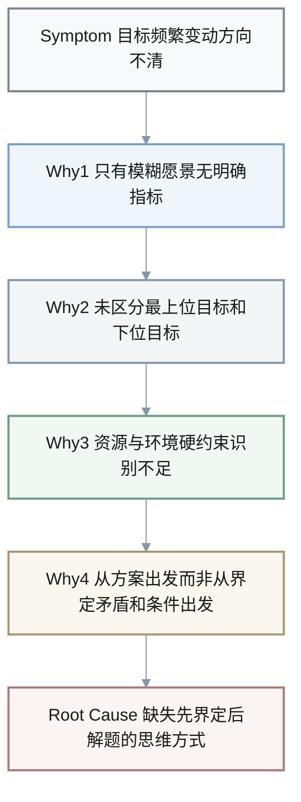
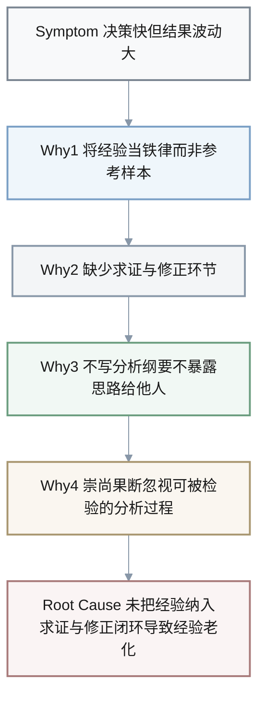
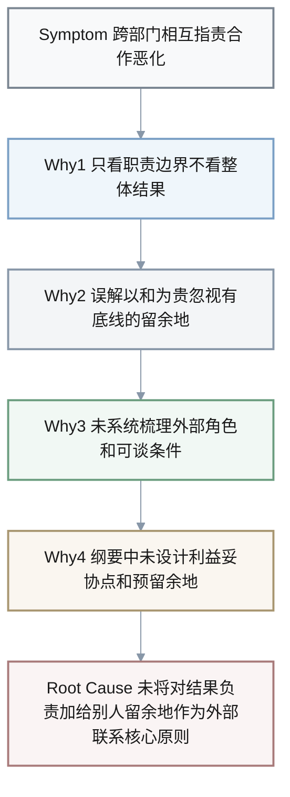

## 5-Why 总览（可视化）

| 编号 | 情境关键字 | 根本原因关键词 |
|------|------------|----------------|
| Q1 | 危机被视为纯威胁 | 缺乏系统性危机观 |
| Q2 | 反复救火 | 缺失由来加趋向加修正程序 |
| Q3 | 目标反复走样 | 未先界定目标与条件 |
| Q4 | 经验决策反复踩坑 | 经验未纳入求证与修正闭环 |
| Q5 | 跨部门互相指责 | 未以整体结果与留余地设计外部联系 |

1. Q: 在组织反复遭遇突发危机时，管理层往往只把危机当作“纯粹的威胁”，只想着尽快平息表面事件，而很少系统思考其中孕育的转机。使用 5-Why 分析，找出这一思维模式背后的根本原因。
  A:
  - **Symptom**: 面对危机时，组织只关注短期损失控制（舆论、赔偿、面子），几乎不讨论如何在“危”中寻找“机”。
  - **Why 1**: 因为决策者把危机仅仅理解为“突发性的巨大破坏力”，而忽略了危机同时也是系统发生重大转折的关键时刻。
  - **Why 2**: 因为他们缺乏对危机特征的结构化认知——只看到突发性、紧急性、破坏性，却没有系统理解其“传导性”和“机遇性”。
  - **Why 3**: 因为在平时的学习与训练中，组织更重视日常管理技巧，而较少基于案例反思“在何种结构性变化中可能孕育机会”。
  - **Why 4**: 因为缺乏把问题“按由来与趋向”放在时间轴上分析的习惯，只在当下片段中做应急判断。
  - **Root Cause**: 组织没有把“危机”纳入九个方面与时间轴的整体框架来理解，缺乏系统性危机观（既看危也看机），导致一遇危机就只能被动防御，难以主动利用转折点。

**可视化：Q1 - 危机思维模式的 5-Why 因果链**

1. Q: 很多团队在同一类问题上反复“救火”，问题短期被压下去，却很快以另一种形式再次出现。使用 5-Why 分析，追溯这种“治标不治本”的根源。
   A: 
   - **Symptom**: 团队不断为类似投诉、事故或业绩波动加班处理，但几年下来问题模式几乎没有变化。
   - **Why 1**: 因为每次处理时，只关注眼前的表面现象（显部），很少追问“这个问题从哪里来、如果不干预会走向哪里”。
   - **Why 2**: 因为缺乏系统梳理问题由来与趋向的步骤，没有把长期累积的小偏差、结构性缺陷与偶发事件区分开来。
   - **Why 3**: 因为团队惯于在压力下做局部、短期决策，而没有把九个方面（尤其是“由来、趋向、能力储备、修正”）作为固定检查清单。
   - **Why 4**: 因为组织文化中更偏好“立刻有动作”的姿态，而对慢速、结构化的分析缺少耐心和激励。
   - **Root Cause**: 团队没有建立基于“由来 + 趋向 + 反馈修正”的问题分析程序，导致决策长期停留在对症状的快速反应上，而缺乏针对结构性根源的持续修正机制。

**可视化：Q2 - 反复救火的 5-Why 因果链**

1. Q: 在许多项目中，目标一开始听起来宏大而美好，但在执行过程中不断走样，最终既没达成预期效果，又耗尽团队资源。使用 5-Why 分析，找出“目标与条件界定不清”的深层根源。
   A: 
   - **Symptom**: 项目目标频繁变动，团队在执行中不断“改方向”，最终无法判断到底算不算成功。
   - **Why 1**: 因为一开始只提出了模糊的愿景（例如“提升营业额”），没有像书中示例那样逐步细化到明确的主题、对象和量化指标。
   - **Why 2**: 因为没有清晰区分最上位目标与下位目标，也没有将目标层次化、量化，缺乏“先后顺序”和优先级判断依据。
   - **Why 3**: 因为在界定阶段，对资源条件和环境条件的“硬约束”识别不足，既没找清关键问题，也没有用“小力撬动大局”的思路筛选切入点。
   - **Why 4**: 因为决策者习惯从方案出发，而不是从“界定矛盾、目标与条件”这个起点出发。
   - **Root Cause**: 缺失第一章强调的“先界定后解题”思维方式，目标与条件没有被作为独立环节认真界定，导致后续所有分析和行动都建立在松散乃至错误的目标框架之上。

**可视化：Q3 - 目标走样的 5-Why 因果链**

1. Q: 有些领导自认为“经验丰富”，在复杂环境中总是凭直觉迅速拍板，但事后复盘发现决策质量并不稳定，甚至经常踩到同样的坑。使用 5-Why 分析，从书中的观点出发，追溯这种现象的根源。
   A: 
   - **Symptom**: 决策速度很快，但结果波动大，同类错误反复发生；复盘时常以“经验如此”来解释。
   - **Why 1**: 因为决策者把过往经验当作“铁律”，而不是当作需要不断校验的“参考样本”。
   - **Why 2**: 因为缺少第八、九章所强调的“求证与修正”环节，没有主动设计情报、反馈和小步试验来检验经验是否仍然适用。
   - **Why 3**: 因为没有形成写出分析纲要、暴露思路给他人讨论的习惯，导致错误模式难以及时被他人指出。
   - **Why 4**: 因为组织文化更重视“果断”而非“可被检验的分析过程”，使得经验难以在集体智慧中被优化。
   - **Root Cause**: 忽视了“经验可以用来修正，但不能替代思考”的原则，没有把经验纳入九个方面和七步程序中的求证与修正闭环，导致经验不断老化却得不到系统更新。

**可视化：Q4 - 经验决策反复踩坑的 5-Why 因果链**

1. Q: 很多团队在面对跨部门问题时，往往陷入相互指责，认为“都是对方的问题”，合作关系日益恶化。使用 5-Why 分析，依据本书关于外部联系与“给别人留余地”的讨论，寻找这一模式的根因。
   A: 
   - **Symptom**: 跨部门协作时，问题一出现，各方首先划清界限、推诿责任，谈判气氛紧张，长期合作意愿下降。
   - **Why 1**: 因为当事人更关注“职责边界”而不是“对整体结果负责”，缺乏对问题外部联系的整体视角。
   - **Why 2**: 因为没有理解“以和为贵”并不等于无原则退让，而是要在坚持底线前提下给对方留余地，为未来合作保留空间。
   - **Why 3**: 因为在问题界定阶段，没有把相关外部角色、上下游关系、可谈判与不可谈判的条件系统梳理出来，只是凭情绪临场反应。
   - **Why 4**: 因为缺乏在纲要中显式设计“各方利益、可能妥协点和预留余地”的做法，导致每次协商都像临时搏斗，而不是基于结构化准备。
   - **Root Cause**: 团队没有把“对结果负责 + 给别人留余地”作为分析外部联系的核心原则纳入日常问题分析与沟通设计中，外部联系被简化为短视的博弈，长期看破坏了系统层面的合作基础。

**可视化：Q5 - 跨部门互相指责的 5-Why 因果链**

