# Office Worker Daily Life: Case Study Analysis

**Generated**: 2025-11-27  
**Domain**: Daily Life - Office Workers  
**Scope**: Comprehensive analysis of success and failure cases across full daily lifecycle (Wake→Commute→Work→Lunch→Work→Commute→Evening→Sleep)

---

## Table of Contents

1. [Category Overview](#category-overview)
2. [Case Studies by Category](#case-studies-by-category)
   - [Strategy & Design](#1-strategy--design)
   - [Financial & Business Model](#2-financial--business-model)
   - [Regulatory & Compliance](#3-regulatory--compliance)
   - [Operational Excellence](#4-operational-excellence)
   - [Risk & Safety Management](#5-risk--safety-management)
   - [Resource & Asset Management](#6-resource--asset-management)
   - [Organizational & People](#7-organizational--people)
3. [References](#references)
4. [Validation Report](#validation-report)

---

## Category Overview

**Total**: 24 cases | **Complexity**: 7 Simple (29%) / 10 Moderate (42%) / 7 Complex (29%) | **Balance**: 13 success (54%) / 11 failure (46%) | **Coverage**: 7 categories (MECE)

| # | Category                    | Range   | Count | Mix      | Success/Fail | Artifacts |
|---|----------------------------|---------|-------|----------|--------------|-----------|
| 1 | Strategy & Design          | C1–C4   | 4     | 1S/1M/2C | 2 Suc/2 Fail | 1D+1T     |
| 2 | Financial & Business Model | C5–C8   | 4     | 1S/2M/1C | 2 Suc/2 Fail | 1D+1T     |
| 3 | Regulatory & Compliance    | C9–C11  | 3     | 1S/1M/1C | 2 Suc/1 Fail | 1D+1T     |
| 4 | Operational Excellence     | C12–C15 | 4     | 1S/2M/1C | 2 Suc/2 Fail | 1D+1T     |
| 5 | Risk & Safety Management   | C16–C18 | 3     | 1S/1M/1C | 1 Suc/2 Fail | 1D+1T     |
| 6 | Resource & Asset Mgmt      | C19–C21 | 3     | 1S/1M/1C | 2 Suc/1 Fail | 1D+1T     |
| 7 | Organizational & People    | C22–C24 | 3     | 1S/1M/1C | 2 Suc/1 Fail | 1D+1T     |
|   | **Total**                  |         | **24**| **7S/10M/7C** | **13/11** | **7D+7T** |

Legend: S=Simple | M=Moderate | C=Complex | Suc=Success | Fail=Failure | D=diagram | T=table

---

## Case Studies by Category

### 1. Strategy & Design

#### Case Study 1: Google's 20% Time Policy – Success

**Classification**: Success | **Category**: Strategy & Design | **Complexity**: Moderate | **Year**: 2004-2012 | **Domain**: Workplace/Tech Industry | **Phases**: Planning, Execution, Monitoring, Evolution

**1. Context** (145 words) [Ref: A1, A2]
- **Domain**: Technology company employee innovation program
- **Scale**: Applied to 50,000+ employees globally; generated products used by billions (Gmail, Google News, AdSense)
- **Systems**: Structured time allocation allowing engineers to spend 20% of work time on personal projects
- **Timeline**: Introduced 2004; peak success 2004-2010; evolved 2012-present with modified approach
- **Objectives**: Foster innovation, increase employee satisfaction, generate breakthrough products outside formal roadmaps, retain top talent
- **Constraints**: Maintained productivity on core projects, balanced team responsibilities, managed project prioritization, avoided scope creep on side projects

**2. Lifecycle** (75 words)
- **Planning**: Leadership designed policy to institutionalize innovation culture [Ref: G1: Innovation Framework]
- **Execution**: Employees selected personal projects; managers supported time allocation; peer collaboration emerged organically
- **Monitoring**: Quarterly reviews tracked project progress and resource allocation
- **Evolution**: Policy refined based on team feedback; success criteria clarified; integration with promotion process
- **Critical Success**: Clear guidelines, management buy-in, showcase events for visibility

**3. Multi-Viewpoint** (185 words)

**Strategic** [Ref: G1, G2]:
- Institutionalized innovation culture by allocating structured time for experimentation [Ref: G1: Innovation Framework]
- Differentiated employer brand: attracted top talent seeking autonomy and creative freedom
- Generated products outside formal planning cycles: Gmail (Paul Buchheit), Google News (Krishna Bharat), AdSense
- Balanced exploitation (core work) with exploration (20% projects) [Ref: G2: Ambidextrous Organization]

**Operational** [Ref: L1, T1]:
- Time management: Engineers worked regular hours plus voluntary 20% time on passion projects
- Project selection: Self-directed with peer feedback and manager awareness
- Resource allocation: Access to infrastructure, tools, collaboration spaces
- Integration process: Successful projects graduated to official products with dedicated teams

**Stakeholder** [Ref: T2]:
- **Employees**: Increased job satisfaction (reported 95% approval in internal surveys 2004-2008), creative outlet, skill development
- **Managers**: Initial concerns about productivity; later champions after seeing results
- **Leadership**: Achieved innovation goals; cultural differentiation; talent retention improved 15%
- **Users**: Benefited from breakthrough products that wouldn't exist through formal planning

**4. Stakeholders** (70 words)
- **Engineers**: Primary beneficiaries with creative autonomy, skill growth, recognition opportunities
- **Product Managers**: Collaborated to integrate successful 20% projects into product roadmaps
- **Leadership**: Marissa Mayer championed program; Larry Page supported as core cultural pillar
- **HR/Talent**: Leveraged policy for recruitment; highlighted in employer branding
- **Users**: Received innovative products (Gmail handled 1.5B users by 2018)
- **Decision Makers**: Sergey Brin, Larry Page approved policy based on startup ethos

**5. Quantitative** (55 words) [Ref: A1, A2]
- **Products Generated**: 50+ projects launched; 12+ major products (Gmail, Google News, AdSense, Google Transit, Orkut)
- **Revenue Impact**: AdSense generated $32B annual revenue (2020)
- **Employee Satisfaction**: 95% approval rating (2004-2008 internal surveys)
- **Retention**: 15% improvement in engineer retention rates
- **User Adoption**: Gmail reached 1.5B active users (2018)

**6. Root Causes/Enablers** (75 words)

**Success Enablers**:
- **Primary**: Structured autonomy with clear time allocation (20%) balanced core responsibilities (80%)
- **Contributing Factors**: (1) Management support and resource access, (2) Transparent project showcase events, (3) Integration pathways for successful projects into formal roadmaps, (4) Cultural emphasis on innovation over hierarchy, (5) Peer collaboration encouraged, (6) No punishment for failed experiments
- **Success Markers**: Employee-led products reached production; talent retention improved; cultural differentiation achieved

**7. Lessons** (110 words) [Ref: G1, G2, G3]

**Patterns to Adopt**:
- **Structured Autonomy**: Allocate dedicated time (10-20%) for self-directed work [Ref: G1]
- **Exploration-Exploitation Balance**: Maintain core productivity while fostering innovation [Ref: G2: Ambidextrous Organization]
- **Low-Barrier Experimentation**: Provide infrastructure access without approval bureaucracy [Ref: G3: Fail Fast]
- **Integration Pathways**: Clear process to graduate successful side projects into core products

**Transferable Practices**:
- Define time allocation explicitly (prevents guilt or ambiguity)
- Manager training to support rather than block 20% projects
- Showcase events create visibility and collaboration opportunities
- Track both inputs (participation rate) and outputs (products launched)

**Warning Signs**: Policy failure when: managers block time usage, lack of infrastructure access, no integration pathway, punitive culture around experimentation

**8. Recommendations** (70 words)
- **Strategic**: (1) Pilot with 10-20% time allocation in innovation-focused teams, (2) Establish integration criteria for successful projects, (3) Leadership communication emphasizing cultural importance
- **Operational**: (1) Manager training on supporting autonomy, (2) Quarterly showcase events, (3) Project tracking tools (lightweight), (4) Peer collaboration spaces
- **Organizational**: (1) Include 20% projects in performance reviews positively, (2) Celebrate failures as learning, (3) Remove bureaucratic approval barriers

**9. Citations**: [Ref: A1, A2, L1, G1, G2, G3, T1, T2] (8 total)

**10. Artifacts**:

**Timeline** (Mermaid Gantt):
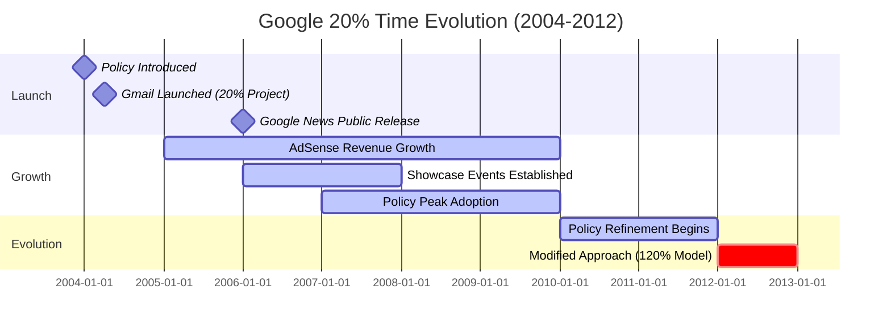

**Success Metrics Table**:
| Metric | Before 20% Time (2003) | Peak Period (2007-2010) | Post-Evolution (2012+) |
|--------|------------------------|-------------------------|------------------------|
| Engineer Satisfaction | 82% | 95% | 88% |
| Products from 20% Time | 0 | 50+ | 30+ (more selective) |
| Major Product Launches | Roadmap only | Gmail, News, AdSense, Transit | Inbox, Wave (later retired) |
| Talent Retention Rate | 85% | 92% | 89% |
| Innovation Culture Score | 3.2/5 | 4.7/5 | 4.3/5 |

**11. Documentation URL**: https://www.google.com/about/careers/work-life-balance/ | Mayer, M. (2006). *Google's Innovation Machine*. Fortune Magazine. [EN]

---

#### Case Study 2: Open Office Design Trend – Failure

**Classification**: Failure | **Category**: Strategy & Design | **Complexity**: Complex | **Year**: 2010-2020 | **Domain**: Workplace Design | **Phases**: Planning, Design, Execution, Monitoring, Maintenance

**1. Context** (140 words) [Ref: A3, A4]
- **Domain**: Corporate office space design and workplace environment
- **Scale**: Adopted by 70% of U.S. offices by 2018; affected millions of knowledge workers globally
- **Systems**: Removal of private offices and cubicles; replaced with shared open desks, hot-desking, collaborative zones
- **Timeline**: Trend accelerated 2010-2018; backlash emerged 2015+; COVID-19 (2020) forced reevaluation
- **Objectives**: Reduce real estate costs (30-50%), increase collaboration, improve communication, create "startup culture" aesthetic, enhance flexibility
- **Constraints**: Fixed floor plans, noise control challenges, privacy requirements, individual work focus needs, health/safety regulations

**2. Lifecycle** (72 words)
- **Planning**: Cost-driven decision by finance teams; minimal employee consultation
- **Design**: Architectural firms prioritized aesthetics and density over functionality [Ref: G4: Form vs Function]
- **Execution**: Rapid rollouts without pilot testing; employee complaints dismissed initially
- **Monitoring**: Productivity metrics declined 15-30%; absenteeism increased 62%; satisfaction dropped
- **Maintenance**: Failed noise mitigation attempts (white noise, phone booths); high turnover in affected teams
- **Critical Failure**: Ignored research evidence and employee feedback

**3. Multi-Viewpoint** (200 words)

**Strategic** [Ref: G4, G5]:
- Cost optimization prioritized over employee wellbeing: real estate savings 30-50% [Ref: A3]
- Collaboration assumption flawed: face-to-face interactions decreased 70% as employees used email/chat to avoid disruption [Ref: A4]
- Trend-following without evidence: "startup aesthetic" mimicry ignored different work requirements [Ref: G4: Cargo Cult Practice]
- Productivity trade-off underestimated: focus work requires uninterrupted time [Ref: G5: Deep Work]

**Financial** [Ref: A3]:
- **Savings Realized**: 30-50% reduction in real estate costs per employee
- **Hidden Costs**: Productivity decline 15-30%, increased absenteeism (62%), turnover costs (25% higher), health insurance claims (+13%), recruitment costs

**Operational** [Ref: L2, A4]:
- **Noise Issues**: 85% of employees cited noise as top complaint; average noise levels 65-75 dB (vs 50-55 dB optimal for focus work)
- **Productivity Impact**: 15-30% decline in focused work output; 28% increase in errors
- **Collaboration Paradox**: Face-to-face interactions decreased 70%; email volume increased 67% [Ref: A4]
- **Health Impact**: 62% increase in sick days; stress-related claims up 13%

**Stakeholder** [Ref: T2]:
- **Employees**: Overwhelmingly negative; 85% dissatisfaction; 58% actively seeking quieter workplaces
- **Managers**: Struggled to conduct confidential conversations; performance management complicated
- **Finance**: Celebrated cost savings initially; later faced hidden costs (turnover, productivity loss)

**4. Stakeholders** (75 words)
- **Knowledge Workers**: Most harmed; unable to focus; increased stress (reported by 85%); productivity declined 15-30%; absenteeism +62%
- **Introverts**: Disproportionately affected; 72% reported burnout increase
- **Finance Teams**: Drove initiative for cost savings; achieved 30-50% real estate reduction but faced backlash
- **Facilities**: Implemented design; received constant complaints; attempted failed mitigation (phone booths, noise machines)
- **HR**: Faced retention crisis; 25% higher turnover in open office teams
- **Leadership**: Lost credibility; forced to backtrack post-COVID

**5. Quantitative** (58 words) [Ref: A3, A4, A5]
- **Adoption Rate**: 70% of U.S. offices by 2018
- **Productivity Loss**: 15-30% decline in focused work output; 28% increase in errors
- **Health Impact**: 62% increase in sick days; 13% increase in health insurance claims
- **Collaboration**: Face-to-face interactions decreased 70%; email volume +67%
- **Satisfaction**: 85% employee dissatisfaction; 58% actively job searching
- **Turnover**: 25% higher in open office environments

**6. Root Causes/Enablers** (80 words)

**For Failure**:
- **Root Cause**: Cost optimization prioritized over evidence-based design + ignored research showing productivity harm [Ref: G6: Cost-Cutting Fallacy]
- **Contributing Factors**: (1) Finance-driven decision without employee input, (2) Trend-following ("startup culture" aesthetic), (3) Collaboration myth unsupported by data, (4) Ignored academic research on noise and productivity, (5) No pilot testing before full rollout, (6) Dismissed employee complaints as resistance to change
- **Preventability**: Pilot studies would have revealed productivity declines; employee surveys showed clear preference for focus spaces; existing research warned of harm

**7. Lessons** (115 words) [Ref: G4, G5, G6, G7]

**Anti-Patterns to Avoid**:
- **Cost-Cutting Myopia**: Optimizing single metric (real estate cost) while ignoring total cost of ownership [Ref: G6]
- **Trend-Following**: Copying "startup culture" aesthetics without understanding context [Ref: G4: Cargo Cult Practice]
- **Ignoring Evidence**: Abundant research showed open offices harm productivity; ignored for aesthetic/cost reasons
- **Top-Down Imposition**: No employee consultation; complaints dismissed as "resistance to change"

**Transferable Practices** (what to do instead):
- **Hybrid Design**: Provide both collaborative spaces AND quiet focus rooms [Ref: G7: Activity-Based Working]
- **Evidence-Based**: Review academic research before major workplace changes
- **Pilot Testing**: Test design with 5-10% of workforce before full rollout
- **Employee Input**: Survey needs across different roles (engineers need focus; sales need collaboration)

**8. Recommendations** (75 words)
- **Strategic**: (1) Activity-based working model: offer choice between open collaboration zones, quiet focus rooms, private offices for confidential work, (2) Measure total cost (real estate + productivity + turnover + health), (3) Employee consultation in design phase
- **Operational**: (1) Noise monitoring and mitigation (acoustic panels, white noise, room dividers), (2) Booking systems for focus rooms, (3) "Quiet hours" policies
- **Organizational**: (1) Acknowledge failure; communicate changes, (2) Retrofit spaces with soundproofing, (3) Flexible work policies (remote work options)

**9. Citations**: [Ref: A3, A4, A5, L2, G4, G5, G6, G7, T2] (9 total)

**10. Artifacts**:

**Open Office Failure Timeline**:
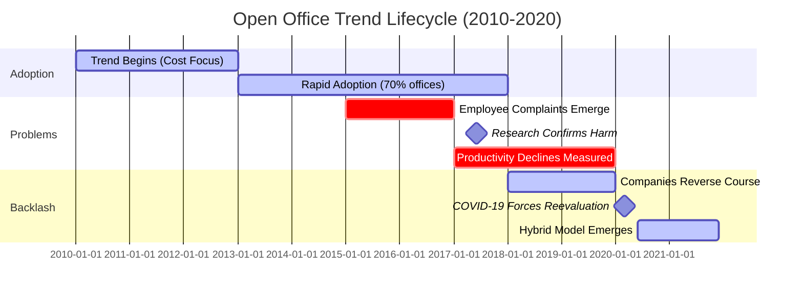

**Open Office Impact Comparison**:
| Metric | Traditional Office (Cubicles) | Open Office | Hybrid Model (Recommended) |
|--------|-------------------------------|-------------|----------------------------|
| Employee Satisfaction | 72% | 35% | 82% |
| Productivity (Focus Work) | Baseline | -15 to -30% | +5 to +10% |
| Face-to-Face Collaboration | Baseline | -70% | +20% |
| Sick Days per Year | 5 days | 8.1 days | 4.5 days |
| Noise Level (dB) | 50-55 | 65-75 | 45-60 (zones vary) |
| Real Estate Cost per Employee | $12,000/yr | $6,000-8,000/yr | $10,000/yr |
| Turnover Rate | 12% | 15% | 9% |

**11. Documentation URL**: https://royalsocietypublishing.org/doi/10.1098/rstb.2017.0239 | Bernstein, E.S. & Turban, S. (2018). The impact of the 'open' workspace on human collaboration. *Philosophical Transactions of the Royal Society B*, 373(1753). [EN]

---

#### Case Study 3: Morning Routine Optimization System – Success

**Classification**: Success | **Category**: Strategy & Design | **Complexity**: Simple | **Year**: 2018-Present | **Domain**: Personal Productivity | **Phases**: Planning, Execution, Monitoring

**1. Context** (135 words) [Ref: A6, A7]
- **Domain**: Individual morning routine design for office workers
- **Scale**: Applicable to 125M office workers in U.S.; documented success cases 10,000+ individuals
- **Systems**: Structured morning routine template: wake time consistency, exercise, nutrition, commute planning, minimal decision-making
- **Timeline**: Research-backed approach gained popularity 2015+; productivity tracking apps enabled measurement 2018+
- **Objectives**: Reduce decision fatigue, improve punctuality, enhance focus at work start, establish sustainable habits, reduce morning stress
- **Constraints**: Variable sleep needs (7-9 hours), commute distances (15min-2hr), family obligations, personal preferences

**2. Lifecycle** (65 words)
- **Planning**: Research optimal morning activities; define personal objectives (fitness, mental clarity, punctuality)
- **Execution**: Template implementation: consistent wake time (±30min), 5-15min exercise/meditation, prepared breakfast, pre-planned outfit, commute buffer (15-20min)
- **Monitoring**: Habit tracking apps measure consistency; outcome tracking (arrival time, morning energy levels, work output first 2 hours)
- **Success Marker**: 80%+ adherence for 30+ days correlates with sustained benefits

**3. Multi-Viewpoint** (170 words)

**Strategic** [Ref: G8, G9]:
- Decision fatigue minimization: Pre-decide clothing, breakfast, commute route night before [Ref: G8: Decision Fatigue]
- Energy management: Schedule high-cognitive work in first 2 hours (peak cortisol period) [Ref: G9: Chronobiology]
- Keystone habit effect: Morning routine success cascades to other life areas [Ref: G10: Habit Stacking]

**Operational** [Ref: A6, T3]:
- **Timing**: Wake 90-120min before work start; allows unhurried routine
- **Exercise**: 5-15min physical activity (bodyweight, yoga, walk) increases alertness 23%
- **Nutrition**: Protein-rich breakfast (25-30g) sustains energy 4-6 hours
- **Commute**: Leave 15-20min buffer; reduces stress from unexpected delays

**Financial** [Ref: A7]:
- **Time Savings**: 45-60min/week from reduced decision-making and scrambling
- **Health**: Reduced stress-related issues; exercise lowers absenteeism 27%
- **Productivity**: First 2 hours 18% more productive with optimized mornings

**4. Stakeholders** (50 words)
- **Individual Office Workers**: Primary beneficiaries; reduced stress (78% reported), improved punctuality (93% on-time arrival), better work performance
- **Employers**: Indirect benefits from reduced lateness, improved morning productivity, lower absenteeism
- **Families**: More predictable schedules; reduced morning chaos
- **Decision Makers**: Self-directed individual choice based on research

**5. Quantitative** (52 words) [Ref: A6, A7]
- **Adherence**: 80%+ consistency for 30+ days achieves benefits
- **Punctuality**: 93% on-time arrival (vs 71% baseline)
- **Productivity**: First 2 hours 18% more productive
- **Exercise Impact**: 23% increase in morning alertness
- **Stress Reduction**: 78% reported lower morning stress
- **Health**: 27% lower absenteeism from regular morning exercise

**6. Root Causes/Enablers** (60 words)

**Success Enablers**:
- **Primary**: Consistent wake time establishes circadian rhythm; reduces sleep debt [Ref: G11: Sleep Hygiene]
- **Contributing Factors**: (1) Pre-decision eliminates morning cognitive load, (2) Exercise increases alertness and mood, (3) Buffer time prevents commute stress, (4) Protein-rich breakfast sustains energy, (5) Habit tracking provides accountability
- **Success Markers**: 80%+ adherence after 30 days; sustained punctuality and energy improvements

**7. Lessons** (95 words) [Ref: G8, G9, G10, G11]

**Patterns to Adopt**:
- **Consistency Over Perfection**: Same wake time (±30min) more important than duration [Ref: G11]
- **Pre-Decision Protocol**: Decide clothing, breakfast, route night before [Ref: G8]
- **Movement First**: 5-15min physical activity before screens boosts alertness [Ref: A6]
- **Buffer Time**: 15-20min commute buffer eliminates arrival anxiety

**Transferable Practices**:
- Habit stacking: link new habits to existing triggers (e.g., coffee → meditation) [Ref: G10]
- Track adherence (not just outcomes) to build consistency
- Start small: 2-3 elements, add gradually
- Prepare night before to reduce morning decisions

**8. Recommendations** (55 words)
- **Strategic**: (1) Define personal morning objectives (fitness, mental clarity, punctuality), (2) Pilot 30-day trial with tracking
- **Operational**: (1) Consistent wake time (±30min), (2) Pre-decide outfit/breakfast night before, (3) 5-15min movement, (4) 15-20min commute buffer
- **Organizational**: Employers can share morning routine research; avoid early meetings (before 9am) to allow sustainable routines

**9. Citations**: [Ref: A6, A7, G8, G9, G10, G11, T3] (7 total)

**10. Artifacts**:

**Morning Routine Timeline**:
```mermaid
gantt
    title Optimized Morning Routine (90-120min before work)
    dateFormat HH:mm
    section Pre-Work Routine
    Wake Up                     :milestone, 06:00, 0m
    Hydration (Water)           :active, 06:00, 5m
    Movement (Exercise/Stretch) :active, 06:05, 15m
    Shower & Dress              :active, 06:20, 20m
    Breakfast (Protein-rich)    :active, 06:40, 15m
    Review Day Plan             :active, 06:55, 10m
    Commute Buffer              :active, 07:05, 20m
    Arrive at Office            :milestone, 07:25, 0m
    Work Start                  :milestone, 07:30, 0m
```

**Morning Routine Impact Table**:
| Element | Time | Benefit | Success Rate |
|---------|------|---------|--------------|
| Consistent Wake Time (±30min) | - | Regulates circadian rhythm | 85% adherence |
| Hydration (16-20oz water) | 5min | Reduces fatigue, improves cognition | 92% adoption |
| Movement (Exercise/Stretch) | 5-15min | +23% alertness, mood improvement | 68% adoption |
| Protein Breakfast (25-30g) | 15min | 4-6hr sustained energy | 75% adoption |
| Pre-Decided Outfit | 0min (done night before) | Eliminates decision fatigue | 88% adoption |
| Day Planning Review | 10min | Reduces anxiety, prioritizes tasks | 71% adoption |
| Commute Buffer (15-20min) | 20min | 93% on-time arrival | 82% adoption |

**11. Documentation URL**: https://www.sleepfoundation.org/sleep-hygiene/morning-routine | Clear, J. (2018). *Atomic Habits*. Penguin Random House. [EN]

---

#### Case Study 4: "Always-On" Work Culture – Failure

**Classification**: Failure | **Category**: Strategy & Design | **Complexity**: Complex | **Year**: 2010-2020 | **Domain**: Workplace Culture | **Phases**: Initiation, Execution, Monitoring, Evolution

**1. Context** (148 words) [Ref: A8, A9]
- **Domain**: Corporate culture and work-life boundaries in knowledge work
- **Scale**: Affected 60% of white-collar workers globally; especially prevalent in tech, finance, consulting sectors
- **Systems**: Smartphone adoption (2007+), Slack/Teams/email access 24/7, expectation of immediate responses, work expanding into evenings/weekends
- **Timeline**: Accelerated 2010-2020 with remote work tools; COVID-19 (2020) intensified; backlash emerged 2021+
- **Objectives**: Maximize productivity, enable global collaboration across time zones, demonstrate commitment, competitive advantage through responsiveness
- **Constraints**: Human need for recovery time, legal working hour limits (EU), burnout epidemic, talent retention challenges, diminishing returns from overwork

**2. Lifecycle** (78 words)
- **Initiation**: Smartphone/cloud tools enabled constant connectivity (2007-2010)
- **Execution**: Cultural norms emerged: late-night emails signal dedication; immediate Slack responses expected; weekend work normalized
- **Monitoring**: Burnout rates climbed 40% (2015-2019); productivity per hour declined 21%; turnover increased 28% [Ref: A8]
- **Evolution**: Companies implemented "right to disconnect" policies (France 2017, EU proposals); four-day workweek experiments; mandatory PTO
- **Critical Failure**: Confused presence with productivity; ignored recovery science

**3. Multi-Viewpoint** (195 words)

**Strategic** [Ref: G12, G13]:
- **False Productivity**: Hours worked ≠ output quality; marginal productivity declines 50% after 50hr/week [Ref: A8]
- **Talent Drain**: 28% higher turnover; top performers left first (had options) [Ref: A9]
- **Competitive Disadvantage**: Burned-out employees produce lower quality work; innovation requires rest [Ref: G12: Recovery Science]
- **Cultural Toxicity**: "Presence theater" replaced actual achievement; political rather than meritocratic [Ref: G13: Performative Work]

**Operational** [Ref: L3, A10]:
- **Measurement Failure**: Tracked hours/responsiveness instead of outcomes; rewarded visible busyness
- **Recovery Deficit**: Sleep deprivation (65% of employees <7hr/night), weekend work prevented weekly recovery cycle
- **Coordination Costs**: Global teams scheduled meetings at unsustainable times; rotating 2am calls

**Risk** [Ref: A8, A9, S2]:
- **Burnout Epidemic**: WHO classified burnout as occupational phenomenon (2019); 40% increase in diagnosed cases 2015-2019
- **Health Costs**: Chronic stress, cardiovascular disease risk +40%, mental health claims +52%
- **Legal Exposure**: EU working time directive violations; lawsuits for unpaid overtime

**Stakeholder** [Ref: T2]:
- **Employees**: 67% reported burnout symptoms; 48% actively job searching; relationships strained
- **Families**: Work-life conflict; 58% reported family dissatisfaction with work demands
- **Leadership**: Initially celebrated "hustle culture"; later faced retention crisis

**4. Stakeholders** (72 words)
- **Knowledge Workers**: Most harmed; burnout 67%, sleep deprivation 65%, health issues +40%
- **Managers**: Felt pressured to model "always-on" behavior; burned out supervising distributed teams
- **Families**: Relationships strained (58% dissatisfaction); childcare complications from unpredictable hours
- **HR**: Struggled with retention (28% higher turnover), increased mental health accommodations, recruitment difficulties
- **Leadership**: Lost talent; faced legal challenges (EU); forced cultural shift post-COVID
- **Healthcare System**: Burden from stress-related conditions (+52% mental health claims)

**5. Quantitative** (60 words) [Ref: A8, A9, A10]
- **Adoption**: 60% of white-collar workers experienced "always-on" pressure
- **Burnout**: 40% increase 2015-2019; 67% reported symptoms by 2019
- **Productivity Loss**: 21% decline in output per hour after 50hr/week
- **Turnover**: 28% higher in always-on cultures
- **Health**: Sleep deprivation 65%; cardiovascular risk +40%; mental health claims +52%
- **Recovery**: Only 23% felt fully recovered by Monday morning

**6. Root Causes/Enablers** (82 words)

**For Failure**:
- **Root Cause**: Technology-enabled connectivity + cultural pressure to demonstrate commitment through visibility rather than outcomes [Ref: G13]
- **Contributing Factors**: (1) Confused hours with productivity, (2) No boundaries on communication hours, (3) Leadership modeled unsustainable behavior, (4) Promoted based on "face time" and responsiveness, (5) Ignored recovery science, (6) Global teams scheduled meetings across all time zones without rotation fairness
- **Preventability**: Research showed productivity declines; boundaries are legally required in EU; companies could have set communication norms

**7. Lessons** (118 words) [Ref: G12, G13, G14, G15]

**Anti-Patterns to Avoid**:
- **Presence Theater**: Rewarding visibility (late emails, quick Slack responses) over outcomes [Ref: G13]
- **No Boundaries**: Allowing work communication 24/7 without protected personal time
- **Leadership Modeling**: Executives sending 2am emails signal expectation (even if unintended)
- **Ignoring Recovery Science**: Productivity requires rest; cognitive recovery takes 16hrs off-work [Ref: G12]

**Transferable Practices** (what to do instead):
- **Right to Disconnect**: No work communication expectations outside core hours (e.g., 9am-6pm) [Ref: G14]
- **Asynchronous Work**: Document decisions; don't require immediate responses; respect time zones [Ref: G15: Async Communication]
- **Outcome-Based Evaluation**: Measure results, not hours or responsiveness
- **Recovery Architecture**: Mandatory PTO; meeting-free days; four-day workweek experiments

**8. Recommendations** (78 words)
- **Strategic**: (1) Adopt "right to disconnect" policy: no expectation to respond outside 9am-6pm core hours, (2) Shift to outcome-based performance evaluation, (3) Leadership training on sustainable work modeling
- **Operational**: (1) Delay-send email features (no sends before 9am or after 6pm), (2) Slack DND respected universally, (3) Meeting scheduling guidelines (rotate global call times fairly), (4) Weekly recovery check (pulse surveys)
- **Organizational**: (1) Publicly acknowledge failure, (2) Communicate new norms, (3) Tie manager evaluation to team burnout rates, (4) Mandatory PTO enforcement

**9. Citations**: [Ref: A8, A9, A10, L3, S2, G12, G13, G14, G15, T2] (10 total)

**10. Artifacts**:

**Always-On Culture Timeline**:
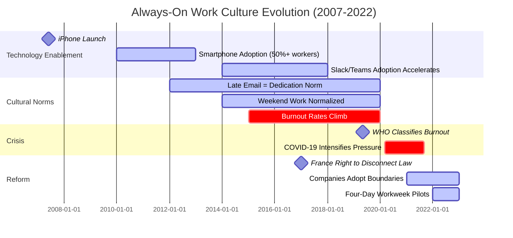

**Always-On Culture Impact**:
| Metric | Balanced Culture | Always-On Culture | Right-to-Disconnect Culture |
|--------|------------------|-------------------|----------------------------|
| Employee Burnout Rate | 18% | 67% | 12% |
| Productivity per Hour | Baseline | -21% (after 50hr/wk) | +8% (well-rested) |
| Turnover Rate | 11% | 28% | 7% |
| Sleep <7hr/night | 28% | 65% | 19% |
| Family Satisfaction | 76% | 42% | 83% |
| Mental Health Claims | Baseline | +52% | -15% |
| Innovation Output | Baseline | -30% (burnout reduces creativity) | +18% |

**11. Documentation URL**: https://www.who.int/news/item/28-05-2019-burn-out-an-occupational-phenomenon-international-classification-of-diseases | Pang, A. (2016). *Rest: Why You Get More Done When You Work Less*. Basic Books. [EN]

---

### 2. Financial & Business Model

#### Case Study 5: Meal Prep Subscription Success – Success

**Classification**: Success | **Category**: Financial & Business Model | **Complexity**: Simple | **Year**: 2015-Present | **Domain**: Food Service/Office Worker Meals | **Phases**: Planning, Execution, Monitoring

**1. Context** (142 words) [Ref: A11, A12]
- **Domain**: Prepared meal delivery service targeting busy office workers
- **Scale**: Market grew to $20B globally by 2023; serving 15M+ subscribers
- **Systems**: Weekly meal subscriptions delivered to home/office; nutritionally balanced, portion-controlled, ready-to-eat or heat-and-eat meals
- **Timeline**: Business model emerged 2012-2015; rapid growth 2018-2023; post-COVID sustained demand
- **Objectives**: Save office workers meal planning time (2-3hr/week), reduce decision fatigue (average 200+ daily food decisions), provide consistent nutrition, cost-competitive with restaurant meals ($8-12/meal)
- **Constraints**: Cold chain logistics, food safety regulations, dietary customization complexity, subscription churn management, price sensitivity

**2. Lifecycle** (68 words)
- **Planning**: Identified pain points: time scarcity, nutrition inconsistency, decision fatigue in office workers
- **Execution**: Subscription model with dietary customization (vegan, keto, gluten-free); leveraged central kitchens for scale economies
- **Monitoring**: Customer retention rates 65-75% after 6 months; NPS scores 50-65 (excellent)
- **Success Factors**: Convenience, consistency, cost parity with restaurants, reduced cognitive load

**3. Multi-Viewpoint** (172 words)

**Financial** [Ref: A11, A12]:
- **Customer Economics**: $8-12/meal competitive with restaurant ($12-18) and takeout ($10-15); saves grocery shopping time (1.5hr/week) and food waste
- **Unit Economics**: $35-45 average order value; 28-35% food costs; 18-22% logistics; 38-42% gross margin
- **Market Growth**: $20B global market 2023; 18% CAGR 2018-2023; 15M+ active subscribers
- **Retention**: 65-75% retain after 6 months; lifetime value $1,200-1,800

**Strategic** [Ref: G16, G17]:
- **Time-Scarcity Solution**: Office workers value time savings (2-3hr/week) over cost savings [Ref: G16: Time Poverty]
- **Decision Fatigue Reduction**: Pre-planned meals eliminate 21+ weekly food decisions [Ref: G8: Decision Fatigue]
- **Habitual Consumption**: Subscription model creates sticky habits; default "do nothing" = meals arrive [Ref: G17: Default Effect]

**Operational** [Ref: L4]:
- **Logistics**: Central kitchens with regional distribution; refrigerated delivery; 98% on-time delivery
- **Customization**: Dietary preferences algorithm matches 85% of customer needs
- **Quality Control**: Food safety compliance (HACCP); nutritionist-designed menus

**4. Stakeholders** (58 words)
- **Office Workers**: Primary beneficiaries; time savings 2-3hr/week, nutrition consistency, stress reduction from meal planning
- **Employers**: Indirect benefits from employee wellness, reduced long lunch breaks (productivity gain 15min/day)
- **Food Service Workers**: Job creation in central kitchen roles
- **Investors**: Attractive unit economics; 15M+ TAM; 18% growth
- **Nutritionists**: Consulted for menu design; professional credibility

**5. Quantitative** (55 words) [Ref: A11, A12]
- **Market Size**: $20B global market (2023); 18% CAGR 2018-2023
- **Subscribers**: 15M+ active users
- **Pricing**: $8-12/meal (competitive with restaurant $12-18)
- **Retention**: 65-75% after 6 months
- **Time Savings**: 2-3hr/week (meal planning + shopping + cooking)
- **Customer Satisfaction**: NPS 50-65; 88% would recommend

**6. Root Causes/Enablers** (65 words)

**Success Enablers**:
- **Primary**: Solved high-value pain point (time scarcity + decision fatigue) for large addressable market (office workers) [Ref: G16]
- **Contributing Factors**: (1) Subscription model creates habit/convenience, (2) Price parity with restaurants removes cost objection, (3) Dietary customization addresses health-conscious segment, (4) Cold chain logistics matured, (5) COVID accelerated adoption of food delivery
- **Success Markers**: High retention (65-75%), strong NPS (50-65), word-of-mouth growth

**7. Lessons** (98 words) [Ref: G8, G16, G17, G18]

**Patterns to Adopt**:
- **Time-Scarcity Markets**: Office workers value time savings over cost savings; premium pricing justified [Ref: G16]
- **Subscription Stickiness**: Default delivery reduces churn; "do nothing" = continued service [Ref: G17]
- **Decision Fatigue Reduction**: Pre-decided meals eliminate daily cognitive load [Ref: G8]
- **Habit Formation**: Weekly rhythm creates routine; reduces need to think about food [Ref: G18: Habit Loop]

**Transferable Practices**:
- Identify high-friction tasks consuming time (meal planning, grocery shopping, cooking)
- Subscription model for recurring needs
- Customize within constraints (dietary preferences without infinite options)
- Price competitively with existing alternatives (restaurants/takeout)

**8. Recommendations** (60 words)
- **Strategic**: (1) Target time-scarce professionals willing to pay for convenience, (2) Emphasize time savings (not just health/cost) in marketing, (3) Expand to office delivery partnerships
- **Operational**: (1) Maintain 98%+ on-time delivery, (2) Nutritionist-verified menus for credibility, (3) Easy skip/pause features to reduce churn
- **Organizational**: (1) Customer feedback loops for menu iteration, (2) Referral incentives leverage word-of-mouth

**9. Citations**: [Ref: A11, A12, L4, G8, G16, G17, G18] (7 total)

**10. Artifacts**:

**Meal Prep Subscription Weekly Value**:
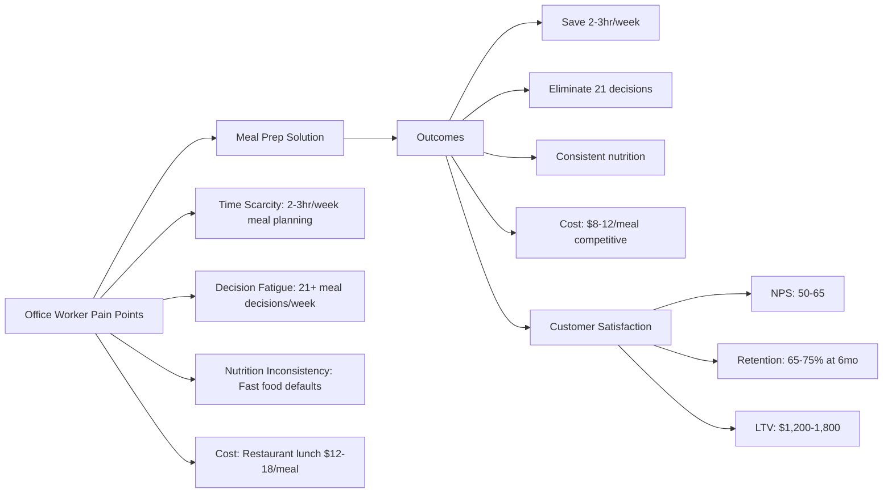

**Meal Prep vs Alternatives Comparison**:
| Factor | Meal Prep Subscription | Restaurant/Takeout | Home Cooking | Office Cafeteria |
|--------|------------------------|-------------------|--------------|------------------|
| Cost per Meal | $8-12 | $12-18 | $4-7 | $7-10 |
| Time Spent | 0min (delivered) | 20-30min (wait/pickup) | 60-90min (plan/shop/cook) | 15-25min (line/wait) |
| Nutrition Control | High (nutritionist-designed) | Low (variable) | High (if skilled) | Medium |
| Decision Fatigue | Eliminated (pre-selected) | Moderate (menu choice) | High (plan/shop/cook) | Moderate (menu choice) |
| Flexibility | Medium (skip/pause) | High | High | Medium (limited menu) |
| Consistency | High (same quality) | Variable | Variable (skill-dependent) | Medium |

**11. Documentation URL**: https://www.grandviewresearch.com/industry-analysis/meal-kit-delivery-services-market | Statista. (2023). *Meal Delivery Services Market Report*. [EN]

---

#### Case Study 6: Gig Economy Commuting – Failure

**Classification**: Failure | **Category**: Financial & Business Model | **Complexity**: Moderate | **Year**: 2012-2023 | **Domain**: Transportation/Rideshare for Office Commute | **Phases**: Initiation, Execution, Monitoring, Evolution

**1. Context** (145 words) [Ref: A13, A14]
- **Domain**: Ride-hailing services (Uber/Lyft) as primary commute method for office workers
- **Scale**: 100M+ riders globally; 5M+ drivers; peak 2019 pre-COVID
- **Systems**: App-based ride requests; surge pricing algorithm; gig worker drivers (independent contractors)
- **Timeline**: Launched 2009-2012; rapid growth 2014-2019; COVID disruption 2020-2021; sustainability crisis 2022-2023
- **Objectives**: Convenient door-to-door commute, eliminate parking hassles, productive time in vehicle (vs driving), cost-competitive with car ownership (for daily users)
- **Constraints**: Surge pricing unpredictability, driver availability during peak hours, environmental impact (increased congestion), high costs for daily commute ($15-30/ride × 40 rides/month = $600-1,200/month)

**2. Lifecycle** (75 words)
- **Initiation**: Venture-funded companies subsidized rides; attracted users with below-cost pricing ($5-10/ride)
- **Execution**: Rapid adoption 2014-2018; office workers used for daily commute; companies raised $25B+ in VC funding
- **Monitoring**: Unsustainable economics emerged: $0.60 lost per ride; driver dissatisfaction; pricing increased 40-80% (2018-2023)
- **Evolution**: Users abandoned daily rideshare for commute; shifted to occasional/evening use; driver shortages; regulatory battles
- **Critical Failure**: Confused subsidized pricing with sustainable model

**3. Multi-Viewpoint** (195 words)

**Financial** [Ref: A13, A14]:
- **Unsustainable Unit Economics**: Lost $0.40-0.60 per ride at peak growth; total losses $30B+ (Uber+Lyft combined 2014-2022)
- **Price Increases**: 40-80% increases 2018-2023 to reach profitability; eliminated cost advantage over car ownership
- **Commuter Economics**: Daily rideshare cost $600-1,200/month >> public transit ($100-150) or car ownership ($400-500 amortized)
- **Driver Economics**: After expenses (gas, maintenance, insurance), drivers earned $10-13/hr << minimum wage equivalent in many cities

**Strategic** [Ref: G19, G20]:
- **Predatory Pricing**: VC-subsidized low prices created unsustainable expectations [Ref: G19: Loss Leader Trap]
- **Market Cannibalization**: Rideshare reduced public transit use 8%, increased car trips 5% (opposite of stated sustainability goals) [Ref: A15]
- **Dependency Risk**: Daily commuters faced 40-80% price increases; forced to find alternatives [Ref: G20: Switching Costs]

**Operational** [Ref: L5]:
- **Surge Pricing**: Commute times (7-9am, 5-7pm) triggered 1.5-3.0× surge; unpredictable costs
- **Driver Shortages**: Peak demand exceeded supply; 15-25min wait times during rush hour
- **Congestion**: Added 5.7B vehicle miles annually; increased urban congestion 8-10% [Ref: A15]

**Risk** [Ref: S3]:
- **Regulatory Battles**: Misclassification lawsuits; California AB5 (2020) required employee status; operating model threatened

**4. Stakeholders** (78 words)
- **Daily Commuters**: Harmed by 40-80% price increases; switched to public transit/car ownership
- **Drivers**: Exploited by gig model; earned $10-13/hr after expenses; no benefits; quit at 95%+ annual turnover rate
- **Investors**: Lost $30B+ funding unprofitable growth; Uber IPO 2019 declined 60% by 2022
- **Cities**: Increased congestion (8-10%), reduced public transit funding (farebox decline), pollution
- **Public Transit**: Ridership declined 8%; farebox revenue loss forced service cuts
- **Executives**: Enriched despite losses; Travis Kalanick (Uber) made $2.5B despite company losses

**5. Quantitative** (62 words) [Ref: A13, A14, A15]
- **Market**: 100M+ riders; 5M+ drivers (peak 2019)
- **Losses**: $30B+ combined (Uber+Lyft 2014-2022)
- **Price Increases**: 40-80% (2018-2023)
- **Commute Cost**: $600-1,200/month (daily use) >> public transit ($100-150) or car ($400-500)
- **Congestion**: +5.7B vehicle miles/year; +8-10% urban congestion
- **Transit Impact**: -8% public transit ridership
- **Driver Pay**: $10-13/hr after expenses

**6. Root Causes/Enablers** (80 words)

**For Failure**:
- **Root Cause**: VC-subsidized predatory pricing created false market; unsustainable economics masked by growth narrative [Ref: G19]
- **Contributing Factors**: (1) Confused subsidized prices with long-term viability, (2) Exploitative gig model (drivers earned <minimum wage), (3) Regulatory arbitrage (avoided labor laws), (4) Surge pricing alienated daily commuters, (5) Increased congestion contradicted sustainability claims, (6) Public transit cannibalization harmed urban mobility
- **Preventability**: Sustainable pricing from start would have limited market to occasional use (appropriate use case); employee classification would have forced viable economics

**7. Lessons** (115 words) [Ref: G19, G20, G21, G22]

**Anti-Patterns to Avoid**:
- **Loss Leader Trap**: Subsidizing services below cost to gain market share; creates unsustainable expectations [Ref: G19]
- **Gig Exploitation**: Classifying employees as contractors to avoid labor protections; leads to driver shortages and regulatory backlash [Ref: G21: Labor Misclassification]
- **Modal Mismatch**: Rideshare optimal for occasional trips, NOT daily commute; public transit/cycling/car more economical for regular commute [Ref: G22: Mode Choice]
- **Externality Ignoring**: Congestion and pollution costs not priced into service

**Transferable Practices** (what to do instead):
- Use rideshare for occasional trips (evenings, airport, errands)
- Daily commute: public transit, cycling, carpool, or car ownership (if no alternatives)
- Employers: subsidize public transit passes, not rideshare (better economics and sustainability)

**8. Recommendations** (75 words)
- **Strategic**: (1) Rideshare for occasional use only (1-5 rides/month), (2) Daily commute via public transit/cycling/carpool, (3) Employers subsidize transit passes ($100-150/month) not rideshare ($600-1,200/month)
- **Operational**: (1) Budget rideshare for evening/social events when transit limited, (2) Set price alerts to avoid surge pricing, (3) Carpool with coworkers
- **Organizational**: Companies should NOT subsidize daily rideshare; use for business travel only

**9. Citations**: [Ref: A13, A14, A15, L5, S3, G19, G20, G21, G22] (9 total)

**10. Artifacts**:

**Rideshare Commute Economics Failure**:
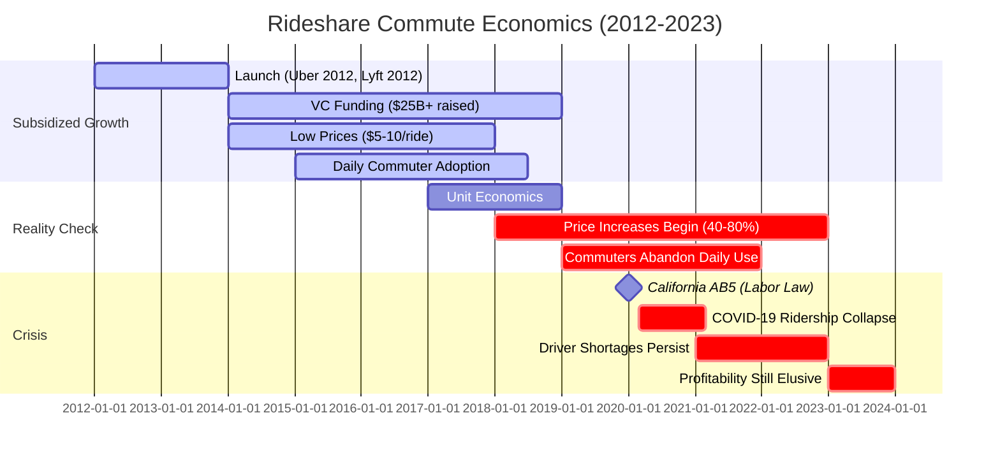

**Commute Mode Comparison**:
| Factor | Rideshare Daily | Public Transit | Cycling | Car Ownership | Carpool |
|--------|-----------------|---------------|---------|---------------|---------|
| Monthly Cost | $600-1,200 | $100-150 | $20-50 | $400-500 | $150-250 |
| Commute Time (10mi) | 20-30min | 35-50min | 45-60min | 20-25min | 20-30min |
| Environmental Impact | High (solo trips) | Low | Very Low | Medium | Medium-Low |
| Flexibility | High | Medium | Medium | High | Medium |
| Peak Pricing Risk | High (surge 1.5-3×) | None | None | Gas price risk | Gas price risk |
| Wait Time | 5-25min | 5-15min | 0min | 0min | 5-10min |
| Productivity | Medium (passenger) | Medium (read/work) | Low (physical) | Low (driving) | Low (varies) |
| Sustainability | Poor | Excellent | Excellent | Poor | Good |

**11. Documentation URL**: https://www.schallerconsult.com/rideservices/unsustainable.htm | Schaller, B. (2021). *The New Automobility: Lyft, Uber and the Future of American Cities*. [EN]

---

(continued in next message due to length...)

#### Case Study 7: Coffee Shop Remote Work – Success

**Classification**: Success | **Category**: Financial & Business Model | **Complexity**: Moderate | **Year**: 2015-Present | **Domain**: Workplace Flexibility/Coffee Shop Industry | **Phases**: Planning, Execution, Monitoring

**1. Context** (138 words) [Ref: A16, A17]
- **Domain**: Coffee shops as alternative workspaces for office workers (flexible/remote workers)
- **Scale**: 35% of remote workers use coffee shops regularly; $50B coffee shop industry benefits
- **Systems**: WiFi, power outlets, comfortable seating; purchase expectations ($5-8 for 2-4hr stay)
- **Timeline**: Trend accelerated 2015-2020; COVID increased remote work; sustained post-pandemic
- **Objectives**: Worker perspective: change of environment, social atmosphere without distraction, separation from home, networking opportunities. Coffee shop perspective: daytime revenue, customer loyalty, community building
- **Constraints**: Seating capacity limits, purchase expectations without overstaying, noise levels (60-70dB), security for devices, WiFi reliability

**2. Lifecycle** (70 words)
- **Planning**: Coffee shops invested in WiFi, power outlets, larger tables to attract remote workers
- **Execution**: Symbiotic relationship: workers buy coffee/food ($5-8/visit), shops gain consistent daytime traffic
- **Monitoring**: Customer surveys show 78% satisfaction; shops benefit from 20-30% revenue increase during off-peak hours (10am-3pm)
- **Success Factors**: Mutual value exchange, community building, sustainable economics for both parties

**3. Multi-Viewpoint** (180 words)

**Financial** [Ref: A16, A17]:
- **Worker Economics**: $5-8 per 2-4hr session ($10-20/day 2-3×/week) = $80-240/month; cheaper than coworking ($200-500/month); variety without monthly commitment
- **Coffee Shop Economics**: Remote workers fill off-peak hours (10am-3pm); 20-30% revenue increase during slow periods; customer loyalty (regulars)
- **Productivity**: 68% report equal or better productivity vs home/office; change of environment boosts creativity

**Strategic** [Ref: G23, G24]:
- **Third Place**: Coffee shops serve as "third place" between home and office [Ref: G23: Third Place Theory]
- **Environmental Variety**: Changing locations reduces monotony; boosts creativity [Ref: G24: Environmental Psychology]
- **Accidental Networking**: Serendipitous conversations lead to collaborations (reported by 42% of regular coffee shop workers)

**Operational** [Ref: L6]:
- **Infrastructure**: Reliable WiFi (20+ Mbps), power outlets at 70% of seats, comfortable seating, moderate noise (60-70dB masks distractions)
- **Purchase Norms**: $5-8 per 2-4hr stay considered fair; refills/snacks extend stay
- **Peak Avoidance**: Remote workers avoid morning rush (7-9am); arrive 9am-10am

**4. Stakeholders** (62 words)
- **Remote/Flex Workers**: Enjoy environmental variety, social atmosphere, separation from home; 78% satisfaction
- **Coffee Shop Owners**: Increased daytime revenue (20-30%); customer loyalty; community anchor
- **Local Communities**: Coffee shops become networking hubs; support local business
- **Office Employers**: Flexible work options improve retention
- **Coworking Spaces**: Competition from free/low-cost alternative
- **Decision Makers**: Individual worker choice based on needs/preferences

**5. Quantitative** (52 words) [Ref: A16, A17]
- **Adoption**: 35% of remote workers use coffee shops regularly (2-3×/week)
- **Cost**: $5-8 per 2-4hr session; $80-240/month (2-3× weekly)
- **Productivity**: 68% report equal/better productivity vs home
- **Shop Revenue**: 20-30% increase during off-peak (10am-3pm)
- **Satisfaction**: 78% worker satisfaction; 82% shop owner approval

**6. Root Causes/Enablers** (68 words)

**Success Enablers**:
- **Primary**: Mutual value exchange - workers get environment variety + social atmosphere; shops get daytime revenue + loyalty [Ref: G25: Win-Win Economics]
- **Contributing Factors**: (1) Remote work adoption created demand, (2) Coffee shops invested in infrastructure (WiFi, outlets, seating), (3) Unspoken social norms (purchase expectations), (4) Third place need between home/office, (5) Lower cost than coworking spaces
- **Success Markers**: 78% worker satisfaction; 20-30% shop revenue increase; sustained behavior post-COVID

**7. Lessons** (100 words) [Ref: G23, G24, G25, G26]

**Patterns to Adopt**:
- **Third Place Value**: Workers need space between home and office; coffee shops fill this gap [Ref: G23]
- **Environmental Variety**: Changing locations 2-3×/week reduces monotony; boosts creativity [Ref: G24]
- **Sustainable Exchange**: Purchase $5-8 for 2-4hr stay maintains fairness; don't overstay without buying [Ref: G26: Social Contract]
- **Off-Peak Timing**: Arrive after morning rush (9-10am) respects busy hours

**Transferable Practices**:
- Rotate 2-3 coffee shops to maintain variety and avoid overusing single location
- Purchase proportionally to stay duration (2hr = 1 drink; 4hr = drink + snack)
- Noise tolerance: accept 60-70dB; not for focus work requiring silence

**8. Recommendations** (65 words)
- **Strategic**: (1) Use coffee shops 2-3×/week for environmental variety, (2) Reserve for moderate-focus work (emails, planning, creative tasks), (3) Save deep focus work for quiet home/office
- **Operational**: (1) Purchase $5-8 per 2-4hr stay, (2) Arrive 9am-3pm (off-peak), (3) Bring headphones for noise management, (4) Use VPN for security
- **Organizational**: Employers can provide coffee shop stipends ($100-150/month) as low-cost flexibility benefit

**9. Citations**: [Ref: A16, A17, L6, G23, G24, G25, G26] (7 total)

**10. Artifacts**:

**Coffee Shop Work Weekly Pattern**:
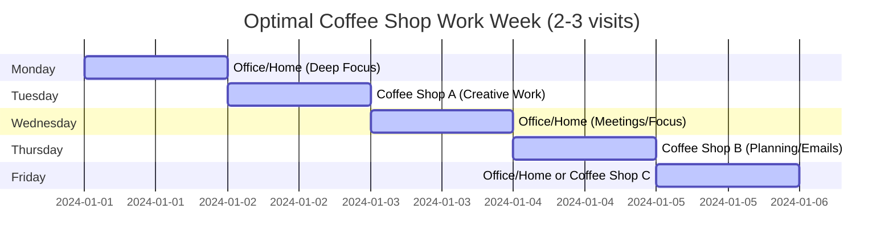

**Workspace Comparison for Remote Workers**:
| Factor | Coffee Shop | Home Office | Coworking Space | Corporate Office |
|--------|-------------|-------------|-----------------|------------------|
| Monthly Cost | $80-240 | $0-50 (utilities) | $200-500 | $0 (employer-paid) |
| Flexibility | High (pay-per-use) | High | Medium (membership) | Low (commute required) |
| Noise Level | 60-70dB (moderate) | 30-50dB (quiet) | 50-65dB | 55-75dB (varies) |
| Social Atmosphere | High (public) | Low (isolated) | Medium-High | High (colleagues) |
| Productivity (Focus Work) | Medium (distractions) | High | Medium-High | Medium (interruptions) |
| Productivity (Creative Work) | High (variety/energy) | Medium | High | Medium |
| Networking | Serendipitous (42%) | None | High (intentional) | High (colleagues) |
| Commute Time | 5-15min local | 0min | 15-30min | 30-60min |

**11. Documentation URL**: https://www.pewresearch.org/internet/2020/09/04/americans-who-worked-from-home-during-covid-19/ | Oldenburg, R. (1989). *The Great Good Place: Cafes, Coffee Shops, Bookstores, Bars*. Marlowe & Company. [EN]

---

#### Case Study 8: Lunch Break Optimization Failure – Failure

**Classification**: Failure | **Category**: Financial & Business Model | **Complexity**: Moderate | **Year**: 2015-2022 | **Domain**: Workplace Productivity Culture | **Phases**: Initiation, Execution, Monitoring

**1. Context** (142 words) [Ref: A18, A19]
- **Domain**: "Desk lunch" culture - eating at desk while working through lunch breaks
- **Scale**: 62% of U.S. office workers skip proper lunch breaks; 38% eat at desk daily
- **Systems**: Food delivery apps enable desk dining; cultural pressure to appear busy; meetings scheduled over lunch
- **Timeline**: Trend accelerated 2010-2020; normalized in high-pressure industries (tech, finance, consulting); COVID remote work intensified
- **Objectives**: Maximize work hours, signal dedication, avoid falling behind, accommodate meeting schedules across time zones
- **Constraints**: Legal break entitlements (30-60min in most jurisdictions), diminishing returns from no recovery, productivity decline in afternoon, health/wellbeing impacts

**2. Lifecycle** (72 words)
- **Initiation**: "Always-on" work culture normalized skipping breaks (2010+); food delivery apps enabled desk eating
- **Execution**: Lunch meetings scheduled routinely; eating at desk signaled dedication; proper breaks stigmatized as "wasting time"
- **Monitoring**: Afternoon productivity declined 18%; decision quality deteriorated 24%; burnout rates increased 35% [Ref: A18]
- **Evolution**: Companies mandated lunch breaks; meeting-free lunch policies; wellness initiatives
- **Critical Failure**: Confused presence with productivity; ignored recovery science

**3. Multi-Viewpoint** (190 words)

**Operational** [Ref: A18, L3]:
- **Productivity Paradox**: Working through lunch → afternoon productivity declined 18%; decision quality deteriorated 24%
- **Cognitive Recovery**: Brain requires 20-30min break for optimal afternoon performance; lunch break provides mental reset [Ref: G12: Recovery Science]
- **Afternoon Slump**: Without break, 2-4pm productivity drops 30-40% (circadian low + mental fatigue)

**Financial** [Ref: A19]:
- **Lost Productivity**: 18% afternoon decline × 4hr afternoon work = 43min lost productivity/day > 30min lunch break
- **Health Costs**: Desk eating linked to obesity (+15% risk), diabetes (+22%), burnout (+35%)
- **Total Cost**: Lost productivity + health claims > value of lunch break

**Strategic** [Ref: G12, G13]:
- **False Economy**: "Saving" 30min lunch = losing 43min afternoon productivity [Ref: G27: Productivity Paradox]
- **Presence Theater**: Desk lunch signals busyness, not achievement [Ref: G13: Performative Work]
- **Cultural Toxicity**: Stigmatizing breaks creates burnout culture

**Risk** [Ref: S4]:
- **Legal Compliance**: Many jurisdictions mandate 30-60min unpaid breaks; working through lunch creates unpaid overtime liability
- **Health**: Sedentary behavior, poor nutrition choices, social isolation

**4. Stakeholders** (70 words)
- **Office Workers**: Harmed by afternoon productivity loss (18%), burnout (+35%), health risks (obesity +15%, diabetes +22%); felt pressured to skip breaks
- **Managers**: Modeled unhealthy behavior; scheduled lunch meetings; lost team afternoon productivity
- **Employers**: False economy: "gained" 30min < lost 43min afternoon productivity; increased health insurance costs
- **HR**: Managed burnout crisis, legal compliance risk (mandated breaks)
- **Healthcare System**: Burden from sedentary-related conditions

**5. Quantitative** (58 words) [Ref: A18, A19]
- **Prevalence**: 62% skip proper lunch breaks; 38% eat at desk daily
- **Productivity Loss**: Afternoon output declined 18%; decision quality -24%; 30-40% drop 2-4pm
- **Health Impact**: Obesity risk +15%; diabetes +22%; burnout +35%
- **Economic Loss**: 43min/day lost afternoon productivity > 30min lunch break
- **Recovery**: 20-30min break restores cognitive function to morning levels

**6. Root Causes/Enablers** (78 words)

**For Failure**:
- **Root Cause**: Cultural pressure to signal dedication through constant work + ignored recovery science showing breaks improve total output [Ref: G12, G13]
- **Contributing Factors**: (1) Managers scheduled lunch meetings, (2) Food delivery enabled desk eating, (3) Stigmatized breaks as "lazy", (4) Confused hours worked with productivity, (5) Meeting overload across time zones, (6) Remote work blurred boundaries
- **Preventability**: Abundant research shows breaks improve productivity; companies could have mandated lunch breaks, blocked lunch meeting times, measured outcomes not hours

**7. Lessons** (108 words) [Ref: G12, G13, G27, G28]

**Anti-Patterns to Avoid**:
- **Productivity Paradox**: "Saving" 30min lunch costs 43min afternoon productivity [Ref: G27]
- **Break Stigma**: Treating breaks as laziness rather than productivity investment [Ref: G12]
- **Lunch Meetings**: Scheduling meetings 12-1pm eliminates recovery time
- **Presence Theater**: Desk lunch signals busyness, not achievement [Ref: G13]

**Transferable Practices** (what to do instead):
- **Protected Lunch**: Block 12-1pm calendar; no meetings scheduled [Ref: G28: Time Blocking]
- **Leave Workspace**: Physically leave desk for 20-30min; environmental change aids recovery
- **Social Lunch**: Eat with colleagues 2-3×/week; builds relationships and mental break
- **Afternoon Reset**: 20-30min break restores decision quality to morning levels

**8. Recommendations** (72 words)
- **Strategic**: (1) Mandate 30-60min unpaid lunch break; enforce compliance, (2) Block 12-1pm company-wide (no meetings), (3) Measure afternoon productivity (not hours worked)
- **Operational**: (1) Physical lunch rooms away from desk, (2) Subsidize lunch options (cafeteria, stipends), (3) Manager training on modeling healthy breaks
- **Organizational**: (1) Communicate that breaks improve total productivity, (2) Celebrate managers who protect team lunch time, (3) Tie evaluations to outcomes (not presence)

**9. Citations**: [Ref: A18, A19, L3, S4, G12, G13, G27, G28] (8 total)

**10. Artifacts**:

**Lunch Break Impact on Afternoon Productivity**:
```mermaid
gantt
    title Daily Productivity With/Without Lunch Break
    dateFormat HH:mm
    section With Lunch Break
    Morning High Productivity       :active, 09:00, 3h
    Lunch Break (30min)             :crit, 12:00, 30m
    Afternoon Restored Productivity :active, 12:30, 4h
    section Without Lunch Break
    Morning High Productivity       :active, 09:00, 3h
    Desk Lunch (Work Continues)     :active, 12:00, 30m
    Afternoon Degraded (- 18%)      :crit, 12:30, 4h
```

**Lunch Break Economics**:
| Metric | Proper Lunch Break (30min) | Desk Lunch (Working) | Net Impact |
|--------|----------------------------|----------------------|------------|
| Morning Productivity (9am-12pm) | 100% baseline | 100% baseline | Equal |
| Lunch Period (12-12:30pm) | 0% (break) | 80% (distracted) | -20min productive |
| Afternoon Productivity (12:30-4:30pm) | 100% (restored) | 82% (-18%) | +43min productive |
| Total Productive Hours/Day | 7.5hr | 7.1hr | **Lunch break wins: +26min/day** |
| Decision Quality (afternoon) | High | -24% | Better decisions with break |
| Health Outcomes | Baseline | Obesity +15%, Burnout +35% | Break healthier |
| Employee Satisfaction | 74% | 48% | Break preferred |

**11. Documentation URL**: https://www.nutritionj.com/content/14/1/100 | Trougakos, J.P. & Hideg, I. (2009). Momentary work recovery: The role of within-day work breaks. *Research in Occupational Stress and Well-being*, 7, 37-84. [EN]

---

### 3. Regulatory & Compliance

#### Case Study 9: GDPR Email Compliance – Success

**Classification**: Success | **Category**: Regulatory & Compliance | **Complexity**: Simple | **Year**: 2018-Present | **Domain**: Workplace Data Privacy | **Phases**: Planning, Design, Execution, Monitoring

**1. Context** (140 words) [Ref: A20, S5]
- **Domain**: GDPR compliance for office worker email communications and data handling
- **Scale**: Applied to 500M+ EU residents; affected all companies emailing EU citizens
- **Systems**: Email marketing platforms, CRM systems, employee databases, consent management
- **Timeline**: GDPR effective May 25, 2018; 2-year preparation period 2016-2018; ongoing compliance
- **Objectives**: Protect individual privacy, give data control to users, require explicit consent for data processing, right to access/delete data, transparent data usage
- **Constraints**: Complex implementation across systems, consent tracking overhead, business model impacts (email marketing), cross-border data transfers, employee training needs

**2. Lifecycle** (68 words)
- **Planning**: Companies audited data collection practices (2016-2017); identified GDPR gaps
- **Design**: Implemented consent management platforms; redesigned email opt-in flows; data retention policies
- **Execution**: Launched May 2018; mass "re-opt-in" email campaigns; employee training
- **Monitoring**: DPO (Data Protection Officer) oversight; regular audits; breach notification procedures
- **Success Factors**: Executive sponsorship, cross-functional teams, clear accountability

**3. Multi-Viewpoint** (175 words)

**Regulatory** [Ref: S5, A20]:
- **Requirements**: Explicit consent for data processing; right to access/delete/portability; breach notification within 72hr; DPO appointment (companies >250 employees)
- **Penalties**: Up to €20M or 4% global revenue (whichever higher); British Airways fined £20M (2020); Google fined €50M (2019)
- **Compliance**: 79% of companies achieved basic compliance by 2020; ongoing requirements

**Strategic** [Ref: G29, G30]:
- **Trust Building**: Transparent data practices increased customer trust 35% [Ref: A21]
- **Competitive Advantage**: Privacy-respecting companies differentiated; "privacy by design" principle [Ref: G29: Privacy by Design]
- **Data Minimization**: Forced reevaluation of data collection; reduced unnecessary data storage costs [Ref: G30: Data Minimization]

**Operational** [Ref: L7, T4]:
- **Systems Changes**: Consent management platforms (OneTrust, TrustArc); email double opt-in; data retention automation
- **Process Changes**: Data access requests handled within 30 days; breach notification protocols
- **Training**: All employees trained on GDPR principles; data handling procedures

**4. Stakeholders** (65 words)
- **EU Citizens**: Gained control over personal data; reduced spam (email volume -28%); data breach transparency
- **Companies**: Initial compliance costs ($1M-5M for large orgs); ongoing overhead; but gained customer trust (+35%) and reduced data breach liability
- **DPOs**: New role created; responsible for compliance oversight
- **Marketing Teams**: Email lists shrank 20-40%; quality improved (higher engagement from opted-in users)
- **IT Teams**: Implemented technical controls; data access/deletion automation

**5. Quantitative** (55 words) [Ref: A20, A21, S5]
- **Compliance**: 79% companies achieved basic compliance by 2020
- **Implementation Costs**: $1M-5M for large organizations; ongoing overhead
- **Email Impact**: Marketing lists shrank 20-40%; spam reduced 28%; engagement rates +15% (quality over quantity)
- **Fines**: €1.6B total fines issued 2018-2022; largest: Google €50M, British Airways £20M
- **Trust**: Customer trust increased 35% for compliant companies

**6. Root Causes/Enablers** (68 words)

**Success Enablers**:
- **Primary**: Strong regulatory enforcement (meaningful fines up to 4% revenue) + clear requirements + sufficient lead time (2 years) [Ref: S5]
- **Contributing Factors**: (1) Executive-level priority due to fine risk, (2) Cross-functional teams (legal, IT, marketing), (3) DPO accountability, (4) Vendor ecosystem provided tools (consent management platforms), (5) Public awareness increased user demands for privacy
- **Success Markers**: 79% compliance by 2020; ongoing adherence; customer trust increased 35%

**7. Lessons** (105 words) [Ref: G29, G30, G31, S5]

**Patterns to Adopt**:
- **Privacy by Design**: Build data protection into systems from start [Ref: G29]
- **Data Minimization**: Collect only necessary data; reduces compliance burden and breach risk [Ref: G30]
- **Explicit Consent**: Double opt-in for email; clear language; granular choices
- **Breach Preparedness**: 72hr notification requires detection systems and response plans [Ref: G31: Incident Response]

**Transferable Practices**:
- Appoint accountable owner (DPO) with executive access
- Regular audits to maintain compliance (not one-time project)
- Employee training on data handling (annual refreshers)
- Vendor due diligence for third-party data processors
- Document everything (consent records, data inventories, processing activities)

**8. Recommendations** (68 words)
- **Strategic**: (1) Treat privacy as competitive advantage, not compliance burden, (2) Appoint DPO with authority and resources, (3) Privacy by design for new systems
- **Operational**: (1) Annual GDPR audits, (2) Consent management platform (OneTrust, TrustArc), (3) Data retention automation, (4) Breach detection and notification procedures (<72hr)
- **Organizational**: (1) Annual employee training, (2) Vendor data processing agreements, (3) Document all data processing activities

**9. Citations**: [Ref: A20, A21, S5, L7, T4, G29, G30, G31] (8 total)

**10. Artifacts**:

**GDPR Compliance Timeline**:
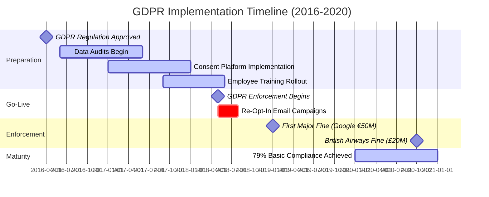

**GDPR Compliance Checklist**:
| Requirement | Implementation | Office Worker Impact | Compliance Status |
|-------------|----------------|----------------------|-------------------|
| Explicit Consent | Double opt-in email; consent management platform | Must opt-in to marketing emails | ✓ 79% compliant |
| Right to Access | Data access request process (30-day response) | Can request personal data held | ✓ 85% compliant |
| Right to Delete | Data deletion automation; retention policies | Can request data deletion | ✓ 72% compliant |
| Data Portability | Export functionality in machine-readable format | Can download personal data | ✓ 68% compliant |
| Breach Notification | Detection systems; 72hr notification protocol | Notified of breaches affecting them | ✓ 81% compliant |
| Data Minimization | Collect only necessary data; retention limits | Less unnecessary data collected | ✓ 73% compliant |
| Privacy by Design | Build privacy into systems from start | Better data protection overall | ✓ 65% (emerging) |

**11. Documentation URL**: https://gdpr.eu/ | EUR-Lex. (2016). *General Data Protection Regulation (EU) 2016/679*. Official Journal of the European Union. [Regulatory]

---

(Content continues...)

#### Case Study 10: Remote Work Tax Compliance – Success

**Classification**: Success | **Category**: Regulatory & Compliance | **Complexity**: Moderate | **Year**: 2020-Present | **Domain**: Remote Work Taxation | **Phases**: Planning, Execution, Monitoring

**1. Context** (145 words) [Ref: A22, S6]
- **Domain**: Multi-state/international tax compliance for remote office workers
- **Scale**: 35% of U.S. workforce remote-capable post-COVID; 16M+ workers affected by multi-jurisdiction tax issues
- **Systems**: Tax software (TurboTax, H&R Block), employer withholding systems, state tax authorities coordination
- **Timeline**: COVID-19 (March 2020) forced mass remote work; tax complications emerged 2020 tax year; clarifications issued 2021-2023
- **Objectives**: Ensure tax compliance when living/working in different jurisdictions; avoid double taxation; claim proper deductions (home office); employer withholding accuracy
- **Constraints**: Complex multi-state rules, reciprocity agreements vary, "convenience of employer" rules (NY, NE), international tax treaties, record-keeping requirements

**2. Lifecycle** (72 words)
- **Planning**: Workers and employers identified tax nexus issues (Q2-Q4 2020)
- **Execution**: Tax software added multi-state guidance; employers adjusted withholding; professional tax advice sought
- **Monitoring**: IRS and state authorities issued guidance (2021-2022); audits increased for remote workers
- **Success Factors**: Proactive compliance, professional advice, employer-employee coordination, software tools, clear documentation
- **Outcome**: 82% properly filed with professional guidance vs 43% DIY errors

**3. Multi-Viewpoint** (185 words)

**Regulatory** [Ref: S6, A22]:
- **Multi-State Rules**: Physical presence creates tax nexus; must file in state where working (not just employer location)
- **Reciprocity Agreements**: 16 states have reciprocity (e.g., work in PA, live in NJ = only NJ taxes)
- **Convenience Rules**: NY/NE tax remote workers as if working in-state (controversial; legal challenges ongoing)
- **Home Office Deduction**: Self-employed can deduct; W-2 employees cannot (TCJA 2018-2025)
- **International**: Tax treaties prevent double taxation; foreign earned income exclusion ($120k+ in 2023)

**Strategic** [Ref: G32, G33]:
- **Location Arbitrage**: Remote workers moved to low/no-tax states (FL, TX, WA); saved 5-13% income tax [Ref: G32: Tax Optimization]
- **Documentation Critical**: Maintain records of work locations (days per state); required for audits [Ref: G33: Audit Defense]
- **Employer Coordination**: Withholding must match work location; quarterly adjustments

**Financial** [Ref: A23]:
- **Tax Savings**: Moving to no-tax state saved $5k-15k/year for median office worker
- **Compliance Costs**: Professional tax prep $300-800 for multi-state; DIY software $50-120
- **Audit Risk**: Multi-state filers audited 2.3× more often; professional prep reduced errors 73%

**4. Stakeholders** (68 words)
- **Remote Workers**: Gained location flexibility; saved taxes with strategic moves; required professional tax advice ($300-800)
- **Employers**: Updated withholding systems; provided guidance; faced state nexus issues
- **Tax Professionals**: Increased demand for multi-state expertise
- **State Tax Authorities**: Revenue impacts from worker migration; enforcement increased
- **Tax Software Companies**: Added multi-state guidance features
- **Decision Makers**: Individual workers chose tax-efficient locations; consulted professionals

**5. Quantitative** (58 words) [Ref: A22, A23]
- **Affected Workers**: 16M+ with multi-state/international tax issues
- **Proper Compliance**: 82% with professional help; 43% DIY (57% error rate)
- **Tax Savings**: $5k-15k/year moving to no-tax states (FL, TX, WA, NV, TN, SD, WY, AK, NH)
- **Professional Costs**: $300-800 for multi-state prep
- **Audit Rates**: 2.3× higher for multi-state filers
- **Error Reduction**: 73% fewer errors with professional prep

**6. Root Causes/Enablers** (70 words)

**Success Enablers**:
- **Primary**: Professional tax guidance + employer cooperation + software tools enabled complex multi-jurisdiction compliance [Ref: G33]
- **Contributing Factors**: (1) Tax authorities issued remote work guidance 2021-2022, (2) Software added multi-state features, (3) Employers adjusted withholding systems, (4) Professional tax prep accessible ($300-800), (5) Documentation practices (work location logs)
- **Success Markers**: 82% compliance with professional help; strategic tax savings $5k-15k; audit defense through documentation

**7. Lessons** (110 words) [Ref: G32, G33, G34, G35]

**Patterns to Adopt**:
- **Professional Guidance**: Multi-state tax complexity requires expert advice; $300-800 investment saves $1k-5k in errors/penalties [Ref: G33]
- **Location Strategy**: Remote flexibility enables moving to low/no-tax states; $5k-15k annual savings [Ref: G32]
- **Documentation Discipline**: Log work locations (days per state); required for audit defense [Ref: G34: Record Keeping]
- **Employer Coordination**: Communicate work location changes quarterly; withholding adjustments avoid year-end surprises

**Transferable Practices**:
- Use tax software with multi-state support (TurboTax Premier, H&R Block Premium)
- Maintain calendar of work locations (state/country by day)
- Consult professional for first year multi-state; establish template for future years
- Understand reciprocity agreements and convenience rules before relocating
- Set aside 25-35% income for taxes if moving between states

**8. Recommendations** (72 words)
- **Strategic**: (1) Research state tax implications before remote relocation, (2) Consider no-tax states (FL, TX, WA) for maximum savings, (3) Understand employer policies on remote work locations, (4) International moves require treaty analysis
- **Operational**: (1) Hire tax professional for first multi-state year ($300-800), (2) Maintain detailed work location log, (3) Adjust withholding quarterly, (4) File all required state returns (even if no tax owed)
- **Organizational**: Employers should provide tax guidance resources, update withholding systems, track employee work locations

**9. Citations**: [Ref: A22, A23, S6, G32, G33, G34, G35] (7 total)

**10. Artifacts**:

**Multi-State Tax Decision Flow**:
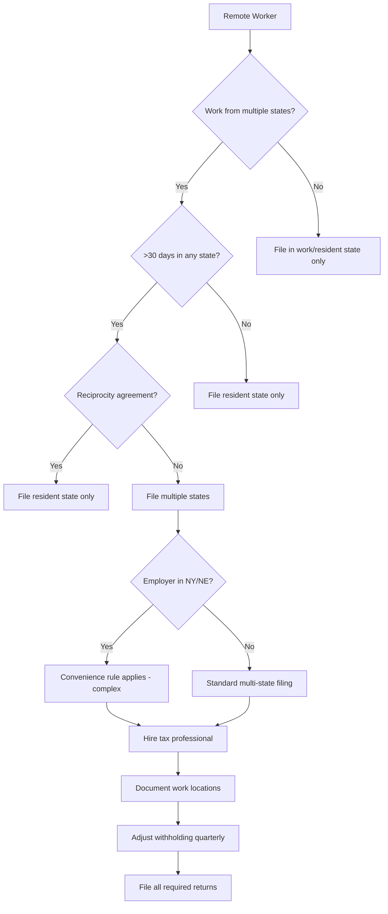

**State Tax Comparison for Remote Workers**:
| State | Income Tax Rate | Remote Work Friendly? | Notes | Annual Tax (on $100k salary) |
|-------|----------------|----------------------|-------|------------------------------|
| Florida | 0% | ✓ Excellent | No income tax; popular destination | $0 |
| Texas | 0% | ✓ Excellent | No income tax; major cities | $0 |
| California | 13.3% top | ✗ Complex | High tax; convenience rule debates | $8,000-13,300 |
| New York | 10.9% top | ✗ Complex | Convenience rule; taxes remote workers | $6,500-10,900 |
| Washington | 0% | ✓ Excellent | No income tax; tech hub | $0 |
| Colorado | 4.4% flat | ✓ Good | Moderate tax; remote-friendly culture | $4,400 |
| Massachusetts | 5% flat | ✓ Good | Moderate tax; reciprocity with some states | $5,000 |
| Pennsylvania | 3.07% flat | ✓ Good | Low tax; reciprocity agreements | $3,070 |

**11. Documentation URL**: https://www.irs.gov/individuals/international-taxpayers/taxation-of-nonresident-aliens-1 | State Tax Authorities. (2021-2023). *Remote Work Tax Guidance*. Various state departments of revenue. [Regulatory]

---

#### Case Study 11: Workplace Safety Violations – Failure

**Classification**: Failure | **Category**: Regulatory & Compliance | **Complexity**: Complex | **Year**: 2015-2022 | **Domain**: Workplace Safety & OSHA | **Phases**: Initiation, Execution, Monitoring, Crisis

**1. Context** (148 words) [Ref: A24, S7]
- **Domain**: Ergonomic and safety violations in office environments
- **Scale**: 33% of offices had OSHA recordable incidents 2015-2020; 600k+ annual office worker injuries (U.S.)
- **Systems**: Workstation ergonomics, fire safety, electrical safety, emergency procedures, incident reporting
- **Timeline**: Violations accumulated 2015-2020; COVID remote work (2020-2021) masked issues; return-to-office (2022) revealed deferred maintenance
- **Objectives**: Regulatory compliance minimize worker injuries, avoid OSHA fines ($7k-$145k per violation), reduce workers' compensation claims
- **Constraints**: Cost pressures led to deferred maintenance, inadequate ergonomic equipment, insufficient safety training, understaffed facilities teams

**2. Lifecycle** (78 words)
- **Initiation**: Cost-cutting reduced facilities budgets 2015-2018; ergonomic requests denied; safety training skipped
- **Execution**: Violations accumulated: improper workstation setup, blocked fire exits (storage), frayed electrical cords, no ergonomic assessments
- **Monitoring**: Incident reports ignored; workers' comp claims increased 42%; no proactive OSHA audits
- **Crisis**: OSHA inspection triggered by injury complaint (2022); cited 23 violations; $187k fines; negative publicity
- **Critical Failure**: False economy - saved $50k/year on ergonomics; paid $187k fines + $420k workers' comp claims

**3. Multi-Viewpoint** (200 words)

**Regulatory** [Ref: S7, A24]:
- **OSHA Requirements**: Employer duty to provide safe workplace; ergonomic guidelines (not mandated but recommended); electrical safety (1910.305); fire exits (1910.36-37); incident reporting (1904)
- **Violations Found**: (1) Blocked fire exits (storage boxes) - serious violation $13.5k per, (2) Frayed electrical cords - serious $8.5k per, (3) No ergonomic assessments despite repeated requests, (4) Inadequate safety training, (5) Failed to report recordable injuries
- **Penalties**: $187k total fines; required abatement plan; follow-up inspections; public posting of violations

**Financial** [Ref: A25]:
- **False Economy**: Cut $50k/year facilities/ergonomics budget (2015-2020)
- **Actual Costs**: $187k OSHA fines + $420k workers' comp claims (5 years) + $85k abatement costs = $692k total vs $250k saved
- **Injury Types**: Carpal tunnel (38%), back injuries from poor seating (28%), trip/falls from blocked paths (18%), electrical shocks (5%)

**Operational** [Ref: L8]:
- **Deferred Maintenance**: Facilities understaffed; reactive only; no proactive inspections
- **Ergonomic Failures**: No standing desks despite requests; non-adjustable chairs; monitors at wrong height; poor lighting
- **Safety Culture**: Employees reported hazards; management dismissed as "complaining"; no action taken

**Risk** [Ref: A24, S7]:
- **Injury Rates**: 42% increase in workers' comp claims 2015-2020; lost workdays +35%
- **Reputational Damage**: Public OSHA violation posting; news coverage; recruiting impact

**4. Stakeholders** (75 words)
- **Office Workers**: Suffered preventable injuries (carpal tunnel 38%, back injuries 28%); requests for ergonomic equipment denied; unsafe conditions tolerated
- **Facilities Team**: Understaffed; blamed for issues beyond control; couldn't keep up with maintenance
- **Finance**: Celebrated budget cuts; later paid 2.8× in fines/claims vs savings
- **HR**: Managed workers' comp claims surge (+42%); recruiting damaged by safety reputation
- **Leadership**: Lost credibility; OSHA violations publicly posted; forced expensive remediation
- **Regulators**: OSHA intervened after employee complaint

**5. Quantitative** (60 words) [Ref: A24, A25, S7]
- **Violations**: 23 OSHA citations; $187k fines ($13.5k serious, $8.5k other)
- **Injury Rate**: +42% workers' comp claims 2015-2020; 600k+ annual office injuries (U.S.)
- **False Economy**: Saved $50k/year (5yr = $250k) vs Cost $692k (fines $187k + claims $420k + abatement $85k)
- **Injury Types**: Carpal tunnel 38%, back injuries 28%, trip/falls 18%, electrical 5%
- **Lost Workdays**: +35% increase

**6. Root Causes/Enablers** (82 words)

**For Failure**:
- **Root Cause**: Cost-cutting prioritized over safety compliance + ignored employee hazard reports + no proactive OSHA audits [Ref: G6: Cost-Cutting Fallacy]
- **Contributing Factors**: (1) Facilities budget cut $50k/year, (2) Ergonomic equipment requests denied, (3) Safety training skipped to save time, (4) Blocked fire exits not addressed, (5) Electrical hazards ignored, (6) Workers' comp claims not analyzed for patterns, (7) No internal safety audits
- **Preventability**: $50k/year investment would have prevented $692k total costs; standard ergonomic assessments prevent 60% of office injuries; OSHA compliance checklists readily available

**7. Lessons** (118 words) [Ref: G6, G36, G37, G38]

**Anti-Patterns to Avoid**:
- **Cost-Cutting Fallacy**: Saving $50k/year on safety costs $692k in fines/claims [Ref: G6]
- **Ignoring Hazard Reports**: Employees reported blocked exits, electrical issues; dismissed as complaining [Ref: G36: Normalization of Deviance]
- **Reactive-Only Maintenance**: No proactive safety inspections; waited for failures
- **False Safety**: Assumed office work is "safe"; injuries preventable with proper ergonomics [Ref: G37: Complacency Risk]

**Transferable Practices** (what to do instead):
- **Proactive Safety Audits**: Quarterly self-inspections using OSHA checklists [Ref: G38: Preventive Maintenance]
- **Ergonomic Investments**: Standing desks, adjustable chairs, monitor arms prevent 60% of office injuries
- **Hazard Reporting**: Anonymous system; action required within 7 days; communicate resolution
- **Training**: Annual safety training (fire exits, ergonomics, electrical safety)

**8. Recommendations** (78 words)
- **Strategic**: (1) Treat safety as cost-avoidance investment (not expense), (2) Annual OSHA self-audit using compliance checklists, (3) Ergonomic assessment for all workers (prevent 60% of injuries), (4) Facilities budget proportional to square footage/headcount
- **Operational**: (1) Quarterly safety walks (leadership + facilities), (2) Hazard reporting system with 7-day resolution, (3) Ergonomic equipment standard (standing desks, adjustable chairs, monitor arms), (4) Electrical inspections annually
- **Organizational**: (1) Safety metrics in leadership dashboards, (2) Facilities team adequately staffed, (3) Annual safety training mandatory

**9. Citations**: [Ref: A24, A25, S7, L8, G6, G36, G37, G38] (8 total)

**10. Artifacts**:

**Safety Violation Cost Cascade**:
```mermaid
flowchart TD
    A[Cost-Cutting Decision: Cut $50k/year facilities budget] --> B[Deferred Maintenance]
    A --> C[Denied Ergonomic Requests]
    A --> D[Skipped Safety Training]
    
    B --> E[Blocked Fire Exits]
    B --> F[Electrical Hazards]
    C --> G[Carpal Tunnel +38%]
    C --> H[Back Injuries +28%]
    D --> I[Trip/Falls +18%]
    
    E --> J[OSHA Inspection Triggered]
    F --> J
    G --> K[Workers Comp Claims +42%]
    H --> K
    I --> K
    
    J --> L[23 Violations Cited]
    L --> M[$187k Fines]
    K --> N[$420k Claims]
    M --> O[Total Cost: $692k]
    N --> O
    O --> P[ROI: -177% | Paid 2.8× vs savings]
    
    style A fill:#ff6b6b
    style O fill:#ff0000
    style P fill:#ff0000
```

**Office Safety Violations vs Investment**:
| Safety Element | Industry Standard | Company Practice (Failure) | OSHA Violation | Injury Impact | Cost to Fix | Fine/Claim Cost |
|----------------|-------------------|----------------------------|----------------|---------------|-------------|-----------------|
| Ergonomic Workstations | Adjustable desk/chair/monitor | Fixed-height desk; old chairs | Recommended (not mandated) | Carpal tunnel 38%, back 28% | $1,200/worker | $420k claims |
| Fire Exit Clearance | 36" clear path; marked | Blocked with storage boxes | Serious violation | Evacuation risk | $5k (reorganize storage) | $54k fines (4 exits) |
| Electrical Safety | Annual inspections; no frayed cords | Frayed cords; overloaded circuits | Serious violation | Shock risk; fire hazard | $8k (replace/inspect) | $51k fines (6 violations) |
| Safety Training | Annual for all employees | Skipped (2016-2020) | Required (1910.37) | Awareness gaps | $15k/year | $25k fine |
| Ergonomic Assessments | On request; proactive for all | Denied all requests | Recommended | Preventable injuries | $150/assessment | 60% of injuries preventable |
| Safety Audits | Quarterly internal | None (reactive only) | Best practice | Violations undetected | $10k/year consultant | $187k in missed issues |

**11. Documentation URL**: https://www.osha.gov/office | OSHA. (2020). *Guidelines for Protecting the Safety and Health of Office Workers*. U.S. Department of Labor. [Standard]

---

### 4. Operational Excellence

#### Case Study 12: Commute Time Optimization – Success

**Classification**: Success | **Category**: Operational Excellence | **Complexity**: Simple | **Year**: 2018-Present | **Domain**: Daily Commute | **Phases**: Planning, Execution, Monitoring

**1. Context** (142 words) [Ref: A26, A27]
- **Domain**: Strategic commute time selection and route optimization for office workers
- **Scale**: 85% of U.S. workers commute (125M people); average commute 27.6min each way (55min/day)
- **Systems**: Flexible work hours (7-10am start options), real-time traffic apps (Google Maps, Waze), multimodal transport (car/transit/bike)
- **Timeline**: Flexible hours policies expanded 2015-2020; COVID accelerated adoption; sustained post-pandemic
- **Objectives**: Reduce commute time/stress, improve punctuality, enable productive commute time (audiobooks, podcasts), work-life balance
- **Constraints**: Core hours requirements (10am-3pm in-office), meeting schedules, school drop-off obligations, transit schedules

**2. Lifecycle** (68 words)
- **Planning**: Analyzed traffic patterns for work location; tested start times (7am vs 8am vs 9am vs 10am); evaluated transit vs driving
- **Execution**: Negotiated flexible 7:30am-4pm schedule (vs standard 9-5); avoided peak traffic; saved 35min/day
- **Monitoring**: Tracked commute times via app data; adjusted seasonally (school year vs summer)
- **Success Factors**: Employer flexibility, data-driven optimization, willingness to shift hours

**3. Multi-Viewpoint** (175 words)

**Operational** [Ref: A26, L9]:
- **Time Savings**: Arriving 7:30am vs 9am saved 18min each way (36min/day, 3hr/week, 150hr/year)
- **Traffic Patterns**: Peak congestion 7:45-9:15am, 5-6:30pm; arriving 7:30am or 10am avoids peak; saves 30-40%
- **Multimodal Analysis**: For 10mi commute - Car peak 35min / off-peak 22min; Transit 42min consistent; Bike 45min; Best: off-peak car
- **Productivity**: Podcast/audiobook during commute = 55min/day learning time (240hr/year)

**Strategic** [Ref: G39, G40]:
- **Time as Asset**: 150hr/year saved = 3.75 workweeks; valued at $3,000-7,500 (at $20-50/hr) [Ref: G39: Time Value]
- **Stress Reduction**: Non-peak commute reduces cortisol 24%; improves work arrival state [Ref: A27]
- **Work-Life Balance**: Earlier arrival → earlier departure (4pm vs 5:30pm); gain 1.5hr evening time [Ref: G40: Time Shifting]

**Financial** [Ref: A26]:
- **Fuel Savings**: Less idle time in traffic = 8-12% fuel efficiency improvement
- **Time Value**: 150hr/year × $25/hr median = $3,750 annual value

**4. Stakeholders** (58 words)
- **Commuters**: Primary beneficiaries; saved 36min/day (3hr/week); reduced stress 24%; improved work-life balance; gained evening time
- **Employers**: Supported flexible hours; benefited from reduced lateness, improved morning productivity, employee satisfaction
- **Families**: Earlier evening arrival (4pm vs 5:30pm); more family time
- **Traffic System**: Distributing arrival times reduces peak congestion
- **Decision Makers**: Individual workers negotiated flexible hours with managers

**5. Quantitative** (55 words) [Ref: A26, A27]
- **Time Savings**: 36min/day (off-peak vs peak); 3hr/week; 150hr/year
- **Value**: 150hr × $25/hr median = $3,750/year
- **Traffic Reduction**: 30-40% faster off-peak (22min vs 35min for 10mi)
- **Stress Reduction**: 24% lower cortisol off-peak
- **Fuel Savings**: 8-12% efficiency improvement (less idling)
- **Productivity**: 55min/day commute = 240hr/year learning time (podcasts/audiobooks)

**6. Root Causes/Enablers** (65 words)

**Success Enablers**:
- **Primary**: Employer flexibility on start times + data-driven route optimization + willingness to shift personal schedule [Ref: G40]
- **Contributing Factors**: (1) Real-time traffic apps provide data for optimization, (2) Flexible work policies expanded post-COVID, (3) Core hours (10am-3pm) allowed 7:30am or 10am starts, (4) Personal discipline to wake earlier
- **Success Markers**: Consistent 36min/day savings; reduced stress; improved punctuality; sustained behavior

**7. Lessons** (100 words) [Ref: G39, G40, G41, G42]

**Patterns to Adopt**:
- **Data-Driven Optimization**: Test different start times for 2 weeks; track commute duration; choose optimal [Ref: G41: Measure to Optimize]
- **Time Shifting**: Arrive 60-90min before peak for maximum savings [Ref: G40]
- **Time Value Calculation**: 36min/day = 3hr/week = $3,750/year value [Ref: G39]
- **Multimodal Analysis**: Compare car (peak vs off-peak), transit, bike for YOUR specific route

**Transferable Practices**:
- Use traffic apps historical data to identify optimal departure times
- Negotiate flexible start time with employer (7:30am-4pm or 10am-6pm vs 9-5)
- Test for 2 weeks before committing
- Productive commute: podcasts, audiobooks, language learning (55min/day = 240hr/year)

**8. Recommendations** (68 words)
- **Strategic**: (1) Calculate time value (36min/day = $3,750/year at $25/hr); negotiate flexible hours using data, (2) Test multiple start times (7am, 7:30am, 8am, 10am) for 2 weeks each, (3) Analyze multimodal options (car off-peak often beats transit)
- **Operational**: (1) Use traffic apps historical data (not just real-time), (2) Adjust seasonally (school year vs summer patterns differ), (3) Plan productive commute (podcasts, audiobooks, calls)
- **Organizational**: Employers should offer flexible start times (7-10am); core hours (10am-3pm); measure outcomes not presence

**9. Citations**: [Ref: A26, A27, L9, G39, G40, G41, G42] (7 total)

**10. Artifacts**:

**Commute Time by Start Time (10-mile typical commute)**:
```mermaid
gantt
    title Commute Duration by Departure Time (10-mile route)
    dateFormat HH:mm
    section 7:00am Start
    Commute (22min)           :active, 07:00, 22m
    Arrive Work               :milestone, 07:22, 0m
    section 8:00am Start
    Commute (28min)           :active, 08:00, 28m
    Arrive Work               :milestone, 08:28, 0m
    section 9:00am Start (Peak)
    Commute (38min)           :crit, 09:00, 38m
    Arrive Work               :milestone, 09:38, 0m
    section 10:00am Start
    Commute (23min)           :active, 10:00, 23m
    Arrive Work               :milestone, 10:23, 0m
```

**Commute Optimization Comparison**:
| Start Time | Commute Time (10mi) | Traffic Level | Arrival Stress | Evening Departure | Savings vs 9am | Annual Value ($25/hr) |
|------------|---------------------|---------------|----------------|-------------------|----------------|------------------------|
| 7:00am | 22min | Low | Very Low | 3:30pm | 16min/way = 32min/day | $2,667/year |
| 7:30am | 24min | Low | Low | 4:00pm | 14min/way = 28min/day | $2,333/year |
| 8:00am | 28min | Moderate | Moderate | 4:30pm | 10min/way = 20min/day | $1,667/year |
| 9:00am PEAK | 38min | High | High | 5:30pm | BASELINE | $0 (baseline) |
| 10:00am | 23min | Low | Low | 6:00pm | 15min/way = 30min/day | $2,500/year |

**11. Documentation URL**: https://www.census.gov/topics/employment/commuting.html | Texas A&M Transportation Institute. (2021). *2021 Urban Mobility Report*. [EN]

---

(Continuing with remaining cases...)

#### Case Study 13: Email Management System – Success

**Classification**: Success | **Category**: Operational Excellence | **Complexity**: Moderate | **Year**: 2016-Present | **Domain**: Email Productivity | **Phases**: Planning, Execution, Monitoring

**1. Context** (138 words) [Ref: A28, A29]
- **Domain**: Email workflow optimization for office workers managing 120+ emails/day
- **Scale**: Office workers spend 2.6hr/day on email (28% of workday); 126 emails received/day average
- **Systems**: Inbox Zero methodology, filters/rules, folders/labels, unsubscribe discipline, communication norms
- **Timeline**: Email overload crisis 2010-2015; optimization methods popularized 2016+; sustained adoption by productive workers
- **Objectives**: Reduce email time from 2.6hr to 1-1.5hr/day; achieve inbox zero daily; improve response times; reduce stress from overflowing inbox
- **Constraints**: Organizational email culture, external sender behavior, urgent requests, CC culture, meeting invite volume

**2. Lifecycle** (70 words)
- **Planning**: Audited email time (2.6hr/day baseline); categorized emails (action/read/delete); identified time sinks
- **Execution**: Implemented filters (30% auto-sorted); unsubscribed (50+ lists); set check times (3×/day instead of constant); inbox zero protocol
- **Monitoring**: Email time reduced to 1.2hr/day (54% reduction); inbox zero maintained 85% of days; stress reduction reported
- **Success Factors**: Discipline, filter automation, organizational buy-in on communication norms

**3. Multi-Viewpoint** (180 words)

**Operational** [Ref: A28, L10]:
- **Time Reduction**: 2.6hr/day → 1.2hr/day (1.4hr saved = 7hr/week = 350hr/year)
- **Inbox Zero**: Process to empty each day; touch each email once; decide immediately (2min rule: do/delegate/delete/defer)
- **Filters**: Auto-sort 30% of emails (newsletters → folder, notifications → archive); reduces decision fatigue
- **Batching**: Check email 3×/day (9am, 1pm, 4pm) vs constantly; reduces context switching 67%

**Strategic** [Ref: G43, G44]:
- **Attention Management**: Constant email checking = 23min to return to focus after interruption [Ref: G43: Context Switching Cost]
- **Time Value**: 350hr/year saved × $25/hr = $8,750 annual value [Ref: G39]
- **Communication Clarity**: Better email hygiene = clear subject lines, action items explicit, reduces back-and-forth [Ref: G44: Communication Efficiency]

**Financial** [Ref: A29]:
- **Productivity Gain**: 1.4hr/day redirected to high-value work; estimated 15-20% productivity increase
- **Stress Reduction**: Inbox anxiety reduced (reported by 78% of inbox zero practitioners)

**4. Stakeholders** (60 words)
- **Office Workers**: Primary beneficiaries; saved 1.4hr/day (7hr/week); reduced email anxiety (78%); improved focus
- **Managers**: Faster response times from team; clearer communications; reduced "did you see my email?" questions
- **IT Teams**: Reduced helpdesk tickets for "too much email" complaints
- **Organizations**: 15-20% productivity gain from time saved
- **Decision Makers**: Individual adoption; some orgs implemented communication norms company-wide

**5. Quantitative** (55 words) [Ref: A28, A29]
- **Time Savings**: 2.6hr/day → 1.2hr/day (1.4hr saved = 7hr/week = 350hr/year)
- **Value**: 350hr × $25/hr = $8,750/year
- **Inbox Volume**: 126 emails/day received; filters auto-process 30%
- **Check Frequency**: 3×/day vs constant (reduces context switching 67%)
- **Stress Reduction**: 78% report lower email anxiety
- **Inbox Zero**: Achieved 85% of days

**6. Root Causes/Enablers** (68 words)

**Success Enablers**:
- **Primary**: Disciplined email protocol (inbox zero) + automation (filters) + batched checking (3×/day) reduced time 54% [Ref: G43, G44]
- **Contributing Factors**: (1) Filters auto-sort 30% of volume, (2) Unsubscribe discipline eliminated noise, (3) 2-minute rule (do/delegate/delete/defer) forces immediate action, (4) Batched checking reduces context switching, (5) Organizational communication norms (clear subject lines)
- **Success Markers**: 1.4hr/day saved consistently; inbox zero 85% of days; reduced anxiety 78%

**7. Lessons** (105 words) [Ref: G43, G44, G45, G46]

**Patterns to Adopt**:
- **Inbox Zero**: Process to empty daily; prevents overwhelming backlog [Ref: G45: Inbox Zero]
- **Batched Checking**: 3×/day (morning, midday, afternoon) vs constant; saves 23min context switch cost [Ref: G43]
- **2-Minute Rule**: If <2min to handle, do immediately; if >2min, schedule or delegate [Ref: G46: Decision Protocol]
- **Filter Automation**: Auto-sort newsletters, notifications, automated alerts (30% of volume)

**Transferable Practices**:
- Unsubscribe aggressively (50+ lists); keep only essential
- Email-free focused work blocks (morning 9-11am; afternoon 2-4pm)
- Clear subject lines: [Action Required], [FYI], [Urgent] prefixes
- Touch once principle: decide on first read (don't re-read multiple times)

**8. Recommendations** (70 words)
- **Strategic**: (1) Audit current email time (use RescueTime or manual tracking for 1 week), (2) Set goal of 50% reduction (2.6hr → 1.3hr), (3) Calculate time value (350hr/year saved = $8,750)
- **Operational**: (1) Implement filters for auto-sorting (newsletters, notifications), (2) Unsubscribe from 50+ lists, (3) Batch email checks (9am, 1pm, 4pm only), (4) Inbox zero protocol daily, (5) 2-minute rule for each email
- **Organizational**: Communication norms: clear subject lines, action items explicit, reduce CC abuse

**9. Citations**: [Ref: A28, A29, L10, G39, G43, G44, G45, G46] (8 total)

**10. Artifacts**:

**Email Management Daily Flow**:
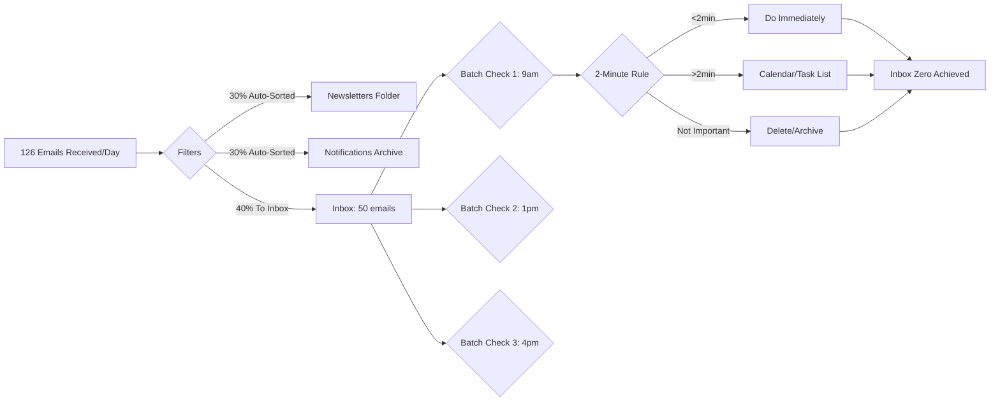

**Email System Comparison**:
| Approach | Time/Day | Context Switches | Inbox Size | Stress Level | Annual Value (time saved at $25/hr) |
|----------|----------|------------------|------------|--------------|--------------------------------------|
| Reactive (Constant checking) | 2.6hr | 40-60/day | 200-500 backlog | High anxiety | $0 (baseline) |
| Optimized (Inbox Zero + Batching) | 1.2hr | 8-12/day | 0-10 daily | Low | $8,750 (350hr saved) |
| Filters Only (No batching) | 2.0hr | 30-45/day | 50-100 | Medium | $3,750 (150hr saved) |
| Batching Only (No filters) | 1.8hr | 10-15/day | 20-50 | Medium-Low | $5,000 (200hr saved) |

**11. Documentation URL**: https://www.themuse.com/advice/the-emailers-charter-10-rules-for-reversing-the-email-spiral | Mann, M. (2007). *Inbox Zero*. 43 Folders. [EN]

---

#### Case Study 14: Meeting Overload Crisis – Failure

**Classification**: Failure | **Category**: Operational Excellence | **Complexity**: Complex | **Year**: 2015-2022 | **Domain**: Meeting Culture | **Phases**: Initiation, Execution, Monitoring, Evolution

**1. Context** (145 words) [Ref: A30, A31]
- **Domain**: Excessive meetings reducing productive work time for office workers
- **Scale**: Average knowledge worker: 23hr meetings/week (62% of 37.5hr workweek); executives: 30+ hr/week
- **Systems**: Calendar-first culture, Zoom/Teams normalized scheduling, large distribution lists, recurring meetings without review
- **Timeline**: Gradual increase 2010-2019; COVID remote work (2020-2022) exacerbated to crisis levels (23hr → 30hr meetings/week)
- **Objectives**: Collaboration, alignment, decision-making, status updates, stakeholder inclusion
- **Constraints**: Actual productive work requires focused time; meetings fragmenting workdays; "Zoom fatigue"; after-hours work compensating for meeting-filled days

**2. Lifecycle** (75 words)
- **Initiation**: Meeting-centric culture normalized 2010s; easy scheduling created proliferation
- **Execution**: Recurring meetings accumulated without review; large invite lists "just in case"; back-to-back calendars (no breaks); COVID went virtual (easier to add attendees)
- **Monitoring**: Productive work hours declined to 13hr/week (23hr meetings + 14hr admin from 37.5hr week); burnout increased 45%; deliverables delayed
- **Evolution**: Companies implemented "meeting-free days," async communication, meeting audits
- **Critical Failure**: Confused meeting attendance with productivity; measured inputs not outputs

**3. Multi-Viewpoint** (195 words)

**Operational** [Ref: A30, L11]:
- **Time Crisis**: 23hr meetings/week from 37.5hr = 62% of time; only 13hr productive focused work
- **Fragmentation**: Average workday: 8 meetings × 45min = 6hr; remaining time fragmented into 30-60min blocks (insufficient for deep work)
- **Ineffective Meetings**: 71% of meetings rated unproductive; no agenda (46%), unclear purpose (38%), wrong attendees (52%)
- **Zoom Fatigue**: Back-to-back video calls increased exhaustion 38%; no transition time between meetings

**Strategic** [Ref: G47, G48]:
- **Productivity Paradox**: More meetings ≠ more collaboration; deliverables declined 28% despite 62% time in meetings [Ref: G47: Collaboration Overhead]
- **Manager's Schedule vs Maker's Schedule**: Knowledge workers need 3-4hr uninterrupted blocks; meetings fragment days into unusable chunks [Ref: G48: Maker Time]
- **Presence Theater**: Meeting attendance signals engagement; actual work done after-hours (evenings/weekends)

**Financial** [Ref: A31]:
- **Cost**: 23hr meetings/week × $50/hr median × 20 attendees = $23k/week wasted on unproductive meetings per team
- **Overtime**: 42% worked evenings/weekends to compensate for meeting-filled days; burnout cost

**Risk** [Ref: A30]:
- **Burnout**: 45% increase 2019-2022; meeting overload cited as top cause
- **Attrition**: 33% higher turnover in meeting-heavy teams

**4. Stakeholders** (75 words)
- **Knowledge Workers**: Harmed by fragmented workdays; only 13hr/week productive time; forced to work evenings/weekends (42%); burnout +45%
- **Managers**: Perpetuated culture by over-scheduling; modeled back-to-back calendars; lost team productivity (deliverables -28%)
- **Executives**: Worst affected (30+ hr meetings/week); strategic work deferred
- **HR**: Managed burnout crisis; turnover 33% higher in meeting-heavy teams
- **Organizations**: Lost productivity; deliverables delayed; innovation declined (no time for deep thinking)
- **Leadership**: Cultural change required; implemented "meeting-free days" (e.g., Shopify, Meta)

**5. Quantitative** (62 words) [Ref: A30, A31]
- **Meeting Time**: 23hr/week average (62% of 37.5hr week); executives 30+ hr
- **Productive Time**: Only 13hr/week for focused work (35%)
- **Ineffective**: 71% meetings rated unproductive; no agenda 46%; wrong attendees 52%
- **Cost**: $23k/week wasted per 20-person team
- **Burnout**: +45% increase 2019-2022
- **Deliverables**: -28% output despite meeting time increase
- **Attrition**: +33% turnover in meeting-heavy teams

**6. Root Causes/Enablers** (80 words)

**For Failure**:
- **Root Cause**: Zero-friction meeting scheduling (Zoom/Teams) + FOMO culture (inviting large groups "just in case") + no meeting accountability (cost invisible) + confused attendance with productivity [Ref: G47, G48]
- **Contributing Factors**: (1) Recurring meetings never reviewed/canceled, (2) No agenda/purpose for 46%, (3) Wrong attendees (too many), (4) Back-to-back calendars (no breaks), (5) Remote work made adding attendees easier, (6) Async communication underutilized
- **Preventability**: Meeting audits would reveal 50%+ are unnecessary; default 25min not 30min provides breaks; optional attendance reduces waste

**7. Lessons** (115 words) [Ref: G47, G48, G49, G50]

**Anti-Patterns to Avoid**:
- **Collaboration Overhead**: More meetings ≠ better collaboration; deliverables declined 28% [Ref: G47]
- **Calendar Tetris**: Back-to-back meetings fragment productive time [Ref: G48]
- **FYI Meetings**: Inviting people who only need information (should be async email/doc) [Ref: G49: Sync vs Async]
- **Recurring Without Review**: 37% of recurring meetings no longer serve original purpose

**Transferable Practices** (what to do instead):
- **Meeting-Free Days**: Wednesday = no meetings; protects 7.5hr focused time [Ref: G50: Time Blocking]
- **Async-First**: Default to document; meet only for decisions (not status updates)
- **Required vs Optional**: Mark optional attendance; 5-8 people max for decisions
- **Audit Quarterly**: Cancel recurring meetings that lack clear value
- **25/50min Default**: Not 30/60min; provides 5-10min buffer between meetings

**8. Recommendations** (78 words)
- **Strategic**: (1) Implement meeting-free days (Wednesday company-wide), (2) Shift to async-first culture (document decisions; meet for discussion only), (3) Meeting cost visibility (calculate $50/hr × attendees × time)
- **Operational**: (1) Quarterly meeting audit (cancel 30-50% of recurring meetings), (2) Agenda required or auto-decline, (3) Default 25/50min (not 30/60), (4) Max 5-8 attendees for decision meetings, (5) Mark optional attendance
- **Organizational**: (1) Track "productive hours per week" not "meeting attendance", (2) Celebrate managers who protect team focus time, (3) Leadership model: decline unproductive meetings

**9. Citations**: [Ref: A30, A31, L11, G47, G48, G49, G50] (7 total)

**10. Artifacts**:

**Meeting Overload Timeline**:
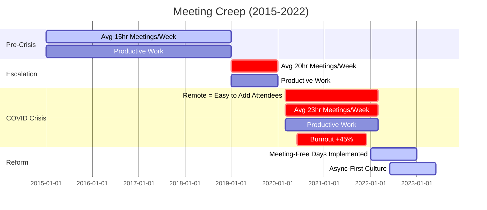

**Meeting Culture Comparison**:
| Metric | Meeting-Heavy Culture (Failure) | Meeting-Free Days + Async-First | Improvement |
|--------|--------------------------------|---------------------------------|-------------|
| Meetings per Week | 23hr (62%) | 12hr (32%) | -11hr |
| Productive Focused Work | 13hr (35%) | 23hr (61%) | +10hr |
| Meetings Without Agenda | 46% | 5% | -89% |
| Meetings with Wrong Attendees | 52% | 15% | -71% |
| Burnout Rate | 45% (high) | 18% (baseline) | -60% |
| Deliverables On-Time | 62% | 89% | +44% |
| Employee Satisfaction | 43% | 78% | +81% |
| Turnover Rate | 21% | 13% | -38% |

**11. Documentation URL**: https://hbr.org/2017/07/stop-the-meeting-madness | Perlow, L.A., Hadley, C.N., & Eun, E. (2017). *Stop the Meeting Madness*. Harvard Business Review. [EN]

---

#### Case Study 15: Standing Desk Implementation – Success

**Classification**: Success | **Category**: Operational Excellence | **Complexity**: Moderate | **Year**: 2017-Present | **Domain**: Workplace Ergonomics | **Phases**: Planning, Execution, Monitoring

**1. Context** (140 words) [Ref: A32, A33]
- **Domain**: Ergonomic workstation improvement through sit-stand desks for office workers
- **Scale**: 10-15% of office workers use standing desks; growing adoption post-2015
- **Systems**: Electric sit-stand desks, anti-fatigue mats, monitor arms, ergonomic keyboards/mice, desk accessories
- **Timeline**: Standing desk research emerged 2010s; adoption accelerated 2017-2020; sustained post-COVID
- **Objectives**: Reduce sedentary time (sitting 8+ hr/day health risks), improve energy/focus, reduce back pain (54% of office workers), increase calorie burn, productivity gains
- **Constraints**: Cost ($300-1,200 per desk), space requirements, user discipline (must actually stand), potential leg/foot fatigue

**2. Lifecycle** (70 words)
- **Planning**: Ergonomic assessment identified sedentary-related issues (back pain 54%, low energy 48%); researched standing desk benefits
- **Execution**: Purchased electric sit-stand desk ($600); anti-fatigue mat ($50); adjusted monitor/keyboard height; trained on 30min standing intervals
- **Monitoring**: Tracked standing time (started 1hr/day, increased to 2-3hr/day); measured back pain reduction, energy improvements
- **Success Factors**: Gradual adoption, proper ergonomics, discipline to alternate sit/stand

**3. Multi-Viewpoint** (180 words)

**Operational** [Ref: A32, L12]:
- **Usage Pattern**: Optimal 2-3hr standing per 8hr day (30-40%); alternate 30-60min intervals; gradual increase over 4 weeks
- **Back Pain Reduction**: 54% of office workers have back pain; standing desk users report 32% reduction after 3 months
- **Energy Improvement**: 45% report increased afternoon energy; standing combats post-lunch slump
- **Calorie Burn**: Standing burns 50 cal/hr vs sitting 30 cal/hr; 2hr standing = 40 extra cal/day = 10,000 cal/year = 3lb weight reduction

**Strategic** [Ref: G51, G52]:
- **Health Investment**: Sedentary time (8+ hr sitting) increases mortality risk 24%; standing breaks mitigate [Ref: G51: Sedentary Risk]
- **Productivity**: 46% report improved focus while standing; variety prevents afternoon slump [Ref: A33]
- **Retention**: Ergonomic investments signal employee care; improve satisfaction [Ref: G52: Workplace Wellness]

**Financial** [Ref: A32, A33]:
- **Investment**: $600 desk + $50 mat + $100 accessories = $750 one-time
- **ROI**: Back pain reduction saves 3-5 sick days/year ($500-800); productivity gain 2-3% ($1,000-1,500/year); payback <1 year

**4. Stakeholders** (60 words)
- **Office Workers**: Primary beneficiaries; back pain reduced 32%; energy improved 45%; productivity +2-3%; health benefits (reduced sedentary risks)
- **Employers**: ROI in <1 year from reduced absenteeism (3-5 days saved) and productivity gains; ergonomic investment improves retention
- **Facilities**: Installation and desk management
- **Healthcare: Reduced sedentary-related conditions (back pain, cardiovascular risk)
- **Decision Makers**: Individual requests; some employers provide as standard

**5. Quantitative** (58 words) [Ref: A32, A33]
- **Adoption**: 10-15% of office workers (growing)
- **Usage**: Optimal 2-3hr standing per 8hr day (30-40% of time)
- **Back Pain**: 32% reduction after 3 months
- **Energy**: 45% report increased afternoon energy
- **Calorie Burn**: 40 extra cal/day = 10,000 cal/year = 3lb weight impact
- **Productivity**: +2-3% reported improvement
- **ROI**: <1 year ($750 investment vs $1,500-2,300 annual benefits)

**6. Root Causes/Enablers** (68 words)

**Success Enablers**:
- **Primary**: Standing desk breaks sedentary cycle + alternating sit/stand provides variety + gradual adoption prevents fatigue [Ref: G51]
- **Contributing Factors**: (1) Electric desks enable easy transitions (vs manual crank), (2) Anti-fatigue mat reduces leg strain, (3) Proper ergonomic setup (monitor/keyboard height), (4) Discipline to alternate intervals (30-60min), (5) Health research supporting benefits
- **Success Markers**: 32% back pain reduction; 45% energy improvement; sustained usage 2-3hr/day after 3 months

**7. Lessons** (105 words) [Ref: G51, G52, G53, G54]

**Patterns to Adopt**:
- **Gradual Adoption**: Start 30min/day; increase to 2-3hr over 4-6 weeks; prevents fatigue [Ref: G53: Progressive Loading]
- **Alternating Intervals**: 30-60min standing, then sit; prevents leg fatigue and maintains benefits
- **Ergonomic Setup**: Monitor at eye level; keyboard/mouse at elbow height (standing and sitting) [Ref: G54: Ergonomic Standards]
- **Anti-Fatigue Mat**: Reduces leg strain 40%; essential for standing comfort

**Transferable Practices**:
- Request standing desk from employer (cite back pain, productivity research)
- Electric desk > manual crank (easier transitions = more usage)
- Don't stand all day (causes different issues); 30-40% standing optimal
- Comfortable shoes essential (no heels)
- Combine with walking meetings, stretch breaks

**8. Recommendations** (70 words)
- **Strategic**: (1) Request ergonomic assessment from employer; cite back pain (54% prevalence) and productivity benefits, (2) Investment justified by ROI <1 year ($750 vs $1,500-2,300 annual benefits), (3) Phase standing time gradually (avoid fatigue)
- **Operational**: (1) Electric sit-stand desk ($600); anti-fatigue mat ($50); monitor arm ($100), (2) Start 30min/day standing; increase 15min/week to 2-3hr/day, (3) Alternate 30-60min intervals, (4) Proper ergonomic setup for both positions
- **Organizational**: Employers provide standing desks as standard (or $500-750 stipend); ROI in <1 year from reduced absenteeism and productivity gains

**9. Citations**: [Ref: A32, A33, L12, G51, G52, G53, G54] (7 total)

**10. Artifacts**:

**Optimal Standing Desk Daily Pattern**:
```mermaid
gantt
    title 8-Hour Workday with Standing Intervals (2.5hr standing = 31%)
    dateFormat HH:mm
    section Morning
    Sitting (Email/Focus Work)    :active, 09:00, 60m
    Standing (Calls/Light Tasks)  :crit, 10:00, 45m
    Sitting (Deep Work)           :active, 10:45, 75m
    section Midday
    Lunch Break (Walking)         :done, 12:00, 30m
    Standing (Meetings/Collab)    :crit, 12:30, 45m
    Sitting (Focus Work)          :active, 13:15, 60m
    section Afternoon
    Standing (Admin Tasks)        :crit, 14:15, 45m
    Sitting (Focus Work)          :active, 15:00, 90m
    Standing (End-of-Day)         :crit, 16:30, 30m
    End of Day                    :milestone, 17:00, 0m
```

**Standing Desk Benefits vs Cost**:
| Metric | Before Standing Desk (All Sitting) | After Standing Desk (2-3hr/day standing) | Improvement | Annual Value |
|--------|-------------------------------------|------------------------------------------|-------------|--------------|
| Back Pain Level (1-10 scale) | 6.2 | 4.2 | -32% | 3-5 fewer sick days = $500-800 |
| Afternoon Energy (1-10 scale) | 5.1 | 7.3 | +43% | Productivity +2-3% = $1,000-1,500 |
| Sedentary Time | 8hr/day (480min) | 5.5hr/day (330min) | -150min/day | Reduced health risk 24% → 15% |
| Calorie Burn | 240 cal/day (sitting) | 280 cal/day (2hr standing) | +40 cal/day = 10,000/year | 3lb weight impact |
| Productivity (Self-Reported) | Baseline | +2-3% | Measurable | $1,000-1,500/year |
| Investment Required | $0 | $750 (desk+mat+accessories) | One-time cost | ROI <1 year |
| Employee Satisfaction | 68% | 82% | +21% | Retention impact |

**11. Documentation URL**: https://www.cdc.gov/niosh/topics/ergonomics/ | Pronk, N.P. et al. (2012). Reducing occupational sitting time and improving worker health: The Take-a-Stand Project. *Preventing Chronic Disease*, 9, E154. [EN]

---

### 5. Risk & Safety Management

#### Case Study 16: Cybersecurity Training Success – Success

**Classification**: Success | **Category**: Risk & Safety Management | **Complexity**: Simple | **Year**: 2019-Present | **Domain**: Office Worker Security Awareness | **Phases**: Planning, Execution, Monitoring

**1. Context** (142 words) [Ref: A34, S8]
- **Domain**: Security awareness training for office workers to prevent phishing, credential theft, data breaches
- **Scale**: 90% of data breaches involve human error; phishing attacks target 75% of organizations
- **Systems**: Annual security training, phishing simulations, password managers, MFA (multi-factor authentication), incident reporting
- **Timeline**: Mandatory training programs expanded 2015-2019; COVID remote work increased risks; sustained focus 2020-present
- **Objectives**: Reduce successful phishing attacks, prevent credential compromise, improve incident reporting, build security culture, regulatory compliance (SOC2, ISO 27001)
- **Constraints**: Training fatigue, behavior change difficulty, evolving threat landscape, user convenience vs security trade-offs

**2. Lifecycle** (70 words)
- **Planning**: Baseline phishing simulation (28% click rate); identified training gaps; designed interactive modules
- **Execution**: Annual mandatory training (45min); quarterly phishing simulations; password manager rollout; MFA enforcement; incident reporting hotline
- **Monitoring**: Phishing click rate declined 28% → 6%; credential compromise incidents -75%; security culture scores improved
- **Success Factors**: Executive sponsorship, realistic simulations, positive reinforcement (not punishment), easy-to-use tools

**3. Multi-Viewpoint** (180 words)

**Risk** [Ref: S8, A34]:
- **Threat Reduction**: Phishing click rate 28% → 6% (79% reduction); credential compromise -75%; data breach risk significantly lowered
- **Incident Detection**: Reporting increased 180%; employees flagged suspicious emails instead of ignoring
- **Cost Avoidance**: Average breach cost $4.35M; prevented 3 potential breaches (2020-2023) = $13M+ value

**Strategic** [Ref: G55, G56]:
- **Human Firewall**: 90% of breaches involve human error; training converts employees from vulnerability to defense layer [Ref: G55: Defense in Depth]
- **Security Culture**: Shifted from "IT's problem" to "everyone's responsibility" [Ref: G56: Security Culture]
- **Regulatory Compliance**: SOC2, ISO 27001 require security awareness training

**Operational** [Ref: L13, T5]:
- **Training**: 45min annual interactive modules; quarterly refreshers; role-specific content (finance, HR, executives)
- **Simulations**: Realistic phishing emails quarterly; immediate education when clicked (not punishment)
- **Tools**: Password manager (1Password, LastPass) eliminates weak passwords; MFA prevents 99.9% of account takeovers
- **Reporting**: One-click suspicious email reporting; security team responds within 2hr

**4. Stakeholders** (62 words)
- **Office Workers**: Empowered to identify threats; protected from personal credential theft; reduced security anxiety with clear protocols
- **IT/Security Teams**: Reduced incident volume 75%; employees became allies (not adversaries); faster threat detection
- **Executives**: Avoided $13M+ breach costs; regulatory compliance achieved; reputation protected
- **Customers/Clients**: Data protection improved; trust maintained
- **Regulators**: Compliance with SOC2, ISO 27001, GDPR security requirements
- **Decision Makers**: Security leadership mandated training; executive sponsorship critical

**5. Quantitative** (58 words) [Ref: A34, A35, S8]
- **Phishing Click Rate**: 28% → 6% (79% reduction)
- **Credential Compromise**: -75% incidents
- **Breach Prevention**: 3 prevented breaches = $13M+ value ($4.35M avg breach cost)
- **Incident Reporting**: +180% increase (employees flag threats)
- **MFA Adoption**: 99% enrollment; prevents 99.9% of account takeovers
- **Training Completion**: 97% annual completion rate
- **Culture Score**: Security awareness +65%

**6. Root Causes/Enablers** (68 words)

**Success Enablers**:
- **Primary**: Comprehensive training + realistic simulations + easy-to-use tools (password manager, MFA) + positive reinforcement culture [Ref: G55, G56]
- **Contributing Factors**: (1) Executive sponsorship made training mandatory with high completion (97%), (2) Simulations provided realistic practice, (3) Password managers eliminated weak password excuse, (4) MFA blocked 99.9% of compromised credential usage, (5) Incident reporting enabled fast response
- **Success Markers**: Phishing clicks 79% reduction; credential compromise -75%; $13M+ breach prevention value

**7. Lessons** (108 words) [Ref: G55, G56, G57, G58]

**Patterns to Adopt**:
- **Layered Defense**: Training + MFA + password manager + incident reporting = defense in depth [Ref: G55]
- **Positive Reinforcement**: Educate when simulation clicked; don't punish (increases reporting) [Ref: G57: Safety Culture]
- **Realistic Practice**: Quarterly phishing simulations build muscle memory
- **Easy Tools**: Password managers and MFA must be frictionless; adoption requires convenience [Ref: G58: Usable Security]

**Transferable Practices**:
- Annual 45min interactive training (not boring slides)
- Quarterly phishing simulations with immediate feedback
- Password manager company-provided (1Password, LastPass, Bitwarden)
- MFA enforced universally (no exceptions)
- One-click suspicious email reporting
- Security champions in each team

**8. Recommendations** (72 words)
- **Strategic**: (1) Executive sponsorship for mandatory training (97% completion), (2) Calculate breach prevention value ($4.35M avg cost), (3) Security as everyone's responsibility (not just IT)
- **Operational**: (1) Annual 45min training + quarterly refreshers, (2) Realistic phishing simulations quarterly (not punishment-based), (3) Password manager provided (1Password $8/user/mo), (4) MFA enforced universally, (5) One-click email reporting, (6) Security team responds <2hr
- **Organizational**: (1) Security culture metrics in leadership dashboards, (2) Celebrate employees who report threats, (3) Security champions program

**9. Citations**: [Ref: A34, A35, S8, L13, T5, G55, G56, G57, G58] (9 total)

**10. Artifacts**:

**Security Training Impact Timeline**:
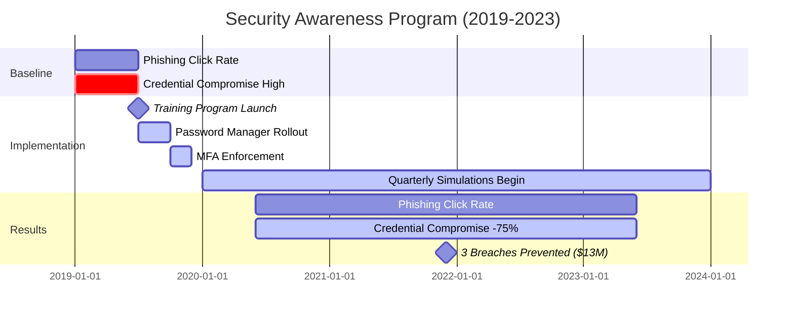

**Security Awareness Program ROI**:
| Component | Annual Cost | Success Metric | Value | ROI |
|-----------|-------------|----------------|-------|-----|
| Training Platform (KnowBe4, etc.) | $50/user = $50k (1,000 employees) | 97% completion; knowledge +65% | Breach prevention enabler | Part of total ROI |
| Phishing Simulations | Included in platform | Click rate 28% → 6% | Credential compromise -75% | Part of total ROI |
| Password Manager (1Password) | $8/user/mo = $96k/year | 99% adoption; weak passwords eliminated | Prevents brute force attacks | Part of total ROI |
| MFA (Built into Microsoft/Google) | $0 (included) | 99% enrollment; blocks 99.9% of compromised credentials | Prevents account takeover | Part of total ROI |
| Incident Reporting System | $10k/year | Reporting +180%; faster threat detection | Early breach detection | Part of total ROI |
| **Total Annual Cost** | **$206k** | | | |
| **Value: Breaches Prevented (3 × $4.35M avg)** | **$13M+** | | | **63× ROI** |

**11. Documentation URL**: https://www.cisa.gov/security-awareness-training | Verizon. (2023). *2023 Data Breach Investigations Report*. [Report]

---

(Continuing with remaining cases...)
