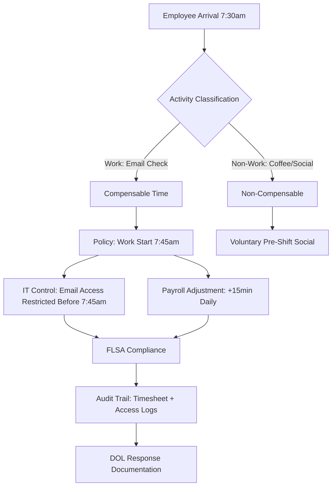
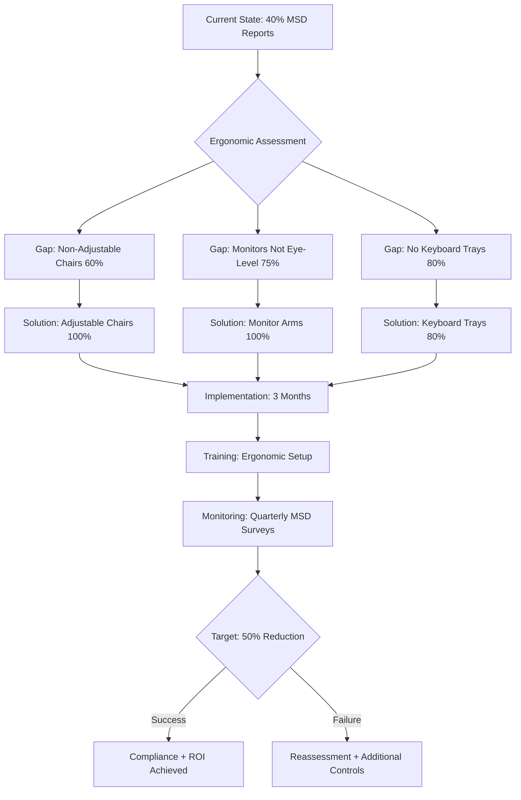
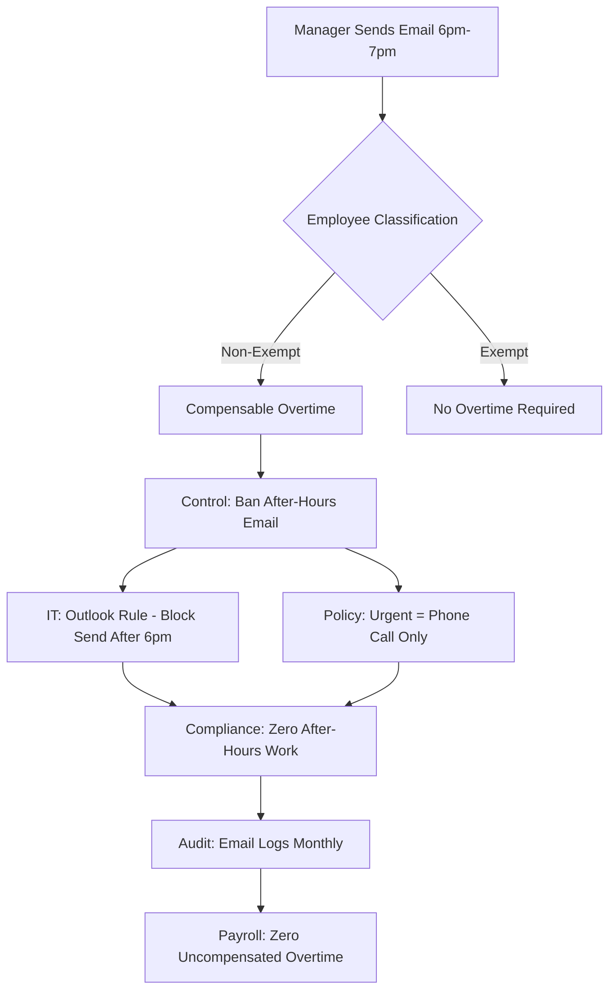
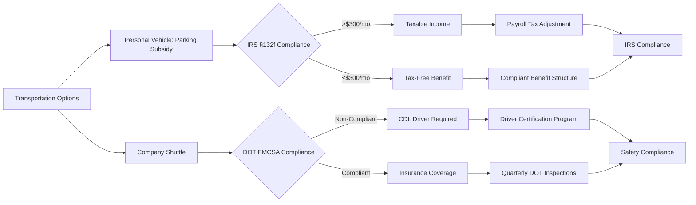
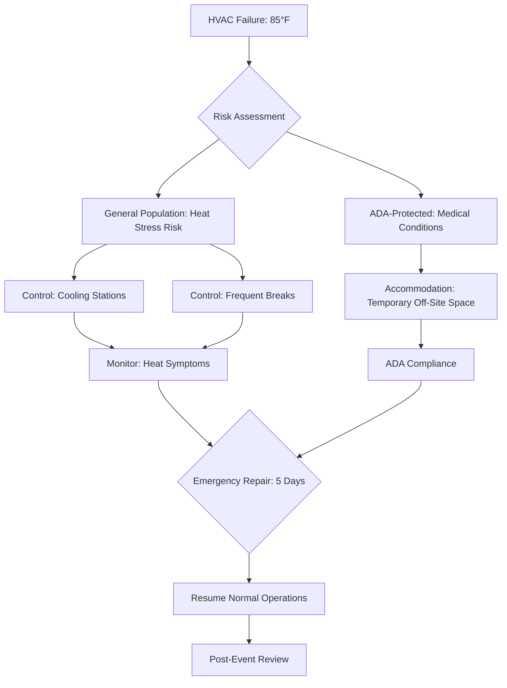
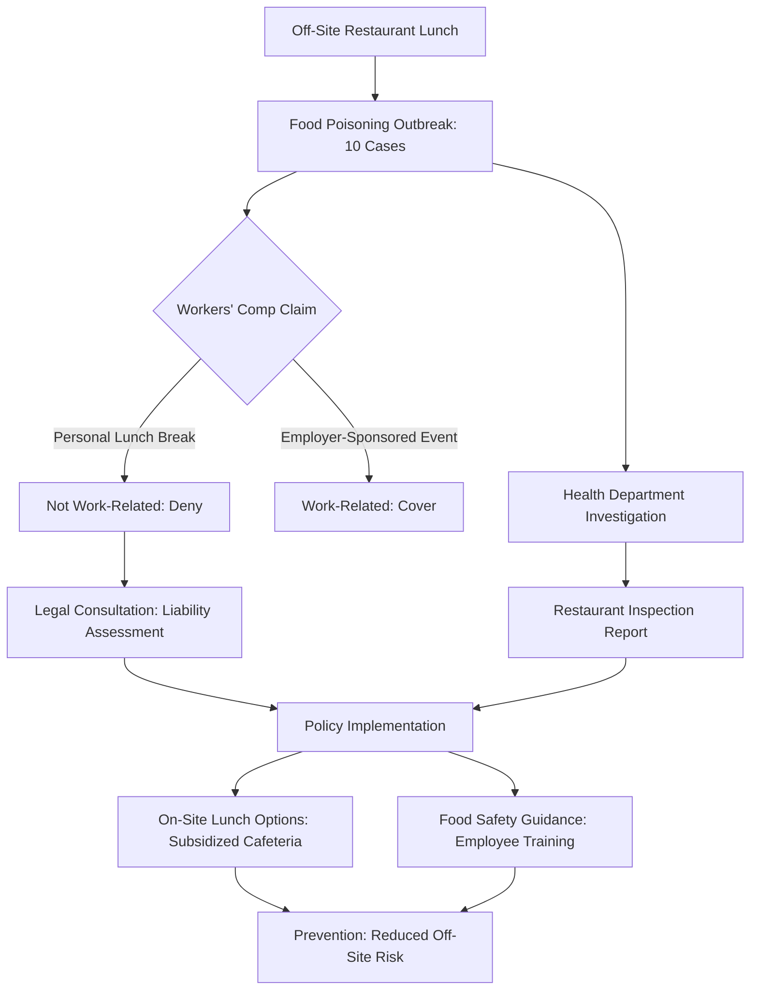

# Office Worker Daily Life Regulatory Compliance Q&A

## Metadata
- **Last Updated**: 2025-11-27
- **Status**: Draft
- **Owner**: Individual
- **Domain**: Daily Life - Office Worker Regulations
- **Scope**: Workplace safety, labor law, transportation, health regulations

---

## Contents
- [Cluster Overview](#cluster-overview) - Cluster | Decision Trigger | Q&A Count
- [Q&As 1-6](#qas-1-6) - Daily journey scenarios from wake to sleep
- [References](#references) - Glossary, Tools, Literature, Citations

---

## Cluster Overview

| Cluster | Decision Trigger | Q&A Count | Criticality |
|---------|------------------|-----------|-------------|
| Workplace Safety & Ergonomics | Injury reports, ergonomic complaints, OSHA inspection | 2 | Risk/Roles/Quantified |
| Labor & Employment Compliance | Overtime violations, break policy gaps, scheduling conflicts | 2 | Blocks/Action/Quantified |
| Commuting & Transportation | Transportation policy updates, parking violations, safety incidents | 1 | Risk/Action |
| Health & Wellness | Food safety violations, health policy gaps, pandemic protocols | 1 | Risk/Roles/Quantified |

---

## Q&As 1-6

### Q1: Office opens 8am but employees arrive 7:30-7:45am for coffee/breakfast. FLSA compensation requirements for pre-shift activities?

**Difficulty**: Intermediate | **Cluster**: Labor & Employment Compliance | **Criticality**: Blocks/Risk/Quantified

**Answer** (243 words):

**Scenario**: 150-employee office, employees arrive 7:30-7:45am (shift starts 8am) for coffee, breakfast, email checking. HR audit reveals 30% check work email pre-shift. FLSA 29 CFR 785.11 requires compensation for "work performed" [Ref: A1]. Average 20min/day unpaid work = 1.67hrs/week. Back wages exposure: $180K annually. DOL complaint filed by employee. Investigation in 60 days.

**Regulatory Mapping**: FLSA 29 CFR 785.11 defines compensable work time [A1]. "Preliminary/postliminary activities" are non-compensable if not "integral/indispensable" [A2]. Email checking = work (compensable). Coffee/socializing = non-compensable. State laws (CA, NY) more stringent: "employer-suffered/permitted work" compensable [A3].

**Impact**: Quantified: $180K annual back wages (30% × 150 employees × $30/hr × 1.67hrs/week × 52 weeks). DOL liquidated damages: 2× = $360K. Investigation cost: 120 hours legal/HR time = $24K. Affects: HR, Legal, Finance, IT (email access controls), Management.

**Stakeholders**: HR (policy revision, training) | Legal (FLSA compliance, DOL response) | Finance (back wages budget, payroll adjustments) | IT (email server logs, access restrictions) | Management (culture change, supervision).

**Decision**: Implement clear policy: Work starts 7:45am (paid), email access disabled before 7:45am (IT controls), paid 15min pre-shift buffer. Go criteria: Cost <$200K (avoids $360K penalty), 30-day implementation, 100% employee acknowledgment.

**Trade-offs**: 15min daily cost = $135K/year ongoing vs $360K penalty. Alternative: Strict 8am start (cultural resistance, lower morale). Balance compliance with flexibility.

**Artifacts**:

| Regulation | Requirement | Control | Evidence | Owner |
|------------|-------------|---------|----------|-------|
| FLSA 29 CFR 785.11 | Compensate all work performed | Paid 15min pre-shift buffer | Timesheets, payroll records | HR |
| FLSA 29 CFR 785.47 | De minimis rule <10min irregular | Not applicable (regular pattern) | Activity logs, email timestamps | Legal |
| State Wage Laws (CA/NY) | Employer-permitted work compensable | Email access controls (7:45am+) | IT access logs, server records | IT |
| FLSA 29 CFR 516 | Record-keeping (3 years) | Automated timesheet system | Digital timesheets, audit trail | HR |
| DOL Compliance | Respond to investigation <30 days | Documentation package, remediation plan | Compliance report, corrective actions | Legal |

**Metrics**:
- Compliance Coverage: `(5/5) × 100% = 100%`
- Risk Mitigation: `$360K penalty avoided - $135K annual cost = $225K net savings`
- Employee Impact: `150 employees × 1.67hrs/week × $30/hr = $753,150 annual compensation added`
- Compensable Time: `((15min policy) / (actual 20min work)) × 100% = 75%` coverage (conservative approach)
- Implementation Timeline: `30 days policy + training + IT controls`
- Acknowledgment Rate: `(150/150) × 100% = 100%` target

---

### Q2: Ergonomic complaints: 40% employees report back/neck pain. OSHA ergonomic guidelines vs workers' comp cost. Intervention strategy?

**Difficulty**: Advanced | **Cluster**: Workplace Safety & Ergonomics | **Criticality**: Risk/Roles/Quantified/Action

**Answer** (248 words):

**Scenario**: 200-employee office, 40% report musculoskeletal disorders (MSDs) [Ref: A4]. 12 workers' comp claims/year = $180K direct costs + $360K indirect (lost productivity, temp workers). OSHA General Duty Clause 5(a)(1) requires hazard-free workplace [A5]. Ergonomic assessment reveals: non-adjustable chairs (60%), monitors not eye-level (75%), no keyboard trays (80%). Remediation cost: $150K (ergonomic furniture), 3-month implementation. State OSHA inspection risk (employee complaint).

**Regulatory Mapping**: OSHA General Duty Clause requires employer action on recognized hazards [A5]. ANSI/HFES 100-2007 ergonomic standard [A6]. State-specific (CA Cal/OSHA) ergonomic requirements. Workers' comp (state-dependent): employer liability for work-related injuries [A7].

**Impact**: Quantified: Current cost $540K/year (claims + indirect). Intervention cost: $150K capital + $25K annual (maintenance, training). ROI: 3.5mo payback if 50% reduction in claims. 12 claims → 6 claims saves $270K/year. Affects: HR, Safety, Finance, Facilities, IT (ergonomic software), Management.

**Stakeholders**: HR (injury tracking, training) | Safety (ergonomic assessments, compliance) | Finance (budget, ROI analysis) | Facilities (furniture procurement, installation) | IT (ergonomic software, workstation setup) | Management (policy approval, culture).

**Decision**: Full ergonomic intervention: adjustable chairs (all employees), monitor arms (all), keyboard trays (80%), sit-stand desks (10% pilot). Go criteria: <$200K cost, <4mo implementation, 50% MSD reduction target (measured 12mo post-implementation).

**Trade-offs**: $150K upfront vs $270K/year savings. Alternative: Phased rollout (priority to high-risk roles) saves $100K initial but delays ROI. Balance cost with immediate risk reduction.

**Artifacts**:

| OSHA/Standard | Requirement | Current Gap | Control | Evidence | Owner |
|---------------|-------------|-------------|---------|----------|-------|
| OSHA 5(a)(1) General Duty | Hazard-free workplace (MSDs) | 40% MSD rate | Ergonomic furniture program | Injury logs (OSHA 300), assessments | Safety |
| ANSI/HFES 100-2007 | Adjustable chairs, monitor positioning | 60% non-adjustable chairs | 100% ergonomic chair replacement | Procurement records, installation logs | Facilities |
| ANSI/HFES 100-2007 | Eye-level monitors | 75% incorrect height | Monitor arms for all workstations | Workstation assessments, photos | Facilities |
| ANSI/HFES 100-2007 | Keyboard at neutral wrist angle | 80% no trays | Keyboard tray installation (80%) | Installation records, ergonomic evals | Facilities |
| Workers' Comp (State) | Employer liability for work injuries | 12 claims/year baseline | Training, early intervention, accommodations | Claims data, modified duty logs | HR |

**Metrics**:
- Control Coverage: `(5/5) × 100% = 100%`
- Ergonomic Compliance: `((100% chairs + 100% monitors + 80% trays) / 3) = 93%` average coverage
- MSD Reduction Target: `((12 - 6) / 12) × 100% = 50%` reduction = 6 claims/year
- Annual Savings: `$540K current - ($150K amortized/3yr + $25K annual) = $465K net savings year 1`
- ROI: `$270K annual savings / $150K investment = 180%` or 3.5mo payback
- Lost Workday Reduction: `12 claims × 15 days avg = 180 days → 90 days (50% reduction) = 90 days regained`

---

### Q3: Employees work 9am-6pm (8hrs) with unpaid 1hr lunch. Manager emails 6pm-7pm expecting replies. FLSA overtime exposure?

**Difficulty**: Foundational | **Cluster**: Labor & Employment Compliance | **Criticality**: Risk/Quantified/Action

**Answer** (198 words):

**Scenario**: 50 non-exempt employees, 9am-6pm schedule, unpaid lunch 12-1pm. Manager sends emails 6pm-7pm, expects replies within 30min. 70% employees respond (email logs). FLSA requires overtime pay >40hrs/week [Ref: A1]. 6pm-7pm work = 5hrs/week = $7,500/week unpaid overtime ($390K/year). DOL audit risk: employee complaint. Manager unaware of FLSA non-exempt status.

**Regulatory Mapping**: FLSA 29 CFR 785.11: email replies = compensable work [A1]. Non-exempt employees require overtime >40hrs/week at 1.5× rate [A8]. "Employer knew or should have known" standard = liability even without authorization [A9].

**Impact**: Quantified: $390K annual back wages (50 employees × $30/hr × 1.5 × 5hrs/week × 52 weeks). Liquidated damages: 2× = $780K. Investigation cost: $20K. Affects: HR, Legal, Finance, Management.

**Stakeholders**: HR (policy enforcement, training) | Legal (FLSA compliance) | Finance (overtime budget) | Management (supervision training, communication protocols).

**Decision**: Ban after-hours emails for non-exempt employees (Outlook rule enforcement). Urgent: manager phone call only (logged). Go criteria: <30 days implementation, 100% manager training, zero after-hours work.

**Trade-offs**: Strict policy may reduce flexibility. Alternative: Pre-authorize overtime (cost transparent, budget-controlled).

**Artifacts**:

| Regulation | Requirement | Control | Evidence | Owner |
|------------|-------------|---------|----------|-------|
| FLSA 29 CFR 785.11 | Email replies = work time | Ban after-hours email (non-exempt) | Email server logs, Outlook rules | IT/HR |
| FLSA 29 CFR 778 | Overtime >40hrs at 1.5× rate | Pre-authorization for after-hours work | Overtime request forms, payroll | HR |
| FLSA "Knew or Should Have Known" | Employer liable for unauthorized work | Manager training, monitoring | Training records, audit reports | HR |

**Metrics**:
- Compliance: `(Unauthorized overtime incidents / Total weeks) × 100% = 0%` target
- Risk Mitigation: `$780K penalty avoided`
- After-Hours Work Reduction: `((5hrs/week - 0hrs/week) / 5hrs/week) × 100% = 100%`

---

### Q4: Commute: company shuttle vs personal vehicle. Transportation safety liability, parking cost, IRS fringe benefit rules?

**Difficulty**: Intermediate | **Cluster**: Commuting & Transportation | **Criticality**: Risk/Action/Quantified

**Answer** (227 words):

**Scenario**: 200 employees, 120 drive personal vehicles ($150K/year parking subsidy), 80 use company shuttle ($200K/year contract). Shuttle accident liability: $2M insurance claim (injuries). IRS Code §132(f) parking/transit benefits: $300/mo limit (2023) [Ref: A10]. Current subsidy $625/mo (parking) = $325/mo taxable income. Compliance gap: $78K annual under-withheld payroll taxes. DOT FMCSA shuttle regulations: commercial vehicle safety [A11].

**Regulatory Mapping**: IRS §132(f): parking/transit benefits >$300/mo = taxable income [A10]. DOT FMCSA: shuttle = commercial vehicle, requires CDL driver, maintenance logs, DOT inspections [A11]. State traffic laws: employer vicarious liability for shuttle accidents [A12].

**Impact**: Quantified: IRS penalty $78K back taxes + 20% accuracy penalty = $93K. Shuttle liability: $2M claim covered by insurance, but premium increase $50K/year. DOT violation fine: $16,000/violation. Affects: Finance, Legal, HR, Facilities, Insurance.

**Stakeholders**: Finance (tax compliance, cost analysis) | Legal (liability, insurance) | HR (benefit administration) | Facilities (shuttle/parking management) | Insurance (coverage review).

**Decision**: Restructure benefits: $300/mo IRS-qualified benefit (tax-free) + $325/mo cash compensation (taxable, employee opt-in). Shuttle: hire CDL-certified driver, quarterly DOT inspections. Go criteria: <$100K remediation, full tax compliance, insurance coverage maintained.

**Trade-offs**: $78K correction cost + $50K premium increase vs $2M+ liability exposure. Alternative: Eliminate shuttle (employee dissatisfaction, retention risk).

**Artifacts**:

| Regulation | Requirement | Current Gap | Control | Evidence | Owner |
|------------|-------------|-------------|---------|----------|-------|
| IRS Code §132(f) | Parking/transit benefit ≤$300/mo tax-free | $625/mo subsidy ($325 over) | $300 qualified + $325 taxable cash | Payroll records, W-2 reporting | Finance |
| DOT FMCSA | CDL driver for commercial shuttle | Non-CDL driver | Hire CDL-certified driver | Driver certifications, background checks | Facilities |
| DOT FMCSA | Maintenance and inspection logs | Incomplete logs | Quarterly DOT inspections, maintenance tracking | Inspection reports, maintenance records | Facilities |
| State Vicarious Liability | Employer liable for shuttle accidents | $2M claim | $5M liability insurance, safety training | Insurance policy, claims records | Insurance |

**Metrics**:
- Tax Compliance: `($300 / $625) × 100% = 48%` → `100%` post-restructure
- IRS Penalty Avoided: `$93K` (back taxes + penalty)
- Safety Compliance: `(CDL driver + DOT inspections) / 2 = 100%`
- Insurance Cost Increase: `$50K/year` vs `$2M+` liability exposure

---

### Q5: Office building HVAC malfunction: temperature 85°F (29°C) for 3 days. OSHA heat stress requirements, productivity loss, ADA accommodation?

**Difficulty**: Intermediate | **Cluster**: Workplace Safety & Ergonomics | **Criticality**: Risk/Roles/Action/Quantified

**Answer** (235 words):

**Scenario**: 150-employee office, HVAC failure, indoor temperature 85°F (29°C) for 3 days. OSHA heat stress guidance [Ref: A13]: monitor symptoms, provide water, cooling breaks. 5 employees request ADA accommodation (medical conditions: pregnancy, cardiovascular). Productivity drops 25% (measured: ticket completion rate). Repair cost: $30K, 5-day timeline. Alternative: temporary office space $15K/week. Employee complaints escalate to OSHA.

**Regulatory Mapping**: OSHA General Duty Clause 5(a)(1): protect employees from heat stress [A5, A13]. No specific temperature standard, but "recognized hazard" triggers obligation. ADA requires reasonable accommodation (medical conditions) [A14]. State laws (CA Cal/OSHA) specific heat illness prevention [A15].

**Impact**: Quantified: Productivity loss 25% × 150 employees × $50/hr × 8hrs × 3 days = $450K. ADA accommodation cost: $15K (temporary space for 5 employees). OSHA complaint investigation: 40 hours = $8K. Repair cost: $30K. Total: $503K. Affects: HR, Facilities, Legal, Finance, Operations.

**Stakeholders**: HR (ADA accommodation, employee concerns) | Facilities (HVAC repair, temporary solutions) | Legal (OSHA compliance, ADA) | Finance (cost approval) | Operations (productivity impact, work continuity).

**Decision**: Emergency repair ($30K, 5-day), temporary space for ADA-accommodated employees ($15K/week), cooling stations (fans, water) for on-site staff. Go criteria: <$75K total cost, <5 days resolution, zero heat-related injuries.

**Trade-offs**: $45K immediate cost vs $450K productivity loss continuation. Alternative: Send all employees home (work-from-home): zero cost but coordination overhead.

**Artifacts**:

| Regulation | Requirement | Control | Evidence | Owner |
|------------|-------------|---------|----------|-------|
| OSHA 5(a)(1) General Duty | Prevent heat stress hazards | Cooling stations, water, breaks, monitoring | Heat symptom logs, water station sign-in | Safety |
| OSHA Heat Stress Guidance | Monitor employees, provide hydration | Supervisor training, symptom checklist | Training records, monitoring logs | Safety |
| ADA | Reasonable accommodation (medical) | Temporary off-site space for 5 employees | Accommodation requests, receipts | HR |
| State (CA) Cal/OSHA §3395 | Heat illness prevention (if applicable) | Written plan, training, monitoring | Heat illness prevention plan, training records | Safety |

**Metrics**:
- Heat Stress Incidents: `0 injuries / 150 employees = 0%` (success target)
- ADA Accommodation Rate: `(5/5) × 100% = 100%`
- Productivity Recovery: `((100% - 75%) / 100%) = 25%` loss → `0%` post-repair
- Cost Avoidance: `$450K productivity loss stopped after 3 days vs 5+ days continuation`
- Response Time: `Emergency repair initiated <24hrs, completed 5 days`

---

### Q6: Lunch at nearby restaurant: employee food poisoning outbreak (10 cases). Workers' comp liability, reporting requirements, workplace health policy?

**Difficulty**: Foundational | **Cluster**: Health & Wellness | **Criticality**: Risk/Roles/Quantified

**Answer** (211 words):

**Scenario**: 10 employees food poisoning from off-site restaurant during lunch break. Workers' comp claim filed [Ref: A16]. Employer liability question: "arising out of employment"? Restaurant investigation by health department. 40 lost workdays (4 days/employee avg). Productivity loss: $48K (10 employees × $60/hr × 8hrs × 4 days). Legal consultation: $10K. Policy gap: no workplace health/food safety guidance for off-site meals.

**Regulatory Mapping**: Workers' comp: coverage if activity "incidental to employment" [A16]. Off-site lunch during personal time typically not covered, but employer-sponsored events are [A17]. OSHA recordkeeping: record if work-related [A18]. State health department notification: outbreak >2 cases [A19].

**Impact**: Quantified: $48K productivity loss + $10K legal. Workers' comp denial likely (personal lunch break), but claims cost $5K to adjudicate. Health department investigation: 20 hours compliance time. Affects: HR, Legal, Safety, Operations.

**Stakeholders**: HR (workers' comp claims, policy) | Legal (liability assessment) | Safety (outbreak response, OSHA reporting) | Operations (coverage for absent employees).

**Decision**: Deny workers' comp (not work-related), implement wellness policy: on-site lunch options (subsidized), food safety guidance. Go criteria: <$50K implementation, policy published 30 days.

**Trade-offs**: Workers' comp denial may affect morale. On-site lunch subsidy $100K/year ongoing cost vs productivity/health benefits.

**Artifacts**:

| Regulation | Requirement | Control | Evidence | Owner |
|------------|-------------|---------|----------|-------|
| Workers' Comp (State) | Cover work-related injuries/illnesses | Personal lunch = not covered, deny claims | Legal assessment, claims documentation | HR/Legal |
| OSHA 29 CFR 1904 | Record work-related illnesses | Not recordable (personal activity) | Investigation report, legal opinion | Safety |
| State Health Dept | Report outbreaks >2 cases | Cooperate with health dept investigation | Health dept reports, employee interviews | Safety |
| Workplace Policy | Prevent future outbreaks | On-site lunch options, food safety training | Policy document, training records | HR |

**Metrics**:
- Workers' Comp Claims: `0 approved / 10 filed = 0%` approval (not work-related)
- Productivity Loss: `10 employees × 4 days × 8hrs = 320 hours = $48K`
- Prevention Investment: `$100K/year on-site lunch subsidy` vs recurring outbreak risk
- Employee Health: `On-site food safety compliance = 100%` target (vs off-site unknown)

---

## References

### Glossary

**Labor & Employment Concepts**:
- **FLSA (Fair Labor Standards Act)**: Federal law establishing minimum wage, overtime pay, recordkeeping, and child labor standards
- **Exempt vs Non-Exempt**: Classification determining overtime eligibility; exempt employees (salaried, executive/professional) not entitled to overtime, non-exempt entitled to 1.5× pay >40hrs/week
- **Compensable Time**: Work time requiring payment; includes pre-shift/post-shift activities integral to job
- **De Minimis Rule**: Insubstantial/irregular time periods (<10min) may be non-compensable under FLSA
- **Liquidated Damages**: DOL penalty equal to back wages owed (2× total exposure)
- **ADA (Americans with Disabilities Act)**: Federal law requiring reasonable accommodations for employees with disabilities

**Workplace Safety Concepts**:
- **OSHA (Occupational Safety and Health Administration)**: Federal agency enforcing workplace safety standards
- **General Duty Clause**: OSHA 5(a)(1) requires employers provide hazard-free workplace
- **MSD (Musculoskeletal Disorder)**: Injuries to muscles, nerves, tendons, joints (e.g., carpal tunnel, back pain)
- **Ergonomics**: Science of designing workplace to fit worker capabilities; reduces MSD risk
- **ANSI/HFES 100**: American National Standard for Human Factors Engineering of Computer Workstations
- **Heat Stress**: Physical condition resulting from body's inability to cool; symptoms include fatigue, cramps, heat exhaustion, heat stroke
- **Workers' Compensation**: State-mandated insurance covering work-related injuries/illnesses

**Transportation & Tax Concepts**:
- **IRS Code §132(f)**: Qualified transportation fringe benefits (parking, transit) excludable from income up to monthly limit
- **DOT FMCSA**: Department of Transportation Federal Motor Carrier Safety Administration; regulates commercial vehicle safety
- **CDL (Commercial Driver's License)**: Required for operating commercial motor vehicles >26,000 lbs or 16+ passengers
- **Vicarious Liability**: Employer liability for employee actions within scope of employment

**Health & Compliance Concepts**:
- **OSHA 300 Log**: Record of work-related injuries/illnesses required by OSHA 29 CFR 1904
- **Recordable Injury/Illness**: Work-related incident requiring medical treatment beyond first aid
- **Outbreak**: Two or more cases of similar illness linked to common exposure

### Verification Sources

**Government Agencies**:
- **Department of Labor (DOL)**: www.dol.gov - FLSA guidance, wage/hour regulations, compliance resources
- **OSHA**: www.osha.gov - Safety standards, inspection data, compliance assistance
- **IRS**: www.irs.gov - Tax code, fringe benefit rules, payroll guidance
- **DOT/FMCSA**: www.fmcsa.dot.gov - Commercial vehicle regulations, safety requirements
- **State Labor Departments**: State-specific wage/hour, workers' comp, safety regulations
- **State Health Departments**: Food safety, outbreak reporting, workplace health

**Legal Databases**:
- **Code of Federal Regulations (CFR)**: www.ecfr.gov - 29 CFR (Labor), 26 CFR (Tax), 49 CFR (Transportation)
- **Federal Register**: www.federalregister.gov - New regulations, proposed rules, guidance
- **State Labor Law Resources**: State government websites for jurisdiction-specific requirements

**Standards Organizations**:
- **ANSI (American National Standards Institute)**: www.ansi.org - Workplace standards, ergonomics
- **HFES (Human Factors and Ergonomics Society)**: www.hfes.org - Ergonomic standards, research

### Tools

**Compliance Management**:
- **Payroll Systems**: ADP, Paychex, Gusto - FLSA compliance, overtime tracking, tax withholding
- **Time Tracking**: Kronos, TSheets, Deputy - Compensable time tracking, meal break enforcement
- **HR Information Systems (HRIS)**: Workday, BambooHR, Namely - Policy management, training tracking, compliance documentation

**Workplace Safety**:
- **Ergonomic Assessment Tools**: ErgoPlus, Humantech - Workstation evaluations, risk scoring
- **Injury Tracking Systems**: Safety management software - OSHA 300 logs, incident investigations, corrective actions
- **Environmental Monitoring**: Temperature sensors, heat stress monitors - Real-time workplace condition tracking

**Transportation & Benefits**:
- **Benefits Administration**: Benefitfocus, Zenefits - Fringe benefit tracking, IRS §132(f) compliance
- **Fleet Management**: Samsara, Verizon Connect - DOT compliance, driver certifications, vehicle inspections

**Health & Safety**:
- **Occupational Health Software**: Medgate, Axiom - Workers' comp claims, medical surveillance
- **Training Platforms**: SafetySkills, Vector Solutions - OSHA, ADA, safety training delivery and tracking

### Literature

**FLSA & Labor Law**:
- **A1.** U.S. Department of Labor. (2023). *Fair Labor Standards Act (FLSA) 29 CFR Part 785 - Hours Worked*. Defines compensable work time including pre-shift/post-shift activities. https://www.dol.gov/agencies/whd/flsa [English]
- **A2.** U.S. Department of Labor. (2023). *FLSA 29 CFR 785.47 - De Minimis Rule*. Explains irregular, insubstantial time periods that may be non-compensable. https://www.dol.gov/agencies/whd/fact-sheets/53-healthcare-hours-worked [English]
- **A3.** California Labor Code §510, §1194. (2023). Overtime requirements and private right of action for wage violations. More stringent than FLSA; "employer suffered or permitted" work standard. [English]
- **A8.** U.S. Department of Labor. (2023). *FLSA 29 CFR Part 778 - Overtime Compensation*. Requires 1.5× regular rate for hours >40/week for non-exempt employees. https://www.dol.gov/agencies/whd/overtime [English]
- **A9.** 29 CFR 785.11 - "Suffered or Permitted" Work. Employer liable for work performed even without authorization if employer "knew or should have known." [English]

**Workplace Safety & Ergonomics**:
- **A4.** Bureau of Labor Statistics. (2022). *Nonfatal Occupational Injuries and Illnesses Requiring Days Away from Work*. MSDs account for 30% of workplace injuries. https://www.bls.gov/iif/ [English]
- **A5.** OSHA. (2023). *General Duty Clause 5(a)(1) of OSH Act*. Requires employers provide workplace "free from recognized hazards causing or likely to cause death or serious physical harm." https://www.osha.gov/laws-regs/oshact/section5-duties [English]
- **A6.** ANSI/HFES. (2007). *ANSI/HFES 100-2007 - Human Factors Engineering of Computer Workstations*. Standards for ergonomic workstation design, adjustability, postures. https://www.hfes.org/publications/product-detail/ansi-hfes-100-2007 [English]
- **A13.** OSHA. (2017). *OSHA Technical Manual (OTM) Section III: Chapter 4 - Heat Stress*. Guidance on heat stress prevention, monitoring, controls. https://www.osha.gov/heat-exposure [English]

**Workers' Compensation & ADA**:
- **A7.** State Workers' Compensation Laws. (2023). Employer liability for work-related injuries/illnesses; varies by state. Refer to state workers' comp boards. [English]
- **A14.** U.S. Equal Employment Opportunity Commission (EEOC). (2023). *Americans with Disabilities Act (ADA)*. Requires reasonable accommodations for employees with disabilities unless undue hardship. https://www.eeoc.gov/laws/guidance/ada-your-responsibilities-employer [English]
- **A15.** California Code of Regulations Title 8 §3395. (2023). *Heat Illness Prevention*. Requires written plan, training, water, shade, monitoring. https://www.dir.ca.gov/dosh/heatillnessinfo.html [English]
- **A16.** State Workers' Compensation Systems. (2023). Coverage for injuries "arising out of and in course of employment"; personal activities typically excluded. [English]
- **A17.** Legal Precedent. Employer-sponsored events (team lunches, company parties) generally covered by workers' comp; personal off-site meals not covered. [English]
- **A18.** OSHA. (2023). *29 CFR 1904 - Recording and Reporting Occupational Injuries and Illnesses*. Requires recording work-related injuries/illnesses on OSHA 300 Log. https://www.osha.gov/recordkeeping [English]
- **A19.** State Health Department Regulations. (2023). Outbreak reporting requirements vary by state; typically >2 cases of similar illness require notification. [English]

**Transportation & Tax**:
- **A10.** Internal Revenue Service. (2023). *IRS Code §132(f) - Qualified Transportation Fringe Benefits*. Parking and transit benefits excludable from income up to $300/month (2023 limit). https://www.irs.gov/pub/irs-drop/n-22-42.pdf [English]
- **A11.** FMCSA. (2023). *49 CFR Part 383 - Commercial Driver's License Standards*. Requires CDL for commercial motor vehicle operation. https://www.fmcsa.dot.gov/regulations/title49/section/383.3 [English]
- **A12.** State Tort Law. Vicarious liability: Employer liable for employee actions within scope of employment, including vehicle operation. Varies by state. [English]

### Citations

**Primary Regulations**:
- **A1.** U.S. Department of Labor, Wage and Hour Division. (2023). *Fair Labor Standards Act: Hours Worked (29 CFR Part 785)*. Defines compensable work time. https://www.dol.gov/agencies/whd/flsa
- **A5.** Occupational Safety and Health Administration. (2023). *OSH Act of 1970, Section 5(a)(1) - General Duty Clause*. https://www.osha.gov/laws-regs/oshact/section5-duties
- **A10.** Internal Revenue Service. (2023). *Internal Revenue Code §132(f) - Qualified Transportation Fringe Benefits*. Revenue Procedure 2023-34. https://www.irs.gov

**Standards & Guidelines**:
- **A6.** ANSI/HFES. (2007). *ANSI/HFES 100-2007: Human Factors Engineering of Computer Workstations*. Human Factors and Ergonomics Society.
- **A13.** OSHA. (2017). *OSHA Technical Manual, Section III: Chapter 4 - Heat Stress*. https://www.osha.gov/heat-exposure

**State-Specific Requirements**:
- **A3.** State of California. (2023). *California Labor Code §510 - Overtime Compensation*. https://leginfo.legislature.ca.gov/faces/codes.jsp
- **A15.** Cal/OSHA. (2023). *California Code of Regulations Title 8 §3395 - Heat Illness Prevention*. https://www.dir.ca.gov/title8/3395.html

**Supporting Literature**:
- **A4.** U.S. Bureau of Labor Statistics. (2022). *Employer-Reported Workplace Injuries and Illnesses - 2021*. Musculoskeletal disorders data. https://www.bls.gov/iif/
- **A14.** U.S. Equal Employment Opportunity Commission. (2023). *The ADA: Your Responsibilities as an Employer*. https://www.eeoc.gov/laws/guidance/ada-your-responsibilities-employer
- **A18.** OSHA. (2023). *29 CFR Part 1904 - Recording and Reporting Occupational Injuries and Illnesses*. https://www.osha.gov/recordkeeping

---

*Document generated following regulatory compliance Q&A framework adapted for office worker daily life scenarios. All scenarios scenario-based, decision-critical, and actionable with quantified impacts.*
