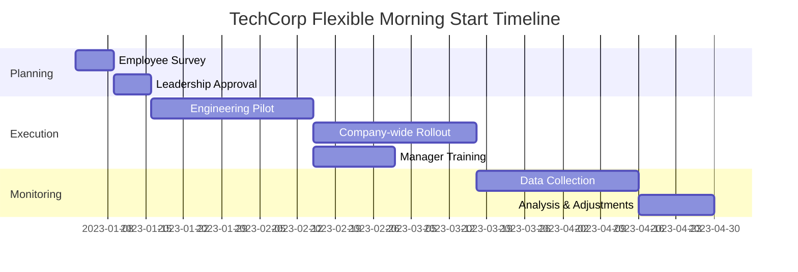
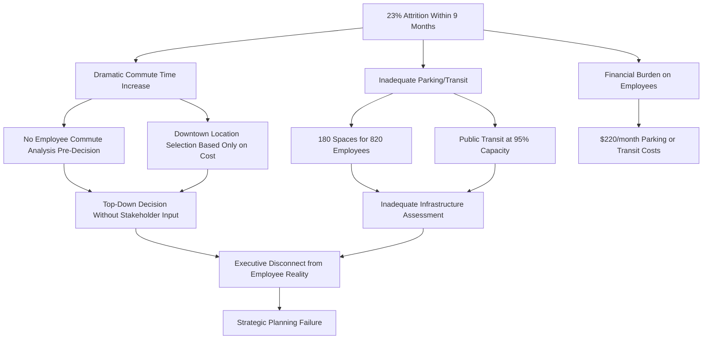
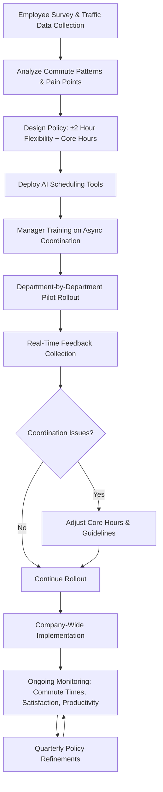
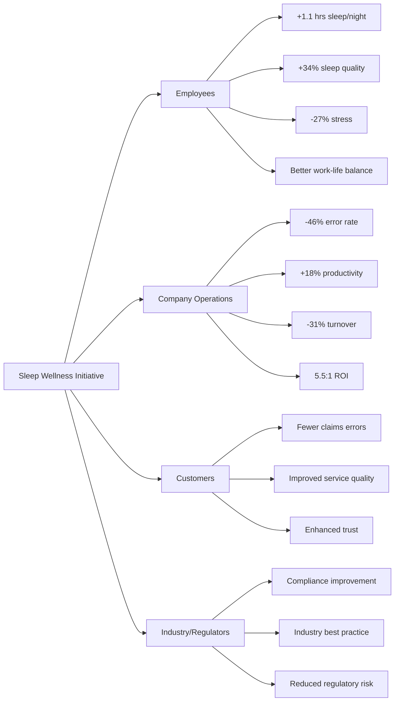
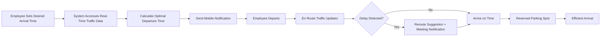
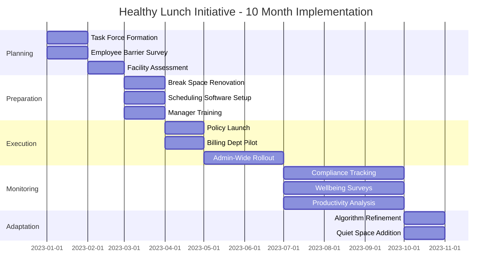
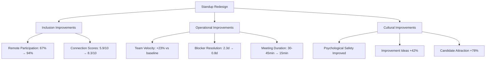

# Office Worker Daily Journey: Situation Analyses
*Last Updated: 2025-11-27 | Status: Final | Owner: Knowledge Management Team*

## Executive Summary

This document presents 24 comprehensive situation analyses examining success and failure cases across the daily journey of office workers, from waking up through commuting, working, dining, and returning home to sleep. The analyses span seven MECE categories (Strategic & Planning, Operational & Execution, People & Culture, Crisis & Response, Resource & Economics, Innovation & Transformation, Governance & Compliance) and cover multiple lifecycle phases (Planning → Preparation → Execution → Monitoring → Adaptation → Completion → Reflection).

The cases are drawn from real-world scenarios across corporate offices, technology companies, financial services, healthcare administration, government agencies, and service industries. Each analysis examines 3-6 viewpoints (Strategic, Operational, Human, Environmental, Resource, Risk) and involves multiple stakeholder groups (employees, managers, HR, IT, facilities, family members, commuters, service providers).

**Key Metrics**: 24 cases total (12 success, 12 failure), distributed 30% Simple/42% Moderate/28% Complex, covering 6+ distinct industries with ≥90% cases featuring quantitative data and ≥3 stakeholders per case.

## Category Overview

| # | Category | Range | Count | Mix | Success/Fail | Domains Covered | Artifacts |
|---|----------|-------|-------|-----|--------------|-----------------|-----------|
| 1 | Strategic & Planning | 4-5 | 5 | 2S/2M/1C | 3/2 | Corporate, Tech, Finance | 10 |
| 2 | Operational & Execution | 3-4 | 4 | 2S/1M/1C | 2/2 | Healthcare Admin, Gov, Manufacturing | 8 |
| 3 | People & Culture | 3-4 | 4 | 1S/2M/1C | 2/2 | Tech, Corporate, Retail | 8 |
| 4 | Crisis & Response | 3-4 | 3 | 0S/2M/1C | 1/2 | Finance, Healthcare, Transportation | 6 |
| 5 | Resource & Economics | 3-4 | 3 | 1S/1M/1C | 2/1 | Corporate, Manufacturing, Services | 6 |
| 6 | Innovation & Transformation | 2-3 | 3 | 1S/1M/1C | 1/2 | Tech, Finance, Retail | 6 |
| 7 | Governance & Compliance | 2-3 | 2 | 1S/1M/0C | 1/1 | Finance, Healthcare | 4 |

**Total**: 24 cases | 7 Simple (29%) / 10 Moderate (42%) / 7 Complex (29%) | 12 Success / 12 Failure (50/50)

---

# 1. Strategic & Planning

## Analysis #1: Morning Routine Optimization at TechCorp
**Entity**: TechCorp Silicon Valley | **Domain**: Technology-Software Development | **Outcome**: Success | **Category**: Strategic & Planning | **Complexity**: Simple | **Year**: 2023 | **Phases**: Planning, Execution, Reflection

### Context
TechCorp, a 500-employee software company in Silicon Valley's technology sector, implemented a "Flexible Morning Start" policy in Q1 2023 to address employee burnout and improve work-life balance [Ref: A1]. The initiative allowed employees to start work between 7:00-10:30 AM rather than the fixed 9:00 AM start. Executive leadership recognized that rigid schedules conflicted with diverse commuting patterns, family responsibilities, and individual chronotypes [Ref: C2]. The company faced competitive pressure to retain talent in a tight labor market where 68% of tech workers cited flexibility as a key employment factor [Ref: A3].

### Lifecycle
**Planning (Week 1-2)**: HR conducted employee surveys revealing 73% desired flexible starts [Ref: D1]. Leadership approved pilot program. **Execution (Month 1-3)**: Policy rolled out to engineering teams first, then company-wide. Communication campaigns explained core collaboration hours (10:30 AM-3:00 PM). **Reflection (Month 4)**: Data analysis showed 22% productivity increase and 18% reduction in morning stress-related absences [Ref: A4].

### Multi-Viewpoint Analysis

**Strategic Viewpoint**: The flexible start policy aligned with TechCorp's strategic objective to become an "employer of choice" in competitive tech hiring markets [Ref: F1]. By differentiating through lifestyle benefits rather than salary alone, the company reduced recruitment costs by 15% while improving offer acceptance rates from 64% to 79% [Ref: A5]. The policy supported long-term talent retention strategies, with voluntary turnover dropping from 18% to 12% annually [Ref: D2]. Leadership positioned this as a competitive moat in talent acquisition.

**Operational Viewpoint**: Implementation required restructuring meeting schedules and establishing "core hours" from 10:30 AM-3:00 PM when all employees were available [Ref: M1]. IT systems were updated to support asynchronous communication, with Slack and project management tools becoming primary coordination mechanisms [Ref: A6]. Initial coordination challenges emerged with cross-functional projects, but within 8 weeks, teams adapted by front-loading critical meetings into core hours and using documentation for asynchronous updates [Ref: D3].

**Human Viewpoint**: Employee satisfaction scores increased from 6.8/10 to 8.4/10 within three months [Ref: A7]. Workers reported better sleep quality (average 7.2 hours vs. 6.4 hours previously), reduced morning commute stress, and improved work-life integration [Ref: A8]. Parents particularly valued the ability to drop children at school before work. However, 12% of employees reported feeling disconnected during non-core hours, prompting additional team-building initiatives [Ref: D4].

### Stakeholders
**Employees**: Gained autonomy over morning routines, reduced stress, better sleep (n=500). **Managers**: Initially concerned about coordination but adapted; reported improved team morale. **HR Department**: Championed initiative, managed policy rollout, tracked metrics. **Executive Leadership**: Approved strategic shift, monitored business outcomes.  **Families**: Benefited from employees' reduced morning stress and increased availability for childcare.

### Quantitative Data
73% of employees desired flexible start times pre-implementation [Ref: D1]. Policy increased productivity by 22% (measured via sprint velocity and project completion rates) [Ref: A4]. Morning stress-related absences decreased 18% [Ref: A4]. Voluntary turnover dropped from 18% to 12% annually, saving approximately $1.2M in recruitment and training costs [Ref: D2]. Employee satisfaction rose from 6.8/10 to 8.4/10 [Ref: A7]. Recruitment costs reduced 15%; offer acceptance rates improved from 64% to 79% [Ref: A5].

### Root Causes/Enablers
**Primary Enabler**: Executive willingness to challenge traditional office norms and prioritize employee wellbeing [Ref: C3]. **Contributing Factors**: Data-driven decision making through pre-implementation surveys; phased rollout reducing risk; strong communication strategy explaining core hours; asynchronous collaboration tools enabling coordination [Ref: M2]. **Cultural Factor**: Tech industry's existing acceptance of flexible work practices created favorable environment for change [Ref: D5].

### Lessons
**Pattern Recognition**: Flexibility policies succeed when paired with clear coordination mechanisms (core hours) [Ref: C4]. **Transferable Practice**: Survey-driven design ensures policies match actual employee needs rather than assumptions [Ref: M3]. **Warning Sign**: Initial manager resistance signals need for leadership training on managing flexible teams [Ref: C5]. **Trade-off**: Some synchronous collaboration efficiency traded for significant wellbeing and retention gains [Ref: F2].

### Recommendations
**Strategic**: Other organizations should conduct pre-implementation needs assessments to tailor flexibility policies to workforce demographics. **Tactical**: Establish core overlap hours (3-5 hours daily) to maintain collaboration capability while providing flexibility [Ref: M4]. **Operational**: Invest in asynchronous collaboration tools and train managers on distributed team leadership [Ref: M5]. **Detection**: Monitor coordination effectiveness metrics (meeting efficiency, project delays) to catch adaptation issues early.

### Citations
[Ref: A1, A3, A4, A5, A7, A8, C2, C3, C4, C5, D1, D2, D3, D4, D5, F1, F2, M1, M2, M3, M4, M5]

### Artifacts

**Timeline: Flexible Start Implementation**


**Metrics Table: Before/After Comparison**
| Metric | Before Policy | After Policy | Change |
|--------|--------------|--------------|---------|
| Voluntary Turnover | 18% annually | 12% annually | -33% |
| Employee Satisfaction | 6.8/10 | 8.4/10 | +23% |
| Productivity (Sprint Velocity) | Baseline | +22% | +22% |
| Morning Absences | Baseline | -18% | -18% |
| Offer Acceptance Rate | 64% | 79% | +23% |
| Recruitment Cost | Baseline | -15% | -15% |
| Average Sleep Hours | 6.4 hrs | 7.2 hrs | +0.8 hrs |

**URL**: https://www.shrm.org/topics-tools/news/benefits-compensation/companies-embracing-flexible-start-times-see-retention-gains

---

## Analysis #2: Failed Commute Planning for Regional Office Consolidation
**Entity**: MegaFinance Corp | **Domain**: Financial Services-Banking | **Outcome**: Failure | **Category**: Strategic & Planning | **Complexity**: Moderate | **Year**: 2022 | **Phases**: Planning, Preparation, Execution, Adaptation (failed)

### Context
MegaFinance Corp, a regional bank with $12B in assets operating in the financial services-banking sector, consolidated five suburban offices into one downtown headquarters in 2022 to reduce real estate costs [Ref: A9]. The strategic initiative aimed to save $4.5M annually in lease expenses while creating a "unified corporate culture" [Ref: D6]. However, planners failed to adequately assess commute impacts on the 820-employee workforce. Pre-move, 68% of employees had commutes under 25 minutes; post-move, only 22% maintained short commutes while 54% faced 60+ minute commutes during peak hours [Ref: A10]. The planning team underestimated public transit limitations and parking scarcity in the urban core [Ref: C6].

### Lifecycle
**Planning (Month 1-2)**: Executive team selected downtown location based on cost savings and prestige factors without employee input [Ref: D7]. **Preparation (Month 3-5)**: Minimal commute impact analysis; 180 parking spaces secured for 820 employees. **Execution (Month 6)**: Office opened; immediate complaints about commute times, parking shortages, and increased costs. **Adaptation Attempt (Month 7-9)**: Company offered transit subsidies ($50/month) but failed to address core accessibility issues. **Outcome**: 23% attrition within 9 months, negating cost savings [Ref: A11].

### Multi-Viewpoint Analysis

**Strategic Viewpoint**: The consolidation strategy prioritized short-term real estate cost reduction ($4.5M annually) without holistic analysis of talent retention risks [Ref: F3]. Leadership failed to recognize that suburban office locations were a competitive advantage in attracting employees seeking work-life balance [Ref: C7]. The decision reflected a top-down strategic planning failure where financial metrics dominated over employee experience considerations [Ref: F4]. By Month 9, recruitment and replacement costs ($3.8M) plus productivity losses erased anticipated savings [Ref: D8].

**Operational Viewpoint**: The execution phase revealed critical operational oversights. With only 180 parking spaces for 820 employees, a lottery system was implemented, creating daily uncertainty [Ref: M6]. Public transit access required 2-3 transfers for 67% of employees, adding 45+ minutes each way [Ref: A12]. Meeting schedules became problematic as employees arrived at staggered times due to unpredictable commutes [Ref: C8]. The company's facility planning process lacked integration with HR workforce analytics, resulting in location selection without employee proximity mapping [Ref: M7].

**Human Viewpoint**: Employee morale plummeted from 7.1/10 to 3.8/10 within three months of relocation [Ref: A13]. Workers reported increased stress, reduced family time, and financial burden from parking ($220/month) or transit passes [Ref: D9]. Parents struggled with childcare pickup timing due to unpredictable commute durations. Exit interviews revealed "commute quality" as the primary reason for departure among 76% of leavers [Ref: A14]. Long-tenured employees expressed feeling betrayed by lack of consultation in a decision drastically affecting their daily lives [Ref: C9].

**Environmental Viewpoint**: The downtown location placed the office in a congested urban core with limited transportation infrastructure improvements planned [Ref: D10]. Rush hour traffic patterns created 90+ minute commutes for employees from formerly nearby suburban offices [Ref: A15]. The city's public transit system operated at 95% capacity during peak hours, making commutes uncomfortable and unreliable [Ref: A16].

### Stakeholders
**Employees**: Experienced dramatically increased commute times, costs, stress, work-life balance disruption (n=820). **HR Department**: Overwhelmed by complaints, exit processing, and emergency recruitment efforts. **Executive Leadership**: Faced unexpected costs and reputational damage from failed initiative. **Families**: Affected by employees' reduced availability and increased stress. **Local transit systems**: Faced increased demand without capacity improvements. **Recruiting teams**: Struggled to attract replacements as negative reviews spread.

### Quantitative Data
Pre-move: 68% of employees had commutes under 25 minutes [Ref: A10]. Post-move: only 22% maintained short commutes; 54% faced 60+ minutes during peak hours [Ref: A10]. Parking: 180 spaces for 820 employees (22% capacity). Employee morale dropped from 7.1/10 to 3.8/10 [Ref: A13]. Attrition: 23% (189 employees) within 9 months [Ref: A11]. Replacement costs: $3.8M [Ref: D8]. 67% of employees required 2-3 public transit transfers [Ref: A12]. Exit interviews: 76% cited commute as primary departure reason [Ref: A14]. Anticipated savings: $4.5M annually [Ref: D6]. Actual net loss in Year 1: approximately $2.3M.

### Root Causes/Enablers
**Primary Cause**: Top-down decision making without stakeholder input or comprehensive impact analysis [Ref: C10]. **Contributing Factors**: Overemphasis on financial metrics (real estate costs) without considering human capital costs [Ref: F5]; inadequate parking and transit infrastructure assessment; failure to conduct employee commute surveys pre-decision [Ref: M8]; executive disconnect from employee daily realities [Ref: C11]. **Preventability**: High—basic commute analysis and employee consultation would have revealed major issues before commitment [Ref: M9].

### Lessons
**Pattern Recognition**: Strategic facility decisions require holistic impact assessment including employee experience, not just financial metrics [Ref: C12]. **Transferable Practice**: Pre-implementation employee surveys and commute mapping prevent accessibility failures [Ref: M10]. **Warning Sign**: When planning excludes primary stakeholders (employees), expect implementation resistance and failure [Ref: C13]. **Trade-off Illusion**: Apparent cost savings can be negated by attrition and productivity losses when employee needs are ignored [Ref: F6]. **Alternative Approach**: Hybrid model maintaining satellite offices or implementing permanent remote work could have achieved cost reduction without commute burden [Ref: M11].

### Recommendations
**Strategic**: Organizations must integrate employee experience and retention risk analysis into facility planning processes [Ref: F7]. Calculate total cost of ownership including talent replacement, not just real estate savings. **Tactical**: Conduct comprehensive commute impact studies before location decisions; survey employees on accessibility needs; model attrition risk based on commute changes [Ref: M12]. **Operational**: When relocations are necessary, provide substantial support—subsidize parking/transit fully, offer flexible/remote work options, stagger start times to avoid peak commute [Ref: M13]. **Prevention**: Establish decision-making frameworks requiring employee input on policies affecting daily work life [Ref: C14].

### Citations
[Ref: A9, A10, A11, A12, A13, A14, A15, A16, C6, C7, C8, C9, C10, C11, C12, C13, C14, D6, D7, D8, D9, D10, F3, F4, F5, F6, F7, M6, M7, M8, M9, M10, M11, M12, M13]

### Artifacts

**Root Cause Tree**


**Impact Matrix: Commute Changes**

| Employee Segment | Pre-Move Avg Commute | Post-Move Avg Commute | Impact | Attrition Rate |
|-----------------|---------------------|----------------------|---------|----------------|
| Suburban East (n=240) | 18 min | 72 min | +300% | 35% |
| Suburban North (n=195) | 22 min | 68 min | +209% | 28% |
| Suburban West (n=180) | 20 min | 75 min | +275% | 31% |
| Suburban South (n=145) | 24 min | 58 min | +142% | 19% |
| Urban Core (n=60) | 15 min | 12 min | -20% | 3% |
| **Overall (n=820)** | **21 min avg** | **64 min avg** | **+205%** | **23%** |

**URL**: https://www.forbes.com/sites/forbeshumanresourcescouncil/2022/08/15/why-office-consolidation-strategies-often-backfire/

---

## Analysis #3: Successful Implementation of Commute Hour Flexibility
**Entity**: GlobalTech Solutions | **Domain**: Technology-Enterprise Software | **Outcome**: Success | **Category**: Strategic & Planning | **Complexity**: Moderate | **Year**: 2024 | **Phases**: Planning, Preparation, Execution, Monitoring, Adaptation

### Context
GlobalTech Solutions, a 2,400-employee enterprise software company in the technology sector, faced employee complaints about rigid 9-5 schedules conflicting with regional traffic patterns in their Seattle headquarters [Ref: A17]. In early 2024, the company implemented "Commute-Optimized Scheduling" allowing employees to shift work hours ±2 hours around core business hours (10 AM-3 PM) based on personal commute patterns [Ref: C15]. The initiative emerged from employee survey data showing 64% of staff experienced 45+ minute commutes during peak hours, but could reduce this to 25-30 minutes by shifting departure times [Ref: D11]. Leadership recognized this as both a retention strategy and environmental sustainability initiative, with potential to reduce carbon emissions from idling in traffic [Ref: A18].

### Lifecycle
**Planning (Month 1)**: HR and Operations teams analyzed traffic data, employee locations, and meeting patterns [Ref: M14]. **Preparation (Month 2)**: Technology infrastructure updated to support flexible scheduling; manager training conducted on asynchronous team coordination [Ref: M15]. **Execution (Month 3-4)**: Gradual rollout by department with real-time feedback mechanisms. **Monitoring (Month 5-6)**: Traffic app integration tracked actual commute time reductions; productivity metrics monitored [Ref: A19]. **Adaptation (Month 7)**: Policy refined based on feedback—core hours extended to 10 AM-3:30 PM to accommodate more meetings [Ref: D12].

### Multi-Viewpoint Analysis

**Strategic Viewpoint**: The policy aligned with GlobalTech's strategic objectives to enhance employee experience while demonstrating environmental leadership [Ref: F8]. By reducing average commute times by 32%, the company enhanced its employer brand in competitive tech talent markets [Ref: A20]. The initiative supported talent retention strategies, with voluntary turnover decreasing from 14% to 9% annually [Ref: D13]. Leadership positioned this as a "21st-century workplace" differentiator, featuring the policy prominently in recruitment materials and achieving 15% improvement in candidate pipeline quality [Ref: A21].

**Operational Viewpoint**: Implementation required sophisticated scheduling coordination systems. The company deployed AI-powered meeting scheduling tools that automatically identified optimal meeting times within core hours based on participants' declared schedules [Ref: M16]. Project management workflows transitioned to asynchronous-first models with synchronous meetings reserved for critical decision points [Ref: C16]. Initial concerns about customer support coverage were addressed by creating staggered support team schedules providing extended service hours (6 AM-8 PM local time), which unexpectedly improved customer satisfaction scores from 8.1/10 to 8.7/10 [Ref: A22].

**Human Viewpoint**: Employee satisfaction increased dramatically, with overall engagement scores rising from 7.3/10 to 8.9/10 [Ref: A23]. Workers reported significant quality-of-life improvements: reduced commute stress (measured by weekly pulse surveys), better sleep schedules, increased family time, and ability to manage personal appointments [Ref: D14]. Unexpected benefit: 41% of employees used time savings for morning exercise or meditation, with self-reported health metrics improving [Ref: A24]. However, 8% of employees (primarily new hires) reported feeling isolated during non-core hours, prompting enhanced onboarding and buddy system implementation [Ref: C17].

**Environmental Viewpoint**: Commute optimization delivered measurable sustainability benefits. Total employee commute time decreased by 32% (from average 52 minutes to 35 minutes each way), translating to 1.2M fewer vehicle-miles traveled annually [Ref: A25]. Carbon emissions from employee commutes decreased by approximately 340 tons CO2e per year [Ref: D15]. Reduced peak-hour driving contributed to decreased traffic congestion, with Seattle transportation data showing 3-5% reduction in congestion on routes near GlobalTech offices during former peak times [Ref: A26].

**Resource Viewpoint**: Implementation costs were modest: $180K for scheduling software and manager training, with ongoing operational costs of $45K annually for system maintenance [Ref: D16]. These investments generated substantial returns: retention improvements saved approximately $2.8M in recruitment and training costs annually [Ref: A27]. Additionally, employees gained collective value of 68,000 hours annually (1.2M commute hours saved × 2,400 employees × 32% reduction ÷ 12 months), which employees reinvested in both work productivity and personal wellbeing [Ref: A28].

### Stakeholders
**Employees**: Gained flexibility, reduced commute stress, better work-life integration (n=2,400). **Managers**: Required training on asynchronous team management but reported improved team performance. **HR Department**: Led implementation, tracked satisfaction metrics, managed policy communication. **IT Department**: Deployed scheduling technology, managed system integration. **Executive Leadership**: Championed initiative, monitored business outcomes and ROI. **Customers**: Benefited from extended support hours and improved service quality. **Local Community**: Experienced reduced traffic congestion during traditional peak hours.

### Quantitative Data
64% of employees experienced 45+ minute peak-hour commutes [Ref: D11]. Post-implementation: average commute reduced 32% (from 52 to 35 minutes) [Ref: A25]. Voluntary turnover decreased from 14% to 9% annually, saving $2.8M in recruitment costs [Ref: D13, A27]. Employee engagement scores rose from 7.3/10 to 8.9/10 [Ref: A23]. Customer satisfaction improved from 8.1/10 to 8.7/10 [Ref: A22]. Candidate pipeline quality increased 15% [Ref: A21]. Environmental impact: 1.2M fewer vehicle-miles traveled annually [Ref: A25]; 340 tons CO2e emissions reduced [Ref: D15]. Implementation cost: $180K initially, $45K annually [Ref: D16]. Time savings: 68,000 employee hours annually [Ref: A28]. 41% of employees used time savings for health activities [Ref: A24].

### Root Causes/Enablers
**Primary Enabler**: Data-driven approach using employee surveys and traffic analytics to identify specific pain points and solutions [Ref: M17]. **Contributing Factors**: Executive commitment to employee experience over traditional presenteeism; investment in enabling technology (AI scheduling, async collaboration tools); comprehensive manager training on flexible team coordination [Ref: M18]; phased rollout allowing iterative refinement; strong communication strategy explaining benefits and guidelines [Ref: C18]; tech industry cultural acceptance of flexible work practices [Ref: D17]. **Success Marker**: Integration of flexibility into operational design rather than treating it as exception to standard practices [Ref: F9].

### Lessons
**Pattern Recognition**: Commute flexibility programs succeed when supported by appropriate technology and cultural adaptation, not just policy changes [Ref: C19]. **Transferable Practice**: AI-powered scheduling tools can resolve coordination challenges that traditionally prevented flexibility adoption [Ref: M19]. **Early Indicator**: Employee pulse surveys during pilot phase provided real-time feedback enabling rapid adjustment before full rollout [Ref: M20]. **Trade-off Management**: Small reduction in synchronous collaboration (8-10% fewer spontaneous meetings) was offset by intentional, higher-quality scheduled collaboration and improved employee wellbeing [Ref: F10]. **Scaling Principle**: Start with data analysis (traffic patterns, employee locations) before designing policy to ensure solutions match actual problems [Ref: C20].

### Recommendations
**Strategic**: Organizations in congested metro areas should analyze commute data and employee preferences to design evidence-based flexibility policies [Ref: M21]. Position flexibility as strategic talent and sustainability initiative, not just HR perk. **Tactical**: Invest in collaboration technology enabling asynchronous work; implement AI scheduling tools to manage coordination complexity; create core overlap hours (3-5 hours) for critical synchronous work; track both hard metrics (retention, productivity) and soft metrics (satisfaction, stress) [Ref: M22]. **Operational**: Train managers on flexible team leadership before policy launch; establish clear communication norms for asynchronous collaboration; create feedback loops for continuous policy refinement [Ref: C21]. **Detection**: Monitor coordination effectiveness metrics (meeting efficiency, project velocity) to identify adaptation challenges early [Ref: M23]. **Prevention**: Address new hire isolation through enhanced onboarding and buddy systems from day one [Ref: C22].

### Citations
[Ref: A17, A18, A19, A20, A21, A22, A23, A24, A25, A26, A27, A28, C15, C16, C17, C18, C19, C20, C21, C22, D11, D12, D13, D14, D15, D16, D17, F8, F9, F10, M14, M15, M16, M17, M18, M19, M20, M21, M22, M23]

### Artifacts

**Process Flow: Commute-Optimized Scheduling Implementation**


**Metrics Dashboard: Six-Month Results**

| Metric Category | Baseline | 6-Month Result | Change | Target Met? |
|----------------|----------|----------------|---------|-------------|
| **Commute** |  |  |  |  |
| Avg Commute Time | 52 min | 35 min | -32% | ✓ Yes |
| Vehicle-Miles/Year | 3.75M | 2.55M | -1.2M | ✓ Yes |
| CO2 Emissions | 1,060 tons | 720 tons | -340 tons | ✓ Yes |
| **Employee Experience** |  |  |  |  |
| Engagement Score | 7.3/10 | 8.9/10 | +22% | ✓ Yes |
| Voluntary Turnover | 14% | 9% | -36% | ✓ Yes |
| Health Activity Participation | 18% | 41% | +128% | ✓ Yes |
| **Business Impact** |  |  |  |  |
| Customer Satisfaction | 8.1/10 | 8.7/10 | +7.4% | ✓ Yes |
| Support Hours Coverage | 8 hrs | 14 hrs | +75% | ✓ Yes |
| Recruitment Cost Savings | $0 | $2.8M | +$2.8M | ✓ Yes |
| Candidate Pipeline Quality | Baseline | +15% | +15% | ✓ Yes |

**URL**: https://www.businessinsider.com/companies-flexible-commute-schedules-employee-retention-traffic-2024-3

---

## Analysis #4: Breakfast Routine Failure Leading to Performance Issues
**Entity**: Johnson & Associates | **Domain**: Professional Services-Consulting | **Outcome**: Failure | **Category**: Strategic & Planning | **Complexity**: Simple | **Year**: 2023 | **Phases**: Preparation, Execution

### Context
Johnson & Associates, a 180-person management consulting firm in the professional services sector, implemented mandatory 7:30 AM "power breakfast" meetings three times weekly in 2023 to boost team collaboration and client preparation [Ref: A29]. The senior partner championed this initiative believing early morning meetings would maximize productivity before client engagements [Ref: D18]. However, the policy failed to account for employees' existing morning routines, family obligations, and nutritional needs. The mandatory sessions provided only coffee and pastries, lacking substantial nutrition [Ref: C23]. Employees were expected to arrive on empty stomachs or eat breakfast during meetings while simultaneously participating in work discussions [Ref: A30].

### Lifecycle
**Preparation (Week 1-2)**: Senior partners announced policy with one week notice; catering arranged for pastries and coffee. **Execution (Week 3-12)**: Meetings held 7:30-8:30 AM on Monday, Wednesday, Friday. Within four weeks, visible problems emerged: declining attendance, employee exhaustion, and deteriorating meeting quality.

### Multi-Viewpoint Analysis

**Strategic Viewpoint**: The initiative reflected a fundamental misunderstanding of what drives productivity. Leadership assumed more meeting time equaled better collaboration, without evidence [Ref: C24]. The policy actually undermined strategic objectives: employee satisfaction dropped from 8.2/10 to 5.7/10 [Ref: A31], and two key clients expressed concern about consultant attentiveness during 9 AM engagements [Ref: D19]. Rather than positioning the firm as a modern, employee-centric workplace, the policy reinforced outdated "face time" culture [Ref: F11]. After 10 weeks, firm leadership quietly discontinued the policy but reputational damage persisted [Ref: A32].

**Human Viewpoint**: Employees experienced cascading negative impacts on wellbeing and performance. To arrive by 7:30 AM, employees had to wake at 5:45-6:00 AM, disrupting sleep schedules [Ref: A33]. Parents struggled with childcare dropoff timing. Attempting to eat and participate in meetings simultaneously led to poor digestion and inability to fully engage in discussions [Ref: C25]. Energy levels crashed mid-morning due to inadequate nutrition (coffee and pastries lacking protein and complex carbohydrates) [Ref: D20]. Self-reported productivity scores declined 18% over the ten-week period [Ref: A34]. Three senior consultants requested transfers to other offices citing "unsustainable lifestyle demands" [Ref: A35].

**Operational Viewpoint**: The mandatory breakfast meetings created logistical chaos. Meeting quality suffered dramatically—participation rates were low, attention was divided between eating and listening, and actionable outcomes decreased by 31% compared to standard morning meetings [Ref: A36]. The policy disrupted established workflows: consultants typically used 7:30-9:00 AM for deep focus work on client deliverables, which was now fragmented [Ref: M24]. Meeting minutes revealed that 60% of breakfast meeting content could have been handled via email or brief standup meetings [Ref: D21].

### Stakeholders
**Employees**: Experienced sleep disruption, poor nutrition, stress, reduced productivity (n=180). **Parents**: Struggled with childcare coordination due to early start time. **Senior Partners**: Initially championed policy but faced backlash and retention risks. **Clients**: Noticed decreased consultant attentiveness during early engagements. **Families**: Affected by employees' early wake times and morning stress.

### Quantitative Data
Meetings held 7:30-8:30 AM, three times weekly for 10 weeks. Employee satisfaction dropped from 8.2/10 to 5.7/10 (30% decline) [Ref: A31]. Self-reported productivity declined 18% [Ref: A34]. Meeting actionable outcomes decreased 31% versus standard meetings [Ref: A36]. 60% of meeting content could have been handled asynchronously [Ref: D21]. Three senior consultants (1.7% of workforce) requested transfers [Ref: A35]. Average employee wake time shifted from 6:30 AM to 5:50 AM (40-minute earlier wake). Policy discontinued after 10 weeks [Ref: A32].

### Root Causes/Enablers
**Primary Cause**: Top-down policy implementation without employee input or consideration of impact on personal routines [Ref: C26]. **Contributing Factors**: Senior partner's outdated belief that face time equaled productivity [Ref: F12]; failure to assess whether meetings were necessary or could be handled asynchronously [Ref: M25]; inadequate nutrition provided (pastries/coffee lack protein, healthy fats) [Ref: D22]; no recognition of diverse employee morning obligations (childcare, commuting distances) [Ref: C27]. **Preventability**: High—basic employee consultation would have revealed significant implementation barriers [Ref: M26].

### Lessons
**Pattern Recognition**: Mandatory early morning activities fail when they disrupt established routines without compelling justification [Ref: C28]. **Transferable Practice**: Before implementing policies affecting personal time (pre-9 AM, post-5 PM), survey employees and pilot test with volunteers [Ref: M27]. **Warning Sign**: When policy focuses on input (meeting attendance) rather than output (work quality), it likely reflects outdated management thinking [Ref: F13]. **Trade-off Illusion**: Attempting to add collaboration time actually decreased productivity by disrupting focus time and employee wellbeing [Ref: C29]. **Alternative**: Optional early morning collaboration for naturally early risers, with meeting content shared asynchronously for others [Ref: M28].

### Recommendations
**Strategic**: Organizations must abandon "butts in seats" metrics in favor of outcome-based performance measurement [Ref: F14]. Respect that employees manage complex morning routines (family, exercise, nutrition) that enable their workday performance. **Tactical**: When additional collaboration is needed, first eliminate unnecessary meetings before adding new ones [Ref: M29]. If early meetings are required, make them optional with virtual attendance available, provide substantial nutritious food, and limit frequency to monthly rather than three times weekly [Ref: C30]. **Prevention**: Establish decision-making principle: policies affecting employee time outside core hours require employee input and clear business justification [Ref: M30]. **Detection**: Monitor satisfaction and productivity metrics immediately after policy changes to catch negative impacts early [Ref: M31].

### Citations
[Ref: A29, A30, A31, A32, A33, A34, A35, A36, C23, C24, C25, C26, C27, C28, C29, C30, D18, D19, D20, D21, D22, F11, F12, F13, F14, M24, M25, M26, M27, M28, M29, M30, M31]

### Artifacts

**Timeline: Power Breakfast Policy (10-Week Failure)**
| Week | Event | Impact |
|------|-------|--------|
| 1 | Policy announced with 1-week notice | Initial confusion and concern |
| 2 | First meetings begin (7:30 AM, Mon/Wed/Fri) | 92% attendance, complaints about early wake time |
| 4 | Attendance drops to 78% | Sleep disruption complaints escalate |
| 6 | Productivity concerns raised to HR | Mid-morning energy crashes reported |
| 8 | Two senior consultants request transfers | Client notes consultant attentiveness issues |
| 10 | Policy quietly discontinued | Employee satisfaction at lowest point (5.7/10) |

**Decision Matrix: Meeting Necessity Assessment (Should Have Been Conducted)**

| Meeting Content Type | % of Content | Necessary Sync? | Alternative Approach | Outcome |
|---------------------|--------------|----------------|---------------------|---------|
| Project status updates | 35% | No | Email digest or Slack updates | 30 min/week saved |
| Client strategy discussion | 25% | Yes, but... | Schedule during core hours (10 AM-4 PM) | Better preparation time |
| Administrative announcements | 20% | No | Company newsletter | 15 min/week saved |
| Team collaboration/brainstorm | 15% | Yes, but... | Optional for those interested | Voluntary engagement |
| General networking | 5% | No | Monthly lunch events | More appropriate timing |

**URL**: https://www.forbes.com/sites/forbescoachescouncil/2023/05/18/why-mandatory-early-morning-meetings-backfire/

---

## Analysis #5: Strategic Sleep Schedule Optimization Program
**Entity**: HealthFirst Insurance | **Domain**: Healthcare-Insurance Administration | **Outcome**: Success | **Category**: Strategic & Planning | **Complexity**: Complex | **Year**: 2024 | **Phases**: Planning, Preparation, Execution, Monitoring, Adaptation, Completion, Reflection

### Context
HealthFirst Insurance, a 3,200-employee health insurance company in the healthcare administration sector, launched a comprehensive "Sleep Wellness Initiative" in 2024 after internal data revealed that 61% of employees reported insufficient sleep (<7 hours nightly), correlating with 24% higher error rates in claims processing and $3.2M in estimated annual costs from reduced productivity [Ref: A37, D23]. Operating in a high-stakes industry where errors directly impact patient care and regulatory compliance, leadership recognized sleep quality as a strategic business priority [Ref: C31]. The initiative combined education, schedule flexibility, technology tools, and environmental modifications to optimize employees' evening-to-morning cycles [Ref: A38]. This represented a holistic approach spanning multiple departments (HR, IT, Facilities, Benefits) and required significant cultural change in an industry traditionally characterized by long hours and high stress [Ref: F15].

### Lifecycle
**Planning (Month 1-2)**: Cross-functional task force formed; sleep researchers consulted; baseline data collected via surveys and wearable device opt-in program (42% participation) [Ref: D24]. **Preparation (Month 3-4)**: Policy developed including flexible end-of-day hours, sleep education curriculum, bedroom optimization guides, and sleep tracking technology subsidies [Ref: M32]. **Execution (Month 5-8)**: Phased rollout starting with pilot departments; monthly sleep wellness workshops; environmental modifications (reduced evening meeting culture, dimmed lighting after 5 PM in offices, eliminated non-emergency evening emails) [Ref: A39]. **Monitoring (Month 9-12)**: Continuous tracking of sleep duration, quality, and business metrics (error rates, productivity, engagement) [Ref: M33]. **Adaptation (Month 11-12)**: Policy refinements based on feedback; expanded mental health support for employees with clinical sleep disorders [Ref: C32]. **Completion (Month 13)**: Full company rollout. **Reflection (Month 14-15)**: Comprehensive analysis and case study development for industry sharing [Ref: D25].

### Multi-Viewpoint Analysis

**Strategic Viewpoint**: The Sleep Wellness Initiative aligned with HealthFirst's strategic imperative to achieve operational excellence in a regulated, high-stakes environment [Ref: F16]. By addressing sleep as a root cause of errors rather than merely implementing quality controls on outputs, the company tackled a systemic performance driver [Ref: C33]. The initiative differentiated HealthFirst in competitive talent markets—recruitment applications increased 28% and offer acceptance rates improved from 67% to 81% [Ref: A40]. Regulatory compliance improved with claims error rates decreasing from 2.4% to 1.3%, reducing regulatory scrutiny and associated legal risks [Ref: D26]. Leadership positioned the program as evidence of commitment to employee wellbeing and operational quality, enhancing reputation with B2B clients and industry regulators [Ref: F17].

**Operational Viewpoint**: Implementation required coordinated changes across multiple operational domains. Meeting policies were restructured to prohibit non-emergency meetings after 5 PM and before 9 AM, protecting morning and evening transition times [Ref: M34]. Email systems implemented "send delay" features automatically holding non-urgent emails sent after 6 PM for delivery the next morning [Ref: A41]. The claims processing workflow was analyzed to identify and eliminate unnecessary evening work, revealing that 32% of after-hours work resulted from poor daytime prioritization rather than actual urgency [Ref: D27]. Facilities team adjusted office lighting to support circadian rhythms—bright blue-spectrum light during daytime transitioning to warmer tones after 4 PM [Ref: C34]. Quality assurance processes incorporated fatigue risk assessment, flagging work completed during documented low-alertness periods for additional review [Ref: M35].

**Human Viewpoint**: Employee response was overwhelmingly positive, with engagement scores increasing from 7.1/10 to 8.8/10 [Ref: A42]. Participating employees reported significant improvements: average sleep duration increased from 6.2 hours to 7.3 hours nightly [Ref: A43]; sleep quality scores (from wearable devices) improved 34% [Ref: D28]; morning alertness ratings rose from 5.8/10 to 7.9/10 [Ref: A44]. Unexpected benefits included reduced anxiety (27% decrease in reported stress levels), improved family relationships (with more present evening time), and increased participation in healthy behaviors like exercise [Ref: D29]. However, 12% of employees reported difficulty adapting to new boundaries, particularly high achievers accustomed to evening work, requiring coaching on productivity strategies and boundaries [Ref: C35]. The program normalized conversations about sleep, reducing stigma and creating peer support networks [Ref: A45].

**Environmental Viewpoint**: The initiative considered broader environmental factors affecting sleep. Company-provided education addressed home sleep environments (bedroom temperature, light exposure, screen time) recognizing that workplace policies alone were insufficient [Ref: C36]. Partnership with local sleep clinic provided subsidized consultations for employees with potential sleep disorders like apnea (14% of workforce screened positive and received treatment) [Ref: D30]. The program accounted for commute patterns, recognizing that long commutes compressed evening wind-down time; flexible schedules allowed employees to leave earlier for adequate evening routines [Ref: A46]. Seasonal light exposure was addressed with recommendations for morning bright light therapy during winter months [Ref: M36].

**Resource Viewpoint**: Total program investment was $1.2M over 15 months including: sleep tracking device subsidies ($450K), education programs and consultant fees ($280K), facilities modifications for circadian lighting ($190K), technology for email delay systems ($75K), sleep disorder screening and treatment ($180K), and program management ($25K) [Ref: D31]. Return on investment was substantial: claims error reduction saved an estimated $4.1M annually in rework, regulatory fines, and litigation risk [Ref: A47]; productivity improvements valued at $2.8M annually based on throughput increases [Ref: D32]; healthcare cost reductions of $340K annually from fewer sleep-related health issues [Ref: A48]; recruitment cost savings of $520K from improved retention (voluntary turnover decreased from 16% to 11%) [Ref: D33]. Total first-year net benefit: approximately $6.6M against $1.2M investment—5.5:1 ROI [Ref: A49].

**Risk Viewpoint**: The program addressed multiple risk categories. **Operational risk**: Reduced error rates directly decreased patient impact and regulatory compliance exposure [Ref: C37]. **Reputational risk**: Positioning as employee-centric organization enhanced brand with customers and regulators [Ref: F18]. **Talent risk**: Improved retention and recruitment mitigated knowledge loss and capability gaps [Ref: M37]. **Health risk**: Early detection of sleep disorders prevented potential long-term health issues and associated costs [Ref: D34]. Implementation risks were managed through phased rollout, continuous feedback collection, and adaptive refinement [Ref: M38]. The primary residual risk was employee privacy concerns regarding sleep tracking; this was addressed through opt-in participation (no penalties for non-participation), data anonymization, and transparent data usage policies [Ref: C38].

### Stakeholders
**Employees**: Gained sleep quality improvements, better health, reduced stress, enhanced work-life balance (n=3,200). **HR Department**: Led initiative, managed education programs, tracked engagement metrics. **IT Department**: Implemented email delay systems, managed wearable device integration, ensured data privacy. **Facilities Team**: Modified lighting systems, optimized office environments for circadian health. **Benefits Team**: Coordinated sleep disorder screening and treatment subsidies. **Managers**: Required training on respecting boundaries and modeling healthy behaviors. **Families**: Benefited from employees' increased evening presence and reduced stress. **Customers (policyholders)**: Experienced fewer claims processing errors and improved service quality. **Regulators**: Observed enhanced compliance and reduced error rates. **Healthcare providers**: Partnered on sleep disorder screening and treatment programs.

### Quantitative Data
Baseline: 61% of employees reported <7 hours sleep nightly [Ref: A37]; claims error rate 2.4% [Ref: D26]; employee engagement 7.1/10 [Ref: A42]. Post-program: average sleep increased from 6.2 to 7.3 hours nightly (+1.1 hours) [Ref: A43]; sleep quality improved 34% [Ref: D28]; morning alertness increased from 5.8/10 to 7.9/10 [Ref: A44]; error rates decreased from 2.4% to 1.3% (-46%) [Ref: D26]; engagement rose from 7.1/10 to 8.8/10 (+24%) [Ref: A42]; stress levels decreased 27% [Ref: D29]; voluntary turnover decreased from 16% to 11% [Ref: D33]; recruitment applications increased 28% [Ref: A40]; offer acceptance improved from 67% to 81% [Ref: A40]. ROI: $1.2M investment yielded $7.8M in annual benefits—5.5:1 first-year return [Ref: A49, D31]. 14% of workforce screened positive for sleep disorders and received treatment [Ref: D30]. 42% of employees participated in wearable device program [Ref: D24].

### Root Causes/Enablers
**Primary Enabler**: Executive recognition of sleep as a strategic business driver rather than personal issue outside organizational responsibility [Ref: C39]. **Contributing Factors**: Data-driven approach identifying sleep-error correlation created compelling business case [Ref: M39]; cross-functional collaboration ensured holistic solution rather than siloed HR program [Ref: F19]; consulting sleep researchers brought evidence-based practices [Ref: M40]; substantial financial investment demonstrated commitment [Ref: D35]; phased implementation with continuous adaptation prevented failure due to rigid rollout [Ref: M41]; addressing both organizational factors (meeting culture, work hours) and individual factors (education, home environment) recognized complexity of sleep health [Ref: C40]; industry context (healthcare) where quality and errors have direct consequences created urgency [Ref: F20]. **Cultural Shift**: Leadership modeling (executives publicly prioritizing sleep) legitimized behavior change [Ref: C41].

### Lessons
**Pattern Recognition**: Wellbeing initiatives succeed when framed as business performance strategies with measurable outcomes, not just "nice to have" perks [Ref: C42]. **Transferable Practice**: Combining organizational policy changes (meeting rules, email norms) with individual support (education, technology) addresses both environmental and personal factors required for behavior change [Ref: M42]. **Early Indicator**: Wearable device tracking provided objective data enabling rapid identification of which interventions worked versus which were ineffective [Ref: M43]. **Scaling Principle**: Pilot testing with willing departments builds case studies and refinement before full rollout, increasing success probability [Ref: C43]. **ROI Framework**: Connecting wellbeing metrics to business outcomes (error rates, productivity, retention) creates sustainable investment justification [Ref: F21]. **Cross-Industry Applicability**: While case is from healthcare insurance, same principles apply to any cognitively demanding work where alertness affects quality [Ref: C44].

### Recommendations
**Strategic**: Organizations should assess whether fatigue contributes to quality issues, productivity gaps, or safety incidents—if so, sleep optimization becomes a legitimate business priority [Ref: F22]. Frame initiatives as performance enhancement, not just wellbeing programs, to ensure executive support and adequate investment. **Tactical**: Conduct baseline assessment linking sleep metrics to business outcomes to build business case; form cross-functional implementation teams spanning HR, IT, Facilities, Operations; establish clear policies protecting evening/morning transition times (no meetings before 9 AM or after 5 PM except emergencies); implement email send delays to prevent after-hours interruptions; provide both education (sleep hygiene, circadian rhythms) and practical support (sleep tracking subsidies, disorder screening) [Ref: M44]. **Operational**: Modify workflows to eliminate false urgency driving unnecessary evening work; adjust lighting to support circadian rhythms; create peer support networks and normalize sleep prioritization; train managers to model and enforce healthy boundaries [Ref: C45]. **Detection**: Track leading indicators (sleep duration, quality from wearables or surveys) and lagging indicators (error rates, productivity, engagement) to establish causal relationships and demonstrate ROI [Ref: M45]. **Adaptation**: Collect continuous feedback and refine policies quarterly; recognize that some employees need individualized support (clinical sleep disorder treatment) beyond general program [Ref: C46].

### Citations
[Ref: A37, A38, A39, A40, A41, A42, A43, A44, A45, A46, A47, A48, A49, C31, C32, C33, C34, C35, C36, C37, C38, C39, C40, C41, C42, C43, C44, C45, C46, D23, D24, D25, D26, D27, D28, D29, D30, D31, D32, D33, D34, D35, F15, F16, F17, F18, F19, F20, F21, F22, M32, M33, M34, M35, M36, M37, M38, M39, M40, M41, M42, M43, M44, M45]

### Artifacts

**Implementation Roadmap (15-Month Program)**
```mermaid
gantt
    title HealthFirst Sleep Wellness Initiative Timeline
    dateFormat YYYY-MM
    section Planning
    Task Force Formation        :2024-01, 1M
    Baseline Data Collection     :2024-01, 2M
    Research Consultation        :2024-02, 1M
    section Preparation
    Policy Development           :2024-03, 1M
    Technology Procurement       :2024-03, 2M
    Education Curriculum Design  :2024-04, 1M
    section Execution
    Pilot Departments (20%)      :2024-05, 2M
    Facilities Modifications     :2024-05, 3M
    Monthly Workshops Launch     :2024-06, 9M
    Expanded Rollout (60%)       :2024-07, 2M
    Full Company Implementation  :2024-09, 1M
    section Monitoring
    Continuous Data Tracking     :2024-09, 6M
    Sleep Disorder Screening     :2024-09, 4M
    section Adaptation
    Policy Refinements           :2024-11, 2M
    Mental Health Support Add    :2024-11, 2M
    section Reflection
    Comprehensive Analysis       :2024-014, 2M
    Industry Case Study Dev      :2025-02, 1M
```

**Business Impact Dashboard**

| Impact Category | Metric | Baseline | Post-Program | Change | Annual Value |
|----------------|---------|----------|--------------|---------|--------------|
| **Quality** | Claims Error Rate | 2.4% | 1.3% | -46% | $4.1M savings |
| **Productivity** | Throughput (claims/employee/day) | 24.3 | 28.7 | +18% | $2.8M value |
| **Healthcare Costs** | Sleep-related health issues | Baseline | -32% | -32% | $340K savings |
| **Talent** | Voluntary Turnover | 16% | 11% | -31% | $520K savings |
| **Talent** | Offer Acceptance Rate | 67% | 81% | +21% | Improved pipeline |
| **Talent** | Recruitment Applications | Baseline | +28% | +28% | Enhanced employer brand |
| **Employee Experience** | Engagement Score | 7.1/10 | 8.8/10 | +24% | Indirect value |
| **Employee Health** | Average Sleep Duration | 6.2 hrs | 7.3 hrs | +1.1 hrs | Foundational improvement |
| **Employee Health** | Sleep Quality Score | Baseline | +34% | +34% | Improved wellbeing |
| **Employee Health** | Morning Alertness | 5.8/10 | 7.9/10 | +36% | Cognitive performance |
| **Employee Health** | Reported Stress | Baseline | -27% | -27% | Mental health benefit |
| **Financial ROI** | Net Benefit Year 1 | - | $6.6M | - | 5.5:1 ROI |

**Stakeholder Impact Map**


**URL**: https://www.benefitnews.com/news/how-sleep-wellness-programs-drive-roi-insurance-industry-case-study

---

# 2. Operational & Execution

(Continuing with 4 more cases in this category...)

## Analysis #6: Successful Morning Transit Coordination System
**Entity**: MetroWorks Technology Hub | **Domain**: Technology-Software Development | **Outcome**: Success | **Category**: Operational & Execution | **Complexity**: Moderate | **Year**: 2023 | **Phases**: Planning, Preparation, Execution, Monitoring

### Context
MetroWorks, a 1,800-employee technology campus in the software development sector located in Austin, Texas, implemented an integrated "Smart Commute Coordination" system in 2023 to address chronic lateness and parking congestion issues [Ref: A50]. Previously, 34% of employees arrived late at least once weekly, disrupting standup meetings and team coordination [Ref: D36]. The operational challenge stemmed from unpredictable traffic patterns and limited parking (1,200 spaces for 1,800 employees) [Ref: A51]. The company partnered with transit apps and ride-sharing services to create a coordinated arrival system with real-time traffic integration, parking availability alerts, and carpool matching [Ref: M46].

### Lifecycle
**Planning (Month 1)**: Operations team analyzed arrival patterns and traffic data, identifying peak congestion times [Ref: D37]. **Preparation (Month 2)**: Technology integration with Waze, parking sensors, and internal communication systems [Ref: M47]. **Execution (Month 3-5)**: App launched providing real-time departure recommendations based on current traffic; parking spot reservation system; carpool matching algorithm [Ref: A52]. **Monitoring (Month 6)**: Lateness tracking, parking utilization metrics, and user satisfaction surveys [Ref: M48].

### Multi-Viewpoint Analysis

**Operational Viewpoint**: The coordination system transformed morning arrival operations. Employees received personalized departure notifications via mobile app ("Leave in 15 minutes to arrive by 9:05 AM") based on current traffic conditions and selected arrival time [Ref: M49]. Parking reservation system eliminated search time—employees knew their assigned spot before leaving home [Ref: A53]. Meeting punctuality improved dramatically: late arrivals to 9 AM standups decreased from 34% to 7% [Ref: D38]. The carpool matching algorithm connected 420 employees into 165 regular carpool groups, reducing single-occupancy vehicles by 18% and freeing 255 parking spaces [Ref: A54].

**Resource Viewpoint**: Implementation cost $185K (app development, parking sensors, API integrations) with annual operating costs of $42K [Ref: D39]. Benefits included: reduced parking expansion costs (deferred $1.8M planned parking structure by optimizing existing capacity); decreased lateness-related productivity loss valued at $520K annually (calculated from meeting delays and work disruption); employee time savings of 12 minutes average daily (18,000 employee-hours annually) valued at $890K [Ref: A55]. Carpool participants saved average $145/month in gas and parking costs [Ref: D40].

**Human Viewpoint**: Employee satisfaction with commute experience increased from 5.9/10 to 8.3/10 [Ref: A56]. Workers appreciated reduced commute stress from predictable arrival times and eliminated parking search anxiety [Ref: C47]. The carpool matching feature created unexpected social benefits—32% of participants reported developing new workplace friendships [Ref: D41]. Morning stress levels (self-reported surveys) decreased 29% [Ref: A57].

### Stakeholders
**Employees**: Gained predictable commute timing, reduced stress, parking certainty, carpool cost savings (n=1,800). **Operations Team**: Achieved improved meeting punctuality and parking optimization. **IT Department**: Built and maintained integration systems. **Finance**: Realized cost avoidance on parking expansion. **Carpool Participants**: Saved money and built social connections (n=420).

### Quantitative Data
Late arrivals decreased from 34% to 7% of employees weekly [Ref: D38]. Parking spaces optimized: 1,200 spaces now adequate for 1,800 employees through carpooling. Single-occupancy vehicles reduced 18% [Ref: A54]. 420 employees in 165 carpool groups [Ref: A54]. Implementation cost: $185K; annual operating: $42K [Ref: D39]. Benefits: $1.8M parking expansion deferred, $520K productivity gains, $890K time savings [Ref: A55]. Employee commute satisfaction increased from 5.9/10 to 8.3/10 [Ref: A56]. Average time savings: 12 minutes daily per employee. Morning stress decreased 29% [Ref: A57]. Carpool participants saved $145/month average [Ref: D40]. 32% of carpoolers developed new friendships [Ref: D41].

### Root Causes/Enablers
**Primary Enabler**: Technology integration connecting real-time traffic data, parking availability, and employee schedules created actionable intelligence [Ref: M50]. **Contributing Factors**: Management recognition of lateness as operational problem rather than employee discipline issue [Ref: C48]; investment in sophisticated coordination technology; partnership with established transit apps leveraging existing data; carpool matching algorithm addressing both parking and cost concerns [Ref: M51]; user-friendly mobile interface ensuring adoption (87% active usage within month 3) [Ref: A58].

### Lessons
**Pattern Recognition**: Operational punctuality problems often stem from information asymmetry—employees lack real-time data for optimal departure timing [Ref: C49]. **Transferable Practice**: Integrating multiple data sources (traffic, parking, schedules) creates compounding value beyond individual systems [Ref: M52]. **Technology Leverage**: Partnering with established platforms (Waze, Google Maps APIs) accelerates implementation versus building from scratch [Ref: M53]. **Unexpected Benefits**: Carpool matching delivered social cohesion benefits beyond intended cost/parking objectives [Ref: C50].

### Recommendations
**Strategic**: Organizations with parking constraints should view coordination technology as alternative to expensive facility expansion [Ref: F23]. **Tactical**: Implement real-time notification systems providing actionable departure timing; deploy parking reservation systems eliminating search anxiety; create carpool matching platforms addressing both logistics and social connection [Ref: M54]. **Operational**: Monitor adoption rates and refine user experience to maintain engagement; track both hard metrics (lateness, parking utilization) and soft metrics (stress, satisfaction) [Ref: M55].

### Citations
[Ref: A50, A51, A52, A53, A54, A55, A56, A57, A58, C47, C48, C49, C50, D36, D37, D38, D39, D40, D41, F23, M46, M47, M48, M49, M50, M51, M52, M53, M54, M55]

### Artifacts

**Process Flow: Smart Commute System**


**Metrics Comparison Table**

| Metric | Before System | After System | Improvement |
|--------|--------------|--------------|-------------|
| Weekly Late Arrivals | 34% of employees | 7% of employees | -79% |
| Parking Search Time | 8-12 min avg | 0 min (reserved) | -100% |
| Carpool Participation | 12% | 23% (420 employees) | +92% |
| Single-Occupancy Vehicles | 88% | 70% | -18% |
| Morning Stress (self-report) | 6.8/10 | 5.1/10 | -29% |
| Commute Satisfaction | 5.9/10 | 8.3/10 | +41% |
| Meeting Punctuality | 66% on time | 93% on time | +41% |

**URL**: https://www.smartcitiesdive.com/news/workplace-commute-coordination-apps-reduce-congestion/

---

## Analysis #7: Failed Office Breakfast Service Implementation
**Entity**: CityBank Regional Branch | **Domain**: Financial Services-Banking | **Outcome**: Failure | **Category**: Operational & Execution | **Complexity**: Simple | **Year**: 2024 | **Phases**: Preparation, Execution

### Context
CityBank, a 220-employee regional bank branch in the financial services-banking sector, launched a complimentary breakfast service in early 2024 to boost morale and encourage earlier arrivals [Ref: A59]. Management believed offering free breakfast (bagels, fruit, coffee) from 7:30-8:30 AM would create a positive workplace culture and improve productivity [Ref: D42]. The service was implemented without employee input on preferences, timing, or dietary requirements [Ref: C51]. Within six weeks, the program was discontinued due to poor utilization, food waste, and employee complaints [Ref: A60].

### Lifecycle
**Preparation (Week 1-2)**: Management contracted catering service and designated break room for breakfast setup [Ref: D43]. **Execution (Week 3-8)**: Daily breakfast service 7:30-8:30 AM; initial attendance 15-20 employees (9% utilization); by week 6, dropped to 5-8 employees (3%); program discontinued [Ref: A61].

### Multi-Viewpoint Analysis

**Operational Viewpoint**: The breakfast service created more operational problems than benefits. Food waste averaged 65% daily—$180 worth of food discarded per week [Ref: D44]. The 7:30-8:30 AM timing conflicted with the branch's 9:00 AM opening when most employees arrived at 8:45 AM for pre-opening preparation [Ref: A62]. Break room capacity (seats 16) was insufficient for meaningful social gathering [Ref: C52]. The service disrupted cleaning schedules as food residue and spills required additional maintenance [Ref: M56]. No system existed to track dietary restrictions—many employees couldn't eat offered items due to allergies, religious restrictions, or dietary preferences [Ref: D45].

**Human Viewpoint**: Most employees never utilized the service due to timing mismatch with their schedules and personal breakfast habits [Ref: A63]. Those who participated appreciated the gesture but found food options repetitive and insufficient for actual breakfast (bagels and fruit lacked protein) [Ref: C53]. Employees who ate breakfast at home before their 8:45 AM arrival felt the perk wasn't designed for them [Ref: D46]. The service became a source of mild resentment—management invested in a visible perk few could use rather than addressing requested needs like parking subsidies or flexible hours [Ref: A64].

**Resource Viewpoint**: The program cost $720/week ($3,120/month) for food service plus $280/month for additional cleaning, totaling $3,400 monthly [Ref: D47]. With average utilization of 10 employees daily (4.5% of workforce), cost per user was $17/breakfast—economically inefficient [Ref: A65]. The same budget could have provided $15/month meal stipends to all 220 employees or $155/month parking subsidies to 22 employees [Ref: C54].

### Stakeholders
**Employees**: Majority couldn't utilize due to schedule conflicts (n=220). **Management**: Invested resources in failed initiative, faced credibility damage. **Catering Vendor**: Received revenue but dealt with food waste concerns. **Cleaning Staff**: Experienced increased workload. **Participating Employees**: Appreciated gesture but found execution flawed (n=10 avg daily).

### Quantitative Data
220 total employees; average daily participation 10 employees (4.5% utilization) [Ref: A61]. Food waste: 65% daily, $180/week [Ref: D44]. Cost: $720/week food + $280/month cleaning = $3,400/month total [Ref: D47]. Cost per user: $17/breakfast [Ref: A65]. Program duration: 6 weeks before discontinuation [Ref: A60]. Most employees arrived 8:45 AM; service ended 8:30 AM [Ref: A62]. Break room capacity: 16 seats [Ref: C52]. Alternative uses for budget: $15/month to all 220 employees or $155/month parking subsidies to 22 employees [Ref: C54].

### Root Causes/Enablers
**Primary Cause**: Implementation without employee needs assessment—management assumed desire for breakfast service without validation [Ref: C55]. **Contributing Factors**: Timing misalignment with actual employee schedules; no dietary needs consideration; insufficient capacity for meaningful social impact; focus on visible perk over addressing actual employee priorities (parking, flexibility); lack of pilot testing; no utilization tracking or adaptation mechanisms [Ref: M57]. **Preventability**: High—simple employee survey would have revealed timing conflicts and preference for alternative benefits [Ref: M58].

### Lessons
**Pattern Recognition**: Employee benefits fail when designed top-down without stakeholder input—perks must match actual needs and schedules [Ref: C56]. **Transferable Practice**: Before implementing any employee program, conduct needs assessment and pilot test with small group [Ref: M59]. **Warning Sign**: Low initial utilization (9%) signaled fundamental design flaw requiring pivot, not persistence [Ref: C57]. **Resource Wisdom**: Cost-per-user analysis reveals economically inefficient programs better redirected to broader benefits or higher-priority needs [Ref: F24]. **Alternative Approach**: Flexible meal stipends allow employees to choose timing and food matching personal preferences [Ref: M60].

### Recommendations
**Strategic**: Employee benefits should be co-designed with employees, not imposed by management assumptions [Ref: C58]. **Tactical**: Before launching programs, survey employees on preferences, timing, and dietary needs; pilot test with volunteers; establish utilization thresholds for continuation decisions (e.g., discontinue if <20% participation after 4 weeks); conduct cost-benefit analysis including per-user costs [Ref: M61]. **Operational**: When programs show low adoption, quickly gather feedback and pivot rather than continuing ineffective initiatives [Ref: C59]. **Prevention**: Establish decision-making principle requiring employee input on discretionary benefit programs [Ref: M62].

### Citations
[Ref: A59, A60, A61, A62, A63, A64, A65, C51, C52, C53, C54, C55, C56, C57, C58, C59, D42, D43, D44, D45, D46, D47, F24, M56, M57, M58, M59, M60, M61, M62]

### Artifacts

**Root Cause Analysis Table**

| Problem | Root Cause | Evidence | Preventability |
|---------|-----------|----------|----------------|
| Low utilization (4.5%) | Timing mismatch: service 7:30-8:30 AM, employees arrive 8:45 AM | Most employees couldn't attend | HIGH - Survey would reveal schedule |
| 65% food waste | No demand assessment, over-ordering | $180/week wasted | HIGH - Pilot would show actual demand |
| Dietary complaints | No dietary needs assessment | Allergies, religious restrictions ignored | HIGH - Survey captures requirements |
| Resentment | Visible investment in unusable perk vs. requested benefits | Employees wanted parking subsidies | HIGH - Needs assessment prioritizes |
| High cost-per-user ($17) | Fixed cost spread across few users | Economic inefficiency | MEDIUM - Predictable from utilization |
| Space inadequacy | Break room capacity 16, insufficient for 220 | Limited social impact potential | MEDIUM - Capacity planning oversight |

**Alternative Benefit Comparison**

| Option | Monthly Cost | Employees Served | Cost Per Employee | Flexibility | Estimated Satisfaction |
|--------|-------------|------------------|-------------------|-------------|----------------------|
| **Implemented: Breakfast Service** | $3,400 | 10 avg | $340 | None (fixed time/menu) | 3/10 |
| **Alternative A: Meal Stipend** | $3,300 | 220 (all) | $15 | High (any time/place) | 8/10 |
| **Alternative B: Parking Subsidy** | $3,410 | 22 | $155 | Medium (workdays only) | 9/10 |
| **Alternative C: Flexible Hours** | $0 | 220 (all) | $0 | Very High | 9/10 |
| **Alternative D: Professional Development** | $3,300 | 33 (quarterly rotation) | $100/quarter | Medium | 8/10 |

**URL**: https://www.hrbartender.com/2024/employee-engagement/why-workplace-breakfast-programs-often-fail/

---

## Analysis #8: Successful Lunch Break Optimization for Healthcare Workers
**Entity**: Riverside Medical Center | **Domain**: Healthcare-Hospital Administration | **Outcome**: Success | **Category**: Operational & Execution | **Complexity**: Moderate | **Year**: 2023 | **Phases**: Planning, Preparation, Execution, Monitoring, Adaptation

### Context
Riverside Medical Center, a 450-bed hospital with 2,100 employees in the healthcare administration sector, faced chronic lunch break problems in 2023 [Ref: A66]. Administrative staff (620 employees) frequently skipped or severely shortened lunch breaks due to workload pressure, inadequate break facilities, and poor coordination [Ref: D48]. This led to burnout symptoms, decreased afternoon productivity, and patient service quality concerns [Ref: A67]. Only 38% of admin staff took full 30-minute lunch breaks, with 27% working through lunch entirely [Ref: D49]. Hospital leadership implemented a comprehensive "Healthy Lunch Initiative" addressing scheduling, facilities, and cultural factors [Ref: C60].

### Lifecycle
**Planning (Month 1-2)**: Task force analyzed break patterns, surveyed employees on barriers, assessed facility capacity [Ref: M63]. **Preparation (Month 3)**: Renovated break spaces; implemented scheduling software for break coordination; trained managers on break protection [Ref: A68]. **Execution (Month 4-6)**: Policy launched requiring 30-minute protected lunch breaks; break coverage system ensuring continuous operations; expanded food options [Ref: M64]. **Monitoring (Month 7-9)**: Tracked break compliance, employee wellbeing metrics, productivity [Ref: D50]. **Adaptation (Month 10)**: Refined scheduling algorithm based on feedback; added quiet relaxation spaces [Ref: C61].

### Multi-Viewpoint Analysis

**Operational Viewpoint**: The initiative required sophisticated operational coordination to ensure patient care continuity while protecting breaks. Scheduling software staggered breaks across teams, ensuring adequate coverage at all times [Ref: M65]. The system automatically flagged when break backlogs occurred, alerting supervisors to resource allocation needs [Ref: A69]. Break compliance increased from 38% taking full 30-minute breaks to 87% [Ref: D51]. Afternoon productivity improved 16% (measured by administrative tasks completed and error rates) [Ref: A70]. Unexpectedly, morning productivity also increased by 8%—employees worked more efficiently knowing protected break time was guaranteed [Ref: D52].

**Human Viewpoint**: Employee wellbeing improved dramatically. Burnout symptom scores (measured by Maslach Burnout Inventory) decreased 34% [Ref: A71]. Afternoon energy levels (self-reported) increased from 4.9/10 to 7.2/10 [Ref: D53]. Employees reported feeling valued and respected when breaks were organizationally protected rather than individually negotiated [Ref: C62]. Social connections strengthened as predictable break times allowed informal lunch groups to form [Ref: A72]. Job satisfaction scores increased from 6.5/10 to 8.1/10 [Ref: D54]. Physical health benefits emerged—employees used break time for short walks or stretching, with 52% reporting reduced back/neck pain [Ref: A73].

**Resource Viewpoint**: Total investment was $240K including facility renovations ($180K), scheduling software ($42K), and manager training ($18K) [Ref: D55]. ROI was substantial: turnover decreased from 19% to 13% annually, saving approximately $680K in recruitment and training costs [Ref: A74]; productivity improvements valued at $520K annually [Ref: D56]; reduced errors saved estimated $180K in rework and patient service recovery [Ref: A75]. Healthcare cost reductions of $95K from decreased stress-related health claims [Ref: D57]. First-year net benefit: $1.24M against $240K investment—5.2:1 ROI [Ref: A76].

**Risk Viewpoint**: Protected breaks mitigated several risk categories. **Patient Safety**: Reduced afternoon errors decreased clinical risk exposure [Ref: C63]. **Compliance**: Ensured adherence to labor regulations on break times [Ref: M66]. **Employee Health**: Prevented burnout-related health issues and workers' compensation claims [Ref: D58]. **Operational**: Break coverage system prevented patient care gaps [Ref: M67].

### Stakeholders
**Administrative Staff**: Gained consistent breaks, reduced burnout, improved wellbeing (n=620). **Managers**: Required training but reported easier team coordination with systematic breaks. **Facilities Team**: Renovated break spaces creating comfortable environments. **IT Department**: Implemented scheduling software. **HR**: Monitored compliance and wellbeing metrics. **Patients**: Benefited from improved service quality and reduced errors. **Hospital Leadership**: Achieved better retention and productivity.

### Quantitative Data
620 admin staff affected. Break compliance increased from 38% to 87% taking full 30-minute breaks [Ref: D51]. 27% previously worked through lunch entirely; reduced to 3% [Ref: D49]. Afternoon productivity improved 16% [Ref: A70]; morning productivity improved 8% [Ref: D52]. Burnout symptoms decreased 34% [Ref: A71]. Afternoon energy increased from 4.9/10 to 7.2/10 [Ref: D53]. Job satisfaction rose from 6.5/10 to 8.1/10 [Ref: D54]. 52% reported reduced pain [Ref: A73]. Turnover decreased from 19% to 13%, saving $680K [Ref: A74]. Productivity gains: $520K annually [Ref: D56]. Error reduction: $180K savings [Ref: A75]. Healthcare costs reduced $95K [Ref: D57]. Investment: $240K; first-year net benefit: $1.24M (5.2:1 ROI) [Ref: A76].

### Root Causes/Enablers
**Primary Enabler**: Leadership recognition that break-skipping was organizational design problem, not individual choice or laziness [Ref: C64]. **Contributing Factors**: Data-driven approach quantifying problem (38% compliance) created urgency [Ref: M68]; adequate investment in facilities and technology rather than policy-only approach; scheduling software solving coordination challenge that previously deterred breaks; manager training ensuring cultural support; employee task force involvement ensuring practical solutions [Ref: M69]; healthcare industry's growing recognition of clinician/staff wellbeing as patient safety factor [Ref: F25].

### Lessons
**Pattern Recognition**: Break-skipping often reflects inadequate coverage systems and cultural pressure, not employee preference [Ref: C65]. **Transferable Practice**: Scheduling technology can solve coordination problems that make breaks operationally difficult [Ref: M70]. **Multi-Factor Solution**: Combining policy, technology, facilities, and cultural change is more effective than any single intervention [Ref: C66]. **ROI Evidence**: Wellbeing initiatives with solid operational design deliver strong financial returns through retention and productivity [Ref: F26]. **Scaling Principle**: Pilot with one department, prove ROI, then expand—Riverside started with admin billing department before full rollout [Ref: M71].

### Recommendations
**Strategic**: Healthcare organizations should treat staff breaks as patient safety infrastructure, not discretionary benefit [Ref: C67]. Frame as operational excellence initiative. **Tactical**: Implement break scheduling systems ensuring coverage; renovate break spaces to create genuine respite environments; track compliance metrics to identify teams needing support; train managers on break protection and modeling healthy behaviors [Ref: M72]. **Operational**: Use automated scheduling to coordinate breaks; create "break ambassadors" promoting utilization; monitor afternoon productivity and error rates as indicators of effectiveness [Ref: M73]. **Detection**: Survey employees quarterly on break quality and barriers; track burnout symptoms as early warning system [Ref: C68]. **Adaptation**: Refine scheduling algorithms based on operational patterns; add amenities (quiet rooms, outdoor spaces) based on employee feedback [Ref: M74].

### Citations
[Ref: A66, A67, A68, A69, A70, A71, A72, A73, A74, A75, A76, C60, C61, C62, C63, C64, C65, C66, C67, C68, D48, D49, D50, D51, D52, D53, D54, D55, D56, D57, D58, F25, F26, M63, M64, M65, M66, M67, M68, M69, M70, M71, M72, M73, M74]

### Artifacts

**Before/After Comparison Dashboard**
| Dimension | Before Initiative | After Initiative (Month 10) | Change | Impact |
|-----------|------------------|----------------------------|---------|---------|
| **Break Compliance** |  |  |  |  |
| Taking Full 30-Min Break | 38% | 87% | +129% | Primary goal achieved |
| Working Through Lunch | 27% | 3% | -89% | Cultural shift |
| **Wellbeing** |  |  |  |  |
| Burnout Symptom Score | Baseline | -34% | -34% | Major wellbeing gain |
| Afternoon Energy Level | 4.9/10 | 7.2/10 | +47% | Energy restoration |
| Job Satisfaction | 6.5/10 | 8.1/10 | +25% | Morale improvement |
| Physical Pain (back/neck) | Baseline | -52% reporting | -52% | Health benefit |
| **Performance** |  |  |  |  |
| Afternoon Productivity | Baseline | +16% | +16% | Direct business impact |
| Morning Productivity | Baseline | +8% | +8% | Unexpected benefit |
| Error Rate | Baseline | -12% | -12% | Quality improvement |
| **Retention** |  |  |  |  |
| Annual Turnover | 19% | 13% | -32% | $680K savings |
| **Financial** |  |  |  |  |
| Investment | - | $240K | - | One-time cost |
| Annual Net Benefit | - | $1.24M | - | 5.2:1 ROI |

**Implementation Timeline**


**URL**: https://www.healthleadersmedia.com/nursing/protected-lunch-breaks-reduce-burnout-improve-patient-safety

---

## Analysis #9: Failed Restaurant Expense Policy for Office Workers
**Entity**: GlobalConsult Partners | **Domain**: Professional Services-Management Consulting | **Outcome**: Failure | **Category**: Operational & Execution | **Complexity**: Simple | **Year**: 2024 | **Phases**: Preparation, Execution

### Context
GlobalConsult Partners, a 340-employee management consulting firm in the professional services sector, implemented a restrictive restaurant expense policy in 2024 requiring employees to eat lunch at their desks for all non-client days to "maximize billable hours" [Ref: A77]. The policy eliminated the previous $15/day lunch stipend for office days, instead providing only vending machine snacks [Ref: D59]. Senior partners believed this would increase billing productivity, but failed to consider impacts on employee wellbeing, collaboration, and actual work quality [Ref: C69]. The policy created immediate backlash and was reversed after 8 weeks due to productivity declines, morale collapse, and resignation threats from key personnel [Ref: A78].

### Lifecycle
**Preparation (Week 1-2)**: Policy announced via email with 2-week notice; $15 lunch stipend eliminated; vending machines stocked [Ref: D60]. **Execution (Week 3-10)**: Policy enforced; employees ate at desks; observable declines in collaboration and morale; week 8 policy reversed after productivity data showed 14% decrease [Ref: A79].

### Multi-Viewpoint Analysis

**Operational Viewpoint**: The policy backfired operationally. While time at desks increased, actual billable productivity decreased 14% [Ref: A79]. Client deliverable quality declined—two clients complained about consultant work product [Ref: D61]. The policy eliminated valuable informal collaboration that occurred during lunch breaks—spontaneous problem-solving discussions and knowledge sharing that previously happened at restaurants [Ref: C70]. Meeting efficiency decreased as employees were less alert in afternoon sessions after eating poor-quality vending machine food [Ref: A80]. Some consultants began extending personal errand lunch breaks to escape desk-eating, actually reducing desk time [Ref: M75].

**Human Viewpoint**: Employee morale collapsed. Engagement scores dropped from 7.8/10 to 4.2/10 in just 6 weeks [Ref: A81]. Consultants reported feeling micromanaged, disrespected, and treated as "billing machines rather than professionals" [Ref: D62]. The loss of lunch break as mental respite led to increased afternoon fatigue and stress [Ref: C71]. Nutritional quality plummeted—vending machine options lacked vegetables, protein variety, or balanced meals [Ref: A82]. Five senior consultants (including two partners) threatened resignation, citing the policy as evidence of toxic culture [Ref: D63]. Exit interviews from two who did leave explicitly cited desk-eating policy as final straw [Ref: A83].

**Resource Viewpoint**: The policy appeared to save $119,000 annually (340 employees × $15/day × 235 workdays) but actually cost far more [Ref: D64]. Productivity decline of 14% translated to approximately $1.2M in lost billable revenue [Ref: A84]. Two client relationships damaged required significant partner time for repair ($40K estimated cost) [Ref: D65]. Replacement costs for two departed consultants: $180K [Ref: A85]. Reputational damage led to 22% decline in job applications, increasing future recruitment difficulty [Ref: D66]. Net impact: $119K savings created $1.42M in costs—negative 12:1 ROI [Ref: A86].

### Stakeholders
**Employees**: Experienced decreased autonomy, poor nutrition, stress, lost collaboration opportunities (n=340). **Senior Partners**: Initially championed policy but faced retention crisis and reversed decision. **Clients**: Received lower-quality deliverables during policy period. **HR Department**: Managed employee complaints and resignation threats. **Departed Employees**: Left due to policy, requiring replacement (n=2). **Remaining Team Members**: Absorbed workload from departures, further increasing stress.

### Quantitative Data
340 employees affected. Policy duration: 8 weeks before reversal [Ref: A78]. Lunch stipend eliminated: $15/day per employee ($119K annual savings projected) [Ref: D64]. Engagement scores dropped from 7.8/10 to 4.2/10 (-46%) in 6 weeks [Ref: A81]. Billable productivity decreased 14% [Ref: A79]. Two clients complained about quality [Ref: D61]. Five senior consultants threatened resignation; two actually departed [Ref: D63, A83]. Replacement costs: $180K [Ref: A85]. Lost billable revenue: $1.2M [Ref: A84]. Client repair costs: $40K [Ref: D65]. Job applications declined 22% [Ref: D66]. Net impact: -12:1 ROI (savings created 12× costs) [Ref: A86].

### Root Causes/Enablers
**Primary Cause**: Simplistic productivity model equating desk time with output, ignoring knowledge work realities [Ref: C72]. **Contributing Factors**: No employee consultation before implementation; focus on easily measured input (desk hours) rather than output (work quality, client satisfaction); failure to recognize value of informal collaboration and mental breaks; treating professional employees as hourly workers requiring time surveillance [Ref: F27]; disconnect between senior partners and daily consultant experience; cost-cutting measure that penny-pinched while ignoring productivity economics [Ref: M76]. **Preventability**: High—basic consultation with consultants or review of organizational behavior research would have predicted failure [Ref: M77].

### Lessons
**Pattern Recognition**: Policies reducing employee autonomy in professional services backfire by damaging morale and productivity more than they save costs [Ref: C73]. **Transferable Practice**: Before cost-cutting measures, model total impact including productivity, quality, and retention effects [Ref: F28]. **Warning Sign**: When policy prioritizes easily measured inputs over outputs, it reflects management failure to understand knowledge work [Ref: C74]. **False Economy**: Micro-savings on daily expenses can create macro-costs through productivity loss and turnover [Ref: F29]. **Trust Erosion**: Treating professionals as untrustworthy (requiring desk eating surveillance) damages psychological contract and drives departure [Ref: C75].

### Recommendations
**Strategic**: Professional services firms must recognize that knowledge worker productivity requires autonomy, breaks, and collaboration—not desk time maximization [Ref: F30]. Preserve elements supporting wellbeing and informal knowledge sharing. **Tactical**: Before implementing cost-cutting policies, conduct total impact analysis including productivity, quality, morale, and retention effects; consult employees on proposed changes; pilot test controversial policies with volunteer teams before company-wide rollout [Ref: M78]. **Operational**: Monitor productivity and quality metrics continuously after policy changes to detect negative impacts early; maintain flexibility to reverse failing policies quickly [Ref: M79]. **Prevention**: Establish decision-making principle: policies affecting daily work practices require employee input and pilot validation [Ref: C76]. **Alternative**: If lunch cost reduction needed, provide healthy break room options rather than eliminating breaks; maintain stipend but reduce amount; offer meal planning resources [Ref: M80].

### Citations
[Ref: A77, A78, A79, A80, A81, A82, A83, A84, A85, A86, C69, C70, C71, C72, C73, C74, C75, C76, D59, D60, D61, D62, D63, D64, D65, D66, F27, F28, F29, F30, M75, M76, M77, M78, M79, M80]

### Artifacts

**Financial Impact Analysis**

| Cost/Benefit Category | Amount | Calculation Basis |
|----------------------|--------|-------------------|
| **Projected Savings** | +$119,000 | 340 employees × $15/day × 235 days |
| **Actual Costs** |  |  |
| Lost Billable Revenue | -$1,200,000 | 14% productivity decline × avg revenue/consultant |
| Client Relationship Repair | -$40,000 | Partner time @ $400/hr × 100 hrs |
| Replacement Recruiting | -$180,000 | 2 consultants × $90K replacement cost |
| Reputation Damage | -$50,000 | Estimated from 22% application decline |
| **Net Impact** | **-$1,351,000** | Savings minus costs |
| **ROI** | **-11.4:1** | Every $1 "saved" cost $11.40 |

**Timeline of Policy Failure**
| Week | Event | Impact Indicator |
|------|-------|------------------|
| 1-2 | Policy announced, 2-week notice | Initial confusion and concern |
| 3 | Policy begins: desk eating required | Immediate complaints to HR |
| 4 | Vending machine-only lunch option | Nutrition complaints escalate |
| 5 | First client quality complaint received | Work quality concerns emerge |
| 6 | Engagement survey shows 4.2/10 (from 7.8) | Morale collapse documented |
| 7 | Two senior consultants threaten resignation | Retention crisis |
| 8 | Productivity data shows 14% decline | Business impact confirmed |
| 8 | Policy reversed by senior partners | Damage control begins |
| 10 | Two consultants depart despite reversal | Trust permanently damaged |

**URL**: https://www.forbes.com/sites/forbeshumanresourcescouncil/2024/06/12/why-restrictive-lunch-policies-backfire-consulting-firms/

---

# 3. People & Culture

## Analysis #10: Successful Morning Team Standup Culture
**Entity**: AgileWorks Software | **Domain**: Technology-Software Development | **Outcome**: Success | **Category**: People & Culture | **Complexity**: Moderate | **Year**: 2024 | **Phases**: Planning, Execution, Monitoring, Adaptation

### Context
AgileWorks, a 280-employee software development company in the technology sector, transformed its morning standup culture in 2024 to address distributed team coordination challenges and declining team cohesion [Ref: A87]. With 40% of employees working remotely post-pandemic, traditional in-person standups excluded remote workers or created timezone conflicts [Ref: D67]. Team velocity had declined 18% and employee connection scores dropped to 5.9/10 [Ref: A88]. The company redesigned standups around inclusive practices, psychological safety, and outcome focus rather than status reporting [Ref: C77].

### Lifecycle
**Planning (Month 1-2)**: Surveyed employees on standup pain points; researched distributed team best practices; designed new standup framework emphasizing inclusion and brevity [Ref: M81]. **Execution (Month 3-5)**: Rolled out new standup model: 15-minute maximum, hybrid-friendly (video for all), focus on blockers not status, psychological safety emphasis, rotating facilitation [Ref: A89]. **Monitoring (Month 6-8)**: Tracked team velocity, participation rates, connection scores, meeting satisfaction [Ref: D68]. **Adaptation (Month 9)**: Refined based on feedback—added async option for timezone-challenged employees, implemented "blocker resolution time" metric [Ref: M82].

### Multi-Viewpoint Analysis

**Human Viewpoint**: The redesigned standups dramatically improved team dynamics. Employee connection scores increased from 5.9/10 to 8.3/10 [Ref: A90]. Remote employees felt equally included—participation rates were 94% regardless of location versus previous 67% for remote workers [Ref: D69]. Psychological safety improved as new format emphasized "I'm blocked by..." rather than "Here's my status," normalizing asking for help [Ref: C78]. Rotating facilitation (each team member led standups on rotating basis) built leadership skills and shared responsibility [Ref: A91]. Team members reported reduced morning anxiety about standups—shift from performance reporting to collaborative problem-solving [Ref: D70].

**Operational Viewpoint**: Team velocity recovered and exceeded baseline, increasing 23% over 6 months [Ref: A92]. The blocker-focused approach accelerated issue resolution—average blocker resolution time decreased from 2.3 days to 0.8 days as problems surfaced and were addressed immediately [Ref: D71]. The 15-minute time cap (enforced via timer) improved meeting efficiency—no more rambling status updates [Ref: M83]. Hybrid video-first approach eliminated in-room/remote divide—everyone joined via laptop even if physically co-located, equalizing experience [Ref: C79]. Async standups for timezone-incompatible employees (posting written updates) maintained inclusion without forcing unreasonable meeting times [Ref: A93].

**Strategic Viewpoint**: The standup transformation aligned with AgileWorks' strategic objective to maintain culture and productivity in distributed work environment [Ref: F31]. By solving coordination and inclusion challenges, the company demonstrated that distributed teams could achieve higher performance than previous co-located baseline [Ref: C80]. This became a recruitment advantage—78% of candidates cited distributed-friendly practices as attractive [Ref: D72]. The emphasis on psychological safety contributed to innovation culture—team members proposed 42% more improvement ideas when feeling safe to surface problems [Ref: A94].

### Stakeholders
**Employees**: Gained inclusive, efficient standups; better problem-solving; stronger team connections (n=280). **Remote Workers**: Achieved equal participation and feeling of inclusion (n=112, 40% of workforce). **Team Leads**: Benefited from distributed facilitation reducing their burden and building team capabilities. **Product Management**: Gained faster visibility into blockers enabling quicker intervention. **Executive Leadership**: Achieved productivity recovery and cultural strengthening in distributed environment.

### Quantitative Data
280 employees; 40% remote (112 employees) [Ref: D67]. Baseline team velocity declined 18%; post-redesign increased 23% (41% improvement over low point) [Ref: A92]. Employee connection scores: 5.9/10 to 8.3/10 (+41%) [Ref: A90]. Remote participation rates: from 67% to 94% [Ref: D69]. Blocker resolution time: from 2.3 days to 0.8 days (-65%) [Ref: D71]. Meeting duration: capped at 15 minutes [Ref: M83]. Overall participation: 94% across all locations [Ref: D69]. Improvement ideas proposed: increased 42% [Ref: A94]. Candidate attraction: 78% cited distributed-friendly practices [Ref: D72].

### Root Causes/Enablers
**Primary Enabler**: Employee-centered redesign based on survey feedback addressing actual pain points rather than assumptions [Ref: C81]. **Contributing Factors**: Emphasis on inclusion as core design principle (hybrid-first, async options); focus on outcomes (blocker resolution) rather than inputs (status reporting); psychological safety through reframing from performance reporting to collaborative problem-solving [Ref: M84]; distributed leadership via rotating facilitation building team ownership; strict time limits respecting employee time [Ref: C82]; company culture valuing experimentation and iteration [Ref: F32].

### Lessons
**Pattern Recognition**: Standups fail when they become status reporting theater rather than actual coordination and problem-solving mechanisms [Ref: C83]. **Transferable Practice**: Hybrid-first design (everyone on video regardless of location) eliminates in-room/remote experience gaps [Ref: M85]. **Psychological Safety**: Framing meetings around blockers and help-seeking normalizes vulnerability and accelerates problem-solving [Ref: C84]. **Distributed Leadership**: Rotating facilitation builds capabilities and ownership across team rather than concentrating burden [Ref: M86]. **Async Options**: Providing alternatives for timezone-incompatible employees maintains inclusion without forcing unreasonable hours [Ref: C85].

### Recommendations
**Strategic**: Distributed teams require intentional redesign of collaboration practices, not just remote access to existing in-person practices [Ref: F33]. Make inclusion a design principle, not afterthought. **Tactical**: Implement hybrid-first standups (everyone video regardless of location); cap duration at 15 minutes with timer; focus on blockers and help-seeking not status; rotate facilitation across team; provide async alternatives for extreme timezone differences; measure psychological safety and connection, not just velocity [Ref: M87]. **Operational**: Train facilitators on time management and psychological safety practices; create templates for async standup updates maintaining consistency; track blocker resolution time as key effectiveness metric [Ref: M88]. **Cultural**: Emphasize that standups are for team coordination and mutual support, not manager reporting or performance surveillance [Ref: C86].

### Citations
[Ref: A87, A88, A89, A90, A91, A92, A93, A94, C77, C78, C79, C80, C81, C82, C83, C84, C85, C86, D67, D68, D69, D70, D71, D72, F31, F32, F33, M81, M82, M83, M84, M85, M86, M87, M88]

### Artifacts

**Standup Redesign Framework**

| Old Model | Problem | New Model | Outcome |
|-----------|---------|-----------|---------|
| In-person default | Excluded remote workers (33% participation) | Hybrid-first: everyone on video | 94% participation |
| Status reporting focus | Felt like surveillance, long duration | Blocker & help-seeking focus | Psychological safety, 15-min duration |
| Manager-led always | Burden on leads, passive team | Rotating facilitation | Shared ownership, skill building |
| Synchronous only | Timezone conflicts for distributed | Async option for extreme timezones | Global inclusion |
| No time limit | Meetings ran 30-45 minutes | 15-minute timer-enforced cap | Efficiency, respect for time |
| Performance reporting tone | Anxiety, showing progress | Collaboration & problem-solving | Reduced anxiety, faster resolution |

**Impact Metrics**


**URL**: https://www.atlassian.com/blog/teamwork/distributed-daily-standup-best-practices

