### The Transformative Impact of Blockchain on Value Chain Analysis Across Industries

#### 1. Introduction: Redefining Value Chains with Blockchain Technology

Blockchain technology has emerged as a groundbreaking innovation, fundamentally altering the landscape of value chain management across numerous industries. Its core capabilities of **decentralization**, **immutability**, and **transparency** offer transformative potential beyond its initial applications in cryptocurrencies.

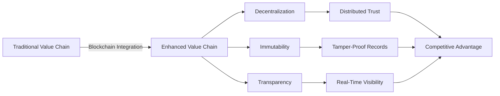

By providing a shared, tamper-proof ledger, blockchain enhances trust and enables seamless tracking of transactions and data throughout complex supply chains. This technology is increasingly being embraced by organizations seeking a competitive advantage, influencing how businesses optimize strategies and make critical decisions.

**Key Impact Areas:**
- **Participants**: Enhanced collaboration and trust among stakeholders
- **Information Flow**: Real-time, transparent data sharing
- **Product/Service Flow**: End-to-end traceability and verification
- **Capital Flow**: Streamlined payments and settlements
- **Power Dynamics**: Decentralized control and reduced intermediary leverage

#### 2. Foundational Concepts and Analytical Frameworks for Blockchain Value Chain Analysis
##### 2.1. Defining Value Chains and Blockchain's Core Contributions
A value chain represents the full range of activities required to bring a product or service from conception to delivery to end consumers. Traditionally, value chains often suffer from inefficiencies, a lack of trust among disparate parties, and limited transparency due to centralized or fragmented data systems. Blockchain addresses these challenges by acting as a distributed trust layer, enabling real-time validation of information across multi-party ecosystems. The technology's immutable record-keeping capabilities eliminate reconciliation delays and enable synchronized visibility among all stakeholders. Smart contracts, self-executing agreements stored on the blockchain, further automate processes, reduce the need for intermediaries, and minimize human error, thereby enhancing efficiency. This unique combination of features allows blockchain to disrupt existing business processes and structures, providing significant benefits in transparency, traceability, and operational efficiency.

##### 2.2. Key Analytical Frameworks

To rigorously analyze the impact of blockchain on value chains, several analytical frameworks are employed:

| Framework | Purpose | Blockchain Application |
|-----------|---------|------------------------|
| **Value Pool Analysis** | Evaluates and quantifies stakeholder value beyond financial metrics | Assesses revenue/profit distribution shifts among value chain participants when blockchain is introduced |
| **Theory of Constraints (TOC)** | Identifies and addresses system bottlenecks | Pinpoints inefficiencies blockchain can resolve (e.g., information sharing delays, transaction processing) |
| **Network Effects** | Measures value increase as more users join | Attracts more participants to blockchain platforms, creating robust ecosystems in multi-sided marketplaces |
| **Power Dynamics Analysis** | Examines influence and control relationships among stakeholders | Shows how blockchain decentralizes control, increases transparency, and reduces intermediary leverage |
| **Value Stream Mapping (VSM)** | Visual tool tracking data and material flows from request to delivery | Identifies bottlenecks and waste; supports investment decisions in blockchain-enabled supply chains |
| **Stakeholder Value Measurement** | Evaluates organizational worth for all stakeholders (employees, customers, communities, environment) | Essential for understanding broader blockchain impacts on social and environmental responsibilities |

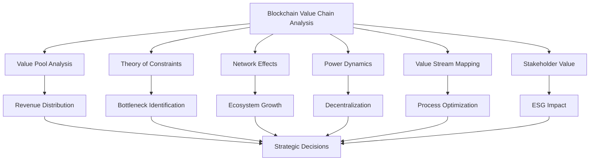

#### 3. Blockchain's Impact Across Core Industry Value Chains

Blockchain technology is revolutionizing diverse industries by offering enhanced transparency, security, and automation capabilities.

**Industry Overview:**

| Industry | Key Pain Points | Blockchain Solutions | Market Impact |
|----------|----------------|---------------------|---------------|
| **Manufacturing & Supply Chain** | Inefficiencies, counterfeiting, lack of visibility | End-to-end tracking, provenance verification | $192.93B by 2030 (CAGR 88.8%) |
| **FinTech** | Slow settlements, high compliance costs, fraud | Real-time transactions, automated KYC/AML | Enhanced DeFi platforms |
| **Healthcare** | Data fragmentation, drug counterfeiting, privacy | Secure EMR, pharmaceutical traceability | Improved patient safety |
| **Logistics** | Limited visibility, delays, manual processes | Real-time tracking, IoT integration | $37.2B by 2035 (CAGR 24.6%) |
| **E-Commerce** | Product counterfeiting, payment disputes | Provenance verification, secure payments | Enhanced customer trust |
| **B2B SaaS** | Complex integrations, data silos, SLA enforcement | Smart contract automation, decentralized platforms | Operational efficiency gains |
##### 3.1. Manufacturing and Supply Chain Management

Manufacturing supply chains are complex global networks highly susceptible to inefficiencies, lack of visibility, and counterfeiting. Blockchain technology offers a transformative solution by enabling seamless tracking of products and materials from sourcing to the final customer.

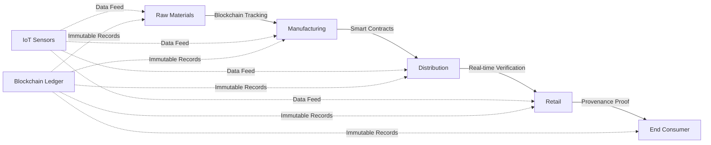

**Key Industry Case Studies:**

| Company | Application | Technology | Impact |
|---------|-------------|-----------|---------|
| **Walmart + IBM** | Food traceability | Hyperledger Fabric | Mango tracing: 7 days → 2.2 seconds |
| **De Beers** | Diamond tracking | Tracr platform | End-to-end authenticity verification |
| **Unilever** | Tea supply chain | Blockchain transparency | Quality maintenance, farmer empowerment |
| **Anheuser Busch InBev** | Cassava crop tracking | Blockchain system | Supply chain transparency |
| **Ford** | Cobalt sourcing | Raw material tracking | Authentic product verification, quality control |
| **Coca-Cola** | Sugar supply chain | Labor verification | Combat forced labor, land rights verification |
| **Pfizer/AbbVie** | Drug authentication | Pharmaceutical tracking | Prevent counterfeiting, save lives |

**Quantified Benefits:**
- 📉 **70% reduction** in data reconciliation costs (Capgemini)
- 📈 **$192.93B** projected market size by 2030
- ⚡ **CAGR of 88.8%** market growth rate
- ⏱️ **7 days → 2.2 seconds** traceability improvement (Walmart)

**Key Advantages:**
- Enhanced supply chain resilience through internal provenance and integrity
- Early disruption identification capabilities
- Streamlined regulatory compliance
- Prevention of pharmaceutical counterfeiting (thousands of lives saved annually)

##### 3.2. FinTech: Transforming Financial Transactions and Compliance

The FinTech sector, driven by digital finance, is undergoing a seismic shift with blockchain at the forefront.

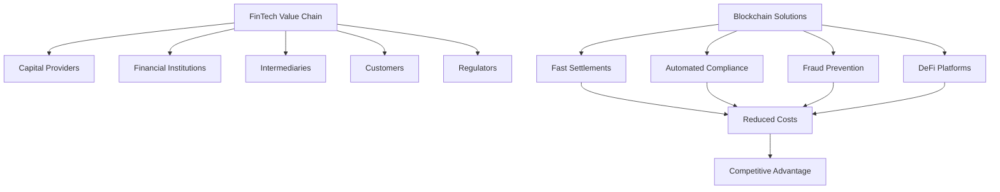

**FinTech Blockchain Implementations:**

| Institution | Application | Innovation | Benefit |
|-------------|-------------|------------|---------|
| **BBVA** | Syndicated loans | Blockchain validation | Process acceleration |
| **Banca Intesa Sanpaolo** | Trading data validation | Distributed ledger | Real-time verification |
| **Barclays** | Fund transfers & KYC | Patented blockchain system | Streamlined operations |
| **HSBC** | Asset tracking | Vault platform (decentralized) | Paper-based → Real-time digital |
| **Visa** | B2B payments | Blockchain payment platform | Wide market coverage |
| **Monetary Authority of Singapore** | Multi-currency payments | Cross-border blockchain | Enhanced cost efficiency |

**Key Use Cases:**
1. **Proactive Risk Management**
   - AML/KYC compliance automation
   - Transaction screening against sanction lists
   - High-risk counterparty identification

2. **Decentralized Finance (DeFi)**
   - Reduced intermediaries
   - Enhanced transaction security
   - Improved transparency
   - Cost-effectiveness

3. **Compliance & Regulation**
   - Automated screening tools
   - Real-time audit trails
   - Illicit activity tracking

##### 3.3. Healthcare: Enhancing Data Integrity and Traceability

In healthcare, the supply chain involves numerous stakeholders from R&D to patients, dealing with sensitive health data and critical medical products.

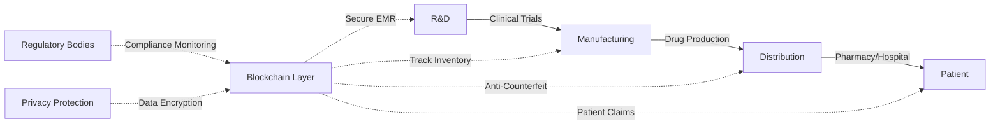

**Healthcare Pain Points vs. Blockchain Solutions:**

| Pain Point | Traditional Challenge | Blockchain Solution | Impact |
|------------|----------------------|-------------------|---------|
| **Data Fragmentation** | Siloed systems, incompatible formats | Unified, interoperable ledger | Seamless data sharing |
| **Drug Counterfeiting** | Fake medications, supply chain gaps | End-to-end pharmaceutical tracking | Lives saved, authenticity verified |
| **Privacy Concerns** | Data breaches, unauthorized access | Encrypted, permissioned access | HIPAA compliance, patient trust |
| **Medical Errors** | Incomplete patient history | Complete, immutable medical records | Reduced errors, better outcomes |
| **Claims Processing** | Slow, manual verification | Real-time, automated processing | Faster reimbursements |

**Implementation Case Studies:**

| Organization | Technology | Application | Outcome |
|--------------|-----------|-------------|----------|
| **Change Healthcare** | Hyperledger Fabric | Patient claims management | Real-time auditing, enhanced trust |
| **FDA** | Blockchain solutions | Clinical trials, genomic data | Secure data management |
| **CDC** | Blockchain platform | Electronic Medical Records (EMR) | Improved data integrity |
| **Pfizer** | Proof of Concept | Pharmaceutical inventory tracking | Counterfeit drug prevention |
| **DHL + Accenture** | Pharmaceutical tracing | Origin-to-consumer tracking | Eliminated tampering, counterfeit prevention |

**Key Benefits:**
- ✅ Enhanced patient safety
- ✅ Reduced medical errors
- ✅ Strict regulatory compliance
- ✅ Increased scholarly research focus
- ✅ Privacy and data integrity assurance

##### 3.4. Logistics: Optimizing Global Supply Chain Operations

The logistics industry relies heavily on efficient, transparent, and secure movement of goods. However, it often faces challenges such as lack of real-time visibility, delays, fraud, and cumbersome manual processes.

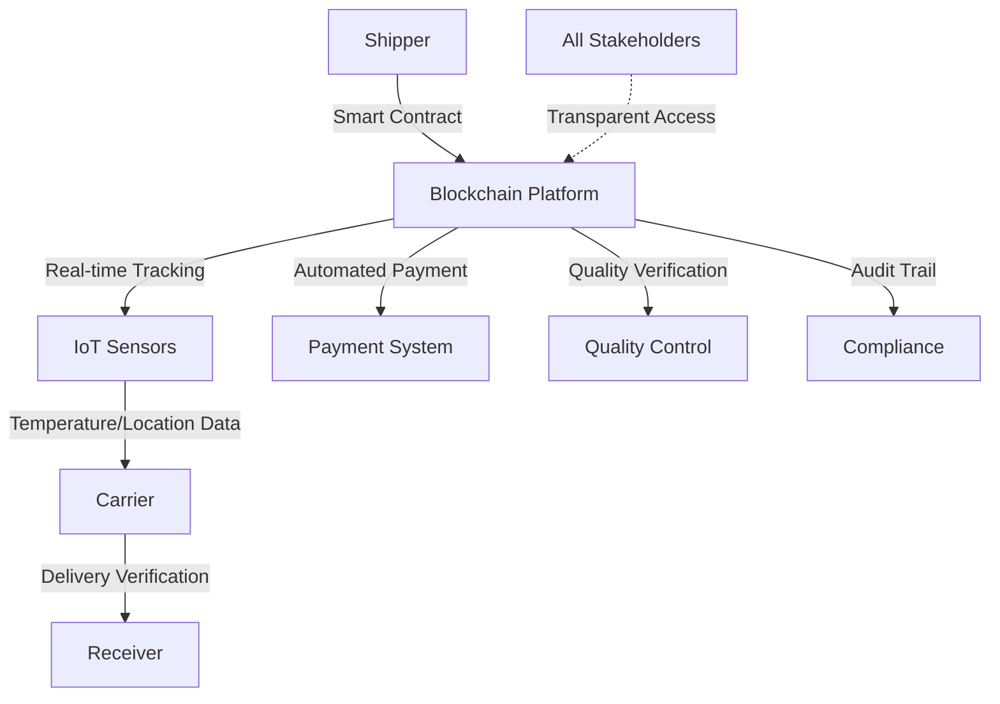

**Market Growth Projection:**

| Year | Market Value | Growth Rate |
|------|-------------|-------------|
| **2025** | $4.1 billion | Baseline |
| **2035** | $37.2 billion | **CAGR 24.6%** |

**Industry Leaders & Applications:**

| Company | Partnership | Technology Focus | Innovation |
|---------|------------|------------------|-----------|
| **Maersk + IBM** | Strategic collaboration | Blockchain + IoT systems | Real-time product condition tracking |
| **DHL** | Pharmaceutical tracing | Anti-counterfeit blockchain | Drug authenticity verification |

**Blockchain-Enabled Process Automation:**

| Process | Traditional Method | Blockchain Solution | Benefit |
|---------|-------------------|-------------------|---------|
| **Payments** | Manual invoicing, delays | Automated smart contracts | Instant settlement |
| **Delivery Verification** | Paper signatures, disputes | Digital proof on blockchain | Tamper-proof confirmation |
| **Quality Control** | Manual inspections | IoT + blockchain validation | Real-time quality assurance |
| **Documentation** | Paper-heavy processes | Digital, immutable records | Reduced paperwork |

**Key Drivers & Benefits:**
- 🌍 **Global Transparency**: Real-time shipment visibility across borders
- 🔒 **Enhanced Security**: Immutable records preventing fraud
- ⚡ **Efficiency Gains**: Automated processes, faster processing times
- 💰 **Cost Savings**: Reduced manual interventions and paperwork
- ✅ **Authenticity Verification**: Critical for high-value and sensitive goods
- 🏛️ **Government Support**: Increased infrastructure investments for trust and accountability

##### 3.5. E-Commerce and Marketplaces: Building Trust and Efficiency

E-commerce value chains involve intricate interactions between suppliers, platforms, payment processors, logistics providers, and customers.

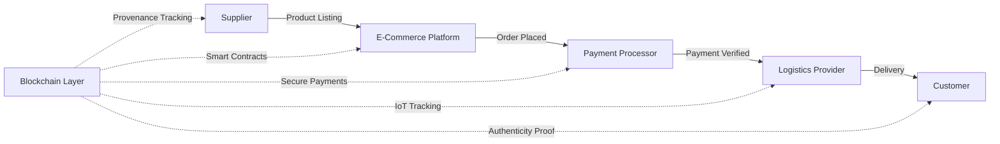

**E-Commerce Pain Points & Solutions:**

| Challenge | Impact | Blockchain Solution | Result |
|-----------|--------|-------------------|---------|
| **Product Counterfeiting** | Brand damage, customer safety | Immutable product provenance records | Authenticity verification |
| **Lack of Transparency** | Customer distrust | Full supply chain visibility | Enhanced confidence |
| **Payment Disputes** | Delayed settlements, chargebacks | Smart contract automation | Instant, secure transactions |
| **Cold Chain Failures** | Spoiled perishables | IoT + blockchain monitoring | Real-time condition tracking |
| **Food Safety** | Health risks, recalls | End-to-end traceability | Rapid outbreak containment |

**Industry Implementation Examples:**

| Company | Collaboration | Application | Goal |
|---------|--------------|-------------|------|
| **Alibaba** | New Zealand Post + Fonterra | Customer order tracking | Transparency & consumer confidence |
| **Walmart** | Blockchain + IoT | Automated deliveries, condition tracking | Improved customer service |
| **Retailers (General)** | Blockchain verification | High-value item authentication | Prevent counterfeiting |

**Blockchain E-Commerce Innovations:**

1. **Payment Enhancement**
   - Cryptocurrency integration
   - Faster transaction processing
   - Lower payment fees
   - Enhanced security

2. **IoT Integration**
   - Cold chain monitoring
   - Predictive shipment accuracy
   - Real-time alerts
   - Perishable goods management

3. **Trust Building**
   - Product authenticity certificates
   - Transparent supply chains
   - Customer review verification
   - Seller reputation systems

##### 3.6. B2B SaaS: Automating Agreements and Enhancing Trust

The B2B SaaS value chain involves cloud infrastructure providers, platform developers, independent software vendors (ISVs), resellers, integrators, and enterprise customers.

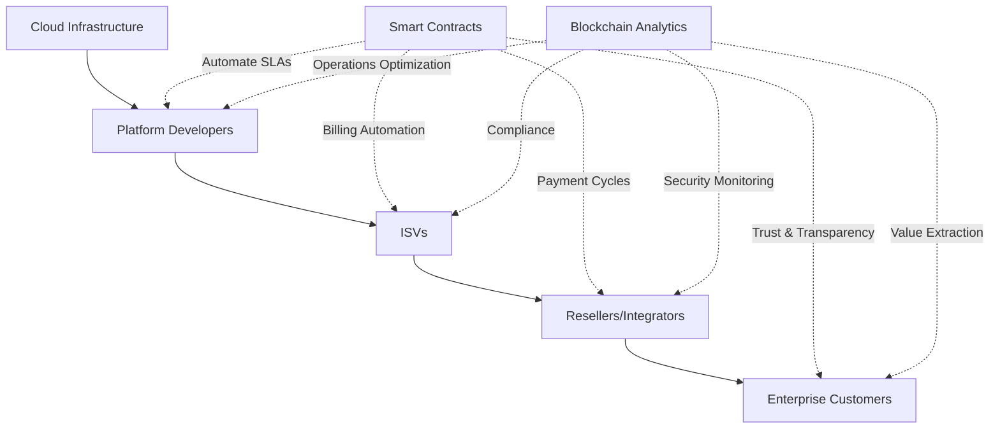

**B2B SaaS Challenges & Blockchain Solutions:**

| Challenge | Business Impact | Blockchain Solution | Outcome |
|-----------|----------------|-------------------|---------|
| **Complex Integrations** | High technical debt, delays | Standardized smart contract interfaces | Streamlined connectivity |
| **Data Silos** | Information fragmentation | Distributed ledger sharing | Unified data access |
| **SLA Enforcement** | Manual monitoring, disputes | Automated smart contract execution | Guaranteed service levels |
| **Billing Complexity** | Reconciliation errors | Blockchain-based billing automation | Accurate, transparent invoicing |
| **Trust Deficits** | Vendor lock-in concerns | Immutable audit trails | Enhanced accountability |

**Blockchain in B2B SaaS Financial Workflows:**

| Process | Traditional Approach | Blockchain Enhancement | Benefit |
|---------|---------------------|----------------------|---------|
| **Risk Scoring** | Manual assessment | Automated blockchain analysis | Real-time risk evaluation |
| **Payment Cycles** | 30-90 day terms | Smart contract triggers | Instant settlements |
| **Contract Management** | Legal review, amendments | Self-executing agreements | Reduced overhead |
| **Compliance Monitoring** | Periodic audits | Continuous ledger verification | Always-compliant operations |

**Blockchain Analytics Evolution:**

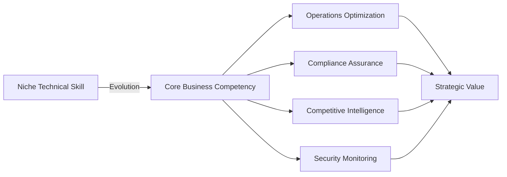

**Key Applications:**

1. **Smart Contract Security**
   - Anomaly detection in contract interactions
   - Exploit prevention in DeFi protocols
   - dApp security monitoring

2. **Decentralized SaaS Platforms**
   - Redefined business models
   - Increased openness and transparency
   - Disruption of traditional control points
   - Empowerment of end-users and ISVs

3. **Strategic Data Utilization**
   - Full ledger data extraction
   - Operational optimization insights
   - Competitive opportunity identification

#### 4. Cross-Industry Themes: Opportunities, Challenges, and Future Outlook

##### 4.1. Key Opportunities across Value Chains

Blockchain technology presents several compelling opportunities across various industry value chains:

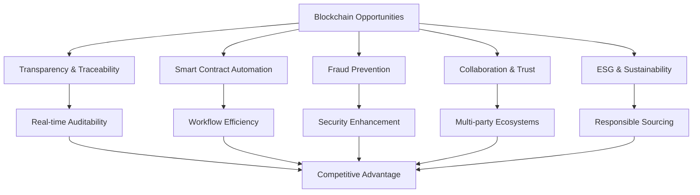

**Opportunity Matrix:**

| Opportunity | Description | Industry Impact | Example Use Cases |
|-------------|-------------|----------------|-------------------|
| **Enhanced Transparency & Traceability** | Shared, tamper-proof ledger recording every action | Food safety, pharmaceutical quality assurance | Farm-to-shelf tracking, drug authentication |
| **Smart Contract Automation** | Automated workflows for payments, customs, orders, disputes | Reduced processing time, minimized human error | Instant settlements, automated compliance |
| **Fraud Prevention & Security** | Immutable audit trails, encrypted data protection | Reduced counterfeiting, breach prevention | Supply chain integrity, anti-tampering |
| **Improved Collaboration & Trust** | Distributed trust layer among stakeholders | Enhanced multi-party partnerships | Consortium blockchains, shared data ecosystems |
| **Sustainability & Ethical Sourcing** | Carbon footprint verification, labor practice monitoring | ESG compliance, responsible supply chains | Recyclable material tracking, fair trade verification |

##### 4.2. Challenges and Limitations to Adoption

Despite its immense potential, blockchain adoption faces significant hurdles:

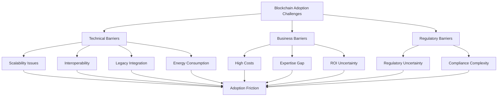

**Challenge Assessment Table:**

| Challenge | Specific Issues | Impact Level | Affected Organizations | Mitigation Strategies |
|-----------|----------------|--------------|------------------------|----------------------|
| **Scalability & Interoperability** | Limited transaction speeds (Bitcoin, Ethereum); differing platform standards | 🔴 High | Large-scale deployments | Layer-2 solutions, permissioned networks, industry standards |
| **Regulatory Uncertainty** | Lack of clear frameworks in many countries | 🔴 High | All organizations | Regulatory engagement, compliance teams, legal consultation |
| **Legacy System Integration** | ERP/WMS compatibility, data silos, duplicated records | 🟡 Medium | Established enterprises | Middleware solutions, phased migration, API development |
| **High Implementation Costs** | $15K (pilots) to $120K+ (global integrations) | 🟡 Medium | SMEs primarily | BaaS platforms, consortium sharing, phased rollout |
| **Energy Consumption** | High energy use in proof-of-work | 🟡 Medium | Environmentally-conscious orgs | Proof-of-stake, permissioned networks, green blockchain |

**Cost Breakdown:**

| Implementation Type | Estimated Cost | Typical Use Case |
|---------------------|---------------|------------------|
| **Pilot Project** | $15,000+ | Small-scale testing, proof of concept |
| **Enterprise Deployment** | $50,000-$80,000 | Single organization, multi-department |
| **Global Multi-Node** | $120,000+ | International consortium, complex supply chains |

**Energy Efficiency Evolution:**

- ❌ **Traditional Approach**: Proof-of-Work (high energy consumption)
- ✅ **Modern Solutions**: Proof-of-Stake, permissioned networks (energy-efficient)

##### 4.3. Future Outlook and Emerging Trends

The future of blockchain in value chain management is characterized by continuous evolution and integration with other advanced technologies.

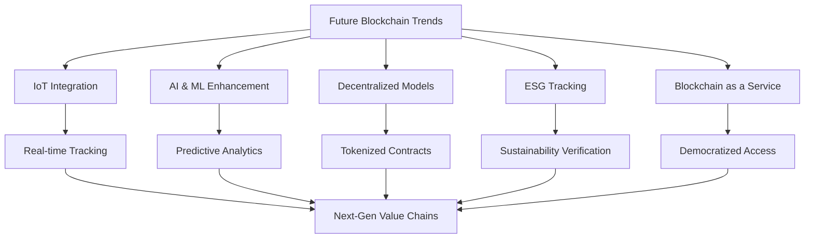

**Emerging Technology Convergence:**

| Trend | Technology Integration | Applications | Expected Impact |
|-------|----------------------|--------------|----------------|
| **Greater IoT Integration** | IoT sensors + Blockchain | Real-time tracking of temperature, location, condition | Seamless physical-digital connection |
| **AI & Machine Learning** | AI analytics + Blockchain data | Issue prediction, fraud detection, dynamic pricing | Transformed supply chain intelligence |
| **Decentralized Business Models** | Tokenized contracts + Distributed systems | Micro-invoicing, cross-border trade, asset tokenization | New economic paradigms |
| **Enhanced ESG Tracking** | Blockchain verification + Sustainability metrics | Carbon footprints, recyclable materials, labor practices | Regulatory compliance, consumer trust |
| **Blockchain as a Service (BaaS)** | Cloud-hosted blockchain platforms | Accessible blockchain infrastructure | SME adoption acceleration |

**Technology Stack Evolution:**

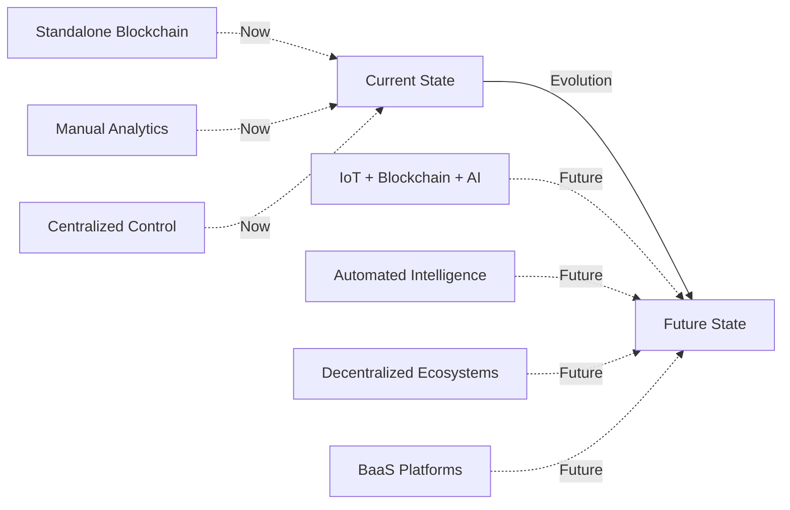

**Key Future Capabilities:**

1. **IoT-Blockchain Synergy**
   - 🌡️ Temperature monitoring
   - 📍 GPS location tracking
   - 📦 Condition assessment
   - 🔗 Physical-digital twin creation

2. **AI-Powered Blockchain Analytics**
   - 🔮 Predictive issue detection
   - 🕵️ Advanced fraud spotting
   - 💲 Dynamic pricing optimization
   - 📊 Enhanced forecasting accuracy

3. **Decentralized Economic Models**
   - 💰 Micro-invoicing capabilities
   - 🌍 Frictionless cross-border trade
   - 🪙 Tokenized supply chain assets
   - 🤝 Peer-to-peer value exchange

4. **ESG & Sustainability**
   - 🌱 Carbon footprint verification
   - ♻️ Recyclable material certification
   - 👷 Fair labor practice monitoring
   - 📋 Climate reporting compliance

5. **BaaS Democratization**
   - ☁️ Cloud-hosted solutions
   - 💼 SME-friendly pricing
   - 🚀 Rapid deployment
   - 🔧 Reduced technical barriers

#### 5. Conclusion: Navigating the Blockchain-Enabled Value Chain

Blockchain technology undeniably represents a disruptive force, profoundly impacting how value chains function across diverse industries by enhancing transparency, traceability, and automation.

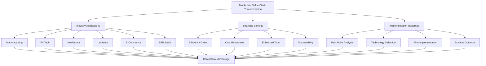

**Executive Summary:**

| Dimension | Key Insights | Strategic Implications |
|-----------|--------------|----------------------|
| **Industry Impact** | Reshapes manufacturing, FinTech, healthcare, logistics, e-commerce, B2B SaaS | Industry-specific customization required |
| **Value Proposition** | Transparency, traceability, automation, trust | Foundation for digital transformation |
| **Opportunities** | $192.93B supply chain market by 2030, 70% cost reduction potential | Significant ROI for early adopters |
| **Challenges** | Scalability, regulatory uncertainty, legacy integration | Strategic planning essential |
| **Future Trends** | IoT integration, AI analytics, BaaS, ESG tracking | Continuous evolution required |

**Strategic Implementation Framework:**

1. **Assessment Phase**
   - Evaluate current value chain
   - Identify critical pain points
   - Assess stakeholder readiness

2. **Design Phase**
   - Select appropriate blockchain platform
   - Define governance model
   - Design smart contract architecture

3. **Implementation Phase**
   - Pilot deployment
   - Stakeholder onboarding
   - Integration with legacy systems

4. **Optimization Phase**
   - Performance monitoring
   - Continuous improvement
   - Scale successful use cases

**Success Factors:**

- ✅ **Strategic Alignment**: Blockchain initiatives aligned with business objectives
- ✅ **Stakeholder Engagement**: Multi-party collaboration and buy-in
- ✅ **Technology Selection**: Right platform for specific use cases
- ✅ **Change Management**: Organizational readiness and training
- ✅ **Continuous Innovation**: Adaptation to emerging trends

**Final Takeaway:**

Organizations that strategically evaluate their value chains, identify critical pain points, and leverage blockchain's unique attributes are better positioned to unlock new efficiencies, enhance resilience, and create sustainable competitive advantages in an increasingly digital and interconnected global economy.

Sources: 
[1] Supply chain re-engineering using blockchain technology: A case of smart contract based tracking process, https://www.sciencedirect.com/science/article/pii/S0040162518305547
[2] Bitcoin, Blockchain and Fintech: a systematic review and case studies in the supply chain, https://www.semanticscholar.org/paper/73aa2b3f59f5e18cc82b6e95526fbb7ac6ccd938
[3] A literature review of blockchain technology applications in supply chains: A comprehensive analysis of themes, methodologies and industries, https://www.semanticscholar.org/paper/cfe0b305ed5e1ccfb6f5c5bbf59014c1567a9631
[4] Developing sustainable global value chain: role of multi-stakeholder collaborations and digitalization, https://www.sciencedirect.com/science/article/pii/S2772390925000708
[5] Rising Attention and Shifting Themes in Green Supply Chain Discourse: Evidence from Weibo (2012–2024), https://www.sciencedirect.com/science/article/pii/S0959652625012612
[6] Analyzing the scholarly visibility of blockchain technology research output on social media platforms using altmetrics, https://link.springer.com/article/10.1007/s11192-025-05354-7
[7] List of Top 50 Companies Using Blockchain Technology, https://101blockchains.com/companies-using-blockchain-technology/
[8] The role of blockchain for trade in global value chains: A systematic ..., https://www.sciencedirect.com/science/article/pii/S0308596124001320
[9] Stakeholder Value Measurement → Term, https://pollution.sustainability-directory.com/term/stakeholder-value-measurement/
[10] A framework for analysis of stakeholder dynamics and value ..., https://link.springer.com/article/10.1007/s13198-024-02405-9
[11] Top Value Stream Management Software in 2025 - Slashdot, https://slashdot.org/software/value-stream-management/
[12] 6 Value Stream Management Software in 2025 Worth Your Time, https://businessmap.io/blog/value-stream-management-software
[13] Top Value Stream Management Tools in 2025 - SixSigma.us, https://www.6sigma.us/business-process-management-articles/top-value-stream-management-tools/
[14] 数据价值链研究进展* - 经济学动态, https://jjxdt.ajcass.com/Admin/UploadFile/Issue/201903080001/2024/4/20240405041732WU_FILE_1.pdf
[15] Blockchain in supply chain management: a comprehensive review ..., https://link.springer.com/article/10.1007/s11301-025-00546-0
[16] Blockchain as a Reinforcement for Traceability of Indonesian Halal Food Information through the Value Chain Analysis Framework, https://www.semanticscholar.org/paper/32eec090f37514717a36414eea5970cfc35dd279
[17] Blockchain Analysis Explained: Use Cases & Data Insights - PixelPlex, https://pixelplex.io/blog/blockchain-analytics-explained/
[18] Blockchain Analytics - Lukka.tech, https://lukka.tech/solutions/blockchain-analytics/
[19] Blockchain in Supply Chain Management: Use Cases & Trends, https://appwrk.com/insights/blockchain-in-supply-chain-management
[20] The Dawn of Digital Finance: Untangling the Fintech Industry Value ..., https://mark-bridges.medium.com/the-dawn-of-digital-finance-untangling-the-fintech-industry-value-chain-ad7eae250073
[21] A systematic review of the literature on the application ..., https://periodicos.uninove.br/innovation/article/view/22060
[22] Blockchain in Logistics Market | Global Market Analysis Report - 2035, https://www.futuremarketinsights.com/reports/blockchain-in-logistics-market
[23] The Impact of Blockchain on Logistics and Supply Chain Management, https://gprjournals.org/journals/index.php/JPSCM/article/view/235
[24] Best Blockchain Platforms Reviews 2025 | Gartner Peer Insights, https://www.gartner.com/reviews/market/blockchain-platforms
[25] How to evaluate blockchain for your supply chain, https://www.thescxchange.com/blog/blockchain-and-the-supply-chain
[26] How Walmart brought unprecedented transparency to the food ..., https://www.lfdecentralizedtrust.org/case-studies/walmart-case-study
[27] How blockchain technology improves sustainable supply chain ..., https://pmc.ncbi.nlm.nih.gov/articles/PMC9797894/
[28] A study on blockchain-based marketplace governance platform adoption: a multi-industry perspective, https://www.emerald.com/insight/content/doi/10.1108/dprg-04-2023-0053/full/html
[29] Building Transparency in Supply Chains through Blockchain Innovation-A case study, https://www.semanticscholar.org/paper/3955d0a84f3585f6544703cb086ec026927f873a
[30] A multi-stakeholder digital ecosystem perspective for sustainability and resilience of supply chains, https://www.elgaronline.com/edcollchap/book/9781803920207/book-part-9781803920207-8.xml
[31] Blockchain in Supply Chain Management: Australian Manufacturer Case Study, https://www.semanticscholar.org/paper/77e7ae51a9c505a388d9de6f964d2e94e3f3ebf3
[32] Decentralized approaches disrupt multi-stakeholder activities, https://www.spiedigitallibrary.org/conference-proceedings-of-spie/12542/1254209/Decentralized-approaches-disrupt-multi-stakeholder-activities/10.1117/12.2665997.short
[33] The Valuation of Digital Platforms and Virtual Marketplaces, https://link.springer.com/chapter/10.1007/978-3-031-09237-4_20
[34] To EVM or not to EVM: Blockchain compatibility and network effects, https://dl.acm.org/doi/abs/10.1145/3560832.3563442
[35] The Future of the Organization: Achieving Excellence Through Business Transformation, https://linkinghub.elsevier.com/retrieve/pii/S002463019890276X
[36] Enabling Enterprise Transformation, https://link.springer.com/book/10.1007/978-1-4419-1508-5
[37] Privacy preserving transparent supply chain management through Hyperledger Fabric, https://www.semanticscholar.org/paper/70379865ed6a14f08feb01c3566988a666fbfd5f
[38] Enterprise Transformation: Understanding and Enabling Fundamental Change, https://onlinelibrary.wiley.com/doi/book/10.1002/0470007826
[39] Appendix I: Organization‐Wide Transformation, https://onlinelibrary.wiley.com/doi/10.1002/9781118256145.app1
[40] Secure and sustainable food processing supply chain framework based on Hyperledger Fabric technology, https://www.semanticscholar.org/paper/ae949e0a4a3109b34fbd720de5ccc116fda9d3fe
[41] A content based literature review on the application of blockchain in food supply chain management, https://www.semanticscholar.org/paper/31a6301d4863b8d77d1127a738618fd07b3ccee6
[42] Blockchain Technology in Rejuvenating the Media & Entertainment Sector, https://www.semanticscholar.org/paper/64c18eecd918b8ed36c0a82dc2287df405400395
[43] Transparent Data Dealing: Hyperledger Fabric Based Biomedical Engineering Supply Chain, https://www.semanticscholar.org/paper/46882b2bcacf884aff07155ddf846a5cb03541e7
[44] Apps marketplaces and the telecom value chain, https://www.semanticscholar.org/paper/1e2196237876cec3c87578b0aa41a5f3aea8025d
[45] Blockchain technology in e-business value chains, https://www.semanticscholar.org/paper/891a4e4f37085e1b03351fb31445d9a4d8a4f9c1
[46] The role of various market participants in blockchain business model, https://www.semanticscholar.org/paper/d9521a2c2498c0d0e86f7bab3fe9493a096bc457
[47] Towards the Exploration of Blockchain-driven Business Networks, https://www.semanticscholar.org/paper/aba939dba57eae5a4b59fd23792807c40807107d
[48] A survey paper on blockchain as a service platforms, https://www.semanticscholar.org/paper/0824dda6f780334943c55f808524c836e9691d0b
[49] SaaS Growth Drivers Framework A Comprehensive Analysis, https://www.semanticscholar.org/paper/f41f0af4a1fbf9077394499dc1fb9263d79cf213
[50] A blockchain application supporting the manufacturing value chain, https://link.springer.com/chapter/10.1007/978-3-030-30000-5_58
[51] Key capabilities to blockchain technology in B-2-B procure-to-pay process for Finnish SMEs, https://www.theseus.fi/handle/10024/812366
[52] Are Regtech, Fintech, Blockchain the Future?, https://www.semanticscholar.org/paper/51ae48c64c6c18085550190a6da3f31254b79899
[53] A Review on Blockchain Applications in Fintech Ecosystem, https://www.semanticscholar.org/paper/d9a6a5d831f372df6d3c8e584667d1456f4efd45
[54] Integrating and determining Fintech value chain financing: a perspective of Islamic financial institutions, https://www.emerald.com/fs/article/25/4/597/81139
[55] Sustainable B2B E-Commerce and Blockchain-Based Supply Chain Finance, https://www.mdpi.com/2071-1050/12/10/3968
[56] Blockchain in FinTech: A mapping study, https://www.mdpi.com/2071-1050/11/22/6366
[57] Value Pools: Defining Your Business Beyond The Shelf - Forbes, https://www.forbes.com/councils/forbesbusinessdevelopmentcouncil/2024/08/02/value-pools-defining-your-business-beyond-the-shelf/
[58] Value pools identified and model process map. - ResearchGate, https://www.researchgate.net/figure/alue-pools-identified-and-model-process-map_fig1_319542336
[59] Was ist Stakeholder Value?: Vom Schlagwort zur Messung, https://www.semanticscholar.org/paper/20891d193d74a92d496988c82a137b3e68473159
[60] Definition and Classification of Stakeholders in the Regulation of Government Agent-construction Project, https://www.semanticscholar.org/paper/7e989343527d629473e7cf9f4298bcfb77180db0
[61] Best Value Stream Management Platforms Reviews 2025 - Gartner, https://www.gartner.com/reviews/market/value-stream-management-platforms
[62] 10 Value Stream Mapping Software to Improve Processes in 2025, https://clickup.com/blog/value-stream-mapping-software/
[63] Value stream mapping: a complete guide for software engineering ..., https://getdx.com/blog/value-stream-analysis/
[64] 基于区块链的商业模式创新：价值主张与应用场景, https://www.kjjb.org/fileup/HTML/2020-37-2-003.htm
[65] 异烟肼联合糖皮质激素治疗结核性胸膜炎疗效观察的 Meta 分析, https://www.semanticscholar.org/paper/99e8ccc4d586f3fe4ed07e63dc22672b3384f8d7
[66] Blockchain and the Internet of Value, https://www.semanticscholar.org/paper/746eace6e161bc63df99eb034360a2ec652bba01
[67] CREATING VALUE WITH BLOCKCHAIN: A VALUE CHAIN MANAGEMENT PERSPECTIVE, https://www.semanticscholar.org/paper/673a3e38a2d9eaf10418e97b1e4d2800ff8e88d5
[68] 曾鸣最新演讲：区块链和Crypto蓄势待发 - 新浪财经, https://finance.sina.cn/blockchain/2023-10-16/detail-imzrheun8522197.d.html
[69] 肢体缺血预处理对择期冠脉支架置入术中患者心脏保护作用的 Meta 分析, https://www.semanticscholar.org/paper/55e0c4ab18e4fc38dd40877742fba64dee5edd04
[70] 梁宁：唯一的风口，就是真需求！ - 智库资讯, https://news.mbalib.com/story/258097
[71] Menciptakan Value Added bagi Ekonomi Lokal dalam Tinjauan Model Rantai Blok dan Konsep Rantai Nilai: Sebuah studi literatur, https://www.semanticscholar.org/paper/65be7e0d73cf08a0602452e6481a010c41f0ac98
[72] 区块链的底层逻辑与商业进化——“数字经济与管理前沿”系列讲座第五讲, https://mba.bnu.edu.cn/xwdt/225449.html
[73] Blockchain technology for global supply chain management: A survey of applications, challenges, opportunities and implications, https://ieeexplore.ieee.org/abstract/document/10529266/
[74] The Impact of Blockchain on the Value Chain, https://www.semanticscholar.org/paper/c2a6d1e9b943e780f6ffd53fe10e7be4a0a86e0e
[75] Blockchain Technology Potential to Transform Global Value Chains, https://www.semanticscholar.org/paper/035159bdca217c202957d6c4d4d7d6291e68acb9
[76] Blockchain Supply Chain Market Size & Share Report, 2030, https://www.grandviewresearch.com/industry-analysis/blockchain-supply-chain-market-report
[77] Blockchain technology in supply chain management: Innovations ..., https://www.sciencedirect.com/science/article/pii/S2772503025000192
[78] Using Blockchain to Drive Supply Chain Transparency and Innovation, https://www.deloitte.com/us/en/services/consulting/articles/blockchain-supply-chain-innovation.html
[79] Chainalysis: The Blockchain Data Platform, https://www.chainalysis.com/
[80] Blockchain for Sustainable Supply Chains Market Size, 2025-2034, https://www.gminsights.com/industry-analysis/blockchain-for-sustainable-supply-chains-market
[81] How blockchain tracks food across the supply chain and saves lives, https://www.weforum.org/stories/2024/08/blockchain-food-supply-chain/
[82] Blockchain as a Service (BCaaS): A Value Modeling Approach in the Education Business Model, https://www.semanticscholar.org/paper/878ec482b6ffe7e63669414842e078762f65a938
[83] ModCon: a model-based testing platform for smart contracts, https://www.semanticscholar.org/paper/37107f01e395ad620efd95f296807bd84b53fbec
[84] The role of blockchain in enabling inter-organisational supply chain alignment for value co-creation in the construction industry, https://www.semanticscholar.org/paper/1aa9576687b4f6f3cada6670ee741d5a2f62c8ae
[85] INTEGRATING BLOCKCHAIN TECHNOLOGY IN SUPPLY CHAIN MANAGEMENT SOFTWARE, https://www.researchgate.net/profile/Hassan-Merghani/publication/335083566_Integrating_blockchain_technology_in_supply_chain_management_software_Key_adoption_challenges_for_enterprises/links/5e0faed34585159aa4b1116d/Integrating-blockchain-technology-in-supply-chain-management-software-Key-adoption-challenges-for-enterprises.pdf
[86] Hyperledger Case Study: Walmart's Food Traceability Innovation, https://www.studocu.vn/vn/document/hoc-vien-ngan-hang/digital-business-in-practice/hyperledger-case-study-walmart-printable-v4/122026249
[87] Block-Chain Management in Supply Chain Management - A Comprehensive Review, https://www.semanticscholar.org/paper/c4aa274df1a70831e0c08ae9e386dffe34bc6f15
[88] Blockchain In Supply Chain - Forbes, https://www.forbes.com/councils/forbestechcouncil/2021/11/08/blockchain-in-supply-chain/
[89] The palgrave handbook of FinTech and blockchain, https://www.semanticscholar.org/paper/156d4ef657118c3c7217e7661fe158d8f1165d41
[90] The impact of blockchain financial technology transformation on ..., https://www.sciencedirect.com/science/article/pii/S1059056025005064
[91] The impact of blockchain on business models in banking, https://www.semanticscholar.org/paper/a0baefada167f3b2f603928a4e8eb8eb67de58fd
[92] Reshaping FinTech with Blockchain Technologies, https://www.semanticscholar.org/paper/2b2a1c269a1fae5268e30306b85dc0e6af0e144b
[93] Adoption of Blockchain Technology in Healthcare Supply Chain Management: A Review, https://www.semanticscholar.org/paper/dc5b63fbce8a6fcbe14db21c803163e2ddb07acc
[94] Use of Blockchain in Healthcare: A Systematic Literature ..., https://thesai.org/Publications/ViewPaper?Volume=10&Issue=5&Code=IJACSA&SerialNo=81
[95] Blockchain Applications in Education: A Case Study in Lifelong Learning, https://www.semanticscholar.org/paper/a75a83792b8da02fb5d7d14ed11f59be9186103e
[96] Blockchain Technology Meets Traceability in Fruit Supply Chain Management: A Systematic Review, https://www.semanticscholar.org/paper/709b23f6e6e56aac7e01861b7d9610000f88f978
[97] A Blockchain-Based approach in Healthcare Supply Chain using ..., https://dl.acm.org/doi/fullHtml/10.1145/3524458.3547251
[98] Case studies about smart contracts in healthcare - PMC - NIH, https://pmc.ncbi.nlm.nih.gov/articles/PMC10563467/
[99] Use of blockchain in healthcare: a systematic literature review, https://www.researchgate.net/profile/Muhammad-Murad-Khan-2/publication/333511398_Use_of_Blockchain_in_Healthcare_A_Systematic_Literature_Review/links/5cf1d85e299bf1fb184e7f56/Use-of-Blockchain-in-Healthcare-A-Systematic-Literature-Review.pdf
[100] The benefits and challenges of blockchain in healthcare supply ..., https://pmc.ncbi.nlm.nih.gov/articles/PMC12451330/
[101] The use of blockchain technology in the health care sector: systematic review, https://medinform.jmir.org/2022/1/e17278/
[102] A Blockchain-Based Approach for Drug Traceability in Healthcare Supply Chain, https://www.semanticscholar.org/paper/cf4d452ab9693d8f9c96ec2843e3955a98b7dfe9
[103] Utilizing ethereum blockchain and smart contracts to transform cord blood procurement in health care supply chains, https://www.semanticscholar.org/paper/73fe79dd60bf0c5223a19052765391647602b29b
[104] Reviving the information veracity in healthcare supply chain with blockchain: a systematic review, https://www.semanticscholar.org/paper/a90fbb1603fea4dfd76d7b4df4fa97e5c081a074
[105] Blockchain technology in the manufacturing industry, https://www.semanticscholar.org/paper/b77f0c27fb286fc4ecbb1e4190625850b2a203b8
[106] BLOCKCHAIN IN SUPPLY CHAIN MANAGEMENT: A SYSTEMATIC ..., https://fepbl.com/index.php/estj/article/view/732
[107] Secure smart contracts for cloud‐based manufacturing using Ethereum blockchain, https://www.semanticscholar.org/paper/361b70c362f869951a467570b890118c08d21434
[108] Food Safety Traceability System Based on Blockchain and EPCIS, https://ieeexplore.ieee.org/document/8640818/
[109] Enhance product traceability in supply chains - Nedap Retail, https://www.nedap-retail.com/a-multiverse-of-epcis-how-to-enhance-product-traceability-in-hyperconnected-supply-chains/
[110] Streamlining the Supply Chain with EPCIS and Blockchain, https://epcis.dev/docs/Streamlining-the-supply-chain-with-EPCIS-and-blockchain
[111] How much is the NFT market worth? [August 2025 Data] | CoinLedger, https://coinledger.io/research/how-much-is-the-nft-market-worth
[112] Blockchain Applications for Long-Term Sustainable Supply Chains, https://link.springer.com/chapter/10.1007/978-981-95-0363-6_7
[113] (PDF) Blockchain Technology for Supply Chain Management, https://www.researchgate.net/publication/361126891_Blockchain_Technology_for_Supply_Chain_Management_A_Comprehensive_Review
[114] Blockchain in Logistics: Key Benefits & Real-Life Use Cases, https://acropolium.com/blog/blockchain-in-logistics-key-benefits-real-life-use-cases/
[115] The Research Review of”Block-Chain+Logistics”, https://www.semanticscholar.org/paper/0fdda1c66d10f7898abceb0177f127b848cec93d
[116] Analysis of Blockchain Technology to Enhance Logistics Supply Chain in the Context of Internet, https://www.semanticscholar.org/paper/7827e39bbc72e1969429348632498744c1808900
[117] Revolutionizing Logistics Management with Blockchain Technology, https://www.semanticscholar.org/paper/2da5263473194fc30ddbd9da8aba8d5309eae9d6
[118] An Overview of Blockchain Technology Use Cases in IoT, https://www.semanticscholar.org/paper/b209fb1310ac12e2bc068380ee9599135ba003d0
[119] Development of a Blockchain platform for logistics order management using IoT technologies, https://www.semanticscholar.org/paper/8db8e4fe5ceb0ce6dc48384b2d05bae358397366
[120] An application of blockchain smart contracts and IoT in logistics, https://www.semanticscholar.org/paper/d4a60d861e77eead22833adc91d5781c22fe0be5
[121] Chapter Nine - Blockchain with IOT: Applications and use cases for a new paradigm of supply chain driving efficiency and cost, https://www.semanticscholar.org/paper/673f3d47f0d658600fc076efd492c134ba5a3c89
[122] CryptoQuant | On-Chain Actionable Insights, https://cryptoquant.com/
[123] Blockchain for Supply Chain: Uses and Benefits - Oracle, https://www.oracle.com/blockchain/what-is-blockchain/blockchain-for-supply-chain/
[124] An exploration of blockchain technology in supply chain management, https://www.semanticscholar.org/paper/b6b51df3893bbd946f139232b0abd2f34b7dd927
[125] Amplifying the value of blockchain in supply chains, https://www.semanticscholar.org/paper/5ccf1d1718fcc682a2c7f5ef5f575d2f1a082fb2
[126] Latest Group news - De Beers Group, https://www.debeersgroup.com/news-insights/latest-group-news/2025/de-beers-group-delivers-progress-with-sustainability-and-provenance-initiatives-supporting-enhanced-confidence-in-de-beers-sourced-diamonds
[127] Blockchain enabled traceability — An analysis of pricing and ..., https://www.sciencedirect.com/science/article/pii/S037722172400794X
[128] A Blockchain Solution for Supply Chain Traceability in the Indian ..., https://ieeexplore.ieee.org/document/10616285/
[129] Case Study in Kintamani Coffee Agroindustry Supply Chain - SciOpen, https://www.sciopen.com/article/10.23919/JSC.2024.0027
[130] Top 20 Blockchain in Supply Chain Case Studies, https://research.aimultiple.com/blockchain-in-supply-chain-case-study/
[131] Blockchain Value System, https://link.springer.com/deleted
[132] 7 Digital Transformation Initiatives for Inflation, https://www.apexon.com/blog/7-digital-transformation-initiatives-worth-pursuing-amid-soaring-inflation/
[133] Adopting Adaptive AI for Business Transformation, https://www.apexon.com/blog/transforming-your-business-a-practical-guide-to-adopting-adaptive-ai/
[134] Blockchain in Supply Chain, https://www.semanticscholar.org/paper/e9b09432d680744382094bb97f97b040c2edf147
