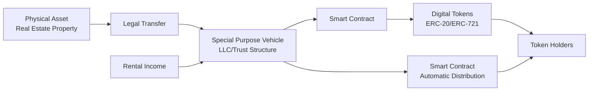
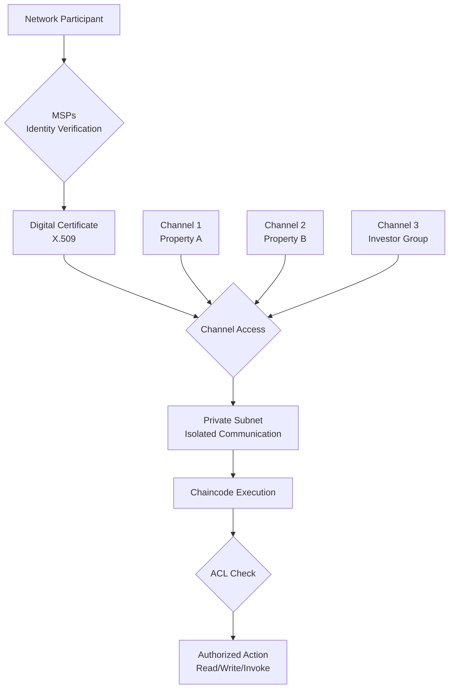
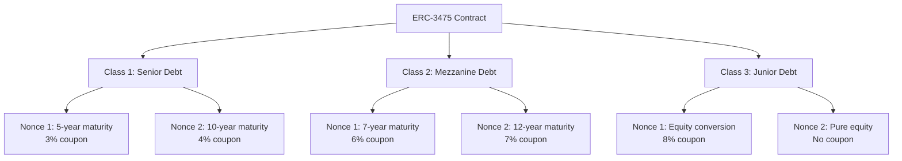
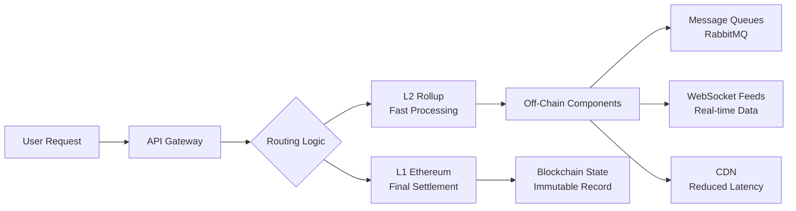
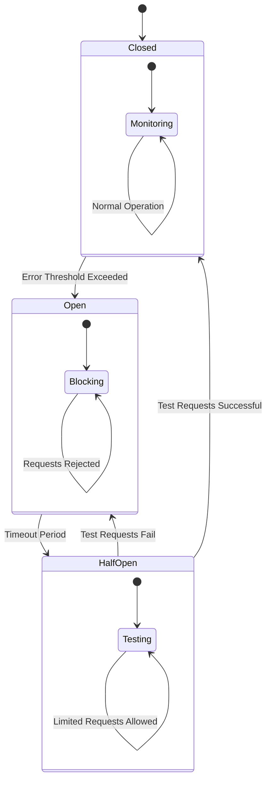
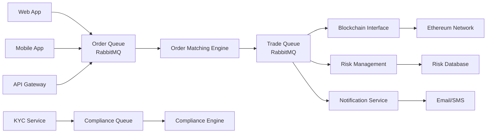
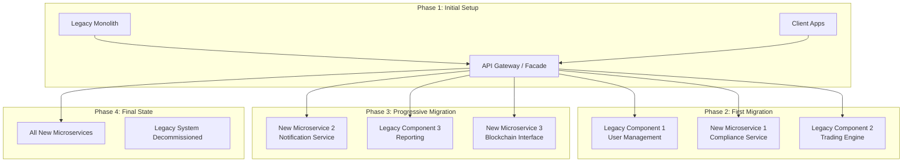

# Blockchain RWA: Software Architecture for Real-World Assets

**A comprehensive technical framework for building scalable, secure, and compliant tokenization platforms that bridge traditional finance with decentralized systems.**

**Tags:** Multi-layer Architecture | Enterprise Security | Regulatory Compliance

---

## Executive Summary

Real-World Asset (RWA) tokenization represents a paradigm shift in how we conceptualize ownership and value transfer. This comprehensive framework addresses the critical technical challenges of building enterprise-grade RWA platforms through a systematic, architecture-first approach.

### Key Architectural Insights

- Three-layer architecture (Core, Middleware, Application) provides clean separation of concerns
- SPV structures create legally enforceable bridges between physical and digital assets
- Factory and Proxy patterns enable contract upgradability without state migration

### Critical Success Factors

- Formal verification and multi-layer security protocols
- Embedded compliance through ERC-3643 and identity protocols
- Scalable Layer 2 solutions and purpose-built RWA chains

> "The convergence of traditional finance and decentralized systems requires not just technical innovation, but architectural foresight that anticipates both regulatory evolution and market demands."

---

## 1. Structural Design & Modularity

**Foundational architectural patterns for scalable RWA platforms**

### 1.1 Decomposing the RWA Stack: Core, Middleware, and Application Layers

**Difficulty:** Intermediate | **Category:** Structural Design

**Key Insight:** A three-layered architecture provides clear separation of concerns, enhancing modularity and maintainability for complex RWA systems.

A comprehensive technical framework for a Real-World Asset (RWA) tokenization system decomposes into three primary layers: the **Core Architecture Layer**, the **Middleware Layer**, and the **Application Layer** [[270]](https://blog.csdn.net/Ashlee_code/article/details/149018280).

#### Core Layer
- Blockchain platform infrastructure
- Smart contract logic
- Immutable data storage

#### Middleware Layer
- Oracle networks for real-world data
- Identity/compliance modules
- Cross-chain protocols

#### Application Layer
- User interfaces and portals
- API gateways
- Admin backends

> "This three-layered architecture provides a clear separation of concerns, making the complex system of an RWA platform more manageable, scalable, and secure."

---

### 1.2 The RWA Bridge: Legal Structure (SPV) and On-Chain Representation

**Difficulty:** Intermediate | **Category:** Structural Design

The "RWA Bridge" creates a secure and legally enforceable link between physical assets and digital tokens through a **Special Purpose Vehicle (SPV)** structure [[376]](https://www.linkedin.com/pulse/tokenization-real-estate-via-spvs-chapter2-unpacked-teyoe). The SPV becomes the sole legal owner of the physical asset, providing a "bankruptcy-remote" wrapper that protects token holders.

#### SPV Implementation Process:

1. Asset due diligence and valuation process
2. SPV formation and property title transfer
3. Smart contract development and deployment
4. Token minting and investor whitelisting



The smart contract codifies rules for ownership, transfer, and benefit distribution, creating a direct link between real-world asset performance and digital tokens [[374]](https://www.rwa.io/post/spv-for-tokenized-assets-setup-and-governance) [[392]](https://www.rwa.io/post/using-smart-contracts-for-secure-rwa-transactions).

---

### 1.3 Smart Contract Modularity: Factory and Proxy Patterns

**Difficulty:** Advanced | **Category:** Structural Design

Two critical design patterns enable modularity and upgradability in RWA systems: the **Factory Pattern** and the **Proxy Pattern** [[444]](https://medium.com/@pedrolisboa_10855/design-patterns-in-solidity-practical-examples-and-applications-article-5-of-16-in-the-solidity-a3188da2f828) [[445]](https://dev.to/adaobilynda/exploring-design-patterns-in-solidity-2782).

#### Factory Pattern
- Centralized contract creation logic
- Maintains registry of deployed contracts
- Reduces deployment costs
- Ensures consistency across instances

#### Proxy Pattern
- Separates logic from state
- Enables contract upgrades
- Preserves address and state
- Maintains user trust

```solidity
// SPDX-License-Identifier: MIT
pragma solidity ^0.8.0;

// Factory Pattern Implementation
contract PropertyFactory {
  mapping(address => address[]) public propertyTokens;
  address[] public allProperties;
  
  event PropertyCreated(address indexed propertyAddress, address indexed owner);
  
  function createPropertyToken(
    string memory name,
    string memory symbol,
    address propertyOracle
  ) external returns (address) {
    PropertyToken newProperty = new PropertyToken(name, symbol, propertyOracle);
    propertyTokens[msg.sender].push(address(newProperty));
    allProperties.push(address(newProperty));
    
    emit PropertyCreated(address(newProperty), msg.sender);
    return address(newProperty);
  }
}

// Proxy Pattern Implementation
contract PropertyTokenProxy {
  address public implementation;
  address public owner;
  
  constructor(address _implementation) {
    implementation = _implementation;
    owner = msg.sender;
  }
  
  function upgradeTo(address newImplementation) external {
    require(msg.sender == owner, "Only owner can upgrade");
    implementation = newImplementation;
  }
  
  fallback() external payable {
    address _impl = implementation;
    require(_impl != address(0), "Invalid implementation");
    
    assembly {
      let ptr := mload(0x40)
      calldatacopy(ptr, 0, calldatasize())
      let result := delegatecall(gas(), _impl, ptr, calldatasize(), 0, 0)
      let size := returndatasize()
      returndatacopy(ptr, 0, size)
      
      switch result
      case 0 { revert(ptr, size) }
      default { return(ptr, size) }
    }
  }
}
```

**Best Practice:** Combine Factory and Proxy patterns by having the factory deploy proxy-based contracts, enabling both efficient creation and future upgradability.

---

## 2. Platform Selection

**Strategic considerations for blockchain infrastructure**

### 2.1 Architectural Trade-offs: Permissionless vs. Permissioned Networks

**Difficulty:** Intermediate | **Category:** Platform Selection

The choice between **permissionless** networks like Ethereum and **permissioned** networks like Hyperledger Fabric represents a fundamental architectural decision with profound implications for governance, security, privacy, and regulatory compliance [[33]](https://101blockchains.com/hyperledger-vs-corda-r3-vs-ethereum/).

| Feature | Ethereum (Permissionless) | Hyperledger Fabric (Permissioned) |
|---------|---------------------------|-----------------------------------|
| **Access Control** | Open to anyone; permissionless participation [[362]](https://www.hash.tools/116/blockchain-technology/11061/comparative-analysis-of-ethereum-and-hyperledger-for-smart-contracts-in-real-estate) | Restricted to authorized participants; permissioned access [[362]](https://www.hash.tools/116/blockchain-technology/11061/comparative-analysis-of-ethereum-and-hyperledger-for-smart-contracts-in-real-estate) |
| **Data Privacy** | Transactions are public and transparent [[362]](https://www.hash.tools/116/blockchain-technology/11061/comparative-analysis-of-ethereum-and-hyperledger-for-smart-contracts-in-real-estate) | Supports private channels and confidential transactions [[341]](https://blockchain.oodles.io/blog/hyperledger-fabric-development-smart-contracts/) |
| **Scalability** | Limited by network congestion; can have high fees [[362]](https://www.hash.tools/116/blockchain-technology/11061/comparative-analysis-of-ethereum-and-hyperledger-for-smart-contracts-in-real-estate) | High throughput and low latency due to efficient consensus [[362]](https://www.hash.tools/116/blockchain-technology/11061/comparative-analysis-of-ethereum-and-hyperledger-for-smart-contracts-in-real-estate) |
| **Governance** | Decentralized, community-driven governance | Centralized governance by consortium or organization |
| **Regulatory Compliance** | Challenging due to public nature; requires on-chain compliance logic | Easier to implement KYC/AML and other regulatory controls [[341]](https://blockchain.oodles.io/blog/hyperledger-fabric-development-smart-contracts/) |

#### Public Chain Benefits
- Global accessibility and transparency
- Censorship resistance
- Broad investor pool
- Established ecosystem

#### Private Chain Advantages
- Enhanced privacy and control
- Better regulatory compliance
- Higher performance
- Lower transaction costs

> "The decision between architectural paradigms is highly context-dependent, hinging on careful evaluation of privacy, performance, governance, and target user base requirements."

---

### 2.2 Consensus Mechanisms: PoS vs. PBFT/Raft and Regulatory Implications

**Difficulty:** Advanced | **Category:** Platform Selection

Consensus mechanism choice directly impacts security, performance, and regulatory compliance. **Proof-of-Stake (PoS)** offers decentralization but presents regulatory challenges, while **PBFT/Raft** provides deterministic finality and controlled governance [[33]](https://101blockchains.com/hyperledger-vs-corda-r3-vs-ethereum/) [[406]](https://i6mi6.medium.com/the-ultimate-collection-of-ethereum-solidity-and-smart-contracts-interview-questions-ef610d250012).

```solidity
// Consensus Mechanism Comparison Framework
interface IConsensus {
  function validateBlock() external returns (bool);
  function getFinalityTime() external view returns (uint256);
  function getEnergyConsumption() external view returns (uint256);
}

contract PoSConsensus is IConsensus {
  mapping(address => uint256) public stakes;
  uint256 public totalStake;
  
  function validateBlock() external override returns (bool) {
    address validator = selectValidator();
    return validate(validator);
  }
  
  function getFinalityTime() external pure override returns (uint256) {
    return 12; // ~12 seconds for Ethereum PoS
  }
  
  function getEnergyConsumption() external pure override returns (uint256) {
    return 1; // Minimal energy consumption
  }
}

contract PBFTConsensus is IConsensus {
  mapping(address => bool) public validators;
  uint256 public requiredConfirmations = 2/3;
  
  function validateBlock() external override returns (bool) {
    uint256 confirmations = 0;
    for (uint i = 0; i < validators.length; i++) {
      if (validators[i] && confirm(validators[i])) {
        confirmations++;
      }
    }
    return confirmations >= (validators.length * requiredConfirmations);
  }
  
  function getFinalityTime() external pure override returns (uint256) {
    return 1; // ~1 second finality
  }
}
```

**Regulatory Considerations:** Permissioned networks with PBFT/Raft consensus align more closely with traditional finance regulatory frameworks, allowing for central authority intervention when necessary.

> "The choice between decentralization and control often centers on whether the real world should adapt to blockchain rules or vice versa—a debate that shapes the entire RWA ecosystem."

---

### 2.3 Data Privacy and Access Control in Hyperledger Fabric

**Difficulty:** Advanced | **Category:** Platform Selection

Hyperledger Fabric provides a robust framework for data privacy through a multi-layered approach combining **Membership Service Providers (MSPs)**, **channels**, and **Access Control Lists (ACLs)** [[341]](https://blockchain.oodles.io/blog/hyperledger-fabric-development-smart-contracts/) [[344]](https://github.com/aditya43/blockchain).



#### MSPs
Issue and manage digital identities, forming the basis for all access control decisions

#### Channels
Private subnets for confidential transactions between specific network members

#### ACLs
Granular control specifying which organizations can perform specific actions

```go
// Hyperledger Fabric Chaincode with ACL Implementation
package main

import (
  "fmt"
  "github.com/hyperledger/fabric-contract-api-go/contractapi"
)

type PropertyContract struct {
  contractapi.Contract
}

// Only property manager can update rental income
func (c *PropertyContract) UpdateRentalIncome(ctx contractapi.TransactionContextInterface, propertyID string, amount uint64) error {
  clientID, err := ctx.GetClientIdentity().GetID()
  if err != nil {
    return fmt.Errorf("failed to get client identity: %v", err)
  }
  
  if !c.hasRole(ctx, clientID, "property_manager") {
    return fmt.Errorf("unauthorized: only property managers can update rental income")
  }
  
  return ctx.GetStub().PutState(propertyID, []byte(fmt.Sprintf("%d", amount)))
}

// All token holders can query rental income
func (c *PropertyContract) QueryRentalIncome(ctx contractapi.TransactionContextInterface, propertyID string) (uint64, error) {
  clientID, err := ctx.GetClientIdentity().GetID()
  if err != nil {
    return 0, fmt.Errorf("failed to get client identity: %v", err)
  }
  
  if !c.isTokenHolder(ctx, clientID, propertyID) {
    return 0, fmt.Errorf("unauthorized: only token holders can query rental income")
  }
  
  return c.getRentalIncome(ctx, propertyID)
}
```

---

## 3. Token Standards and Asset Representation

**Standards for representing real-world assets on blockchain**

### 3.1 Choosing a Token Standard: ERC-20, ERC-721, ERC-1155, and ERC-3643

**Difficulty:** Intermediate | **Category:** Token Standards

Token standard selection defines fundamental properties and functionalities of tokenized assets. Each standard serves different asset types and compliance requirements [[430]](https://www.prnewswire.com/apac/news-releases/wall-street-bets-on-ethereum-why-rwaltd-chose-erc-3643-302538270.html) [[436]](https://www.vskills.in/interview-questions/ethereum-blockchain-development-interview-questions).

| Token Standard | Type | Key Features | Best Suited For | Compliance Features |
|----------------|------|--------------|-----------------|---------------------|
| **ERC-20** | Fungible | Interchangeable tokens, widely supported, simple implementation | Stablecoins, fund shares, utility tokens | None (requires external contracts) |
| **ERC-721** | Non-Fungible | Unique, indivisible tokens, proof of ownership | Individual properties, artworks, collectibles | None (requires external contracts) |
| **ERC-1155** | Hybrid | Single contract manages both fungible and non-fungible tokens | Gaming assets, diverse asset platforms | None (requires external contracts) |
| **ERC-3643** | Security Token | Built-in compliance, KYC/AML verification, transfer controls | Security tokens, regulated instruments, institutional RWAs | Extensive (compliance embedded) |

#### Traditional Standards
ERC-20, ERC-721, ERC-1155 provide basic functionality but require external compliance mechanisms.
- Simple implementation
- Broad ecosystem support
- Limited compliance features

#### ERC-3643 (Security Token)
Purpose-built for regulated assets with compliance embedded in token logic.
- Built-in KYC/AML
- Transfer restrictions
- Regulatory compliance

---

### 3.2 Fractional Ownership Models: ERC-3475 and Other Standards

**Difficulty:** Advanced | **Category:** Token Standards

**ERC-3475** (Abstract Storage Bonds standard) provides sophisticated models for structured financial products like bonds and debt instruments, using "classes" and "nonces" for hierarchical organization [[299]](https://eips.ethereum.org/EIPS/eip-3475).

#### ERC-3475 Structure:



- **Classes:** Represent specific bond issuances with unique terms (maturity, coupon rate)
- **Nonces:** Individual bonds or batches within each class with distinct metadata
- **Efficiency:** Multiple issuances within single contract reduces gas costs

**ERC-5560 for Physical Assets:** Designed for tokenizing physical assets like gold or real estate, linking each token to verifiable physical units with properties stored on-chain [[302]](https://blog.bitium.agency/5-eips-for-rwa-tokenization-77dc5962ed95).

---

### 3.3 Soulbound Tokens (SBTs) for On-Chain Identity and Credentials

**Difficulty:** Intermediate | **Category:** Token Standards

**Soulbound Tokens (SBTs)** are non-transferable tokens permanently bound to a specific wallet address, representing unique attributes, achievements, and credentials like university diplomas or professional certifications [[288]](https://medium.com/coinmonks/get-started-with-soulbound-token-sbt-blockchain-roadmap-f509780444).

```solidity
// SPDX-License-Identifier: MIT
pragma solidity ^0.8.0;

import "@openzeppelin/contracts/token/ERC721/ERC721.sol";
import "@openzeppelin/contracts/utils/Counters.sol";

contract SoulboundToken is ERC721 {
  using Counters for Counters.Counter;
  Counters.Counter private _tokenIdCounter;
  
  mapping(uint256 => string) private _tokenURIs;
  mapping(uint256 => address) private _issuers;
  mapping(uint256 => uint256) private _issuanceDates;
  
  event SBTIssued(uint256 indexed tokenId, address indexed to, address indexed issuer);
  event SBTRevoked(uint256 indexed tokenId, address indexed issuer);
  
  constructor(string memory name, string memory symbol) ERC721(name, symbol) {}
  
  function issueSBT(address to, string memory uri) external returns (uint256) {
    _tokenIdCounter.increment();
    uint256 newTokenId = _tokenIdCounter.current();
    
    _mint(to, newTokenId);
    _tokenURIs[newTokenId] = uri;
    _issuers[newTokenId] = msg.sender;
    _issuanceDates[newTokenId] = block.timestamp;
    
    emit SBTIssued(newTokenId, to, msg.sender);
    return newTokenId;
  }
  
  function revokeSBT(uint256 tokenId) external {
    require(_issuers[tokenId] == msg.sender, "Only issuer can revoke");
    require(ownerOf(tokenId) != address(0), "Token does not exist");
    
    _burn(tokenId);
    emit SBTRevoked(tokenId, msg.sender);
  }
  
  function _beforeTokenTransfer(
    address from,
    address to,
    uint256 tokenId,
    uint256 batchSize
  ) internal virtual override {
    require(from == address(0) || to == address(0), "SBTs are non-transferable");
    super._beforeTokenTransfer(from, to, tokenId, batchSize);
  }
  
  function getSBTInfo(uint256 tokenId) external view returns (
    address issuer,
    string memory uri,
    uint256 issuanceDate
  ) {
    return (
      _issuers[tokenId],
      _tokenURIs[tokenId],
      _issuanceDates[tokenId]
    );
  }
}
```

#### Issuance
Trusted entity mints token and sends to user's wallet

#### Attestation
Public, on-chain declaration of user's credential

#### Revocation
Issuer can "burn" token to revoke credential if no longer valid

**RWA Applications:**
- KYC/AML verification systems
- Qualified investor status management
- Decentralized credit scoring
- DAO governance and access rights

---

## 4. Quality Attributes & Performance Optimization

**Ensuring scalability, reliability, and security in RWA platforms**

### 4.1 Purpose-Built RWA Chains: Pharos and Plume Network Architectures

**Difficulty:** Advanced | **Category:** Quality Attributes

General-purpose blockchains face limitations for RWA tokenization. **Pharos Network** and **Plume** represent purpose-built RWA chains with specialized architectures [[127]](https://web3.bitget.com/en/academy/what-is-pharos-network-pharos-a-high-throughput-evm-layer-1-for-real-world-asset-tokenization-and-defi-lLending) [[131]](https://plume.org/blog/rwa-chain).

#### Pharos Network
- High-throughput EVM-compatible L1
- Deep-parallel modular design
- 30,000+ TPS achieved
- zk-based KYC/AML support
- Goal: 50,000+ TPS at scale

#### Plume Network
- Purpose-built for RWAs
- Native compliance support
- Proof-of-Representation consensus
- Plume Nexus data highway
- RWA-optimized architecture

| Feature | Plume L1 | Ethereum | Solana | Cosmos |
|---------|----------|----------|---------|---------|
| **RWA Focus** | Purpose-built for RWAs | General-purpose | High-throughput, lacks RWA focus | Modular, adaptable to RWAs |
| **Compliance Integration** | Native AML/KYC support | Requires external tools | Requires external tools | Requires external tools |
| **Consensus Model** | Proof-of-Representation | Proof-of-Stake | PoH + PoS hybrid | Tendermint BFT |
| **Data Integration** | Plume Nexus data highway | Limited off-chain solutions | Limited off-chain solutions | IBC and oracles support |

> "Purpose-built RWA chains represent a fundamental rethinking of blockchain architecture, offering performance and compliance features impossible on general-purpose platforms."

---

### 4.2 Reducing Latency in High-Frequency RWA Trading Systems

**Difficulty:** Advanced | **Category:** Quality Attributes

Blockchain latency (12-second blocks on Ethereum, 3+ minutes for finality) is unacceptable for high-frequency RWA trading. **Layer 2 scaling solutions** and optimized architectures dramatically reduce latency [[412]](https://reports.tiger-research.com/p/ethereums-dominance-in-the-rwa-market-eng).

#### Layer 2 Solutions
- Optimistic Rollups (Arbitrum, Optimism)
- ZK-Rollups (Polygon zkEVM)
- Transaction processing off-chain
- Compressed proofs submitted to L1
- 100x+ latency reduction

#### Off-Chain Optimizations
- High-performance message queues (RabbitMQ)
- WebSocket real-time data feeds
- CDN for reduced network hops
- Efficient data serialization
- Asynchronous communication patterns



> "The combination of on-chain optimizations and off-chain architectural best practices enables RWA platforms to meet modern financial market performance expectations."

---

### 4.3 Off-Chain Channels for Faster Token Transfers

**Difficulty:** Advanced | **Category:** Quality Attributes

**Key Insight:** Off-chain channels reduce RWA token transfer latency by over 100x compared to on-chain settlement, but introduce channel management complexity.

Off-chain channels allow parties to conduct numerous transactions off the main blockchain, settling only the final state on-chain. This approach dramatically reduces latency and transaction costs for high-frequency RWA trading [[455]](https://arxiv.org/html/2509.12957v1).

```solidity
// SPDX-License-Identifier: MIT
pragma solidity ^0.8.0;

contract HTLC {
  struct Lock {
    address payable sender;
    address payable recipient;
    uint amount;
    bytes32 hashlock;
    uint timelock;
    bool withdrawn;
    bool refunded;
  }
  
  mapping (bytes32 => Lock) public locks;
  
  event Locked(bytes32 indexed lockId, address indexed sender, address indexed recipient, uint amount, bytes32 hashlock, uint timelock);
  event Unlocked(bytes32 indexed lockId, bytes32 secret);
  event Refunded(bytes32 indexed lockId);
  
  function lock(bytes32 lockId, address payable recipient, bytes32 hashlock, uint timelock) external payable {
    require(locks[lockId].sender == address(0), "Lock ID already exists");
    require(msg.value > 0, "Amount must be greater than 0");
    require(timelock > block.timestamp, "Timelock must be in the future");
    
    locks[lockId] = Lock({
      sender: payable(msg.sender),
      recipient: recipient,
      amount: msg.value,
      hashlock: hashlock,
      timelock: timelock,
      withdrawn: false,
      refunded: false
    });
    
    emit Locked(lockId, msg.sender, recipient, msg.value, hashlock, timelock);
  }
  
  function unlock(bytes32 lockId, bytes32 secret) external {
    Lock storage l = locks[lockId];
    require(l.recipient == msg.sender, "Only recipient can unlock");
    require(l.withdrawn == false, "Funds already withdrawn");
    require(l.refunded == false, "Funds already refunded");
    require(sha256(abi.encodePacked(secret)) == l.hashlock, "Invalid secret");
    require(block.timestamp <= l.timelock, "Timelock expired");
    
    l.withdrawn = true;
    l.recipient.transfer(l.amount);
    
    emit Unlocked(lockId, secret);
  }
  
  function refund(bytes32 lockId) external {
    Lock storage l = locks[lockId];
    require(l.sender == msg.sender, "Only sender can refund");
    require(l.withdrawn == false, "Funds already withdrawn");
    require(l.refunded == false, "Funds already refunded");
    require(block.timestamp > l.timelock, "Timelock not expired");
    
    l.refunded = true;
    l.sender.transfer(l.amount);
    
    emit Refunded(lockId);
  }
}
```

#### Performance Gains
- 100x+ latency reduction
- Near-instant transfers
- Negligible transaction fees

#### Trade-offs
- Complex channel management
- Capital lock-up requirements
- Online participant dependency

#### Best Use Cases
- High-frequency trading
- Micropayments
- Recurring payments

---

### 4.4 Circuit Breaker Pattern for System Stability

**Difficulty:** Intermediate | **Category:** Quality Attributes

The **Circuit Breaker** pattern prevents cascading failures by monitoring component health and blocking requests when error thresholds are exceeded. Critical for maintaining RWA platform integrity during market volatility [[95]](https://www.antiersolutions.com/blogs/the-missing-piece-in-rwa-tokenization-why-every-project-needs-a-compliant-ats-strategy/).



#### Closed State
- Normal operation
- Requests pass through
- Error monitoring active

#### Open State
- Failure detected
- Requests blocked
- Fallback responses returned

#### Half-Open State
- Recovery testing
- Limited traffic allowed
- Automatic recovery attempt

```solidity
// Circuit Breaker Implementation Example
contract CircuitBreaker {
  enum State { CLOSED, OPEN, HALF_OPEN }
  State public currentState;
  uint256 public failureThreshold;
  uint256 public failureCount;
  uint256 public lastFailureTime;
  uint256 public resetTimeout;
  
  mapping(address => bool) public authorizedUsers;
  
  event StateChanged(State newState);
  event CircuitTripped(uint256 failureCount);
  
  constructor(uint256 _failureThreshold, uint256 _resetTimeout) {
    failureThreshold = _failureThreshold;
    resetTimeout = _resetTimeout;
    currentState = State.CLOSED;
  }
  
  modifier circuitBreakerProtection() {
    require(isOperationAllowed(), "Operation blocked by circuit breaker");
    _;
  }
  
  function isOperationAllowed() public view returns (bool) {
    if (currentState == State.OPEN) {
      if (block.timestamp >= lastFailureTime + resetTimeout) {
        return true;
      }
      return false;
    }
    return true;
  }
  
  function recordFailure() internal {
    failureCount++;
    lastFailureTime = block.timestamp;
    
    if (failureCount >= failureThreshold && currentState == State.CLOSED) {
      tripCircuit();
    }
  }
  
  function tripCircuit() internal {
    currentState = State.OPEN;
    emit StateChanged(State.OPEN);
    emit CircuitTripped(failureCount);
  }
  
  function transferTokens(address to, uint256 amount) external circuitBreakerProtection returns (bool) {
    return true;
  }
}
```

---

### 4.5 Smart Contract Auditing and Formal Verification Tools

**Difficulty:** Advanced | **Category:** Quality Attributes

**Security is the bedrock of RWA platforms where smart contracts manage significant financial value.**

A multi-faceted security approach combines standard practices with mathematically rigorous methods like **formal verification** to provide mathematical proof of correctness [[270]](https://blog.csdn.net/Ashlee_code/article/details/149018280) [[268]](https://cccf.hrbeu.edu.cn/cn/article/pdf/preview/10.11991/cccf.202506011.pdf).

#### Standard Security Audits
- Manual and automated code review
- Common vulnerability identification
- Reentrancy attack detection
- Access control validation

#### Formal Verification
- Mathematical logic proofs
- Complete specification verification
- KEVM for EVM semantics
- Coq proof assistant

**Formal Verification Tools:**
- **KEVM:** Complete formal semantics of EVM for bytecode-level verification
- **Coq:** Proof assistant for complex contract specification and verification
- **F*:** Language for writing verifiable programs with formal semantics
- **Event-B:** Method for building models and verifying through refinement steps

---

## 5. Data Management & Persistence

**Efficient data handling for scalable RWA platforms**

### 5.1 Optimizing Storage Layout in Solidity for Gas Efficiency

**Difficulty:** Intermediate | **Category:** Data Management

EVM storage costs are significantly higher than memory or computation. Optimizing storage layout through **variable packing** and careful data type selection is critical for cost-effective RWA platforms [[151]](https://ethereum.stackexchange.com/questions/23720/usage-of-memory-storage-and-stack-areas-in-evm) [[149]](https://www.alchemy.com/docs/smart-contract-storage-layout).

```solidity
// Gas-Optimized Storage Layout Example
contract OptimizedPropertyToken {
  // Inefficient layout - uses 3 storage slots
  struct PropertyInefficient {
    uint256 value; // slot 0
    address owner; // slot 1
    bool isActive; // slot 2
    uint256 tokenId; // slot 3
  }
  
  // Efficient layout - packs into 2 storage slots
  struct PropertyOptimized {
    uint128 value; // lower 16 bytes of slot 0
    address owner; // upper 20 bytes of slot 0
    bool isActive; // lower 1 byte of slot 1
    uint128 tokenId; // upper 16 bytes of slot 1
    uint128 anotherValue; // lower 16 bytes of slot 1
  }
  
  // Best practice: Group frequently accessed variables
  struct PropertyBest {
    // Slot 0 - frequently accessed together
    uint128 value;
    uint128 tokenId;
    
    // Slot 1
    address owner;
    bool isActive;
    uint32 lastUpdate;
    uint32 propertyType;
  }
  
  mapping(uint256 => PropertyBest) public properties;
}
```

#### Variable Packing
Pack multiple small variables into single 32-byte slots to reduce storage footprint

#### Data Type Selection
Use smallest sufficient types (uint8, uint16) instead of default uint256

#### Access Patterns
Group frequently accessed variables in same storage slot

**Gas Cost Considerations:**
- **SSTORE (zero to non-zero):** 20,000 gas (most expensive operation)
- **SSTORE (non-zero to non-zero):** 5,000 gas
- **SLOAD:** 2,100 gas (first access), 100 gas (subsequent accesses)
- **Memory operations:** Significantly cheaper than storage

---

## 6. Integration & Interoperability

**Connecting blockchain systems with external data and services**

### 6.1 Integrating Chainlink Price Feeds for Asset Valuation

**Difficulty:** Intermediate | **Category:** Integration

Decentralized oracle networks like **Chainlink** provide secure, tamper-proof real-world data to smart contracts, essential for accurate RWA valuation, collateral calculation, and automated distributions [[260]](https://helalabs.com/blog/the-role-of-chainlink-and-hela-blockchain-in-tokenizing-real-world-assets-rwa/) [[261]](https://blog.chain.link/fetch-commodity-prices-in-solidity-smart-contracts/).

```solidity
// SPDX-License-Identifier: MIT
pragma solidity ^0.8.0;

import "@chainlink/contracts/src/v0.8/interfaces/AggregatorV3Interface.sol";
import "@openzeppelin/contracts/token/ERC20/ERC20.sol";

contract AAPLToken is ERC20 {
  AggregatorV3Interface internal aaplPriceFeed;
  AggregatorV3Interface internal ethPriceFeed;
  uint256 public constant MIN_HEALTH_FACTOR = 150; // 1.5x collateralization
  
  constructor() ERC20("Apple Stock Token", "AAPL") {
    aaplPriceFeed = AggregatorV3Interface(0x31CE174c651466A5432b61DEcF0DF75026D1a90c);
    ethPriceFeed = AggregatorV3Interface(0x9326BFA02ADD2366b30bacB125260Af641031331);
  }
  
  function getLatestPrice(AggregatorV3Interface priceFeed) public view returns (int) {
    (
      ,
      int price,
      ,
      ,
    ) = priceFeed.latestRoundData();
    return price;
  }
  
  function depositAndMint(uint256 amountToMint) external payable {
    require(msg.value > 0, "Must deposit ETH");
    require(amountToMint > 0, "Must mint AAPL");
    
    int aaplPrice = getLatestPrice(aaplPriceFeed);
    int ethPrice = getLatestPrice(ethPriceFeed);
    
    uint256 collateralValueUSD = (uint256(ethPrice) * msg.value) / 1e18;
    uint256 mintValueUSD = (uint256(aaplPrice) * amountToMint) / 1e18;
    
    uint256 healthFactor = (collateralValueUSD * 100) / mintValueUSD;
    require(healthFactor >= MIN_HEALTH_FACTOR, "Insufficient collateral");
    
    _mint(msg.sender, amountToMint);
  }
}
```

#### Price Feed Integration
- Chainlink Price Feeds for market data
- Multi-source data aggregation
- Decentralized oracle networks
- Real-time price updates

#### Security Considerations
- Over-collateralization requirements
- Health factor calculations
- Price deviation monitoring
- Fallback oracle mechanisms

> "The integrity of the entire RWA system hinges on the quality and reliability of oracle data feeds; a compromised oracle could lead to catastrophic financial consequences."

---

### 6.2 Oracle Security and Data Reliability Considerations

**Difficulty:** Advanced | **Category:** Integration

**The "oracle problem" represents a critical attack vector where compromised oracles could feed incorrect data, leading to unfair liquidations or unbacked token minting.**

Robust oracle security requires multiple layers of protection: decentralization, multi-party verification, cryptographic security, and contingency planning [[256]](https://www.binance.com/en/square/post/30988909838673) [[247]](https://www.growthturbine.com/blogs/technology-architecture-of-tokenization-infrastructure).

#### Decentralization
- Multiple independent data providers
- Outlier detection and aggregation
- No single point of failure
- Chainlink decentralized networks

#### Multi-Party Verification
- Custodian verification
- Auditor attestations
- Bank confirmations
- Web of trust model

#### Cryptographic Security
- Merkle root proofs
- Signed timestamps
- Tamper-evident mechanisms
- Cryptographic attestations

**Best Practices:**
- Implement fallback and dispute resolution flows
- Store oracle attestations for auditability
- Use governance mechanisms for emergency pauses
- Maintain Service Level Agreements (SLAs)
- Regular security assessments and updates

---

### 6.3 Message Queues for Asynchronous Communication

**Difficulty:** Intermediate | **Category:** Integration

**Message queues** like RabbitMQ enable asynchronous, decoupled communication between system components, improving resilience, scalability, and flexibility in complex RWA platforms [[95]](https://www.antiersolutions.com/blogs/the-missing-piece-in-rwa-tokenization-why-every-project-needs-a-compliant-ats-strategy/).



#### Resilience
- Messages accumulate during downtime
- Automatic processing after recovery
- Prevents system-wide failures
- Graceful degradation patterns

#### Scalability
- Add more service instances
- Parallel message processing
- Load balancing capabilities
- Horizontal scaling support

#### Flexibility
- Easy service addition
- Loose coupling between components
- Technology independence
- Legacy system integration

**Implementation Benefits:**
- **Decoupling:** Services communicate without direct dependencies
- **Resilience:** System survives partial failures
- **Scalability:** Add consumers to handle increased load
- **Monitoring:** Queue metrics provide system insights
- **Legacy Integration:** Bridge to existing systems

---

## 7. Evolution & Migration Strategies

**Future-proofing RWA platforms through adaptive architecture**

### 7.1 The Strangler Fig Pattern for Migrating Legacy RWA Systems

**Difficulty:** Intermediate | **Category:** Evolution

**Key Insight:** The Strangler Fig pattern enables low-risk, incremental migration by gradually replacing legacy system functionalities with new services.

The **Strangler Fig pattern** provides a safe, incremental approach to migrating monolithic RWA platforms by building new services around the existing system, gradually replacing functionality until the legacy system can be decommissioned [[477]](https://www.thoughtworks.com/en-cn/insights/articles/embracing-strangler-fig-pattern-legacy-modernization-part-one) [[473]](https://www.future-processing.com/blog/strangler-fig-pattern/).



#### 1. Setup
Place facade in front of legacy system, route all traffic through it

#### 2. Migrate First
Replace simple, well-bounded functionality (e.g., compliance checks)

#### 3. Progressively
Continue migrating features, starting with less critical components

#### 4. Complete
Decommission legacy system when no traffic remains

**Pattern Benefits:**
- **Low Risk:** Issues isolated to specific services
- **Continuous Delivery:** New features without full migration
- **Learning Opportunity:** Team adapts based on real usage
- **Technical Debt Elimination:** Leave behind legacy complexity

---

### 7.2 Embedding Compliance (KYC/AML) into Smart Contracts

**Difficulty:** Advanced | **Category:** Evolution

**"Compliance by design"** embeds regulatory mechanisms directly into smart contracts, automating KYC/AML checks at the protocol level and providing immutable audit trails for regulators [[417]](https://www.rwa.io/post/using-smart-contracts-for-secure-rwa-transactions).

```solidity
// ERC-3643 Security Token Standard Implementation
contract SecurityToken is ERC20 {
  string public name;
  string public symbol;
  uint8 public decimals;
  
  IIdentityRegistry public identityRegistry;
  ICompliance public compliance;
  
  mapping(address => bool) public frozen;
  mapping(address => uint256) public holderIndices;
  address[] public tokenHolders;
  
  event TokensFrozen(address indexed account);
  event TokensUnfrozen(address indexed account);
  event ComplianceUpdated(address indexed compliance);
  event IdentityRegistryUpdated(address indexed identityRegistry);
  
  constructor(
    string memory _name,
    string memory _symbol,
    uint8 _decimals,
    address _identityRegistry,
    address _compliance
  ) ERC20(_name, _symbol) {
    name = _name;
    symbol = _symbol;
    decimals = _decimals;
    identityRegistry = IIdentityRegistry(_identityRegistry);
    compliance = ICompliance(_compliance);
  }
  
  function transfer(address recipient, uint256 amount) public override returns (bool) {
    _transferWithCompliance(_msgSender(), recipient, amount);
    return true;
  }
  
  function _transferWithCompliance(address sender, address recipient, uint256 amount) internal {
    require(!frozen[sender], "Sender account is frozen");
    
    require(identityRegistry.isVerified(sender), "Sender identity not verified");
    require(identityRegistry.isVerified(recipient), "Recipient identity not verified");
    
    require(compliance.canTransfer(sender, recipient, amount), "Transfer not compliant");
    
    if (balanceOf(recipient) == 0) {
      tokenHolders.push(recipient);
      holderIndices[recipient] = tokenHolders.length - 1;
    }
    
    _transfer(sender, recipient, amount);
    
    if (balanceOf(sender) == 0) {
      uint256 index = holderIndices[sender];
      address lastHolder = tokenHolders[tokenHolders.length - 1];
      tokenHolders[index] = lastHolder;
      holderIndices[lastHolder] = index;
      tokenHolders.pop();
      delete holderIndices[sender];
    }
    
    compliance.transferred(sender, recipient, amount);
  }
  
  function freezeAccount(address account) external onlyOwner {
    frozen[account] = true;
    emit TokensFrozen(account);
  }
  
  function unfreezeAccount(address account) external onlyOwner {
    frozen[account] = false;
    emit TokensUnfrozen(account);
  }
}

// Identity Registry Interface
interface IIdentityRegistry {
  function isVerified(address account) external view returns (bool);
  function registerIdentity(address account, string memory country, uint16 investorType) external;
  function revokeIdentity(address account) external;
}

// Compliance Interface
interface ICompliance {
  function canTransfer(address sender, address recipient, uint256 amount) external view returns (bool);
  function transferred(address sender, address recipient, uint256 amount) external;
  function setCountryRestriction(string memory country, bool restricted) external;
  function setInvestorTypeRestriction(uint16 investorType, bool restricted) external;
}
```

#### Real-time Enforcement
- Immediate status changes
- Instant transaction blocking
- Compliance status verification

#### Enhanced Privacy
- Single verification with trusted party
- Privacy-preserving proofs
- Reduced data sharing

#### Cost Efficiency
- Automated compliance processes
- Reduced manual reviews
- Lower operational costs

> "As the RWA market matures, the ability to seamlessly and automatically integrate regulatory compliance into the core protocol will be a key differentiator for successful platforms."

---

## Conclusion

This framework represents current best practices in RWA platform architecture. Technology and regulatory landscapes continue to evolve rapidly.

### Key References
- Ethereum Documentation
- Hyperledger Fabric Docs
- Chainlink Developer Resources

### Standards
- ERC-20/ERC-721/ERC-1155
- ERC-3643 Security Tokens
- ERC-3475 Structured Products

### Patterns
- Strangler Fig Migration
- Factory & Proxy Contracts
- Circuit Breaker Pattern
