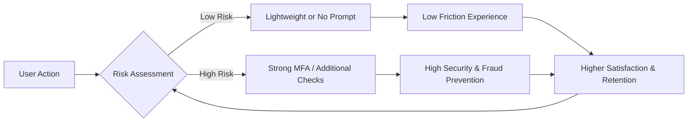
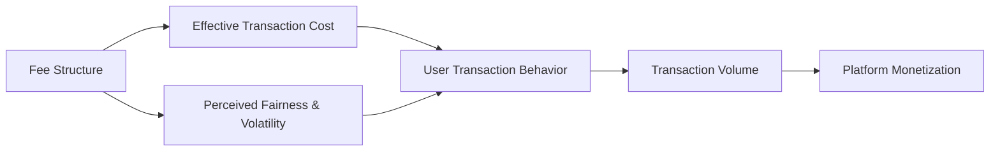
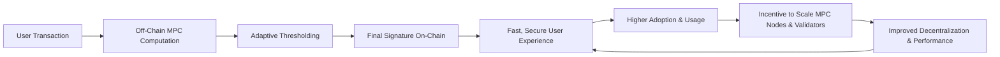

### Overview
This report provides an in-depth analysis of blockchain Multi-Party Computation (MPC) wallet mechanisms, designed to assess the causal reasoning and systemic thinking of senior-level product managers. It features 18 mechanism-focused questions and detailed answers, covering core product management areas: Growth, Retention, Monetization, User Behavior, Market Dynamics, and System Interactions. Each question is categorized by difficulty (Foundational, Interpretive, Analytical) and is accompanied by a comprehensive answer of 150-300 words. Answers integrate key insights, causal chains, feedback loops, quantitative aspects, and relevant metrics, supported by specific citations from academic literature and industry reports. The report emphasizes the intricate interdependencies within blockchain MPC wallet ecosystems, highlighting how different mechanisms drive or constrain product success.

**Total Questions**: 18
**Difficulty Distribution**: 6 Foundational (F), 6 Interpretive (I), 6 Analytical (A)
**Coverage**: 6 mechanism types (Growth, Retention, Monetization, User Behavior, Market, System) with 3 questions per type.

### Blockchain MPC Wallet Mechanism Analysis: Q&A

#### 1. Growth Mechanisms

##### Q1: How do network effects specifically drive viral adoption in blockchain MPC wallet platforms?
**Difficulty**: F
**Type**: Growth
**Key Insight**: Network effects in blockchain MPC wallets create a reinforcing loop where an increasing user base enhances platform utility and trust, leading to accelerated viral adoption.

**Answer**: Network effects are fundamental drivers of viral adoption in blockchain MPC wallet platforms, creating a powerful reinforcing loop. As more users adopt an MPC wallet, its utility increases significantly, primarily through enhanced interaction opportunities and strengthened security credibility. The distributed nature of MPC inherently benefits from a larger participant base, as it reduces single points of failure and increases the robustness of key management. This enhanced utility and security, perceived by existing users, directly encourages them to invite new users, which is a core component of viral adoption. The causal chain is: *Increased User Base → Enhanced Utility/Security → Increased User Trust → More Invitations/Referrals → Further User Base Growth*. This positive feedback loop means that each new user contributes to the value experienced by others, making the platform more attractive to prospective users. Quantitatively, when the viral coefficient (k) exceeds 1, the platform achieves self-sustaining, exponential growth, where each user recruits more than one new user on average. Leading metrics include the viral coefficient, user invitation rates, and user base growth, while a lagging metric is overall market share. The primary limitation is that early-stage platforms struggle to achieve critical mass to kickstart these effects.

###### Visual (Q1): Network effect loop in MPC wallet adoption

##### Q2: Explain how cross-chain integrations accelerate user acquisition for blockchain MPC wallets.
**Difficulty**: I
**Type**: Growth
**Key Insight**: Cross-chain integrations accelerate user acquisition by expanding an MPC wallet's utility and reach, creating a reinforcing feedback loop driven by increased asset accessibility and developer incentives.

**Answer**: Cross-chain integrations are a potent mechanism for accelerating user acquisition in blockchain MPC wallets by significantly enhancing their utility and interoperability across diverse blockchain networks. The core causal chain begins with the wallet’s ability to communicate and transact across heterogeneous chains, such as Ethereum or other EVM-compatible networks, which broadens its appeal to users holding assets on multiple blockchains. This expanded functionality attracts users seeking seamless management of various digital assets without needing multiple wallets, directly increasing user acquisition. As the user base grows through cross-chain appeal, network effects strengthen, leading to higher transaction volumes and increased liquidity within the wallet ecosystem. This, in turn, incentivizes more developers and ecosystem partners to integrate with the MPC wallet, further enriching its cross-chain capabilities and attracting even more users in a reinforcing feedback loop. Quantitatively, the success of cross-chain integrations can be measured by the increase in unique active users across newly integrated chains and the growth in total value locked (TVL) from multi-chain assets. A key reinforcing loop is the *Cross-Chain Utility Loop*: *More Integrations → Enhanced Wallet Utility → Increased User Acquisition → Higher Transaction Volume → Further Integrations*. Potential failure points include technical complexity, which can degrade transaction success rates, or security vulnerabilities in bridging mechanisms, which can undermine user trust and halt acquisition. Leading metrics include the number of integrated chains, transaction volume across chains, and new user sign-ups originating from cross-chain use cases.

###### Visual (Q2): Cross-chain utility and user acquisition loop

##### Q3: Design a mechanism to bootstrap network effects for a new blockchain MPC wallet in a nascent market.
**Difficulty**: A
**Type**: Growth
**Key Insight**: Bootstrapping network effects in a nascent market for a blockchain MPC wallet requires a strategic focus on initial utility, community building, and incentivized referrals to overcome the cold-start problem.

**Answer**: To bootstrap network effects for a new blockchain MPC wallet in a nascent market, a multi-faceted mechanism focusing on early utility and incentivized adoption is crucial. The core causal chain involves providing immediate value to initial users, fostering a strong community, and leveraging those early adopters to attract subsequent users.
1.  **Initial Utility & Niche Focus**: Instead of broad utility, target a specific high-value niche (e.g., secure institutional custody or cross-border payments in a specific corridor where traditional finance is slow). This provides a compelling initial use case. The MPC's inherent security and multi-signature capabilities are primary differentiators.
2.  **Community-Driven Incentives**: Implement an incentive program, possibly similar to early Bitcoin ecosystems, rewarding early users for participation and evangelism. This could include token rewards for referrals, liquidity provision, or active governance participation, establishing a *Reinforcing Community Loop*: *Incentives → Active Community Participation → Wallet Utility & Social Proof → New User Adoption → Stronger Community*.
3.  **Strategic Partnerships**: Collaborate with anchor partners (e.g., DApp developers, crypto exchanges, or local businesses) to integrate the MPC wallet, providing immediate access to users and services. This forms a *Reinforcing Partnership Loop*: *Partnerships → Ecosystem Integration → Expanded User Reach & Utility → More Partners → Stronger Ecosystem*.
The flow starts with targeted initial utility and incentives (Input), leading to early adoption and community formation (Process), which generates social proof and expands integration (Output), feeding back into increased user acquisition and network growth (Feedback). Quantitatively, aim for an initial viral coefficient (k) > 1 from incentivized referrals and measure the growth in user-generated content and partner integrations. A critical threshold is reaching a minimum viable community size, which acts as a floor, below which network effects may fail to materialize. Leading metrics include referral conversion rates, daily active users within the niche, and number of ecosystem integrations.

###### Visual (Q3): Bootstrapping network effects in a nascent market

| Mechanism                         | Primary Goal                              | Main Effect on Network Effects                         | Key Metrics                                   |
|-----------------------------------|-------------------------------------------|--------------------------------------------------------|-----------------------------------------------|
| Initial Utility & Niche Focus     | Deliver compelling first use case         | Attracts a focused early cohort                        | DAU in niche, initial transaction volume      |
| Community-Driven Incentives       | Reward early adopters & evangelists       | Strengthens community and social proof                 | Referral conversion, community engagement     |
| Strategic Partnerships            | Integrate with anchor ecosystem players   | Expands reach and utility via existing user channels   | # of partners, integrations, partner DAU      |

#### 2. Retention Mechanisms

##### Q4: How does enhancing key management UX influence user retention in blockchain MPC wallets?
**Difficulty**: F
**Type**: Retention
**Key Insight**: Improving key management UX in blockchain MPC wallets directly enhances user confidence and reduces friction, thereby positively influencing long-term user retention.

**Answer**: Enhancing key management user experience (UX) is a direct determinant of user retention in blockchain MPC wallets. The inherent complexity of managing cryptographic keys, especially for private keys, often poses a significant barrier to user engagement and can lead to churn. By simplifying processes like key generation, backup, and daily transaction signing through intuitive interfaces and automated processes, MPC wallets can drastically reduce cognitive load and user error. The causal pathway is: *Simplified Key Management UX → Reduced User Friction & Error → Increased User Confidence & Satisfaction → Higher Retention*. This creates a positive feedback loop: as users experience greater ease and security, their trust in the wallet grows, encouraging continued use and reducing the likelihood of abandoning the platform. Quantitatively, improved UX can reduce drop-off rates during critical actions (e.g., first transaction, key backup) by 10-20% and significantly improve 30-day retention rates. A balancing loop can occur if simplification sacrifices security, leading to compromises that erode trust and increase churn. Leading metrics include user-reported ease of use scores, successful transaction rates, and key backup completion rates, while lagging metrics include monthly churn rate and user lifetime value.

###### Visual (Q4): Key management UX and retention

##### Q5: Explain the interplay between recovery flows, social backup mechanisms, and their impact on minimizing churn during key loss events in MPC wallets.
**Difficulty**: I
**Type**: Retention
**Key Insight**: Robust recovery flows, coupled with social backup mechanisms, form a critical safety net for MPC wallets, minimizing churn during key loss by restoring user access without compromising security.

**Answer**: The interplay between robust recovery flows and social backup mechanisms is crucial for minimizing churn in MPC wallets, particularly during key loss or device migration events. MPC wallets inherently distribute key shares, making single-point key loss less catastrophic than with traditional wallets. Recovery flows outline the process by which users regain access to their funds, typically involving the reconstruction of a private key from distributed shares. Social backup mechanisms extend this by allowing users to delegate portions of their key recovery to trusted contacts or institutions. The causal chain is: *Key Loss/Device Migration → Initiated Recovery Flow → Successful Key Reconstruction via MPC & Social Backup → Restored Wallet Access → Minimized Churn*. This creates a strong positive feedback loop: users who successfully recover their wallets develop deeper trust and confidence in the platform, reinforcing their long-term engagement and reducing future churn intent. Conversely, a negative feedback loop can arise if recovery processes are too complex, slow, or fail, leading to frustration and permanent user churn. Quantitatively, a high success rate (e.g., >95%) for recovery operations is critical to preventing churn during these events, with each failed recovery potentially representing a lost user. Leading metrics include average key recovery time and successful recovery rate, while a key lagging metric is the churn rate following reported key loss incidents.

###### Visual (Q5): Recovery flows, social backup, and churn

| Component            | Role in the Flow                                            | Impact on Churn                         | Key Metrics                          |
|----------------------|-------------------------------------------------------------|-----------------------------------------|--------------------------------------|
| Recovery Flow        | Defines steps to regain access using MPC shares             | Faster, reliable access reduces churn   | Avg. recovery time, success rate     |
| Social Backup        | Trusted contacts/institutions hold recovery shares          | Increases resilience to device/key loss | # of social guardians, usage rate    |
| MPC Reconstruction   | Combines sufficient shares to restore access                | Core enabler of successful recovery     | Threshold (t-of-n), failure rate     |
| User Trust Feedback  | Successful recovery builds deeper trust                     | Higher loyalty and lower future churn   | Post-incident NPS, retention post-incident |

##### Q6: Design a retention mechanism for blockchain MPC wallets that addresses user fatigue from frequent security prompts without compromising asset safety.
**Difficulty**: A
**Type**: Retention
**Key Insight**: Designing a retention mechanism that mitigates security prompt fatigue involves adaptive authentication and contextual security, balancing user experience with asset safety through dynamic risk assessment.

**Answer**: To address user fatigue from frequent security prompts in blockchain MPC wallets while maintaining asset safety, a retention mechanism leveraging adaptive authentication and contextual security is essential. The core causal structure relies on dynamically adjusting security friction based on perceived risk, thereby reducing unnecessary prompts for low-risk actions.
1.  **Adaptive Authentication**: Implement a system where the level of authentication (e.g., biometric, PIN, multi-factor) required for a transaction or action adapts to its perceived risk. Factors influencing risk include transaction value, recipient address history, unusual time/location, or user behavior anomalies. This creates a *Balancing Friction Loop*: *High-Risk Event → Stronger Authentication → Reduced Fraud → Increased Trust → Less Fatigue for Low-Risk Actions*.
2.  **Contextual Security Triggers**: Utilize contextual triggers (e.g., device reputation, network environment, historical user patterns) to inform security decisions. For instance, a transaction initiated from a trusted, habitual device and location might require fewer prompts than one from a new device in an unfamiliar region. This reduces friction where trust is high, fostering habit formation.
3.  **MPC-based Delegated Approvals**: For recurring or low-value transactions, allow pre-approved partial key shares or MPC-based threshold signatures with fewer participants to expedite confirmation, subject to pre-defined limits. This shifts the burden of frequent manual approval.
The flow begins with a user action (Input), which is then evaluated by a dynamic risk assessment engine (Process). Based on the risk, an appropriate security prompt (or none) is presented (Output), leading to either a smooth experience or a secure verification, which informs future adaptations and builds trust (Feedback). Quantitatively, the goal is to reduce the average number of security prompts per user by 30% for routine actions while maintaining a fraud detection rate above 99%. Leading metrics include the frequency of security prompts, user-reported fatigue scores, and the success rate of adaptive authentication. Lagging metrics are churn rates and incident rates of unauthorized transactions.

###### Visual (Q6): Adaptive authentication and prompt fatigue

#### 3. Monetization Mechanisms

##### Q7: How do fee structures influence transaction volume and subsequent monetization in blockchain MPC wallets?
**Difficulty**: F
**Type**: Monetization
**Key Insight**: Fee structures directly influence transaction volume, creating a balancing feedback loop where high fees can deter activity, impacting overall monetization, while optimized fees can encourage it.

**Answer**: Fee structures exert a significant influence on transaction volume and, consequently, the monetization of blockchain MPC wallet platforms. Transaction fees are typically levied for processing and validating transactions on the blockchain network. The causal relationship is direct: *Fee Structure → Transaction Cost → User Behavior (Transaction Frequency) → Transaction Volume → Monetization*. If fees are perceived as too high or are highly volatile, users may reduce their transaction frequency, consolidate transactions, or seek alternative, cheaper platforms. This leads to a *Balancing Fee Sensitivity Loop*: *Increasing Fees → Reduced Transaction Volume → Decreased Monetization*, which can prompt wallet operators to adjust fee structures to optimize revenue and user satisfaction. Conversely, lower or more predictable fees can encourage more frequent transactions, boosting transaction volume and potentially leading to higher overall monetization, even with lower per-transaction fees. Quantitatively, revenue generated is typically a product of total transaction volume and the average fee per transaction. Platforms often monitor metrics like daily active transactions, fee per transaction, and user acquisition costs to find the optimal balance. A case study of major blockchain platforms shows that transaction fee policies directly impact network demands and user behavior.

###### Visual (Q7): Fee structure, volume, and monetization

##### Q8: Analyze how introducing premium features affects monetization dynamics and user segmentation in blockchain MPC wallets.
**Difficulty**: I
**Type**: Monetization
**Key Insight**: Introducing premium features in blockchain MPC wallets creates distinct user segments and enhances monetization by offering differentiated value, driving reinforcing adoption and balancing conversion loops.

**Answer**: Introducing premium features like advanced recovery options or multi-chain support significantly impacts monetization dynamics and user segmentation in blockchain MPC wallets. These features elevate the wallet's value proposition, attracting distinct user segments, particularly institutional clients or advanced users who prioritize enhanced security and interoperability. The causal chain begins with *Premium Features → Enhanced Value Proposition → Attracts High-Value User Segments → Increased Transaction Volume/Premium Subscriptions → Higher Monetization*. This creates a *Reinforcing Adoption Loop*: *Improved Features → Increased Adoption & Engagement → Higher Revenue → Reinvestment in More Features → Sustained Growth*. Monetization occurs through various models, such as subscription fees for advanced features or increased transaction volume from these higher-value segments. However, there's also a *Balancing Conversion Loop*: *Premium Features/Pricing → Potential User Friction/Cost Sensitivity → Moderated Conversion Rates*. Wallet providers must optimize feature bundling and pricing to maximize conversion without alienating the broader user base. User segmentation is a direct outcome, categorizing users into basic (free tier) and premium (paid tier) segments, each with different revenue contributions and engagement patterns. Quantitatively, premium user adoption rates, Average Revenue Per User (ARPU) across segments, and churn rates for premium users are crucial metrics. Conversion rates from free to premium tiers typically range from 5-15% depending on perceived value and price.

###### Visual (Q8): Premium features, segments, and monetization

| User Segment        | Key Features Consumed                         | Monetization Mode                            | Core Metrics                                  |
|---------------------|-----------------------------------------------|----------------------------------------------|-----------------------------------------------|
| Basic / Free Tier   | Core MPC wallet, single-chain transfers       | Indirect (network effects, base transaction) | DAU, base TX volume, free→paid conversion     |
| Premium Individuals | Advanced recovery, multi-chain, customization | Subscriptions, higher-value TX volume        | ARPU (premium), feature usage, churn (premium) |
| Institutions / B2B  | Institutional custody, policy controls        | Enterprise contracts, API/WaaS fees          | Contract MRR, API volume, retention of clients |

##### Q9: Design a monetization mechanism for a blockchain MPC wallet that balances network effects with sustainable revenue.
**Difficulty**: A
**Type**: Monetization
**Key Insight**: A balanced monetization mechanism for an MPC wallet integrates a freemium model with value-added services, fostering network effects through broad accessibility while generating sustainable revenue from premium features and enterprise solutions.

**Answer**: To design a monetization mechanism for a blockchain MPC wallet that effectively balances network effects with sustainable revenue, a multi-tiered approach is optimal. The core causal structure focuses on a freemium model that maximizes initial adoption and network growth, complemented by premium offerings and enterprise services to ensure long-term revenue.
1.  **Freemium Model for Network Effects**: Offer core MPC wallet functionalities (e.g., basic key management, single-chain transactions) for free or at minimal transaction fees to maximize user acquisition and foster network effects. This creates a *Reinforcing Adoption Loop*: *Free Tier Access → Increased User Base & Network Effects → Enhanced Platform Value → More Free Users*.
2.  **Premium Features for Revenue**: Monetize advanced features, such as multi-chain support, advanced recovery mechanisms (e.g., social recovery with specified custodians), personalized security settings, or institutional-grade custody solutions, through subscription tiers or feature-based fees. This caters to specific user segments willing to pay for higher value. This creates a *Balancing Conversion Loop*: *Premium Feature Introduction → User Segmentation & Conversion → Sustainable Revenue → Reinvestment in Features*.
3.  **Enterprise APIs/Partnerships**: Develop a B2B revenue stream by offering MPC wallet-as-a-service (WaaS) APIs for enterprises needing secure digital asset management or integration into their own applications. This taps into a high-value market segment and expands the overall ecosystem.
The flow starts with a compelling free offering (Input), leading to broad user adoption and ecosystem growth (Process). As users mature or demand more features, they convert to premium tiers or utilize enterprise solutions (Output), generating sustainable revenue that funds further development and network expansion (Feedback). Quantitatively, track free-to-paid conversion rates (e.g., target 5-10%), average revenue per user (ARPU) across tiers, and growth in enterprise contracts. Trade-offs include the risk of over-monetizing the free tier, which can stifle network effects, versus under-monetizing premium features, which hinders revenue sustainability. Leading metrics include active free users, premium subscriber count, and API usage volume.

###### Visual (Q9): Balancing network effects and revenue

 #### 4. User Behavior Mechanisms

##### Q10: How does user trust and perceived security drive behavioral adoption in blockchain MPC wallets?
**Difficulty**: F
**Type**: User Behavior
**Key Insight**: User trust and perceived security are fundamental drivers of behavioral adoption in blockchain MPC wallets, influencing both motivation and ability through reinforcing feedback loops.

**Answer**: User trust and perceived security are critical causal drivers for behavioral adoption in blockchain MPC wallets, acting through direct influence on user motivation and ability. The inherent security benefits of MPC, which distributes private key shares across multiple parties to mitigate single points of failure, directly enhances perceived security. This heightened perception of security reduces users' risk aversion and increases their trust in the wallet's integrity, forming a core causal pathway: *Enhanced Perceived Security → Increased User Trust → Higher Motivation to Adopt → Behavioral Adoption*. This pathway creates a positive feedback loop: as more users adopt the wallet due share positive experiences, the social proof and platform reputation grow, further reinforcing perceived security and trust among potential users. A second causal pathway involves the interplay of usability and trust. User-friendly MPC wallets, which simplify key management while maintaining security, enhance users' ability to interact with the system. This improved ability fosters perceived control and reduces cognitive load, increasing trust and satisfaction, thereby driving adoption. Quantitatively, a high perceived security score (e.g., >80% in user surveys) is often a prerequisite for significant adoption. Leading metrics include trust ratings, security feature usage, and user engagement levels.

###### Visual (Q10): Trust, perceived security, and adoption

##### Q11: Analyze the impact of onboarding friction (e.g., seed phrase complexity, multi-device setup) on user activation and long-term engagement in blockchain MPC wallets.
**Difficulty**: I
**Type**: User Behavior
**Key Insight**: Onboarding friction significantly impedes user activation and long-term engagement in blockchain MPC wallets by increasing cognitive load and drop-off rates, creating a balancing feedback loop that hinders growth.

**Answer**: Onboarding friction, particularly challenges like seed phrase complexity and multi-device setup, has a profound negative impact on user activation and long-term engagement in blockchain MPC wallets. The core causal mechanism is that such friction elevates cognitive load and the risk of user error during initial setup, thereby lowering users' perceived ability and confidence in using the wallet. This leads to high drop-off rates before users fully activate the wallet, curtailing the potential for long-term engagement. The causal chain is: *High Onboarding Friction → Increased Cognitive Load/User Error → Reduced Perceived Ability/Confidence → Lower Activation Rates → Decreased Long-term Engagement*. This creates a *Balancing Friction Loop*: *Increased Friction → Higher Drop-off Rates → Reduced User Base Growth → Less Social Proof/Adoption*. Conversely, minimizing friction, perhaps through simplified key management or seamless multi-device synchronization enabled by MPC, can lead to a *Reinforcing Engagement Loop*: *Low Friction → Higher Activation → Increased Engagement & Trust → More Social Proof/Referrals*. Quantitatively, industry analyses indicate that drop-off rates can be as high as 40-60% during onboarding due to these friction points. Leading metrics include onboarding completion rates, time-to-first-transaction, and user-reported ease of setup. Lagging metrics are long-term retention and user lifetime value. Tools like analytics platforms are crucial for identifying and quantifying these friction points.

###### Visual (Q11): Onboarding friction and engagement

| Friction Source             | Immediate Effect                         | Downstream Impact                        | Key Metrics                                      |
|-----------------------------|------------------------------------------|------------------------------------------|--------------------------------------------------|
| Seed phrase complexity      | Higher cognitive load, user errors       | Setup abandonment, reduced activation    | Onboarding completion rate, error rate           |
| Multi-device setup hurdles  | Longer setup time, configuration issues  | Frustration, delayed time-to-first-TX    | Time-to-first-transaction, support tickets       |
| Lack of guidance/education  | Low perceived ability and confidence     | Lower engagement, weaker long-term use   | Self-reported ease-of-setup, early retention     |
| High perceived risk         | Fear of loss during setup                | Churn before or shortly after activation | 7/30/90-day retention, lifetime value estimates  |

##### Q12: Design a user behavior mechanism for a blockchain MPC wallet to increase daily active usage through habit formation and contextual triggers.
**Difficulty**: A
**Type**: User Behavior
**Key Insight**: A user behavior mechanism can increase daily active usage by leveraging contextual triggers and positive reinforcement to foster habit formation, embedding MPC wallet interactions into users' routines.

**Answer**: To increase daily active usage in a blockchain MPC wallet through habit formation and contextual triggers, a mechanism integrating routine-based prompts and positive reinforcement is crucial. The core causal structure involves identifying specific moments where wallet interaction is relevant and providing a seamless, rewarding experience.
1.  **Contextual Triggers**: Implement intelligent notifications or in-app prompts that align with common user behaviors or external events. Examples include:
    -   *Payment Notifications*: Prompting users to confirm receipt of funds or make a subsequent payment.
    -   *Recurring Transactions*: Reminders for scheduled payments or subscriptions, making the wallet part of a routine.
    -   *Social Interaction Prompts*: Suggesting sharing a transaction receipt or initiating a group payment following a social event.
2.  **Simplified Action & Immediate Reward**: Ensure that responding to a trigger is effortless, leveraging MPC for quick, secure confirmations. Follow actions with immediate, positive reinforcement, such as gamified feedback, visual confirmation of security, or small, non-financial rewards. This forms a *Reinforcing Habit Loop*: *Trigger → Easy Action → Positive Reward → Strengthened Habit → Increased DAU*.
3.  **Onboarding for Habit Formation**: Design onboarding to introduce these trigger-action-reward cycles early, implicitly guiding users towards desired habitual behaviors. Simplify key management and recovery processes to minimize friction, which can otherwise disrupt habit formation. This creates a *Balancing Friction Loop*: *Onboarding Friction → Decreased Motivation → Weakened Habit Formation → Lower DAU*.
The flow starts with a Contextual Trigger (Input), followed by the User's Motivation and Ability (Process, enhanced by low friction), leading to Wallet Interaction (Output), and finally a Reward and Feedback that strengthens the habit (Feedback). Quantitatively, track the Trigger Response Rate (percentage of users acting on prompts), session frequency and duration, and the slope of the retention curve. Leading metrics include Daily Active Users (DAU), successful trigger-to-action conversion rates, and user engagement with gamified elements.

###### Visual (Q12): Trigger–action–reward habit loop

#### 5. Market Mechanisms

##### Q13: How do ecosystem partnerships shape the market position of blockchain MPC wallet platforms?
**Difficulty**: F
**Type**: Market
**Key Insight**: Ecosystem partnerships critically shape the market position of blockchain MPC wallets by expanding their functionality, enhancing user trust, and reinforcing platform value, thereby increasing competitiveness.

**Answer**: Ecosystem partnerships are vital in shaping the market position of blockchain MPC wallet platforms by expanding their capabilities, enhancing user trust, and reinforcing their overall value proposition. These collaborations can involve exchanges, DApp developers, payment processors, or even traditional financial institutions. The causal chain is: *Strategic Partnerships → Expanded Functionality/Integration → Increased User Base & Utility → Stronger Market Position*. Strong partnerships lead to broader integration options, enabling the MPC wallet to support a wider range of assets, services, and use cases, which directly attracts more users. This creates a *Reinforcing Partnership Loop*: *More Partners → Increased Utility/Reach → Higher User Adoption → Attracts More Partners*. Conversely, platforms that fail to establish robust ecosystem relationships risk losing market share to more integrated competitors. The market position is strengthened as these partnerships contribute to the wallet's perceived reliability and comprehensive service offering. Quantitatively, market share can be correlated with the number and quality of ecosystem integrations. Leading metrics include the number of unique partner integrations, transaction volume originating from partner services, and brand recognition within the broader blockchain ecosystem.

###### Visual (Q13): Ecosystem partnerships and market position

##### Q14: Analyze the impact of regulatory changes and cross-border compliance on the market dynamics of blockchain MPC wallets.
**Difficulty**: I
**Type**: Market
**Key Insight**: Regulatory changes and cross-border compliance act as both gates and enablers for blockchain MPC wallets, influencing market dynamics by impacting user trust, operational costs, and market share shifts.

**Answer**: Regulatory changes and cross-border compliance profoundly impact the market dynamics of blockchain MPC wallets, acting as both mandatory gates and significant enablers. Compliance with Anti-Money Laundering (AML) and Know Your Customer (KYC) regulations, for example, introduces friction in user onboarding but simultaneously enhances trust and legitimacy for many users, especially in traditional finance sectors. The causal chain is: *Regulatory Changes → Compliance Requirements → Operational Cost/Friction + Increased Trust → User Adoption/Market Share Shifts*. This creates a *Balancing Compliance Cost Loop*: *Stricter Regulations → Higher Operational Costs → Potential Price Increases/Reduced Margins → Limited Market Entry for Smaller Players*. However, for compliant platforms, a *Reinforcing Trust Loop* can emerge: *Robust Compliance → Increased User Trust & Legitimacy → Higher Adoption Rates → Increased Market Share*. Cross-border compliance introduces further complexity, as different jurisdictions have varying legal frameworks. MPC wallets that can seamlessly navigate these diverse requirements, perhaps through adaptive governance models, gain a competitive advantage, leading to market share shifts towards platforms with robust multi-jurisdictional compliance capabilities. Quantitatively, market share shifts can be measured by comparing the growth of compliant vs. non-compliant platforms after significant regulatory events. Leading indicators include regulatory risk scores, compliance audit success rates, and cross-border transaction volume.

###### Visual (Q14): Regulatory impact on MPC wallet markets

| Regulatory Aspect             | Primary Effect                            | Market Dynamics Impact                               | Key Indicators                                  |
|-------------------------------|-------------------------------------------|------------------------------------------------------|-------------------------------------------------|
| AML/KYC enforcement           | Higher onboarding friction                | May slow growth but increases institutional trust    | Onboarding time, verification success rate      |
| Licensing & registration      | Higher fixed operational costs            | Raises entry barrier, favors well-capitalized teams  | Compliance cost share, number of licensed firms |
| Cross-border data/asset rules | Legal complexity across jurisdictions     | Advantage for wallets with strong multi-region setup | Cross-border TX volume, jurisdictions covered   |
| Enforcement intensity         | Increased risk for non-compliant players  | Market share shift toward compliant wallets          | Regulatory risk score, audit outcomes           |

##### Q15: Design a market entry mechanism for a blockchain MPC wallet targeting emerging markets, considering local user behavior and infrastructure.
**Difficulty**: A
**Type**: Market
**Key Insight**: A successful market entry mechanism for an MPC wallet in emerging markets integrates local user behavior (trust, social influence), infrastructure limitations (lightweight design), and regulatory nuances to foster rapid adoption and network growth.

**Answer**: To design an effective market entry mechanism for a blockchain MPC wallet targeting emerging markets, a strategy must deeply integrate local user behaviors, account for infrastructural limitations, and navigate regulatory landscapes. The core causal structure prioritizes accessibility, trust-building, and leveraging local social dynamics.
1.  **Lightweight & Mobile-First Design**: Given prevalent mobile usage and potential for limited internet connectivity or device processing power, the wallet must be lightweight, consume minimal data, and be optimized for low-end smartphones. This addresses a critical *Infrastructural Gate*: *Optimized Design → Reduced Technical Barriers → Increased Accessibility & User Ability*.
2.  **Localized Trust & Social Proof**: Build trust through local partnerships (e.g., microfinance institutions, local businesses) and leverage community leaders for endorsement. Integrate social sharing and referral mechanisms (e.g., peer-to-peer payments, group savings) that resonate with existing social behaviors. This forms a *Reinforcing Trust & Social Adoption Loop*: *Local Trust/Social Proof → Increased Behavioral Intention → Viral Adoption → Expanded User Base*.
3.  **Simplified Onboarding & Education**: Minimize onboarding friction by simplifying KYC (if mandatory) and providing education in local languages on the benefits of MPC for security, privacy, and financial inclusion. Avoid complex seed phrase management by default, opting for MPC-based recovery solutions.
The flow starts with a market assessment (Input), leading to a localized, accessible product and trust-building strategy (Process). This results in increased user adoption and social propagation (Output), which feeds back into expanded market reach and community engagement (Feedback). Quantitatively, measure onboarding completion rates, user acquisition cost per market, and the growth in active user cohorts. A critical floor is ensuring the wallet functions reliably on typical devices and networks in the target market; failure here halts all growth. Leading indicators include local partnership acquisition rates, user feedback on ease of use, and local community engagement metrics.

###### Visual (Q15): Market entry in emerging markets

| Design Dimension                 | Local Constraint Addressed                      | Mechanism Used                                      | Success Metrics                                     |
|----------------------------------|-------------------------------------------------|----------------------------------------------------|-----------------------------------------------------|
| Lightweight, mobile-first app    | Low-end devices, unstable connectivity          | Small footprint, offline-friendly flows            | App size, crash rate, TX success on low-end devices |
| Localized trust & social proof   | Low trust in new financial tech                 | Community leaders, local partners, social features | Referral rate, NPS by region, partner count         |
| Simplified onboarding & education| Low financial/technical literacy                | Local-language flows, MPC-based recovery           | Onboarding completion, KYC pass rate, survey scores |

#### 6. System Mechanisms

##### Q16: How do system-level feedback loops from validator participation and protocol upgrades influence the stability and scalability of blockchain MPC wallet platforms?
**Difficulty**: F
**Type**: System
**Key Insight**: System-level feedback from validator participation and protocol upgrades directly impacts the stability and scalability of blockchain MPC wallet platforms through reinforcing and balancing loops affecting trust and performance.

**Answer**: System-level feedback loops arising from validator participation and protocol upgrades are crucial in determining the stability and scalability of blockchain MPC wallet platforms. High validator participation is a key input, as it increases network security, decentralization, and resilience against attacks. This creates a *Reinforcing Stability Loop*: *High Validator Participation → Increased Network Security/Decentralization → Enhanced Trust → Attracts More Users & Validators*. Conversely, low participation introduces a *Balancing Instability Loop* where reduced decentralization increases attack risks and erodes trust. Protocol upgrades, as another input, target improvements in scalability (e.g., throughput, latency) and privacy through more efficient MPC protocols or off-chain computations. Successful upgrades lead to a *Reinforcing Scalability Loop*: *Improved Performance/UX → Increased Adoption → Incentivizes Further Upgrades*. However, if upgrades introduce complexity, incompatibility, or unexpected bugs, they can trigger a *Balancing Performance Degradation Loop*, leading to validator reluctance, errors, and slowed adoption. The flow involves validators processing transactions and executing MPC protocols, with blockchain consensus updates providing outputs on stability and scalability. These outputs then influence validator engagement and future upgrade decisions (Feedback). Quantitatively, metrics like validator uptime, block finalization times, and transaction processing rates are leading indicators of system health.

###### Visual (Q16): Validator participation, upgrades, and system health

##### Q17: Analyze the systemic risks (collusion, key compromise, liveness) introduced by multi-party computation in blockchain wallets, and their causal implications.
**Difficulty**: I
**Type**: System
**Key Insight**: While MPC enhances security, it introduces systemic risks like collusion, key compromise, and liveness issues, which can destabilize blockchain wallets through complex causal and feedback loops if not robustly mitigated.
**Answer**: Multi-Party Computation (MPC) significantly enhances blockchain wallet security by distributing key management, yet it introduces specific systemic risks: collusion, key compromise, and liveness issues, each with distinct causal implications.
1.  **Collusion**: MPC protocols assume parties are honest or semi-honest. If a sufficient number of MPC participants collude, they can reconstruct a private key and compromise confidentiality or integrity. The causal chain is: *Sufficient Collusion → Key Reconstruction → Unauthorized Transaction/Data Leak → Loss of Funds/Trust*. This creates a *Balancing Trust Erosion Loop*: *Collusion Incident → Decreased User Trust → Reduced Adoption → Lower Incentive for Further Collusion*, but at great cost. Mitigation via game-theoretic approaches and incentive mechanisms is key.
2.  **Key Compromise**: While distributed, if multiple key shares (above the threshold, \\(t\\) out of \\(n\\)) are compromised, the entire private key can be revealed. This could be due to individual device hacks or insider threats. The causal chain is: *Multiple Key Share Compromises → Private Key Exposure → Unauthorized Asset Access → Financial Loss*. This leads to a *Balancing Security Panic Loop*: *Key Compromise → Public Disclosure → Rapid Decline in User Trust & Mass Exodus*.
3.  **Liveness Issues**: MPC requires active participation from multiple parties to sign transactions. Network delays, unresponsive parties, or software bugs can cause transactions to stall, impacting system liveness. The causal chain is: *Unresponsive MPC Parties → Transaction Stalling → Poor User Experience → Reduced Transaction Volume*. This triggers a *Balancing Usability Loop*: *Poor Liveness → User Frustration → Decreased Usage → Reduced Platform Value*.
Quantitatively, risk thresholds are often defined by the honest majority assumption (e.g., at least \(t+1\) honest parties out of \(n\) for \(t\)-threshold MPC). Leading metrics include collusion probability models, party availability rates, and transaction confirmation times. Empirical studies on MPC wallets highlight practical key-extraction attacks that exploit these vulnerabilities, underscoring the need for robust protocols and monitoring.

###### Visual (Q17): Systemic MPC risks overview

| Risk Type        | Causal Chain (Simplified)                                                | Primary Impact                         | Monitoring Metrics                               |
|------------------|---------------------------------------------------------------------------|----------------------------------------|--------------------------------------------------|
| Collusion        | Parties collude → Key reconstructed → Unauthorized actions → Trust loss  | Confidentiality & integrity failures   | Collusion incentives, on/off-chain correlation   |
| Key compromise   | ≥t key shares compromised → Private key exposed → Asset theft            | Direct financial loss & reputation hit | Device compromise rate, anomaly detection alerts |
| Liveness issues  | Parties unavailable or slow → TX stalls → Poor UX → Reduced usage        | Throughput and user satisfaction       | Party uptime, confirmation time, failure rate    |

**Answer**: Designing a system optimization mechanism for a blockchain MPC wallet to balance decentralization, performance, and user experience (the blockchain trilemma) necessitates a multi-layered approach leveraging both cryptographic and architectural innovations. The core causal structure focuses on offloading computationally intensive tasks from the main blockchain and intelligently managing MPC participants.
1.  **Off-Chain MPC Computation**: Perform the majority of MPC key generation and signature operations off-chain, only committing the final, aggregated signature to the blockchain. This significantly reduces on-chain load and improves transaction throughput and latency, enhancing performance and user experience. This creates a *Reinforcing Performance Loop*: *Off-Chain Processing → Faster Transactions → Improved UX → Higher Adoption → More Transaction Volume*.
2.  **Adaptive Thresholding**: Implement dynamic MPC threshold schemes where the number of required participants (the 't' in t-of-n) can be adjusted based on transaction value, risk assessment, or network conditions. Lower thresholds (e.g., 2-of-3) for small, frequent transactions enhance performance, while higher thresholds (e.g., 5-of-7) protect large, infrequent transactions, maintaining decentralization where it matters most. This creates a *Balancing Decentralization-Performance Loop*: *Adaptive Thresholding → Optimal Security for Risk → Improved Performance & UX → Increased Trust*.
3.  **Modular Architecture for Scalability**: Design the MPC system with a modular architecture that allows for independent scaling of MPC nodes from blockchain validators. Use state-sharing protocols that allow validators to participate without storing the full blockchain state, reducing storage costs and increasing decentralization by enabling more nodes.
The flow starts with a user-initiated transaction (Input). MPC computations occur off-chain (Process) with adaptive thresholding, reducing latency. The final signature is broadcast on-chain (Output), resulting in a fast, secure user experience that feeds back into increased adoption and system stability (Feedback). Quantitatively, aim for sub-second transaction finality for most operations, while maintaining a minimum effective decentralization score based on the distribution of key shares and MPC participants. A trade-off is the increased complexity of managing off-chain components and the potential for a new attack surface if not secured properly. Leading metrics include average transaction latency, MPC round-trip time, and the number of active MPC participants.

###### Visual (Q18): Balancing the MPC wallet trilemma

Sources: 
[1] BFR-MPC: a blockchain-based fair and robust multi-party computation scheme, https://ieeexplore.ieee.org/abstract/document/8793074/
[2] MPC-ABC: Blockchain-Based Network Communication for Efficiently Secure Multiparty Computation, https://www.semanticscholar.org/paper/07c16685c0d95ab3129b204a7e4ea567afc18629
[3] Scales: Mpc with small clients and larger ephemeral servers, https://link.springer.com/chapter/10.1007/978-3-031-22365-5_18
[4] Blockchain-empowered trustworthy data sharing: Fundamentals, applications, and challenges, https://dl.acm.org/doi/abs/10.1145/3718082
[5] … Online Personas and Financial Transactions on Distributed Ledgers with the Use of Advanced Cryptographic Methods: Blockchain Technology for Cybersecurity, https://ieeexplore.ieee.org/abstract/document/11167610/
[6] Incentive-Compatible and Privacy-Preserving Data Analytics System enabled by Blockchain and Multiparty Computation, https://webthesis.biblio.polito.it/10921/
[7] Applications of blockchains in the Internet of Things: A comprehensive survey, https://ieeexplore.ieee.org/abstract/document/8580364/
[8] … : Privacy-aware secure multi-party computation for real-time connected and autonomous vehicles and micro-mobility data validation using blockchain—A study on …, https://journals.sagepub.com/doi/abs/10.1177/03611981231180200
[9] Improving Scalability, Privacy, and Decentralization of Blockchains and their Applications via Multiparty Computation, https://tuprints.ulb.tu-darmstadt.de/entities/publication/cbd2f9e2-4df4-4e10-a519-1d6c773a2f54
[10] Facilitating Mass Adoption of Blockchain Technology through Multi-party Computation Wallets, https://www.researchgate.net/profile/Sergey-Yurish/publication/385242017_Proceedings_of_the_3rd_Blockchain_and_Cryptocurrency_Conference_B2C'_2024_Tenerife_Canary_Islands_Spain_Edited_by_Sergey_Y_Yurish/links/671b676edf4b534d4ef488d2/Proceedings-of-the-3rd-Blockchain-and-Cryptocurrency-Conference-B2C-2024-Tenerife-Canary-Islands-Spain-Edited-by-Sergey-Y-Yurish.pdf#page=9
[11] What Can Cryptography Do For Transaction Fee Mechanism Design, http://reports-archive.adm.cs.cmu.edu/anon/anon/usr/ftp/usr0/ftp/2024/CMU-CS-24-115.pdf
[12] Sok: Decentralized ai (deai), https://arxiv.org/abs/2411.17461
[13] Challenges in making blockchain privacy compliant for the digital world: some measures, https://link.springer.com/article/10.1007/s12046-022-01931-1
[14] ControlPay: An Adaptive Payment Controller for Blockchain Economies, https://ieeexplore.ieee.org/abstract/document/10664211/
[15] A Blockchain Wallet Scheme with Multi-Factor Authentication Based on Distributed System, https://ieeexplore.ieee.org/abstract/document/10805375/
[16] MPC+: secure, compatible and efficient off-blockchain multi-node payment channel, https://ieeexplore.ieee.org/abstract/document/10477254/
[17] Auditable, Available and Resilient Private Computation on the Blockchain via MPC, https://link.springer.com/chapter/10.1007/978-3-031-07689-3_22
[18] A brief introduction to blockchain economics, https://www.worldscientific.com/doi/abs/10.1142/9789811220470_0001
[19] Blockchains Enable Non-Interactive MPC, https://link.springer.com/chapter/10.1007/978-3-030-90453-1_6
[20] Addressing Centralization, Security and Performance Issues in Real-World Blockchain Systems, https://s-space.snu.ac.kr/bitstream/10371/196483/1/000000178088.pdf
[21] Practical key-extraction attacks in leading MPC wallets, https://dl.acm.org/doi/abs/10.1145/3658644.3670359
[22] Sok: Web3 recovery mechanisms, https://eprint.iacr.org/2023/1575
[23] A comprehensive review of blockchain consensus mechanisms, https://ieeexplore.ieee.org/abstract/document/9376868/
[24] Blockchain-based Ride-sharing Model With Decentralized Governance, https://erepository.uonbi.ac.ke/handle/11295/163888
[25] A survey on consensus mechanisms and mining strategy management in blockchain networks, https://ieeexplore.ieee.org/abstract/document/8629877/
[26] Enhancing Multi-Signature Cryptocurrency Wallets with Risk-Based Authentication, https://ucalgary.scholaris.ca/items/514037f3-3d69-492f-9902-fd71c47cccf7
[27] Secure Multi-Party Computation for Digital Assets Custody Purpose-Analysis of Open-Source Implementations, https://ieeexplore.ieee.org/abstract/document/10338922/
[28] Harnessing The Power of Blockchain In Growth Markets: An Overview of Agile Dynamics Tech's Report, https://www.semanticscholar.org/paper/69170889fac7862395afcdcb0c4d45aa0115ce1c
[29] Data integrity in decentralized financial systems: A model for auditable, automated reconciliation using blockchain and ai, https://www.researchgate.net/profile/Kehinde-Abiodun-5/publication/393449785_Data_Integrity_in_Decentralized_Financial_Systems_A_Model_for_Auditable_Automated_Reconciliation_Using_Blockchain_and_AI/links/68839f32f8031739e608b775/Data-Integrity-in-Decentralized-Financial-Systems-A-Model-for-Auditable-Automated-Reconciliation-Using-Blockchain-and-AI.pdf
[30] How can incentive mechanisms and blockchain benefit with each other? a survey, https://dl.acm.org/doi/abs/10.1145/3539604
[31] In blockchain we trust: does blockchain itself generate trust?, https://onlinelibrary.wiley.com/doi/abs/10.1111/ssqu.12917
[32] Biometrics Enhances Blockchain Wallet Governance, https://ieeexplore.ieee.org/abstract/document/11114682/
[33] Learning to trust: exploring the relationship between user engagement and perceptions of trustworthiness in self-sovereign blockchain systems, https://open.library.ubc.ca/soa/cIRcle/collections/ubctheses/24/items/1.0417415
[34] Exploring Ethereum's Network Effects on Digital Asset Value: A Blockchain Study, https://search.proquest.com/openview/8563c0f91a9ca99b1725793b77aee6b7/1?pq-origsite=gscholar&cbl=18750&diss=y
[35] Blockchain abnormal behavior awareness methods: a survey, https://link.springer.com/article/10.1186/s42400-021-00107-4
[36] Detailed Review on Enabling Secure and Seamless Crypto Wallet: A Blockchain Solution, https://www.cureusjournals.com/articles/1099-detailed-review-on-enabling-secure-and-seamless-crypto-wallet-a-blockchain-solution
[37] Programmed trust: Opportunities and risks of blockchain technology, https://www.semanticscholar.org/paper/709a4872138ab199302c4016caaca99fb30675e5
[38] Why Bitcoin and Ethereum Differ in Transaction Costs: A Theory of Blockchain Fee Policies, https://papers.ssrn.com/sol3/papers.cfm?abstract_id=4538150
[39] Open innovation ecosystems, https://link.springer.com/chapter/10.1007/978-3-319-76394-1_5
[40] An Overview of MPC++ - Extended Abstract, https://link.springer.com/chapter/10.1007/BFb0023065
[41] A blockchain-based framework for IoT data monetization services, https://academic.oup.com/comjnl/article-abstract/64/2/195/5911075
[42] Payment'Tokens': A Route to Optimizing Liquidity Management?, https://papers.ssrn.com/sol3/papers.cfm?abstract_id=4823807
[43] Blockchain Wallet for Secure Transactions, https://papers.ssrn.com/sol3/papers.cfm?abstract_id=4487894
[44] Analysis of Security Issues in Blockchain Wallet, https://www.semanticscholar.org/paper/bca73593170616b98fd2d9116fc23229e44a4ee3
[45] Blockchain-Based Application Security Risks: A Systematic Literature Review, https://arxiv.org/abs/1912.09556
[46] What drives adoption of smart contract?: Identifying peer influences in blockchain user network, https://www.semanticscholar.org/paper/05e0640c17cc6d6f4693d3ff9a22962a1e07a27f
[47] Analysis of Innovation Resistance Factors Regarding Blockchain Wallet Usage, https://kiss.kstudy.com/Detail/Ar?key=3881707
[48] Blockchain—literature survey, https://ieeexplore.ieee.org/abstract/document/8256979/
[49] Development of a secure and multi-blockchain enabled cryptocurrency wallet, https://www.dbpia.co.kr/journal/articleDetail?nodeId=NODE12038858&buildDate=2025-11-11+19%3A29%3A47&nowDate=20251111_2&cdnUrl=https%3A%2F%2Fcdn.dbpia.co.kr%2Fstatic&appVersion=1.0.0&minify=.min&buildTime=20251111192947&language=ko_KR&hasTopBanner=true
[50] Blockchain platform and future bank competition, https://www.emerald.com/insight/content/doi/10.1108/fs-12-2018-0113/full/html
[51] Warm Wallets: A Safer Design to Achieve Business Automation for Blockchain-Based Services A Novel Wallet Implementation Strategy for Enhancing Blockchain-based Online Services Security, https://www.semanticscholar.org/paper/64c71c274d1c20d52652244938b83d257b05028d
[52] Securing Financial Systems with Block chain: A Comprehensive Review of Block chainand Cybersecurity Practices, https://www.neliti.com/publications/590126/securing-financial-systems-with-block-chain-a-comprehensive-review-of-block-chai
[53] Blockchain Technology in Ethereum Wallets, https://www.semanticscholar.org/paper/ceb6633a958b3ee679ec5770255bd2cfe8e5b04a
[54] Ethereum Blockchain Wallets, https://www.semanticscholar.org/paper/44eefa2e085c2f8f7ef57dbb62e65d6cba36e6f3
[55] Security aspects of cryptocurrency wallets—a systematic literature review, https://dl.acm.org/doi/abs/10.1145/3596906
[56] Usable cryptocurrency systems, https://edoc.ub.uni-muenchen.de/31095/
[57] Blockchain Wallets in Health care systems, https://www.semanticscholar.org/paper/923800f5cf357d48dbb8d54a379fe1a3dd427cf4
[58] BlockTree: a nonlinear structured, scalable and distributed ledger scheme for processing digital transactions, https://www.semanticscholar.org/paper/9bec980fda7e986fe4b705ae955eeb317db1ffd2
[59] Behavioral intention to use cryptocurrency in Malaysia: an empirical study, https://www.emerald.com/insight/content/doi/10.1108/bl-08-2020-0053/full/html
[60] Digital Wallet Dynamics: Perspectives on Potential Worldcoin Adoption Factors in a Developing Country's FinTech Sector, https://linkinghub.elsevier.com/retrieve/pii/S2199853124000817
[61] USING SHARDING TO IMPROVE BLOCKCHAIN NETWORK SCALABILITY, https://www.semanticscholar.org/paper/0fa24b100210baabdd3651e12a25421ceda3646b
[62] A study on the use of cryptocurrency wallets from a user experience perspective, https://www.semanticscholar.org/paper/952ac5e82f20dd7ea3574c0e79542b4bc900e47d
[63] Design and Implementation of Time-lock Wallet using Blockchain Technology, https://www.semanticscholar.org/paper/8cedb49e9f85021c08ddb6f4536a8f87a599ddae
[64] Information diffusion in referral networks: an empirical investigation of the crypto asset landscape, https://iris.unimore.it/handle/11380/1356546
[65] Blockchain Approach for Smart Health Wallet, https://www.semanticscholar.org/paper/a83cfa07ff1390d71044c65156cd3dd15aa1ed00
[66] Mobile payment and e-wallet adoption in emerging economies: A systematic literature review, https://journal.uitm.edu.my/ojs/index.php/JEEIR/article/view/4009
[67] The prevalence of mobile wallets in developing countries: a retailers' perspective, https://www.emerald.com/ribs/article/doi/10.1108/RIBS-04-2025-0062/1311725
[68] A Practical Recovery Mechanism for Blockchain Hardware Wallets, https://ieeexplore.ieee.org/document/10752638/
[69] Innovative Countermeasures to Defeat Cyber Attacks Against Blockchain Wallets, https://arxiv.org/abs/2303.17206
[70] Survey on Blockchain Cryptocurrency Wallet, https://www.semanticscholar.org/paper/d2ccd2dc14e8e953110a5c1a6914cefa5b85877d
[71] Gaza Wallet: A Simple and Efficient Blockchain Application, https://papers.ssrn.com/sol3/papers.cfm?abstract_id=3660325
[72] Cross-Border Payments with Blockchain, https://publications.iadb.org/en/cross-border-payments-blockchain
[73] Coin Recovery from Inaccessible Cryptocurrency Wallet Using Unspent Transaction Output, https://ieeexplore.ieee.org/document/8911915/
[74] Game Theoretical Analysis of Blockchain Users' Behaviors. (Analyse via la théorie des jeux sur les comportements des utilisateurs blockchain), https://www.semanticscholar.org/paper/b44f095d1c77a216366253e97fad2136df4020a5
[75] Transaction Latency in Blockchain Networks: Insights from Queuing Theory, https://ieeexplore.ieee.org/document/10735545/
[76] Age-aware Fairness in Blockchain Transaction Ordering for Reducing Tail Latency, https://www.semanticscholar.org/paper/2bfb45735277735c4222bd2a4618269443cca712
[77] Securing Participation and Activation, https://www.semanticscholar.org/paper/84d0a3714058e81deb1d13d9e45b18cf38738655
[78] An Architecture for Easy Onboarding and Key Life-Cycle Management in Blockchain Applications, https://ieeexplore.ieee.org/document/9122012/
[79] Challenges and Opportunities of Blockchain, https://onlinelibrary.wiley.com/doi/abs/10.1002/9781394238033.ch2
[80] Blockchain Technology and Cryptocurrency: Transformations and Applications in Financial Markets, https://papers.ssrn.com/sol3/papers.cfm?abstract_id=5612550
[81] Blockchain Technology Adoption by Chain Professionals, https://www.semanticscholar.org/paper/9ff106ee1dfedbcb10cd0b9c20453b414d9e38cb
[82] Legal and Regulatory Landscape of Blockchain Technology in Various Countries, http://services.igi-global.com/resolvedoi/resolve.aspx?doi=10.4018/978-1-7998-7927-5.ch004
[83] Special Instruments to Reveal and Resist Unfair Practices with Cryptocurrencies and Digital Financial Assets, https://www.semanticscholar.org/paper/7caaf58a3048461dcc3192b332fe0828f91e9206
[84] A Scalable State Sharing Protocol for Low-Resource Validator Nodes in Blockchain Networks, https://www.semanticscholar.org/paper/15517951c7dc74f44ce607189ac4a19f780422c7
[85] A centre-based validator selection approach for a scalable BFT blockchain, https://www.semanticscholar.org/paper/eac59144bfc40e5d3b2c7f8945eb4c21a383c46b
[86] Sign Up Wallet: A Blockchain and Machine Learning based Self-Sovereign Identity Model for Enhanced Digital Security, https://ieeexplore.ieee.org/document/10511097/
[87] A novel Layer 2 framework for breaking the blockchain trilemma problem using MPC-in-the-Head, https://linkinghub.elsevier.com/retrieve/pii/S1389128625001161
[88] Collusion Deterrence in Multi-Party Computation – An Evolutionary Game-Theoretic Approach, https://www.semanticscholar.org/paper/fc1a11bfb6d6f8d9f41b957994427c14255230ec
