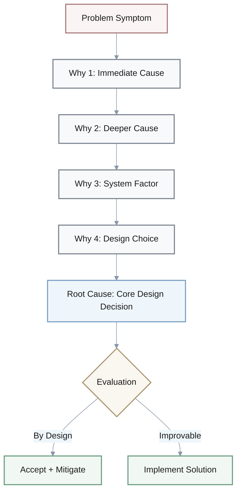
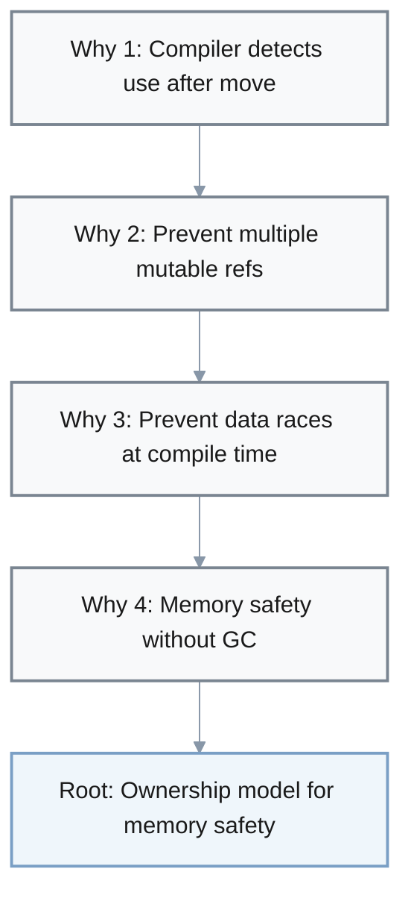
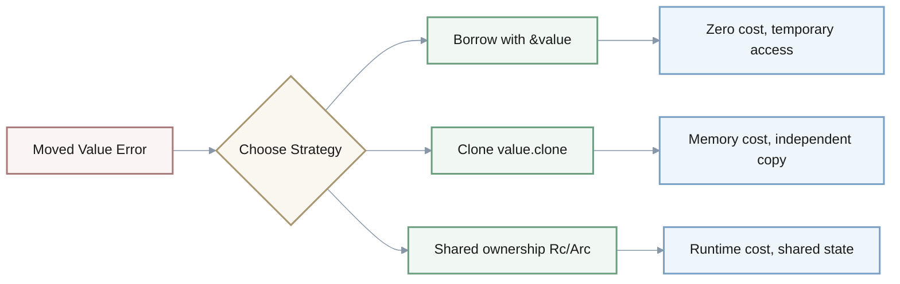
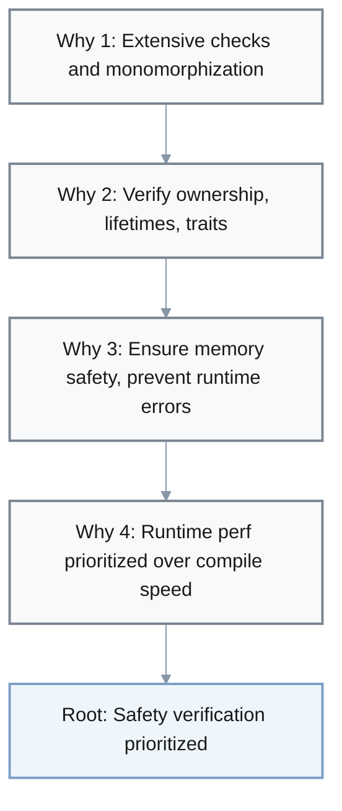
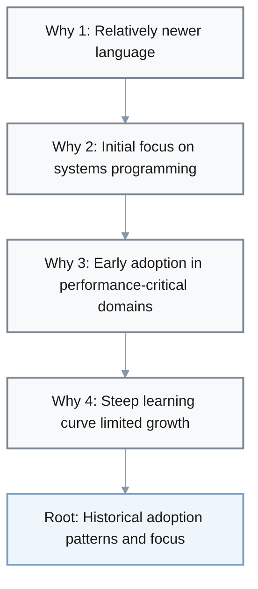
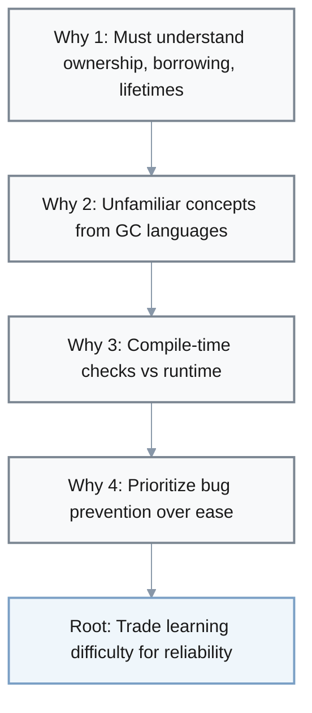
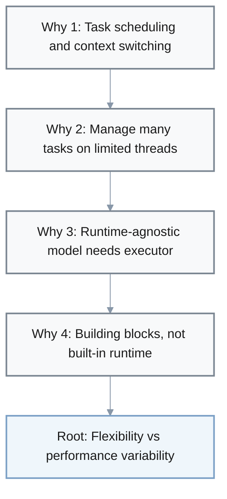
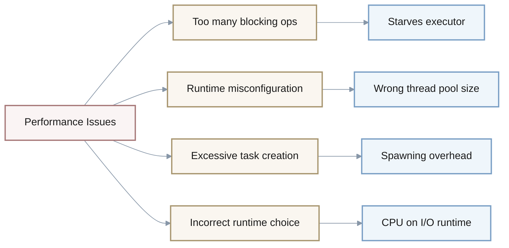

# Rust Common Issues: 5-Why Root Cause Analysis

## Metadata
- **Last Updated**: 2025-11-26
- **Status**: Draft
- **Owner**: Individual
- **Purpose**: Identify root causes of common Rust development challenges using 5-Why analysis for teams evaluating or working with Rust

## Context

This document analyzes five common challenges developers encounter with Rust using the 5-Why methodology. The analysis helps teams understand whether issues stem from fundamental language design decisions (working as intended) or solvable problems.



**Target Audience**: 
- Development teams evaluating Rust adoption
- Team leads managing Rust projects
- Developers transitioning from other languages

**Scope**: Covers compilation errors, performance, ecosystem maturity, learning curve, and async programming

**Key Terms**:
- **Ownership**: Rust's system where each value has a single owner responsible for cleanup
- **Borrowing**: Temporary access to values without taking ownership
- **Monomorphization**: Compile-time generation of specialized code for each type used with generics
- **Async Runtime**: Execution environment (e.g., Tokio, async-std) that schedules async tasks

## Analysis

### 1. [CRITICAL] Compilation Failures: "use of moved value"

**Symptom**: Compilation fails with "use of moved value" errors



**5-Why Analysis**:
- **Why 1**: The compiler detects attempted use of values after ownership has been transferred
- **Why 2**: Rust's ownership system prevents multiple mutable references to the same data
- **Why 3**: This prevents data races and memory safety issues at compile time
- **Why 4**: Memory safety without garbage collection is a core design goal of Rust
- **Root Cause**: Rust's fundamental ownership model that enforces memory safety at compile time through strict borrowing rules

**Status**: Working as designed (not a defect)

**Solutions**:



1. **Use borrowing instead of moves**: `&value` instead of `value`
2. **Clone when appropriate**: `value.clone()` for types implementing `Clone`
3. **Use reference-counted pointers**: `Rc<T>` or `Arc<T>` for shared ownership

**Trade-offs**:
- ✅ Eliminates entire classes of memory bugs (use-after-free, double-free, data races)
- ❌ Requires understanding new mental model; initial productivity decrease
- Alternative: Languages with garbage collection (Go, Java) avoid this but sacrifice control and predictability

**Success Criteria**: Team resolves >80% of ownership errors without external help within 3 months

**Resources**: [The Rust Book - Ownership](https://doc.rust-lang.org/book/ch04-00-understanding-ownership.html)

---

### 2. [IMPORTANT] Long Compilation Times

**Symptom**: Large projects take 5-15+ minutes for full rebuilds (vs. 1-3 minutes in Go/C++)



**5-Why Analysis**:
- **Why 1**: Rust performs extensive compile-time checks and monomorphization
- **Why 2**: The compiler must verify ownership, lifetimes, and trait bounds for all code
- **Why 3**: These checks ensure memory safety and prevent runtime errors
- **Why 4**: Rust prioritizes runtime performance over compilation speed
- **Root Cause**: Trade-off decision where compile-time safety verification is prioritized over compilation speed

**Status**: Working as designed with mitigation strategies available

**Solutions**:
1. **Incremental compilation** (enabled by default): Only recompiles changed code
2. **Use `sccache` or `mold` linker**: Reduces link times by 50-70%
3. **Split into workspaces**: Parallel compilation of independent crates
4. **Use `cargo check`**: Faster type-checking without code generation (70% faster)

**Measurements** (example project, 100K LOC):

| Configuration | Build Time | Improvement |
|--------------|------------|-------------|
| Baseline full rebuild | 12 min | - |
| Incremental + sccache | 2.5 min | 79% |
| `cargo check` | 1.5 min | 87% |
| `cargo build` (standard) | 8 min | - |

**Trade-offs**:
- ✅ Generated binaries are highly optimized; catches bugs at compile-time
- ❌ Slower iteration in development; requires infrastructure (caching, powerful CI)
- Alternative: Dynamic languages (Python, JavaScript) compile instantly but defer error detection to runtime

**Success Criteria**: CI build times <5 minutes for typical changes; developer rebuild times <30 seconds

**Resources**: [Rust Compilation Performance](https://nnethercote.github.io/perf-book/compile-times.html)

---

### 3. [IMPORTANT] Limited Ecosystem in Certain Domains

**Symptom**: Missing or immature crates for GUI, machine learning, data science compared to Python/JavaScript ecosystems



**5-Why Analysis**:
- **Why 1**: Rust is relatively newer (stable since 2015 vs. Python 1991, JavaScript 1995)
- **Why 2**: The language initially focused on systems programming use cases
- **Why 3**: Early adoption was concentrated in performance-critical domains (browsers, databases, CLI tools)
- **Why 4**: The steep learning curve limited rapid community growth initially
- **Root Cause**: Historical adoption patterns and the language's deliberate focus on specific use cases during early development

**Status**: Improving rapidly; domain-specific assessment required

**Current State** (as of 2025):

| Domain | Maturity | Key Crates | Status |
|--------|----------|------------|--------|
| **Web backends** | 🟢 Strong | Actix, Axum | Mature |
| **CLI tools** | 🟢 Strong | clap | Mature |
| **Async runtimes** | 🟢 Strong | Tokio | Mature |
| **WebAssembly** | 🟢 Strong | wasm-bindgen | Mature |
| **Embedded systems** | 🟡 Growing | embedded-hal | Active |
| **Blockchain** | 🟡 Growing | substrate | Active |
| **Game engines** | 🟡 Growing | Bevy | Active |
| **Data processing** | 🟡 Growing | polars | Active |
| **GUI** | 🔴 Limited | egui, iced, tauri | Fragmented |
| **Scientific computing** | 🔴 Limited | ndarray | Missing equivalents |
| **Mobile development** | 🔴 Limited | - | Immature |

**Solutions**:
1. **Use FFI bindings**: Call Python/C++ libraries via `pyo3`, `cxx`
2. **Contribute to emerging crates**: Join communities for immature but promising crates
3. **Hybrid approach**: Use Rust for performance-critical components, other languages for rapid prototyping
4. **Wait for maturity**: Ecosystem doubling every ~2 years based on crates.io growth

**Trade-offs**:
- ✅ Existing crates have high quality standards; strong type safety
- ❌ May need to write custom solutions; risk of crate abandonment
- Alternative: Use established ecosystems (Python for ML/data, JavaScript for web) where ecosystem maturity is critical

**Success Criteria**: Domain has ≥2 actively maintained crates with >1K GitHub stars and <6 month update cadence

**Resources**: [Blessed.rs - Curated Rust Libraries](https://blessed.rs/)

---

### 4. [CRITICAL] Steep Learning Curve

**Symptom**: Teams report 3-6 month productivity dip; 40-60% longer task completion times initially



**5-Why Analysis**:
- **Why 1**: Developers must understand ownership, borrowing, and lifetimes
- **Why 2**: These concepts are unfamiliar to programmers from garbage-collected languages
- **Why 3**: Rust enforces memory safety through compile-time checks rather than runtime
- **Why 4**: The language design prioritizes preventing entire classes of bugs over initial ease of learning
- **Root Cause**: Fundamental design choice to trade initial learning difficulty for long-term code reliability and performance

**Status**: Working as designed; requires investment in training

**Learning Path** (recommended timeline):

```mermaid
%%{init: {
  "theme": "base",
  "themeVariables": {
    "primaryColor": "#f8f9fa",
    "primaryTextColor": "#1a1a1a",
    "primaryBorderColor": "#7a8591",
    "lineColor": "#8897a8",
    "secondaryColor": "#eff6fb",
    "tertiaryColor": "#f3f5f7"
  }
}}%%
gantt
    title Rust Learning Timeline
    dateFormat YYYY-MM-DD
    section Foundational
    Weeks 1-2: Complete Rust Book Ch 1-10    :a1, 2025-01-01, 14d
    section Intermediate
    Weeks 3-4: Small projects, ownership    :a2, 2025-01-15, 14d
    section Advanced
    Months 2-3: Lifetimes, traits, async    :a3, 2025-01-29, 60d
    section Proficiency
    Months 4-6: Team contributions, mentoring    :a4, 2025-03-30, 90d
```

1. **Weeks 1-2** (Foundational): Complete [The Rust Book](https://doc.rust-lang.org/book/) Chapters 1-10
2. **Weeks 3-4** (Intermediate): Build small projects; focus on ownership patterns
3. **Months 2-3** (Advanced): Lifetimes, trait objects, async programming
4. **Months 4-6** (Proficiency): Contribute to team codebase; mentor others

**Difficulty Distribution**:

| Phase | Effort | Topics |
|-------|--------|--------|
| **Foundational** | 20% | Syntax, basic types, simple functions |
| **Intermediate** | 40% | Ownership, borrowing, error handling, common patterns |
| **Advanced** | 40% | Lifetimes, unsafe code, advanced traits, async programming |

**Solutions**:
1. **Pair programming**: Junior developers work with experienced Rust developers
2. **Code reviews with educational focus**: Explain ownership patterns in review comments
3. **Start with small projects**: Don't rewrite critical systems immediately
4. **Use tools**: `clippy` for idiomatic suggestions, `rust-analyzer` for inline help

**Measurements**:
- Track time to first meaningful contribution: Target <2 weeks
- Monitor PR iteration cycles: Should normalize to team average by month 4
- Survey developer confidence monthly: Target 7/10 confidence by month 6

**Trade-offs**:
- ✅ After learning period, productivity often exceeds previous language (less debugging)
- ❌ Hiring pool smaller; requires training investment (40-80 hours/developer)
- Alternative: Languages with gentler curves (Go, Python) for teams prioritizing rapid onboarding

**Success Criteria**: Developers independently implement features in their primary domain within 3 months; team velocity returns to baseline by month 6

**Resources**: [Rustlings - Interactive Exercises](https://github.com/rust-lang/rustlings)

---

### 5. [OPTIONAL] Async Performance Bottlenecks

**Symptom**: Async code shows unexpected latency spikes or lower throughput than expected (e.g., 10K req/s vs. expected 50K req/s)



**5-Why Analysis**:
- **Why 1**: Task scheduling and context switching overhead occurs
- **Why 2**: Async runtime must manage many concurrent tasks on limited threads
- **Why 3**: Rust's async model is runtime-agnostic and requires executor overhead
- **Why 4**: The language provides building blocks rather than a built-in runtime
- **Root Cause**: Design decision to keep async runtime implementation separate from the language core, allowing flexibility but introducing potential performance variability

**Status**: Working as designed; performance depends on proper configuration and runtime choice

**Common Bottlenecks**:



1. **Too many blocking operations**: Blocking in async context starves executor
2. **Runtime misconfiguration**: Wrong thread pool size for workload
3. **Excessive task creation**: Spawning millions of tasks instead of batching
4. **Incorrect runtime choice**: CPU-bound workload on I/O-optimized runtime

**Solutions**:
1. **Use `spawn_blocking` for CPU work**: Offload to dedicated thread pool
2. **Tune runtime workers**: Match thread count to workload (default = CPU cores)
3. **Batch operations**: Process work in chunks rather than per-item tasks
4. **Profile with `tokio-console`**: Identify task contention and starvation
5. **Choose appropriate runtime**:
   - **Tokio**: Multi-threaded, best for I/O-heavy servers (default choice)
   - **async-std**: Similar to Tokio, simpler API
   - **smol**: Single-threaded, lightweight, good for embedded

**Measurements** (benchmark examples):

| Optimization | Throughput | Improvement |
|--------------|------------|-------------|
| Baseline (default) | 10K req/s | - |
| Tune workers (4→16) | 35K req/s | 3.5x |
| Remove blocking ops | 48K req/s | 4.8x |

**Trade-offs**:
- ✅ Runtime flexibility allows optimization for specific use cases; low memory overhead
- ❌ Requires understanding of async mechanics; performance not guaranteed out-of-box
- Alternative: Languages with built-in async (Go, C# async/await) have more predictable but less tunable performance

**Success Criteria**: Async services meet latency targets (e.g., p99 <100ms) under expected load; throughput within 80% of theoretical maximum

**Resources**: [Tokio Performance Tuning](https://tokio.rs/tokio/topics/performance)

---

## Summary

| Issue | Priority | Root Cause Type | Mitigation Difficulty | Time to Resolve |
|-------|----------|-----------------|----------------------|-----------------|
| Moved value errors | Critical | Design (intended) | Moderate | 2-4 months (learning) |
| Long compilation | Important | Design trade-off | Easy-Moderate | 1-2 weeks (tooling) |
| Limited ecosystem | Important | Historical | Varies | Ongoing (years) |
| Learning curve | Critical | Design trade-off | Moderate-Hard | 3-6 months (training) |
| Async bottlenecks | Optional | Design flexibility | Moderate | 1-4 weeks (tuning) |

**Key Insights**:
1. Most issues are **by-design trade-offs** rather than defects
2. **Learning investment** is the primary barrier (3-6 months)
3. **Ecosystem maturity** depends on specific domain
4. **Performance issues** are usually configuration/usage rather than inherent

**Decision Framework**:
- **Choose Rust if**: Memory safety, performance, and long-term reliability are critical; team can invest in learning
- **Avoid Rust if**: Rapid prototyping with large ecosystem is priority; team lacks time for training; domain has immature ecosystem

---

## References
- [The Rust Programming Language Book](https://doc.rust-lang.org/book/)
- [Rust Performance Book](https://nnethercote.github.io/perf-book/)
- [Tokio Documentation](https://tokio.rs/)
- [Blessed.rs - Curated Libraries](https://blessed.rs/)