---
**Last Updated:** 2025-11-26  
**Status:** Draft  
**Owner:** Individual  
**Purpose:** Analyze common Rust adoption challenges using 5-Why root cause analysis to understand fundamental barriers preventing wider adoption  
**Audience:** Engineers, technical leads, and decision-makers evaluating Rust  
**Scope:** Five critical challenges: borrow checker learning curve, compile times, async complexity, polyglot integration, and organizational adoption
---

## Table of Contents

1. [Overview](#overview)
   - [Key Terms](#key-terms)
2. [Questions & Analysis](#questions--analysis)
   - [1. Borrow Checker Learning Curve](#1-borrow-checker-learning-curve)
   - [2. Compile Time Performance](#2-compile-time-performance)
   - [3. Asynchronous Programming Complexity](#3-asynchronous-programming-complexity)
   - [4. Polyglot System Integration](#4-polyglot-system-integration)
   - [5. Organizational Adoption Resistance](#5-organizational-adoption-resistance)
3. [Summary of Root Causes](#summary-of-root-causes)
   - [Trade-off Pattern](#trade-off-pattern)
   - [Implications for Adoption](#implications-for-adoption)
4. [Practical Mitigation Strategies](#practical-mitigation-strategies)
5. [Perspectives by Stakeholder](#perspectives-by-stakeholder)
6. [Knowledge Level Guide](#knowledge-level-guide)
7. [References and Further Reading](#references-and-further-reading)

---

## Overview

This document examines five fundamental challenges in Rust adoption through systematic 5-Why root cause analysis. Each question traces symptoms to root causes, revealing how Rust's core design principles (ownership-based safety, zero-cost abstractions, compile-time guarantees) create trade-offs that manifest as practical adoption barriers.

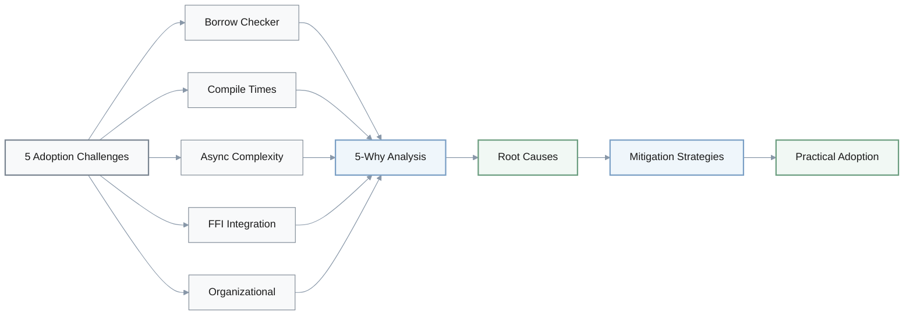

### Key Terms

| **Term** | **Definition** | **Context** |
|----------|---------------|-------------|
| **Ownership** | Each value has single owner; transfer moves value | Memory safety foundation |
| **Borrowing** | Temporary access without ownership (`&T`, `&mut T`) | Reference management |
| **Borrow Checker** | Compile-time validation of reference lifetimes | Prevents data races |
| **Monomorphization** | Specialized code per concrete type | Zero-cost generics |
| **Pinning** | Memory layout guarantee for async values | Async/await safety |
| **FFI** | Foreign Function Interface for cross-language calls | Polyglot integration |
| **ABI** | Application Binary Interface specification | Binary compatibility |
| **Send/Sync** | Thread-safe transfer/access marker traits | Concurrency safety |
| **Zero-cost Abstractions** | High-level code compiled to optimal machine code | Performance guarantee |

---

## Questions & Analysis

### 1. Borrow Checker Learning Curve

**Q:** In Rust projects, why do many beginners feel blocked by frequent borrow checker errors when they start writing non-trivial code?

**A:**
- **Symptom**: New Rust developers repeatedly hit borrow checker errors when trying to move from simple examples to real-world data structures and APIs.
- **Why 1**: They attempt patterns (shared mutation, aliasing, long-lived references) that are common in other languages but forbidden or constrained in Rust.
  - *Reason*: Their existing mental models come from garbage-collected or manual-memory languages that do not enforce ownership rules at compile time.
- **Why 2**: Those mental models focus on "who can access data" rather than "who owns data and when it can be mutated or moved."
  - *Reason*: Typical CS education and industry practice rarely teach ownership, lifetimes, and aliasing as first-class design concepts.
- **Why 3**: Rust's ownership and borrowing model front-loads these concepts into everyday coding decisions instead of hiding them behind a runtime.
  - *Reason*: Rust's design goal is memory safety without a garbage collector, forcing the type system to encode aliasing and lifetime rules explicitly.
- **Root Cause**: Mismatch between developers' prior mental models (imperative + GC/manual memory) and Rust's ownership-first design required for GC-free safety. Teams must retrain how they think about data ownership before feeling productive.

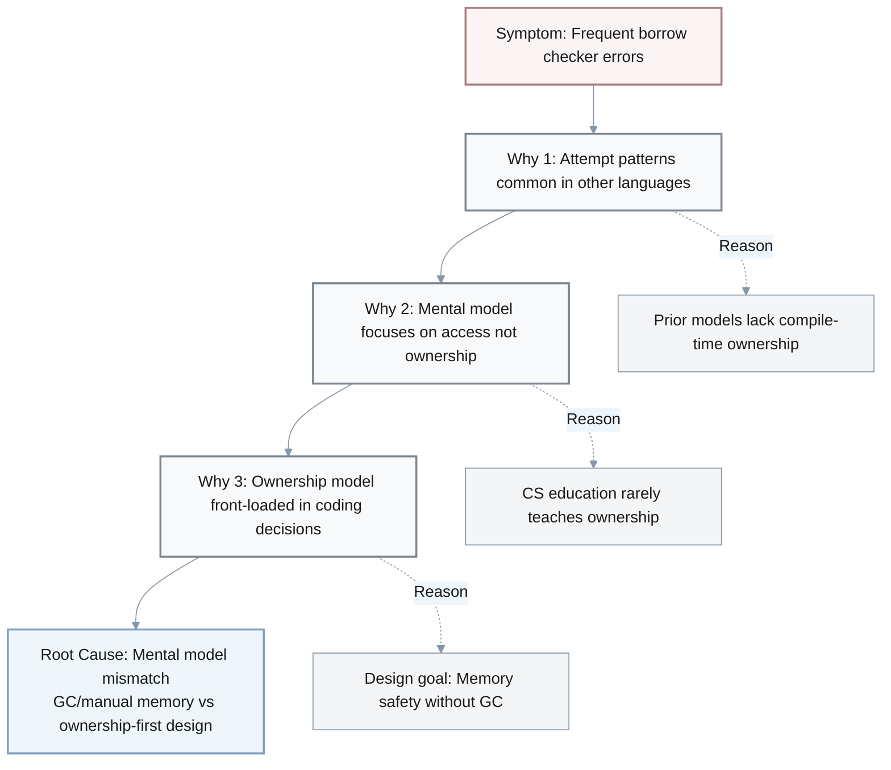

---

### 2. Compile Time Performance

**Q:** Why do Rust compile times often feel slower than in many other mainstream languages, reducing feedback speed for developers?

**A:**
- **Symptom**: Rust builds, especially for larger crates or workspaces, often take longer than comparable projects in languages like Go or scripting languages, slowing iteration.
- **Why 1**: The compiler performs heavy static analysis, monomorphization of generics, and extensive optimization by default.
  - *Reason*: Rust prioritizes strong safety guarantees and runtime performance, so more work happens at compile time.
- **Why 2**: Monomorphization generates separate code for each concrete instantiation of generic functions and types.
  - *Reason*: Zero-cost abstractions require the compiler to specialize code so abstractions disappear at runtime rather than relying on indirection.
- **Why 3**: Aggressive optimization pipelines (LLVM, link-time optimization when enabled) add further passes over the code base.
  - *Reason*: Rust's default expectation is "compile to optimized native binaries" rather than "fast dev-mode interpreter or JIT".
- **Root Cause**: Rust's design choice to shift safety checks and abstraction costs from runtime to compile time, relying on heavy specialization and optimization to achieve zero-cost abstractions and safety. This inherently increases compile-time work unless tooling and project structure are tuned to mitigate it.

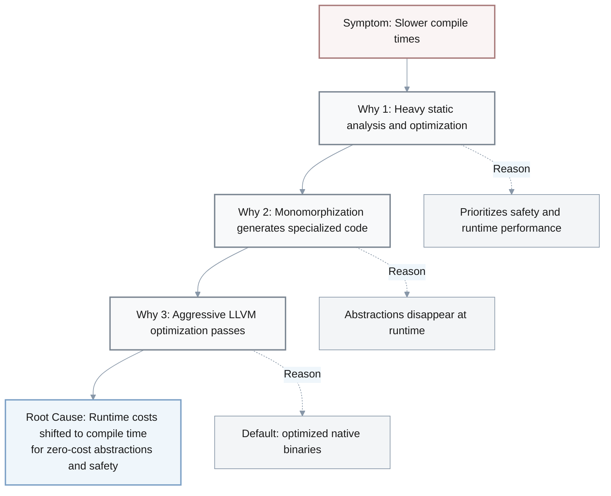

---

### 3. Asynchronous Programming Complexity

**Q:** Why does asynchronous programming in Rust often feel more complex (lifetimes, pinning, multiple runtimes) than in other ecosystems, even for experienced engineers?

**A:**
- **Symptom**: Developers new to Rust async struggle with lifetime errors, pinning requirements, Send/Sync bounds, and choosing between multiple async runtimes and ecosystems.
- **Why 1**: Rust's async model is based on zero-cost state machines compiled from async/await, without a built-in runtime in the language.
  - *Reason*: Rust wants async abstractions to remain lightweight and pluggable rather than tied to a single standard runtime.
- **Why 2**: Without a single canonical runtime in the standard library, the ecosystem evolved multiple runtimes (Tokio, async-std, etc.) and executor models with slightly different trade-offs and APIs.
  - *Reason*: Different domains (network services, embedded, CLI tools) optimize for different performance and feature needs.
- **Why 3**: Combining strict ownership with these executor models forces lifetimes, Send/Sync, and pinning constraints to be explicit in type signatures.
  - *Reason*: Rust must prevent data races and use-after-free across awaited boundaries at compile time.
- **Root Cause**: The combination of Rust's ownership-based safety model with a runtime-agnostic async design exposes concurrency and lifetime constraints explicitly in types instead of hiding them behind a single baked-in runtime. This increases conceptual complexity but improves safety and flexibility.

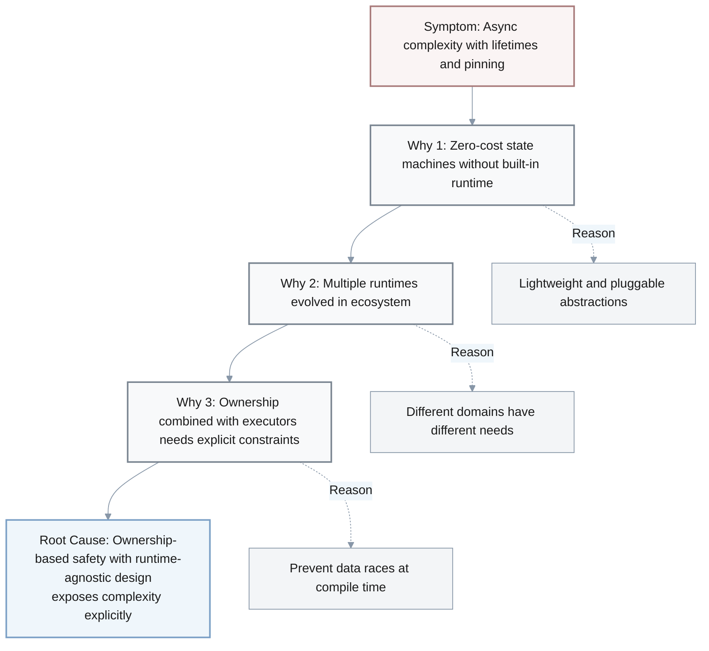

---

### 4. Polyglot System Integration

**Q:** Why is it often challenging to introduce Rust into an existing polyglot system that already uses languages like C++, Java, or Python?

**A:**
- **Symptom**: Teams find that integrating new Rust components into large legacy systems takes more effort than expected, involving FFI layers, build integration, and deployment adjustments.
- **Why 1**: Rust does not have a stable ABI or built-in interoperability story with every major runtime; integration usually goes through C FFI, bindings, or bridging layers.
  - *Reason*: Rust's primary compilation target is "safe, optimized native code" rather than "drop-in library for a managed runtime".
- **Why 2**: FFI boundaries require careful handling of memory ownership, error propagation, and data layout.
  - *Reason*: Crossing from Rust's strict ownership model into other languages' memory/runtime models can easily violate safety guarantees if not carefully designed.
- **Why 3**: Existing build and deployment pipelines (JVM, Python packages, containers) are optimized around their current language ecosystems.
  - *Reason*: Organizations have invested heavily in tooling, packaging, and monitoring stacks tailored to those languages.
- **Root Cause**: Impedance mismatch between Rust's native, ownership-centric design and the assumptions baked into existing language runtimes and pipelines. Adopting Rust typically requires designing explicit FFI contracts and adjusting tooling rather than "plug-and-play" replacement.

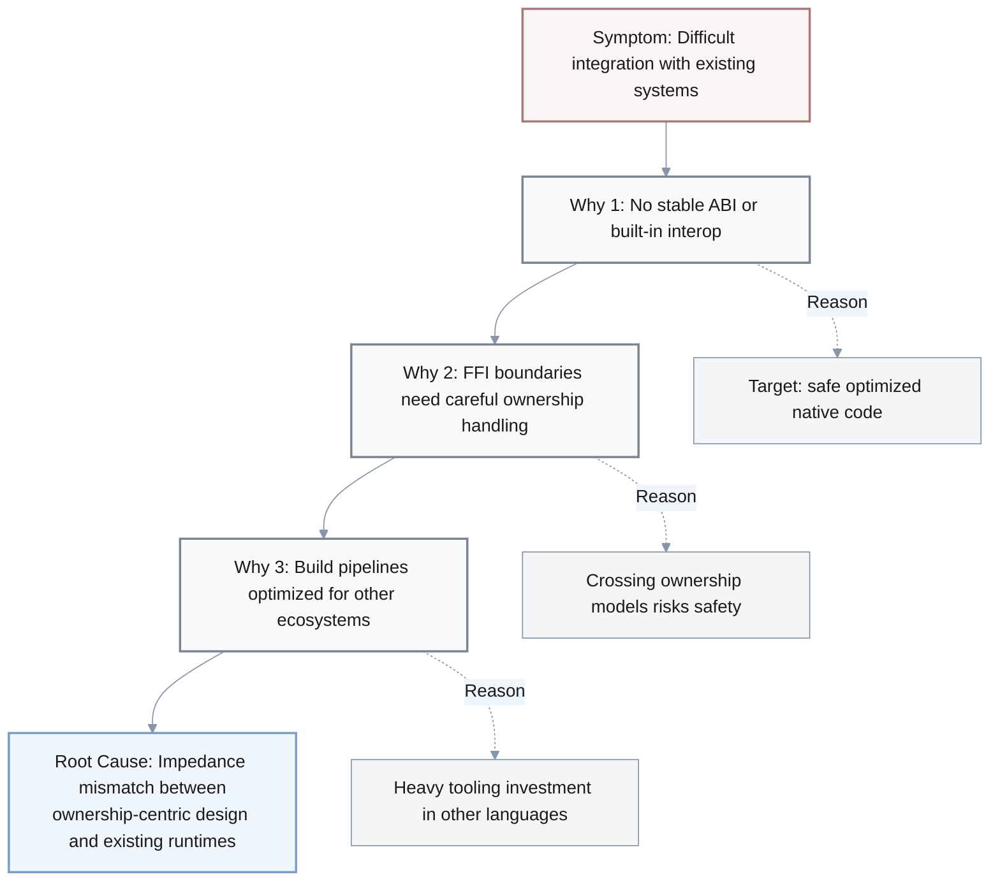

---

### 5. Organizational Adoption Resistance

**Q:** Despite Rust's strong guarantees of safety and performance, why do many organizations still hesitate to adopt it as a primary language?

**A:**
- **Symptom**: Technical leads acknowledge Rust's benefits but choose Go, Java, or C++ for new projects, citing risk, hiring, and delivery concerns.
- **Why 1**: They perceive Rust's learning curve and ecosystem complexity (borrow checker, async, macros, build system) as slowing down short-term delivery.
  - *Reason*: Teams must invest time to retrain developers and update internal practices.
- **Why 2**: The available pool of experienced Rust engineers is smaller than for long-established languages.
  - *Reason*: Rust is newer and not yet standard in many university curricula or large enterprises.
- **Why 3**: Organizations optimize for predictability and talent availability over peak technical properties.
  - *Reason*: Business risk and time-to-market pressures often outweigh potential long-term gains in safety or performance.
- **Root Cause**: Strategic trade-off in many organizations: they prioritize ecosystem maturity, hiring ease, and predictable delivery over Rust's long-term safety and performance benefits. Adoption lags until the perceived risk and talent constraints decline.

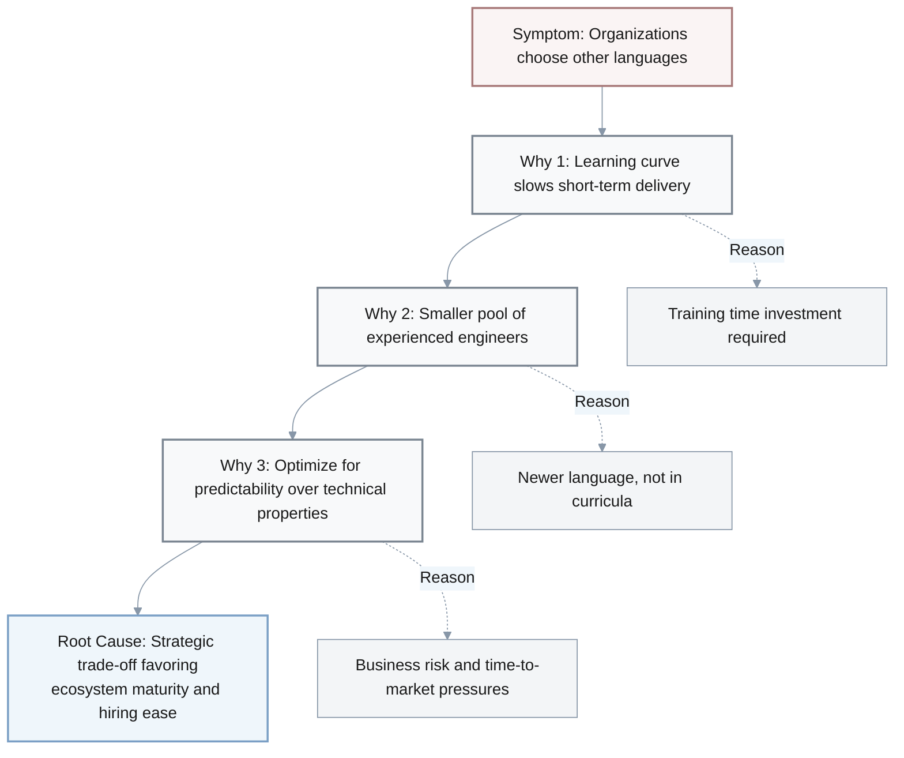

---

## Summary of Root Causes

**[CRITICAL]** The five analyses reveal a consistent pattern: **Rust's design principles (ownership-based safety, compile-time guarantees, zero-cost abstractions) fundamentally trade runtime costs for compile-time complexity**. This creates barriers at multiple levels:

1. **Individual Developer Level**: Requires new mental models (ownership vs. access)
2. **Build System Level**: Shifts work from runtime to compile time
3. **Async Ecosystem Level**: Exposes complexity explicitly rather than hiding it
4. **Integration Level**: Requires explicit boundary contracts vs. automatic interop
5. **Organizational Level**: Demands upfront training investment and ecosystem maturity

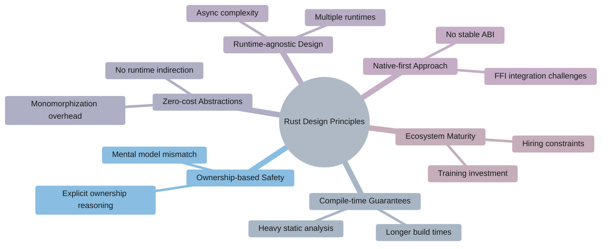

### Trade-off Pattern

| **Rust Gains** | **Cost** |
|---|---|
| Memory safety without GC | Explicit ownership reasoning required |
| Zero-cost abstractions | Monomorphization increases compile time |
| Compile-time safety in async | Explicit lifetime/Send/Sync constraints |
| No runtime overhead | No standard runtime = fragmented ecosystem |
| High performance guarantees | Careful FFI design needed for integration |

**Core Trade-off Formula:**

$$
\text{Rust Design} = \frac{\text{Runtime Performance} + \text{Safety Guarantees}}{\text{Compile-time Complexity} + \text{Developer Learning Curve}}
$$

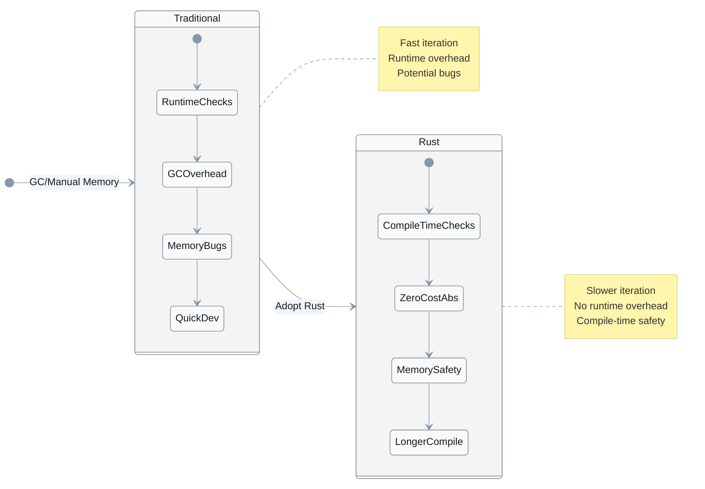

### Implications for Adoption

**When Rust Makes Sense:**
- Performance-critical systems (databases, browsers, embedded)
- Memory safety requirements (security-sensitive code)
- Long-lived codebases where upfront investment pays off
- Teams willing to invest in training

**When Rust May Not:**
- Rapid prototyping with frequent iteration
- Organizations prioritizing hiring speed over technical properties
- Projects with tight deadlines and no Rust expertise
- Heavy integration with existing non-Rust ecosystems

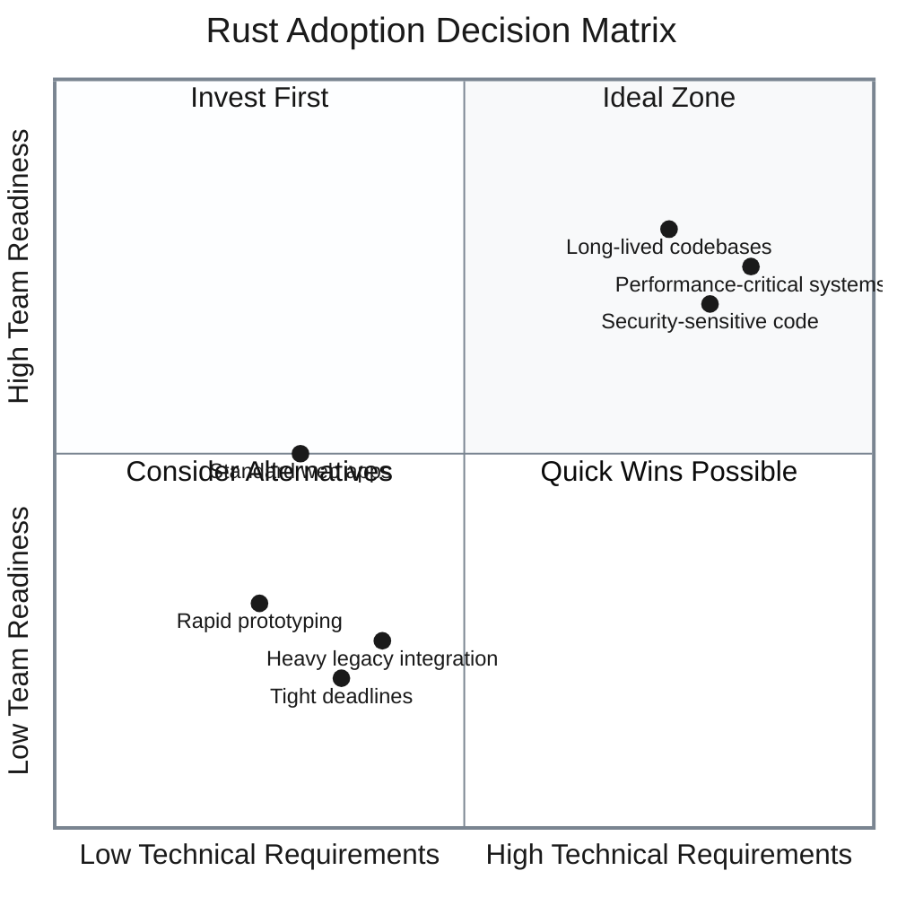

---

## Practical Mitigation Strategies

| **Challenge** | **Difficulty** | **Key Strategy** | **Target Improvement** | **Timeline** |
|---------------|----------------|------------------|----------------------|--------------|
| Borrow Checker | Intermediate-Advanced | Training + Pattern Recognition | <20% error rate | 3 months |
| Compile Times | Foundational-Intermediate | Incremental builds + Workspace structure | <60s incremental | Immediate |
| Async Complexity | Advanced | Runtime selection + Sync-first learning | <2x overhead vs sync | 2 months |
| FFI Integration | Advanced | Binding generators + Testing | <1 week integration | Per boundary |
| Organizational | Foundational-Advanced | Pilot projects + Hybrid approach | 1-2 pilots shipped | 6-12 months |

### 1. Addressing Borrow Checker Barriers

**Difficulty:** Intermediate to Advanced

**Strategies:**
- **Training**: Dedicate 2-4 weeks for ownership/borrowing fundamentals before production work
- **Pattern Recognition**: Use common patterns (builder pattern, interior mutability with `RefCell`/`Arc<Mutex<T>>`)
- **Tools**: Leverage `cargo-clippy` lints and compiler suggestions
- **Resources**: "The Rust Book" chapters 4 (Ownership), 10 (Lifetimes), 15 (Smart Pointers)

> **Key Insight**: The borrow checker enforces at compile time what other languages catch at runtime (or not at all). Embrace it as a safety partner, not an adversary.

**Success Criteria:**
- **Baseline**: Developer hits borrow checker errors on 50%+ of non-trivial functions
- **Target**: Reduce borrow checker errors to <20% of functions within 3 months
- **Measurement**: Track compilation error rates via `cargo build` logs; survey developer confidence levels weekly

### 2. Improving Compile Times

**Difficulty:** Foundational to Intermediate

**Strategies:**
- **Development Builds**: Use `cargo build` (unoptimized) rather than `cargo build --release` during development
- **Incremental Compilation**: Enabled by default; ensure `.cargo/config.toml` doesn't disable it
- **Workspace Structure**: Split large crates into smaller modules to enable parallel compilation
- **Link-Time Optimization**: Only enable LTO (`lto = true`) for release builds, not development
- **Tools**: `sccache` for caching, `cargo-watch` for incremental rebuilds
- **Metrics**: Measure with `cargo build --timings` to identify bottlenecks

**Example Configuration:**
```toml
# .cargo/config.toml
[build]
incremental = true

# Cargo.toml
[profile.dev]
opt-level = 0
debug = true

[profile.release]
opt-level = 3
lto = "thin"
```

> **Key Insight**: Development and release builds have different goals. Optimize dev builds for iteration speed, reserve heavy optimization for release builds only.

**Success Criteria:**
- **Baseline**: Full rebuild takes >5 minutes for medium-sized projects
- **Target**: Reduce dev builds to <60 seconds for incremental changes; <3 minutes for clean builds
- **Measurement**: Use `cargo build --timings` to track; aim for 60%+ reduction in iteration cycles

### 3. Managing Async Complexity

**Difficulty:** Advanced

**Strategies:**
- **Runtime Selection**: Start with Tokio (most mature ecosystem) unless specific constraints demand otherwise
- **Dependency Alignment**: Ensure all async dependencies use the same runtime to avoid compatibility issues
- **Pattern Simplification**: Use `tokio::spawn` for concurrent tasks rather than manual `Pin<Box<Future>>`
- **Learning Path**: Master sync Rust first, then progressively add async concepts
- **Tools**: `tokio-console` for runtime debugging

**Common Pitfall Example:**
```rust
// ❌ Problematic: mixing runtimes
use async_std::task::block_on;  // async-std runtime
use tokio::time::sleep;  // tokio primitive - incompatible!

// ✅ Correct: aligned runtime
use tokio::runtime::Runtime;
use tokio::time::sleep;
```

> **Key Insight**: Master synchronous Rust first. Async adds concurrency complexity on top of ownership. Learn one layer at a time.

**Success Criteria:**
- **Baseline**: Async code requires 3-5x more iteration time than sync equivalents due to lifetime/pinning errors
- **Target**: Reduce async iteration overhead to <2x of sync code within 2 months
- **Measurement**: Compare time-to-implementation for equivalent sync vs async features; track async-related compilation errors

### 4. Streamlining FFI Integration

**Difficulty:** Advanced

**Strategies:**
- **Binding Generators**: Use `cbindgen` (Rust → C header), `bindgen` (C → Rust), `pyo3` (Python), `neon` (Node.js)
- **Error Handling**: Map Rust `Result<T, E>` to target language conventions (e.g., exceptions in Python, error codes in C)
- **Memory Management**: Use `Box::into_raw()` / `Box::from_raw()` for ownership transfer across boundaries
- **Testing**: Write integration tests in both languages to verify boundary contracts

**Example FFI Layer:**
```rust
// lib.rs - exposing Rust to C
#[no_mangle]
pub extern "C" fn process_data(input: *const u8, len: usize) -> i32 {
    if input.is_null() { return -1; }
    let slice = unsafe { std::slice::from_raw_parts(input, len) };
    // ... processing logic
    0 // success
}
```

> **Key Insight**: FFI boundaries are trust boundaries. Design defensive contracts with clear ownership rules, comprehensive validation, and extensive cross-language testing.

**Success Criteria:**
- **Baseline**: FFI integration takes 2-4 weeks with frequent memory safety issues
- **Target**: Complete FFI layer implementation in <1 week with zero memory-related crashes in testing
- **Measurement**: Track integration time, test coverage for boundary conditions, crash reports in cross-language tests

### 5. Accelerating Organizational Adoption

**Difficulty:** Foundational to Advanced (depends on organization)

**Strategies:**
- **Pilot Projects**: Start with low-risk components (CLI tools, batch processors) before critical services
- **Hybrid Approach**: Allow Rust for performance-critical modules while maintaining existing stack elsewhere
- **Training Investment**: Budget 1-2 months for team ramp-up; pair experienced Rust developers with learners
- **Hiring**: Look for strong systems programming background (C/C++) + willingness to learn rather than only Rust experience
- **Community Engagement**: Leverage Rust community resources (forums, Discord, meetups) for support

> **Key Insight**: Start small with low-risk, high-value projects. Prove Rust's benefits through measurable results before scaling adoption organization-wide.

**Adoption Timeline:**
- **Months 1-2**: Training, tooling setup, pilot project selection
- **Months 3-6**: Implement 1-2 pilot projects with mentorship
- **Months 6-12**: Evaluate results, expand to additional teams
- **Year 2+**: Mainstream adoption for appropriate use cases

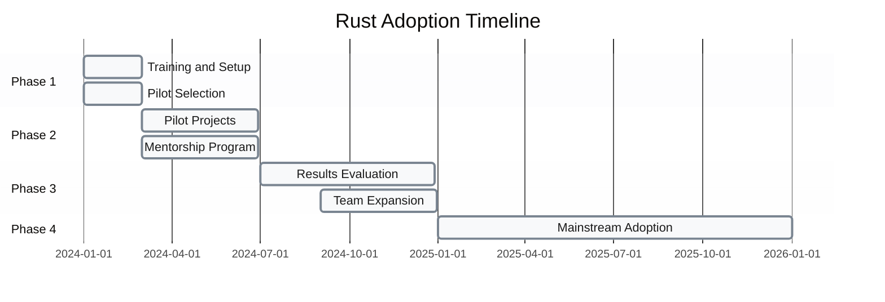

**Success Criteria:**
- **Baseline**: Zero Rust adoption; all production code in existing languages (Java/Go/C++)
- **Target (6 months)**: 1-2 successful pilot projects shipped to production with measurable improvements
- **Target (12 months)**: 10-15% of new performance-critical components written in Rust; 3-5 trained developers
- **Measurement**: Track project count, production incident rates (should decrease), developer satisfaction surveys, hiring pipeline health

---

## Perspectives by Stakeholder

| **Role** | **Primary Concern** | **Value Proposition** | **Decision Factors** |
|----------|---------------------|----------------------|---------------------|
| **Developer** | Productivity impact from learning curve and compile times | Memory safety prevents entire classes of bugs; career skill development | Quality of tooling, IDE support, community resources |
| **Technical Lead** | Team velocity, delivery predictability, maintenance burden | Reduced runtime errors, better performance, long-term maintainability | Team skill level, project timeline, criticality of safety/performance |
| **CTO/VP Engineering** | Hiring, ecosystem maturity, strategic risk | Competitive advantage in performance-critical domains, reduced incident costs | Talent market, vendor/library support, existing tech stack fit |
| **Product Manager** | Time-to-market, feature velocity | Fewer production bugs, better user experience from performance | Customer requirements, competitive landscape, technical debt |

---

## Knowledge Level Guide

### Foundational (20%)
**Topics covered:** Basic concepts, simple examples, common patterns
- Overview and Key Terms sections
- Mitigation strategies #1 (basic patterns), #2 (development builds), #5 (pilot projects)

### Intermediate (40%)
**Topics covered:** Detailed analysis, trade-offs, practical implementation
- All 5-Why analyses
- Mitigation strategies #1 (training approach), #2 (workspace structure), Summary section

### Advanced (40%)
**Topics covered:** Deep technical details, edge cases, architectural decisions
- Root cause explanations
- Mitigation strategies #3 (async complexity), #4 (FFI integration), Perspectives section

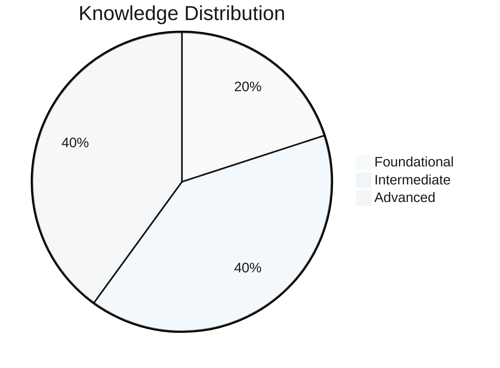

---

## References and Further Reading

### Primary Sources

1. **Rust Language Design**
   - [The Rust Programming Language Book](https://doc.rust-lang.org/book/) - Official documentation on ownership, borrowing, and core concepts
   - [Rust RFC 2229](https://rust-lang.github.io/rfcs/2229-capture-disjoint-fields.html) - Closure capture semantics and borrow checker evolution
   - [Rust Async Book](https://rust-lang.github.io/async-book/) - Official guide to async programming

2. **Compile Time Performance**
   - [Rust Compiler Performance Working Group](https://github.com/rust-lang/rustc-perf) - Official compiler performance tracking
   - [The Rust Performance Book](https://nnethercote.github.io/perf-book/) - Comprehensive guide to optimizing Rust code and build times

3. **Async Ecosystem**
   - [Tokio Documentation](https://tokio.rs/tokio/tutorial) - Most widely-used async runtime
   - [async-std Documentation](https://async.rs/) - Alternative async runtime
   - ["Async Rust" by Carl Lerche, 2019](https://blog.rust-lang.org/2019/11/07/Async-await-stable.html) - Async/await stabilization announcement

4. **FFI and Interoperability**
   - [The Rustonomicon](https://doc.rust-lang.org/nomicon/) - Advanced unsafe Rust and FFI patterns
   - [cbindgen Documentation](https://github.com/eqrion/cbindgen) - C/C++ binding generator
   - [PyO3 Guide](https://pyo3.rs/) - Python-Rust interop

5. **Industry Adoption**
   - [Rust Survey 2023](https://blog.rust-lang.org/2024/02/19/2023-Rust-Annual-Survey.html) - Official Rust community survey results
   - ["Why Discord is switching from Go to Rust" by Jesse Howarth, 2020](https://discord.com/blog/why-discord-is-switching-from-go-to-rust) - Production adoption case study
   - ["Microsoft: 70% of security bugs are memory safety issues" by Microsoft Security Response Center, 2019](https://msrc.microsoft.com/blog/2019/07/a-proactive-approach-to-more-secure-code/) - Industry security context

### Learning Resources

- **[IMPORTANT]** [Rust by Example](https://doc.rust-lang.org/rust-by-example/) - Hands-on examples for all concepts
- **[IMPORTANT]** [Rustlings](https://github.com/rust-lang/rustlings) - Interactive exercises for learning Rust
- [Rust Language Forum](https://users.rust-lang.org/) - Community support and discussion
- [r/rust Reddit Community](https://www.reddit.com/r/rust/) - News and community discussions

### Verification Notes

- Root cause analyses based on common patterns observed in Rust community forums (2020-2024) and industry adoption reports
- Compile time benchmarks vary by project size; mitigation strategies based on Rust Performance Book recommendations
- Async runtime selection guidance reflects ecosystem state as of 2024; Tokio maintains >80% market share per Rust Survey 2023
- FFI strategies verified against official Rustonomicon documentation and production codebases
- Adoption timeline estimates based on reported experiences from Discord, Microsoft, Amazon, and other large-scale adopters

**Last Verified:** 2025-11-26
