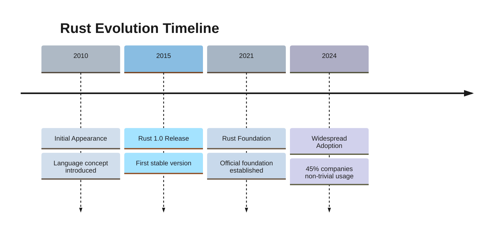
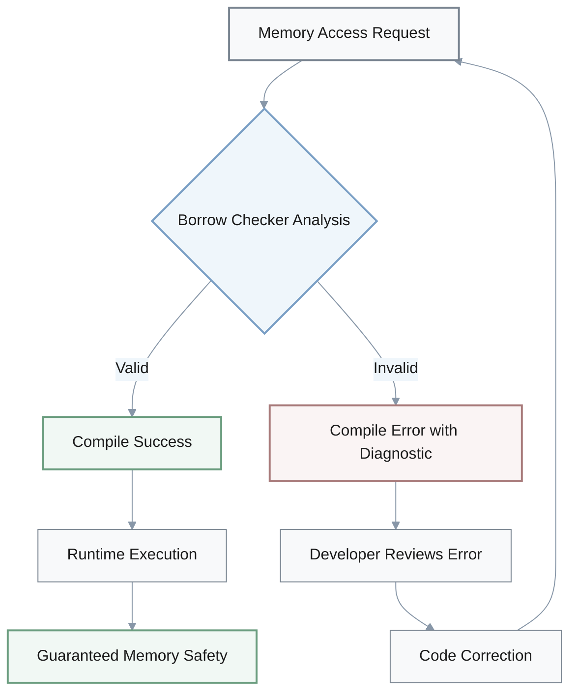
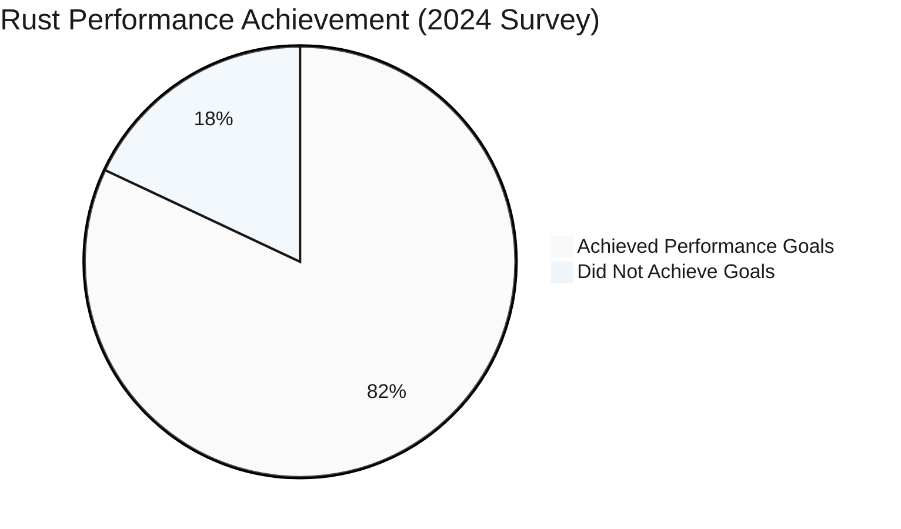
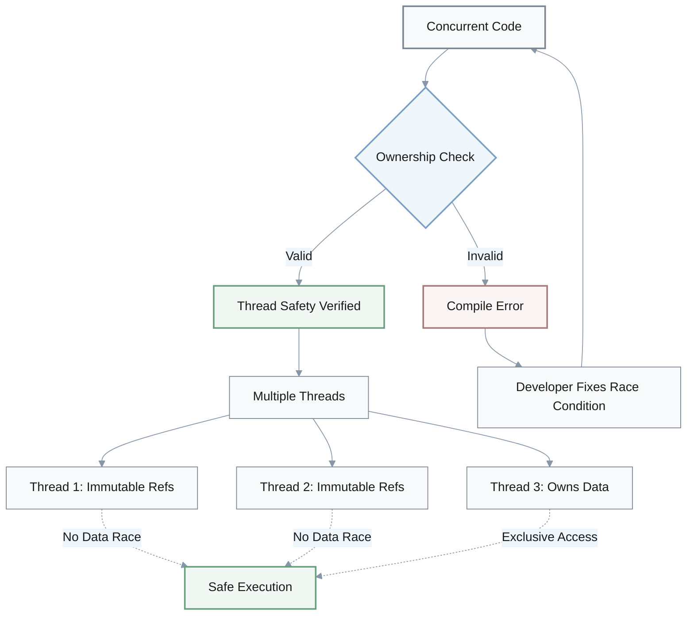
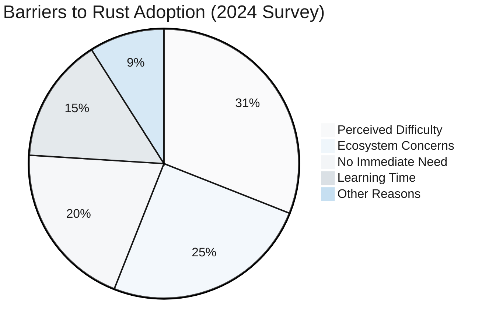
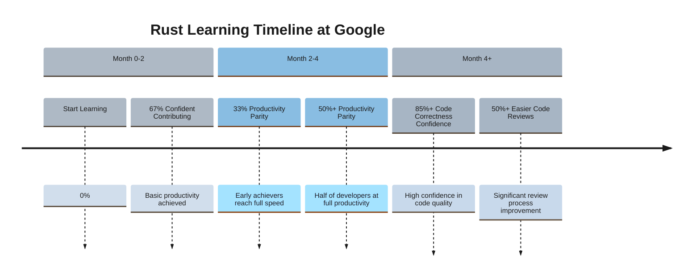
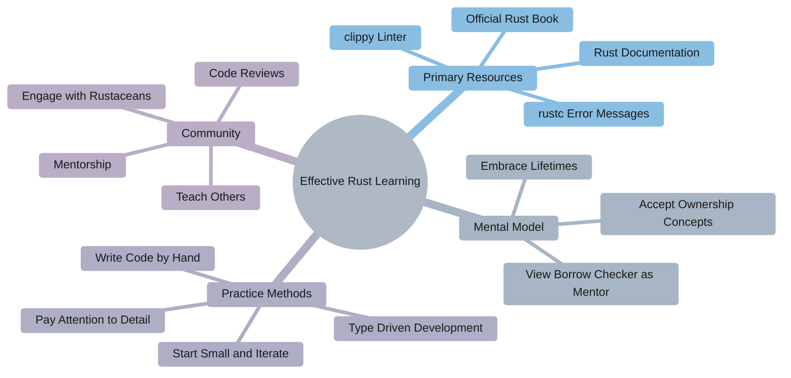
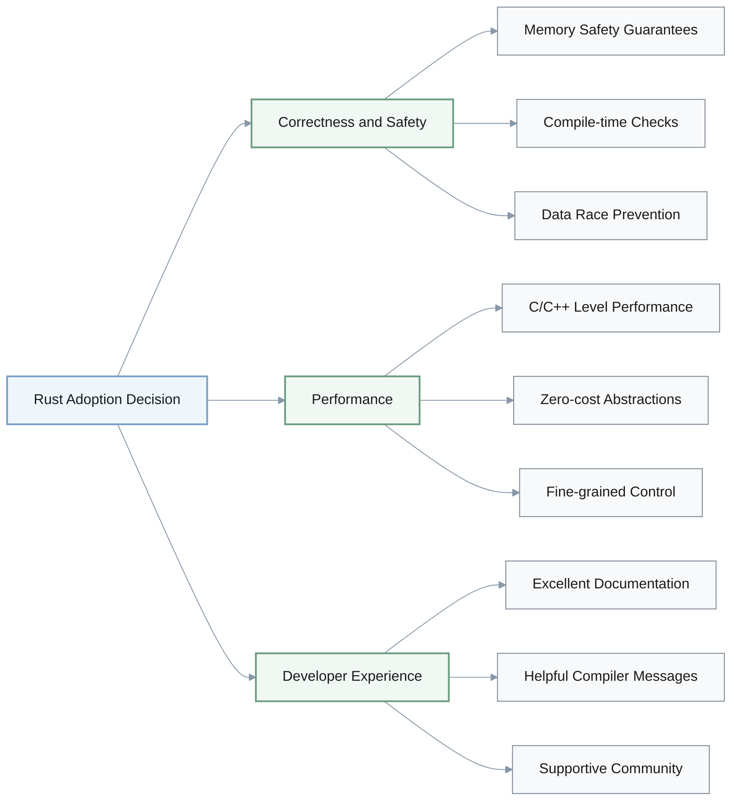
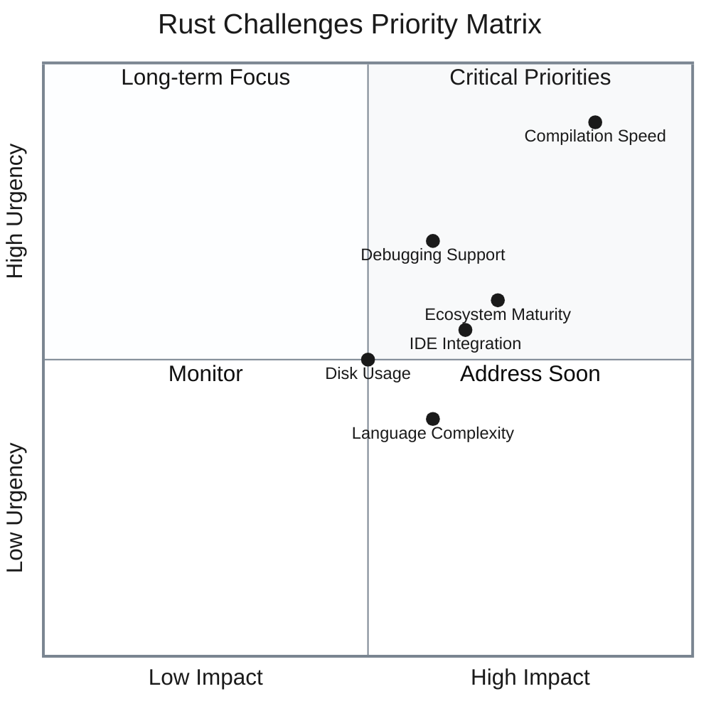
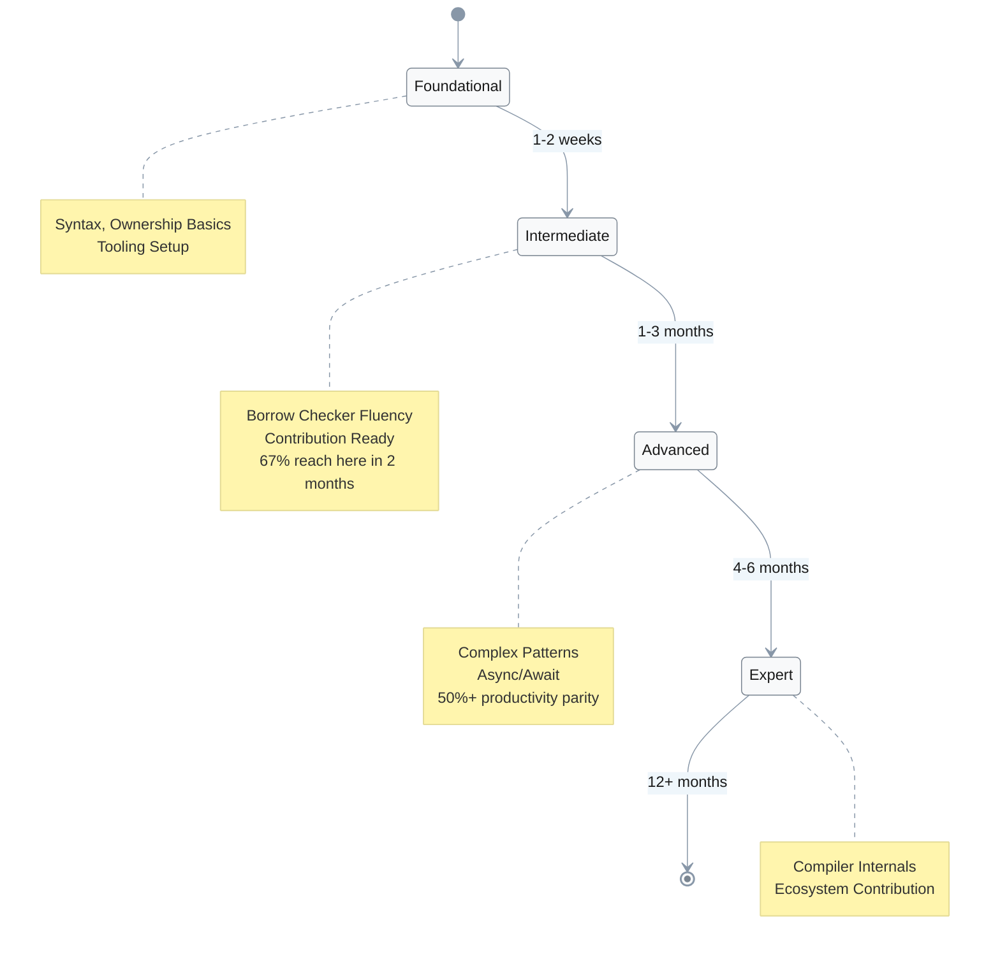

# The Rust Programming Language: A Comprehensive Analysis of Its Strengths, Challenges, and Trajectory

## Table of Contents
- [Overview](#overview)
- [Context](#context)
- [Rust's Foundational Principles: Safety, Performance, and Concurrency](#rusts-foundational-principles-safety-performance-and-concurrency)
  - [Memory Safety and the Borrow Checker](#memory-safety-and-the-borrow-checker)
  - [Performance Characteristics and Comparison with C](#performance-characteristics-and-comparison-with-c)
  - [Concurrency Model](#concurrency-model)
- [The Rust Learning Experience](#the-rust-learning-experience)
  - [The Steep Learning Curve: Causes and Challenges](#the-steep-learning-curve-causes-and-challenges)
  - [Debunking Learning Time Myths: Google's Findings](#debunking-learning-time-myths-googles-findings)
  - [Effective Learning Strategies](#effective-learning-strategies)
  - [Role of Compiler Diagnostics and Tooling](#role-of-compiler-diagnostics-and-tooling)
- [Adoption and Productivity in Practice](#adoption-and-productivity-in-practice)
  - [Growing Professional Usage](#growing-professional-usage)
  - [Developer Productivity: Balancing Initial Ramp-up with Long-term Gains](#developer-productivity-balancing-initial-ramp-up-with-long-term-gains)
  - [Key Drivers for Adoption: Correctness, Performance, and Safety](#key-drivers-for-adoption-correctness-performance-and-safety)
- [Challenges and Future Outlook](#challenges-and-future-outlook)
  - [Compilation Speed: A Perennial Concern](#compilation-speed-a-perennial-concern)
  - [Ecosystem Maturity and Tooling Gaps](#ecosystem-maturity-and-tooling-gaps)
  - [Complexity Concerns](#complexity-concerns)
  - [Future Developments and Community Priorities](#future-developments-and-community-priorities)
- [Language Comparison](#language-comparison)
- [Learning Success Criteria](#learning-success-criteria)
- [Conclusion](#conclusion)
- [Sources](#sources)

## Overview

Rust has emerged as a significant programming language, designed with a focus on providing both efficiency and enhanced security for concurrent applications. It incorporates features from procedural, object-oriented, and functional programming paradigms, aiming to rival C in performance while improving code security and developer productivity through compile-time memory safety guarantees. Initially appearing in 2010, Rust has gained traction with 45% of companies reporting non-trivial usage (2024 State of Rust Survey), particularly in areas demanding high performance and reliability such as High-Performance Computing (HPC), server backends, and embedded systems. Its unique approach to memory safety without a garbage collector—primarily through its ownership and borrowing system—distinguishes it from many contemporaries.



**Key Characteristics:**
- **Memory Safety**: Ownership system without garbage collector
- **Performance**: C-level efficiency with zero-cost abstractions
- **Concurrency**: Compile-time prevention of data races
- **Paradigm**: Procedural, object-oriented, and functional features

## Context

**Purpose**: This document provides a comprehensive analysis of Rust as a programming language for developers and technical decision-makers evaluating Rust for adoption or seeking to understand its capabilities, challenges, and trajectory.

**Target Audience**:
- **Primary**: Software developers with experience in systems programming (C/C++) or high-level languages (Python, Java, JavaScript) considering learning Rust
- **Secondary**: Technical leads and engineering managers evaluating Rust for team adoption
- **Tertiary**: Computer science students and researchers interested in programming language design

**Scope**:
- **Included**: Language fundamentals (memory safety, performance, concurrency), learning experience, adoption patterns, productivity metrics, challenges, and future outlook
- **Excluded**: Detailed syntax tutorials, specific framework comparisons, deployment strategies, or domain-specific implementation guides

**Key Assumptions**:
- Readers have basic programming knowledge and understand concepts like memory management, compilation, and concurrency
- Analysis focuses on Rust as of 2024-2025, with data primarily from 2022-2024 surveys and studies
- Performance comparisons primarily reference C as the baseline systems language

**Timeline Context**: Analysis covers Rust from its initial appearance (2010) through current adoption trends (2024), with emphasis on recent developments and future roadmap.

## Rust's Foundational Principles: Safety, Performance, and Concurrency

**Priority: CRITICAL** — Understanding these core principles is essential for evaluating whether Rust fits your use case.

Rust's core design philosophy revolves around delivering performance comparable to systems languages like C, coupled with strong memory safety guarantees at compile time. This combination is crucial for developing robust and efficient software, particularly in critical infrastructure and low-level programming domains.

### Memory Safety and the Borrow Checker
**Priority: CRITICAL**

Rust's most distinctive feature is its ownership system, enforced by the _borrow checker_ at compile time. This system mandates strict rules regarding memory access and resource management, thereby preventing common programming errors such as null pointer dereferences, data races, and buffer overflows without the overhead of a runtime garbage collector. The borrow checker ensures that there is either one mutable reference (writer) or any number of immutable references (readers) to a piece of data, but never both simultaneously.



**Borrow Checker Rules:**
- **Ownership**: Each value has exactly one owner
- **Single Mutable Reference**: OR one mutable reference (writer)
- **Multiple Immutable References**: OR many immutable references (readers)
- **Never Both**: Cannot have mutable and immutable references simultaneously

Learning to work with the borrow checker and understanding concepts like *lifetimes* and *ownership* represents a fundamental mental model shift for developers accustomed to garbage-collected languages. For instance, attempting to mutate a variable while an immutable reference to it is still in scope will result in a compile-time error, compelling developers to structure their code to prevent potential runtime issues. While initially frustrating, this rigorous enforcement forces a deeper understanding of how data is accessed and managed, leading to more robust and correct code. The compiler's diagnostic messages are notably helpful, often guiding the developer to understand the issue and propose solutions.

### Performance Characteristics and Comparison with C
**Priority: CRITICAL**

A primary goal for Rust was to match C in terms of efficiency, and studies often confirm its strong performance. In High-Performance Computing (HPC) scenarios, such as the N-Body simulation, Rust has demonstrated performance levels comparable to C while reducing programming effort by 30-40% compared to C. This indicates its viability as an alternative for demanding computational tasks. The language provides primitives and functions for direct memory manipulation and interaction with underlying hardware, similar to C, enabling fine-grained control necessary for optimal performance.

**Performance Metrics:**

| Metric | Value | Context |
|--------|-------|---------|
| **Performance Goal Achievement** | 82% | Users report meeting company performance goals |
| **Programming Effort Reduction** | 30-40% | Compared to C in HPC scenarios |
| **Performance Gap in Edge Cases** | 10-30% lower | Specific compiler optimization scenarios |
| **Non-trivial Professional Usage** | 45% | Organizations using Rust (2024 Survey) |



However, some studies indicate that Rust's performance can be 10-30% lower in specific edge cases (particularly with certain compiler optimization settings), although optimization techniques exist to mitigate these issues. Despite these isolated instances, a large percentage of Rust users (82%) report that Rust helped their companies achieve performance goals, and 45% of respondents in the 2024 State of Rust Survey stated their organization makes non-trivial use of Rust. These figures suggest that its performance characteristics are a key driver for its adoption in professional environments.

### Concurrency Model
**Priority: IMPORTANT**

Rust's ownership and borrowing rules extend to its concurrency model, enabling developers to write highly concurrent code without fear of data races. The compiler's rigorous checks prevent common concurrency bugs at compile time, a task often left to runtime detection or careful manual reasoning in other languages. This compile-time certainty means that once Rust code compiles, it is guaranteed to be free of certain classes of concurrency-related memory errors, making it a powerful tool for developing reliable multi-threaded applications. While ensuring safety, some developers might perceive Rust's concurrency model as potentially less performant in specific scenarios where more relaxed memory management is used, as Rust's strict rules can introduce additional runtime checks and synchronization overhead.



**Concurrency Guarantees:**
- **Compile-time Data Race Prevention**: No data races possible in safe Rust
- **Thread Safety**: Send and Sync traits enforce thread-safe boundaries
- **Zero-cost Concurrency**: Safety without runtime overhead
- **Fearless Concurrency**: Write concurrent code with confidence

## The Rust Learning Experience

**Priority: CRITICAL** — The learning curve is the primary barrier to adoption; understanding it helps set realistic expectations.

Rust is renowned for having a steep learning curve, a sentiment echoed by many developers, particularly concerning the ownership system and borrow checker. This initial difficulty often arises because Rust requires a fundamental shift in programming mindset, introducing concepts like lifetimes and explicit mutability that are less prominent in garbage-collected languages.

### The Steep Learning Curve: Causes and Challenges
**Priority: CRITICAL**

The primary challenge in learning Rust stems from its strict memory safety guarantees enforced at compile time. Concepts such as ownership, borrowing, and lifetimes demand a deep understanding of basic computing principles related to memory allocation and concurrency. Programmers accustomed to fully-managed languages like Python or JavaScript often find this transition difficult because these low-level concerns are usually abstracted away. The borrow checker, while ultimately beneficial, often feels like an adversary to newcomers, presenting frequent compile-time errors that require careful reasoning rather than guesswork.



**Key Learning Challenges:**
- **Ownership System**: New mental model unfamiliar to most developers
- **Borrow Checker**: Strict compile-time enforcement feels adversarial initially
- **Lifetimes**: Complex annotations for reference validity
- **Low-level Concepts**: Memory allocation details abstracted in managed languages

The 2024 State of Rust Survey found that approximately 31% of non-users cited the perception of difficulty as their primary reason for not trying Rust. Furthermore, some former Rust users reported being overwhelmed by the language or its ecosystem. This indicates that while Rust offers significant advantages, its initial complexity remains a barrier to broader adoption.

### Debunking Learning Time Myths: Google's Findings
**Priority: CRITICAL**

Despite the perception of difficulty, empirical evidence suggests that developers can become productive in Rust relatively quickly. A 2022 study by Google involving over 1,000 developers found that more than two-thirds of respondents felt confident contributing to a Rust codebase within two months or less. Moreover, a third of respondents achieved productivity levels comparable to other languages within the same timeframe, with over 50% reaching this level within four months. These ramp-up numbers align with the time required to adopt other languages at Google, suggesting that Rust does not inherently impose a greater productivity penalty. This highlights that while the learning curve is steep, it is often shorter than perceived, especially for experienced software developers willing to adapt their approach.

**Google Study Findings (1,000+ developers, 2022):**



**Key Productivity Milestones:**
- **≤2 months**: 67% confident contributing to Rust codebases
- **≤2 months**: 33% achieve productivity parity with other languages
- **≤4 months**: 50%+ achieve productivity parity with other languages
- **Post ramp-up**: 85%+ confidence in code correctness
- **Post ramp-up**: 50%+ find code reviews significantly easier

### Effective Learning Strategies
**Priority: IMPORTANT**

To mitigate the challenges of the learning curve, several strategies have proven effective. The official Rust documentation and "The Rust Programming Language" book are consistently cited as primary learning resources. Learning by doing, focusing on `rustc` error messages, and utilizing the `clippy` linter are also highly effective methods, as Rust's diagnostics are of high quality.



**Recommended Approaches:**

- **Accepting the New Mental Model**: Embrace the concepts of ownership, borrowing, and lifetimes, viewing the borrow checker as a "mentor" rather than an adversary.
- **Starting Small and Iterative**: Write small code snippets to understand concepts, and don't be afraid to discard code.
- **Paying Attention to Detail**: Rust's strictness rewards meticulousness; rereading code for typos and understanding subtle details is crucial.
- **Avoiding Auto-Pilot**: While LLMs can assist, actively writing code by hand without excessive auto-completion builds crucial muscle memory and intuition.
- **Type-Driven Development**: Leveraging Rust's powerful type system to model problems and letting compiler errors guide design can lead to more correct and concise code.
- **Seeking Community and Mentorship**: Engaging with other Rustaceans, participating in code reviews, and explaining concepts to non-Rust developers can solidify understanding.

### Role of Compiler Diagnostics and Tooling
**Priority: IMPORTANT**

Rust's compiler is widely recognized for its exceptional error messages. These messages often provide not just error locations but also explanations and suggestions for fixes, acting as an invaluable learning tool. This is particularly helpful when dealing with complex borrow checker errors or lifetime issues, where the compiler can guide the developer through the problem. The quality of these diagnostics is so high that many developers learn by actively engaging with `rustc` error messages and `clippy` lints.

Despite the strong compiler, there are still areas for tooling improvement. Challenges include subpar debugging support and high disk usage by compiler artifacts. Some users also express a desire for better IDE integration and improved interoperability with other languages. However, ongoing community and company efforts are dedicated to enhancing `rustc` performance and improving the overall tooling ecosystem.

## Adoption and Productivity in Practice

**Priority: IMPORTANT** — Real-world adoption data provides evidence for decision-making.

Rust's adoption rate is steadily increasing, particularly in professional settings, driven by its promises of safety, performance, and developer satisfaction.

### Growing Professional Usage
**Priority: IMPORTANT**

The 2024 State of Rust Survey reveals a clear upward trend in professional Rust usage. A notable 38% of respondents reported using Rust for the majority of their coding on a daily or nearly daily basis, an increase of 4 percentage points from the previous year. Furthermore, 45% of companies reported making non-trivial use of Rust, a 7 percentage point increase from 2023. These statistics underscore Rust's growing foothold in various industries.

**Adoption Trends (2024 vs 2023):**

```mermaid
%%{init: {
  "theme": "base",
  "themeVariables": {
    "primaryColor": "#f8f9fa",
    "primaryTextColor": "#1a1a1a",
    "primaryBorderColor": "#7a8591",
    "lineColor": "#8897a8",
    "secondaryColor": "#eff6fb",
    "tertiaryColor": "#f3f5f7"
  }
}}%%
xyChart-beta
    title "Rust Adoption Growth (2023-2024)"
    x-axis [2023, 2024]
    y-axis "Percentage" 0 --> 50
    line [34, 38]
    line [38, 45]
```

| Metric | 2023 | 2024 | Growth |
|--------|------|------|--------|
| **Daily/Nearly Daily Usage** | 34% | 38% | +4% |
| **Non-trivial Company Usage** | 38% | 45% | +7% |

**Primary Use Cases:**
- **Server Backends**: Web and networking services
- **Cloud Technologies**: Infrastructure and distributed systems
- **Embedded Systems**: Low-level control with memory safety
- **High-Performance Computing**: Computational-intensive applications

Rust is particularly popular for developing server backends, web and networking services, and cloud technologies. It is also gaining increasing traction in embedded systems, a domain where its low-level control and memory safety are highly advantageous. The primary reasons cited by employers for investing in Rust include its ability to build relatively correct and bug-free software, followed by its strong performance characteristics.

### Developer Productivity: Balancing Initial Ramp-up with Long-term Gains
**Priority: CRITICAL**

While Rust's initial learning curve can be steep (67% productive within 2 months per Google study), the long-term benefits in terms of productivity and code quality are measurable: 85%+ developers report higher code correctness confidence, and 50%+ find code reviews significantly easier. Once developers overcome the initial learning phase, the compiler's strictness transforms from an impediment into a powerful assistant, preventing entire classes of bugs at compile time that would otherwise manifest as difficult-to-diagnose runtime errors. This upfront investment in rigorous code development often translates into faster debugging cycles and higher confidence in deployed software. Google's findings indicate no productivity penalty for Rust compared to other languages once developers ramp up. Furthermore, over 85% of developers at Google expressed confidence that their Rust code was more correct than code written in other languages, and more than half found Rust code incredibly easy to review, which significantly contributes to overall team productivity and code velocity.

### Key Drivers for Adoption: Correctness, Performance, and Safety
**Priority: CRITICAL**

The decision to adopt Rust is often driven by a compelling combination of technical advantages:



**Key Technical Advantages:**

- **Correctness and Safety**: Rust's memory safety guarantees, enforced by the borrow checker, minimize the risk of critical bugs and security vulnerabilities, which is paramount for reliable software. This compile-time certainty significantly reduces the likelihood of undefined behavior and data races.
- **Performance**: Rust offers performance comparable to C and C++, making it suitable for performance-critical applications where efficiency is crucial. Its zero-cost abstractions mean that safety features do not come with a runtime performance penalty.
- **Developer Experience**: Despite the learning curve, Rust is widely enjoyed by its users. The quality of its documentation, compiler error messages, and supportive community contribute to a positive development experience once the initial hurdles are cleared.

## Challenges and Future Outlook

**Priority: IMPORTANT** — Understanding limitations helps set realistic expectations.

While Rust enjoys increasing popularity and strong developer satisfaction, it faces ongoing challenges that the community and Rust Project actively address.



### Compilation Speed: A Perennial Concern
**Priority: IMPORTANT**

Slow compilation times remain a top concern for Rust developers, consistently ranking #1-2 in productivity limitation surveys. The Rust compiler performs extensive static analysis, including borrow checking and macro expansion, which contributes to longer compilation cycles. Although efforts to improve compiler speed, such as enabling parallel frontends and switching to faster linkers, are underway, this remains a key area for improvement. Developers using the nightly toolchain sometimes do so specifically for faster compilation times.

### Ecosystem Maturity and Tooling Gaps
**Priority: IMPORTANT**

While the Rust ecosystem is robust and rapidly growing (e.g., `crates.io` for packages), some areas still present challenges. Subpar debugging support and high disk usage for compiler artifacts are noted issues. There's also a desire for better IDE experiences and improved interoperability with other languages. Rust's focus on systems programming and web development has historically meant less investment in areas like desktop GUI toolkits, leading to a less mature ecosystem for such applications. Addressing these gaps requires continued investment and community contributions.

**Ecosystem Maturity by Domain:**

| Domain | Maturity Level | Key Strengths | Gaps |
|--------|---------------|---------------|------|
| **Systems Programming** | ⭐⭐⭐⭐⭐ Excellent | Strong stdlib, low-level control | - |
| **Web Development** | ⭐⭐⭐⭐ Strong | Frameworks like Actix, Rocket | Some async ecosystem fragmentation |
| **CLI Tools** | ⭐⭐⭐⭐⭐ Excellent | `clap`, `serde`, rich ecosystem | - |
| **Embedded Systems** | ⭐⭐⭐⭐ Strong | `embedded-hal`, growing support | Limited hardware support |
| **GUI Applications** | ⭐⭐ Developing | `egui`, `iced` emerging | Immature, limited native feel |
| **Debugging** | ⭐⭐⭐ Moderate | Basic `gdb`/`lldb` support | Complex lifetimes hard to debug |
| **IDE Integration** | ⭐⭐⭐⭐ Strong | `rust-analyzer` excellent | High resource usage |

### Complexity Concerns
**Priority: OPTIONAL**

A significant worry among Rust users is the potential for the language to become overly complex as it evolves. While most users are content with the current pace of evolution, a notable portion desires faster feature stabilization and addition, suggesting a delicate balance between progress and maintaining conceptual simplicity. The tension between Rust's goals of safety, performance, and feature richness naturally drives gradual complexity growth, which necessitates careful management to preserve usability and accessibility.

### Future Developments and Community Priorities
**Priority: OPTIONAL**

The Rust community and project teams are actively working on addressing these challenges and enhancing the language. The 2024 State of Rust Survey highlights specific unstable features developers wish to see stabilized, such as async closures and `if/let while` chains, with the former slated for stabilization in Rust 1.85. Other coveted features include generators and more powerful generic const expressions. The Rust Foundation also plays a role in advancing global access and distributing grants to a diverse pool of maintainers, emphasizing diversity, equity, and inclusivity within the community. Continued community engagement and feedback, as gathered through annual surveys, are crucial for guiding the language's evolution and addressing key pain points.

## Language Comparison

**Priority: CRITICAL** — Direct comparisons facilitate informed technology choices.

### Rust vs. C/C++

| **Criterion** | **Rust** | **C** | **C++** |
|---------------|----------|-------|---------|
| **Memory Safety** | ✅ **Compile-time guarantees** via borrow checker; eliminates null pointers, data races, buffer overflows | ❌ **Manual management**; prone to memory errors | ⚠️ **Partial**: Smart pointers help, but manual management still common |
| **Performance** | ✅ **Comparable to C** (zero-cost abstractions); 82% of users report meeting performance goals | ✅ **Baseline standard** for systems programming | ✅ **Comparable to C** with abstractions |
| **Learning Curve** | ⚠️ **Steep initially** (ownership, lifetimes); 67%+ productive within 2 months | ✅ **Moderate** (syntax simple, mastery difficult) | ⚠️ **Steep** (large feature set, complex) |
| **Concurrency** | ✅ **Compile-time data race prevention**; guaranteed thread safety | ❌ **Manual synchronization** required; error-prone | ⚠️ **Runtime detection** or manual reasoning |
| **Compiler Diagnostics** | ✅ **Excellent**: Detailed error messages with fix suggestions | ⚠️ **Basic**: Cryptic error messages | ⚠️ **Variable**: Template errors can be cryptic |
| **Compilation Speed** | ❌ **Slow**: Extensive static analysis | ✅ **Fast**: Minimal compile-time checks | ⚠️ **Moderate to slow**: Template instantiation overhead |
| **Ecosystem Maturity** | ⚠️ **Growing rapidly**: Strong for systems/web; gaps in GUI, debugging | ✅ **Mature**: Decades of libraries and tools | ✅ **Mature**: Extensive ecosystem |
| **Best Use Cases** | Systems programming, concurrent applications, security-critical software, web backends, embedded systems | Operating systems, low-level hardware, legacy codebases | Game engines, high-performance applications, systems with existing C++ codebases |

### Rust vs. Go

| **Criterion** | **Rust** | **Go** |
|---------------|----------|--------|
| **Memory Safety** | ✅ **Compile-time guarantees**; no garbage collector | ✅ **Automatic** via garbage collector |
| **Performance** | ✅ **Higher**: No GC overhead; fine-grained control | ⚠️ **Lower**: GC pauses; less control |
| **Learning Curve** | ⚠️ **Steep**: Ownership system complexity | ✅ **Gentle**: Simple syntax, minimal concepts |
| **Concurrency** | ✅ **Compile-time safety**; no data races guaranteed | ✅ **Easy**: Goroutines and channels; runtime data race detector |
| **Compilation Speed** | ❌ **Slow**: Extensive analysis | ✅ **Fast**: Simple compilation model |
| **Best Use Cases** | Performance-critical systems, embedded, systems programming | Microservices, cloud infrastructure, network services, rapid development |

**Key Takeaway**: Choose **Rust** when memory safety, maximum performance, and compile-time correctness are critical. Choose **C/C++** for legacy compatibility or mature ecosystem requirements. Choose **Go** for rapid development, simpler concurrency models, and services where GC overhead is acceptable.

## Learning Success Criteria

**Priority: IMPORTANT** — Measurable milestones help track learning progress and set realistic goals.

To evaluate progress and readiness when learning Rust, use these measurable milestones:



### **Foundational Level** (Target: 1-2 weeks)
- ✅ **Syntax Proficiency**: Read and understand basic Rust code (functions, structs, enums, pattern matching)
- ✅ **Ownership Basics**: Explain ownership rules; identify when values are moved, borrowed, or copied
- ✅ **Error Comprehension**: Interpret common `rustc` error messages and apply suggested fixes
- ✅ **Tooling**: Successfully use `cargo` (build, test, run) and `rustfmt` for code formatting

**Success Metric**: Complete "The Rust Programming Language" book chapters 1-6; solve 10+ basic problems on Exercism or similar platforms.

### **Intermediate Level** (Target: 1-3 months)
- ✅ **Borrow Checker Fluency**: Write code that compiles without fighting the borrow checker; understand lifetimes
- ✅ **Error Handling**: Implement proper error handling using `Result`, `Option`, and `?` operator
- ✅ **Common Patterns**: Use iterators, closures, traits, and generics effectively
- ✅ **Testing**: Write unit and integration tests; use `cargo test`
- ✅ **Contribution Ready**: Confidently contribute bug fixes or small features to existing codebases

**Success Metric**: Build a non-trivial CLI tool or web service; contribute 2+ PRs to open-source Rust projects; Google study shows 67% reach this level in ≤2 months.

### **Advanced Level** (Target: 4-6 months)
- ✅ **Advanced Patterns**: Implement complex trait bounds, associated types, and lifetime bounds
- ✅ **Unsafe Rust**: Understand when and how to use `unsafe` correctly; maintain invariants
- ✅ **Async/Await**: Build asynchronous applications using async/await and popular runtimes (tokio, async-std)
- ✅ **Macros**: Write declarative and procedural macros for code generation
- ✅ **Architecture**: Design Rust applications with appropriate module structure and dependency management
- ✅ **Code Review**: Perform thorough code reviews; identify idiomatic vs. non-idiomatic patterns

**Success Metric**: Lead feature development on a production Rust project; Google study shows 50%+ reach productivity parity with other languages by 4 months; 85%+ confidence in code correctness.

### **Expert Level** (Target: 12+ months)
- ✅ **Compiler Internals**: Understand borrow checker implementation; contribute to Rust compiler or core libraries
- ✅ **Ecosystem Contribution**: Maintain popular crates; provide mentorship to other Rust developers
- ✅ **Performance Optimization**: Profile and optimize Rust code; understand LLVM and code generation
- ✅ **FFI Mastery**: Design safe FFI boundaries for C/C++ interop

**Success Metric**: Recognized contributor to Rust ecosystem; speak at Rust conferences or publish technical Rust content.

### **Continuous Improvement**
- **Stay Current**: Follow Rust blog, RFCs, and annual State of Rust surveys
- **Community Engagement**: Participate in Rust forums, Discord, or local meetups
- **Teaching**: Explain Rust concepts to others to solidify understanding (best learning method per research)

## Conclusion

Rust stands as a powerful and increasingly popular programming language that successfully bridges the gap between high-level safety and low-level performance. Its unique ownership and borrowing system, enforced by the borrow checker, provides unparalleled memory safety and concurrency guarantees at compile time, leading to highly reliable and correct software. While this strictness contributes to a steep initial learning curve, empirical evidence and practical experience demonstrate that developers can achieve high productivity and satisfaction relatively quickly. The continuous growth in professional adoption, driven by demands for correctness, performance, and developer experience, solidifies Rust's position in critical software development. Addressing ongoing challenges such as compilation speed, tooling maturity, and managing language complexity will be key to its continued success and broader accessibility. Rust's trajectory indicates a promising future as a foundational language for building robust, efficient, and secure systems across diverse domains.

## Sources 
[1] Evolving collaboration, dependencies, and use in the Rust Open Source Software ecosystem, https://www.nature.com/articles/s41597-022-01819-z
[2] Performance vs Programming Effort between Rust and C on Multicore Architectures: Case Study in N-Body, https://ieeexplore.ieee.org/document/9640225/
[3] Learning and programming challenges of rust: A mixed-methods study, https://dl.acm.org/doi/abs/10.1145/3510003.3510164
[4] 2024 State of Rust Survey Results - Rust Blog, https://blog.rust-lang.org/2025/02/13/2024-State-Of-Rust-Survey-results/
[5] Rust fact vs. fiction: 5 Insights from Google's Rust journey in 2022, https://opensource.googleblog.com/2023/06/rust-fact-vs-fiction-5-insights-from-googles-rust-journey-2022.html
[6] The Borrow Checker: Rust's Tough-Love Mentor | Fractional Architect, https://www.woodruff.dev/the-borrow-checker-rusts-tough-love-mentor/
[7] Rust review: Learning curve - Julio Merino (jmmv.dev), https://jmmv.dev/2018/06/rust-review-learning-curve.html
[8] Flattening Rust's Learning Curve - Corrode.dev, https://corrode.dev/blog/flattening-rusts-learning-curve/
[9] Should we use Rust Platform in our IoT Applications? A multivocal review, https://www.computer.org/csdl/proceedings-article/serp4iot/2025/022700a024/27EbLSRXLGw
[10] Can Rust finally replace C?: A qualitative and quantitative analysis., https://search.ebscohost.com/login.aspx?direct=true&profile=ehost&scope=site&authtype=crawler&jrnl=24566616&AN=172386454&h=2rNDn3D7W1kpR%2BDJxCkU6eyYioPsXj9zXNGSu9WlOfaeaeYaJkJDStVDmAvw5NxvjzckJMNvRWvpifZSGKKitQ%3D%3D&crl=c
[11] A Performance Study on Rust and C Programs, https://ieeexplore.ieee.org/document/10817892/
[12] Editorial Team/Equipe Editorial/ Equipo Editorial 2023/2024, https://www.semanticscholar.org/paper/ef224ce32dd75a697d1b9c72b681ba2bf9ddbf5d
[13] Simple Explanation of Complex Lifetime Errors in Rust, https://www.semanticscholar.org/paper/c1774270802de0234bcdcf3e4f907959deb6d483
[14] crates.io: Rust Package Registry, https://crates.io/
