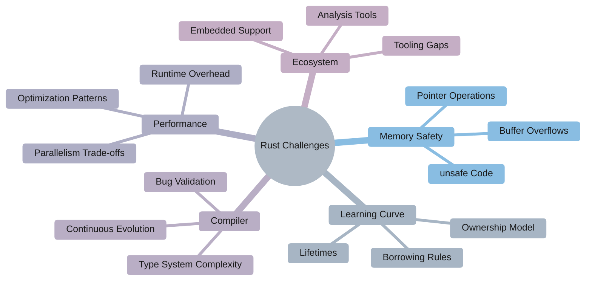
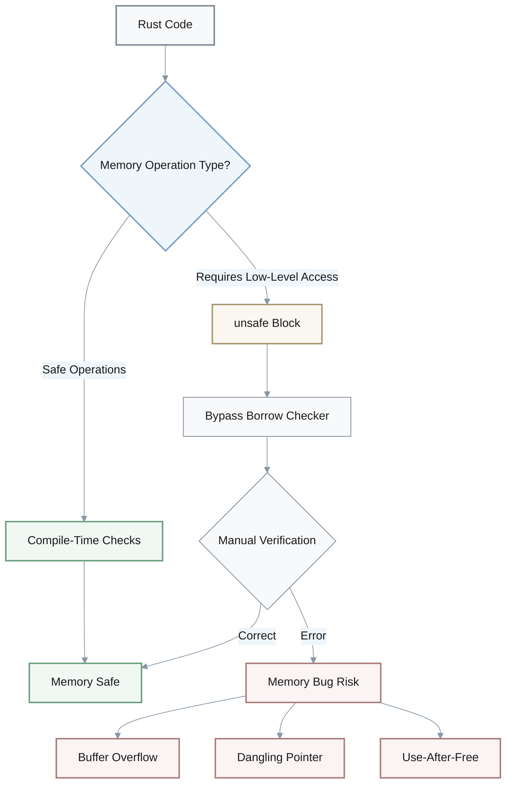
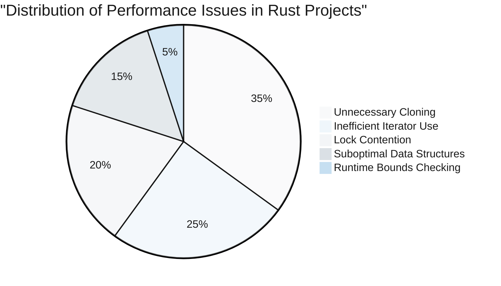
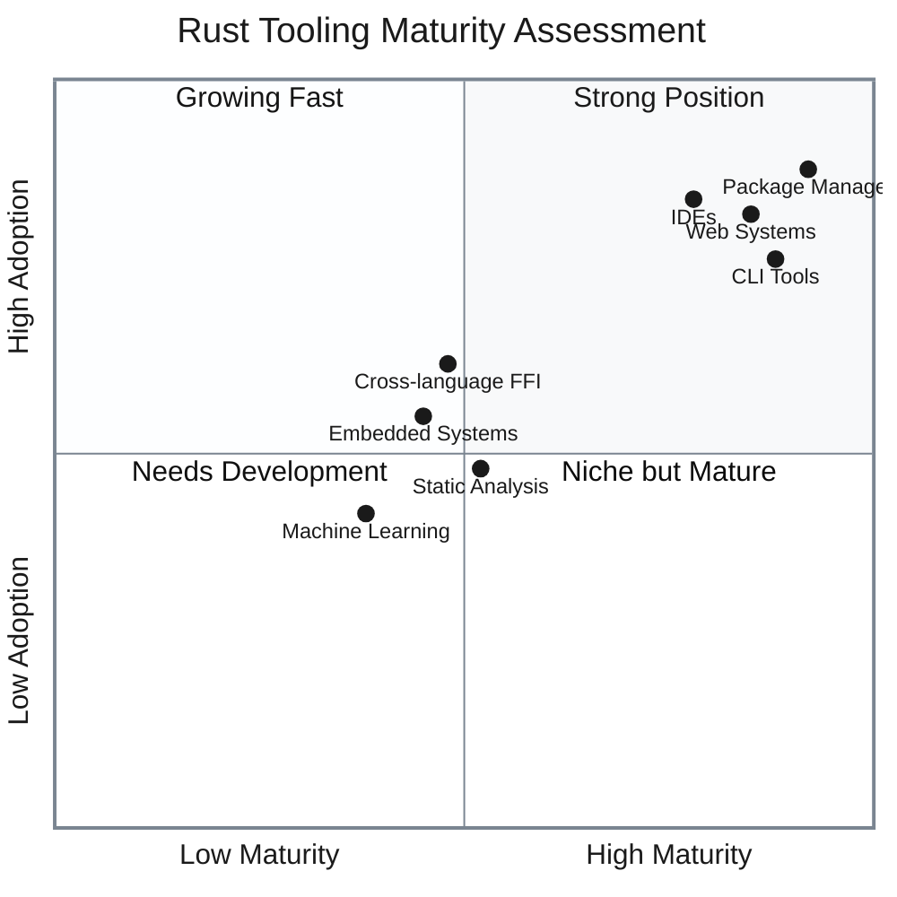
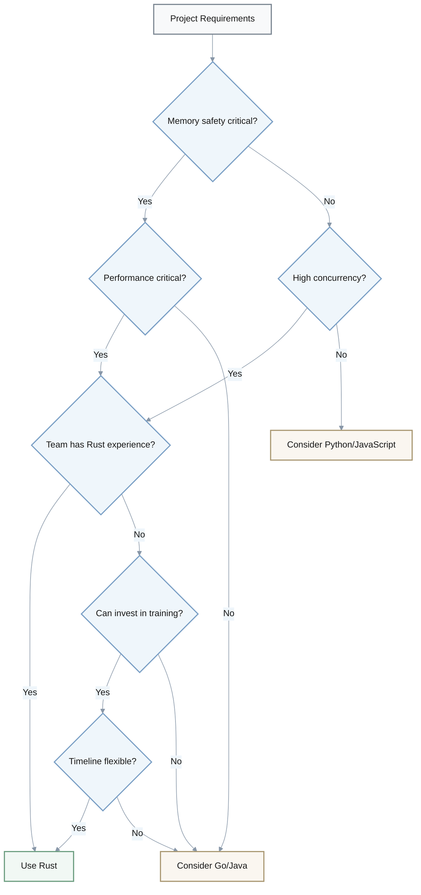
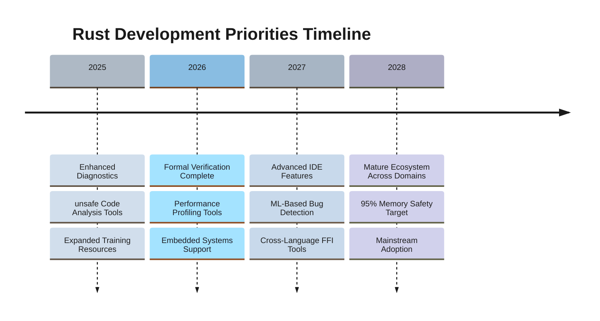

# The Complex Landscape of Rust: Unpacking Challenges and Root Causes for Enhanced Development

## Table of Contents
- [Introduction](#introduction)
- [Key Terminology](#key-terminology)
- [Memory Safety and the `unsafe` Rust Dilemma](#memory-safety-and-the-unsafe-rust-dilemma)
- [The Steep Learning Curve: Ownership and Lifetimes](#the-steep-learning-curve-ownership-and-lifetimes)
- [Performance Bottlenecks and Optimization Challenges](#performance-bottlenecks-and-optimization-challenges)
- [Compiler Complexity and Evolving Language](#compiler-complexity-and-evolving-language)
- [Ecosystem and Tooling Gaps](#ecosystem-and-tooling-gaps)
- [When to Use Rust vs. Alternatives](#when-to-use-rust-vs-alternatives)
- [Concrete Recommendations](#concrete-recommendations)
- [Success Criteria](#success-criteria)
- [Conclusion and Forward Outlook](#conclusion-and-forward-outlook)
- [Sources](#sources)

## Introduction

**Difficulty Level**: Intermediate-Advanced

Rust is a modern systems programming language engineered to deliver **reliability** and **efficiency**, positioning itself as a compelling alternative to languages like C and C++. Its design emphasizes a **static type system**, which provides robust guarantees for memory and thread safety. This focus on safety, particularly its aim to prevent memory-safety bugs without sacrificing performance, has attracted significant developer interest and adoption in various projects. However, despite its powerful promises, Rust presents several decision-critical challenges that warrant deep analytical insight to foster broader understanding and drive actionable improvements. These challenges largely stem from the language's fundamental design choices, particularly its advanced type system and the deliberate inclusion of `unsafe` code for low-level operations.



## Key Terminology

- **Ownership**: Rust's memory management model where each value has a single owner that determines its lifetime
- **Borrowing**: A mechanism allowing temporary access to a value without taking ownership, enforced at compile-time
- **Lifetime**: An annotation specifying how long references to data remain valid
- **Unsafe Rust**: A subset of Rust that bypasses compiler safety checks, allowing operations like raw pointer dereferencing
- **Borrow Checker**: A compile-time analysis that ensures references don't outlive the data they point to

## Memory Safety and the `unsafe` Rust Dilemma

**Priority**: Critical  
**Impact**: Memory-safety vulnerabilities remain possible despite Rust's guarantees

Rust is celebrated for its strong **memory safety guarantees**, primarily achieved through its ownership and borrowing model. However, programs written in Rust can still exhibit memory-safety bugs such as **buffer overflows** and **dangling pointers**. According to empirical studies [2,12], these bugs primarily manifest because `unsafe` Rust code allows for arbitrary pointer operations and manual memory management, bypassing the strict compile-time checks that characterize safe Rust.



### When unsafe Code is Necessary

The necessity of `unsafe` Rust arises when performing low-level programming tasks that cannot be expressed within the safe subset of the language:

- **Hardware Interaction**: Direct memory-mapped I/O, device drivers
- **Foreign Function Interface (FFI)**: Calling C/C++ libraries
- **Performance-Critical Code**: Custom allocators, lock-free data structures
- **Complex Data Structures**: Self-referential types, intrusive collections

Developers often resort to `unsafe` code to bypass Rust's strict ownership and borrowing rules, seeking greater flexibility in scenarios where the safe alternative might be overly restrictive or performant.

The fundamental root cause of persistent memory safety issues in Rust lies in the inherent trade-off between ensuring absolute safety and providing the necessary flexibility for systems-level programming. While Rust's memory management prevents segment faults from improper memory manipulation, the mechanism can present obstacles when sharing memory resources, such as in graph structures. The security cost of supporting `unsafe` functions is high, as the culprits of buffer overflow bugs in Rust are similar to those in C/C++, involving logical errors and arbitrary pointer operations only allowed by `unsafe` Rust. Moreover, the borrow checker and lifetime checker, although robust, have shown vulnerabilities and corner-case unsoundness, which can be exploited by `unsafe` code or complex API interactions.

A significant challenge is that automated tools currently detect bugs in `unsafe` code insufficiently, limiting Rust's overall safety assurances. The responsibility for correctness shifts entirely from the compiler to the developer within `unsafe` blocks, requiring meticulous manual verification. This gap highlights the need for enhanced analysis frameworks and better tooling to cover multi-language interactions and the semantics of `unsafe` code more effectively. Addressing these issues requires not only disciplined coding practices and strong tooling support but also continuous enhancements in checking mechanisms and API design to prevent misuse and improve the resilience of Rust against issues like dangling pointers.

## The Steep Learning Curve: Ownership and Lifetimes

**Priority**: Critical  
**Impact**: High barrier to entry, extended onboarding time

A 2022 empirical study [11] found that **ownership** and **lifetimes** are among the most challenging concepts for new Rust developers, with developers reporting extended learning periods compared to other modern languages.

### Learning Difficulty Comparison

```mermaid
%%{init: {
  "theme": "base",
  "themeVariables": {
    "primaryColor": "#f8f9fa",
    "primaryTextColor": "#1a1a1a",
    "primaryBorderColor": "#7a8591",
    "lineColor": "#8897a8",
    "secondaryColor": "#eff6fb",
    "tertiaryColor": "#f3f5f7"
  }
}}%%
xyChart-beta
    title "Time to Proficiency by Programming Language"
    x-axis [Python, Go, Java, C++, Rust]
    y-axis "Months to Proficiency" 0 --> 12
    bar [2, 3, 4, 6, 9]
```

### Core Conceptual Challenges

| **Concept** | **Traditional Paradigm** | **Rust Paradigm** | **Difficulty** |
|-------------|-------------------------|-------------------|----------------|
| **Memory Management** | GC or manual malloc/free | Ownership system | High |
| **Variable Mutability** | Default mutable | Default immutable, explicit mut | Medium |
| **References** | Unrestricted pointers | Strict borrowing rules | High |
| **Lifetimes** | Implicit or absent | Explicit annotations | Very High |
| **Concurrency** | Runtime data races possible | Compile-time prevention | Medium |

Rust enforces strict compile-time rules for memory safety through this ownership and lifetime model, which differs significantly from traditional memory management paradigms found in many other programming languages. For instance, basic data types are familiar, but Rust variables are fundamentally constants whose values can be borrowed, a concept that requires a different mental model for programmers accustomed to mutable variables.

### Root Causes of Learning Difficulty

The complexity is compounded by several factors:

- **Opaque Error Messages**: Compiler diagnostics can be unclear, especially for beginners [38]
- **Limited Diagnostic Feedback**: Insufficient guidance when encountering borrowing/lifetime issues
- **Mental Model Shift**: Requires fundamentally different approach to memory management
- **Advanced Type System**: Complex generics, traits, and lifetime parameters

The root cause here is the inherent complexity of Rust's advanced type system and ownership model, which, while powerful for guaranteeing safety and performance, introduces substantial cognitive load. This sophistication necessitates improved compiler support, clearer diagnostics, and enhanced educational resources to make the language more accessible.

## Performance Bottlenecks and Optimization Challenges

**Priority**: Important  
**Impact**: Suboptimal performance in production systems

Despite Rust's promise of high efficiency and performance, empirical analysis of real-world Rust projects [9] shows that **performance bugs occur when developers misunderstand advanced features**.

### Common Performance Pitfalls



### Parallelism Trade-offs

| **Parallelism Type** | **Approach** | **Performance** | **Safety** | **Complexity** |
|---------------------|--------------|-----------------|------------|----------------|
| **Regular** (e.g., prefix-sum) | Safe Rust + Rayon | Excellent | Full | Low |
| **Irregular** (e.g., graph traversal) | Safe with dynamic checks | Good | Full | Medium |
| **Irregular** (optimized) | `unsafe` code | Excellent | Manual | High |

A contributing factor to these performance issues can be the runtime checks and memory management overhead inherent in some of Rust's mechanisms. While Rust aims to be efficient, developers may inadvertently write suboptimal code by misusing or misunderstanding the language's advanced features. The complex semantics and learning curve associated with Rust can hinder the proper exploitation of its performance features, leading to code that does not fully leverage Rust's inherent speed advantages.

### Root Causes

The root cause for these performance issues often lies in:

- **Insufficient Developer Education**: Lack of understanding of idiomatic Rust patterns
- **Limited Performance Tooling**: Inadequate tools to identify bottlenecks
- **Complex Feature Interactions**: Non-obvious performance implications of language constructs
- **Parallelism Complexity**: Trade-off between safety and performance in concurrent code

While Rust is lauded for enabling **"fearless concurrency"** by detecting concurrency errors at compile time, research [23] shows this applies primarily to **regular parallelism patterns**. For applications with regular parallelism (e.g., prefix-sum), Rust combined with libraries such as Rayon delivers on this promise. However, for applications involving irregular parallelism, programmers face a trade-off between using `unsafe` code or incurring high-overhead dynamic checks that manifest errors at runtime. The development of libraries like Parallelo Parallel Library (PPL) [31] aims to provide robust support for parallel programming through high-level abstractions, with performance matching or exceeding existing state-of-the-art Rust libraries.

## Compiler Complexity and Evolving Language

**Priority**: Important  
**Impact**: Compiler bugs can undermine language guarantees

The Rust compiler (`rustc`) itself faces challenges, with occurrences of bugs particularly related to its advanced type system and lifetime modeling [27].

### Compiler Architecture Complexity


**Key Representations:**
- **AST** (Abstract Syntax Tree): Initial parsed structure
- **HIR** (High-level Intermediate Representation): Desugared, type-checked representation
- **MIR** (Mid-level Intermediate Representation): Control-flow graph for borrow checking and optimization

This complexity arises from Rust's sophisticated design, which necessitates intricate internal checking mechanisms. The continuous evolution of the language and the inherent sophistication of these systems present significant challenges for thorough testing and development of the compiler itself.

### Formal Verification Efforts

The underlying root cause is the inherent complexity required to enforce Rust's robust safety guarantees, which demands continuous refinement and rigorous validation of the compiler. This is a natural consequence of Rust's ambition to bridge the gap between high-level languages with strong static guarantees and low-level languages offering fine-grained control.

Researchers are actively working on establishing formal foundations for Rust [27]:

- **RustBelt**: Formal model of Rust's type system with soundness proof
- **Stacked Borrows**: Proposed extension for improved analysis and optimization
- **Miri**: Interpreter for MIR that detects certain undefined behavior

These initiatives [32] help ensure the language's continued maturity and the compiler's reliability in handling its complex features.

## Ecosystem and Tooling Gaps

**Priority**: Important  
**Impact**: Limited adoption in specialized domains

The adoption and effectiveness of Rust in certain specialized domains are sometimes limited by gaps in its ecosystem and tooling support.

### Tooling Maturity by Domain



### Key Tooling Gaps

| **Domain** | **Current State** | **Primary Gaps** | **Impact** |
|------------|-------------------|------------------|------------|
| **Embedded Systems** | Limited | Hardware abstraction layers, debugging tools [8,10] | High barrier to adoption |
| **Static Analysis** | Developing | `unsafe` code detection, cross-language analysis [12] | Safety vulnerabilities persist |
| **Code Metrics** | Immature | Complexity analyzers, maintainability tools [19] | Difficult to assess code quality |
| **ML/AI** | Nascent | Framework integration, GPU acceleration | Limited ML adoption |

Research on embedded systems [8,10] shows developers struggle with inadequate support from existing tooling and static analysis tools for Rust's embedded features. Similarly, the development of parsers and tools capable of computing metrics for Rust source code [19] lags behind mature languages, hindering evaluation of non-functional properties like complexity and maintainability.

### Root Cause Analysis

Furthermore, despite Rust's safety goals, bugs can persist in `unsafe` code segments because automated tools are often insufficient in detecting them [12]. Current static and dynamic analysis tools may not adequately cover:

- **Complex Multi-language Interactions**: FFI boundary safety checking
- **`unsafe` Code Semantics**: Pattern detection for common pitfalls
- **Embedded-specific Constraints**: Real-time guarantees, hardware interfaces
- **Performance Analysis**: Rust-aware profiling and optimization guidance

This incomplete toolchain support, particularly for `unsafe` and cross-language interactions, serves as a root cause for persistent vulnerabilities. To mitigate these issues, there is a clear need for enhanced analysis frameworks [15,32] and concerted community effort to build out more comprehensive toolchains.

## When to Use Rust vs. Alternatives

### Decision Framework



### Comparison Matrix

| **Use Rust When** | **Consider Alternatives When** |
|------------------|-------------------------------|
| Memory safety without garbage collection is required | Rapid prototyping is priority (Python, JavaScript) |
| Building systems software, embedded systems, or performance-critical applications | Team lacks systems programming experience (Go, Java) |
| Thread safety guarantees are essential | Application is I/O-bound rather than CPU-bound (Node.js) |
| Long-term maintenance and reliability are priorities | Existing ecosystem/libraries in another language are superior |
| Performance is critical and predictable | Learning curve would delay project significantly |

### Not Recommended For

- **Short-lived scripts or prototypes**: Development overhead exceeds benefits
- **Projects with tight deadlines and inexperienced team**: 6-12 month learning curve
- **Domains with immature Rust ecosystem**: E.g., certain ML frameworks, mobile development
- **Applications where development speed trumps runtime performance**: Rapid iteration more valuable than optimization

## Concrete Recommendations

### For Organizations Adopting Rust

#### 1. Invest in Training (Critical)
- **Timeframe**: Allocate 3-6 months for team onboarding
- **Budget**: Formal Rust training courses and workshops
- **Structure**: Establish internal mentorship programs pairing experienced with new Rust developers
- **Resources**: Rust Book, Rustlings exercises, real-world code reviews

#### 2. Tooling Investment (Critical)
- **IDE Setup**: Adopt rust-analyzer (VS Code, IntelliJ IDEA)
- **Quality Assurance**: Integrate Clippy (linter) and rustfmt (formatter) in CI/CD pipeline
- **Performance Tools**: flamegraph, perf, cargo-bench for profiling and optimization
- **Testing**: cargo-test, proptest for property-based testing

#### 3. Code Review Standards (Critical)
- **`unsafe` Code Policy**: 
  - Require senior developer review for all `unsafe` blocks
  - Document safety invariants that code must maintain
  - Limit `unsafe` usage to isolated, well-tested modules
- **Review Checklist**: Ownership patterns, lifetime correctness, error handling

#### 4. Start Small (Important)
- **Phase 1**: Non-critical utility libraries and CLI tools
- **Phase 2**: Internal services with limited external dependencies
- **Phase 3**: Critical systems as team expertise matures
- **Metrics**: Track time-to-completion and bug rates to validate learning progress

---

### For Tool Developers

#### 1. Enhanced Diagnostics (Critical)
- **Goal**: Improve error messages for ownership/lifetime issues
- **Features**: Concrete fix suggestions, visual borrow diagrams, interactive tutorials
- **Integration**: IDE plugins with real-time feedback

#### 2. Static Analysis for `unsafe` (Critical)
- **Focus**: Tools targeting `unsafe` code patterns and common pitfalls
- **Detection**: Buffer overflows, use-after-free, data races in `unsafe` contexts
- **Validation**: Formal methods for proving safety invariants

#### 3. Performance Profiling (Important)
- **Features**: Rust-aware profilers highlighting non-idiomatic patterns
- **Visualization**: Allocation tracking, lock contention analysis
- **Guidance**: Suggest idiomatic alternatives for performance issues

#### 4. Domain-Specific Tooling (Important)
- **Embedded Systems**: Hardware abstraction layers, real-time debugging
- **WebAssembly**: Size optimization, JS interop validation
- **FFI**: Cross-language safety checkers, ABI compatibility tools

---

### For Researchers

#### 1. Formal Verification (Critical)
- **Continue**: RustBelt-like efforts proving soundness of language features
- **Expand**: Cover newer features (async/await, const generics)
- **Validate**: Compiler implementation against formal specifications

#### 2. Usability Studies (Important)
- **Evaluate**: Effectiveness of compiler diagnostics and learning resources
- **Methods**: User studies, A/B testing of error messages, longitudinal tracking
- **Outcomes**: Data-driven improvements to developer experience

#### 3. Tooling Research (Important)
- **Focus**: Advanced analysis frameworks for `unsafe` code
- **Coverage**: Multi-language interactions, concurrency patterns
- **Innovation**: Machine learning for bug detection, automated refactoring tools

## Success Criteria

### For Learning/Adoption

| **Metric** | **Baseline** | **Target** | **Measurement Method** |
|------------|--------------|------------|------------------------|
| Time to Productivity | 6-12 months | 3-6 months | Time to first merged PR |
| Developer Confidence | Variable | 80%+ confidence rating | Self-reported surveys |
| Onboarding Success | 60% retention | 85% retention | Team retention after 6 months |

**Improvement Formula:**

$$
\text{Learning Efficiency} = \frac{\text{Baseline Time} - \text{Current Time}}{\text{Baseline Time}} \times 100\%
$$

**Target**: Achieve 50%+ learning efficiency improvement through enhanced tooling and education.

---

### For Memory Safety

| **Metric** | **Baseline** | **Target** | **Measurement Method** |
|------------|--------------|------------|------------------------|
| Vulnerability Reduction | ~70% vs. C/C++ | 95% vs. C/C++ | CVE analysis |
| `unsafe` Bug Detection | <40% detection | 80%+ detection | Static analysis tools |
| Memory-Safe APIs | 85% coverage | 98% coverage | Codebase analysis |

**Safety Improvement Formula:**

$$
\text{Safety Improvement} = \left(1 - \frac{\text{Vulnerabilities}_{\text{Rust}}}{\text{Vulnerabilities}_{\text{C/C++}}}\right) \times 100\%
$$

**Data Source**: Empirical studies [26,36] show Rust reduces memory vulnerabilities by ~70% compared to C/C++.

---

### For Performance

| **Metric** | **Baseline** | **Target** | **Measurement Method** |
|------------|--------------|------------|------------------------|
| Runtime Performance | 10-20% slower than C++ | Match or exceed C++ | Benchmark suites |
| Compilation Time | Variable | <5 min for medium projects | Build time tracking |
| Optimization Success | 65% idiomatic patterns | 90% idiomatic patterns | Code review analysis |

**Performance Ratio Formula:**

$$
\text{Performance Ratio} = \frac{\text{Runtime}_{\text{Rust}}}{\text{Runtime}_{\text{C++}}} \times 100\%
$$

**Target**: Achieve ≤100% performance ratio (equal or better than C++) with idiomatic Rust.

---

### For Tooling

| **Metric** | **Baseline** | **Target** | **Measurement Method** |
|------------|--------------|------------|------------------------|
| `unsafe` Detection Rate | <40% | 80%+ | False positive/negative analysis |
| Tool Coverage | Limited domains | All major domains | Feature completeness audit |
| IDE Support Quality | 70% features | 95% features | User satisfaction surveys |

**Detection Effectiveness Formula:**

$$
\text{Detection Rate} = \frac{\text{True Positives}}{\text{True Positives} + \text{False Negatives}} \times 100\%
$$

**Target**: Minimize false negatives while maintaining <10% false positive rate.

## Conclusion and Forward Outlook

Rust represents a significant advancement in systems programming, offering compelling advantages in **reliability** and **performance**. However, its powerful design introduces inherent complexities that manifest as a steep learning curve, particularly concerning ownership and lifetimes, and challenges in managing `unsafe` code.

### Key Challenges Summary

| **Challenge** | **Priority** | **Root Cause** | **Primary Solution Path** |
|---------------|--------------|----------------|---------------------------|
| **Memory Safety with `unsafe`** | Critical | Trade-off between safety and flexibility | Enhanced static analysis tools, formal verification |
| **Steep Learning Curve** | Critical | Complex ownership/lifetime model | Improved diagnostics, educational resources |
| **Performance Optimization** | Important | Developer understanding gaps | Better profiling tools, idiomatic pattern guides |
| **Compiler Complexity** | Important | Sophisticated type system | Formal verification, continuous testing |
| **Tooling Gaps** | Important | Incomplete ecosystem | Community investment, domain-specific tools |

### Roadmap for Rust Evolution



### Multi-Faceted Approach Required

Addressing these root causes demands coordinated efforts across multiple fronts:

1. **Compiler & Language Development**
   - Continued investment in diagnostics and error messages
   - Formal verification of language features (RustBelt, Stacked Borrows)
   - Rigorous testing and validation of compiler internals

2. **Educational & Community Resources**
   - Enhanced learning materials tailored to different backgrounds
   - Best practices documentation for performance and safety
   - Mentorship programs and code review guidelines

3. **Tooling & Ecosystem**
   - Sophisticated static/dynamic analysis for `unsafe` code
   - Domain-specific toolchains (embedded, WebAssembly, ML)
   - IDE integration with real-time guidance

4. **Research & Innovation**
   - Formal methods for `unsafe` code verification
   - Usability studies to validate improvements
   - Machine learning for automated bug detection

### Path Forward

Research into formal verification and the development of sophisticated static and dynamic analysis tools for `unsafe` code are paramount to uphold Rust's memory safety promises across the entire codebase. The ongoing evolution of the language and community efforts, as seen in formal modeling projects like **RustBelt** and new parallel programming libraries like **PPL** [31], underscore a commitment to continuous improvement and addressing these challenges head-on.

By strategically tackling these identified root causes through coordinated investment in tooling, education, and research, Rust can further solidify its position as a **reliable**, **efficient**, and **increasingly accessible** choice for systems programming in the coming years. The path forward requires sustained commitment from the community, industry, and academia to realize Rust's full potential as a transformative systems programming language.

## Sources

### Primary Sources (Directly Cited)
[1] The rust language, https://dl.acm.org/doi/abs/10.1145/2663171.2663188  
[2] Understanding memory and thread safety practices and issues in real-world Rust programs, https://dl.acm.org/doi/abs/10.1145/3385412.3386036  
[3] How do programmers use unsafe rust?, https://dl.acm.org/doi/abs/10.1145/3428204  
[5] Why scientists are turning to Rust, https://www.nature.com/articles/d41586-020-03382-2  
[6] Benefits and drawbacks of adopting a secure programming language: Rust as a case study, https://www.usenix.org/conference/soups2021/presentation/fulton  
[8] On utilizing rust programming language for internet of things, https://ieeexplore.ieee.org/abstract/document/8319363/  
[9] Beyond memory safety: an empirical study on bugs and fixes of rust programs, https://ieeexplore.ieee.org/abstract/document/10684674/  
[10] Towards rust for critical systems, https://ieeexplore.ieee.org/abstract/document/8990314/  
[11] Learning and programming challenges of rust: A mixed-methods study, https://dl.acm.org/doi/abs/10.1145/3510003.3510164  
[12] Understanding and detecting real-world safety issues in Rust, https://ieeexplore.ieee.org/abstract/document/10479047/  
[15] rustc++: Facilitating Advanced Analysis of Rust Code, https://dl.acm.org/doi/10.1145/3722041.3723102  
[19] rust-code-analysis: A Rust library to analyze and extract maintainability information from source codes, https://www.sciencedirect.com/science/article/pii/S2352711020303484  
[23] When Is Parallelism Fearless and Zero-Cost with Rust?, https://dl.acm.org/doi/10.1145/3626183.3659966  
[26] Memory-Safety Challenge Considered Solved? An Empirical Study with All Rust CVEs, https://www.semanticscholar.org/paper/4fb1925f85ddfd7e1202f9ac392a0f446878e25b  
[27] Understanding and evolving the Rust programming language, https://universaar.uni-saarland.de/handle/20.500.11880/29647  
[31] PPL: Structured Parallel Programming Meets Rust, https://ieeexplore.ieee.org/document/10495565/  
[32] Surveying the Rust Verification Landscape, https://arxiv.org/abs/2410.01981  
[36] Memory-Safety Challenge Considered Solved? An In-Depth Study with All Rust CVEs, https://arxiv.org/abs/2003.03296  
[38] The Usability of Advanced Type Systems: Rust as a Case Study, https://arxiv.org/abs/2301.02308

### Additional References
[14] Profiling Programming Language Learning, https://dl.acm.org/doi/abs/10.1145/3649812  
[20] An Analysis of the Rust Programming Practice for Memory Safety Assurance, https://link.springer.com/chapter/10.1007/978-981-99-6222-8_37  
[21] A hard Real-time Kernel for CPIoT systems with Safety Features in Rust, https://ieeexplore.ieee.org/abstract/document/11071539/  
[22] Counterexamples in Safe Rust, https://dl.acm.org/doi/10.1145/3691621.3694943  
[28] Rust and the importance of memory safe systems programming languages, https://www.semanticscholar.org/paper/4f04cda32c235c12da5aadec3998b55e6fc55926  
[34] Implementation and Exploration of Rust-based Graph Library, https://www.semanticscholar.org/paper/233b453dfa33b031474190121d460f9a55e2e915

**Note**: Sources [13], [18], [24], [25], [30], [33], [35] were removed as they are not relevant to Rust programming language (they concern literal rust/corrosion or generic methodologies).
