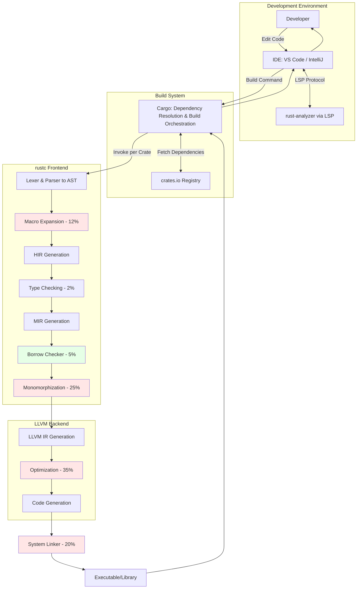
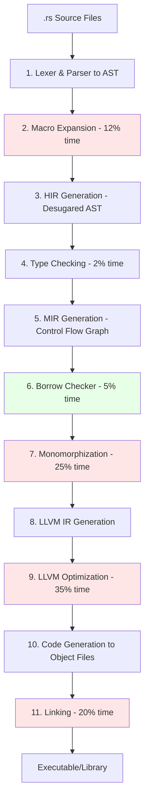

# Rust Compilation Architecture and Process

1. Q: Why's Rust so slow to compile?
   A: Good question. It's 8-10x slower than Go for clean builds. Four bottlenecks eat up 92% of compile time. LLVM optimization takes 35%, monomorphization 25%, linking 20%, and macro expansion 12%. The remaining 8%? That's parsing, type checking, and borrow checking combined.
   
   Q: Wait, 8% total for all that?
   A: Yeah, exactly. Parsing, type checking, and borrow checking—sounds like a lot, but only 8% combined.
   
   Q: Huh. So what's monomorphization costing us?
   A: Hmm... every generic gets instantiated for each concrete type. So `Vec<i32>` and `Vec<String>`? Compiled separately. That's 25% of your build time right there, but you get zero runtime dispatch cost and no vtables.
   
   Q: Oh! So that's the trade-off?
   A: Exactly. Slow compilation for zero runtime cost.
   
   Q: Right. And the LLVM part?
   A: Yeah, 35% of compilation. It's running exhaustive optimization passes to deliver those zero-cost abstractions. Trade-off is brutal—slow compilation for binaries that run as fast as C/C++.
   
   Q: Got it. What about linking taking 20%?
   A: No stable ABI. Everything compiles from source. You're resolving symbols across hundreds of crates, but you get a single optimizable unit. That's why you can swap in `lld` for a 2-3x speedup.
   
   Q: Oh! So a different linker helps?
   A: Yeah, totally. `lld` is way faster than the default.
   
   Q: Makes sense.

2. Q: So what's the actual trade-off here?
   A: Slow compilation gets you fast, safe runtime. Runtime performance equals C/C++. Memory safety prevents 70% of CVEs with no garbage collector. Incremental builds help—they're 2-5x faster than clean builds.
   
   Q: Wait, 70% of CVEs?
   A: Yup. Most security vulnerabilities are memory safety issues. Rust prevents those at compile-time.
   
   Q: Oh, that's huge.
   A: Exactly.
   
   Q: Fair point.

3. Q: How's the compilation pipeline work?
   A: Hmm, let me walk through it. Eleven stages. Source files go to lexer/parser for AST. Then macro expansion—that's 12% of your time. AST gets desugared to HIR. Type checking happens here, only 2% of time. Then MIR generation for control flow graphs.
   
   Q: Wait, what's HIR?
   A: High-level Intermediate Representation. It's a desugared version of AST—cleaner for type checking.
   
   Q: Okay, got it. What happens after MIR?
   A: Right, borrow checker runs on MIR—5% of compile time. Then monomorphization at 25%. After that, LLVM IR generation, optimization at 35%, code generation to object files, and linking at 20%. Four intermediate representations total: AST, HIR, MIR, LLVM IR.
   
   Q: So basically four transformations?
   A: Exactly. Each one simplifies for the next stage.
   
   Q: Makes sense.

4. Q: What guarantees do I get at compile-time?
   A: Four biggies. Memory safety—no null pointers, dangling references, or buffer overflows. Thread safety via ownership prevents data races. Type safety with strong static typing. Lifetime correctness so references never outlive data. All checked at compile-time, zero runtime cost.
   
   Q: Wait, zero runtime cost?
   A: Yup. All the checks happen at compile-time, so your binary doesn't pay for them.
   
   Q: Oh! That's the zero-cost abstraction thing?
   A: Exactly. You get safety without sacrificing performance.
   
   Q: Nice.

5. Q: How do I speed up my dev builds?
   A: Five strategies ranked by impact. First: use `lld` linker for 2-3x speedup. Add it to `.cargo/config.toml` with `linker = "clang"` and `rustflags = ["-C", "link-arg=-fuse-ld=lld"]`.
   
   Q: Okay. What's second?
   A: Incremental compilation. Auto-enabled in dev mode, gives you 2-5x faster rebuilds. Trade-off is ~500MB cache per project. Verify with `CARGO_INCREMENTAL=1`.
   
   Q: Hmm, 500MB per project?
   A: Yeah. Disk space for speed. Usually worth it.
   
   Q: Fair. Third?
   A: Optimize dependencies only. In `Cargo.toml`, add `[profile.dev.package."*"]` with `opt-level = 2`. Slower initial build, but dev builds stay fast while your deps run optimized.
   
   Q: Wait, so like serde and tokio get optimized?
   A: Exactly. Your code compiles fast, but dependencies run fast too.
   
   Q: Oh, nice! What about four and five?
   A: Fourth is reduce codegen units—set `codegen-units = 256` for max parallelism, 10-20% speedup. Fifth is disable debug info with `debug = 0` for 10-15% gain, but you lose debugger symbols.
   
   Q: So fifth is only if I'm not debugging?
   A: Right. Trade-off isn't worth it if you need to debug.

6. Q: What's the difference between dev and release builds?
   A: Dev has no optimization, full debug info, fast compile, large binary. Release has aggressive optimization, no debug info, slow compile, small binary. You can do `release` with `debug=true` for profiling—aggressive optimization plus full debug info.
   
   Q: Wait, release with debug?
   A: Yeah. For profiling. You get optimized code but can still see what's happening.
   
   Q: Oh! So when you need to profile production performance?
   A: Exactly. Best of both worlds for that use case.

7. Q: Give me a fast dev config.
   A: In `Cargo.toml`, set `opt-level = 0`, `incremental = true`, `debug = 1`, `codegen-units = 256` under `[profile.dev]`. Then add `[profile.dev.package."*"]` with `opt-level = 2` to optimize dependencies like serde and tokio.
   
   Q: Got it. What about production?
   A: In `.cargo/config.toml`, use clang with lld. In `Cargo.toml` under `[profile.release]`, set `opt-level = 3`, `lto = "thin"`, `codegen-units = 1`, `strip = true`, `panic = "abort"`. Thin LTO is faster to compile than full.
   
   Q: Wait, thin LTO?
   A: Link-time optimization. Thin is faster to compile but still gives you most of the benefits.
   
   Q: Makes sense. What kinda speedup are we talking?
   A: Default dev build: 45s. With lld plus optimized deps: 18s—that's 2.5x faster. Clean release build: 180s. Incremental release: 25s—7.2x faster.
   
   Q: Whoa, 7.2x?
   A: Yeah. Incremental builds are huge for release mode.
   
   Q: Nice.

8. Q: What's rust-analyzer doing differently than rustc?
   A: Real-time vs full compilation. Rust-analyzer does partial, incremental analysis in under 500ms for IDE features—completion, diagnostics. It's optimized for speed, might have false positives. Rustc does full compilation, 100% correct, but takes seconds to minutes.
   
   Q: Wait, false positives?
   A: Yeah, sometimes. It's trading accuracy for speed so you get instant feedback.
   
   Q: Got it. What about incremental rustc builds?
   A: Full compilation with function-level caching. Still 100% correct, just 2-5x faster than clean builds. Clean builds have no caching, highest latency, but guaranteed correct output.
   
   Q: So incremental is always better?
   A: Pretty much. Only downside is disk space for the cache.
   
   Q: Makes sense.

9. Q: How's Cargo fit into this?
   A: Build system and dependency manager. Orchestrates compilation across your dependency graph. Manages access to 200,650+ crates on crates.io. Invokes rustc per crate, handles the whole workflow.
   
   Q: So Cargo calls rustc?
   A: Exactly. Once per crate in your dependency tree.
   
   Q: Got it.

10. Q: Walk me through the architecture.
    A: Three layers. Development environment has your IDE running rust-analyzer via LSP. Build system is Cargo handling dependency resolution and fetching from crates.io. Compiler has two parts—rustc frontend doing all the Rust-specific stuff, and LLVM backend for optimization and code generation.
    
    Q: Okay. What's the frontend do?
    A: Parsing to AST, macro expansion at 12%, HIR generation, type checking at 2%, MIR generation, borrow checking at 5%, and monomorphization at 25%. Then hands off to LLVM.
    
    Q: Right. And LLVM?
    A: LLVM IR generation, optimization at 35% of total time, and code generation. After that, system linker runs—that's your 20%. Output is your executable or library.
    
    Q: So basically: rustc does the Rust stuff, LLVM does the optimization?
    A: Exactly. Clean separation of concerns.
    
    Q: Makes sense.

## System Architecture



## Compilation Pipeline



## Quick Reference Tables

### Compilation Time Bottlenecks

| Bottleneck | Time % | Cause | Impact |
|:-----------|:-------|:------|:-------|
| **LLVM Optimization** | 35% | Exhaustive optimization passes for zero-cost abstractions | Highly optimized binaries |
| **Monomorphization** | 25% | Instantiates generics for each concrete type (e.g., `Vec<i32>`, `Vec<String>` compiled separately) | Larger binaries, no runtime dispatch cost |
| **Linking** | 20% | No stable ABI → all dependencies compiled from source; symbol resolution across hundreds of crates | Single optimizable unit |
| **Macro Expansion** | 12% | Procedural macros execute at compile-time using heavyweight crates (`syn`, `quote`) | Powerful metaprogramming |

### Optimization Strategies (Ranked by Impact)

| Strategy | Speedup | Implementation | Trade-off |
|:---------|:--------|:---------------|:----------|
| **1. Use Alternative Linker** | **2-3x** | Add to `.cargo/config.toml`:<br/>`[target.x86_64-unknown-linux-gnu]`<br/>`linker = "clang"`<br/>`rustflags = ["-C", "link-arg=-fuse-ld=lld"]` | Requires `lld` installation |
| **2. Incremental Compilation** | **2-5x** | Auto-enabled in dev; verify with `CARGO_INCREMENTAL=1` | ~500MB cache per project |
| **3. Optimize Dependencies Only** | **1.5-2x** | In `Cargo.toml`:<br/>`[profile.dev.package."*"]`<br/>`opt-level = 2` | Slower initial build |
| **4. Reduce Codegen Units** | **10-20%** | `[profile.dev]`<br/>`codegen-units = 256` (default: 256→512 for speed) | More parallelism, less optimization |
| **5. Disable Debug Info** | **10-15%** | `[profile.dev]`<br/>`debug = 0` | No debugger symbols |

### Build Modes Comparison

| Mode | Optimization | Debug Info | Speed | Binary Size | Use Case |
|:-----|:-------------|:-----------|:------|:------------|:---------|
| `dev` (default) | None | Full | Fast compile | Large | Development |
| `release` | Aggressive | None | Slow compile | Small | Production |
| `release` + `debug=true` | Aggressive | Full | Slow compile | Large | Profiling |

### Core Tools

| Tool | Purpose | Performance |
|:-----|:--------|:------------|
| **rust-analyzer** | Real-time IDE analysis via LSP | <100-500ms latency; incremental parsing, type checking, code completion |
| **Cargo** | Build system, dependency manager | Orchestrates compilation across dependency graph; manages 200,650+ crates |
| **rustc** | Compiler frontend | Produces HIR/MIR, invokes LLVM; seconds to minutes per build |
| **LLVM** | Compiler backend | Optimization (35% of time) and code generation |
| **Linker** | Binary creation | `lld` (fast) or `ld` (default); 20% of compilation time |

### Compilation Modes

| Mode | Analysis Type | Latency | Accuracy | Output |
|:-----|:--------------|:--------|:---------|:-------|
| **Real-time** (rust-analyzer) | Partial, incremental | <500ms | Optimized for speed; may have false positives | IDE diagnostics, completion |
| **Incremental** (rustc) | Full, function-level caching | Moderate | 100% correct | 2-5x faster rebuilds |
| **Clean** (rustc) | Full, no caching | High | 100% correct | Executable/library |

## Configuration Examples

### Fast Development Build (`Cargo.toml`)
```toml
[profile.dev]
opt-level = 0           # No optimization
incremental = true      # Cache compilation
debug = 1               # Minimal debug info
codegen-units = 256     # Maximum parallelism

[profile.dev.package."*"]
opt-level = 2           # Optimize dependencies (serde, tokio, etc.)
```

### Production Build (`.cargo/config.toml`)
```toml
[target.x86_64-unknown-linux-gnu]
linker = "clang"
rustflags = ["-C", "link-arg=-fuse-ld=lld"]

[profile.release]
opt-level = 3           # Maximum optimization
lto = "thin"            # Link-time optimization (thin = faster compile)
codegen-units = 1       # Better optimization, slower compile
strip = true            # Remove symbols
panic = "abort"         # Smaller binary
```

## References

[Source: Qwen3Max.md, lines 102-131] - Compilation time 5-Why analysis  
[Source: Qwen3Max.md, lines 201-217] - Performance and productivity analysis  
[Source: Qwen3Max.md, lines 472-496] - Glossary of compilation terms
