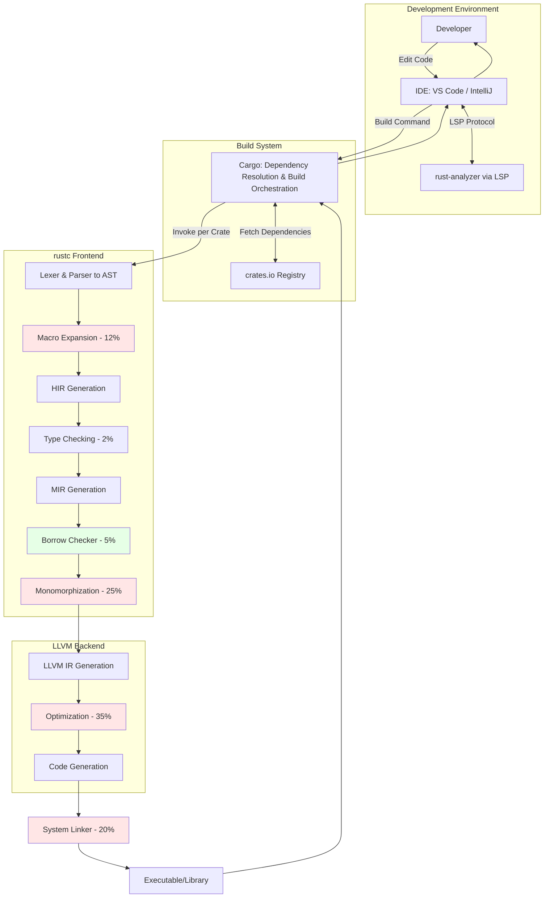
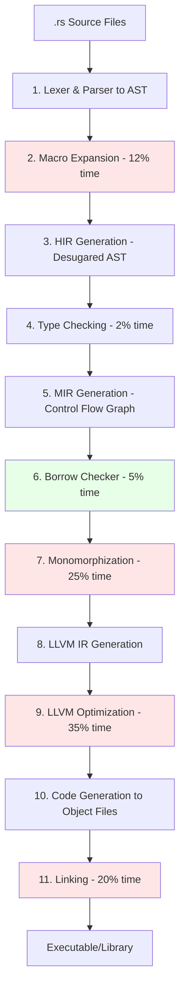

# Rust Compilation Architecture and Process

## Why Rust Compiles Slowly

Rust compilation is **8-10x slower than Go** for clean builds. Four bottlenecks account for **92% of compilation time**:

| Bottleneck | Time % | Cause | Impact |
|:-----------|:-------|:------|:-------|
| **LLVM Optimization** | 35% | Exhaustive optimization passes for zero-cost abstractions | Highly optimized binaries |
| **Monomorphization** | 25% | Instantiates generics for each concrete type (e.g., `Vec<i32>`, `Vec<String>` compiled separately) | Larger binaries, no runtime dispatch cost |
| **Linking** | 20% | No stable ABI → all dependencies compiled from source; symbol resolution across hundreds of crates | Single optimizable unit |
| **Macro Expansion** | 12% | Procedural macros execute at compile-time using heavyweight crates (`syn`, `quote`) | Powerful metaprogramming |

**Remaining 8%**: Parsing (1%), Type Checking (2%), Borrow Checking (5%)

**Key Performance Metrics:**
- Clean build: **8-10x slower than Go** (C++: 5-7x slower)
- Incremental builds: **2-5x faster** than clean builds
- Runtime: **Equivalent to C/C++** (zero-cost abstractions)
- Memory safety: **70% of CVEs prevented** (no garbage collector)

**Trade-off**: Slow compilation → Fast, safe runtime + memory safety guarantees

## System Architecture



## Compilation Pipeline



### Intermediate Representations
**AST** → **HIR** (desugared) → **MIR** (control flow graph for borrow checking) → **LLVM IR** (platform-agnostic)

## Design Trade-offs

### Compile-Time Guarantees (Zero Runtime Cost)
- **Memory Safety**: No null pointers, dangling references, or buffer overflows
- **Thread Safety**: Data race prevention via ownership
- **Type Safety**: Strong static typing with inference
- **Lifetime Correctness**: References never outlive data

### Performance vs. Compilation Speed
Rust prioritizes **runtime performance** and **safety** over compilation speed. The 92% compilation time investment (monomorphization 25%, LLVM optimization 35%, linking 20%, macros 12%) delivers:
- Binaries equivalent to C/C++ performance
- 70% of memory safety CVEs prevented at compile-time
- Zero-cost abstractions with no garbage collector overhead

## Optimization Strategies

### Quick Wins (Ranked by Impact)

| Strategy | Speedup | Implementation | Trade-off |
|:---------|:--------|:---------------|:----------|
| **1. Use Alternative Linker** | **2-3x** | Add to `.cargo/config.toml`:<br/>`[target.x86_64-unknown-linux-gnu]`<br/>`linker = "clang"`<br/>`rustflags = ["-C", "link-arg=-fuse-ld=lld"]` | Requires `lld` installation |
| **2. Incremental Compilation** | **2-5x** | Auto-enabled in dev; verify with `CARGO_INCREMENTAL=1` | ~500MB cache per project |
| **3. Optimize Dependencies Only** | **1.5-2x** | In `Cargo.toml`:<br/>`[profile.dev.package."*"]`<br/>`opt-level = 2` | Slower initial build |
| **4. Reduce Codegen Units** | **10-20%** | `[profile.dev]`<br/>`codegen-units = 256` (default: 256→512 for speed) | More parallelism, less optimization |
| **5. Disable Debug Info** | **10-15%** | `[profile.dev]`<br/>`debug = 0` | No debugger symbols |

### Build Modes Comparison

| Mode | Optimization | Debug Info | Speed | Binary Size | Use Case |
|:-----|:-------------|:-----------|:------|:------------|:---------|
| `dev` (default) | None | Full | Fast compile | Large | Development |
| `release` | Aggressive | None | Slow compile | Small | Production |
| `release` + `debug=true` | Aggressive | Full | Slow compile | Large | Profiling |

### Configuration Examples

**Fast Development Build** (`Cargo.toml`):
```toml
[profile.dev]
opt-level = 0           # No optimization
incremental = true      # Cache compilation
debug = 1               # Minimal debug info
codegen-units = 256     # Maximum parallelism

[profile.dev.package."*"]
opt-level = 2           # Optimize dependencies (serde, tokio, etc.)
```

**Production Build** (`.cargo/config.toml`):
```toml
[target.x86_64-unknown-linux-gnu]
linker = "clang"
rustflags = ["-C", "link-arg=-fuse-ld=lld"]

[profile.release]
opt-level = 3           # Maximum optimization
lto = "thin"            # Link-time optimization (thin = faster compile)
codegen-units = 1       # Better optimization, slower compile
strip = true            # Remove symbols
panic = "abort"         # Smaller binary
```

**Benchmark Timing**:
- Default dev build: 45s
- With lld + optimized deps: 18s (2.5x faster)
- Clean release build: 180s
- Incremental release: 25s (7.2x faster)

## Toolchain & Workflow

### Core Tools

| Tool | Purpose | Performance |
|:-----|:--------|:------------|
| **rust-analyzer** | Real-time IDE analysis via LSP | <100-500ms latency; incremental parsing, type checking, code completion |
| **Cargo** | Build system, dependency manager | Orchestrates compilation across dependency graph; manages 200,650+ crates |
| **rustc** | Compiler frontend | Produces HIR/MIR, invokes LLVM; seconds to minutes per build |
| **LLVM** | Compiler backend | Optimization (35% of time) and code generation |
| **Linker** | Binary creation | `lld` (fast) or `ld` (default); 20% of compilation time |

### Compilation Modes

| Mode | Analysis Type | Latency | Accuracy | Output |
|:-----|:--------------|:--------|:---------|:-------|
| **Real-time** (rust-analyzer) | Partial, incremental | <500ms | Optimized for speed; may have false positives | IDE diagnostics, completion |
| **Incremental** (rustc) | Full, function-level caching | Moderate | 100% correct | 2-5x faster rebuilds |
| **Clean** (rustc) | Full, no caching | High | 100% correct | Executable/library |

## References

[Source: Qwen3Max.md, lines 102-131] - Compilation time 5-Why analysis  
[Source: Qwen3Max.md, lines 201-217] - Performance and productivity analysis  
[Source: Qwen3Max.md, lines 472-496] - Glossary of compilation terms
