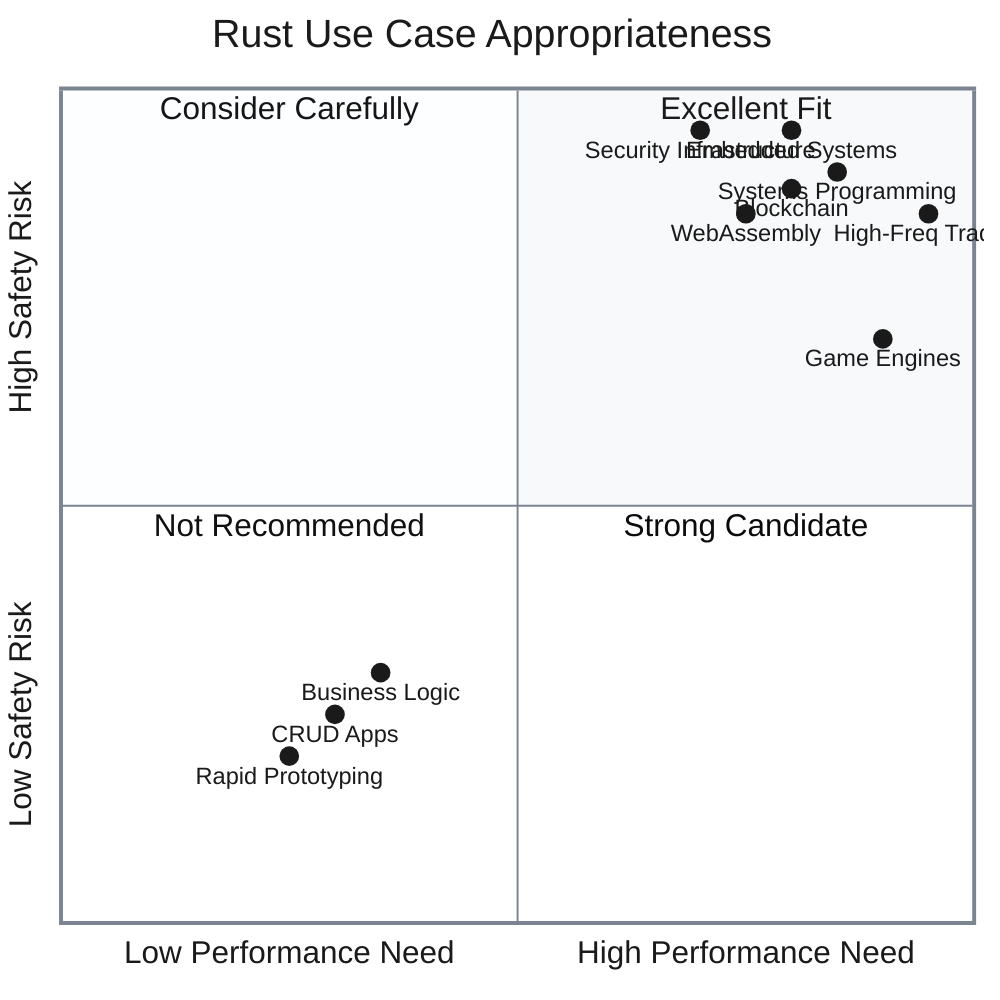
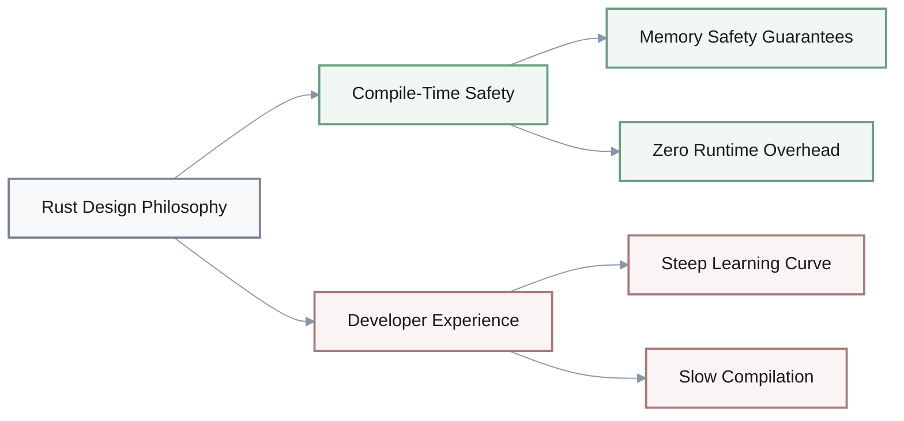
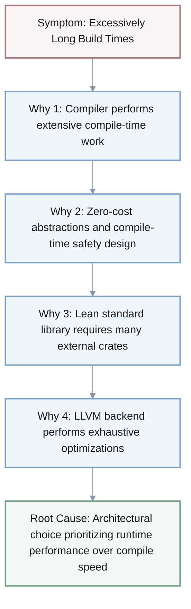
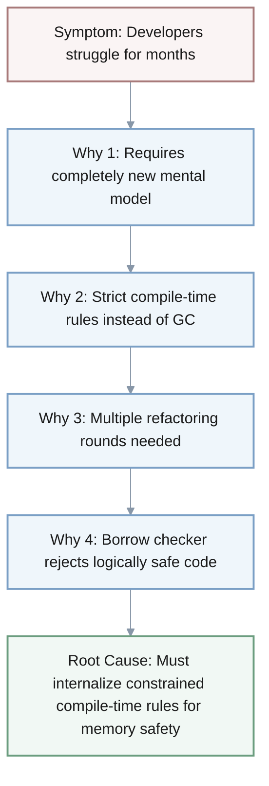
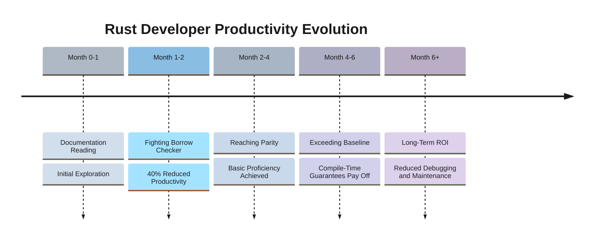
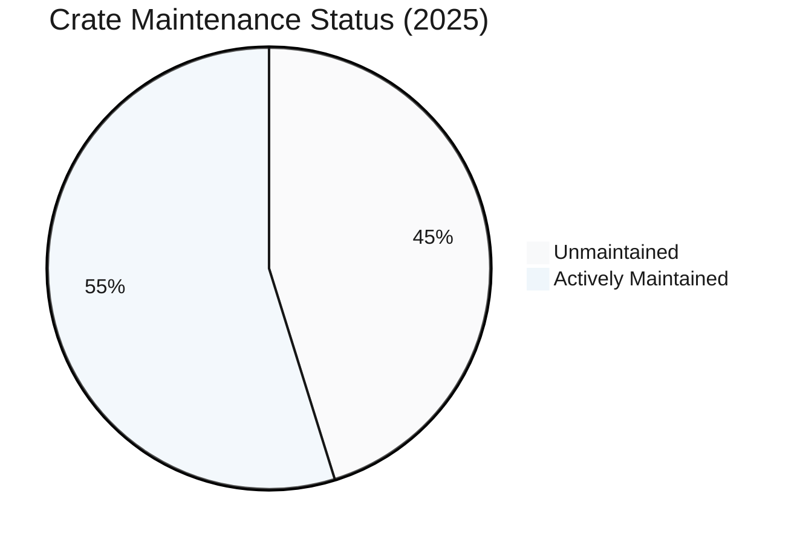
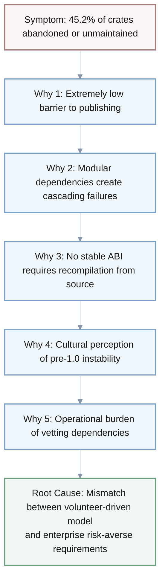
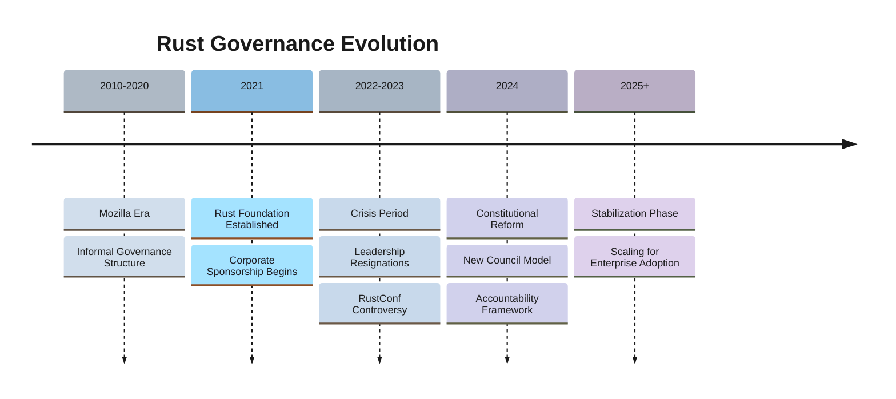
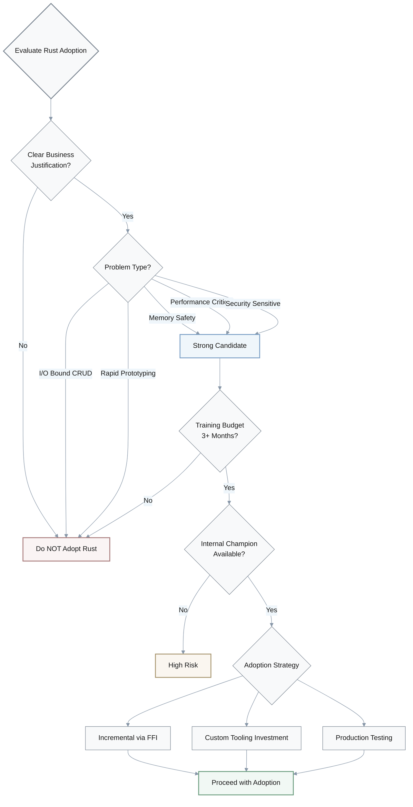
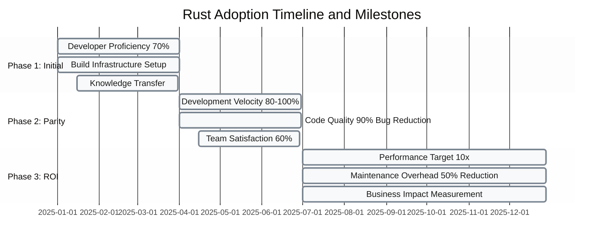

# A Deep Dive into the Rust Programming Language: Trade-offs, Adoption, and Future Trajectory

## Executive Summary

Rust is a systems programming language that trades compile-time complexity and steep learning curves for unparalleled memory safety and runtime performance. This document analyzes Rust's core trade-offs, adoption patterns, and strategic implications for organizations.

**Key Findings**:

| Finding Category | Summary | Key Metrics |
|:----------------|:--------|:------------|
| **Core Trade-off** | Prioritizes compile-time safety over developer productivity | 8-10x slower compilation, 3-6 month learning curve |
| **Performance vs. Productivity** | C/C++ level performance with upfront friction | Productivity parity in 2-4 months |
| **Ecosystem Challenges** | Supply chain fragility and tooling immaturity | 45.2% crates unmaintained [📅 2025] |
| **Governance Evolution** | Constitutional reform to address scaling pains | New council model established 2024 |
| **Strategic Guidance** | Requires clear justification and incremental adoption | 3+ month training investment needed |

**Recommended Use Cases**: Systems programming, embedded development, security-critical infrastructure, WebAssembly, blockchain.  
**Not Recommended For**: CRUD applications, rapid prototyping, business logic with minimal performance constraints.

> **⚠️ Data Currency Note**: This document contains time-sensitive statistics from 2022-2025, including ecosystem metrics (crate counts, abandonment rates), survey results, and governance changes. Verify current data before making strategic decisions. Key dated claims are flagged with [📅 as of YEAR] where critical.

## Table of Contents

1. [The Foundational Trade-off: Compile-Time Safety vs. Developer Experience](#the-foundational-trade-off-compile-time-safety-vs-developer-experience)
2. [Performance and Productivity: The Dual Realities of Rust Development](#performance-and-productivity-the-dual-realities-of-rust-development)
3. [Ecosystem Fragility and Enterprise Readiness](#ecosystem-fragility-and-enterprise-readiness)
4. [Community Dynamics and Governance Scaling Pains](#community-dynamics-and-governance-scaling-pains)
5. [Strategic Implications for Organizational Adoption](#strategic-implications-for-organizational-adoption)
6. [The Future of Rust: Navigating Complexity and Security at Scale](#the-future-of-rust-navigating-complexity-and-security-at-scale)

## The Foundational Trade-off: Compile-Time Safety vs. Developer Experience

The Rust programming language is fundamentally defined by a deliberate and uncompromising trade-off: it prioritizes compile-time correctness, memory safety, and ultimate runtime performance above all else, even if it means sacrificing immediate developer productivity and ease of entry [[28](https://www.quora.com/What-are-some-reasons-why-Rust-is-not-a-popular-programming-language-What-are-some-criticisms-of-Rust), [67](https://mdwdotla.medium.com/using-rust-at-a-startup-a-cautionary-tale-42ab823d9454)]. This central tension is not an accidental flaw but a core design philosophy that permeates every aspect of the language, from its syntax to its compiler's behavior. Understanding this trade-off is essential to grasping both Rust's immense appeal to a segment of the developer community and the significant friction it creates for others. The observable symptoms of this trade-off—such as a steep learning curve, long compilation times, and complex error messages—are direct manifestations of a system designed to prevent entire classes of bugs before they can ever reach production [[4](https://roadmap.sh/golang/vs-rust), [6](https://www.designveloper.com/blog/rust-vs-go/)]. At its core, Rust was created to solve the problem of memory unsafety prevalent in systems languages like C and C++, where a vast majority of severe software vulnerabilities stem from issues like buffer overflows, use-after-free errors, and data races [[23](https://medium.com/codex/rust-first-impressions-after-6-months-469268ed7dc), [76](https://www.thestack.technology/rust-language-explosive-growth-challenges-rust-governance/)]. Instead of relying on a garbage collector (GC), which introduces unpredictable runtime pauses, Rust employs a sophisticated ownership and borrow checker system enforced at compile time [[1](https://bitfieldconsulting.com/posts/rust-vs-go), [7](https://www.geeksforgeeks.org/blogs/golang-vs-rust-top-differences/)]. This system ensures that memory is managed correctly without any runtime overhead, providing guarantees about memory safety that are unheard of in traditional compiled languages [[9](https://betterstack.com/community/comparisons/rust-vs-go/), [56](https://www.sei.cmu.edu/blog/rust-software-security-a-current-state-assessment/)].

**5-Why Analysis: Slow Compilation Times**

A 5-Why analysis of Rust's slow compilation times reveals that this is a systemic characteristic, not a temporary bug. The initial symptom is the perception among developers that build times are excessively long, creating a significant bottleneck in their workflow [[29](https://www.infoworld.com/article/4057215/survey-pinpoints-rust-compiler-pain-points.html), [93](https://kobzol.github.io/rust/rustc/2025/06/09/why-doesnt-rust-care-more-about-compiler-performance.html)]. The first "why" is that the Rust compiler (`rustc`) performs an enormous amount of work during the compilation phase that other languages defer to runtime [[112](https://www.pingcap.com/blog/rust-compilation-model-calamity/)]. This includes monomorphizing generics, resolving complex trait relationships, and executing procedural macros, all of which generate large volumes of intermediate representation (IR) that must be processed [[111](https://medium.com/@martin00001313/compile-time-polymorphism-a-comparison-of-c-and-rust-metaprogramming-7be921cd01f8), [122](https://www.pingcap.com/blog/reasons-rust-compiles-slowly/)]. This extensive work is a direct consequence of the second "why": Rust's core design principle of zero-cost abstractions and compile-time safety guarantees [[95](https://news.ycombinator.com/item?id=44234080)]. By performing this analysis upfront, Rust eliminates runtime checks for memory safety and enables highly optimized code, but this comes at the cost of compile-time complexity [[102](https://www.devprojournal.com/technology-trends/mastering-rust-a-comprehensive-guide-to-its-strengths-and-challenges/)]. The third "why" is that this complexity is magnified by the language's lean standard library; unlike languages with more built-in functionality, Rust projects frequently depend on hundreds of thousands or even millions of lines of source code from external crates, which must be compiled from scratch for every build [[92](https://www.reddit.com/r/rust/comments/1kvq4nq/how_bad_were_rusts_compile_times/)]. Finally, the fourth "why" lies in the reliance on the LLVM backend for final code generation. LLVM performs exhaustive optimization passes on the generated IR, which is a major bottleneck, particularly in release builds where optimization levels are highest [[96](https://sharnoff.io/blog/why-rust-compiler-slow), [122](https://www.pingcap.com/blog/reasons-rust-compiles-slowly/)]. The root cause, therefore, is the fundamental architectural choice to prioritize runtime performance and compile-time safety over compile-time speed, a trade-off consciously made during the language's design and difficult to alter without compromising Rust's core value proposition [[112](https://www.pingcap.com/blog/rust-compilation-model-calamity/)].

**5-Why Analysis: Steep Learning Curve**

Similarly, the steep learning curve of Rust can be traced back to the same foundational decision. The observable symptom is that new developers struggle to become productive, often spending months wrestling with concepts like ownership, borrowing, and lifetimes [[6](https://www.designveloper.com/blog/rust-vs-go/), [67](https://mdwdotla.medium.com/using-rust-at-a-startup-a-cautionary-tale-42ab823d9454)]. The first "why" is that Rust requires developers to adopt a completely new mental model for managing memory and program structure, one that is alien to those coming from garbage-collected languages like Java or Python [[22](https://stevedonovan.github.io/rust-gentle-intro/pain-points.html), [100](https://corrode.dev/blog/flattening-rusts-learning-curve/)]. This is the second "why": Rust enforces its memory safety guarantees through strict, unyielding compile-time rules rather than a runtime GC [[1](https://bitfieldconsulting.com/posts/rust-vs-go), [7](https://www.geeksforgeeks.org/blogs/golang-vs-rust-top-differences/)]. Every value must adhere to the ownership rules, and references must follow stringent rules about mutability and lifetime to prevent dangling pointers and data races [[9](https://betterstack.com/community/comparisons/rust-vs-go/), [23](https://medium.com/codex/rust-first-impressions-after-6-months-469268ed7dc)]. Consequently, the third "why" is that mastering this model forces developers to think differently about their code, often requiring multiple rounds of refactoring to satisfy the compiler before their logic is accepted [[4](https://roadmap.sh/golang/vs-rust), [101](https://codingplainenglish.medium.com/everyone-complains-about-rusts-learning-curve-until-they-use-it-in-production-e7fa793f7714)]. This iterative process, often described as "fighting the borrow checker," imposes a heavy cognitive load [[24](https://stackoverflow.blog/2020/01/20/what-is-rust-and-why-is-it-so-popular/)]. The fourth "why" is that the borrow checker's conservative static analysis sometimes rejects code that is logically safe but violates its rigid rules, leading to frustration as developers must learn complex workarounds instead of simple solutions [[22](https://stevedonovan.github.io/rust-gentle-intro/pain-points.html), [56](https://www.sei.cmu.edu/blog/rust-software-security-a-current-state-assessment/)]. The ultimate root cause is the necessity of internalizing a novel and highly constrained set of compile-time rules to achieve Rust's core promise of memory safety. It trades immediate programmer productivity for long-term reliability and correctness, a trade-off that proves challenging for many but rewarding for those who master it [[28](https://www.quora.com/What-are-some-reasons-why-Rust-is-not-a-popular-programming-language-What-are-some-criticisms-of-Rust)].

This trade-off extends to Rust's approach to concurrency. While Go is renowned for its simplicity and built-in support for lightweight goroutines and channels, Rust's model is more complex but offers stronger compile-time guarantees [[1](https://bitfieldconsulting.com/posts/rust-vs-go), [7](https://www.geeksforgeeks.org/blogs/golang-vs-rust-top-differences/)]. Rust's "fearless concurrency" stems from its ownership system, which prevents data races at compile time by ensuring mutable state cannot be shared across threads without explicit synchronization primitives like `Arc` (atomic reference counting) and `Mutex` [[9](https://betterstack.com/community/comparisons/rust-vs-go/), [84](https://developersvoice.com/blog/technology/rust-for-reliability/)]. Attempting to access shared data improperly results in a compilation failure, eliminating an entire class of subtle and hard-to-debug threading bugs [[9](https://betterstack.com/community/comparisons/rust-vs-go/)]. However, this power comes with complexity. Developers must reason about lifetimes and ownership even in concurrent contexts, and the ecosystem has undergone hesitations and lacks the same level of maturity in async handling as Go's model [[23](https://medium.com/codex/rust-first-impressions-after-6-months-469268ed7dc), [26](https://news.ycombinator.com/item?id=31601040)]. While Go's model is considered stronger and simpler for many concurrent programming tasks, Rust's provides a much higher degree of certainty about correctness, making it preferable for building highly reliable and scalable distributed systems where race conditions are unacceptable [[8](https://www.imaginarycloud.com/blog/rust-vs-go), [9](https://betterstack.com/community/comparisons/rust-vs-go/)]. The choice between them is another manifestation of the same core trade-off: Rust's model offers superior safety guarantees at the cost of increased implementation complexity and a steeper learning curve compared to Go's more pragmatic, runtime-enforced approach [[5](https://blog.howardjohn.info/posts/rust-vs-go/), [8](https://www.imaginarycloud.com/blog/rust-vs-go)].

| Feature Comparison | Rust | Go |
| :--- | :--- | :--- |
| **Memory Management** | Ownership and Borrowing System (Compile-time) [[1](https://bitfieldconsulting.com/posts/rust-vs-go), [9](https://betterstack.com/community/comparisons/rust-vs-go/)] | Garbage Collection (Runtime) [[6](https://www.designveloper.com/blog/rust-vs-go/), [7](https://www.geeksforgeeks.org/blogs/golang-vs-rust-top-differences/)] |
| **Primary Strength** | Memory safety without runtime overhead; High performance [[1](https://bitfieldconsulting.com/posts/rust-vs-go), [4](https://roadmap.sh/golang/vs-rust)] | Rapid development; Simplicity; Concurrency [[6](https://www.designveloper.com/blog/rust-vs-go/), [7](https://www.geeksforgeeks.org/blogs/golang-vs-rust-top-differences/)] |
| **Concurrency Model** | Strong compile-time race detection via ownership [[9](https://betterstack.com/community/comparisons/rust-vs-go/), [84](https://developersvoice.com/blog/technology/rust-for-reliability/)] | Lightweight goroutines and channels (CSP model) [[1](https://bitfieldconsulting.com/posts/rust-vs-go), [8](https://www.imaginarycloud.com/blog/rust-vs-go)] |
| **Learning Curve** | Steep, due to ownership, borrowing, and lifetimes [[6](https://www.designveloper.com/blog/rust-vs-go/), [22](https://stevedonovan.github.io/rust-gentle-intro/pain-points.html)] | Gentle, due to minimal syntax and few language constructs [[1](https://bitfieldconsulting.com/posts/rust-vs-go), [7](https://www.geeksforgeeks.org/blogs/golang-vs-rust-top-differences/)] |
| **Compilation Speed** | Slow, due to extensive compile-time checks and LLVM backend [[112](https://www.pingcap.com/blog/rust-compilation-model-calamity/), [122](https://www.pingcap.com/blog/reasons-rust-compiles-slowly/)] | Fast, supporting rapid iteration cycles [[6](https://www.designveloper.com/blog/rust-vs-go/), [7](https://www.geeksforgeeks.org/blogs/golang-vs-rust-top-differences/)] |
| **Error Handling** | `Option` and `Result` types with `?` operator for explicit handling [[1](https://bitfieldconsulting.com/posts/rust-vs-go), [9](https://betterstack.com/community/comparisons/rust-vs-go/)] | Multiple return values (`value, error`) with manual nil checks [[9](https://betterstack.com/community/comparisons/rust-vs-go/)] |
| **Typical Use Cases** | Systems programming, embedded, game engines, blockchain, WebAssembly [[2](https://blog.jetbrains.com/rust/2025/06/12/rust-vs-go/), [4](https://roadmap.sh/golang/vs-rust)] | Microservices, cloud infrastructure, APIs, DevOps tools [[6](https://www.designveloper.com/blog/rust-vs-go/), [9](https://betterstack.com/community/comparisons/rust-vs-go/)] |

Ultimately, the foundational trade-off defines Rust's identity. It is a language that demands a significant investment of time and cognitive effort from its users, but in return, it offers a level of confidence in the correctness and performance of the resulting software that is unparalleled. This makes it an ideal tool for building the foundational components of modern software—the operating systems, databases, browsers, and security-critical applications where failures are not an option [[4](https://roadmap.sh/golang/vs-rust), [69](https://evrone.com/blog/migrating-to-rust-in-2025)]. For these domains, the initial productivity tax is justified by the massive reduction in debugging time, technical debt, and the catastrophic potential of memory-related vulnerabilities. Conversely, for projects where developer velocity is the primary driver and the stakes of a memory error are lower, the same features can feel like unnecessary complexity. This duality explains why Rust is simultaneously the "most loved" language in Stack Overflow surveys—a testament to the satisfaction of its expert users—while also being perceived as difficult and niche by a broader audience [[17](https://medium.com/solo-devs/why-no-one-is-talking-about-rust-in-2025-21d7e059fa49), [21](https://bits-chips.com/article/revisiting-the-state-of-rust/), [91](https://meta.stackoverflow.com/questions/398178/rust-being-the-the-most-loved-programming-language-is-misleading)]. Its success is not measured in universal adoption, but in its ability to dominate the specific, high-stakes niches where its unique combination of safety and performance provides an undeniable competitive advantage.

## Performance and Productivity: The Dual Realities of Rust Development

**Productivity Journey Timeline**

Rust presents a compelling yet paradoxical profile when examining its impact on performance and developer productivity. On one hand, it is lauded for delivering performance on par with C/C++ while offering unprecedented memory safety guarantees, effectively eliminating entire categories of runtime errors [[18](https://www.sonatype.com/blog/exploring-rust-language-adoption), [23](https://medium.com/codex/rust-first-impressions-after-6-months-469268ed7dc)]. On the other hand, this very pursuit of performance and safety creates significant friction in the development workflow, manifesting as slow compilation times, a high cognitive load, and a prolonged learning curve that can severely hamper developer productivity, especially in the short term [[6](https://www.designveloper.com/blog/rust-vs-go/), [10](https://medium.com/@kanishks772/nobody-warned-me-about-rusts-ide-support-now-i-m-warning-you-f1f34fd5c9c3)]. This dual reality is not a contradiction but a direct consequence of Rust's design philosophy, which deliberately sacrifices compile-time efficiency and initial coding convenience for deterministic runtime behavior and robustness [[28](https://www.quora.com/What-are-some-reasons-why-Rust-is-not-a-popular-programming-language-What-are-some-criticisms-of-Rust)]. The language achieves its remarkable performance through a suite of features collectively known as "zero-cost abstractions." These allow developers to write high-level, expressive code using advanced features like iterators, generics, and traits, while the compiler optimizes this code away at compile time, producing machine code that is as efficient as hand-written C++ [[2](https://blog.jetbrains.com/rust/2025/06/12/rust-vs-go/), [9](https://betterstack.com/community/comparisons/rust-vs-go/)]. For example, an iterator chain like `.map(|i| i * i).collect()` is compiled down to a tight loop without any of the overhead typically associated with functional-style programming [[24](https://stackoverflow.blog/2020/01/20/what-is-rust-and-why-is-it-so-popular/)]. This capability is crucial for performance-critical domains such as game development, real-time control systems, high-frequency trading platforms, and AI inference, where predictable latency and maximum throughput are non-negotiable [[4](https://roadmap.sh/golang/vs-rust), [8](https://www.imaginarycloud.com/blog/rust-vs-go), [66](https://www.youtube.com/watch?v=nOSxuaDgl3s)]. Companies like Cloudflare have seen dramatic improvements in their traffic infrastructure by replacing NGINX with Pingora, a proxy built in Rust, achieving ~70% lower CPU usage and ~67% lower memory consumption [[68](https://www.jki.net/blog/the-rust-revolution-in-engineering-systems-real-world-examples-from-the-lab-to-the-factory-floor)]. Similarly, Amazon's Firecracker microVM technology, written in Rust, allows for trillions of serverless executions per month with a significantly smaller attack surface than traditional virtualization solutions [[62](https://medium.com/@datajournal/is-rust-still-surging-in-2025-usage-and-ecosystem-insights-49bfc6d1ce5d), [68](https://www.jki.net/blog/the-rust-revolution-in-engineering-systems-real-world-examples-from-the-lab-to-the-factory-floor)].

**Compilation Speed Comparison**

| Language | Typical Build Time | Relative Speed | Key Factor |
|:---------|:------------------|:---------------|:-----------|
| **Go** | Fast | 1x (baseline) | Minimal compile-time work |
| **Rust** | Slow | 8-10x slower | Extensive compile-time checks |
| **C++** | Moderate-Slow | 5-7x slower | Template instantiation |

However, this path to performance is paved with complexity. The very mechanisms that enable zero-cost abstractions are the same ones that contribute to slow compilation. Monomorphization, the process of generating concrete versions of generic functions for each specific type used, duplicates code and increases the amount of work the compiler must do [[95](https://news.ycombinator.com/item?id=44234080), [111](https://medium.com/@martin00001313/compile-time-polymorphism-a-comparison-of-c-and-rust-metaprogramming-7be921cd01f8)]. When a function is called with many different types, the compiler generates a separate instance for each, which can bloat the binary size and dramatically increase compile times [[113](https://users.rust-lang.org/t/whats-the-name-of-this-technique-for-cutting-down-compile-times-from-monomorphization/89172)]. Procedural macros add another layer of overhead, as they require parsing and expansion steps that can themselves take considerable time, especially if they rely on other crates like `syn` for token stream manipulation [[94](https://users.rust-lang.org/t/this-is-a-real-example-of-rusts-slow-build-times-for-development-can-you-spot-the-issue/125064), [122](https://www.pingcap.com/blog/reasons-rust-compiles-slowly/)]. Furthermore, the reliance on the LLVM compiler backend for code generation, while producing high-quality machine code, is itself a time-consuming process. LLVM performs numerous optimization passes on the intermediate representation (IR) generated by Rust's own compiler, and this step alone can account for a significant portion of total build time, particularly in debug builds where optimizations are still substantial [[96](https://sharnoff.io/blog/why-rust-compiler-slow), [122](https://www.pingcap.com/blog/reasons-rust-compiles-slowly/)]. One developer reported that compiling a simple web backend took 8.36 seconds on Windows, with the linker consuming the majority of that time, highlighting how even seemingly minor operations can be slowed by platform-specific issues and the complexities of the toolchain [[94](https://users.rust-lang.org/t/this-is-a-real-example-of-rusts-slow-build-times-for-development-can-you-spot-the-issue/125064)]. This slow feedback loop stands in stark contrast to the near-instantaneous compilation speeds of languages like Go, which facilitates the rapid iteration cycles that are often prized in agile development environments [[6](https://www.designveloper.com/blog/rust-vs-go/), [10](https://medium.com/@kanishks772/nobody-warned-me-about-rusts-ide-support-now-i-m-warning-you-f1f34fd5c9c3)].

The productivity challenge extends beyond compilation speed into the daily act of writing code. The borrow checker, while a powerful tool for preventing bugs, is also a constant source of friction for developers, especially novices [[6](https://www.designveloper.com/blog/rust-vs-go/), [24](https://stackoverflow.blog/2020/01/20/what-is-rust-and-why-is-it-so-popular/)]. The requirement to manage ownership and lifetimes correctly forces a more disciplined and structured approach to programming, which can feel restrictive compared to the freedom offered by garbage-collected languages [[22](https://stevedonovan.github.io/rust-gentle-intro/pain-points.html)]. A developer might find themselves spending hours trying to restructure a piece of code simply to make the borrow checker happy, a process that can feel like fighting an adversary rather than collaborating with a helpful tool [[101](https://codingplainenglish.medium.com/everyone-complains-about-rusts-learning-curve-until-they-use-it-in-production-e7fa793f7714)]. This cognitive overhead is a significant factor in Rust's reputation as a difficult language to learn [[22](https://stevedonovan.github.io/rust-gentle-intro/pain-points.html), [30](https://www.youtube.com/watch?v=DhSo7zkmz5I)]. Surveys consistently show that difficulty and the steep learning curve are the most cited barriers to adoption [[16](https://blog.rust-lang.org/2024/02/19/2023-Rust-Annual-Survey-2023-results/), [30](https://www.youtube.com/watch?v=DhSo7zkmz5I)]. This initial productivity tax is a real cost that organizations must consider. For startups or teams under pressure to ship features quickly, the time required to bring a new developer up to speed or to overcome the initial hurdles of a Rust project can be prohibitive [[67](https://mdwdotla.medium.com/using-rust-at-a-startup-a-cautionary-tale-42ab823d9454)]. One author described their startup's experience with Rust for a CRUD-based SaaS product, concluding that the language's complexity did not justify its benefits for an application with low expected load, ultimately hindering their ability to iterate rapidly [[67](https://mdwdotla.medium.com/using-rust-at-a-startup-a-cautionary-tale-42ab823d9454)].

Despite these challenges, the narrative of Rust's productivity is nuanced. Once developers overcome the initial learning curve, which typically takes several months of dedicated effort, their productivity can surpass that of developers in other languages [[67](https://mdwdotla.medium.com/using-rust-at-a-startup-a-cautionary-tale-42ab823d9454), [86](https://thenewstack.io/why-your-rust-adoption-will-probably-fail-and-how-to-beat-the-odds/)]. The reason is that Rust shifts the burden of finding bugs from runtime testing to compile-time verification. Because the compiler catches so many common errors—including null pointer dereferences, data races, and memory leaks—at the earliest possible stage, developers spend less time on debugging, writing defensive tests, and fixing production incidents [[4](https://roadmap.sh/golang/vs-rust), [84](https://developersvoice.com/blog/technology/rust-for-reliability/)]. This reduces the long-term maintenance overhead (k₂) of the codebase, paying off the high initial investment (k₁) in a large, long-lived system [[80](https://users.rust-lang.org/t/feeling-down-about-rust-for-serious-projects/103093)]. Teams transitioning to Rust generally reach productivity parity within two to four months, after which the compile-time guarantees accelerate overall delivery by shifting defect detection left in the development lifecycle [[68](https://www.jki.net/blog/the-rust-revolution-in-engineering-systems-real-world-examples-from-the-lab-to-the-factory-floor), [86](https://thenewstack.io/why-your-rust-adoption-will-probably-fail-and-how-to-beat-the-odds/)]. Moreover, the Rust tooling ecosystem, centered around Cargo, is exceptionally well-regarded. Cargo serves as a unified build system, package manager, and test runner, simplifying dependency management and standardizing workflows across the entire ecosystem [[8](https://www.imaginarycloud.com/blog/rust-vs-go), [24](https://stackoverflow.blog/2020/01/20/what-is-rust-and-why-is-it-so-popular/)]. Tools like `rustfmt` enforce consistent code formatting automatically, reducing style-related debates, while `Clippy` provides additional lints to catch common mistakes and improve code quality [[1](https://bitfieldconsulting.com/posts/rust-vs-go), [24](https://stackoverflow.blog/2020/01/20/what-is-rust-and-why-is-it-so-popular/)]. The emergence of `rust-analyzer`, a powerful language server, has also significantly improved the interactive development experience, providing real-time diagnostics, code navigation, and completion, though IDE integration remains a point of friction for some users [[49](https://rust-analyzer.github.io/blog/2020/05/18/next-few-years.html), [50](https://news.ycombinator.com/item?id=26026309)]. Ultimately, Rust's productivity story is one of delayed gratification. It requires a significant upfront investment in learning and tooling adaptation, but for the right problems, it delivers a substantial long-term return in terms of code quality, maintainability, and developer confidence.

## Ecosystem Fragility and Enterprise Readiness

**Ecosystem Growth vs. Fragility**

| Metric | Value | Trend |
|:-------|:------|:------|
| **Total Crates (2022)** | 80,000 | Growing |
| **Total Crates (2025)** | 200,650+ | Doubled |
| **Unmaintained Rate** | 45.2% | Concerning |
| **Security Issues** | Hardcoded secrets found | Risky |

While Rust's language design offers compelling advantages in safety and performance, its package ecosystem, hosted on crates.io, presents a significant challenge to its widespread enterprise adoption. The ecosystem is characterized by a paradox: it is growing at a phenomenal rate, with the number of crates doubling from 80,000 in 2022 to over 200,650 by 2025 [📅 ecosystem growth trend], yet it is simultaneously perceived as fragile, immature, and risky for production use [[17](https://medium.com/solo-devs/why-no-one-is-talking-about-rust-in-2025-21d7e059fa49), [28](https://www.quora.com/What-are-some-reasons-why-Rust-is-not-a-popular-programming-language-What-are-some-criticisms-of-Rust), [37](https://00f.net/2025/10/17/state-of-the-rust-ecosystem/)]. This fragility manifests in several key areas: a high rate of abandoned crates, inconsistent quality and documentation, a lack of mature libraries for certain enterprise needs, and significant supply chain security concerns [[37](https://00f.net/2025/10/17/state-of-the-rust-ecosystem/), [67](https://mdwdotla.medium.com/using-rust-at-a-startup-a-cautionary-tale-42ab823d9454), [82](https://users.rust-lang.org/t/how-to-guarantee-the-sustainability-of-rust-crates/111483)].

**5-Why Analysis: Ecosystem Fragility**

A 5-Why analysis of this phenomenon begins with the observation that a staggering number of popular dependencies on crates.io are either abandoned or unmaintained [[37](https://00f.net/2025/10/17/state-of-the-rust-ecosystem/)]. The first "why" is that the barrier to entry for publishing a crate is extremely low; a developer only needs a GitHub account and to run `cargo publish` [[82](https://users.rust-lang.org/t/how-to-guarantee-the-sustainability-of-rust-crates/111483)]. This democratization fosters rapid innovation but also leads to a proliferation of experimental, one-shot projects that are published and then forgotten [[37](https://00f.net/2025/10/17/state-of-the-rust-ecosystem/)]. An analysis of crates.io revealed that 45.2% of the repository had not been updated in over two years, and 41.5% were one-shot crates, indicating a significant churn and instability [[37](https://00f.net/2025/10/17/state-of-the-rust-ecosystem/)]. The second "why" is that this issue is exacerbated by the modular nature of Cargo dependencies. A single project can depend on dozens or even hundreds of other crates, meaning that the failure of a single small dependency can have cascading effects throughout the entire application [[71](https://news.ycombinator.com/item?id=39591694)]. The third "why" is that the lack of a stable ABI (Application Binary Interface) in Rust means that libraries cannot be pre-compiled into shared objects and reused across projects. Each dependency must be recompiled from source for every project that uses it, contributing to slow builds and amplifying the impact of an abandoned or poorly maintained crate [[85](https://www.bartoszsypytkowski.com/is-rust-a-good-fit-for-business-apps/), [95](https://news.ycombinator.com/item?id=44234080)].

This ecosystem immaturity directly impacts enterprise readiness. The fourth "why" is the cultural perception within many companies that crates with version numbers below 1.0 are inherently unstable and should not be used in production [[83](https://users.rust-lang.org/t/concerns-on-the-long-term-viability-of-rust-for-real-world-applications/134570?page=2)]. This heuristic, while understandable given the prevalence of experimental projects, creates a chicken-and-egg problem. It discourages the maturation of promising open-source projects because maintainers may not receive the corporate sponsorship needed to dedicate time to stabilizing their code, while enterprises remain hesitant to adopt them until they are officially stable. This perception clashes with Rust's own SemVer policy, which treats pre-1.0 versions as compatible within the same series, allowing for safer updates [[83](https://users.rust-lang.org/t/concerns-on-the-long-term-viability-of-rust-for-real-world-applications/134570?page=2)]. The fifth "why" is that managing this fragmented and volatile ecosystem is a significant operational burden for enterprises. Unlike the curated repositories of ecosystems like Maven Central for Java, crates.io operates on a "trust-but-verify" model. Organizations must actively vet every crate for security, license compliance, and maintenance status, a task that becomes exponentially harder as dependency graphs grow larger [[31](https://www.sonatype.com/blog/rust-rising-navigating-the-ecosystem-and-adoption-challenges), [33](https://www.sonatype.com/blog/rust-in-the-enterprise-best-practices-and-security-considerations)]. Security scanning of 50,000 crates found instances of hardcoded secrets, including AWS keys and GitHub tokens, highlighting the tangible risks of blindly trusting third-party dependencies [[37](https://00f.net/2025/10/17/state-of-the-rust-ecosystem/)]. The root cause of this ecosystem fragility is therefore a structural mismatch between the open, volunteer-driven nature of the project and the risk-averse, long-term maintenance requirements of the enterprise world [[83](https://users.rust-lang.org/t/concerns-on-the-long-term-viability-of-rust-for-real-world-applications/134570?page=2)]. While the Rust Foundation is working to address these issues through initiatives like Trusted Publishing and the Ferrocene toolchain for safety certification, the underlying culture of decentralized curation remains a persistent challenge [[33](https://www.sonatype.com/blog/rust-in-the-enterprise-best-practices-and-security-considerations), [35](https://rustfoundation.org/media/rust-foundations-2025-technology-report-showcases-year-of-rust-security-advancements-ecosystem-resilience-strategic-partnerships/)].

Beyond the general fragility, there are specific gaps in the ecosystem that hinder Rust's adoption in certain enterprise domains. One of the most significant is the lack of a rich, batteries-included standard library comparable to Go's or Java's [[67](https://mdwdotla.medium.com/using-rust-at-a-startup-a-cautionary-tale-42ab823d9454), [127](https://blog.jetbrains.com/go/2025/11/10/go-language-trends-ecosystem-2025/)]. While Rust's standard library is extensive, it often leaves developers to turn to third-party crates for common functionalities like cryptography, serialization, and random number generation [[85](https://www.bartoszsypytkowski.com/is-rust-a-good-fit-for-business-apps/)]. This forces reliance on a wide array of competing libraries, many of which are still in early stages of development, leading to decision fatigue and potential fragmentation [[85](https://www.bartoszsypytkowski.com/is-rust-a-good-fit-for-business-apps/)]. For example, the web framework landscape in Rust is diverse but fragmented, with options like Axum, Actix Web, and Rocket, each with its own strengths and weaknesses in terms of documentation, middleware support, and async compatibility [[17](https://medium.com/solo-devs/why-no-one-is-talking-about-rust-in-2025-21d7e059fa49)]. This contrasts sharply with Go's "stdlib first" culture, where the standard library provides clear, reliable, and performant solutions for most common tasks, reducing the need for third-party dependencies [[127](https://blog.jetbrains.com/go/2025/11/10/go-language-trends-ecosystem-2025/)]. This reliance on external crates also complicates dependency management. Cargo's powerful dependency resolution is a double-edged sword; while it handles complex dependency trees, it can also lead to bloated binaries and long build times, especially when many crates are involved [[97](https://jondot.medium.com/8-steps-for-troubleshooting-your-rust-build-times-2ffc965fd13e)]. The need for private registries, which are not natively supported by crates.io, poses another barrier for companies with strict internet policies or IP concerns, forcing them to rely on workarounds like `cargo-vendor` or self-hosting modified versions of the registry, which adds further complexity [[34](http://www.integer32.com/2017/03/21/crates-io-for-the-enterprise.html)].

Furthermore, integrating Rust into existing enterprise systems presents its own set of challenges. While Rust's Foreign Function Interface (FFI) is powerful, it is also a source of complexity and potential bugs, as it requires careful management of memory allocation and deallocation across language boundaries [[84](https://developersvoice.com/blog/technology/rust-for-reliability/)]. The FFI contract must be meticulously documented and adhered to, and incorrect usage can easily reintroduce the very memory safety issues that Rust aims to eliminate [[44](https://www.quora.com/What-are-some-examples-of-basic-abstractions-in-which-you-need-to-use-unsafe-code-in-Rust-I-have-read-about-the-need-to-use-unsafe-when-it-comes-to-building-certain-kinds-of-foundational-code-but-what-kind-exactly), [84](https://developersvoice.com/blog/technology/rust-for-reliability/)]. This makes incremental adoption, where Rust is used to rewrite only the most performance-critical "hot paths" of an existing application, a more viable strategy than a full rewrite [[70](https://www.europeanbusinessreview.com/how-rust-is-shaping-the-future-of-enterprise-software/), [84](https://developersvoice.com/blog/technology/rust-for-reliability/)]. However, identifying these hot paths requires profiling, and the performance of Rust in typical business applications is often misunderstood. Many business services are I/O-bound, spending the vast majority of their time waiting for databases or network responses, not in CPU-intensive computation [[85](https://www.bartoszsypytkowski.com/is-rust-a-good-fit-for-business-apps/)]. In these scenarios, the marginal performance gains from rewriting a component in Rust may not justify the significant costs of adoption, especially when the inherent complexity of the language can slow down development [[85](https://www.bartoszsypytkowski.com/is-rust-a-good-fit-for-business-apps/)]. The ecosystem's strength is also concentrated in certain domains. While Rust excels in systems programming, WebAssembly, and blockchain, it has a weaker presence in areas like enterprise resource planning (ERP) or banking portals, where the main complexity lies in modeling human interactions rather than hardware performance [[85](https://www.bartoszsypytkowski.com/is-rust-a-good-fit-for-business-apps/)]. To conclude, while the Rust ecosystem is vibrant and growing rapidly, its current state of immaturity, fragmentation, and fragility represents a significant hurdle for cautious enterprise adopters. Addressing these challenges through better curation, more robust tooling, and the stabilization of key libraries will be critical for Rust to transition from a language beloved by enthusiasts to a mainstream choice for mission-critical enterprise software.

## Community Dynamics and Governance Scaling Pains

The Rust community, despite its rapid growth and passionate user base, has faced significant internal challenges related to governance, communication, and social cohesion. Public disputes, leadership resignations, and recurring controversies have created a perception of instability and toxicity that threatens the project's long-term health and reputation [[72](http://manishearth.github.io/blog/2019/02/04/rust-governance-scaling-empathy/), [73](https://devclass.com/2023/05/31/more-rust-ructions-as-project-team-confesses-failure-of-leadership-chat/)]. These issues are not rooted in technical disagreements but are fundamentally social and organizational in nature, stemming from the project's organic growth and the inherent difficulties of scaling a large, volunteer-driven initiative. A 5-Why analysis of the governance crisis begins with the observable symptom of multiple leadership teams resigning over concerns of "structural unaccountability" and a lack of transparency [[73](https://devclass.com/2023/05/31/more-rust-ructions-as-project-team-confesses-failure-of-leadership-chat/), [78](https://developers.slashdot.org/story/23/03/05/018235/rust-project-reveals-new-constitution-in-wake-of-crisis)]. The first "why" is that the original governance structure, inherited from Mozilla, evolved informally over time and became increasingly complex and ill-defined as the community expanded [[78](https://developers.slashdot.org/story/23/03/05/018235/rust-project-reveals-new-constitution-in-wake-of-crisis), [79](https://thenewstack.io/rust-project-reveals-new-constitution-in-wake-of-crisis/)]. The roles and responsibilities of various teams, particularly the "core team," were ambiguous, leading to a concentration of power and decision-making authority that was perceived as unchecked [[78](https://developers.slashdot.org/story/23/03/05/018235/rust-project-reveals-new-constitution-in-wake-of-crisis)]. The second "why" is that this lack of formal processes for conflict resolution, team creation, or dissolution made the system unsustainable. The core team effectively became a "team of miscellaneous," tasked with solving all unresolved issues, which led to burnout and inefficiency [[79](https://thenewstack.io/rust-project-reveals-new-constitution-in-wake-of-crisis/)]. This culminated in a leadership crisis in November 2021, when the entire moderation team resigned, citing the core team as being "unaccountable to anyone but themselves" [[73](https://devclass.com/2023/05/31/more-rust-ructions-as-project-team-confesses-failure-of-leadership-chat/), [78](https://developers.slashdot.org/story/23/03/05/018235/rust-project-reveals-new-constitution-in-wake-of-crisis)].

The third "why" delves into the mechanics of communication within a scaled-up community. As the number of participants in technical discussions exploded, the informal, N-to-N communication model proved to be quadratically complex and inefficient [[72](http://manishearth.github.io/blog/2019/02/04/rust-governance-scaling-empathy/)]. Shared understanding degraded rapidly, leading to "parallel universes" of interpretation where participants would talk past each other, assuming different axioms and struggling to identify mismatches in their assumptions [[72](http://manishearth.github.io/blog/2019/02/04/rust-governance-scaling-empathy/)]. This breakdown in communication made consensus-building incredibly difficult and fostered a sense of exhaustion and frustration among contributors. Disruptive comments and rehashing of old arguments became common, further poisoning the discourse [[72](http://manishearth.github.io/blog/2019/02/04/rust-governance-scaling-empathy/)]. The fourth "why" is that the Rust Project's success created unforeseen scaling pains. With Rust becoming foundational infrastructure for major corporations like Microsoft, Google, and Amazon, and being integrated into the Linux kernel, the consequences of failure grew exponentially [[32](https://blog.rust-lang.org/2025/11/25/interview-with-jan-david-nose/), [68](https://www.jki.net/blog/the-rust-revolution-in-engineering-systems-real-world-examples-from-the-lab-to-the-factory-floor)]. This increased scrutiny and pressure fell upon a volunteer-driven project, amplifying existing social tensions and making conflicts more consequential [[32](https://blog.rust-lang.org/2025/11/25/interview-with-jan-david-nose/)]. The result was a cycle of drama and discontent, exemplified by events like the keynote controversy at RustConf 2023, where a speaker was removed without consultation, leading to his withdrawal and the resignation of a core team member [[73](https://devclass.com/2023/05/31/more-rust-ructions-as-project-team-confesses-failure-of-leadership-chat/)]. This event highlighted the confusion and poor communication between the Rust Project, the Rust Foundation, and RustConf organizers, revealing a fractured and poorly coordinated leadership structure [[73](https://devclass.com/2023/05/31/more-rust-ructions-as-project-team-confesses-failure-of-leadership-chat/)].

The root cause of these persistent governance challenges is that Rust's governance was never formally designed for its current scale; it evolved organically, mirroring the way the code itself was developed. The project lacked the institutional structures needed to manage a global community of thousands of contributors and tens of thousands of users [[78](https://developers.slashdot.org/story/23/03/05/018235/rust-project-reveals-new-constitution-in-wake-of-crisis), [79](https://thenewstack.io/rust-project-reveals-new-constitution-in-wake-of-crisis/)]. Recognizing this, the project undertook a major reform effort, releasing a new governance plan in November 2024 after six months of development [[79](https://thenewstack.io/rust-project-reveals-new-constitution-in-wake-of-crisis/)]. This new model aims to resolve the ambiguities of the old system by establishing a representative council composed of members from each top-level team, designed to make decisions on behalf of the teams and provide a clearer delegation of responsibilities [[79](https://thenewstack.io/rust-project-reveals-new-constitution-in-wake-of-crisis/)]. This structure is intended to distribute the leadership load more equitably and create checks and balances similar to a constitutional government, preventing the concentration of power that led to the previous crisis [[79](https://thenewstack.io/rust-project-reveals-new-constitution-in-wake-of-crisis/)]. The transition was described as peaceful and collaborative, with the former core team voluntarily stepping down to make way for the new council [[79](https://thenewstack.io/rust-project-reveals-new-constitution-in-wake-of-crisis/)]. This reform effort, driven internally by the project team rather than the Rust Foundation, demonstrates a commitment to self-directed evolution in response to internal conflict [[79](https://thenewstack.io/rust-project-reveals-new-constitution-in-wake-of-crisis/)]. However, the success of this new model remains to be seen. The underlying social dynamics that caused the drama—such as the quadratic complexity of communication and the difficulty of maintaining empathy in large-scale discussions—will continue to pose challenges [[72](http://manishearth.github.io/blog/2019/02/04/rust-governance-scaling-empathy/)]. The project's leaders now face the monumental task of institutionalizing effective communication practices, perhaps through the introduction of facilitators to guide complex discussions, and fostering a culture of empathetic, constructive discourse at scale [[72](http://manishearth.github.io/blog/2019/02/04/rust-governance-scaling-empathy/)].

These governance issues have broader implications for the Rust community's health and its ability to attract and retain talent. The negative publicity and perception of toxicity can deter new contributors and users, particularly senior engineers who are necessary for driving organizational adoption [[28](https://www.quora.com/What-are-some-reasons-why-Rust-is-not-a-popular-programming-language-What-are-some-criticisms-of-Rust), [73](https://devclass.com/2023/05/31/more-rust-ructions-as-project-team-confesses-failure-of-leadership-chat/)]. There is also a philosophical resistance within the community to the idea of a single "official" Rust IDE, favoring the LSP model for its flexibility and to avoid vendor lock-in [[51](https://users.rust-lang.org/t/rust-official-ide/103656)]. While this promotes choice, it also fragments the development environment and hinders the creation of deeply integrated, high-performance IDE features that could rival those of commercial products like JetBrains' IntelliJ [[50](https://news.ycombinator.com/item?id=26026309), [51](https://users.rust-lang.org/t/rust-official-ide/103656)]. The Rust Foundation plays a crucial role in funding key infrastructure, such as the rust-analyzer project, but faces challenges in balancing the interests of its diverse corporate sponsors, which include both competitors and partners [[34](http://www.integer32.com/2017/03/21/crates-io-for-the-enterprise.html), [76](https://www.thestack.technology/rust-language-explosive-growth-challenges-rust-governance/)]. The foundation's role is to steward sustainability, not to dictate ideological direction, a delicate balance that requires transparent and effective governance [[76](https://www.thestack.technology/rust-language-explosive-growth-challenges-rust-governance/)]. Ultimately, the community's ability to navigate these scaling pains will determine its future. Successfully implementing a scalable governance model, improving communication, and fostering a more inclusive and supportive environment will be essential for sustaining the momentum that has propelled Rust to its current position and for ensuring its long-term viability as a cornerstone of modern software development.

## Strategic Implications for Organizational Adoption

### Adoption Decision Framework

**CRITICAL Prerequisites for Success**:
1. **Clear Business Justification**: Specific, measurable problem (memory leaks, security vulnerabilities, performance bottlenecks) that Rust uniquely solves
2. **3-Month Training Budget**: Allocate dedicated learning time; expect 40% reduced productivity during ramp-up
3. **Internal Champion/Pragmatist**: Team member who can adapt Rust to organizational workflows and mentor peers

**IMPORTANT Considerations**:
4. **Incremental Adoption via FFI**: Replace hot paths at clean API boundaries rather than full rewrites
5. **Custom Tooling Investment**: Budget for building organization-specific tools to fill ecosystem gaps
6. **Production Readiness Validation**: Test async runtime behavior, memory allocators, and dependency stability under production loads

**OPTIONAL Enhancements**:
7. **External Expert Consultation**: Accelerates adoption but not essential if internal pragmatists exist
8. **Ecosystem Contribution**: Contribute tools back to community for long-term sustainability

### Success Criteria and Metrics

Organizations should measure Rust adoption success using these specific, measurable criteria:

**Phase 1: Initial Adoption (Months 1-3)**
- **Developer Proficiency**: ≥70% of team can independently resolve borrow checker errors
- **Build Infrastructure**: Compilation pipeline established with build times <2x of baseline language
- **Knowledge Transfer**: Internal documentation and training materials created; ≥2 internal pragmatists identified

**Phase 2: Productivity Parity (Months 3-6)**
- **Development Velocity**: Feature delivery pace returns to 80-100% of pre-Rust baseline
- **Code Quality**: ≥90% reduction in memory-related bugs in Rust components vs. legacy code
- **Team Satisfaction**: Developer survey shows ≥60% satisfaction with Rust tooling and workflow

**Phase 3: ROI Validation (Months 6-12)**
- **Performance Target**: ≥10x improvement in targeted metric (memory usage, tail latency, throughput)
- **Maintenance Overhead**: Time spent on debugging/production incidents reduced by ≥50% for Rust components
- **Business Impact**: Measurable cost savings (infrastructure, support) or capability unlock (new features enabled by performance)

**Failure Indicators** (trigger reevaluation):
- Team productivity <60% of baseline after 6 months
- Critical production incidents caused by Rust-specific issues (FFI bugs, unsafe code)
- Developer attrition >20% due to language friction
- No measurable performance improvement after 9 months

---

The decision to adopt Rust within an organization is not merely a technical one; it is a strategic investment that carries significant costs and requires a clear understanding of the language's unique value proposition. The evidence strongly suggests that successful Rust adoption is contingent upon aligning its use with specific, high-impact business problems where its strengths in safety and performance provide a tangible return on investment. Conversely, attempts to adopt Rust for routine business applications or driven purely by technological enthusiasm are likely to fail, as the initial productivity tax imposed by the language outweighs its benefits in those contexts [[67](https://mdwdotla.medium.com/using-rust-at-a-startup-a-cautionary-tale-42ab823d9454), [86](https://thenewstack.io/why-your-rust-adoption-will-probably-fail-and-how-to-beat-the-odds/)]. A recurring theme in failed adoption stories is the attempt to replace a working service in another language, such as Python or Java, with Rust without a compelling justification [[86](https://thenewstack.io/why-your-rust-adoption-will-probably-fail-and-how-to-beat-the-odds/)]. Russell Cohen, a senior engineer at AWS, observed that most organizational failures stem from a lack of strategic alignment. He outlined four key factors for success: having a real business reason for adopting Rust, cultivating internal pragmatists, developing new tools, and building operational capabilities early [[86](https://thenewstack.io/why-your-rust-adoption-will-probably-fail-and-how-to-beat-the-odds/)]. The most critical of these is the business case. Successful adoptions almost always target a specific, measurable problem, such as a memory leak in a legacy C++ component, a latency bottleneck in a high-traffic API, or the need for a secure, resource-constrained embedded system [[68](https://www.jki.net/blog/the-rust-revolution-in-engineering-systems-real-world-examples-from-the-lab-to-the-factory-floor), [86](https://thenewstack.io/why-your-rust-adoption-will-probably-fail-and-how-to-beat-the-odds/)]. The goal should be to achieve at least an order-of-magnitude improvement in tail latency or memory efficiency, as incremental gains are insufficient to justify the organizational cost of a language migration [[86](https://thenewstack.io/why-your-rust-adoption-will-probably-fail-and-how-to-beat-the-odds/)]. The Amazon Fire TV team's success, for example, came from targeting a specific performance bottleneck on aging hardware and achieving a 10x reduction in memory consumption by incrementally replacing components, rather than attempting a wholesale rewrite [[86](https://thenewstack.io/why-your-rust-adoption-will-probably-fail-and-how-to-beat-the-odds/)].

The organizational cost of adopting Rust extends far beyond the licensing of the language itself. A significant investment in training and developer onboarding is required. The typical learning curve spans three months, during which developers progress from reading documentation to intensely struggling with the borrow checker before reaching basic productivity [[86](https://thenewstack.io/why-your-rust-adoption-will-probably-fail-and-how-to-beat-the-odds/)]. During this period, developer output is significantly lower than in more familiar languages. Organizations must budget for this ramp-up time and provide support structures, such as group coding sessions or mentorship programs, to help new Rust developers overcome the initial hurdles [[86](https://thenewstack.io/why-your-rust-adoption-will-probably-fail-and-how-to-beat-the-odds/)]. Teams with an internal Rust expert are 40% less likely to abandon the language early, but Cohen emphasizes that the most valuable contributors are not necessarily external experts but internal "pragmatists"—engineers who understand the organization's workflows and can adapt Rust to fit existing systems [[86](https://thenewstack.io/why-your-rust-adoption-will-probably-fail-and-how-to-beat-the-odds/)]. These individuals build the necessary tools, write integration scripts, and mentor their peers, ensuring that Rust becomes a useful part of the ecosystem rather than an isolated, foreign stack [[86](https://thenewstack.io/why-your-rust-adoption-will-probably-fail-and-how-to-beat-the-odds/)]. The failure of a team to properly invest in this human capital is a common cause of adoption failure. Another Amazon incident involved a team that spent months rewriting a Python service in Rust, only for a new team to discard the Rust code and rewrite it in Java, as the original team lacked the expertise to maintain it and the new team viewed it as an entirely foreign technology requiring a huge learning investment [[86](https://thenewstack.io/why-your-rust-adoption-will-probably-fail-and-how-to-beat-the-odds/)].

Furthermore, successful adoption requires a pragmatic approach to tooling and the ecosystem. Due to the immaturity of the official ecosystem, teams often need to develop their own tools to fill gaps [[86](https://thenewstack.io/why-your-rust-adoption-will-probably-fail-and-how-to-beat-the-odds/)]. For instance, the Amazon Fire TV team used `cargo-bloat` to diagnose binary size issues, and the Aurora database team built a custom tool called 'turmoil' for testing async Rust under network failures, which later became a cross-team asset [[86](https://thenewstack.io/why-your-rust-adoption-will-probably-fail-and-how-to-beat-the-odds/)]. This proactive investment in tooling is crucial, as relying solely on the existing ecosystem can lead to discovering dangerous limitations only during production incidents [[86](https://thenewstack.io/why-your-rust-adoption-will-probably-fail-and-how-to-beat-the-odds/)]. Production incidents have revealed issues like recompiling regular expressions per request causing a 10x slowdown or a memory allocator returning memory to the OS during drops disrupting the async runtime [[86](https://thenewstack.io/why-your-rust-adoption-will-probably-fail-and-how-to-beat-the-odds/)]. These experiences underscore the importance of accepting the "pay now or pay later" trade-off: investing upfront in learning, tooling, and architectural adaptation is cheaper than dealing with the accumulated technical debt of a poorly integrated language [[86](https://thenewstack.io/why-your-rust-adoption-will-probably-fail-and-how-to-beat-the-odds/)]. The recommended strategy is therefore not a full rewrite but a surgical replacement of "hot paths" at clean API boundaries using the Foreign Function Interface (FFI), which minimizes risk and allows for fallback mechanisms [[84](https://developersvoice.com/blog/technology/rust-for-reliability/)]. This Strangler Fig pattern enables organizations to leverage Rust's benefits incrementally without committing to a costly and risky overhaul of their entire codebase [[84](https://developersvoice.com/blog/technology/rust-for-reliability/)].

**Rust Suitability Assessment**

| Domain | Suitability | Rationale | Key Benefits | Key Risks |
|:-------|:-----------|:----------|:-------------|:----------|
| **Systems Programming** | Excellent | Memory safety critical | Zero-cost abstractions, no GC | Compilation overhead |
| **Embedded Systems** | Excellent | Resource constraints | Predictable performance | Limited tooling ecosystem |
| **Security Infrastructure** | Excellent | Attack surface reduction | Memory safety guarantees | Steep learning curve |
| **WebAssembly** | Strong | Browser-native performance | Minimal runtime overhead | Ecosystem maturity |
| **Blockchain** | Strong | Immutability requirements | Fearless concurrency | Development velocity |
| **Game Engines** | Moderate | Performance vs. iteration | Low-level control | Slow compile times |
| **Business APIs** | Poor | I/O-bound workloads | Marginal gains | High training costs |
| **CRUD Applications** | Poor | Rapid feature delivery | Compile-time safety | Productivity tax |
| **Rapid Prototyping** | Poor | Fast iteration needed | Type safety | Slow feedback loop |

Finally, the decision to adopt Rust must be guided by a realistic assessment of its suitability for the problem domain. While Rust excels in systems programming, embedded development, and performance-critical applications, it is often misaligned with the priorities of typical business applications [[69](https://evrone.com/blog/migrating-to-rust-in-2025), [85](https://www.bartoszsypytkowski.com/is-rust-a-good-fit-for-business-apps/)]. In business applications, performance bottlenecks are rarely in the business logic itself but are almost always I/O-bound, occurring in database queries, network calls, or serialization/deserialization [[85](https://www.bartoszsypytkowski.com/is-rust-a-good-fit-for-business-apps/)]. In these scenarios, the marginal performance gains from rewriting a service in Rust are negligible compared to the significant development friction it introduces. Using Rust for a CRUD-based API, for example, often leads to reduced productivity and morale because the language's complexity is not justified by the workload [[67](https://mdwdotla.medium.com/using-rust-at-a-startup-a-cautionary-tale-42ab823d9454)]. Therefore, organizations should focus their Rust investments on high-ROI areas such as system software, security-sensitive components, and performance-critical infrastructure [[70](https://www.europeanbusinessreview.com/how-rust-is-shaping-the-future-of-enterprise-software/)]. They should also be aware of the cultural resistance to memory safety that exists within some organizations, where developers dismiss the need for Rust by arguing that their existing C/C++ code "works" [[71](https://news.ycombinator.com/item?id=39591694)]. Overcoming this inertia requires strong advocacy from leadership and a clear-eyed view of the latent risks of memory corruption [[71](https://news.ycombinator.com/item?id=39591694)]. In summary, the strategic imperative for organizations considering Rust is to move beyond technological hype and define a clear, measurable business objective. Adoption should be targeted, incremental, and accompanied by a significant investment in people and tooling. By doing so, organizations can harness Rust's transformative potential to build safer, more reliable, and more performant software, turning the language's inherent challenges into a source of competitive advantage.

## The Future of Rust: Navigating Complexity and Security at Scale

As Rust matures from a niche language for systems programmers to a foundational technology for major corporations and government agencies, its future trajectory is defined by a set of interconnected challenges and opportunities. The language's success has brought it to a critical inflection point, where the very characteristics that made it attractive—its power, flexibility, and performance—are now creating new, complex problems that must be solved to ensure its long-term sustainability and continued relevance [[32](https://blog.rust-lang.org/2025/11/25/interview-with-jan-david-nose/), [66](https://www.youtube.com/watch?v=nOSxuaDgl3s)]. The most pressing issues revolve around managing the growing complexity of the language itself, securing the sprawling software supply chain, and navigating the intricate web of corporate backing and community governance. A primary concern for the Rust community is the increasing complexity of the language and its tooling [[16](https://blog.rust-lang.org/2024/02/19/2023-Rust-Annual-Survey-2023-results/), [90](https://developers.slashdot.org/story/25/02/22/042227/rust-developer-survey-finds-increasing-usage-especially-on-linux)]. While the pace of adding new features is a source of debate—with a quarter of respondents wanting faster development and only 7% preferring to slow it down—the fear is that the language is becoming too large and difficult to master [[16](https://blog.rust-lang.org/2024/02/19/2023-Rust-Annual-Survey-2023-results/)]. This complexity affects everything from the compiler's performance to the cognitive load on developers. The Rust Foundation and its supporters are actively working to address these issues through initiatives aimed at improving developer experience, such as stabilizing desired features like async closures and generators, and refining the traits and generics system [[14](https://blog.rust-lang.org/2025/02/13/2024-State-Of-Rust-Survey-results/), [16](https://blog.rust-lang.org/2024/02/19/2023-Rust-Annual-Survey-2023-results/)]. The ongoing effort to stabilize the language's evolution, such as through the planned Rust Edition, reflects a conscious attempt to manage change and prevent the accumulation of technical debt [[76](https://www.thestack.technology/rust-language-explosive-growth-challenges-rust-governance/)]. However, the sheer scale of the project, with over 47,000 closed issues and hundreds of RFCs pending review, highlights the immense coordination challenge facing its maintainers [[75](https://rustfoundation.org/media/10-years-of-stable-rust-an-infrastructure-story/)].

Parallel to this internal complexity is the external challenge of securing Rust's software supply chain. The explosive growth of the ecosystem, while a sign of health, has also introduced significant fragility. The high rate of abandoned crates, coupled with the discovery of sensitive credentials in seemingly innocuous code, makes the ecosystem vulnerable to disruption [[37](https://00f.net/2025/10/17/state-of-the-rust-ecosystem/), [82](https://users.rust-lang.org/t/how-to-guarantee-the-sustainability-of-rust-crates/111483)]. The Rust Foundation has recognized this threat and is actively working to harden the ecosystem. Key initiatives include the launch of Trusted Publishing on crates.io, which integrates automated security scanning and improves the publishing pipeline; the development of a formal language specification (the Ferrocene Language Specification) to support safety certification in regulated industries; and active collaboration with the OpenSSF and other security bodies to advance capabilities like vulnerability surfacing and Capslock analysis [[35](https://rustfoundation.org/media/rust-foundations-2025-technology-report-showcases-year-of-rust-security-advancements-ecosystem-resilience-strategic-partnerships/)]. The goal is to transform crates.io from a simple repository into a trusted, secure hub for open-source software. This effort is critical for winning the trust of enterprises in sectors like automotive, aerospace, and medical devices, where safety certifications are mandatory [[35](https://rustfoundation.org/media/rust-foundations-2025-technology-report-showcases-year-of-rust-security-advancements-ecosystem-resilience-strategic-partnerships/), [68](https://www.jki.net/blog/the-rust-revolution-in-engineering-systems-real-world-examples-from-the-lab-to-the-factory-floor)]. Achieving certifications like ISO 26262 ASIL D for automotive and IEC 62304 Class C for medical devices is a monumental step that removes a major regulatory barrier to adoption [[68](https://www.jki.net/blog/the-rust-revolution-in-engineering-systems-real-world-examples-from-the-lab-to-the-factory-floor)]. However, the battle against supply chain insecurity is ongoing, and the project must continue to innovate in areas like crate signing, dependency auditing, and automated vulnerability detection to keep pace with evolving threats [[33](https://www.sonatype.com/blog/rust-in-the-enterprise-best-practices-and-security-considerations), [35](https://rustfoundation.org/media/rust-foundations-2025-technology-report-showcases-year-of-rust-security-advancements-ecosystem-resilience-strategic-partnerships/)].

The governance and financial sustainability of the Rust project represent another critical frontier. After initially being backed by Mozilla, Rust's long-term future depends on a diversified and stable funding model provided by a growing consortium of corporate sponsors, including AWS, Google, Microsoft, and Huawei, which formed the Rust Foundation in 2021 [[48](https://hblabgroup.com/the-future-of-rust-programming-language/), [76](https://www.thestack.technology/rust-language-explosive-growth-challenges-rust-governance/)]. While this corporate backing provides crucial resources for infrastructure, tooling, and legal support, it also raises questions about influence and independence [[76](https://www.thestack.technology/rust-language-explosive-growth-challenges-rust-governance/)]. The recent governance reforms were partly a response to concerns about accountability and the potential for a few large companies to dominate the project's direction [[78](https://developers.slashdot.org/story/23/03/05/018235/rust-project-reveals-new-constitution-in-wake-of-crisis), [79](https://thenewstack.io/rust-project-reveals-new-constitution-in-wake-of-crisis/)]. The Rust Project maintains a consensus-based decision-making model that prevents permanent changes unless no one objects, a mechanism designed to preserve its fiercely independent character [[76](https://www.thestack.technology/rust-language-explosive-growth-challenges-rust-governance/)]. However, the challenge remains to fund the project sustainably without compromising its community-led ethos. Some argue that the current model, which funds external contributors and special grants, could be improved by allocating more resources to paying core maintainers real salaries equivalent to senior engineering roles, a model successfully employed in other large open-source projects [[76](https://www.thestack.technology/rust-language-explosive-growth-challenges-rust-governance/)]. Ensuring contributor and maintainer sustainability is paramount, as burnout among volunteers is a constant threat to the project's momentum [[75](https://rustfoundation.org/media/10-years-of-stable-rust-an-infrastructure-story/), [76](https://www.thestack.technology/rust-language-explosive-growth-challenges-rust-governance/)]. The Rust Foundation's Community Grants Program and its efforts to engage with corporate sponsors to fund developers are positive steps, but the project must continue to evolve its funding and support structures to match its growing scale and complexity [[76](https://www.thestack.technology/rust-language-explosive-growth-challenges-rust-governance/)].

In conclusion, the future of Rust is bright but fraught with challenges. The language has already proven its worth as a tool for building the next generation of safe, secure, and performant software. Its integration into the Linux kernel, its adoption by tech giants for critical infrastructure, and its growing popularity among developers signal a fundamental shift in the industry's approach to systems programming [[68](https://www.jki.net/blog/the-rust-revolution-in-engineering-systems-real-world-examples-from-the-lab-to-the-factory-floor), [84](https://developersvoice.com/blog/technology/rust-for-reliability/)]. Looking ahead, Rust's success will depend on its ability to strike a delicate balance. It must continue to innovate and add powerful new features to meet the demands of complex, cutting-edge applications, while simultaneously investing heavily in improving developer experience, especially by tackling the perennial issue of compilation speed. It must fortify its ecosystem against the inevitable pressures of a growing supply chain, building tools and processes that instill confidence in enterprises worldwide. And finally, it must navigate the complexities of its own success, establishing a resilient and transparent governance model that can scale gracefully and sustain the community that has made it what it is today. If the Rust project can successfully manage these intertwined challenges, it is poised to play an even more central role in shaping the future of software development, moving beyond its current niche to become a default choice for building the foundational layers of our digital world.

---

## Glossary

**Borrow Checker**: Rust's compile-time system that enforces ownership rules, preventing dangling pointers, data races, and memory leaks by tracking how references to data are used throughout the program.

**Cargo**: Rust's official package manager and build system that handles dependency management, compilation, testing, and publishing crates.

**Crate**: A Rust package or library published on crates.io, the official Rust package registry.

**FFI (Foreign Function Interface)**: A mechanism that allows Rust code to call functions written in other languages (primarily C) and vice versa, enabling incremental adoption and interoperability with existing codebases.

**GC (Garbage Collector)**: An automatic memory management system that reclaims unused memory at runtime; Rust avoids GC overhead by using compile-time ownership checking instead.

**IR (Intermediate Representation)**: A compiler's internal format for representing code during compilation, used by LLVM for optimization and code generation.

**LLVM**: A compiler infrastructure that Rust uses as its backend to generate optimized machine code for multiple platforms.

**LSP (Language Server Protocol)**: A standardized protocol that allows development tools to provide IDE features (autocomplete, go-to-definition, etc.) across different editors.

**Monomorphization**: The compiler process of generating specialized versions of generic functions for each concrete type used, enabling zero-cost abstractions but increasing compilation time and binary size.

**Ownership System**: Rust's core memory management model where each value has a single owner, and ownership can be transferred (moved) or temporarily lent (borrowed), ensuring memory safety without runtime overhead.

**SemVer (Semantic Versioning)**: A versioning scheme (MAJOR.MINOR.PATCH) that communicates the nature of changes; Rust uses SemVer for crates, treating pre-1.0 versions as compatible within the same 0.x series.

**Zero-Cost Abstractions**: High-level programming constructs (iterators, generics, traits) that compile down to machine code as efficient as hand-written low-level code, with no runtime performance penalty.