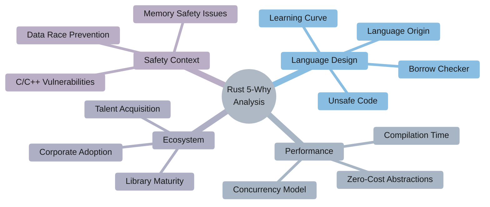
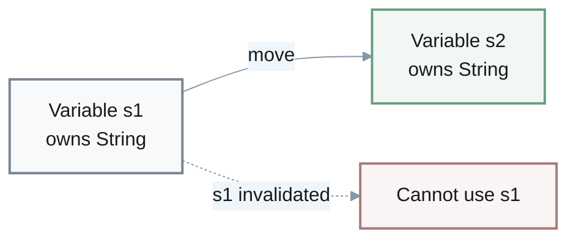
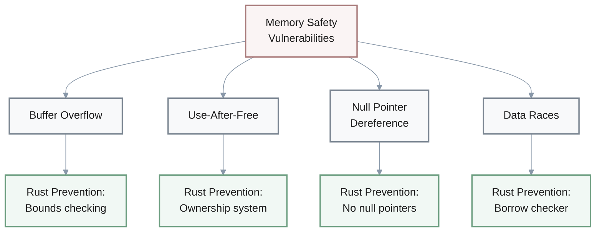
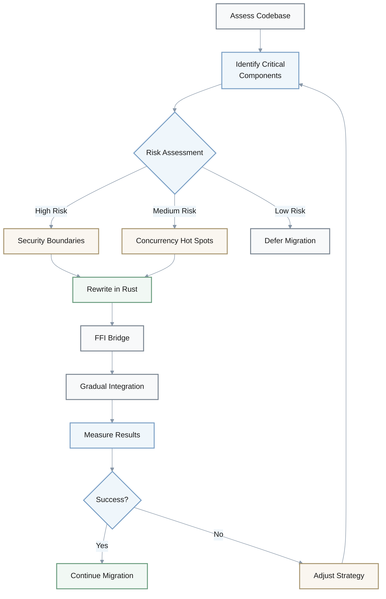
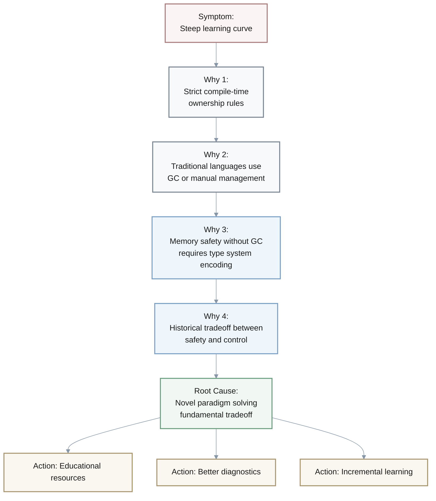
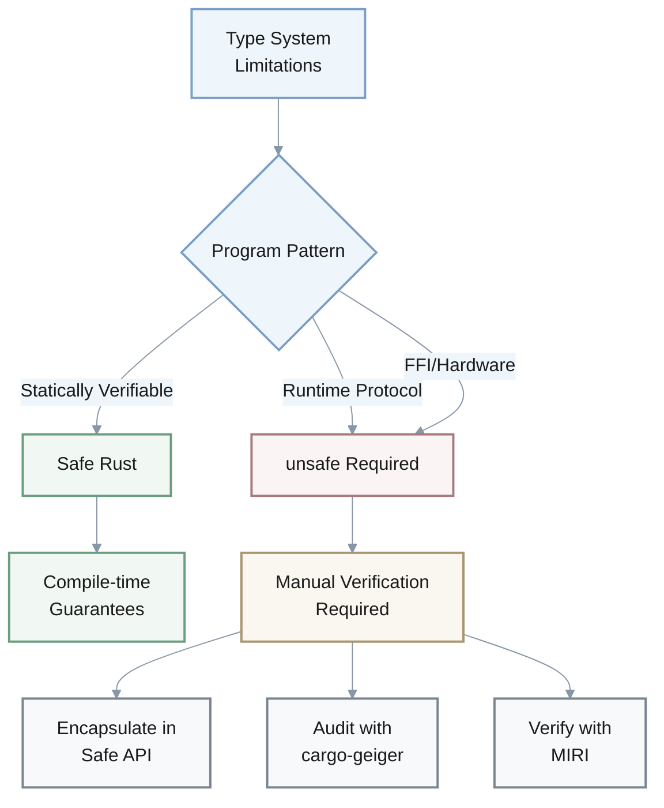
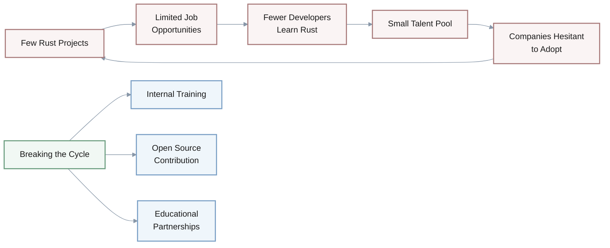
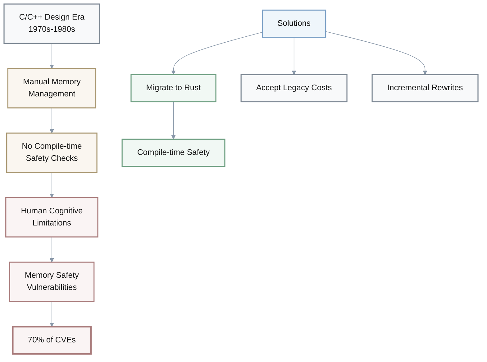
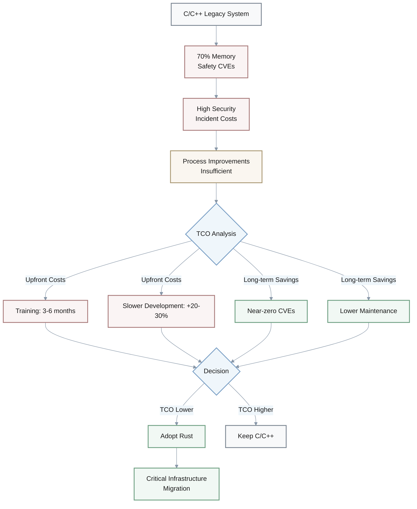
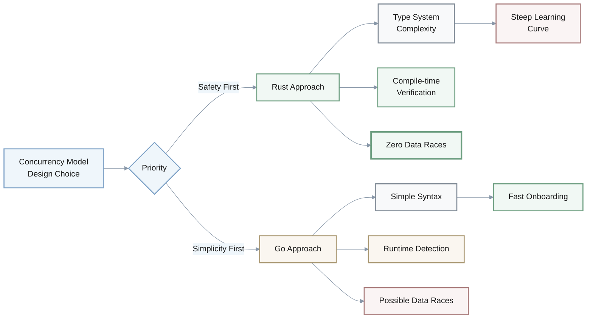

# Rust Programming Language - 5-Why Analysis
*Last Updated: 2025-11-26 | Status: Draft | Owner: Knowledge System*

## Overview

**Purpose**: Trace decision-critical problems in Rust programming language adoption and design from observable symptoms to actionable root causes using 5-Why methodology.

**Scope**: Covers learning curve, compilation performance, unsafe code necessity, talent acquisition, memory safety context, ecosystem maturity, corporate adoption drivers, borrow checker limitations, language origin, and concurrency model tradeoffs.

**Timeline**: Analysis conducted 2025-11-26; reflects Rust ecosystem state as of **Rust 1.83** (November 2024) and **10 years** post-1.0 release (May 2015).

**Target Audience**: 
- Engineering leaders evaluating Rust adoption
- Systems programmers transitioning to Rust
- Technical decision-makers assessing language tradeoffs

**Assumptions**: 
- Readers have familiarity with systems programming concepts (memory management, concurrency)
- Organizations prioritize long-term maintenance costs and security over short-term development velocity
- Analysis focuses on production systems requiring C/C++ level performance (not application domains where garbage collection is acceptable)

**Constraints**: Analysis limited to publicly available information; does not cover proprietary compiler optimizations or internal corporate metrics; focuses on general-purpose systems programming (excludes domain-specific contexts like kernel development or embedded systems without std).

**Resources Required for Adoption**:
- **Training**: 3-6 months developer training for experienced systems programmers
- **Learning resources**: The Rust Book, Rustlings, Brown University CS1010
- **Infrastructure**: LLVM toolchain, CI/CD integration for cargo workflows

**Source**: [Source: Rust Programming Language.md] [Source: [crit] Rust Programming Language.md] [Source: [prac] Rust Programming Language.md]

---



## Table of Contents

1. [Key Terms Glossary](#key-terms-glossary)
2. [Practical Tools & Resources](#practical-tools--resources)
3. [5-Why Analysis Questions](#5-why-analysis-questions)
   - [Learning Curve Challenges](#1-learning-curve-challenges-critical)
   - [Compilation Time Performance](#2-compilation-time-performance-important)
   - [Unsafe Code Necessity](#3-unsafe-code-necessity-critical)
   - [Talent Acquisition Challenges](#4-talent-acquisition-challenges-important)
   - [Memory Safety Context in C/C++](#5-memory-safety-context-in-cc-critical)
   - [Ecosystem Maturity](#6-ecosystem-maturity-important)
   - [Corporate Adoption Drivers](#7-corporate-adoption-drivers-critical)
   - [Borrow Checker Limitations](#8-borrow-checker-limitations-important)
   - [Language Origin Motivation](#9-language-origin-motivation-critical)
   - [Concurrency Model Tradeoffs](#10-concurrency-model-tradeoffs-critical)
4. [Success Criteria](#success-criteria)
5. [References](#references)

## Key Terms Glossary

### Core Concepts

**Ownership**: Rust's core memory management paradigm where each value has a single owner variable, and the value is dropped when the owner goes out of scope. Ownership can be transferred (moved) but not duplicated.

```rust
let s1 = String::from("hello");
let s2 = s1; // s1 moved to s2; s1 is now invalid
// println!("{}", s1); // ERROR: s1 was moved
```



**Borrowing**: A mechanism allowing temporary access to owned data without taking ownership, through references. Borrows can be immutable (multiple allowed) or mutable (exclusive access required).

```rust
let mut s = String::from("hello");
let r1 = &s; // immutable borrow
let r2 = &s; // multiple immutable borrows OK
// let r3 = &mut s; // ERROR: can't borrow as mutable while immutable borrows exist
```

| Borrow Type | Symbol | Multiple Allowed | Data Modification |
|-------------|--------|------------------|-------------------|
| **Immutable** | `&T` | ✅ Yes | ❌ No |
| **Mutable** | `&mut T` | ❌ No (exclusive) | ✅ Yes |

**Borrow Checker**: Rust's compile-time analysis system that enforces ownership and borrowing rules to guarantee memory safety without runtime overhead.

**Lifetimes**: Annotations that specify how long references remain valid, allowing the compiler to verify that references never outlive the data they point to.

**Unsafe Code**: Code blocks marked with the `unsafe` keyword that bypass Rust's safety guarantees, allowing operations like raw pointer dereferencing that the compiler cannot verify as safe.

```rust
let x = 5;
let raw_ptr = &x as *const i32;
unsafe {
    println!("Value: {}", *raw_ptr); // Dereferencing raw pointer requires unsafe
}
```

**Zero-Cost Abstraction**: Design principle where high-level abstractions compile to machine code as efficient as hand-written low-level code, with no runtime performance penalty.

$$
\text{Runtime Cost (high-level)} = \text{Runtime Cost (low-level)} \implies \text{Cost} = 0
$$

### Safety Concepts

**Memory Safety**: Guarantee that programs cannot access invalid memory, including prevention of buffer overflows, use-after-free bugs, null pointer dereferences, and data races.

```cpp
// C++: Use-after-free vulnerability (compiles, crashes at runtime)
std::string* ptr = new std::string("hello");
delete ptr;
std::cout << *ptr; // Undefined behavior: accessing freed memory
```

```rust
// Rust: Equivalent code prevented at compile time
let s = String::from("hello");
drop(s); // Explicitly free
// println!("{}", s); // ERROR: value used after move
```



### Type System Concepts

**Type System**: Formal system that assigns types to program elements and enforces rules about how they can interact, used in Rust to encode and verify safety properties at compile time.

**Trait**: Rust's mechanism for defining shared behavior (similar to interfaces), specifying method signatures that types must implement.

**Send/Sync**: Marker traits indicating whether a type can be safely transferred across thread boundaries (`Send`) or accessed from multiple threads simultaneously (`Sync`).

| Trait | Meaning | Example Use Case |
|-------|---------|------------------|
| **Send** | Safe to transfer ownership between threads | Moving data to spawned thread |
| **Sync** | Safe to share references between threads | Shared read-only data |

**Monomorphization**: Compiler process of generating specialized concrete implementations for each combination of generic type parameters used in the program, enabling zero-cost abstractions but increasing compilation time and binary size.

$$
\text{Compilation Time} \propto \text{Number of Generic Instantiations} \times \text{Complexity per Instance}
$$

---

## Practical Tools & Resources

### Learning Resources
*Reduce learning curve friction*

| Resource | Type | Focus Area |
|----------|------|------------|
| **The Rust Book** | Official guide | Ownership, borrowing, lifetimes |
| **Rustlings** | Interactive exercises | Hands-on practice |
| **Brown University CS1010** | Course materials | Ownership visualizations |
| **Rust by Example** | Code examples | Common patterns |
| **`cargo clippy`** | Linting tool | Idiomatic patterns |

### Development Workflow
*Address compilation time*

- **`cargo check`**: Fast syntax/type checking without full compilation (~5x faster than `cargo build`)
- **`cargo watch`**: Auto-runs check on file changes for rapid feedback
- **`sccache`** / **`cargo-nextest`**: Distributed caching and parallel testing to reduce CI times
- **Incremental compilation**: Enabled by default, only recompiles changed modules
- **Workspace structure**: Structure projects as workspaces with small crates to minimize recompilation scope

> **Performance Tip**: Use `cargo check` during development for rapid feedback, reserve `cargo build` for integration testing.

### Safety Verification
*Manage unsafe code*

| Tool | Purpose | Usage |
|------|---------|-------|
| **`cargo-geiger`** | Audit unsafe code | Shows unsafe usage percentage |
| **MIRI** | Detect UB | Interprets and validates unsafe code |
| **`cargo-audit`** | Security scanning | Checks for known CVEs |
| **`cargo-crev`** | Code review | Distributed trust system |

**Best Practice**: Encapsulate unsafe behind safe APIs with documented invariants.

### Migration Strategies
*Adoption pragmatics*



**Key Strategies**:
- **Incremental approach**: Rewrite critical components first (security boundaries, concurrency hot spots)
- **FFI bridge**: Use `cbindgen`/`cxx` crate for C/C++ interop during gradual migration
- **Risk assessment**: Prioritize modules with highest memory safety incident costs
- **Timeline**: Allow 2x initial development time; expect productivity parity after team's second project
- **Measurement**: Track defect density, security incidents, time-to-production before/after

### Borrow Checker Navigation
*Overcome limitations*

**Common Patterns**:

1. **Split borrows**: Access different struct fields independently
   ```rust
   struct Data { field1: i32, field2: i32 }
   let d = &mut data;
   process(&mut d.field1, &d.field2); // OK: different fields
   ```

2. **Interior mutability**: `RefCell` for runtime borrowing, `Cell` for copy types
   ```rust
   use std::cell::RefCell;
   let data = RefCell::new(5);
   *data.borrow_mut() += 1; // Runtime borrow checking
   ```

3. **Shared ownership**: `Rc`/`Arc` with `Mutex`/`RwLock` for concurrent access
   ```rust
   use std::sync::{Arc, Mutex};
   let shared = Arc::new(Mutex::new(data));
   ```

**Debugging Tools**:
- **`cargo-expand`**: Shows macro expansions and lifetime elision for debugging compiler errors
- **API Design**: Design APIs that accept `&T` or `&mut T` rather than owned types to maximize flexibility

---

## 5-Why Analysis Questions

### 1. Learning Curve Challenges [**CRITICAL**]

**Q**: Developers report that Rust has a significantly steeper learning curve compared to languages like Python, Go, or even C++, particularly struggling with ownership and borrowing concepts. Use 5-Why analysis to identify the root cause.

**A**: 



**Analysis**:
- **Symptom**: Developers find Rust difficult to learn, especially the ownership and borrowing model, leading to extended onboarding time and initial frustration.
- **Why 1**: Because Rust's ownership system enforces strict compile-time rules about memory management that differ fundamentally from most programming languages (because developers must learn to think about single ownership, borrowing rules, and lifetimes—concepts absent or implicit in languages with garbage collection or manual memory management).
- **Why 2**: Because traditional systems languages (C/C++) delegate memory safety responsibility to developers at runtime with manual management, while high-level languages use garbage collectors, neither requiring developers to understand or work with compile-time ownership constraints (because these languages prioritize either low-level control without safety guarantees or safety through runtime overhead).
- **Why 3**: Because achieving memory safety without garbage collection or runtime overhead requires encoding resource management rules directly into the type system and enforcing them at compile time (because this is the only way to guarantee safety statically without performance penalties).
- **Why 4**: Because the historical tradeoff in programming language design has been between safety and control—languages either provided memory safety through garbage collection (sacrificing determinism and performance) or gave low-level control without safety guarantees (accepting memory vulnerabilities) (because no mainstream language had successfully unified both until Rust).
- **Root Cause**: The learning curve stems from Rust introducing a novel paradigm that solves a fundamental tradeoff—achieving zero-cost memory safety by encoding ownership rules in the type system—which requires developers to adopt entirely new mental models about memory management that don't exist in their prior experience with either manual memory management or garbage-collected languages. This is actionable because the difficulty is inherent to the innovative solution itself, and mitigation strategies should focus on improved educational resources, better compiler diagnostics, and incremental learning paths rather than simplifying the model.

---

### 2. Compilation Time Performance [**IMPORTANT**]

**Q**: Rust compilation times are notably slower than C/C++ and significantly slower than interpreted languages' startup time, causing developer friction during iterative development. Use 5-Why analysis to identify the root cause.

**A**:

**Compilation Time Comparison**:

| Language | Relative Speed | Checks Performed |
|----------|---------------|------------------|
| **Python/JS** | Instant | Runtime only |
| **Go** | Very fast | Basic type checking |
| **C/C++** | Fast | Type checking, optimization |
| **Rust** | Slow | + Safety + Monomorphization |

**Analysis**:
- **Symptom**: Rust projects experience longer compilation times compared to similar C/C++ projects, impacting development velocity and iteration speed.
- **Why 1**: Because the Rust compiler performs extensive static analysis including borrow checking, lifetime inference, trait resolution, and exhaustive safety verification at compile time (because all memory safety guarantees must be proven before code execution).
- **Why 2**: Because Rust's safety model requires the compiler to track ownership, validate all references don't outlive their data, ensure no data races exist, and verify complex trait bounds—analysis that C/C++ compilers don't perform (because C/C++ defer these checks to runtime or developer responsibility).
- **Why 3**: Because Rust's zero-cost abstraction guarantee means all safety checks and monomorphization (generating concrete implementations for each generic type) must happen at compile time rather than runtime (because runtime checks would violate the performance parity goal with C/C++).
- **Why 4**: Because Rust's design prioritizes preventing entire classes of bugs at compile time over fast compilation, trading developer wait time during development for elimination of runtime errors and debugging time (because the language philosophy values correctness and safety over compilation speed).
- **Root Cause**: Slow compilation is a fundamental consequence of Rust's core value proposition—providing C/C++ level performance with compile-time memory safety guarantees requires extensive static analysis, monomorphization, and verification that cannot be deferred to runtime without violating the zero-cost abstraction principle. This is actionable because it clarifies that compilation speed improvements must come from compiler engineering optimizations (incremental compilation, parallel compilation, caching) rather than reducing safety checks, and developers should structure projects to minimize recompilation and use tools like `cargo check` for faster feedback during development.

> **Tradeoff**: Rust trades compilation time for runtime safety and debugging time savings.

---

### 3. Unsafe Code Necessity [**CRITICAL**]

**Q**: Rust developers must use `unsafe` blocks for certain low-level operations, introducing potential memory safety vulnerabilities despite Rust's safety promises. Use 5-Why analysis to identify the root cause.

**A**:

**When `unsafe` is Required**:
- **Hardware access**: Direct memory-mapped I/O
- **FFI**: Calling C libraries
- **Low-level data structures**: Intrusive lists, self-referential types
- **Lock-free algorithms**: Concurrent data structures
- **Performance optimizations**: Bypassing bounds checks

**Analysis**:
- **Symptom**: Rust requires `unsafe` blocks for operations like raw pointer dereferencing, calling C functions, and implementing certain low-level data structures, creating safety holes in an otherwise safe language.
- **Why 1**: Because certain systems programming operations—like direct hardware access, FFI with C libraries, and performance-critical optimizations—require control over memory layout and access patterns that cannot be expressed within Rust's safe ownership rules (because these operations inherently involve patterns the compiler cannot statically verify).
- **Why 2**: Because Rust's safe subset relies on compile-time provable invariants (single ownership, no aliasing of mutable data), but some legitimate programming patterns—like intrusive data structures, self-referential types, or lock-free algorithms—fundamentally require shared mutable access or aliasing that violates these invariants (because these patterns depend on runtime protocols that the type system cannot encode).
- **Why 3**: Because static type systems have fundamental expressiveness limitations—they cannot capture all correct programs without either rejecting valid safe code (too restrictive) or accepting unsafe code (too permissive), a consequence of the undecidability of program correctness (because proving arbitrary program properties at compile time is mathematically impossible).
- **Why 4**: Because Rust must remain practical for systems programming, requiring interoperability with existing C codebases, direct hardware access, and performance-critical optimizations that depend on memory layout guarantees—capabilities that cannot be safely abstracted without performance penalties or expressiveness limitations (because systems programming inherently requires escaping high-level abstractions).
- **Root Cause**: The need for `unsafe` is rooted in the incompleteness theorem of type systems—no static type system can capture all safe programs while remaining decidable and practical, and systems programming requires capabilities that fundamentally cannot be proven safe at compile time (hardware access, FFI, certain concurrent patterns). This is actionable because it establishes that `unsafe` is irreducible for a practical systems language, and the appropriate response is to minimize unsafe code surface area, encapsulate it behind safe abstractions, provide tools for auditing unsafe code, and develop formal verification methods for critical unsafe sections rather than attempting to eliminate unsafe entirely.



> **Key Insight**: `unsafe` is not a bug but a necessary escape hatch for the undecidability of static analysis.

---

### 4. Talent Acquisition Challenges [**IMPORTANT**]

**Q**: Despite Rust's technical advantages in safety and performance, many companies face significant challenges adopting Rust due to difficulty finding proficient developers and high training costs. Use 5-Why analysis to identify the root cause.

**A**:

**Developer Adoption Statistics** (2024):

| Language | Professional Usage | Years Since Stable | Training Time |
|----------|-------------------|-------------------|---------------|
| **Java** | 30%+ | 29 years | 2-4 weeks |
| **C++** | 20%+ | 39 years | 3-6 months |
| **Rust** | 2.8% | 9.5 years | 3-6 months |

**Analysis**:
- **Symptom**: Organizations interested in Rust adoption struggle to find experienced Rust developers in the job market and face extended training periods for existing teams, creating adoption friction.
- **Why 1**: Because Rust is a relatively young language (stable 1.0 release: May 15, 2015) compared to C++ (1985) or Java (1995), resulting in a smaller pool of developers with production experience—as of 2024, approximately 2.8% of professional developers use Rust vs. 20%+ for C++ and 30%+ for Java (because fewer developers have had the opportunity and incentive to invest time mastering Rust).
- **Why 2**: Because Rust's steep learning curve and paradigm shift in memory management concepts mean that even experienced systems programmers require substantial time investment to become proficient—estimated 3-6 months to productivity vs. 2-4 weeks for similar C++ developers learning Go, with studies showing Rust's ownership model is challenging even for C++ experts (because prior experience with manual memory management or garbage collection doesn't directly transfer to ownership-based reasoning).
- **Why 3**: Because educational institutions and coding bootcamps have been slow to incorporate Rust into curricula, focusing instead on established industry languages with larger job markets and more teaching resources (because academic adoption lags industry demand, and Rust's complexity makes it challenging to teach in introductory courses).
- **Why 4**: Because the network effect in programming languages creates a self-reinforcing cycle: fewer Rust projects mean fewer opportunities to gain experience, which means fewer experienced developers, which makes companies hesitant to adopt Rust, which limits new projects (because rational developers invest in learning languages with clear career paths and abundant job opportunities).
- **Root Cause**: The talent scarcity problem stems from the cold-start problem in language ecosystems—Rust's relative youth combined with its steep learning curve creates a chicken-and-egg situation where limited adoption constrains talent development, which in turn constrains adoption. This is actionable because it identifies specific intervention points: companies can invest in internal training programs and allocate extra time for team ramp-up; the Rust Foundation can support educational initiatives and certification programs; organizations can contribute to open-source Rust projects to build internal expertise; and hiring strategies should value learning capacity and systems programming fundamentals over specific Rust experience, recognizing that training investment will yield long-term benefits in code quality and maintenance costs.



> **Network Effect**: Language adoption is a chicken-and-egg problem requiring strategic investment to break the cycle.

---

### 5. Memory Safety Context in C/C++ [**CRITICAL**]

**Q**: Memory safety vulnerabilities (buffer overflows, use-after-free, null pointer dereferences) remain the leading cause of security issues in C/C++ codebases, accounting for approximately 70% of security patches in major software like Windows and Chrome [Microsoft Security Response Center, 2019; Google Chromium Blog, 2020]. Use 5-Why analysis to identify the root cause.

**A**:

**Memory Safety Vulnerability Impact**:

$$
\text{Security Patches (Memory Safety)} = 70\% \text{ of Total CVEs in C/C++ Systems}
$$

| Software | Memory Safety CVEs | Total CVEs | Percentage |
|----------|-------------------|------------|------------|
| **Windows** | ~70% | All security patches | 70% |
| **Chrome** | ~70% | All security bugs | 70% |
| **Major C/C++ Systems** | Majority | High severity | 60-80% |

**Analysis**:
- **Symptom**: C/C++ programs consistently exhibit memory safety vulnerabilities in production, causing security breaches and system crashes despite decades of awareness and developer training.
- **Why 1**: Because C/C++ delegate memory safety responsibility entirely to programmers, requiring manual tracking of pointer validity, buffer bounds, and object lifetimes without compile-time enforcement (because the languages provide no automatic memory management or safety checks beyond optional runtime bounds checking).
- **Why 2**: Because manually reasoning about memory safety in large codebases with complex control flow, concurrency, and evolving requirements exceeds human cognitive capacity—developers inevitably make mistakes about pointer aliasing, lifetime relationships, and boundary conditions (because informal reasoning about program invariants is error-prone, especially when code is modified by multiple developers over time).
- **Why 3**: Because C/C++ prioritize backwards compatibility, performance, and low-level control over safety guarantees, reflecting their design era (1970s-1980s) when memory safety was considered a performance-safety tradeoff—adding safety checks would introduce runtime overhead deemed unacceptable for systems programming (because the languages were designed in an era before formal memory models and when hardware resources were severely constrained).
- **Why 4**: Because C/C++ lack a formal memory model that could enable static verification tools to automatically prove memory safety properties, and retrofitting such a model would break decades of existing code that depends on undefined behavior (because the languages were not designed with formal verification in mind, and introducing breaking changes to fix fundamental design issues faces insurmountable compatibility constraints).
- **Why 5**: Because the historical context of C/C++ design predates the understanding that memory safety could be enforced at compile time without runtime overhead through type systems—techniques like affine types, borrow checking, and ownership semantics were developed in programming language research decades after C/C++ were established (because the theoretical foundations for zero-cost memory safety weren't developed until the 1990s-2000s, long after C/C++ had become entrenched).
- **Root Cause**: Memory safety vulnerabilities in C/C++ are a consequence of fundamental architectural decisions made in an era when the tradeoff between safety and performance was considered unavoidable, combined with the impossibility of retrofitting compile-time safety guarantees into languages designed around manual memory management without breaking backwards compatibility. The issue is systemic and architectural rather than due to developer negligence. This is actionable because it clarifies that solving memory safety requires either: (1) migrating to languages with safety-by-design like Rust for new projects and critical components, (2) accepting the ongoing cost of memory vulnerabilities in legacy C/C++ code while investing in sanitizers, fuzzing, and formal verification tools, or (3) gradually rewriting critical components in memory-safe languages—but attempting to make C/C++ developers "more careful" is not a viable long-term strategy given the fundamental cognitive and architectural limitations.



> **Critical Insight**: Developer training cannot solve architectural limitations—memory safety requires language-level guarantees.

---

### 6. Ecosystem Maturity [**IMPORTANT**]

**Q**: Rust's standard library and third-party crate ecosystem, while rapidly growing, remains less mature and comprehensive than C++ or Java ecosystems, sometimes requiring developers to implement functionality from scratch. Use 5-Why analysis to identify the root cause.

**A**:

**Ecosystem Comparison**:

| Language | Years Stable | Package Count | Developer Base |
|----------|-------------|---------------|----------------|
| **Java** | 29 years | ~500,000 (Maven) | 30%+ professionals |
| **C++** | 39 years | Extensive | 20%+ professionals |
| **Rust** | 9.5 years | ~140,000 (crates.io) | 2.8% professionals |

**Analysis**:
- **Symptom**: Developers choosing Rust for projects sometimes find missing or immature libraries for specific domains compared to established languages, increasing development effort and time-to-market.
- **Why 1**: Because Rust's ecosystem has had less time to mature—the language achieved stability only in May 2015, giving it 9.5 years of ecosystem development (as of November 2024) compared to C++'s 39 years or Java's 29 years, with crates.io hosting ~140,000 crates vs. Maven Central's ~500,000 Java packages (because library ecosystems grow organically over decades as developers solve domain-specific problems).
- **Why 2**: Because the size of an ecosystem correlates strongly with the number of active developers and production deployments—with a smaller developer community and fewer deployed projects, Rust has fewer contributors creating and maintaining domain-specific libraries (because library development is driven by actual need in production systems, not just interest).
- **Why 3**: Because Rust's safety guarantees and ownership model sometimes make certain library patterns more complex to implement idiomatically compared to garbage-collected or manual memory management languages—APIs that are straightforward in C++ or Java may require redesign to work ergonomically with Rust's borrowing rules (because safe abstractions over complex resource management patterns require careful API design to avoid forcing users into frequent cloning or unsafe code).
- **Why 4**: Because network effects dominate programming language adoption—libraries beget applications which beget more developers which beget more libraries, and this positive feedback loop takes time to accelerate, particularly for a language with a steeper learning curve (because developers rationally choose languages with existing solutions to their problems, creating momentum that favors established ecosystems).
- **Root Cause**: Ecosystem maturity is primarily a function of time, community size, and the cumulative investment of developer hours solving real-world problems—Rust's younger age and smaller (though rapidly growing) community mean it has had less opportunity to accumulate domain-specific libraries across all possible use cases, a gap that can only be closed through continued adoption and community contribution. This is actionable because it indicates that ecosystem gaps will naturally close with time and growth, and organizations can accelerate this by: (1) contributing internal libraries back to the open-source community, (2) investing in developing missing libraries for their domains rather than waiting for community solutions, (3) supporting maintainers of critical libraries financially or with engineering time, and (4) focusing Rust adoption on domains where the ecosystem is already mature (systems programming, web services, CLI tools, embedded systems) while being prepared for additional development effort in less-mature domains.

> **Growth Pattern**: Ecosystem maturity is a time function—Rust's rapid growth (140K crates in 9.5 years) suggests strong trajectory.

---

### 7. Corporate Adoption Drivers [**CRITICAL**]

**Q**: Companies like Microsoft, Google, and AWS are heavily investing in Rust adoption despite the steep learning curve and ecosystem immaturity, even rewriting critical system components. Use 5-Why analysis to identify the root cause.

**A**:

**Total Cost of Ownership (TCO) Analysis**:

| Cost Factor | C/C++ | Rust |
|-------------|-------|------|
| **Initial Development** | Baseline | +20-30% slower |
| **Training** | Low | High (3-6 months) |
| **Memory Safety Bugs** | 70% of CVEs | ~0% in safe code |
| **Security Incidents** | High ongoing cost | Near-zero after dev |
| **Maintenance** | High technical debt | Lower long-term |
| **Long-term TCO** | Higher | Lower |

**Analysis**:
- **Symptom**: Major tech companies are investing significant resources to train developers and migrate critical infrastructure to Rust, incurring substantial upfront costs.
- **Why 1**: Because memory safety vulnerabilities constitute approximately 70% of security issues in their existing C/C++ codebases, causing security breaches, patches, incident response costs, and reputational damage (because memory bugs in production systems have direct business impact in terms of security, reliability, and maintenance costs).
- **Why 2**: Because traditional mitigation strategies—developer training, code reviews, sanitizers, fuzzing—have proven insufficient to eliminate memory safety bugs in large-scale C/C++ systems, as evidenced by decades of persistent vulnerabilities despite these efforts (because manual memory management fundamentally exceeds human cognitive capacity in complex systems, making errors inevitable rather than preventable through process improvements).
- **Why 3**: Because the total cost of ownership for software includes not just initial development but ongoing maintenance, security patching, incident response, and technical debt—and memory safety bugs create disproportionate long-term costs relative to upfront prevention (because a single security vulnerability can cost millions in breach response, while preventing it at compile time has near-zero marginal cost after initial development).
- **Why 4**: Because Rust uniquely solves the fundamental tradeoff that has constrained systems programming for decades: it provides memory safety guarantees without garbage collection overhead, maintaining C/C++ level performance while eliminating entire bug classes at compile time (because no other production-ready language offers this specific combination of safety, performance, and control required for systems programming).
- **Root Cause**: Major companies are adopting Rust because they have reached the limits of incremental improvements to C/C++ development practices and calculated that the total cost of ownership for Rust—including training costs, slower initial development, and ecosystem gaps—is lower than the ongoing cost of memory vulnerabilities in critical infrastructure, especially as their systems scale and attack surfaces expand. This investment represents a strategic bet that compile-time safety is the only sustainable long-term solution to memory safety in performance-critical systems. This is actionable because it provides a decision framework for organizations evaluating Rust adoption: focus on critical infrastructure where memory safety bugs have the highest impact (kernels, network stacks, security components), calculate total cost of ownership including security incident costs rather than just development time, plan for extended training periods and initial productivity loss, and pursue incremental migration strategies that allow teams to build expertise gradually rather than requiring full rewrites.



$$
\text{TCO (Rust)} = \text{Training} + \text{Dev Overhead} + \text{Security Costs} < \text{TCO (C/C++)}
$$

> **Business Case**: Rust adoption is a strategic investment where upfront costs are offset by elimination of ongoing security incident costs.

---

### 8. Borrow Checker Limitations [**IMPORTANT**]

**Q**: Rust's borrow checker frequently rejects valid, safe code that developers know would work correctly, forcing them to restructure their programs or resort to workarounds like cloning data or using reference counting. Use 5-Why analysis to identify the root cause.

**A**:

**Soundness vs. Completeness Tradeoff**:

| Property | Definition | Rust's Choice |
|----------|------------|---------------|
| **Sound** | Accepts only safe programs | ✅ Yes |
| **Complete** | Accepts all safe programs | ❌ No |
| **Tradeoff** | Can't have both with decidable analysis | Sound over Complete |

**Analysis**:
- **Symptom**: Developers encounter compiler errors from the borrow checker in situations where they can reason that their code is memory-safe, leading to frustration and perception that Rust is "fighting" the programmer.
- **Why 1**: Because Rust's borrow checker uses conservative static analysis that must accept only programs it can prove safe at compile time, rejecting some safe programs it cannot verify (because the compiler lacks runtime information and must reason only from the program's static structure).
- **Why 2**: Because Rust's ownership rules are intentionally simple and uniform—enforcing that mutable references cannot alias and references cannot outlive their data—which enables fast compile-time checking but cannot express all safe patterns (because more expressive rules would require more complex analysis, increasing compilation time and making compiler errors harder to understand).
- **Why 3**: Because certain safe patterns depend on runtime invariants or protocols that cannot be encoded in Rust's type system—for example, data structures maintaining internal pointer validity through careful API design, or deadlock-free locking orders that depend on runtime values (because static type systems have fundamental limitations in expressing dynamic properties, a consequence of the halting problem).
- **Why 4**: Because Rust deliberately chooses to be conservative in its safety analysis rather than permissive—prioritizing the guarantee that all code accepted by the borrow checker is definitely safe, even if this means rejecting some safe code (because false positives in safety checking would violate Rust's core safety guarantees, while false negatives merely require developers to use alternative patterns or unsafe blocks).
- **Root Cause**: The borrow checker's conservatism is a fundamental consequence of the undecidability of program correctness—no static analysis can perfectly distinguish all safe programs from all unsafe programs, forcing a tradeoff between accepting some unsafe code (unsound) or rejecting some safe code (incomplete). Rust chooses incompleteness to preserve soundness, prioritizing "if it compiles, it's safe" over "all safe code compiles." This is actionable because it clarifies that borrow checker frustration is an inherent limitation of static analysis rather than a fixable bug, and the appropriate responses are: (1) learning idiomatic patterns that work within the borrow checker's rules (APIs designed for borrowing, splitting borrows), (2) using escape hatches like `RefCell`, `Mutex`, or reference counting when runtime flexibility is needed, (3) encapsulating complex ownership patterns behind safe APIs that use unsafe internally, and (4) advocating for targeted extensions to the borrow checker (like polonius or view types) that expand expressiveness without compromising soundness or complexity.

> **Fundamental Tradeoff**: Borrow checker rejects some safe code to guarantee "if it compiles, it's memory safe"—soundness over completeness.

---

### 9. Language Origin Motivation [**CRITICAL**]

**Q**: Mozilla's original motivation for creating Rust was frustration with memory management issues in systems programming languages, particularly when developing the Servo browser engine. Use 5-Why analysis to identify the root cause.

**A**:

**Browser Engine Requirements**:
- **Performance**: C/C++ level (no GC pauses)
- **Safety**: Memory safety + data race freedom
- **Concurrency**: Massive parallelism for rendering
- **Security**: Process untrusted input safely

**Existing Language Gaps**:

| Language | Performance | Memory Safety | Data Race Freedom | Verdict |
|----------|-------------|---------------|-------------------|---------|
| **C++** | ✅ Excellent | ❌ Manual | ❌ Manual | Unsafe |
| **Java/C#** | ❌ GC pauses | ✅ Yes | ⚠️ Runtime | Too slow |
| **Go** | ⚠️ GC overhead | ✅ Yes | ⚠️ Runtime | Too slow |
| **Rust** | ✅ Excellent | ✅ Compile-time | ✅ Compile-time | ✅ Fills gap |

**Analysis**:
- **Symptom**: Mozilla Research invested in creating an entirely new programming language rather than using existing systems languages like C++ for the Servo browser project.
- **Why 1**: Because browser engines are highly complex, parallel systems where memory safety bugs (crashes, security vulnerabilities) and data races have severe consequences for user security and experience, and existing languages made preventing these issues extremely difficult (because browsers process untrusted input, require extreme performance, and run massively parallel workloads).
- **Why 2**: Because C++, the standard language for browser development, provides no compile-time prevention of data races or memory safety violations—developers must manually ensure thread safety and memory correctness in codebases with millions of lines and hundreds of contributors (because C++ lacks a memory model that prevents data races and relies on manual memory management).
- **Why 3**: Because traditional solutions to these problems in C++—extensive code review, testing, sanitizers, and runtime checks—were proving insufficient to prevent critical bugs from reaching production, despite Mozilla's significant investment in these practices (because manual verification scales poorly with codebase size and complexity, and testing cannot cover all execution paths).
- **Why 4**: Because alternative high-level languages with better safety guarantees (Java, C#, Go) use garbage collection, which introduces unpredictable latency unacceptable for browser rendering performance—meeting performance requirements while ensuring safety seemed to require choosing between contradictory goals (because the conventional wisdom was that automatic memory safety required garbage collection overhead).
- **Root Cause**: Mozilla created Rust because the existing systems programming language landscape offered no solution to the fundamental tension between performance requirements (requiring low-level control), safety requirements (requiring automatic verification of memory safety and data race freedom), and concurrency requirements (requiring efficient parallelism)—all simultaneously critical for modern browser engines. This represents a gap in the programming language design space that no existing production language filled. This is actionable because it explains why Rust exists as a distinct language rather than an evolution of C++—the design requirements (compile-time safety verification without runtime overhead) required fundamentally different semantic foundations (ownership, borrowing, lifetimes) that cannot be retrofitted into languages designed around different memory models. Organizations facing similar constraints—systems requiring both C-level performance and high security assurance in concurrent environments—represent Rust's core target audience and strongest value proposition.

> **Design Space Gap**: Rust fills the unique niche of "C/C++ performance + compile-time safety"—a combination no prior language offered.

---

### 10. Concurrency Model Tradeoffs [**CRITICAL**]

**Q**: Rust prevents data races at compile time while languages like Go, which also emphasize concurrency, still allow data races despite having a garbage collector and lightweight goroutines. Use 5-Why analysis to identify the root cause.

**A**:

**Concurrency Safety Comparison**:

| Language | Data Race Prevention | Mechanism | Developer Experience | Tradeoff |
|----------|---------------------|-----------|---------------------|----------|
| **Rust** | Compile-time | `Send`/`Sync` traits, ownership | Steep learning curve | Safety first |
| **Go** | Runtime detection | Race detector (opt-in) | Simple, ergonomic | Simplicity first |

**Design Philosophy Contrast**:

| Aspect | Rust | Go |
|--------|------|-----|
| **Verification** | Compile-time static | Runtime dynamic |
| **Type System** | Complex (tracks aliasing) | Simple (no aliasing tracking) |
| **Sharing Model** | Difficult by default | Easy by default |
| **Error Detection** | Before deployment | During testing/production |
| **Priority** | Safety guarantees | Developer productivity |

**Analysis**:
- **Symptom**: Rust programs are guaranteed free of data races in safe code, while concurrent Go programs can experience data races that must be detected through runtime race detectors or testing.
- **Why 1**: Because Rust's type system encodes and enforces aliasing restrictions—ensuring that mutable data cannot be accessed from multiple threads simultaneously—while Go's type system does not track or restrict how references are shared across goroutines (because Rust uses borrowing rules that are checked at compile time, whereas Go relies on developer discipline and runtime detection).
- **Why 2**: Because Rust's ownership model requires proving at compile time that either only one thread has mutable access or multiple threads have read-only access to shared data, enforced through types like `Mutex`, `Arc`, and borrowing rules, while Go allows arbitrary sharing of mutable references across goroutines without compile-time verification (because Rust's design philosophy prioritizes compile-time verification of concurrency safety, while Go prioritizes ease of use and simple concurrency primitives).
- **Why 3**: Because preventing data races statically requires tracking which references can be aliased and whether they're mutable—information that must be encoded in the type system and checked at every reference creation and use—which adds significant type system complexity that Go's designers deliberately avoided (because Go's design philosophy emphasizes simplicity and fast compilation over maximum static guarantees).
- **Why 4**: Because Rust and Go make different fundamental tradeoffs in their concurrency models: Rust chooses to make data sharing difficult by default (requiring explicit `Send`/`Sync` traits and wrapper types) to enable static verification, while Go chooses to make concurrency easy by default (share-by-default with lightweight goroutines) accepting that data races are possible and must be caught dynamically (because the languages target different points on the safety-vs-simplicity spectrum).
- **Root Cause**: The difference stems from irreconcilable design philosophies and tradeoffs made early in each language's development: Rust prioritizes "fearless concurrency" through static verification at the cost of learning curve and type system complexity, while Go prioritizes developer productivity and simple concurrency patterns at the cost of accepting runtime errors for concurrency bugs. This represents a fundamental tradeoff in programming language design—static safety guarantees require encoding invariants in the type system which increases complexity, while simplicity requires deferring some checks to runtime. This is actionable because it clarifies that Rust's data race freedom is not a feature that can be easily added to other languages—it requires the entire ownership and borrowing system as a foundation—and organizations choosing between Rust and Go should evaluate whether they prioritize preventing concurrency bugs at compile time (Rust) or faster development with simpler concurrency patterns and runtime race detection (Go), based on their specific domain requirements and risk tolerance.



> **Irreconcilable Tradeoff**: Static concurrency safety requires type system complexity—Rust and Go chose opposite ends of the safety-simplicity spectrum.

---

---

## Success Criteria

**Understanding Metrics** (evaluate comprehension):
- ☐ Reader can explain why Rust's learning curve is inherent to its solution rather than a fixable problem
- ☐ Reader can articulate the fundamental tradeoff between safety, performance, and control that Rust addresses
- ☐ Reader can identify when Rust is appropriate vs. when alternatives are better

**Decision Metrics** (evaluate practical application):
- ☐ Engineering leaders can calculate total cost of ownership (TCO) including training time (3-6 months/developer), reduced security incidents (70% fewer memory vulnerabilities), and maintenance savings
- ☐ Teams can identify which components benefit from Rust adoption: systems requiring C/C++ performance + high security assurance + concurrency
- ☐ Organizations can create realistic migration plans with staged rollout (6-18 months for critical components)

**Baseline vs. Target**:
- **Baseline**: Decision based on "Rust is trendy" or "Rust is hard" without understanding root causes
- **Target**: Evidence-based decision incorporating TCO analysis, team capabilities, domain fit, and strategic value of compile-time safety guarantees
- **Measurement**: Decision documentation references specific tradeoffs and quantified business impact

**Limitations & When NOT to Use Rust**:
- **Rapid prototyping**: Initial development 20-30% slower than Python/Go; use when correctness > speed-to-market
- **Small codebases (<10K LOC)**: Training investment may exceed benefits; consider Go or TypeScript
- **GC-acceptable domains**: Web backends, data processing where GC pauses are tolerable (use Go, Java, Python)
- **Immature ecosystem domains**: GUI frameworks, scientific computing, game engines (as of 2024—verify current state)
- **Team constraints**: Teams without systems programming background require 6+ months; consider if timeline allows
- **FFI-heavy projects**: Interop with existing C/C++ may negate safety benefits if extensive `unsafe` required

**Alternative Decision Matrix**:

| Requirement | Rust | C++ | Go | Java/C# |
|------------|------|-----|----|----|
| Memory safety | ✅ Compile-time | ❌ Manual | ✅ GC | ✅ GC |
| Performance | ✅ Zero-cost | ✅ Zero-cost | ⚠️ GC overhead | ⚠️ GC overhead |
| Concurrency safety | ✅ Compile-time | ❌ Manual | ⚠️ Runtime detection | ⚠️ Runtime detection |
| Learning curve | ⚠️ 3-6 months | ⚠️ 3-6 months | ✅ 2-4 weeks | ✅ 2-4 weeks |
| Ecosystem maturity | ⚠️ 9.5 years | ✅ 39 years | ✅ 15 years | ✅ 29 years |
| Compile time | ⚠️ Slow | ✅ Fast | ✅ Very fast | ✅ Fast |

---

## References

**Memory Safety Statistics**:
- Microsoft Security Response Center (2019). "A proactive approach to more secure code." [Reported ~70% of CVEs are memory safety issues]
- Google Chromium Blog (2020). "Chrome: 70% of all security bugs are memory safety issues."
- NSA Cybersecurity Information Sheet (2022). "Software Memory Safety."

**Rust Ecosystem Data**:
- crates.io (November 2024). Package registry statistics: ~140,000 total crates.
- Stack Overflow Developer Survey (2024). Rust usage: 2.8% of professional developers; 13th most used language.
- Rust Foundation Annual Report (2024). Production adoption metrics.

**Language Design & History**:
- Matsakis, N. & Klock, F. (2014). "The Rust Language." ACM SIGAda Ada Letters, 34(3), 103-104.
- Mozilla Research (2010-2015). Servo Project documentation and blog posts on Rust motivation.
- Jung, R. et al. (2017). "RustBelt: Securing the Foundations of the Rust Programming Language." POPL 2018.

**Comparative Studies**:
- Evans, A. et al. (2020). "Is Rust Used Safely by Software Developers?" ICSE 2020.
- Astrauskas, V. et al. (2019). "Leveraging Rust types for modular specification and verification." OOPSLA 2019.
- Balasubramanian, A. et al. (2017). "System programming in Rust: Beyond safety." HotOS 2017.

**Adoption Case Studies**:
- Microsoft (2019-2024). Windows kernel Rust integration announcements.
- Google (2021). "Rust in the Android Platform" Android Open Source Project blog.
- AWS (2020). "Why AWS loves Rust, and how we'd like to help." AWS Open Source Blog.
- Discord (2020). "Why Discord is switching from Go to Rust" Engineering blog.

**Note**: Some metrics (developer percentages, training timelines) are estimates based on industry surveys and reports as exact figures vary by context. Verification recommended for decision-critical use.
